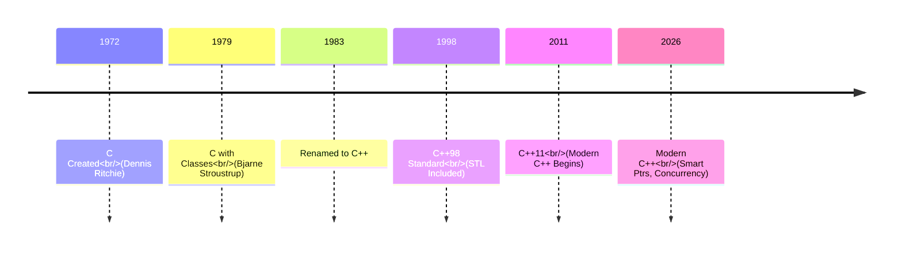

import { Aside, Badge, Card, CardGrid, Code, Tabs, TabItem } from '@astrojs/starlight/components';

## 🔍 C vs C++ — The Complete Guide

> **C is a scalpel: precise, minimal, and close to the hardware. C++ is C + the tools to build skyscrapers with that scalpel. It remains zero-cost, but adds the abstraction layers needed for large-scale software engineering.**

---

## 🏛️ What is C?

> C is a procedural(A program is written as a sequence of functions that execute step-by-step instructions.), structured, middle-level programming language developed by Dennis Ritchie in 1972 for system programming and operating systems. It provides low-level memory access, high performance, and portability.

> Write the Unix(operating system) in a language that is portable across hardware but still fast enough to replace assembly.

| Property                              | C                                                       | Meaning / Explanation                                                                                                                                                                 |
| ------------------------------------- | ------------------------------------------------------- | ------------------------------------------------------------------------------------------------------------------------------------------------------------------------------------- |
| **Type**                              | Compiled, Procedural Language                           | C source code is converted directly into machine code by a compiler. It follows the procedural paradigm, meaning programs are organized into functions and step-by-step instructions. |
| **Memory Management**                 | Manual (`malloc`, `calloc`, `realloc`, `free`)          | Programmer controls memory allocation and deallocation manually. This gives high control and performance, but memory leaks and dangling pointers can occur if handled incorrectly.    |
| **Level of Abstraction**              | Low-Level / Middle-Level                                | C provides direct access to memory, pointers, and hardware while still offering high-level constructs like functions and loops. Often called “portable assembly language.”            |
| **Object-Oriented Programming (OOP)** | ❌ Not Supported Natively                                | C does not provide built-in concepts like classes, inheritance, polymorphism, or encapsulation. Programming is function-centric rather than object-centric.                           |
| **Runtime Overhead**                  | Extremely Low                                           | Very little hidden work is done by the language runtime. Minimal abstraction means programs execute close to hardware speed with high efficiency.                                     |
| **Execution Speed**                   | Very Fast                                               | Since C compiles directly to native machine instructions with minimal runtime features, it is widely used where performance is critical.                                              |
| **Portability**                       | Highly Portable                                         | C programs can run on many platforms with little modification because compilers exist for almost every operating system and processor architecture.                                   |
| **Hardware Access**                   | Excellent                                               | Supports pointers, direct memory manipulation, bitwise operations, and hardware-level programming, making it suitable for systems programming.                                        |
| **Standard Library**                  | Small and Lightweight                                   | Provides essential utilities for I/O, memory, strings, mathematics, and file handling without a large runtime ecosystem.                                                              |
| **Error Handling**                    | Manual                                                  | No built-in exception handling. Errors are usually handled using return values, error codes, or global variables like `errno`.                                                        |
| **Security/Safety**                   | Less Safe                                               | No automatic bounds checking, garbage collection, or memory safety mechanisms. Buffer overflows and memory corruption are common risks.                                               |
| **Primary Use Cases**                 | Operating Systems, Embedded Systems, Drivers, Compilers | Commonly used in low-level and performance-critical software such as kernels, firmware, device drivers, interpreters, databases, and networking systems.                              |
| **Learning Value**                    | Excellent for Fundamentals                              | Helps understand memory, CPU interaction, stack/heap, pointers, compilation, and how computers execute programs internally.                                                           |


C gave you **direct control over memory and hardware** with just enough abstraction to be portable.

<Aside type="tip">
**🔑 Key Insight**: C is essentially **portable assembly**. What you write maps almost 1:1 to machine instructions, giving you direct control over memory and hardware.
</Aside>

---

## 📈 Why Did C++ Come?

By the **late 1970s**, software was getting **bigger and harder to manage**. C couldn't solve the problems of large teams writing large programs: code became tangled, unmanageable, and hard to reuse.

**Bjarne Stroustrup** (also at Bell Labs) needed:
1. The **performance of C** (mandatory for systems code).
2. The **modeling power of Simula** (classes and objects).

Simula was too slow. C was too primitive. So in **1979**, he started building **"C with Classes"** — which became **C++** (name finalized in **1983**).

> C++ is an extension of C developed by Bjarne Stroustrup in 1985. It is a multi-paradigm(A paradigm is a style, approach, or way of programming.) programming language that supports procedural, object-oriented, and generic programming using features like classes, inheritance, polymorphism, and templates.


### 💻 The Problem C Couldn't Solve

```
❌ C Limitations
  - No built-in OOP
  - Manual memory (`malloc`/`free`)
  - No function overloading
  - No standard containers
  - No references
  - Error handling via return codes only
  - Large teams writing large programs
    → code became tangled, unmanageable
    → no way to model real-world entities
    → no way to enforce who can touch what
    → reusing code was copy-paste
```
```
✅ C++ Solutions
  - Classes, Inheritance, Polymorphism
  - RAII, Constructors/Destructors
  - Same name, different params
  - STL (`vector`, `map`, etc.)
  - Reference variables (`&`)
  - Exceptions (`try`/`catch`)
```

### Memory Management: The RAII Revolution

<Code lang="c" title="C Style: Manual & Error-Prone" code={`
void c_style() {
    int* arr = (int*)malloc(10 * sizeof(int));
    if (arr == NULL) return; // Must check!
    
    // ... use arr ...
    
    free(arr); // ⚠️ Forget this = Memory Leak
}`} />

<Code lang="cpp" title="C++ Style: Automatic & Safe (RAII)" code={`
#include <vector>

void cpp_style() {
    std::vector<int> arr(10); // Constructor allocates
    
    // ... use arr ...
    
} // ✅ Destructor automatically frees memory
`} />

<Aside type="note">
**🎯 Interview Point**: **RAII** (Resource Acquisition Is Initialization) is a core C++ philosophy where resource lifetime is tied to object lifetime. C lacks this entirely.
</Aside>

---

## 🧬 Architecture: The Evolution Timeline


```text
title Language Evolution

1972                              1985                    2026
  │                                 │                       │
  ▼                                 ▼                       ▼
+-----------------+         +---------------+         +---------------+
|   C             |──────▶ |   C++ (98)    | ──────▶ | Modern C++    |
|                 |         |  + Classes    |         | + Smart Ptr   |
| Procedural      |         |  + OOP        |         | + STL         |
| Manual Memory   |         |  + RAII       |         | + Concurrency |
+-----------------+         +---------------+         +---------------+
      ⬆️ Fast, Close to Metal    ⬆️ Abstract, Safe, Expressive
```


C++ added layer upon layer to C, but kept the core promise: **Zero-Cost Abstractions**(Easy code for humans + Same performance as low-level code).
## 🧬 What C++ Added on Top of C

```
C  ──────────────────────────────────────────────────────►
     │
     │  Bjarne adds layer by layer
     ▼
C++ = C  +  Classes
          +  Inheritance
          +  Operator Overloading
          +  References
          +  Templates
          +  Exceptions
          +  Namespaces
          +  RAII
          +  STL
          +  Move Semantics (C++11)
          +  Concurrency (C++11)
          +  Concepts (C++20)
          +  Coroutines (C++20)
```


---

## ⚖️ C vs C++ — Direct Comparison

| Dimension | C | C++ |
| :--- | :--- | :--- |
| **Paradigm** | Procedural only | Multi-paradigm (Proc + OOP + Generic + Functional) |
| **Memory** | `malloc` / `free` | `new`/`delete` + Smart Pointers + RAII |
| **I/O** | `printf` / `scanf` | `cin` / `cout` + Streams |
| **Type Safety** | Weak (implicit casts) | Stronger (but not perfect) |
| **Abstraction Cost** | Zero | **Zero** (Core design goal) |
| **Error Handling** | Return codes, `errno` | Exceptions + `std::expected` (C++23) |
| **Standard Library** | Small (`stdio`, `string.h`) | Huge (STL, Algorithms, Filesystem) |
| **Compilation** | Fast | Slower (Templates are expensive) |
| **Binary Size** | Small | Larger (can be controlled) |

---

## 🤝 Key Relationship — Is C++ a Superset of C?

> **Common Misconception**: "Yes, all C code runs as C++."  
> **Reality**: C++ is *mostly* compatible, but **not a true superset**.

| Feature | C Behavior | C++ Behavior |
| :--- | :--- | :--- |
| `void*` to `T*` | ✅ Implicit cast allowed | ❌ Explicit cast required |
| Variable-Length Arrays | ✅ Standard (C99) | ❌ Not Standard |
| `struct Tag` usage | Must write `struct Tag var` | Can write `Tag var` |
| `//` Comments | C99+ only | Always supported |
| `bool` | Via `stdbool.h` | Built-in keyword |
| Name Mangling | None | Yes (supports overloading) |

<Code lang="cpp" title="Example: Function Overloading (Compile-time Polymorphism)" code={`
// C: Different names for different types
int add_int(int a, int b) { return a + b; }
float add_float(float a, float b) { return a + b; }

// C++: Same name, compiler picks the right one
int add(int a, int b) { return a + b; }
float add(float a, float b) { return a + b; } // ✅ Overloading
`} />

---

## 🧠 The Zero-Cost Abstraction Principle

This is **Bjarne's core promise** and what makes C++ unique among high-level languages:

> *"What you don't use, you don't pay for. What you do use, you couldn't write better by hand."* — Bjarne Stroustrup

| Language | Abstraction Cost |
| :--- | :--- |
| **Python** | Heavy (Interpreter, GC, Boxing) |
| **Java** | Medium (JVM, GC, Vtables) |
| **C++** | **Zero** (Templates resolved at compile time, RAII has no runtime cost) |
| **C** | N/A (No abstractions to begin with) |

---

## 🏭 Where Each Is Used Today

<Tabs>
  <TabItem label="Use C When..." icon="cpu">
    - **OS Kernels**: Linux, Windows Kernel
    - **Embedded**: Microcontrollers with tiny memory
    - **Device Drivers**: Direct hardware interaction
    - **Legacy Systems**: SQLite, PostgreSQL core
  </TabItem>
  
  <TabItem label="Use C++ When..." icon="code">
    - **Game Engines**: Unreal Engine, Unity Runtime
    - **Browsers**: Chrome (V8/Blink), Firefox
    - **Finance**: High-Frequency Trading (HFT)
    - **ML Infra**: TensorFlow, PyTorch Core
    - **Databases**: MySQL, RocksDB
  </TabItem>
</Tabs>

```text
Project Decision Flow:

Need Raw Speed Only? ──▶ Use C
Need Scale + Safety?   ──▶ Use C++
```

---

## 🔄 Historical Timeline

- **1972**: C created (Dennis Ritchie)
- **1978**: K&R C Book published
- **1979**: Bjarne starts "C with Classes"
- **1983**: Renamed to C++
- **1998**: **C++98** — First ISO Standard (STL included)
- **2011**: **C++11** — The Game Changer (Move semantics, lambdas, threads, smart pointers)
- **2020**: **C++20** — Concepts, Coroutines, Ranges, Modules
- **2023**: **C++23** — `std::expected`, improved ranges

---

## 🎯 Interview Cheat Sheet

<CardGrid>
  <Card title="Core Differences" icon="info">
    ```text
    Q: Difference between C and C++?
    A: Paradigm (Proc vs Multi), Memory (Manual vs RAII), 
       Library (Small vs STL), Error Handling (Codes vs Exceptions).

    Q: Can C++ run C code?
    A: Mostly yes (backward compatible), but style differs. 
       Not a strict superset (e.g., void* casting).
    ```
  </Card>
  
  <Card title="Key Concepts" icon="bolt">
    ```text
    Q: What is RAII?
    A: Resource management via object lifetime. 
       Resources acquired in constructor, released in destructor.

    Q: What are Zero-Cost Abstractions?
    A: Features like templates/inline that have no runtime 
       overhead compared to hand-written C code.

    Q: Why use STL?
    A: Pre-tested, efficient, generic containers/algorithms. 
       Saves time and reduces bugs.
    ```
  </Card>

  <Card title="Myths vs Reality" icon="shield">
    ```text
    Myth: "C++ is just C with classes."
    Reality: C++ has generics, lambdas, smart pointers, 
             concurrency, and a different safety philosophy.

    Myth: "C is faster than C++."
    Reality: Modern C++ with optimizations is equally fast. 
             Abstraction has zero cost when used correctly.
    ```
  </Card>
</CardGrid>

---

## 📌 One-Line Summary

```text
C  = Scalpel. Precise, minimal, close to hardware.
C++ = C + the tools to build skyscrapers with that scalpel.
      Still zero-cost. Still your responsibility. More powerful.
```

<Aside type="caution">
**⚠️ Common Misconceptions**:
1. **"Learn C first to learn C++"**: Not required for SDE roles. Learning Modern C++ directly is often better.
2. **"C++ is too complex"**: You only need the 20% (STL, RAII, OOP basics) that solves 80% of problems.
3. **"C++ is slow"**: Only if you misuse it. Proper C++ is as fast as C.
</Aside>