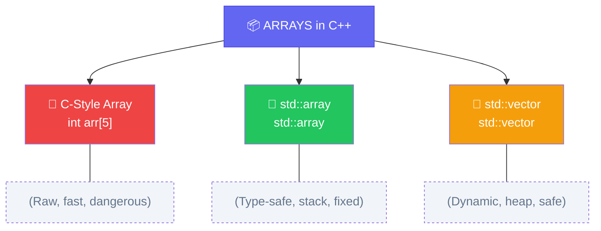

import { Aside, Badge, Card, CardGrid, Code, LinkCard } from '@astrojs/starlight/components';

## 📦 What is an Array in C++?

- An **Array** is an object with a **fixed-size container** that stores multiple values of the **same data type** under one name.
- An **Array** is a **contiguous block of memory** storing multiple values of the **same type** under one name.

### 🔑 Key Characteristics

| Feature | C-Style Array | `std::array` (C++11) | `std::vector` (Dynamic) |
|---------|--------------|---------------------|------------------------|
| **Type** | 🔵 Raw pointer decay | 🔵 Value type (stack) | 🔵 Class type (heap) |
| **Size** | 🔒 Fixed at compile-time | 🔒 Fixed at compile-time | 🔄 Dynamic at runtime |
| **Index** | 🔢 `0` to `N-1` (no bounds check) | 🔢 `0` to `N-1` (`.at()` checks) | 🔢 `0` to `size()-1` (`.at()` checks) |
| **Elements** | 🎯 Homogeneous only | 🎯 Homogeneous only | 🎯 Homogeneous only |

```cpp
// C-style array
int arr[] = {10, 20, 30};
// Index →   0    1    2
// Value →  10   20   30

// Modern C++ (C++11+)
#include <array>
std::array<int, 3> modern = {10, 20, 30};
```

---

## 🗂️ Types of Arrays in C++


```
Arrays in C++
│
├── C-style arrays          → int arr[5]
│   ├── Stack arrays        → int arr[5]        (fixed size, auto lifetime)
│   ├── Heap arrays         → new int[5]        (manual lifetime)
│   └── Global/static       → static int arr[5] (static lifetime)
│
├── Multidimensional        → int arr[3][4]
│
├── std::array (C++11)      → std::array<int,5>  (safe wrapper)
│
└── std::vector             → dynamic size (Phase 4 topic)
```

---

## 🏗 How Arrays Work Internally

<Code lang="cpp" title="Memory layout visualization" code={`
int arr[] = {10, 20, 30, 40, 50};

// STACK (if local) or DATA SEGMENT (if global/static)
// ┌─────────────────────────────────┐
// │ [10] [20] [30] [40] [50]        │
// │  0    1    2    3    4  ← index │ 
// │100  104  108  112  116 ← addr   │  
// └─────────────────────────────────┘
// each int = 4 bytes, CONTIGUOUS!
// arr decays to pointer: int* → address 100
// &arr[0]   &arr[0]+1   &arr[0]+2 ...
// 0x100     0x104       0x108        ← each int = 

> 🔑 **Contiguous** = elements are guaranteed adjacent in memory. No gaps. This is what makes arrays cache-friendly.
`} />

### 🔍 Why O(1) Random Access?

```cpp
// Address calculation (same as Java, but NO bounds check!)
address of arr[i] = base_address + (i × sizeof(T))
arr[3] = 100 + (3 × 4) = 112 ✅ — direct pointer arithmetic!
```

> ✔ C-style arrays **decay to pointers** in most contexts  
> ✔ Memory is **contiguous** — cache-friendly  
> ⚠️ **NO automatic bounds checking** — undefined behavior on OOB access!

<Aside type="danger">
```cpp
int arr[5] = {10, 20, 30, 40, 50};
std::cout << arr[10];  // 💥 Undefined Behavior! (no exception thrown)
// May print garbage, crash, or "work" — never rely on it!
```
✅ Use `.at()` with `std::array`/`std::vector` for bounds-checked access.
</Aside>

---

## 📌 Declaration Styles

<Code lang="cpp" title="✅ Valid C-style array declarations" code={`
int arr[5];              // Fixed size on stack (garbage values!)
int arr[5] = {};         // Zero-initialized
int arr[] = {1,2,3};     // Size inferred: arr[3]
int (*p)[5] = &arr;      // Pointer to array (rare, advanced)

// Multi-dimensional (all valid):
int a[3][4];             // Rectangular 2D array
int b[2][3][4];          // 3D array
int* c[5];               // Array of 5 int pointers (NOT 2D array!)

// 1. Declared with size, uninitialized
int arr[5];                        // ⚠️ garbage values (local scope)
static int arr[5];                 // ✅ zero-initialized (static storage)

// 2. Declared with size, fully initialized
int arr[5] = {10, 20, 30, 40, 50};

// 3. Declared with size, partially initialized
int arr[5] = {10, 20};            // remaining = {0, 0, 0}

// 4. Zero-initialize entire array
int arr[5] = {};                   // {0, 0, 0, 0, 0}
int arr[5] = {0};                  // same

// 5. Size deduced from initializer
int arr[] = {10, 20, 30};         // compiler deduces size = 3

// 6. C++11 uniform initialization
int arr[5]{10, 20, 30, 40, 50};   // no = needed
`} />

<Code lang="cpp" title="❌ Invalid declarations" code={`
int n = 5;
int arr[n];              // ❌ C++14: VLA not standard (GCC extension only)
int arr[];               // ❌ Error: size required (unless initialized)
int arr[5] = {1,2,3,4,5,6}; // ❌ Error: too many initializers
`} />

<Aside type="note">
**C++17 Feature**: `std::array` deduction guides let you write:
```cpp
std::array arr = {1, 2, 3};  // ✅ Deduces std::array<int, 3> (C++17)
```
</Aside>

---

## 1️⃣ Single-Dimensional Arrays

### Initialization & Default Values

| Declaration | Values |
|---|---|
| `int arr[5];` (local) | ❌ undefined — garbage |
| `int arr[5];` (global/static) | ✅ zero-initialized |
| `int arr[5] = {}` | ✅ all zeros |
| `int arr[5] = {1, 2}` | ✅ `{1, 2, 0, 0, 0}` |
| `int arr[] = {1,2,3}` | ✅ size = 3 deduced |

<Code lang="cpp" title="Initialization patterns" code={`
// C-style array on stack — UNINITIALIZED = garbage!
int uninit[3];                    // ⚠️ Values: ??? (undefined)

// Zero-initialization (C++ rule)
int zero[3] = {};                 // ✅ {0, 0, 0}
int partial[5] = {1, 2};          // ✅ {1, 2, 0, 0, 0}

// std::array (C++11) — safer, value type
#include <array>
std::array<int, 3> safe = {10, 20, 30};
std::array<int, 3> zero_arr{};    // ✅ {0, 0, 0}

// std::vector — dynamic, heap-allocated
#include <vector>
std::vector<int> dyn(5);          // ✅ {0,0,0,0,0}
std::vector<int> init{1,2,3};     // ✅ {1,2,3}
`} />

### Default Values Reference (C++ Rules)

| Context | Primitive (`int`) | Class Type (`std::string`) |
|---------|------------------|---------------------------|
| **Global/Static** | `0` | Default constructor (`""`) |
| **Local (uninit)** | ❌ Garbage value | ❌ Garbage (undefined) |
| **`{}` init** | `0` | Default constructor |
| **`std::vector(n)`** | `0` | Default constructor |

<Aside type="danger">
⚠️ **Local C-style arrays are NOT zero-initialized by default!**
```cpp
void foo() {
    int arr[5];  // ⚠️ Contains garbage — never read before write!
    // FIX: int arr[5] = {};  // or use std::array
}
```
</Aside>

---

## 2️⃣ Multi-Dimensional Arrays

### 🧠 C++ Supports Rectangular Arrays (Contiguous!)

C-style 2D arrays are **contiguous in row-major order**.

<Code lang="cpp" title="2D rectangular array" code={`
int matrix[2][3] = {
    {10, 20, 30},
    {40, 50, 60}
};
Memory (contiguous):
┌───┬───┬───┬───┬───┬───┐
│ 1 │ 2 │ 3 │ 4 │ 5 │ 6 │
└───┴───┴───┴───┴───┴───┘
 [0][0][0][1][0][2][1][0][1][1][1][2]
// Memory layout: [10][20][30][40][50][60] — contiguous!
// Access: matrix[row][col] = *(matrix + row*3 + col)
Row 0: m[0][0], m[0][1], m[0][2]
Row 1: m[1][0], m[1][1], m[1][2]

> 🔑 C++ uses **row-major** layout. Iterating row-by-row is cache-friendly. Column-by-column = cache miss every step.
`} />

```cpp
// ✅ Cache-friendly — sequential memory access
for (int i = 0; i < rows; i++)
    for (int j = 0; j < cols; j++)
        sum += m[i][j];

// ❌ Cache-hostile — jumps by entire row each step
for (int j = 0; j < cols; j++)
    for (int i = 0; i < rows; i++)
        sum += m[i][j];
```

```cpp
// Only first dimension can be omitted
void foo(int arr[][4], int rows);   // ✅
void foo(int arr[3][4], int rows);  // ✅
void foo(int** arr, int r, int c);  // ❌ int** ≠ int[][4]
                                    //    pointer-to-pointer ≠ 2D array

// Modern — use templates
template<int R, int C>
void foo(int (&arr)[R][C]);         // ✅ reference to array, no decay
```

### 🔄 Jagged Arrays via `std::vector` (NOT C-style!)

C-style arrays **cannot** have jagged rows. Use `vector<vector<T>>`:

<Code lang="cpp" title="Jagged 2D with std::vector" code={`
#include <vector>
std::vector<std::vector<int>> jagged(2);  // 2 rows
jagged[0] = {10, 20, 30};                  // Row 0: 3 elements
jagged[1] = {40, 50};                      // Row 1: 2 elements (different!)
`} />

### 📐 Dimension Rules

<Code lang="cpp" title="✅ Valid multi-dim creations" code={`
int a[3][4];                    // ✅ Rectangular C-style
std::array<std::array<int,4>,3> b;  // ✅ Rectangular std::array
std::vector<std::vector<int>> c;    // ✅ Jagged std::vector
int d[2][3][4];                 // ✅ 3D rectangular
`} />

<Code lang="cpp" title="❌ Invalid multi-dim creations" code={`
int n = 5;
int arr[n][10];                 // ❌ VLA not standard C++
int arr[][4] = {{1,2}};         // ❌ Error: first dim required (unless initialized)
int arr[2][] = {{1,2}};         // ❌ Error: inner dim required
int* arr[2][3];                 // ⚠️ Valid but: array of pointers, NOT 2D array!
`} />

<Aside type="tip">
**Rule**: For C-style multi-dim arrays, **all dimensions except the first** must be specified in function parameters:
```cpp
void process(int arr[][4], size_t rows);  // ✅ Second dim required
// void process(int arr[][], size_t rows); // ❌ Error
```
</Aside>

---

## ⚙ Important Properties

### 1️⃣ Getting Array Size

| Method | C-Style Array | `std::array` | `std::vector` |
|--------|--------------|--------------|---------------|
| **Compile-time size** | `sizeof(arr)/sizeof(arr[0])` | `arr.size()` | — |
| **Runtime size** | — | `arr.size()` | `vec.size()` |
| **Empty check** | `size == 0` | `arr.empty()` | `vec.empty()` |

<Code lang="cpp" title="Size examples" code={`
int c_arr[] = {1,2,3};
size_t size1 = sizeof(c_arr) / sizeof(c_arr[0]);  // ✅ 3

std::array<int, 3> std_arr = {1,2,3};
size_t size2 = std_arr.size();  // ✅ 3 (constexpr in C++11+)

std::vector<int> vec = {1,2,3};
size_t size3 = vec.size();      // ✅ 3 (runtime)

// ⚠️ Pointer decay trap:
void foo(int arr[]) {  // arr is actually int*
    // sizeof(arr) = sizeof(int*) = 8 (on 64-bit), NOT array size!
}
`} />

### 2️⃣ Indexing & Bounds Safety

```cpp
int arr[3] = {10, 20, 30};

arr[0];        // ✅ First element
arr[-1];       // 💥 Undefined Behavior (may crash or corrupt memory)
arr[5];        // 💥 Undefined Behavior

// ✅ Safe access with std::array/vector:
std::array<int,3> safe = {10,20,30};
safe.at(5);    // 💥 Throws std::out_of_range exception (catchable!)

int arr[5] = {10, 20, 30, 40, 50};

arr[0]      // → 10  (standard indexing)
arr[4]      // → 50  (last valid index)
arr[5]      // ❌ UB — out of bounds, no exception thrown
arr[-1]     // ❌ UB — no negative index check
*(arr + 2)  // → 30  (pointer arithmetic — same as arr[2])
2[arr]      // → 30  ✅ valid but insane — a[b] = *(a+b) = *(b+a) = b[a]
```

### 🔬 Type Safety & Decay

<Code lang="cpp" title="Type rules" code={`
int arr[3];
arr[0] = 10;        // ✅
arr[1] = 10.5;      // ⚠️ Warning: narrowing double→int (enable -Wconversion)
arr[2] = 'A';       // ✅ char→int promotion (ASCII 65)

// Array decay to pointer:
int* ptr = arr;     // ✅ arr decays to &arr[0]
ptr[0] = 99;        // ✅ Modifies original array!

// BUT: sizeof trap!
void printSize(int arr[]) {
    std::cout << sizeof(arr);  // Prints 8 (pointer size), NOT array size!
}
`} />

---

## ☣️ Array Decay — The Most Dangerous C++ Feature

When you use an array in most expressions, it **silently converts to a pointer to its first element**.

```
int arr[5]  →  decays to  →  int*  (pointing to arr[0])
```

```cpp
int arr[5] = {1, 2, 3, 4, 5};

// Decay happens here:
int* p = arr;           // arr decays to &arr[0]
void foo(int* p);
foo(arr);               // arr decays — foo receives pointer, not array

// Decay does NOT happen here:
sizeof(arr)             // → 20 (full array size — no decay)
&arr                    // → int(*)[5] (pointer to whole array — no decay)
int (&ref)[5] = arr;    // reference to array — no decay
```

### The sizeof Trap

```cpp
int arr[5] = {1, 2, 3, 4, 5};
sizeof(arr)             // ✅ → 20 (5 × 4 bytes)
sizeof(arr)/sizeof(arr[0])  // ✅ → 5 (classic size idiom)

void foo(int arr[5]) {
    sizeof(arr);        // ❌ → 8 (pointer size — arr already decayed)
    sizeof(arr)/sizeof(arr[0]); // ❌ → 2 on 64-bit — WRONG
}
```

```
┌──────────────────────────────────────────────────┐
│  int arr[5]  →  in function param  →  int* arr   │
│  sizeof = 20                          sizeof = 8  │
└──────────────────────────────────────────────────┘
```

> 🔴 **This is a production bug.** Loops that compute size inside a function get wrong sizes silently.

### Decay Chain

```
int arr[5]
    │
    │  used in expression (except sizeof, &, decltype, reference binding)
    ▼
int*   pointing to arr[0]
    │
    │  all pointer arithmetic works from here
    ▼
arr[i]  ==  *(arr + i)
```

---

## 📐 Pointer Arithmetic — How Indexing Really Works

```cpp
int arr[5] = {10, 20, 30, 40, 50};
int* p = arr;           // p → arr[0]  (address: 0x100)

p + 0   // → 0x100  (arr[0])
p + 1   // → 0x104  (arr[1]) — adds sizeof(int)=4, not 1
p + 2   // → 0x108  (arr[2])

*(p + 3) // → 40
```

```
arr[i]  compiles to:  *(arr + i)
         which is:    *(base_address + i × sizeof(element))
```

> 🔑 This is why arrays are O(1) random access — it's **a single multiply + add** at the hardware level.

---

## ⚡ C-Style vs `std::array` vs `std::vector`

| Feature | C-Style `int[N]` | `std::array<int,N>` | `std::vector<int>` |
|---------|-----------------|---------------------|-------------------|
| **Memory** | Stack/Data | Stack | Heap (dynamic) |
| **Size** | Fixed compile-time | Fixed compile-time | Dynamic runtime |
| **Bounds Check** | ❌ None (UB) | ✅ `.at()` throws | ✅ `.at()` throws |
| **Copy** | ❌ Shallow (pointer) | ✅ Deep copy | ✅ Deep copy |
| **Pass to Function** | Decays to pointer | Pass by value/ref | Pass by reference |
| **STL Algorithms** | ⚠️ Via pointers | ✅ Full support | ✅ Full support |
| **Use Case** | Embedded, perf-critical | Fixed-size, safe | Dynamic collections |

<Code lang="cpp" title="When to use what" code={`
// ✅ C-style: Performance-critical, embedded, FFI
void legacyAPI(int* data, size_t len);

// ✅ std::array: Fixed-size, want safety + STL
std::array<int, 100> buffer;
std::sort(buffer.begin(), buffer.end());

// ✅ std::vector: Unknown size, dynamic growth
std::vector<int> results;
for (int x : input) {
    if (x > 0) results.push_back(x);  // Auto-resizes!
}
`} />

---

## 📌 Array Initialization Shortcuts

### Aggregate Initialization (C++11 Uniform Init)

<Code lang="cpp" title="Modern initialization" code={`
// C-style with list-init
int a[] = {1, 2, 3};              // ✅ Size inferred
int b[5] = {1, 2};                // ✅ {1,2,0,0,0}

// std::array (C++11)
std::array<int, 3> c = {1, 2, 3}; // ✅
std::array<int, 3> d{4, 5, 6};    // ✅ Uniform init (preferred)

// std::vector
std::vector<int> e{7, 8, 9};      // ✅
std::vector<int> f(3, 10);        // ✅ {10,10,10} — count + value

// Multi-dimensional
std::array<std::array<int, 2>, 3> g = {{
    {1, 2}, {3, 4}, {5, 6}
}};  // ✅ Note double braces for nested aggregates
`} />

<Aside type="note">
**C++17 Feature**: Class Template Argument Deduction (CTAD):
```cpp
std::array arr = {1, 2, 3};  // ✅ Deduces std::array<int, 3>
std::vector vec{1, 2, 3};    // ✅ Deduces std::vector<int>
```
</Aside>

---

## 🧠 Array Assignment & Copy Rules

### 🔗 C-Style Arrays: NO Assignment!

<Code lang="cpp" title="C-style array assignment trap" code={`
int a[3] = {1,2,3};
int b[3];

b = a;  // ❌ Error: arrays are not assignable!

// ✅ FIX: Use std::copy or memcpy
#include <algorithm>
std::copy(std::begin(a), std::end(a), std::begin(b));

// ✅ Or use std::array (assignable!)
std::array<int,3> x = {1,2,3};
std::array<int,3> y;
y = x;  // ✅ Deep copy works!
`} />

### 🔗 Pointer Decay & Function Parameters

<Code lang="cpp" title="Array decay in functions" code={`
// These are ALL equivalent — arr decays to int*:
void foo1(int arr[10]);
void foo2(int arr[]);
void foo3(int* arr);

// ✅ Modern C++: Pass by reference to preserve size!
void foo4(int (&arr)[10]);  // ✅ arr is reference to array[10]
void foo5(std::span<int> arr); // ✅ C++20: views, no decay, size preserved

// ✅ Best practice: Use iterators or std::span
template<typename T>
void process(T begin, T end);  // Generic algorithm style
`} />

<Aside type="danger">
**Decay Trap**: Passing C-style array to function loses size info:
```cpp
void print(int arr[]) {
    // sizeof(arr) = pointer size, NOT array size!
    // ❌ Cannot determine length — must pass size separately!
}
```
✅ Prefer `std::span<int>` (C++20) or `std::array`/`std::vector` references.
</Aside>

---

## 🔄 Array Traversal Patterns

<Code lang="cpp" title="Four ways to iterate" code={`
#include <array>
#include <vector>
#include <iostream>

std::array<int, 5> arr = {10, 20, 30, 40, 50};

// Way 1 — Classic indexed loop
for (size_t i = 0; i < arr.size(); ++i) {
    std::cout << arr[i] << " ";
}

// Way 2 — Range-based for (C++11) — preferred for read-only
for (int val : arr) {
    std::cout << val << " ";
}

// Way 3 — Range-based with reference (for modification)
for (int& val : arr) {
    val *= 2;  // Modifies original
}

// Way 4 — STL algorithms (most expressive)
#include <algorithm>
std::for_each(arr.begin(), arr.end(), [](int v){ 
    std::cout << v << " "; 
});
`} />

<Aside type="tip">
**For-each loop** is cleaner and avoids off-by-one errors, but you lose index access. Use classic `for` or `std::enumerate` (C++23) when you need the index.
</Aside>

---

## 🚨 Common Undefined Behaviors & Errors

<CardGrid>
  <Card title="UB: Out-of-Bounds Access" icon="error">
    ```cpp
    int arr[3] = {1,2,3};
    std::cout << arr[10];  // 💥 Undefined Behavior!
    // May print garbage, crash, or "work" — never rely on it!
    ```
    **Cause**: No bounds checking in C-style arrays  
    **Fix**: Use `.at()` with `std::array`/`std::vector`, or add manual checks.
  </Card>
  
  <Card title="Error: Variable Length Array (VLA)" icon="error">
    ```cpp
    int n = 5;
    int arr[n];  // ❌ Not standard C++ (GCC extension only)
    ```
    **Cause**: C++ requires compile-time constant size for C-style arrays  
    **Fix**: Use `std::vector<int> arr(n);` for dynamic size.
  </Card>
  
  <Card title="UB: Uninitialized Local Array" icon="error">
    ```cpp
    void foo() {
        int arr[5];  // ⚠️ Contains garbage!
        std::cout << arr[0];  // 💥 Undefined value
    }
    ```
    **Cause**: Local primitives not auto-initialized  
    **Fix**: `int arr[5] = {};` or use `std::array<int,5>{};`
  </Card>

  <Card title="Trap: sizeof on Decayed Array" icon="error">
    ```cpp
    void printSize(int arr[]) {
        std::cout << sizeof(arr);  // Prints 8 (pointer), NOT array size!
    }
    ```
    **Cause**: Array parameters decay to pointers  
    **Fix**: Pass by reference `int (&arr)[N]` or use `std::span`.
  </Card>
</CardGrid>

---

## 🔥 C++ Interview Traps

<CardGrid>
  <Card title="Trap 1 — Array vs Pointer Confusion" icon="error">
    ```cpp
    int arr[5] = {1,2,3,4,5};
    int* ptr = arr;  // ✅ arr decays to pointer
    
    sizeof(arr);  // 20 (5×4 bytes)
    sizeof(ptr);  // 8 (pointer size on 64-bit)
    
    // In function parameters, they're identical!
    void foo(int arr[5]);  // Actually: void foo(int* arr);
    ```
  </Card>
  
  <Card title="Trap 2 — Multi-dim Array Decay" icon="error">
    ```cpp
    int matrix[3][4];
    // matrix decays to: int (*)[4] (pointer to array of 4 ints)
    // NOT int** — common mistake!
    
    void process(int** p);      // ❌ Won't work with matrix
    void process(int (*p)[4]);  // ✅ Correct signature
    ```
  </Card>
  
  <Card title="Trap 3 — Returning Local Array" icon="error">
    ```cpp
    int* getArray() {
        int arr[5] = {1,2,3,4,5};
        return arr;  // 💥 UB: returning address of local stack array!
    }
    // FIX: Return std::array, std::vector, or use dynamic allocation
    std::array<int,5> getArray() { return {1,2,3,4,5}; }  // ✅
    ```
  </Card>
  
  <Card title="Trap 4 — String Literal vs Char Array" icon="error">
    ```cpp
    char a[] = "hello";   // ✅ Mutable array: {'h','e','l','l','o','\0'}
    char* b = "hello";    // ⚠️ Points to read-only memory (const char[6])
    b[0] = 'H';           // 💥 Undefined Behavior (may crash)
    
    // FIX: Use const char* for literals
    const char* c = "hello";  // ✅ Safe, read-only
    ```
  </Card>
</CardGrid>

---

## 📌 DSA Connection

| Type | DSA Use Case | C++ Recommendation |
|------|-------------|-------------------|
| `int[]` / `std::array` | Frequency arrays, prefix sums, DP tables | ✅ `std::array` for safety |
| `bool[]` / `std::vector<bool>` | Visited flags, sieve of Eratosthenes | ⚠️ `vector<bool>` is bit-packed — use `vector<char>` if needed |
| `char[]` / `std::string` | In-place string manipulation | ✅ `std::string` (mutable since C++11) |
| `int[][]` / `vector<vector<int>>` | Matrices, graph adjacency, 2D DP | ✅ `vector<vector<int>>` for jagged, `array<array<>>` for fixed |
| `std::vector` | Dynamic collections, sliding window, BFS queues | ✅ Default choice for most DSA problems |

<Aside type="tip">
**Pro Tip**: In competitive programming, prefer `std::vector` over C-style arrays — safer, easier to pass/return, and STL algorithms work out-of-the-box. Use `std::array` only when size is fixed and performance is critical.
</Aside>

<Code lang="cpp" title="Frequency array pattern (C++17)" code={`
// Count lowercase letters: O(n) time, O(1) space
#include <array>
#include <string>

std::array<int, 26> countChars(const std::string& s) {
    std::array<int, 26> freq{};  // Zero-initialized
    for (char c : s) {
        if (c >= 'a' && c <= 'z') {
            freq[c - 'a']++;  // 'a'→0, 'b'→1, ... 'z'→25
        }
    }
    return freq;  // ✅ Return by value (efficient with RVO)
}
`} />

---

## 🧪 Quick Self-Test

<Code lang="cpp" title="Predict the output / behavior" code={`
#include <iostream>
#include <array>

int main() {
    // Q1: C-style array decay
    int a[] = {1, 2, 3};
    int* b = a;
    b[0] = 99;
    std::cout << a[0] << "\\n";  // ?
    
    // Q2: sizeof trap
    void foo(int arr[]) {
        std::cout << sizeof(arr) << "\\n";  // ? (on 64-bit)
    }
    foo(a);
    
    // Q3: std::array copy semantics
    std::array<int, 2> x = {10, 20};
    auto y = x;  // Copy or reference?
    y[0] = 99;
    std::cout << x[0] << "\\n";  // ?
    
    return 0;
}
`} />

<details>
<summary>✅ Click to reveal answers</summary>

```text
99        // a and b point to same memory (decay)
8         // sizeof(int*) on 64-bit system
10        // std::array copy is deep — x unchanged
```
</details>

---

## 🧰 Modern C++ Array Tools (C++11/17/20)

<CardGrid columns={2}>
  <Card title="std::span (C++20)" icon="code">
    Non-owning view over contiguous data — no decay, size preserved:
    ```cpp
    #include <span>
    void process(std::span<int> arr) {
        // arr.size() works! No decay to pointer.
        for (int& x : arr) x *= 2;
    }
    int c_arr[5] = {1,2,3,4,5};
    process(c_arr);  // ✅ Works with C-style array!
    ```
  </Card>
  
  <Card title="std::to_array (C++20)" icon="code">
    Convert C-style array to std::array safely:
    ```cpp
    #include <memory>
    int c_arr[] = {1,2,3};
    auto arr = std::to_array(c_arr);  // ✅ std::array<int,3>
    ```
  </Card>
  
  <Card title="std::vector::data()" icon="code">
    Get raw pointer for FFI / legacy APIs:
    ```cpp
    std::vector<int> vec = {1,2,3};
    legacyAPI(vec.data(), vec.size());  // ✅ Safe, contiguous guarantee
    ```
  </Card>
  
  <Card title="Constexpr Arrays (C++14+)" icon="code">
    Compile-time computation with arrays:
    ```cpp
    constexpr std::array<int, 5> fib = []{
        std::array<int,5> a{};
        a[0]=1; a[1]=1;
        for(int i=2;i<5;++i) a[i]=a[i-1]+a[i-2];
        return a;
    }();  // ✅ Computed at compile-time!
    ```
  </Card>
</CardGrid>

---

## 🏗️ Stack vs Heap Arrays

```cpp
// Stack array — automatic lifetime
int stack_arr[5];           // lives until scope ends
                            // size MUST be compile-time constant

// Heap array — manual lifetime
int* heap_arr = new int[5]; // lives until you delete it
delete[] heap_arr;          // ← MUST use delete[], not delete

// Heap, zero-initialized
int* heap_arr = new int[5]();   // () → zero-init
int* heap_arr = new int[5]{};   // {} → zero-init (C++11)
```

### Stack vs Heap Comparison

| | Stack Array | Heap Array |
|---|---|---|
| Size | Compile-time constant | Runtime determined |
| Lifetime | Automatic (scope) | Manual (delete[]) |
| Speed | ✅ Faster (no alloc overhead) | Slower |
| Max size | ~1–8 MB (stack limit) | Limited by RAM |
| Overflow risk | ✅ Stack overflow if too large | ❌ No overflow risk |
| Forget to free | N/A | Memory leak |

```cpp
int big[10'000'000];    // ❌ stack overflow — ~40MB on stack
                        //    default stack ≈ 1–8MB

int* big = new int[10'000'000]; // ✅ heap — 40MB fine
delete[] big;
```

---

## 🔐 `std::array` — The Safe Wrapper (C++11)

```cpp
#include <array>

std::array<int, 5> arr = {1, 2, 3, 4, 5};

arr[2]          // → 3  (no bounds check)
arr.at(2)       // → 3  (bounds check — throws std::out_of_range)
arr.size()      // → 5  (always correct — no decay)
arr.data()      // → int* to first element
arr.front()     // → 1
arr.back()      // → 5
```

### `std::array` vs C-style Array

| | `int arr[5]` | `std::array<int,5>` |
|---|---|---|
| Decays to pointer | ✅ yes — dangerous | ❌ no |
| `size()` method | ❌ | ✅ |
| Bounds checking | ❌ | ✅ via `.at()` |
| Copyable/assignable | ❌ | ✅ |
| Works with STL algorithms | ❌ directly | ✅ |
| Range-based for | ✅ | ✅ |
| Zero runtime overhead | ✅ | ✅ |
| Stack allocated | ✅ | ✅ |

```cpp
// std::array is a zero-cost abstraction
// This:
std::array<int,5> a = {1,2,3,4,5};
// Compiles to IDENTICAL machine code as:
int a[5] = {1,2,3,4,5};
```

> 🔑 **Always prefer `std::array` over C-style arrays** in new code. Zero overhead, safer.

---

## 🔬 Under the Hood

### How `arr[i]` Compiles

```cpp
int arr[5] = {1, 2, 3, 4, 5};
int x = arr[3];
```

```asm
; x86-64 assembly
; arr is at [rbp-20]
mov eax, DWORD PTR [rbp-20 + 3*4]   ; base + index × sizeof(int)
mov [rbp-4], eax                      ; store into x
```

No function call. No bounds check. One memory load instruction.

### Stack Layout of `int arr[5]`

```
High address
┌─────────────┐  ← rbp (frame pointer)
│  saved rbp  │
├─────────────┤
│    arr[4]   │  rbp - 4
├─────────────┤
│    arr[3]   │  rbp - 8
├─────────────┤
│    arr[2]   │  rbp - 12
├─────────────┤
│    arr[1]   │  rbp - 16
├─────────────┤
│    arr[0]   │  rbp - 20  ← &arr[0]
└─────────────┘
Low address

arr decays to → rbp - 20
arr[i]        → *(rbp - 20 + i*4)
```

### Cache Line Behavior

```
Cache line = 64 bytes
int arr[16] = exactly 1 cache line (16 × 4 = 64 bytes)

Sequential access:
arr[0] → cache MISS  → loads entire cache line (arr[0]..arr[15])
arr[1] → cache HIT   ✅
arr[2] → cache HIT   ✅
...
arr[15]→ cache HIT   ✅

Random access or column-major traversal:
arr[0][0] → cache MISS → loads row 0
arr[1][0] → cache MISS → loads row 1 (row 0 evicted if cache full)
arr[2][0] → cache MISS → ...
```

## 🏭 Real-World Production Scenario

**Image processing at a game studio:**

```cpp
// ❌ Column-major traversal — cache hostile
// 4K image = 3840 × 2160 pixels
for (int x = 0; x < 3840; x++)          // column outer
    for (int y = 0; y < 2160; y++)       // row inner
        pixels[y][x] = process(pixels[y][x]);
// Each inner step jumps 3840 ints = 15360 bytes forward
// Cache miss every single access
// Benchmark: 450ms per frame

// ✅ Row-major traversal — cache friendly
for (int y = 0; y < 2160; y++)           // row outer
    for (int x = 0; x < 3840; x++)       // column inner
        pixels[y][x] = process(pixels[y][x]);
// Sequential memory — one cache miss loads 16 pixels
// Benchmark: 38ms per frame
// 12× speedup — same algorithm, just loop order changed
```

---

## 🎯 Interview Traps

**Trap 1:**
```cpp
int arr[5] = {1, 2, 3, 4, 5};
int* p = arr + 5;      // Valid or UB?
```
> **Valid** — pointing one-past-the-end is allowed by the standard. **Dereferencing** it is UB. This is how `end()` iterators work.

**Trap 2:**
```cpp
int arr[5];
delete arr;            // What's wrong?
```
> `arr` is a stack array — `delete` on a stack object = UB. Only `new` allocations are `delete`d.

**Trap 3:**
```cpp
int a[3][4];
int b[12];
// Are a and b laid out identically in memory?
```
> **Yes** — `a[3][4]` and `b[12]` are both 12 contiguous ints. `a[1][2]` = `b[1*4+2]` = `b[6]`. Multidimensional arrays are just syntactic sugar over flat arrays.

**Trap 4:**
```cpp
int arr[] = {1, 2, 3};
auto x = arr;          // What is x's type?
```
> `int*` — not `int[3]`. `auto` triggers decay. Use `auto& x = arr` or `int (&x)[3] = arr` to preserve array type.

---

## 📊 SDE Relevance

| Topic | Relevance |
|---|---|
| Array decay | ✅ MUST KNOW — source of most array bugs |
| `sizeof` trap in functions | ✅ MUST KNOW — silent wrong sizes |
| Row-major layout + cache | ✅ MUST KNOW — perf-critical loops |
| Stack size limit | ✅ MUST KNOW — stack overflow in prod |
| `new[]` must match `delete[]` | ✅ MUST KNOW — memory corruption |
| `std::array` preference | ✅ MUST KNOW — modern C++ |
| One-past-the-end pointer | ✅ MUST KNOW — iterator internals |
| Pointer arithmetic internals | ✅ MUST KNOW — DSA interviews |
| 2D array function params | 🟡 GOOD TO KNOW |
| VLA (variable length arrays) | 🔴 SKIP — not standard C++ |

## 🔗 Related Topics

<CardGrid columns={2}>
  <LinkCard
    title="C++ Pointers"
    href="/computer-languages/cpp/topics/pointers"
    description="Memory addresses, decay, arithmetic, smart pointers"
  />
  <LinkCard
    title="C++ STL Containers"
    href="/computer-languages/cpp/topics/stl-containers"
    description="vector, array, deque, list — when to use what"
  />
  <LinkCard
    title="C++ Memory Management"
    href="/computer-languages/cpp/topics/memory"
    description="Stack vs Heap, RAII, new/delete, smart pointers"
  />
  <LinkCard
    title="C++ Algorithms"
    href="/computer-languages/cpp/topics/algorithms"
    description="std::sort, std::transform, iterators, lambdas"
  />
</CardGrid>

---

## 🗂️ Uninitialized Arrays in C++ — 3 Levels

### Core Concept: No Garbage Collection!

C++ gives you **raw control** — and **raw responsibility**.

<Code lang="cpp" title="Declaration vs. Initialization" code={`
int* ptr;              // 1. Pointer declared (uninitialized → garbage address)
ptr = new int[5];      // 2. Heap allocation (must delete[] later!)

int arr[5];            // Stack array — declared but UNINITIALIZED (garbage values!)
int arr2[5] = {};      // ✅ Zero-initialized
`} />

| State | Meaning |
|-------|---------|
| **Uninitialized pointer** | Contains garbage address — dereferencing = 💥 UB |
| **Uninitialized stack array** | Contains garbage values — reading = 💥 UB |
| **Initialized with `{}`** | Zero-initialized (C++ value initialization rule) |

<Aside type="danger">
🔒 **C++ has NO automatic null/garbage protection**.  
If you don't initialize, you get **undefined behavior** — the compiler won't save you!
</Aside>

---

## 1️⃣ Global/Static Scope

Belongs to **data segment**. Zero-initialized by C++ standard.

<Code lang="cpp" title="Global/static array — safe default" code={`
int globalArr[5];  // ✅ Automatically zero-initialized: {0,0,0,0,0}

void show() {
    std::cout << globalArr[0];  // ✅ Prints 0
}

class Student {
public:
    static int marks[10];  // ✅ Zero-initialized at program start
};
int Student::marks[10];  // Definition required (C++ rule)
`} />

```text
Memory Layout:
DATA SEGMENT (BSS)
┌─────────────────┐
│ globalArr: [0,0,0,0,0] │
└─────────────────┘
✅ Zero-initialized by loader — safe to read
```

<Aside type="tip">
✅ **Global/static arrays are zero-initialized** — safe to read before write.  
⚠️ But: Still prefer explicit initialization for clarity!
</Aside>

---

## 2️⃣ Local Scope (Stack)

Belongs to **function/block**. Shortest lifetime — **NOT auto-initialized**.

<Code lang="cpp" title="Local array — dangerous if uninitialized" code={`
void calculate() {
    int marks[5];  // ⚠️ Contains GARBAGE — never read before write!
    
    // std::cout << marks[0];  // 💥 Undefined Behavior!
    
    // ✅ Safe patterns:
    int safe1[5] = {};                    // Zero-init
    std::array<int,5> safe2{};            // Zero-init, type-safe
    std::vector<int> safe3(5, 0);         // Zero-init, dynamic
}
`} />

```text
STACK MEMORY:
┌─────────────────┐
│ marks: [??,??,??,??,??] │ ← Whatever was on stack before!
└─────────────────┘
💥 Reading = Undefined Behavior — may crash, corrupt, or "work"
```

<Aside type="danger">
🔒 **Local arrays are NOT zero-initialized**.  
The compiler gives **no warning** — you must initialize explicitly!  
✅ Rule: **Always initialize local arrays** — `{}`, `= {}`, or `std::array{}`.
</Aside>

---

## 3️⃣ Dynamic Scope (Heap)

Allocated with `new[]` — **NOT auto-initialized** (unless `()` or `{}` used).

<Code lang="cpp" title="Heap array initialization" code={`
// ❌ Uninitialized heap array — garbage values!
int* raw = new int[5];  
// std::cout << raw[0];  // 💥 Undefined value

// ✅ Zero-initialize with ()
int* zero1 = new int[5]();      // {0,0,0,0,0}

// ✅ Value-initialize with {} (C++11)
int* zero2 = new int[5]{};      // {0,0,0,0,0}

// ✅ Modern C++: Prefer std::vector!
#include <vector>
std::vector<int> safe(5, 0);    // {0,0,0,0,0}, auto-cleanup

// ✅ Best: std::unique_ptr for ownership
#include <memory>
auto smart = std::make_unique<int[]>(5);  // Zero-initialized (C++14)
`} />

<Aside type="tip">
**RAII Rule**: Prefer `std::vector` or `std::unique_ptr<T[]>` over raw `new[]` — automatic cleanup, exception-safe, no memory leaks.
</Aside>

---

## 🆚 Comparison Table: Initialization Safety

| Scope | C-Style `int[N]` | `std::array<int,N>` | `std::vector<int>` |
|-------|-----------------|---------------------|-------------------|
| **Global/Static** | ✅ Zero-initialized | ✅ Zero-initialized | ✅ Zero-initialized |
| **Local (no init)** | ❌ Garbage (UB) | ❌ Garbage (UB) | ✅ Default constructor (0) |
| **Local `{}` init** | ✅ Zero-initialized | ✅ Zero-initialized | ✅ Zero-initialized |
| **Dynamic `new[]`** | ❌ Garbage | N/A (stack-only) | ✅ Via constructor |
| **Dynamic `new[]{}`** | ✅ Zero-initialized | N/A | ✅ Via constructor |

<Aside type="tip">
**Fail-Safe Principle**:  
- Use `std::array` for fixed-size, stack-safe arrays.  
- Use `std::vector` for dynamic size — it handles initialization, cleanup, and bounds-checking (via `.at()`).  
- Avoid raw C-style arrays in new code — they're error-prone and don't play nice with modern C++.
</Aside>

---

## 🎯 Interview Cheat Sheet

<CardGrid>
  <Card title="Q: C-style array vs std::array?" icon="information">
    ```cpp
    // C-style:
    int c[5];                    // Decays to pointer, no .size(), no copy
    // std::array (C++11):
    std::array<int,5> a{};       // Value type, .size(), assignable, STL-compatible
    
    // Prefer std::array unless: 
    // • Interfacing with C API 
    // • Extreme perf constraints (rare)
    ```
  </Card>

  <Card title="Q: How to get array size in function?" icon="error">
    ```cpp
    // ❌ Broken:
    void foo(int arr[]) { 
        sizeof(arr); // = pointer size!
    }
    
    // ✅ Solutions:
    void foo1(int (&arr)[10]);           // Reference to array (size fixed)
    template<size_t N> void foo2(int (&arr)[N]); // Generic (size deduced)
    void foo3(std::span<int> arr);       // C++20: non-owning view
    void foo4(const std::vector<int>&);  // Dynamic: pass by ref
    ```
  </Card>

  <Card title="Q: Why no bounds checking by default?" icon="backspace">
    **Philosophy**: *"You don't pay for what you don't use"* (C++ zero-overhead principle).  
    - Bounds checking adds runtime cost — optional via `.at()`  
    - In performance-critical code (games, embedded), every cycle counts  
    - ✅ You choose safety vs speed: use `.at()` for debug, `[]` for release
  </Card>

  <Card title="Q: Jagged arrays in C++?" icon="information">
    ```cpp
    // ❌ C-style: NOT possible (all rows same size)
    // ✅ std::vector of vectors:
    std::vector<std::vector<int>> jagged;
    jagged.push_back({1,2,3});
    jagged.push_back({4,5});  // Different row lengths — OK!
    
    // ✅ Or array of vectors:
    std::array<std::vector<int>, 2> hybrid;
    ```
  </Card>
</CardGrid>

---

## 🔬 DSA Connection: Safe Array Patterns

<CardGrid>
  <Card title="Pattern: Bounds-Safe Access" icon="shield">
    Always guard array access in DSA code:
    ```cpp
    void process(const std::vector<int>& arr, size_t idx) {
        if (idx >= arr.size()) return;  // Guard first!
        // Safe to use arr[idx] or arr.at(idx)
    }
    ```
  </Card>

  <Card title="Pattern: 2D Grid Initialization" icon="approve-check">
    When building DP tables or adjacency matrices:
    ```cpp
    // ✅ Rectangular grid (fixed size)
    std::array<std::array<int, 100>, 100> dp{};  // Zero-init, stack
    
    // ✅ Jagged grid (dynamic rows)
    std::vector<std::vector<int>> graph(n);
    for (auto& row : graph) row.reserve(10);  // Pre-allocate if known
    ```
  </Card>

  <Card title="Pattern: Return Empty, Not Null" icon="information">
    Prefer returning empty containers over raw pointers:
    ```cpp
    // ❌ Raw pointer — caller must check nullptr
    int* findMatches(const std::string& s) { return nullptr; }
    
    // ✅ std::vector — caller can iterate safely
    std::vector<int> findMatches(const std::string& s) { 
        return {};  // Empty vector — safe to loop
    }
    ```
  </Card>
</CardGrid>

---

## 🧭 Quick-Revision Cheat Sheet

```text
✅ C-STYLE ARRAYS:
   Declaration: int arr[5];          // Stack, fixed size
   Init: int arr[5] = {};            // Zero-init
   Size: sizeof(arr)/sizeof(arr[0])  // Compile-time only!
   ⚠️ Decay to pointer in functions — lose size info!

✅ std::array (C++11):
   #include <array>
   std::array<int,5> a = {1,2,3};    // Fixed size, stack, value type
   a.size() → 5 (constexpr)          // ✅ Type-safe, no decay
   a.at(i) → bounds-checked          // ✅ Throws std::out_of_range

✅ std::vector (Dynamic):
   #include <vector>
   std::vector<int> v(5, 0);         // 5 zeros, heap-allocated
   v.push_back(x);                   // Auto-resize
   v.at(i) / v[i]                    // .at() checks, [] doesn't

⚠️ COMMON TRAPS:
   • Local arrays NOT zero-initialized → always use {}
   • sizeof(arr) in function = pointer size, not array size!
   • arr[10] on int[5] = Undefined Behavior (no exception!)
   • Returning local array address = dangling pointer 💥
   • int** ≠ int[N][M] — multi-dim decay is tricky!

🎯 DSA BEST PRACTICES:
   • Use std::vector for dynamic collections (BFS, sliding window)
   • Use std::array for fixed-size buffers (frequency arrays)
   • Prefer .at() during debugging, [] for perf-critical release
   • Pass by const ref: void foo(const std::vector<int>& v)
   • Use std::span (C++20) for non-owning views over contiguous data
```

> 🎯 **Interview Pro Tip**: When asked about arrays in C++, always mention:  
> 1. The **three array types** (C-style, `std::array`, `std::vector`) and when to use each  
> 2. **Array decay** and how it breaks `sizeof`/passing to functions  
> 3. **Initialization rules** (global=zero, local=garbage)  
> 4. **Bounds checking** tradeoffs (`[]` vs `.at()`)  
> 5. **Modern alternatives**: `std::span`, `std::vector::data()`, CTAD  
> This shows deep understanding of C++'s "zero-overhead" philosophy! 🚀

