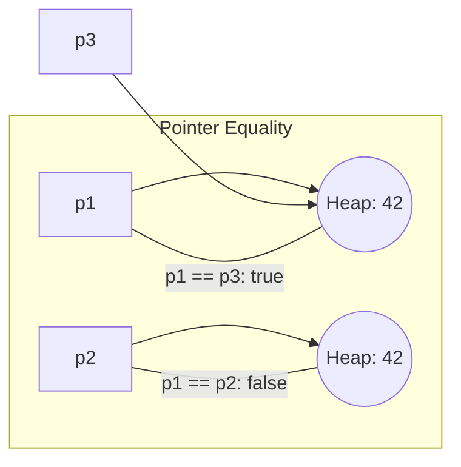

import { Tabs, TabItem, Aside, Badge, Card, CardGrid, Code } from '@astrojs/starlight/components';

## 4️⃣ Relational Operators in C++

```text
Relational Operators
│
├── Comparison Operators
│   ├── ==   equal to
│   ├── !=   not equal to
│   ├── >    greater than
│   ├── <    less than
│   ├── >=   greater than or equal to
│   └── <=   less than or equal to
│
├── C++20: Three-Way Comparison
│   └── <=>  "spaceship operator" — returns std::strong_ordering
│
└── Type Checking (C++ alternatives to instanceof)
    ├── dynamic_cast<T*>(ptr)  — runtime type check for pointers
    ├── typeid(expr)           — runtime type information
    └── requires / concepts    — compile-time type constraints (C++20)
```

<Code lang="cpp" title="Basic usage — always return bool" code={`
#include <iostream>

int main() {
    int a = 10, b = 20;
    
    std::cout << std::boolalpha;  // Print true/false instead of 1/0
    
    std::cout << (a == b) << '\\n';  // false
    std::cout << (a != b) << '\\n';  // true
    std::cout << (a >  b) << '\\n';  // false
    std::cout << (a <  b) << '\\n';  // true
    std::cout << (a >= b) << '\\n';  // false
    std::cout << (a <= b) << '\\n';  // true
    
    // All return bool — only valid in boolean context
    bool result = (a > b);      // ✅
    // int x = (a > b);         // ❌ Error: cannot convert bool to int (with -Werror)
    
    return 0;
}
`} />

### 🔑 Rule 1: Works on Arithmetic Types + Pointers (Not bool for Relational)

Relational operators work on **all arithmetic types** and **pointers**, but **not `bool`** for `> < >= <=`.

<Code lang="cpp" title="✅ Valid comparisons in C++" code={`
#include <iostream>

int main() {
    // Numeric primitives
    std::cout << (10 > 5) << '\\n';           // int → true
    std::cout << ('a' < 'b') << '\\n';        // char → true (97 < 98)
    std::cout << (3.14 >= 3.0) << '\\n';      // double → true
    std::cout << (10L <= 20L) << '\\n';       // long → true
    
    // Pointers: compare addresses (meaningful only within same array)
    int arr[3] = {1, 2, 3};
    int* p1 = &arr[0];
    int* p2 = &arr[1];
    std::cout << (p1 < p2) << '\\n';          // true (lower address < higher)
    
    // bool only works with equality operators (==, !=)
    std::cout << (true == false) << '\\n';    // false ✅
    std::cout << (true != false) << '\\n';    // true ✅
    
    // ❌ bool with relational operators:
    // std::cout << (true > false) << '\\n';  // ⚠️ Compiles but discouraged!
    // bool promotes to int: true→1, false→0, so 1 > 0 → true (surprising!)
    
    return 0;
}
`} />

<Aside type="caution">
**⚠️ C++ Gotcha**: `bool` *can* be used with `> < >= <=` because `bool` promotes to `int` (`true`→1, `false`→0).  
This compiles but is **strongly discouraged** — it's confusing and non-idiomatic.  
✅ **Rule**: Only use `==`/`!=` with `bool`; avoid relational operators on booleans.
</Aside>

### 🔑 Rule 2: Objects Require Operator Overloading

C++ relational operators **do not work on class types by default** — you must overload them.

<Code lang="cpp" title="❌ Default: object comparison fails" code={`
#include <string>

int main() {
    std::string s1 = "Alice";
    std::string s2 = "Bob";
    
    // ✅ std::string overloads ==, !=, <, >, etc. — works!
    std::cout << (s1 < s2) << '\\n';  // true (lexicographic)
    
    // ❌ Custom class without overloads:
    struct Person { std::string name; };
    Person p1{"Alice"}, p2{"Bob"};
    
    // std::cout << (p1 < p2);  // ❌ Error: no operator< matches these operands
    
    // ✅ Fix: overload operator< or use std::tie for lexicographic comparison
    // Or C++20: use <=> (spaceship operator) for automatic generation
    return 0;
}
`} />

<Code lang="cpp" title="✅ Overloading comparison for custom types" code={`
#include <string>
#include <iostream>

struct Person {
    std::string name;
    int age;
    
    // Manual overload (pre-C++20)
    bool operator<(const Person& other) const {
        return name < other.name;  // Lexicographic by name
    }
    
    // C++20: Spaceship operator — generates all comparisons!
    // auto operator<=>(const Person&) const = default;  // Lexicographic by members
};

int main() {
    Person p1{"Alice", 30}, p2{"Bob", 25};
    std::cout << (p1 < p2) << '\\n';  // true ✅
    return 0;
}
`} />

### 🔑 Rule 3: No Chaining — Use Logical Operators

Relational expressions return `bool`, which cannot be chained with more relational operators.

<Code lang="cpp" title="❌ Chained relational operators fail" code={`
// std::cout << (10 > 20 > 30);  
// Step 1: 10 > 20 → false (bool)
// Step 2: false > 30 → bool promotes to int: 0 > 30 → false (compiles but wrong!)

// ✅ Fix: Use logical operators to combine conditions:
std::cout << ((10 > 20) && (20 > 30)) << '\\n';  // false && false → false
std::cout << ((10 < 20) && (20 < 30)) << '\\n';  // true && true → true

// ✅ C++20: Chained comparisons with <=> and std::is_lt/etc.
#include <compare>
if (std::is_lt(10, 20) && std::is_lt(20, 30)) { /* ... */ }
`} />

<Aside type="danger">
**🔥 Silent Bug Alert**: `false > 30` compiles because `bool` promotes to `int`!  
```cpp
bool b = false;  // 0
std::cout << (b > 30);  // 0 > 30 → false (compiles, but likely unintended!)
```
✅ **Enable warnings**: `-Wbool-compare -Werror` to catch these logic errors.
</Aside>

---

## 5️⃣ Equality Operators — C++ Deep Dive

```text
==   equal to
!=   not equal to
```

### 🔬 Primitive Comparison: Compares VALUES (Same as Java)

<Code lang="cpp" title="Equality works on all primitives including bool" code={`
#include <iostream>

int main() {
    // Numeric primitives
    std::cout << (10 == 20) << '\\n';            // false
    std::cout << ('a' == 'b') << '\\n';          // false
    std::cout << ('a' == 97.0) << '\\n';         // true (97 == 97.0 after promotion)
    std::cout << (3.14 != 3.141) << '\\n';       // true
    
    // bool works with == and !=
    std::cout << (false == false) << '\\n';      // true
    std::cout << (true != false) << '\\n';       // true
    
    return 0;
}
`} />

<Aside type="note">
**Type Promotion Applies**: `'a' == 97.0` → `char` promoted to `int` (97), then to `double` (97.0) → comparison succeeds. Same as Java!
</Aside>

### 🔬 Floating-Point Equality — The Universal Trap

```cpp
// ⚠️ Never compare floats/doubles with == for "almost equal" values!
double a = 0.1 + 0.1 + 0.1;
double b = 0.3;
std::cout << (a == b) << '\\n';  // ❌ Likely false! (precision errors)

// ✅ Safe pattern: epsilon comparison
#include <cmath>
bool almost_equal(double x, double y, double epsilon = 1e-9) {
    return std::abs(x - y) < epsilon;
}
std::cout << almost_equal(a, b) << '\\n';  // ✅ true

// ✅ C++20: std::floating_point concepts + custom comparators
// ✅ C++23: std::expected for error-aware numeric operations
```

<Aside type="danger">
**Interview Gold**: `0.1 + 0.2 == 0.3` is **false** in C++ (and Java, and Python) due to IEEE 754 binary representation.  
✅ Always use epsilon comparison for floating-point equality checks.
</Aside>

### 🔬 Reference/Pointer Comparison: Compares ADDRESSES (Identity)

For pointers, `==` checks if two pointers point to the **same memory location**.

<Code lang="cpp" title="Pointer equality vs. value equality" code={`
#include <iostream>
#include <memory>

int main() {
    // Raw pointers: == compares addresses
    int* p1 = new int(42);
    int* p2 = new int(42);
    int* p3 = p1;  // p3 aliases p1
    
    std::cout << (p1 == p2) << '\\n';  // false! (different heap allocations)
    std::cout << (p1 == p3) << '\\n';  // true ✅ (same address)
    std::cout << (*p1 == *p2) << '\\n';  // true ✅ (same value: 42)
    
    delete p1; delete p2;  // Don't delete p3 — it's alias of p1!
    
    // Smart pointers: == compares managed object identity
    auto sp1 = std::make_unique<int>(42);
    auto sp2 = std::make_unique<int>(42);
    // std::cout << (sp1 == sp2);  // ❌ Error: unique_ptr doesn't support ==
    
    // shared_ptr supports == (compares control block, not value)
    auto sh1 = std::make_shared<int>(42);
    auto sh2 = std::make_shared<int>(42);
    auto sh3 = sh1;  // shares ownership
    std::cout << (sh1 == sh2) << '\\n';  // false (different control blocks)
    std::cout << (sh1 == sh3) << '\\n';  // true ✅ (same control block)
    
    return 0;
}
`} />



> 🔑 `==` on pointers = **address comparison**. Two pointers with identical values are `==` only if they point to the **same location**. Use `*p1 == *p2` for value comparison.

### 🔑 Rule: Type Compatibility for Pointer `==`

To compare two pointers with `==`, their types must be **convertible** (same type, or one convertible to the other via inheritance).

<Code lang="cpp" title="✅ Valid: Compatible pointer types" code={`
class Base {};
class Derived : public Base {};

Derived* d = new Derived();
Base* b = new Base();
void* v = d;  // Any pointer → void*

std::cout << (d == static_cast<Derived*>(v)) << '\\n';  // true ✅
std::cout << (b == dynamic_cast<Base*>(d)) << '\\n';    // true ✅ (if d points to Base subobject)

delete d; delete b;
`} />

<Code lang="cpp" title="❌ Invalid: Incompatible pointer types" code={`
class Dog {};
class Cat {};

Dog* dog = new Dog();
Cat* cat = new Cat();

// std::cout << (dog == cat);  // ❌ Error: no operator== matches Dog* and Cat*
// No inheritance or conversion relationship → compiler rejects

delete dog; delete cat;
`} />

<Aside type="tip">
**Compiler Check**: The `==` operator verifies pointer type compatibility **at compile time**. If two pointer types are unrelated and not convertible, the code won't compile — preventing runtime errors.
</Aside>

---

## 🎯 nullptr Comparison Behavior — Same as Java's null

<CardGrid>
  <Card title="Pointer vs. nullptr" icon="information">
```cpp
    // Any pointer compared to nullptr:
    int* p = new int(42);
    std::cout << (p == nullptr) << '\\n';  // false ✅
    
    // nullptr pointer compared to nullptr:
    int* q = nullptr;
    std::cout << (q == nullptr) << '\\n';  // true ✅
    
    // nullptr literal compared to nullptr:
    std::cout << (nullptr == nullptr) << '\\n';  // true ✅
```
    **Rule**: `p == nullptr` is **always safe** and returns `true` only if `p` holds no address.
  </Card>
  
  <Card title="Safe null checking pattern" icon="shield">
```cpp
    int* p = nullptr;
    
    // ❌ Dangerous: dereference nullptr → undefined behavior (crash)
    // if (*p == 42) { ... }  // 💥 Segmentation fault!
    
    // ✅ Safe pattern 1: nullptr check first
    if (p != nullptr && *p == 42) { ... }
    
    // ✅ Modern C++: implicit bool conversion (idiomatic)
    if (p && *p == 42) { ... }  // p converts to false if nullptr
    
    // ✅ C++17: std::optional for nullable values (type-safe alternative)
    #include <optional>
    std::optional<int> opt;
    if (opt && *opt == 42) { ... }  // No raw pointers!
```
    **Interview Tip**: Prefer `std::optional<T>` over raw pointers for nullable values — it's type-safe and self-documenting.
  </Card>
</CardGrid>

---

## ⚠️ std::string Equality — C++ vs Java Difference!

### 🆚 Key Difference: `std::string == std::string` Compares CONTENT

Unlike Java, C++'s `std::string` **overloads `==` to compare content**, not addresses!

<Code lang="cpp" title="std::string equality compares values, not pointers" code={`
#include <iostream>
#include <string>

int main() {
    // Case 1: Two std::string objects with same content
    std::string a = "C++";
    std::string b = "C++";
    std::cout << (a == b) << '\\n';        // true! ✅ (content comparison)
    std::cout << (&a == &b) << '\\n';      // false (different objects)
    
    // Case 2: std::string vs C-string literal
    std::string c = "C++";
    const char* literal = "C++";
    std::cout << (c == literal) << '\\n';  // true ✅ (std::string overloads == for const char*)
    
    // Case 3: C-string vs C-string — compares ADDRESSES!
    const char* s1 = "C++";
    const char* s2 = "C++";
    std::cout << (s1 == s2) << '\\n';      // ⚠️ Implementation-defined!
    // May be true (compiler pools literals) or false (different addresses)
    
    return 0;
}
`} />

```mermaid
flowchart TD
    subgraph "std::string (C++)"
    a["std::string a = \"C++\""] --> A[Heap object with content "C++"]
    b["std::string b = \"C++\""] --> B[Another heap object with "C++"]
    A ---|a == b: true (content)| B
    end
    
    subgraph "C-string literals"
    s1["const char* s1 = \"C++\""] --> Pool1[Implementation-defined pooling]
    s2["const char* s2 = \"C++\""] --> Pool2[May be same or different]
    Pool1 ---|s1 == s2: ?| Pool2
    end
```

<Aside type="danger">
**🔥 Critical Distinction**:  
- `std::string a, b; a == b` → ✅ **Content comparison** (like Java's `.equals()`)  
- `const char* s1, s2; s1 == s2` → ⚠️ **Address comparison** (like Java's `==` on Strings)  

✅ **Rule**: Always use `std::string` for string handling in modern C++. Avoid raw `const char*` comparisons with `==`.
</Aside>

---

## 🆚 Quick Comparison: `==` Behavior by Type — C++

<table>
  <thead>
    <tr>
      <th>Type</th>
      <th><code>==</code> Compares</th>
      <th>Example</th>
      <th>Result</th>
      <th>C++ Notes</th>
    </tr>
  </thead>
  <tbody>
    <tr>
      <td><code>int</code>, <code>double</code>, etc.</td>
      <td>Primitive values</td>
      <td><code>10 == 10.0</code></td>
      <td><code>true</code></td>
      <td>After usual arithmetic conversions</td>
    </tr>
    <tr>
      <td><code>bool</code></td>
      <td>true/false values</td>
      <td><code>true == !false</code></td>
      <td><code>true</code></td>
      <td>bool promotes to int in relational ops — avoid!</td>
    </tr>
    <tr>
      <td><code>char</code></td>
      <td>ASCII/execution charset values</td>
      <td><code>'a' == 97</code></td>
      <td><code>true</code></td>
      <td>char is integral type in C++</td>
    </tr>
    <tr>
      <td><code>std::string</code></td>
      <td><strong>Content</strong> (lexicographic)</td>
      <td><code>std::string("x") == "x"</code></td>
      <td><code>true</code></td>
      <td>✅ Overloaded to compare values — unlike Java!</td>
    </tr>
    <tr>
      <td><code>const char*</code></td>
      <td>Memory addresses</td>
      <td><code>"x" == "x"</code></td>
      <td>⚠️ Implementation-defined</td>
      <td>Compiler may pool literals — don't rely on it!</td>
    </tr>
    <tr>
      <td>Raw pointers</td>
      <td>Memory addresses</td>
      <td><code>p1 == p2</code></td>
      <td><code>true</code> if same address</td>
      <td>Meaningful only within same array or object</td>
    </tr>
    <tr>
      <td><code>std::shared_ptr</code></td>
      <td>Control block identity</td>
      <td><code>sp1 == sp2</code></td>
      <td><code>true</code> if same managed object</td>
      <td>Compares ownership, not value</td>
    </tr>
    <tr>
      <td>Any pointer vs <code>nullptr</code></td>
      <td>Nullity</td>
      <td><code>p == nullptr</code></td>
      <td><code>true</code> if p is null</td>
      <td>Type-safe null check (C++11+)</td>
    </tr>
  </tbody>
</table>

---

## 🎯 Interview Cheat Sheet — C++ Edition

<CardGrid>
  <Card title="Q: Can we use > with bool in C++?" icon="caution">
    **Technically YES, but DON'T** — `bool` promotes to `int` (`true`→1, `false`→0), so `true > false` → `1 > 0` → `true`.  
    ✅ **Best practice**: Only use `==`/`!=` with `bool`; avoid relational operators on booleans.
  </Card>
  
  <Card title="Q: What does `s1 == s2` check for std::string?" icon="approve-check">
    **Content equality** — whether `s1` and `s2` contain the same characters.  
    ✅ `std::string` overloads `==` to compare values (unlike Java's `==` on `String`).  
    ⚠️ But `const char* s1 == s2` compares addresses — avoid raw C-string comparisons!
  </Card>

  <Card title="Q: Why might `'C++' == 'C++'` be true or false?" icon="information">
    **Compiler literal pooling** is implementation-defined.  
    Some compilers pool identical string literals (same address → `true`), others don't.  
    ✅ **Rule**: Never rely on C-string literal identity — use `std::string` for reliable content comparison.
  </Card>

  <Card title="Q: Is `nullptr == nullptr` true?" icon="approve-check">
    **YES ✅** — `nullptr` is a typed null pointer constant (C++11), and all `nullptr` values compare equal.
  </Card>

  <Card title="Q: Can we compare unrelated pointer types with ==?" icon="error">
    **NO ❌** — compiler requires convertibility (same type, inheritance, or `void*`).  
    `Dog* == Cat*` → compile error. `Base* == Derived*` → compiles (via upcast).
  </Card>

  <Card title="Q: What is `'a' == 97.0` in C++?" icon="information">
    **`true`** — `char 'a'` (ASCII 97) is promoted to `int` 97, then to `double` 97.0 for comparison. Same as Java!
  </Card>

  <Card title="Q: What does C++20's <=> (spaceship operator) do?" icon="rocket">
    **Three-way comparison** — returns `std::strong_ordering`/`weak_ordering`/`partial_ordering`.  
    ```cpp
    auto result = a <=> b;
    if (result < 0) { /* a < b */ }
    else if (result == 0) { /* a == b */ }
    else { /* a > b */ }
    ```
    ✅ Can be `= default;` to auto-generate all comparisons for a class!
  </Card>
</CardGrid>

---

## 🧩 DSA & Practical Patterns — C++ Edition

<CardGrid>
  <Card title="Pattern: Safe String Comparison" icon="shield">
    Use `std::string` for reliable content comparison:
```cpp
    #include <string>
    
    // ✅ std::string == compares content:
    std::string userInput = get_input();
    if (userInput == "admin") { ... }  // Safe, clear, null not possible
    
    // ⚠️ Raw C-strings: use strcmp or convert to std::string
    const char* raw = get_cstr();
    if (raw && std::string(raw) == "admin") { ... }  // Convert first
    
    // ✅ C++20: std::string_view for zero-copy comparisons
    #include <string_view>
    bool is_admin(std::string_view input) {
        return input == "admin";  // Zero allocation, content comparison
    }
```
  </Card>
  
  <Card title="Pattern: Pointer Identity vs. Value Equality" icon="rocket">
    Use `==` on pointers only when you specifically need to check **same object**:
```cpp
    // Singleton pattern check:
    if (instance == nullptr) {  // Check if not initialized
        instance = std::make_unique<Singleton>();
    }
    
    // Cache identity check (avoid duplicate processing):
    if (cached_ptr == incoming_ptr) {  // Same object? Skip reprocessing
        return cached_result;
    }
    
    // ✅ For value equality: dereference or use .value() for optionals
    if (*cached_ptr == *incoming_ptr) { ... }  // Compare values
```
  </Card>

  <Card title="Pattern: Floating-Point Comparison in DSA" icon="backspace">
    Never use `==` for approximate floating-point values:
```cpp
    // ❌ Dangerous in geometry/physics algorithms:
    if (distance == 0.0) { ... }  // May fail due to precision
    
    // ✅ Epsilon comparison:
    constexpr double EPS = 1e-9;
    if (std::abs(distance) < EPS) { ... }  // "Close enough to zero"
    
    // ✅ C++20: std::floating_point concepts + custom comparators
    template<std::floating_point T>
    bool approx_equal(T a, T b, T epsilon = T(1e-9)) {
        return std::abs(a - b) < epsilon;
    }
```
  </Card>

  <Card title="Pattern: C++20 Spaceship Operator for Custom Types" icon="approve-check">
    Auto-generate all comparisons with `<=>`:
```cpp
    #include <compare>
    
    struct Point {
        int x, y;
        
        // Auto-generate ==, !=, <, <=, >, >= — lexicographic by members
        auto operator<=>(const Point&) const = default;
    };
    
    // Usage:
    Point p1{1, 2}, p2{1, 3};
    if (p1 < p2) { ... }  // true (x equal, 2 < 3)
    if (p1 == Point{1, 2}) { ... }  // true
    
    // Custom ordering:
    struct Person {
        std::string name;
        int age;
        
        // Order by age first, then name
        auto operator<=>(const Person& other) const {
            if (auto cmp = age <=> other.age; cmp != 0) return cmp;
            return name <=> other.name;
        }
    };
```
  </Card>
</CardGrid>

---

## 🔬 Advanced: Three-Way Comparison (\<\=\>) — C++20

<Code lang="cpp" title="Spaceship operator basics" code={`
#include <iostream>
#include <compare>

int main() {
    int a = 10, b = 20;
    
    // <=> returns std::strong_ordering for integers
    auto result = a <=> b;
    
    if (result < 0) {
        std::cout << "a < b\\n";
    } else if (result == 0) {
        std::cout << "a == b\\n";
    } else {
        std::cout << "a > b\\n";
    }
    
    // Direct comparisons still work:
    std::cout << (a < b) << '\\n';  // true (uses <=> under the hood)
    
    return 0;
}
`} />

### 📊 Ordering Types Returned by `<=>`

| Return Type | Use Case | Example Types |
|-------------|----------|--------------|
| `std::strong_ordering` | Total order, `==` implies identical | `int`, `double` (with caveats), `std::string` |
| `std::weak_ordering` | Equivalence classes (e.g., case-insensitive) | Custom comparators |
| `std::partial_ordering` | Partial order (e.g., floating-point with NaN) | `float`, `double` |

<Code lang="cpp" title="Handling partial ordering with floating-point" code={`
#include <compare>
#include <cmath>
#include <iostream>

int main() {
    double x = 0.0 / 0.0;  // NaN
    double y = 1.0;
    
    auto result = x <=> y;  // Returns std::partial_ordering
    
    if (result == 0) {
        std::cout << "equal\\n";
    } else if (result < 0) {
        std::cout << "less\\n";
    } else if (result > 0) {
        std::cout << "greater\\n";
    } else {
        // result is unordered (NaN case)
        std::cout << "unordered (NaN)\\n";  // ✅ This branch executes
    }
    
    // Check for unordered explicitly:
    if (std::is_unordered(result)) {
        std::cout << "Cannot compare: one operand is NaN\\n";
    }
    
    return 0;
}
`} />

<Aside type="tip">
**Pro Tip**: When overloading `<=>`, return `= default;` for member-wise lexicographic comparison, or implement custom logic for domain-specific ordering. The compiler auto-generates `==`, `!=`, `<`, `<=`, `>`, `>=` from your `<=>`!
</Aside>

---

## 💣 Interview Traps — C++ Specific

**🪤 Trap 1 — `bool` with Relational Operators Promotes to int**

```cpp
bool a = true, b = false;
std::cout << (a > b) << '\\n';  // true! (1 > 0) — compiles but confusing

// ✅ Best practice: avoid relational ops on bool
if (a && !b) { ... }  // Clear and idiomatic
```

---

**🪤 Trap 2 — `const char* == const char*` Compares Addresses**

```cpp
const char* s1 = "hello";
const char* s2 = "hello";
std::cout << (s1 == s2) << '\\n';  // ⚠️ Implementation-defined!

// ✅ Always use std::string for reliable content comparison:
std::string a = "hello", b = "hello";
std::cout << (a == b) << '\\n';  // true ✅ (content comparison)
```

---

**🪤 Trap 3 — Pointer Comparison Outside Same Array is Meaningless**

```cpp
int x = 10, y = 20;
int* p1 = &x, *p2 = &y;
std::cout << (p1 < p2) << '\\n';  // ⚠️ Compiles, but result is unspecified!

// ✅ Only compare pointers within the same array:
int arr[3] = {1, 2, 3};
std::cout << (&arr[0] < &arr[2]) << '\\n';  // true ✅ (well-defined)
```

---

**🪤 Trap 4 — Floating-Point == Fails for "Equal" Values**

```cpp
double a = 0.1 + 0.1 + 0.1;
double b = 0.3;
std::cout << (a == b) << '\\n';  // ❌ Likely false!

// ✅ Use epsilon comparison:
constexpr double EPS = 1e-9;
std::cout << (std::abs(a - b) < EPS) << '\\n';  // true ✅
```

---

**🪤 Trap 5 — Dangling Pointer Comparison is Undefined Behavior**

```cpp
int* p = new int(42);
delete p;
// int* q = new int(42);
// std::cout << (p == q);  // 💥 Undefined Behavior: comparing dangling pointer!

// ✅ Safe pattern: set to nullptr after delete
delete p;
p = nullptr;  // Now safe to compare
if (p == nullptr) { /* ... */ }
```

---

## 🔑 Quick Reference Summary

| Operator | Works On | Compares | Returns | C++ Notes |
|----------|----------|----------|---------|-----------|
| `>`, `<`, `>=`, `<=` | Arithmetic types, pointers | Numeric/ASCII/address values | `bool` | Avoid on `bool` (promotes to int) |
| `==`, `!=` | All types with overload | Values (primitives, `std::string`) / Addresses (pointers) | `bool` | `std::string ==` compares content ✅ |
| `<=>` (C++20) | Types with `<=>` overload | Three-way ordering | `std::*_ordering` | `= default;` auto-generates comparisons |
| `==` with pointers | Convertible pointer types | Memory addresses | `bool` | Meaningful only within same array/object |
| `==` with `nullptr` | Any pointer type | Nullity | `bool` | Type-safe null check (C++11+) |

<Aside type="caution">
**🔥 Final Checklist**:
1. ✅ Relational operators on `bool` promote to `int` — avoid for clarity
2. ✅ `std::string ==` compares **content** (unlike Java's `String ==`)
3. ✅ `const char* ==` compares **addresses** — avoid; use `std::string` instead
4. ✅ Pointer comparisons only meaningful within same array or object
5. ✅ Floating-point `==` fails for approximate values — use epsilon comparison
6. ✅ `nullptr == nullptr` is `true`; any pointer `== nullptr` checks nullity
7. ✅ Compiler enforces pointer type convertibility for `==`
8. ✅ C++20 `<=>` auto-generates all comparisons with `= default;`
</Aside>

---

## 🧪 Test Your Understanding

<Code lang="cpp" title="Predict the output / behavior — C++ edition" code={`
#include <iostream>
#include <string>
#include <compare>

int main() {
    std::cout << std::boolalpha;
    
    // Q1: Primitive equality with promotion
    std::cout << ('a' == 97) << '\\n';        // ?
    std::cout << ('a' == 97.0) << '\\n';      // ?
    
    // Q2: std::string vs C-string equality
    std::string x = "test";
    const char* y = "test";
    const char* z = "test";
    std::cout << (x == y) << '\\n';           // ? (std::string overload)
    std::cout << (y == z) << '\\n';           // ? (address comparison — implementation-defined)
    
    // Q3: nullptr comparisons
    int* p = nullptr;
    std::cout << (p == nullptr) << '\\n';     // ?
    std::cout << (nullptr == nullptr) << '\\n'; // ?
    
    // Q4: Pointer type compatibility
    class Base {};
    class Derived : public Base {};
    Derived* d = new Derived();
    Base* b = dynamic_cast<Base*>(d);
    std::cout << (d == b) << '\\n';           // ? (same address after upcast)
    delete d;
    
    // Q5: Spaceship operator (C++20)
    #if __cplusplus >= 202002L
    auto result = 10 <=> 20;
    std::cout << (result < 0) << '\\n';       // ? (10 < 20 → true)
    #endif
    
    // Q6: Floating-point trap
    double a = 0.1 + 0.1 + 0.1;
    double c = 0.3;
    std::cout << (a == c) << '\\n';           // ? (likely false!)
    
    return 0;
}

/* Expected Output (typical):
true
true
true
? (y == z: implementation-defined — may be true or false)
true
true
true
true  ← if C++20 enabled
false ← floating-point precision trap!
*/
`} />

<Aside type="tip">
**Pro Tip**: When in doubt about equality in C++:
- Primitives → `==` is fine (watch floating-point precision)
- `std::string` → `==` compares content ✅ (unlike Java!)
- Raw pointers → `==` compares addresses; only compare within same array
- Use `std::optional<T>` instead of raw pointers for nullable values
- Enable `-Wbool-compare -Wpointer-compare` to catch suspicious comparisons
- Prefer C++20 `<=>` with `= default;` for clean, auto-generated comparisons
</Aside>

---

## 🧭 Quick-Revision Cheat Sheet

```text
✅ BASIC RULES:
   • Relational ops (> < >= <=) work on arithmetic types + pointers
   • Avoid relational ops on bool — promotes to int (confusing!)
   • == on primitives: compares values (with usual arithmetic conversions)
   • == on std::string: compares CONTENT (unlike Java!) ✅
   • == on const char*: compares ADDRESSES — avoid! Use std::string
   • == on pointers: compares addresses — meaningful only in same array
   • nullptr == nullptr → true; p == nullptr → checks nullity

✅ FLOATING-POINT COMPARISON:
   • Never use == for "almost equal" values — precision errors!
   • ✅ Use epsilon: std::abs(a - b) < 1e-9
   • ✅ C++20: std::floating_point concepts + custom comparators

✅ C++20 SPACESHIP OPERATOR (<=>):
   • Returns std::strong_ordering / weak_ordering / partial_ordering
   • auto operator<=>(const T&) const = default; → auto-generates all comparisons
   • Handles NaN correctly via std::partial_ordering

✅ POINTER SAFETY:
   • Only compare pointers within same array/object for meaningful results
   • Set pointers to nullptr after delete to avoid dangling comparisons
   • Prefer std::unique_ptr/shared_ptr with .get() for explicit address checks

✅ MODERN C++ PATTERNS:
   • Use std::string, not const char*, for reliable string comparison
   • Use std::optional<T> instead of raw pointers for nullable values
   • Use std::string_view for zero-copy, read-only string comparisons
   • Enable -Wbool-compare -Wpointer-compare -Wfloat-equal for safety

✅ INTERVIEW GOLD:
   • "In C++, std::string == compares content; Java String == compares references"
   • "Floating-point == fails due to IEEE 754 — always use epsilon comparison"
   • "Pointer comparisons outside same array are unspecified — avoid"
   • "C++20 <=> auto-generates comparisons — use = default; for lexicographic order"
```

> 🎯 **Interview Pro Tip**: When asked about relational/equality operators in C++, always mention:  
> 1. **`std::string ==` compares content** — critical difference from Java  
> 2. **`const char* ==` compares addresses** — implementation-defined literal pooling  
> 3. **Floating-point `==` is unreliable** — epsilon comparison required  
> 4. **Pointer comparison semantics** — only meaningful within same array  
> 5. **C++20 `<=>` spaceship operator** — auto-generates comparisons with `= default;`  
> This demonstrates deep understanding of C++'s "explicit control, zero overhead" philosophy! 🚀

---

## 🔗 Related Topics

<CardGrid columns={2}>
  <LinkCard
    title="C++ Pointers & References"
    href="/computer-languages/cpp/topics/pointers-references"
    description="Raw pointers, smart pointers, references, and memory safety"
  />
  <LinkCard
    title="C++ Strings"
    href="/computer-languages/cpp/topics/strings"
    description="std::string, string_view, C-strings, and comparison pitfalls"
  />
  <LinkCard
    title="C++20 Features"
    href="/computer-languages/cpp/topics/cpp20"
    description="Spaceship operator, concepts, ranges, and modern idioms"
  />
  <LinkCard
    title="C++ Undefined Behavior"
    href="/computer-languages/cpp/topics/undefined-behavior"
    description="Dangling pointers, floating-point pitfalls, and how to avoid UB"
  />
</CardGrid>

---

# ⚖️ C++ Relational Operators — Complete Deep Dive

---

## 📌 The Operators

| Operator | Name | Example | Result |
|---|---|---|---|
| `==` | Equal to | `5 == 5` | `true` |
| `!=` | Not equal to | `5 != 3` | `true` |
| `<` | Less than | `3 < 5` | `true` |
| `>` | Greater than | `5 > 3` | `true` |
| `<=` | Less than or equal | `3 <= 3` | `true` |
| `>=` | Greater than or equal | `5 >= 5` | `true` |
| `<=>` | Three-way (spaceship) | `a <=> b` | ordering type (C++20) |

All return `bool` except `<=>`.

---

## 🔢 Integer Comparisons

### Signed vs Unsigned — The Silent Killer

```cpp
int           i = -1;
unsigned int  u = 1;

i == u    // → false  ✅ correct
i <  u    // → false  ❌ WRONG — -1 converted to unsigned = 4294967295
i >  u    // → true   ❌ WRONG — 4294967295 > 1

// Rule: when signed meets unsigned, signed is converted to unsigned
// Negative signed → wraps to huge unsigned number
// ALL comparisons involving negative values become wrong
```

```
Conversion table for signed -1 + unsigned comparison:
-1  (int)  →  4294967295 (unsigned int)
-1  (long) →  18446744073709551615 (unsigned long)

Result: -1 > 4294967294u  evaluates as true
```

```cpp
// Classic loop bug:
std::vector<int> v = {1, 2, 3};

for (int i = v.size() - 1; i >= 0; i--) { }   // ✅ fine

// But:
for (int i = 0; i < v.size(); i++) { }          // ⚠️ signed < unsigned warning
                                                  // works here but wrong in edge cases

// If v is empty:
int n = v.size() - 1;    // v.size()=0 (unsigned) - 1 = SIZE_MAX (wraps)
                          // n = SIZE_MAX truncated to int = -1 (implementation-defined)

// ✅ Safe patterns
for (size_t i = 0; i < v.size(); i++) { }
for (int i = 0; i < (int)v.size(); i++) { }
for (auto& x : v) { }
```

---

## 🌊 Floating Point Comparisons

### `==` Is Almost Always Wrong

```cpp
double a = 0.1 + 0.2;
double b = 0.3;

a == b    // → false
          // a = 0.30000000000000004
          // b = 0.3

// ✅ Epsilon comparison
std::abs(a - b) < 1e-9    // → true
```

### NaN — Breaks All Comparisons

```cpp
double nan = std::numeric_limits<double>::quiet_NaN();

nan == nan    // → false  ← NaN is NOT equal to itself
nan != nan    // → true   ← only value where this holds
nan <  1.0    // → false
nan >  1.0    // → false
nan <= 1.0    // → false
nan >= 1.0    // → false
```

```
NaN compared to ANYTHING = false (except !=)
This is defined by IEEE 754.
```

```cpp
// Correct NaN detection
std::isnan(x)        // ✅ standard — <cmath>
x != x               // ✅ works — only NaN satisfies this
x == x               // → false for NaN — use !() to detect
```

### Infinity Comparisons

```cpp
double inf = std::numeric_limits<double>::infinity();

inf > 1e308    // → true
inf == inf     // → true  (unlike NaN)
-inf < inf     // → true
inf + 1 == inf // → true  (inf + finite = inf)
```

### Epsilon Comparison Patterns

```cpp
// ❌ Naive — wrong for large and very small values
bool approx_equal(double a, double b) {
    return std::abs(a - b) < 1e-9;
    // fails for large numbers: 1e15 and 1e15+1 are "equal"
    // fails for tiny numbers: 1e-20 and 2e-20 are "not equal"
}

// ✅ Relative epsilon — production quality
bool approx_equal(double a, double b, double eps = 1e-9) {
    if (a == b) return true;                   // handles inf == inf
    if (std::isinf(a) || std::isinf(b)) return false;
    double diff = std::abs(a - b);
    double mag  = std::max(std::abs(a), std::abs(b));
    return diff / mag < eps;
}
```

---

## 📝 String Comparisons

### `std::string` — Lexicographic

```cpp
std::string a = "apple";
std::string b = "banana";

a == b    // → false
a <  b    // → true  (lexicographic: 'a' < 'b')
a >  b    // → false

"apple" == "apple"   // → true  (compares content — not pointers)
```

### C-String — Pointer Comparison Trap

```cpp
const char* a = "hello";
const char* b = "hello";

a == b    // → true OR false — compares POINTERS not content
          // compiler may intern identical literals → same address → true
          // or keep separate → different address → false
          // UNDEFINED BEHAVIOR to rely on this

// ✅ Always use strcmp for C-strings
strcmp(a, b) == 0    // → true — content comparison
strcmp(a, b) <  0    // → a < b lexicographically
strcmp(a, b) >  0    // → a > b lexicographically
```

```
strcmp return values:
  < 0  → first string is less
  = 0  → strings are equal
  > 0  → first string is greater
```

---

## 🔵 Pointer Comparisons

```cpp
int arr[] = {1, 2, 3, 4, 5};
int* p = arr;
int* q = arr + 3;

p == q    // → false (different addresses)
p <  q    // → true  (p points earlier in array)
p >  q    // → false

// Comparing pointers from DIFFERENT objects — UB (except == and !=)
int x = 1, y = 2;
int* a = &x;
int* b = &y;

a == b    // → false ✅ (defined — different objects)
a <  b    // → ❌ UB  (ordering between unrelated pointers is undefined)
```

```
Safe pointer comparisons:
✅  == and != always safe
✅  <, >, <=, >= safe within same array (including one-past-end)
❌  <, >, <=, >= between unrelated objects = UB
```

```cpp
// std::less<T*> — safe total ordering for all pointers
std::less<int*>{}(a, b)    // ✅ defined even for unrelated pointers
                            // used by std::map, std::set with pointer keys
```

---

## ⚙️ Operator Overloading

### Classic Pattern (Pre-C++20)

```cpp
struct Point {
    int x, y;

    bool operator==(const Point& other) const {
        return x == other.x && y == other.y;
    }
    bool operator!=(const Point& other) const {
        return !(*this == other);    // define != in terms of ==
    }
    bool operator<(const Point& other) const {
        if (x != other.x) return x < other.x;
        return y < other.y;         // tie-break on y
    }
    bool operator>(const Point& other) const {
        return other < *this;        // define in terms of 
    }
    bool operator<=(const Point& other) const {
        return !(other < *this);     // define in terms of 
    }
    bool operator>=(const Point& other) const {
        return !(*this < other);     // define in terms of 
    }
};
```

> 🔴 **6 functions to define all ordering.** Tedious, error-prone. C++20 solves this.

---

## 🚀 Three-Way Comparison `<=>` (C++20)

The **spaceship operator** — replaces all 6 comparison operators.

```cpp
#include <compare>

auto result = a <=> b;
// result < 0  → a < b
// result == 0 → a == b
// result > 0  → a > b
```

### Return Types

| Type | Used For | Values |
|---|---|---|
| `std::strong_ordering` | integers, pointers | `less`, `equal`, `greater` |
| `std::weak_ordering` | case-insensitive strings | `less`, `equivalent`, `greater` |
| `std::partial_ordering` | floats (NaN breaks total order) | `less`, `equivalent`, `greater`, `unordered` |

```cpp
1   <=> 2      // std::strong_ordering::less
2   <=> 2      // std::strong_ordering::equal
3   <=> 2      // std::strong_ordering::greater
1.0 <=> NaN    // std::partial_ordering::unordered
```

### C++20 — Define Once, Get All Six

```cpp
struct Point {
    int x, y;

    // Define ONE operator — compiler generates all 6 from it
    auto operator<=>(const Point&) const = default;
    // also generates operator== automatically

    // Compiler generates:
    // ==, !=, <, >, <=, >= — all correct
};

Point a{1, 2}, b{1, 3};
a == b    // ✅ auto-generated
a <  b    // ✅ auto-generated
a >= b    // ✅ auto-generated
```

### Custom `<=>` With Custom Logic

```cpp
struct Employee {
    std::string name;
    int         salary;

    // Order by salary, then name
    std::strong_ordering operator<=>(const Employee& o) const {
        if (auto cmp = salary <=> o.salary; cmp != 0)
            return cmp;
        return name <=> o.name;
    }
    bool operator==(const Employee& o) const = default;
};
```

---

## 🔬 Under the Hood — Assembly

```cpp
int a = 5, b = 3;
bool r1 = (a == b);
bool r2 = (a <  b);
bool r3 = (a <  b);
```

```asm
; x86-64
mov eax, [a]       ; load a
cmp eax, [b]       ; compare a - b, set flags (ZF, SF, OF, CF)

; == (equal)
sete  al           ; set byte if ZF=1 (zero flag)

; < (less than, signed)
setl  al           ; set byte if SF≠OF (signed less)

; < (less than, unsigned)
setb  al           ; set byte if CF=1 (below, carry flag)

; All comparisons: 1 CMP + 1 SETcc = 2 instructions
; CMP does subtraction, discards result, keeps flags
; SETcc reads flags → 0 or 1 in register
```

```
CPU flag register after CMP a, b:
ZF (Zero Flag)     → set if a == b
SF (Sign Flag)     → set if result negative
OF (Overflow Flag) → set if signed overflow occurred
CF (Carry Flag)    → set if unsigned borrow occurred

Signed comparisons use: SF, OF
Unsigned comparisons use: CF, ZF
```

---

## 📐 Comparison in Sorting Contexts

```cpp
// Strict Weak Ordering — required by std::sort, std::map, std::set
// Rules:
// 1. Irreflexivity:  !(a < a)
// 2. Asymmetry:      if (a < b) then !(b < a)
// 3. Transitivity:   if (a < b) && (b < c) then (a < c)

// ❌ Violates strict weak ordering — undefined sort behavior
bool bad_less(int a, int b) {
    return a <= b;    // violates irreflexivity: bad_less(1,1) = true
}

// ❌ Another violation
bool bad_less2(float a, float b) {
    return a < b;    // NaN violates transitivity
}

// ✅ Correct
bool good_less(int a, int b) {
    return a < b;    // strict — never true when a == b
}
```

---

## 🏭 Real-World Production Scenario

**Cache key comparison — wrong operator causes data corruption:**

```cpp
// ❌ Prod bug: map with pointer keys
std::map<const char*, std::string> cache;
cache["user_123"] = "Alice";

// Different string literal — different pointer even if same content
const char* key = "user_123";
auto it = cache.find(key);   // may not find "Alice"!
                              // pointer comparison: different address

// ❌ Also wrong: operator< on pointers = UB
struct Config {
    int* data;
    bool operator<(const Config& o) const {
        return data < o.data;   // UB — unrelated pointer ordering
    }
};
std::set<Config> configs;     // UB on every insert/lookup

// ✅ Fix — compare content not pointers
struct CStrLess {
    bool operator()(const char* a, const char* b) const {
        return strcmp(a, b) < 0;   // content comparison
    }
};
std::map<const char*, std::string, CStrLess> cache;

// ✅ Better — use std::string keys
std::map<std::string, std::string> cache;
cache["user_123"] = "Alice";
cache.find("user_123");       // ✅ always works
```

---

## 🎯 Interview Traps

**Trap 1:**
```cpp
double x = std::numeric_limits<double>::quiet_NaN();
if (x == x) std::cout << "equal";
else         std::cout << "not equal";
```
> Prints `not equal`. NaN is the only value not equal to itself. Used to detect NaN: `x != x`.

**Trap 2:**
```cpp
int  i = -1;
unsigned int u = 0;
std::cout << (i < u);
```
> Prints `0` (false). `-1` converted to `unsigned int` = `4294967295`. `4294967295 < 0` = false. `-1` is **greater** than `0u`.

**Trap 3:**
```cpp
const char* a = "hello";
const char* b = "hello";
std::cout << (a == b);
```
> Implementation-defined — `true` or `false`. Comparing pointer addresses. Most compilers intern literals → `true`. But **cannot rely on this**. Must use `strcmp`.

**Trap 4:**
```cpp
struct Foo {
    int x;
    bool operator==(const Foo& o) const { return x == o.x; }
};
Foo a{1}, b{1};
std::cout << (a != b);   // compiles in C++20?
```
> ✅ **Yes, compiles in C++20.** If you define `operator==`, C++20 **automatically generates `operator!=`** as `!(a == b)`. In C++17, this would not compile without explicitly defining `!=`.

**Trap 5:**
```cpp
bool compare(float a, float b) {
    return !(a < b) && !(b < a);
}
// Is this equivalent to a == b?
```
> **No.** For NaN: `!(NaN < b)` = `!false` = `true`, `!(b < NaN)` = `!false` = `true` → `compare(NaN, 1.0f) = true`. But `NaN == 1.0f = false`. This pattern is used for "equivalent" in weak ordering but is wrong for IEEE equality.

---
