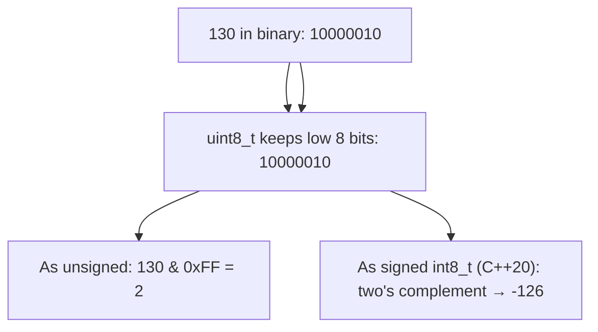

import { Tabs, TabItem, Aside, Badge, Card, CardGrid, Code } from '@astrojs/starlight/components';

## 🔀 Type Casting in C++ — Complete Guide

> **Type casting** converts a value from one type to another. C++ offers **five casting mechanisms**, each with different safety guarantees:

| Cast Type | Syntax | When to Use | Safety |
|-----------|--------|-------------|--------|
| **Implicit conversion** | `target = source;` | Widening, standard conversions | ✅ Safe (usually) |
| **`static_cast<T>`** | `static_cast<T>(expr)` | Numeric narrowing, up/down casts in inheritance | ⚠️ Compile-time only, no runtime check |
| **`dynamic_cast<T>`** | `dynamic_cast<T*>(ptr)` | Safe downcasting with RTTI | ✅ Runtime-checked, returns `nullptr` on failure |
| **`const_cast<T>`** | `const_cast<T*>(ptr)` | Add/remove `const`/`volatile` | ⚠️ UB if you modify truly const objects |
| **`reinterpret_cast<T>`** | `reinterpret_cast<T*>(ptr)` | Low-level bit reinterpretation | 💥 Dangerous — use only for FFI/hardware |

```cpp
// C++: Prefer named casts over C-style (Type)expr
int i = 42;
double d = static_cast<double>(i);  // ✅ Clear intent: numeric widening

// ❌ Avoid C-style cast (hard to search, less safe):
double d2 = (double)i;  // Works, but hides intent
```

<Aside type="note">
**🔑 Key Difference from Java**: C++ gives you **explicit control** over casting semantics.  
- Java: One cast syntax `(Type)`, runtime checks for objects  
- C++: Four named casts + implicit conversions — choose the right tool for safety vs. performance  
✅ **Rule**: Prefer `static_cast` for numeric conversions, `dynamic_cast` for safe polymorphic downcasts.
</Aside>

---

## 🔼 Implicit Conversions (Widening / Standard Conversions)

### Key Characteristics

| Feature | Detail |
|---------|--------|
| **Who performs it?** | ✅ Compiler (automatic) |
| **Direction** | "Smaller" → "Larger" type (usual arithmetic conversions) |
| **Also known as** | Implicit conversion, standard conversion, promotion |
| **Information loss?** | ❌ Usually safe (but `int→float` may lose precision) |
| **Syntax** | No cast needed — automatic |

### 🧭 Implicit Conversion Hierarchy (Usual Arithmetic Conversions)

```
Numeric promotion order (simplified):
  char, short → int → unsigned int → long → unsigned long → long long → float → double → long double

Rules:
  1. If either operand is long double → other promoted to long double
  2. Else if either is double         → other promoted to double
  3. Else if either is float          → other promoted to float
  4. Else integral promotions: char/short → int, then rank-based
```

<Aside type="caution">
**⚠️ Precision Loss Alert**: `int → float` and `long → float/double` are **implicit but may lose precision**!

```cpp
int big = 16777217;  // 2^24 + 1
float f = big;       // ✅ Implicit conversion
// f = 16777216.0f — low bit lost! (float has 24-bit mantissa)
std::cout << (f == big) << '\\n';  // false 😱
```
✅ **Rule**: Use `double` instead of `float` for exact representation of large integers.
</Aside>

### 💻 Implicit Conversion Examples

<Code lang="cpp" title="Numeric widening — automatic" code={`
#include <iostream>

int main() {
    // int → long → double (all implicit)
    int i = 100;
    long l = i;           // ✅ auto: int to long
    double d = i;         // ✅ auto: int to double
    
    // char → int (implicit)
    char ch = 'a';
    int x = ch;           // ✅ auto: char to int (ASCII value)
    std::cout << x << '\\n';  // 97
    
    // Signed/unsigned mixing — implicit but dangerous!
    unsigned int u = 10u;
    int s = -5;
    auto result = u + s;  // ⚠️ s promoted to unsigned: huge positive!
    
    // ✅ Prefer explicit cast for clarity:
    auto safe = static_cast<int>(u) + s;  // Clear intent
    
    return 0;
}
`} />

<Code lang="cpp" title="Mixed expression promotion — C++ rules" code={`
#include <cstdint>

int main() {
    uint8_t b = 5;    // typically unsigned char
    int16_t s = 10;   // typically short
    
    // b and s promoted to int before addition (usual arithmetic conversions)
    int result = b + s;  // ✅ result is int
    
    // ⚠️ Assigning back to smaller type requires explicit cast:
    // uint8_t b2 = b + s;  // ❌ Warning: narrowing conversion
    uint8_t b2 = static_cast<uint8_t>(b + s);  // ✅ Explicit
    
    return 0;
}
`} />

<Aside type="tip">
**Memory Trick**: *"Small to Big — Usually Safe, But Watch Precision"*  
If the target type can hold **all possible values** of the source type, the conversion is implicit and safe.  
⚠️ Exception: `int→float`/`long→double` may lose precision even though range fits!
</Aside>

---

## 🔽 Explicit Casting (Narrowing / Downcasting) — C++ Named Casts

### Key Characteristics

| Feature | Detail |
|---------|--------|
| **Who performs it?** | 👨‍💻 Programmer (manual) |
| **Direction** | "Larger" → "Smaller" type, or unrelated types |
| **Also known as** | Narrowing, explicit cast, demotion |
| **Information loss?** | ⚠️ **Possible** — truncation, overflow, UB |
| **Syntax** | `static_cast<T>(expr)`, `dynamic_cast<T*>(ptr)`, etc. |

### 🎯 The Four Named Casts — When to Use Each

<Code lang="cpp" title="Named casts overview" code={`
#include <iostream>
#include <memory>

// 1. static_cast — numeric conversions, up/down casts (no runtime check)
double d = 9.99;
int i = static_cast<int>(d);        // ✅ 9 — truncates toward zero

// 2. dynamic_cast — safe polymorphic downcasting (requires RTTI)
class Base { virtual void dummy() {} };  // Needs vtable for RTTI
class Derived : public Base {};

Base* base = new Derived();
Derived* derived = dynamic_cast<Derived*>(base);  // ✅ Returns valid pointer
if (derived) { /* safe to use */ }

Base* base2 = new Base();
Derived* derived2 = dynamic_cast<Derived*>(base2);  // ✅ Returns nullptr (safe!)
if (!derived2) { /* handle failure */ }

// 3. const_cast — add/remove const/volatile (use with extreme caution!)
const int ci = 42;
// int* p = &ci;  // ❌ Error: cannot convert const int* to int*
int* p = const_cast<int*>(&ci);  // ✅ Compiles, but ⚠️ UB if you modify *p!
// *p = 100;  // 💥 Undefined Behavior — ci was truly const

// 4. reinterpret_cast — low-level bit reinterpretation (dangerous!)
int* ip = reinterpret_cast<int*>(0x1000);  // ✅ Treat address 0x1000 as int*
// Only use for: hardware registers, FFI, serialization — never for logic!

delete base;
return 0;
`} />

<Aside type="danger">
**🔥 Critical Safety Rules**:
1. ✅ `static_cast` for numeric conversions — no runtime overhead, but no safety check
2. ✅ `dynamic_cast` for polymorphic downcasts — runtime check, returns `nullptr` on failure
3. ⚠️ `const_cast` only to remove `const` from objects that weren't originally const
4. 💥 `reinterpret_cast` is dangerous — use only for low-level systems programming
5. ❌ Avoid C-style `(Type)expr` — hides intent, less safe, harder to audit
</Aside>

---

### 🔬 What Happens During Narrowing — C++ Specifics

```cpp
// double → int: truncates toward zero (same as Java)
double d = 9.99;
int i = static_cast<int>(d);  // 9 — decimal part discarded

// long → int: takes low 32 bits — HIGH BITS DISCARDED (UB if value doesn't fit!)
long big = 300L;
int small = static_cast<int>(big);  // ✅ 300 fits

long too_big = 3000000000L;  // > INT_MAX
int overflow = static_cast<int>(too_big);  // 💥 Implementation-defined (usually wraps)

// C++20: Use std::in_range for safe narrowing checks
#include <limits>
if (std::in_range<int>(too_big)) {
    int safe = static_cast<int>(too_big);
} else {
    // Handle overflow case
}
```

<Code lang="cpp" title="Integer narrowing with two's complement (C++20 guaranteed)" code={`
#include <iostream>
#include <cstdint>

int main() {
    // int → byte (uint8_t): takes low 8 bits
    int x = 130;
    uint8_t b = static_cast<uint8_t>(x);  // ✅ 130 & 0xFF = 2
    std::cout << static_cast<int>(b) << '\\n';  // 2
    
    // Signed narrowing: implementation-defined pre-C++20, two's complement guaranteed C++20+
    int y = 130;
    int8_t sb = static_cast<int8_t>(y);  // C++20: -126 (two's complement)
    std::cout << static_cast<int>(sb) << '\\n';  // -126
    
    // ✅ C++20: Two's complement guaranteed — ~x = -(x+1) works portably
    static_assert(std::numeric_limits<int8_t>::is_modulo, 
                  "Two's complement guaranteed in C++20+");
    
    return 0;
}
`} />

<Aside type="tip">
**Interview Formula**: For `int → int8_t` casting in C++20+:
```cpp
// Two's complement guaranteed: result = value if fits, else wraps
int8_t narrow(int value) {
    return static_cast<int8_t>(value);  // C++20: well-defined wrap
}
// Pre-C++20: implementation-defined — avoid relying on wrap behavior!
```
</Aside>

---

## 🔬 Casting in Expressions — Precedence Matters

```cpp
// Cast has high precedence — applies to immediate value
double result1 = static_cast<double>(5) / 2;  // 2.5 — 5 cast to double, then divide
double result2 = static_cast<double>(5 / 2);  // 2.0 — integer divide first, then cast

// Cast only what you need
int a = 5, b = 2;
double d1 = static_cast<double>(a) / b;  // 2.5 ✅ — a cast, b widened
double d2 = a / static_cast<double>(b);  // 2.5 ✅ — b cast, a widened
double d3 = static_cast<double>(a / b);  // 2.0 ❌ — integer divide first

// Chain of casts — right to left
int x = static_cast<int>(static_cast<double>(static_cast<long>(9.9f)));
// float 9.9f → long 9 → double 9.0 → int 9
```

> 🔑 `static_cast<double>(a) / b` ≠ `static_cast<double>(a / b)`. Cast applies to what immediately follows it. Parentheses control what gets cast — this is the most common cast precedence bug.

<Code lang="cpp" title="Safe expression casting pattern" code={`
// ✅ Pattern: Cast the FIRST operand to force wider arithmetic
int64_t safeMultiply(int32_t a, int32_t b) {
    return static_cast<int64_t>(a) * b;  // a cast to int64_t, b widened, then multiply
    // Prevents int32_t overflow before cast
}

// ❌ Dangerous: Cast after overflow already happened
int64_t wrongMultiply(int32_t a, int32_t b) {
    return static_cast<int64_t>(a * b);  // a*b overflows int32_t FIRST, then cast garbage
}
`} />

---

## 🔢 Numeric Narrowing — Loss of Information (C++ vs Java)

### Case 1: Integer → Smaller Integer (Bit Truncation)

<Code lang="cpp" title="int → uint8_t: Bit masking" code={`
#include <iostream>
#include <cstdint>

int main() {
    int x = 130;
    uint8_t b = static_cast<uint8_t>(x);  // ✅ explicit cast required
    std::cout << static_cast<int>(b) << '\\n';  // 2 (130 & 0xFF = 2)
    
    // Why 2? Bit-level trace:
    // 130 in binary (32-bit int): 00000000 00000000 00000000 10000010
    // uint8_t keeps only low 8 bits:                            00000010 = 2 ✅
    
    // ✅ Modern C++: Use std::bit_cast for type-safe bit reinterpretation (C++20)
    #include <bit>
    uint32_t bits = 130;
    uint8_t byte = std::bit_cast<uint8_t>(bits & 0xFF);  // Safe, no UB
    
    return 0;
}
`} />

### Case 2: Floating Point → Integer (Decimal Truncation)

<Code lang="cpp" title="Decimal part is discarded (not rounded!)" code={`
#include <iostream>
#include <cmath>

int main() {
    double d = 130.456;
    int x = static_cast<int>(d);  // ✅ explicit cast
    std::cout << x << '\\n';  // 130 (decimal .456 LOST!)
    
    // ⚠️ Casting truncates toward zero — does NOT round!
    double d1 = 9.99;
    double d2 = -9.99;
    std::cout << static_cast<int>(d1) << '\\n';  // 9  (not 10!)
    std::cout << static_cast<int>(d2) << '\\n';  // -9 (not -10!)
    
    // ✅ To round: use std::round, std::floor, or std::ceil
    int rounded = static_cast<int>(std::round(d1));  // 10 ✅
    int floored = static_cast<int>(std::floor(d1));  // 9
    int ceiled  = static_cast<int>(std::ceil(d1));   // 10
    
    return 0;
}
`} />

<Aside type="danger">
**Critical**: Casting `double`/`float` to integer **truncates**, not rounds.  
To round: use `std::round()`, `std::floor()`, or `std::ceil()` from `<cmath>` explicitly.
```cpp
double d = 9.99;
int truncated = static_cast<int>(d);           // 9
int rounded = static_cast<int>(std::round(d)); // 10 ✅
```
</Aside>

---

## 🔄 Complete Casting Reference Table — C++

### Implicit Conversions — Usually Safe

| From → To | Example | Notes |
|-----------|---------|-------|
| `int8_t` → `int` | `int i = b;` | ✅ Auto (integral promotion) |
| `char` → `int` | `int i = ch;` | ✅ Auto (ASCII/execution charset value) |
| `int` → `long` | `long l = i;` | ✅ Auto |
| `int` → `float` | `float f = i;` | ✅ Auto (may lose precision for large ints) |
| `long` → `double` | `double d = l;` | ✅ Auto (may lose precision for large longs) |
| `float` → `double` | `double d = f;` | ✅ Auto |

### Explicit Casts — Manual, Risk of Loss/UB

| From → To | Cast | Risk |
|-----------|------|------|
| `double` → `float` | `static_cast<float>(d)` | Precision loss |
| `int64_t` → `int32_t` | `static_cast<int32_t>(l)` | Overflow if > `INT32_MAX` |
| `int` → `int8_t` | `static_cast<int8_t>(i)` | Overflow if > 127 (C++20: defined wrap) |
| `float`/`double` → `int` | `static_cast<int>(d)` | Decimal truncation + possible overflow |
| Base* → Derived* | `dynamic_cast<Derived*>(base)` | Returns `nullptr` if unsafe (requires RTTI) |
| `const T*` → `T*` | `const_cast<T*>(ptr)` | UB if you modify truly const object |
| `int*` → `char*` | `reinterpret_cast<char*>(ip)` | 💥 Dangerous — bit reinterpretation |

<Code lang="cpp" title="Precision loss: large int → float" code={`
#include <iostream>
#include <limits>

int main() {
    int big = 1234567890;
    float f = static_cast<float>(big);  // ✅ explicit (or implicit)
    std::cout << std::fixed << f << '\\n';  // 1234567936.000000 (not exact!)
    
    // Why? float has only 24 bits of precision (~7 decimal digits)
    // Large ints may lose low-order bits when converted to float.
    
    // ✅ Use double for large integer precision:
    double d = static_cast<double>(big);  // ✅ exact: 1234567890.0
    std::cout << (d == big) << '\\n';  // true
    
    // ✅ C++20: Check if value fits before narrowing
    if (std::in_range<float>(big)) {
        float safe = static_cast<float>(big);
    }
    
    return 0;
}
`} />

---

## 🧠 Two's Complement Deep Dive — C++20 Guaranteed!

### Step-by-Step Bit Truncation (Same as Java, Now Portable!)



<Code lang="cpp" title="Bit-level trace — C++20 guaranteed two's complement" code={`
// 130 in 32-bit int:
// 00000000 00000000 00000000 10000010

// int8_t result (C++20 two's complement):
// Keep low 8 bits: 10000010
// MSB = 1 → negative number
// Decode two's complement:
//   a) Invert bits: 01111101
//   b) Add 1:      01111110 = 126
//   c) Apply sign: -126 ✅

#include <iostream>
#include <cstdint>
#include <limits>

int main() {
    static_assert(std::numeric_limits<int8_t>::is_modulo, 
                  "Two's complement guaranteed in C++20+");
    
    int x = 130;
    int8_t sb = static_cast<int8_t>(x);  // C++20: well-defined -126
    std::cout << static_cast<int>(sb) << '\\n';  // -126
    
    // ✅ Formula shortcut (C++20+):
    // If value doesn't fit in target signed type: wraps via two's complement
    // int8_t range: [-128, 127]
    // 130 > 127 → 130 - 256 = -126 ✅
    
    return 0;
}
`} />

<Aside type="tip">
**Interview Formula (C++20+)**: For `int → int8_t` casting:
```cpp
// Two's complement guaranteed: wraps modulo 256
int8_t narrow(int value) {
    return static_cast<int8_t>(value);  // C++20: well-defined
}
// Pre-C++20: implementation-defined — avoid relying on specific wrap values!
```
</Aside>

---

## 🧳 Polymorphic Casting — dynamic_cast vs static_cast

### Downcasting Objects — Runtime Check with dynamic_cast

<Code lang="cpp" title="Safe polymorphic downcasting" code={`
#include <iostream>
#include <memory>

class Animal {
public:
    virtual ~Animal() = default;  // ✅ Required for RTTI/dynamic_cast
    virtual void speak() { std::cout << "generic\\n"; }
};

class Dog : public Animal {
public:
    void speak() override { std::cout << "woof\\n"; }
    void fetch() { std::cout << "fetching\\n"; }
};

int main() {
    // Upcasting (implicit) — always safe
    std::unique_ptr<Animal> animal = std::make_unique<Dog>();
    
    // ❌ Unsafe static_cast — no runtime check!
    // Dog* dog = static_cast<Dog*>(animal.get());  // ⚠️ Compiles, but UB if wrong type!
    
    // ✅ Safe dynamic_cast — runtime check, returns nullptr on failure
    if (Dog* dog = dynamic_cast<Dog*>(animal.get())) {
        dog->fetch();  // ✅ Safe to call subclass method
    } else {
        std::cout << "Not a Dog\\n";
    }
    
    // ✅ Modern C++: Use std::unique_ptr with dynamic_cast
    if (auto dog = dynamic_cast<Dog*>(animal.get())) {
        dog->fetch();
    }
    
    return 0;
}
`} />

### ✅ Safe Casting with Type Traits and Concepts (C++20)

<Code lang="cpp" title="Compile-time type checking with concepts" code={`
#include <concepts>
#include <iostream>

// C++20 concept: constrain template to specific types
template<typename T>
concept Printable = requires(T t) {
    { std::cout << t } -> std::same_as<std::ostream&>;
};

// Function only accepts types that satisfy Printable concept
template<Printable T>
void print(const T& value) {
    std::cout << value << '\\n';  // ✅ Compile-time guarantee: operator<< exists
}

// Usage:
print(42);           // ✅ int is Printable
print("hello");      // ✅ const char* is Printable
// print(std::vector<int>{});  // ❌ Compile error: vector not Printable (no operator<<)

// ✅ Alternative: std::any + std::any_cast (runtime type-safe)
#include <any>
std::any value = 42;
if (value.has_value() && value.type() == typeid(int)) {
    int i = std::any_cast<int>(value);  // ✅ Safe cast, throws on mismatch
    std::cout << i << '\\n';
}
`} />

<Aside type="caution">
**Golden Rule for Polymorphism**:  
1. ✅ Use `dynamic_cast` for runtime-checked downcasts (requires `virtual` base class)  
2. ✅ Use `static_cast` only when you're 100% certain of the runtime type  
3. ✅ Prefer `std::unique_ptr`/`std::shared_ptr` with `dynamic_cast` for safe ownership  
4. ✅ Use C++20 `concepts` for compile-time type constraints — catch errors early  
5. ❌ Never use `reinterpret_cast` for polymorphic casts — UB guaranteed!
</Aside>

---

## 🔬 Reference Upcasting (Implicit) — Same as Java

```cpp
// Subclass reference assigned to superclass type — always safe
class Animal { public: virtual void speak() {} };
class Dog : public Animal { public: void fetch() {} };

Dog dog;
Animal& a = dog;             // ✅ upcast — implicit, always succeeds
// a holds Dog object but Animal reference
// can only call Animal methods through a:
a.speak();                   // ✅ Polymorphic dispatch: calls Dog::speak()
// a.fetch();                // ❌ COMPILE ERROR — Animal ref doesn't know fetch()

// Polymorphic dispatch still works
class Cat : public Animal {
public:
    void speak() override { std::cout << "meow\\n"; }
};
Animal& c = Cat{};
c.speak();                   // "meow" — runtime type (Cat) determines method
```

```
Upcast:
  Dog*  ──► Animal*  (subclass to superclass)
  Safe — Dog IS-A Animal (Liskov substitution)
  Implicit — no cast syntax
  Loses access to subclass-specific methods at compile time
  Runtime object unchanged — still a Dog
  Virtual functions still dispatch to derived implementation
```

---

## 🔬 Reference Downcasting (Explicit) — dynamic_cast Safety

```cpp
// Superclass reference cast back to subclass
Animal* a = new Dog();       // upcast first

// Downcast — explicit cast required
// Option 1: static_cast (no runtime check — dangerous!)
// Dog* d1 = static_cast<Dog*>(a);  // ⚠️ Compiles, but UB if a isn't actually Dog

// Option 2: dynamic_cast (runtime check — safe!)
Dog* d2 = dynamic_cast<Dog*>(a);  // ✅ Returns valid pointer if a is Dog
if (d2) {
    d2->fetch();                  // ✅ subclass method accessible
}

// UNSAFE downcast — dynamic_cast returns nullptr (safe failure)
Animal* a2 = new Cat();
Dog* d3 = dynamic_cast<Dog*>(a2);  // ✅ Returns nullptr (Cat is not Dog)
if (!d3) {
    std::cout << "Safe: not a Dog\\n";  // Handle gracefully
}

delete a; delete a2;
```

```
dynamic_cast safety check:
  Requires: base class has at least one virtual function (for RTTI)
  Runtime: checks object's actual type via vtable
  Returns: valid pointer if cast succeeds, nullptr if fails (for pointers)
           throws std::bad_cast if cast fails (for references)
  Cost: O(1) with vtable lookup — negligible in practice
```

---

## 🔬 std::bad_cast — When dynamic_cast Fails

```cpp
// std::bad_cast thrown when:
// dynamic_cast<T&>(expr) fails (reference version throws, pointer version returns nullptr)

#include <typeinfo>  // for std::bad_cast

class Base { virtual void dummy() {} };
class Derived : public Base {};

Base* base = new Base();
try {
    Derived& ref = dynamic_cast<Derived&>(*base);  // ❌ Throws std::bad_cast
} catch (const std::bad_cast& e) {
    std::cerr << "Cast failed: " << e.what() << '\\n';
}

// ✅ Safer: use pointer version, check for nullptr
if (Derived* d = dynamic_cast<Derived*>(base)) {
    // use d
} else {
    // handle failure gracefully
}

delete base;
```

```
RTTI internals:
  Each polymorphic object has vtable pointer in object header
  vtable contains type_info pointer
  dynamic_cast walks: object's type_info → base classes → target type
  If match found: return valid pointer
  If no match: return nullptr (pointer) or throw bad_cast (reference)
  Cost: One vtable lookup + type_info comparison — very fast
```

---

## 🔬 String ↔ Numeric (Not a Cast — Use Conversion Functions)

```cpp
// Numeric → String (NOT a cast — use std::to_string or std::format)
int i = 42;
std::string s1 = std::to_string(i);        // "42"  ✅ C++11
#if __cplusplus >= 202002L
std::string s2 = std::format("{}", i);     // "42"  ✅ C++20 (type-safe)
#endif

// String → Numeric (NOT a cast — use std::stoi, std::stod, etc.)
std::string s = "42";
int    x  = std::stoi(s);                  // 42   ✅ C++11
double d  = std::stod(s);                  // 42.0 ✅

// ❌ Invalid: no cast between std::string and numeric types
// int y = static_cast<int>(s);            // ❌ Compile error
// std::string t = static_cast<std::string>(42);  // ❌ Compile error

// ✅ Modern C++: Use std::from_chars for fast, safe parsing (C++17)
#include <charconv>
int result;
auto [ptr, ec] = std::from_chars(s.data(), s.data() + s.size(), result);
if (ec == std::errc{}) {
    // Successfully parsed: result = 42
}
```

> 🔑 You **cannot cast** between `std::string` and numeric types — no inheritance relationship exists. Use `std::stoi()`, `std::to_string()`, `std::from_chars()`, etc. Attempting `static_cast<int>(someString)` = compile error always.

---

## 🎯 Interview Cheat Sheet — C++ Edition

<CardGrid>
  <Card title="Q: When are implicit conversions performed in C++?" icon="approve-check">
    When assigning a **"smaller" type to a "larger" type** per usual arithmetic conversions.  
    Example: `int8_t → int → long → float → double`, or `char → int`.  
    No cast syntax needed — compiler does it automatically.  
    ⚠️ But `int→float` may lose precision — not always "safe"!
  </Card>
  
  <Card title="Q: What happens when casting 130 to int8_t in C++20?" icon="information">
    **Result: `-126`** due to two's complement wrap (guaranteed in C++20).  
    - 130 in binary: `...10000010`  
    - int8_t keeps last 8 bits: `10000010`  
    - MSB=1 → negative → decode as -126 via two's complement  
    Formula: `130 - 256 = -126` ✅  
    ⚠️ Pre-C++20: implementation-defined — avoid relying on specific values!
  </Card>

  <Card title="Q: Does static_cast<int>(9.99) equal 10?" icon="error">
    **NO ❌** — casting float/double to int **truncates toward zero**, does NOT round.  
    `static_cast<int>(9.99) = 9`, `static_cast<int>(-9.99) = -9`.  
    Use `std::round()` from `<cmath>` for rounding.
  </Card>

  <Card title="Q: Can char be converted to int8_t implicitly?" icon="error">
    **NO ❌** — `char` (typically 0–255 or -128–127) may not fit in `int8_t` (-128–127).  
    Explicit cast required: `int8_t b = static_cast<int8_t>(ch);` — but risk of overflow!  
    ✅ **Rule**: Always check range or use `std::in_range<T>(value)` (C++20) before narrowing.
  </Card>

  <Card title="Q: What is the output? `uint8_t b = static_cast<uint8_t>(300);`" icon="information">
    **`44`** — apply bit masking:  
    `300 & 0xFF = 44` ✅  
    Binary: 300 = `1 00101100` → keep last 8 bits `00101100` = 44  
    ✅ For unsigned types, narrowing is well-defined: modulo 2^N.
  </Card>

  <Card title="Q: Is int → float implicit conversion safe in C++?" icon="caution">
    **Syntax: yes ✅, Precision: maybe ⚠️**  
    - Compiler allows `float f = intValue;` (implicit)  
    - But `float` has only ~7 decimal digits precision (24-bit mantissa)  
    - Large `int` values (> 2²⁴) may lose low-order bits  
    - Use `double` for exact large integer representation  
    - ✅ C++20: `std::in_range<float>(value)` to check before conversion
  </Card>

  <Card title="Q: static_cast vs dynamic_cast for polymorphism?" icon="approve-check">
    ```cpp
    // static_cast: compile-time only, no runtime check — fast but dangerous
    Base* b = new Derived();
    Derived* d1 = static_cast<Derived*>(b);  // ⚠️ UB if b isn't actually Derived!
    
    // dynamic_cast: runtime check via RTTI — safe, returns nullptr on failure
    Derived* d2 = dynamic_cast<Derived*>(b);  // ✅ Safe: checks actual type
    if (d2) { /* use d2 */ } else { /* handle failure */ }
    
    // ✅ Rule: Use dynamic_cast for downcasts unless you're 100% certain of type
    ```
  </Card>

  <Card title="Q: const_cast — when is it safe?" icon="caution">
    ```cpp
    // ✅ Safe: remove const from object that wasn't originally const
    void process(int* p) { /* ... */ }
    const int ci = 42;
    // process(&ci);  // ❌ Error: can't pass const int* to int*
    process(const_cast<int*>(&ci));  // ⚠️ Compiles, but UB if process modifies *p!
    
    // ✅ Truly safe: only use const_cast to call legacy APIs that don't modify
    // Better: fix the API to accept const T* in the first place!
    
    // ❌ Dangerous: modifying a truly const object via const_cast
    const int really_const = 100;
    int* p = const_cast<int*>(&really_const);
    *p = 200;  // 💥 Undefined Behavior — really_const was truly const
    ```
  </Card>
</CardGrid>

---

## 🧩 DSA & Practical Patterns — C++ Edition

<CardGrid>
  <Card title="Pattern: Safe Byte Conversion for Hashing" icon="shield">
  When converting hash codes to byte arrays (e.g., for serialization):
  ```cpp
      #include <cstdint>
      #include <bit>  // C++20
      
      uint32_t hash = computeHash(obj);
      std::array<uint8_t, 4> bytes;
      
      // ✅ Extract each byte safely with bit operations
      bytes[0] = static_cast<uint8_t>(hash >> 24);  // High byte
      bytes[1] = static_cast<uint8_t>(hash >> 16);
      bytes[2] = static_cast<uint8_t>(hash >> 8);
      bytes[3] = static_cast<uint8_t>(hash);         // Low byte
      
      // ✅ C++20: std::bit_cast for type-safe bit reinterpretation
      // auto bytes2 = std::bit_cast<std::array<uint8_t, 4>>(hash);  // If layout matches
  ```
  </Card>
  
  <Card title="Pattern: Rounding vs. Truncation in Numeric Algorithms" icon="rocket">
    Choose the right conversion for accuracy:
  ```cpp
      #include <cmath>
      
      double score = 94.7;
      
      // ❌ Truncation (may under-report):
      int grade1 = static_cast<int>(score);  // 94
      
      // ✅ Rounding (more accurate):
      int grade2 = static_cast<int>(std::round(score));  // 95
      
      // ✅ Floor/Ceil for specific logic:
      int minPass = static_cast<int>(std::ceil(60.1));  // 61
      int maxFail = static_cast<int>(std::floor(59.9)); // 59
      
      // ✅ C++20: std::midpoint for safe averaging (no overflow)
      int a = 1000000, b = 2000000;
      int avg = std::midpoint(a, b);  // 1500000 — no overflow risk
  ```
  </Card>

  <Card title="Pattern: Defensive Polymorphic Casting" icon="backspace">
    Always validate before downcasting in polymorphic code:
  ```cpp
      #include <memory>
      
      void handle(std::unique_ptr<Animal> animal) {
          // ✅ Safe: dynamic_cast with pointer check
          if (auto* dog = dynamic_cast<Dog*>(animal.get())) {
              dog->fetch();
          } else if (auto* cat = dynamic_cast<Cat*>(animal.get())) {
              cat->meow();
          }
          // No std::bad_cast risk — type checked at runtime
      }
      
      // ✅ Modern C++: Use std::variant for type-safe polymorphism (no casting!)
      #include <variant>
      using Pet = std::variant<Dog, Cat, Bird>;
      
      void handleVariant(const Pet& pet) {
          std::visit([](auto& p) {
              using T = std::decay_t<decltype(p)>;
              if constexpr (std::is_same_v<T, Dog>) {
                  p.fetch();  // Compile-time type dispatch
              } else if constexpr (std::is_same_v<T, Cat>) {
                  p.meow();
              }
          }, pet);
      }
  ```
  </Card>

  <Card title="Pattern: C++20 Concepts for Compile-Time Type Safety" icon="approve-check">
    Replace runtime casts with compile-time constraints:
  ```cpp
      #include <concepts>
      #include <iostream>
      
      // Concept: type must support operator<<
      template<typename T>
      concept Printable = requires(T t, std::ostream& os) {
          { os << t } -> std::same_as<std::ostream&>;
      };
      
      // Function only accepts Printable types — no casting needed!
      template<Printable T>
      void print(const T& value) {
          std::cout << value << '\\n';  // ✅ Compile-time guarantee
      }
      
      // Usage:
      print(42);              // ✅ int is Printable
      print("hello");         // ✅ const char* is Printable
      // print(std::vector{}); // ❌ Compile error: vector not Printable
      
      // ✅ Benefit: Errors caught at compile-time, not runtime!
  ```
  </Card>
</CardGrid>

<Aside type="tip">
**Competitive Coding Tip**: When problem constraints mention large numbers:
- Use `int64_t` instead of `int32_t` for accumulators
- Avoid `float`/`double` for exact integer arithmetic
- If narrowing is needed, validate range first with `std::in_range<T>(value)` (C++20):
```cpp
#include <limits>
if (std::in_range<int8_t>(value)) {
    int8_t b = static_cast<int8_t>(value);  // safe
}
```
</Aside>

---

## 💻 Real-World Code — Deserialization Layer (C++ Style)

```cpp
#include <string>
#include <unordered_map>
#include <any>      // C++17: type-safe heterogeneous container
#include <optional> // C++17: nullable values
#include <charconv> // C++17: fast numeric parsing

class ConfigParser {
    // Raw map from JSON/YAML parser — all values as std::any
    std::unordered_map<std::string, std::any> raw;

public:
    ConfigParser(std::unordered_map<std::string, std::any> raw) 
        : raw(std::move(raw)) {}

    // Safe downcast with std::any_cast
    std::optional<std::string> getString(const std::string& key) const {
        auto it = raw.find(key);
        if (it == raw.end()) return std::nullopt;
        
        try {
            // ✅ std::any_cast throws std::bad_any_cast on mismatch
            return std::any_cast<std::string>(it->second);
        } catch (const std::bad_any_cast&) {
            // Handle type mismatch gracefully
            return std::nullopt;
        }
    }

    // Numeric narrowing with range check
    std::optional<int32_t> getInt32(const std::string& key) const {
        auto it = raw.find(key);
        if (it == raw.end()) return std::nullopt;

        try {
            // Try int64_t first (JSON integers often parse as int64_t)
            if (it->second.type() == typeid(int64_t)) {
                int64_t l = std::any_cast<int64_t>(it->second);
                // ✅ C++20: Check range before narrowing
                #if __cplusplus >= 202002L
                if (!std::in_range<int32_t>(l)) {
                    return std::nullopt;  // Out of range
                }
                #endif
                return static_cast<int32_t>(l);  // Safe after check
            }
            // Try direct int32_t
            return std::any_cast<int32_t>(it->second);
        } catch (const std::bad_any_cast&) {
            return std::nullopt;
        }
    }

    // Widening — always safe
    std::optional<double> getDouble(const std::string& key) const {
        auto it = raw.find(key);
        if (it == raw.end()) return std::nullopt;

        try {
            if (it->second.type() == typeid(double)) {
                return std::any_cast<double>(it->second);
            } else if (it->second.type() == typeid(float)) {
                return static_cast<double>(std::any_cast<float>(it->second));  // widening
            } else if (it->second.type() == typeid(int32_t)) {
                return static_cast<double>(std::any_cast<int32_t>(it->second));  // widening
            } else if (it->second.type() == typeid(int64_t)) {
                return static_cast<double>(std::any_cast<int64_t>(it->second));  // widening — may lose precision
            }
            return std::nullopt;
        } catch (const std::bad_any_cast&) {
            return std::nullopt;
        }
    }
};
```

🔴 **What breaks if done wrong**: Direct `static_cast<int32_t>(std::any_cast<int64_t>(value))` without range check → silent overflow if value > `INT32_MAX`. Service produces wrong config values instead of failing safely.

---

## 🔑 Quick Reference Summary — C++ Casting

### Implicit Conversions — Usually Safe

```text
int8_t → int → long → float → double
                ↑
              char
```
✅ No cast syntax needed  
✅ No data loss (except possible precision for int→float/double)  
✅ Compiler handles automatically via usual arithmetic conversions

### Explicit Casts — Manual, Choose the Right Tool

```text
// Numeric narrowing:
double → float → long → int → int8_t
                          ↑
                        char

// Polymorphic casting:
Derived* → Base*   (upcast: implicit, always safe)
Base*    → Derived* (downcast: use dynamic_cast for safety)
```

| Cast | Use Case | Safety |
|------|----------|--------|
| `static_cast<T>(expr)` | Numeric conversions, up/down casts (no RTTI) | ⚠️ Compile-time only |
| `dynamic_cast<T*>(ptr)` | Safe polymorphic downcasts | ✅ Runtime-checked, nullptr on failure |
| `const_cast<T*>(ptr)` | Add/remove const/volatile | ⚠️ UB if modifying truly const |
| `reinterpret_cast<T*>(ptr)` | Low-level bit reinterpretation | 💥 Dangerous — systems programming only |
| `std::bit_cast<T>(expr)` | Type-safe bit reinterpretation (C++20) | ✅ Safe, compile-time checked |

<Aside type="caution">
**🔥 Final Checklist for C++ Casting**:
1. ✅ Implicit conversions: "smaller" → "larger" per usual arithmetic conversions — automatic
2. ✅ Explicit narrowing: use `static_cast<T>(expr)` — risk of truncation/overflow
3. ✅ Integer narrowing: bits truncated; C++20 guarantees two's complement wrap
4. ✅ Float→int: truncates toward zero — use `std::round()` for rounding
5. ✅ Polymorphic downcasting: **always** use `dynamic_cast` for runtime safety
6. ✅ `char → int` is implicit (ASCII value); `char → int8_t` requires explicit cast
7. ✅ Large `int → float` may lose precision — prefer `double` or check with `std::in_range`
8. ✅ Avoid C-style `(T)expr` — prefer named casts for clarity and safety
9. ✅ Enable `-Wconversion -Wnarrowing` to catch implicit narrowing warnings
</Aside>

---

## 🧪 Test Your Understanding — C++ Edition

<Code lang="cpp" title="Predict the output / behavior" code={`
#include <iostream>
#include <cstdint>
#include <cmath>
#include <limits>

int main() {
    std::cout << std::boolalpha;
    
    // Q1: Implicit widening
    int8_t b = 10;
    int i = b;  // implicit
    std::cout << i << '\\n';  // ?
    
    // Q2: char → int
    char ch = 'Z';
    int code = ch;  // implicit
    std::cout << code << '\\n';  // ? (ASCII of 'Z')
    
    // Q3: Explicit narrowing — overflow (C++20 two's complement)
    int x = 200;
    int8_t by = static_cast<int8_t>(x);
    std::cout << static_cast<int>(by) << '\\n';  // ? (200 - 256 = ?)
    
    // Q4: Float truncation
    double d = -15.9;
    int truncated = static_cast<int>(d);
    std::cout << truncated << '\\n';  // ? (not rounded!)
    
    // Q5: Large int → float precision
    int big = 16777217;  // 2^24 + 1
    float f = static_cast<float>(big);  // implicit or explicit
    std::cout << (f == big) << '\\n';  // ? (precision loss?)
    
    // Q6: Safe narrowing with std::in_range (C++20)
    #if __cplusplus >= 202002L
    int64_t large = 3000000000LL;
    if (std::in_range<int32_t>(large)) {
        int32_t safe = static_cast<int32_t>(large);
        std::cout << "safe: " << safe << '\\n';
    } else {
        std::cout << "out of range\\n";  // ?
    }
    #endif
    
    // Q7: dynamic_cast safety
    class Base { virtual void dummy() {} };
    class Derived : public Base {};
    Base* base = new Base();
    Derived* derived = dynamic_cast<Derived*>(base);
    std::cout << (derived == nullptr) << '\\n';  // ? (safe failure)
    delete base;
    
    return 0;
}

/* Expected Output:
10
90        ← 'Z' = 90 in ASCII
-56       ← 200 - 256 = -56 (C++20 two's complement)
-15       ← truncation toward zero, not rounding
false     ← 16777217 cannot be represented exactly in float (24-bit mantissa)
out of range  ← 3000000000 > INT32_MAX
true      ← dynamic_cast fails safely, returns nullptr
*/
`} />

<Aside type="tip">
**Pro Interview Strategy** for casting questions in C++:
1. Identify direction: widening (implicit) or narrowing (explicit `static_cast`)?
2. For numeric narrowing: calculate bit truncation or use two's complement formula (C++20)
3. For float→int: emphasize truncation vs. rounding distinction — use `std::round()`
4. For polymorphic casting: always mention `dynamic_cast` for runtime safety vs `static_cast`
5. Mention precision caveats for `int→float`/`long→double` — suggest `std::in_range` (C++20)
6. Draw binary diagrams for byte overflow questions — shows deep understanding!
7. Bonus: Mention C++20 `concepts` and `std::variant` as modern alternatives to casting

This demonstrates both theoretical knowledge and practical modern C++ skills! 🎯
</Aside>

---

## 🧭 Quick-Revision Cheat Sheet — C++ Casting

```text
✅ IMPLICIT CONVERSIONS:
   • char/short → int → long → float → double (usual arithmetic conversions)
   • No cast syntax needed — compiler handles automatically
   • ⚠️ int→float/long→double may lose precision — check with std::in_range (C++20)

✅ EXPLICIT CASTS — CHOOSE THE RIGHT TOOL:
   • static_cast<T>(expr)  — numeric conversions, up/down casts (no RTTI)
   • dynamic_cast<T*>(ptr) — safe polymorphic downcasts (requires virtual base)
   • const_cast<T*>(ptr)   — add/remove const/volatile (use with extreme caution)
   • reinterpret_cast<T*>(ptr) — low-level bit reinterpretation (dangerous!)
   • std::bit_cast<T>(expr)  — type-safe bit reinterpretation (C++20, safe)

✅ NARROWING RULES:
   • Integer narrowing: bits truncated; C++20 guarantees two's complement wrap
   • Float→int: truncates toward zero — use std::round() for rounding
   • Always check range before narrowing: std::in_range<T>(value) (C++20)
   • Enable -Wconversion -Wnarrowing to catch implicit narrowing warnings

✅ POLYMORPHIC CASTING:
   • Upcast (Derived* → Base*): implicit, always safe
   • Downcast (Base* → Derived*): use dynamic_cast for runtime safety
   • dynamic_cast returns nullptr on failure (pointer) or throws bad_cast (reference)
   • Requires virtual function in base class for RTTI

✅ MODERN C++ ALTERNATIVES TO CASTING:
   • std::optional<T> — nullable values without nullptr checks
   • std::variant<Ts...> — type-safe union, no casting needed
   • std::any — type-erased container with any_cast (runtime check)
   • Concepts (C++20) — compile-time type constraints, catch errors early
   • std::from_chars / std::to_chars — fast, safe numeric parsing/formatting

✅ COMPILER FLAGS FOR SAFETY:
   • -Wconversion          — warn on implicit narrowing conversions
   • -Wnarrowing           — warn on narrowing in list-initialization
   • -Wold-style-cast      — warn on C-style (Type)expr casts
   • -Wextra -Wall         — catch all common issues
   • -std=c++20            — enable two's complement guarantee, std::in_range, concepts
```

> 🎯 **Interview Pro Tip**: When asked about type casting in C++, always mention:  
> 1. **Four named casts** (`static_cast`, `dynamic_cast`, `const_cast`, `reinterpret_cast`) — choose the right tool  
> 2. **Two's complement guaranteed in C++20** — narrowing wrap behavior is now portable  
> 3. **`dynamic_cast` for safe polymorphism** — runtime check vs `static_cast` compile-time only  
> 4. **Modern alternatives** (`std::optional`, `std::variant`, concepts) — avoid casting when possible  
> 5. **Compiler warnings** (`-Wconversion`, `-Wnarrowing`) — catch implicit narrowing at compile time  
> This demonstrates deep understanding of C++'s "zero-overhead, explicit control" philosophy and modern best practices! 🚀

---

## 🔗 Related Topics

<CardGrid columns={2}>
  <LinkCard
    title="C++ Integral Types"
    href="/computer-languages/cpp/topics/integral-types"
    description="Signed vs unsigned, fixed-width types, and conversion rules"
  />
  <LinkCard
    title="C++ Polymorphism & RTTI"
    href="/computer-languages/cpp/topics/polymorphism-rtti"
    description="virtual functions, dynamic_cast, type_info, and safe downcasting"
  />
  <LinkCard
    title="C++20 Features"
    href="/computer-languages/cpp/topics/cpp20"
    description="concepts, std::bit_cast, std::in_range, and modern type safety"
  />
  <LinkCard
    title="C++ Type-Safe Alternatives"
    href="/computer-languages/cpp/topics/type-safe-alternatives"
    description="std::optional, std::variant, std::any — avoid casting with modern types"
  />
</CardGrid>

---

# 🔄 C++ Type Casting Operators — Complete Deep Dive

---

## 📌 What Is a Cast?

Explicitly converting a value from one type to another.

```cpp
double d = 3.14;
int    i = (int)d;    // cast — truncates to 3
```

C++ has **5 cast operators** + 1 implicit conversion system:

```
Casts in C++
│
├── Implicit conversion    → compiler does it silently
├── C-style cast  (T)x     → legacy, dangerous, avoid
├── static_cast            → compile-time, safe conversions
├── dynamic_cast           → runtime, polymorphic hierarchy
├── const_cast             → add/remove const only
├── reinterpret_cast       → raw bit reinterpretation
└── std::bit_cast (C++20)  → safe reinterpret, no UB
```

---

## 🔄 Implicit Conversion — Before Any Explicit Cast

The compiler silently converts when types are compatible:

```cpp
int    i = 3.14;       // double → int (truncates, compiler warns)
double d = 5;          // int → double (safe, no data loss)
bool   b = 42;         // int → bool (0=false, non-zero=true)
long   l = 5;          // int → long (widening, always safe)

// Dangerous implicit conversions (no compiler error):
int    x = 3000000000; // fits in unsigned, silently wraps in signed
char   c = 300;        // 300 doesn't fit in char (−128→127), truncates silently
```

---

## 🔷 1. C-Style Cast `(T)x`

```cpp
int    i = (int)3.14;
double d = (double)5;
char*  p = (char*)malloc(100);
```

### What C-Style Cast Actually Does

```
(T)expr tries the following IN ORDER, uses FIRST that works:
  1. const_cast
  2. static_cast
  3. static_cast + const_cast
  4. reinterpret_cast
  5. reinterpret_cast + const_cast
```

> 🔴 **C-style cast is unpredictable.** It silently picks the most dangerous cast available. `(int*)ptr` might be a `static_cast` in one context and a `reinterpret_cast` in another — impossible to tell by reading.

```cpp
// You think you're doing a safe conversion:
const int* cp = &x;
int* p = (int*)cp;          // silently strips const — same as const_cast

// You think you're doing a pointer upcast:
Derived* d = new Derived();
Base* b = (Base*)d;         // fine here — static_cast

// But later someone adds an unrelated cast:
int* i = (Base*)(some_int); // silently reinterpret_cast — disaster
```

> 🔑 **Never use C-style cast in C++.** Use the named casts — they show intent and fail loudly when misused.

---

## 🔷 2. `static_cast` — Compile-Time Conversions

### What It Does

```
Checked at COMPILE TIME.
No runtime overhead for most conversions.
Fails to compile if conversion is not defined.
```

### Use Cases

```cpp
// ✅ Numeric conversions
double d = 3.99;
int i = static_cast<int>(d);           // → 3 (truncates toward zero)

int i = 5;
double d = static_cast<double>(i);     // → 5.0

long l = 100L;
int i = static_cast<int>(l);           // narrowing — may lose data

// ✅ Enum to int / int to enum
enum Color { Red=0, Green=1, Blue=2 };
int n = static_cast<int>(Color::Green);    // → 1
Color c = static_cast<Color>(2);           // → Blue

// ✅ void* to T* (common with C APIs)
void* raw = malloc(sizeof(int));
int* p = static_cast<int*>(raw);           // ✅ correct

// ✅ Upcast — derived to base (explicit, always safe)
Derived* d = new Derived();
Base* b = static_cast<Base*>(d);           // ✅ safe upcast

// ⚠️ Downcast — base to derived (NO runtime check)
Base* b = new Base();
Derived* d = static_cast<Derived*>(b);    // ❌ compiles but UB
                                           // b actually points to Base
                                           // d is a lie — using it = UB

// ✅ Downcast ONLY when you KNOW the runtime type
Base* b = new Derived();                   // actually a Derived
Derived* d = static_cast<Derived*>(b);    // ✅ safe — you know the type
```

### What `static_cast` Refuses

```cpp
// Unrelated pointer types
int* ip = static_cast<int*>(double_ptr);   // ❌ compile error

// Strip const
const int* cp = &x;
int* p = static_cast<int*>(cp);            // ❌ compile error — use const_cast

// Unrelated class hierarchies
static_cast<Cat*>(dog_ptr);                // ❌ compile error if not related
```

---

## 🔷 3. `dynamic_cast` — Runtime Safe Downcast

> Covered in depth in the `instanceof` topic. Summary here for completeness.

```cpp
Base* b = new Derived();

// Downcast — runtime RTTI check
Derived* d = dynamic_cast<Derived*>(b);
if (d) { /* safe */ }        // nullptr if wrong type

// Throws on reference failure
try {
    Derived& d = dynamic_cast<Derived&>(*b);
} catch (std::bad_cast&) { }
```

```
dynamic_cast vs static_cast for downcasts:
  static_cast  → no check, no cost, UB if wrong
  dynamic_cast → RTTI check, small cost, nullptr if wrong
```

---

## 🔷 4. `const_cast` — Add/Remove `const`

### What It Does

```
The ONLY cast that can add or remove const/volatile.
Does NOT change the actual type — just the const qualification.
```

```cpp
const int x = 5;
int* p = const_cast<int*>(&x);   // removes const from pointer

// Reading through p: ✅ fine
std::cout << *p;                  // → 5

// Writing through p: ❌ UB if original was const
*p = 10;                          // ❌ UB — x was declared const
                                  // may crash (const in .rodata)
                                  // may silently do nothing
                                  // may appear to work then break at -O2
```

### Valid Use — Non-const Object, const Pointer

```cpp
int x = 5;                        // non-const object
const int* cp = &x;               // const pointer to it

// Legal: x was originally non-const
int* p = const_cast<int*>(cp);
*p = 10;                          // ✅ fine — x is actually mutable
std::cout << x;                   // → 10
```

### Legitimate Use Case

```cpp
// Legacy C API takes non-const but doesn't actually modify
void legacy_print(char* str);     // old API, should be const char*

void modern_print(const std::string& s) {
    legacy_print(const_cast<char*>(s.c_str()));   // ✅ safe — legacy_print won't modify
}
```

```cpp
// mutable method calling non-const overload
class Buffer {
    char* data;
public:
    const char* get() const { return data; }
    char* get() {
        // avoid duplicating logic — call const version
        return const_cast<char*>(
            static_cast<const Buffer*>(this)->get()
        );
    }
};
```

> 🔴 **`const_cast` to write to originally-const object = UB always.** The only safe write is when the underlying object was non-const to begin with.

---

## 🔷 5. `reinterpret_cast` — Raw Bit Reinterpretation

### What It Does

```
Tells the compiler: "treat these bits as a completely different type"
No conversion — same bits, different type interpretation
Most powerful cast — most dangerous
```

```cpp
// Pointer to integer
int x = 42;
uintptr_t addr = reinterpret_cast<uintptr_t>(&x);   // address as number

// Integer to pointer
int* p = reinterpret_cast<int*>(0x12345678);         // raw address to pointer

// Unrelated pointer types
int   i = 0x41424344;
char* c = reinterpret_cast<char*>(&i);               // bytes of int as chars
std::cout << c[0];   // → 'D' or 'A' depending on endianness

// Function pointer reinterpretation (common in plugin systems)
void* sym = dlsym(handle, "my_function");
void (*func)() = reinterpret_cast<void(*)()>(sym);
```

### The Strict Aliasing Rule — Reinterpret_cast's Killer

```cpp
// Strict Aliasing Rule:
// You may NOT access an object through a pointer of unrelated type
// Doing so = UB — compiler assumes pointers of different types
// don't alias, and optimizes accordingly

float f = 1.0f;
int*  p = reinterpret_cast<int*>(&f);   // ❌ UB — strict aliasing violation
int   i = *p;                            // reading float bits as int = UB
                                         // compiler may optimize f and *p
                                         // independently — result unpredictable
```

### Exceptions to Strict Aliasing

```cpp
// Types you CAN alias through:
char*           // ✅ can alias anything (byte-level access)
unsigned char*  // ✅ can alias anything
std::byte*      // ✅ C++17 — can alias anything

float f = 1.0f;
unsigned char* bytes = reinterpret_cast<unsigned char*>(&f);
// reading bytes of f through unsigned char* → ✅ defined
```

---

## 🔷 6. `std::bit_cast` — C++20 Safe Reinterpret

```cpp
#include <bit>

// ✅ Type-safe, no-UB way to reinterpret bits
float f = 1.0f;
uint32_t bits = std::bit_cast<uint32_t>(f);   // IEEE 754 bits of f
// bits = 0x3F800000

// Back:
float f2 = std::bit_cast<float>(bits);         // → 1.0f

// Requirements:
// sizeof(From) == sizeof(To)
// Both types must be trivially copyable
// Fails to compile otherwise
```

### `std::bit_cast` vs `reinterpret_cast`

```
reinterpret_cast<int*>(&f) + dereference → UB (strict aliasing)
memcpy into int                           → defined but verbose
std::bit_cast<int>(f)                     → defined, clean, C++20
```

---

## 📊 Cast Selection Guide

```
What do you need?
│
├── Numeric conversion (int↔double, enum↔int)?
│   → static_cast
│
├── Downcast with runtime safety check?
│   → dynamic_cast (needs virtual base)
│
├── Remove const to call legacy API?
│   → const_cast (only if original was non-const)
│
├── Low-level: pointer↔integer, unrelated pointers?
│   → reinterpret_cast (know what you're doing)
│
├── Reinterpret bits safely (C++20)?
│   → std::bit_cast
│
├── void* from C API?
│   → static_cast<T*>(void_ptr)
│
└── Upcast (derived → base)?
    → implicit OR static_cast (no cast needed usually)
```

---

## 🔬 Under the Hood — Assembly

```cpp
// static_cast numeric — actual conversion instruction
double d = 3.14;
int i = static_cast<int>(d);
```
```asm
cvttsd2si eax, xmm0    ; convert double to int, truncate toward zero
                        ; one instruction, hardware FPU
```

```cpp
// reinterpret_cast pointer — no instruction at all
int x = 5;
char* p = reinterpret_cast<char*>(&x);
```
```asm
; NOTHING — same address, compiler just changes type annotation
; reinterpret_cast has zero runtime cost
; it's purely a compile-time type system instruction
```

```cpp
// dynamic_cast — RTTI traversal
dynamic_cast<Derived*>(base_ptr);
```
```asm
; calls __dynamic_cast() — runtime function
; traverses type_info hierarchy
; multiple memory loads, comparisons
; ~5-20 ns depending on hierarchy depth
```

---

## 🏭 Real-World Production Scenarios

### Scenario 1 — Safe Downcast in Plugin System

```cpp
// ❌ static_cast downcast — trusting blindly
void process(Component* comp) {
    Renderer* r = static_cast<Renderer*>(comp);  // UB if wrong type
    r->render();
}

// ✅ dynamic_cast — verify before use
void process(Component* comp) {
    if (auto* r = dynamic_cast<Renderer*>(comp)) {
        r->render();
    } else if (auto* u = dynamic_cast<Updater*>(comp)) {
        u->update();
    }
}
```

### Scenario 2 — Network Serialization (reinterpret_cast trap)

```cpp
// ❌ Strict aliasing violation — common in network code
void send_float(float value) {
    uint32_t* bits = reinterpret_cast<uint32_t*>(&value);  // UB
    send_bytes(bits, 4);
}

// ✅ C++20 — bit_cast
void send_float(float value) {
    uint32_t bits = std::bit_cast<uint32_t>(value);  // safe
    send_bytes(&bits, 4);
}

// ✅ Pre-C++20 — memcpy (defined by standard as safe)
void send_float(float value) {
    uint32_t bits;
    std::memcpy(&bits, &value, sizeof(bits));  // safe
    send_bytes(&bits, 4);
}
```

### Scenario 3 — const_cast Silent Bug at -O2

```cpp
const int TIMEOUT = 5000;       // global const

void hack_timeout() {
    int* p = const_cast<int*>(&TIMEOUT);
    *p = 1000;                  // UB — TIMEOUT is const
}

// Compiler puts TIMEOUT in .rodata — write causes SIGSEGV
// OR: compiler inlines TIMEOUT's value at every use site
// After *p = 1000, reads of TIMEOUT still return 5000!
// -O2 treats const as "will never change" → caches value in register
// TIMEOUT appears to be 5000 everywhere despite write
```

---

## 🎯 Interview Traps

**Trap 1:**
```cpp
int i = 65;
char* p = reinterpret_cast<char*>(&i);
std::cout << *p;   // output?
```
> Platform-dependent. On little-endian (x86): `i` in memory = `41 00 00 00`. `*p` reads first byte = `0x41` = `65` as char = `'A'`. On big-endian: `00 00 00 41`, `*p` = `0x00` = null char. But technically UB via strict aliasing — except `char*` is the aliasing exception, so this is actually **defined**.

**Trap 2:**
```cpp
const int x = 10;
int* p = const_cast<int*>(&x);
*p = 20;
std::cout << x << " " << *p;   // output?
```
> **UB — but typical output:** `10 20`. Compiler substitutes `x` with literal `10` (it's const, can't change). `*p` reads the modified memory. Two different "views" of the same address. The modification happened but the read of `x` uses the cached compile-time value.

**Trap 3:**
```cpp
double d = 3.9;
int i = static_cast<int>(d);   // i = ?
```
> `i = 3`. `static_cast<int>` truncates toward zero. NOT round. `3.9 → 3`, `-3.9 → -3`. Many developers expect rounding.

**Trap 4:**
```cpp
int* p = nullptr;
long l = reinterpret_cast<long>(p);   // valid?
```
> Implementation-defined — `reinterpret_cast` between pointer and integer is conditionally supported (requires `sizeof(long) >= sizeof(pointer)`). Use `uintptr_t` from `<cstdint>` — it's guaranteed to hold a pointer value.

**Trap 5:**
```cpp
struct A { virtual ~A(){} int x; };
struct B { virtual ~B(){} int y; };
struct C : A, B { };

C* c = new C();
B* b = static_cast<B*>(c);     // b == c?
B* b2 = reinterpret_cast<B*>(c); // b2 == c?
```
> `static_cast`: `b != c`. Multiple inheritance — B sub-object has a different address offset within C. `static_cast` adjusts the pointer correctly. `reinterpret_cast`: `b2 == c` (raw address, NO adjustment). Using `b2` as `B*` is **UB** — wrong vtable, wrong offset.

---
