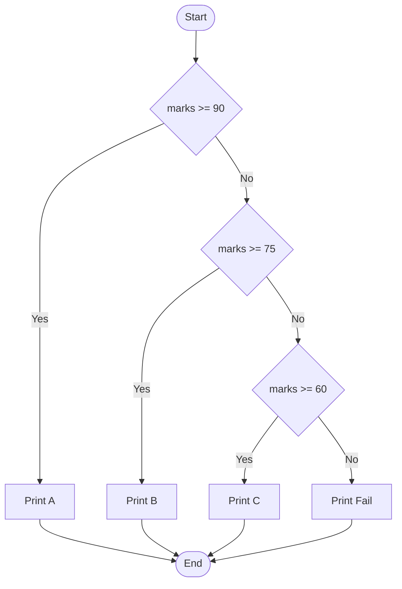

import { Aside, Badge, Card, CardGrid, Code } from '@astrojs/starlight/components';

# 🔀 C++ Selection Statements

---

## 🗺️ The Full Map

```
Selection Statements in C++
│
├── if
│   ├── if
│   ├── if-else
│   ├── if-else if-else
│   ├── nested if
│   └── if with initializer (C++17) ← Modern C++ feature!
│
├── switch
│   ├── switch statement (classic)
│   ├── [[fallthrough]] attribute (C++17) ← Explicit fall-through
│   └── constexpr if (C++17) ← Compile-time selection
│
└── Ternary Operator
    └── condition ? then : else
```

---

# if / if-else / if-else-if Ladder

---

## 🔬 if Statement

```cpp
// Form 1 — if only
if (condition) {
    // runs if condition true
}

// Form 2 — if-else
if (condition) {
    // true branch
} else {
    // false branch
}

// Form 3 — if-else if-else
if (condition1) {
    // branch 1
} else if (condition2) {
    // branch 2
} else {
    // default branch
}

// Form 4 — nested if
if (outer) {
    if (inner) {
        // both true
    }
}
```

---

## 🔑 Core Rule: Condition Must Be Contextually Convertible to `bool`

> The argument to an `if` statement **must be convertible to boolean**.
> - `int`, `ptr`, `double`, `enum class` → implicitly converted to `bool` (0/nullptr = false, else true).
> - `std::string` → ❌ Compile Error (no implicit conversion to bool).

```cpp
int x = 5;

if (x) { }                          // ✅ Valid: int → bool (0=false, non-zero=true)
if (ptr) { }                        // ✅ Valid: pointer → bool (null=false, non-null=true)
if (x == 5) { }                     // ✅ Valid: explicit comparison

if (std::string s = "hi"; s) { }    // ❌ Error: std::string has no operator bool()
if (s.empty()) { }                  // ✅ Correct way for strings

// ⚠️ Trap: Accidental assignment
if (x = 5) { }                      // ✅ Compiles! Assigns 5 to x, then checks if 5 is true.
                                    // Most compilers warn: "suggest parentheses around assignment"
```

---

## 🧱 Syntax Patterns & C++17 Init-Statement

<Code lang="cpp" title="Simple if" code={`
if (condition) {
    // executes only if condition is true
}`} />

<Code lang="cpp" title="C++17: if with initializer" code={`
// ✅ Modern C++: Declare variable scoped to if/else
if (int status = getStatus(); status > 0) {
    // status is accessible here
    process(status);
} else {
    // status is ALSO accessible here
    handleError(status);
}
// status is NOT accessible outside this if/else block

// Why? Prevents namespace pollution and ensures variable is initialized before use.
// Commonly used with locks, maps, and optional values.


// Classic — variable leaks into outer scope
auto it = map.find(key);
if (it != map.end()) {
    use(it->second);
}
// 'it' still exists here — pollutes scope

// ✅ C++17 — variable scoped to the if block
if (auto it = map.find(key); it != map.end()) {
//   ↑ initializer                ↑ condition
    use(it->second);
}
// 'it' destroyed here — clean scope


// Real patterns:
if (auto [it, ok] = map.insert({key, val}); ok) {
    // inserted successfully
}

if (int err = do_something(); err != 0) {
    handle_error(err);
}

if (std::lock_guard lock(mutex); data.ready()) {
    process(data);
}  // lock released here
`} />

<Code lang="cpp" title="if-else-if ladder" code={`
int marks = 85;

if (marks >= 90) {
    std::cout << "A grade";
} else if (marks >= 75) {
    std::cout << "B grade";
} else if (marks >= 60) {
    std::cout << "C grade";
} else {
    std::cout << "Fail";
}
// Evaluation: top-to-bottom, stops at first true condition
`} />



<Aside type="tip">
**Performance Tip**: Order conditions from **most likely to least likely**. Branch prediction hardware favors the most common path.
</Aside>

---

## Implicit Conversion to `bool` — Full Table

| Expression | Converts to `false` | Converts to `true` |
|---|---|---|
| `int` | `0` | any non-zero |
| `float` | `0.0f`, `-0.0f` | any non-zero |
| `pointer` | `nullptr` | any non-null |
| `bool` | `false` | `true` |
| `char` | `'\0'` (null) | any non-null |
| `std::string` | — | — (no implicit conversion) |
| class with `operator bool` | defined by class | defined by class |

---

## Braces Are Optional for Single Statement (But Dangerous!)

```cpp
// ✅ Valid — single statement no braces
if (x > 0)
    std::cout << "positive";

// ❌ Dangerous — dangling else + misleading indent
if (x > 0)
    std::cout << "positive";
    std::cout << "always prints";    // NOT part of if — executes always

// ✅ Always use braces — prevents bugs
if (x > 0) {
    std::cout << "positive";
}
```

> 🔑 Always use braces even for single-statement if blocks. The "dangling else" and indentation-mismatch bugs are the most common cause of silent logic errors in C++ codebases.

---

## 🟡 Modern C++ Alternatives to Switch

### 1. `constexpr if` (C++17) — Compile-Time Selection

Used in templates to discard code branches at compile time.

<Code lang="cpp" title="constexpr if" code={`
template<typename T>

void process(T value) {
    if constexpr (std::is_integral_v<T>) {
        // Compiled only if T is integral
        std::cout << "Integer: " << value << '\\n';
    } else if constexpr (std::is_floating_point_v<T>) {
        // Compiled only if T is float/double
        std::cout << "Float: " << value << '\\n';
    } else {
        // Compiled for other types
        std::cout << "Other\\n";
    }
}

// Unlike regular if, the discarded branch is NOT compiled (no syntax errors in discarded branch!)

process(42);      // compiles only integer branch
process(3.14);    // compiles only float branch
`} />

```
if constexpr:
  condition MUST be compile-time constant
  false branch is DISCARDED — not instantiated, not type-checked
  zero runtime overhead — branch selected at compile time
  binary has only one branch per instantiation
```

---

### 2. `std::variant` and `std::visit` (C++17) — Type-Safe Union

Replaces switch-on-type-id patterns.

<Code lang="cpp" title="std::visit instead of switch" code={`
#include <variant>
#include <iostream>

using Shape = std::variant<int, double, std::string>;

void printShape(const Shape& s) {
    std::visit([](const auto& arg) {
        using T = std::decay_t<decltype(arg)>;
        if constexpr (std::is_same_v<T, int>) {
            std::cout << "Int: " << arg << '\\n';
        } else if constexpr (std::is_same_v<T, double>) {
            std::cout << "Double: " << arg << '\\n';
        } else {
            std::cout << "String: " << arg << '\\n';
        }
    }, s);
}
`} />

---

### `if constexpr` vs `if` — Critical Difference

```cpp
template<typename T>
void foo(T val) {
    // ❌ Regular if — BOTH branches compiled for every T
    if (std::is_integral_v<T>) {
        val.integer_only_method();   // compile error if T=double
    }

    // ✅ if constexpr — only matching branch compiled
    if constexpr (std::is_integral_v<T>) {
        val.integer_only_method();   // only compiled when T is integral
    }
}
```

---

# switch Statement

---

## 🔑 Basic Syntax

```cpp
// Syntax
switch (expression) {
    case value1:
        // code
        break;              // ← required to prevent fall-through
    case value2:
        // code
        break;
    default:
        // runs if no case matches
        break;              // optional on last case — good practice
}
```

<Code lang="cpp" title="switch with break statements" code={`
int day = 3;

switch (day) {
    case 1:
        std::cout << "Monday";
        break;  // ← Critical: prevents fall-through!
    case 2:
        std::cout << "Tuesday";
        break;
    case 3:
        std::cout << "Wednesday";
        break;
    default:
        std::cout << "Other day";
}
`} />

---

## ⚠️ Fall-Through — Classic Trap & C++17 Fix

<Code lang="cpp" title="Missing break causes fall-through" code={`
int x = 2;
switch (x) {
    case 1:
        std::cout << "One";
        // no break → falls through!
    case 2:
        std::cout << "Two";    // ✅ runs (x == 2)
        // no break → falls through!
    case 3:
        std::cout << "Three";  // ✅ ALSO runs! 😱
        break;
    default:
        std::cout << "Default"; 
}
// Output: Two Three

// ✅ C++17: Use [[fallthrough]] to document intentional fall-through
switch (x) {
    case 1:
        doSomething();
        [[fallthrough]];  // Tells compiler & readers: "I meant to do this"
    case 2:
        doSomethingElse();
        break;
}
`} />

<Aside type="caution">
**Fall-Through Rule**: When a `case` matches, execution starts at that `case` and **continues through all subsequent cases** until a `break` (or end of switch) is reached.  
✅ Use `break` to exit after handling a case.  
✅ C++17: Use `[[fallthrough]]` attribute to suppress warnings for intentional fall-through.
</Aside>

---

## 🔬 switch Rules — Must Know

<Card title="Rule 1: Curly Braces Mandatory for switch Block" icon="approve-check">
    ```cpp
        // ✅ Valid: braces around switch body
        switch (x) {
            case 1: std::cout << "one"; break;
        }

        // ❌ Invalid: no braces (except for single-case expressions in Java 14+)
        switch (x)  // ❌ C.E: '{' expected
            case 1: std::cout << "one";
    ```
    <Aside type="note">
        **Note**: Inside individual `case` blocks, braces are optional for single statements — but **recommended** for clarity and to allow variable declarations.
    </Aside>
</Card>

<Card title="Rule 2: case and default Are Optional" icon="information">
    ```cpp
        // ✅ Valid: empty switch (useless but compiles)
        switch (x) { }

        // ✅ Valid: only default
        switch (x) {
            default: std::cout << "no match"; break;
        }

        // ✅ Valid: only cases, no default
        switch (x) {
            case 1: std::cout << "one"; break;
            case 2: std::cout << "two"; break;
        }
    ```
</Card>

<Card title="Rule 3: No Independent Statements — Must Be Under case/default" icon="error">
    ```cpp
        switch (x) {
            std::cout << "hello";  // ❌ C.E: case, default, or '}' expected
            case 1:
                std::cout << "one";
        }
        // Every statement inside switch must belong to a case or default label.
    ```
</Card>

<Card title="Rule 4: Duplicate case Labels Not Allowed" icon="error">
    ```cpp
        switch (x) {
            case 97: std::cout << "97"; break;
            case 'a': std::cout << "a"; break;  // ❌ C.E: duplicate case
            // 'a' is char literal = 97 (int), same as case 97 above
        }
    ```
    <Aside type="danger">
        **Why**: `case` labels must be **unique constant values** — compiler checks for duplicates at compile time.
    </Aside>
</Card>


<Card title="Rule 5: Expression Must Be Integral or Enum" icon="approve-check">
    ```cpp
        // ✅ Allowed: int, char, enum, bool (promoted to int)
        int i = 1; switch (i) { case 1: break; }
        char c = 'a'; switch (c) { case 'a': break; }
        enum Color { RED }; switch (RED) { case RED: break; }

        // ❌ Not Allowed: float, double, std::string, long long (in some older standards)
        // double d = 1.0; switch (d) { ... }  // ❌ Error: expression must have integral or unscoped enumeration type

        // ✅ C++20: std::string support via helper or if-else chain
        // No native string switch in C++ yet (unlike Java 7+)
    ```
</Card>

<Card title="Rule 6: case Labels Must Be Compile-Time Constants" icon="information">
    ```cpp
        const int X = 10;  // constexpr or const integral

        switch (i) {
            case X: break;  // ✅ Valid if X is constexpr or const integral initialized with constant
            
            case 10 + 5: break; // ✅ Constant expression
            
            int y = 20;
            // case y: break; // ❌ Error: case label does not reduce to an integer constant
        }
    ```
</Card>

<Card title="Rule 7: Variable Declarations in case Blocks" icon="error">
    ```cpp
        switch (x) {
            case 1:
                int y = 10;  // ⚠️ Warning/Error: jump to case label bypasses initialization
                break;
            case 2:
                std::cout << y; // y might be uninitialized!
                break;
        }

        // ✅ Fix: Add braces to scope the variable
        switch (x) {
            case 1: {
                int y = 10;  // ✅ Scoped to this block
                break;
            }
            case 2:
                // y is not visible here
                break;
        }
    ```
    <Aside type="danger">
        **Why**: Jumping into a scope where a variable is initialized without executing its initialization is Undefined Behavior. C++ forbids it unless the variable is trivially constructible (like int) but still warns.
    </Aside>
</Card>

---

## 📋 Allowed Types for switch

---

### ✅ Allowed

```
switch expression type must be:
  ├── byte, short, int, char, bool  ← integral types (promoted to int)
  ├── long long                     ← C++ standard allows it
  ├── enum (unscoped and scoped)    ← strongly recommended
  └── constexpr integral types

❌ NOT supported natively:
  float, double                     ← use if-else
  std::string                       ← use if-else or map
  classes/objects                   ← use polymorphism or if-else
```

<Code lang="cpp" title="Type examples" code={`
// ✅ Allowed types
int i = 3; switch (i) { case 3: break; }
char c = 'A'; switch (c) { case 'A': break; }
bool b = true; switch (b) { case true: break; } // bool promoted to int (1)

enum class Status { OK, ERROR };
Status s = Status::OK;
switch (s) {
    case Status::OK: break;  // ✅ Scoped enum
}

// ❌ Not allowed
double d = 3.14;
// switch (d) { case 3.14: break; }  // ❌ Error

std::string str = "hello";
// switch (str) { case "hello": break; }  // ❌ Error
`} />

<Aside type="tip">
    **String Switch Workaround**: Since C++ doesn't support `switch(std::string)`, use:
    1. `if-else if` chain (simplest).
    2. `std::map<std::string, std::function<void()>>` (dispatch table).
    3. Hash the string and switch on the hash (collision risk!).
</Aside>

---

## 🔬 Under the Hood — Assembly

---

### `if-else` → Conditional Jump

```cpp
if (x > 5) { foo(); } else { bar(); }
```

```asm
cmp eax, 5          ; compare x with 5
jle .else_branch    ; jump if x <= 5

call foo
jmp .end

.else_branch:
call bar

.end:
```

---

### `switch` → Jump Table (Optimal Case)

When cases are **dense** (contiguous or near-contiguous integers):

```cpp
switch (x) {   // x in range 0-4
    case 0: f0(); break;
    case 1: f1(); break;
    case 2: f2(); break;
    case 3: f3(); break;
    case 4: f4(); break;
}
```

```asm
; Compiler generates a JUMP TABLE
cmp eax, 4           ; bounds check
ja  .default         ; if x > 4 → default

; Jump table in .rodata:
; [addr_of_f0, addr_of_f1, addr_of_f2, addr_of_f3, addr_of_f4]

mov rdx, [jump_table + rax*8]  ; load address for case x
jmp rdx                         ; jump directly — O(1)

; vs if-else chain which is O(n) comparisons
```

```
switch O(1) jump table vs if-else O(n) comparisons:
  switch (dense) → 1 comparison + 1 indirect jump
  if-else chain  → up to N comparisons + N conditional jumps

For 100 cases: switch = 2 instructions, if-else = up to 100 comparisons
```

---

### When Compiler Uses Binary Search Instead

For **sparse** cases (large gaps between values):

```cpp
switch (x) {
    case 1:    f1(); break;
    case 100:  f2(); break;
    case 1000: f3(); break;
    case 9999: f4(); break;
}
// Gap too large for jump table (memory waste)
// Compiler uses: comparison tree (binary search) → O(log N)
```

---

## 📐 Branch Prediction — Performance Impact

```
CPU pipeline executes instructions BEFORE knowing branch result.
Mispredicted branch → pipeline flush → ~15 cycle penalty.

if-else:
  predictable pattern → near-zero overhead
  random pattern → frequent mispredictions

switch (jump table):
  indirect jump → harder to predict
  modern CPUs have indirect branch predictors
  still generally faster than long if-else chains
```

```cpp
// For extremely hot paths — branchless is fastest
// Instead of:
if (a > b) max = a;
else        max = b;

// Branchless (compiler often does this automatically):
max = a + ((b - a) & -(a < b));   // no branch — pure arithmetic
// OR:
max = (a > b) ? a : b;            // compiler may generate cmov
```

```asm
; Compiler generates conditional move (no branch):
cmp  eax, ecx
cmovl eax, ecx    ; cmov = conditional move, no branch
```

---
