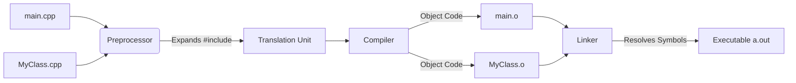

import { Aside, Badge, Card, CardGrid, Code, LinkCard } from '@astrojs/starlight/components';

## 📁 C++ Source File Structure — Complete Guide

> Unlike Java's strict single-file structure, C++ uses a **multi-file model** split into **Headers (`.h`/`.hpp`)** and **Implementation (`.cpp`)**. Understanding this separation, the Include Guard pattern, and the Linker's role is critical for writing scalable C++ code.

---

## 🏛️ Valid Source File Structure Diagram

C++ typically splits a class or module into two files:

```text
+-----------------------------+       +-----------------------------+
|  Header File (.h/.hpp)      |       |  Implementation File (.cpp) |
+-----------------------------+       +-----------------------------+
|  1. Include Guards          |       |  1. #include "MyClass.h"    |
|  2. #includes (deps)        |       |  2. #includes (other deps)  |
|  3. Namespace               |       |  3. Namespace               |
|  4. Forward Declarations    |       |  4. Method Implementations  |
|  5. Class/Struct Declaration|       |     - Constructors          |
|     - Public Members        |       |     - Methods               |
|     - Private Members       |       |                             |
+-----------------------------+       +-----------------------------+
```

### The "One Definition Rule" (ODR)
*   **Header**: Contains **declarations** (prototypes). Can be included in multiple `.cpp` files.
*   **Source**: Contains **definitions** (implementation). Compiled once per file.
*   **Linker**: Merges all object files. Ensures each function/variable is defined exactly once across the entire program.

<Code lang="cpp" title="Header File: MyClass.h" code={`
// 1. Include Guard (Prevents double inclusion)
#ifndef MYCLASS_H
#define MYCLASS_H

// 2. Includes (Only what is needed for declaration)
#include <string>
#include <vector>

// 3. Namespace
namespace myapp {

// 4. Forward Declaration (Optional optimization)
class Helper; 

// 5. Class Declaration
class MyClass {
public:
    MyClass();                  // Constructor Declaration
    void doWork();              // Method Declaration
    int getValue() const;       // Const Method Declaration
    
private:
    int value;                  // Member Variable
    std::string name;
};

} // namespace myapp

#endif // MYCLASS_H
`} />

<Code lang="cpp" title="Implementation File: MyClass.cpp" code={`
// 1. Include the corresponding header first
#include "MyClass.h"

// 2. Other includes needed for implementation
#include <iostream>
#include "Helper.h"

// 3. Namespace
namespace myapp {

// 4. Method Implementations
MyClass::MyClass() : value(0), name("Default") {
    // Constructor Body
}

void MyClass::doWork() {
    std::cout << "Working on " << name << std::endl;
    value++;
}

int MyClass::getValue() const {
    return value;
}

} // namespace myapp
`} />

<Code lang="cpp" title="Main File: main.cpp" code={`
#include <iostream>
#include "MyClass.h"  // Include the header

int main() {
    myapp::MyClass obj;  // Use namespace qualifier
    obj.doWork();
    return 0;
}
`} />

---

## ⚠️ Critical Rules — Must Know

<CardGrid>
  <Card title="Rule 1: Header Guards are Mandatory" icon="error">
```cpp
    // ❌ Dangerous: No guard
    // If included twice, compiler sees duplicate class definition → Error
    
    // ✅ Standard: #ifndef / #define / #endif
    #ifndef MYHEADER_H
    #define MYHEADER_H
    // ... content ...
    #endif
    
    // ✅ Modern C++17: #pragma once (Non-standard but widely supported)
    #pragma once
    // Cleaner, less error-prone, but technically compiler-specific.
```
    **Why**: Headers are often included by other headers. Without guards, you get "redefinition" errors.
  </Card>
  
  <Card title="Rule 2: Declaration vs. Definition" icon="information">
```cpp
    // Header (.h): Declaration (Prototype)
    void doSomething(int x); 
    
    // Source (.cpp): Definition (Body)
    void doSomething(int x) {
        // Implementation
    }
```
    **Rule**: You can declare many times, but define only once (ODR). Putting function bodies in headers (unless `inline`) causes "Multiple Definition" linker errors.
  </Card>

  <Card title="Rule 3: Namespaces Replace Packages" icon="approve-check">
```cpp
    // Java: package com.company.app;
    // C++: namespace com::company::app { ... }
    
    namespace com {
        namespace company {
            namespace app {
                class Service { };
            }
        }
    }
    
    // Usage: com::company::app::Service s;
    // Or: using namespace com::company::app; (Use sparingly!)
```
    Namespaces prevent naming collisions but **do not** map to directory structures automatically (unlike Java packages). You must manage directories manually.
  </Card>

  <Card title="Rule 4: No 'Public' Class/File Matching" icon="caution">
```cpp
    // File: Utils.h
    class Utils { };      // No 'public' keyword in C++ classes (default private)
    class Helper { };     // Multiple classes in one header is OK
    
    // File: Main.cpp
    // No requirement for filename to match class name.
    // You can have class Foo in Bar.cpp.
```
    C++ has no concept of a "public class" restricting file access. Access control (`public`/`private`) is inside the class. Filenames are arbitrary conventions.
  </Card>
</CardGrid>

---

## 🔍 Compilation & Linking Workflow

### 🧠 How C++ Compilation Works



### 💻 Compile & Link Examples

<Code lang="bash" title="Compiling and linking manually" code={`
# 1. Compile each .cpp file into an object file (.o)
g++ -c main.cpp -o main.o
g++ -c MyClass.cpp -o MyClass.o

# 2. Link object files into an executable
g++ main.o MyClass.o -o myapp

# 3. Run
./myapp

# ✅ One-step command (Compile + Link)
g++ main.cpp MyClass.cpp -o myapp
`} />

<CardGrid>
  <Card title="Undefined Reference Error" icon="error">
    **Cause**: The linker cannot find the **definition** of a function declared in a header.  
    **Fix**: Ensure the `.cpp` file containing the implementation is compiled and linked. Check for typos in namespace or class scope.
  </Card>
  
  <Card title="Multiple Definition Error" icon="error">
    **Cause**: A function or variable is defined in a header included by multiple `.cpp` files.  
    **Fix**: Move the definition to a `.cpp` file, or mark it `inline` if it must stay in the header.
  </Card>
</CardGrid>

<Aside type="note">
**Key Distinction**:  
- **Java**: `javac` compiles everything, JVM links at runtime.  
- **C++**: Compiler creates object files, **Linker** combines them into a binary. Missing a file at link time = Error.
</Aside>

---

## 🗂️ Include Statements — Deep Dive

> `#include` tells the preprocessor to **copy-paste** the content of another file into the current one. It is **physical inclusion**, unlike Java's logical import.

### ❌ Without Include — Compile Error

<Code lang="cpp" title="Missing include" code={`
// main.cpp
int main() {
    std::vector<int> v; // ❌ Error: 'vector' was not declared in this scope
    return 0;
}
`} />

### ✅ With Include — Preprocessor Expansion

<Code lang="cpp" title="Include statement" code={`
#include <vector>  // Standard library header

int main() {
    std::vector<int> v; // ✅ Works
    return 0;
}
`} />

---

## 📦 Types of Includes

### 1️⃣ System Includes (`<>`)

> Used for standard library and system headers. Compiler searches system paths.

<Code lang="cpp" title="System includes" code={`
#include <iostream>
#include <vector>
#include <string>
#include <memory>
`} />

### 2️⃣ Local Includes (`""`)

> Used for your own project headers. Compiler searches current directory and specified include paths.

<Code lang="cpp" title="Local includes" code={`
#include "MyClass.h"
#include "utils/Helper.h"
`} />

### ⚠️ Include Best Practices

1.  **Include What You Use (IWYU)**: Only include headers necessary for the **declaration** in the header file.
2.  **Forward Declare When Possible**: If you only use a pointer/reference to a class, don't include its header. Use `class MyClass;`. This reduces compile times significantly.

<Code lang="cpp" title="Forward Declaration vs Include" code={`
// MyClass.h
#include <string>   // Needed because std::string is a member by value
// #include "Helper.h"  // ❌ Not needed here!

class Helper;       // ✅ Forward declaration. Enough for pointer/reference.

class MyClass {
    std::string name;
    Helper* helperPtr;  // Pointer to Helper. Size known (ptr size).
                        // No need for full Helper definition.
};
`} />

---

## ⚠️ Naming Conflicts — Namespaces

### Case 1: Same Class Name in Different Namespaces

<Code lang="cpp" title="Namespace resolution" code={`
namespace network {
    class Socket { };
}

namespace local {
    class Socket { };
}

int main() {
    // Socket s;  // ❌ Ambiguous
    
    network::Socket s1; // ✅ Explicit
    local::Socket s2;   // ✅ Explicit
    
    using namespace network;
    Socket s3;          // ✅ Uses network::Socket
}
`} />

### Case 2: `using namespace` Risks

<Code lang="cpp" title="Avoid 'using namespace' in headers" code={`
// ❌ Bad Practice in Header (.h)
#include <vector>
using namespace std;  // Pollutes global namespace for EVERYONE who includes this header!

// ✅ Good Practice in Source (.cpp)
#include <vector>
using namespace std;  // OK here, scope is limited to this .cpp file

// ✅ Best Practice: Explicit qualification
std::vector<int> v;
`} />

<Aside type="tip">
**Pro Tip**: Never put `using namespace std;` (or any namespace) in a **header file**. It forces that namespace onto all users of your header, causing hard-to-debug conflicts.
</Aside>

---

## 🔄 Java `import` vs C++ `#include` — Critical Difference

<table>
  <thead>
    <tr>
      <th>Feature</th>
      <th>Java `import`</th>
      <th>C++ `#include`</th>
    </tr>
  </thead>
  <tbody>
    <tr>
      <td>Mechanism</td>
      <td>Logical reference (compile-time hint)</td>
      <td>Physical copy-paste (preprocessor)</td>
    </tr>
    <tr>
      <td>File Size</td>
      <td>No impact on bytecode size</td>
      <td>Increases translation unit size</td>
    </tr>
    <tr>
      <td>Compilation</td>
      <td>Fast (symbol lookup)</td>
      <td>Slow (text expansion, re-parsing)</td>
    </tr>
    <tr>
      <td>Dependency</td>
      <td>Loose coupling</td>
      <td>Tight coupling (recompile on change)</td>
    </tr>
    <tr>
      <td>Example</td>
      <td><code>import java.util.List;</code></td>
      <td><code>#include &lt;list&gt;</code></td>
    </tr>
  </tbody>
</table>

### 🏗️ Architecture Comparison Diagram

```
Java (import)                 C++ (#include)
+----------------+          +----------------+
|  Main.java     |          |  Main.cpp      |
|  import List   |          |  #include      |
+-------+--------+          |  "List.h"      |
        |                   +-------+--------+
        v                           |
+----------------+                  v (Copies text)
|  Main.class    |          +----------------+
|  (Refers to    |          |  Main.cpp      |
|   List)        |          |  (List.h code  |
+----------------+          |   inserted)    |
                            +-------+--------+
                                    |
                                    v
                            +----------------+
                            |  Main.o        |
                            |  (Large object)|
                            +----------------+
```

<Aside type="caution">
**Performance Impact**: Because `#include` copies text, changing a widely included header (e.g., `Common.h`) forces recompilation of **every file** that includes it. This is why C++ build times can be slow. Use **Forward Declarations** and **Pimpl Idiom** to mitigate this.
</Aside>

---

## 🆚 C++20 Modules — The Future

> C++20 introduces **Modules**, which aim to replace `#include` with a system more like Java imports (logical, faster, no text expansion).

<Code lang="cpp" title="C++20 Module Example" code={`
// MyModule.ixx (or .cppm)
export module MyModule;

export int add(int a, int b) {
    return a + b;
}

// main.cpp
import MyModule;  // Logical import, no text copying!

int main() {
    return add(1, 2);
}
`} />

<Aside type="note">
**Status**: Modules are supported in MSVC, GCC, and Clang, but ecosystem adoption is still growing. For now, `#include` remains the standard.
</Aside>

---

## 🖨️ `std::cout` — Full Breakdown

> Equivalent to Java's `System.out.println`.

<Code lang="cpp" title="Decomposing std::cout" code={`
#include <iostream>

int main() {
    std::cout << "Hello" << std::endl;
    // │    │    │         │
    // │    │    │         └─ Manipulator (prints newline & flushes buffer)
    // │    │    └─ Operator<< (insertion operator)
    // │    └─ out (global object of type ostream)
    // └─ std (namespace)
    
    // Alternative:
    using std::cout;
    using std::endl;
    cout << "Hello" << endl;
}
`} />

---

## 📦 Namespace Statement — Scoping in C++

> A **namespace** groups code to prevent name collisions. Unlike Java packages, they don't enforce directory structure.

<Code lang="cpp" title="Namespace nesting" code={`
namespace company {
    namespace project {
        class Service { };
    }
}

// Access:
company::project::Service s;

// Or alias:
namespace cp = company::project;
cp::Service s2;
`} />

### 🌐 Anonymous Namespace — Internal Linkage

<Code lang="cpp" title="Anonymous namespace" code={`
namespace {
    int internalHelper() { return 42; }
}

// internalHelper() is only visible in THIS .cpp file.
// Equivalent to 'static' functions in C.
// Prevents linker conflicts if another file has a function with same name.
`} />

---

## 🏗️ The Big Picture — Complete Source File Rules

```text
┌─────────────────────────────────────────────────────────┐
│              MyClass.h                                  │
│                                                         │
│  #ifndef MYCLASS_H      ← Include Guard (Required)      │
│  #define MYCLASS_H                                      │
│                                                         │
│  #include <string>      ← Dependencies                  │
│  class Helper;          ← Forward Declarations          │
│                                                         │
│  namespace myapp {      ← Namespace                     │
│      class MyClass {    ← Declaration                   │
│      public:                                            │
│          void doWork();                                 │
│      };                                                 │
│  }                                                      │
│                                                         │
│  #endif                 ← End Guard                     │
└─────────────────────────────────────────────────────────┘

┌─────────────────────────────────────────────────────────┐
│              MyClass.cpp                                │
│                                                         │
│  #include "MyClass.h"   ← Include Own Header First      │
│  #include <iostream>    ← Implementation Deps           │
│                                                         │
│  namespace myapp {      ← Namespace                     │
│      void MyClass::doWork() { ← Definition              │
│          std::cout << "Work";                           │
│      }                                                  │
│  }                                                      │
└─────────────────────────────────────────────────────────┘

ORDER IS FLEXIBLE BUT CONVENTIONAL:
Guards → Includes → Forward Decl → Namespace → Declaration
```

### 📋 Quick Rules Reference

| Rule | Description | Example |
|------|-------------|---------|
| **Include Guards** | Prevent double inclusion | `#ifndef ... #define ... #endif` |
| **Declaration in .h** | Prototypes only | `void func();` |
| **Definition in .cpp** | Implementation | `void func() { ... }` |
| **One Definition Rule** | Define once per program | Linker error if violated |
| **Namespace** | Logical grouping | `namespace foo { ... }` |
| **Forward Decl** | Reduce dependencies | `class Bar;` instead of `#include "Bar.h"` |

---

## 🎯 Interview Cheat Sheet

<CardGrid>
  <Card title="Q: What is the difference between `.h` and `.cpp`?" icon="information">
    - **`.h` (Header)**: Contains declarations (classes, function prototypes). Included by other files.
    - **`.cpp` (Source)**: Contains implementations (function bodies). Compiled into object files.
  </Card>
  
  <Card title="Q: What is an Include Guard?" icon="approve-check">
    A preprocessor directive (`#ifndef`) that ensures a header's content is only processed once per translation unit, preventing redefinition errors.
  </Card>

  <Card title="Q: What is the One Definition Rule (ODR)?" icon="caution">
    Any variable, function, class, or template must have exactly **one definition** in the entire program. Violating this causes Linker Errors.
  </Card>

  <Card title="Q: Why use Forward Declarations?" icon="rocket">
    To reduce compile-time dependencies. If you only use a pointer/reference to a class, you don't need its full definition. This speeds up builds and breaks circular dependencies.
  </Card>

  <Card title='Q: `#include <file>` vs `#include "file"`?' icon="information">
    - `<>`: Searches system/standard library paths.
    - `""`: Searches local/project paths first, then system paths.
  </Card>

  <Card title="Q: What is `namespace`?" icon="approve-check">
    A declarative region that provides a scope to identifiers (names) inside it. Used to organize code and prevent name collisions. Replaces Java's package concept for scoping.
  </Card>
</CardGrid>

---

## 🧩 DSA Angle — Competitive Coding Tips

<Code lang="cpp" title="Typical Competitive Programming Structure" code={`
#include <bits/stdc++.h>  // Non-standard header including EVERYTHING
using namespace std;      // Common in contests to save typing

int main() {
    ios_base::sync_with_stdio(false); // Speed up I/O
    cin.tie(NULL);
    
    vector<int> v = {1, 2, 3};
    sort(v.begin(), v.end());
    
    for (int x : v) cout << x << " ";
    return 0;
}
// ✅ Fast to write, slow to compile. Never use in production!
`} />

<Aside type="tip">
**Contest Strategy**: Use `<bits/stdc++.h>` and `using namespace std;` to save time. But in interviews/production, **explain why this is bad practice** (slow compilation, namespace pollution).
</Aside>

---

## 🏢 Real-Life SDE Usage — Modern CMake Project

<Code lang="cpp" title="Production-grade structure" code={`
// Project Root
// ├── CMakeLists.txt
// ├── include/
// │   └── mylib/
// │       ├── Calculator.h
// │       └── Utils.h
// └── src/
//     ├── Calculator.cpp
//     ├── Utils.cpp
//     └── main.cpp

// File: include/mylib/Calculator.h
#pragma once
#include <memory>

namespace mylib {

class CalculatorImpl; // Pimpl Forward Declaration

class Calculator {
public:
    Calculator();
    ~Calculator();
    double add(double a, double b);
    
private:
    std::unique_ptr<CalculatorImpl> pImpl; // Opaque pointer
};

} // namespace mylib
`} />

<Aside type="note">
**Production Best Practices**:
1. ✅ Use **Include Guards** (`#pragma once` or `#ifndef`)
2. ✅ Separate **Declaration** (.h) and **Implementation** (.cpp)
3. ✅ Use **Namespaces** to avoid collisions
4. ✅ Use **Forward Declarations** to minimize include dependencies
5. ✅ Use **Build Systems** (CMake, Make) to manage compilation and linking
</Aside>

---

## 🔑 Quick Reference Summary

### Source File Roles
| File Type | Extension | Content |
|-----------|-----------|---------|
| Header | `.h`, `.hpp` | Declarations, Guards, Includes |
| Source | `.cpp`, `.cc` | Implementations, Logic |
| Main | `.cpp` | Entry point (`main()`) |

### Preprocessor Directives
| Directive | Purpose |
|-----------|---------|
| `#include <file>` | Include system header |
| `#include "file"` | Include local header |
| `#ifndef GUARD` | Start include guard |
| `#define GUARD` | Define guard symbol |
| `#endif` | End include guard |
| `#pragma once` | Modern alternative to guards |

### Compilation Steps
1. **Preprocessing**: Expands `#include`, macros.
2. **Compilation**: Translates code to Assembly/Object code (`.o`).
3. **Linking**: Combines `.o` files into Executable.

<Aside type="caution">
**Final Checklist for Source Files**:
1. ✅ Always use **Include Guards** in headers
2. ✅ Keep headers **clean** (minimal includes, forward decls)
3. ✅ Use **Namespaces** for all non-trivial projects
4. ✅ Match **Declarations** in `.h` with **Definitions** in `.cpp`
5. ✅ Link all necessary **.cpp** files during build
6. ✅ Avoid `using namespace` in headers
</Aside>

---

## 🧪 Test Your Understanding

<Code lang="cpp" title="Predict compile/link behavior" code={`
// File: A.h
#ifndef A_H
#define A_H
void funcA();
#endif

// File: A.cpp
#include "A.h"
void funcA() { }

// File: B.h
#ifndef B_H
#define B_H
void funcB();
#endif

// File: B.cpp
#include "B.h"
#include "A.h"
void funcB() { funcA(); }

// File: main.cpp
#include "B.h"
int main() {
    funcB();
    return 0;
}

// Q1: What happens if we compile: g++ main.cpp B.cpp -o app?
// Q2: What happens if we forget to link A.cpp?
// Q3: What if A.h lacks include guards and is included twice in main.cpp?
`} />

<details>
<summary>✅ Click to reveal answers</summary>

```text
Q1: ❌ Linker Error: Undefined reference to `funcA()`. 
    (Because A.cpp is not compiled/linked, so funcA definition is missing.)

Q2: ❌ Linker Error: Undefined reference to `funcA()`.

Q3: ✅ Compiles Fine. 
    The second inclusion is skipped due to the #ifndef guard.
    If guards were missing: ❌ Compile Error: Redefinition of funcA.
```
</details>

<Aside type="tip">
**Pro Interview Strategy** for source structure questions:
1. Explain the **Header/Source separation** and why it exists (compilation speed, ODR).
2. Describe the **Include Guard** mechanism.
3. Contrast **`#include` (physical)** vs **Java `import` (logical)**.
4. Explain **Forward Declarations** and their benefit (compile time).
5. Discuss **Namespaces** vs Java Packages.
6. Mention **Linking** as the final step where symbols are resolved.

This demonstrates deep understanding of C++ build mechanics! 🎯
</Aside>

---

# 📁 C++ Source File Structure — Complete Deep Dive

---

## 📌 What Is Source File Structure?

How C++ code is **physically organized** across files and how those files relate during compilation.

```
C++ Source File Structure
│
├── Translation Unit        → one .cpp + all its included headers
├── Header Files            → declarations, shared across TUs
├── Source Files            → definitions, compiled once
├── Include Guards          → prevent double inclusion
├── ODR                     → One Definition Rule
├── Forward Declarations    → use before defining
├── Inline                  → definition in header, multiple TUs
├── Precompiled Headers     → speed up compilation
└── Modules (C++20)         → replace #include
```

---

## 🔷 1. Translation Unit — The Fundamental Unit

```
Translation Unit (TU) = one .cpp file + everything #included into it

main.cpp includes:
  → <iostream>     → its contents pasted in
  → "utils.hpp"    → its contents pasted in
  → "config.hpp"   → its contents pasted in

= one giant translation unit passed to the compiler
```

```
project/
├── main.cpp          → TU 1
├── server.cpp        → TU 2
├── database.cpp      → TU 3
└── utils.cpp         → TU 4

Each .cpp compiled INDEPENDENTLY → 4 object files
Linker combines 4 object files → 1 executable
```

### Compilation Pipeline Per TU

```
server.cpp
    │
    ▼ Preprocessor
    │  expand #include (paste header contents)
    │  expand #define macros
    │  strip comments
    ▼
server_preprocessed.cpp  (may be 50,000+ lines after includes)
    │
    ▼ Compiler
    │  lex → parse → semantic analysis → code gen
    ▼
server.o  (object file — machine code + symbol table)
    │
    └──► Linker combines all .o files → executable
```

---

## 🔷 2. Header Files

### What Goes In a Header

```cpp
// ✅ GOES IN HEADER (.h / .hpp)
// ─────────────────────────────────────────────────────

// Class declarations
class Foo { };

// Class definitions (full body)
class Point {
    int x, y;
public:
    Point(int x, int y);   // declaration only
    int getX() const;      // declaration only
};

// Function declarations (prototypes)
int add(int a, int b);

// Template definitions (MUST be in header)
template<typename T>
T max(T a, T b) { return a > b ? a : b; }

// inline function definitions
inline int square(int x) { return x * x; }

// constexpr function definitions
constexpr int cube(int x) { return x * x * x; }

// Type aliases
using Id = uint64_t;
using Matrix = std::vector<std::vector<double>>;

// Constants (with inline or constexpr)
inline constexpr int MAX_CONNECTIONS = 100;
constexpr double PI = 3.14159265358979;

// Macros (legacy)
#define VERSION "1.0.0"

// Enum / enum class
enum class Color { Red, Green, Blue };

// Struct declarations
struct Config { int port; std::string host; };
```

### What Does NOT Go In a Header

```cpp
// ❌ NEVER IN HEADER
// ─────────────────────────────────────────────────────

// Non-inline function definition → ODR violation if included in 2+ TUs
int add(int a, int b) { return a + b; }    // ❌

// Non-inline, non-constexpr variable definition
int global_counter = 0;                    // ❌ → defined in EVERY TU that includes

// using namespace in header → pollutes every includer's namespace
using namespace std;                       // ❌ NEVER

// Anonymous namespace → each TU gets its own copy (ODR confusion)
namespace { int x = 0; }                  // ❌ in header
```

---

## 🔷 3. Source Files (.cpp)

```cpp
// server.cpp

// 1. Own header FIRST — catches self-containment issues
#include "server.hpp"

// 2. Other project headers
#include "config.hpp"
#include "logger.hpp"

// 3. Third-party headers
#include <boost/asio.hpp>

// 4. Standard library headers
#include <string>
#include <vector>
#include <iostream>

// 5. Implementation — definitions go here
Server::Server(int port) : port_(port) { }

void Server::start() {
    // ...
}
```

### Include Order — Convention

```
1. Own header           (ensures header is self-contained)
2. Project headers      (local dependencies)
3. Third-party headers  (boost, abseil, etc.)
4. Standard headers     (STL, C stdlib)

Each group separated by blank line.
Alphabetical within each group.
```

> 🔑 **Including own header first** catches errors like forgetting to include `<string>` in the header — the header would fail to compile standalone.

---

## 🔷 4. Include Guards — Prevent Double Inclusion

### The Problem

```cpp
// a.hpp
struct Foo { int x; };

// b.hpp
#include "a.hpp"   // Foo defined once

// main.cpp
#include "a.hpp"   // Foo defined again ← ODR violation
#include "b.hpp"   // a.hpp included again through b.hpp → Foo defined 3 times!
```

### Solution 1 — Traditional Include Guard

```cpp
// a.hpp
#ifndef A_HPP           // if A_HPP not defined
#define A_HPP           // define it

struct Foo { int x; };

#endif                  // end of guard

// Second include: A_HPP is already defined → entire file skipped
```

### Solution 2 — `#pragma once` (Non-standard but Universal)

```cpp
// a.hpp
#pragma once            // ← single line, no name collision risk

struct Foo { int x; };
```

### `#pragma once` vs Include Guards

| | `#pragma once` | Traditional Guard |
|---|---|---|
| Standard | ❌ (supported everywhere) | ✅ standard C++ |
| Error-prone | ✅ no naming bugs | ❌ copy-paste name collision |
| Compile speed | ✅ compiler can skip file entirely | ✅ with optimization |
| Symlinks | ❌ same file, different path = included twice | ✅ handles symlinks |
| Production recommendation | ✅ use this | fallback if needed |

```cpp
// ❌ Classic include guard bug — wrong macro name
// file: math_utils.hpp
#ifndef MATH_UTILS_HPP
// ... code ...
#endif

// Copy-pasted to: string_utils.hpp
#ifndef MATH_UTILS_HPP   // ← forgot to rename!
// this file will be silently skipped after math_utils.hpp is included
```

---

## 🔷 5. One Definition Rule (ODR)

```
ODR = One Definition Rule

Rule 1: Every USED entity must be defined EXACTLY ONCE
        across all translation units.

Rule 2: Some entities (classes, templates, inline functions)
        may be defined in multiple TUs — but definitions
        must be IDENTICAL.
```

```
ODR Summary:
┌──────────────────────┬─────────────────────────────────────────┐
│  Entity              │  Rule                                   │
├──────────────────────┼─────────────────────────────────────────┤
│  Variable            │  defined exactly once                   │
│  Function            │  defined exactly once (unless inline)   │
│  Class               │  defined once per TU, same in all TUs  │
│  Template            │  defined once per TU, same in all TUs  │
│  inline function     │  defined in every TU that uses it,     │
│                      │  definitions must be identical          │
│  constexpr function  │  same as inline                         │
└──────────────────────┴─────────────────────────────────────────┘
```

### ODR Violations

```cpp
// ❌ ODR violation — function defined in header, included in 2 TUs
// math.hpp:
int add(int a, int b) { return a + b; }   // definition in header

// main.cpp includes math.hpp → add defined in main.o
// server.cpp includes math.hpp → add defined in server.o
// Linker: "multiple definition of add" → link error

// ✅ Fix 1 — declare in header, define in .cpp
// math.hpp:
int add(int a, int b);                     // declaration only

// math.cpp:
int add(int a, int b) { return a + b; }   // one definition

// ✅ Fix 2 — mark inline (allows multiple identical definitions)
// math.hpp:
inline int add(int a, int b) { return a + b; }   // inline definition
```

### Silent ODR Violation — Worst Kind

```cpp
// ❌ Same name, different definitions — linker picks one silently
// a.cpp:
struct Config { int timeout = 5000; };
Config get_config() { return {}; }

// b.cpp:
struct Config { int timeout = 1000; int retries = 3; };  // DIFFERENT
// both compiled fine — different TUs
// linker merges symbols — picks one definition
// behavior: undefined
// symptom: wrong timeout value, random crashes, wrong struct layout
// root cause: hours to find
```

---

## 🔷 6. Forward Declarations

```cpp
// Tell compiler "this exists" without full definition
class Foo;              // forward declare class
struct Bar;             // forward declare struct
void process(Foo* f);  // can use pointer/reference to Foo — not full object
```

### When Forward Declaration Is Enough

```cpp
// You can use Foo* or Foo& with just a forward declaration:
class Foo;
void process(Foo* f);          // ✅ pointer — no size needed
void process(const Foo& f);    // ✅ reference — no size needed
Foo* create();                 // ✅ return pointer
```

### When Forward Declaration Is NOT Enough

```cpp
class Foo;
Foo obj;               // ❌ need size — must include full definition
Foo arr[10];           // ❌ need size
sizeof(Foo);           // ❌ need size
obj.method();          // ❌ need member info
class Bar : Foo { };   // ❌ need full definition for inheritance
```

### Why Forward Declarations Matter

```cpp
// ❌ Without forward declaration — circular include
// user.hpp
#include "order.hpp"    // User has an Order
class User { Order* order; };

// order.hpp
#include "user.hpp"     // Order has a User
class Order { User* user; };
// → circular include → compile error

// ✅ With forward declaration — break the cycle
// user.hpp
class Order;            // forward declare — just need pointer
class User { Order* order; };

// order.hpp
class User;             // forward declare
class Order { User* user; };
// ✅ no circular dependency — each just uses pointer
```

---

## 🔷 7. `inline` — Definition in Header, Multiple TUs

```cpp
// math.hpp
inline int square(int x) {      // defined in header
    return x * x;
}
// Every TU that includes math.hpp gets this definition
// ODR: allowed because marked inline + definitions must be identical
// Linker: merges into one copy
```

### `inline` Variable (C++17)

```cpp
// config.hpp
inline int MAX_RETRIES = 3;    // defined in header — C++17
                               // same address in all TUs (one copy)
                               // without inline: each TU gets own copy → ODR violation

// Pre-C++17 workaround:
// In header:
extern int MAX_RETRIES;        // declaration
// In .cpp:
int MAX_RETRIES = 3;           // one definition
```

---

## 🔷 8. Typical Production File Layout

```
project/
│
├── CMakeLists.txt            build definition
├── README.md
│
├── include/                  PUBLIC headers (installed with library)
│   └── mylib/
│       ├── mylib.hpp         main public API header
│       ├── types.hpp         public type definitions
│       └── utils.hpp         public utilities
│
├── src/                      PRIVATE implementation
│   ├── mylib.cpp
│   ├── internal/
│   │   ├── detail.hpp        private implementation headers
│   │   └── detail.cpp
│   └── platform/
│       ├── linux.cpp
│       └── windows.cpp
│
├── tests/
│   ├── unit/
│   │   └── test_mylib.cpp
│   └── integration/
│       └── test_server.cpp
│
├── third_party/              vendored dependencies
│   └── json/
│       └── json.hpp
│
└── tools/                    build scripts, code gen
    └── generate_version.py
```

### Header-Only Library Layout

```
header_only_lib/
│
├── include/
│   └── mylib/
│       ├── mylib.hpp          one header — full implementation
│       ├── detail/
│       │   └── impl.hpp       implementation details (included by mylib.hpp)
│       └── config.hpp         compile-time configuration
│
└── CMakeLists.txt
```

---

## 🔷 9. Precompiled Headers (PCH)

```cpp
// pch.hpp — list of heavy, rarely-changing headers
#pragma once
#include <string>
#include <vector>
#include <unordered_map>
#include <memory>
#include <algorithm>
#include <iostream>
#include <boost/asio.hpp>     // heavy — 50K+ lines

// Each .cpp:
#include "pch.hpp"            // first include — uses precompiled version
#include "my_header.hpp"

// CMake setup:
target_precompile_headers(myapp PRIVATE pch.hpp)
```

```
Without PCH:
  Each .cpp parses all standard headers from scratch
  100 TUs × 50K lines of STL headers = 5M lines parsed repeatedly
  Build time: 3 minutes

With PCH:
  Headers parsed ONCE → saved as binary .pch
  Each .cpp loads binary directly — skip parsing
  Build time: 40 seconds
```

---

## 🔷 10. Modules (C++20)

```cpp
// math.cppm — module file
export module math;          // declare module

export int add(int a, int b) { return a + b; }
export int mul(int a, int b) { return a * b; }

int internal_helper() { return 0; }   // NOT exported — private to module

// main.cpp
import math;                 // import module — NOT #include

int main() {
    int r = add(3, 5);       // ✅ works
    int x = internal_helper(); // ❌ compile error — not exported
}
```

### `#include` vs `import`

| | `#include` | `import` (C++20) |
|---|---|---|
| Mechanism | text paste | compiled binary module |
| Parse each TU | ✅ every time | ❌ once, cached |
| Macro leakage | ✅ macros leak through | ❌ no macro leakage |
| Order dependency | ✅ matters | ❌ not needed |
| Compile speed | slow | ✅ fast |
| Adoption | universal | growing |

---

## 🔬 Under the Hood — What `#include` Actually Does

```bash
# See preprocessed output (what compiler actually receives)
g++ -E main.cpp -o main.preprocessed
wc -l main.preprocessed      # often 50,000-100,000 lines!

# Including <iostream> alone:
g++ -E -x c++ - <<< "#include <iostream>" | wc -l
# → ~40,000 lines on GCC
```

```
#include "foo.hpp"
→ preprocessor opens foo.hpp
→ reads its bytes
→ pastes them literally at this point in the file
→ process any #includes found inside foo.hpp recursively
→ result: one giant .cpp with everything inlined

This is why:
- Build times are slow (millions of lines per TU)
- PCH and modules exist
- Forward declarations matter (avoid heavy includes in headers)
```

---

## 🏭 Real-World Production Scenario

**ODR Silent Bug — Wrong struct size in shared library:**

```cpp
// v1: shared_types.hpp used by app and plugin.so
struct Event {
    int type;
    int data;
};   // sizeof = 8

// 6 months later — app.cpp team adds field to their copy:
struct Event {
    int type;
    int data;
    int timestamp;   // added — sizeof = 12
};

// plugin.so was compiled with old header (sizeof = 8)
// app.exe was compiled with new header (sizeof = 12)
// app passes Event* to plugin
// plugin reads 8 bytes, app wrote 12
// plugin.data reads app.timestamp bytes → garbage
// Symptom: random event handling failures in plugin
// Debug: 2 days — different struct sizes in different binaries
// Root cause: ODR violation across binary boundaries
// Fix: version the structs, use single source of truth header
```

---

## 🎯 Interview Traps

**Trap 1:**
```cpp
// header.hpp
int x = 5;    // problem?
```
> **ODR violation** if included in 2+ TUs. Each TU defines `x` → linker sees multiple definitions → **link error**. Fix: `extern int x;` in header, `int x = 5;` in one `.cpp`. Or `inline int x = 5;` (C++17).

**Trap 2:**
```cpp
// header.hpp
static int counter = 0;
void increment() { counter++; }
// Included in a.cpp and b.cpp
```
> `static` at file scope = internal linkage. Each TU gets its **own** `counter`. `increment()` in `a.cpp` and `increment()` in `b.cpp` modify different variables. No link error but silent logical bug — counter appears to not increment across TUs.

**Trap 3:**
```
What is the difference between a declaration and a definition?
```
> **Declaration:** tells compiler a name exists and its type. No storage allocated. Can appear multiple times. `extern int x;`, `void foo();`, `class Bar;`. **Definition:** allocates storage (for variables) or provides implementation (for functions). Can appear exactly once (per ODR). `int x = 5;`, `void foo() { }`, `class Bar { int y; };`.

**Trap 4:**
```cpp
// utils.hpp
inline void log(const std::string& msg) {
    static int count = 0;   // what happens with inline?
    count++;
    std::cout << count << ": " << msg;
}
// included in 3 TUs — how many 'count' variables?
```
> **One** — `inline` functions with `static` local variables have exactly **one** instance of the static across all TUs. The linker merges them. This is guaranteed by the standard for inline functions.

**Trap 5:**
```
Is `#pragma once` 100% equivalent to include guards?
```
> No. `#pragma once` uses the **file identity** (inode/path) to detect duplicates. If the **same file** is accessed via **two different paths** (symlinks, `../include/foo.hpp` vs `include/foo.hpp`) — `#pragma once` may include it twice. Include guards use the macro name — immune to path differences. In practice this rarely matters, but for distributed build systems with unusual filesystem layouts it can be an issue.

---
