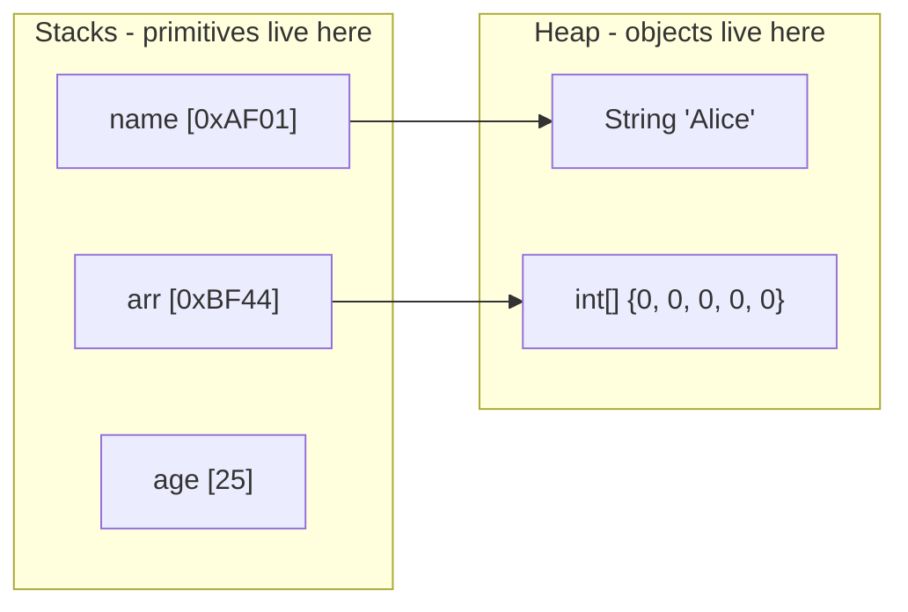

import { Aside, Badge, Card, CardGrid, Code, Steps, Tabs, TabItem } from '@astrojs/starlight/components';
import { Image } from 'astro:assets';
import BitMap from './bit-diagram.svg';

**A Data Type tells the JVM / compiler:**

➜ What *type* of data a variable can store  
➜ How much *memory* to allocate  
➜ What *operations* are allowed

---

## 📦 Classification of Java Data Types


```
Java Data Types
│
├── 🔵 Primitive Types (8 total)
│   ├── Built In, basic
│   ├── Stored in STACK
│   ├── Holds actual VALUE
│   └── Faster, memory efficient
│
└── 🟠 Reference Types (Non-Primitive)
    ├── References / object
    ├── Stored in HEAP
    ├── Holds REFERENCE (address) to object
    └── String, Arrays, Classes, Interfaces
```

---

## 🔹 A) Primitive Data Types (8)

> These store actual values **directly** in memory — no object overhead, no GC pressure.

```

PRIMITIVE DATA TYPES (8)
       │
       ├── Numeric Data Types (to represent numbers)
       │   │
       │   ├── Integral Data Types (to represent whole numbers)
       │   │   ├── byte
       │   │   ├── short
       │   │   ├── int
       │   │   └── long
       │   │
       │   └── Floating Point Data Types (to represent real numbers)
       │       ├── float
       │       └── double
       │
       ├── Char Datatypes (to represent characters)
       │   └── char
       │
       └── Boolean Data Types (to represent logical values)
           └── Boolean
```

<Aside type="note">
`boolean` and `char` are the only **unsigned** primitives. All others (`byte`, `short`, `int`, `long`, `float`, `double`) are **signed** — they can hold both positive and negative values.
</Aside>

### 📊 Complete Reference Table

`1 byte = 8 bits`

<table>
  <thead>
    <tr>
      <th>Type</th><th>Size</th><th>Default</th><th>Range</th><th>Example</th>
    </tr>
  </thead>
  <tbody>
    <tr>
      <td>byte</td>
      <td>1 byte</td><td>`0`</td>
      <td>−128 → 127</td>
      <td>`byte b = 10;`</td>
    </tr>
    <tr>
      <td>short</td>
      <td>2 bytes</td><td>`0`</td>
      <td>−32 768 → 32 767</td>
      <td>`short s = 200;`</td>
    </tr>
    <tr>
      <td>int</td>
      <td>4 bytes</td><td>`0`</td>
      <td>−2 147 483 648 → 2 147 483 647</td>
      <td>`int x = 100;`</td>
    </tr>
    <tr>
      <td>long</td>
      <td>8 bytes</td><td>`0L`</td>
      <td>−2⁶³ → 2⁶³−1</td>
      <td>`long l = 999L;`</td>
    </tr>
    <tr>
      <td>float</td>
      <td>4 bytes</td><td>`0.0f`</td>
      <td>±3.4 × 10³⁸ (6–7 sig digits)</td>
      <td>`float f = 10.5f;`</td>
    </tr>
    <tr>
      <td>double</td>
      <td>8 bytes</td><td>`0.0d`</td>
      <td>±1.7 × 10³⁰⁸ (14–15 sig digits)</td>
      <td>`double d = 10.5;`</td>
    </tr>
    <tr>
      <td>char</td>
      <td>2 bytes</td><td>`'\u0000'`</td>
      <td>0 → 65 535 (Unicode)</td>
      <td>`char c = 'A';`</td>
    </tr>
    <tr>
      <td>boolean</td>
      <td>JVM-dependent</td><td>`false`</td>
      <td>`true` / `false` only</td>
      <td>`boolean flag = true;`</td>
    </tr>
  </tbody>
</table>

---

### 🔍 Deep-Dives Per Type

## 🔢 Integer Types
## byte → short → int → long *(increasing size)*

**🧠 Suitable For:**
- `byte` → file / network byte streams
- `short` → legacy 16-bit systems (basically obsolete today)
- `int` → almost everything — **default choice**
- `long` → timestamps, large IDs (`System.currentTimeMillis()`)

<Code lang="java" title="Integer type examples" code={`
byte b = 10;
byte b2 = 130;   // ❌ C.E: possible loss of precision (130 > 127)
byte b3 = 10.5f; // ❌ C.E: decimal → whole
byte b4 = true;  // ❌ C.E: incompatible types

short s = 200;
short s2 = 32768; // ❌ C.E: possible loss of precision

long population = 8_000_000_000L; // ✅ L suffix required!
`}/>


**⚠️ NEVER use `float`/`double` for money!**

```java
double price = 0.1 + 0.2;
System.out.println(price); // 0.30000000000000004 😱
```

**✅ Use `BigDecimal` for financial calculations**

```java
BigDecimal amount = new BigDecimal("0.1").add(new BigDecimal("0.2"));
System.out.println(amount); // 0.3 ✅
```


<Aside type="tip">
**Why 0.1 + 0.2 ≠ 0.3?**  
Floats use **IEEE 754 binary representation**.  
`0.1` in binary = `0.000110011001100...` (repeating!) → computer truncates → tiny error accumulates.
</Aside>

<Code lang="java" title="Float vs Double" code={`
float f  = 10.5f;   // ✅ needs f suffix
float f2 = 10.5;    // ❌ C.E: possible loss of precision (double → float)

double d = 10.5;    // ✅ default decimal literal is double
double d2 = 10.5d;  // ✅ explicit d suffix (optional)
`}/>


**Java `char` = 2 bytes (Unicode), not 1 byte ASCII like C/C++**

```java
char c1 = 'A';        // ✅ character literal
char c2 = 65;         // ✅ integer value → 'A'
char c3 = '\u0041';   // ✅ Unicode escape → 'A'
```


<Code lang="java" title="char arithmetic — critical for DSA!" code={`
System.out.println((int) 'A');        // 65
System.out.println('A' + 1);          // 66 (int arithmetic!)
System.out.println((char)('A' + 1));  // B

// char is UNSIGNED in Java (0–65535)
// unlike C/C++ where char can be signed
`}/>


**🔥 DSA Critical Ranges — memorise these:**

| Char | Value |
|------|-------|
| `'A'`–`'Z'` | 65–90 |
| `'a'`–`'z'` | 97–122 |
| `'0'`–`'9'` | 48–57 |

Used in almost every string/array DSA problem (`c - 'a'` indexing trick).


<Code lang="java" title="boolean — Java vs C/C++" code={`boolean flag = true;

// ❌ C/C++ style — will NOT compile in Java
if (x)       { }   // x is int, not boolean
while (1)    { }   // 1 is int, not boolean

// ✅ Java style
if (x != 0)  { }
while (true) { }

// ✅ Clean boolean idiom (remove redundant comparison)
if (isActive == true)  { }  // ❌ redundant
if (isActive)          { }  // ✅
if (!isEmpty)          { }  // ✅`}/>

<Aside type="caution">
Size of `boolean` is **not defined by the Java spec** — it is JVM-dependent. HotSpot typically uses 1 byte or 4 bytes depending on context.
</Aside>

---

## 🔬 Visual: How `byte` Stores Data

<Image src={BitMap} alt="Bit Map" width='1000' height='1000'/>

<Aside type="note">
**+ve numbers** are stored directly in binary.  
**−ve numbers** are stored in **2's complement** form.  
The MSB (Most Significant Bit) is always the **sign bit**.
</Aside>

---

## ⚠️ Common Compile Errors (Type Compatibility)

<CardGrid>
  <Card title="❌ Loss of Precision" icon="error">
    ```java
    byte b = 130;    // C.E: 130 > 127
    byte b = 10.5;   // C.E: decimal → whole
    float f = 10.5;  // C.E: double → float (missing f)
    long l = 999;    // ✅ fine (int fits in long)
    long l = 9999999999; // ❌ C.E: needs L suffix
    ```
  </Card>
  <Card title="❌ Incompatible Types" icon="error">
    ```java
    byte b = true;     // C.E: boolean ≠ byte
    byte b = "ashok";  // C.E: String ≠ byte

    int x = 0;
    if (x) { }         // C.E: int ≠ boolean
    while (1) { }      // C.E: int ≠ boolean
    ```
  </Card>
</CardGrid>

---

## 🔹 B) Non-Primitive (Reference) Types

> All reference types store a **memory address**, not the value itself.

**Examples:** `String`, `Array`, `Class`, `Interface`, `Object`

<Code lang="java" title="Stack vs Heap — Reference visualization" code={`String name = "Alice";
// Stack: name → (ref addr)   Heap: "Alice" object

int[] arr = new int[5];
// Stack: arr → (ref addr)    Heap: [0, 0, 0, 0, 0]`}/>



<Aside type="note">
Default value for any **Object Reference** is `null`.  
Calling a method on a `null` reference → `NullPointerException` 💥
</Aside>

---

## 🔬 Primitive vs Non-Primitive — Quick Comparison

<table>
  <thead>
    <tr>
      <th>Feature</th><th>Primitive</th><th>Reference (Non-Primitive)</th>
    </tr>
  </thead>
  <tbody>
    <tr><td>Stores</td><td>Actual value</td><td>Memory address</td></tr>
    <tr><td>Memory location</td><td>Stack</td><td>Heap</td></tr>
    <tr><td>Methods</td><td>❌ None</td><td>✅ Yes (`.length()`, `.equals()`, …)</td></tr>
    <tr><td>Size</td><td>Fixed</td><td>Depends on object</td></tr>
    <tr><td>Default value</td><td>0 / false / '\u0000'</td><td>`null`</td></tr>
    <tr><td>Garbage collected</td><td>❌ No</td><td>✅ Yes</td></tr>
    <tr><td>Nullable</td><td>❌ No</td><td>✅ Yes</td></tr>
  </tbody>
</table>

---

## ⚡ Default Values Cheatsheet

<table>
  <thead><tr><th>Type</th><th>Default</th></tr></thead>
  <tbody>
    <tr><td>`byte`, `short`, `int`, `long`</td><td>`0`</td></tr>
    <tr><td>`float`</td><td>`0.0f`</td></tr>
    <tr><td>`double`</td><td>`0.0d`</td></tr>
    <tr><td>`boolean`</td><td>`false`</td></tr>
    <tr><td>`char`</td><td>`'\u0000'` (null char)</td></tr>
    <tr><td>Any Object / Reference</td><td>`null`</td></tr>
  </tbody>
</table>

<Aside type="caution">
⚠️ Default values apply to **class-level (instance/static) fields only**.  
**Local variables have NO default** — using an uninitialized local → compile error.
</Aside>

---

## 🧠 Interview Traps 🔥


**🔥 TRAP 1 — Suffix typos**
```java
float f  = 10.5f; // ✅
float f2 = 10.5;  // ❌ C.E: possible loss of precision (double literal)

long l  = 999L;   // ✅
long l2 = 99999999999; // ❌ C.E: integer too large (needs L)
```

**🔥 TRAP 2 — boolean ≠ int (unlike C/C++)**
```java
if (x)      { } // ❌ Java
if (x != 0) { } // ✅ Java
```

**🔥 TRAP 3 — char arithmetic returns int**
```java
char c = 'A' + 1; // ❌ C.E: int cannot be stored in char
char c = (char)('A' + 1); // ✅
```

**🔥 TRAP 4 — float/double precision**
```java
0.1 + 0.2 == 0.3 // false in Java! Use BigDecimal for money.
```

**🔥 TRAP 5 — byte overflow at compile time vs runtime**
```java
byte b = 127 + 1; // ❌ C.E at compile time (constant expression overflow)
byte a = 127;
a++;              // ✅ compiles, but wraps to -128 at runtime!
```

---

## 📌 Why Primitive Types Matter for DSA

<CardGrid>
  <Card title="⚡ Speed" icon="rocket">
    Primitives skip object creation and GC — critical in tight loops and competitive programming.
  </Card>
  <Card title="📦 Stack Allocation" icon="open-book">
    Auto-managed, faster access. No heap lookup needed.
  </Card>
  <Card title="🎯 Fixed Size" icon="approve-check">
    No size surprises — `int` is always 32 bits everywhere (unlike C/C++).
  </Card>
  <Card title="🔢 char for Indexing" icon="information">
    `char - 'a'` gives 0–25 index — used in frequency arrays, sliding window, tries.
  </Card>
</CardGrid>

---

## 🔗 DSA Connection

| Type | DSA Use Case |
|------|-------------|
| `int` | Default for indices, counters, DP arrays |
| `long` | Large sums, overflow-safe multiplication |
| `char` | Frequency arrays `int[26]`, string manipulation |
| `boolean` | Visited arrays, flags in BFS/DFS |
| `byte[]` | I/O buffering, byte-level manipulation |
| `double` | Geometry, probability problems |

<Aside type="tip">
**Interview Tip:** In competitive coding / FAANG rounds, always check if the result can exceed `Integer.MAX_VALUE` (~2B). If yes, use `long`. Example: summing `n` numbers where `n = 10⁵` and each is up to `10⁹` → sum can be `10¹⁴`, which overflows `int` silently!
</Aside>
