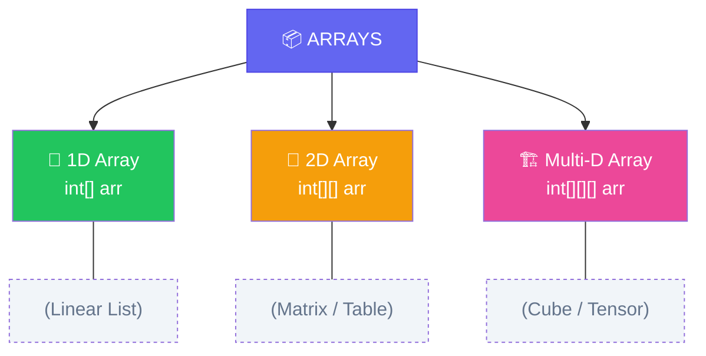
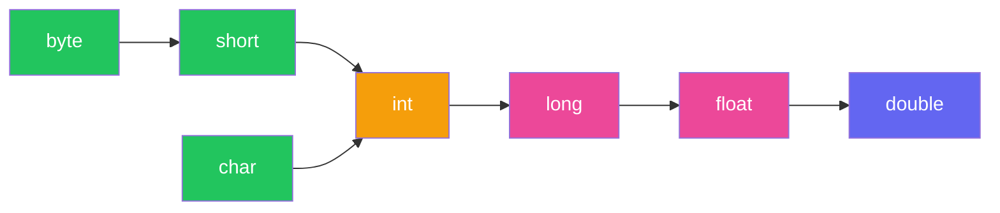

import { Aside, Badge, Card, CardGrid, Code, LinkCard } from '@astrojs/starlight/components';

## 📦 What is an Array?

An **Array** is an object with a **fixed-size container** that stores multiple values of the **same data type** under one name.

### 🔑 Key Characteristics

| Feature | Detail |
|---------|--------|
| **Type** | 🔵 Reference Type (stored in **Heap**) |
| **Size** | 🔒 **Fixed** — cannot change after creation |
| **Index** | 🔢 Starts from `0` to `length - 1` |
| **Elements** | 🎯 **Homogeneous** — same data type only |

```java
int[] arr = {10, 20, 30};
// Index →   0    1    2
// Value →  10   20   30`}
```

---

## 🗂️ Types of Arrays



---

## 🏗 How Arrays Work Internally

<Code lang="java" title="Memory layout visualization" code={`
int[] arr = {10, 20, 30, 40, 50};

// STACK (Reference)          HEAP (Object Data)
// ┌────────────────┐         ┌─────────────────────────────────┐
// │ arr  [ref/add] ──────────→│ [10] [20] [30] [40] [50]              │
// └────────────────┘         │  0    1    2    3    4  ← index       │ 
//                               │ 100  104  108  112  116 ← addr        |  
//                               └─────────────────────────────────┘
//                                each int = 4 bytes, contiguous!
`} />

### 🔍 Why O(1) Random Access?

```
address of arr[i] = base_address + (i × size_of_type)
arr[3] = 100 + (3 × 4) = 112 ✅ — direct jump!
```

> ✔ `arr` → reference variable (Stack)  
> ✔ Actual array data → stored in Heap (contiguous memory)

<Aside type="note">
**Default value for `int[]` is `0`**. All primitive arrays get type-appropriate defaults: `0`, `0.0`, `false`, `'\u0000'`.
</Aside>

---

## 📌 Declaration Styles

<Code lang="java" title="✅ Valid declarations" code={`
int[] arr;       // Recommended (Type clarity)
int arr[];       // C-style (Valid but less clear)
int []arr;       // Valid (Weird spacing, but works)

// Multi-dimensional (all valid):
int[][] a; int [][]a; int a[][];
int[] []a; int[] a[]; int []a[];
`} />

<Code lang="java" title="❌ Invalid declarations" code={`
int[5] arr;            // ❌ C.E: Size NOT allowed in declaration
int[] arr = new int[]; // ❌ C.E: Size MUST be specified with 'new'
`} />

---

## 1️⃣ Single-Dimensional Arrays

### Declaration & Instantiation

<Code lang="java" title="Dynamic initialization" code={`int[] arr = new int[5];  // Size mandatory with 'new'
// Default values: 0, 0.0, false, '\u0000', null`} />

### Default Values Reference

| Type | Default Value |
|------|--------------|
| `byte`, `short`, `int`, `long` | `0` |
| `float` | `0.0f` |
| `double` | `0.0d` |
| `boolean` | `false` |
| `char` | `'\u0000'` |
| Object/Reference | `null` |

<Aside type="caution">
⚠️ Default values apply to **instance/static fields only**.  
**Local variables have NO default** — using uninitialized local → compile error.
</Aside>

---

## 2️⃣ Multi-Dimensional Arrays

### 🧠 Java Supports Jagged Arrays!

Rows can have **different lengths** — no rectangular constraint.

<Code lang="java" title="Jagged 2D array" code={`int[][] arr = new int[2][];  // Only first dimension required
arr[0] = new int[3];          // Row 0: 3 elements
arr[1] = new int[5];          // Row 1: 5 elements (different!)`} />

<Code lang="java" title="3D jagged array example" code={`int[][][] a = new int[2][][]; 
a[0] = new int[3][]; 
a[0][0] = new int[1]; 
a[0][1] = new int[2]; 
a[0][2] = new int[3]; 
a[1] = new int[2][2]; // Fully specified sub-array`} />

### 📐 Dimension Rules

<Code lang="java" title="✅ Valid multi-dim creations" code={`int[][] a = new int[3][4];    // ✅ Rectangular
int[][] b = new int[3][];      // ✅ Jagged (first dim only)
int[][][] c = new int[3][4][5]; // ✅ 3D rectangular
int[][][] d = new int[3][4][];  // ✅ 3D jagged`} />

<Code lang="java" title="❌ Invalid multi-dim creations" code={`int[][] a = new int[][];      // ❌ C.E: dimension missing
int[][] b = new int[][4];      // ❌ C.E: ']' expected (can't skip first dim)
int[][][] c = new int[3][][5]; // ❌ C.E: ']' expected (must fill left-to-right)`} />

<Aside type="tip">
**Rule**: When specifying dimensions with `new`, you **must fill from left to right**. You can omit trailing dimensions, but never leading ones.
</Aside>

---

## ⚙ Important Properties

### 1️⃣ `length` Property (Not a Method!)

<Code lang="java" title="Using .length" code={`int[] arr = {10, 20, 30};
System.out.println(arr.length);  // ✅ 3 (property, no parentheses)
// System.out.println(arr.length()); // ❌ C.E: not a method`} />

### 2️⃣ Indexing & Bounds

```java
arr[0]      // ✅ First element
arr[-1]     // ❌ Runtime: ArrayIndexOutOfBoundsException
arr[5]      // ❌ Runtime: if length <= 5
```

### 🔬 Strongly Typed Nature

<Code lang="java" title="Type safety at compile time" code={`int[] arr = new int[3];
arr[0] = 10;      // ✅
arr[1] = 10.5;    // ❌ C.E: possible loss of precision (double → int)
arr[2] = 'A';     // ✅ char promotes to int (ASCII 65)`} />

---

## ⚡ Primitive vs Object Arrays

| Feature | Primitive Array | Object Array |
|---------|----------------|--------------|
| **Stores** | Actual values | References (addresses) |
| **Memory** | Contiguous values | Contiguous references |
| **Speed** | ⚡ Faster | Slightly slower (indirection) |
| **Default** | `0`, `false`, etc. | `null` |
| **Example** | `int[]`, `double[]` | `String[]`, `Object[]` |

<Code lang="java" title="Object array default values" code={`String[] names = new String[3];
System.out.println(names[0]);  // null (not empty string!)
names[0] = "Alice";            // ✅ Now points to String object in Heap`} />

---

## 📌 Anonymous Arrays

An array **without a reference variable** — useful for one-time method calls.

<Code lang="java" title="Anonymous array syntax" code={`// Syntax: new Type[]{values}
public static void sum(int[] x) { ... }

// ✅ Valid: Pass anonymous array directly
sum(new int[]{10, 20, 30});

// ✅ Multi-dimensional anonymous array
int[][] matrix = new int[][] { 
    {1, 2, 3}, 
    {4, 5, 6}, 
    {7, 8, 9} 
};

// ❌ Invalid: Size not allowed with initializer list
// new int[3]{10, 20, 30};  // C.E`} />

---

## 🧠 Array Assignment Rules

### 🔢 Element-Level Promotions (Primitive Arrays)

<Code lang="java" title="Allowed promotions for int[]" code={`int[] a = new int[10]; 
a[0] = 97;        // ✅ int literal
a[1] = 'a';       // ✅ char → int (ASCII 97)
byte b = 10; 
a[2] = b;         // ✅ byte → int
short s = 20; 
a[3] = s;         // ✅ short → int
a[4] = 10L;       // ❌ C.E: long → int needs cast`} />

**Promotion Chain**:


### 🔗 Reference-Level Assignments

<Code lang="java" title="Object array covariance" code={`// ✅ Child array → Parent array reference (covariance)
String[] s = {"A", "B"};
Object[] o = s;  // ✅ String[] is-a Object[]

// ❌ But element assignment can fail at runtime:
o[0] = new Integer(10);  // 💥 ArrayStoreException at runtime!`} />

<Code lang="java" title="Array reference reassignment" code={`int[] a = {10, 20, 30, 40, 50}; 
int[] b = {80, 90}; 

a = b;  // ✅ Valid: a now references b's array (size doesn't matter)
b = a;  // ✅ Valid: both reference same array

// Dimensions MUST match:
int[][] x = new int[3][];
x[0] = new int[4];   // ✅ 1D array into 2D row
// x[0] = 10;        // ❌ C.E: int ≠ int[]
// x[0] = new int[4][5]; // ❌ C.E: int[][] ≠ int[]`} />

<Aside type="danger">
**Covariance Trap**: `String[]` → `Object[]` is allowed at compile time, but inserting wrong type causes `ArrayStoreException` at runtime.
</Aside>

---

## 🧠 Array Size Rules

| Rule | Example | Result |
|------|---------|--------|
| Size **mandatory** with `new` | `new int[]` | ❌ C.E: dimension missing |
| Size **zero** is legal | `new int[0]` | ✅ Valid, `length = 0` |
| **Negative** size | `new int[-3]` | ❌ Runtime: `NegativeArraySizeException` |
| Size type must be `byte/short/char/int` | `new int[10L]` | ❌ C.E: possible loss of precision |
| Max size = `Integer.MAX_VALUE` | `new int[2147483647]` | ✅ (but may cause `OutOfMemoryError`) |

<Code lang="java" title="Size type examples" code={`int[] a = new int['a'];    // ✅ char → int (97)
byte b = 10;
int[] c = new int[b];      // ✅ byte → int
short s = 20;
int[] d = new int[s];      // ✅ short → int
int[] e = new int[10L];    // ❌ C.E: long → int needs cast
int[] f = new int[10.5];   // ❌ C.E: double → int not allowed`} />

---

## 🔄 Array Traversal

<Code lang="java" title="Three ways to iterate" code={`int[] arr = {10, 20, 30, 40, 50};

// Way 1 — classic for loop
for (int i = 0; i < arr.length; i++) {
    System.out.println(arr[i]);
}

// Way 2 — enhanced for-each loop
for (int num : arr) {
    System.out.println(num);
}

// Way 3 — Java 8 streams
Arrays.stream(arr).forEach(System.out::println);`} />

<Aside type="tip">
**For-each loop** is cleaner and avoids `IndexOutOfBoundsException`, but you lose index access. Use classic `for` when you need the index.
</Aside>

---

## 🚨 Common Runtime Exceptions

<CardGrid>
  <Card title="ArrayIndexOutOfBoundsException" icon="error">
    ```java
    int[] arr = new int[5];
    System.out.println(arr[5]);  // 💥 Valid indices: 0-4
    ```
    **Cause**: Accessing index `< 0` or `>= length`  
    **Type**: Unchecked `RuntimeException`
  </Card>
  
  <Card title="NegativeArraySizeException" icon="error">
    ```java
    int[] arr = new int[-5];  // 💥 at runtime
    ```
    **Cause**: Creating array with negative size  
    **Type**: Unchecked `RuntimeException`
  </Card>
  
  <Card title="NullPointerException" icon="error">
    ```java
    int[] arr = null;
    System.out.println(arr.length);  // 💥
    // Or jagged array:
    int[][] jagged = new int[2][];
    System.out.println(jagged[0][0]);  // 💥 jagged[0] is null
    ```
    **Cause**: Accessing member/element of `null` reference
  </Card>
</CardGrid>

---

## 🔥 Interview Traps

<CardGrid>
  <Card title="Trap 1 — Declaration vs Initialization" icon="error">
    ```java
    int[] arr;
    arr = {1, 2, 3};  // ❌ C.E: array initializer not allowed here
    // FIX: Must combine or use 'new':
    int[] arr = {1, 2, 3};           // ✅
    // OR
    int[] arr; arr = new int[]{1,2,3}; // ✅
    ```
  </Card>
  
  <Card title="Trap 2 — Anonymous array size" icon="error">
    ```java
    new int[3]{1, 2, 3};  // ❌ C.E: size not allowed with values
    new int[]{1, 2, 3};   // ✅ Size inferred from values
    ```
  </Card>
  
  <Card title="Trap 3 — Jagged array null rows" icon="error">
    ```java
    int[][] arr = new int[2][];
    System.out.println(arr[0]);      // null (not an array yet!)
    System.out.println(arr[0][0]);   // 💥 NullPointerException
    // FIX: Initialize each row first
    arr[0] = new int[3];
    System.out.println(arr[0][0]);   // ✅ 0
    ```
  </Card>
  
  <Card title="Trap 4 — Array covariance runtime check" icon="error">
    ```java
    Object[] objs = new String[2];  // ✅ compiles
    objs[0] = "hello";              // ✅
    objs[1] = 123;                  // 💥 ArrayStoreException at runtime!
    ```
  </Card>
</CardGrid>

---

## 📌 DSA Connection

| Type | DSA Use Case |
|------|-------------|
| `int[]` | Frequency arrays, prefix sums, DP tables |
| `boolean[]` | Visited flags in BFS/DFS, sieve of Eratosthenes |
| `char[]` | In-place string manipulation (faster than `String`) |
| `int[][]` | Matrices, graph adjacency, 2D DP |
| `int[][][]` | 3D DP, volumetric problems |

<Aside type="tip">
**Pro Tip**: In competitive programming, prefer `char[]` over `String` for in-place edits — avoids creating new immutable `String` objects on every change.
</Aside>

<Code lang="java" title="Frequency array pattern" code={`// Count lowercase letters: O(n) time, O(1) space
int[] freq = new int[26];  // 'a'-'z'
for (char c : input.toCharArray()) {
    freq[c - 'a']++;  // 'a'→0, 'b'→1, ... 'z'→25
}`} />

---

## 🧪 Quick Self-Test

<Code lang="java" title="Predict the output" code={`class Test {
    public static void main(String[] args) {
        int[] a = {1, 2, 3};
        int[] b = a;
        b[0] = 99;
        System.out.println(a[0]);  // ?
        
        String[] s1 = {"X", "Y"};
        String[] s2 = new String[2];
        s2 = s1;
        System.out.println(s2.length);  // ?
    }
}`} />

<details>
<summary>✅ Click to reveal answers</summary>

```text
99        // a and b reference same array
2         // s2 now references s1's array
```
</details>

---

## 🔗 Related Topics

<CardGrid columns={2}>
  <LinkCard
    title="Java Literals"
    href="/computer-languages/java/topics/literals"
    description="Fixed values, number systems, escape sequences"
  />
  <LinkCard
    title="Java Data Types"
    href="/computer-languages/java/topics/data-types"
    description="Primitives, memory layout, type compatibility"
  />
  <LinkCard
    title="Java Strings"
    href="/computer-languages/java/topics/strings"
    description="Immutability, pool, methods, performance"
  />
  <LinkCard
    title="Java Memory Model"
    href="/computer-languages/java/topics/memory"
    description="Stack vs Heap, GC, references deep-dive"
  />
</CardGrid>


## 🗂️ Uninitialized Arrays in Java — 3 Levels

### Core Concept: Reference vs. Object

In Java, an array variable is a **reference**. Declaring it does **not** create the array object itself.

<Code lang="java" title="Declaration vs. Initialization" code={`int[] arr;              // 1. Reference declared (Uninitialized → null)
arr = new int[5];       // 2. Object created in Heap (Initialized)`} />

| State | Meaning |
|-------|---------|
| **Uninitialized Reference** | Points to `null` — no object exists yet |
| **Initialized Reference** | Points to an actual Array Object in Heap |

<Aside type="note">
**Key Rule**: Only the *reference* is stored on the Stack. The actual array object lives on the Heap. If the reference is `null`, there is **no object** to access.
</Aside>

---

## 1️⃣ Instance Level (Non-Static Field)

Belongs to an **object**. Created when the object is instantiated.

<Code lang="java" title="Instance array — uninitialized" code={`class Student {
    int[] marks;  // declared but NOT initialized → default: null

    void show() {
        System.out.println(marks);        // prints: null ✅
        System.out.println(marks[0]);     // 💥 NullPointerException!
    }
}`} />

```text
Memory Layout:

STACK (inside object)          HEAP
┌────────────────┐           ┌─────────┐
│ marks │  null  │ ──▶       │ (empty) │
└────────────────┘           └─────────┘
   ↑
   Reference exists, but points to NOTHING
```

<Aside type="tip">
✅ **Declaration is safe** — `marks` gets default value `null`.  
💥 **Access crashes** — `marks[0]` throws `NullPointerException` at **runtime**.
</Aside>

---

## 2️⃣ Static Level (Class Variable)

Belongs to the **class itself**. Shared across all instances.

<Code lang="java" title="Static array — uninitialized" code={`class Student {
    static int[] marks;  // declared but NOT initialized → default: null

    public static void main(String[] args) {
        System.out.println(marks);        // prints: null ✅
        System.out.println(marks[0]);     // 💥 NullPointerException!
    }
}`} />

```text
Stored in: Method Area (Metaspace in Java 8+)
Default value: null ✅
Crash trigger: Runtime — only when you ACCESS the null reference 💥
```

<Aside type="note">
Static and instance reference fields behave identically: both default to `null` and crash only on access, not declaration.
</Aside>

---

## 3️⃣ Local Level (Inside Method)

Belongs to a **method/block scope**. Shortest lifetime.

<Code lang="java" title="Local array — uninitialized" code={`void calculate() {
    int[] marks;  // declared but NOT initialized

    System.out.println(marks);    // ❌ COMPILE ERROR
    System.out.println(marks[0]); // ❌ COMPILE ERROR
}`} />

```text
Compiler Output:
"variable marks might not have been initialized"
```

<Aside type="danger">
🔒 **Local variables get NO default value**.  
The compiler catches uninitialized usage at **compile time** — fails fast, safer than instance/static!
</Aside>

---

## 🧩 Variable Type Matrix

Every Java variable falls into one of these combinations:

```
                    ┌─────────────────┐
                    │   Java Variable │
                    └────────┬────────┘
                             │
        ┌────────────────────┼────────────────────┐
        ↓                    ↓                    ↓
   ┌─────────┐      ┌─────────────┐      ┌─────────────┐
   │ Scope   │      │ Data Type   │      │ Result    │
   ├─────────┤      ├─────────────┤      ├─────────────┤
   │ Instance│      │ Primitive   │      │ int x=0   │
   │ Static  │ ───▶ │ Reference   │ ───▶ │ int[] a=null │
   │ Local   │      │             │      │ (C.E if used) │
   └─────────┘      └─────────────┘      └─────────────┘
```

<Code lang="java" title="All combinations example" code={`class Test {
    // Instance + Reference
    int[] instanceRef = new int[3];  // ✅ initialized
    int[] instanceRefNull;           // ✅ null by default

    // Static + Primitive
    static int staticPrim = 20;      // ✅ 20
    static int staticPrimDefault;    // ✅ 0 by default

    public static void main(String[] args) {
        // Local + Reference
        String localRef = "xyz";     // ✅ initialized
        // String localRefNull;      // ⚠️ declared but...
        // System.out.println(localRefNull); // ❌ C.E!
    }
}`} />

---

## 🆚 Comparison Table

| Level | Default Value | When Does It Crash? | Error Type |
|-------|--------------|---------------------|------------|
| **Instance** | `null` | Runtime — on access (`arr[0]`) | `NullPointerException` |
| **Static** | `null` | Runtime — on access (`arr[0]`) | `NullPointerException` |
| **Local** | ❌ None | Compile time — on use | "variable might not have been initialized" |

<Aside type="tip">
**Fail-Fast Principle**: Local variables force you to initialize before use, preventing subtle runtime bugs. Instance/static references can hide `null` until accessed — always null-check!
</Aside>

---

## 🎯 Interview Cheat Sheet

<CardGrid>
  <Card title="Q: null array vs. empty array?" icon="information">
    ```java
    int[] nullArr = null;        // Reference points to nothing
    int[] emptyArr = new int[0]; // Reference points to valid (empty) object

    nullArr.length;   // 💥 NullPointerException
    emptyArr.length;  // ✅ 0 — safe!
    ```
  </Card>

  <Card title="Q: Can you check .length on null?" icon="error">
    ```java
    int[] arr = null;
    // ❌ Dangerous:
    if (arr.length > 0) { }  // 💥 NPE before condition evaluates!

    // ✅ Safe pattern:
    if (arr != null && arr.length > 0) { }
    // Null check FIRST — short-circuit evaluation saves you!
    ```
  </Card>

  <Card title="Q: Why do locals have no default?" icon="backspace">
    **Design Philosophy**:  
    - Instance/static fields represent object/class state — defaults prevent trivial crashes.  
    - Locals represent temporary computation — forcing explicit initialization catches logic errors early at compile time.  
    - *"Fail fast, fail early"* reduces debugging time.
  </Card>

  <Card title="Q: Jagged array null rows?" icon="error">
    ```java
    int[][] matrix = new int[3][];  // ✅ Valid: only first dim allocated
    // matrix[0] is null!
    System.out.println(matrix[0]);      // null ✅
    System.out.println(matrix[0][0]);   // 💥 NullPointerException!

    // Fix: Initialize each row
    for (int i = 0; i < matrix.length; i++) {
        matrix[i] = new int[5];  // Now safe to access matrix[i][j]
    }
    ```
  </Card>
</CardGrid>

---

## 🔬 DSA Connection: Null-Safe Patterns

<CardGrid>
  <Card title="Pattern: Defensive Null Check" icon="shield">
    Always guard array access in recursive or iterative DSA code:
    ```java
    void process(int[] arr, int index) {
        if (arr == null || index < 0 || index >= arr.length) return;
        // Safe to use arr[index] here
    }
    ```
  </Card>

  <Card title="Pattern: Initialize Jagged Arrays Safely" icon="approve-check">
    When building adjacency lists or DP tables:
    ```java
    // Graph adjacency list
    List<Integer>[] graph = new ArrayList[n];
    for (int i = 0; i < n; i++) {
        graph[i] = new ArrayList<>();  // Prevent NPE on graph[i].add()
    }
    ```
  </Card>

  <Card title="Pattern: Empty vs. Null Return" icon="information">
    Prefer returning empty arrays over `null` to simplify caller logic:
    ```java
    // ❌ Caller must null-check
    int[] findMatches(String s) { return null; }

    // ✅ Caller can iterate safely
    int[] findMatches(String s) { return new int[0]; }
    ```
  </Card>
</CardGrid>

<Aside type="tip">
**Pro Interview Tip**: When asked about array initialization, always mention:  
1. The 3 scope levels (instance/static/local)  
2. Default values (`null` vs. compile error)  
3. The difference between `null` and `new int[0]`  
4. How to prevent `NullPointerException` with defensive checks  
This demonstrates deep JVM memory understanding! 🎯
</Aside>
