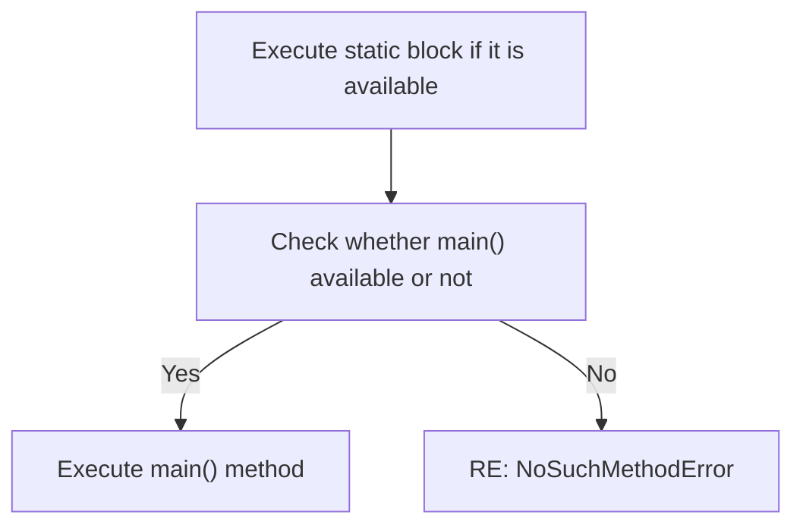
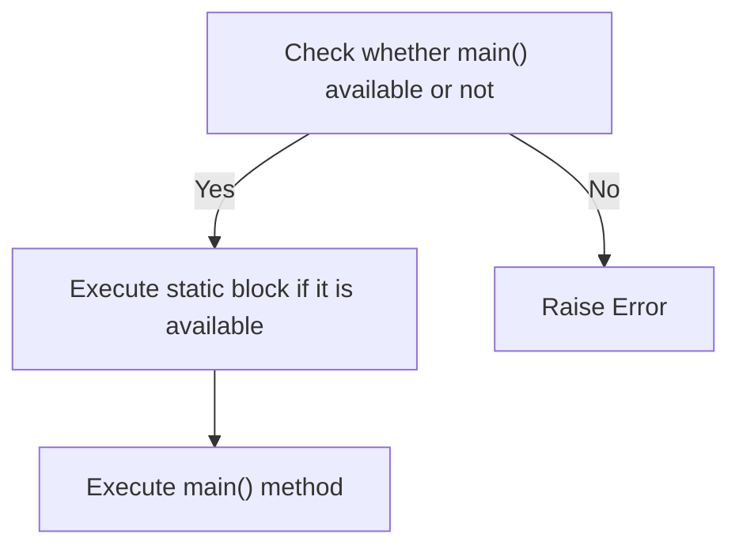

import { Aside, Badge, Card, CardGrid, Code } from '@astrojs/starlight/components';

## 🎯 Java Main Method — Complete Guide

> The **main method** is the entry point of every Java program. The JVM looks for this exact signature to start execution.

---

## 📌 The Exact Signature

```java
public static void main(String[] args)
```

### 🏛️ Architecture: JVM Entry Point

```text
+---------------------+
|      JVM Starts     |
+---------------------+
         |
         v
+---------------------+
|   Load Class        |
|   (e.g., Main)      |
+---------------------+
         |
         v
+---------------------+
|   Look for:         |
|   main(String[])    |
+---------------------+
         |
         v
+---------------------+
|   Execute Code      |
+---------------------+
```
### 🔑 Keyword Breakdown

| Keyword | Meaning | Why? (Interview Answer) |
| :--- | :--- | :--- |
| **`public`** | Access Modifier | JVM is outside the class. It needs **public** access to call it. |
| **`static`** | Memory Type | JVM calls it **without creating an object**. Static belongs to the class, not an instance. |
| **`void`** | Return Type | The method doesn't return data to the JVM (it exits to OS). |
| **`main`** | Method Name | Fixed identifier recognized by JVM. |
| **`String[]`** | Parameter | Stores **command-line arguments** passed to the program. |
| **`args`** | Variable Name | Convention (can be anything, e.g., `xyz`), but `args` is standard. |

<Aside type="note">
**Memory Trick**: "**P**ublic **S**tatic **V**oid **M**ain" → "**P**lease **S**top **V**isiting **M**e" — the JVM's entry password! 🔑
</Aside>

---

## 🔬 In-Depth — Why Each Keyword?

```text
If NOT public → JVM can't access → ❌ runtime error
If NOT static → JVM must create object first
               but WHICH constructor? JVM doesn't know → ❌
If NOT void   → return value goes nowhere (JVM ignores) → ❌
If NOT main   → JVM doesn't find entry point → ❌
If NOT String[] → signature mismatch → ❌
```

---

## 🔄 Valid Variations — Compiler Allows These

### 1. Var-Args Allowed ✅
Since Java 5, you can use var-args instead of an array.

<Code lang="java" title="Var-args syntax" code={`// ✅ Valid — compiles to array internally
public static void main(String... args) { }`} />

### 2. Argument Name Change ✅

<Code lang="java" title="Variable name is flexible" code={`// ✅ Valid — JVM only cares about type, not name
public static void main(String[] myArgs) { }
public static void main(String[] xyz) { }`} />

### 3. Final Modifier ✅

<Code lang="java" title="Prevent reassignment" code={`// ✅ Valid — prevents args = new String[...]
public static void main(final String[] args) { }`} />
### 4. Overloading `main` ✅ (But JVM Ignores Others)

<Code lang="java" title="Overloading is allowed" code={`public static void main(String[] args) { } // ✅ JVM calls this
public static void main(int[] args) { }    // ✅ Valid method, but JVM ignores it
public static void main(String args, int x) { } // ✅ Valid overload

// Interview Q: "Can you overload main?"  
// Answer: "Yes, but JVM **only calls** the one with String[] args."`} />

### 5. Modifier Order Doesn't Matter

<Code lang="java" title="static public is valid" code={`// ✅ Valid — order of public/static doesn't matter
static public void main(String[] args) { }`} />

### 6. Additional Modifiers Allowed

<Code lang="java" title="synchronized, strictfp, etc." code={`// ✅ Valid — extra modifiers don't break signature
public static synchronized void main(String[] args) { }
public static strictfp void main(String[] args) { }`} />

### 7. Array Declaration Styles

<Code lang="java" title="All valid array syntaxes" code={`public static void main(String[] args) { }  // ✅ Recommended
public static void main(String []args) { }  // ✅ Valid
public static void main(String args[]) { }  // ✅ Valid (C-style)`} />

### 8. Inheritance & Method Hiding

Static methods follow **method hiding**, not overriding. If child class lacks `main()`, parent's `main()` executes.

<Code lang="java" title="Case 1: Child inherits parent's main" code={`class Parent {
    public static void main(String[] args) {
        System.out.println("parent main");
    }
}
class Child extends Parent {}
// java Child → Output: "parent main" ✅`} />

<Code lang="java" title="Case 2: Child hides parent's main" code={`class Parent {
    public static void main(String[] args) {
        System.out.println("parent main");
    }
}
class Child extends Parent {
    public static void main(String[] args) {
        System.out.println("Child main");
    }
}
// java Child → Output: "Child main" ✅
// This is METHOD HIDING, not overriding (static methods can't be overridden)`} />
<Aside type="caution">
**Key Distinction**: Static methods use **method hiding**, not polymorphic overriding. The method called depends on the **reference type at compile time**, not the runtime object type.
</Aside>

---

## ❌ Invalid Variations — Runtime Errors

<CardGrid>
  <Card title="Missing static" icon="error">
```java
    public void main(String[] args) { }
    // ❌ Runtime: NoSuchMethodError
    // JVM needs static to call without object
```
  </Card>
  
  <Card title="Missing public" icon="error">
```java
    static void main(String[] args) { }
    // ❌ Runtime: NoSuchMethodError
    // JVM can't access non-public method from outside
```
  </Card>
  
  <Card title="Wrong return type" icon="error">
```java
    public static int main(String[] args) { }
    // ❌ Runtime: NoSuchMethodError
    // JVM expects void return
```
  </Card>
  
  <Card title="Wrong name (case-sensitive)" icon="error">
```java
    public static void Main(String[] args) { }
    // ❌ Runtime: NoSuchMethodError
    // Java is case-sensitive: main ≠ Main
```
  </Card>
  
  <Card title="Missing parameter" icon="error">
```java
    public static void main() { }
    // ❌ Runtime: NoSuchMethodError
    // JVM requires String[] parameter
```
  </Card>
</CardGrid>
---

# ☕ Java 1.7 Enhancements — main() Method

## 🔑 The Key Change

> **Before Java 7**: You could run a program **without main()** using static blocks + `System.exit(0)`.  
> **From Java 7**: **main() is mandatory**. Period.

---

## 🔬 Before Java 7 (Java 6 and Earlier)

<Code lang="java" title="Running without main() — Java 6" code={`class Test {
    static {
        System.out.println("Running without main!");
        System.exit(0); // stop JVM before it looks for main()
    }
}`} />

```text
Output (Java 6):
Running without main!

✅ Worked fine! No error at all.
JVM ran static block → System.exit(0) → stopped → never looked for main()
```

---

## 🔬 From Java 7 Onwards

### Case 1: Static block with exit(0), no main()

<Code lang="java" title="Java 7+ behavior" code={`class Test {
    static {
        System.out.println("Running without main!");
        System.exit(0);
    }
}`} />

```text
Output (Java 7+):
Running without main!
Error: Main method not found in class Test, please define 
the main method as:
   public static void main(String[] args)

⚠️ Static block still runs BUT JVM now explicitlychecks for main() and gives clear error if missing!
```

### Case 2: Static block only, no exit(0), no main()

<Code lang="java" title="Static block without exit" code={`class Test {
    static {
        System.out.println("static block");
    }
}`} />

```text
Java 6:
javac Test.java && java Test
Output:
static block
Exception in thread "main" java.lang.NoSuchMethodError: main

Java 7+:
javac Test.java && java Test
Error: Main method not found in class Test, please define 
the main method as:
   public static void main(String[] args)
```

### Case 3: Both static block AND main()

<Code lang="java" title="Static block + main() — works in all versions" code={`class Test {
    static {
        System.out.println("static block");
    }
    public static void main(String[] args) {
        System.out.println("main method");
    }
}`} />

```text
Java 6 & Java 7+ Output:
static block
main method

✅ Static blocks always execute BEFORE main() — this behavior unchanged!
```

---

## 🆚 Before vs After Java 7 Comparison

<table>
  <thead>    <tr>
      <th>Scenario</th>
      <th>Before Java 7</th>
      <th>Java 7 Onwards</th>
    </tr>
  </thead>
  <tbody>
    <tr>
      <td>No main(), no exit(0)</td>
      <td><code>NoSuchMethodError</code> (cryptic)</td>
      <td>Clear friendly message ✅</td>
    </tr>
    <tr>
      <td>Static block + exit(0)</td>
      <td>Works fine ✅</td>
      <td>Runs static block + then error ⚠️</td>
    </tr>
    <tr>
      <td>main() present</td>
      <td>Works ✅</td>
      <td>Works ✅</td>
    </tr>
    <tr>
      <td>Error message clarity</td>
      <td>Poor: <code>java.lang.NoSuchMethodError: main</code></td>
      <td>Excellent: Human-readable guidance ✅</td>
    </tr>
  </tbody>
</table>

---

## 🔄 Execution Flow: Java 1.6 vs 1.7+

### Java 1.6 Flow



### Java 1.7+ Flow



<Aside type="tip">
**Key Insight**: Java 7+ **checks for main() FIRST**, before executing static blocks. This ensures clear error messages and prevents silent failures.
</Aside>

---

## 📦 Command Line Arguments — String[] args

<Code lang="java" title="Using command-line arguments" code={`public static void main(String[] args) {
    System.out.println("Number of args: " + args.length);
    
    if (args.length > 0) {
        System.out.println("First arg: " + args[0]);  // always String!
    }
    
    // Convert to int if needed:
    if (args.length > 1) {
        int age = Integer.parseInt(args[1]); // "25" → 25
        System.out.println("Age: " + age);
    }
}`} />

```text
Run from terminal:
java MyClass Alice 25

args[0] = "Alice"
args[1] = "25"      ← always String! even if number
```

<Aside type="danger">
⚠️ **Common Crash**: Accessing `args[0]` with no arguments passed → `ArrayIndexOutOfBoundsException`  
**Always check**: `if (args.length > 0)` before accessing!
</Aside>

---

## 🔬 What Happens Before main() Runs?

```text
JVM starts
    ↓
Loads .class file (ClassLoader)
    ↓
Static variables initialized
    ↓
Static blocks executed  ← runs BEFORE main!
    ↓main() called
    ↓
Program runs
    ↓
JVM exits
```

<Code lang="java" title="Execution order demo" code={`class Demo {
    static int x = 10;             // 1st — static var init

    static {
        System.out.println("Static block: x=" + x); // 2nd — static block
    }

    public static void main(String[] args) {
        System.out.println("main method"); // 3rd — main runs
    }
}
// Output:
// Static block: x=10
// main method`} />

---

## 🎯 Interview Cheat Sheet

<CardGrid>
  <Card title="Q: Can main method be overloaded?" icon="approve-check">
    **YES ✅** — but JVM only calls `String[] args` version.
```java
    public static void main(String[] args) { }  // ← JVM calls this
    public static void main(int[] args) { }     // ← valid but JVM ignores
```
  </Card>
  
  <Card title="Q: Can main method be overridden?" icon="error">
    **NO ❌** — it's `static`, and static methods can't be overridden.  
    They can be **hidden** (method hiding), but not polymorphically overridden.
  </Card>

  <Card title="Q: Can we call main() explicitly?" icon="approve-check">
    **YES ✅** — it's just a static method!
```java
    main(new String[]{});  // valid recursive/self call
```
  </Card>

  <Card title="Q: Can main be declared inside interface?" icon="information">**YES ✅** (Java 8+ with static methods in interfaces) But practically never done — interfaces aren't entry points.  </Card>

  <Card title="Q: Can a class have no main method?" icon="approve-check">
    **YES ✅** — non-entry-point classes don't need it.  
    Only the **starting class** (passed to `java ClassName`) needs `main()`.
  </Card>

  <Card title="Q: What if main() throws an exception?" icon="error">
    JVM catches it, prints stack trace, and exits with **non-zero error code**.  
    Useful for scripting: `if [ $? -ne 0 ]; then echo "Failed"; fi`
  </Card>

  <Card title="Q: Can main be private or protected?" icon="error">
    **Compiles ✅ but runtime error ❌** — JVM can't access non-public methods from outside the class.
  </Card>

  <Card title="Q: Java 6 vs Java 7 main() requirement?" icon="information">
    **Java 6**: Static block + `exit(0)` could bypass main() requirement.  
    **Java 7+**: `main()` is **strictly mandatory** — clear error if missing.
  </Card>
</CardGrid>

---

## 🧩 DSA Angle

<Code lang="java" title="main() as test harness in DSA" code={`public static void main(String[] args) {
    // Quick test multiple cases
    int[] test1 = {1, 2, 3, 4, 5};
    int[] test2 = {-1, -2, -3};
    int[] test3 = {};

    System.out.println(maxSum(test1)); // 15
    System.out.println(maxSum(test2)); // -1
    System.out.println(maxSum(test3)); // 0

    // Taking input via args in competitive coding
    // java Solution 5 → args[0] = "5"
    int n = args.length > 0 ? Integer.parseInt(args[0]) : 10;
    
    // Process input
    int[] arr = new int[n];
    for (int i = 0; i < n; i++) {
        arr[i] = i + 1; // example initialization
    }
    System.out.println(solve(arr));
}`} />

<Aside type="tip">
**Competitive Coding Pro Tip**: Always handle `args.length` checks gracefully. Many online judges pass input via `args` or stdin — design your `main()` to support both patterns.
</Aside>

---

## 🏢 Real-Life SDE Usage

<Code lang="java" title="Spring Boot — main() bootstraps entire application" code={`@SpringBootApplication
public class MyApp {
    public static void main(String[] args) {
        // SpringApplication.run() starts:
        // • Embedded Tomcat server
        // • Dependency injection container
        // • Database connections
        // • All @Component/@Service beans
        SpringApplication.run(MyApp.class, args);
    }
}`} />

<Code lang="java" title="Passing runtime config via args" code={`// Command: java -jar app.jar --server.port=9090 --spring.profiles.active=prod

public static void main(String[] args) {
    // args[0] = "--server.port=9090"
    // args[1] = "--spring.profiles.active=prod"
    
    // Spring Boot automatically parses these from String[] args ✅
    // No manual parsing needed!
    
    SpringApplication.run(MyApp.class, args);
}`} />

<Code lang="java" title="Custom CLI tool pattern" code={`public class DataProcessor {
    public static void main(String[] args) {
        if (args.length < 2) {
            System.err.println("Usage: java DataProcessor <input> <output>");
            System.exit(1);
        }
        
        String inputFile = args[0];
        String outputFile = args[1];
        
        // Process data...
        process(inputFile, outputFile);
    }
    
    static void process(String in, String out) {
        // business logic here
    }
}`} />

<Aside type="tip">**Production Best Practice**: Always validate `args` early in `main()` and provide clear usage messages. Exit with non-zero code (`System.exit(1)`) on error to signal failure to shell scripts and orchestrators.</Aside>

---

## 🔑 Quick Reference Summary

| Requirement | Valid? | Notes |
|------------|--------|-------|
| `public static void main(String[] args)` | ✅ | Exact JVM signature |
| `static public void main(String[] args)` | ✅ | Modifier order flexible |
| `public static void main(String... args)` | ✅ | Var-args compiles to array |
| `public static void main(String[] xyz)` | ✅ | Parameter name doesn't matter |
| `public static void main(final String[] args)` | ✅ | `final` allowed |
| `public static synchronized void main(String[] args)` | ✅ | Extra modifiers OK |
| `private static void main(String[] args)` | ❌ Runtime | JVM can't access |
| `public void main(String[] args)` | ❌ Runtime | Must be `static` |
| `public static int main(String[] args)` | ❌ Runtime | Must return `void` |
| `public static void Main(String[] args)` | ❌ Runtime | Case-sensitive: `main` ≠ `Main` |
| `public static void main()` | ❌ Runtime | Must have `String[]` parameter |

<Aside type="caution">
**Final Warning**: Even if your code compiles, an incorrect `main()` signature causes a **runtime** `NoSuchMethodError`, not a compile error. Always double-check the signature before debugging!
</Aside>