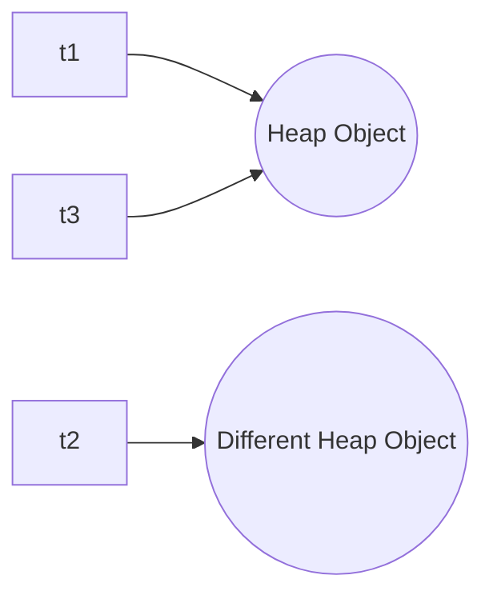

import { Aside, Badge, Card, CardGrid, Code } from '@astrojs/starlight/components';

## 4️⃣ Relational Operators

```text
>   greater than
<   less than
>=  greater than or equal
<=  less than or equal
```

<Code lang="java" title="Basic usage — always return boolean" code={`int a = 10, b = 20;

System.out.println(a > b);    // false
System.out.println(a < b);    // true
System.out.println(a >= 10);  // true
System.out.println(a <= 9);   // false

// Result is always boolean!
boolean result = a > b;  // false`} />

### 🔑 Rule 1: Primitives Only (Except `boolean`)

Relational operators work on **all primitive types except `boolean`**.

<Code lang="java" title="✅ Valid primitive comparisons" code={`System.out.println(10 > 5);        // int → true
System.out.println('a' < 'b');     // char → true (97 < 98)
System.out.println(3.14 >= 3.0);   // double → true
System.out.println(10L <= 20L);    // long → true`} />

<Code lang="java" title="❌ Invalid: boolean comparison" code={`System.out.println(true > false);  
// ❌ C.E: operator > cannot be applied to boolean, boolean

// boolean only works with equality operators (==, !=)
System.out.println(true == false);  // false ✅
System.out.println(true != false);  // true ✅`} />

### 🔑 Rule 2: Cannot Compare Objects Directly
Relational operators **do not work on reference types** (objects).

<Code lang="java" title="❌ Object relational comparison fails" code={`String s1 = "Alice";
String s2 = "Bob";

// s1 > s2  // ❌ C.E: bad operand types for binary operator '>'

// ✅ Use compareTo() for String ordering:
int cmp = s1.compareTo(s2);  // negative if s1 < s2 alphabetically
System.out.println(cmp < 0); // true → "Alice" < "Bob"

// ✅ For custom objects, implement Comparable/Comparator:
class Person implements Comparable<Person> {
    String name;
    public int compareTo(Person other) {
        return this.name.compareTo(other.name);
    }
}`} />

### 🔑 Rule 3: No Nesting Allowed

Relational expressions return `boolean`, which cannot be compared with numbers.

<Code lang="java" title="❌ Nested relational operators fail" code={`System.out.println(10 > 20 > 30);  
// Step 1: 10 > 20 → false (boolean)
// Step 2: false > 30 → ❌ C.E: operator > cannot be applied to boolean, int

// ✅ Fix: Use logical operators to combine conditions:
System.out.println(10 > 20 && 20 > 30);  // false && false → false
System.out.println(10 < 20 && 20 < 30);  // true && true → true`} />

---

## 5️⃣ Equality Operators

```text
==   equal to
!=   not equal to
```

### 🔬 Primitive Comparison: Compares VALUES

<Code lang="java" title="Equality works on all primitives including boolean" code={`// Numeric primitives
System.out.println(10 == 20);        // false
System.out.println('a' == 'b');      // false
System.out.println('a' == 97.0);     // true (97 == 97.0 after promotion)
System.out.println(3.14 != 3.141);   // true

// boolean works with == and !=System.out.println(false == false);  // true
System.out.println(true != false);   // true`} />

<Aside type="note">
**Type Promotion Applies**: `'a' == 97.0` → `char` promoted to `int` (97), then to `double` (97.0) → comparison succeeds.
</Aside>

### 🔬 Reference Comparison: Compares ADDRESSES (Not Content!)

For objects, `==` checks if two references point to the **same object in memory**.

<Code lang="java" title="Reference equality vs. content equality" code={`String s1 = new String("Hello");
String s2 = new String("Hello");

System.out.println(s1 == s2);        // false! (different objects on Heap)
System.out.println(s1.equals(s2));   // true ✅ (same character content)

// Thread example:
Thread t1 = new Thread();
Thread t2 = new Thread();
Thread t3 = t1;  // t3 references SAME object as t1

System.out.println(t1 == t2);  // false (different objects)
System.out.println(t1 == t3);  // true ✅ (same reference)`} />



### 🔑 Rule: Type Compatibility Required for `==` with Objects

To compare two object references with `==`, their types must have an **inheritance relationship** (parent-child).

<Code lang="java" title="✅ Valid: Compatible types" code={`Thread t = new Thread();
Object o = new Object();
String s = new String("durga");

System.out.println(t == o);  // false ✅ (Thread IS-A Object)
System.out.println(o == s);  // false ✅ (String IS-A Object)
// Both compile because Thread/Object and String/Object have inheritance relationship`} />

<Code lang="java" title="❌ Invalid: Incompatible types" code={`Thread t = new Thread();
String s = new String("durga");

System.out.println(s == t);  
// ❌ C.E: incompatible types: java.lang.String and java.lang.Thread
// No inheritance relationship → compiler rejects comparison`} />
<Aside type="tip">
**Compiler Check**: The `==` operator verifies type compatibility **at compile time**. If two reference types are unrelated in the class hierarchy, the code won't compile — preventing runtime errors.
</Aside>

---

## 🎯 null Comparison Behavior

<CardGrid>
  <Card title="Reference vs. null" icon="information">
```java
    // Any object reference compared to null:
    String s = new String("ashok");
    System.out.println(s == null);  // false ✅
    
    // null reference compared to null:
    String r = null;
    System.out.println(r == null);  // true ✅
    
    // null literal compared to null:
    System.out.println(null == null);  // true ✅
```
    **Rule**: `x == null` is **always safe** and returns `true` only if `x` holds no object reference.
  </Card>
  
  <Card title="Safe null checking pattern" icon="shield">
```java
    String s = null;
    
    // ❌ Dangerous: calls method on null → NPE
    // System.out.println(s.equals("hi"));  // 💥 NullPointerException!
    
    // ✅ Safe pattern 1: null check first
    if (s != null && s.equals("hi")) { ... }
    
    // ✅ Safe pattern 2: call equals on constant (Yoda condition)
    if ("hi".equals(s)) { ... }  // false if s is null, no NPE!
```
    **Interview Tip**: `"constant".equals(variable)` is a defensive coding pattern to avoid NPE.
  </Card>
</CardGrid>

---

## ⚠️ String Pool Trap — `==` vs `.equals()`

### The String Constant Pool

Java maintains a special memory area called the **String Constant Pool** to optimize String literals.
<Code lang="java" title="String literal pooling behavior" code={`// Case 1: Both literals → same pool object
String a = "Java";
String b = "Java";
System.out.println(a == b);        // true! ✅ (same pool reference)
System.out.println(a.equals(b));   // true ✅

// Case 2: Literal vs. new String() → different objects
String c = new String("Java");
System.out.println(a == c);        // false! ❌ (c is new Heap object)
System.out.println(a.equals(c));   // true ✅ (same content)

// Case 3: intern() forces pool lookup
String d = new String("Java").intern();
System.out.println(a == d);        // true! ✅ (d now points to pool)`} />

```mermaid
flowchart TD
    Pool[String Constant Pool]
    Heap[Heap Memory]
    
    a["a = \"Java\""] --> Pool
    b["b = \"Java\""] --> Pool
    c["c = new String(\"Java\")"] --> Heap
    Pool -.->|same object| a
    Pool -.->|same object| b
    Heap -.->|different object| c
```

<Aside type="danger">
**Golden Rule**: **Always use `.equals()` to compare String content**.  
`==` only checks reference identity — a common source of subtle bugs!
</Aside>

---

## 🆚 Quick Comparison: `==` Behavior by Type

<table>
  <thead>
    <tr>
      <th>Type</th>
      <th><code>==</code> Compares</th>
      <th>Example</th>
      <th>Result</th>
    </tr>
  </thead>
  <tbody>
    <tr>
      <td><code>int</code>, <code>double</code>, etc.</td>      <td>Primitive values</td>
      <td><code>10 == 10.0</code></td>
      <td><code>true</code> (after promotion)</td>
    </tr>
    <tr>
      <td><code>boolean</code></td>
      <td>true/false values</td>
      <td><code>true == !false</code></td>
      <td><code>true</code></td>
    </tr>
    <tr>
      <td><code>char</code></td>
      <td>Unicode values</td>
      <td><code>'a' == 97</code></td>
      <td><code>true</code></td>
    </tr>
    <tr>
      <td>Object references</td>
      <td>Memory addresses</td>
      <td><code>new String("x") == new String("x")</code></td>
      <td><code>false</code> (different objects)</td>
    </tr>
    <tr>
      <td>String literals</td>
      <td>Pool references</td>
      <td><code>"x" == "x"</code></td>
      <td><code>true</code> (same pool object)</td>
    </tr>
    <tr>
      <td>Any reference vs <code>null</code></td>
      <td>Nullity</td>
      <td><code>obj == null</code></td>
      <td><code>true</code> if obj holds no reference</td>
    </tr>
  </tbody>
</table>

---

## 🎯 Interview Cheat Sheet

<CardGrid>
  <Card title="Q: Can we use > with boolean?" icon="error">
    **NO ❌** — relational operators (`>`, `<`, `>=`, `<=`) don't work on `boolean`.  
    Only equality operators (`==`, `!=`) work with `boolean`.
  </Card>
  
  <Card title="Q: What does `s1 == s2` check for Strings?" icon="error">
    **Reference equality** — whether `s1` and `s2` point to the **same object in memory**.  
    To compare content, **always use `s1.equals(s2)`**.  </Card>

  <Card title="Q: Why does `"Java" == "Java"` return true?" icon="information">
    **String Constant Pool**: Java reuses identical String literals to save memory.  
    Both `"Java"` literals reference the **same pooled object**.
  </Card>

  <Card title="Q: Is `null == null` true?" icon="approve-check">
    **YES ✅** — `null` represents the absence of a reference, and all `null` references are equal.
  </Card>

  <Card title="Q: Can we compare unrelated types with ==?" icon="error">
    **NO ❌** — compiler requires a type relationship (inheritance).  
    `String == Thread` → compile error. `String == Object` → compiles (but likely false).
  </Card>

  <Card title="Q: What is `'a' == 97.0`?" icon="information">
    **`true`** — `char 'a'` (Unicode 97) is promoted to `int` 97, then to `double` 97.0 for comparison.
  </Card>
</CardGrid>

---

## 🧩 DSA & Practical Patterns

<CardGrid>
  <Card title="Pattern: Safe String Comparison" icon="shield">
    Always use `.equals()` for content, and guard against null:
```java
    // ❌ Risky:
    if (userInput.equals("admin")) { ... }  // NPE if userInput is null!
    
    // ✅ Safe:
    if ("admin".equals(userInput)) { ... }  // false if null, no crash
    
    // ✅ Also safe (Java 7+):
    if (Objects.equals(userInput, "admin")) { ... }  // handles null gracefully
```
  </Card>
  
  <Card title="Pattern: Object Identity vs. Equality" icon="rocket">
    Use `==` only when you specifically need to check if two references are the **exact same object**:
```java
    // Singleton pattern check:
    if (instance == null) {  // Check if Singleton is initialized
        instance = new Singleton();
    }
    
    // Cache identity check (avoid duplicate processing):
    if (cachedObj == incomingObj) {  // Same object? Skip reprocessing        return cachedResult;
    }
```
  </Card>

  <Card title="Pattern: Defensive null Checks in Collections" icon="backspace">
    When working with collections that may contain nulls:
```java
    List<String> names = Arrays.asList("Alice", null, "Bob");
    
    for (String name : names) {
        // ❌ Dangerous:
        // if (name.equals("Alice")) { ... }  // NPE on null element!
        
        // ✅ Safe:
        if ("Alice".equals(name)) { ... }  // Handles null gracefully
    }
```
  </Card>
</CardGrid>

---

## 🔑 Quick Reference Summary

| Operator | Works On | Compares | Returns | Example |
|----------|----------|----------|---------|---------|
| `>`, `<`, `>=`, `<=` | Primitives except `boolean` | Numeric/Unicode values | `boolean` | `10 > 5 → true` |
| `==`, `!=` | All primitives + references | Values (primitives) / Addresses (objects) | `boolean` | `'a' == 97 → true` |
| `==` with Objects | Reference types with inheritance relationship | Memory addresses | `boolean` | `s1 == s2 → false` (different objects) |
| `==` with `null` | Any reference type | Nullity | `boolean` | `obj == null → true` if unassigned |

<Aside type="caution">
**Final Checklist**:
1. ✅ Relational operators (`>`, `<`, etc.) → primitives only, **not** `boolean`
2. ✅ `==` on primitives → compares **values**; on objects → compares **references**
3. ✅ Always use `.equals()` for String/content comparison
4. ✅ `"constant".equals(variable)` prevents NPE in null checks
5. ✅ `null == null` is `true`; any object `== null` is `false`
6. ✅ Compiler enforces type compatibility for `==` on references
7. ✅ No nesting relational operators — use `&&`/`||` to combine conditions
</Aside>

---

## 🧪 Test Your Understanding

<Code lang="java" title="Predict the output" code={`public class EqualityQuiz {
    public static void main(String[] args) {
        // Q1: Primitive equality with promotion        System.out.println('a' == 97);        // ?
        System.out.println('a' == 97.0);      // ?
        
        // Q2: String pool vs. heap
        String x = "test";
        String y = "test";
        String z = new String("test");
        System.out.println(x == y);           // ?
        System.out.println(x == z);           // ?
        System.out.println(x.equals(z));      // ?
        
        // Q3: null comparisons
        String s = null;
        System.out.println(s == null);        // ?
        System.out.println(null == null);     // ?
        System.out.println("hi".equals(s));   // ?
        
        // Q4: Type compatibility
        Object o = "hello";
        String str = "hello";
        System.out.println(o == str);         // ?
        // System.out.println(o == 10);       // ? (would this compile?)
        
        // Q5: Relational with boolean (trick)
        // System.out.println(true > false);  // ? (would this compile?)
        System.out.println(true == !false);   // ?
    }
}

/* Expected Output:
true
true
true
false
true
true
true
true
false
true
true  ← !false = true, so true == true
*/`} />

<Aside type="tip">
**Pro Tip**: When in doubt about equality:
- Primitives → `==` is fine
- Objects → `.equals()` for content, `==` only for identity checks
- Strings → **always** `.equals()`, and use `"literal".equals(var)` for null safety
- Null checks → `x == null` is safe and idiomatic
</Aside>