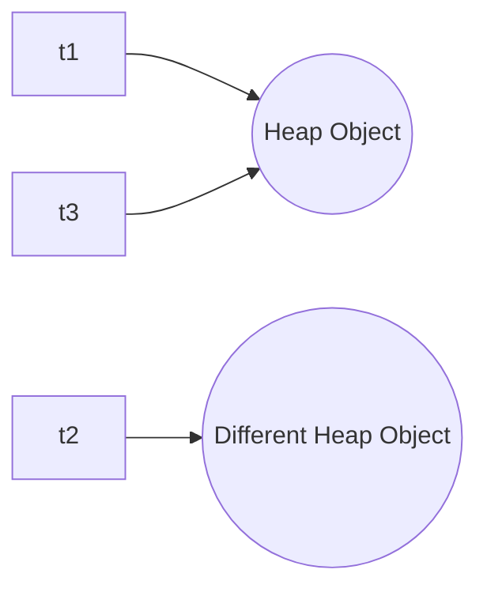

import { Aside, Badge, Card, CardGrid, Code } from '@astrojs/starlight/components';

## Relational Operators

```text
Relational Operators
│
├── Comparison Operators
│   ├── ==   equal to
│   ├── !=   not equal to
│   ├── >    greater than
│   ├── <    less than
│   ├── >=   greater than or equal to
│   └── <=   less than or equal to
│
└── Type Comparison
    └── instanceof   checks object type at runtime
```

<Code lang="java" title="Basic usage — always return boolean" code={`
int a = 10, b = 20;

a == b                        // false
a != b                        // true
a >  b                        // false
a <  b                        // true
a >= b                        // false
a <= b                        // true

// All return boolean — only valid in boolean context
boolean result = a > b;      // ✅
int x = a > b;               // ❌ COMPILE ERROR — not int
`} />

---

### 🔑 Rule 1: Primitives Only (Except `boolean`)

Relational operators work on **all primitive types except `boolean`**.

<Code lang="java" title="✅ Valid primitive comparisons" code={`
10 > 5                        // int → true
'a' < 'b'                     // char → true (97 < 98)
3.14 >= 3.0                   // double → true
10L <= 20L                    // long → true
`} />

<Code lang="java" title="❌ Invalid: boolean comparison" code={`
true > false  
// ❌ C.E: operator > cannot be applied to boolean, boolean

// boolean only works with equality operators (==, !=)
true == false                 // false ✅
true != false                 // true ✅
`} />

---

### 🔑 Rule 2: Cannot Compare Objects Directly
Relational operators **do not work on reference types** (objects).

<Code lang="java" title="❌ Staring relational comparison fails" code={`
String s1 = "Alice";
String s2 = "Bob";

// s1 > s2                    // ❌ C.E: bad operand types for binary operator '>'
"abc" > "xyz"                 // ❌ C.E: bad operand types for binary operator '>'
"abc" == "xyz"                // false

// ✅ Use compareTo() for String ordering:
int cmp = s1.compareTo(s2);   // negative if s1 < s2 alphabetically
System.out.println(cmp < 0);  // true → "Alice" < "Bob"

// ✅ For custom objects, implement Comparable/Comparator:
class Person implements Comparable<Person> {
    String name;
    public int compareTo(Person other) {
        return this.name.compareTo(other.name);
    }
}`} />

---

### 🔑 Rule 3: No Nesting Allowed

Relational expressions return `boolean`, which cannot be compared with numbers.

<Code lang="java" title="❌ Nested relational operators fail" code={`
10 > 20 > 30             // Step 1: 10 > 20 → false (boolean)
                          // Step 2: false > 30 → ❌ C.E: operator > cannot be applied to boolean, int

// ✅ Fix: Use logical operators to combine conditions:
10 > 20 && 20 > 30       // false && false → false
10 < 20 && 20 < 30       // true && true → true
`} />

---

## Equality Operators

```text
==   equal to
!=   not equal to
```

---

### 🔬 Primitive Comparison: Compares VALUES

<Code lang="java" title="Equality works on all primitives including boolean" code={`
// Numeric primitives
10 == 20                // false
'a' == 'b'              // false
'a' == 97.0             // true (97 == 97.0 after promotion)
3.14 != 3.141           // true

// boolean works with == and !=
false == false          // true
true != false           // true
`} />

<Aside type="note">
**Type Promotion Applies**: `'a' == 97.0` → `char` promoted to `int` (97), then to `double` (97.0) → comparison succeeds.
</Aside>

---

### 🔬 Numeric Comparison With Mixed Types

```java
// Widening happens before comparison
int    i = 10;
long   l = 10L;
float  f = 10.0f;
double d = 10.0;

i == l                   // true  — i promoted to long
i == f                   // true  — i promoted to float
i == d                   // true  — i promoted to double
l == f                   // true  — l promoted to float
f == d                   // true  — f promoted to double

// Dangerous — float precision
0.1f == 0.1              // false — float 0.1 ≠ double 0.1
// float 0.1  stored as: 0.10000000149011612
// double 0.1 stored as: 0.1000000000000000055511151231257827021181583404541015625
// Different binary representations → not equal
```

---

### 🔬 Reference Comparison: Compares ADDRESSES (Not Content!)

For objects, `==` checks if two references point to the **same object in memory**.
```
Primitives: == compares VALUES
References: == compares ADDRESSES (object identity)
```

<Code lang="java" title="Reference equality vs. content equality" code={`
String s1 = new String("Hello");
String s2 = new String("Hello");

s1 == s2                      // false! (different objects on Heap)
s1.equals(s2)                 // true ✅ (same character content)

// Thread example:
Thread t1 = new Thread();
Thread t2 = new Thread();
Thread t3 = t1;               // t3 references SAME object as t1

t1 == t2                      // false (different objects)
t1 == t3                      // true ✅ (same reference)`} />


```mermaid
flowchart LR
    t1[t1] --> A((Heap Object))
    t3[t3] --> A
    t2[t2] --> B((Different Heap Object))
```

> 🔑 `==` on objects = address comparison. Two objects with identical content are `==` only if they are the **same object**. Always use `.equals()` for content comparison.


---

### 🔑 Rule: Type Compatibility Required for `==` with Objects

To compare two object references with `==`, their types must have an **inheritance relationship** (parent-child).

<Code lang="java" title="✅ Valid: Compatible types" code={`
Thread t = new Thread();
Object o = new Object();
String s = new String("durga");

// Both compile because Thread/Object and String/Object have inheritance relationship
t == o                      // false ✅ (Thread IS-A Object)
o == s                      // false ✅ (String IS-A Object)

// No inheritance relationship → compiler rejects comparison
s == t                      // ❌ C.E: incompatible types: java.lang.String and java.lang.Thread
`} />

<Aside type="tip">
**Compiler Check**: The `==` operator verifies type compatibility **at compile time**. If two reference types are unrelated in the class hierarchy, the code won't compile — preventing runtime errors.
</Aside>

---

## 🎯 null Comparison Behavior

<Card title="Reference vs. null" icon="information">
  ```java
    // Any object reference compared to null:
    String s = new String("ashok");
    s == null                   // false ✅
    
    // null reference compared to null:
    String r = null;
    r == null                   // true ✅
    
    // null literal compared to null:
    null == null                // true ✅
  ```
**Rule**: `x == null` is **always safe** and returns `true` only if `x` holds no object reference.
</Card>

<Card title="Safe null checking pattern" icon="shield">
  ```java
    String s = null;
    
    // ❌ Dangerous: calls method on null → NPE
    s.equals("hi")              // 💥 NullPointerException!
    
    // ✅ Safe pattern 1: null check first
    s != null && s.equals("hi")
    
    // ✅ Safe pattern 2: call equals on constant (Yoda condition)
    "hi".equals(s)              // false if s is null, no NPE!
  ```
**Interview Tip**: `"constant".equals(variable)` is a defensive coding pattern to avoid NPE.
</Card>

---

## Underlying primitive: JVM comparison bytecodes + reference equality" icon="backspace">

```java
  Bytecode for comparison:

  int comparison (a == b):
    iload_1      // push a
    iload_2      // push b
    if_icmpeq    // compare top two ints → branch if equal

  reference comparison (s1 == s2):
    aload_1      // push reference s1
    aload_2      // push reference s2
    if_acmpeq    // compare addresses → branch if same address

  instanceof check:
    aload_1      // push object reference
    instanceof String  // checks klass pointer in object header
                      // walks inheritance chain
                      // returns 1 (true) or 0 (false)

  Pattern matching instanceof (Java 16+):
    Compiled to: instanceof check + checkcast + astore
    No runtime overhead vs manual instanceof + cast
    Compiler proves cast safe → no ClassCastException possible

  instanceof internals:
    Object header contains klass pointer → points to class metadata
    instanceof walks: object's klass → superclass → superclass...
    Until match found (true) or Object reached without match (false)
    null reference → returns false immediately (special case)
    Cost: O(depth of inheritance hierarchy) — fast in practice
```

---

<Aside type="tip">
**Pro Tip**: When in doubt about equality:
- Primitives → `==` is fine
- Objects → `.equals()` for content, `==` only for identity checks
- Strings → **always** `.equals()`, and use `"literal".equals(var)` for null safety
- Null checks → `x == null` is safe and idiomatic
</Aside>

---
