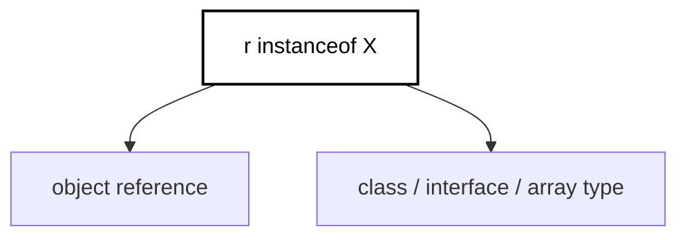
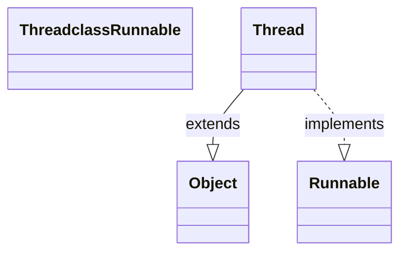

import { Aside, Badge, Card, CardGrid, Code } from '@astrojs/starlight/components';

## 🔍 instanceof Operator

> Checks if an object is an **instance of a class, subclass, or interface** at runtime.

```java
// Syntax: reference instanceof Type
String s = "Hello";
System.out.println(s instanceof String);  // true
System.out.println(s instanceof Object);  // true (String extends Object)

Object obj = new Integer(5);
System.out.println(obj instanceof Integer);  // true
System.out.println(obj instanceof String);   // false
```

### 🧠 How It Works



| Component | Description |
|-----------|-------------|
| **`r`** | Object reference variable (can be `null`) |
| **`X`** | Class name, interface name, or array type |
| **Result** | `boolean`: `true` if `r` refers to an instance of `X` (or subtype), `false` otherwise |

<Aside type="note">
**Key Insight**: `instanceof` performs a **runtime type check** based on the **actual object type**, not the reference type. This enables safe downcasting in polymorphic code.
</Aside>
---

## 🔬 Inheritance & Interface Rules

### Class Hierarchy Example

```java
class Animal {}
class Dog extends Animal {}
class Cat extends Animal {}

Animal a1 = new Dog();
Animal a2 = new Cat();

System.out.println(a1 instanceof Dog);    // true  ✅ (actual object is Dog)
System.out.println(a1 instanceof Animal); // true  ✅ (Dog IS-A Animal)
System.out.println(a1 instanceof Cat);    // false ❌ (Dog is NOT-A Cat)
System.out.println(a2 instanceof Dog);    // false ❌ (Cat is NOT-A Dog)
```

### Interface Implementation Example

```java
interface Flyable { void fly(); }
class Bird implements Flyable { public void fly() { } }
class Airplane implements Flyable { public void fly() { } }

Flyable f = new Bird();

System.out.println(f instanceof Flyable);  // true ✅
System.out.println(f instanceof Bird);     // true ✅
System.out.println(f instanceof Airplane); // false ❌
```

### 🧬 Thread Example (From Notes)

```java
// Java's Thread class: public class Thread extends Object implements Runnable

Thread t = new Thread();

System.out.println(t instanceof Thread);    // true ✅
System.out.println(t instanceof Object);    // true ✅ (all classes extend Object)
System.out.println(t instanceof Runnable);  // true ✅ (Thread implements Runnable)
```



<Aside type="tip">
**Memory Aid**: `instanceof` follows the **IS-A relationship**.  
If `Dog IS-A Animal`, then `dogRef instanceof Animal` → `true`.  
If no inheritance/implementation relationship exists, the compiler rejects the check.
</Aside>

---

## ⚠️ Compile-Time Type Compatibility

> To use `instanceof`, there **must be a possible type relationship** between the reference type and the checked type. Otherwise → **Compile Error: "inconvertible types"**.

<Code lang="java" title="✅ Valid: Related types" code={`Thread t = new Thread();

System.out.println(t instanceof String);   // ❌ C.E: inconvertible types
// Found: java.lang.Thread
// Required: java.lang.String
// Reason: Thread and String have no inheritance relationship → compiler rejects`} />

<Code lang="java" title="✅ Valid: Compatible hierarchy" code={`Object o = new String("hello");

System.out.println(o instanceof String);   // true ✅ (String IS-A Object)
System.out.println(o instanceof Object);   // true ✅
System.out.println(o instanceof Thread);   // false ✅ (compiles, but runtime false)`} />

<Aside type="caution">
**Compiler vs. Runtime**:  
- **Compile time**: Checks if types *could* be related (inheritance/interface). If not → C.E.  
- **Runtime**: Checks if the *actual object* is an instance of the type. Returns `true`/`false`.
</Aside>

---

## 🎯 null instanceof — Never Throws NPE

> **`null instanceof X` always returns `false`** — no `NullPointerException`, ever.

<Code lang="java" title="null is not an instance of anything" code={`String s = null;
System.out.println(s instanceof String);  // false ✅ (NOT NPE!)

Object obj = null;
System.out.println(obj instanceof Object);  // false ✅
System.out.println(obj instanceof Runnable); // false ✅
// Universal rule:
// For ANY type X (class, interface, array): null instanceof X → false`} />

<Aside type="tip">
**Safe Null Check Pattern**: Use `instanceof` as a combined null + type check:
```java
if (obj instanceof String s) {  // Java 16+ pattern matching
    // s is non-null String here — no extra null check needed!
    System.out.println(s.length());
}
// If obj is null or not a String, block is skipped safely.
```
</Aside>

---

## 🔄 Parent Reference vs. Child Type Check

> Checking if a **parent-type reference** actually holds a **child-type object**.

<Code lang="java" title="Parent reference, child object → true" code={`Object o = new String("ashok");  // Reference type: Object, Actual object: String

System.out.println(o instanceof String);  // true ✅
// Runtime checks actual object type, not reference type

if (o instanceof String) {
    String s = (String) o;  // Safe downcast
    System.out.println(s.toUpperCase());  // "ASHOK"
}`} />

<Code lang="java" title="Parent object, child type check → false" code={`Object o = new Object();  // Actual object is plain Object

System.out.println(o instanceof String);  // false ✅
// Object is NOT a String, so check fails

// This is why instanceof is essential before downcasting:
if (o instanceof String) {
    String s = (String) o;  // This block won't execute → safe!
}`} />

<Aside type="danger">
**Downcasting Without instanceof → ClassCastException**:
```java
Object o = new Object();
String s = (String) o;  // 💥 Runtime: ClassCastException!

// ✅ Always guard with instanceof (or pattern matching):
if (o instanceof String s) {
    // Safe to use s here
}```
</Aside>

---

## 🟡 Pattern Matching for instanceof (Java 16+)

> Eliminates manual casting by introducing a **pattern variable** automatically bound to the cast type.

### Before Java 16: Manual Cast

<Code lang="java" title="Verbose pre-Java-16 style" code={`Object obj = getSomething();

if (obj instanceof String) {
    String s = (String) obj;  // Manual cast — repetitive!
    System.out.println(s.length());
    System.out.println(s.toUpperCase());
} else if (obj instanceof Integer) {
    Integer i = (Integer) obj;  // Another manual cast
    System.out.println(i * 2);
}`} />

### Java 16+: Pattern Matching

<Code lang="java" title="Clean pattern matching syntax" code={`Object obj = getSomething();

// Pattern variable 's' is automatically cast and scoped to the if-block
if (obj instanceof String s) {
    System.out.println(s.length());      // s is String — no cast needed!
    System.out.println(s.toUpperCase());
} 
// Enhanced: if-else chain with pattern matching
else if (obj instanceof Integer i) {
    System.out.println(i * 2);  // i is Integer
}
// s and i are not accessible outside their respective blocks ✅`} />

### 🔑 Pattern Matching Rules

| Feature | Detail |
|---------|--------|
| **Syntax** | `ref instanceof Type varName` |
| **Scope** | `varName` is only in scope inside the `if`/`else` block where condition is `true` |
| **Null Safety** | If `ref` is `null`, condition is `false` — block skipped, no NPE |
| **Flow Typing** | In `if-else` chains, later branches know earlier patterns failed |

<Code lang="java" title="Flow typing example" code={`void process(Object obj) {
    if (obj instanceof String s && s.length() > 5) {
        // s is String AND length > 5
        System.out.println("Long string: " + s);    } else if (obj instanceof String s) {
        // Here, obj IS a String (otherwise first branch would've matched)
        // AND s.length() <= 5 (otherwise first branch would've matched)
        System.out.println("Short string: " + s);
    }
    // s is NOT accessible here — out of scope ✅
}`} />

<Aside type="tip">
**Pro Tip**: Pattern matching works with logical operators:
```java
if (obj instanceof String s && s.startsWith("Hello")) {
    // s is String AND starts with "Hello"
}
// Short-circuit evaluation ensures s is only used when type check passes.
```
</Aside>

---

## 🆚 instanceof vs. getClass() vs. isInstance()

<table>
  <thead>
    <tr>
      <th>Method/Operator</th>
      <th>Checks</th>
      <th>Handles Inheritance</th>
      <th>Null Safe</th>
      <th>Example</th>
    </tr>
  </thead>
  <tbody>
    <tr>
      <td><code>obj instanceof Type</code></td>
      <td>IS-A relationship</td>
      <td>✅ Yes (subclasses match)</td>
      <td>✅ Yes (returns false)</td>
      <td><code>dog instanceof Animal → true</code></td>
    </tr>
    <tr>
      <td><code>obj.getClass() == Type.class</code></td>
      <td>Exact class match</td>
      <td>❌ No (subclasses fail)</td>
      <td>❌ No (NPE if obj is null)</td>
      <td><code>dog.getClass() == Dog.class → true</code></td>
    </tr>
    <tr>
      <td><code>Type.class.isInstance(obj)</code></td>
      <td>IS-A relationship (reflective)</td>      <td>✅ Yes</td>
      <td>✅ Yes (returns false)</td>
      <td><code>Animal.class.isInstance(dog) → true</code></td>
    </tr>
  </tbody>
</table>

<Code lang="java" title="Behavior comparison" code={`class Animal {}
class Dog extends Animal {}

Animal a = new Dog();

// instanceof: checks IS-A → true for parent types
System.out.println(a instanceof Dog);    // true
System.out.println(a instanceof Animal); // true

// getClass(): checks exact class → false for parent
System.out.println(a.getClass() == Dog.class);    // true
System.out.println(a.getClass() == Animal.class); // false

// isInstance(): reflective instanceof → same as instanceof
System.out.println(Dog.class.isInstance(a));    // true
System.out.println(Animal.class.isInstance(a)); // true

// Null handling:
Animal nullRef = null;
System.out.println(nullRef instanceof Animal);        // false ✅
System.out.println(Animal.class.isInstance(nullRef)); // false ✅
// System.out.println(nullRef.getClass() == Animal.class); // 💥 NPE!`} />

---

## 🎯 Interview Cheat Sheet

<CardGrid>
  <Card title="Q: What does null instanceof String return?" icon="approve-check">
    **`false`** — never throws `NullPointerException`.  
    `null` is not an instance of any type.
  </Card>
  
  <Card title="Q: Can instanceof be used with unrelated types?" icon="error">
    **NO ❌** — compiler requires a possible inheritance/interface relationship.  
    `threadRef instanceof String` → Compile Error: "inconvertible types".
  </Card>

  <Card title="Q: What is the result of `new Object() instanceof String`?" icon="information">
    **`false`** — the actual object is `Object`, not `String`.  
    `instanceof` checks runtime type, not reference type.
  </Card>
  <Card title="Q: How does pattern matching improve instanceof?" icon="rocket">
    **Eliminates manual casting** and reduces boilerplate:
```java
    // Before:
    if (obj instanceof String) {
        String s = (String) obj;  // cast
        use(s);
    }
    // After (Java 16+):
    if (obj instanceof String s) {
        use(s);  // auto-cast, s in scope
    }
```
  </Card>

  <Card title="Q: Can instanceof check array types?" icon="approve-check">
    **YES ✅** — arrays are objects with special runtime type info:
```java
    int[] nums = {1, 2, 3};
    System.out.println(nums instanceof int[]);     // true
    System.out.println(nums instanceof Object);    // true (arrays extend Object)
    System.out.println(nums instanceof String[]);  // false
```
  </Card>

  <Card title="Q: Does instanceof work with generics?" icon="caution">
    **NO ❌** — due to type erasure:
```java
    List<String> list = new ArrayList<>();
    // System.out.println(list instanceof List<String>);  // ❌ C.E: generic type not reified
    
    // ✅ Check raw type only:
    System.out.println(list instanceof List);  // true
```
  </Card>
</CardGrid>

---

## 🧩 DSA & Practical Patterns

<CardGrid>
  <Card title="Pattern: Safe Downcasting in Polymorphic Collections" icon="shield">
    When processing heterogeneous collections:
```java
    List<Object> items = Arrays.asList("text", 42, new Dog());
    
    for (Object item : items) {
        if (item instanceof String s) {
            System.out.println("String: " + s.toUpperCase());        } else if (item instanceof Integer i) {
            System.out.println("Number: " + (i * 2));
        } else if (item instanceof Dog d) {
            d.bark();  // type-specific method
        }
    }
```
  </Card>
  
  <Card title="Pattern: Visitor-Like Dispatch Without Interfaces" icon="rocket">
    Use `instanceof` for simple type-based behavior when interfaces aren't feasible:
```java
    void render(Component c) {
        if (c instanceof Button b) {
            renderButton(b);
        } else if (c instanceof Label l) {
            renderLabel(l);
        } else if (c instanceof Image img) {
            renderImage(img);
        }
    }
    // Note: Prefer polymorphism (c.render()) when possible — instanceof is a fallback.
```
  </Card>

  <Card title="Pattern: Defensive API Parameter Validation" icon="backspace">
    Validate input types in flexible APIs:
```java
    public void configure(Object config) {
        if (!(config instanceof Map)) {
            throw new IllegalArgumentException("Config must be a Map");
        }
        // Safe to cast after check (or use pattern matching):
        if (config instanceof Map<?, ?> map) {
            // Process map...
        }
    }
```
  </Card>
</CardGrid>

<Aside type="tip">
**Best Practice**: Prefer **polymorphism** over `instanceof` when possible.  
If you find yourself writing long `if (x instanceof A) ... else if (x instanceof B) ...` chains, consider:
- Using interfaces with default methods
- The Visitor pattern
- Strategy pattern with functional interfaces  
`instanceof` is powerful, but overuse can signal missed abstraction opportunities.
</Aside>
---

## 🔑 Quick Reference Summary

| Scenario | `instanceof` Result | Notes |
|----------|---------------------|-------|
| `obj instanceof ActualClass` | `true` | Exact type match |
| `obj instanceof ParentClass` | `true` | Inheritance: child IS-A parent |
| `obj instanceof Interface` | `true` | If class implements interface |
| `null instanceof AnyType` | `false` | Never throws NPE |
| `parentRef instanceof ChildClass` | `false` | Actual object is parent, not child |
| `obj instanceof UnrelatedType` | ❌ Compile Error | No inheritance relationship |
| `array instanceof ArrayType` | `true`/`false` | Arrays have runtime type info |
| `generic instanceof List<T>` | ❌ Compile Error | Type erasure prevents generic check |

<Aside type="caution">
**Final Checklist**:
1. ✅ `instanceof` checks **runtime type**, not reference type
2. ✅ Always returns `boolean` — never throws exception (even for `null`)
3. ✅ Compiler enforces **type compatibility** — unrelated types → C.E
4. ✅ Pattern matching (Java 16+) auto-casts and scopes the pattern variable
5. ✅ Use `getClass()` for **exact class match** (no inheritance), but handle null
6. ✅ Prefer polymorphism over long `instanceof` chains when designing APIs
7. ✅ Generics are erased — cannot check `instanceof List<String>`
</Aside>

---

## 🧪 Test Your Understanding

<Code lang="java" title="Predict the output" code={`class Animal {}
class Dog extends Animal {}
interface Pet { }

public class InstanceofQuiz {
    public static void main(String[] args) {
        // Q1: Basic inheritance
        Animal a = new Dog();
        System.out.println(a instanceof Dog);     // ?
        System.out.println(a instanceof Animal);  // ?
        
        // Q2: null handling
        Dog d = null;
        System.out.println(d instanceof Dog);     // ?
        System.out.println(d instanceof Animal);  // ?
        
        // Q3: Interface check
        class Puppy extends Dog implements Pet {}
        Puppy p = new Puppy();
        System.out.println(p instanceof Pet);     // ?        System.out.println(p instanceof Animal);  // ?
        
        // Q4: Unrelated types (would this compile?)
        // String s = "test";
        // System.out.println(s instanceof Dog);  // ?
        
        // Q5: Pattern matching scope (Java 16+)
        Object obj = "hello";
        if (obj instanceof String str) {
            System.out.println(str.length());  // ?
        }
        // System.out.println(str);  // ? (would this compile?)
        
        // Q6: Array type check
        int[] nums = {1, 2, 3};
        System.out.println(nums instanceof int[]);    // ?
        System.out.println(nums instanceof Object);   // ?
        System.out.println(nums instanceof String[]); // ?
    }
}

/* Expected Output:
true
true
false
false
true
true
// Q4: ❌ Compile Error: inconvertible types (String vs Dog)
5
// Q5: ❌ Compile Error: str not visible outside if-block
true
true
false
*/`} />

<Aside type="tip">
**Pro Interview Answer Framework** for `instanceof` questions:
1. State what it checks (runtime type, IS-A relationship)
2. Mention null behavior (always false, no NPE)
3. Note compile-time type compatibility requirement
4. Highlight pattern matching benefits (Java 16+)
5. Contrast with `getClass()` for exact-type checks
6. Warn about generics/type erasure limitations

This demonstrates deep understanding of Java's type system! 🎯
</Aside>