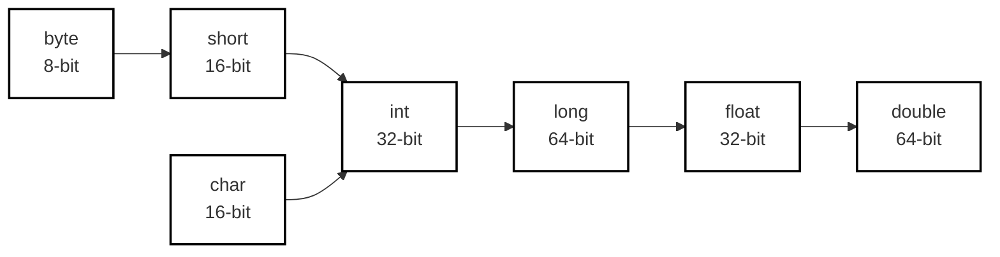
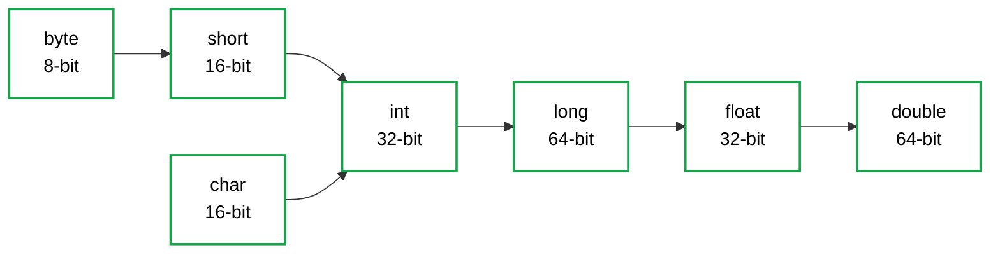
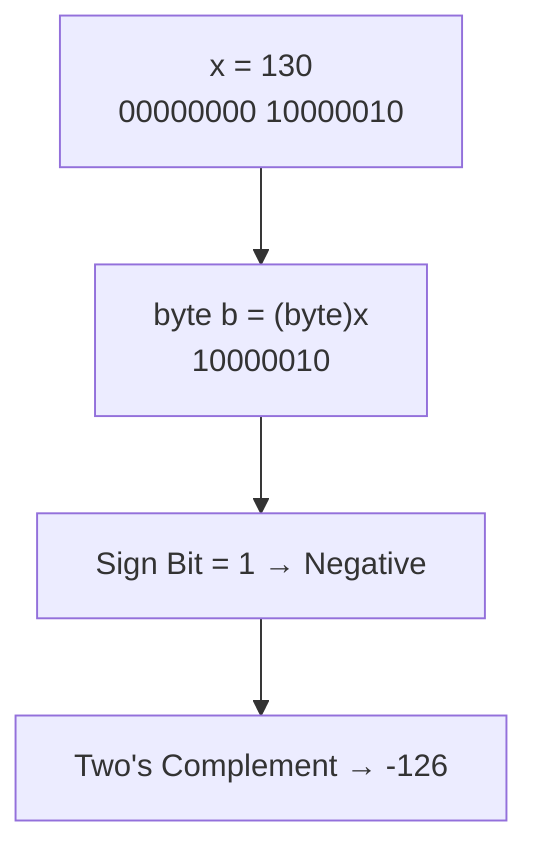
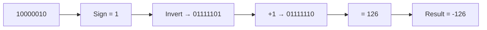
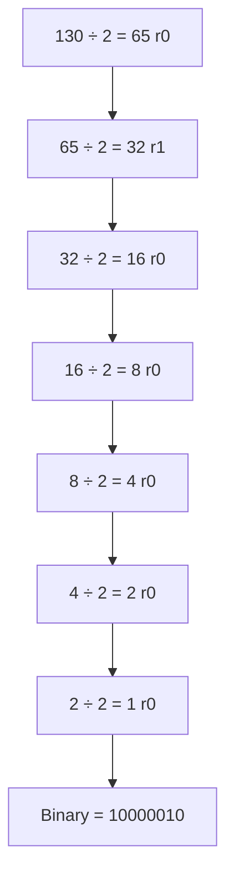

import { Aside, Badge, Card, CardGrid, Code } from '@astrojs/starlight/components';

## 🔀 Type Cast Operator

> **Type casting** converts a value from one data type to another. Java supports two forms: **implicit** (automatic) and **explicit** (manual).

---

## 🔼 Implicit Type Casting (Widening / Upcasting)

### Key Characteristics

| Feature | Detail |
|---------|--------|
| **Who performs it?** | ✅ Compiler (automatic) |
| **Direction** | Lower data type → Higher data type |
| **Also known as** | Widening, Upcasting, Promotion |
| **Information loss?** | ❌ No loss — safe conversion |
| **Syntax** | No cast needed — automatic |

### 🧭 Implicit Casting Hierarchy



<Aside type="note">
**Key Insight**: `char` (16-bit unsigned) promotes to `int` (32-bit signed), but **not** to `byte`/`short` implicitly — those are smaller and would risk loss.
</Aside>

### 💻 Implicit Casting Examples

<Code lang="java" title="Numeric widening — automatic" code={`// int → long → double (all implicit)int i = 100;
long l = i;        // ✅ auto: int to long
double d = i;      // ✅ auto: int to double

// char → int (implicit)
char ch = 'a';
int x = ch;        // ✅ auto: char to int
System.out.println(x);  // 97 (Unicode value of 'a')

// byte → short → int (implicit chain)
byte b = 10;
short s = b;       // ✅ auto
int num = s;       // ✅ auto`} />

<Code lang="java" title="Mixed expression promotion" code={`byte b = 5;
short s = 10;
int result = b + s;  // ✅ b and s promoted to int, result is int

// Why? Arithmetic on byte/short/char always promotes to int first!
// See: Arithmetic Operators → Type Promotion Rules`} />

<Aside type="tip">
**Memory Trick**: *"Small to Big — No Cast Needed"*  
If the target type can hold **all possible values** of the source type, the conversion is implicit and safe.
</Aside>

---

## 🔽 Explicit Type Casting (Narrowing / Downcasting)

### Key Characteristics

| Feature | Detail |
|---------|--------|
| **Who performs it?** | 👨‍💻 Programmer (manual) |
| **Direction** | Higher data type → Lower data type |
| **Also known as** | Narrowing, Downcasting, Demotion |
| **Information loss?** | ⚠️ **Possible** — precision or data may be lost |
| **Syntax** | `(targetType) value` |

### 🧭 Explicit Casting Hierarchy


<Aside type="caution">
**Warning**: When casting from larger to smaller types, **most significant bits are discarded** — only least significant bits are kept. This can cause:
- Sign changes (positive → negative)
- Value wrapping (overflow)
- Precision loss (decimal truncation)
</Aside>

---

## 🔢 Numeric Narrowing — Loss of Information

### Case 1: Integer → Smaller Integer (Bit Truncation)

<Code lang="java" title="int → byte: Two's complement overflow" code={`int x = 130;
byte b = (byte) x;  // ✅ explicit cast required
System.out.println(b);  // -126 😱

// Why -126? Let's trace the bits:
// 130 in binary (32-bit int):
// 00000000 00000000 00000000 10000010
//                                ↑↑↑↑↑↑↑↑ keep only last 8 bits!
// byte keeps: 10000010
// MSB = 1 → negative number in 2's complement
// To decode: invert bits → 01111101, add 1 → 01111110 = 126
// Result: -126 ✅`} />




<Code lang="java" title="int → short → byte chain" code={`int x = 150;
short s = (short) x;  // ✅ 150 fits in short (-32768 to 32767)
byte b = (byte) x;    // ✅ but 150 > 127 → overflow!

System.out.println(s);  // 150 ✅
System.out.println(b);  // -106 😱 (150 - 256 = -106)

// Formula for byte overflow: 
// If value > 127: result = value - 256
// If value < -128: result = value + 256`} />

### Case 2: Floating Point → Integer (Decimal Truncation)

<Code lang="java" title="Decimal part is discarded (not rounded!)" code={`double d = 130.456;
int x = (int) d;      // ✅ explicit cast
System.out.println(x);  // 130 (decimal .456 LOST!)

byte b = (byte) d;    // ✅ cast double → byte
System.out.println(b);  // -106 (130 → byte overflow as above)

// ⚠️ Casting truncates toward zero — does NOT round!
double d1 = 9.99;
double d2 = -9.99;
System.out.println((int) d1);  // 9  (not 10!)
System.out.println((int) d2);  // -9 (not -10!)`} />

<Aside type="danger">
**Critical**: Casting `double`/`float` to integer **truncates**, not rounds.  
To round: use `Math.round()`, `Math.floor()`, or `Math.ceil()` explicitly.
```java
double d = 9.99;
int truncated = (int) d;           // 9
int rounded = (int) Math.round(d); // 10 ✅
```
</Aside>

---

## 🔄 Complete Casting Reference Table

### Implicit (Widening) — Safe, Automatic

| From → To | Example | Notes |
|-----------|---------|-------|
| `byte` → `short` | `short s = (byte) b;` | ✅ Auto |
| `byte` → `int` | `int i = b;` | ✅ Auto |
| `char` → `int` | `int i = ch;` | ✅ Auto (Unicode value) |
| `int` → `long` | `long l = i;` | ✅ Auto |
| `int` → `float` | `float f = i;` | ✅ Auto (may lose precision for large ints) || `long` → `double` | `double d = l;` | ✅ Auto (may lose precision for large longs) |
| `float` → `double` | `double d = f;` | ✅ Auto |

### Explicit (Narrowing) — Manual, Risk of Loss

| From → To | Example | Risk |
|-----------|---------|------|
| `double` → `float` | `float f = (float) d;` | Precision loss |
| `long` → `int` | `int i = (int) l;` | Overflow if > `Integer.MAX_VALUE` |
| `int` → `short` | `short s = (short) i;` | Overflow if > 32767 |
| `int` → `byte` | `byte b = (byte) i;` | Overflow if > 127 |
| `float`/`double` → `int`/`byte` | `int i = (int) d;` | Decimal truncation + possible overflow |
| `char` → `byte` | `byte b = (byte) ch;` | Overflow if Unicode > 127 |

<Code lang="java" title="Precision loss: large int → float" code={`int big = 1234567890;
float f = big;  // ✅ implicit: int → float
System.out.println(f);  // 1.23456794E9 (not exact!)

// Why? float has only 24 bits of precision (~7 decimal digits)
// Large ints may lose low-order bits when converted to float.

// ✅ Use double for large integer precision:
double d = big;  // ✅ exact: 1234567890.0`} />

---

## 🧠 Two's Complement Deep Dive — Why `130 → -126`?

### Step-by-Step Bit Truncation



<Code lang="text" title="Bit-level trace" code={`130 in 32-bit int:
00000000 00000000 00000000 10000010
                                ↑↑↑↑↑↑↑↑
                                Keep only these 8 bits for byte

byte result: 10000010
Decoding 10000010 as signed byte:
1. MSB = 1 → negative number
2. To find magnitude: two's complement decode
   a) Invert bits: 01111101
   b) Add 1:      01111110 = 126
3. Apply sign: -126 ✅

Formula shortcut:
If value > 127: result = value - 256
130 - 256 = -126 ✅`} />

<Aside type="tip">
**Interview Formula**: For `int → byte` casting:
result = (value + 128) % 256 - 128
Or simpler: if `value > 127`, subtract 256; if `value < -128`, add 256.
</Aside>

---

## 🧳 Object Reference Casting

### Downcasting Objects — Runtime Check Required

<Code lang="java" title="Object → Subclass casting" code={`// Upcasting (implicit) — always safe
String s = "Hello";
Object obj = s;  // ✅ String IS-A Object

// Downcasting (explicit) — requires runtime check
Object obj2 = "World";
String s2 = (String) obj2;  // ✅ works: obj2 actually holds String

Object obj3 = new Integer(42);
String s3 = (String) obj3;  // 💥 Runtime: ClassCastException!
// obj3 holds Integer, not String — cast fails at runtime`} />

### ✅ Safe Casting with `instanceof` (Java 16+ Pattern Matching)

<Code lang="java" title="Guard casts with instanceof" code={`Object obj = getDynamicValue();

// ❌ Unsafe — may throw ClassCastException
// String s = (String) obj;

// ✅ Safe: traditional instanceof + cast
if (obj instanceof String) {
    String s = (String) obj;  // manual cast
    System.out.println(s.toUpperCase());
}

// ✅ Better: Java 16+ pattern matching (auto-cast)
if (obj instanceof String s) {
    System.out.println(s.toUpperCase());  // s is already String!
}

// ✅ Chain multiple types
if (obj instanceof String s) {
    processString(s);
} else if (obj instanceof Integer i) {
    processInt(i);
} else {
    System.out.println("Unknown type");
}`} />

<Aside type="caution">
**Golden Rule**: **Always** use `instanceof` (or pattern matching) before downcasting unless you are 100% certain of the runtime type.  
`ClassCastException` is a `RuntimeException` — it won't be caught at compile time!
</Aside>

---

## 🎯 Interview Cheat Sheet

<CardGrid>
  <Card title="Q: When is implicit casting performed?" icon="approve-check">
    When assigning a **smaller type to a larger type** (widening).  
    Example: `byte → short → int → long → float → double`, or `char → int`.  
    No cast syntax needed — compiler does it automatically.
  </Card>
  
  <Card title="Q: What happens when casting 130 to byte?" icon="error">
    **Result: `-126`** due to two's complement overflow.  
    - 130 in binary: `...10000010`  
    - Byte keeps last 8 bits: `10000010`  
    - MSB=1 → negative → decode as -126  
    Formula: `130 - 256 = -126`
  </Card>

  <Card title="Q: Does `(int) 9.99` equal 10?" icon="error">
    **NO ❌** — casting float/double to int **truncates toward zero**, does NOT round.  
    `(int) 9.99 = 9`, `(int) -9.99 = -9`.  
    Use `Math.round()` for rounding.
  </Card>

  <Card title="Q: Can char be cast to byte implicitly?" icon="error">
    **NO ❌** — `char` (0–65535) may not fit in `byte` (-128–127).  
    Explicit cast required: `byte b = (byte) ch;` — but risk of overflow!
  </Card>

  <Card title="Q: What is the output? `byte b = (byte) 300;`" icon="information">
    **`44`** — apply overflow formula:  
    `300 > 127` → `300 - 256 = 44` ✅  
    Binary: 300 = `1 00101100` → keep last 8 bits `00101100` = 44
  </Card>

  <Card title="Q: Is `int → float` implicit casting safe?" icon="caution">
    **Syntax: yes ✅, Precision: maybe ⚠️**  
    - Compiler allows `float f = intValue;` (implicit)  
    - But `float` has only ~7 decimal digits precision  
    - Large `int` values (> 2²⁴) may lose low-order bits  
    - Use `double` for exact large integer representation
  </Card>
</CardGrid>

---

## 🧩 DSA & Practical Patterns

<CardGrid>
  <Card title="Pattern: Safe Byte Conversion for Hashing" icon="shield">
    When converting hash codes to byte arrays (e.g., for serialization):
```java
    int hash = obj.hashCode();
    byte[] bytes = new byte[4];
    bytes[0] = (byte) (hash >> 24);  // Extract each byte safely
    bytes[1] = (byte) (hash >> 16);
    bytes[2] = (byte) (hash >> 8);
    bytes[3] = (byte) hash;
    // Explicit casts are intentional — we want the low 8 bits of each shift
```
  </Card>
  
  <Card title="Pattern: Rounding vs. Truncation" icon="rocket">
    Choose the right conversion for numeric algorithms:
```java
    double score = 94.7;
    
    // ❌ Truncation (may under-report):
    int grade1 = (int) score;  // 94
    
    // ✅ Rounding (more accurate):
    int grade2 = (int) Math.round(score);  // 95
    
    // ✅ Floor/Ceil for specific logic:
    int minPass = (int) Math.ceil(60.1);  // 61
    int maxFail = (int) Math.floor(59.9); // 59
```
  </Card>

  <Card title="Pattern: Defensive Object Casting" icon="backspace">
    Always validate before downcasting in polymorphic code:
```java
    void handle(Component c) {
        // ✅ Pattern matching (Java 16+)
        if (c instanceof Button b) {
            b.click();
        } else if (c instanceof Label l) {
            l.setText("Clicked!");
        }
        // No ClassCastException risk — type checked at runtime
    }
    
    // Pre-Java-16 fallback:
    if (c instanceof Button) {
        Button b = (Button) c;  // safe cast after instanceof check
        b.click();
    }
```
  </Card>
</CardGrid>

<Aside type="tip">
**Competitive Coding Tip**: When problem constraints mention large numbers:
- Use `long` instead of `int` for accumulators
- Avoid `float`/`double` for exact integer arithmetic
- If casting is needed, validate range first:
```java
if (value >= Byte.MIN_VALUE && value <= Byte.MAX_VALUE) {
    byte b = (byte) value;  // safe
}
```
</Aside>

---

## 🔑 Quick Reference Summary

### Implicit Casting (Widening) — Automatic & Safe

```text
byte → short → int → long → float → double
                ↑
              char
```
✅ No cast syntax needed  
✅ No data loss (except possible precision for int→float/double)  
✅ Compiler handles automatically

### Explicit Casting (Narrowing) — Manual & Risky

```text
double → float → long → int → short → byte
                          ↑
                        char
```
⚠️ Requires `(targetType)` syntax  
⚠️ May lose: decimal part, high-order bits, sign information  
⚠️ Programmer responsible for safety checks

### Object Casting Rules

| Cast Type | Syntax | Safety Check |
|-----------|--------|--------------|
| Upcast (Subclass → Superclass) | `Object o = new String();` | ✅ Always safe — implicit |
| Downcast (Superclass → Subclass) | `String s = (String) obj;` | ⚠️ Use `instanceof` first |
| Invalid cast (unrelated types) | `String s = (String) new Integer(1);` | 💥 `ClassCastException` at runtime |

<Aside type="caution">
**Final Checklist**:
1. ✅ Implicit casting: smaller → larger type — automatic, safe
2. ✅ Explicit casting: larger → smaller — manual, risk of loss
3. ✅ Integer narrowing: bits truncated → use two's complement to decode negatives
4. ✅ Float→int: truncates toward zero — use `Math.round()` for rounding
5. ✅ Object downcasting: **always** guard with `instanceof` or pattern matching
6. ✅ `char → int` is implicit (Unicode value); `char → byte` requires explicit cast
7. ✅ Large `int → float` may lose precision — prefer `double` for exact large integers
</Aside>

---

## 🧪 Test Your Understanding

<Code lang="java" title="Predict the output" code={`public class CastingQuiz {
    public static void main(String[] args) {
        // Q1: Implicit widening
        byte b = 10;
        int i = b;  // implicit
        System.out.println(i);  // ?
        
        // Q2: char → int
        char ch = 'Z';
        int code = ch;  // implicit
        System.out.println(code);  // ? (Unicode of 'Z')
        
        // Q3: Explicit narrowing — overflow
        int x = 200;
        byte by = (byte) x;
        System.out.println(by);  // ? (200 - 256 = ?)
        
        // Q4: Float truncation
        double d = -15.9;
        int truncated = (int) d;
        System.out.println(truncated);  // ? (not rounded!)
        
        // Q5: Large int → float precision
        int big = 16777217;  // 2^24 + 1
        float f = big;       // implicit
        System.out.println(f == big);  // ? (precision loss?)
        
        // Q6: Object casting safety
        Object obj = "test";
        if (obj instanceof String s) {
            System.out.println(s.length());  // ?
        }
        // What if we cast without check?
        // Integer wrong = (Integer) obj;  // ? (would this compile? runtime?)
    }
}

/* Expected Output:
10
90        ← 'Z' = 90 in Unicode
-56       ← 200 - 256 = -56
-15       ← truncation toward zero, not rounding
false     ← 16777217 cannot be represented exactly in float (24-bit mantissa)
4         ← "test".length()
// Last line: ❌ Compiles, but throws ClassCastException at runtime
*/`} />

<Aside type="tip">
**Pro Interview Strategy** for casting questions:
1. Identify direction: widening (implicit) or narrowing (explicit)?
2. For numeric narrowing: calculate bit truncation or use overflow formula
3. For float→int: emphasize truncation vs. rounding distinction
4. For object casting: always mention `instanceof` safety pattern
5. Mention precision caveats for `int→float`/`long→double`
6. Draw binary diagrams for byte overflow questions — shows deep understanding!

This demonstrates both theoretical knowledge and practical debugging skills! 🎯
</Aside>