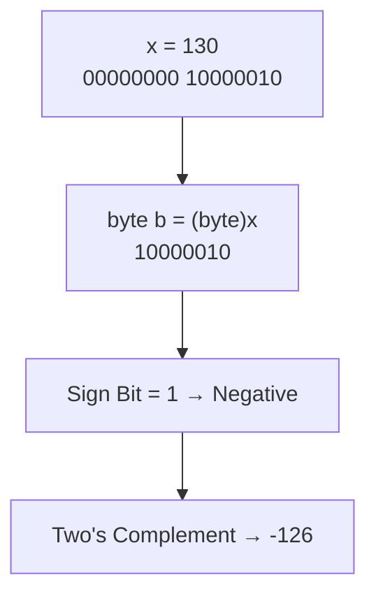
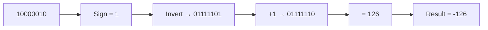
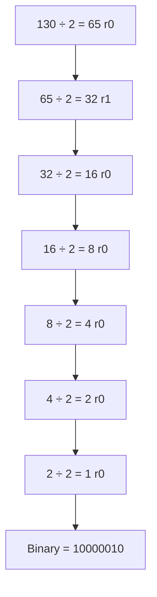

import { Aside, Badge, Card, CardGrid, Code } from '@astrojs/starlight/components';

## 🔀 Type Cast Operator

> **Type casting** converts a value from one data type to another. Java supports two forms: **implicit** (automatic) and **explicit** (manual).

```
Type Casting in Java
│
├── Widening (Implicit)
│   ├── Automatic — no cast needed
│   ├── No data loss (usually)
│   └── byte → short → int → long → float → double
│                char ──────┘
│
├── Narrowing (Explicit)
│   ├── Manual cast required: (type) value
│   ├── Potential data loss — truncation / overflow
│   └── double → float → long → int → short → byte
│
├── Reference Casting
│   ├── Upcasting   — subclass → superclass (implicit)
│   └── Downcasting — superclass → subclass (explicit, may throw CCE)
│
└── Special Cases
    ├── String ↔ primitive  (not a cast — use methods)
    ├── Casting with expressions
    └── Pattern matching cast (Java 16+)
```

---

## 🔼 Implicit Type Casting (Widening / Upcasting)

### Key Characteristics

| Feature | Detail |
|---------|--------|
| **Who performs it?** | ✅ Compiler (automatic) |
| **Direction** | Lower data type → Higher data type |
| **Also known as** | Widening, Upcasting, Promotion |
| **Information loss?** | ❌ No loss — safe conversion |
| **Syntax** | No cast needed — automatic |

### 🧭 Implicit Casting Hierarchy

```
Widening hierarchy:
  byte(8) → short(16) → int(32) → long(64) → float(32) → double(64)
      char(16) ─────────┘

Note: long(64) → float(32) is widening but MAY lose precision
  long  l = 1234567890123L;
  float f  = l;               // f = 1.23456794E12 — precision lost silently
  // widening = no data loss in range, but float has fewer significant digits
```

<Aside type="note">
**Key Insight**: `char` (16-bit unsigned) promotes to `int` (32-bit signed), but **not** to `byte`/`short` implicitly — those are smaller and would risk loss.
> 🔑 `long → float` and `long → double` are widening but can **silently lose precision**. A `long` has 64 bits of integer precision — `float` only has 23 bits mantissa. The value fits in range but digits are lost.
</Aside>

### 💻 Implicit Casting Examples

<Code lang="java" title="Numeric widening — automatic" code={`
// int → long → double (all implicit)int i = 100;
long l = i;        // ✅ auto: int to long
double d = i;      // ✅ auto: int to double

// char → int (implicit)
char ch = 'a';
int x = ch;        // ✅ auto: char to int
System.out.println(x);  // 97 (Unicode value of 'a')

// byte → short → int (implicit chain)
byte b = 10;
short s = b;       // ✅ auto
int num = s;       // ✅ auto

// No cast needed — compiler handles automatically
byte   b = 10;
short  s = b;       // byte  → short  ✅
int    i = s;       // short → int    ✅
long   l = i;       // int   → long   ✅
float  f = l;       // long  → float  ✅
double d = f;       // float → double ✅

// char widens to int and above
char c = 'A';       // 65
int  x = c;         // 65  ✅
long y = c;         // 65L ✅

// All valid — no cast syntax needed
`} />

<Code lang="java" title="Mixed expression promotion" code={`byte b = 5;
short s = 10;
int result = b + s;  // ✅ b and s promoted to int, result is int

// Why? Arithmetic on byte/short/char always promotes to int first!
// See: Arithmetic Operators → Type Promotion Rules`} />

<Aside type="tip">
**Memory Trick**: *"Small to Big — No Cast Needed"*  
If the target type can hold **all possible values** of the source type, the conversion is implicit and safe.
</Aside>

---

## 🔽 Explicit Type Casting (Narrowing / Downcasting)

### Key Characteristics

| Feature | Detail |
|---------|--------|
| **Who performs it?** | 👨‍💻 Programmer (manual) |
| **Direction** | Higher data type → Lower data type |
| **Also known as** | Narrowing, Downcasting, Demotion |
| **Information loss?** | ⚠️ **Possible** — precision or data may be lost |
| **Syntax** | `(targetType) value` |

```java
// Syntax: (targetType) expression
double d = 9.99;
int    i = (int) d;         // 9 — truncated toward zero (NOT rounded)

long   l = 300L;
byte   b = (byte) l;        // 44 — overflow: 300 % 256 = 44

double big = 1234567890.123;
float  f   = (float) big;   // 1.23456794E9 — precision loss

int    x   = 65;
char   c   = (char) x;      // 'A' — int to char
```

<Aside type="caution">
**Warning**: When casting from larger to smaller types, **most significant bits are discarded** — only least significant bits are kept. This can cause:
- Sign changes (positive → negative)
- Value wrapping (overflow)
- Precision loss (decimal truncation)
</Aside>

---

### What Happens During Narrowing

```
double → int:
  1. Drop fractional part (truncate toward zero)
  2. If value too large for int → take low 32 bits only

  double d = 9.99   → int: 9        (truncate)
  double d = -9.99  → int: -9       (truncate toward zero)
  double d = 1e18   → int: undefined behavior
                           (implementation-specific bit pattern)

long → int:
  Take low 32 bits — high 32 bits DISCARDED
  300L  = 0x000000012C → low 32 = 0x0000012C = 300? No:
  300L  → binary: 100101100
  (byte) 300:
    300 in binary: 1 0010 1100
    byte takes low 8 bits: 0010 1100 = 44

Formula for integer narrowing:
  result = value % (2^targetBits)
  adjusted for sign
```

---

## 🔬 Step 3 — Casting in Expressions

```java
// Cast has high precedence — applies to immediate value
double result = (double) 5 / 2;     // 2.5 — 5 cast to double, then divide
double wrong  = (double)(5 / 2);    // 2.0 — integer divide first, then cast

// Cast only what you need
int a = 5, b = 2;
double d1 = (double) a / b;         // 2.5 ✅ — a cast, b widened
double d2 = a / (double) b;         // 2.5 ✅ — b cast, a widened
double d3 = (double)(a / b);        // 2.0 ❌ — integer divide first

// Chain of casts
int x = (int)(double)(long) 9.9f;   // float→long→double→int = 9
// float 9.9f → long 9L → double 9.0 → int 9
```

> 🔑 `(double) a / b` ≠ `(double)(a / b)`. Cast applies to what immediately follows it. Parentheses control what gets cast — this is the most common cast precedence bug.

---

## 🔢 Numeric Narrowing — Loss of Information

### Case 1: Integer → Smaller Integer (Bit Truncation)

<Code lang="java" title="int → byte: Two's complement overflow" code={`int x = 130;
byte b = (byte) x;  // ✅ explicit cast required
System.out.println(b);  // -126 😱

// Why -126? Let's trace the bits:
// 130 in binary (32-bit int):
// 00000000 00000000 00000000 10000010
//                                ↑↑↑↑↑↑↑↑ keep only last 8 bits!
// byte keeps: 10000010
// MSB = 1 → negative number in 2's complement
// To decode: invert bits → 01111101, add 1 → 01111110 = 126
// Result: -126 ✅`} />


```mermaid
flowchart TD
    A["x = 130\n00000000 10000010"]
    B["byte b = (byte)x\n10000010"]
    C["Sign Bit = 1 → Negative"]
    D["Two's Complement → -126"]

    A --> B
    B --> C
    C --> D
```


```mermaid
flowchart LR
    A["10000010"]
    B["Sign = 1"]
    C["Invert → 01111101"]
    D["+1 → 01111110"]
    E["= 126"]
    F["Result = -126"]

    A --> B --> C --> D --> E --> F
```
<Code lang="java" title="int → short → byte chain" code={`int x = 150;
short s = (short) x;  // ✅ 150 fits in short (-32768 to 32767)
byte b = (byte) x;    // ✅ but 150 > 127 → overflow!

System.out.println(s);  // 150 ✅
System.out.println(b);  // -106 😱 (150 - 256 = -106)

// Formula for byte overflow: 
// If value > 127: result = value - 256
// If value < -128: result = value + 256`} />

### Case 2: Floating Point → Integer (Decimal Truncation)

<Code lang="java" title="Decimal part is discarded (not rounded!)" code={`double d = 130.456;
int x = (int) d;      // ✅ explicit cast
System.out.println(x);  // 130 (decimal .456 LOST!)

byte b = (byte) d;    // ✅ cast double → byte
System.out.println(b);  // -106 (130 → byte overflow as above)

// ⚠️ Casting truncates toward zero — does NOT round!
double d1 = 9.99;
double d2 = -9.99;
System.out.println((int) d1);  // 9  (not 10!)
System.out.println((int) d2);  // -9 (not -10!)`} />

<Aside type="danger">
**Critical**: Casting `double`/`float` to integer **truncates**, not rounds.  
To round: use `Math.round()`, `Math.floor()`, or `Math.ceil()` explicitly.
```java
double d = 9.99;
int truncated = (int) d;           // 9
int rounded = (int) Math.round(d); // 10 ✅
```
</Aside>

---

## 🔄 Complete Casting Reference Table

### Implicit (Widening) — Safe, Automatic

| From → To | Example | Notes |
|-----------|---------|-------|
| `byte` → `short` | `short s = (byte) b;` | ✅ Auto |
| `byte` → `int` | `int i = b;` | ✅ Auto |
| `char` → `int` | `int i = ch;` | ✅ Auto (Unicode value) |
| `int` → `long` | `long l = i;` | ✅ Auto |
| `int` → `float` | `float f = i;` | ✅ Auto (may lose precision for large ints) || `long` → `double` | `double d = l;` | ✅ Auto (may lose precision for large longs) |
| `float` → `double` | `double d = f;` | ✅ Auto |

### Explicit (Narrowing) — Manual, Risk of Loss

| From → To | Example | Risk |
|-----------|---------|------|
| `double` → `float` | `float f = (float) d;` | Precision loss |
| `long` → `int` | `int i = (int) l;` | Overflow if > `Integer.MAX_VALUE` |
| `int` → `short` | `short s = (short) i;` | Overflow if > 32767 |
| `int` → `byte` | `byte b = (byte) i;` | Overflow if > 127 |
| `float`/`double` → `int`/`byte` | `int i = (int) d;` | Decimal truncation + possible overflow |
| `char` → `byte` | `byte b = (byte) ch;` | Overflow if Unicode > 127 |

<Code lang="java" title="Precision loss: large int → float" code={`int big = 1234567890;
float f = big;  // ✅ implicit: int → float
System.out.println(f);  // 1.23456794E9 (not exact!)

// Why? float has only 24 bits of precision (~7 decimal digits)
// Large ints may lose low-order bits when converted to float.

// ✅ Use double for large integer precision:
double d = big;  // ✅ exact: 1234567890.0`} />

---

## 🧠 Two's Complement Deep Dive — Why `130 → -126`?

### Step-by-Step Bit Truncation


```mermaid
flowchart TB
    A["130 ÷ 2 = 65 r0"]
    B["65 ÷ 2 = 32 r1"]
    C["32 ÷ 2 = 16 r0"]
    D["16 ÷ 2 = 8 r0"]
    E["8 ÷ 2 = 4 r0"]
    F["4 ÷ 2 = 2 r0"]
    G["2 ÷ 2 = 1 r0"]
    H["Binary = 10000010"]

    A --> B --> C --> D --> E --> F --> G --> H
```

<Code lang="text" title="Bit-level trace" code={`130 in 32-bit int:
00000000 00000000 00000000 10000010
                                ↑↑↑↑↑↑↑↑
                                Keep only these 8 bits for byte

byte result: 10000010
Decoding 10000010 as signed byte:
1. MSB = 1 → negative number
2. To find magnitude: two's complement decode
   a) Invert bits: 01111101
   b) Add 1:      01111110 = 126
3. Apply sign: -126 ✅

Formula shortcut:
If value > 127: result = value - 256
130 - 256 = -126 ✅`} />

<Aside type="tip">
**Interview Formula**: For `int → byte` casting:
result = (value + 128) % 256 - 128
Or simpler: if `value > 127`, subtract 256; if `value < -128`, add 256.
</Aside>

---

## 🧳 Object Reference Casting

```java
Parent class reference can be used to hold Child class object but by using that reference
we can't call Child specific methods.

Example:
Object o=new String("ashok");       //valid
System.out.println(o.hashCode());   //valid

System.out.println(o.length());//
C.E:cannot find symbol,
  symbol : method length(),
  location: class java.lang.Object
Similarly we can use interface reference to hold implemented class object.
Example:
Runnable r=new Thread();

Type casting syntax:
A B= (C) D;  // explicit cast required for downcasting
A --> class/interface type
B --> name of reference variable
C --> type to cast to class/interface
D --> name of reference variable being cast

Compile time checking :
Rule 1: The type of "D" and "C" must have some relationship [either Child to Parent (or) Parent to Child (or) same type] otherwise we will get compile time error saying inconvertible types.

Rule 2: "C" must be either same (or) derived type of "A" otherwise we will get compile time error saying incompatible types.
Found: C
Required: A 

Examples:
1).
Object o=new String("ashok");
StringBuffer sb=(StringBuffer)o; //Valid
// This compiles successfully ✅ because String and StringBuffer are both subclasses of Object — they have a common ancestor, so the compiler allows the cast.
// But fails at runtime ❌

2).
String s=new String("ashok");
StringBuffer sb=(StringBuffer)s; //C.E: incompatible types: java.lang.String cannot be converted to java.lang.StringBuffer
// Object
// ├── String
// └── StringBuffer

Runtime checking :
The underlying object type of "D" must be either same (or) derived type of "C" otherwise we will get runtime exception saying ClassCastException.
Examples:
1).
Object o=new String("ashok"); <- underlying runtime type object is String
StringBuffer sb=(StringBuffer)o; //RE: ClassCastException: java.lang.String cannot be cast to java.lang.StringBuffer


                    Object
                   /      \
                  /        \
              Base1      Base2
              /   \       /   \
             /     \     /     \
       Derived1 Derived2 Derived3 Derived4

Base1 b=new Derived2();//valid
Object o=(Base1)b;//valid
Object o1=(Base2)o;//invalid
Object o2=(Base2)b;//invalid
Base2 b1=(Base1)(new Derived1());//invalid
Base2 b2=(Base2)(new Derived3());//valid
Base2 b2=(Base2)(new Derived1());//invalid

Through Type Casting just we are converting the type of object but not object itself that is we are performing type casting but not object casting.

Through Type Casting we are not create any new objects for the existing objects we are providing another type of reference variable(mostly Parent type).
Example:
String s = new String("ashok");
Object o = (Object) s; // Type cast — no new object created

System.out.println(s === o); //true

or
// equivalent code
Object o = new String("ashok");
                ___________ 
String s --->  |  ashok    |
Object o --->  |___________|

Integer I = new Integer(10);
Number n = (Number) I; // Type cast — no new object created
Object o = (Object) n; // Type cast — no new object created

System.out.println(I == n); // true
System.out.println(n == o); // true
                ___________ 
Integer I --->  |           |
Number  n --->  |    10     |
Object  o --->  |___________|

equivalent code
Integer I = new Integer(10);
Number n = I; // Upcast — no cast syntax needed
Object o = n; // Upcast — no cast syntax needed
or 
Number n = new Integer(10)
Object o = new Integer(10)

A
|
B
|
C

C c = new C();

1. (B)c; // valid — C IS-A B
equivalent To:
B b = new C(); 
// Compile time: B Reference
// Runtime     : C Reference

2. (A)((B)c); // valid — C IS-A B and B IS-A A
equivalent To:
A a = new C(); 
// Compile time: A Reference
// Runtime     : C Reference


P -> m1()
|
|
C -> m2()

C c = new C();
c.m1();       //Parent
c.m2();       //Child
((P)c).m1();  //Parent
// equivalent To:
// P p = new C();
// p.m1();    //Parent
((P)c).m2();  //CE: cannot find symbol, m2() is not a member of P


A -> m1() //A
|
B -> m1() //B
|
C -> m1() //C

C c = new C();
c.m1();       //C
((B)c).m1();  //C
// equivalent To:
// B b = new C();
// b.m1();    //In overridden method call, runtime type (C) determines which m1() is called — C's version executes
(A)((B)c);    //C

A -> static m1() //A
|
B -> static m1() //B
|
C -> static m1() //C

C c = new C();
c.m1();       //C
((B)c).m1();  //B
// equivalent To:
// B b = new C();
// b.m1();    //In Overridden static method call, reference type (B) determines which m1() is called — B's version executes 
(A)((B)c);    //A

A -> int x = 777;
|
B -> int x = 888;
|
C -> int x = 999;

C c = new C();
c.x;          //777
((B)c).x;     //888
// equivalent To:
// B b = new C();
// b.x;    //In variable hiding, reference type (B) determines which x is accessed — B's version (888) is accessed 
(A)((B)c);    //A
```

### Downcasting Objects — Runtime Check Required

<Code lang="java" title="Object → Subclass casting" code={`
// Upcasting (implicit) — always safe
String s = "Hello";
Object obj = s;  // ✅ String IS-A Object

// Downcasting (explicit) — requires runtime check
Object obj2 = "World";
String s2 = (String) obj2;  // ✅ works: obj2 actually holds String

Object obj3 = new Integer(42);
String s3 = (String) obj3;  // 💥 Runtime: ClassCastException!
// obj3 holds Integer, not String — cast fails at runtime`} />

### ✅ Safe Casting with `instanceof` (Java 16+ Pattern Matching)

<Code lang="java" title="Guard casts with instanceof" code={`
Object obj = getDynamicValue();

// ❌ Unsafe — may throw ClassCastException
// String s = (String) obj;

// ✅ Safe: traditional instanceof + cast
if (obj instanceof String) {
    String s = (String) obj;  // manual cast
    System.out.println(s.toUpperCase());
}

// ✅ Better: Java 16+ pattern matching (auto-cast)
if (obj instanceof String s) {
    System.out.println(s.toUpperCase());  // s is already String!
}

// ✅ Chain multiple types
if (obj instanceof String s) {
    processString(s);
} else if (obj instanceof Integer i) {
    processInt(i);
} else {
    System.out.println("Unknown type");
}`} />

<Aside type="caution">
**Golden Rule**: **Always** use `instanceof` (or pattern matching) before downcasting unless you are 100% certain of the runtime type.  
`ClassCastException` is a `RuntimeException` — it won't be caught at compile time!
</Aside>

---

## 🔬 Reference Upcasting (Implicit)

```java
// Subclass reference assigned to superclass type — always safe
class Animal { void speak() { } }
class Dog extends Animal {
    void fetch() { }
}

Dog dog = new Dog();
Animal a = dog;             // ✅ upcast — implicit, always succeeds
// a holds Dog object but Animal reference
// can only call Animal methods through a:
a.speak();                  // ✅
a.fetch();                  // ❌ COMPILE ERROR — Animal ref doesn't know fetch()

// Polymorphic dispatch still works
class Cat extends Animal {
    @Override void speak() { System.out.println("meow"); }
}
Animal c = new Cat();
c.speak();                  // "meow" — runtime type (Cat) determines method
```

```
Upcast:
  Dog  ──► Animal  (subclass to superclass)
  Safe — Dog IS-A Animal
  Implicit — no cast syntax
  Loses access to subclass-specific methods at compile time
  Runtime object unchanged — still a Dog
```

---

## 🔬 Reference Downcasting (Explicit)

```java
// Superclass reference cast back to subclass
Animal a = new Dog();       // upcast first

// Downcast — explicit cast required
Dog d = (Dog) a;            // ✅ safe — actual object IS a Dog
d.fetch();                  // ✅ subclass method accessible again

// UNSAFE downcast — ClassCastException at runtime
Animal a2 = new Cat();
Dog d2 = (Dog) a2;          // ❌ ClassCastException — Cat is not Dog
// Compiles fine — fails at runtime
// "Cat cannot be cast to class Dog"
```

```
Downcast safety check:
  Always use instanceof before downcast

  // ❌ Unsafe
  Dog d = (Dog) animal;

  // ✅ Safe — pre Java 16
  if (animal instanceof Dog) {
      Dog d = (Dog) animal;
      d.fetch();
  }

  // ✅ Best — Java 16+ pattern matching
  if (animal instanceof Dog d) {
      d.fetch();              // d bound — no explicit cast
  }
```

---

## 🔬 ClassCastException — When and Why

```java
// CCE thrown when:
// actual runtime type is NOT the target cast type or its subtype

Object obj = Integer.valueOf(42);
String s = (String) obj;        // ❌ CCE — Integer is not String

// Heap pollution — generic type erasure
List<String> strings = new ArrayList<>();
List raw = strings;             // raw type
raw.add(42);                    // Integer added — no error yet

String first = strings.get(0); // ❌ CCE — 42 is not String
// CCE thrown at get() — not at add()
// Root cause far from exception site
```

```
CCE at runtime:
  JVM checks: is object's actual type
              assignable to target type?
  Uses: object header → klass pointer → inheritance chain
  If not: throw ClassCastException
          message: "X cannot be cast to class Y"
```

---

## 🔬 String ↔ Primitive (Not a Cast)

```java
// Primitive → String (NOT a cast — use methods)
int i = 42;
String s1 = String.valueOf(i);      // "42"  ✅ preferred
String s2 = Integer.toString(i);    // "42"  ✅
String s3 = "" + i;                 // "42"  ✅ (but creates extra object)
String s4 = (String) i;             // ❌ COMPILE ERROR — not castable

// String → primitive (NOT a cast — use parse methods)
String s = "42";
int    x  = Integer.parseInt(s);    // 42   ✅
double d  = Double.parseDouble(s);  // 42.0 ✅
int    y  = (int) s;                // ❌ COMPILE ERROR — not castable

// String → wrapper (valueOf)
Integer n = Integer.valueOf("42");  // ✅
```

> 🔑 You **cannot cast** between `String` and primitives — no inheritance relationship exists. Use `Integer.parseInt()`, `String.valueOf()` etc. Attempting `(int) someString` = compile error always.

---

## 🎯 Interview Cheat Sheet

<CardGrid>
  <Card title="Q: When is implicit casting performed?" icon="approve-check">
    When assigning a **smaller type to a larger type** (widening).  
    Example: `byte → short → int → long → float → double`, or `char → int`.  
    No cast syntax needed — compiler does it automatically.
  </Card>
  
  <Card title="Q: What happens when casting 130 to byte?" icon="error">
    **Result: `-126`** due to two's complement overflow.  
    - 130 in binary: `...10000010`  
    - Byte keeps last 8 bits: `10000010`  
    - MSB=1 → negative → decode as -126  
    Formula: `130 - 256 = -126`
  </Card>

  <Card title="Q: Does `(int) 9.99` equal 10?" icon="error">
    **NO ❌** — casting float/double to int **truncates toward zero**, does NOT round.  
    `(int) 9.99 = 9`, `(int) -9.99 = -9`.  
    Use `Math.round()` for rounding.
  </Card>

  <Card title="Q: Can char be cast to byte implicitly?" icon="error">
    **NO ❌** — `char` (0–65535) may not fit in `byte` (-128–127).  
    Explicit cast required: `byte b = (byte) ch;` — but risk of overflow!
  </Card>

  <Card title="Q: What is the output? `byte b = (byte) 300;`" icon="information">
    **`44`** — apply overflow formula:  
    `300 > 127` → `300 - 256 = 44` ✅  
    Binary: 300 = `1 00101100` → keep last 8 bits `00101100` = 44
  </Card>

  <Card title="Q: Is `int → float` implicit casting safe?" icon="caution">
    **Syntax: yes ✅, Precision: maybe ⚠️**  
    - Compiler allows `float f = intValue;` (implicit)  
    - But `float` has only ~7 decimal digits precision  
    - Large `int` values (> 2²⁴) may lose low-order bits  
    - Use `double` for exact large integer representation
  </Card>

  <Card title="Q: `long → float` widening loses precision silently?" icon="caution">

  ```java
    long l = 123456789012345L;
    float f = l;                    // widening — no cast needed
    System.out.println(l);          // 123456789012345
    System.out.println(f);          // 1.23456794E14 — digits lost
    System.out.println((long) f);   // 123456800000000 — not original value

    // No compile warning. No runtime exception.
    // Widening does NOT guarantee precision — only range.
  ```
  </Card>

  <Card title="Q: Casting result of expression vs casting operand?" icon="caution">

  ```java
  int a = 1_000_000;
  int b = 1_000_000;

  long wrong   = (long)(a * b);   // a*b overflows int FIRST → then cast to long
                                  // result: some garbage long value

  long correct = (long) a * b;    // a cast to long FIRST → b widened → long multiply
                                  // result: 1_000_000_000_000L ✅

  // Rule: cast the FIRST operand — forces entire expression to wider type
  ```
  </Card>

  <Card title="Q: Downcast compiles even when impossible?" icon="caution">

  ```java
  class A { }
  class B extends A { }
  class C extends A { }

  A a = new B();
  C c = (C) a;        // ❌ CCE at runtime — B is not C
                      // ✅ COMPILES — compiler only checks:
                      // "could a reference of type A ever hold a C?"
                      // Answer: yes (C extends A) → allows cast
                      // Runtime check reveals actual object is B → CCE
  ```
  </Card>

  <Card title="Q: char/int/byte casting behavior?" icon="caution">

  ```java
  // int → char: takes low 16 bits as Unicode
  int x = 65;
  char c = (char) x;          // 'A'

  int y = 65536 + 65;         // 65601
  char c2 = (char) y;         // 'A' — low 16 bits = 65 = 'A'

  // char → byte: further narrowing
  char ch = '\u00FF';         // 255
  byte b = (byte) ch;         // -1 — 255 overflows signed byte

  // Printing int vs char
  int n = 65;
  System.out.println(n);          // 65
  System.out.println((char) n);   // A
  System.out.println("" + n);     // "65"
  System.out.println("" + (char) n); // "A"
  ```
  </Card>

  <Card title="Q: Pattern matching scope?" icon="caution">

  ```java
  // Pattern variable scoped to true branch only
  if (obj instanceof String s) {
      System.out.println(s.length());  // ✅ in scope
  }
  // s not accessible here

  // Negation — s available in false branch? No.
  if (!(obj instanceof String s)) {
      // s NOT in scope here
      return;
  }
  s.length();                         // ✅ — Java flow analysis knows: reached here = String
  // Compiler proves: if we reach this line, obj IS String
  // s IS in scope after negated instanceof + early return

  // Complex condition
  if (obj instanceof String s && s.length() > 5) {
      // s in scope — && short-circuits safely
      System.out.println(s);         // ✅
  }

  if (obj instanceof String s || s.length() > 5) { // ❌ COMPILE ERROR
      // s might not be bound if left side false
      // || doesn't guarantee instanceof was true
  }
  ```
  </Card>
</CardGrid>

---

## 🧩 DSA & Practical Patterns

<CardGrid>
  <Card title="Pattern: Safe Byte Conversion for Hashing" icon="shield">
  When converting hash codes to byte arrays (e.g., for serialization):
  ```java
      int hash = obj.hashCode();
      byte[] bytes = new byte[4];
      bytes[0] = (byte) (hash >> 24);  // Extract each byte safely
      bytes[1] = (byte) (hash >> 16);
      bytes[2] = (byte) (hash >> 8);
      bytes[3] = (byte) hash;
      // Explicit casts are intentional — we want the low 8 bits of each shift
  ```
  </Card>
  
  <Card title="Pattern: Rounding vs. Truncation" icon="rocket">
    Choose the right conversion for numeric algorithms:
  ```java
      double score = 94.7;
      
      // ❌ Truncation (may under-report):
      int grade1 = (int) score;  // 94
      
      // ✅ Rounding (more accurate):
      int grade2 = (int) Math.round(score);  // 95
      
      // ✅ Floor/Ceil for specific logic:
      int minPass = (int) Math.ceil(60.1);  // 61
      int maxFail = (int) Math.floor(59.9); // 59
  ```
  </Card>

  <Card title="Pattern: Defensive Object Casting" icon="backspace">
    Always validate before downcasting in polymorphic code:
  ```java
      void handle(Component c) {
          // ✅ Pattern matching (Java 16+)
          if (c instanceof Button b) {
              b.click();
          } else if (c instanceof Label l) {
              l.setText("Clicked!");
          }
          // No ClassCastException risk — type checked at runtime
      }
      
      // Pre-Java-16 fallback:
      if (c instanceof Button) {
          Button b = (Button) c;  // safe cast after instanceof check
          b.click();
      }
  ```
  </Card>

    <Card title="Underlying primitive: JVM `checkcast` instruction + type narrowing bytecodes" icon="backspace">
    Always validate before downcasting in polymorphic code:

    ```text
    Primitive narrowing — JVM bytecodes:
      d2i  → double to int   (truncate)
      d2l  → double to long
      d2f  → double to float
      f2i  → float to int
      f2l  → float to long
      i2b  → int to byte     (sign-extend low 8 bits)
      i2c  → int to char     (zero-extend low 16 bits)
      i2s  → int to short    (sign-extend low 16 bits)
      i2l  → int to long     (widening)
      l2i  → long to int     (low 32 bits)

    Reference cast — JVM bytecode:
      checkcast  Type
        1. pops reference from stack
        2. if null → push null (no exception)
        3. checks: is object's actual class assignable to Type?
        4. yes → push reference back (same reference)
        5. no  → throw ClassCastException

      checkcast is generated for EVERY explicit reference cast
      instanceof is generated for instanceof keyword check
      Pattern matching: instanceof + checkcast + astore (compiled together)

    Cost:
      checkcast: walks klass hierarchy — O(depth)
      Typically 1-3 levels — negligible
      JIT inlines and caches the type check
    ```
  </Card>
</CardGrid>

<Aside type="tip">
**Competitive Coding Tip**: When problem constraints mention large numbers:
- Use `long` instead of `int` for accumulators
- Avoid `float`/`double` for exact integer arithmetic
- If casting is needed, validate range first:
```java
if (value >= Byte.MIN_VALUE && value <= Byte.MAX_VALUE) {
    byte b = (byte) value;  // safe
}
```
</Aside>

---

## 💻 Real-World Code — Deserialization Layer

```java
public class ConfigParser {

    // Raw map from JSON/YAML parser — all values as Object
    private final Map<String, Object> raw;

    public ConfigParser(Map<String, Object> raw) {
        this.raw = raw;
    }

    // Safe downcast with instanceof check
    public String getString(String key) {
        Object value = raw.get(key);
        if (value == null) return null;
        if (value instanceof String s) return s;            // Java 16+ pattern
        return String.valueOf(value);                       // fallback — toString
    }

    // Numeric narrowing with range check
    public int getInt(String key, int defaultValue) {
        Object value = raw.get(key);
        if (value == null) return defaultValue;

        if (value instanceof Integer i)  return i;
        if (value instanceof Long l) {
            if (l < Integer.MIN_VALUE || l > Integer.MAX_VALUE) {
                throw new ConfigException(key + " value out of int range: " + l);
            }
            return (int)(long) l;                          // safe narrowing after check
        }
        if (value instanceof String s) return Integer.parseInt(s);
        throw new ConfigException("Cannot convert to int: " + value.getClass());
    }

    // Widening — always safe
    public double getDouble(String key, double defaultValue) {
        Object value = raw.get(key);
        if (value == null) return defaultValue;

        if (value instanceof Double d)  return d;
        if (value instanceof Float f)   return (double) f;  // widening
        if (value instanceof Integer i) return (double) i;  // widening
        if (value instanceof Long l)    return (double) l;  // widening — may lose precision
        if (value instanceof String s)  return Double.parseDouble(s);
        throw new ConfigException("Cannot convert to double: " + value.getClass());
    }
}
```

🔴 **What breaks if done wrong:** Direct `(int) raw.get("port")` → CCE if YAML parser returned `Long` (YAML integers default to Long in most parsers). Service crashes on startup with misleading CCE rather than helpful error.

---


## 🔑 Quick Reference Summary

### Implicit Casting (Widening) — Automatic & Safe

```text
byte → short → int → long → float → double
                ↑
              char
```
✅ No cast syntax needed  
✅ No data loss (except possible precision for int→float/double)  
✅ Compiler handles automatically

### Explicit Casting (Narrowing) — Manual & Risky

```text
double → float → long → int → short → byte
                          ↑
                        char
```
⚠️ Requires `(targetType)` syntax  
⚠️ May lose: decimal part, high-order bits, sign information  
⚠️ Programmer responsible for safety checks

### Object Casting Rules

| Cast Type | Syntax | Safety Check |
|-----------|--------|--------------|
| Upcast (Subclass → Superclass) | `Object o = new String();` | ✅ Always safe — implicit |
| Downcast (Superclass → Subclass) | `String s = (String) obj;` | ⚠️ Use `instanceof` first |
| Invalid cast (unrelated types) | `String s = (String) new Integer(1);` | 💥 `ClassCastException` at runtime |

<Aside type="caution">
**Final Checklist**:
1. ✅ Implicit casting: smaller → larger type — automatic, safe
2. ✅ Explicit casting: larger → smaller — manual, risk of loss
3. ✅ Integer narrowing: bits truncated → use two's complement to decode negatives
4. ✅ Float→int: truncates toward zero — use `Math.round()` for rounding
5. ✅ Object downcasting: **always** guard with `instanceof` or pattern matching
6. ✅ `char → int` is implicit (Unicode value); `char → byte` requires explicit cast
7. ✅ Large `int → float` may lose precision — prefer `double` for exact large integers
</Aside>

---

## 🧪 Test Your Understanding

<Code lang="java" title="Predict the output" code={`public class CastingQuiz {
    public static void main(String[] args) {
        // Q1: Implicit widening
        byte b = 10;
        int i = b;  // implicit
        System.out.println(i);  // ?
        
        // Q2: char → int
        char ch = 'Z';
        int code = ch;  // implicit
        System.out.println(code);  // ? (Unicode of 'Z')
        
        // Q3: Explicit narrowing — overflow
        int x = 200;
        byte by = (byte) x;
        System.out.println(by);  // ? (200 - 256 = ?)
        
        // Q4: Float truncation
        double d = -15.9;
        int truncated = (int) d;
        System.out.println(truncated);  // ? (not rounded!)
        
        // Q5: Large int → float precision
        int big = 16777217;  // 2^24 + 1
        float f = big;       // implicit
        System.out.println(f == big);  // ? (precision loss?)
        
        // Q6: Object casting safety
        Object obj = "test";
        if (obj instanceof String s) {
            System.out.println(s.length());  // ?
        }
        // What if we cast without check?
        // Integer wrong = (Integer) obj;  // ? (would this compile? runtime?)
    }
}

/* Expected Output:
10
90        ← 'Z' = 90 in Unicode
-56       ← 200 - 256 = -56
-15       ← truncation toward zero, not rounding
false     ← 16777217 cannot be represented exactly in float (24-bit mantissa)
4         ← "test".length()
// Last line: ❌ Compiles, but throws ClassCastException at runtime
*/`} />

<Aside type="tip">
**Pro Interview Strategy** for casting questions:
1. Identify direction: widening (implicit) or narrowing (explicit)?
2. For numeric narrowing: calculate bit truncation or use overflow formula
3. For float→int: emphasize truncation vs. rounding distinction
4. For object casting: always mention `instanceof` safety pattern
5. Mention precision caveats for `int→float`/`long→double`
6. Draw binary diagrams for byte overflow questions — shows deep understanding!

This demonstrates both theoretical knowledge and practical debugging skills! 🎯
</Aside>