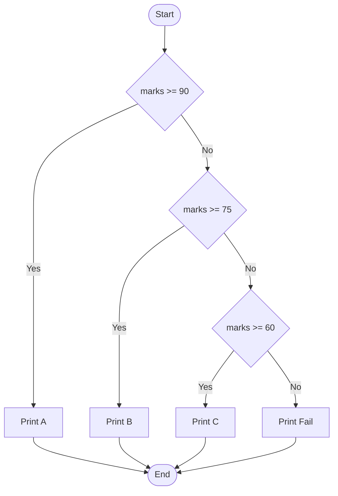

import { Aside, Badge, Card, CardGrid, Code } from '@astrojs/starlight/components';

## 1️⃣ if / if-else / if-else-if Ladder

### 🔑 Core Rule: Condition Must Be `boolean`

> The argument to an `if` statement **must be a boolean expression**. Any other type → **Compile Error**.

<Code lang="java" title="✅ Valid: boolean condition" code={`int age = 20;
if (age >= 18) {  // age >= 18 evaluates to boolean
    System.out.println("Adult");
} else {
    System.out.println("Minor");
}`} />

<Code lang="java" title="❌ Invalid: non-boolean condition" code={`int x = 10;
if (x) {  // ❌ C.E: incompatible types: found int, required boolean
    System.out.println("hello");
} else {
    System.out.println("hi");
}
// Java does NOT treat 0 as false or non-zero as true (unlike C/C++)`} />

<Aside type="note">
**Java vs C/C++**: In C/C++, `if (x)` works because integers implicitly convert to boolean. In Java, **explicit boolean required** — this prevents subtle bugs from accidental assignments or type confusion.
</Aside>

---

### 🧱 Syntax Patterns

<Code lang="java" title="Simple if" code={`if (condition) {
    // executes only if condition is true
}`} />

<Code lang="java" title="if-else" code={`
if (condition) {
    // executes if condition is true
} else {    
    // executes if condition is false
}
`} />

<Code lang="java" title="if-else-if ladder" code={`if (marks >= 90) {
    System.out.println("A grade");
} else if (marks >= 75) {
    System.out.println("B grade");
} else if (marks >= 60) {
    System.out.println("C grade");
} else {
    System.out.println("Fail");
}
// Evaluation: top-to-bottom, stops at first true condition`} />

### 🔄 Flow Diagram: if-else-if Ladder



<Aside type="tip">
**Performance Tip**: Order conditions from **most likely to least likely** to minimize average checks. Place expensive computations in later conditions (short-circuit evaluation helps).
</Aside>

---

## ⚠️ Interview Traps — if Statement

<CardGrid>
  <Card title="Trap 1: Missing Braces — Only ONE Line Belongs to if" icon="error">
```java
    if (x > 0)
        System.out.println("positive");  // ✅ part of if
        System.out.println("always!");    // ❌ ALWAYS runs! Not part of if!
    
    // ✅ Fix: Always use braces, even for single statements
    if (x > 0) {
        System.out.println("positive");
        System.out.println("also part of if");
    }
```
    **Why it matters**: Indentation is **visual only** in Java — compiler ignores whitespace. Missing braces cause logic bugs that are hard to spot.
  </Card>  
  <Card title="Trap 2: Assignment (=) vs Comparison (==) in Condition" icon="error">
```java
    int x = 0;
    
    // ❌ Compile Error: int cannot be converted to boolean
    if (x = 5) { }  // Assignment, not comparison!
    
    // ✅ Correct: use == for comparison
    if (x == 5) { }
    
    // ⚠️ Sneaky valid but dangerous: boolean assignment
    boolean flag = false;
    if (flag = true) { }  // ✅ Compiles! But assigns true, doesn't compare
    // Always prefer: if (flag) or if (flag == true) for clarity
```
    **Pro Tip**: Enable compiler warnings for "assignment in conditional" or use IDE inspections to catch this.
  </Card>

  <Card title="Trap 3: Dead Code After Unconditional Return" icon="error">
```java
    if (true) {
        return;  // Always returns here
    }
    System.out.println("never runs");  // ❌ C.E: unreachable statement
    
    // ✅ Fix: Remove dead code or make condition variable
    boolean debug = false;
    if (debug) {
        return;
    }
    System.out.println("now reachable");
```
    **Compiler Rule**: Java performs **flow analysis** — if code can never execute, it's a compile error (not just a warning).
  </Card>

  <Card title="Trap 4: Null Pointer in if Condition" icon="shield">
```java
    String obj = null;
    
    // ❌ Dangerous: NPE if obj is null
    if (obj.equals("value")) { }  // 💥 NullPointerException
    
    // ✅ Safe patterns:
    if ("value".equals(obj)) { }              // Yoda condition
    if (obj != null && obj.equals("value")) { }  // Explicit null check
    if (Objects.equals(obj, "value")) { }     // Java 7+ utility method
```
    **Interview Answer**: Always guard method calls on references with null checks, or use `"literal".equals(variable)` to avoid NPE.
  </Card></CardGrid>

---

## 2️⃣ switch Statement

### 🔑 Basic Syntax

<Code lang="java" title="switch with break statements" code={`int day = 3;

switch (day) {
    case 1:
        System.out.println("Monday");
        break;  // ← Critical: prevents fall-through!
    case 2:
        System.out.println("Tuesday");
        break;
    case 3:
        System.out.println("Wednesday");
        break;
    default:  // like else — runs if no case matches
        System.out.println("Other day");
        // break optional here (end of switch)
}`} />

### ⚠️ Fall-Through — Classic Trap

<Code lang="java" title="Missing break causes fall-through" code={`int x = 2;
switch (x) {
    case 1:
        System.out.println("One");
        // no break → falls through!
    case 2:
        System.out.println("Two");    // ✅ runs (x == 2)
        // no break → falls through!
    case 3:
        System.out.println("Three");  // ✅ ALSO runs! 😱
        // no break → falls through!
    default:
        System.out.println("Default"); // ✅ ALSO runs! 😱
}
// Output:
// Two
// Three
// Default
// ← All executed due to fall-through!`} />

<Aside type="caution">
**Fall-Through Rule**: When a `case` matches, execution starts at that `case` and **continues through all subsequent cases** until a `break` (or end of switch) is reached.  
✅ Use `break` to exit after handling a case.  ✅ Intentional fall-through is rare — always add `// fall-through` comment if used deliberately.
</Aside>

---

## 🔬 switch Rules — Must Know

<CardGrid>
  <Card title="Rule 1: Curly Braces Mandatory for switch Block" icon="approve-check">
```java
    // ✅ Valid: braces around switch body
    switch (x) {
        case 1: System.out.println("one"); break;
    }
    
    // ❌ Invalid: no braces (except for single-case expressions in Java 14+)
    switch (x)  // ❌ C.E: '{' expected
        case 1: System.out.println("one");
```
    **Note**: Inside individual `case` blocks, braces are optional for single statements — but **recommended** for clarity and to allow variable declarations.
  </Card>
  
  <Card title="Rule 2: case and default Are Optional" icon="information">
```java
    // ✅ Valid: empty switch (useless but compiles)
    switch (x) { }
    
    // ✅ Valid: only default
    switch (x) {
        default: System.out.println("no match");
    }
    
    // ✅ Valid: only cases, no default
    switch (x) {
        case 1: System.out.println("one"); break;
        case 2: System.out.println("two"); break;
    }
```
  </Card>

  <Card title="Rule 3: No Independent Statements — Must Be Under case/default" icon="error">
```java
    switch (x) {
        System.out.println("hello");  // ❌ C.E: case, default, or '}' expected
        case 1:
            System.out.println("one");
    }
    // Every statement inside switch must belong to a case or default label.
```
  </Card>
  <Card title="Rule 4: Duplicate case Labels Not Allowed" icon="error">
```java
    switch (x) {
        case 97: System.out.println("97"); break;
        case 'a': System.out.println("a"); break;  // ❌ C.E: duplicate case
        // 'a' is char literal = 97 (int), same as case 97 above
    }
```
    **Why**: `case` labels must be **unique constant values** — compiler checks for duplicates at compile time.
  </Card>
</CardGrid>

---

## 🔢 case Label Requirements

### Must Be Compile-Time Constant

<Code lang="java" title="✅ Valid: compile-time constants" code={`int x = 10;
final int y = 20;  // final + primitive/String = compile-time constant

switch (x) {
    case 10:           // ✅ literal constant
        System.out.println("10");
        break;
    case y:            // ✅ final variable = compile-time constant
        System.out.println("20");
        break;
    case 10 + 20:      // ✅ constant expression
        System.out.println("30");
        break;
    case 'a':          // ✅ char literal promoted to int
        System.out.println("97");
        break;
}`} />

<Code lang="java" title="❌ Invalid: non-constant case labels" code={`int x = 10;
int y = 20;  // NOT final → not compile-time constant

switch (x) {
    case y:  // ❌ C.E: constant expression required
        System.out.println("20");
        break;
}

// Fix: make y final
final int y = 20;  // ✅ Now valid
`} />
<Aside type="note">
**Compile-Time Constant Definition**: A value known at compile time:
- Literal values: `10`, `'a'`, `"text"`
- `final` primitives or Strings initialized with constant expressions
- Constant expressions: `10 + 20`, `'a' + 1`, `Math.PI` (if `static final`)
- ❌ Not constant: non-`final` variables, method calls, runtime values
</Aside>

### Must Be Within Range of switch Argument Type

<Code lang="java" title="case label range checking" code={`byte b = 10;
switch (b) {
    case 10:    // ✅ 10 fits in byte (-128 to 127)
        System.out.println("10");
        break;
    case 100:   // ✅ 100 fits in byte
        System.out.println("100");
        break;
    case 1000:  // ❌ C.E: possible loss of precision
                // 1000 is int literal, doesn't fit in byte range
        System.out.println("1000");
        break;
}

// ✅ Fix: cast constant to byte (if value fits)
case (byte)1000:  // Still ❌: 1000 > 127, cast doesn't change value
// Better: use int for switch argument if values exceed byte range
`} />

<Code lang="java" title="switch argument can be expression" code={`byte b = 10;
switch (b + 1) {  // b+1 promotes to int → switch argument is int
    case 10:      // ✅ int literal
        System.out.println("10");
        break;
    case 100:     // ✅ int literal
        System.out.println("100");
        break;
    case 1000:    // ✅ int literal (now switch arg is int, not byte)
        System.out.println("1000");
        break;
}
// Key: switch argument type determines allowed case label range`} />

---

## 📋 Allowed Types for switch

### ✅ Allowed (Java Versions Noted)

| Type | Java Version | Notes ||------|-------------|-------|
| `byte`, `short`, `int`, `char` | Java 1.0+ | Primitive integral types |
| `Byte`, `Short`, `Integer`, `Character` | Java 5+ | Wrapper classes (auto-unboxed) |
| `enum` | Java 5+ | Type-safe, IDE-friendly |
| `String` | Java 7+ | Compares using `.equals()` internally |
| `var` (with above types) | Java 10+ | Type inferred, must be one of allowed types |

### ❌ NOT Allowed (Compile Error)

| Type | Reason |
|------|--------|
| `long` | Too large for efficient jump table; use if-else or map |
| `float`, `double` | Floating-point equality is unreliable; use ranges with if-else |
| `boolean` | Only two values — use if-else for clarity |
| Objects (except String/enum/wrappers) | No meaningful equality for switch; use if-else or polymorphism |

<Code lang="java" title="Type examples" code={`// ✅ Allowed types
byte b = 1; switch (b) { case 1: break; }
short s = 2; switch (s) { case 2: break; }
int i = 3; switch (i) { case 3: break; }
char c = 'A'; switch (c) { case 'A': break; }

Integer wrapper = 4; switch (wrapper) { case 4: break; } // auto-unboxed

enum Day { MON, TUE }
Day today = Day.MON;
switch (today) { case MON: break; }  // ✅ enum

String name = "Alice";
switch (name) { case "Alice": break; }  // ✅ Java 7+

// ❌ Not allowed
long l = 10L;
// switch (l) { case 10: break; }  // ❌ C.E: incompatible types

double d = 3.14;
// switch (d) { case 3.14: break; }  // ❌ C.E: incompatible types

boolean flag = true;
// switch (flag) { case true: break; }  // ❌ C.E: incompatible types`} />

---

## 🔄 default Case Rules

<CardGrid>
  <Card title="Rule 1: Only One default Allowed" icon="approve-check">
```java
    switch (x) {
        case 1: break;        default: System.out.println("default"); break;
        // default: System.out.println("another");  // ❌ C.E: duplicate default
    }
```
  </Card>
  
  <Card title="Rule 2: default Runs Only If No case Matches" icon="information">
```java
    // If x == 1 → case 1 runs, default skipped
    // If x == 99 → no case matches → default runs
    switch (x) {
        case 1: System.out.println("one"); break;
        default: System.out.println("other");
    }
```
  </Card>

  <Card title="Rule 3: default Can Appear Anywhere (But Put It Last)" icon="backspace">
```java
    // ✅ Valid: default in middle (but confusing!)
    switch (x) {
        case 1: System.out.println("one"); break;
        default: System.out.println("other"); break;  // runs if x != 1
        case 2: System.out.println("two"); break;      // still reachable via fall-through!
    }
    
    // ✅ Recommended: default as last case (clearer intent)
    switch (x) {
        case 1: System.out.println("one"); break;
        case 2: System.out.println("two"); break;
        default: System.out.println("other");  // no break needed at end
    }
```
    **Best Practice**: Always place `default` last unless you have a specific fall-through reason (rare).
  </Card>
</CardGrid>

---

## 🟡 Switch Expressions (Java 14+) — Modern Syntax

> Java 14+ introduces **switch expressions** — cleaner, no fall-through by default, can return values.

### 🔑 Key Improvements

| Feature | Traditional switch | Switch Expression (Java 14+) |
|---------|-------------------|------------------------------|
| **Fall-through** | ✅ Default (must use `break`) | ❌ Disabled by default (`->` syntax) |
| **Return value** | ❌ No | ✅ Yes — can assign result |
| **Syntax** | `case X: ... break;` | `case X -> value;` || **Multiple cases** | `case 1: case 2: ...` | `case 1, 2 -> ...` |
| **Exhaustiveness** | ❌ Optional `default` | ✅ Compiler checks all cases covered (for enum) |

### 💻 Syntax Comparison

<Code lang="java" title="Traditional switch (pre-Java-14)" code={`int day = 3;
String name;

switch (day) {
    case 1:
        name = "Monday";
        break;
    case 2:
        name = "Tuesday";
        break;
    case 3:
        name = "Wednesday";
        break;
    default:
        name = "Other";
}
System.out.println(name);`} />

<Code lang="java" title="Switch expression (Java 14+) — arrow syntax" code={`int day = 3;

// ✅ Clean: no break needed, no fall-through risk
String name = switch (day) {
    case 1 -> "Monday";
    case 2 -> "Tuesday";
    case 3 -> "Wednesday";
    default -> "Other";  // required if not all values covered
};
System.out.println(name);  // "Wednesday"

// ✅ Multiple cases with comma
String type = switch (day) {
    case 1, 2, 3, 4, 5 -> "Weekday";
    case 6, 7 -> "Weekend";
    default -> "Invalid";
};`} />

<Code lang="java" title="Switch expression — block syntax for multiple statements" code={`int score = 85;

String grade = switch (score / 10) {
    case 10, 9 -> "A";  // 90-100
    case 8 -> {         // block syntax for multiple statements
        String msg = "Good job!";
        System.out.println(msg);
        yield "B";  // yield returns value from block (Java 14+)
    }    case 7 -> "C";
    default -> "Fail";
};
System.out.println(grade);  // "B"

// ⚠️ Note: Use yield (not return) to return value from switch block`} />

<Aside type="tip">
**Java Version Check**: Switch expressions require **Java 14+** (preview in 12-13, standard in 14).  
Enable with: `--enable-preview` flag for Java 12-13, or just use Java 14+.  
In build tools:
```xml
<!-- Maven -->
<compilerArgs>
  <arg>--enable-preview</arg>
</compilerArgs>
```
</Aside>

---

## 🎯 Interview Cheat Sheet

<CardGrid>
  <Card title="Q: Can if condition be int in Java?" icon="error">
    **NO ❌** — Java requires **explicit boolean**.  
    `if (x)` where `x` is `int` → Compile Error: "incompatible types: int cannot be converted to boolean".  
    This prevents C/C++-style bugs from accidental assignments or truthy/falsy confusion.
  </Card>
  
  <Card title="Q: What happens if break is missing in switch?" icon="error">
    **Fall-through**: Execution continues to the next `case`/`default` regardless of match.  
```java
    switch (2) {
        case 1: System.out.println("1");
        case 2: System.out.println("2");  // runs
        case 3: System.out.println("3");  // ALSO runs!
    }
    // Output: 2, 3
```
    ✅ Always use `break` unless fall-through is intentional (and documented with comment).
  </Card>

  <Card title="Q: Can case label be a variable?" icon="caution">
    **Only if `final`** (compile-time constant).  
```java
    int x = 10;
    final int y = 20;
    switch (x) {
        case y:  // ✅ valid: y is final → compile-time constant            break;
    }
    // Non-final variable: ❌ C.E: constant expression required
```
  </Card>

  <Card title="Q: Why can't switch use long/float/boolean?" icon="information">
    - `long`: Too many possible values for efficient jump table; use if-else or `Map<Long, T>`  
    - `float`/`double`: Equality comparisons are unreliable due to precision; use range checks with if-else  
    - `boolean`: Only two values — if-else is clearer and more idiomatic  
    ✅ switch is optimized for **small sets of discrete integral/String/enum values**.
  </Card>

  <Card title="Q: What is the output? `switch ('a') { case 97: ... }`" icon="approve-check">
    **Matches** — `char 'a'` has Unicode value 97, and `case 97` is an `int` literal.  
    Java promotes `char` to `int` for comparison, so `case 97` matches `switch ('a')`.  
    ✅ This is why duplicate `case 97` and `case 'a'` causes compile error — they're the same value.
  </Card>

  <Card title="Q: When to use switch expression vs traditional switch?" icon="rocket">
    **Switch expression (Java 14+)** when:
    - You need to **return a value** from the switch  
    - You want **compile-time exhaustiveness checks** (for enums)  
    - You prefer **concise, no-fall-through syntax**  
    **Traditional switch** when:
    - Supporting Java < 14  
    - You need **intentional fall-through** (rare)  
    - Complex logic per case that doesn't fit expression style
  </Card>
</CardGrid>

---

## 🧩 DSA & Practical Patterns

<CardGrid>
  <Card title="Pattern: Grade Calculator with if-else-if" icon="shield">
```java
    String getGrade(int marks) {
        if (marks >= 90) return "A";
        else if (marks >= 75) return "B";
        else if (marks >= 60) return "C";
        else if (marks >= 40) return "D";
        else return "F";
    }
    // ✅ Clear, efficient (stops at first match), easy to modify thresholds
```
  </Card>
  
  <Card title="Pattern: Command Dispatcher with switch" icon="rocket">
  ```java
    void handleCommand(String cmd) {
        switch (cmd) {
            case "start" -> startService();
            case "stop"  -> stopService();
            case "restart" -> {
                stopService();
                startService();
            }
            default -> System.err.println("Unknown command: " + cmd);
        }
    }
    // ✅ Java 14+ switch expression: concise, no fall-through risk
```
  </Card>

  <Card title="Pattern: Enum-Based State Machine" icon="backspace">
 ```java
    enum State { IDLE, RUNNING, PAUSED, STOPPED }
    
    State nextState(State current, String event) {
        return switch (current) {
            case IDLE -> switch (event) {
                case "start" -> RUNNING;
                default -> IDLE;
            };
            case RUNNING -> switch (event) {
                case "pause" -> PAUSED;
                case "stop" -> STOPPED;
                default -> RUNNING;
            };
            // ... other states
            default -> current;  // safety fallback
        };
    }
    // ✅ Compiler checks all enum values covered (exhaustiveness)
    // ✅ Type-safe, IDE autocomplete, refactoring-friendly
    ```
  </Card>
</CardGrid>

<Aside type="tip">
**Performance Note**: Modern JVMs optimize `switch` on `int`/`enum` into **jump tables** (O(1) lookup) for dense values, or **binary search** for sparse values. For `String`, it uses `.equals()` with hash pre-check.  
✅ For small sets (< 5 cases), if-else may be equally fast — prioritize readability.  
✅ For large sets of integral values, `switch` is often faster than chained if-else.
</Aside>

---

## 🔑 Quick Reference Summary

### if Statement Rules
| Requirement | Detail |
|-------------|--------|
| Condition type | Must be `boolean` (explicit) |
| Braces | Optional for single statement, **recommended always** |
| Dead code | Compile error if unreachable (flow analysis) |
| Null safety | Guard method calls: `"lit".equals(var)` or null check first |

### switch Statement Rules
| Rule | Detail |
|------|--------|
| Argument types | `byte`/`short`/`int`/`char`, wrappers, `enum`, `String` (Java 7+) |
| ❌ Not allowed | `long`, `float`, `double`, `boolean`, arbitrary objects |
| case labels | Must be **compile-time constants**, unique, within argument type range |
| default | Optional, only one allowed, can appear anywhere (but put last) |
| Fall-through | Default behavior — use `break` to exit, or document intentional fall-through |
| Braces | Mandatory for switch block; optional inside case blocks (but recommended) |

### Switch Expression (Java 14+)
| Feature | Syntax | Benefit |
|---------|--------|---------|
| Arrow case | `case X -> value;` | No fall-through, concise |
| Block case | `case X -> { ... yield value; }` | Multiple statements + return |
| Multiple cases | `case 1, 2, 3 -> ...` | Reduce duplication |
| Exhaustiveness | Compiler checks enum coverage | Prevents missing cases |

<Aside type="caution">
**Final Checklist**:
1. ✅ `if` condition must be **explicit boolean** — no implicit int→boolean conversion
2. ✅ Always use **braces** for if/else bodies — prevents subtle bugs
3. ✅ `switch` case labels must be **compile-time constants** (`final` variables OK)
4. ✅ Case values must be **within range** of switch argument type
5. ✅ Use `break` to prevent **fall-through** unless intentional (and commented)
6. ✅ Place `default` **last** in switch for clarity
7. ✅ Prefer **switch expressions** (Java 14+) for value-returning logic
8. ✅ For null safety: `"literal".equals(variable)` avoids NPE in conditions
</Aside>

---

## 🧪 Test Your Understanding

<Code lang="java" title="Predict the output" code={`public class ControlFlowQuiz {
    public static void main(String[] args) {
        // Q1: if with non-boolean (would this compile?)
        // int x = 5;
        // if (x) { System.out.println("yes"); }  // ?
        
        // Q2: Missing braces trap
        int a = 1;
        if (a > 0)
            System.out.print("A");
        System.out.print("B");  // runs regardless
        // Output: ?
        
        // Q3: switch fall-through
        int day = 2;
        switch (day) {
            case 1: System.out.print("1");
            case 2: System.out.print("2");
            case 3: System.out.print("3");
            default: System.out.print("D");
        }
        // Output: ?
        
        // Q4: case label constant requirement
        final int x = 10;
        int y = 20;
        switch (x) {
            case y:  // ? (compile or runtime?)
                System.out.println("y");
        }
        
        // Q5: char case label promotion
        char c = 'a';  // Unicode 97
        switch (c) {
            case 97: System.out.println("matched"); break;
            case 'a': System.out.println("also 97"); break;  // ? (duplicate?)
        }
        
        // Q6: switch expression (Java 14+)
        // int score = 85;
        // String grade = switch (score / 10) {
        //     case 10, 9 -> "A";
        //     case 8 -> "B";
        //     default -> "C";
        // };
        // System.out.println(grade);  // ?
    }
}

/* Expected Output:
// Q1: ❌ Compile Error: incompatible types (int != boolean)
AB      ← Q2: "A" from if, "B" always runs
23D     ← Q3: fall-through from case 2 → prints 2,3,D
// Q4: ❌ Compile Error: constant expression required (y not final)
// Q5: ❌ Compile Error: duplicate case label (97 == 'a')
// Q6: "B"  ← 85/10 = 8 (integer division)
*/`} />

<Aside type="tip">
**Pro Interview Strategy** for control flow questions:
1. Clarify **type requirements** (`if` needs boolean, `switch` has type restrictions)
2. Explain **fall-through** behavior and `break` importance
3. Distinguish **compile-time constants** for case labels
4. Mention **null safety patterns** (`"lit".equals(var)`)
5. For Java 14+: highlight switch expression benefits (exhaustiveness, no fall-through)
6. Use **flow diagrams** or step-through examples to demonstrate understanding

This shows both language mastery and practical debugging awareness! 🎯
</Aside>