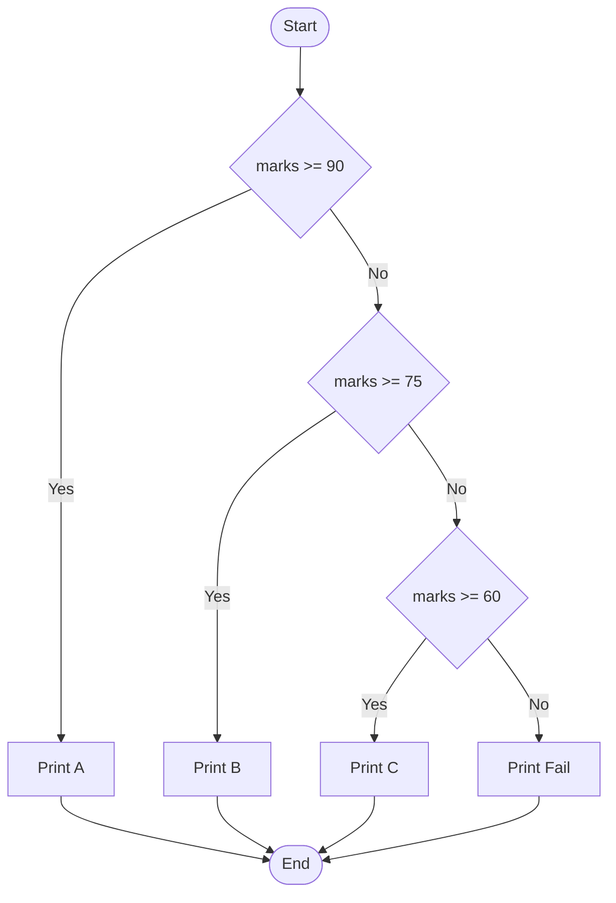

import { Aside, Badge, Card, CardGrid, Code } from '@astrojs/starlight/components';

# 🔀 Java Selection Statements

---

## 🗺️ The Full Map

```
Selection Statements
│
├── if
│   ├── if
│   ├── if-else
│   ├── else-if
│   └── nested if
│
├── switch
│   ├── switch statement        (classic)
│   ├── switch expression       (Java 14+)
│   └── pattern matching switch (Java 21+)
│
└── Ternary Operator
    └── condition ? then : else
```

---

# if / if-else / else-if Ladder

---

## 🔬 if Statement

```java
// Form 1 — if only
if (condition) {
    // runs if condition true
}

// Form 2 — if-else
if (condition) {
    // true branch
} else {
    // false branch
}

// Form 3 — else-if
if (condition1) {
    // branch 1
} else if (condition2) {
    // branch 2
} else if (condition3) {
    // branch 3
} else {
    // default branch
}

// Form 4 — nested if
if (outer) {
    if (inner) {
        // both true
    }
}
```

---

## 🔑 Core Rule: Condition Must Be `boolean`

> The argument to an `if` statement **must be a boolean expression**. Any other type → **Compile Error**.

```java
int x = 5;

if (x) { }              // ❌ COMPILE ERROR — int not boolean
if (x = 5) { }          // ❌ COMPILE ERROR — assignment not boolean
if (x == 5) { }         // ✅ boolean expression

// Unlike C/C++ — Java strictly requires boolean
// No implicit int→boolean conversion
```

---

## Braces Are Optional for Single Statement

```java
// ✅ Valid — single statement no braces
if (x > 0)
    System.out.println("positive");

// ❌ Dangerous — dangling else + misleading indent
if (x > 0)
    System.out.println("positive");
    System.out.println("always prints");    // NOT part of if — executes always

// ✅ Always use braces — prevents bugs
if (x > 0) {
    System.out.println("positive");
}
```

> 🔑 Always use braces even for single-statement if blocks. The "dangling else" and indentation-mismatch bugs are the most common cause of silent logic errors in Java codebases.

---

## 🔬 else if Chain — Evaluation Order

```java
int score = 85;

if (score >= 90) {
    System.out.println("A");        // checked first
} else if (score >= 80) {
    System.out.println("B");        // checked only if first false
} else if (score >= 70) {
    System.out.println("C");        // checked only if first two false
} else {
    System.out.println("F");        // reached only if all above false
}
// Output: B
```


```mermaid
flowchart TD
    A([Start]) --> B{marks >= 90}
    B -- Yes --> C[Print A] --> Z([End])
    B -- No --> D{marks >= 75}
    D -- Yes --> E[Print B] --> Z
    D -- No --> F{marks >= 60}
    F -- Yes --> G[Print C] --> Z
    F -- No --> H[Print Fail] --> Z
```

---

### Nested `if` — Dangling Else Problem

```js
// JS pairs else with NEAREST if — indentation is MISLEADING:
if (x > 0)
  if (y > 0)
    System.out.println("both positive");
  else
    System.out.println("x positive, y not"); // THIS else belongs to inner if

// Even though indentation suggests it belongs to outer if
// Parsed as:
if (x > 0) {
  if (y > 0) {
    System.out.println("both positive");
  } else {
    System.out.println("x positive, y not"); // inner else — NOT outer
  }
}

// Fix — always use braces:
if (x > 0) {
  if (y > 0) {
    System.out.println("both positive");
  }
} else {
  System.out.println("x not positive"); // outer else — clear
}

---

# switch Statement

## 🔑 Basic Syntax

```java
// Syntax
switch (expression) {
    case value1:
        // code
        break;              // ← required to prevent fall-through
    case value2:
        // code
        break;
    default:
        // runs if no case matches
        break;              // optional on last case — good practice
}
```

<Code lang="java" title="switch with break statements" code={`
switch (day) {
    case 1:
        System.out.println("Monday");
        break;  // ← Critical: prevents fall-through!
    case 2:
        System.out.println("Tuesday");
        break;
    case 3:
        System.out.println("Wednesday");
        break;
    default:  // like else — runs if no case matches
        System.out.println("Other day");
        // break optional here (end of switch)
}

// if day = 1 → prints "Monday" only (break prevents fall-through)
// if day = 2 → prints "Tuesday" only
// if day = 3 → prints "Wednesday" only
// if day = 99 → prints "Other day" (default case)
`} />

### ⚠️ Fall-Through — Classic Trap

<Code lang="java" title="Missing break causes fall-through" code={`

switch (x) {
    case 1:
        System.out.println("One");
        // no break → falls through!
    case 2:
        System.out.println("Two");    // ✅ runs (x == 2)
        // no break → falls through!
        break;
    case 3:
        System.out.println("Three");  // ✅ ALSO runs! 😱
        // no break → falls through!
    default:
        System.out.println("Default"); // ✅ ALSO runs! 😱
}

// if x = 1 → prints One, Two
// if x = 2 → prints Two
// if x = 3 → prints Three, Default
// if x = 99 → prints Default only (no case matches, default runs)
`} />

---

## 🔬 switch Rules — Must Know

<Card title="Rule 1: Curly Braces Mandatory for switch Block" icon="approve-check">
    ```java
        // ✅ Valid: braces around switch body
        switch (x) {
            case 1: System.out.println("one"); break;
        }

        // ❌ Invalid: no braces (except for single-case expressions in Java 14+)
        switch (x)  // ❌ C.E: '{' expected
            case 1: System.out.println("one");
    ```
    <Aside type="note">
        **Note**: Inside individual `case` blocks, braces are optional for single statements — but **recommended** for clarity and to allow variable declarations.
    </Aside>
</Card>

<Card title="Rule 2: case and default Are Optional" icon="information">
    ```java
        // ✅ Valid: empty switch (useless but compiles)
        switch (x) { }

        // ✅ Valid: only default
        switch (x) {
            default: System.out.println("no match");
        }

        // ✅ Valid: only cases, no default
        switch (x) {
            case 1: System.out.println("one"); break;
            case 2: System.out.println("two"); break;
        }
    ```
</Card>

<Card title="Rule 3: No Independent Statements — Must Be Under case/default" icon="error">
    ```java
        switch (x) {
            System.out.println("hello");  // ❌ C.E: case, default, or '}' expected
            case 1:
                System.out.println("one");
        }
        // Every statement inside switch must belong to a case or default label.
    ```
</Card>

<Card title="Rule 4: Duplicate case Labels Not Allowed" icon="error">
    ```java
        switch (x) {
            case 97: System.out.println("97"); break;
            case 'a': System.out.println("a"); break;  // ❌ C.E: duplicate case
            // 'a' is char literal = 97 (int), same as case 97 above
        }
    ```
    <Aside type="danger">
        **Why**: `case` labels must be **unique constant values** — compiler checks for duplicates at compile time.
    </Aside>
</Card>

---

## 🔢 case Label Requirements

---

### 1. Must Be Compile-Time Constant

<Code lang="java" title="✅ Valid: compile-time constants" code={`
public class A { 
    static final int z = 40;  // final + primitive/String = compile-time constant
    public static void main(String[] args) { 
        int x = 10;
        final int y = 20;  // final + primitive/String = compile-time constant
        // int y = 20;     // ❌ C.E: NOT final → not compile-time constant

        switch (x) {
            case 10:           // ✅ literal constant
                System.out.println("10");
                break;
            case y:            // ✅ final variable = compile-time constant
                System.out.println("20");
                break;
            case 10 + 20:      // ✅ constant expression
                System.out.println("30");
                break;
            case A.z:          // ✅ constant expression
                System.out.println("40");
                break;
            case 'a':          // ✅ char literal promoted to int
                System.out.println("97");
                break;
        }
    }
}
`} />

<Aside type="note">
**Compile-Time Constant Definition**: A value known at compile time:
- Literal values: `10`, `'a'`, `"text"`
- `final` primitives or Strings initialized with constant expressions
- Constant expressions: `10 + 20`, `'a' + 1`, `Math.PI` (if `static final`)
- ❌ Not constant: non-`final` variables, method calls, runtime values
</Aside>

---

### 2. Must Be Within Range of switch Argument Type

<Code lang="java" title="case label range checking" code={`
byte b = 10;
switch (b) {
    case 10:    // ✅ 10 fits in byte (-128 to 127)
        System.out.println("10");
        break;
    case 100:   // ✅ 100 fits in byte
        System.out.println("100");
        break;
    case 1000:  // ❌ C.E: possible loss of precision int to byte
                // 1000 is int literal, doesn't fit in byte range
        System.out.println("1000");
        break;
}

// ✅ Fix: cast constant to byte (if value fits)
case (byte)1000:  // Still ❌: 1000 > 127, cast doesn't change value
// Better: use int for switch argument if values exceed byte range
`} />

<Code lang="java" title="switch argument can be expression" code={`
byte b = 10;
switch (b + 1) {  // b+1 promotes to int → switch argument is int
    case 10:      // ✅ int literal
        System.out.println("10");
        break;
    case 100:     // ✅ int literal
        System.out.println("100");
        break;
    case 1000:    // ✅ int literal (now switch arg is int, not byte)
        System.out.println("1000");
        break;
}
// Key: switch argument type determines allowed case label range`} />

---

## 📋 Allowed Types for switch

---

### 1. ✅ Allowed (Java Versions Noted)

```
switch expression type must be:
  ├── byte, short, int, char             ← primitives (not long, float, double)
  ├── Byte, Short, Integer, Character    ← wrappers (unboxed)
  ├── String                             ← Java 7+
  ├── enum                               ← any enum type Java 5+
  └── var                                ← if inferred type is above (Java 10+)

❌ NOT supported:
  long, float, double, boolean
  any Object type (except String, enum, wrappers above)
```

---

### 2.❌ NOT Allowed (Compile Error)

| Type | Reason |
|------|--------|
| `long` | Too large for efficient jump table; use if-else or map |
| `float`, `double` | Floating-point equality is unreliable; use ranges with if-else |
| `boolean` | Only two values — use if-else for clarity |
| `Objects` (except String/enum/wrappers) | No meaningful equality for switch; use if-else or polymorphism |

<Code lang="java" title="Type examples" code={`
// ✅ Allowed types
byte b = 1; 
switch (b) { case 1: break; }

short s = 2; 
switch (s) { case 2: break; }

int i = 3; 
switch (i) { case 3: break; }

char c = 'A'; 
switch (c) { case 'A': break; }

Integer wrapper = 4; 
switch (wrapper) { case 4: break; } // auto-unboxed

enum Day { MON, TUE }
Day today = Day.MON;
switch (today) { case MON: break; }  // ✅ enum

// String switch — Java 7+
String day = "MONDAY";
switch (day) {
    case "MONDAY":
    case "TUESDAY":
    case "WEDNESDAY":
    case "THURSDAY":
    case "FRIDAY":
        System.out.println("Weekday");
        break;
    case "SATURDAY":
    case "SUNDAY":
        System.out.println("Weekend");
        break;
    default:
        System.out.println("Unknown");
}

// ❌ Not allowed
long l = 10L;
// switch (l) { case 10: break; }       // ❌ C.E: incompatible types

double d = 3.14;
// switch (d) { case 3.14: break; }     // ❌ C.E: incompatible types

boolean flag = true;
// switch (flag) { case true: break; }  // ❌ C.E: incompatible types

`} />

---

## 3. 🔄 default Case Rules

<Card title="Rule 1: Only One default Allowed" icon="approve-check">
```java
    switch (x) {
        case 1: break;
        default: System.out.println("default"); break;
        // default: System.out.println("another");  // ❌ C.E: duplicate default
    }
```
</Card>

<Card title="Rule 2: default Runs Only If No case Matches" icon="information">
```java
    without break:
    // If x == 1 → case 1 runs, default

    with break:
    // If x == 1 → case 1 runs
    
    No case matched:
    // If x == 99 → no case matches → default runs
    switch (x) {
        case 1: System.out.println("one"); break;
        default: System.out.println("other");
    }
```
</Card>

<Card title="Rule 3: default Can Appear Anywhere (But Put It Last)" icon="backspace">
```java
// ✅ Valid: default in middle (but confusing!)
switch (x) {
    case 1: System.out.println("one"); break;
    default: System.out.println("other"); break;  // runs if x != 1
    case 2: System.out.println("two"); break;      // still reachable via fall-through!
}

// ✅ Recommended: default as last case (clearer intent)
switch (x) {
    case 1: System.out.println("one"); break;
    case 2: System.out.println("two"); break;
    default: System.out.println("other");  // no break needed at end
}
```
<Aside type="tip">
    **Best Practice**: Always place `default` last unless you have a specific fall-through reason (rare).
</Aside>
</Card>

```java
switch (b) {
  case 10:
    System.out.println("10");
    break;
  case 100:
    System.out.println("100");
  default:
    System.out.println("1000");
}
if b = 10   → matches case 10 → prints "10" only (break prevents fall-through)
if b = 100  → matches case 100 → prints "100" and falls through to default → also prints "1000"

switch (b) {
  case 10:
    System.out.println("10");
  default:
    System.out.println("1000");
    break;
  case 100:
    System.out.println("100");
}

if b = 10   → matches case 10 → prints "10" and falls through to default → also prints "1000" and (break prevents fall-through)
if b = 100  → matches case 100 → prints "100" and default won't execute because it's before case 100, not after

switch (b) {
  default:
    System.out.println("1000");
  case 10:
    System.out.println("10");
  case 100:
    System.out.println("100");
}

if b = 10   → matches case 10 → prints "10" and falls through to case 100 → also prints "100"
if b = 100  → matches case 100 → prints "100"
if b = 120  → no case matches → default runs → prints "1000"
```

---

### Block Scope Inside `switch`

```js
// All cases share ONE block scope — can't redeclare:
switch (x) {
  case 1:
    string result = "one";   // declared in switch block
    break;
  case 2:
    string result = "two";   // ❌ C.E. — already declared
    break;
}

// Fix — wrap each case in its own block:
switch (x) {
  case 1: {
    string result = "one";   // ✅ own block scope
    break;
  }
  case 2: {
    string result = "two";   // ✅ own block scope
    break;
  }
}
```

---

## 🟡 Switch Expressions (Java 14+) — Modern Syntax

> Java 14+ introduces **switch expressions** — cleaner, no fall-through by default, can return values.

---

### 🔑 Key Improvements

| Feature | Traditional switch | Switch Expression (Java 14+) |
|---------|-------------------|------------------------------|
| **Fall-through** | ✅ Default (must use `break`) | ❌ Disabled by default (`->` syntax) |
| **Return value** | ❌ No | ✅ Yes — can assign result |
| **Syntax** | `case X: ... break;` | `case X -> value;` || **Multiple cases** | `case 1: case 2: ...` | `case 1, 2 -> ...` |
| **Exhaustiveness** | ❌ Optional `default` | ✅ Compiler checks all cases covered (for enum) |

---

### 💻 Syntax Comparison

<Code lang="java" title="Traditional switch (pre-Java-14)" code={`
int day = 3;
String name;

switch (day) {
    case 1:
        name = "Monday";
        break;
    case 2:
        name = "Tuesday";
        break;
    case 3:
        name = "Wednesday";
        break;
    default:
        name = "Other";
}
System.out.println(name);`} />

<Code lang="java" title="Switch expression (Java 14+) — arrow syntax" code={`
// ✅ Clean: no break needed, no fall-through risk
int day = 3;
String name = switch (day) {
    case 1 -> "Monday";
    case 2 -> "Tuesday";
    case 3 -> "Wednesday";
    case 4 -> "Thursday";
    case 5 -> "Friday";
    case 6 -> "Saturday";
    case 7 -> "Sunday";
    default -> throw new IllegalArgumentException("Invalid day: " + day);
};
// name = "Wednesday"

// ✅ Multiple cases with comma
// Multiple labels per case
String type = switch (day) {
    case 1, 2, 3, 4, 5 -> "Weekday";
    case 6, 7 -> "Weekend";
    default -> "Invalid";
};
`} />

<Code lang="java" title="Switch expression — block syntax for multiple statements" code={`
int score = 85;

String grade = switch (score / 10) {
    case 10, 9 -> "A";  // 90-100
    case 8 -> {         // block syntax for multiple statements
        String msg = "Good job!";
        System.out.println(msg);
        yield "B";  // yield returns value from block (Java 14+)
    }
    case 7 -> "C";
    default -> "Fail";
};
System.out.println(grade);  // "B"

// ⚠️ Note: Use yield (not return) to return value from switch block
`} />

<Aside type="tip">
**Java Version Check**: Switch expressions require **Java 14+** (preview in 12-13, standard in 14).  
Enable with: `--enable-preview` flag for Java 12-13, or just use Java 14+.  
In build tools:
```xml
<!-- Maven -->
<compilerArgs>
  <arg>--enable-preview</arg>
</compilerArgs>
```
</Aside>

---

## Pattern Matching switch (Java 21+)

```java
// Type patterns in switch
Object obj = getSomeObject();

String result = switch (obj) {
    case Integer i  -> "int: " + i;
    case String  s  -> "str: " + s.toUpperCase();
    case Double  d  -> "dbl: " + d;
    case null       -> "null value";       // explicit null handling
    default         -> "other: " + obj;
};

// Guarded patterns — when clause
String category = switch (obj) {
    case Integer i when i < 0       -> "negative int";
    case Integer i when i == 0      -> "zero";
    case Integer i                  -> "positive int: " + i;
    case String  s when s.isBlank() -> "blank string";
    case String  s                  -> "string: " + s;
    default                         -> "other";
};

// Sealed class exhaustiveness
sealed interface Shape permits Circle, Rectangle, Triangle { }

double area = switch (shape) {
    case Circle    c -> Math.PI * c.radius() * c.radius();
    case Rectangle r -> r.width() * r.height();
    case Triangle  t -> 0.5 * t.base() * t.height();
    // no default needed — sealed hierarchy exhausted
};
```
---

## 🎯 Interview Cheat Sheet

<Card title="Q: Why can't switch use long/float/boolean?" icon="information">
    - `long`: Too many possible values for efficient jump table; use if-else or `Map<Long, T>`  
    - `float`/`double`: Equality comparisons are unreliable due to precision; use range checks with if-else  
    - `boolean`: Only two values — if-else is clearer and more idiomatic  
    ✅ switch is optimized for **small sets of discrete integral/String/enum values**.
</Card>


<Card title="Q: When to use switch expression vs traditional switch?" icon="rocket">
    **Switch expression (Java 14+)** when:
    - You need to **return a value** from the switch  
    - You want **compile-time exhaustiveness checks** (for enums)  
    - You prefer **concise, no-fall-through syntax**  

    **Traditional switch** when:
    - Supporting Java < 14  
    - You need **intentional fall-through** (rare)  
    - Complex logic per case that doesn't fit expression style
</Card>

<Card title="Trap 3: Dead Code After Unconditional Return" icon="error">
    ```java
        if (true) {
            return;  // Always returns here
        }
        System.out.println("never runs");  // ❌ C.E: unreachable statement

        // ✅ Fix: Remove dead code or make condition variable
        boolean debug = false;
        if (debug) {
            return;
        }
        System.out.println("now reachable");
    ```
    <Aside type="tip">
        **Compiler Rule**: Java performs **flow analysis** — if code can never execute, it's a compile error (not just a warning).
    </Aside>
</Card>

---

## 🧩 DSA & Practical Patterns
<Card title="Pattern: Command Dispatcher with switch" icon="rocket">
```java
void handleCommand(String cmd) {
    switch (cmd) {
        case "start" -> startService();
        case "stop"  -> stopService();
        case "restart" -> {
            stopService();
            startService();
        }
        default -> System.err.println("Unknown command: " + cmd);
    }
}
// ✅ Java 14+ switch expression: concise, no fall-through risk
```
</Card>

<Card title="Pattern: Enum-Based State Machine" icon="backspace">
```java
enum State { IDLE, RUNNING, PAUSED, STOPPED }

State nextState(State current, String event) {
    return switch (current) {
        case IDLE -> switch (event) {
            case "start" -> RUNNING;
            default -> IDLE;
        };
        case RUNNING -> switch (event) {
            case "pause" -> PAUSED;
            case "stop" -> STOPPED;
            default -> RUNNING;
        };
        // ... other states
        default -> current;  // safety fallback
    };
}
// ✅ Compiler checks all enum values covered (exhaustiveness)
// ✅ Type-safe, IDE autocomplete, refactoring-friendly
```
</Card>

---

## **Underlying primitive: JVM `tableswitch` and `lookupswitch` bytecodes**

```text
    if-else compiles to:
    iload    x
    bipush   value
    if_icmpne  else_label    ← conditional jump
    [true branch code]
    goto     end_label
    else_label:
    [false branch code]
    end_label:

    switch compiles to ONE of two bytecodes:

    tableswitch — when cases are dense/contiguous:
    case 1,2,3,4,5 → array of jump targets indexed by value
    O(1) lookup — direct array index
    Used when: max-min < some threshold (JVM decides)

    switch(x) { case 1:..  case 2:.. case 3:.. }
    → table[x - min] → jump address
    → single indirect jump

    lookupswitch — when cases are sparse:
    sorted list of (value, offset) pairs
    O(log n) binary search
    Used when: cases widely spread (1, 100, 10000)

    switch(x) { case 1:.. case 100:.. case 10000:.. }
    → binary search in pairs list → jump address

    String switch:
    Compiles to TWO switches:
    1. switch on hashCode() — lookupswitch/tableswitch
    2. if-else chain with .equals() for collision resolution
    Explains why null → NPE: hashCode() called on null

    Pattern matching switch:
    Compiled to: series of instanceof checks + casts
    JIT optimizes to type profile inline cache
```

<Aside type="tip">
**Performance Note**: Modern JVMs optimize `switch` on `int`/`enum` into **jump tables** (O(1) lookup) for dense values, or **binary search** for sparse values. For `String`, it uses `.equals()` with hash pre-check.  
✅ For small sets (< 5 cases), if-else may be equally fast — prioritize readability.  
✅ For large sets of integral values, `switch` is often faster than chained if-else.
</Aside>

---
