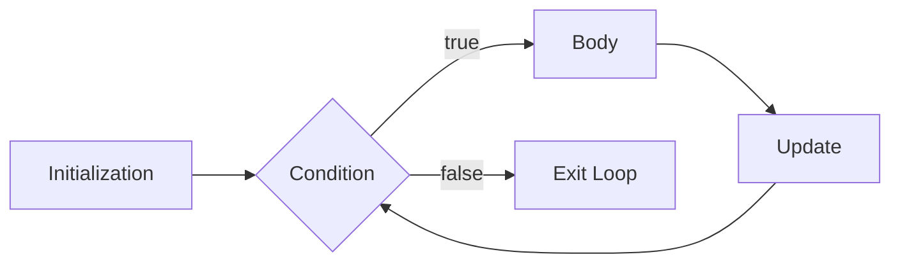

import { Aside, Badge, Card, CardGrid, Code } from '@astrojs/starlight/components';

## 🔄 Iterative Statements Overview

Java provides four loop constructs for repeated execution:

| Loop Type | Best For | Condition Check | Minimum Executions |
|-----------|----------|----------------|-------------------|
| `for` | Known iterations | Before body | 0 |
| `for-each` | Arrays/Collections traversal | Before body | 0 |
| `while` | Unknown iterations, sentinel values | Before body | 0 |
| `do-while` | Must run at least once | After body | 1 |

---

## for Loop

> The most commonly used loop — ideal when the **number of iterations is known in advance**.

### 🔑 Syntax & Execution Flow

```java
for (initialization; condition; update) {
    // body
}
```



<Code lang="java" title="Basic for loop" code={`
for (int i = 0; i < 5; i++) {
  System.out.println(i);  // 0 1 2 3 4
}
`} />

### 🔬 The Three Sections — Deep Dive

#### 1. Initialization Section

- Executed **exactly once** at loop start
- Declare and initialize loop variables
- **Multiple variables allowed, but must be same type**

<Code lang="java" title="✅ Valid initialization patterns" code={`// Multiple same-type variables
for (int i = 0, j = 10; i < j; i++, j--) { }

// Any valid Java statement allowed (even println!)
for (System.out.println("Starting..."); i < 3; i++) {
    System.out.println("Loop body");
}
//Starting...
//Loop body
//Loop body
//exectution end

// Pre-declared variable
int i = 0;
for (; i < 5; i++) { }  // initialization optional`} />

<Code lang="java" title="❌ Invalid initialization" code={`// Different types in same declaration
for (int i = 0, boolean b = true; i < 5; i++) { }  // ❌ C.E

// Redeclaring type keyword
for (int i = 0, int j = 0; i < 5; i++) { }  // ❌ C.E: not a statement`} />

#### 2. Condition Section

- Must evaluate to **`boolean`** (We can take any java expression but should be of the type Boolean)
- **Optional** — if omitted, compiler treats as `true` (infinite loop)
- Checked **before each iteration**

<Code lang="java" title="Condition examples" code={`// Standard boolean expression
for (int i = 0; i < 10; i++) { }

// Omitted condition = infinite loop
for (int i = 0; ; i++) {  // condition defaults to true
    if (i >= 10) break;   // manual exit required
}

// Method call returning boolean
for (int i = 0; hasMoreData(i); i++) { }`} />

<Code lang="java" title="❌ Non-boolean condition" code={`for (int i = 0; 1; i++) { }  // ❌ C.E: incompatible types: int != boolean
// Java does NOT treat non-zero as true (unlike C/C++)`} />

#### 3. Update Section
- Executed **after each iteration** (after body)
- **Any valid Java statement** allowed (even `System.out.println`)
- Multiple updates allowed with comma operator

<Code lang="java" title="Update section flexibility" code={`// Standard increment
for (int i = 0; i < 5; i++) { }

// Multiple updates
for (int i = 0, j = 10; i < j; i++, j--) { }

// Update with side effect (println)
for (int i = 0; i < 3; System.out.println("Update: " + i++)) {
    System.out.println("Body: " + i);
}
// Output:
// Body: 0
// Update: 0
// Body: 1
// Update: 1
// Body: 2
// Update: 2`} />

### 🧱 Braces & Body Rules

<Code lang="java" title="Braces are optional for single non-declarative statement" code={`// ✅ Valid: single statement, no braces
for (int i = 0; i < 3; i++)
    System.out.println(i);

// ❌ Invalid: declarative statement without braces
for (int i = 0; i < 3; i++)
    int x = 10;  // ❌ C.E: '.class' expected

// ✅ Fix: use braces for declarations
for (int i = 0; i < 3; i++) {
    int x = 10;  // x scoped to loop body
}`} />

<Aside type="caution">
**Best Practice**: **Always use braces**, even for single statements. Prevents bugs when adding lines later and improves readability.
</Aside>

---

## ⚠️ for Loop — Unreachable Code Detection

Java compiler performs **flow analysis** — code that can never execute is a **compile-time error**.

<CardGrid>
  <Card title="Case 1: Condition always true → infinite loop" icon="error">
```java    for (int i = 0; true; i++) {
        System.out.println("hello");
    }
    System.out.println("hi");  // ❌ C.E: unreachable statement
    // Compiler knows loop never exits → "hi" unreachable
```
  </Card>
  
  <Card title="Case 2: Condition always false → body never runs" icon="error">
```java
    for (int i = 0; false; i++) {  // ❌ C.E: unreachable statement
        System.out.println("hello");  // loop body unreachable
    }
    System.out.println("hi");
    // Compiler detects condition is constant false → entire loop unreachable
```
  </Card>

  <Card title="Case 3: Omitted condition = infinite loop" icon="error">
```java
    for (int i = 0; ; i++) {  // condition defaults to true
        System.out.println("hello");
    }
    System.out.println("hi");  // ❌ C.E: unreachable statement
```
  </Card>

  <Card title="Case 4: Non-final variables → runtime uncertainty" icon="approve-check">
```java
    int a = 10, b = 20;  // NOT final → compiler can't evaluate at compile time
    for (int i = 0; a < b; i++) {
        System.out.println("hello");  // May be infinite at runtime
    }
    System.out.println("hi");  // ✅ Compiles — compiler defers to runtime
    // Output: "hello" infinite times, "hi" never reached (runtime behavior)
```
  </Card>

  <Card title="Case 5: final variables → compile-time constant folding" icon="error">
```java
    final int a = 10, b = 20;  // final → compiler substitutes values
    for (int i = 0; a < b; i++) {  // becomes: for(...; 10 < 20; ...) → true
        System.out.println("hello");
    }
    System.out.println("hi");  // ❌ C.E: unreachable statement
    // Compiler evaluates 10 < 20 = true at compile time → infinite loop detected
```
  </Card>
</CardGrid>
<Aside type="tip">
**Compiler Rule Summary**:
1. ✅ If condition involves **only constants/finals** → compiler evaluates at compile time
2. ✅ If condition involves **any non-final variable** → compiler defers to runtime (no unreachable error)
3. ✅ `true`/`false` literals always trigger unreachable code analysis
4. ✅ Omitted condition = `true` → treated as infinite loop
</Aside>

---

## 🔄 for Loop Variations & Traps

<CardGrid>
  <Card title="Variation 1: Multiple variables" icon="rocket">
```java
    // Same type only in declaration
    for (int i = 0, j = 10; i < j; i++, j--) {
        System.out.println(i + " " + j);
    }
    // Output: 0 10, 1 9, 2 8, 3 7, 4 6
```
  </Card>
  
  <Card title="Variation 2: Infinite loop pattern" icon="shield">
```java
    // Classic infinite loop with break
    for (;;) {
        if (shouldExit()) break;
        process();
    }
    // Equivalent to: while (true) { ... }
```
  </Card>

  <Card title="Trap 1: Modifying loop variable inside body" icon="error">
```java
    for (int i = 0; i < 5; i++) {
        System.out.println(i);  // prints: 0, 2, 4
        i++;  // ⚠️ Extra increment — skips every other value!
    }
    // Flow: i=0 → print 0 → i++(body)→1 → i++(update)→2 → check 2<5 → ...
```
    **Fix**: Avoid modifying loop variable inside body unless intentional.
  </Card>

  <Card title="Trap 2: Loop variable scope" icon="error">
```java
    for (int i = 0; i < 5; i++) { }
    System.out.println(i);  // ❌ C.E: cannot find symbol: variable i
    // i declared in for-init → scoped to loop only```
    **Fix**: Declare outside if needed after loop:
```java
    int i;
    for (i = 0; i < 5; i++) { }
    System.out.println(i);  // ✅ 5
```
  </Card>

  <Card title="Trap 3: Empty body semicolon" icon="caution">
```java
    // Semicolon = empty statement as loop body
    for (int i = 0; i < 5; i++);  // ← semicolon ends loop!
    System.out.println("Done");   // Runs once after loop
    // Common bug: accidental semicolon after for()
```
    **Fix**: Remove semicolon or add braces:
```java
    for (int i = 0; i < 5; i++) {
        System.out.println(i);  // ✅ intended body
    }
```
  </Card>
</CardGrid>

---

## 4️⃣ for-each Loop (Enhanced for Loop) — Java 5+

> Simplified syntax for **traversing arrays and Collections** — no index management needed.

### 🔑 Syntax

```java
// For arrays
for (ElementType element : array) {
    // use element
}

// For Collections
for (ElementType element : collection) {
    // use element
}
```

<Code lang="java" title="for-each examples" code={`// Array traversal
int[] arr = {10, 20, 30, 40};
for (int num : arr) {
    System.out.println(num);  // 10 20 30 40
}
// Collection traversal
List<String> names = List.of("Alice", "Bob", "Charlie");
for (String name : names) {
    System.out.println(name);
}

// Works with any Iterable (including custom implementations)
for (MyObject obj : myIterableCollection) {
    obj.process();
}`} />

### ⚠️ Limitations of for-each

<CardGrid>
  <Card title="Cannot access index" icon="error">
```java
    int[] arr = {10, 20, 30};
    for (int num : arr) {
        // ❌ No way to get current index
        // System.out.println("Index: " + ???);
    }
    // ✅ Fix: Use traditional for loop if index needed
    for (int i = 0; i < arr.length; i++) {
        System.out.println("arr[" + i + "] = " + arr[i]);
    }
```
  </Card>
  
  <Card title="Cannot modify primitive array elements" icon="error">
```java
    int[] arr = {1, 2, 3};
    for (int x : arr) {
        x = 99;  // ❌ Modifies loop variable copy, NOT original array!
    }
    System.out.println(Arrays.toString(arr));  // [1, 2, 3] — unchanged!
    
    // ✅ Fix: Use index-based loop for modification
    for (int i = 0; i < arr.length; i++) {
        arr[i] = 99;  // ✅ Modifies actual array element
    }
```
  </Card>

  <Card title="Cannot traverse in reverse" icon="error">
```java
    int[] arr = {10, 20, 30};
    // for-each always goes forward: arr[0] → arr[1] → arr[2]
    for (int num : arr) { }
        // ✅ Fix: Traditional for loop for reverse
    for (int i = arr.length - 1; i >= 0; i--) {
        System.out.println(arr[i]);  // 30 20 10
    }
```
  </Card>

  <Card title="Cannot remove from Collection during iteration" icon="error">
```java
    List<String> list = new ArrayList<>(List.of("A", "B", "C"));
    for (String s : list) {
        if (s.equals("B")) {
            list.remove(s);  // ❌ ConcurrentModificationException!
        }
    }
    
    // ✅ Fix: Use Iterator with remove()
    Iterator<String> it = list.iterator();
    while (it.hasNext()) {
        if (it.next().equals("B")) {
            it.remove();  // ✅ Safe removal
        }
    }
```
  </Card>
</CardGrid>

### 🎯 When to Use for-each

✅ **Use for-each when**:
- Reading/traversing all elements sequentially
- Index not needed
- No modification of collection structure needed
- Code clarity is priority

❌ **Use traditional for when**:
- Index access needed
- Reverse traversal needed
- Modifying array elements (primitives)
- Removing items from Collection during iteration
- Skipping elements (step > 1)

---

## 5️⃣ while Loop

> Use when **number of iterations is NOT known in advance** — condition checked **before** each iteration.

### 🔑 Syntax & Rules
```java
while (condition) {  // condition must be boolean
    // body
}
```

<Code lang="java" title="Basic while loop" code={`int i = 0;
while (i < 5) {
    System.out.println(i);  // 0 1 2 3 4
    i++;  // ⚠️ Must update condition variable to avoid infinite loop
}`} />

### ⚠️ while Loop — Key Rules

1. **Condition must be `boolean`** — non-boolean → compile error
2. **Braces optional** for single non-declarative statement
3. **Unreachable code detection** same as `for` loop (compile-time analysis)

<Code lang="java" title="❌ Non-boolean condition" code={`while (1) {  // ❌ C.E: incompatible types: int != boolean
    System.out.println("hello");
}
// Java requires explicit boolean — no implicit int→boolean conversion`} />

<Code lang="java" title="Braces rules" code={`// ✅ Valid: single statement, no braces
while (true)
    System.out.println("hello");  // infinite loop

// ❌ Invalid: declarative statement without braces
while (true)
    int x = 10;  // ❌ C.E: '.class' expected

// ✅ Fix: use braces for declarations
while (true) {
    int x = 10;  // x scoped to loop body
}`} />

### 🔬 Unreachable Code in while — Same Rules as for

<CardGrid>
  <Card title="Condition always true → infinite loop" icon="error">
```java
    while (true) {
        System.out.println("hello");
    }
    System.out.println("hi");  // ❌ C.E: unreachable statement
```
  </Card>
  
  <Card title="Condition always false → loop unreachable" icon="error">
```java    while (false) {  // ❌ C.E: unreachable statement (entire loop)
        System.out.println("hello");
    }
    System.out.println("hi");
```
  </Card>

  <Card title="final variables → compile-time evaluation" icon="error">
```java
    final int a = 10, b = 20;
    while (a < b) {  // Compiler: 10 < 20 = true → infinite
        System.out.println("hello");
    }
    System.out.println("hi");  // ❌ C.E: unreachable
```
  </Card>

  <Card title="Non-final variables → runtime uncertainty" icon="approve-check">
```java
    int a = 10, b = 20;  // Not final → compiler can't evaluate
    while (a < b) {
        System.out.println("hello");  // May be infinite at runtime
        // a or b could change inside loop (compiler doesn't analyze deeply)
    }
    System.out.println("hi");  // ✅ Compiles
```
  </Card>
</CardGrid>

### 🎯 Classic while Use Cases

<Code lang="java" title="Reading input until sentinel value" code={`Scanner sc = new Scanner(System.in);
while (sc.hasNextInt()) {  // Unknown iterations — depends on user input
    int n = sc.nextInt();
    process(n);
}
// Loop exits when non-integer entered or EOF`} />

<Code lang="java" title="Processing until condition fails" code={`Node current = head;
while (current != null) {  // Traverse linked list — length unknown
    System.out.println(current.data);
    current = current.next;
}`} />

---

## 6️⃣ do-while Loop

> **Executes body at least once** — condition checked **after** each iteration.
### 🔑 Syntax & Key Difference

```java
do {
    // body — runs FIRST
} while (condition);  // condition checked AFTER body
```

<Code lang="java" title="do-while guarantees one execution" code={`int i = 10;
do {
    System.out.println(i);  // Prints 10! (even though condition false)
    i++;
} while (i < 5);  // Condition false, but body already ran once ✅

// Output: 10
// while loop equivalent would print nothing (condition checked first)
`} />

### 🔄 while vs do-while Comparison

<table>
  <thead>
    <tr>
      <th>Feature</th>
      <th>while</th>
      <th>do-while</th>
    </tr>
  </thead>
  <tbody>
    <tr><td>Condition check</td><td>Before body (pre-test)</td><td>After body (post-test)</td></tr>
    <tr><td>Minimum executions</td><td>0 (may never run)</td><td>1 (always runs once)</td></tr>
    <tr><td>Syntax</td><td><code>while (cond) { }</code></td><td><code>do { } while (cond);</code></td></tr>
    <tr><td>Semicolon required</td><td>❌ No</td><td>✅ Yes (after while)</td></tr>
    <tr><td>Best for</td><td>Unknown iterations, may skip</td><td>Must run at least once (e.g., menu)</td></tr>
  </tbody>
</table>

### ⚠️ do-while Rules & Traps

<CardGrid>
  <Card title="Braces optional for single non-declarative statement" icon="approve-check">
```java
    // ✅ Valid
    do
        System.out.println("hello");
    while (true);  // ← semicolon required!
    
    // ❌ Invalid: declarative without braces
    do
        int x = 10;  // ❌ C.E    while (true);
    
    // ✅ Fix: use braces
    do {
        int x = 10;
    } while (true);
```
  </Card>
  
  <Card title="Semicolon after while is mandatory" icon="error">
```java
    do {
        System.out.println("hello");
    } while (true)  // ❌ C.E: ';' expected
    // ← Missing semicolon after while condition!
```
  </Card>

  <Card title="Unreachable code detection applies" icon="error">
```java
    do {
        System.out.println("hello");
    } while (true);  // Infinite loop
    System.out.println("hi");  // ❌ C.E: unreachable statement
    
    // But with false condition:
    do {
        System.out.println("hello");  // ✅ Runs once
    } while (false);
    System.out.println("hi");  // ✅ Runs after loop
    // Output: hello\nhi
```
  </Card>

  <Card title="final variables trigger compile-time analysis" icon="caution">
```java
    final int a = 10, b = 20;
    do {
        System.out.println("hello");
    } while (a < b);  // Compiler: 10 < 20 = true → infinite
    System.out.println("hi");  // ❌ C.E: unreachable
    
    // But if condition false at compile time:
    final int x = 10, y = 5;
    do {
        System.out.println("hello");  // ✅ Runs once
    } while (x < y);  // 10 < 5 = false → loop exits after one iteration
    System.out.println("hi");  // ✅ Compiles and runs
    // Output: hello\nhi
```  </Card>
</CardGrid>

### 🎯 Classic do-while Use Case: Menu Systems

<Code lang="java" title="Menu that shows at least once" code={`Scanner sc = new Scanner(System.in);
int choice;
do {
    System.out.println("1. Start  2. Settings  3. Exit");
    System.out.print("Choose: ");
    choice = sc.nextInt();
    
    switch (choice) {
        case 1: startGame(); break;
        case 2: showSettings(); break;
        case 3: System.out.println("Goodbye!"); break;
        default: System.out.println("Invalid choice");
    }
} while (choice != 3);  // Repeat until user chooses Exit
// ✅ Menu displays at least once, even if choice is invalid initially
`} />

---

## 🔁 Iterator vs Iterable — Java 1.5+

### 🔑 Core Concepts

<CardGrid>
  <Card title="Iterable Interface" icon="information">
```java
    // Package: java.lang.Iterable (since Java 1.5)
    public interface Iterable<T> {
        Iterator<T> iterator();  // Only method
    }
    
    // An object is "iterable" iff its class implements Iterable
    // Required target type for for-each loop:
    for (Element e : iterableObject) { }  // iterableObject must be Iterable
    
    // Built-in iterables:
    // • All array types (int[], String[], etc.)
    // • Collection interface (List, Set, Queue)
    // • Custom classes implementing Iterable
```
  </Card>
  
  <Card title="Iterator Interface" icon="backspace">
```java
    // Package: java.util.Iterator (since Java 1.2)    public interface Iterator<T> {
        boolean hasNext();      // Are more elements?
        T next();               // Get next element
        default void remove();  // Remove last returned (optional)
    }
    
    // Used to traverse collections manually:
    Iterator<String> it = list.iterator();
    while (it.hasNext()) {
        String s = it.next();
        if (s.equals("removeMe")) it.remove();  // ✅ Safe removal
    }
```
  </Card>
</CardGrid>

### 🆚 Comparison Table

| Feature | `Iterable` | `Iterator` |
|---------|-----------|------------|
| **Package** | `java.lang` | `java.util` |
| **Since** | Java 1.5 | Java 1.2 |
| **Purpose** | Marks object as traversable via for-each | Provides methods to traverse manually |
| **Key Method** | `iterator()` → returns Iterator | `hasNext()`, `next()`, `remove()` |
| **Used With** | for-each loop syntax | Manual iteration, removal during traversal |
| **State** | Stateless (factory for Iterator) | Stateful (tracks current position) |
| **Reusability** | Can call `iterator()` multiple times | Single-use — exhausted after traversal |

### 💻 Practical Usage Comparison

<Code lang="java" title="for-each (uses Iterable internally)" code={`List<String> names = List.of("Alice", "Bob", "Charlie");

// for-each syntax — clean, readable
for (String name : names) {
    System.out.println(name);
}
// Compiler translates to:
// for (Iterator<String> it = names.iterator(); it.hasNext(); ) {
//     String name = it.next();
//     System.out.println(name);
// }`} />

<Code lang="java" title="Manual Iterator — when you need control" code={`List<String> names = new ArrayList<>(List.of("Alice", "Bob", "Charlie"));

// Need to remove during iteration? Use Iterator:
Iterator<String> it = names.iterator();
while (it.hasNext()) {
    String name = it.next();
    if (name.equals("Bob")) {
        it.remove();  // ✅ Safe — won't throw ConcurrentModificationException
    }
}
System.out.println(names);  // [Alice, Charlie]

// ❌ for-each cannot safely remove:
// for (String name : names) {
//     if (name.equals("Bob")) names.remove(name);  // 💥 ConcurrentModificationException!
// }`} />

### 🎯 When to Use Which

✅ **Use for-each (Iterable) when**:
- Simple traversal, read-only access
- Code clarity is priority
- No structural modification needed

✅ **Use Iterator when**:
- Need to remove elements during traversal
- Need to traverse partially and resume later
- Need access to `hasNext()`/`next()` control flow
- Working with legacy code pre-Java-5

---

## 🎯 Interview Cheat Sheet

<CardGrid>
  <Card title="Q: Can for loop condition be int?" icon="error">
    **NO ❌** — must be `boolean`.  
    `for (int i=0; 1; i++)` → Compile Error: "incompatible types: int != boolean".  
    Java requires explicit boolean — prevents C-style truthy/falsy bugs.
  </Card>
  
  <Card title="Q: Why does `for(;;)` compile?" icon="information">
    All three sections are **optional**. Omitted condition defaults to `true` → infinite loop.  
    Equivalent to `while (true)`. Common pattern with `break` for exit condition.
  </Card>

  <Card title="Q: Can for-each modify array elements?" icon="error">
    **For primitives: NO ❌** — loop variable is a copy.  
    ```java
    int[] arr = {1,2,3};
    for (int x : arr) { x = 99; }  // arr unchanged!
    ```
    **For object references: YES for object state, NO for reassignment**:
    ```java
    List<String> list = new ArrayList<>(Arrays.asList("a", "b"));
    for (String s : list) {
        s = "x";        // ❌ Reassigns local copy — list unchanged
        // s.toUpperCase(); // ✅ Can call methods on referenced object
    }
    ```
  </Card>

  <Card title="Q: while vs do-while difference?" icon="approve-check">
    - `while`: **pre-test** — condition checked first, may never run  
    - `do-while`: **post-test** — body runs first, condition checked after, **always runs at least once**  
    ✅ Use `do-while` for menus, input validation that must prompt at least once.
  </Card>

  <Card title="Q: Why does `while(false) { }` cause unreachable code error?" icon="caution">
    Compiler performs **constant folding**: `false` is known at compile time → loop body never executes → body is unreachable → compile error.  
    ✅ If condition involves non-final variables, compiler defers to runtime → no error.
  </Card>

  <Card title="Q: Iterable vs Iterator — when to use which?" icon="rocket">
    - `Iterable`: Use with **for-each** for clean, read-only traversal  
    - `Iterator`: Use when you need **`remove()` during iteration** or manual control  
    ✅ for-each is syntactic sugar over Iterator — compiler generates Iterator code.
  </Card>

  <Card title="Q: What is the scope of for loop variable?" icon="information">
    Variable declared in for-init (`for (int i=0; ...)`) is **scoped to the loop only**.  
    ```java
    for (int i = 0; i < 5; i++) { }
    System.out.println(i);  // ❌ C.E: cannot find symbol
    ```
    ✅ Declare outside loop if needed after: `int i; for (i=0; ...)`
  </Card>
</CardGrid>

---

## 🔑 Quick Reference Summary

### Loop Syntax Rules
| Loop | Condition Type | Braces Optional? | Semicolon Required? | Min Executions |
|------|---------------|-----------------|---------------------|---------------|
| `for` | `boolean` | ✅ Single non-declarative stmt | ❌ | 0 |
| `for-each` | N/A (implicit) | ✅ Single non-declarative stmt | ❌ | 0 |
| `while` | `boolean` | ✅ Single non-declarative stmt | ❌ | 0 |
| `do-while` | `boolean` | ✅ Single non-declarative stmt | ✅ After `while(cond)` | 1 |

### Unreachable Code Detection
| Scenario | Compiler Behavior |
|----------|------------------|
| Condition = `true` literal | ❌ Error: code after loop unreachable |
| Condition = `false` literal | ❌ Error: loop body unreachable |
| Condition = `final` vars → constant | ❌ Error if compiler can evaluate to constant |
| Condition = non-`final` vars | ✅ Compiles — defers to runtime |
| Omitted condition (`for(;;)`) | ❌ Error: treated as `true` → infinite |

### for-each Limitations
| Limitation | Workaround |
|------------|------------|
| No index access | Use traditional `for (int i=0; ...)` |
| Cannot modify primitive array | Use index-based loop |
| Cannot remove from Collection | Use `Iterator.remove()` |
| Cannot traverse reverse | Use traditional for with `i--` |

<Aside type="caution">
**Final Checklist**:
1. ✅ Loop conditions must be **explicit `boolean`** — no implicit conversions
2. ✅ Use **braces always** — prevents subtle bugs when modifying code later
3. ✅ Compiler detects **unreachable code** via constant folding — be aware of `final` variables
4. ✅ `for-each` is for **read-only traversal** — use Iterator for removal, traditional for for index/modification
5. ✅ `do-while` guarantees **at least one execution** — ideal for menus/input validation
6. ✅ `Iterable` enables for-each; `Iterator` enables manual traversal with `remove()`
7. ✅ Loop variable declared in for-init is **scoped to loop only** — declare outside if needed after
</Aside>

---

## 🧪 Test Your Understanding

<Code lang="java" title="Predict the output" code={`public class LoopsQuiz {
    public static void main(String[] args) {
        // Q1: for loop with omitted condition
        // for (int i = 0; ; i++) {
        //     if (i >= 3) break;
        //     System.out.print(i);
        // }
        // Output: ?
        
        // Q2: for-each modification trap
        int[] arr = {1, 2, 3};
        for (int x : arr) {
            x = 99;
        }
        System.out.println(arr[0]);  // ?
        
        // Q3: while with final variables
        final int a = 5;
        while (a < 10) {
            System.out.print("X");
            // a++;  // ❌ C.E: cannot assign to final variable
        }
        System.out.println("Y");  // ? (compile or runtime?)
        
        // Q4: do-while with false condition
        int count = 0;
        do {
            count++;
        } while (false);
        System.out.println(count);  // ?
        
        // Q5: Iterator removal
        List<String> list = new ArrayList<>(Arrays.asList("A", "B", "C"));
        Iterator<String> it = list.iterator();
        while (it.hasNext()) {
            String s = it.next();
            if (s.equals("B")) it.remove();
        }
        System.out.println(list);  // ?
    }
}

/* Expected Output:
// Q1: 012  ← breaks when i=3
1       ← Q2: for-each doesn't modify original array
// Q3: ❌ Compile Error: unreachable statement (a<10 = 5<10 = true → infinite)
1       ← Q4: do-while runs body once even if condition false
[A, C]  ← Q5: Iterator.remove() safely removes "B"
*/`} />

<Aside type="tip">
**Pro Interview Strategy** for loop questions:
1. Clarify **condition type requirements** (boolean only)
2. Explain **scope rules** for loop variables
3. Distinguish **compile-time vs runtime** for unreachable code detection
4. Highlight **for-each limitations** and when to use traditional for/Iterator
5. Contrast **while vs do-while** execution order
6. Mention **Iterator.remove()** as safe removal pattern during traversal

This demonstrates both language specification knowledge and practical coding wisdom! 🎯
</Aside>