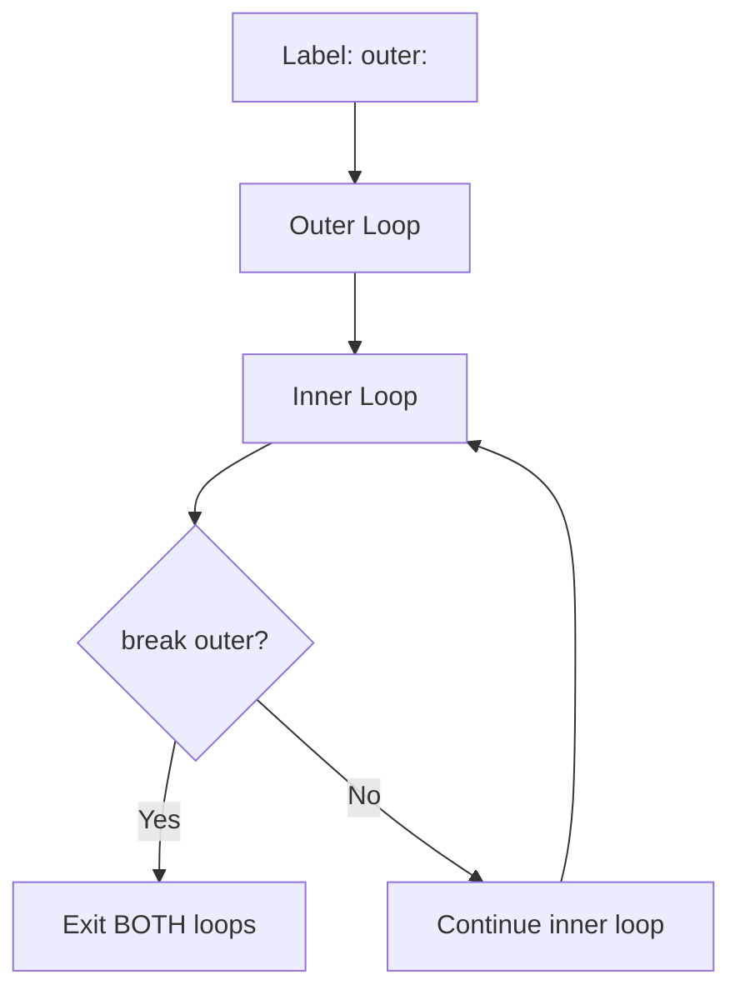
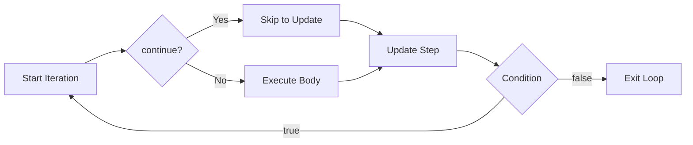

import { Aside, Badge, Card, CardGrid, Code } from '@astrojs/starlight/components';

## 🎯 Jump Statements Overview

Java provides three jump statements to alter normal program flow:

| Statement | Purpose | Valid Locations |
|-----------|---------|----------------|
| `break` | Exit nearest enclosing `switch` or loop | `switch`, `for`, `while`, `do-while`, labeled blocks |
| `continue` | Skip current iteration, proceed to next | `for`, `while`, `do-while`, labeled loops |
| `return` | Exit method immediately, optionally return value | Anywhere inside a method |

<Aside type="caution">
**Compile-Time Rule**: Using `break` or `continue` outside their valid locations → **Compile Error**: `"break/continue outside switch or loop"`.
</Aside>

---

## 7️⃣ break Statement

> **Exits the nearest enclosing `switch` or loop immediately**, transferring control to the statement following it.

### 🔑 Valid Use Cases

<CardGrid>
  <Card title="Case 1: Inside switch — Stop Fall-Through" icon="approve-check">
```java
    int x = 0;
    switch (x) {
        case 0:
            System.out.println("hello");  // ✅ Prints
            break;                         // ✅ Exits switch — prevents fall-through
        case 1:
            System.out.println("hi");      // ❌ Skipped due to break
    }
    // Output: hello
```
    **Why**: Without `break`, execution would "fall through" to subsequent cases.  
  </Card>
  
  <Card title="Case 2: Inside Loop — Exit Based on Condition" icon="rocket">
```java
    for (int i = 0; i < 10; i++) {
        if (i == 5) break;      // ✅ Exit loop when i == 5
        System.out.println(i);
    }
    // Output: 0 1 2 3 4
    // Loop terminates immediately at i=5 — body for i=5 never executes
```
    **Flow**: Condition check → body → if `break` hit → exit loop → continue after loop.
  </Card>

  <Card title="Case 3: Labeled break — Exit OUTER Loop" icon="shield">
```java
    outer:  // ← Label definition (any valid identifier + colon)
    for (int i = 0; i < 3; i++) {
        for (int j = 0; j < 3; j++) {
            if (j == 1) break outer;  // ✅ Breaks OUTER loop labeled "outer"
            System.out.println(i + "," + j);
        }
    }
    // Output: only 0,0
    // When j==1 at i=0: breaks outer loop entirely — no more iterations
```
    **Syntax**: `break labelName;` where `labelName:` precedes the target loop/switch.
  </Card>
</CardGrid>

### ⚠️ Invalid Usage — Compile Error

<Code lang="java" title="❌ break outside switch/loop" code={`class Test {
    public static void main(String args[]) {
        int x = 10;
        if (x == 10)
            break;  // ❌ C.E: break outside switch or loop
        System.out.println("hello");
    }
}
// Error: Test.java:5: break outside switch or loop`} />

<Aside type="note">
**Valid Locations Only**: `break` works **only** inside:
1. `switch` statements
2. Loop constructs (`for`, `while`, `do-while`)
3. Labeled blocks (rare, advanced use)

Using it in `if`, `else`, or plain blocks → compile error.
</Aside>
---

## 🔁 Labeled break — Deep Dive

### 🧠 How Labels Work



<Code lang="java" title="Labeled break syntax rules" code={`// ✅ Valid: label before loop
search:
for (int i = 0; i < rows; i++) {
    for (int j = 0; j < cols; j++) {
        if (matrix[i][j] == target) {
            break search;  // Exit both loops at once
        }
    }
}

// ✅ Label can be on any block (advanced)
myBlock: {
    if (condition) break myBlock;  // Exit block early
    // ... more code ...
}
// Execution continues here after break

// ❌ Invalid: label on statement, not block/loop
// wrong: System.out.println("hi");  // ❌ C.E: not a statement
`} />

### 🎯 Practical Use Case: Matrix Search

<Code lang="java" title="Exit nested loops cleanly with labeled break" code={`boolean findValue(int[][] matrix, int target) {
    search:  // Label the outer loop
    for (int i = 0; i < matrix.length; i++) {
        for (int j = 0; j < matrix[i].length; j++) {
            if (matrix[i][j] == target) {
                break search;  // Found! Exit both loops immediately
            }
        }
    }
    return found;  // Handle result after loops}
// ✅ Cleaner than using boolean flags or return inside nested loops
`} />

<Aside type="tip">
**Best Practice**: Use labeled `break` sparingly — it can reduce readability. Prefer:
- Extracting nested logic to a separate method with `return`
- Using boolean flags for simple cases
- Only use labels when exiting multiple nested levels is truly needed
</Aside>

---

## 8️⃣ continue Statement

> **Skips the current iteration** of the nearest enclosing loop and proceeds to the next iteration.

### 🔑 Basic Usage

<Code lang="java" title="Skip iteration based on condition" code={`for (int i = 0; i < 5; i++) {
    if (i == 3) continue;   // ✅ Skip when i == 3
    System.out.println(i);
}
// Output: 0 1 2 4
// i=3 iteration: continue skips rest of body → update → next condition check
`} />

### 🔄 Execution Flow with continue



### 🔁 Labeled continue — Skip to OUTER Loop Iteration

<Code lang="java" title="Labeled continue skips to labeled loop's next iteration" code={`outer:
for (int i = 0; i < 3; i++) {
    for (int j = 0; j < 3; j++) {
        if (j == 1) continue outer;  // ✅ Skip to next i iteration!
        System.out.println(i + "," + j);
    }
}// Output:
// 0,0
// 1,0
// 2,0
// Explanation: When j==1, continue outer → skip rest of inner loop → i increments → next outer iteration
`} />

### ⚠️ Invalid Usage — Same as break

<Code lang="java" title="❌ continue outside loop" code={`if (x > 0) {
    continue;  // ❌ C.E: continue outside loop
}
// continue only valid inside: for, while, do-while, or labeled loops
`} />

---

## 🆚 break vs continue — Quick Comparison

<table>
  <thead>
    <tr>
      <th>Feature</th>
      <th><code>break</code></th>
      <th><code>continue</code></th>
    </tr>
  </thead>
  <tbody>
    <tr><td>Action</td><td>Exit loop/switch entirely</td><td>Skip current iteration only</td></tr>
    <tr><td>Next execution</td><td>Statement after loop/switch</td><td>Loop update → condition check → next iteration</td></tr>
    <tr><td>Valid in switch</td><td>✅ Yes (stop fall-through)</td><td>❌ No (compile error)</td></tr>
    <tr><td>Valid in loops</td><td>✅ Yes</td><td>✅ Yes</td></tr>
    <tr><td>Labeled form</td><td><code>break label;</code> → exit labeled block</td><td><code>continue label;</code> → skip to labeled loop's next iteration</td></tr>
    <tr><td>Common use</td><td>Early exit on success/failure</td><td>Skip invalid/processed items</td></tr>
  </tbody>
</table>

---

## 9️⃣ return Statement

> **Exits the current method immediately**, optionally returning a value to the caller.

### 🔑 Syntax Patterns

<Code lang="java" title="return with value (non-void method)" code={`int max(int a, int b) {
    if (a > b) return a;  // ✅ Exit method, return a
    return b;             // ✅ Exit method, return b
    // Code here would be unreachable → compile error
}`} />
<Code lang="java" title="return without value (void method)" code={`void process(int x) {
    if (x < 0) return;    // ✅ Early exit — guard clause pattern
    // Continue processing only if x >= 0
    System.out.println("Processing: " + x);
}`} />

### 🛡️ Guard Clause Pattern — Early return for Validation

<Code lang="java" title="Prefer early returns over nested if" code={`// ❌ Nested if (harder to read)
void process(User user) {
    if (user != null) {
        if (user.isActive()) {
            if (user.hasPermission()) {
                // Actual logic here...
            }
        }
    }
}

// ✅ Guard clauses with early return (cleaner)
void process(User user) {
    if (user == null) return;           // Guard 1
    if (!user.isActive()) return;       // Guard 2
    if (!user.hasPermission()) return;  // Guard 3
    
    // Actual logic — no nesting!
    performAction(user);
}`} />

<Aside type="tip">
**Guard Clause Benefits**:
1. ✅ Reduces nesting → improves readability
2. ✅ Each validation is independent and clear
3. ✅ Easy to add/remove validations
4. ✅ Fail-fast: invalid inputs exit early, no wasted computation
</Aside>

---

## ⚠️ The Dangerous Combination: do-while + continue

> This pattern is notoriously tricky — `continue` in `do-while` skips to the **while condition**, not the loop start.

### 🔬 Step-by-Step Execution Trace

<Code lang="java" title="Complex do-while + continue example" code={`int x = 0;
do {
    ++x;                          // Step 1: x becomes 1
    System.out.println(x);        // Step 2: Print 1    if (++x < 5) continue;        // Step 3: x becomes 2; 2<5=true → continue
    ++x;                          // ❌ SKIPPED due to continue!
    System.out.println(x);        // ❌ SKIPPED due to continue!
} while (++x < 10);               // Step 4: x becomes 3; 3<10=true → next iteration
// Output so far: 1

// Iteration 2:
// ++x → x=4; print 4; ++x→5; 5<5=false → don't continue
// ++x→6; print 6; while(++x→7; 7<10=true) → next iteration
// Output: 1, 4, 6

// Iteration 3:
// ++x→8; print 8; ++x→9; 9<5=false → don't continue  
// ++x→10; print 10; while(++x→11; 11<10=false) → exit
// Final Output: 1, 4, 6, 8, 10`} />

```text
Full Output:
1
4
6
8
10
```

### 🧠 Why This Is Dangerous

<CardGrid>
  <Card title="Trap 1: continue skips to condition, not loop start" icon="error">
    In `do-while`, `continue` jumps directly to the `while (condition)` check — **not** to the top of the loop body.  
    This can skip critical initialization or update code unexpectedly.
  </Card>
  
  <Card title="Trap 2: Multiple increments + continue = hard to trace" icon="error">
    When loop variable is modified in multiple places (`++x` in body, condition, and after `continue`), tracking its value becomes extremely difficult.  
    ✅ Prefer: single update location, clear loop structure.
  </Card>

  <Card title="✅ Safer Alternative: Use for loop with clear structure" icon="approve-check">
```java
    for (int x = 1; x < 10; x++) {
        System.out.println(x);
        if (x < 5) continue;  // Clear: skip to x++ update
        x++;  // Explicit second increment
        System.out.println(x);
    }
    // Same logic, but for-loop structure makes flow more predictable
```
  </Card>
</CardGrid>
<Aside type="danger">
**Rule of Thumb**: Avoid `continue` in `do-while` loops unless the flow is trivial.  
Prefer `if` guards with early `continue` in `for`/`while` loops, or refactor complex logic into helper methods.
</Aside>

---

## 🔍 Compiler Unreachable Code Detection — Loops vs if-else

> Java compiler performs **flow analysis** to detect unreachable code — but **only in loops**, not in `if-else` branches.

<CardGrid>
  <Card title="Case 1: Unreachable code in loop → Compile Error" icon="error">
```java
    while (true) {
        System.out.println("hello");
    }
    System.out.println("hi");  // ❌ C.E: unreachable statement
    // Compiler knows while(true) never exits → "hi" can never run
```
  </Card>
  
  <Card title="Case 2: Unreachable code in if-else → Compiles Fine" icon="approve-check">
```java
    if (true) {
        System.out.println("hello");  // ✅ Always runs
    } else {
        System.out.println("hi");     // ✅ Compiles (even though never runs)
    }
    // Compiler does NOT flag else branch as unreachable
    // Reason: if-else is a branching construct — both paths are syntactically valid
```
  </Card>

  <Card title="Why the Difference?" icon="information">
    **Loops**: Compiler analyzes termination — if condition is constant `true`/`false`, it can prove reachability.  
    **if-else**: Both branches are considered potentially reachable at compile time (even if condition is constant) — this allows:
    - Platform-specific code: `if (isWindows()) { ... } else { ... }`
    - Debug/release builds: `if (DEBUG) { ... }`
    - Future-proofing: condition may become variable later
  </Card>
</CardGrid>

<Code lang="java" title="Practical example: Platform-specific code" code={`// This pattern compiles even though one branch is "dead" at runtime:
if (System.getProperty("os.name").contains("Windows")) {
    useWindowsAPI();
} else {
    useUnixAPI();  // ✅ Compiles even on Windows — may be unreachable at runtime
}// Compiler doesn't flag else as unreachable → allows cross-platform code`} />

---

## 🎯 Interview Cheat Sheet

<CardGrid>
  <Card title="Q: Where can break be used?" icon="information">
    **Only inside**:
    1. `switch` statements (stop fall-through)
    2. Loop constructs (`for`, `while`, `do-while`)
    3. Labeled blocks (advanced)  
    ❌ Using `break` in `if`, plain blocks, or methods → Compile Error.
  </Card>
  
  <Card title="Q: What does labeled break do?" icon="rocket">
    `break labelName;` exits the **loop or block marked with `labelName:`**, even if nested deeply.  
    ✅ Useful for exiting multiple nested loops cleanly without flags or returns.
  </Card>

  <Card title="Q: continue in do-while — where does it jump?" icon="error">
    To the **`while (condition)` check** — not the top of the loop body.  
    This can skip critical code unexpectedly — use with extreme caution.
  </Card>

  <Card title="Q: Why doesn't compiler flag unreachable else branch?" icon="information">
    **Design choice**: `if-else` branches are considered potentially reachable to support:
    - Platform-specific code
    - Debug/release conditionals  
    - Future code changes  
    Loops, however, have deterministic flow — compiler can prove unreachability.
  </Card>

  <Card title="Q: return in void method — syntax?" icon="approve-check">
    Use `return;` with **no value** to exit early:
```java
    void validate(int x) {
        if (x < 0) return;  // ✅ Early exit
        // Process only valid x
    }
```
  </Card>

  <Card title="Q: Can continue be used in switch?" icon="error">
    **NO ❌** — `continue` is only valid in loops.  
    Using `continue` in `switch` → Compile Error: `"continue outside loop"`.
  </Card>
</CardGrid>

---
## 🧩 DSA & Practical Patterns

<CardGrid>
  <Card title="Pattern: Early Exit in Search Algorithms" icon="rocket">
```java
    boolean contains(int[] arr, int target) {
        for (int num : arr) {
            if (num == target) return true;  // ✅ Found — exit immediately
        }
        return false;  // Not found after full traversal
    }
    // ✅ break could also work, but return is cleaner for methods
```
  </Card>
  
  <Card title="Pattern: Skip Invalid Inputs with continue" icon="shield">
```java
    void processValidNumbers(List<Integer> nums) {
        for (int n : nums) {
            if (n <= 0) continue;      // Skip non-positive
            if (n > 1000) continue;    // Skip too large
            process(n);                // Only process valid numbers
        }
    }
    // ✅ Clear, readable filtering without nested if
```
  </Card>

  <Card title="Pattern: Guard Clauses for Input Validation" icon="backspace">
```java
    Response handleRequest(Request req) {
        if (req == null) return error("Null request");
        if (!req.isAuthenticated()) return error("Unauthorized");
        if (req.getPayload() == null) return error("Missing payload");
        
        // Core logic — all preconditions satisfied
        return process(req);
    }
    // ✅ Each guard handles one failure case — easy to test and maintain
```
  </Card>
</CardGrid>

<Aside type="tip">
**Performance Note**: Early `return`/`break` can improve performance by avoiding unnecessary work.  
✅ Profile before optimizing — but clean control flow often yields both readability and speed benefits.
</Aside>

---
## 🔑 Quick Reference Summary

### break Statement
| Context | Effect | Example |
|---------|--------|---------|
| `switch` | Exit switch, prevent fall-through | `case 1: doSomething(); break;` |
| Loop | Exit nearest loop immediately | `if (found) break;` |
| Labeled loop | Exit specific outer loop | `break outer;` |
| ❌ Invalid location | Compile Error | `if (x) break;` → error |

### continue Statement
| Context | Effect | Example |
|---------|--------|---------|
| Loop | Skip to next iteration | `if (invalid) continue;` |
| Labeled loop | Skip to next iteration of labeled loop | `continue outer;` |
| ❌ `switch` or outside loop | Compile Error | `case 1: continue;` → error |

### return Statement
| Method Type | Syntax | Purpose |
|-------------|--------|---------|
| Non-void | `return value;` | Exit method, send result to caller |
| void | `return;` | Exit method early (guard clause) |
| Any | `return;` at end | Optional — compiler adds implicitly |

### Compiler Reachability Rules
| Construct | Unreachable Code Detection | Reason |
|-----------|---------------------------|--------|
| `while(true) { }` after | ✅ Compile Error | Loop never exits — provable |
| `if (true) { } else { }` else branch | ❌ Compiles | Branching construct — both paths syntactically valid |
| `for(;;) { }` after | ✅ Compile Error | Infinite loop — provable |
| `if (finalConst) { } else { }` else | ❌ Compiles | Design choice: support platform-specific code |

<Aside type="caution">
**Final Checklist**:
1. ✅ `break`/`continue` only valid in `switch`/loops — compile error elsewhere
2. ✅ Labeled forms require `labelName:` before target loop/block
3. ✅ `continue` in `do-while` jumps to `while (condition)`, not loop start — use cautiously
4. ✅ `return` exits method immediately — use guard clauses for clean validation
5. ✅ Compiler flags unreachable code in **loops** but not **if-else** branches
6. ✅ Prefer early `return` over deep nesting for readability
7. ✅ Avoid complex `do-while` + `continue` patterns — refactor to clearer structures
</Aside>

---

## 🧪 Test Your Understanding

<Code lang="java" title="Predict the output" code={`public class JumpQuiz {
    public static void main(String[] args) {        // Q1: break in nested loops
        outer:
        for (int i = 0; i < 3; i++) {
            for (int j = 0; j < 3; j++) {
                if (i + j == 3) break outer;
                System.out.print(i + "" + j + " ");
            }
        }
        // Output: ?
        
        // Q2: continue skips iteration
        for (int i = 0; i < 5; i++) {
            if (i % 2 == 0) continue;
            System.out.print(i + " ");
        }
        // Output: ?
        
        // Q3: return in void method
        testReturn(3);
        testReturn(-1);
        
        // Q4: do-while + continue trap (simplified)
        int x = 0;
        do {
            x++;
            if (x == 2) continue;
            System.out.print(x + " ");
        } while (x < 4);
        // Output: ?
        
        // Q5: Unreachable code detection
        // while (false) { System.out.println("A"); }
        // System.out.println("B");  // ? (compile or runtime?)
    }
    
    static void testReturn(int n) {
        if (n < 0) {
            System.out.print("NEG ");
            return;
        }
        System.out.print("POS ");
    }
}

/* Expected Output:
00 01 02 10 11    ← Q1: breaks when i+j=3 (i=1,j=2)
1 3               ← Q2: continue skips even i (0,2,4)
POS NEG           ← Q3: n=3→POS, n=-1→NEG then return
1 3 4             ← Q4: x=1→print; x=2→continue(skips print); x=3→print; x=4→print; exit
// Q5: ✅ Compiles — if-else branching doesn't trigger unreachable error for false condition
*/`} />

<Aside type="tip">
**Pro Interview Strategy** for jump statement questions:
1. Clarify **valid locations** for `break`/`continue` (switch/loops only)
2. Explain **labeled forms** with clear syntax examples
3. Contrast **`break` vs `continue`** behavior in loops
4. Highlight **`do-while` + `continue`** trap — jumps to condition, not body start
5. Discuss **compiler reachability rules** — loops vs if-else difference
6. Promote **guard clause pattern** with early `return` for clean validation

This demonstrates both specification knowledge and practical code quality awareness! 🎯
</Aside>