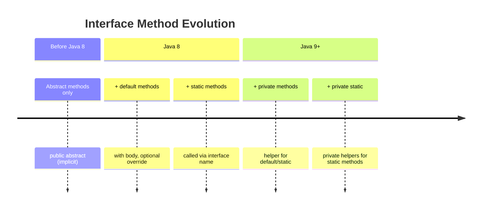
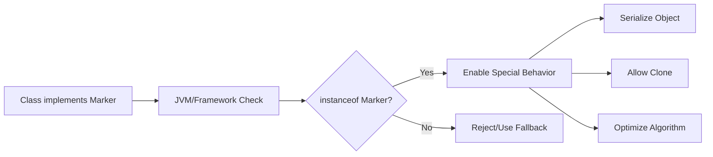

import { Aside, Badge, Card, CardGrid, Code } from '@astrojs/starlight/components';

## 🔌 Interfaces in Java — Complete Guide

> An **Interface** is a 100% abstract contract — it defines **WHAT** to do, not **HOW**. Interfaces enable multiple inheritance of type and are fundamental to Java's design philosophy.

---

## 🗂️ Interface Declaration & Implementation

<Code lang="java" title="Basic interface declaration and implementation" code={`// Declaration
interface Animal {
    void eat();      // implicitly public abstract
    void sleep();    // implicitly public abstract
}

// Implementation
class Dog implements Animal {
    @Override
    public void eat() {            // MUST implement all methods
        System.out.println("Dog eating");
    }
    @Override
    public void sleep() {
        System.out.println("Dog sleeping");
    }
}

// Usage
Animal a = new Dog();  // ✅ Reference of interface type, object of concrete class
a.eat();               // Polymorphic call → "Dog eating"`} />

### 🔑 Core Interface Rules

<CardGrid>
  <Card title="Cannot Be Instantiated" icon="error">
    ```java
    Animal a = new Animal();  // ❌ C.E: Animal is abstract; cannot be instantiated
    // Interfaces define contracts, not implementations — must use concrete class
    ```
  </Card>
  
  <Card title="Must Implement ALL Methods (or be abstract)" icon="approve-check">
    ```java
    // ❌ Compile Error: missing method implementations
    class Cat implements Animal {
        public void eat() { }
        // sleep() not implemented → C.E
    }
    
    // ✅ Option 1: Implement all methods
    class Cat implements Animal {
        public void eat() { }
        public void sleep() { }
    }
    
    // ✅ Option 2: Declare class abstract (defer to subclass)
    abstract class Feline implements Animal {
        public void eat() { }
        // sleep() still abstract — subclass must implement
    }
    ```
  </Card>

  <Card title="Implementation Methods Must Be Public" icon="caution">
    ```java
    interface Interf {
        void methodOne();  // implicitly public abstract
    }
    
    class Test implements Interf {
        // ❌ C.E: methodOne() in Test cannot implement methodOne() in Interf;
        // attempting to assign weaker access privileges ('package-private'); was 'public'
        void methodOne() { }  // Missing 'public'!
        
        // ✅ Correct:
        public void methodOne() { }  // Must match or strengthen access
    }
    ```
  </Card>
</CardGrid>

<Aside type="note">
**Key Insight**: Interface methods are implicitly `public abstract`. When implementing, you **cannot weaken access** — must be `public` (can't use `protected`, `default`, or `private`).
</Aside>

---

## 🔄 extends vs implements — Inheritance Rules

### 🧭 Inheritance Matrix

<table>
  <thead>
    <tr>
      <th>From → To</th>
      <th>Keyword</th>
      <th>Multiple Allowed?</th>
      <th>Example</th>
    </tr>
  </thead>
  <tbody>
    <tr><td>Class → Class</td><td><code>extends</code></td><td>❌ Single only</td><td><code>class Dog extends Animal</code></td></tr>
    <tr><td>Class → Interface</td><td><code>implements</code></td><td>✅ Multiple</td><td><code>class Dog implements Flyable, Swimmable</code></td></tr>
    <tr><td>Interface → Interface</td><td><code>extends</code></td><td>✅ Multiple</td><td><code>interface C extends A, B</code></td></tr>
  </tbody>
</table>

### 💻 Syntax Examples

<Code lang="java" title="Valid inheritance combinations" code={`// Class extends Class (single only)
class Dog extends Animal { }              // ✅
// class Dog extends Animal, Pet { }     // ❌ C.E: cannot extend multiple classes

// Class implements Interface (multiple ✅)
class Dog implements Flyable, Swimmable, Runnable { }  // ✅

// Interface extends Interface (multiple ✅)
interface Pet extends Animal, Mammal { }  // ✅

// Class extends + implements both (order matters!)
class Dog extends Animal                  // ✅ extends FIRST
          implements Flyable, Swimmable { }  // implements AFTER

// ❌ Wrong order:
// class Dog implements Flyable extends Animal { }  // ❌ C.E: '{' expected`} />

<Aside type="tip">
**Memory Trick**: *"Extends before Implements"* — like alphabetically, `e` comes before `i`.  
Syntax: `class X extends Y implements Z1, Z2 { }`
</Aside>

---

## 🛠️ Interface Methods — Evolution Across Java Versions

### 📅 Java Version Compatibility



### 1️⃣ Abstract Methods (Original — All Versions)

<Code lang="java" title="Implicit modifiers — all declarations are equal" code={`interface Shape {
    // All four declarations are IDENTICAL:
    double area();                        // implicit: public abstract
    public double perimeter();            // explicit public
    abstract double circumference();      // explicit abstract
    public abstract double diameter();    // explicit both
}

// Compiler treats all as: public abstract double methodName();`} />

<Aside type="caution">
**Illegal Modifiers for Interface Methods** (before Java 8):  
`private`, `protected`, `final`, `static`, `synchronized`, `native`, `strictfp`  
→ All cause compile errors because they contradict `public abstract` semantics.
</Aside>

### 2️⃣ Default Methods (Java 8+) — Backward Compatibility

<Code lang="java" title="default methods enable interface evolution" code={`interface Vehicle {
    // Abstract — must implement
    void start();
    
    // Default — optional override ✅
    default void fuelCheck() {
        System.out.println("Checking fuel...");
    }
    
    // Default can call other default/abstract methods
    default void startWithCheck() {
        fuelCheck();  // Call default method
        start();      // Call abstract method (implemented by class)
    }
}

class Car implements Vehicle {
    @Override
    public void start() {
        System.out.println("Car started");
    }
    // fuelCheck() not overridden → uses default implementation ✅
}

// Usage:
Car c = new Car();
c.start();           // "Car started"
c.fuelCheck();       // "Checking fuel..." (default)
c.startWithCheck();  // "Checking fuel..." → "Car started"`} />

#### 🔑 Why Default Methods Were Introduced

<CardGrid>
  <Card title="Problem: Interface Evolution Breaks Code" icon="error">
    ```java
    // Java 7: Interface with one method
    interface List<E> {
        void add(E e);
    }
    // All implementing classes work fine ✅
    
    // Java 8: Add new method to interface
    interface List<E> {
        void add(E e);
        void forEach(Consumer<? super E> action);  // NEW!
    }
    // ❌ All existing List implementations BREAK — must implement forEach!
    ```
  </Card>
  
  <Card title="Solution: Default Methods Preserve Compatibility" icon="approve-check">
    ```java
    interface List<E> {
        void add(E e);
        
        // New method with default implementation → no breakage!
        default void forEach(Consumer<? super E> action) {
            for (E e : this) {
                action.accept(e);
            }
        }
    }
    // Existing classes continue working ✅
    // New classes can override forEach for optimization ✅
    ```
  </Card>
</CardGrid>

### 3️⃣ Static Methods (Java 8+) — Utility Functions

<Code lang="java" title="static methods belong to interface, not instances" code={`interface MathUtils {
    // Static method — utility, not part of contract
    static int square(int n) {
        return n * n;
    }
    
    static double pi() {
        return 3.14159;
    }
}

// Call via interface name ONLY:
MathUtils.square(5);  // ✅ 25
MathUtils.pi();       // ✅ 3.14159

// ❌ NOT inherited by implementing classes:
class Calculator implements MathUtils {
    // MathUtils.square(5);  // ✅ Still works via interface
    // square(5);            // ❌ C.E: cannot resolve symbol (not inherited)
}

// Static methods CANNOT be abstract or default:
// static abstract void m();  // ❌ C.E: illegal combination
// default static void m();   // ❌ C.E: illegal combination`} />

### 4️⃣ Private Methods (Java 9+) — Code Reuse

<Code lang="java" title="private methods for default/static method helpers" code={`interface Logger {
    // Default methods can reuse private helper
    default void logInfo(String msg) {
        log("INFO", msg);  // Call private helper
    }
    
    default void logError(String msg) {
        log("ERROR", msg);  // Reuse same helper
    }
    
    // Private helper — not exposed to implementing classes
    private void log(String level, String msg) {
        System.out.println("[" + level + "] " + msg);
    }
    
    // Java 9+: private static for static method helpers
    static int compute(int x) {
        return validate(x) ? x * 2 : 0;
    }
    private static boolean validate(int x) {
        return x > 0;
    }
}

// Implementing class sees only public API:
class AppLogger implements Logger {
    // log(), validate() are NOT visible here ✅ encapsulation
}

// Usage:
Logger logger = new AppLogger();
logger.logInfo("Started");  // "[INFO] Started"
logger.logError("Failed");  // "[ERROR] Failed"`} />

<Aside type="tip">
**Design Principle**: Private interface methods enable **DRY code** within the interface itself — default/static methods can share logic without exposing helpers to implementing classes.
</Aside>

---

## 📦 Interface Variables — Implicit Modifiers

> Interface variables are **constants** — implicitly `public static final`.

### 🔑 Implicit Modifier Rules

<Code lang="java" title="All variable declarations are equivalent" code={`interface Config {
    // All seven declarations are IDENTICAL:
    int MAX_SIZE = 100;                    // implicit: public static final
    public int MIN_SIZE = 10;              // explicit public
    static int TIMEOUT = 30;               // explicit static
    final int RETRIES = 3;                 // explicit final
    public static int PORT = 8080;         // public + static
    public final int VERSION = 1;          // public + final
    static final int BUILD = 42;           // static + final
    public static final String URL = "api.example.com"; // all three
}

// Compiler treats all as: public static final Type NAME = value;`} />

### ⚠️ Variable Rules & Common Traps

<CardGrid>
  <Card title="Must Initialize at Declaration" icon="error">
    ```java
    interface Config {
        int MAX_SIZE;  // ❌ C.E: = expected (final variables must be initialized)
        // Fix:
        int MAX_SIZE = 100;  // ✅
    }
    ```
  </Card>
  
  <Card title="Cannot Reassign — final!" icon="error">
    ```java
    interface Config {
        int MAX_SIZE = 100;
    }
    
    class Test implements Config {
        void modify() {
            // MAX_SIZE = 200;  // ❌ C.E: cannot assign to final variable MAX_SIZE
            System.out.println(MAX_SIZE);  // ✅ Reading is fine
        }
    }
    ```
  </Card>

  <Card title="Access via Interface or Class" icon="information">
    ```java
    interface Config {
        int MAX_SIZE = 100;
    }
    
    class Test implements Config {
        void show() {
            System.out.println(MAX_SIZE);      // ✅ Via inheritance
            System.out.println(Config.MAX_SIZE); // ✅ Via interface name
            System.out.println(this.MAX_SIZE);   // ✅ Via this reference
        }
    }
    ```
  </Card>
</CardGrid>

### ❌ Illegal Modifiers for Interface Variables

<Code lang="java" title="These modifiers cause compile errors" code={`interface Config {
    // ❌ Cannot weaken access:
    private int X = 1;        // ❌ C.E: illegal combination
    protected int Y = 2;      // ❌ C.E: illegal combination
    
    // ❌ Cannot remove static/final semantics:
    int Z = 3;                // ✅ implicitly public static final
    // transient int T = 4;   // ❌ C.E: illegal combination
    // volatile int V = 5;    // ❌ C.E: illegal combination
}`} />

---

## ⚔️ Naming Conflicts — Multiple Interfaces

### 🔹 Method Naming Conflicts

<CardGrid>
  <Card title="Case 1: Same Signature, Same Return Type ✅" icon="approve-check">
    ```java
    interface A { void display(); }
    interface B { void display(); }
    
    // One implementation satisfies both — no conflict!
    class C implements A, B {
        @Override
        public void display() {  // ✅ Serves both A.display() and B.display()
            System.out.println("display");
        }
    }
    ```
  </Card>
  
  <Card title="Case 2: Same Name, Different Return Type ❌" icon="error">
    ```java
    interface A { int display(); }    // returns int
    interface B { void display(); }   // returns void
    
    class C implements A, B {
        // ❌ C.E: display() in C cannot implement both methods
        // Return type difference is NOT valid overloading — same signature!
    }
    // Reason: Java doesn't allow overloading by return type alone
    ```
  </Card>

  <Card title="Case 3: Default Method Conflict ⚠️" icon="caution">
    ```java
    interface A {
        default void show() { System.out.println("A"); }
    }
    interface B {
        default void show() { System.out.println("B"); }
    }
    
    // ❌ Compile Error if not resolved:
    class C implements A, B {
        // MUST override to resolve ambiguity:
        @Override
        public void show() {
            // Option 1: Call specific interface's default
            A.super.show();  // "A"
            // OR B.super.show();  // "B"
            
            // Option 2: Provide custom implementation
            // System.out.println("C");
        }
    }
    ```
  </Card>
</CardGrid>

### 🔹 Variable Naming Conflicts

<Code lang="java" title="Ambiguous variable access — resolve with interface name" code={`interface A { int x = 10; }
interface B { int x = 20; }

class C implements A, B {
    void show() {
        // System.out.println(x);     // ❌ C.E: reference to x is ambiguous
        System.out.println(A.x);      // ✅ 10 — explicit via interface
        System.out.println(B.x);      // ✅ 20 — explicit via interface
        
        // Alternative: shadow with local variable
        int x = 30;                   // Local variable shadows interface constants
        System.out.println(x);        // 30 — local variable wins
    }
}

// Access pattern reminder:
// Interface constant → InterfaceName.CONSTANT (recommended)
// Instance field → this.field or just field
// Local variable → just variableName (shadows others)`} />

---

## 🏷️ Marker Interfaces — Tagging for Special Behavior

> A **Marker Interface** has **no methods and no variables** — it simply "marks" a class for special JVM or framework behavior.

### 🔑 Built-in Marker Interfaces

<CardGrid>
  <Card title="Serializable — Object Persistence" icon="rocket">
    ```java
    import java.io.Serializable;
    
    class User implements Serializable {  // ✅ Marked for serialization
        String name;
        transient String password;  // transient: skip during serialization
    }
    
    // ObjectOutputStream will serialize User objects ✅
    // Without Serializable → NotSerializableException ❌
    ```
  </Card>
  
  <Card title="Cloneable — Object Duplication" icon="shield">
    ```java
    class Data implements Cloneable {  // ✅ Marked as cloneable
        int[] values;
        
        @Override
        protected Object clone() throws CloneNotSupportedException {
            return super.clone();  // JVM allows shallow copy only if Cloneable
        }
    }
    
    // Without Cloneable → CloneNotSupportedException ❌
    ```
  </Card>

  <Card title="RandomAccess — List Performance Hint" icon="information">
    ```java
    // Marker for lists with fast random access (O(1) get)
    class FastList<E> extends ArrayList<E> implements RandomAccess { }
    
    // Algorithms can optimize based on marker:
    void binarySearch(List<?> list) {
        if (list instanceof RandomAccess) {
            // Use index-based binary search ✅
        } else {
            // Use iterator-based sequential search ✅
        }
    }
    ```
  </Card>
</CardGrid>

### 🔬 How Marker Interfaces Work



<Code lang="java" title="Framework-style marker check" code={`// Simplified serialization framework
class Serializer {
    static void serialize(Object obj) {
        if (!(obj instanceof Serializable)) {
            throw new NotSerializableException(obj.getClass().getName());
        }
        // Proceed with serialization...
    }
}

// Usage:
Serializer.serialize(new User());     // ✅ User implements Serializable
Serializer.serialize(new Secret());   // ❌ Secret doesn't → exception
`} />

### 🆚 Marker Interface vs Annotation (Java 5+)

<table>
  <thead>
    <tr>
      <th>Feature</th>
      <th>Marker Interface</th>
      <th>Annotation</th>
    </tr>
  </thead>
  <tbody>
    <tr><td>Syntax</td><td><code>class X implements Serializable</code></td><td><code>@Entity class X</code></td></tr>
    <tr><td>Metadata</td><td>None (empty)</td><td>Can carry attributes: <code>@Column(name="id")</code></td></tr>
    <tr><td>Type Safety</td><td>✅ Compile-time check via instanceof</td><td>⚠️ Runtime reflection (unless processed at compile-time)</td></tr>
    <tr><td>Multiple</td><td>✅ Implement multiple markers</td><td>✅ Apply multiple annotations</td></tr>
    <tr><td>Modern Usage</td><td>Legacy (Serializable, Cloneable)</td><td>Preferred for new designs (@Override, @Deprecated, Spring annotations)</td></tr>
  </tbody>
</table>

<Aside type="tip">
**Can you create custom marker interfaces?**  
✅ Yes — but the JVM won't automatically grant special behavior.  
You'd need to:
1. Check `instanceof YourMarker` in your own framework code, OR
2. Use bytecode manipulation (ASM, ByteBuddy) to inject behavior  
For most cases, **annotations are more flexible** for custom markers.
</Aside>

---

## 🔌 Adapter Classes — Reduce Boilerplate

> An **Adapter Class** provides **empty default implementations** of all interface methods — so you override only what you need.

### 🧱 Classic Example: WindowListener

<Code lang="java" title="Without adapter — verbose and error-prone" code={`// Interface with 7 methods
interface WindowListener {
    void windowOpened();
    void windowClosed();
    void windowClosing();
    void windowIconified();
    void windowDeiconified();
    void windowActivated();
    void windowDeactivated();
}

// ❌ Must implement ALL 7 methods even if you need only 1:
class MyWindow implements WindowListener {
    public void windowOpened() { }           // Empty — not needed
    public void windowClosed() { }           // Empty — not needed
    public void windowClosing() {            // ✅ Only this one needed!
        System.out.println("Saving state...");
        System.exit(0);
    }
    public void windowIconified() { }        // Empty
    public void windowDeiconified() { }      // Empty
    public void windowActivated() { }        // Empty
    public void windowDeactivated() { }      // Empty
}`} />

<Code lang="java" title="With adapter — clean and focused" code={`// Adapter provides empty implementations
abstract class WindowAdapter implements WindowListener {
    public void windowOpened() { }
    public void windowClosed() { }
    public void windowClosing() { }
    public void windowIconified() { }
    public void windowDeiconified() { }
    public void windowActivated() { }
    public void windowDeactivated() { }
}

// ✅ Extend adapter — override ONLY what you need:
class MyWindow extends WindowAdapter {
    @Override
    public void windowClosing() {  // Only this one!
        System.out.println("Saving state...");
        System.exit(0);
    }
    // All other methods inherit empty implementations ✅
}`} />

### 🔑 Real-World Adapter Examples

<CardGrid>
  <Card title="Servlet API: GenericServlet" icon="information">
    ```java
    // Servlet interface — 5 methods
    public interface Servlet {
        void init(ServletConfig config);
        void service(ServletRequest req, ServletResponse res);
        void destroy();
        ServletConfig getServletConfig();
        String getServletInfo();
    }
    
    // GenericServlet adapter — provides default implementations
    public abstract class GenericServlet implements Servlet {
        // Implements all Servlet methods with defaults
        // Subclasses override only what they need
    }
    
    // HttpServlet extends adapter — adds HTTP-specific logic
    public class MailServlet extends HttpServlet {
        @Override
        protected void doPost(HttpServletRequest req, HttpServletResponse resp) {
            // Only implement HTTP POST — rest inherited ✅
        }
    }
    ```
  </Card>
  
  <Card title="Mouse/Key Adapters in AWT/Swing" icon="rocket">
    ```java
    // MouseListener has 5 methods
    component.addMouseListener(new MouseAdapter() {
        @Override
        public void mouseClicked(MouseEvent e) {
            // Only handle clicks — ignore enter/exit/press/release ✅
            handleClick(e.getX(), e.getY());
        }
    });
    ```
  </Card>
</CardGrid>

<Aside type="note">
**Modern Alternative**: With Java 8+ functional interfaces and default methods, many adapter classes are less necessary. However, adapters remain valuable for:
- Legacy APIs (Servlet, AWT)
- Interfaces with many methods where only 1-2 are needed
- Reducing boilerplate in event-handling code
</Aside>

---

## 🆚 Interface vs Abstract Class vs Concrete Class

### 📊 Comprehensive Comparison Table

<table>
  <thead>
    <tr>
      <th>Feature</th>
      <th>Interface</th>
      <th>Abstract Class</th>
      <th>Concrete Class</th>
    </tr>
  </thead>
  <tbody>
    <tr><td><strong>Instantiate</strong></td><td>❌ No</td><td>❌ No</td><td>✅ Yes</td></tr>
    <tr><td><strong>Constructor</strong></td><td>❌ No</td><td>✅ Yes</td><td>✅ Yes</td></tr>
    <tr><td><strong>Abstract Methods</strong></td><td>✅ Implicit (pre-J8)</td><td>✅ Explicit</td><td>❌ No</td></tr>
    <tr><td><strong>Concrete Methods</strong></td><td>✅ default/static/private (Java 8+)</td><td>✅ Yes</td><td>✅ Yes</td></tr>
    <tr><td><strong>Variables</strong></td><td>public static final only</td><td>Any type/access</td><td>Any type/access</td></tr>
    <tr><td><strong>Multiple Inheritance</strong></td><td>✅ Implement multiple</td><td>❌ Extend one only</td><td>❌ Extend one only</td></tr>
    <tr><td><strong>Access Modifiers</strong></td><td>public only (methods)</td><td>Any (public/protected/private)</td><td>Any</td></tr>
    <tr><td><strong>Relationship</strong></td><td>CAN-DO (capability)</td><td>IS-A (type hierarchy)</td><td>IS-A (concrete type)</td></tr>
    <tr><td><strong>When to Use</strong></td><td>Unrelated classes need same capability</td><td>Related classes share base behavior</td><td>Ready-to-use implementation</td></tr>
  </tbody>
</table>

### 🎯 When to Choose Which?

<CardGrid>
  <Card title="Use Interface When…" icon="rocket">
    ```text
    ✅ Unrelated classes need the same capability
       • Bird, Airplane, Superman → all implement Flyable
    
    ✅ You want to support multiple inheritance of type
       • class Dog implements Pet, Trainable, Vaccinated
    
    ✅ You're defining a contract/API for others to implement
       • Java Collections: List, Set, Map interfaces
    
    ✅ You need to add methods later without breaking code
       • Use default methods (Java 8+)
    ```
  </Card>
  
  <Card title="Use Abstract Class When…" icon="shield">
    ```text
    ✅ Related classes share common state/behavior
       • Dog, Cat, Bird → all extend Animal (has name, age, breathe())
    
    ✅ You need to provide partial implementation
       • Abstract class implements some methods, leaves others abstract
    
    ✅ You need constructors, instance fields, or non-public members
       • Abstract classes support full OOP features
    
    ✅ You want to control subclass API (protected methods)
    ```
  </Card>

  <Card title="Use Concrete Class When…" icon="approve-check">
    ```text
    ✅ You have a complete, ready-to-use implementation
       • class ArrayList implements List — ready to instantiate
    
    ✅ No need for further extension or customization
       • Final classes for immutability: String, Integer
    
    ✅ Performance-critical code where virtual dispatch overhead matters
       • Final concrete classes enable JVM optimizations
    ```
  </Card>
</CardGrid>

### 🧠 Deep Dive: Interface vs Abstract Class

<Code lang="java" title="CAN-DO vs IS-A relationship" code={`// Interface: CAN-DO (capability) — unrelated classes
interface Flyable {
    void fly();
}

class Bird implements Flyable {      // Bird CAN fly
    public void fly() { System.out.println("Flapping wings"); }
}
class Airplane implements Flyable {  // Airplane CAN fly (no IS-A with Bird!)
    public void fly() { System.out.println("Using engines"); }
}
class Superman implements Flyable {  // Superman CAN fly
    public void fly() { System.out.println("Using superpowers"); }
}

// Abstract Class: IS-A (type hierarchy) — related classes
abstract class Animal {              // Common base type
    String name;                     // Shared state
    void breathe() {                 // Shared behavior
        System.out.println("Breathing...");
    }
    abstract void makeSound();       // Abstract — each subclass implements
}

class Dog extends Animal {           // Dog IS-A Animal
    @Override
    void makeSound() { System.out.println("Woof"); }
}
class Cat extends Animal {           // Cat IS-A Animal
    @Override
    void makeSound() { System.out.println("Meow"); }
}

// Usage:
Flyable f1 = new Bird();      // Polymorphic via interface
Flyable f2 = new Airplane();  // Same interface, unrelated classes ✅

Animal a1 = new Dog();        // Polymorphic via abstract class
// Animal a2 = new Airplane(); // ❌ C.E: Airplane not IS-A Animal`} />

---

## 🔧 Constructor Discussion — Why Abstract Class Has Them, Interface Doesn't

### 🎯 Purpose of Constructors

<CardGrid>
  <Card title="Constructor Purpose: Initialize, Not Create" icon="information">
    ```java
    class Student {
        String name;
        int rollNo;
        
        // Constructor: Initialize object AFTER creation
        Student(String name, int rollNo) {
            this.name = name;      // Initialize instance variables
            this.rollNo = rollNo;
            System.out.println(this.hashCode());  // Object already exists!
        }
    }
    
    // Object creation sequence:
    // 1. new Student(...) → memory allocated, object created
    // 2. Student(...) → constructor runs, initializes fields
    Student s = new Student("Ravi", 101);  // s references initialized object
    ```
  </Card>
  
  <Card title="Abstract Class Constructor: Initialize Child Object" icon="shield">
    ```java
    abstract class Person {
        String name;
        int age;
        
        // Constructor initializes fields for CHILD object
        Person(String name, int age) {
            this.name = name;   // Initializes Person fields in child
            this.age = age;
            System.out.println("Person constructor: " + this.hashCode());
        }
    }
    
    class Student extends Person {
        int rollNo;
        
        Student(String name, int age, int rollNo) {
            super(name, age);   // Call parent constructor FIRST
            this.rollNo = rollNo;
            System.out.println("Student constructor: " + this.hashCode());
        }
    }
    
    // Execution:
    Student s = new Student("Ravi", 20, 101);
    // Output:
    // Person constructor: 7224672  ← Same hash for both!
    // Student constructor: 7224672 ← Same object, different initialization phases
    ```
  </Card>

  <Card title="Interface: No Constructor Needed" icon="approve-check">
    ```java
    interface Config {
        // All variables are public static final:
        int MAX_SIZE = 100;    // Initialized at declaration
        String URL = "api.example.com";
        
        // No instance variables → no need for initialization via constructor
        // Static fields belong to interface, not instances
    }
    
    // Why no constructor?
    // 1. Interfaces cannot be instantiated → no object to initialize
    // 2. No instance variables → nothing to initialize per-object
    // 3. Static final fields initialized at declaration → done at class load
    ```
  </Card>
</CardGrid>

<Aside type="tip">
**Key Insight**: Constructors initialize **instance state**.  
- Abstract classes CAN have instance variables → need constructor for child initialization  
- Interfaces CANNOT have instance variables (only `static final`) → no constructor needed
</Aside>

---

## 🎯 Interview Cheat Sheet

<CardGrid>
  <Card title="Q: Can an interface extend multiple interfaces?" icon="approve-check">
    **YES ✅** — interfaces support multiple inheritance of type:
    ```java
    interface C extends A, B { }  // ✅ Valid
    ```
  </Card>
  
  <Card title="Q: Can an interface have a constructor?" icon="error">
    **NO ❌** — interfaces cannot be instantiated, and have no instance variables to initialize.  
    Constructors are for initializing object state — interfaces define contracts, not state.
  </Card>

  <Card title="Q: Are interface methods public by default?" icon="approve-check">
    **YES ✅** — implicitly `public abstract` (before Java 8).  
    Java 8+: can also be `default` or `static` (still `public`).  
    Java 9+: can be `private` (for helper methods within interface).
  </Card>

  <Card title="Q: Can interface variables be changed?" icon="error">
    **NO ❌** — implicitly `public static final`.  
    Must be initialized at declaration, and value cannot change.  
    Attempting `x = 20` → compile error: "cannot assign to final variable".
  </Card>

  <Card title="Q: What is a default method? Why was it introduced?" icon="information">
    **Default method**: Method with body in interface (`default void m() { }`).  
    **Introduced in Java 8** to enable interface evolution without breaking existing implementations.  
    Example: Adding `forEach()` to `Iterable` without breaking all `Collection` implementations.
  </Card>

  <Card title="Q: Two interfaces have same default method — what happens?" icon="caution">
    **Compile error** in implementing class unless explicitly resolved:
    ```java
    class C implements A, B {
        @Override
        public void show() {
            A.super.show();  // Explicitly choose A's default
            // OR B.super.show();
            // OR custom implementation
        }
    }
    ```
  </Card>

  <Card title="Q: Can an abstract class implement an interface partially?" icon="approve-check">
    **YES ✅** — abstract classes can leave interface methods unimplemented.  
    Concrete subclasses must implement remaining abstract methods.
  </Card>

  <Card title="Q: Marker interface vs Annotation?" icon="information">
    **Marker Interface**: Empty interface (`Serializable`, `Cloneable`) — checked via `instanceof`.  
    **Annotation**: `@interface` (Java 5+) — more flexible, can carry metadata, processed via reflection or compile-time tools.  
    ✅ Prefer annotations for new designs; marker interfaces remain for legacy compatibility.
  </Card>

  <Card title="Q: What is an adapter class?" icon="approve-check">
    **Adapter class**: Abstract class implementing an interface with empty method bodies.  
    Subclasses override only needed methods — reduces boilerplate.  
    Examples: `WindowAdapter`, `MouseAdapter`, `GenericServlet`.
  </Card>

  <Card title="Q: Interface variable default modifiers?" icon="approve-check">
    **`public static final`** — automatically applied by compiler.  
    Must initialize at declaration; value cannot change; accessible everywhere.
  </Card>

  <Card title="Q: Can an interface be private or protected?" icon="caution">
    **Top-level interface**: NO ❌ — only `public` or default (package-private).  
    **Nested interface**: YES ✅ — can be `private`, `protected`, `public`, or default.
  </Card>

  <Card title="Q: Can we declare main() in an interface?" icon="approve-check">
    **YES ✅** (Java 8+) — as a `static` method:
    ```java
    interface Demo {
        static void main(String[] args) {
            System.out.println("Interface main!");
        }
    }
    // Run: java Demo → works! But rarely done in practice.
    ```
  </Card>
</CardGrid>

---

## 🧩 DSA Angle — Interfaces in Algorithms

<CardGrid>
  <Card title="Pattern: Comparator for Custom Sorting" icon="rocket">
    ```java
    // Sort intervals by start time, then by end time
    Comparator<Interval> comp = (a, b) -> {
        if (a.start != b.start) return a.start - b.start;
        return a.end - b.end;
    };
    Arrays.sort(intervals, comp);  // ✅ Clean, reusable
    
    // Or implement Comparable for natural ordering:
    class Interval implements Comparable<Interval> {
        int start, end;
        @Override
        public int compareTo(Interval other) {
            return this.start - other.start;
        }
    }
    Arrays.sort(intervals);  // Uses compareTo() ✅
    ```
  </Card>
  
  <Card title="Pattern: Iterable for Custom Data Structures" icon="shield">
    ```java
    // Make custom DS work with for-each loop
    class MyList<T> implements Iterable<T> {
        private T[] data;
        private int size;
        
        @Override
        public Iterator<T> iterator() {
            return new Iterator<T>() {
                int idx = 0;
                public boolean hasNext() { return idx < size; }
                public T next() { return data[idx++]; }
            };
        }
    }
    
    // Now works with enhanced for-loop:
    MyList<String> list = new MyList<>();
    for (String item : list) {  // ✅ Uses iterator() under the hood
        process(item);
    }
    ```
  </Card>

  <Card title="Pattern: Functional Interfaces for Stream Processing" icon="backspace">
    ```java
    // Predicate for filtering
    Predicate<Integer> isEven = n -> n % 2 == 0;
    
    // Function for transformation
    Function<Integer, Integer> square = n -> n * n;
    
    // Consumer for side effects
    Consumer<Integer> print = n -> System.out.println(n);
    
    // Chain operations with streams:
    List<Integer> result = numbers.stream()
        .filter(isEven)      // Predicate
        .map(square)         // Function
        .forEach(print);     // Consumer
    ```
  </Card>
</CardGrid>

<Aside type="tip">
**DSA Pro Tip**: Leverage Java's functional interfaces (`Function`, `Predicate`, `Consumer`, `Comparator`) to write concise, reusable algorithm components. They integrate seamlessly with streams and enable functional-style programming in Java.
</Aside>

---

## 🏢 Real-Life SDE Usage — Production Patterns

<CardGrid>
  <Card title="Pattern: Strategy Pattern with Interfaces" icon="rocket">
    ```java
    // Interface defines strategy contract
    interface PaymentStrategy {
        void pay(double amount);
    }
    
    // Concrete strategies
    class CreditCardPayment implements PaymentStrategy {
        @Override
        public void pay(double amount) {
            // Process credit card payment
            System.out.println("Paid $" + amount + " via Credit Card");
        }
    }
    
    class UPIPayment implements PaymentStrategy {
        @Override
        public void pay(double amount) {
            // Process UPI payment
            System.out.println("Paid $" + amount + " via UPI");
        }
    }
    
    // Context class — depends on abstraction, not concrete implementations
    class OrderService {
        private PaymentStrategy strategy;  // Program to interface!
        
        OrderService(PaymentStrategy strategy) {
            this.strategy = strategy;  // Dependency injection
        }
        
        void checkout(double amount) {
            strategy.pay(amount);  // Runtime polymorphism ✅
        }
    }
    
    // Usage — switch strategies at runtime:
    new OrderService(new UPIPayment()).checkout(500);      // UPI
    new OrderService(new CreditCardPayment()).checkout(1000); // Credit Card
    ```
  </Card>
  
  <Card title="Pattern: Repository Interface (Spring Boot)" icon="shield">
    ```java
    // Interface defines data access contract
    public interface UserRepository extends JpaRepository<User, Long> {
        // Spring Data JPA auto-implements these at runtime!
        Optional<User> findByEmail(String email);
        List<User> findByStatus(String status);
        @Query("SELECT u FROM User u WHERE u.name LIKE %:name%")
        List<User> searchByName(@Param("name") String name);
    }
    
    // Service layer depends on interface, not implementation
    @Service
    public class UserService {
        private final UserRepository userRepository;  // Interface!
        
        @Autowired
        public UserService(UserRepository userRepository) {
            this.userRepository = userRepository;
        }
        
        public User findByEmail(String email) {
            return userRepository.findByEmail(email)
                .orElseThrow(() -> new UserNotFoundException(email));
        }
    }
    // ✅ Benefits: Testable (mock interface), swappable implementations, clean architecture
    ```
  </Card>

  <Card title="Pattern: Marker Interface for Security" icon="backspace">
    ```java
    // Custom marker for sensitive data
    public interface Sensitive { }
    
    // Mark classes containing sensitive fields
    public class UserCredentials implements Sensitive, Serializable {
        private String username;
        private transient String password;  // transient + serializable ✅
        
        // Framework can check marker before logging/serializing:
        void log(Object obj) {
            if (obj instanceof Sensitive) {
                // Redact or encrypt before logging
                System.out.println("[REDACTED]");
            } else {
                System.out.println(obj);
            }
        }
    }
    ```
  </Card>
</CardGrid>

<Aside type="tip">
**Architecture Best Practice**:  
✅ **Depend on abstractions** (interfaces), not concrete implementations — enables testing, swapping, and clean layering.  
✅ Use **dependency injection** to provide implementations at runtime.  
✅ Leverage **framework support** (Spring, Jakarta EE) for auto-implementation of repository interfaces.
</Aside>

---

## 🔑 Quick Reference Summary

### Interface Method Types by Java Version

| Java Version | Allowed Method Types | Notes |
|-------------|---------------------|-------|
| ≤ Java 7 | `public abstract` only | Implicit — no body |
| Java 8 | + `default`, + `static` | Enable evolution, utilities |
| Java 9+ | + `private`, + `private static` | Code reuse within interface |


### Interface Variable Rules

| Property | Detail |
|----------|--------|
| Implicit modifiers | `public static final` |
| Initialization | Must at declaration |
| Reassignment | ❌ Not allowed (final) |
| Access | Via interface name or implementing class |
| Illegal modifiers | `private`, `protected`, `transient`, `volatile` |

### Naming Conflict Resolution

| Conflict Type | Resolution Strategy |
|--------------|---------------------|
| Same method signature | One implementation satisfies both ✅ |
| Same name, different return type | ❌ Compile error — impossible to satisfy |
| Default method conflict | Override + use `InterfaceName.super.method()` |
| Variable name conflict | Access via `InterfaceName.CONSTANT` |

### Inheritance Syntax Quick Guide

```java
// Class → Class (single)
class Dog extends Animal { }

// Class → Interface (multiple)
class Dog implements Flyable, Swimmable { }

// Interface → Interface (multiple)
interface Pet extends Animal, Mammal { }

// Combined (order matters!)
class Dog extends Animal implements Flyable, Swimmable { }
//                ↑ extends FIRST, implements AFTER
```

<Aside type="caution">
**Final Checklist for Interface Design**:
1. ✅ Use interfaces for **capabilities** (CAN-DO), abstract classes for **type hierarchies** (IS-A)
2. ✅ Remember: interface methods are `public` — implementing methods must match or strengthen access
3. ✅ Interface variables are `public static final` — initialize at declaration, cannot change
4. ✅ Resolve default method conflicts explicitly with `InterfaceName.super.method()`
5. ✅ Use adapter classes to reduce boilerplate when implementing large interfaces
6. ✅ Prefer functional interfaces + lambdas for DSA and stream processing
7. ✅ Depend on interfaces in service layers for testability and flexibility
</Aside>

---

## 🧪 Test Your Understanding

<Code lang="java" title="Predict compile/runtime behavior" code={`// Q1: Interface method implementation access
interface Interf {
    void method();  // implicitly public abstract
}
class Test implements Interf {
    // void method() { }        // ? (compile or runtime?)
    // public void method() { } // ?
}

// Q2: Interface variable modification
interface Config {
    int MAX = 100;
}
class App implements Config {
    void modify() {
        // MAX = 200;  // ?
        // System.out.println(MAX); // ?
    }
}

// Q3: Default method conflict
interface A { default void show() { System.out.println("A"); } }
interface B { default void show() { System.out.println("B"); } }
class C implements A, B {
    // void show() { }  // ? (compile or runtime?)
    // public void show() { A.super.show(); } // ?
}

// Q4: Static method inheritance
interface Math {
    static int square(int x) { return x * x; }
}
class Calc implements Math {
    void compute() {
        // System.out.println(square(5));  // ?
        // System.out.println(Math.square(5)); // ?
    }
}

// Q5: Constructor in abstract class
abstract class Person {
    String name;
    Person(String name) { this.name = name; }
}
class Student extends Person {
    int roll;
    Student(String name, int roll) {
        // super(name);  // ? (required or optional?)
        this.roll = roll;
    }
}
`} />

<details>
<summary>✅ Click to reveal answers</summary>

```text
Q1:
• void method() { }        // ❌ C.E: method() in Test cannot implement method() in Interf;
                           // attempting to assign weaker access privileges ('package-private'); was 'public'
• public void method() { } // ✅ Valid — matches interface's implicit public

Q2:
• MAX = 200;               // ❌ C.E: cannot assign to final variable MAX
• System.out.println(MAX); // ✅ Valid — reading final constant is allowed

Q3:
• void show() { }          // ❌ C.E: show() in C cannot implement both default methods
                           // (also missing 'public' access)
• public void show() { A.super.show(); } // ✅ Valid — resolves conflict by choosing A's default

Q4:
• System.out.println(square(5));        // ❌ C.E: cannot resolve symbol 'square' (static not inherited)
• System.out.println(Math.square(5));   // ✅ Valid — call static method via interface name

Q5:
• super(name);  // ✅ Required — abstract class constructor must be called
                // to initialize inherited instance fields
                // If omitted: ❌ C.E: constructor Person in class Person cannot be applied to given types
```
</details>

<Aside type="tip">
**Pro Interview Strategy** for interface questions:
1. Clarify **implicit modifiers** (`public abstract` for methods, `public static final` for variables)
2. Explain **default method conflict resolution** with `InterfaceName.super.method()`
3. Distinguish **CAN-DO** (interface) vs **IS-A** (abstract class) relationships
4. Remember: `static` interface methods are **not inherited** — call via interface name
5. For constructors: abstract class needs them for child initialization; interface doesn't (no instance state)
6. Mention **real-world patterns**: Strategy, Repository, Adapter — shows practical understanding

This demonstrates both specification mastery and architectural thinking! 🎯
</Aside>