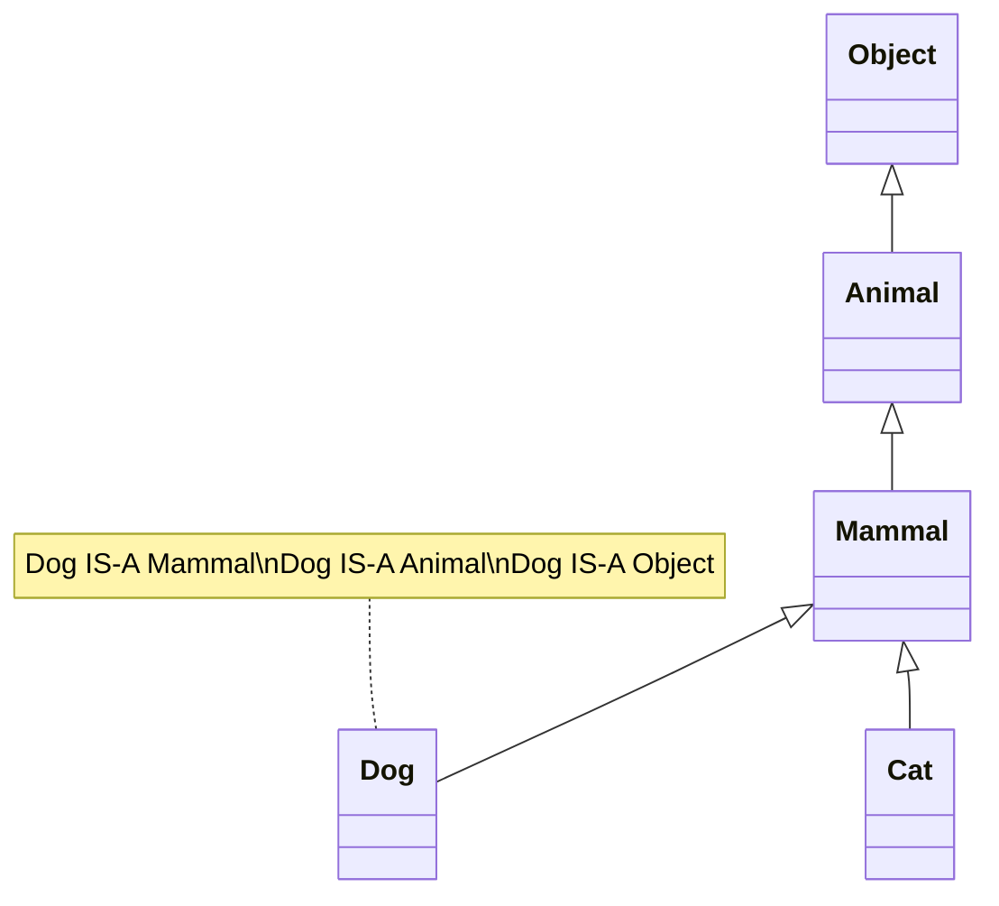

import { Aside, Badge, Card, CardGrid, Code } from '@astrojs/starlight/components';

## 🧬 Inheritance in Java — Complete Guide

> **Inheritance** is the OOP mechanism where a **subclass (child)** acquires the properties (fields) and behaviors (methods) of a **superclass (parent)**. It enables code reuse and establishes an **IS-A relationship**.

```java
// Parent class (superclass)
class Animal {
    String name;
    
    void eat() {
        System.out.println(name + " is eating...");
    }
}

// Child class (subclass) — inherits from Animal
class Dog extends Animal {  // ✅ Dog IS-A Animal
    void bark() {
        System.out.println(name + " says: Woof!");  // ✅ Can access inherited field
    }
}

// Usage — inheritance in action
Dog dog = new Dog();
dog.name = "Buddy";    // ✅ Inherited field
dog.eat();             // ✅ Inherited method: "Buddy is eating..."
dog.bark();            // ✅ Child-specific method: "Buddy says: Woof!"
```

<Aside type="tip">
**Key Insight**: Inheritance is not just about code reuse — it's about **modeling real-world relationships** and enabling **polymorphism**.  
By establishing IS-A relationships, you:
- ✅ Reduce duplication — common logic lives in parent
- ✅ Enable polymorphism — treat subclasses uniformly via parent type
- ✅ Support extensibility — add new subclasses without modifying existing code
- ✅ Clarify domain model — IS-A relationships reflect real-world hierarchies
</Aside>
---

## 🗂️ The extends Keyword — Single Inheritance

> Java supports **single inheritance for classes** — a class can extend **only one** direct superclass.

### 🔑 Basic Syntax & Rules

<Code lang="java" title="Single inheritance — one parent only" code={`// ✅ Valid: One parent class
class Dog extends Animal { }

// ❌ Invalid: Multiple parent classes (not allowed in Java)
// class Dog extends Animal, Mammal { }  // ❌ C.E: '{' expected

// ✅ Valid: Multiple interfaces (different from class inheritance)
class Dog extends Animal implements Pet, Trainable { }`} />

### 🧭 Inheritance Hierarchy Visualization



<Code lang="java" title="Multi-level inheritance — chain of IS-A relationships" code={`// Root of all classes (implicit)
class Object { /* ... */ }

// Level 1: Direct subclass of Object
class Animal {
    String name;
    void breathe() { System.out.println("Breathing..."); }
}

// Level 2: Subclass of Animal
class Mammal extends Animal {
    boolean hasFur;
    void nurseYoung() { System.out.println("Nursing young..."); }
}
// Level 3: Subclass of Mammal
class Dog extends Mammal {
    void bark() { System.out.println("Woof!"); }
}

// Usage — Dog inherits from entire chain
Dog dog = new Dog();
dog.name = "Buddy";        // ✅ From Animal
dog.breathe();             // ✅ From Animal
dog.hasFur = true;         // ✅ From Mammal
dog.nurseYoung();          // ✅ From Mammal
dog.bark();                // ✅ From Dog
dog.toString();            // ✅ From Object (root of hierarchy)
`} />

<Aside type="note">
**Every class in Java implicitly extends `Object`** if no explicit `extends` is declared.  
This means **all classes** inherit methods like `toString()`, `equals()`, `hashCode()`, `getClass()`.
</Aside>

---

## 🔗 Constructor Chaining with super()

> When a subclass object is created, **constructors execute from top to bottom** — parent first, then child.

### 🔑 Constructor Execution Order

<Code lang="java" title="Constructor chaining — parent initializes first" code={`class Animal {
    String name;
    
    Animal(String name) {
        this.name = name;
        System.out.println("Animal constructor: " + name);
    }
}

class Dog extends Animal {
    String breed;
    
    Dog(String name, String breed) {
        super(name);  // ✅ Must call parent constructor FIRST (explicit or implicit)
        this.breed = breed;
        System.out.println("Dog constructor: " + breed);
    }
}

// Object creation sequence:
Dog dog = new Dog("Buddy", "Golden Retriever");
/* Output:
Animal constructor: Buddy   ← Parent constructor runs first
Dog constructor: Golden Retriever  ← Child constructor runs after
*/`} />

### ⚠️ super() Rules & Common Pitfalls

<CardGrid>
  <Card title="Rule: super() Must Be First Statement in Constructor" icon="approve-check">
```java
    class Dog extends Animal {
        Dog(String name) {
            // ❌ Invalid: super() not first
            // System.out.println("Before super");
            // super(name);  // ❌ C.E: call to super must be first statement
            
            // ✅ Correct: super() first
            super(name);
            System.out.println("After super");
        }
    }
```
  </Card>
  
  <Card title="Rule: Implicit super() if No Explicit Call" icon="information">
```java
    class Animal {
        Animal() { System.out.println("Animal()"); }  // No-arg constructor
    }
    
    class Dog extends Animal {
        Dog() {
            // Implicit super() inserted by compiler:
            // super();  // ← Compiler adds this automatically
            System.out.println("Dog()");
        }
    }
    
    // Output: Animal() → Dog()
    
    // ❌ But if parent has ONLY parameterized constructor:
    class Animal {
        Animal(String name) { }  // No no-arg constructor
    }
    class Dog extends Animal {
        Dog() {
            // Implicit super() → super() → ❌ C.E: no matching constructor
            // Fix: Call explicit super with args:
            Dog(String name) { super(name); }        }
    }
```
  </Card>

  <Card title="Pitfall: Forgetting super() When Parent Has No No-Arg Constructor" icon="error">
```java
    class Parent {
        Parent(int x) { }  // Only parameterized constructor
    }
    
    class Child extends Parent {
        // ❌ Compile Error: Parent() is not defined
        // Child() { }  // Implicit super() → super() → no matching constructor
        
        // ✅ Fix: Explicit super() with matching args
        Child(int x) { super(x); }
    }
```
  </Card>
</CardGrid>

### 💻 Constructor Chaining Patterns

<Code lang="java" title="this() and super() — constructor delegation" code={`class Person {
    String name;
    int age;
    
    // Primary constructor
    Person(String name, int age) {
        this.name = name;
        this.age = age;
    }
    
    // Delegating constructor — uses this()
    Person(String name) {
        this(name, 0);  // Delegate to primary constructor
    }
}

class Employee extends Person {
    String employeeId;
    
    // Delegating constructor — uses super()
    Employee(String name, String employeeId) {
        super(name);  // Call parent constructor
        this.employeeId = employeeId;
    }
    
    // Another delegating constructor — uses this()    Employee(String employeeId) {
        this("Unknown", employeeId);  // Delegate to other constructor
    }
}

// Key rules:
// • this() → calls another constructor in SAME class
// • super() → calls constructor in PARENT class
// • Both must be FIRST statement in constructor
// • Cannot use both this() and super() in same constructor
`} />

<Aside type="tip">
**Best Practice**: Use **constructor chaining** to avoid code duplication:
- One "primary" constructor does all initialization
- Other constructors delegate to it via `this()` or `super()`
- Centralizes validation and setup logic
</Aside>

---

## 🔄 Method Overriding — Polymorphism in Action

> **Overriding** allows a subclass to provide a **specific implementation** of a method already defined in its superclass.

### 🔑 Overriding Rules & Syntax

<Code lang="java" title="Method overriding — same signature, different implementation" code={`class Animal {
    // Method to be overridden
    public void makeSound() {
        System.out.println("Some generic animal sound");
    }
    
    // Final method — cannot be overridden
    public final void breathe() {
        System.out.println("Breathing...");
    }
}

class Dog extends Animal {
    // ✅ Valid override — same signature, compatible return type
    @Override  // ✅ Recommended: compile-time check
    public void makeSound() {
        System.out.println("Woof! Woof!");
    }
    
    // ❌ Invalid: Cannot override final method
    // @Override
    // public void breathe() { }  // ❌ C.E: cannot override final method
        // ❌ Invalid: Cannot reduce visibility
    // @Override
    // void makeSound() { }  // ❌ C.E: attempting to assign weaker access privileges
}

// Polymorphism in action:
Animal myPet = new Dog();  // Parent reference, child object
myPet.makeSound();  // "Woof! Woof!" ← Dynamic method dispatch ✅
myPet.breathe();    // "Breathing..." ← Final method, not overridden
`} />

### ⚠️ Overriding Rules Checklist

<CardGrid>
  <Card title="Rule 1: Same Method Signature" icon="approve-check">
```java
    class Parent {
        void display(int x) { }
    }
    class Child extends Parent {
        // ✅ Valid override — same name, same parameter types
        @Override
        void display(int x) { }
        
        // ❌ Not override — different parameter type (overloading)
        void display(String s) { }  // Overload, not override
    }
```
  </Card>
  
  <Card title="Rule 2: Return Type Must Be Same or Covariant" icon="approve-check">
```java
    class Animal { }
    class Dog extends Animal { }
    
    class AnimalFactory {
        Animal create() { return new Animal(); }
    }
    
    class DogFactory extends AnimalFactory {
        // ✅ Covariant return type — Dog IS-A Animal
        @Override
        Dog create() { return new Dog(); }  // More specific return type ✅
    }
    
    // ❌ Invalid: Cannot return unrelated type
    // class Cat { }
    // @Override
    // Cat create() { return new Cat(); }  // ❌ C.E: return type incompatible
```  </Card>

  <Card title="Rule 3: Access Modifier Cannot Be More Restrictive" icon="error">
```java
    class Parent {
        protected void show() { }
    }
    class Child extends Parent {
        // ✅ Valid: Same or wider access
        @Override
        public void show() { }  // protected → public ✅
        
        // ❌ Invalid: More restrictive access
        // @Override
        // void show() { }  // ❌ C.E: attempting to assign weaker access privileges
    }
```
  </Card>

  <Card title="Rule 4: Cannot Override final, static, or private Methods" icon="error">
```java
    class Parent {
        public final void finalMethod() { }      // ❌ Cannot override final
        public static void staticMethod() { }    // ❌ static methods are hidden, not overridden
        private void privateMethod() { }         // ❌ private not visible to child
    }
    
    class Child extends Parent {
        // All these cause compile errors if @Override is used:
        // @Override public final void finalMethod() { }      // ❌
        // @Override public static void staticMethod() { }    // ❌
        // @Override public void privateMethod() { }          // ❌
    }
```
  </Card>
</CardGrid>

### 🎯 @Override Annotation — Why It Matters

<Code lang="java" title="@Override — compile-time safety check" code={`class Animal {
    public void makeSound() { }
}

class Dog extends Animal {
    // ✅ With @Override — compiler checks signature matches
    @Override
    public void makeSound() { }  // ✅ Valid override
    
    // ❌ Typo in method name — @Override catches error at compile time
    @Override    public void makeSounds() { }  // ❌ C.E: method does not override or implement a supertype method
    
    // Without @Override — typo becomes silent bug (new method, not override)
    public void makeSounds() { }  // ❌ Compiles, but creates NEW method — not override!
}

// Best Practice: ALWAYS use @Override for overridden methods
// ✅ Catches typos, signature mismatches, and accidental overloads at compile time
`} />

<Aside type="tip">
**@Override Benefits**:
1. ✅ **Compile-time safety** — catches signature mismatches early
2. ✅ **Self-documenting** — clearly signals intent to override
3. ✅ **Refactoring aid** — IDEs use it to find/replace overridden methods
4. ✅ **Prevents silent bugs** — typos become compile errors, not runtime surprises
</Aside>

---

## 🔍 instanceof and Type Casting — Working with Inheritance

> **instanceof** checks an object's runtime type; **casting** converts reference types safely.

### 🔑 instanceof — Runtime Type Check

<Code lang="java" title="instanceof — safe type checking before casting" code={`class Animal { }
class Dog extends Animal { }
class Cat extends Animal { }

Animal pet = new Dog();  // Parent reference, child object

// ✅ Safe type check before casting
if (pet instanceof Dog) {
    Dog dog = (Dog) pet;  // ✅ Safe cast — guaranteed to succeed
    // Use dog-specific methods...
}

// ❌ Unsafe cast without check — may throw ClassCastException
// Cat cat = (Cat) pet;  // 💥 Runtime: ClassCastException (Dog cannot be cast to Cat)

// ✅ Modern Java 16+: Pattern matching for instanceof
if (pet instanceof Dog dog) {  // ✅ Declare and cast in one step
    // dog is automatically cast to Dog type in this block
    System.out.println("It's a dog!");
}

// instanceof with null — always returns false (never throws NPE)
Animal nullPet = null;
System.out.println(nullPet instanceof Dog);  // false ✅`} />

### 🔗 Type Casting — Upcasting vs Downcasting

<Code lang="java" title="Upcasting (implicit) vs Downcasting (explicit)" code={`class Animal {
    void eat() { System.out.println("Eating..."); }
}
class Dog extends Animal {
    void bark() { System.out.println("Woof!"); }
}

// ✅ Upcasting — implicit, always safe
Animal animal = new Dog();  // Dog IS-A Animal → implicit upcast
animal.eat();  // ✅ Works — method from Animal
// animal.bark();  // ❌ C.E: bark() not defined in Animal reference

// ✅ Downcasting — explicit, requires instanceof check
if (animal instanceof Dog) {
    Dog dog = (Dog) animal;  // ✅ Safe downcast
    dog.bark();  // ✅ Now can call Dog-specific methods
}

// ❌ Unsafe downcast — may throw ClassCastException at runtime
Cat cat = (Cat) animal;  // 💥 Runtime: ClassCastException (Dog cannot be cast to Cat)

// ✅ Modern pattern matching (Java 16+) — safer and cleaner
if (animal instanceof Dog dog) {
    dog.bark();  // dog is already cast — no manual (Dog) needed
}
`} />

### ⚠️ Casting Pitfalls & Best Practices

<CardGrid>
  <Card title="Pitfall: Casting Without instanceof Check" icon="error">
```java
    Animal animal = getAnimal();  // Could be Dog, Cat, or other subclass
    
    // ❌ Dangerous: No type check before cast
    Dog dog = (Dog) animal;  // 💥 ClassCastException if animal is not Dog
    
    // ✅ Safe: Check type first
    if (animal instanceof Dog) {
        Dog dog = (Dog) animal;  // ✅ Guaranteed safe
        dog.bark();
    }
    
    // ✅ Modern: Pattern matching (Java 16+)
    if (animal instanceof Dog dog) {
        dog.bark();  // ✅ Safe and concise    }
```
  </Card>
  
  <Card title="Pitfall: Unnecessary Casting" icon="caution">
```java
    Animal animal = new Dog();
    
    // ❌ Unnecessary: animal already IS-A Animal
    Animal a = (Animal) animal;  // Redundant cast — compiler warns
    
    // ✅ Clean: No cast needed
    Animal a = animal;
    
    // ❌ Unnecessary: Upcasting is implicit
    Animal b = (Dog) new Dog();  // Redundant — Dog automatically upcasts to Animal
```
  </Card>

  <Card title="Best Practice: Program to the Interface/Abstract Type" icon="rocket">
```java
    // ❌ Tightly coupled — depends on concrete class
    List<String> names = new ArrayList<>();  // Hard to change implementation later
    
    // ✅ Loosely coupled — depends on abstraction
    List<String> names = new ArrayList<>();  // Can swap to LinkedList, etc. without changing client code
    
    // Same principle with inheritance:
    // ❌ Depends on concrete subclass
    Dog dog = new Dog();
    dog.bark();  // Only works for Dog
    
    // ✅ Depends on abstract supertype
    Animal pet = new Dog();  // Can be Dog, Cat, or any Animal subclass
    pet.eat();  // Works for all Animal types — polymorphism ✅
```
  </Card>
</CardGrid>

---

## 🚫 Inheritance Restrictions & final Keyword

### 🔒 final Classes — Prevent Inheritance

<Code lang="java" title="final class — cannot be extended" code={`// ✅ final class — inheritance prohibited
public final class String {  // Real Java example
    // ... implementation
}
// ❌ Compile Error: cannot inherit from final String
// class MyString extends String { }  // ❌ C.E: cannot inherit from final String

// Why use final classes?
// • Security: Prevent malicious subclasses from overriding behavior
// • Immutability: Guarantee state cannot be changed via subclass
// • Performance: JVM can optimize final classes more aggressively
// • Design: Signal "this class is complete — not meant for extension"
`} />

### 🔒 final Methods — Prevent Overriding

<Code lang="java" title="final method — cannot be overridden" code={`class Animal {
    // ✅ final method — implementation locked
    public final void breathe() {
        System.out.println("Breathing...");
    }
    
    // ✅ Non-final method — can be overridden
    public void makeSound() {
        System.out.println("Generic sound");
    }
}

class Dog extends Animal {
    // ❌ Cannot override final method
    // @Override
    // public void breathe() { }  // ❌ C.E: cannot override final method
    
    // ✅ Can override non-final method
    @Override
    public void makeSound() {
        System.out.println("Woof!");
    }
}

// Why use final methods?
// • Security: Prevent subclasses from changing critical behavior
// • Performance: JVM can inline final methods (no virtual dispatch)
// • Design: Enforce fixed behavior contract in framework APIs
`} />

### ⚠️ Other Inheritance Restrictions

<CardGrid>
  <Card title="Restriction: Constructors Are Not Inherited" icon="information">
```java
    class Parent {
        Parent(String name) { }  // Constructor
    }    
    class Child extends Parent {
        // ❌ Cannot inherit parent constructor
        // Child(String name) { }  // Must explicitly call super(name)
        
        // ✅ Must define own constructor and call super()
        Child(String name) {
            super(name);  // Explicit call to parent constructor
        }
    }
```
  </Card>
  
  <Card title="Restriction: Private Members Are Not Inherited" icon="error">
```java
    class Parent {
        private String secret = "hidden";
        private void hiddenMethod() { }
    }
    
    class Child extends Parent {
        void access() {
            // ❌ Cannot access private members — not inherited
            // System.out.println(secret);        // ❌ C.E: secret has private access
            // hiddenMethod();                    // ❌ C.E: hiddenMethod() has private access
        }
    }
    
    // Note: Private members still exist in child object (memory),
    // but are not accessible in child class code.
```
  </Card>

  <Card title="Restriction: Static Methods Are Hidden, Not Overridden" icon="caution">
```java
    class Parent {
        static void show() { System.out.println("Parent"); }
    }
    
    class Child extends Parent {
        static void show() { System.out.println("Child"); }  // Hides Parent.show()
    }
    
    // Method call depends on REFERENCE type, not object type:
    Parent p = new Child();
    p.show();  // "Parent" ← Reference type is Parent
    
    Child c = new Child();
    c.show();  // "Child" ← Reference type is Child
    
    // This is METHOD HIDING, not polymorphic overriding.
    // Static methods are resolved at compile time, not runtime.
    ```
  </Card>
</CardGrid>

---

## 🌐 Multiple Inheritance Through Interfaces

> Java doesn't support multiple class inheritance, but **interfaces enable multiple inheritance of type**.

### 🔑 Interface Implementation — Multiple Capabilities

<Code lang="java" title="One class, multiple interfaces — multiple inheritance of type" code={`// Capabilities as interfaces
interface Flyable {
    void fly();
}
interface Swimmable {
    void swim();
}
interface Runnable {
    void run();
}

// One class implementing multiple interfaces
class Duck implements Flyable, Swimmable, Runnable {
    @Override
    public void fly() { System.out.println("Flying..."); }
    
    @Override
    public void swim() { System.out.println("Swimming..."); }
    
    @Override
    public void run() { System.out.println("Running..."); }
}

// Usage — polymorphism via multiple interface types
Flyable f = new Duck();
f.fly();  // ✅

Swimmable s = new Duck();
s.swim();  // ✅

// Duck has ALL capabilities
Duck duck = new Duck();
duck.fly();   // ✅
duck.swim();  // ✅
duck.run();   // ✅
`} />

### ⚠️ Default Method Conflict Resolution

<Code lang="java" title="Resolving default method conflicts from multiple interfaces" code={`interface A {
    default void show() { System.out.println("A"); }
}
interface B {
    default void show() { System.out.println("B"); }
}

// ❌ Compile Error: class inherits unrelated defaults for show() from A and B
class C implements A, B {
    // MUST resolve conflict explicitly:
    @Override
    public void show() {
        // Option 1: Choose one interface's default
        A.super.show();  // "A"
        // OR B.super.show();  // "B"
        
        // Option 2: Provide custom implementation
        // System.out.println("C");
        
        // Option 3: Combine both
        // A.super.show();
        // B.super.show();
    }
}

// Usage:
C c = new C();
c.show();  // Depends on implementation choice above
`} />

<Aside type="tip">
**Design Tip**: Use interfaces for **capabilities** (CAN-DO) and abstract classes for **type hierarchies** (IS-A).  
Example:  
- `class Dog extends Animal` (IS-A relationship)  
- `class Dog implements Flyable, Trainable` (CAN-DO capabilities)  
✅ This combines single class inheritance with multiple interface inheritance.
</Aside>

---

## 🎯 Benefits of Inheritance — Why It Matters

<CardGrid>
  <Card title="Benefit 1: Code Reuse — Write Once, Use Many Times" icon="rocket">
    ```java
    // Parent class — common logic
    class Vehicle {
        protected String brand;
        
        void start() {
            System.out.println(brand + " starting...");
        }
    }
    
    // Child classes — reuse + customize
    class Car extends Vehicle {
        // Inherits brand, start() — no duplication!
        void openTrunk() { /* Car-specific */ }
    }
    
    class Motorcycle extends Vehicle {
        // Inherits brand, start() — no duplication!
        void doWheelie() { /* Motorcycle-specific */ }
    }
    
    // Add new vehicle types without modifying Vehicle ✅
    ```
  </Card>
  
  <Card title="Benefit 2: Polymorphism — Uniform Interface, Different Behavior" icon="shield">
    ```java
    // Parent reference can hold any child object
    Animal[] zoo = { new Dog(), new Cat(), new Bird() };
    
    // Same method call, different behavior — polymorphism!
    for (Animal animal : zoo) {
        animal.makeSound();  // Dynamic dispatch: Woof, Meow, Chirp
    }
    
    // Benefits:
    // ✅ Client code depends on abstraction (Animal), not concrete types
    // ✅ Easy to add new animal types — no changes to client code
    // ✅ Enables collections of heterogeneous objects with common interface
    ```
  </Card>

  <Card title="Benefit 3: Extensibility — Open/Closed Principle" icon="approve-check">
    ```java
    // Existing code — closed for modification
    class ReportGenerator {
        void generate(Report report) {
            // ... common logic
            report.format();  // Polymorphic call
        }
    }
    
    // New requirement — open for extension
    class PdfReport extends Report {
        @Override
        void format() { /* PDF-specific formatting */ }
    }
    
    class HtmlReport extends Report {
        @Override
        void format() { /* HTML-specific formatting */ }
    }
    
    // Usage — no changes to ReportGenerator needed!
    new ReportGenerator().generate(new PdfReport());
    new ReportGenerator().generate(new HtmlReport());
    // ✅ Open/Closed Principle: Open for extension, closed for modification
    ```
  </Card>

  <Card title="Benefit 4: Modeling Real-World Hierarchies" icon="backspace">
    ```java
    // Domain model reflecting real-world IS-A relationships
    abstract class Employee {
        String name;
        double salary;
        abstract double calculateBonus();  // Each type has own formula
    }
    
    class Manager extends Employee {
        @Override
        double calculateBonus() { return salary * 0.3; }  // 30% bonus
    }
    
    class Developer extends Employee {
        @Override
        double calculateBonus() { return salary * 0.2; }  // 20% bonus
    }
    
    // Clear, maintainable domain model — easy to understand and extend ✅
    ```
  </Card>
</CardGrid>

---

## 🧩 Inheritance in DSA — Practical Patterns

<CardGrid>
  <Card title="Pattern: Abstract Base for Data Structures" icon="rocket">
    ```java
    // Abstract base — defines common interface
    public abstract class List<T> {
        protected int size;
        
        public abstract void add(T element);
        public abstract T get(int index);
        public abstract T remove(int index);
        public int size() { return size; }  // Concrete method — reused by all
        
        // Template method — algorithm skeleton
        public void addAll(List<T> other) {
            for (int i = 0; i < other.size(); i++) {
                add(other.get(i));  // Polymorphic call to abstract add()
            }
        }
    }
    
    // Concrete implementations — provide storage-specific logic
    public class ArrayList<T> extends List<T> {
        private T[] elements;
        // ... array-based implementation of add/get/remove
    }
    
    public class LinkedList<T> extends List<T> {
        private Node<T> head;
        // ... linked-list implementation of add/get/remove
    }
    
    // Usage — algorithm works with ANY List implementation
    List<Integer> list = new ArrayList<>();  // Or new LinkedList<>()
    list.add(1);
    list.addAll(anotherList);  // Template method works for both ✅
    ```
  </Card>
  
  <Card title="Pattern: Visitor Pattern — Double Dispatch via Inheritance" icon="shield">
    ```java
    // Element hierarchy
    abstract class Shape {
        abstract void accept(Visitor v);  // Double dispatch hook
    }
    
    class Circle extends Shape {
        double radius;
        @Override
        void accept(Visitor v) { v.visit(this); }  // Dispatch to Circle-specific method
    }
    
    class Rectangle extends Shape {
        double width, height;
        @Override
        void accept(Visitor v) { v.visit(this); }  // Dispatch to Rectangle-specific method
    }
    
    // Visitor interface — operations on shapes
    interface Visitor {
        void visit(Circle c);
        void visit(Rectangle r);
    }
    
    // Concrete visitor — area calculation
    class AreaCalculator implements Visitor {
        double totalArea = 0;
        @Override
        public void visit(Circle c) { totalArea += Math.PI * c.radius * c.radius; }
        @Override
        public void visit(Rectangle r) { totalArea += r.width * r.height; }
    }
    
    // Usage — new operations without modifying Shape classes
    List<Shape> shapes = List.of(new Circle(5), new Rectangle(3, 4));
    AreaCalculator calc = new AreaCalculator();
    for (Shape shape : shapes) {
        shape.accept(calc);  // Double dispatch: calls correct visit() method
    }
    System.out.println(calc.totalArea);  // Total area calculated ✅
    ```
  </Card>
</CardGrid>

<Aside type="tip">
**DSA Pro Tip**: Inheritance enables **algorithm reuse**.  
- Write sorting, searching, traversal once against abstract base — works with any concrete implementation  
- Use polymorphism to handle heterogeneous collections uniformly  
- Leverage template methods to define algorithm skeletons with customizable steps
</Aside>

---

## 🏢 Real-Life SDE Usage — Production Patterns

<CardGrid>
  <Card title="Pattern: Template Method in Frameworks" icon="rocket">
    ```java
    // Spring-style abstract controller base
    public abstract class BaseController {
        
        // Template method — final to prevent overriding skeleton
        public final ResponseEntity<?> handleRequest(HttpServletRequest request) {
            validate(request);           // Hook 1: validate input
            Object data = fetchData();   // Hook 2: fetch data (abstract)
            Object result = process(data); // Hook 3: process (abstract)
            return formatResponse(result); // Hook 4: format response
        }
        
        // Hooks — subclasses implement
        protected abstract void validate(HttpServletRequest request);
        protected abstract Object fetchData();
        protected abstract Object process(Object data);
        
        // Concrete helper — reused by all subclasses
        protected ResponseEntity<?> formatResponse(Object result) {
            return ResponseEntity.ok(result);
        }
    }
    
    // Concrete controller — implements hooks
    @RestController
    public class UserController extends BaseController {
        @Override
        protected void validate(HttpServletRequest request) {
            // User-specific validation
        }
        
        @Override
        protected Object fetchData() {
            // Fetch user data from DB
            return userService.getCurrentUser();
        }
        
        @Override
        protected Object process(Object data) {
            // Process user data
            return userDtoMapper.toDto((User) data);
        }
    }
    ```
  </Card>
  
  <Card title="Pattern: Strategy Pattern via Inheritance" icon="shield">
    ```java
    // Abstract strategy base
    public abstract class PaymentStrategy {
        protected final PaymentGateway gateway;
        
        protected PaymentStrategy(PaymentGateway gateway) {
            this.gateway = gateway;
        }
        
        // Template method — common workflow
        public final PaymentResult process(PaymentRequest request) {
            validate(request);           // Hook
            PaymentRequest prepared = prepare(request);  // Hook
            return gateway.charge(prepared);  // Common step
        }
        
        // Hooks — subclasses implement
        protected abstract void validate(PaymentRequest request);
        protected abstract PaymentRequest prepare(PaymentRequest request);
    }
    
    // Concrete strategies
    public class CreditCardStrategy extends PaymentStrategy {
        public CreditCardStrategy(PaymentGateway gateway) { super(gateway); }
        
        @Override
        protected void validate(PaymentRequest request) {
            // Credit card-specific validation (CVV, expiry, etc.)
        }
        
        @Override
        protected PaymentRequest prepare(PaymentRequest request) {
            // Add credit card-specific fields
            return request.withCardDetails(cardToken);
        }
    }
    
    public class PayPalStrategy extends PaymentStrategy {
        // PayPal-specific validation and preparation
    }
    
    // Context — depends on abstraction
    public class CheckoutService {
        private final PaymentStrategy strategy;  // Interface!
        
        public CheckoutService(PaymentStrategy strategy) {
            this.strategy = strategy;  // Dependency injection
        }
        
        public PaymentResult checkout(PaymentRequest request) {
            return strategy.process(request);  // Polymorphic call
        }
    }
    ```
  </Card>

  <Card title="Pattern: Hierarchical Entity Modeling (JPA/Hibernate)" icon="backspace">
    ```java
    // Abstract base entity — common fields and methods
    @MappedSuperclass
    public abstract class BaseEntity {
        @Id @GeneratedValue
        private Long id;
        
        @CreatedDate
        private LocalDateTime createdAt;
        
        @LastModifiedDate
        private LocalDateTime updatedAt;
        
        // Common methods — inherited by all entities
        public Long getId() { return id; }
        public boolean isNew() { return id == null; }
    }
    
    // Concrete entity — inherits base + adds specific fields
    @Entity
    @Table(name = "users")
    public class User extends BaseEntity {
        private String email;
        private String passwordHash;
        
        // User-specific methods
        public boolean matchesPassword(String rawPassword) {
            return passwordEncoder.matches(rawPassword, passwordHash);
        }
    }
    
    // Another entity — same base, different fields
    @Entity
    @Table(name = "products")
    public class Product extends BaseEntity {
        private String name;
        private BigDecimal price;
        
        public boolean isInStock() {
            return stockQuantity > 0;
        }
    }
    
    // Repository — works with any entity extending BaseEntity
    public interface EntityRepository<T extends BaseEntity> {
        Optional<T> findById(Long id);
        T save(T entity);
        void delete(T entity);
    }
    ```
  </Card>
</CardGrid>

<Aside type="tip">
**Production Best Practices**:
1. ✅ **Favor composition over inheritance** when possible — more flexible, less coupling
2. ✅ **Use abstract classes for shared implementation**, interfaces for capabilities
3. ✅ **Keep inheritance hierarchies shallow** — deep hierarchies are hard to maintain
4. ✅ **Document inheritance contracts** — JavaDoc for abstract methods and expected behavior
5. ✅ **Test via polymorphism** — ensure subclasses fulfill parent contract
6. ✅ **Avoid fragile base class problem** — changes to parent shouldn't break children unexpectedly
</Aside>

---

## 🎯 Interview Cheat Sheet

<CardGrid>
  <Card title="Q: What is the difference between method overloading and overriding?" icon="information">
    **Overloading**: Same method name, **different parameters** — resolved at **compile time** (static binding).  
    **Overriding**: Same method name **and parameters** in subclass — resolved at **runtime** (dynamic binding).  
    ✅ Overloading = compile-time polymorphism; Overriding = runtime polymorphism.
  </Card>
  
  <Card title="Q: Can we override static methods?" icon="error">
    **NO ❌** — static methods are **hidden**, not overridden.  
    Method call depends on **reference type**, not object type.  
    Example: `Parent p = new Child(); p.staticMethod()` calls `Parent.staticMethod()`, not `Child`'s version.
  </Card>

  <Card title="Q: What is covariant return type?" icon="approve-check">
    **Covariant return type**: Overriding method can return a **more specific subtype** of the parent's return type.  
    ```java
    class Animal { Animal copy() { return new Animal(); } }
    class Dog extends Animal { @Override Dog copy() { return new Dog(); } }  // ✅ Dog IS-A Animal
    ```
    ✅ Enables more type-safe APIs while maintaining polymorphism.
  </Card>

  <Card title="Q: Why does Java not support multiple class inheritance?" icon="information">
    **To avoid ambiguity and complexity**:  
    - Diamond problem: Which parent's method/field to inherit if both define same name?  
    - Increased complexity in method resolution, constructor chaining, memory layout  
    ✅ Java uses **interfaces** for multiple inheritance of type — avoids diamond problem while enabling capabilities.
  </Card>

  <Card title="Q: What is the IS-A relationship?" icon="approve-check">
    **IS-A** means a subclass **is a type of** its superclass.  
    - `Dog IS-A Animal` → `Dog` can be used anywhere `Animal` is expected  
    - Enables polymorphism: `Animal pet = new Dog()`  
    ✅ Verified at compile time via inheritance hierarchy.
  </Card>

  <Card title="Q: Can a constructor be overridden?" icon="error">
    **NO ❌** — constructors are **not inherited** and cannot be overridden.  
    Each class defines its own constructors; child constructors must explicitly call parent constructors via `super()`.
  </Card>

  <Card title="Q: What happens if a subclass constructor doesn't call super()?" icon="caution">
    **Compiler inserts implicit `super()`** (no-arg) as first statement.  
    ❌ Compile Error if parent has **no no-arg constructor** — must explicitly call matching parent constructor.
  </Card>

  <Card title="Q: How does instanceof work with inheritance?" icon="approve-check">
    `instanceof` checks **runtime type** against a type in the inheritance hierarchy.  
    ```java
    Dog dog = new Dog();
    System.out.println(dog instanceof Dog);    // true
    System.out.println(dog instanceof Animal); // true (Dog IS-A Animal)
    System.out.println(dog instanceof Object); // true (all classes extend Object)
    ```
    ✅ Returns `false` for unrelated types; `null instanceof X` always returns `false` (no NPE).
  </Card>
</CardGrid>

---

## 🔑 Quick Reference Summary

### Inheritance Rules Checklist

| Rule | Description | Example |
|------|-------------|---------|
| **Single Inheritance** | Class can extend only one direct superclass | `class Dog extends Animal` ✅ |
| **Constructor Chaining** | Parent constructor runs before child | `super()` must be first in child constructor |
| **Method Overriding** | Same signature, compatible return type, same/wider access | `@Override public void makeSound()` |
| **final Classes** | Cannot be extended | `public final class String` |
| **final Methods** | Cannot be overridden | `public final void breathe()` |
| **private Members** | Not accessible in subclass | `private String secret` not visible in child |
| **static Methods** | Hidden, not overridden — resolved by reference type | `Parent p = new Child(); p.staticMethod()` → Parent's version |

### instanceof & Casting Quick Guide

| Operation | Syntax | When to Use |
|-----------|--------|-------------|
| **Type Check** | `obj instanceof Type` | Before casting to ensure safety |
| **Upcasting** | `Parent p = new Child()` | Implicit — always safe |
| **Downcasting** | `Child c = (Child) parentRef` | Explicit — requires `instanceof` check first |
| **Pattern Matching** | `if (obj instanceof Child c)` | Java 16+ — safe cast + declaration in one step |

### Common Pitfalls & Fixes

| Pitfall | Risk | Fix |
|---------|------|-----|
| Forgetting `super()` when parent has no no-arg constructor | Compile error | Explicitly call matching parent constructor |
| Overriding with more restrictive access | Compile error | Match or widen access modifier |
| Casting without `instanceof` check | `ClassCastException` at runtime | Always check type first or use pattern matching |
| Confusing overloading with overriding | Silent bugs, unexpected behavior | Use `@Override` annotation for compile-time checks |
| Deep inheritance hierarchies | Fragile code, hard to maintain | Favor composition; keep hierarchies shallow |

<Aside type="caution">
**Final Checklist for Inheritance Design**:
1. ✅ Use inheritance for **IS-A relationships** — not just code reuse
2. ✅ Favor **composition over inheritance** when behavior varies independently
3. ✅ Use `@Override` always — catches signature mismatches at compile time
4. ✅ Document abstract methods clearly — JavaDoc for expected behavior
5. ✅ Keep hierarchies **shallow and focused** — avoid deep, complex trees
6. ✅ Test polymorphic behavior — ensure subclasses fulfill parent contract
7. ✅ Use `final` judiciously — prevent unintended extension/overriding when appropriate
8. ✅ Prefer interfaces for **capabilities**, abstract classes for **shared implementation**
</Aside>

---

## 🧪 Test Your Understanding

<Code lang="java" title="Predict compile/runtime behavior" code={`// Q1: Constructor chaining order
class A {
    A() { System.out.println("A()"); }
}
class B extends A {
    B() { System.out.println("B()"); }
}
// B b = new B();  // Output order: ?

// Q2: Method overriding rules
class Parent {
    protected void show() { }
}
class Child extends Parent {
    // void show() { }        // ? (access level)
    // public void show() { } // ?
}

// Q3: instanceof with inheritance
class Animal { }
class Dog extends Animal { }
Animal pet = new Dog();
// System.out.println(pet instanceof Dog);    // ?
// System.out.println(pet instanceof Animal); // ?
// System.out.println(pet instanceof Object); // ?

// Q4: final class/method restrictions
final class Immutable { }
// class Mutable extends Immutable { }  // ?

class Base {
    public final void locked() { }
}
class Derived extends Base {
    // @Override public void locked() { }  // ?
}

// Q5: Static method hiding vs overriding
class Parent {
    static void display() { System.out.println("Parent"); }
}
class Child extends Parent {
    static void display() { System.out.println("Child"); }
}
// Parent p = new Child();
// p.display();  // ?
`} />

<details>
<summary>✅ Click to reveal answers</summary>

```text
Q1:
• B b = new B();  // Output: A() → B()
   // Parent constructor runs first, then child constructor

Q2:
• void show() { }        // ❌ C.E: attempting to assign weaker access privileges ('package-private'); was 'protected'
• public void show() { } // ✅ Valid — can widen access from protected to public

Q3:
• pet instanceof Dog;    // ✅ true — runtime type is Dog
• pet instanceof Animal; // ✅ true — Dog IS-A Animal
• pet instanceof Object; // ✅ true — all classes extend Object

Q4:
• class Mutable extends Immutable { }  // ❌ C.E: cannot inherit from final Immutable
• @Override public void locked() { }   // ❌ C.E: cannot override final method from Base

Q5:
• p.display();  // "Parent"
   // Static methods are hidden, not overridden — call depends on reference type (Parent), not object type (Child)
```
</details>

<Aside type="tip">
**Pro Interview Strategy** for inheritance questions:
1. Clarify **IS-A vs HAS-A** — inheritance vs composition tradeoffs
2. Explain **overloading vs overriding** — compile-time vs runtime polymorphism
3. Discuss **constructor chaining** — parent initializes first, `super()` rules
4. Mention **covariant return types** — more specific returns in overrides
5. Address **multiple inheritance** — interfaces solve diamond problem
6. Emphasize **design principles**: Liskov Substitution, Open/Closed, Favor Composition

This demonstrates both specification mastery and practical architectural thinking! 🎯
</Aside>