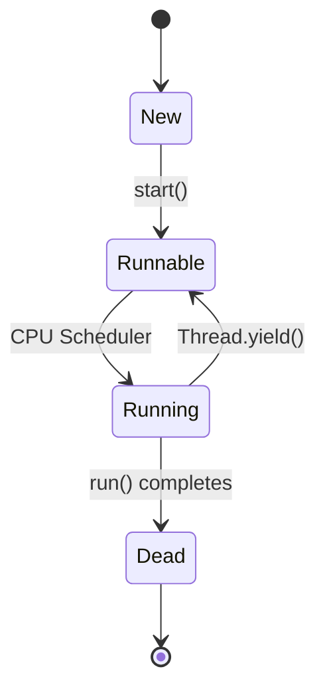
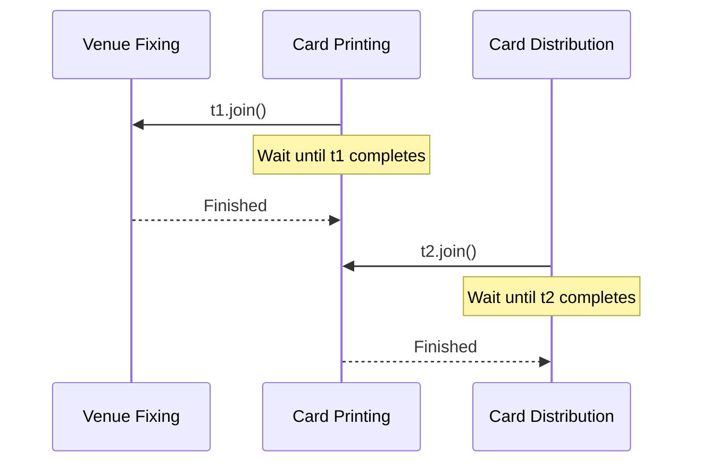
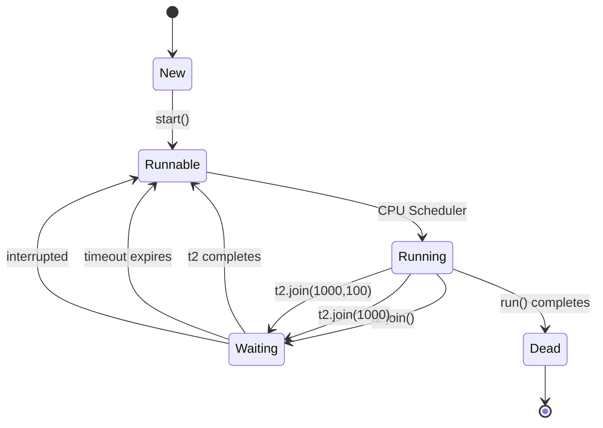
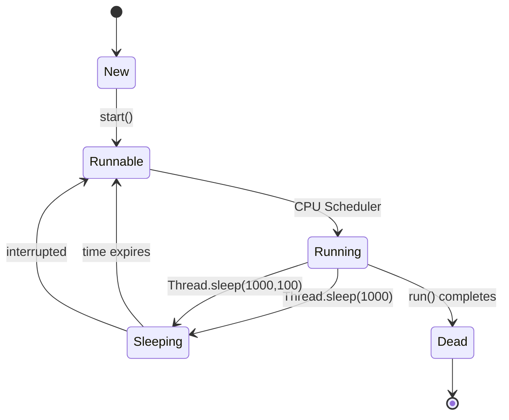

## 🧵 What Is a Thread

---

## 🗺️ The Full Map

```
What Is a Thread
│
├── Definition
│   └── Smallest unit of execution within a process
│
├── Thread vs Process
│   ├── Process → isolated memory space
│   └── Thread  → shared memory within process
│
├── Why Threads
│   ├── Concurrency — multiple tasks progress simultaneously
│   ├── Parallelism — multiple tasks run at same instant (multi-core)
│   └── Responsiveness — UI stays alive while background work runs
│
├── JVM Thread Model
│   ├── Every Java program has at least one thread (main)
│   ├── JVM maps Java threads → OS threads (1:1 in HotSpot)
│   └── OS scheduler decides which thread runs when
│
└── Thread Components
    ├── Program counter — current instruction
    ├── Stack           — method frames
    ├── Registers       — CPU state
    └── Shared heap     — objects shared with all threads
```

---

## 🔬 What a Thread Is

```
Program (single-threaded):
  instructions execute ONE at a time
  task A must finish before task B starts

Thread:
  independent path of execution within a program
  multiple threads = multiple paths executing concurrently
  all threads share the same heap (objects)
  each thread has its OWN stack, program counter, registers
```

```java
// Every Java program starts with one thread — "main"
public class Main {
    public static void main(String[] args) {

        // This line runs on the "main" thread
        System.out.println("Thread: " + Thread.currentThread().getName());
        // Output: Thread: main

        System.out.println("Thread ID: " + Thread.currentThread().getId());
        System.out.println("Priority:  " + Thread.currentThread().getPriority());
        System.out.println("Daemon:    " + Thread.currentThread().isDaemon());
    }
}
```

---

## 🔬 Thread vs Process

```
Process:
  ├── Own memory space (virtual address space)
  ├── Own heap, stack, code, data segments
  ├── Isolated — cannot directly access another process's memory
  ├── Communication: IPC (pipes, sockets, shared memory)
  └── Creation: expensive (OS allocates new memory space)

Thread:
  ├── Lives INSIDE a process
  ├── Shares process heap — all threads see same objects
  ├── Own stack, program counter, registers (per thread)
  ├── Communication: shared memory (same heap) — fast but risky
  └── Creation: cheaper than process (shares existing memory)
```

```
JVM Process memory layout:

┌─────────────────────────────────────────────────────┐
│                  JVM Process                        │
│                                                     │
│  ┌──────────────────────────────────────────────┐   │
│  │              Shared Heap                     │   │
│  │  Objects, arrays, class instances            │   │
│  │  ALL threads read/write here                 │   │
│  └──────────────────────────────────────────────┘   │
│                                                     │
│  ┌────────────┐  ┌────────────┐  ┌────────────┐    │
│  │  Thread 1  │  │  Thread 2  │  │  Thread 3  │    │
│  │  ┌──────┐  │  │  ┌──────┐  │  │  ┌──────┐  │    │
│  │  │Stack │  │  │  │Stack │  │  │  │Stack │  │    │
│  │  │  PC  │  │  │  │  PC  │  │  │  │  PC  │  │    │
│  │  │ Regs │  │  │  │ Regs │  │  │  │ Regs │  │    │
│  │  └──────┘  │  │  └──────┘  │  │  └──────┘  │    │
│  └────────────┘  └────────────┘  └────────────┘    │
└─────────────────────────────────────────────────────┘
```

---

## 🔬 Concurrency vs Parallelism

```
Concurrency:
  Multiple tasks making PROGRESS in overlapping time periods
  Does NOT require multiple CPU cores
  Single core: OS rapidly switches between threads (context switch)
  Appearance of simultaneous execution

Parallelism:
  Multiple tasks executing at the EXACT same instant
  Requires multiple CPU cores
  True simultaneous execution

Single core — concurrency only:
  Time →
  Core: [Thread1][Thread2][Thread1][Thread3][Thread2][Thread1]
  Thread1 and Thread2 INTERLEAVE — not truly parallel

Multi-core — parallelism:
  Time →
  Core1: [Thread1][Thread1][Thread1]
  Core2: [Thread2][Thread2][Thread2]
  Thread1 and Thread2 run SIMULTANEOUSLY
```

```java
// Concurrency — two tasks progress together
public class ConcurrencyDemo {
    public static void main(String[] args) {

        Thread downloader = new Thread(() -> {
            for (int i = 1; i <= 5; i++) {
                System.out.println("Downloading chunk " + i);
                sleep(100);
            }
        }, "downloader");

        Thread uploader = new Thread(() -> {
            for (int i = 1; i <= 5; i++) {
                System.out.println("Uploading chunk " + i);
                sleep(150);
            }
        }, "uploader");

        downloader.start();     // both progress concurrently
        uploader.start();       // not waiting for each other
    }
}
// Output (interleaved — order non-deterministic):
// Downloading chunk 1
// Uploading chunk 1
// Downloading chunk 2
// Downloading chunk 3
// Uploading chunk 2
// ...
```

---

## 🔬 JVM Thread Model

```
Java Thread → OS Thread mapping (HotSpot JVM):

Java Thread
    │
    ▼
java.lang.Thread (Java object on heap)
    │
    ▼
OS Thread (kernel thread)
    │
    ▼
CPU core (scheduled by OS)

Ratio: 1 Java thread = 1 OS thread (platform threads)
Java 21+: Virtual threads — M Java threads : N OS threads
          (Project Loom — covered in Advanced section)
```

```java
// JVM starts these threads automatically:
// (visible via: jstack <pid> or VisualVM)

// main          — runs main() method
// Reference Handler — processes reference queue (GC)
// Finalizer     — runs finalizers (deprecated)
// Signal Dispatcher — handles OS signals
// Common-Cleaner — Java 9+ Cleaner API
// Monitor Ctrl-Break — IDE debugging support
// GC threads    — garbage collection (multiple)
```

---

## 🔄 Thread Lifecycle in Java

---

## 🗺️ The Full Map

```
Thread Lifecycle
│
├── States (java.lang.Thread.State)
│   ├── NEW
│   ├── RUNNABLE
│   ├── BLOCKED
│   ├── WAITING
│   ├── TIMED_WAITING
│   └── TERMINATED
│
├── Transitions
│   ├── NEW → RUNNABLE          via start()
│   ├── RUNNABLE → BLOCKED      via monitor lock contention
│   ├── RUNNABLE → WAITING      via wait(), join(), park()
│   ├── RUNNABLE → TIMED_WAITING via sleep(), wait(t), join(t)
│   ├── BLOCKED → RUNNABLE      via lock acquired
│   ├── WAITING → RUNNABLE      via notify(), interrupt()
│   └── Any → TERMINATED        via run() completes or exception
│
└── OS vs JVM States
    ├── RUNNABLE = OS ready + OS running (JVM doesn't distinguish)
    └── BLOCKED/WAITING = OS blocked (different reasons)
```

---

## 🔬 All 6 States

```
┌─────────────────────────────────────────────────────────────────┐
│  java.lang.Thread.State  (Java 5+)                             │
├──────────────────┬──────────────────────────────────────────────┤
│ NEW              │ Thread created — start() NOT yet called      │
│ RUNNABLE         │ Running OR ready to run (OS decides)         │
│ BLOCKED          │ Waiting to acquire a monitor lock            │
│ WAITING          │ Waiting indefinitely — needs notification    │
│ TIMED_WAITING    │ Waiting for specified time                   │
│ TERMINATED       │ run() completed — thread dead                │
└──────────────────┴──────────────────────────────────────────────┘
```

---

## 🔬 State Transition Diagram

```
                    ┌─────────────────────────────────────────┐
                    │                                         │
          start()   │    OS schedules    lock acquired        │
   NEW ──────────► RUNNABLE ◄────────── BLOCKED               │
                    │  │                  ▲                   │
                    │  │ synchronized     │ contention        │
                    │  └──────────────────┘                   │
                    │                                         │
                    │  wait()            notify()/notifyAll() │
                    ├──────────────────► WAITING ─────────────┤
                    │                                         │
                    │  sleep(n)          timeout expires      │
                    │  wait(n)           notify()             │
                    │  join(n)           interrupt()          │
                    ├──────────────────► TIMED_WAITING ───────┤
                    │                                         │
                    │  run() ends                             │
                    │  uncaught exception                     │
                    └──────────────────► TERMINATED           │
                                                              │
                    ◄─────────────────────────────────────────┘
                    (all non-RUNNABLE states return to RUNNABLE
                     when condition satisfied)
```

---

## 🔬 NEW State

```java
// Thread created — NOT started
// OS thread does NOT exist yet — just a Java object
Thread thread = new Thread(() -> {
    System.out.println("running");
}, "worker");

// State: NEW
System.out.println(thread.getState());  // NEW

// In NEW state:
// ✅ Can call: start(), getName(), setPriority(), setDaemon()
// ❌ Cannot call: start() twice — IllegalThreadStateException
// Thread object exists on heap — OS thread does NOT exist
```

---

## 🔬 RUNNABLE State

```java
thread.start();     // → creates OS thread → transitions to RUNNABLE

// RUNNABLE = either:
//   a) Actually running on CPU right now
//   b) Ready to run — waiting for CPU time (in OS ready queue)
// JVM cannot distinguish — both appear as RUNNABLE

System.out.println(thread.getState());  // RUNNABLE
// (if checked quickly enough — may already be TERMINATED)

// RUNNABLE thread can be preempted by OS at any time
// OS scheduler moves it from running → ready → running → ...
// Java has NO control over this
```

```
RUNNABLE substates (OS level — JVM cannot see):
  ┌─────────────┐    OS scheduler    ┌─────────────┐
  │  READY      │ ─────────────────► │  RUNNING    │
  │ (waiting    │                    │ (on CPU)    │
  │  for CPU)   │ ◄───────────────── │             │
  └─────────────┘  preemption/yield  └─────────────┘

Both appear as RUNNABLE in Thread.getState()
```

---

## 🔬 BLOCKED State

```java
// Waiting to acquire a monitor (synchronized) lock
// Another thread holds the lock — this thread waits

Object lock = new Object();

Thread t1 = new Thread(() -> {
    synchronized (lock) {
        System.out.println("T1 acquired lock");
        sleep(2000);                    // holds lock for 2 seconds
    }
}, "T1");

Thread t2 = new Thread(() -> {
    System.out.println("T2 trying to acquire lock");
    synchronized (lock) {              // T1 holds lock → T2 enters BLOCKED
        System.out.println("T2 acquired lock");
    }
}, "T2");

t1.start();
sleep(100);         // ensure T1 gets lock first
t2.start();
sleep(100);         // give T2 time to block

System.out.println("T2 state: " + t2.getState());  // BLOCKED
```

```
BLOCKED:
  ├── Caused by: synchronized keyword ONLY
  ├── NOT caused by: Lock.lock(), wait(), sleep()
  ├── OS: thread in BLOCKED state — not scheduled
  ├── Exits: when owning thread releases monitor → JVM picks waiter
  └── No interrupt: Thread.interrupt() does NOT unblock BLOCKED thread
                    (cannot interrupt a thread waiting for a monitor)
```

> 🔑 `Thread.interrupt()` does **NOT** unblock a BLOCKED thread. A thread waiting for a `synchronized` lock cannot be interrupted. Only `Lock.lockInterruptibly()` supports interruptible lock acquisition.

---

## 🔬 WAITING State

```java
// Waiting indefinitely — needs explicit notification to wake up

Object monitor = new Object();

Thread waiter = new Thread(() -> {
    synchronized (monitor) {
        try {
            System.out.println("waiter: going to WAITING");
            monitor.wait();                 // → WAITING (releases lock)
            System.out.println("waiter: notified — back to RUNNABLE");
        } catch (InterruptedException e) {
            Thread.currentThread().interrupt();
        }
    }
}, "waiter");

Thread notifier = new Thread(() -> {
    sleep(1000);
    synchronized (monitor) {
        System.out.println("notifier: sending notification");
        monitor.notify();                   // waiter → back to RUNNABLE
    }
}, "notifier");

waiter.start();
sleep(100);
notifier.start();
sleep(100);

System.out.println("waiter state: " + waiter.getState()); // WAITING
```

### What Causes WAITING

```
Method                  │ WAITING cause
────────────────────────┼──────────────────────────────────
Object.wait()           │ waiting for notify()/notifyAll()
Thread.join()           │ waiting for target thread to die
LockSupport.park()      │ waiting for LockSupport.unpark()
```

---

## 🔬 TIMED_WAITING State

```java
// Waiting for specified duration OR until notified/interrupted

Thread sleeper = new Thread(() -> {
    try {
        Thread.sleep(5000);     // TIMED_WAITING for 5 seconds
    } catch (InterruptedException e) {
        Thread.currentThread().interrupt();
    }
}, "sleeper");

sleeper.start();
sleep(100);
System.out.println(sleeper.getState());  // TIMED_WAITING
```

### What Causes TIMED_WAITING

```
Method                      │ Exits when
────────────────────────────┼──────────────────────────────────────
Thread.sleep(n)             │ timeout expires or interrupted
Object.wait(n)              │ timeout, notify(), or interrupted
Thread.join(n)              │ timeout or target thread dies
LockSupport.parkNanos(n)    │ timeout or unpark()
LockSupport.parkUntil(n)    │ deadline or unpark()
```

---

## 🔬 TERMINATED State

```java
// Thread finished execution — cannot be restarted
Thread t = new Thread(() -> {
    System.out.println("working...");
    // run() returns → TERMINATED
}, "worker");

t.start();
t.join();   // wait for t to finish

System.out.println(t.getState());   // TERMINATED
System.out.println(t.isAlive());    // false

// ❌ Cannot restart a terminated thread
t.start();  // IllegalThreadStateException: Thread already started
// Thread object still exists in heap — state is TERMINATED
// But OS thread is gone — resources released
```

---

## 🔬 Checking and Observing State

```java
public class ThreadStateObserver {

    public static void main(String[] args) throws InterruptedException {

        Object lock = new Object();

        Thread thread = new Thread(() -> {
            synchronized (lock) {
                try {
                    lock.wait(3000);
                } catch (InterruptedException e) {
                    Thread.currentThread().interrupt();
                }
            }
        }, "observed-thread");

        // NEW
        System.out.println("1: " + thread.getState());     // NEW

        thread.start();
        Thread.sleep(100);

        // WAITING (inside wait())
        System.out.println("2: " + thread.getState());     // WAITING

        synchronized (lock) {
            lock.notify();
        }
        Thread.sleep(100);

        // TERMINATED
        System.out.println("3: " + thread.getState());     // TERMINATED

        // isAlive() — convenience check
        System.out.println("alive: " + thread.isAlive());  // false
    }
}
```

---

## 🧵 Creating Threads in Java

---

## 🗺️ The Full Map

```
Creating Threads
│
├── 01 Extending Thread Class
│   └── class MyThread extends Thread { run() }
│
├── 02 Implementing Runnable
│   └── class MyTask implements Runnable { run() }
│
├── 03 Implementing Callable
│   └── class MyTask implements Callable<V> { call() }
│
├── 04 Thread Class Constructors
│   └── 8 constructors — name, group, runnable, stackSize
│
└── 05 Runnable vs Callable vs Thread
    └── comparison + when to use each
```

---

## 🔬 01 — Extending Thread Class

```java
// Approach: extend Thread, override run()
// Defining a Thread
public class DownloadThread extends Thread {

    private final String url;
    private final String destination;

    public DownloadThread(String url, String destination) {
        super("download-" + url.hashCode());    // set thread name via super
        this.url         = url;
        this.destination = destination;
    }

    // Job of a Thread is defined in run() method
    @Override
    public void run() {
        // This method executes in the new thread
        System.out.println("Downloading " + url
            + " on thread: " + Thread.currentThread().getName());
        try {
            download(url, destination);
        } catch (IOException e) {
            log.error("Download failed: {}", url, e);
        }
    }

    private void download(String url, String dest) throws IOException {
        // actual download logic
    }
}

// Instantiate and start
DownloadThread t = new DownloadThread(
    "https://files.example.com/data.csv", "/tmp/data.csv"
);
t.start();          // ✅ creates OS thread — calls run() in new thread
// t.run();         // ❌ wrong — runs on CURRENT thread, no new thread created
```

```
What start() does:
  1. Checks thread not already started (IllegalThreadStateException if yes)
  2. Registers thread with JVM thread group
  3. Creates OS-level thread
  4. OS thread calls run() in new thread context
  5. Thread transitions NEW → RUNNABLE

What run() directly does:
  Just a normal method call — no new thread
  Executes on the calling thread
  Defeats the entire purpose
```

> 🔑 Always call `start()` — never `run()` directly. `run()` is just a method. `start()` creates the actual OS thread and then calls `run()` in that new thread.

Case 1: Thread Scheduler:
1. If multiple Threads are waiting to execute then which Thread will execute 1st is decided by "Thread Scheduler" which is part of JVM.
2. Which algorithm or behavior followed by Thread Scheduler we can't expect exactly it is the JVM vendor dependent hence in multithreading examples we can't expect exact execution order and exact output.
3. The following are various possible outputs for the above program.
             p1                    p2                    p3
    ------------------    ------------------    ------------------
    |  main thread   |    |  child thread  |    |  main thread   |
    |  main thread   |    |  child thread  |    | child thread   |
    |  main thread   |    |  child thread  |    |  main thread   |
    |  main thread   |    |  child thread  |    | child thread   |
    |  main thread   |    |  child thread  |    |  main thread   |
    |----------------|    |----------------|    | child thread   |
    | child thread   |    |  main thread   |    |  main thread   |
    | child thread   |    |  main thread   |    | child thread   |
    | child thread   |    |  main thread   |    |  main thread   |
    | child thread   |    |  main thread   |    | child thread   |
    | child thread   |    |  main thread   |    |  main thread   |
    | child thread   |    |  main thread   |    | child thread   |
    | child thread   |    |  main thread   |    |  main thread   |
    | child thread   |    |  main thread   |    | child thread   |
    ------------------    ------------------    ------------------

Case 2: Difference between t.start() and t.run() methods.
1. In the case of t.start() a new Thread will be created which is responsible for the execution of run() method.
2. But in the case of t.run() no new Thread will be created and run() method will be executed just like a normal method by the main Thread.
3. In the above program if we are replacing t.start() with t.run() the following is the output.

Output:
child thread
child thread
child thread
child thread
child thread
child thread
child thread
child thread
child thread
child thread
main thread
main thread
main thread
main thread
main thread
Entire output produced by only main Thread.


Case 3: importance of Thread class start() method.
For every Thread the required mandatory activities like registering the Thread with Thread Scheduler will takes care by Thread class start() method and programmer is responsible just to define the job of the Thread inside run() method.

That is start() method acts as best assistant to the programmer.
Example:
start() \{
    1. Register Thread with Thread Scheduler
    2. All other mandatory low level activities.
    3. Invoke or calling run() method.
\}
We can conclude that without executing Thread class start() method there is no chance
of starting a new Thread in java. Due to this start() is considered as heart of
multithreading.

Case 4: If we are not overriding run() method:
If we are not overriding run() method then Thread class run() method will be executed which has empty implementation and hence we won't get any output.
Example:
class MyThread extends Thread \{\}
class ThreadDemo \{
    public static void main(String[] args) \{
        MyThread t=new MyThread();
        t.start();
    \}
\}

It is highly recommended to override run() method. Otherwise don't go for
multithreading concept.

Case 5: Overloding of run() method.
We can overload run() method but Thread class start() method always invokes no
argument run() method the other overload run() methods we have to call explicitly then
only it will be executed just like normal method.
Example:
class MyThread extends Thread \{
    public void run() \{
        System.out.println("no arg method");
    \}
    public void run(int i) \{
        System.out.println("int arg method");
    \}
\}

class ThreadDemo \{
    public static void main(String[] args) \{
        MyThread t=new MyThread();
        t.start();
    \}
\}
Output:
No arg method

Case 6: overriding of start() method:
If we override start() method then our start() method will be executed just like a normal method call and no new Thread will be started.
Example:
class MyThread extends Thread \{
    public void start() \{
        System.out.println("start method");
    \}
    public void run() \{
        System.out.println("run method");
    \}
\}
class ThreadDemo \{
    public static void main(String[] args) \{
        MyThread t=new MyThread();
        t.start();
        System.out.println("main method");
    \}
\}

Output:
start method
main method
Entire output produced by only main Thread.

Example  2:
class MyThread extends Thread \{
    public void start() \{
        super.start();  // call Thread's start() to create new thread
        System.out.println("start method");
    \}
    public void run() \{
        System.out.println("run method");
    \}
\}
class ThreadDemo \{
    public static void main(String[] args) \{
        MyThread t=new MyThread();
        t.start();
        System.out.println("main method");
    \}
\}

Output:
|
|----main Thread
|        |
|        |---- start method
|        |---- main method
|----child Thread
            |
            |---- start method
            |---- main method
Entire output produced by main and child Thread.

Note : It is never recommended to override start() method. 

Case 7:
After starting a Thread we are not allowed to restart the same Thread once again otherwise we will get runtime exception saying "IllegalThreadStateException".
Example:
MyThread t=new MyThread();
t.start();//valid
;;;;;;;;
t.start();//we will get R.E saying: IllegalThreadStateException

---

## 🔬 02 — Implementing Runnable
We can define a Thread even by implementing Runnable interface also.Runnable interface present in java.lang.pkg and contains only one method run()

```java
1st Approach:
MyThread extends Thread
Thread implements Runnable

MyThread
    ↓ extends
Thread
    ↓ implements
Runnable


2nd Approach:
MyRunnable implements Runnable

MyRunnable
    ↓ implements
Runnable

// Approach: implement Runnable, pass to Thread constructor
// defining a Thread
public class DataProcessor implements Runnable {

    private final List<Record> records;
    private final ResultStore  store;

    public DataProcessor(List<Record> records, ResultStore store) {
        this.records = records;
        this.store   = store;
    }
    // Job of a Thread
    @Override
    public void run() {
        System.out.println("Processing on: "
            + Thread.currentThread().getName());
        for (Record record : records) {
            try {
                Result result = process(record);
                store.save(result);
            } catch (Exception e) {
                log.error("Failed to process record: {}", record.getId(), e);
            }
        }
    }

    private Result process(Record r) { ... }
}

// Three ways to use Runnable:

// Way 1 — separate class instance + Thread
DataProcessor processor = new DataProcessor(records, store);
Thread thread = new Thread(processor, "data-processor-1");
thread.start();

// Way 2 — anonymous class
Thread t = new Thread(new Runnable() {
    @Override
    public void run() {
        System.out.println("anonymous runnable");
    }
}, "anon-thread");
t.start();

// Way 3 — lambda (Runnable is @FunctionalInterface)
Thread t2 = new Thread(() -> {
    System.out.println("lambda runnable on: "
        + Thread.currentThread().getName());
}, "lambda-thread");
t2.start();


---------------------------------


public class MyRunnable implements Runnable {
    @Override
    public void run() {
        System.out.println("child Thread");
    }
}

class ThreadDemo {
    public static void main(String[] args) {
        MyRunnable r=new MyRunnable();
        Thread t=new Thread(r); //here r is a Target Runnable
        t.start();
        for(int i=0;i<10;i++) {
            System.out.println("main thread");
        }
    }
}

Output:
main thread
main thread
main thread
main thread
main thread
main thread
main thread
main thread
main thread
main thread
child Thread
child Thread
child Thread
child Thread
child Thread
child Thread
child Thread
child Thread
child Thread
child Thread
We can't expect exact output but there are several possible outputs. 

Case study:
MyRunnable r=new MyRunnable();
Thread t1=new Thread();
Thread t2=new Thread(r);

Case 1: t1.start():
A new Thread will be created which is responsible for the execution of Thread class run()method.
Output:
main thread
main thread
main thread
main thread
main thread

Case 2: t1.run():
No new Thread will be created but Thread class run() method will be executed just like a normal method call.
Output:
main thread
main thread
main thread
main thread
main thread

Case 3: t2.start():
New Thread will be created which is responsible for the execution of MyRunnable run() method.
Output:
main thread
main thread
main thread
main thread
main thread
child Thread
child Thread
child Thread
child Thread
child Thread

Case 4: t2.run():
No new Thread will be created and MyRunnable run() method will be executed just like a normal method call.
Output:
child Thread
child Thread
child Thread
child Thread
child Thread
main thread
main thread
main thread
main thread
main thread

Case 5: r.start():
We will get compile time error saying start()method is not available in MyRunnable class.
Output:
Compile time error
E:\SCJP>javac ThreadDemo.java
ThreadDemo.java:18: cannot find symbol
Symbol: method start()
Location: class MyRunnable

Case 6: r.run():
No new Thread will be created and MyRunnable class run() method will be executed just like a normal method call.
Output:
child Thread
child Thread
child Thread
child Thread
child Thread
main thread
main thread
main thread
main thread
main thread

In which of the above cases a new Thread will be created which is responsible for the execution of MyRunnable run() method ?
t2.start();

Q1. In which of the above cases a new Thread will be created ?
    t1.start();
    t2.start();
Q2. In which of the above cases MyRunnable class run() will be executed ?
    t2.start();
    t2.run();
    r.run();

Q3. What is the best approach to define a Thread?
Best approach to define a Thread:
1. Among the 2 ways of defining a Thread, implements Runnable approach is always recommended.
2. In the 1st approach our class should always extends Thread class there is no chance of extending any other class hence we are missing the benefits of inheritance.
3. But in the 2nd approach while implementing Runnable interface we can extend some other class also. Hence implements Runnable mechanism is recommended to define a Thread.
```

---

## 🔬 03 — Implementing Callable

```java
// Runnable: void run()    — no return, no checked exception
// Callable: V    call()   — returns value, can throw checked exception

public class ReportGenerator implements Callable<Report> {

    private final String   reportId;
    private final DataSource dataSource;

    public ReportGenerator(String reportId, DataSource dataSource) {
        this.reportId   = reportId;
        this.dataSource = dataSource;
    }

    @Override
    public Report call() throws Exception {
        // Can return a value
        // Can throw checked exceptions — unlike run()
        System.out.println("Generating report on: "
            + Thread.currentThread().getName());

        List<Record> data = dataSource.fetch(reportId);
        return Report.build(reportId, data);
    }
}

// Callable CANNOT be passed directly to Thread
// Must use ExecutorService + Future

ExecutorService executor = Executors.newFixedThreadPool(4);

// Submit callable — get Future back
Future<Report> future = executor.submit(new ReportGenerator("R-001", ds));

// ... do other work while report generates ...

// Get result — blocks until done
try {
    Report report = future.get();               // blocks
    System.out.println("Report ready: " + report.getId());
} catch (ExecutionException e) {
    Throwable cause = e.getCause();             // original exception from call()
    log.error("Report generation failed", cause);
} catch (InterruptedException e) {
    Thread.currentThread().interrupt();
    future.cancel(true);
}

executor.shutdown();
```

### Callable with Timeout

```java
// Don't wait forever — set timeout
try {
    Report report = future.get(30, TimeUnit.SECONDS);  // timeout
} catch (TimeoutException e) {
    future.cancel(true);    // cancel if too slow
    throw new ServiceException("Report generation timed out");
}
```

### Multiple Callables — invokeAll

```java
List<Callable<Report>> tasks = List.of(
    new ReportGenerator("R-001", ds),
    new ReportGenerator("R-002", ds),
    new ReportGenerator("R-003", ds)
);

// Execute all — wait for all to finish
List<Future<Report>> futures = executor.invokeAll(tasks);

// Collect results
List<Report> reports = new ArrayList<>();
for (Future<Report> f : futures) {
    try {
        reports.add(f.get());
    } catch (ExecutionException e) {
        log.error("One report failed", e.getCause());
    }
}
```

---

## 🔬 04 — Thread Class Constructors

```java
// All 8 Thread constructors:

// 1. No-arg — default name "Thread-N"
Thread t1 = new Thread();

// 2. Runnable — default name
Thread t2 = new Thread(Runnable runnable);

// 3. Name only — no runnable (run() does nothing unless overridden)
Thread t3 = new Thread(Staring name);

// 4. Runnable + name — most common form
Thread t4 = new Thread(runnable, "worker-1");

// 5. ThreadGroup + Runnable
ThreadGroup group = new ThreadGroup("io-threads");
Thread t5 = new Thread(ThreadGroup group, Runnable runnable);

// 6. ThreadGroup + Runnable + name
Thread t6 = new Thread(ThreadGroup group, Runnable runnable, "io-reader-1");

// 7. ThreadGroup + name
Thread t7 = new Thread(ThreadGroup group, "io-writer-1");

// 8. ThreadGroup + Runnable + name + stackSize
Thread t8 = new Thread(ThreadGroup group, Runnable runnable, "deep-recursion", 4 * 1024 * 1024);
//                                                          ↑ 4MB stack
```

### Stack Size Constructor — When and Why

```java
// Default stack size: 512KB – 1MB (JVM-dependent)
// Deep recursion / large local arrays → StackOverflowError

// Fix 1: increase via JVM flag (-Xss applies to ALL threads)
// java -Xss4m MyApp

// Fix 2: increase for specific thread only
Thread deepThread = new Thread(
    null,                   // no ThreadGroup
    () -> recurseDeep(0),
    "deep-recursion-thread",
    8 * 1024 * 1024         // 8MB stack for this thread only
);

// stackSize hint: JVM may ignore it — platform dependent
// HotSpot: honors it
// Some JVMs: silently ignore and use default
```

### Thread Naming — Production Importance

```java
// Name threads descriptively — visible in:
//   jstack output, thread dumps, debugger, VisualVM, monitoring tools

// ❌ Default names — useless in thread dumps
Thread t = new Thread(task);            // "Thread-0", "Thread-1" — meaningless

// ✅ Descriptive names — instantly identifiable
Thread t = new Thread(task, "payment-processor-stripe");
Thread t = new Thread(task, "order-fulfillment-worker-3");
Thread t = new Thread(task, "db-connection-health-check");

// Custom ThreadFactory for ExecutorService — name all pool threads
ThreadFactory namedFactory = new ThreadFactory() {
    private final AtomicInteger count = new AtomicInteger(1);

    @Override
    public Thread newThread(Runnable r) {
        Thread t = new Thread(r, "http-worker-" + count.getAndIncrement());
        t.setDaemon(true);          // don't block JVM shutdown
        t.setPriority(Thread.NORM_PRIORITY);
        return t;
    }
};

ExecutorService pool = Executors.newFixedThreadPool(10, namedFactory);
// Threads named: http-worker-1, http-worker-2, ..., http-worker-10
```

---

## 🔬 05 — Runnable vs Callable vs Thread

```
┌────────────────┬──────────────────────┬──────────────────────┬──────────────────────┐
│ Aspect         │ Thread               │ Runnable             │ Callable<V>          │
├────────────────┼──────────────────────┼──────────────────────┼──────────────────────┤
│ Package        │ java.lang            │ java.lang            │ java.util.concurrent │
│ Method         │ run()                │ run()                │ call()               │
│ Return value   │ void                 │ void                 │ V (generic type)     │
│ Checked except │ ❌ cannot declare    │ ❌ cannot declare    │ ✅ throws Exception  │
│ Use with Thread│ IS a Thread          │ ✅ passed to Thread  │ ❌ needs Executor    │
│ Use with Pool  │ ❌ awkward           │ ✅ executor.execute()│ ✅ executor.submit() │
│ Result access  │ N/A                  │ N/A                  │ Future.get()         │
│ Inheritance    │ extends Thread       │ implements only      │ implements only      │
│ Composition    │ ❌ can't extend more │ ✅ free to extend    │ ✅ free to extend    │
│ Lambda         │ ❌ not functional    │ ✅ @FunctionalInterface│ ✅ @FunctionalInterface│
└────────────────┴──────────────────────┴──────────────────────┴──────────────────────┘
```

### When to Use Each

```
Use Thread (extending):
  ├── When you need to override Thread behavior (rare)
  ├── Thread-specific operations: getName(), interrupt() on self
  └── AVOID — violates composition over inheritance

Use Runnable:
  ├── Fire-and-forget tasks — no result needed
  ├── With ExecutorService.execute()
  ├── When task needs to extend another class
  └── Lambda: () -> doWork()

Use Callable<V>:
  ├── Task must RETURN a value
  ├── Task may throw CHECKED exceptions
  ├── With ExecutorService.submit() → Future<V>
  └── Lambda: () -> computeResult()
```

---

## 💻 Real-World Code — Parallel Report Pipeline

```java
public class ReportPipeline {

    private final ExecutorService executor;
    private final DataSource      dataSource;

    public ReportPipeline(DataSource dataSource) {
        this.dataSource = dataSource;
        this.executor   = Executors.newFixedThreadPool(
            Runtime.getRuntime().availableProcessors(),
            r -> {
                Thread t = new Thread(r, "report-worker-"
                    + threadCounter.incrementAndGet());
                t.setDaemon(true);
                return t;
            }
        );
    }

    private final AtomicInteger threadCounter = new AtomicInteger();

    // Runnable — no result needed — just trigger generation
    public void triggerAsync(String reportId) {
        executor.execute(() -> {                    // Runnable via lambda
            try {
                generateAndStore(reportId);
            } catch (Exception e) {
                log.error("Report {} failed", reportId, e);
            }
        });
    }

    // Callable — result needed — return Future
    public Future<ReportSummary> generateAsync(String reportId) {
        return executor.submit(() -> {              // Callable via lambda
            List<Record> data = dataSource.fetch(reportId);
            Report report = Report.build(reportId, data);
            return report.getSummary();
        });
    }

    // Parallel generation — multiple reports concurrently
    public List<ReportSummary> generateAll(List<String> reportIds)
            throws InterruptedException {

        // Create Callable for each report
        List<Callable<ReportSummary>> tasks = reportIds.stream()
            .map(id -> (Callable<ReportSummary>) () -> {
                List<Record> data = dataSource.fetch(id);
                return Report.build(id, data).getSummary();
            })
            .collect(Collectors.toList());

        // Execute all — wait max 60 seconds
        List<Future<ReportSummary>> futures =
            executor.invokeAll(tasks, 60, TimeUnit.SECONDS);

        // Collect results — handle individual failures
        List<ReportSummary> results = new ArrayList<>();
        for (int i = 0; i < futures.size(); i++) {
            Future<ReportSummary> f = futures.get(i);
            String reportId = reportIds.get(i);
            try {
                if (f.isCancelled()) {
                    log.warn("Report {} timed out", reportId);
                } else {
                    results.add(f.get());
                }
            } catch (ExecutionException e) {
                log.error("Report {} failed: {}", reportId, e.getCause().getMessage());
            }
        }
        return results;
    }

    public void shutdown() {
        executor.shutdown();
        try {
            if (!executor.awaitTermination(30, TimeUnit.SECONDS)) {
                executor.shutdownNow();
            }
        } catch (InterruptedException e) {
            executor.shutdownNow();
            Thread.currentThread().interrupt();
        }
    }
}
```

🔴 **What breaks if done wrong:** Using `Runnable` where result is needed → store result in shared field → race condition → wrong report returned to wrong caller → data leak across tenants.

---

## 💣 Interview Traps

**🪤 Trap 1 — Calling `run()` instead of `start()`**

```java
Thread t = new Thread(() -> {
    System.out.println("Thread: " + Thread.currentThread().getName());
});

t.run();    // ❌ — prints "Thread: main" — runs on current thread
t.start();  // ✅ — prints "Thread: Thread-0" — runs on new thread

// run() is just a method — no OS thread created
// Compiles fine — logic error only — no compiler warning
```

---

**🪤 Trap 2 — Starting thread twice**

```java
Thread t = new Thread(() -> System.out.println("hello"));
t.start();
t.start();  // ❌ IllegalThreadStateException
            // Thread already started — cannot restart
            // Even after TERMINATED — cannot restart
            // Must create new Thread object
```

---

**🪤 Trap 3 — Callable exception wrapped in ExecutionException**

```java
Callable<String> task = () -> {
    throw new IOException("connection refused");
};

Future<String> future = executor.submit(task);

try {
    future.get();
} catch (ExecutionException e) {
    // e is NOT IOException
    // e.getCause() IS IOException
    Throwable cause = e.getCause();             // ← real exception here
    if (cause instanceof IOException ioe) {
        log.error("IO failure: {}", ioe.getMessage());
    }

    // ❌ Common mistake:
    // catch (IOException e) — NEVER fires
    // ExecutionException wraps everything
}
```

---

**🪤 Trap 4 — Extending Thread prevents extending another class**

```java
// Already extending BaseService
public class ReportService extends BaseService {
    // ...
}

// ❌ Cannot also extend Thread — Java single inheritance
public class ReportService extends BaseService, Thread { } // compile error

// ✅ Solution: implement Runnable — free to extend anything
public class ReportService extends BaseService implements Runnable {
    @Override
    public void run() { generateReport(); }
}

Thread t = new Thread(new ReportService());
t.start();
```

---

**🪤 Trap 5 — `future.get()` blocks indefinitely without timeout**

```java
Future<Report> future = executor.submit(reportTask);

// ❌ Blocks forever if task hangs (DB deadlock, infinite loop)
Report report = future.get();

// ✅ Always use timeout in production
try {
    Report report = future.get(30, TimeUnit.SECONDS);
} catch (TimeoutException e) {
    future.cancel(true);        // interrupt the task
    throw new ServiceException("Report generation timed out");
} catch (CancellationException e) {
    log.warn("Task was cancelled");
}
```

---

## 🔩 DSA / Internals Connection

**Underlying primitive: `start0()` native method + OS thread creation**

```
Thread.start() internals (HotSpot):

  Java:  thread.start()
           │
           ▼
  Thread.start() — checks state, registers with ThreadGroup
           │
           ▼
  start0() — native method (JNI)
           │
           ▼
  OS: pthread_create() (Linux) / CreateThread() (Windows)
           │
           ▼
  OS allocates: stack memory (~1MB default)
                TCB (Thread Control Block)
                Registers
           │
           ▼
  OS thread runs: JVM trampoline function
           │
           ▼
  JVM: calls thread.run()
       (or runnable.run() if Runnable passed)

Runnable vs Thread in bytecode:
  Both compile to same invokevirtual run() call
  Difference: Thread.run() calls target.run() if target != null:
    public void run() {
        if (target != null) {
            target.run();   // delegates to Runnable
        }
    }
  Extending Thread overrides this run() directly

Callable + Future internals:
  executor.submit(callable) →
    FutureTask<V> wraps callable
    FutureTask implements Runnable
    FutureTask.run() calls callable.call()
    stores result in internal state field
    Future.get() reads state field (blocks if not done)
```

---

## 💻 Real-World Code — Thread Pool State Monitor

```java
// Production monitoring — detect stuck/deadlocked threads
public class ThreadHealthMonitor {

    private final ScheduledExecutorService scheduler;

    public ThreadHealthMonitor() {
        this.scheduler = Executors.newSingleThreadScheduledExecutor(r -> {
            Thread t = new Thread(r, "thread-health-monitor");
            t.setDaemon(true);
            return t;
        });
    }

    public void start() {
        scheduler.scheduleAtFixedRate(
            this::checkThreadHealth, 30, 30, TimeUnit.SECONDS
        );
    }

    private void checkThreadHealth() {
        ThreadMXBean bean = ManagementFactory.getThreadMXBean();

        // Detect deadlocked threads
        long[] deadlocked = bean.findDeadlockedThreads();
        if (deadlocked != null) {
            ThreadInfo[] info = bean.getThreadInfo(deadlocked);
            for (ThreadInfo ti : info) {
                log.error("DEADLOCK DETECTED: thread={} state={} blockedOn={}",
                    ti.getThreadName(),
                    ti.getThreadState(),
                    ti.getLockName()
                );
            }
            alerting.page("DEADLOCK", "Deadlocked threads: " + deadlocked.length);
        }

        // Count threads by state
        Map<Thread.State, Long> stateCounts = Thread.getAllStackTraces()
            .keySet()
            .stream()
            .collect(Collectors.groupingBy(Thread::getState, Collectors.counting()));

        stateCounts.forEach((state, count) ->
            metrics.gauge("threads.state." + state.name().toLowerCase(), count)
        );

        // Alert if too many BLOCKED threads — possible contention
        long blocked = stateCounts.getOrDefault(Thread.State.BLOCKED, 0L);
        if (blocked > 50) {
            log.warn("High thread contention: {} BLOCKED threads", blocked);
            alerting.warn("THREAD_CONTENTION", "Blocked threads: " + blocked);
        }

        // Alert if too many WAITING threads — possible deadlock risk
        long waiting = stateCounts.getOrDefault(Thread.State.WAITING, 0L);
        if (waiting > 100) {
            log.warn("Many WAITING threads: {}", waiting);
        }
    }
}
```

🔴 **What breaks if done wrong:** No thread state monitoring → deadlock in prod → all request threads BLOCKED → service stops responding → only symptom is timeout → root cause (deadlock) not detected → engineers restart service → deadlock recurs → P0 incident.

---

## 💣 Interview Traps

**🪤 Trap 1 — RUNNABLE does not mean actually running**

```java
Thread t = new Thread(() -> {
    while (true) { }    // busy loop
});
t.start();

System.out.println(t.getState());   // RUNNABLE
// But: single-core machine — t may not be ON CPU right now
// OS may have preempted t — it's in ready queue
// Still RUNNABLE from JVM perspective
// JVM cannot distinguish running vs ready
```

---

**🪤 Trap 2 — `interrupt()` does not stop BLOCKED thread**

```java
Object lock = new Object();
Thread t = new Thread(() -> {
    synchronized (lock) {   // waiting for lock → BLOCKED
        System.out.println("got lock");
    }
});

// Hold lock so t gets BLOCKED
synchronized (lock) {
    t.start();
    Thread.sleep(100);              // t is now BLOCKED
    t.interrupt();                  // ← does NOTHING to BLOCKED thread
    System.out.println(t.getState()); // still BLOCKED
}
// t unblocks only when lock released — not from interrupt
```

---

**🪤 Trap 3 — `wait()` must be called inside synchronized — otherwise ISE**

```java
Object obj = new Object();
Thread t = new Thread(() -> {
    try {
        obj.wait();         // ❌ IllegalMonitorStateException
        // wait() must be called while holding obj's monitor
    } catch (InterruptedException e) { }
});

// Fix:
Thread t2 = new Thread(() -> {
    synchronized (obj) {    // acquire monitor first
        try {
            obj.wait();     // ✅ releases monitor + enters WAITING
        } catch (InterruptedException e) {
            Thread.currentThread().interrupt();
        }
    }
});
```

---

**🪤 Trap 4 — Thread state after interrupt from WAITING/TIMED_WAITING**

```java
Thread t = new Thread(() -> {
    try {
        Thread.sleep(10000);        // TIMED_WAITING
    } catch (InterruptedException e) {
        // interrupted → exception thrown → state = RUNNABLE
        System.out.println("interrupted, state: "
            + Thread.currentThread().getState()); // RUNNABLE
        // interrupt flag CLEARED by InterruptedException
        Thread.currentThread().interrupt();       // restore flag
    }
});

t.start();
Thread.sleep(100);
System.out.println("before interrupt: " + t.getState()); // TIMED_WAITING
t.interrupt();
Thread.sleep(100);
System.out.println("after interrupt:  " + t.getState()); // TERMINATED
```

---

**🪤 Trap 5 — `join()` on already-TERMINATED thread returns immediately**

```java
Thread t = new Thread(() -> System.out.println("done"));
t.start();
t.join();   // wait for t

// t is now TERMINATED
t.join();   // ✅ returns IMMEDIATELY — no blocking
            // join() on TERMINATED thread → immediate return
            // not documented prominently — surprises devs

System.out.println(t.getState());  // TERMINATED
```

---

## 🔩 DSA / Internals Connection

**Underlying primitive: Monitor + condition queue + OS thread states**

```
JVM Thread State → OS Thread State mapping:

JVM: NEW          → No OS thread (just Java object)
JVM: RUNNABLE     → OS: RUNNING or READY (in run queue)
JVM: BLOCKED      → OS: BLOCKED (waiting for mutex)
JVM: WAITING      → OS: BLOCKED (waiting on condition variable)
JVM: TIMED_WAITING→ OS: BLOCKED (sleeping or timed condition wait)
JVM: TERMINATED   → OS: thread exited, resources freed

Monitor internals (HotSpot):
  Every object has a monitor (in object header — mark word)
  Monitor contains:
    ├── Owner: thread currently holding lock (or null)
    ├── Entry list: BLOCKED threads waiting for lock
    └── Wait set: WAITING threads (called wait())

  synchronized(obj):
    → try to acquire obj's monitor
    → success: owner = currentThread, proceed
    → fail: add to entry list → BLOCKED

  obj.wait():
    → must own monitor
    → add to wait set → release monitor → WAITING
    → notified: move from wait set → entry list → BLOCKED (reacquire)

  obj.notify():
    → move one thread from wait set → entry list
    → that thread re-acquires monitor → RUNNABLE

State machine in bytecode:
  monitorenter → try acquire / BLOCKED
  monitorexit  → release / wake entry list
  invokevirtual wait() → release + wait set
  invokevirtual notify() → move to entry list
```

---

## 🔬 What Each Thread Owns

```
Per-thread (private — NOT shared):

  Program Counter (PC):
    Points to current bytecode instruction being executed
    Each thread has independent execution position
    Thread paused → PC saved, thread resumed → PC restored

  Stack:
    One stack frame per method call
    Contains: local variables, operand stack, return address
    Size: configurable via -Xss (default 512KB–1MB)
    Stack overflow → StackOverflowError

  Registers:
    CPU registers snapshot saved on context switch
    Restored when thread resumes

Shared (ALL threads access):

  Heap:
    All objects — instances, arrays
    Shared access → need synchronization for mutable state

  Metaspace:
    Class metadata, static fields
    Shared — class loaded once per ClassLoader

  Code Cache:
    JIT-compiled native code
    Shared — compiled once, executed by all threads
```

---

## 🔬 Why Use Threads

```
1. Responsiveness:
   Web server: thread per request → server never blocks on one client
   UI app: background thread → UI stays responsive during file load

2. Resource utilization:
   CPU bound task + IO bound task
   While IO task waits for disk → CPU task uses CPU
   Without threads: CPU idle during IO wait

3. Simplicity of modeling:
   Real world is concurrent — threads model it naturally
   Each user session = one thread
   Each connection = one thread

4. Performance (multi-core):
   Parallel computation across CPU cores
   4-core CPU: 4 threads = ~4x speedup (ideal)
```

```java
// Without threads — sequential — blocking
public class Sequential {
    public static void main(String[] args) throws Exception {
        long start = System.currentTimeMillis();

        fetchFromDB();      // 500ms — blocks everything
        fetchFromAPI();     // 300ms — waits for DB to finish
        fetchFromCache();   // 100ms — waits for API to finish

        // Total: ~900ms
        System.out.println("Time: " + (System.currentTimeMillis() - start));
    }
}

// With threads — concurrent — non-blocking
public class Concurrent {
    public static void main(String[] args) throws Exception {
        long start = System.currentTimeMillis();

        Thread t1 = new Thread(() -> fetchFromDB());    // 500ms
        Thread t2 = new Thread(() -> fetchFromAPI());   // 300ms
        Thread t3 = new Thread(() -> fetchFromCache()); // 100ms

        t1.start(); t2.start(); t3.start();
        t1.join();  t2.join();  t3.join();   // wait for all

        // Total: ~500ms (longest task)
        System.out.println("Time: " + (System.currentTimeMillis() - start));
    }
}
```

---

## 🔬 Thread Overhead and Cost

```
Thread creation cost:
  ├── OS thread allocation (~1MB stack by default)
  ├── JVM Thread object on heap
  ├── OS scheduler registration
  └── ~microseconds to milliseconds depending on OS

Context switch cost:
  ├── Save current thread's registers + PC
  ├── Load next thread's registers + PC
  ├── CPU cache invalidation (thread's working set evicted)
  └── ~1–10 microseconds per switch

Too many threads → problems:
  ├── Memory: 1000 threads × 1MB stack = 1GB memory
  ├── Context switching overhead dominates CPU time
  ├── Diminishing returns past core count for CPU-bound work
  └── Solution: thread pools (Executor framework)
```

---

## 💻 Real-World Code — HTTP Server Thread Model

```java
// Each incoming HTTP request handled by a separate thread
public class SimpleHttpServer {

    private final ExecutorService threadPool;
    private final ServerSocket    serverSocket;

    public SimpleHttpServer(int port, int poolSize) throws IOException {
        this.serverSocket = new ServerSocket(port);
        this.threadPool   = Executors.newFixedThreadPool(poolSize);
        // Fixed pool — bounded threads — no OOM from too many requests
    }

    public void start() {
        System.out.println("Server started on port " + serverSocket.getLocalPort());
        System.out.println("Handling requests on thread: "
            + Thread.currentThread().getName());   // "main" thread

        while (!serverSocket.isClosed()) {
            try {
                Socket clientSocket = serverSocket.accept();
                // main thread: accept connections only
                // worker thread: handle each connection
                threadPool.submit(() -> handleRequest(clientSocket));
                // submitting work — returns immediately
                // main thread free to accept next connection
            } catch (IOException e) {
                if (!serverSocket.isClosed()) {
                    log.error("Accept failed", e);
                }
            }
        }
    }

    private void handleRequest(Socket socket) {
        String threadName = Thread.currentThread().getName();
        // "pool-1-thread-N" — worker thread
        System.out.println("Handling request on: " + threadName);

        try (socket) {
            // Read request, write response
            // This thread blocks during IO — other threads run
        } catch (IOException e) {
            log.error("Request handling failed", e);
        }
    }
}
```

🔴 **What breaks if done wrong:** One thread for all requests → any slow request (DB query, external API) blocks ALL incoming requests → server appears hung → all users affected by one slow client.

---

## 💣 Interview Traps

**🪤 Trap 1 — `Thread.currentThread()` vs `this` inside Thread subclass**

```java
class MyThread extends Thread {

    public void run() {
        // Inside Thread subclass:
        System.out.println(this.getName());              // ✅ — 'this' IS the thread
        System.out.println(Thread.currentThread().getName()); // ✅ — same result

        // But if run() is called directly (not via start()):
        // Thread t = new MyThread();
        // t.run();  ← called directly — runs on CALLER's thread
        // Thread.currentThread() = caller's thread (e.g., "main")
        // this.getName() = MyThread's name (different!)
    }
}
```

---

**🪤 Trap 2 — Threads share heap — local variables are safe, fields are not**

```java
class Counter {
    int count = 0;      // instance field — SHARED — not thread-safe
}

void threadSafe(int x) {
    int local = x * 2; // local variable — per-thread stack — safe
    // each thread has its own 'local' — no sharing
}

Counter counter = new Counter();

Thread t1 = new Thread(() -> counter.count++);
Thread t2 = new Thread(() -> counter.count++);
t1.start(); t2.start();
t1.join(); t2.join();

System.out.println(counter.count);  // 1 or 2 — race condition
                                    // expected 2, may get 1
```

---

**🪤 Trap 3 — Creating too many threads — OOM**

```java
// ❌ Prod anti-pattern — unbounded thread creation
for (int i = 0; i < 10_000; i++) {
    new Thread(() -> processRequest()).start();
    // 10,000 threads × 1MB stack = 10GB memory
    // OutOfMemoryError: unable to create native thread
}

// ✅ Thread pool — bounded
ExecutorService pool = Executors.newFixedThreadPool(100);
for (int i = 0; i < 10_000; i++) {
    pool.submit(() -> processRequest());
    // 100 threads reused for 10,000 tasks
}
```

---

**🪤 Trap 4 — JVM exits when only daemon threads remain**

```java
Thread background = new Thread(() -> {
    while (true) {
        System.out.println("background running");
        sleep(100);
    }
});
background.setDaemon(true);     // daemon — JVM won't wait for it
background.start();

System.out.println("main done");
// main thread exits
// Only daemon thread left → JVM exits
// background thread killed mid-execution — no finally, no cleanup
```

---

## 🔩 DSA / Internals Connection

**Underlying primitive: OS scheduler + context switch + PCB (Process Control Block)**

```
OS Thread management:

Thread Control Block (TCB) — OS maintains per thread:
  ├── Thread ID
  ├── Program Counter
  ├── Register set
  ├── Stack pointer
  ├── State (running, ready, blocked, terminated)
  └── Priority

OS Scheduler — decides which thread runs:
  ├── Time-slicing: each thread gets a time quantum
  ├── Priority scheduling: higher priority runs first
  ├── Preemptive: OS can interrupt running thread
  └── Non-deterministic: order not guaranteed

Context switch:
  1. Timer interrupt fires (quantum expired)
  2. OS saves current thread's TCB
  3. OS picks next thread from ready queue
  4. OS loads next thread's TCB
  5. Resume execution at saved PC

Java Thread states map to OS states:
  NEW           → not yet submitted to OS
  RUNNABLE      → ready OR running (JVM doesn't distinguish)
  BLOCKED       → waiting for monitor lock
  WAITING       → wait(), join() with no timeout
  TIMED_WAITING → sleep(), join(timeout), wait(timeout)
  TERMINATED    → execution complete
```

---

## 🏷️ Thread Properties in Java

---

## 🗺️ The Full Map

```
Thread Properties
│
├── Thread Name
│   ├── Default: "Thread-N"
│   ├── Get: getName()
│   └── Set: setName() or constructor
│
├── Thread Priority
│   ├── Range: 1 (MIN) to 10 (MAX), default 5 (NORM)
│   ├── Get: getPriority()
│   └── Set: setPriority()
│
├── Daemon Threads
│   ├── Daemon: background — JVM exits when only daemons left
│   ├── Non-daemon: foreground — JVM waits for completion
│   ├── Get: isDaemon()
│   └── Set: setDaemon() — BEFORE start()
│
└── Thread ID and State
    ├── ID: unique long — getId() / threadId() Java 19+
    └── State: Thread.State enum — getState()
```

---

## 🔬 01 — Thread Name

### Getting and Setting

```java
// Default name — assigned by JVM sequentially
Thread t1 = new Thread(() -> {});
Thread t2 = new Thread(() -> {});
System.out.println(t1.getName());   // "Thread-0"
System.out.println(t2.getName());   // "Thread-1"

// Set name in constructor — preferred
Thread t3 = new Thread(() -> {}, "payment-processor");
System.out.println(t3.getName());   // "payment-processor"

// Set name via setName() — before or after start()
Thread t4 = new Thread(() -> {});
t4.setName("order-validator");
System.out.println(t4.getName());   // "order-validator"

// Get current thread name from inside thread
Thread worker = new Thread(() -> {
    String name = Thread.currentThread().getName();
    System.out.println("Running on: " + name);
}, "data-importer");
worker.start();
// Output: Running on: data-importer
```

### Naming Conventions in Production

```java
// Pattern: [service]-[role]-[instance]
"payment-processor-1"
"payment-processor-2"
"order-validator-main"
"db-connection-health"
"kafka-consumer-orders-3"
"http-worker-7"
"scheduler-daily-report"

// ThreadFactory — name all threads in a pool consistently
ThreadFactory factory = new ThreadFactory() {
    private final AtomicInteger counter = new AtomicInteger(1);
    private final String prefix;

    {   prefix = "api-worker"; }   // instance initializer

    @Override
    public Thread newThread(Runnable r) {
        Thread t = new Thread(r, prefix + "-" + counter.getAndIncrement());
        t.setDaemon(true);
        return t;
    }
};

ExecutorService pool = Executors.newFixedThreadPool(8, factory);
// Creates: api-worker-1, api-worker-2, ..., api-worker-8
```

### Why Naming Matters — Thread Dump Analysis

```
Thread dump (jstack output) with unnamed threads:
  "Thread-0" - waiting on lock
  "Thread-1" - runnable
  "Thread-2" - blocked
  → Impossible to diagnose

Thread dump with named threads:
  "payment-processor-1" - waiting on lock
  "order-validator-2" - runnable
  "db-health-checker" - blocked on jdbc-connection
  → Instantly see: DB health checker is blocking payment processor
```

---

## 🔬 02 — Thread Priority

### Priority Constants
> Every Thread in java has some priority it may be default priority generated by JVM (or) explicitly provided by the programmer.

```java
// The valid range of Thread priorities is 1 to 10[but not 0 to 10] where 1 is the least priority and 10 is highest priority.
// Three named constants in Thread class
Thread.MIN_PRIORITY   = 1   // lowest
Thread.NORM_PRIORITY  = 5   // default — all threads start here
Thread.MAX_PRIORITY   = 10  // highest

1. Thread scheduler uses these priorities while allocating CPU.
2. The Thread which is having highest priority will get chance for 1st execution.
3. If 2 Threads having the same priority then we can't expect exact execution order it depends on Thread scheduler whose behavior is vendor dependent.
4. The allowed values are 1 to 10 otherwise we will get runtime exception saying "IllegalArgumentException".
5. The default priority only for the main Thread is 5. But for all the remaining Threads the default priority will be inheriting from parent to child. That is whatever the priority parent has by default the same priority will be for the child also.

class MyThread extend Thread {}

class Test {
    public static void main(String[] args) {
        System.out.println(Thread.currentThread().getPriority()); // 5

        Thread.currentThread().setPriority(7);

        myThread t1 = new myThread();
        System.out.println(t.getPriority()); // 7
    }
}

Thread                  Main Thread
    ^                       ^
    |                       |
    |                       |
parent class            Parent Thread
    |                       |
    |                       |
            myThread
```

### Getting and Setting Priority

```java
Thread t = new Thread(() -> doWork(), "critical-task");

// Get priority
System.out.println(t.getPriority());    // 5 — NORM_PRIORITY (default)

// Set priority — BEFORE or AFTER start() (but before matters more)
t.setPriority(Thread.MAX_PRIORITY);     // 10
t.start();

// Range enforcement
t.setPriority(0);    // ❌ IllegalArgumentException — below MIN (1)
t.setPriority(11);   // ❌ IllegalArgumentException — above MAX (10)
t.setPriority(Thread.MIN_PRIORITY);     // ✅ 1
t.setPriority(Thread.MAX_PRIORITY);     // ✅ 10

// Child thread inherits parent's priority
Thread parent = new Thread(() -> {
    // parent priority = 8
    Thread child = new Thread(() -> {});
    System.out.println(child.getPriority()); // 8 — inherited from parent
});
parent.setPriority(8);
parent.start();
```

### Priority vs OS Scheduling

```
Java priority → OS priority mapping:

  Java 1–10    →    OS thread priority (OS-specific)

  Linux:   Java priority → nice value (-20 to +19)
           MAX_PRIORITY(10) → nice -4 (higher priority)
           NORM_PRIORITY(5) → nice 0  (normal)
           MIN_PRIORITY(1)  → nice +4 (lower priority)

  Windows: Maps directly to Win32 thread priority levels

  IMPORTANT:
  ├── Priority is a HINT to OS scheduler — not a guarantee
  ├── OS may ignore priority entirely
  ├── High priority thread does NOT starve low priority threads
  ├── No preemption guarantee — other threads still run
  └── Priority behavior varies across platforms — never rely on it
```

### Priority Use Cases

```java
// Background cleanup — low priority
Thread cleanup = new Thread(() -> {
    while (!Thread.currentThread().isInterrupted()) {
        cleanupExpiredCache();
        sleep(60_000);
    }
}, "cache-cleanup");
cleanup.setPriority(Thread.MIN_PRIORITY);   // 1 — run when CPU idle

// Critical payment processing — high priority
Thread payment = new Thread(() -> {
    processPayment(request);
}, "payment-critical");
payment.setPriority(Thread.MAX_PRIORITY);   // 10 — OS gives preference

// Normal background work
Thread worker = new Thread(() -> {
    processReport();
}, "report-worker");
// default NORM_PRIORITY — no explicit set needed
```

---

## 🔬 03 — Daemon Threads

### What Is a Daemon Thread

```
Non-Daemon (User) Thread:
  ├── Foreground thread
  ├── JVM waits for ALL non-daemon threads to finish
  ├── Default for threads you create
  └── Examples: main thread, HTTP request handlers

Daemon Thread:
  ├── Background service thread
  ├── JVM does NOT wait — exits when only daemons remain
  ├── Killed abruptly — no finally, no cleanup guarantee
  └── Examples: GC threads, JIT compiler, finalizer thread
```

### Getting and Setting

```java
// Check if daemon
Thread t = new Thread(() -> {});
System.out.println(t.isDaemon());   // false — non-daemon by default

// Main thread is always non-daemon
System.out.println(
    Thread.currentThread().isDaemon()   // false — main is always non-daemon
);

// Make daemon — MUST be set BEFORE start()
Thread background = new Thread(() -> {
    while (true) {
        heartbeat();
        sleep(5000);
    }
}, "heartbeat");
background.setDaemon(true);     // ✅ before start()
background.start();

// ❌ After start() — IllegalThreadStateException
Thread t2 = new Thread(() -> {});
t2.start();
t2.setDaemon(true);             // ❌ IllegalThreadStateException
```

### Daemon Thread JVM Exit Behavior

```java
public class DaemonDemo {
    public static void main(String[] args) throws InterruptedException {

        Thread daemon = new Thread(() -> {
            try {
                for (int i = 0; i < 10; i++) {
                    System.out.println("daemon: tick " + i);
                    Thread.sleep(500);
                }
            } catch (InterruptedException e) {
                System.out.println("daemon: interrupted");   // may not print
            } finally {
                System.out.println("daemon: finally");       // NOT guaranteed
            }
        }, "daemon-ticker");
        daemon.setDaemon(true);
        daemon.start();

        // Main thread — non-daemon
        Thread.sleep(1500);                 // let daemon run 3 ticks
        System.out.println("main: done");
        // main exits → only daemon left → JVM exits immediately
        // daemon killed mid-execution — finally may NOT run
    }
}
// Output:
// daemon: tick 0
// daemon: tick 1
// daemon: tick 2
// main: done
// (JVM exits — daemon killed — remaining ticks never print)
```

> 🔑 Daemon thread `finally` blocks are **NOT guaranteed to run**. When JVM exits, daemon threads are killed immediately. Never use daemon threads for tasks requiring cleanup (file close, DB commit, socket close).

### Child Inherits Daemon Status

```java
Thread nonDaemon = new Thread(() -> {
    // This thread is non-daemon (default)
    Thread child = new Thread(() -> {});
    System.out.println(child.isDaemon());   // false — inherited non-daemon

}, "parent");
nonDaemon.start();

Thread daemon = new Thread(() -> {
    // This thread is daemon
    Thread child = new Thread(() -> {});
    System.out.println(child.isDaemon());   // true — inherited daemon
});
daemon.setDaemon(true);
daemon.start();
```

### Daemon vs Non-Daemon — Production Patterns

```java
// ✅ Good daemon use cases:
// 1. Health check / heartbeat
Thread heartbeat = new Thread(() -> {
    while (!Thread.currentThread().isInterrupted()) {
        sendHeartbeat();
        sleep(30_000);
    }
}, "heartbeat");
heartbeat.setDaemon(true);   // don't block JVM shutdown
heartbeat.start();

// 2. Metrics reporter
Thread metricsReporter = new Thread(() -> {
    while (!Thread.currentThread().isInterrupted()) {
        flushMetrics();
        sleep(60_000);
    }
}, "metrics-reporter");
metricsReporter.setDaemon(true);
metricsReporter.start();

// 3. Cache eviction background task
Thread cacheEvictor = new Thread(() -> {
    while (!Thread.currentThread().isInterrupted()) {
        evictExpiredEntries();
        sleep(300_000);
    }
}, "cache-evictor");
cacheEvictor.setDaemon(true);
cacheEvictor.start();

// ❌ Bad daemon use cases:
// Anything that MUST complete — DB writes, file flush, payment processing
Thread payment = new Thread(() -> processPayment(request));
payment.setDaemon(true);    // ❌ if JVM exits mid-payment → data corruption
```

---

## 🔬 04 — Thread ID and State

### Thread ID

```java
Thread t1 = new Thread(() -> {}, "worker-1");
Thread t2 = new Thread(() -> {}, "worker-2");

// getId() — Java 1.5+
System.out.println(t1.getId());     // e.g., 12
System.out.println(t2.getId());     // e.g., 13

// threadId() — Java 19+ (getId() deprecated)
System.out.println(t1.threadId()); // same value — new API name

// ID properties:
// ├── Unique positive long — per JVM lifetime
// ├── Assigned at construction — not at start()
// ├── Sequential in HotSpot — but not guaranteed
// ├── Never reused — even after thread dies
// └── main thread: typically ID 1
```

```java
// Thread ID useful for logging — disambiguate same-named threads
public class RequestHandler implements Runnable {
    @Override
    public void run() {
        long tid = Thread.currentThread().threadId();
        String name = Thread.currentThread().getName();

        // Log with both name and ID — ID unique even if names same
        log.info("[{}-{}] Processing request", name, tid);
    }
}
```

### Thread State

```java
// Thread.State enum — 6 values
Thread t = new Thread(() -> {
    try { Thread.sleep(2000); }
    catch (InterruptedException e) { Thread.currentThread().interrupt(); }
});

System.out.println(t.getState());   // NEW

t.start();
Thread.sleep(100);

System.out.println(t.getState());   // TIMED_WAITING (inside sleep)

t.join();
System.out.println(t.getState());   // TERMINATED
```

### Combining All Properties — Thread Info Snapshot

```java
public class ThreadInfo {

    public static String snapshot(Thread t) {
        return String.format(
            "Thread[id=%d, name=%s, state=%s, priority=%d, daemon=%b, alive=%b]",
            t.threadId(),
            t.getName(),
            t.getState(),
            t.getPriority(),
            t.isDaemon(),
            t.isAlive()
        );
    }

    public static void printAll() {
        // Get all live threads
        Thread.getAllStackTraces()
              .keySet()
              .stream()
              .sorted(Comparator.comparingLong(Thread::threadId))
              .forEach(t -> System.out.println(snapshot(t)));
    }
}
```

---

## 💻 Real-World Code — Thread Manager

```java
public class ManagedThreadPool {

    private final List<Thread>     workers  = new CopyOnWriteArrayList<>();
    private final AtomicInteger    counter  = new AtomicInteger(1);
    private final String           poolName;
    private final int              priority;
    private final boolean          daemon;

    public ManagedThreadPool(String poolName, int priority, boolean daemon) {
        this.poolName = poolName;
        this.priority = priority;
        this.daemon   = daemon;
    }

    public Thread createWorker(Runnable task) {
        String name = poolName + "-worker-" + counter.getAndIncrement();

        Thread t = new Thread(task, name);
        t.setPriority(priority);
        t.setDaemon(daemon);

        // UncaughtExceptionHandler — catch thread death
        t.setUncaughtExceptionHandler((thread, ex) -> {
            log.error("Thread {} died unexpectedly: {}",
                thread.getName(), ex.getMessage(), ex);
            workers.remove(thread);
            metrics.increment("thread.unexpected.death");
        });

        workers.add(t);
        return t;
    }

    public void startAll() {
        workers.forEach(Thread::start);
    }

    public Map<String, Thread.State> getStatus() {
        return workers.stream()
            .collect(Collectors.toMap(
                Thread::getName,
                Thread::getState
            ));
    }

    public void interruptAll() {
        workers.forEach(Thread::interrupt);
    }

    public long countByState(Thread.State state) {
        return workers.stream()
            .filter(t -> t.getState() == state)
            .count();
    }

    public void logDiagnostics() {
        log.info("=== Thread Pool: {} ===", poolName);
        workers.forEach(t ->
            log.info("  {} [id={} state={} priority={} daemon={}]",
                t.getName(), t.threadId(), t.getState(),
                t.getPriority(), t.isDaemon())
        );
        log.info("  RUNNABLE:      {}", countByState(Thread.State.RUNNABLE));
        log.info("  BLOCKED:       {}", countByState(Thread.State.BLOCKED));
        log.info("  WAITING:       {}", countByState(Thread.State.WAITING));
        log.info("  TIMED_WAITING: {}", countByState(Thread.State.TIMED_WAITING));
        log.info("  TERMINATED:    {}", countByState(Thread.State.TERMINATED));
    }
}

// Usage
ManagedThreadPool ioPool = new ManagedThreadPool(
    "io-handler",
    Thread.NORM_PRIORITY,
    true            // daemon — IO threads shouldn't block shutdown
);

for (int i = 0; i < 5; i++) {
    ioPool.createWorker(() -> handleRequest());
}
ioPool.startAll();

// Periodic diagnostics
scheduler.scheduleAtFixedRate(
    ioPool::logDiagnostics, 30, 30, TimeUnit.SECONDS
);
```

🔴 **What breaks if done wrong:** Request handler threads set as daemon → in-flight requests killed when main thread exits → partial responses sent → data corruption → client retries → duplicate processing → financial inconsistency.

---

## 💣 Interview Traps

**🪤 Trap 1 — `setDaemon()` after `start()` — exception**

```java
Thread t = new Thread(() -> sleep(5000));
t.start();
t.setDaemon(true);  // ❌ IllegalThreadStateException
                    // Too late — thread already started
                    // setDaemon() only works BEFORE start()
```

---

**🪤 Trap 2 — Priority is a hint — not a guarantee**

```java
Thread low  = new Thread(() -> {
    for (long i = 0; i < Long.MAX_VALUE; i++) { }
    System.out.println("low done");
});
Thread high = new Thread(() -> {
    for (long i = 0; i < Long.MAX_VALUE; i++) { }
    System.out.println("high done");
});

low.setPriority(Thread.MIN_PRIORITY);   // 1
high.setPriority(Thread.MAX_PRIORITY);  // 10

low.start();
high.start();

// Expected: high finishes first
// Actual: UNPREDICTABLE — OS may run both equally
// On Linux: priority difference is small — both run concurrently
// Never write correctness-critical code based on priority order
```

---

**🪤 Trap 3 — Daemon thread `finally` not guaranteed**

```java
Thread daemon = new Thread(() -> {
    try {
        processData();
    } finally {
        closeResources();   // ❌ NOT guaranteed if JVM exits
        commitTransaction();// ❌ may never run
    }
});
daemon.setDaemon(true);
daemon.start();

// If main thread exits quickly:
// JVM exits → daemon killed → finally block: MAY NOT RUN
// Data not committed → corruption
// Resources not closed → OS-level leak

// Fix: use ShutdownHook for cleanup
Runtime.getRuntime().addShutdownHook(new Thread(() -> {
    closeResources();   // runs on JVM shutdown — more reliable
}));
```

---

**🪤 Trap 4 — Thread ID uniqueness scope**

```java
// IDs unique within ONE JVM lifetime
// Not unique across JVM restarts
// Not unique across different JVM processes

// Log thread ID for in-process debugging — fine
log.info("Thread {}: processing", Thread.currentThread().threadId());

// Don't use thread ID as distributed trace ID
// Process 1, Thread ID 12 ≠ Process 2, Thread ID 12 — same ID, different processes
// Use UUID or distributed trace frameworks (Sleuth, OpenTelemetry)
```

---

**🪤 Trap 5 — `getState()` snapshot — stale immediately**

```java
Thread t = new Thread(() -> {
    synchronized (lock) {
        // ...
    }
});
t.start();

Thread.State state = t.getState();  // snapshot
// By the time you read 'state' — thread may have changed state
// State observation is inherently racy
// Use for MONITORING and DIAGNOSTICS only
// NEVER use for correctness-critical synchronization logic

if (t.getState() == Thread.State.WAITING) {
    // Thread may no longer be WAITING by this line
    // Don't make decisions based on stale state
}
```

---

## 🔩 DSA / Internals Connection

**Underlying primitive: OS thread metadata + JVM Thread object fields**

```
Thread object fields (HotSpot JVM):

  java.lang.Thread:
    private volatile String  name;      // thread name
    private          int     priority;  // 1-10
    private          boolean daemon;    // daemon flag
    private volatile long    tid;       // thread ID (unique)
    private volatile int     threadStatus; // maps to Thread.State

  threadStatus values (native):
    0  → NEW
    4  → RUNNABLE
    1  → SLEEPING (TIMED_WAITING)
    2  → WAITING (in monitor wait set)
    32 → BLOCKED (waiting for monitor)
    16 → TERMINATED

Priority mapping (HotSpot):
  Thread priority → OS-level priority
  Linux (NPTL):
    All Java threads: SCHED_OTHER policy
    Priority 1-10 → nice values adjusted
    But SCHED_OTHER = fair scheduling — nice only a hint

Daemon implementation:
  boolean daemon field in Thread object
  JVM checks: are all non-daemon threads done?
    → Thread.allThreads() → filter non-daemon → empty?
    → yes → call System.exit(0)
  Check happens when any thread terminates

Thread.getAllStackTraces():
  Native call: gets all live threads
  Returns Map<Thread, StackTraceElement[]>
  Expensive: pauses threads briefly to capture stacks
  Use sparingly — not in hot paths
```

---

## ⏱️ Thread Scheduler in Java

---

## 🗺️ The Full Map

```
Thread Scheduler
│
├── What It Is
│   └── OS component that decides which thread runs on CPU
│
├── Scheduling Algorithms
│   ├── Preemptive Priority Scheduling
│   ├── Time-Slicing (Round Robin)
│   └── Combination (most modern OS)
│
├── Java's Relationship with Scheduler
│   ├── JVM delegates to OS — no control
│   ├── Priority hints only — not guarantees
│   └── Thread.yield() — hint to scheduler
│
├── Methods That Interact with Scheduler
│   ├── Thread.yield()
│   ├── Thread.sleep()
│   └── Thread.setPriority()
│
└── Key Guarantee
    └── NONE — Java spec says scheduling is undefined
```

---

## 🔬 Step 1 — What Thread Scheduler Does

```
Problem:
  Many threads (100s) want to run
  Few CPU cores (4, 8, 16)
  Who runs? When? For how long?

Thread Scheduler (OS kernel component):
  Decides: which RUNNABLE thread gets CPU time
  Decides: how long it runs (time quantum)
  Decides: when to preempt (interrupt) running thread
  Decides: which thread runs next after preemption
```

```
Scheduler view of threads:

RUNNABLE threads (ready queue):
  [payment-processor] [order-validator] [http-worker-1]
  [http-worker-2]     [db-health-check] [metrics-reporter]
         │
         ▼
    Scheduler picks ONE
         │
         ▼
    CPU executes it
         │
    Time quantum expires
    OR thread blocks (IO, lock, sleep)
    OR thread yields
         │
         ▼
    Thread returns to ready queue (if still RUNNABLE)
    Next thread selected
```

---

## 🔬 Step 2 — Scheduling Algorithms

### Preemptive Priority Scheduling

```
Each thread has priority (1–10 in Java)
Higher priority → scheduler PREFERS it
Lower priority thread preempted when higher arrives

Timeline:
  Priority 10: ████████████████████████████
  Priority  5:         ████    ████    ████
  Priority  1:                              █

High priority gets more CPU time
Low priority may starve (never get CPU)
```

### Time-Slicing (Round Robin)

```
Each thread gets fixed time quantum (~10–20ms)
When quantum expires → preempt → next thread
Fair — all threads get roughly equal CPU time

Timeline:
  Thread A: ████░░░░████░░░░████
  Thread B: ░░░░████░░░░████░░░░
  Thread C: Mixed in equally

No starvation — everyone gets turns
```

### Modern OS — Combination

```
Most OS (Linux, Windows) use BOTH:
  ├── Priority: higher priority → larger quantum or more frequent turns
  ├── Time-slicing: all get turns — no complete starvation
  ├── Aging: long-waiting low-priority thread gets boost
  └── Dynamic priority: adjusted based on behavior (IO-bound boosted)

Linux CFS (Completely Fair Scheduler):
  ├── Tracks "virtual runtime" per thread
  ├── Thread with least virtual runtime runs next
  ├── Priority (nice value) → runs slower/faster in virtual time
  └── Goal: all threads get proportional CPU share
```

---

## 🔬 Step 3 — Java's Guarantee — None

```java
// Java Language Specification:
// "The thread scheduler is implementation-dependent"
// "There is NO guarantee about scheduling order"
// "Priority is just a hint — may be ignored"

Thread t1 = new Thread(() -> System.out.println("T1"), "T1");
Thread t2 = new Thread(() -> System.out.println("T2"), "T2");
Thread t3 = new Thread(() -> System.out.println("T3"), "T3");

t1.start();
t2.start();
t3.start();

// Output — ANY of these is valid:
// T1 T2 T3
// T3 T1 T2
// T2 T3 T1
// T1 T3 T2
// ... any permutation
// Changes every run — OS decides
```

```
Implications:
  ❌ Never assume thread execution order
  ❌ Never use Thread.sleep() for synchronization
  ❌ Never use priority for correctness guarantees
  ✅ Use synchronization primitives (lock, wait/notify)
  ✅ Use concurrent data structures (BlockingQueue)
  ✅ Use higher-level frameworks (ExecutorService)
```

---

## 🔬 Step 4 — Thread.yield()

```java
// yield() — hint to scheduler: "I'm willing to pause"
// Current thread moves from RUNNING → READY
// Scheduler may immediately run same thread again (hint only)

public static native void yield();

// Usage:
Thread worker = new Thread(() -> {
    for (int i = 0; i < 1000; i++) {
        doHeavyWork(i);
        Thread.yield();     // hint: let other threads run
    }
}, "cpu-intensive-worker");
```

```
yield() behavior:

  Before yield():
    CPU: [current thread running]
    Ready queue: [other threads waiting]

  yield() called:
    current thread → back to READY queue
    Scheduler picks next thread (may pick same one!)

  After yield():
    CPU: [any thread — possibly same one]

  ┌────────────────────────────────────────────────┐
  │  yield() is the weakest hint possible          │
  │  Scheduler may completely ignore it            │
  │  No guarantee another thread runs              │
  │  No state change for current thread (RUNNABLE) │
  └────────────────────────────────────────────────┘
```

### yield() vs sleep()

```java
// yield(): hint, RUNNABLE, no time guarantee, no exception
Thread.yield();             // hint to run others — may be ignored

// sleep(n): sleep for n ms, TIMED_WAITING, guaranteed minimum pause
Thread.sleep(10);           // at least 10ms pause — throws InterruptedException

// yield() real use case: cooperative multitasking in busy loops
void busyWait(Condition condition) {
    while (!condition.isMet()) {
        Thread.yield();     // don't hog CPU while spinning
    }
}

// Better than busy wait:
void betterWait(Condition condition) throws InterruptedException {
    while (!condition.isMet()) {
        Thread.sleep(1);    // pause 1ms — much kinder to CPU
    }
}
// Even better: use wait/notify or blocking queue
```

---

## 🔬 Step 5 — How Scheduler Sees Priority

```java
// Priority mapping across platforms:

// Linux (NPTL/pthreads):
//   SCHED_OTHER policy for normal Java threads
//   nice values: -20 (highest) to +19 (lowest)
//   Java 1-10 → mapped to nice range (JVM decides mapping)
//   Impact: modest — CFS still gives all threads CPU time

// Windows:
//   Thread priority levels: IDLE, LOWEST, BELOW_NORMAL,
//                           NORMAL, ABOVE_NORMAL, HIGHEST, CRITICAL
//   Java 1-10 → mapped to Win32 priority levels
//   Impact: more noticeable than Linux

// Solaris: most direct mapping historically

// Key insight: same Java priority → different behavior on different OS
// Code relying on priority is NOT portable
```

---

## 💻 Real-World Code — Scheduler-Aware Worker

```java
// CPU-intensive task — yield to be a good citizen
public class CpuIntensiveProcessor implements Runnable {

    private final List<DataChunk> chunks;
    private final int             yieldInterval;

    public CpuIntensiveProcessor(List<DataChunk> chunks) {
        this.chunks        = chunks;
        this.yieldInterval = 100;   // yield every 100 chunks
    }

    @Override
    public void run() {
        log.info("Starting on: {}", Thread.currentThread().getName());

        for (int i = 0; i < chunks.size(); i++) {
            if (Thread.currentThread().isInterrupted()) {
                log.info("Interrupted — stopping processing");
                return;
            }

            processChunk(chunks.get(i));

            // Yield periodically — let other threads (especially IO)
            // get CPU time — prevents CPU monopolization
            if (i % yieldInterval == 0) {
                Thread.yield();
            }
        }

        log.info("Completed {} chunks on: {}",
            chunks.size(), Thread.currentThread().getName());
    }

    private void processChunk(DataChunk chunk) {
        // CPU-intensive computation
    }
}

// Priority-aware pool — different pools for different priority work
public class PriorityAwareExecutor {

    // High priority — critical path operations
    private final ExecutorService criticalPool;

    // Normal priority — standard work
    private final ExecutorService normalPool;

    // Low priority — background tasks
    private final ExecutorService backgroundPool;

    public PriorityAwareExecutor() {

        this.criticalPool = Executors.newFixedThreadPool(4,
            r -> {
                Thread t = new Thread(r, "critical-worker");
                t.setPriority(Thread.MAX_PRIORITY);    // 10
                return t;
            }
        );

        this.normalPool = Executors.newFixedThreadPool(8,
            r -> {
                Thread t = new Thread(r, "normal-worker");
                t.setPriority(Thread.NORM_PRIORITY);   // 5
                return t;
            }
        );

        this.backgroundPool = Executors.newFixedThreadPool(4,
            r -> {
                Thread t = new Thread(r, "background-worker");
                t.setPriority(Thread.MIN_PRIORITY);    // 1
                t.setDaemon(true);
                return t;
            }
        );
    }

    public Future<?> submitCritical(Runnable task) {
        return criticalPool.submit(task);
    }

    public Future<?> submitNormal(Runnable task) {
        return normalPool.submit(task);
    }

    public Future<?> submitBackground(Runnable task) {
        return backgroundPool.submit(task);
    }

    public void shutdown() {
        criticalPool.shutdown();
        normalPool.shutdown();
        backgroundPool.shutdownNow();   // background — don't wait
    }
}
```

🔴 **What breaks if done wrong:** Relying on thread priority for ordering instead of synchronization → works on one OS/JVM → breaks on another → race condition on prod server (different OS than dev) → data corruption → non-reproducible bug.

---

## 💣 Interview Traps

**🪤 Trap 1 — `yield()` does not guarantee another thread runs**

```java
Thread t1 = new Thread(() -> {
    System.out.println("T1 before yield");
    Thread.yield();
    System.out.println("T1 after yield");   // may print immediately
}, "T1");

Thread t2 = new Thread(() -> {
    System.out.println("T2 running");
}, "T2");

t1.start();
t2.start();

// T1 yields — but scheduler may immediately resume T1
// T2 may or may not run between T1's yield and resume
// Output: completely unpredictable
// yield() is merely a politeness gesture — often ignored
```

---

**🪤 Trap 2 — `sleep()` for synchronization — wrong**

```java
// ❌ Using sleep to "wait" for another thread — WRONG
Thread producer = new Thread(() -> {
    sharedData = computeData();
}, "producer");

producer.start();
Thread.sleep(1000);     // hoping producer finishes in 1 second
// What if: producer takes 1001ms? → stale/null data read
// What if: producer takes 10ms? → wasted 990ms waiting

// ✅ Correct: join() to wait for specific thread
producer.start();
producer.join();        // wait exactly as long as needed
// guaranteed: producer done before we proceed
```

---

**🪤 Trap 3 — Priority inversion**

```java
// Priority inversion:
// Low priority thread holds lock
// High priority thread needs same lock
// High priority thread BLOCKED → effectively runs at low priority

Thread low = new Thread(() -> {
    synchronized (lock) {
        doWork();       // holds lock for long time
    }
}, "low");
low.setPriority(Thread.MIN_PRIORITY);

Thread high = new Thread(() -> {
    synchronized (lock) {   // BLOCKED — waiting for low to release
        critical();
    }
}, "high");
high.setPriority(Thread.MAX_PRIORITY);

// high priority thread stuck waiting for low priority thread
// high's priority is irrelevant while blocked on lock
// Real-time systems fix this with priority inheritance
// Java has no built-in priority inheritance
```

---

**🪤 Trap 4 — Scheduler non-determinism makes tests flaky**

```java
// ❌ Test relying on scheduler timing — flaky
@Test
void testConcurrent() throws InterruptedException {
    Thread t = new Thread(() -> sharedValue = 42);
    t.start();
    Thread.sleep(100);                          // "enough time" to finish
    assertEquals(42, sharedValue);              // may fail on slow CI server
}

// ✅ Correct — use join() for determinism
@Test
void testConcurrent() throws InterruptedException {
    Thread t = new Thread(() -> sharedValue = 42);
    t.start();
    t.join();                                   // guaranteed: t done
    assertEquals(42, sharedValue);              // always correct
}
```

---

**🪤 Trap 5 — `yield()` in production — almost never right**

```java
// ❌ yield() to "fix" race condition — never works
while (flag == false) {
    Thread.yield();     // hoping other thread sets flag
}
// Visibility not guaranteed — flag may never be seen as true
// yield() has nothing to do with memory visibility

// ✅ volatile for visibility + proper wait mechanism
volatile boolean flag = false;

// Setter thread:
flag = true;
// Reader thread — use wait/notify or condition
synchronized (lock) {
    while (!flag) lock.wait();
}
```

---

## 🔩 DSA / Internals Connection

**Underlying primitive: Priority queue (ready queue) + time-slicing quantum**

```
OS Scheduler data structures:

Ready Queue (per priority level — Linux):
  Priority 10: [Thread A] → [Thread B] → null
  Priority  7: [Thread C] → null
  Priority  5: [Thread D] → [Thread E] → [Thread F] → null
  Priority  1: [Thread G] → null

  Scheduler: pick from highest non-empty queue (preemptive)
  Round-robin within same priority (time-slicing)

Linux CFS (Completely Fair Scheduler):
  Red-Black Tree ordered by virtual runtime (vruntime)
  Thread with minimum vruntime → runs next
  Thread runs → vruntime increases
  Thread with high priority → vruntime increases slower

  ┌────────────────────────────────────────┐
  │    Red-Black Tree (sorted by vruntime) │
  │                                        │
  │         [Thread D: vrt=5]              │
  │        /                 \             │
  │  [Thread A: vrt=3]  [Thread F: vrt=9] │
  │                                        │
  │  Next to run: Thread A (minimum vrt)  │
  └────────────────────────────────────────┘

Context switch overhead:
  Save: registers, PC, stack pointer (~100ns)
  Load: next thread's registers, PC (~100ns)
  TLB flush (if process switch): ~1000ns
  Cache warm-up: implicit cost when new thread runs

yield() implementation:
  Thread.yield() → native call
  → sched_yield() syscall (Linux)
  → moves thread to end of run queue at same priority
  → scheduler immediately picks next thread
  → if no other RUNNABLE thread at same priority → same thread runs
```

---

## 🎮 Thread Control Methods

---

## 🗺️ The Full Map

```
Thread Control Methods
│
├── yield()     → hint to scheduler: let others run
├── join()      → wait for another thread to finish
├── sleep()     → pause current thread for duration
├── interrupt() → signal thread to stop what it's doing
└── stop()      → deprecated — unsafe hard kill
    suspend()   → deprecated — deadlock risk
    resume()    → deprecated — paired with suspend()
```

---

## 🔬 01 — yield()
1. yield() method causes "to pause current executing Thread for giving the chance of remaining waiting Threads of same priority".
2. If all waiting Threads have the low priority or if there is no waiting Threads then the same Thread will be continued its execution.
3. If several waiting Threads with same priority available then we can't expect exact which Thread will get chance for execution.
4. The Thread which is yielded when it get chance once again for execution is depends on mercy of the Thread scheduler.

```java
public static native void yield();
// Static — acts on CURRENT thread only
// Native — direct OS syscall (sched_yield on Linux)
```

### What It Does

```
yield() called by Thread A:
  Thread A: RUNNING → READY (back of run queue)
  Scheduler: picks next RUNNABLE thread
  May pick Thread A again immediately (no guarantee)
  Thread A state: stays RUNNABLE — never WAITING/SLEEPING
```


```java
// Use case: CPU-intensive loop — be a good citizen
public class ImageProcessor implements Runnable {

    private final List<Image> images;

    public ImageProcessor(List<Image> images) {
        this.images = images;
    }

    @Override
    public void run() {
        for (int i = 0; i < images.size(); i++) {
            if (Thread.currentThread().isInterrupted()) return;

            processImage(images.get(i));    // heavy CPU work

            // Every 50 images — yield to let IO threads breathe
            if (i % 50 == 0) {
                Thread.yield();
            }
        }
    }
}

class MyThread extends Thread {
    public void run() {
        for(int i=0;i<5;i++) {
            Thread.yield();
            System.out.println("child thread");
        }
    }
}
class ThreadYieldDemo {
public static void main(String[] args) {
        MyThread t=new MyThread();
        t.start();
        for(int i=0;i<5;i++) {
            System.out.println("main thread");
        }
    }
}

Output:
main thread
main thread
main thread
main thread
main thread
child thread
child thread
child thread
child thread
child thread
In the above program child Thread always calling yield() method and hence main Thread will get the chance more number of times for execution.Hence the chance of completing the main Thread first is high.

Note : Some operating systems may not provide proper support for yield() method. 
```

### yield() — Key Facts

```
✅ Hint only — scheduler may ignore completely
✅ No time guarantee — may resume in nanoseconds
✅ Thread stays RUNNABLE — no state change
✅ No exception thrown
✅ No lock release
❌ Cannot yield for another specific thread
❌ Cannot control HOW LONG others run
❌ Cannot use for synchronization
❌ Almost never the right tool in modern Java
```

---

## 🔬 02 — join()
If a Thread wants to wait until completing some other Thread then we should go for join() method.
Example: If a Thread t1 executes t2.join() then t1 should go for waiting state until completing t2. 



```java
// Three forms:
public final void join() throws InterruptedException
public final void join(long millis) throws InterruptedException
public final void join(long millis, int nanos) throws InterruptedException
```



### What It Does

```
Thread A calls t.join():
  Thread A → WAITING (indefinite)
  Thread t → continues running
  When t terminates → Thread A → RUNNABLE

Thread A calls t.join(5000):
  Thread A → TIMED_WAITING (max 5000ms)
  Returns when: t terminates OR 5000ms expires
  (whichever comes first)
```

```java
// Basic usage
Thread fetcher = new Thread(() -> {
    data = fetchFromDatabase();     // takes time
}, "db-fetcher");

fetcher.start();
fetcher.join();                     // main waits here until fetcher done
// guaranteed: data is fully fetched before this line
process(data);
```

### join() — Parallel then Merge Pattern

```java
public class ParallelFetcher {

    public AggregatedResult fetch(String userId) throws InterruptedException {

        // Holder arrays — final for lambda capture
        final User[]    user    = new User[1];
        final Order[]   orders  = new Order[1];
        final Profile[] profile = new Profile[1];
        final Exception[] error = new Exception[1];

        Thread t1 = new Thread(() -> {
            try {
                user[0] = userService.findById(userId);
            } catch (Exception e) {
                error[0] = e;
            }
        }, "fetch-user");

        Thread t2 = new Thread(() -> {
            try {
                orders[0] = orderService.findByUser(userId);
            } catch (Exception e) {
                error[0] = e;
            }
        }, "fetch-orders");

        Thread t3 = new Thread(() -> {
            try {
                profile[0] = profileService.findByUser(userId);
            } catch (Exception e) {
                error[0] = e;
            }
        }, "fetch-profile");

        // Start all — run in parallel
        t1.start();
        t2.start();
        t3.start();

        // Wait for all — join in order
        t1.join();
        t2.join();
        t3.join();

        // All three guaranteed done here
        if (error[0] != null) throw new RuntimeException(error[0]);

        return new AggregatedResult(user[0], orders[0], profile[0]);
    }
}
```

### join() with Timeout

```java
Thread worker = new Thread(() -> doSlowWork(), "slow-worker");
worker.start();

// Wait max 10 seconds
worker.join(10_000);

if (worker.isAlive()) {
    // join() returned due to timeout — thread still running
    log.warn("Worker did not finish in 10s — interrupting");
    worker.interrupt();     // signal to stop
    worker.join(1000);      // give it 1 more second to stop gracefully
    if (worker.isAlive()) {
        log.error("Worker refused to stop");
    }
} else {
    // Thread finished within timeout
    log.info("Worker completed successfully");
}
```

### Waiting of child Thread until completing main Thread
```java
class MyThread extends Thread {
    static Thread mt;
    public void run() {
        try {
            mt.join();
        } catch (InterruptedException e){}
        
        for(int i=0;i<5;i++) {
            System.out.println("Child Thread");
        }
    }
}
class ThreadJoinDemo {
public static void main(String[] args)throws InterruptedException {
        MyThread mt = Thread.currentThread();
        MyThread t = new MyThread();
        t.start();
        for(int i=0;i<5;i++) {
            Thread.sleep(2000);
            System.out.println("Main Thread");
        }
    }
}

Output :
Main Thread
Main Thread
Main Thread
Main Thread
Main Thread
Child Thread
Child Thread
Child Thread
Child Thread
Child Thread
Note :
If main thread calls join() on child thread object and child thread called join() on main thread object then both threads will wait for each other forever and the program will be hanged(like deadlock if a Thread class join() method on the same thread itself then the program will be hanged ).

Example :
class ThreadDemo {
 public static void main() throws InterruptedException {
        Thread.currentThread().join(); //Deadlock situation
    }
}

```

### join() — Key Facts

```
✅ Guaranteed: caller waits until target finishes
✅ Throws InterruptedException — must handle
✅ join() on TERMINATED thread returns immediately
✅ join(0) = join() — wait indefinitely
✅ Releases no locks — caller just suspends
❌ No return value — use Callable/Future for results
❌ join() in order A,B,C ≠ A finishes before B
   (all run in parallel — join just WAITS)
```

---

## 🔬 03 — sleep()
> If a Thread don't want to perform any operation for a particular amount of time then we should go for sleep() method. 

```java
// Two forms:
public static native void sleep(long millis) throws InterruptedException
public static void sleep(long millis, int nanos) throws InterruptedException

// Java 19+ — Duration overload:
public static void sleep(Duration duration) throws InterruptedException
```


### What It Does

```
Thread.sleep(1000) called:
  Current thread → TIMED_WAITING
  Timer started: 1000ms
  Thread NOT on CPU — OS does not schedule it
  After 1000ms: thread → RUNNABLE
  (may not run immediately — depends on scheduler)
```

```java
// Basic usage
Thread poller = new Thread(() -> {
    while (!Thread.currentThread().isInterrupted()) {
        try {
            checkHealthEndpoint();
            Thread.sleep(30_000);       // sleep 30s between checks
        } catch (InterruptedException e) {
            Thread.currentThread().interrupt();  // restore flag
            break;                              // exit loop cleanly
        }
    }
}, "health-poller");
poller.setDaemon(true);
poller.start();
```

### sleep() — Does NOT Release Locks

```java
Object lock = new Object();

Thread sleeper = new Thread(() -> {
    synchronized (lock) {
        System.out.println("Sleeper: acquired lock");
        try {
            Thread.sleep(5000);     // sleeps 5s — HOLDS lock entire time
        } catch (InterruptedException e) {
            Thread.currentThread().interrupt();
        }
        System.out.println("Sleeper: done sleeping");
    }
}, "sleeper");

Thread waiter = new Thread(() -> {
    System.out.println("Waiter: trying to acquire lock");
    synchronized (lock) {               // BLOCKED for 5s — sleeper holds lock
        System.out.println("Waiter: got lock");
    }
}, "waiter");

sleeper.start();
Thread.sleep(100);
waiter.start();

// waiter BLOCKED for ~5s — sleep does NOT release lock
// wait() DOES release lock — sleep() does NOT

class ThreadJoinDemo {
public static void main(String[] args)throws InterruptedException {
        System.out.println("M");
        Thread.sleep(3000);
        System.out.println("E");
        Thread.sleep(3000);
        System.out.println("G");
        Thread.sleep(3000);
        System.out.println("A");
    }
}
Output:
M
E
G
A
```

### sleep() — Accuracy

```java
// sleep() guarantees MINIMUM sleep time — not exact
Thread.sleep(10);       // sleeps AT LEAST 10ms
                        // may sleep longer: 10ms + scheduling delay

// High-resolution:
Thread.sleep(0, 500_000);   // 0ms + 500,000ns = 0.5ms
                             // still approximate

// Better precision — use LockSupport:
LockSupport.parkNanos(500_000);  // park for 500,000 nanoseconds
                                  // also approximate but finer grained

// Exponential backoff pattern — prod use
long backoffMs = 100;
for (int attempt = 0; attempt < MAX_RETRIES; attempt++) {
    try {
        return callExternalService();
    } catch (TransientException e) {
        if (attempt == MAX_RETRIES - 1) throw e;
        try {
            Thread.sleep(backoffMs);
            backoffMs = Math.min(backoffMs * 2, 30_000); // cap at 30s
        } catch (InterruptedException ie) {
            Thread.currentThread().interrupt();
            throw new RuntimeException("Interrupted during retry", ie);
        }
    }
}
```

### sleep() — Key Facts

```
✅ Guaranteed minimum pause
✅ Puts thread in TIMED_WAITING — not on CPU
✅ Static — acts on CURRENT thread only
✅ Throws InterruptedException — must handle
❌ Does NOT release synchronized locks
❌ Not exact — OS scheduling adds delay
❌ Cannot sleep another thread — only current
❌ sleep(0) is NOT a no-op — yields to OS
```

---

## 🔬 04 — interrupt()
> If a Thread can interrupt a sleeping or waiting Thread by using interrupt()(break off) method of Thread class

```java
public void interrupt()             // signal another thread
public boolean isInterrupted()      // check flag (non-clearing)
public static boolean interrupted() // check + CLEAR flag


class MyThread extends Thread {
    public void run() {
        try {
            for(int i=0;i<5;i++) {
                System.out.println("i am lazy Thread :"+i);
                Thread.sleep(2000);
            }
        } catch (InterruptedException e) {
            System.out.println("i got interrupted");
        }
    }
}

class ThreadInterruptDemo {
public static void main(String[] args) {
        MyThread t=new MyThread();
        t.start();
        //t.interrupt(); //--->1
        System.out.println("end of main thread");
    }
}

1. If we are commenting line 1 then main Thread won't interrupt child Thread and hence child Thread will be continued until its completion.
2. If we are not commenting line 1 then main Thread interrupts child Thread and hence child Thread won't continued until its completion in this case the output is:
End of main thread
    I am lazy Thread: 0
    I got interrupted
Note:
1. Whenever we are calling interrupt() method we may not see the effect immediately, if the target Thread is in sleeping or waiting state it will be interrupted immediately.
2. If the target Thread is not in sleeping or waiting state then interrupt call will wait until target Thread will enter into sleeping or waiting state. Once target Thread entered into sleeping or waiting state it will effect immediately.
3. In its lifetime if the target Thread never entered into sleeping or waiting state then there is no impact of interrupt call simply interrupt call will be wasted.

Example:
class MyThread extends Thread {
    public void run() {
        for(int i=0;i<5;i++) {
            System.out.println("iam lazy thread");
        }
        System.out.println("I'm entered into sleeping stage");
        try {
            Thread.sleep(3000);
        } catch (InterruptedException e) {
            System.out.println("i got interrupted");
        }
    }
}
class ThreadInterruptDemo1 {
public static void main(String[] args) {
        MyThread t=new MyThread();
        t.start();
        t.interrupt();
        System.out.println("end of main thread");
    }
}
1. In the above program interrupt() method call invoked by main Thread will wait until child Thread entered into sleeping state.
2. Once child Thread entered into sleeping state then it will be interrupted immediately.


```

### What Interrupt Is

```
interrupt() is a COOPERATIVE signal — not a force-stop

Sets the thread's interrupt flag to true
If thread is WAITING/TIMED_WAITING → throws InterruptedException
If thread is RUNNABLE → just sets flag — thread must check it

Thread cannot force-stop another thread
Target thread decides what to do with the signal
```

### Three Scenarios

```java
// Scenario 1: Thread SLEEPING — InterruptedException thrown
Thread sleeper = new Thread(() -> {
    try {
        Thread.sleep(10_000);
    } catch (InterruptedException e) {
        // interrupt flag CLEARED by exception
        System.out.println("Interrupted during sleep");
        Thread.currentThread().interrupt();  // restore flag
        return;
    }
}, "sleeper");

sleeper.start();
Thread.sleep(500);
sleeper.interrupt();    // throws InterruptedException in sleeper
```

```java
// Scenario 2: Thread RUNNING — must check flag manually
Thread worker = new Thread(() -> {
    while (!Thread.currentThread().isInterrupted()) {
        processNextItem();      // does NOT block
    }
    System.out.println("Stopped due to interrupt");
}, "worker");

worker.start();
Thread.sleep(1000);
worker.interrupt();     // sets flag — worker checks it in loop condition
```

```java
// Scenario 3: Thread BLOCKED on synchronized — interrupt ignored
Object lock = new Object();

synchronized (lock) {       // hold lock so worker blocks
    Thread worker = new Thread(() -> {
        synchronized (lock) {   // BLOCKED here
            System.out.println("Got lock");
        }
    }, "worker");

    worker.start();
    Thread.sleep(100);
    worker.interrupt();     // flag set BUT thread still BLOCKED
                            // synchronized cannot be interrupted
    // worker stays BLOCKED until we release lock
}
// Only after lock released does worker UNBLOCK
// interrupt flag is still set after it unblocks
```

### Correct Interrupt Handling

```java
// Pattern 1: Exit on interrupt (most common)
public void run() {
    while (!Thread.currentThread().isInterrupted()) {
        try {
            doWork();
            Thread.sleep(100);
        } catch (InterruptedException e) {
            Thread.currentThread().interrupt();  // restore flag
            break;                              // exit gracefully
        }
    }
    cleanup();      // guaranteed — clean exit
}

// Pattern 2: Propagate InterruptedException (library code)
public void performWork() throws InterruptedException {
    for (int i = 0; i < items.size(); i++) {
        if (Thread.interrupted()) {         // checks AND clears flag
            throw new InterruptedException();
        }
        processItem(items.get(i));
    }
}

// Pattern 3: Re-interrupt and wrap (when can't throw)
public void runTask() {
    try {
        doBlockingWork();
    } catch (InterruptedException e) {
        Thread.currentThread().interrupt(); // restore flag
        throw new TaskException("Task interrupted", e);
    }
}
```

### interrupted() vs isInterrupted()

```
Thread.interrupted()           → static, checks CURRENT thread, CLEARS flag
thread.isInterrupted()         → instance, checks TARGET thread, does NOT clear

// Common mistake:
someThread.interrupted();  // ❌ always checks CURRENT thread — not someThread
                           // static method — instance reference ignored

// Correct:
someThread.isInterrupted(); // ✅ checks someThread's flag
Thread.interrupted();       // ✅ checks current thread + clears flag
```

---

| Property                          | `yield()`                                                          | `join()`                                    | `sleep()`                                           |
| --------------------------------- | ------------------------------------------------------------------ | ------------------------------------------- | --------------------------------------------------- |
| **Purpose**                       | Hints scheduler to give other runnable threads a chance to execute | Wait for another thread to finish           | Pause current thread for a specified time           |
| **Called On**                     | Current thread                                                     | Target thread                               | Current thread                                      |
| **Static**                        | ✅ Yes                                                              | ❌ No                                        | ✅ Yes                                               |
| **Final**                         | ❌ No                                                               | ✅ Yes                                       | ❌ No                                                |
| **Overloaded**                    | ❌ No                                                               | ✅ Yes (`join()`, `join(ms)`, `join(ms,ns)`) | ✅ Yes (`sleep(ms)`, `sleep(ms,ns)`)                 |
| **Throws `InterruptedException`** | ❌ No                                                               | ✅ Yes                                       | ✅ Yes                                               |
| **Native Method**                 | ✅ Yes                                                              | ❌ No                                        | \`sleep(ms)\` ✅ Native\`sleep(ms,ns)\` ❌ Non-native |
| **State Change**                  | Running → Runnable                                                 | Running → Waiting / Timed Waiting           | Running → Timed Waiting                             |
| **Waiting For**                   | CPU scheduler                                                      | Another thread                              | Time                                                |
| **Guarantee**                     | ❌ No guarantee another thread will run                             | ✅ Waits for target thread                   | ✅ Waits for specified time                          |
| **Releases CPU**                  | ✅ Yes                                                              | ✅ Yes                                       | ✅ Yes                                               |

---

## 🔬 05 — stop(), suspend(), resume() — Deprecated

### stop() — Why Deprecated

```java
// Thread.stop() — DEPRECATED Java 1.2, REMOVED Java 20+
thread.stop();  // ❌ NEVER USE

// What stop() did:
//   1. Threw ThreadDeath (Error subclass) in target thread
//   2. ThreadDeath unwinds stack — releases ALL synchronized locks
//   3. Object state may be PARTIALLY UPDATED when locks released
//   4. Other threads see corrupted state — no exception thrown

// Example of corruption:
synchronized void transfer(Account from, Account to, int amount) {
    from.debit(amount);     // ← if stop() here:
                            //   debit done, credit NOT done
                            //   lock released by stop()
                            //   other threads see: money gone, nowhere
    to.credit(amount);      //   this never runs
}
// stop() = data corruption with no indication of failure
```

### suspend() / resume() — Why Deprecated

```java
// Thread.suspend() / Thread.resume() — DEPRECATED Java 1.2

thread.suspend();   // ❌ NEVER USE
// Suspends thread — holds ALL its locks
// Any thread needing those locks → DEADLOCK
// No way to know which locks suspended thread holds

thread.resume();    // ❌ paired with suspend()
// If resume() called before suspend() → suspend() never returns
// Race condition between suspend() and resume()

// Classic deadlock:
Thread t = new Thread(() -> {
    synchronized (lock) {
        t.suspend();    // holds lock, suspends self
        // nobody can call t.resume() — they need lock too
        // DEADLOCK
    }
});
```

### Safe Alternatives

```java
// ✅ Alternative to stop() — cooperative interrupt
public class StoppableWorker implements Runnable {

    private volatile boolean stopRequested = false;

    @Override
    public void run() {
        while (!stopRequested && !Thread.currentThread().isInterrupted()) {
            try {
                doWork();
            } catch (InterruptedException e) {
                Thread.currentThread().interrupt();
                break;
            }
        }
        log.info("Worker stopped cleanly");
    }

    public void stop() {
        stopRequested = true;       // signal stop
        Thread.currentThread().interrupt();  // wake from sleep/wait
    }
}

// ✅ Alternative to suspend/resume — wait/notify
public class PausableWorker implements Runnable {

    private volatile boolean paused = false;
    private final Object     pauseLock = new Object();

    @Override
    public void run() {
        while (!Thread.currentThread().isInterrupted()) {
            synchronized (pauseLock) {
                while (paused) {
                    try {
                        pauseLock.wait();   // releases lock — waits
                    } catch (InterruptedException e) {
                        Thread.currentThread().interrupt();
                        return;
                    }
                }
            }
            doWork();
        }
    }

    public void pause() {
        paused = true;
    }

    public void resume() {
        synchronized (pauseLock) {
            paused = false;
            pauseLock.notify();     // wake worker
        }
    }
}
```

---

## 💻 Real-World Code — Graceful Shutdown

```java
public class WorkerService {

    private final BlockingQueue<Task>  taskQueue;
    private final List<Thread>         workers;
    private final int                  workerCount;
    private volatile boolean           shutdown = false;

    public WorkerService(int workerCount) {
        this.workerCount = workerCount;
        this.taskQueue   = new LinkedBlockingQueue<>(1000);
        this.workers     = new ArrayList<>();
    }

    public void start() {
        for (int i = 0; i < workerCount; i++) {
            Thread worker = new Thread(() -> {
                log.info("{} started", Thread.currentThread().getName());

                while (!shutdown || !taskQueue.isEmpty()) {
                    try {
                        // poll with timeout — check shutdown periodically
                        Task task = taskQueue.poll(500, TimeUnit.MILLISECONDS);
                        if (task != null) {
                            processTask(task);
                        }
                    } catch (InterruptedException e) {
                        Thread.currentThread().interrupt();  // restore
                        break;                              // exit on interrupt
                    }
                }

                log.info("{} stopped", Thread.currentThread().getName());
            }, "worker-" + (i + 1));

            worker.setDaemon(false);        // non-daemon — JVM waits
            workers.add(worker);
        }

        workers.forEach(Thread::start);
        log.info("WorkerService started with {} workers", workerCount);
    }

    public boolean submit(Task task) throws InterruptedException {
        if (shutdown) throw new IllegalStateException("Service is shutting down");
        return taskQueue.offer(task, 1, TimeUnit.SECONDS);
    }

    public void shutdown(long timeoutSeconds) throws InterruptedException {
        log.info("Shutdown requested — draining {} tasks", taskQueue.size());
        shutdown = true;    // signal workers to stop after queue empty

        // Wait for workers to finish naturally
        for (Thread worker : workers) {
            worker.join(timeoutSeconds * 1000 / workerCount);
            if (worker.isAlive()) {
                log.warn("{} did not stop — interrupting", worker.getName());
                worker.interrupt();
                worker.join(1000);  // one more second
            }
        }

        log.info("WorkerService shutdown complete");
    }

    private void processTask(Task task) {
        try {
            task.execute();
        } catch (Exception e) {
            log.error("Task failed: {}", task.getId(), e);
        }
    }
}
```

🔴 **What breaks if done wrong:** Using `thread.stop()` for shutdown → locks released mid-update → other threads see partially updated objects → data corruption → financial records inconsistent → no exception thrown anywhere → silent corruption.

---

## 💣 Interview Traps

**🪤 Trap 1 — `sleep()` does not release locks — `wait()` does**

```java
Object lock = new Object();

synchronized (lock) {
    Thread.sleep(1000);     // holds lock for 1 second — others BLOCKED
    lock.wait(1000);        // releases lock during wait — others can proceed
}

// sleep: TIMED_WAITING + keeps lock
// wait:  TIMED_WAITING + releases lock + needs notify to resume
```

---

**🪤 Trap 2 — `InterruptedException` clears the interrupt flag**

```java
// ❌ Swallow exception — flag cleared — interrupt lost
try {
    Thread.sleep(1000);
} catch (InterruptedException e) {
    // do nothing — interrupt flag now cleared
    // caller cannot know this thread was interrupted
}

// ✅ Always restore flag after catching InterruptedException
try {
    Thread.sleep(1000);
} catch (InterruptedException e) {
    Thread.currentThread().interrupt();  // restore flag
    return;                             // or propagate
}
```

---

**🪤 Trap 3 — `join()` ordering does not mean execution ordering**

```java
Thread t1 = new Thread(() -> System.out.println("T1"), "T1");
Thread t2 = new Thread(() -> System.out.println("T2"), "T2");

t1.start(); t2.start();

t1.join();  // wait for T1 to finish
t2.join();  // wait for T2 to finish

// join() ORDER: t1 then t2
// Does NOT mean T1 runs before T2
// T2 may print before T1 — both ran in parallel
// join() just means: by the time join() returns, that thread is done
```

---

**🪤 Trap 4 — `interrupt()` on BLOCKED thread (synchronized) does nothing**

```java
// synchronized lock contention — interrupt ignored
Object lock = new Object();
synchronized (lock) {
    Thread t = new Thread(() -> {
        synchronized (lock) { }     // BLOCKED
    });
    t.start();
    Thread.sleep(100);
    t.interrupt();                  // flag set BUT thread still BLOCKED
    System.out.println(t.getState()); // BLOCKED — not interrupted
}
// Only lock release unblocks it — not interrupt
// Use Lock.lockInterruptibly() for interruptible lock acquisition
```

---

**🪤 Trap 5 — `Thread.interrupted()` vs `isInterrupted()` clears flag**

```java
Thread t = Thread.currentThread();
t.interrupt();

System.out.println(t.isInterrupted());      // true  — does NOT clear
System.out.println(t.isInterrupted());      // true  — still set

System.out.println(Thread.interrupted());   // true  — CLEARS flag
System.out.println(Thread.interrupted());   // false — already cleared

// Trap: calling Thread.interrupted() once in handler
// then another part of code checks isInterrupted() → false
// interrupt signal silently lost
```

---

## 🔩 DSA / Internals Connection

**Underlying primitive: Interrupt flag (boolean) + OS park/unpark + monitor wait set**

```
Interrupt flag per thread:
  Single volatile boolean in Thread object
  interrupt()      → sets flag to true
  isInterrupted()  → reads flag (no clear)
  interrupted()    → reads flag + clears (atomic read-clear)

sleep() internals (HotSpot):
  Thread.sleep(n)
    → JVM_Sleep() native
    → OS: nanosleep(n) or equivalent
    → Thread: TIMED_WAITING
    → Timer fires: → RUNNABLE
    → If interrupt() called during sleep:
        OS wakes thread
        JVM checks interrupt flag
        Clears flag
        Throws InterruptedException

join() internals:
  join() implemented with wait/notify:
  public final synchronized void join(long millis)
        throws InterruptedException {
      long base = System.currentTimeMillis();
      long now = 0;
      while (isAlive()) {
          wait(delay);       // waits on THIS Thread object
      }
  }
  When thread terminates:
    JVM calls notifyAll() on Thread object
    → all join() callers wake up

yield() internals:
  Thread.yield()
    → JVM_Yield() native
    → Linux: sched_yield() syscall
    → Moves thread to end of run queue
    → Scheduler picks next thread
```

---
