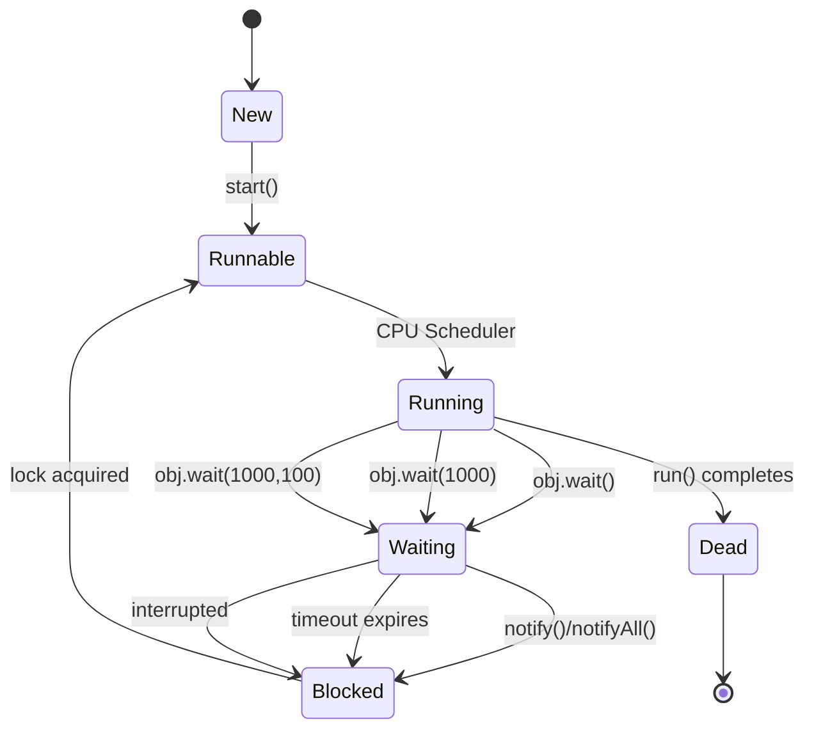

## 📨 Inter-Thread Communication
1. Two Threads can communicate with each other by using wait(), notify() and notifyAll() methods.
2. The Thread which is required updation it has to call wait() method on the required object then immediately the Thread will entered into waiting state. The Thread which is performing updation of object, it is responsible to give notification by calling notify() method.
After getting notification the waiting Thread will get those updations.
3. wait(), notify() and notifyAll() methods are available in Object class but not in Thread class because Thread can call these methods on any common object.
4. To call wait(), notify() and notifyAll() methods compulsory the current Thread
should be owner of that object
    i.e., current Thread should has lock of that object
    i.e., current Thread should be in synchronized area. Hence we can call wait(), notify() and notifyAll() methods only from synchronized area otherwise we will get runtime exception saying IllegalMonitorStateException.
5. Once a Thread calls wait() method on the given object 1st it releases the lock of that object immediately and entered into waiting state.
6. Once a Thread calls notify() (or) notifyAll() methods it releases the lock of that object but may not immediately.
7. Except these (wait(),notify(),notifyAll())  methods there is no other place(method) where the lock release will be happen. 

Method Is Thread Releases Lock?
yield() No
join() No
sleep() No
wait() Yes
notify() Yes
notifyAll() Yes

8. Once a Thread calls wait(), notify(), notifyAll() methods on any object then it releases the lock of that particular object but not all locks it has.
1. public final void wait()throws InterruptedException
2. public final native void wait(long ms)throws InterruptedException
3. public final void wait(long ms,int ns)throws InterruptedException
4. public final native void notify()
5. public final void notifyAll()



```java
class ThreadA {
    public static void main(String[] args)throws InterruptedException {
        ThreadB b=new ThreadB();
        b.start();
        synchronized(b) {
            System.out.println("main Thread calling wait() method");//step-1
            b.wait();
            System.out.println("main Thread got notification call");//step-4
            System.out.println(b.total);
        }
    }
}

class ThreadB extends Thread {
    int total=0;
    public void run() {
        synchronized(this) {
            System.out.println("child thread starts calcuation");//step-2
            for(int i=0;i<=100;i++) {
                total=total+i;
            }
            System.out.println("child thread giving notification call");//step3
            this.notify();
        }
    }
}
Output:
main Thread calling wait() method
child thread starts calculation
child thread giving notification call
main Thread got notification call
5050

Producer consumer problem:
1. Producer(producer Thread) will produce the items to the queue and
consumer(consumer thread) will consume the items from the queue. If the queue is empty then consumer has to call wait() method on the queue object then it will entered into waiting state.
2. After producing the items producer Thread call notify() method on the queue to give notification so that consumer Thread will get that notification and consume items.

Producer -> Queue -> Consumer

class Producer implements Runnable {

    Queue<Integer> q;

    Producer(Queue<Integer> q) {
        this.q = q;
    }

    public void run() {
        synchronized (q) {

            // Produce item
            q.add(100);

            System.out.println("Produced");

            // Notify waiting consumer
            q.notify();
        }
    }
}

class Consumer implements Runnable {

    Queue<Integer> q;

    Consumer(Queue<Integer> q) {
        this.q = q;
    }

    public void run() {
        synchronized (q) {

            while (q.isEmpty()) {
                try {
                    q.wait();
                } catch (InterruptedException e) {
                    e.printStackTrace();
                }
            }

            int item = q.remove();
            System.out.println("Consumed: " + item);
        }
    }
}
---

## 🗺️ The Full Map

```
Inter-Thread Communication
│
├── wait() / notify() / notifyAll()
│   ├── Defined in Object — every object can be monitor
│   ├── Must be called inside synchronized block
│   ├── wait()      → release lock + WAITING
│   ├── notify()    → wake ONE waiting thread
│   └── notifyAll() → wake ALL waiting threads
│
├── Producer-Consumer Problem
│   ├── Classic coordination pattern
│   ├── Bounded buffer — producer waits when full
│   └── Consumer waits when empty
│
└── Spurious Wakeup
    ├── Thread wakes without notify() being called
    ├── JVM/OS specification allows it
    └── Fix: ALWAYS use while loop — never if
```

---

## 🔬 Step 1 — wait() / notify() / notifyAll()

### The Three Methods

```java
// All defined in java.lang.Object
// Every object inherits them — every object can be a monitor

public final void    wait()                  throws InterruptedException
public final void    wait(long timeoutMs)    throws InterruptedException
public final void    wait(long ms, int nanos)throws InterruptedException
public final void    notify()
public final void    notifyAll()
```

### Rules — Non-Negotiable

```
RULE 1: Must be called inside synchronized block on SAME object
  synchronized (obj) { obj.wait(); }      ✅
  obj.wait();                             ❌ IllegalMonitorStateException

RULE 2: wait() releases the lock during waiting
  Thread enters wait() → releases monitor → WAITING
  Other threads can now acquire that monitor

RULE 3: notify() does NOT release lock immediately
  Notifying thread still holds lock after notify()
  Waiting thread moves to BLOCKED — waits for lock release

RULE 4: Only threads waiting on SAME object are notified
  obj1.notify() does NOT wake threads waiting on obj2
```

### What wait() Does — Step by Step

```
Thread A calls obj.wait():
  1. Thread A must hold obj's monitor
  2. Thread A released to obj's wait set
  3. obj's monitor released
  4. Thread A → WAITING state
  5. Other threads can now acquire obj's monitor

Thread B calls obj.notify():
  6. One thread moved from wait set → entry list
  7. Thread B still holds monitor — finishes synchronized block
  8. Thread B releases monitor
  9. Moved thread acquires monitor → RUNNABLE
  10. Moved thread continues from after wait()
```

```
Object monitor internals:

  obj monitor:
  ┌─────────────────────────────────────┐
  │ Owner: Thread B (current holder)    │
  │                                     │
  │ Entry List (BLOCKED):               │
  │   [Thread C] [Thread D]             │
  │   ← waiting to acquire lock         │
  │                                     │
  │ Wait Set (WAITING):                 │
  │   [Thread A] [Thread E]             │
  │   ← called wait() — released lock  │
  └─────────────────────────────────────┘

  notify() → moves ONE from wait set → entry list
  notifyAll() → moves ALL from wait set → entry list
```

---

## 🔬 Step 2 — notify() vs notifyAll()

```java
// notify() — wakes ONE arbitrary waiting thread
// notifyAll() — wakes ALL waiting threads

Object lock = new Object();

// Scenario: 5 threads waiting on lock

// notify():
lock.notify();
// ONE thread woken — OS decides which
// Other 4 still in wait set
// Risk: wrong thread woken — condition still not met for it
//       it goes back to wait — deadlock if notifier doesn't notify again

// notifyAll():
lock.notifyAll();
// ALL 5 threads woken
// All move to entry list — compete for lock
// One wins lock — checks condition — proceeds or waits again
// Safer — no thread left sleeping unnecessarily
```

```
When to use notify() vs notifyAll():
  notify():    ONLY when ALL waiting threads are equivalent
               (same condition, any one can proceed)
               AND exactly one thread should proceed
               Risk: missing wakeup if wrong thread chosen

  notifyAll(): SAFE DEFAULT — always correct
               Wakes all — they each check their condition
               Small performance overhead (all wake, most re-wait)
               Use this unless you have specific reason for notify()
```

---

## 🔬 Step 3 — Spurious Wakeup

```
Spurious wakeup:
  Thread wakes from wait() WITHOUT notify() or notifyAll() being called
  Allowed by POSIX threads specification
  JVM spec also allows it
  Cause: OS-level signal delivery, hardware interrupts

CONSEQUENCE:
  Thread wakes → checks condition → condition NOT met
  Must go back to wait
  If using 'if': proceeds incorrectly
  If using 'while': re-checks condition → waits again → safe
```

```java
// ❌ WRONG — uses if — vulnerable to spurious wakeup
synchronized (lock) {
    if (!conditionMet()) {
        lock.wait();            // wakes spuriously
    }
    proceed();                  // condition may NOT be met — BUG
}

// ✅ CORRECT — uses while — handles spurious wakeup
synchronized (lock) {
    while (!conditionMet()) {   // re-check after every wakeup
        lock.wait();            // spurious wakeup → loop → check again
    }
    proceed();                  // condition GUARANTEED met here
}
```

> 🔑 **Always use `while` loop with `wait()`** — never `if`. This handles both spurious wakeups AND cases where multiple threads compete for the lock after notifyAll().

---

## 🔬 Step 4 — Producer-Consumer Problem

### The Problem

```
Producer:
  Generates data — puts into buffer
  Must WAIT if buffer is FULL

Consumer:
  Reads data from buffer
  Must WAIT if buffer is EMPTY

Buffer:
  Shared bounded queue — needs synchronization
  Both sides coordinate via wait/notify

Without coordination:
  Producer fills buffer → overflow → data lost
  Consumer reads empty buffer → NPE / wrong data
```

### Implementation with wait/notify

```java
public class BoundedBuffer<T> {

    private final Queue<T> buffer;
    private final int      capacity;
    private final Object   lock = new Object();

    public BoundedBuffer(int capacity) {
        this.capacity = capacity;
        this.buffer   = new LinkedList<>();
    }

    // Producer calls this
    public void put(T item) throws InterruptedException {
        synchronized (lock) {
            // Wait while buffer is FULL
            while (buffer.size() == capacity) {
                System.out.println("Buffer full — producer waiting");
                lock.wait();                // release lock — wait
            }

            buffer.offer(item);
            System.out.println("Produced: " + item
                + " | buffer size: " + buffer.size());

            lock.notifyAll();              // wake waiting consumers
        }
    }

    // Consumer calls this
    public T take() throws InterruptedException {
        synchronized (lock) {
            // Wait while buffer is EMPTY
            while (buffer.isEmpty()) {
                System.out.println("Buffer empty — consumer waiting");
                lock.wait();              // release lock — wait
            }

            T item = buffer.poll();
            System.out.println("Consumed: " + item
                + " | buffer size: " + buffer.size());

            lock.notifyAll();             // wake waiting producers
            return item;
        }
    }

    public int size() {
        synchronized (lock) { return buffer.size(); }
    }
}
```

### Producer and Consumer Threads

```java
public class ProducerConsumerDemo {

    public static void main(String[] args) {

        BoundedBuffer<Integer> buffer = new BoundedBuffer<>(5);

        // Producer — generates items
        Thread producer = new Thread(() -> {
            for (int i = 1; i <= 20; i++) {
                try {
                    buffer.put(i);
                    Thread.sleep(100);      // simulate production time
                } catch (InterruptedException e) {
                    Thread.currentThread().interrupt();
                    break;
                }
            }
            System.out.println("Producer done");
        }, "producer");

        // Consumer — consumes items (slower than producer)
        Thread consumer = new Thread(() -> {
            for (int i = 0; i < 20; i++) {
                try {
                    Integer item = buffer.take();
                    Thread.sleep(300);      // simulate consumption time
                } catch (InterruptedException e) {
                    Thread.currentThread().interrupt();
                    break;
                }
            }
            System.out.println("Consumer done");
        }, "consumer");

        producer.start();
        consumer.start();

        try {
            producer.join();
            consumer.join();
        } catch (InterruptedException e) {
            Thread.currentThread().interrupt();
        }
    }
}

// Output (buffer capacity=5):
// Produced: 1 | buffer size: 1
// Produced: 2 | buffer size: 2
// ...
// Produced: 5 | buffer size: 5
// Buffer full — producer waiting    ← producer waits
// Consumed: 1 | buffer size: 4     ← consumer frees space
// Produced: 6 | buffer size: 5     ← producer resumes
```

---

## 🔬 Step 5 — Multiple Producers and Consumers

```java
public class MultiProducerConsumer {

    public static void main(String[] args) throws InterruptedException {

        BoundedBuffer<String> buffer = new BoundedBuffer<>(10);
        int producerCount = 3;
        int consumerCount = 2;

        List<Thread> threads = new ArrayList<>();

        // Multiple producers
        for (int p = 1; p <= producerCount; p++) {
            final int producerId = p;
            Thread producer = new Thread(() -> {
                for (int i = 1; i <= 10; i++) {
                    try {
                        String item = "P" + producerId + "-item-" + i;
                        buffer.put(item);
                    } catch (InterruptedException e) {
                        Thread.currentThread().interrupt();
                        return;
                    }
                }
            }, "producer-" + p);
            threads.add(producer);
        }

        // Multiple consumers
        for (int c = 1; c <= consumerCount; c++) {
            Thread consumer = new Thread(() -> {
                // Each consumer takes 15 items (3 producers × 10 / 2 consumers)
                for (int i = 0; i < 15; i++) {
                    try {
                        buffer.take();
                    } catch (InterruptedException e) {
                        Thread.currentThread().interrupt();
                        return;
                    }
                }
            }, "consumer-" + c);
            threads.add(consumer);
        }

        threads.forEach(Thread::start);
        for (Thread t : threads) t.join();

        System.out.println("All done. Buffer size: " + buffer.size());
    }
}

// notifyAll() is CRITICAL here:
// Multiple producers waiting AND multiple consumers waiting
// notify() might wake WRONG thread (e.g., producer when consumer needed)
// notifyAll() wakes ALL — correct one proceeds — others re-wait
```

---

## 🔬 Step 6 — Modern Alternative: BlockingQueue

```java
// java.util.concurrent.BlockingQueue — preferred in production
// Internally uses wait/notify (or LockSupport) — handles all edge cases

BlockingQueue<String> queue = new LinkedBlockingQueue<>(10);

// Producer
Thread producer = new Thread(() -> {
    try {
        queue.put("item");          // blocks if full — no manual wait needed
    } catch (InterruptedException e) {
        Thread.currentThread().interrupt();
    }
}, "producer");

// Consumer
Thread consumer = new Thread(() -> {
    try {
        String item = queue.take(); // blocks if empty — no manual wait needed
    } catch (InterruptedException e) {
        Thread.currentThread().interrupt();
    }
}, "consumer");

// Comparison:
// Manual wait/notify:  ~40 lines of careful code
// BlockingQueue:       ~2 lines — battle-tested JDK implementation
// Use BlockingQueue in production — manual wait/notify for interviews/learning
```

---

## 💻 Real-World Code — Order Processing Pipeline

```java
public class OrderProcessingPipeline {

    // Stage queues — bounded to apply backpressure
    private final BoundedBuffer<RawOrder>       incomingOrders;
    private final BoundedBuffer<ValidatedOrder>  validatedOrders;
    private final BoundedBuffer<ProcessedOrder>  processedOrders;

    private volatile boolean running = true;

    public OrderProcessingPipeline() {
        this.incomingOrders  = new BoundedBuffer<>(100);
        this.validatedOrders = new BoundedBuffer<>(100);
        this.processedOrders = new BoundedBuffer<>(100);
    }

    public void start() {

        // Stage 1: Validator
        Thread validator = new Thread(() -> {
            while (running || incomingOrders.size() > 0) {
                try {
                    RawOrder raw = incomingOrders.take();
                    ValidatedOrder validated = validate(raw);
                    validatedOrders.put(validated);
                } catch (InterruptedException e) {
                    Thread.currentThread().interrupt();
                    break;
                }
            }
        }, "order-validator");

        // Stage 2: Processor
        Thread processor = new Thread(() -> {
            while (running || validatedOrders.size() > 0) {
                try {
                    ValidatedOrder validated = validatedOrders.take();
                    ProcessedOrder processed = process(validated);
                    processedOrders.put(processed);
                } catch (InterruptedException e) {
                    Thread.currentThread().interrupt();
                    break;
                }
            }
        }, "order-processor");

        // Stage 3: Dispatcher
        Thread dispatcher = new Thread(() -> {
            while (running || processedOrders.size() > 0) {
                try {
                    ProcessedOrder processed = processedOrders.take();
                    dispatch(processed);
                } catch (InterruptedException e) {
                    Thread.currentThread().interrupt();
                    break;
                }
            }
        }, "order-dispatcher");

        validator.setDaemon(false);
        processor.setDaemon(false);
        dispatcher.setDaemon(false);

        validator.start();
        processor.start();
        dispatcher.start();
    }

    public void submit(RawOrder order) throws InterruptedException {
        incomingOrders.put(order);      // blocks if pipeline full — backpressure
    }

    public void shutdown() {
        running = false;                // signal threads to stop after drain
    }
}
```

🔴 **What breaks if done wrong:** Using `if` instead of `while` for wait condition → spurious wakeup → consumer proceeds with empty buffer → `NullPointerException` → order processing crashes → orders lost → customer support incident.

---

## 💣 Interview Traps

**🪤 Trap 1 — `wait()` outside synchronized — IllegalMonitorStateException**

```java
Object lock = new Object();

Thread t = new Thread(() -> {
    try {
        lock.wait();        // ❌ IllegalMonitorStateException
                            // must hold lock before calling wait()
    } catch (InterruptedException e) { }
});

// ✅ Fix:
Thread t2 = new Thread(() -> {
    synchronized (lock) {
        try {
            lock.wait();    // ✅ holds lock — releases during wait
        } catch (InterruptedException e) {
            Thread.currentThread().interrupt();
        }
    }
});
```

---

**🪤 Trap 2 — notify() doesn't release lock immediately**

```java
Object lock = new Object();

Thread waiter = new Thread(() -> {
    synchronized (lock) {
        try {
            lock.wait();
            System.out.println("waiter resumed"); // when does this print?
        } catch (InterruptedException e) { }
    }
}, "waiter");

Thread notifier = new Thread(() -> {
    synchronized (lock) {
        lock.notify();
        System.out.println("after notify"); // prints BEFORE waiter resumes
        // notifier still holds lock — does more work
        heavyWork();                        // waiter still waiting for lock
    }
    // lock released HERE — waiter can now acquire and resume
}, "notifier");

waiter.start();
Thread.sleep(100);
notifier.start();

// Output:
// after notify        ← notifier still running
// (heavy work done)
// waiter resumed      ← only after notifier releases lock
```

---

**🪤 Trap 3 — `if` instead of `while` — spurious wakeup bug**

```java
// Two consumers, one item in buffer

Consumer 1: wait() → woken by notify() → acquires lock → takes item → ok
Consumer 2: wait() → also woken (spurious OR notifyAll) → lock acquired

synchronized (lock) {
    if (buffer.isEmpty()) {     // ❌ if: checks ONCE
        lock.wait();
    }
    // Consumer 2 reaches here with EMPTY buffer
    T item = buffer.poll();     // returns null — NullPointerException!
}

synchronized (lock) {
    while (buffer.isEmpty()) {  // ✅ while: re-checks after every wakeup
        lock.wait();
    }
    T item = buffer.poll();     // guaranteed non-null
}
```

---

**🪤 Trap 4 — Missed notification — notify before wait**

```java
// Race condition: notify fires before wait — notification missed

Thread consumer = new Thread(() -> {
    synchronized (lock) {
        // ... takes time to start ...
        lock.wait();            // waits — but notification already fired!
        // sleeps forever — nobody will notify again
    }
});

// Notifier fires immediately
synchronized (lock) {
    dataReady = true;
    lock.notify();              // fires before consumer calls wait()
}

consumer.start();               // starts AFTER notify — misses it

// Fix: check condition FIRST — if already true, don't wait
synchronized (lock) {
    while (!dataReady) {        // condition check prevents missed wakeup
        lock.wait();
    }
    consume();
}
```

---

**🪤 Trap 5 — `notify()` with multiple different conditions — wrong thread woken**

```java
// Producers and consumers both waiting on same lock
// notify() wakes ONE — may wake another producer instead of consumer

synchronized (lock) {
    while (buffer.isFull()) {
        lock.notify();      // ❌ may wake another PRODUCER
        lock.wait();        // deadlock: everyone waiting, nobody consuming
    }
    buffer.put(item);
    lock.notify();          // ❌ may wake producer when consumer needed
}

// Fix: use notifyAll() when multiple different conditions
synchronized (lock) {
    while (buffer.isFull()) {
        lock.wait();
    }
    buffer.put(item);
    lock.notifyAll();       // ✅ wakes ALL — consumers will check and proceed
}
```

---

## 🔩 DSA / Internals Connection

**Underlying primitive: Wait set + entry list + condition queue**

```
Monitor structure (per object):

  ┌──────────────────────────────────────────────┐
  │  Monitor                                     │
  │                                              │
  │  owner: Thread reference (or null)           │
  │  recursion count: int                        │
  │                                              │
  │  Entry List (BLOCKED):                       │
  │  ┌────┐ ┌────┐ ┌────┐                        │
  │  │ T3 │ │ T4 │ │ T5 │  waiting for lock     │
  │  └────┘ └────┘ └────┘                        │
  │                                              │
  │  Wait Set (WAITING):                         │
  │  ┌────┐ ┌────┐                               │
  │  │ T1 │ │ T2 │  called wait() — released lock│
  │  └────┘ └────┘                               │
  └──────────────────────────────────────────────┘

notify() flow:
  1. Pick ONE thread from wait set (JVM chooses — not specified which)
  2. Move to entry list
  3. That thread competes for lock with other entry list threads

notifyAll() flow:
  1. Move ALL threads from wait set → entry list
  2. All compete for lock
  3. One wins — checks condition — proceeds or re-waits
  4. Next wins — checks condition — proceeds or re-waits
  5. Repeat until all processed

wait() JVM bytecode:
  invokevirtual java/lang/Object.wait
  → native: ObjectMonitor::wait()
  → creates ObjectWaiter node
  → adds to wait set linked list
  → releases monitor (sets owner=null)
  → calls OS: pthread_cond_wait or equivalent
  → thread parked by OS — not scheduled

notify() JVM bytecode:
  invokevirtual java/lang/Object.notify
  → native: ObjectMonitor::notify()
  → removes one ObjectWaiter from wait set
  → adds to entry list
  → caller keeps monitor — continues execution
```

---
