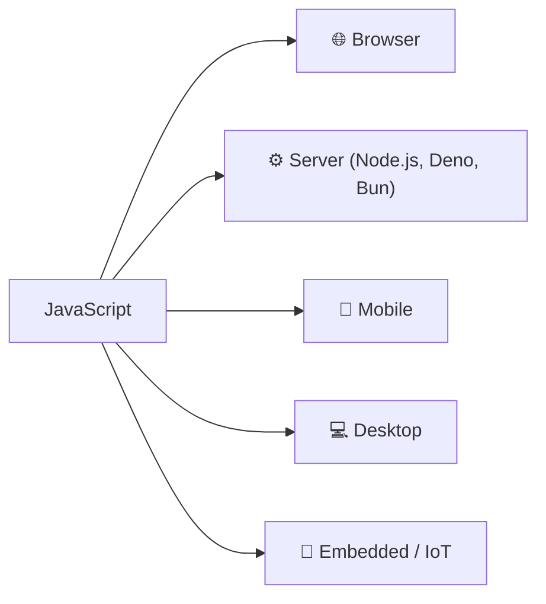
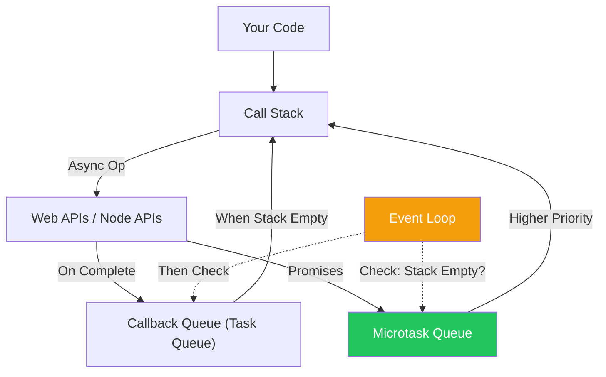

import { Tabs, TabItem, Aside, Badge, Card, CardGrid, Code, LinkCard, Steps } from '@astrojs/starlight/components';

## 🌍 JavaScript: The Language of the Web

> **JavaScript is a high-level, interpreted programming language that runs natively in the web browsers and can also be used for server-side development through runtime environments such as Node.js.**

### What Does "Natively" Mean?

> Browsers understand and execute JavaScript directly through built-in JavaScript engines, without requiring another compiler, plugin, or runtime.

Examples of JavaScript engines:

* V8 (Chrome)
* SpiderMonkey (Firefox)

```text
JavaScript
     ↓
Browser Engine (V8, SpiderMonkey, etc.)

     ↓
Execution
```

### Comparison
```text
C++

C++ Source
    ↓
Compiler
    ↓
Machine Code / WebAssembly
    ↓
Execution
```

```text
Java

Java Source
    ↓
javac
    ↓
Bytecode
    ↓
JVM
    ↓
Execution
```



<Aside type="tip" title="🎯 MUST KNOW">
**Why Learn JavaScript?**  
- ✅ Runs in browsers natively
- ✅ Can be used for frontend and backend development
- ✅ Excellent for event-driven and asynchronous programming
- ✅ Massive ecosystem (npm, React, Vue, Angular, etc.)
- ✅ One language for web, server, mobile, and desktop applications
</Aside>

---

## 📜 A Brief History — From 10 Days to Global Dominance

```text
1995: Brendan Eich creates "Mocha" → "LiveScript" → "JavaScript" in 10 days
      (Netscape Navigator 2.0)
      
1997: ECMAScript 1 (ECMA-262) — First standard
      
2009: ECMAScript 5 — Strict mode, JSON, array methods
      
2015: ECMAScript 6 (ES2015) — "Harmony"
      • Classes, modules, arrow functions, promises, let/const
      • Modern JS begins
      
2016-Present: Annual releases (ES2016, ES2017, ...)
      • Async/await, optional chaining, nullish coalescing, top-level await
```

<CardGrid>
  <Card title="Why the Name 'JavaScript'?" icon="information">
    Marketing! Netscape partnered with Sun Microsystems (creators of Java) in 1995.  
    JavaScript was designed to **complement Java** in the browser — not replace it.  
    ✅ They share C-style syntax.  
    ❌ They are **completely different languages** (no relation beyond syntax).
  </Card>
  
  <Card title="ECMAScript vs JavaScript" icon="approve-check">
    **ECMAScript** = The specification (ECMA-262).  
    **JavaScript** = The most popular implementation (plus JScript, ActionScript).  
    ✅ When we say "ES2023", we mean the ECMAScript 2023 spec.  
    ✅ Browser/Node support varies — use Babel or check [caniuse.com](https://caniuse.com).
  </Card>
</CardGrid>

---

## 🧠 Core Design Principles

### 1. Single-Threaded + Event Loop



<Code lang="js" title="Event Loop in Action" code={`
console.log("1. Start");

setTimeout(() => {
    console.log("2. Timeout (macrotask)");
}, 0);

Promise.resolve().then(() => {
    console.log("3. Promise (microtask)");
});

console.log("4. End");

// Output:
// 1. Start
// 4. End
// 3. Promise (microtask)  ← Microtasks run FIRST
// 2. Timeout (macrotask)  ← Macrotasks run AFTER microtasks
`} />

<Aside type="caution">
**🚨 Interview Trap**: Many think `setTimeout(fn, 0)` runs immediately.  
✅ It doesn't. It queues a **macrotask**. Microtasks (Promises, `queueMicrotask`) always run first.
</Aside>

### 2. Dynamically Typed + Duck Typing

<Code lang="js" title="Dynamic Typing" code={`
let x = 42;        // number
x = "hello";       // string — no error!
x = { key: true }; // object — still no error

// Duck Typing: If it quacks like a duck...
function fly(thing) {
    if (typeof thing.fly === 'function') {
        thing.fly(); // Works for Bird, Plane, Superman — no common parent needed
    }
}
`} />

✅ **Pros**: Flexible, rapid development, easy polymorphism.  
⚠️ **Cons**: Runtime errors, harder to refactor, needs tests/TypeScript for safety.

### 3. Prototype-Based Inheritance

Unlike Java's class-based inheritance, JS uses **prototypes** for delegation.

<Code lang="js" title="Prototype Chain" code={`
const animal = {
    eats: true,
    walk() { console.log("Walking"); }
};

const rabbit = {
    jumps: true,
    __proto__: animal  // Rabbit delegates to animal
};

rabbit.walk(); // "Walking" — found via prototype chain!
console.log(rabbit.eats); // true — inherited
`} />

✅ **Modern Syntax**: `class`/`extends` is syntactic sugar over prototypes.  
✅ **Power**: Dynamic prototype modification (use sparingly!).

### 4. First-Class Functions + Closures

Functions are **values** — they can be passed, returned, and stored.

<Code lang="js" title="Closures in Action" code={`
function createCounter() {
    let count = 0; // Private variable (closed over)
    
    return {
        increment: () => ++count,
        getCount: () => count
    };
}

const counter = createCounter();
console.log(counter.increment()); // 1
console.log(counter.getCount());  // 1
// count is NOT accessible from outside — true privacy via closure!
`} />

✅ **Use Cases**: Module pattern, data privacy, callbacks, functional programming.

---

## 🗂️ JavaScript Runtime Environments

| Environment | Use Case | Key APIs |
|-------------|----------|----------|
| **Browser** | UI, DOM, user interaction | `document`, `fetch`, `localStorage`, `WebSockets` |
| **Node.js** | Servers, CLI tools, APIs | `fs`, `http`, `process`, `Buffer` |
| **Deno** | Secure runtime, TypeScript-first | `Deno.readFile`, built-in TypeScript, permissions model |
| **Bun** | Fast all-in-one runtime | Node-compatible + native TypeScript + bundler |
| **React Native** | Mobile apps | Native modules, JSX, bridge to native APIs |
| **Electron** | Desktop apps | Chromium + Node.js, system APIs |


---
