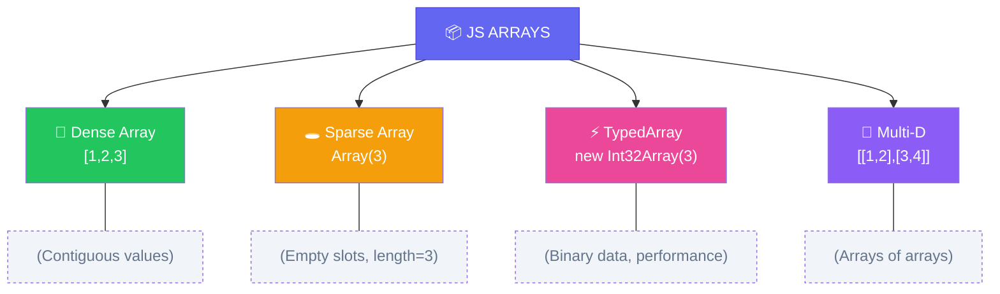

import { Aside, Badge, Card, CardGrid, Code, LinkCard } from '@astrojs/starlight/components';

## 📦 What is an Array in JS?

An **Array** is a **dynamic, ordered collection** that can store multiple values of **any type** under one name.

An array in JS is **not a real array**. It is a **special object** with:
- Integer-like keys as property names
- A magic `length` property
- Array prototype methods

```js
typeof []          // "object" — not "array"
Array.isArray([])  // true ✅ — correct check

// Proof it's an object:
const arr = [1, 2, 3];
arr.custom = "hello";       // ✅ valid — objects have properties
Object.keys(arr)            // ["0", "1", "2", "custom"] 😱
```

### 🔑 Key Characteristics (JS vs Java)

| Feature | JavaScript | Java |
|---------|-----------|------|
| **Type** | 🟡 Reference Type (Object) | 🔵 Reference Type (Object) |
| **Size** | 🔄 **Dynamic** — grows/shrinks automatically | 🔒 **Fixed** — immutable after creation |
| **Index** | 🔢 `0` to `length - 1` (non-integer keys become properties) | 🔢 `0` to `length - 1` (strict integer only) |
| **Elements** | 🎭 **Heterogeneous** — any mix of types allowed | 🎯 **Homogeneous** — same type only |
| **Out-of-bounds** | ➡️ Returns `undefined` (no crash) | 💥 `ArrayIndexOutOfBoundsException` |

```js
let arr = [10, "hello", true, null, {x:1}];
// Index →   0      1      2     3      4
// Types → number, string, boolean, object, object
```

<Aside type="tip" title="🎯 MUST KNOW">
**JS Array Superpowers**:  
✅ Mixed types in one array  
✅ Dynamic resizing with `push()`, `pop()`, `splice()`  
✅ Rich method library: `map()`, `filter()`, `reduce()`, `find()`  
✅ Sparse arrays & empty slots support  
✅ `length` is writable — set it to truncate! 🪄
</Aside>

---

## 🗂️ Types of Arrays


```
Arrays in JavaScript
│
├── 🏗️  Creation
│   ├── literal              [1, 2, 3]
│   ├── Array()              new Array(3)
│   ├── Array.from()         Array.from("abc")
│   └── Array.of()           Array.of(3)
│
├── 🔍  Access & Mutation
│   ├── indexing             arr[0]
│   ├── at()                 arr.at(-1)
│   ├── length               arr.length
│   └── destructuring        const [a, b] = arr
│
├── ➕  Adding / Removing
│   ├── push / pop           end
│   ├── unshift / shift      start
│   ├── splice               middle
│   └── concat / spread      merge
│
├── 🔄  Iteration
│   ├── for loop
│   ├── for...of
│   ├── forEach
│   └── entries / keys / values
│
├── 🔁  Transformation
│   ├── map
│   ├── filter
│   ├── reduce / reduceRight
│   ├── flat / flatMap
│   └── sort / reverse
│
├── 🔎  Search
│   ├── find / findIndex
│   ├── findLast / findLastIndex
│   ├── indexOf / lastIndexOf
│   ├── includes
│   └── some / every
│
└── ⚙️  Advanced
    ├── typed arrays
    ├── sparse arrays
    ├── Array.from + iterables
    └── structuredClone for deep copy
```

---

## 🏗 How Arrays Work Internally

<Code lang="js" title="Memory layout visualization" code={`
let arr = [10, 20, 30, 40, 50];

// STACK (Reference)          HEAP (Object Data)
// ┌────────────────┐         ┌─────────────────────────────────┐
// │ arr  [ref/add] ──────────→│ {                               │
// └────────────────┘         │   "0": 10, "1": 20, "2": 30,    │
//                               │   "3": 40, "4": 50,            │
//                               │   length: 5,                   │
//                               │   [[Prototype]]: Array         │
//                               └─────────────────────────────────┘
//                                Keys are strings! Not contiguous ints!
`} />

### 🔍 Why O(1) Access? (Mostly)

```
Modern engines (V8, SpiderMonkey) use "hidden classes" + "element kinds":
- Fast elements: contiguous storage for small, dense integer arrays → O(1)
- Slow elements: hash table for sparse/mixed-type arrays → O(1) average, but slower

arr[3] → engine checks "fast mode" → direct offset jump ✅
arr[999999] in sparse array → hash lookup 🔍
```

> ✔ `arr` → reference variable (Stack)  
> ✔ Actual array → Heap object with string-keyed properties + `length`  
> ✔ **Not truly contiguous** like Java — but optimized for common cases!

<Aside type="note">
**Default value for empty slots is `undefined`** — but note: `undefined` ≠ missing property!  
`Array(3)` creates 3 **empty slots** (not `undefined` values) — this matters for `map()`, `forEach()`, etc. 🎭
</Aside>

---

## 📌 Declaration Styles

<Code lang="js" title="✅ Valid declarations" code={`
// Array literals (RECOMMENDED)
let arr1 = [1, 2, 3];
let arr2 = [];                    // empty array
let arr3 = [1, "two", true, null]; // mixed types ✅

// Constructor syntax (use with caution!)
let arr4 = new Array(3);          // ⚠️ Sparse array: [empty × 3]
let arr5 = new Array(1, 2, 3);    // ✅ Dense: [1, 2, 3]
let arr6 = Array.of(3);           // ✅ [3] — avoids sparse trap!
let arr7 = Array.from("hi");      // ✅ ['h', 'i']

// Multi-dimensional (all valid):
let m1 = [[1,2], [3,4]];          // ✅ 2D
let m2 = new Array(2);            // ✅ then assign rows
m2[0] = [1,2]; m2[1] = [3,4];
let m3 = Array.from({length: 3}, () => []); // ✅ 3 empty rows

// 1. Literal — always prefer this
const arr = [1, 2, 3];

// 2. Array constructor — TRAP:
new Array(3)       // [empty × 3] — length 3, NO elements 😱
new Array(1, 2, 3) // [1, 2, 3]  — works with 2+ args

// 3. Array.of() — fixes constructor trap:
Array.of(3)        // [3]        — always wraps in array ✅
Array.of(1, 2, 3)  // [1, 2, 3]

// 4. Array.from() — converts iterables/array-likes:
Array.from("abc")           // ["a", "b", "c"]
Array.from({length: 3}, (_, i) => i) // [0, 1, 2]
Array.from(new Set([1,2,2,3]))        // [1, 2, 3]
Array.from(new Map([["a",1],["b",2]])) // [["a",1],["b",2]]
Array.from(document.querySelectorAll("div")) // NodeList → Array
Array.from(arguments) // arguments object → Array
`} />

<Code lang="js" title="❌ Invalid / Traps" code={`
let arr = [1, 2, 3];
arr[5] = 10;        // ✅ Valid! Creates sparse array: [1,2,3,empty×2,10]

// ⚠️ Constructor trap:
let bad = new Array(5);  // ❌ NOT [5] — it's [empty × 5]!
console.log(bad.length); // 5, but bad[0] === undefined AND 0 in bad === false

// ⚠️ Single number argument = size, not value!
// FIX: Use Array.of() or literal:
let good = Array.of(5);  // ✅ [5]
let good2 = [5];         // ✅ [5]`} />

---

## 1️⃣ Single-Dimensional Arrays

### Creation Patterns

<Code lang="js" title="Common initialization patterns" code={`
// Literal (best for known values)
let nums = [10, 20, 30];

// Pre-allocate with fill (dense array)
let zeros = new Array(5).fill(0);      // [0,0,0,0,0]
let undefs = Array(5).fill(undefined); // [undefined×5]

// Generate with from/map
let range = Array.from({length: 5}, (_, i) => i); // [0,1,2,3,4]
let squares = [...Array(5).keys()].map(x => x*x); // [0,1,4,9,16]

// Sparse array (empty slots — use carefully!)
let sparse = Array(3);  // [empty × 3] — length=3, but no actual elements`} />

### Default Values Reference

| Creation Method | Result | Notes |
|----------------|--------|-------|
| `[1,2,3]` | Dense array | ✅ Normal iteration works |
| `Array(3)` | Sparse array | ❌ `map()`, `forEach()` skip empty slots |
| `new Array(3).fill(0)` | Dense `[0,0,0]` | ✅ Safe for iteration |
| `Array.from({length:3})` | Dense `[undefined×3]` | ✅ Has actual `undefined` values |

<Aside type="caution">
⚠️ **Sparse Array Trap**: Empty slots behave differently than `undefined` values!
```js
let sparse = Array(3);
let dense = [undefined, undefined, undefined];

sparse.map(x => x*2);  // [empty × 3] — callback NEVER runs!
dense.map(x => x*2);   // [NaN, NaN, NaN] — callback runs 3 times!

// Check for empty slots:
0 in sparse  // false
0 in dense   // true
```
</Aside>

---

## 2️⃣ Multi-Dimensional Arrays

### 🧠 JS Naturally Supports Jagged Arrays!

Rows can have **different lengths** — no extra syntax needed.

<Code lang="js" title="Jagged 2D array" code={`
let arr = [
  [1, 2, 3],      // Row 0: 3 elements
  [4, 5],         // Row 1: 2 elements (different!)
  [6]             // Row 2: 1 element
];

console.log(arr[1][1]);  // 5 ✅
console.log(arr[0][5]);  // undefined (no crash!)`} />

<Code lang="js" title="3D jagged array example" code={`
let cube = [
  [ [1,2], [3] ],        // Layer 0
  [ [4], [5,6,7], [8] ]  // Layer 1 (different structure)
];

console.log(cube[1][1][2]);  // 7 ✅
console.log(cube[0][1][5]);  // undefined ✅ (safe access!)`} />

### 📐 Safe Initialization Patterns

<Code lang="js" title="✅ Valid multi-dim creations" code={`// Rectangular 2D
let rect = Array.from({length: 3}, () => Array(4).fill(0));

// Jagged 2D
let jagged = [[1,2], [3,4,5], [6]];

// 3D rectangular
let cube3D = Array.from({length: 2}, () =>
  Array.from({length: 3}, () => Array(4).fill(0))
);

// Safe jagged 3D
let jagged3D = [
  [[1], [2,3]],
  [[4,5,6]]
];`} />

<Code lang="js" title="❌ Common initialization mistakes" code={`// ❌ DON'T do this — all rows reference SAME array!
let bad = Array(3).fill([]);  
bad[0].push(1);
console.log(bad);  // [[1], [1], [1]] 😱 All rows mutated!

// ✅ DO this — each row is a NEW array:
let good = Array.from({length: 3}, () => []);  
good[0].push(1);
console.log(good);  // [[1], [], []] ✅ Isolated rows`} />

<Aside type="tip">
**Rule**: When initializing nested arrays, **always create new inner arrays** per iteration.  
`Array(n).fill([])` shares the same reference — a classic interview trap! 🎯
</Aside>

---

## ⚙ Important Properties & Methods

### 1️⃣ `length` Property (Writable!)

<Code lang="js" title="Using .length" code={`
let arr = [10, 20, 30];
console.log(arr.length);  // ✅ 3

// 🪄 Magic: length is WRITABLE!
arr.length = 2;           // Truncates array!
console.log(arr);         // [10, 20]

arr.length = 5;           // Extends with empty slots
console.log(arr);         // [10, 20, empty × 3]
console.log(arr[4]);      // undefined`} />

### 2️⃣ Indexing & Bounds Safety

```js
arr[0]      // ✅ First element
arr[-1]     // ✅ Returns undefined (not last element!)
arr[999]    // ✅ Returns undefined (no exception)
arr["0"]    // ✅ Same as arr[0] — non-integers coerce to string keys
```

### 🔬 Dynamic Typing Nature

<Code lang="js" title="Type flexibility at runtime" code={`
let arr = new Array(3);
arr[0] = 10;        // ✅ number
arr[1] = 10.5;      // ✅ number (float)
arr[2] = "A";       // ✅ string — no promotion needed!
arr[3] = true;      // ✅ boolean — just add it!
arr[4] = {x: 1};    // ✅ object — heterogeneous is normal!

// 🎯 JS doesn't enforce homogeneity — power & pitfall!`} />

### 🔬 Array Type Detection

<Code lang="js" title="Checking array types" code={`
let arr = [1, 2, 3];

// ❌ DON'T use typeof:
typeof arr        // "object" (misleading!)

// ✅ DO use Array.isArray():
Array.isArray(arr)  // true ✅

// ✅ Or instanceof (less reliable across iframes):
arr instanceof Array  // true (usually)

// 🔍 Check element types:
arr.map(x => typeof x);  // ["number", "number", "number"]`} />

---

## ⚡ Primitive Values vs Objects in Arrays

| Feature | JS Array Behavior |
|---------|------------------|
| **Stores** | Values directly (primitives) OR references (objects) |
| **Memory** | Primitives by value, objects by reference |
| **Mutation** | Changing object properties affects all references |
| **Default** | Empty slots = `undefined` (not `null`!) |
| **Example** | `[1, "a", {x:1}, [2]]` — all valid together |

<Code lang="js" title="Object references in arrays" code={`
let obj = {val: 10};
let arr = [obj, obj];  // Both indices reference SAME object

arr[0].val = 99;
console.log(arr[1].val);  // 99! ✅ Same object mutated

// To clone objects in array:
let cloned = arr.map(o => ({...o}));  // Shallow copy
cloned[0].val = 1;
console.log(arr[0].val);  // Still 99 ✅ Isolated`} />

---

## 📌 Array Literals & Spread Syntax

**Array literals** `[...]` are the idiomatic way to create arrays — no `new` needed!

<Code lang="js" title="Literal & spread patterns" code={`
// Basic literal
let nums = [1, 2, 3];

// Spread to copy/merge
let copy = [...nums];              // [1,2,3] — shallow copy
let merged = [...nums, 4, 5];      // [1,2,3,4,5]

// Spread in function calls
Math.max(...[1, 5, 3]);  // 5

// Nested spread for deep-ish copy
let matrix = [[1,2], [3,4]];
let cloned = matrix.map(row => [...row]);  // ✅ Independent rows

// Rest syntax (opposite of spread)
let [first, ...rest] = [1,2,3,4];  // first=1, rest=[2,3,4]`} />

<Code lang="js" title="❌ Literal traps" code={`
// ❌ Trailing comma is OK (ES5+), but don't rely on it for length:
let arr = [1, 2, 3,];  // ✅ length = 3 (not 4!)

// ❌ Sparse literal with commas:
let sparse = [1, , 3];  // [1, empty, 3] — middle slot is EMPTY, not undefined!
console.log(1 in sparse);  // false

// ✅ Prefer explicit undefined if you want a value:
let dense = [1, undefined, 3];  // [1, undefined, 3]
console.log(1 in dense);  // true`} />

---

## 🧠 Array Assignment & Reference Behavior

### 🔗 Reference Assignment (Not Copy!)

<Code lang="js" title="Reference reassignment" code={`
let a = [10, 20, 30];
let b = a;        // ✅ b references SAME array as a

b.push(40);
console.log(a);   // [10, 20, 30, 40] 😱 a mutated too!

// ✅ To copy:
let c = [...a];           // Spread (shallow)
let d = Array.from(a);    // from() (shallow)
let e = a.slice();        // slice() (shallow)

e.push(50);
console.log(a);  // Still [10,20,30,40] ✅ Isolated`} />

### 🔁 No Covariance Issues (Dynamic Typing!)

<Code lang="js" title="No type restrictions on assignment" code={`
// ✅ JS has no compile-time type checks — no covariance traps!
let strings = ["a", "b"];
let mixed = strings;      // ✅ No issue
mixed.push(123);          // ✅ Now ["a","b",123] — totally fine!

// ✅ Assign any array to any variable:
let nums = [1,2,3];
let anything = nums;      // ✅ No type mismatch possible
anything.push("hello");   // ✅ [1,2,3,"hello"]`} />

<Aside type="danger">
**Reference Trap**: Assignment copies the *reference*, not the array.  
Mutating `b` affects `a` if `b = a`. Always use `[...arr]` or `slice()` to clone! 🔐
</Aside>

---

## 🧠 Array Size Rules

| Rule | Example | Result |
|------|---------|--------|
| Size in constructor | `new Array(5)` | ✅ Sparse array of length 5 |
| Size zero | `new Array(0)` or `[]` | ✅ Valid empty array |
| Negative size | `new Array(-3)` | ❌ `RangeError: Invalid array length` |
| Non-integer size | `new Array(3.5)` | ❌ `RangeError` |
| Max size | `new Array(2**32 - 1)` | ✅ Theoretical max (but OOM likely) |
| Literal with size | `[5]` | ✅ Dense array with single element `5` |

<Code lang="js" title="Size behavior examples" code={`
let a = new Array(3);           // ✅ [empty × 3], length=3
let b = new Array(3.5);         // ❌ RangeError: invalid length
let c = new Array(-1);          // ❌ RangeError: invalid length
let d = new Array(2**32);       // ❌ RangeError: too large
let e = [3];                    // ✅ [3] — literal, not size!
let f = Array.of(3);            // ✅ [3] — safe alternative to constructor`} />

---

## 🔄 Array Traversal Methods

<Code lang="js" title="Five ways to iterate" code={`let arr = [10, 20, 30, 40, 50];

// Way 1 — classic for loop (need index)
for (let i = 0; i < arr.length; i++) {
    console.log(arr[i]);
}

// Way 2 — for...of loop (clean, ES6+)
for (let num of arr) {
    console.log(num);
}

// Way 3 — forEach method (functional style)
arr.forEach((num, index) => {
    console.log(\`\${index}: \${num}\`);
});

// Way 4 — for...in loop (⚠️ avoid for arrays!)
for (let idx in arr) {
    console.log(arr[idx]);  // idx is string! Risk of inherited props
}

// Way 5 — iterators & advanced methods
arr.map(x => x*2).filter(x => x > 50).forEach(console.log);`} />

<Aside type="tip">
**Iteration Method Guide**:  
🎯 Need index? → `for` loop or `forEach((val, idx))`  
🎯 Transform data? → `map()`, `filter()`, `reduce()`  
🎯 Simple read? → `for...of` (cleanest)  
🚫 Avoid `for...in` on arrays — iterates over *all enumerable keys*, including inherited!
</Aside>

---

## 🚨 Common Runtime Behaviors (Not Exceptions!)

<CardGrid>
  <Card title="Out-of-bounds access" icon="information">
    ```js
    let arr = [1, 2, 3];
    console.log(arr[5]);   // undefined ✅ (no crash!)
    console.log(arr[-1]);  // undefined ✅ (not last element!)
    
    // 🎯 Safe access pattern:
    const value = arr[5] ?? "default";  // nullish coalescing
    ```
    **Type**: Returns `undefined` — check with `in` operator if needed
  </Card>
  
  <Card title="Sparse array iteration" icon="error">
    ```js
    let sparse = Array(3);  // [empty × 3]
    
    sparse.forEach(x => console.log(x));  // ❌ Callback NEVER runs!
    sparse.map(x => x*2);                 // ❌ Returns [empty × 3]
    
    // ✅ Fix: Convert to dense first
    let dense = [...sparse].fill(0);  // [0,0,0]
    dense.forEach(x => console.log(x));  // ✅ Runs 3 times
    ```
    **Type**: Silent bug — methods skip empty slots!
  </Card>
  
  <Card title="length manipulation side effects" icon="caution">
    ```js
    let arr = [1,2,3,4,5];
    arr.length = 3;        // ✅ Truncates: [1,2,3]
    arr.length = 10;       // ✅ Extends: [1,2,3,empty×7]
    
    // ⚠️ Setting length < 0 or non-integer:
    arr.length = -1;       // ❌ RangeError
    arr.length = 3.5;      // ❌ RangeError
    ```
    **Type**: `RangeError` for invalid lengths
  </Card>
  
  <Card title="typeof array trap" icon="error">
    ```js
    let arr = [1,2,3];
    typeof arr;  // "object" 😱 Not "array"!
    
    // ✅ Correct checks:
    Array.isArray(arr);        // true ✅
    arr instanceof Array;      // true (usually) ✅
    ```
    **Type**: Design quirk — arrays are objects with special behavior
  </Card>
</CardGrid>

---

## 🔥 JavaScript Interview Traps

<CardGrid>
  <Card title="Trap 1 — Array(3) vs [3]" icon="error">
    ```js
    let a = Array(3);    // [empty × 3] — sparse!
    let b = [3];         // [3] — dense, one element
    let c = Array.of(3); // [3] — safe alternative
    
    a.map(x => x*2);  // [empty × 3] — callback skipped!
    b.map(x => x*2);  // [6] — callback runs once ✅
    ```
  </Card>
  
  <Card title="Trap 2 — Shared reference in nested init" icon="error">
    ```js
    // ❌ DON'T:
    let bad = Array(3).fill([]);
    bad[0].push(1);
    console.log(bad);  // [[1], [1], [1]] 😱 All rows same reference!
    
    // ✅ DO:
    let good = Array.from({length: 3}, () => []);
    good[0].push(1);
    console.log(good);  // [[1], [], []] ✅ Isolated
    ```
  </Card>
  
  <Card title="Trap 3 — Sparse array method behavior" icon="error">
    ```js
    let sparse = [1, , 3];  // middle slot EMPTY
    
    sparse.forEach((x,i) => console.log(i));  // Logs: 0, 2 (skips 1!)
    sparse.map(x => x*2);    // [2, empty, 6] — preserves sparseness
    
    // ✅ Check for actual property:
    if (1 in sparse) { ... }  // false — slot 1 doesn't exist!
    ```
  </Card>
  
  <Card title="Trap 4 — length coercion" icon="caution">
    ```js
    let arr = [1,2,3];
    arr.length = "2";   // ✅ Coerced to number → [1,2]
    arr.length = "abc"; // ❌ NaN → RangeError!
    
    // ✅ Always use numbers for length:
    arr.length = Math.max(0, desiredLength);
    ```
  </Card>
  
  <Card title="Trap 5 — Array methods: mutate vs. return new" icon="tip">
    ```js
    let arr = [1,2,3];
    
    // ❌ Mutating methods (change original):
    arr.push(4);      // [1,2,3,4]
    arr.pop();        // [1,2,3]
    arr.splice(1,1);  // [1,3]
    
    // ✅ Non-mutating methods (return new array):
    let b = arr.concat(4);    // [1,3,4], arr unchanged
    let c = arr.slice(1);     // [3], arr unchanged
    let d = arr.map(x=>x*2);  // [2,6], arr unchanged
    
    // 🎯 Rule: Know which methods mutate! Prefer immutable patterns in React/functional code.
    ```
  </Card>
</CardGrid>

---

## 🧠 DSA Connection

<CardGrid>
  <Card title="Frequency Array Pattern" icon="code">
    ```js
    // Count lowercase letters: O(n) time, O(1) space
    const freq = Array(26).fill(0);  // Dense array of zeros
    for (let c of input) {
        if (c >= 'a' && c <= 'z') {
            freq[c.charCodeAt(0) - 'a'.charCodeAt(0)]++;
        }
    }
    // 🎯 Use .fill(0) to avoid sparse array traps!
    ```
  </Card>
  
  <Card title="Sliding Window with Array Methods" icon="code">
    ```js
    // Max sum of k consecutive elements
    function maxSum(arr, k) {
        let window = arr.slice(0, k).reduce((a,b)=>a+b, 0);
        let max = window;
        
        for (let i = k; i < arr.length; i++) {
            window = window - arr[i-k] + arr[i];  // O(1) slide
            max = Math.max(max, window);
        }
        return max;
    }
    // 🎯 slice() + reduce() for clean initialization
    ```
  </Card>
  
  <Card title="Graph Adjacency List" icon="code">
    ```js
    // Safe jagged array initialization for graphs
    function buildGraph(n, edges) {
        const graph = Array.from({length: n}, () => []);
        for (let [u, v] of edges) {
            graph[u].push(v);
            graph[v].push(u);  // undirected
        }
        return graph;
    }
    // 🎯 Array.from + arrow fn prevents shared reference bug!
    ```
  </Card>
</CardGrid>

<Aside type="tip">
**Pro Tip**: Prefer `Array(n).fill(value)` over `Array(n)` for DSA — dense arrays behave predictably with `map()`, `forEach()`, etc.  
Use `TypedArray` (`Int32Array`, `Float64Array`) for numeric-heavy algorithms — 3-5x faster in V8! ⚡
</Aside>

---

## 🧪 Quick Self-Test

<Code lang="js" title="Predict the output" code={`// Q1: Reference vs Copy
let a = [1, 2, 3];
let b = a;
b.push(4);
console.log(a.length);  // ?

// Q2: Sparse array behavior
let sparse = Array(3);
let result = sparse.map(x => x * 2);
console.log(result.length, 1 in result);  // ? ?

// Q3: Nested init trap
let matrix = Array(2).fill([]);
matrix[0].push(1);
console.log(matrix[1].length);  // ?`} />

<details>
<summary>✅ Click to reveal answers</summary>

```text
Q1: 4        // a and b reference same array — push mutates both
Q2: 3 false  // map() preserves sparseness; empty slot stays empty
Q3: 1        // Both rows reference SAME array — classic trap!
```
</details>

---

## 📌 Quick Revision Cheat Sheet <Badge text="MUST KNOW" variant="tip" />

```js
// 🎯 CREATION
[1,2,3]                 // ✅ Literal (preferred)
Array(3)                // ⚠️ Sparse: [empty×3]
Array.of(3)             // ✅ Dense: [3]
Array.from({length:3}, fn) // ✅ Dense with values

// 🎯 TRAVERSAL
for (let x of arr)      // ✅ Clean, no index
arr.forEach((x,i)=>{})  // ✅ With index
arr.map(x=>x*2)         // ✅ Transform (returns new)

// 🎯 MUTATION (changes original)
arr.push(x), pop(), shift(), unshift()
arr.splice(i, count, ...items)
arr.sort(), reverse()

// 🎯 NON-MUTATION (returns new)
arr.concat(), slice(), map(), filter(), reduce()
[...arr], Array.from(arr)

// 🎯 CHECKS
Array.isArray(arr)      // ✅ Is it an array?
i in arr                // ✅ Does index i exist? (vs undefined)
arr.includes(value)     // ✅ Contains value?

// 🎯 SPARSE ARRAY FIX
[...sparse].fill(0)     // Convert to dense
Array.from(sparse, x=>x??0) // Fill empties with default

// 🎯 PERFORMANCE
TypedArray for numbers: new Int32Array(1000) // ⚡ 3-5x faster
```

---

## 🔗 Related Topics

<CardGrid columns={2}>
  <LinkCard
    title="JavaScript Literals"
    href="/computer-languages/javascript/topics/literals"
    description="Numbers, strings, BigInt, template literals"
  />
  <LinkCard
    title="JavaScript Data Types"
    href="/computer-languages/javascript/topics/data-types"
    description="Primitives, objects, typeof, coercion"
  />
  <LinkCard
    title="JavaScript Array Methods"
    href="/computer-languages/javascript/topics/array-methods"
    description="map, filter, reduce, splice — mutate vs. return new"
  />
  <LinkCard
    title="JavaScript Memory Model"
    href="/computer-languages/javascript/topics/memory"
    description="Stack vs Heap, references, garbage collection"
  />
</CardGrid>

<Aside type="note">
🎯 **Production Pro Tips**  
1. Prefer array literals `[...]` over `new Array()` to avoid sparse traps  
2. Use `Array.isArray()` — never `typeof` — to check for arrays  
3. Clone with `[...arr]` or `slice()` before mutating in functional code  
4. Use `TypedArray` for numeric algorithms (performance!)  
5. Guard sparse arrays with `in` operator or convert to dense first  
6. Lint with ESLint + `array-callback-return`, `no-sparse-arrays` rules 🛡️
</Aside>

> 💡 **Final Wisdom**: JavaScript arrays are **flexible but treacherous** — dynamic sizing and mixed types empower rapid development, but sparse arrays, reference semantics, and method behaviors hide subtle bugs. Master the traps above, and you'll write robust, interview-ready code! 🚀✨

*Converted for Astro 6 + Starlight • Optimized for interview prep + production use • Quality >>>> Quantity* 🎯
```

---

## 🔄 Java → JS Array Conversion Summary

| Java Feature | JavaScript Equivalent | Critical Difference |
|-------------|----------------------|-------------------|
| `int[] arr = new int[5]` | `let arr = Array(5).fill(0)` | JS: dynamic, sparse by default; Java: fixed, dense |
| `arr.length` | `arr.length` | ✅ Same syntax, but JS `length` is writable! |
| Fixed size | Dynamic resizing | JS: `push()`, `pop()`, `splice()` auto-resize |
| Homogeneous types | Heterogeneous allowed | JS: `[1, "a", true]` ✅ — Java: compile error ❌ |
| `ArrayIndexOutOfBoundsException` | Returns `undefined` | JS: safe access, but check with `in` operator |
| Jagged arrays | Native support | Both support, but JS requires no special syntax |
| Primitive vs Object arrays | All arrays mixed | JS: no distinction — primitives stored by value, objects by reference |
| Anonymous arrays | Array literals `[1,2,3]` | JS: literals are idiomatic; no `new` needed |
| Covariance traps | No type checks | JS: dynamic typing eliminates covariance issues |
| `length` property | `length` property | JS: setting `length` truncates/extends array |
| Default values | `undefined` for empty slots | JS: empty slots ≠ `undefined` values (sparse vs dense) |

---

## 🔬 Deep Dive — V8 Internal Array Kinds

```
V8 tracks element type as array is used.
More specific = faster = less memory.

PACKED (all slots filled):
  PACKED_SMI_ELEMENTS        [1, 2, 3]
         ↓ add float
  PACKED_DOUBLE_ELEMENTS     [1, 2.5, 3]
         ↓ add object/string
  PACKED_ELEMENTS            [1, "a", {}]

HOLEY (gaps exist):
  HOLEY_SMI_ELEMENTS         [1, , 3]
  HOLEY_DOUBLE_ELEMENTS      [1.5, , 3.0]
  HOLEY_ELEMENTS             [1, , "a"]

Rules:
  ✅ PACKED → can downgrade (never upgrade)
  ❌ HOLEY  → can NEVER go back to PACKED
  ❌ delete arr[i] → makes it HOLEY forever
```

```js
// Fast path (PACKED_SMI):
const a = [1, 2, 3];     // V8 stores as actual int array in memory

// Downgrades:
a.push(3.14);             // → PACKED_DOUBLE (floats now)
a.push("x");              // → PACKED_ELEMENTS (generic)

// Kills optimization:
a[10] = 99;               // → HOLEY (gap at 4-9)
delete a[0];              // → HOLEY forever

// Best practice for perf-critical arrays:
// - fill array at creation time
// - don't mix types
// - never delete elements (use splice instead)
```

---

## ➕ Mutation Methods (Modify Original)

```js
const arr = [1, 2, 3];

// END operations:
arr.push(4)          // [1,2,3,4]  returns NEW length (4)
arr.pop()            // [1,2,3]    returns REMOVED element (4)

// START operations:
arr.unshift(0)       // [0,1,2,3]  returns NEW length (4)
arr.shift()          // [1,2,3]    returns REMOVED element (0)

// MIDDLE — splice(start, deleteCount, ...items):
arr.splice(1, 0, 99)    // insert at 1 → [1,99,2,3]
arr.splice(1, 1)        // remove 1 at index 1 → [1,2,3]
arr.splice(1, 1, 99)    // replace → [1,99,3]
arr.splice(-1, 1)       // remove last → negative index works

// sort — MUTATES original:
[3,1,2].sort()           // [1,2,3] — works for strings
[10,9,2].sort()          // [10,2,9] 😱 — sorts as STRINGS by default
[10,9,2].sort((a,b) => a - b) // [2,9,10] ✅ numeric sort

// reverse — MUTATES:
[1,2,3].reverse()        // [3,2,1]

// fill — MUTATES:
new Array(3).fill(0)     // [0,0,0]
[1,2,3,4].fill(0, 1, 3) // [1,0,0,4] — fill 0 from index 1 to 3(excl)

// copyWithin — MUTATES (copies within same array):
[1,2,3,4,5].copyWithin(0, 3) // [4,5,3,4,5] — copy from 3 to position 0
```

---

## 🔁 Transformation Methods (Return New Array)

### `map` — Transform Every Element
```js
// Signature: arr.map(callback(element, index, array))

const prices = [10, 20, 30];
const withTax = prices.map(p => p * 1.18);
// [11.8, 23.6, 35.4] — original untouched

// Real prod use — normalizing API response:
const users = apiResponse.map(u => ({
  id: u.user_id,
  name: `${u.first_name} ${u.last_name}`,
  active: u.status === "ACTIVE"
}));

// TRAP — map returns undefined if no return:
[1,2,3].map(n => { n * 2 }) // [undefined, undefined, undefined] 😱
[1,2,3].map(n => n * 2)     // [2, 4, 6] ✅
```

### `filter` — Keep Matching Elements
```js
const nums = [1, 2, 3, 4, 5, 6];
const evens = nums.filter(n => n % 2 === 0); // [2, 4, 6]

// Real prod use — remove nullish items from list:
const clean = items.filter(Boolean);
// removes: null, undefined, 0, "", false, NaN

// TRAP — filter does NOT flatten:
[[1,2],[3,4]].filter(x => x > 1) // [[1,2],[3,4]] — arrays are truthy
```

### `reduce` — Collapse to Single Value
```js
// Signature: arr.reduce(callback(accumulator, current, index, array), initialValue)

const nums = [1, 2, 3, 4];
const sum = nums.reduce((acc, n) => acc + n, 0); // 10

// Real prod — group by category:
const grouped = products.reduce((acc, product) => {
  const key = product.category;
  if (!acc[key]) acc[key] = [];
  acc[key].push(product);
  return acc;
}, {});

// Real prod — pipeline of transforms:
const result = [1,2,3,4,5]
  .reduce((acc, n) => {
    if (n % 2 !== 0) return acc;  // filter even
    acc.push(n * 10);              // map × 10
    return acc;
  }, []);
// [20, 40] — filter+map in ONE pass (more efficient than chaining)
```

### 💀 `reduce` Without Initial Value Trap
```js
[].reduce((acc, n) => acc + n)      // ❌ TypeError: empty array, no initial
[].reduce((acc, n) => acc + n, 0)   // 0 ✅ — always provide initial value

[1].reduce((acc, n) => acc + n)     // 1 — works but dangerous habit
```

### `flat` + `flatMap`
```js
// flat(depth) — default depth = 1
[1, [2, [3, [4]]]].flat()    // [1, 2, [3, [4]]] — one level
[1, [2, [3, [4]]]].flat(2)   // [1, 2, 3, [4]]
[1, [2, [3, [4]]]].flat(Infinity) // [1, 2, 3, 4] — all levels

// flatMap — map then flat(1):
[1, 2, 3].flatMap(n => [n, n * 2])
// [1,2, 2,4, 3,6] — each element becomes array, then flattened once

// Real prod — expand API data:
const pages = [[1,2], [3,4], [5,6]];
pages.flatMap(page => page) // [1,2,3,4,5,6] — same as flat(1)

// Powerful: filter AND expand in one:
const sentences = ["hello world", "", "foo bar"];
sentences.flatMap(s => s ? s.split(" ") : [])
// ["hello", "world", "foo", "bar"] — empty string removed
```

---

## 🔎 Search Methods

```js
const arr = [5, 12, 8, 130, 44];

// find — first match element:
arr.find(n => n > 10)        // 12
arr.find(n => n > 1000)      // undefined

// findIndex — first match index:
arr.findIndex(n => n > 10)   // 1
arr.findIndex(n => n > 1000) // -1

// findLast / findLastIndex (ES2023):
arr.findLast(n => n > 10)      // 44 — searches from end
arr.findLastIndex(n => n > 10) // 4

// indexOf — strict equality search:
[1,2,NaN].indexOf(NaN)  // -1 😱 — NaN !== NaN, indexOf uses ===
[1,2,2,3].indexOf(2)    // 1 — first occurrence
[1,2,2,3].lastIndexOf(2)// 2 — last occurrence

// includes — handles NaN:
[1,2,NaN].includes(NaN) // true ✅ — uses SameValueZero
[1,2,3].includes(2)     // true

// some / every:
[1,2,3,4].some(n => n > 3)   // true  — at least one
[1,2,3,4].every(n => n > 0)  // true  — all match
[1,2,3,4].every(n => n > 2)  // false
```

---

## 🔄 Iteration Methods

```js
const arr = ["a", "b", "c"];

// forEach — no return value, no break:
arr.forEach((item, index) => {
  console.log(index, item);
});
// TRAP — cannot break out of forEach:
arr.forEach(item => {
  if (item === "b") return; // just skips this iteration
  // 'break' → SyntaxError — use for...of to break
});

// for...of — supports break/continue:
for (const item of arr) {
  if (item === "b") break; // ✅ works
}

// entries() — index + value:
for (const [i, val] of arr.entries()) {
  console.log(i, val); // 0 "a", 1 "b", 2 "c"
}

// keys() / values():
[...arr.keys()]    // [0, 1, 2]
[...arr.values()]  // ["a", "b", "c"]
```

---

## 📋 Copying and Merging

```js
const arr = [1, 2, 3];

// Shallow copy — 3 ways:
const copy1 = [...arr];
const copy2 = arr.slice();
const copy3 = Array.from(arr);

// All are SHALLOW:
const nested = [[1,2],[3,4]];
const copy = [...nested];
copy[0].push(99);
console.log(nested[0]); // [1, 2, 99] 😱 — inner arrays shared

// Deep copy:
const deep = structuredClone(nested); // ✅ ES2022
deep[0].push(99);
console.log(nested[0]); // [1, 2] ✅ — original safe

// structuredClone limitations:
structuredClone({ fn: () => {} })  // ❌ functions not cloneable
structuredClone({ s: Symbol() })   // ❌ symbols not cloneable

// Merging:
const merged = [...arr, ...[4,5,6]];     // [1,2,3,4,5,6]
const merged2 = arr.concat([4,5,6]);     // [1,2,3,4,5,6]
// concat does NOT flatten nested:
[1,2].concat([[3,4]])  // [1,2,[3,4]] — nested stays
```

---

## 🧪 Array + DSA Patterns

```
┌─────────────────────────────────────────────────────────┐
│              ARRAY AS DATA STRUCTURES                   │
│                                                         │
│  STACK (LIFO)          QUEUE (FIFO)                     │
│  ─────────────         ──────────────                   │
│  push  → add top       push    → add back               │
│  pop   → remove top    shift   → remove front           │
│                                                         │
│  [1, 2, 3]  push(4)    [1, 2, 3]  push(4)              │
│  [1, 2, 3, 4]          [1, 2, 3, 4]                     │
│  pop() → 4             shift() → 1 → [2, 3, 4]          │
│  [1, 2, 3]                                              │
│                                                         │
│  ⚠️ shift/unshift O(n) — re-indexes every element       │
│  ✅ push/pop     O(1) — only touches end                │
└─────────────────────────────────────────────────────────┘
```

```js
// Stack:
const stack = [];
stack.push(1); stack.push(2); stack.push(3);
stack.pop();   // 3

// Queue — naive (slow):
const queue = [];
queue.push(1); queue.push(2);
queue.shift(); // 1 — O(n) re-index 😱

// Queue — fast with two pointers (interview pattern):
class Queue {
  #data = {};
  #head = 0;
  #tail = 0;
  enqueue(val) { this.#data[this.#tail++] = val; }
  dequeue()    { return this.#data[this.#head++]; }
  size()       { return this.#tail - this.#head; }
}

// Frequency map — classic DSA:
const freq = arr.reduce((map, val) => {
  map[val] = (map[val] || 0) + 1;
  return map;
}, {});

// Two pointers on sorted array:
function twoSum(arr, target) {
  let l = 0, r = arr.length - 1;
  while (l < r) {
    const sum = arr[l] + arr[r];
    if (sum === target) return [l, r];
    sum < target ? l++ : r--;
  }
}
```

---

## 💀 Interview Traps

### Trap 1: `sort` uses string comparison by default

```js
[10, 9, 2, 21].sort()           // [10, 2, 21, 9] 😱 — lexicographic
[10, 9, 2, 21].sort((a,b)=>a-b) // [2, 9, 10, 21] ✅

// sort is NOT guaranteed stable pre-ES2019:
// ES2019+ → all major engines use stable sort (TimSort in V8)
// Pre-2019 production code that relied on sort stability → silently wrong

// sort MUTATES — common mistake:
const original = [3,1,2];
const sorted = original.sort(); // original is now [1,2,3] too 😱
// Fix:
const sorted = [...original].sort();
```

---

### Trap 2: `Array(n)` creates holes — methods skip them

```js
const arr = new Array(3);       // [empty × 3]
arr.map(x => 1)                 // [empty × 3] 😱 — map skips holes
arr.fill(0).map(x => 1)         // [1, 1, 1] ✅

// forEach, map, filter, reduce ALL skip holes:
[1, , 3].map(x => x * 2)        // [2, empty, 6]

// for...of does NOT skip holes:
for (const x of [1, , 3]) console.log(x) // 1, undefined, 3
```

---

### Trap 3: `splice` vs `slice` confusion

```js
// slice — NON-mutating, returns portion:
[1,2,3,4,5].slice(1, 3)   // [2, 3] — index 1 to 3 (exclusive)
[1,2,3,4,5].slice(-2)     // [4, 5] — last 2

// splice — MUTATES original, returns removed:
const arr = [1,2,3,4,5];
arr.splice(1, 2)           // returns [2,3] — arr is now [1,4,5]
arr.splice(1, 0, 99)       // returns []   — arr is now [1,99,4,5] (insert)

// Senior trap — splice with negative index:
[1,2,3,4,5].splice(-1, 1) // removes last → [1,2,3,4]
[1,2,3,4,5].slice(-1)     // [5] — returns last element
```

---

### Trap 4: `includes` vs `indexOf` for NaN

```js
const arr = [1, NaN, 3];

arr.indexOf(NaN)   // -1  ❌ — uses ===, NaN !== NaN
arr.includes(NaN)  // true ✅ — uses SameValueZero algorithm

// Production: always use includes for NaN-possible arrays
```

---

### Trap 5: Chaining creates intermediate arrays

```js
// This creates 3 intermediate arrays — memory waste in hot paths:
const result = data
  .filter(x => x.active)    // new array
  .map(x => x.value)        // new array
  .filter(x => x > 10);     // new array

// For large datasets — single reduce pass:
const result = data.reduce((acc, x) => {
  if (x.active && x.value > 10) acc.push(x.value);
  return acc;
}, []);
// ONE array, ONE pass — 3× less memory ✅

// Or use a generator-based lazy pipeline for massive data
```

---

### Trap 6: `length` is writable — truncates silently

```js
const arr = [1, 2, 3, 4, 5];
arr.length = 3;
console.log(arr); // [1, 2, 3] — elements 3,4 DELETED silently 😱

arr.length = 0;   // empties entire array — common performance trick
// faster than arr.splice(0) or arr = [] in tight loops
```

---

## 📊 Method Reference Table

| Method | Mutates? | Returns | Time |
|---|---|---|---|
| `push` | ✅ | new length | O(1) |
| `pop` | ✅ | removed element | O(1) |
| `shift` | ✅ | removed element | O(n) |
| `unshift` | ✅ | new length | O(n) |
| `splice` | ✅ | removed elements | O(n) |
| `sort` | ✅ | sorted array | O(n log n) |
| `reverse` | ✅ | reversed array | O(n) |
| `fill` | ✅ | modified array | O(n) |
| `map` | ❌ | new array | O(n) |
| `filter` | ❌ | new array | O(n) |
| `reduce` | ❌ | single value | O(n) |
| `slice` | ❌ | new array | O(n) |
| `flat` | ❌ | new array | O(n) |
| `flatMap` | ❌ | new array | O(n) |
| `concat` | ❌ | new array | O(n) |
| `find` | ❌ | element or undefined | O(n) |
| `findIndex` | ❌ | index or -1 | O(n) |
| `indexOf` | ❌ | index or -1 | O(n) |
| `includes` | ❌ | boolean | O(n) |
| `some` | ❌ | boolean | O(n) |
| `every` | ❌ | boolean | O(n) |
| `forEach` | ❌ | undefined | O(n) |
| `at` | ❌ | element | O(1) |

---

## 🏭 Production Relevance

```js
// Real prod pattern — safe paginated data flattening:
async function getAllPages(fetchFn) {
  const pages = [];
  let cursor = null;

  do {
    const { data, nextCursor } = await fetchFn(cursor);
    pages.push(data);           // accumulate pages
    cursor = nextCursor;
  } while (cursor);

  return pages.flat();          // flatten to single array
}

// Real prod pattern — deduplicating API results:
const unique = [...new Set(items.map(i => i.id))]
  .map(id => items.find(i => i.id === id));

// Real prod pattern — chunking for batch processing:
function chunk(arr, size) {
  return Array.from(
    { length: Math.ceil(arr.length / size) },
    (_, i) => arr.slice(i * size, i * size + size)
  );
}
chunk([1,2,3,4,5], 2) // [[1,2],[3,4],[5]]

// Real prod — sending 1000 DB writes in batches of 100:
const batches = chunk(records, 100);
for (const batch of batches) {
  await db.insertMany(batch);
}
```

---

## 🎖️ SDE/SRE Relevance

| Topic | Level |
|---|---|
| All mutation methods + complexity | 🔴 MUST KNOW |
| map / filter / reduce | 🔴 MUST KNOW |
| `sort` default string trap | 🔴 MUST KNOW |
| Shallow copy trap | 🔴 MUST KNOW |
| `includes` vs `indexOf` for NaN | 🔴 MUST KNOW |
| `splice` vs `slice` | 🔴 MUST KNOW |
| PACKED vs HOLEY V8 internals | 🟡 GOOD TO KNOW |
| Sparse array behavior | 🟡 GOOD TO KNOW |
| `flatMap` | 🟡 GOOD TO KNOW |
| Reduce for single-pass pipelines | 🔴 MUST KNOW |
| `Array.from` with map function | 🟡 GOOD TO KNOW |
| `structuredClone` + limitations | 🔴 MUST KNOW |

---