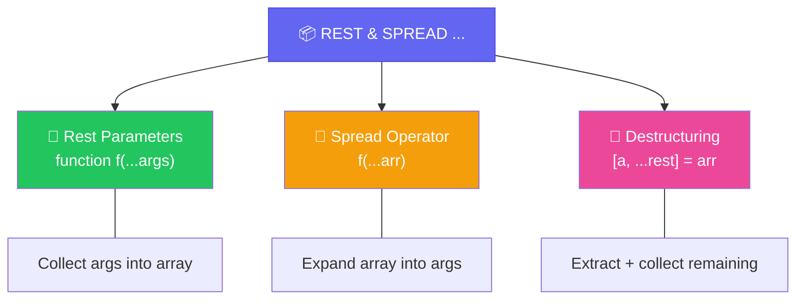

import { Tabs, TabItem, Aside, Badge, Card, CardGrid, Code, LinkCard } from '@astrojs/starlight/components';

## 🔢 Rest & Spread Parameters in JavaScript — Complete Guide

> **ES6+ Rest/Spread** allows functions to accept **zero or more arguments** using `...` syntax — with powerful array manipulation built-in.

<Aside type="tip" title="🎯 MUST KNOW">
**JS Superpowers vs Java Varargs**:  
✅ No overload resolution complexity — JS has no method overloading!  
✅ `...args` is a **real Array** with full method access (`.map()`, `.filter()`)  
✅ Spread operator `...arr` to **expand** arrays at call site  
✅ Works seamlessly with arrow functions, defaults, destructuring  
✅ No heap pollution concerns — no generics erasure!  
</Aside>

---

## 📌 Syntax Comparison: Java vs JS

<Code lang="js" title="Without vs. With Rest Parameters" code={`
// Without rest — manual arguments handling (legacy)
function sumLegacy() {
    let total = 0;
    for (let i = 0; i < arguments.length; i++) {  // ⚠️ 'arguments' is array-like, not real array
        total += arguments[i];
    }
    return total;
}

// With rest parameters — clean, modern, powerful! ✅
function sum(...nums) {              // ...nums is a REAL Array
    return nums.reduce((a, b) => a + b, 0);
}

sum(1, 2, 3);        // ✅ 6
sum(...[1,2,3]);     // ✅ 6 — spread to expand!
`} />

| Feature | Java Varargs | JavaScript Rest/Spread |
|---------|-------------|----------------------|
| **Symbol** | `type... name` | `...name` (no type!) |
| **Internal Type** | Array (`int[]`) | Real `Array` object |
| **Must Be Last** | ✅ Yes | ✅ Yes |
| **Zero Args** | Empty array `new int[0]` | Empty array `[]` |
| **Pass Array** | `method(arr)` ✅ | `method(...arr)` ✅ (spread) |
| **Overloading** | Complex priority rules | ❌ No overloading — simpler! |
| **Null Handling** | Can pass `null` explicitly | `undefined` for missing, `null` is value |
| **Type Safety** | Compile-time checked | Runtime (or TypeScript) |

---

## 🗺️ The Full Map



---

## 🔬 In-Depth — How Rest Parameters Work

Rest parameters are **syntactic sugar** that collects arguments into a **real Array**.

<Code lang="js" title="Rest params = Real Array internally" code={`
function log(...messages) {
    console.log(Array.isArray(messages));  // ✅ true — real Array!
    console.log(messages.length);           // number of args passed
    
    // Full Array methods available:
    messages.map(m => m.toUpperCase());     // ✅
    messages.filter(m => m.length > 3);     // ✅
    messages.reduce((a, b) => a + b, "");   // ✅
}

log("hello", "world", "js");
// messages = ["hello", "world", "js"] — real Array!
`} />

### 🧱 What the Engine Does

```js
// What you write:
function log(level, ...messages) {
    for (const msg of messages) {
        console.log(`[${level}] ${msg}`);
    }
}

log("INFO", "started", "ready", "listening");
```

```js
// What happens internally (conceptual):
// 1. Arguments collected into new Array at call site
// 2. Array passed as last parameter to function
// 3. Inside function: 'messages' is a genuine Array instance

// Call site transformation:
log("INFO", "started", "ready", "listening")
→
const _temp = ["started", "ready", "listening"];  // new Array
log("INFO", ..._temp);  // spread to pass individual args
// Inside: messages = _temp (reference to same array)
```

> 🔑 **Key Insight**: Unlike Java varargs which allocate a new array on **every call**, JS engines can optimize rest/spread patterns. But in hot loops, still be mindful of allocations!

### 💻 Calling Examples — All Valid Patterns

<Code lang="js" title="Flexible calling patterns" code={`
function sum(...nums) {
    return nums.reduce((a, b) => a + b, 0);
}

// Calling patterns:
sum();                    // ✅ zero args → nums = []
sum(10);                  // ✅ one arg  → nums = [10]
sum(1, 2, 3);             // ✅ many args → nums = [1,2,3]
sum(...[1, 2, 3]);        // ✅ spread array → nums = [1,2,3]
sum(...new Set([1,2,2])); // ✅ spread iterable → nums = [1,2]

// Mixed with regular params:
function greet(greeting, ...names) {
    return names.map(n => \`\${greeting}, \${n}!\`);
}
greet("Hello", "Alice", "Bob");  // ✅ ["Hello, Alice!", "Hello, Bob!"]
`} />

### 🧠 Memory Diagram

```text
+---------------------+       +---------------------+
|      Stack          |       |        Heap         |
+---------------------+       +---------------------+
|  sum(1, 2, 3)       |       |  [Array | 1, 2, 3]  |
|                     |       |                     |
|  [nums | @0x55]     |-------+--> (Array Object)   |
+---------------------+       +---------------------+
   Rest param becomes Reference to Real Array
```

<Aside type="note">
**Key Difference from Java**: JS rest params are **real Arrays** from the start — no "array-like" confusion like Java's initial varargs mental model. All Array.prototype methods work immediately! 🎯
</Aside>

---

## 🔄 Spread Operator — The Reverse of Rest

While **rest** (`...args`) **collects** values into an array, **spread** (`...arr`) **expands** an array into individual values.

<Code lang="js" title="Spread operator patterns" code={`
// Function calls
function add(a, b, c) { return a + b + c; }
const nums = [1, 2, 3];
add(...nums);  // ✅ Equivalent to add(1, 2, 3) → 6

// Array literals
const arr1 = [1, 2];
const arr2 = [...arr1, 3, 4];  // ✅ [1, 2, 3, 4] — shallow copy + extend

// Object literals (ES2018+)
const obj1 = { x: 1 };
const obj2 = { ...obj1, y: 2 };  // ✅ { x: 1, y: 2 } — shallow merge

// String expansion
const chars = [..."hello"];  // ✅ ['h', 'e', 'l', 'l', 'o']

// Nested spread for shallow clone
const original = { user: { name: "Alice" } };
const clone = { ...original };  // ⚠️ user object still shared reference!
`} />

<Code lang="js" title="❌ Common spread traps" code={`
// Trap 1: Spread on non-iterable
const num = 123;
[...num];  // ❌ TypeError: num is not iterable

// Trap 2: Spread null/undefined
[...null];        // ❌ TypeError
[...undefined];   // ❌ TypeError

// ✅ Safe pattern with nullish coalescing:
const safe = [...(arr ?? [])];  // Empty array if arr is null/undefined

// Trap 3: Spread only goes one level deep
const nested = { a: { b: 1 } };
const shallow = { ...nested };
shallow.a.b = 99;
console.log(nested.a.b);  // 99 😱 Original mutated!

// ✅ Deep clone: structuredClone(nested) or JSON hack
`} />

---

## ⚠️ Rules — Must Know

### Rule 1 — Rest/Spread Must Be LAST (in their context)

<Code lang="js" title="✅ Valid — rest last in params" code={`
function show(name, ...scores) { }           // ✅ rest last
function show(a, b, ...vals) { }             // ✅ rest last
const fn = (prefix, ...items) => { };        // ✅ arrow function
`} />

<Code lang="js" title="❌ Invalid — rest not last" code={`
function show(...scores, name) { }  // ❌ SyntaxError: Rest parameter must be last
function show(a, ...vals, b) { }     // ❌ SyntaxError: same reason
`} />

### Rule 2 — Only ONE Rest Parameter Per Function

<Code lang="js" title="❌ Multiple rest params not allowed" code={`
function show(...a, ...b) { }  // ❌ SyntaxError: Only one rest parameter allowed
`} />

### Rule 3 — No Overloading Confusion (JS Advantage!)

<Code lang="js" title="✅ JS has no method overloading — simpler!" code={`
// Java trap: can't overload int[] and int... — same signature
// JS: No overloading at all — just one function!

function sum(...nums) {
    return nums.reduce((a,b) => a+b, 0);
}
// Call with any number of args — no ambiguity, no priority rules!
sum(1);        // ✅
sum(1,2,3);    // ✅
sum(...[1,2]); // ✅
`} />

<Aside type="tip">
**Interview Gold**: When asked "How does JS handle variable arguments vs Java?", highlight:  
✅ No overload resolution complexity  
✅ Rest params are real Arrays (not array-like)  
✅ Spread operator for elegant expansion  
✅ Works with arrow functions, defaults, destructuring natively  
</Aside>

### Rule 4 — Rest with Default Parameters

<Code lang="js" title="✅ Rest + defaults = powerful patterns" code={`
// Default for regular param, rest collects remainder
function create_user({ role = "guest", permissions = [] } = {}, ...tags) {
    return { role, permissions, tags };
}

create_user({ role: "admin" }, "verified", "premium");
// → { role: "admin", permissions: [], tags: ["verified", "premium"] }

// Rest with default array (rare but valid)
function log(level = "INFO", ...messages = []) {  // ⚠️ Default on rest is unusual
    // Better: handle empty inside function
}
`} />

### Rule 5 — Rest Parameters vs `arguments` Object

<Tabs>
  <TabItem label="Legacy: arguments object">
    <Code lang="js" title="arguments is array-like, not real array" code={`function legacySum() {
    // arguments is NOT a real Array:
    console.log(Array.isArray(arguments));  // ❌ false
    
    // Can't use Array methods directly:
    // arguments.map(x => x*2);  // ❌ TypeError
    
    // Must convert first:
    const args = Array.from(arguments);  // or [...arguments]
    return args.reduce((a,b) => a+b, 0);
}`} />
  </TabItem>
  
  <TabItem label="Modern: rest parameters">
    <Code lang="js" title="Rest params are real Arrays" code={`function modernSum(...nums) {
    // nums IS a real Array:
    console.log(Array.isArray(nums));  // ✅ true
    
    // Use Array methods directly:
    return nums
        .filter(n => n > 0)
        .reduce((a, b) => a + b, 0);
}`} />

    <Aside type="tip">
      **Best Practice**: Always prefer rest parameters (`...args`) over `arguments`.  
      Only use `arguments` when supporting very old environments (pre-ES6) or for arrow function workarounds.
    </Aside>
  </TabItem>
  
  <TabItem label="Arrow function trap">
    <Code lang="js" title="Arrow functions don't have their own 'arguments'" code={`const arrow = function() {
    console.log(arguments);  // ✅ Works (regular function)
};

const arrowBad = () => {
    console.log(arguments);  // ❌ ReferenceError: arguments not defined
    // Arrow functions inherit 'arguments' from enclosing scope!
};

// ✅ Fix: Use rest parameters with arrows
const arrowGood = (...args) => {
    console.log(args);  // ✅ Real array, works perfectly
};`} />
  </TabItem>
</Tabs>

### Rule 6 — Type Safety with TypeScript

<Code lang="ts" title="TypeScript adds compile-time safety" code={`
// Typed rest parameters
function sum(...nums: number[]): number {
    return nums.reduce((a, b) => a + b, 0);
}

sum(1, 2, 3);        // ✅
sum("1", "2");       // ❌ TS Error: Argument of type 'string' is not assignable

// Generic rest parameters (like Java generic varargs)
function flatten<T>(...arrays: T[][]): T[] {
    return arrays.flat();  // ✅ Type-safe flattening
}

// ⚠️ Heap pollution equivalent in TS: be careful with generic arrays
function dangerous<T>(...items: T[]): void {
    const arr: any[] = items;  // ⚠️ Type assertion bypasses safety
    arr.push("not T");         // Runtime type mismatch possible
}

// ✅ Safer: readonly rest params (TS 3.4+)
function safeReadonly<T>(...items: readonly T[]): void {
    // items.push(...)  // ❌ TS Error: Cannot assign to 'push' because it is read-only
}
`} />

---

## 🎁 Advanced Patterns: Destructuring + Rest

<Code lang="js" title="Extract first, collect rest" code={`
// Array destructuring with rest
const [first, second, ...rest] = [1, 2, 3, 4, 5];
// first=1, second=2, rest=[3,4,5]

// Skip values with rest
const [, , ...tail] = [1, 2, 3, 4];  // tail=[3,4]

// Object destructuring with rest (ES2018+)
const { name, age, ...extra } = { 
    name: "Alice", 
    age: 25, 
    city: "NYC", 
    role: "admin" 
};
// name="Alice", age=25, extra={ city: "NYC", role: "admin" }

// Function parameter destructuring + rest
function handleEvent({ type, target, ...data }, ...handlers) {
    // type, target extracted; data = remaining event props
    // handlers = array of callback functions
    handlers.forEach(fn => fn({ type, target, data }));
}
`} />

<Code lang="js" title="Real-world: API response handling" code={`
// Clean API client with rest/spread
async function fetchAPI(endpoint, { headers = {}, ...params } = {}, ...middlewares) {
    const url = new URL(endpoint, BASE_URL);
    
    // Spread query params
    Object.entries(params).forEach(([k, v]) => 
        url.searchParams.append(k, v)
    );
    
    // Merge default + provided headers
    const requestHeaders = { 
        'Content-Type': 'application/json',
        ...headers  // provided headers override defaults
    };
    
    let response = await fetch(url, { headers: requestHeaders });
    
    // Apply middleware chain (rest params as functions)
    for (const middleware of middlewares) {
        response = await middleware(response);
    }
    
    return response.json();
}

// Usage — clean, composable, type-safe with TS
const user = await fetchAPI(
    '/users/123',
    { fields: 'name,email', include: 'posts' },  // spread into query params
    authMiddleware,                              // rest: middleware chain
    loggingMiddleware,
    cacheMiddleware
);
`} />

---

## 🚨 Common Runtime Behaviors & Traps

<CardGrid>
  <Card title="Trap 1 — Spread on non-iterable" icon="error">
    ```js
    const num = 42;
    [...num];  // ❌ TypeError: num is not iterable
    
    // ✅ Safe pattern:
    const safe = Array.isArray(val) ? [...val] : [val];
    // Or with nullish:
    const safe = [...(iterable ?? [])];
    ```
  </Card>
  
  <Card title="Trap 2 — Rest params are NOT array-like" icon="information">
    ```js
    function test(...args) {
        // args is REAL Array — not array-like!
        console.log(args instanceof Array);  // ✅ true
        console.log(typeof args.push);       // ✅ "function"
        
        // Contrast with legacy 'arguments':
        function legacy() {
            console.log(arguments instanceof Array);  // ❌ false
            console.log(typeof arguments.push);       // ❌ "undefined"
        }
    }
    ```
  </Card>
  
  <Card title="Trap 3 — Spread creates shallow copy" icon="caution">
    ```js
    const original = { user: { name: "Alice" } };
    const clone = { ...original };
    
    clone.user.name = "Bob";
    console.log(original.user.name);  // "Bob" 😱 Original mutated!
    
    // ✅ Deep clone options:
    const deep1 = structuredClone(original);  // Modern, handles dates, maps
    const deep2 = JSON.parse(JSON.stringify(original));  // ⚠️ Loses functions, undefined
    ```
  </Card>
  
  <Card title="Trap 4 — Rest + arrow function 'this'" icon="error">
    ```js
    class Handler {
        constructor() {
            this.prefix = "[LOG]";
        }
        
        // ❌ Regular method: 'this' depends on call site
        logBad(...msgs) {
            console.log(this.prefix, ...msgs);  // this.prefix may be undefined!
        }
        
        // ✅ Arrow method: 'this' lexically bound
        logGood = (...msgs) => {
            console.log(this.prefix, ...msgs);  // Always correct 'this'
        }
    }
    
    const h = new Handler();
    const fn = h.logBad;
    fn("test");  // ❌ this.prefix is undefined
    
    const fn2 = h.logGood;
    fn2("test"); // ✅ "[LOG] test"
    ```
  </Card>
  
  <Card title="Trap 5 — Performance in hot loops" icon="caution">
    ```js
    // Called 100K times in render loop
    function render(...elements) {
        // new Array allocated every call for rest params
        elements.forEach(el => el.draw());
    }
    
    // ✅ Optimize: accept array directly for hot paths
    function renderFast(elements) {
        // Caller reuses array — no allocation per call
        for (const el of elements) el.draw();
    }
    
    // Usage:
    const cache = [el1, el2, el3];
    renderFast(cache);  // Reuse — zero allocations
    ```
  </Card>
</CardGrid>

---

## 🔥 JavaScript Interview Traps

<CardGrid>
  <Card title="Trap 1 — arguments vs rest in nested functions" icon="error">
    ```js
    function outer(...outerArgs) {
        function inner() {
            console.log(arguments);  // ✅ inner's arguments (not outer's!)
            console.log(outerArgs);  // ✅ outer's rest params (closure)
        }
        inner(1, 2);  // arguments = [1,2]; outerArgs = whatever outer received
    }
    
    // ✅ Modern pattern: pass rest explicitly
    const inner = (...innerArgs) => {
        console.log(outerArgs, innerArgs);  // Clear, no confusion
    };
    ```
  </Card>
  
  <Card title="Trap 2 — Spread with strings vs arrays" icon="caution">
    ```js
    const str = "hello";
    [...str];        // ✅ ['h','e','l','l','o'] — spreads by Unicode code points
    
    const emoji = "👨‍👩‍👧‍👦";
    [...emoji];      // ✅ ['👨','‍','👩','‍','👧','‍','👦'] — 7 elements!
    
    // ✅ For grapheme clusters (user-perceived characters):
    Array.from(emoji);  // Still 7 — need Intl.Segmenter for true clusters (ES2022+)
    ```
  </Card>
  
  <Card title="Trap 3 — Rest params with default values" icon="error">
    ```js
    function test(a = 1, ...rest) {
        console.log(a, rest);
    }
    
    test();           // a=1, rest=[] ✅
    test(undefined);  // a=1, rest=[] ✅ (undefined triggers default)
    test(null);       // a=null, rest=[] ✅ (null is a value, doesn't trigger default)
    
    // ⚠️ Rest params themselves can't have defaults in standard JS:
    function bad(...args = []) {}  // ❌ SyntaxError
    ```
  </Card>
  
  <Card title="Trap 4 — Spread order matters in object merge" icon="caution">
    ```js
    const defaults = { theme: "light", lang: "en" };
    const userPrefs = { theme: "dark" };
    
    // ✅ User prefs override defaults:
    const config = { ...defaults, ...userPrefs };
    // → { theme: "dark", lang: "en" }
    
    // ❌ Reversed: defaults override user (bug!)
    const buggy = { ...userPrefs, ...defaults };
    // → { theme: "light", lang: "en" } 😱 User choice lost!
    
    // 🎯 Rule: Later spread wins — order intentionally!
    ```
  </Card>
  
  <Card title="Trap 5 — Rest params in method shorthand" icon="information">
    ```js
    const obj = {
        // ✅ Method shorthand with rest
        log(...msgs) {
            console.log(this.prefix, ...msgs);
        },
        
        // ✅ Arrow function property with rest
        logArrow: (...msgs) => {
            // ⚠️ 'this' is lexical — may not be obj!
        }
    };
    
    // 🎯 Interview tip: Know when to use method shorthand vs arrow property
    ```
  </Card>
</CardGrid>

---

## 🧠 DSA Connection

<CardGrid>
  <Card title="Pattern: Variadic Utility Functions" icon="code">
    ```js
    // Find max of any number of values — clean call site
    const max = (...nums) => Math.max(...nums);
    
    max(3, 1, 4, 1, 5, 9);  // ✅ 9 — no array wrapping needed
    
    // With validation
    const safeMax = (...nums) => {
        if (nums.length === 0) throw new Error("At least one argument required");
        return Math.max(...nums);
    };
    ```
  </Card>
  
  <Card title="Pattern: Function Composition with Rest/Spread" icon="code">
    ```js
    // Compose any number of functions: right-to-left application
    const compose = (...fns) => (initial) => 
        fns.reduceRight((arg, fn) => fn(arg), initial);
    
    // Usage:
    const add2 = x => x + 2;
    const double = x => x * 2;
    const square = x => x * x;
    
    const transform = compose(square, double, add2);
    transform(3);  // ((3+2)*2)² = 100 ✅
    
    // 🎯 Rest params enable elegant higher-order function APIs!
    ```
  </Card>
  
  <Card title="Pattern: Array Algorithms with Spread" icon="code">
    ```js
    // Merge sorted arrays — spread for clean expansion
    const mergeSorted = (a, b) => {
        const result = [];
        let i = 0, j = 0;
        
        while (i < a.length && j < b.length) {
            result.push(a[i] <= b[j] ? a[i++] : b[j++]);
        }
        // Spread remaining elements — clean!
        return [...result, ...a.slice(i), ...b.slice(j)];
    };
    
    // Remove duplicates using Set + spread
    const unique = (...arrs) => [...new Set(arrs.flat())];
    unique([1,2], [2,3], [3,4]);  // ✅ [1,2,3,4]
    ```
  </Card>
</CardGrid>

<Aside type="tip">
**Pro Tip**: Use rest parameters for public API functions where callers pass ad-hoc values. Use explicit array parameters for internal functions where data is already in array form (from API responses, file I/O, etc.). This signals intent and avoids unnecessary spread/rest conversions! 🎯
</Aside>

---

## 🧪 Quick Self-Test

<Code lang="js" title="Predict the output" code={`// Q1: Rest params are real arrays
function test(...args) {
    console.log(Array.isArray(args), typeof args.push);
}
test(1,2,3);

// Q2: Spread order in object merge
const a = { x: 1, y: 2 };
const b = { y: 99, z: 3 };
const c = { ...a, ...b };
console.log(c.y);

// Q3: Rest with arrow function 'this'
class Counter {
    count = 0;
    inc = (...vals) => {
        this.count += vals.length;  // 'this' is lexically bound
    };
}
const c = new Counter();
const fn = c.inc;
fn(1,2,3);
console.log(c.count);

// Q4: Spread non-iterable trap
try {
    console.log([...42]);
} catch(e) {
    console.log(e.name);
}`} />

<details>
<summary>✅ Click to reveal answers</summary>

```text
Q1: true "function"    // rest params are real Arrays with all methods
Q2: 99                 // later spread wins: b.y overrides a.y
Q3: 3                  // arrow function preserves 'this' binding
Q4: TypeError          // 42 is not iterable — spread requires iterable
```
</details>

---

## 📌 Quick Revision Cheat Sheet <Badge text="MUST KNOW" variant="tip" />

```js
// 🎯 REST PARAMETERS (...args)
function f(...args) {}        // Collects args into real Array
const arrow = (...args) => {} // Works with arrow functions
function f(a, ...rest) {}     // Regular param + rest (rest must be last)

// 🎯 SPREAD OPERATOR (...iterable)
f(...arr)                     // Expand array into function args
[...arr1, ...arr2]            // Merge arrays (shallow)
{ ...obj1, ...obj2 }          // Merge objects (shallow, later wins)
[..."str"]                    // String → array of chars

// 🎯 DESTRUCTURING + REST
const [first, ...rest] = arr  // Extract first, collect remainder
const { x, ...others } = obj  // Extract x, collect remaining props

// 🎯 COMMON PATTERNS
const sum = (...nums) => nums.reduce((a,b)=>a+b, 0)  // Variadic utility
const clone = { ...obj }                              // Shallow clone
const merge = (defaults, overrides) => ({...defaults, ...overrides})

// 🎯 SAFE PATTERNS
[...(iterable ?? [])]         // Handle null/undefined before spread
Array.isArray(val) ? val : [val]  // Ensure array before operations
structuredClone(obj)          // Deep clone (modern, handles dates/maps)

// 🎯 PERFORMANCE AWARE
// Hot loop: prefer explicit array param to avoid rest allocation
function renderFast(elements) { /* reuse array */ }
// Ad-hoc API: rest params for clean call site
function log(...messages) { /* flexible */ }

// 🎯 INTERVIEW GOLD
// "JS rest params are real Arrays; Java varargs become arrays internally"
// "Spread expands, rest collects — same syntax, opposite operations"
// "No method overloading in JS — simpler dispatch than Java varargs"
// "Arrow functions don't have 'arguments' — use rest params instead"
```

---

## 🔗 Related Topics

<CardGrid columns={2}>
  <LinkCard
    title="JavaScript Functions"
    href="/computer-languages/javascript/topics/functions"
    description="Arrow functions, closures, higher-order functions, this binding"
  />
  <LinkCard
    title="JavaScript Arrays"
    href="/computer-languages/javascript/topics/arrays"
    description="Array methods, iteration, sparse arrays, TypedArrays"
  />
  <LinkCard
    title="JavaScript Destructuring"
    href="/computer-languages/javascript/topics/destructuring"
    description="Array/object destructuring, defaults, nested patterns"
  />
  <LinkCard
    title="TypeScript Generics"
    href="/computer-languages/typescript/topics/generics"
    description="Generic functions, constraints, variance, rest with types"
  />
</CardGrid>

<Aside type="note">
🎯 **Production Pro Tips**  
1. Prefer rest parameters over `arguments` — real Arrays are safer and more powerful  
2. Use `structuredClone()` for deep copies; spread only does shallow  
3. In hot loops, accept explicit arrays to avoid rest allocation overhead  
4. With TypeScript, add `readonly` to rest params when mutation isn't needed  
5. Use ESLint rules: `prefer-rest-params`, `prefer-spread` for modern patterns  
6. Document when functions accept `...args` — it's part of your public API contract 🛡️
</Aside>

> 💡 **Final Wisdom**: JavaScript rest/spread parameters are **elegant and powerful** — they eliminate Java's varargs complexity while adding array manipulation superpowers. Master the patterns above, and you'll write cleaner, more expressive, interview-ready code! 🚀✨

*Converted for Astro 6 + Starlight • Optimized for interview prep + production use • Quality >>>> Quantity* 🎯
```

---

## 🔄 Java Varargs → JS Rest/Spread Conversion Summary

| Java Feature | JavaScript Equivalent | Critical Difference |
|-------------|----------------------|-------------------|
| `void f(int... nums)` | `function f(...nums)` | ✅ Same `...` syntax, but JS has no type declaration |
| Internally `int[]` | Real `Array` object | ✅ JS rest params are genuine Arrays with full prototype |
| Must be last param | Must be last param | ✅ Same constraint |
| Only one varargs | Only one rest param | ✅ Same constraint |
| Overload priority rules | ❌ No overloading | ✅ JS simpler — no ambiguity resolution needed |
| Can pass array directly | Must spread: `f(...arr)` | ⚠️ JS requires explicit `...` to expand array |
| Zero args → empty array | Zero args → empty array | ✅ Same behavior |
| Can pass `null` explicitly | `null` is a value, not special | ✅ JS: `f(null)` → `args = [null]` |
| `@SafeVarargs` for generics | No equivalent needed | ✅ JS has no type erasure; TS handles via types |
| ACC_VARARGS bytecode flag | No special flag | ✅ JS engine handles rest/spread natively |
| Heap pollution risk with generics | No generics → no pollution | ✅ JS avoids this entire class of bugs |
| `arguments` object (legacy) | Rest params (modern) | ✅ Prefer `...args` — real Array vs array-like |

---

🧠 **Interview Power Move**: When asked about variable arguments, always mention:  
1. Rest params are **real Arrays** — use `.map()`, `.filter()` directly  
2. **Spread operator** `...arr` expands; **rest** `...args` collects — same syntax, opposite!  
3. **No overloading complexity** in JS — simpler than Java's priority rules  
4. **Arrow functions** don't have `arguments` — always use rest params instead  
5. **Performance**: Rest allocates new Array per call — use explicit array param in hot loops  

# 🎛️ Variable Arguments in JavaScript

---

## 🔰 What Are Variable Arguments?

Variable arguments = accepting a **flexible, unknown number of arguments** into a function — without declaring each parameter by name.

Two mechanisms:
```
1. arguments object  → legacy, pre-ES6, array-LIKE (not real array)
2. rest parameters   → modern, real array, composable
```

---

## 🗺️ Complete Map

```
Variable Arguments
│
├── 📦 arguments object
│   ├── available in all non-arrow functions
│   ├── array-like (has length, indices)
│   ├── NOT a real Array (no .map, .filter etc)
│   ├── contains ALL args (named + extra)
│   ├── linked to named params (sloppy mode trap)
│   └── NOT available in arrow functions
│
└── 📋 rest parameters  (...args)
    ├── real Array
    ├── only EXTRA args (after named params)
    ├── must be LAST parameter
    ├── works in arrow functions
    ├── works in destructuring
    └── replaces arguments in modern JS
```

---

## 1️⃣ `arguments` Object — Full Deep Dive

### Basic Behavior
```js
function sum() {
  console.log(arguments);
  // Arguments [1, 2, 3, callee: f, Symbol.iterator: f]

  console.log(arguments[0]);     // 1
  console.log(arguments.length); // 3
  console.log(Array.isArray(arguments)); // false — NOT an array
}

sum(1, 2, 3);
```

### Converting `arguments` to Real Array
```js
function demo() {
  // Method 1 — Array.from (preferred):
  const args = Array.from(arguments);

  // Method 2 — spread:
  const args = [...arguments];

  // Method 3 — slice (old way):
  const args = Array.prototype.slice.call(arguments);

  // Method 4 — Array.prototype.slice (older libs):
  const args = [].slice.call(arguments);

  args.map(x => x * 2); // ✅ now works
}
```

### The Live Binding Trap — Sloppy Mode
```js
// In SLOPPY mode — arguments and named params are LINKED:
function trap(a, b) {
  console.log(a, arguments[0]); // 1, 1
  a = 99;
  console.log(a, arguments[0]); // 99, 99 😱 — arguments[0] changed!
  arguments[1] = 999;
  console.log(b, arguments[1]); // 999, 999 😱 — b changed!
}
trap(1, 2);

// In STRICT mode — link is BROKEN:
function safe(a, b) {
  "use strict";
  a = 99;
  console.log(a, arguments[0]); // 99, 1 ✅ — independent
}
safe(1, 2);
```

```
┌──────────────────────────────────────────────────────────┐
│          SLOPPY MODE — arguments LIVE BINDING            │
│                                                          │
│  function fn(a, b) { ... }  called as fn(1, 2)          │
│                                                          │
│  Named Param    ←——— two-way link ———→  arguments slot   │
│  ┌─────────┐                           ┌─────────────┐  │
│  │  a = 1  │ ◄────────────────────────►│arguments[0] │  │
│  │  b = 2  │ ◄────────────────────────►│arguments[1] │  │
│  └─────────┘                           └─────────────┘  │
│                                                          │
│  Change a   → arguments[0] changes                       │
│  Change arguments[0] → a changes                         │
│                                                          │
│  STRICT MODE: link does not exist — fully independent    │
└──────────────────────────────────────────────────────────┘
```

### `arguments` is NOT available in arrow functions
```js
const arrowFn = () => {
  console.log(arguments); // ❌ ReferenceError in strict/module
                           // or gets outer function's arguments 😱
};

function outer() {
  const inner = () => {
    console.log(arguments); // outer's arguments — not inner's 😱
  };
  inner(99); // 99 is ignored — arguments belongs to outer
}
outer(1, 2, 3);
inner(); // arguments = [1, 2, 3] from outer
```

### `arguments.callee` — Deprecated
```js
// Pre-ES6 recursive pattern with anonymous functions:
const factorial = function(n) {
  if (n <= 1) return 1;
  return n * arguments.callee(n - 1); // ❌ deprecated
};

// Strict mode — throws TypeError:
"use strict";
function fn() {
  arguments.callee; // ❌ TypeError
}

// Modern replacement — named function expression:
const factorial = function fact(n) {
  if (n <= 1) return 1;
  return n * fact(n - 1); // ✅ self-reference by name
};
```

---

## 2️⃣ Rest Parameters — Full Deep Dive

### Basic Syntax
```js
// ...name collects ALL remaining args into real Array
function sum(...nums) {
  return nums.reduce((acc, n) => acc + n, 0);
}

sum(1, 2, 3, 4, 5); // 15
sum();               // 0 — nums = [] (empty array, not undefined)
```

### Named Params + Rest
```js
// Rest MUST be last:
function log(level, timestamp, ...messages) {
  console.log(`[${level}] ${timestamp}:`, messages.join(" | "));
}

log("ERROR", "2024-01-01", "DB failed", "retrying", "timeout");
// [ERROR] 2024-01-01: DB failed | retrying | timeout

// level     = "ERROR"
// timestamp = "2024-01-01"
// messages  = ["DB failed", "retrying", "timeout"] ← real Array
```

### Rest vs `arguments` — Key Differences

| Feature | `arguments` | `...rest` |
|---|---|---|
| Real Array | ❌ | ✅ |
| Arrow function | ❌ | ✅ |
| Only extra args | ❌ (all args) | ✅ (after named) |
| Must be last param | N/A | ✅ |
| Has `.map`, `.filter` | ❌ | ✅ |
| `length` property | ✅ | ✅ |
| Sloppy mode link | ✅ (dangerous) | ❌ |

---

## ⚙️ Deep Dive — How V8 Handles Variable Arguments

### `arguments` Object Internals
```
When function is called:
  V8 builds a Arguments object:

  ┌──────────────────────────────────────┐
  │         Arguments Object             │
  │  (type: JSArgumentsObject)           │
  │                                      │
  │  ┌─────────────────────────────┐     │
  │  │ length: 3                   │     │
  │  │ [0]: value1                 │     │
  │  │ [1]: value2                 │     │
  │  │ [2]: value3                 │     │
  │  │ callee: <fn ref>            │     │
  │  │ [Symbol.iterator]: <fn>     │     │
  │  └─────────────────────────────┘     │
  │                                      │
  │  Sloppy: shares slots with params    │
  │  Strict:  MappedArguments →          │
  │           UnmappedArguments (copy)   │
  └──────────────────────────────────────┘
```

### Rest Parameter Internals
```
...rest is resolved at call site by the engine:

  caller pushes args onto stack:
  ┌────────────────────────────┐
  │ arg[0] = "ERROR"           │ → named param: level
  │ arg[1] = "2024"            │ → named param: timestamp
  │ arg[2] = "DB failed"       │ ─┐
  │ arg[3] = "retrying"        │  ├→ collected into new JSArray
  │ arg[4] = "timeout"         │ ─┘   stored as 'messages'
  └────────────────────────────┘

  V8 allocates JSArray on heap — real array, GC managed
  No live link to stack — completely independent
```

### TurboFan Optimization Impact
```js
// arguments object BLOCKS optimization in old V8:
function bad() {
  return arguments; // leaking arguments → deopt
}

function good(...args) {
  return args; // rest is a normal array → no deopt
}

// Leaking arguments = TurboFan cannot inline this function
// because it doesn't know the shape of arguments at call sites
```

---

## 🔄 Destructuring + Rest Together

```js
// Array destructuring + rest:
const [first, second, ...remaining] = [1, 2, 3, 4, 5];
// first = 1, second = 2, remaining = [3, 4, 5]

// Object destructuring + rest:
const { a, b, ...others } = { a:1, b:2, c:3, d:4 };
// a = 1, b = 2, others = { c: 3, d: 4 }

// In function params — most powerful form:
function processRequest({ method, url, headers, ...options }) {
  console.log(method, url);    // known fields
  console.log(options);        // everything else: body, timeout, etc.
}

processRequest({
  method: "POST",
  url: "/api/users",
  headers: { "Content-Type": "application/json" },
  body: JSON.stringify({ name: "Ali" }),
  timeout: 5000
});
// method  = "POST"
// url     = "/api/users"
// headers = { ... }
// options = { body: '...', timeout: 5000 }
```

---

## 🔁 Spread vs Rest — Same Syntax, Opposite Direction

```
┌─────────────────────────────────────────────────────────┐
│              SPREAD vs REST                             │
│                                                         │
│  REST   — COLLECT  — in function DEFINITION             │
│  ─────────────────────────────────────────              │
│  function fn(...args) {}                                │
│              ↑                                          │
│              many args → one array                      │
│                                                         │
│  SPREAD — EXPAND   — at function CALL SITE              │
│  ─────────────────────────────────────────              │
│  fn(...myArray)                                         │
│     ↑                                                   │
│     one array → many args                               │
└─────────────────────────────────────────────────────────┘
```

```js
// REST — collects:
function sum(...nums) { // nums = [1,2,3]
  return nums.reduce((a, b) => a + b);
}

// SPREAD — expands:
const nums = [1, 2, 3];
sum(...nums);  // same as sum(1, 2, 3)

// Together — real pattern:
function logger(prefix, ...args) {
  console.log(prefix, ...args); // spread back out to console.log
}
logger("[INFO]", "user", "logged", "in");
// [INFO] user logged in
```

---

## 🏭 Real Production Patterns

### Pattern 1 — Variadic Logger (Real Prod)
```js
class Logger {
  #prefix;

  constructor(prefix) { this.#prefix = prefix; }

  info(...args) {
    console.log(`[INFO][${this.#prefix}]`, ...args);
  }

  error(...args) {
    console.error(`[ERROR][${this.#prefix}]`, ...args);
    // ship to Sentry, DataDog etc:
    errorTracker.capture(args.join(" "));
  }
}

const log = new Logger("AuthService");
log.info("User", userId, "logged in from", ip);
// [INFO][AuthService] User 42 logged in from 192.168.1.1
```

### Pattern 2 — Function Composition with Variable Args
```js
// Pipe — left to right execution:
const pipe = (...fns) => (value) =>
  fns.reduce((acc, fn) => fn(acc), value);

const process = pipe(
  x => x.trim(),
  x => x.toLowerCase(),
  x => x.replace(/\s+/g, "-")
);

process("  Hello World  "); // "hello-world"
```

### Pattern 3 — Middleware System (Express-style)
```js
class Router {
  #middlewares = [];

  use(...fns) { // accepts 1 or many middleware functions
    this.#middlewares.push(...fns);
    return this;
  }

  async run(ctx) {
    for (const fn of this.#middlewares) {
      await fn(ctx);
    }
  }
}

router
  .use(authMiddleware)
  .use(rateLimiter, bodyParser, validator) // multiple at once
  .use(handler);
```

### Pattern 4 — Memoization with Variable Args
```js
function memoize(fn) {
  const cache = new Map();

  return function(...args) {
    const key = JSON.stringify(args); // args is real array → serializable
    if (cache.has(key)) return cache.get(key);
    const result = fn.apply(this, args);
    cache.set(key, result);
    return result;
  };
}

const expensiveCalc = memoize(function(a, b, c) {
  // simulate heavy work
  return a * b + c;
});

expensiveCalc(1, 2, 3); // computed
expensiveCalc(1, 2, 3); // cache hit ✅
```

### Pattern 5 — Event Emitter with Variable Args
```js
class EventEmitter {
  #events = new Map();

  on(event, handler) {
    if (!this.#events.has(event)) this.#events.set(event, []);
    this.#events.get(event).push(handler);
    return this;
  }

  emit(event, ...args) { // variable args forwarded to handlers
    if (!this.#events.has(event)) return;
    this.#events.get(event).forEach(handler => handler(...args));
  }
}

const emitter = new EventEmitter();
emitter.on("data", (chunk, encoding) => {
  console.log("received", chunk, encoding);
});
emitter.emit("data", Buffer.from("hello"), "utf8");
```

---

## 💀 Interview Traps

### Trap 1: Arrow function — no `arguments`, inherits outer

```js
function outer() {
  const inner = () => {
    console.log(arguments[0]); // outer's arg — NOT inner's 😱
  };
  inner(999); // 999 is ignored
}
outer(42); // prints 42 — NOT 999

// Senior dev assumes arrow has own arguments — silent wrong value in prod
// Fix: use rest params in arrow functions
const inner = (...args) => {
  console.log(args[0]); // 999 ✅
};
```

---

### Trap 2: Rest cannot be followed by any parameter

```js
// SyntaxError — rest must be last:
function fn(...args, last) {} // ❌ SyntaxError
function fn(first, ...args, last) {} // ❌ SyntaxError

// Only valid at the END:
function fn(first, ...args) {} // ✅
```

---

### Trap 3: `arguments` length vs parameter length mismatch

```js
function fn(a, b, c) {
  console.log(fn.length);       // 3 — declared params
  console.log(arguments.length); // actual args passed
}

fn(1);       // fn.length=3, arguments.length=1
fn(1,2,3,4); // fn.length=3, arguments.length=4

// fn.length does NOT count rest params:
function fn2(a, ...rest) {}
fn2.length; // 1 — only named params before rest

// fn.length does NOT count default params:
function fn3(a, b = 5, c) {}
fn3.length; // 1 — stops counting at first default 😱
```

---

### Trap 4: `arguments` in `forEach` callback

```js
function outer() {
  [1, 2, 3].forEach(function(item) {
    console.log(arguments[0]); // item — this forEach callback's arguments
    // NOT outer's arguments 😱
    // Each function has its own arguments object
  });
}
outer(99); // prints 1, 2, 3 — NOT 99
```

---

### Trap 5: Sloppy mode — arguments mutation breaks named param

```js
// Real prod bug — library in sloppy mode:
function formatUser(name, role) {
  normalize(arguments); // some utility mutates arguments[0]
  console.log(name);    // 😱 name is now mutated too
}

function normalize(args) {
  args[0] = args[0].trim().toLowerCase(); // mutates arguments object
}

formatUser("  ALICE  ", "admin");
// name → "alice" — silently changed 😱
// Fix: strict mode OR rest params (no live link)
```

---

### Trap 6: Spread on `arguments` vs rest on performance

```js
// Every call creates a new Arguments object — heap allocation:
function bad() {
  const args = [...arguments]; // spread arguments → 2 allocations
  return args.reduce((a, b) => a + b);
}

// Rest — ONE allocation (the array itself):
function good(...args) {        // args is already a real array
  return args.reduce((a, b) => a + b);
}

// In a hot loop called millions of times:
// bad() creates Arguments object + spread copy = GC pressure
// good() creates one array = GC friendly
```

---

## 📊 DSA / Internals Connection

> `arguments` is a **lazy array-like object** — it's a special object with integer keys, backed by the actual call stack frame in sloppy mode. The live binding is essentially a **pointer aliasing** problem — two names pointing to the same memory location. This is identical to pointer aliasing bugs in C/C++ where two pointers point to the same memory and mutations via one affect the other unexpectedly.
>
> Rest parameters are implemented as a proper **heap-allocated dynamic array** — same as `std::vector` in C++. The engine copies remaining args off the stack into this array at call time. Clean, isolated, no aliasing.

---

