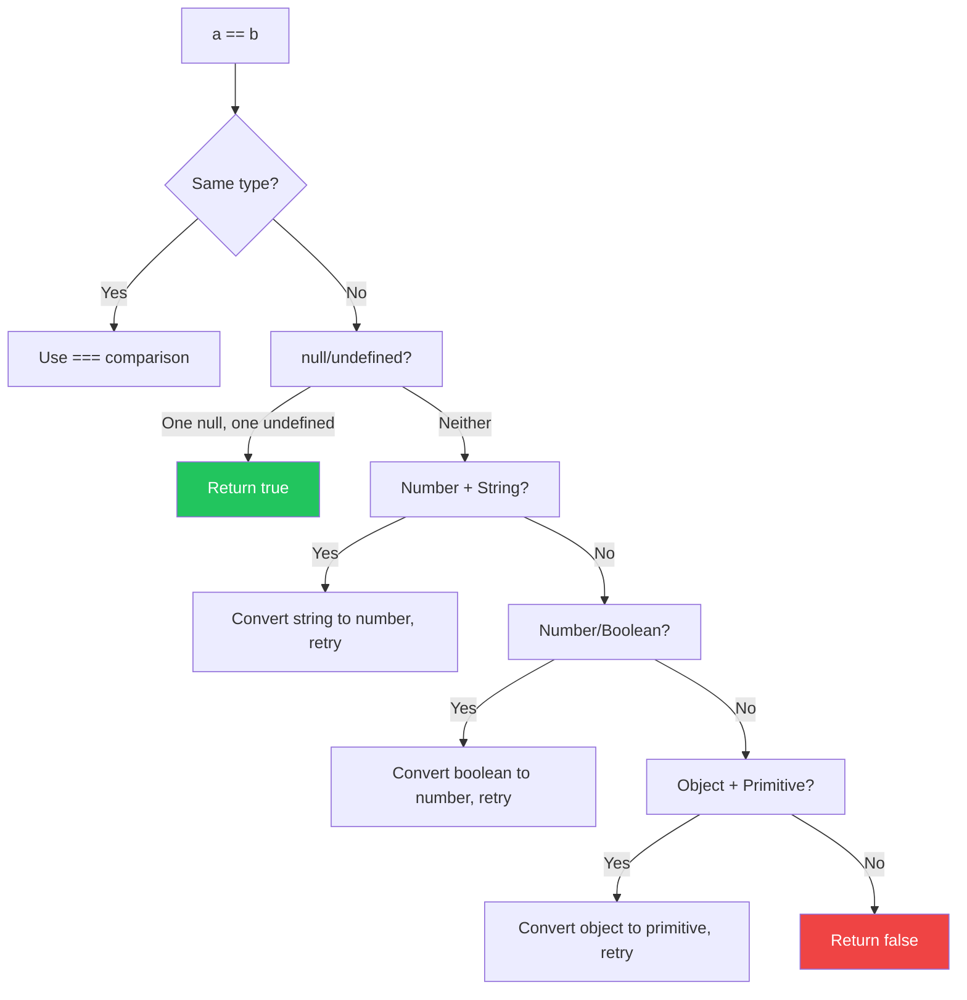

import { Tabs, TabItem, Aside, Badge, Card, CardGrid, Code, LinkCard } from '@astrojs/starlight/components';

## 4️⃣ Relational Operators in JavaScript

```text
Relational Operators
│
├── Comparison Operators
│   ├── >    greater than
│   ├── <    less than
│   ├── >=   greater than or equal to
│   └── <=   less than or equal to
│
├── Equality Operators
│   ├── ==   loose equality (with coercion) ⚠️
│   ├── !=   loose inequality (with coercion) ⚠️
│   ├── ===  strict equality (no coercion) ✅
│   └── !==  strict inequality (no coercion) ✅
│
└── Type Check
    └── instanceof   checks prototype chain at runtime
```

<Code lang="js" title="Basic usage — always return boolean" code={`
let a = 10, b = 20;

console.log(a == b);   // false
console.log(a != b);   // true
console.log(a >  b);   // false
console.log(a <  b);   // true
console.log(a >= b);   // false
console.log(a <= b);   // true

// All return boolean — can be used in any boolean context
let result = a > b;           // ✅ false
let x = a > b ? 1 : 0;        // ✅ ternary works
console.log(a > b && "yes");  // ✅ short-circuit evaluation
`} />

<Aside type="tip" title="🎯 MUST KNOW">
**JS Superpowers vs Java**:  
✅ **Two equality operators**: `==` (coercing) and `===` (strict) — choose intentionally!  
✅ **Relational operators coerce** — `"5" > 3` works (but be careful!)  
✅ **No compile-time type checks** — errors appear at runtime, not compile time  
✅ **`typeof` + `instanceof`** for runtime type introspection  
✅ **`null` vs `undefined`** — two distinct "empty" values with different coercion rules  
</Aside>

---

## 🔑 Rule 1: Relational Operators Work on Coercible Types

JavaScript relational operators attempt **type coercion** before comparison.

<Code lang="js" title="✅ Valid comparisons with coercion" code={`
// Numbers — expected behavior
console.log(10 > 5);           // true
console.log(3.14 >= 3.0);      // true

// String vs Number — string coerced to number!
console.log("10" > 5);         // true ("10" → 10)
console.log("5" < 10);         // true ("5" → 5)
console.log("abc" > 5);        // false ("abc" → NaN, NaN comparisons are false)

// Boolean coercion: true→1, false→0
console.log(true == 1);        // true (true → 1)
console.log(false < 1);        // true (false → 0 < 1)

// null/undefined coercion quirks
console.log(null == 0);        // false (null only == undefined)
console.log(null >= 0);        // true! (null → 0 in relational ops) ⚠️
console.log(undefined > -1);   // false (undefined → NaN in relational)
`} />

<Code lang="js" title="❌ Comparisons that produce NaN or unexpected results" code={`
// Non-numeric strings → NaN in relational ops
console.log("hello" > 5);      // false ("hello" → NaN, NaN > anything = false)
console.log("hello" < "world"); // true (string comparison, lexicographic!)

// Object coercion — usually not what you want!
console.log([5] > 3);          // true ([5] → "5" → 5)
console.log({} > {});          // false (both → "[object Object]" → NaN)

// ✅ Safe pattern: explicit conversion
console.log(Number("10") > 5);     // true (clear intent)
console.log(+ "10" > 5);           // true (unary + is concise)
`} />

<Aside type="caution">
**Relational Coercion Table**:
```text
Operand      → ToPrimitive → ToNumber → Result
"10"         → "10"        → 10       → numeric comparison
"abc"        → "abc"       → NaN      → false (NaN comparisons)
true         → 1           → 1        → numeric comparison
false        → 0           → 0        → numeric comparison
null         → 0           → 0        → numeric (relational only!)
undefined    → undefined   → NaN      → false (relational)
[5]          → "5"         → 5        → numeric comparison
{}           → "[object Object]" → NaN → false
```
</Aside>

---

## 🔑 Rule 2: String Comparison is Lexicographic (Not Numeric!)

When **both operands are strings**, relational operators compare **character by character** using Unicode code points.

<Code lang="js" title="String relational comparison — lexicographic order" code={`
// Lexicographic (dictionary) order — NOT numeric!
console.log("10" < "2");    // true! ("1" < "2" at first character)
console.log("20" > "100");  // true! ("2" > "1" at first character)

// Case sensitivity: uppercase < lowercase (Unicode order)
console.log("Apple" < "apple");  // true (65 < 97)
console.log("Z" < "a");          // true (90 < 97)

// ✅ Fix: Convert to numbers for numeric comparison
console.log(Number("10") < Number("2"));  // false ✅
console.log(+"10" < +"2");                // false ✅ (unary +)

// ✅ Or use localeCompare for proper string sorting:
console.log("Apple".localeCompare("apple"));  // negative (case-sensitive by default)
console.log("Apple".localeCompare("apple", undefined, { sensitivity: "base" })); // 0 (case-insensitive)
`} />

<Aside type="tip">
**Interview Gold**: `"10" < "2"` is `true` in JavaScript because string comparison is **lexicographic**, not numeric. Always convert to numbers with `Number()` or unary `+` when comparing numeric strings!
</Aside>

---

## 🔑 Rule 3: No Nesting Relational Operators (Same as Java)

Relational expressions return `boolean`, which cannot be compared with numbers.

<Code lang="js" title="❌ Nested relational operators fail" code={`
console.log(10 > 20 > 30);  
// Step 1: 10 > 20 → false (boolean)
// Step 2: false > 30 → false > 30 → 0 > 30 → false
// Result: false (but confusing!)

// ✅ Fix: Use logical operators to combine conditions:
console.log(10 > 20 && 20 > 30);  // false && false → false
console.log(10 < 20 && 20 < 30);  // true && true → true

// ✅ Or chain with parentheses for clarity:
console.log((10 < 20) && (20 < 30));  // true ✅
`} />

<Aside type="note">
**Why it "works" but is bad**: `false > 30` coerces `false → 0`, then `0 > 30 → false`. This silent coercion is a source of bugs — always use `&&`/`||` to combine boolean conditions!
</Aside>

---

## 5️⃣ Equality Operators: The Great Divide

### 🔬 `==` (Loose Equality) vs `===` (Strict Equality)

| Operator | Name | Coercion? | When to Use |
|----------|------|-----------|-------------|
| `==` | Loose equality | ✅ Yes | Rarely — legacy code, specific coercion needs |
| `===` | Strict equality | ❌ No | **Always preferred** — predictable, no surprises |
| `!=` | Loose inequality | ✅ Yes | Avoid — use `!==` instead |
| `!==` | Strict inequality | ❌ No | **Always preferred** |

<Code lang="js" title="Loose vs strict equality — critical difference" code={`
// Numbers and strings — coercion trap!
console.log(5 == "5");    // true 😱 (string "5" coerced to number 5)
console.log(5 === "5");   // false ✅ (different types)

// Boolean coercion — surprising!
console.log(true == 1);    // true (true → 1)
console.log(true === 1);   // false ✅ (boolean !== number)
console.log(false == 0);   // true (false → 0)
console.log(false === 0);  // false ✅

// null and undefined — special case!
console.log(null == undefined);   // true ✅ (only case where == differs from ===)
console.log(null === undefined);  // false ✅ (different types)

// Objects — always by reference (same for == and ===)
const obj1 = { x: 1 };
const obj2 = { x: 1 };
console.log(obj1 == obj2);   // false (different references)
console.log(obj1 === obj2);  // false (same reason)

const obj3 = obj1;
console.log(obj1 === obj3);  // true ✅ (same reference)
`} />

<Aside type="danger">
**Golden Rule**: **Always use `===` and `!==` unless you specifically need coercion**.  
`==` has 15+ edge cases in the coercion algorithm — `===` is simple: same type AND same value.
</Aside>

---

### 🔬 The Coercion Algorithm for `==` (Simplified)

When using `==`, JavaScript follows these rules (ECMAScript spec):



<Code lang="js" title="Coercion examples that surprise developers" code={`
// String + Number: string → number
console.log("5" == 5);      // true ("5" → 5)
console.log("5" == 5.0);    // true
console.log("5" == 5.0001); // false

// Boolean + Anything: boolean → number first!
console.log(true == "1");    // true (true→1, "1"→1)
console.log(false == "");    // true (false→0, ""→0)
console.log(false == "0");   // true (false→0, "0"→0) ⚠️

// null/undefined: only equal to each other (and themselves)
console.log(null == null);        // true
console.log(undefined == undefined); // true
console.log(null == 0);           // false ⚠️ (null only == undefined)
console.log(undefined == 0);      // false

// Object + Primitive: object → primitive via valueOf/toString
console.log([5] == 5);           // true ([5] → "5" → 5)
console.log([1,2] == "1,2");     // true ([1,2] → "1,2")
console.log({} == "[object Object]"); // true ({} → "[object Object]")

// ✅ When you MIGHT use == intentionally:
// Checking for null OR undefined in one expression:
if (value == null) { /* handles both null and undefined */ }
// Equivalent to: if (value === null || value === undefined)
`} />

---

### 🔬 Reference Comparison: Objects Always Compare by Identity

For objects (including arrays, functions, dates), **both `==` and `===` compare references**, not content.

<Code lang="js" title="Object equality — always by reference" code={`
// Arrays — different objects, same content
const arr1 = [1, 2, 3];
const arr2 = [1, 2, 3];
console.log(arr1 == arr2);    // false ❌ (different references)
console.log(arr1 === arr2);   // false ❌
console.log(JSON.stringify(arr1) === JSON.stringify(arr2)); // true ✅ (content compare)

// Objects — same pattern
const obj1 = { x: 1 };
const obj2 = { x: 1 };
console.log(obj1 === obj2);   // false ❌

// Same reference — only then equal
const obj3 = obj1;
console.log(obj1 === obj3);   // true ✅

// Functions — also by reference
const fn1 = () => 42;
const fn2 = () => 42;
console.log(fn1 === fn2);     // false ❌ (different function objects)

// ✅ Content comparison patterns:
// Arrays: use .every() or libraries like lodash.isEqual
const arraysEqual = (a, b) => a.length === b.length && a.every((v, i) => v === b[i]);
console.log(arraysEqual(arr1, arr2));  // true ✅

// Objects: JSON.stringify (simple) or deep equality library
console.log(JSON.stringify(obj1) === JSON.stringify(obj2)); // true ✅ (shallow only!)
`} />

<Aside type="tip">
**DSA Connection**: When implementing hash maps or sets in JS, remember: object keys are compared by **reference**, not content. Use `Map` with primitive keys, or implement custom hashing for object content comparison.
</Aside>

---

## 🎯 null vs undefined — The Two "Empty" Values

<CardGrid>
  <Card title="null: intentional absence" icon="information">
    ```js
    let user = null;  // ✅ Explicitly "no object"
    
    // null in comparisons:
    console.log(null == null);        // true
    console.log(null === null);       // true
    console.log(null == undefined);   // true ⚠️ (only == case!)
    console.log(null === undefined);  // false
    
    // null in relational ops: coerces to 0!
    console.log(null >= 0);  // true ⚠️ (null → 0)
    console.log(null > 0);   // false (0 > 0 = false)
    ```
  </Card>
  
  <Card title="undefined: not yet assigned" icon="information">
    ```js
    let notSet;  // ✅ undefined by default
    console.log(notSet);  // undefined
    
    // undefined in comparisons:
    console.log(undefined == undefined);  // true
    console.log(undefined === undefined); // true
    console.log(undefined == null);       // true ⚠️
    
    // undefined in relational ops: coerces to NaN!
    console.log(undefined > -1);  // false (undefined → NaN)
    console.log(undefined < 10);  // false (NaN < anything = false)
    ```
  </Card>

  <Card title="Safe null/undefined checking" icon="shield">
    ```js
    // ✅ Check for either null OR undefined:
    if (value == null) { /* handles both */ }
    
    // ✅ Check for only null:
    if (value === null) { /* only null */ }
    
    // ✅ Check for only undefined:
    if (value === undefined) { /* only undefined */ }
    
    // ✅ Modern: nullish coalescing for defaults
    const name = userInput ?? "Guest";  // Uses "Guest" if null OR undefined
    
    // ✅ Optional chaining for safe access
    const city = user?.address?.city ?? "Unknown";
    ```
  </Card>
</CardGrid>

---

## 🆚 Quick Comparison: Equality Behavior by Type

<table>
  <thead>
    <tr>
      <th>Types Compared</th>
      <th><code>==</code> Result</th>
      <th><code>===</code> Result</th>
      <th>Why?</th>
    </tr>
  </thead>
  <tbody>
    <tr>
      <td><code>5 == 5</code></td>
      <td><code>true</code></td>
      <td><code>true</code></td>
      <td>Same type, same value</td>
    </tr>
    <tr>
      <td><code>5 == "5"</code></td>
      <td><code>true</code> ⚠️</td>
      <td><code>false</code> ✅</td>
      <td><code>==</code> coerces string to number</td>
    </tr>
    <tr>
      <td><code>true == 1</code></td>
      <td><code>true</code> ⚠️</td>
      <td><code>false</code> ✅</td>
      <td><code>==</code> coerces boolean to number</td>
    </tr>
    <tr>
      <td><code>null == undefined</code></td>
      <td><code>true</code> ⚠️</td>
      <td><code>false</code> ✅</td>
      <td>Special case: only <code>==</code> treats them equal</td>
    </tr>
    <tr>
      <td><code>[1] == "1"</code></td>
      <td><code>true</code> ⚠️</td>
      <td><code>false</code> ✅</td>
      <td>Array → string → number coercion chain</td>
    </tr>
    <tr>
      <td><code>\{x:1\} == \{x:1\}</code></td>
      <td><code>false</code></td>
      <td><code>false</code></td>
      <td>Objects always compare by reference</td>
    </tr>
    <tr>
      <td><code>NaN == NaN</code></td>
      <td><code>false</code></td>
      <td><code>false</code></td>
      <td>NaN is never equal to anything, even itself</td>
    </tr>
  </tbody>
</table>

<Aside type="danger">
**NaN Trap**: `NaN === NaN` is **false** in JavaScript (IEEE 754 standard).  
✅ Always use `Number.isNaN(x)` to check for NaN — never `x === NaN`.
</Aside>

---

## 🎯 Interview Cheat Sheet

<CardGrid>
  <Card title="Q: What is `5 == '5'`?" icon="caution">
    **`true`** — loose equality coerces `"5"` to number `5`, then compares values.  
    **But**: `5 === "5"` is `false` — strict equality requires same type AND value.  
    🎯 **Always prefer `===` unless you need coercion**.
  </Card>
  
  <Card title="Q: What is `null == undefined`?" icon="information">
    **`true`** — this is the **only case** where `==` differs from `===`.  
    `null === undefined` is `false` (different types).  
    🎯 Use `value == null` to check for **either** null or undefined in one expression.
  </Card>

  <Card title="Q: What is `[] == false`?" icon="error">
    **`true`** 😱 — coercion chain:  
    `[]` → `""` (via toString) → `0` (via ToNumber)  
    `false` → `0` (boolean to number)  
    `0 == 0` → `true`  
    🎯 This is why you should **avoid `==`** — use `===` for predictability!
  </Card>
  
  <Card title="Q: How to compare object content?" icon="approve-check">
    **`==` and `===` only compare references**. For content:  
    ```js
    // Arrays:
    arr1.length === arr2.length && arr1.every((v, i) => v === arr2[i])
    
    // Objects (shallow):
    JSON.stringify(obj1) === JSON.stringify(obj2)
    
    // Deep equality: use lodash.isEqual or similar library
    ```
  </Card>

  <Card title="Q: What is `'10' < '2'`?" icon="error">
    **`true`** — string comparison is **lexicographic**, not numeric!  
    `"1" < "2"` at first character → true.  
    🎯 Convert to numbers: `Number("10") < Number("2")` → `false` ✅
  </Card>

  <Card title="Q: Is `NaN === NaN`?" icon="error">
    **`false`** — NaN is **never equal to anything**, including itself (IEEE 754).  
    ✅ Use `Number.isNaN(x)` to check for NaN — never `x === NaN`.
  </Card>
</CardGrid>

---

## 🧩 DSA & Practical Patterns

<CardGrid>
  <Card title="Pattern: Safe Null/Undefined Checks" icon="shield">
    Use nullish coalescing and optional chaining for robust code:
```js
    // ❌ Risky:
    if (user.name === "admin") { ... }  // NPE if user is null!
    
    // ✅ Safe patterns:
    if (user?.name === "admin") { ... }  // Optional chaining
    if (user && user.name === "admin") { ... }  // Traditional guard
    
    // ✅ Nullish coalescing for defaults:
    const role = user?.role ?? "guest";  // "guest" if null/undefined
    
    // ✅ Check for either null or undefined:
    if (value == null) { /* handles both */ }
```
  </Card>
  
  <Card title="Pattern: Strict Equality for Predictability" icon="rocket">
    Default to `===` and `!==` — only use `==` when you specifically need coercion:
```js
    // ✅ Strict equality — no surprises:
    if (status === "active") { ... }
    if (count !== 0) { ... }
    
    // ⚠️ Loose equality — only when intentional:
    if (value == null) { /* null OR undefined */ }
    
    // ❌ Avoid accidental coercion:
    if (input == 0) { ... }  // "0", false, null all match!
    // ✅ Better:
    if (input === 0) { ... }  // Only number 0 matches
```
  </Card>

  <Card title="Pattern: Lexicographic vs Numeric Sorting" icon="backspace">
    Arrays of numeric strings sort lexicographically by default — convert for numeric sort:
```js
    const nums = ["10", "2", "1"];
    
    // ❌ Default sort — lexicographic:
    console.log(nums.sort());  // ["1", "10", "2"] 😱
    
    // ✅ Numeric sort — provide comparator:
    console.log(nums.sort((a, b) => Number(a) - Number(b)));  // ["1", "2", "10"]
    
    // ✅ Or convert to numbers first:
    const sorted = nums.map(Number).sort((a, b) => a - b);
```
  </Card>
</CardGrid>

---

## 🔑 Quick Reference Summary

| Operator | Name | Coercion? | Use Case | Example |
|----------|------|-----------|----------|---------|
| `===` | Strict equality | ❌ No | **Default choice** — predictable | `5 === 5 → true` |
| `!==` | Strict inequality | ❌ No | **Default choice** — predictable | `5 !== "5" → true` |
| `==` | Loose equality | ✅ Yes | Rare: `value == null` check | `5 == "5" → true` ⚠️ |
| `!=` | Loose inequality | ✅ Yes | Avoid — use `!==` | `5 != "5" → false` ⚠️ |
| `>`, `<`, `>=`, `<=` | Relational | ✅ Yes | Numeric/string comparison | `"10" < "2" → true` ⚠️ |
| `instanceof` | Prototype check | N/A | Check object type at runtime | `arr instanceof Array → true` |
| `typeof` | Type introspection | N/A | Check primitive type | `typeof 5 → "number"` |

<Aside type="tip">
**Pro Checklist**:
1. ✅ **Default to `===`/`!==`** — only use `==`/`!=` when you specifically need coercion
2. ✅ **Relational ops coerce** — `"10" < "2"` is `true` (lexicographic), convert to numbers for numeric comparison
3. ✅ **`null == undefined` is `true`** — only case where `==` differs from `===`
4. ✅ **NaN !== NaN** — use `Number.isNaN(x)` to check for NaN
5. ✅ **Objects compare by reference** — use `JSON.stringify()` or libraries for content comparison
6. ✅ **Use optional chaining `?.` and nullish coalescing `??`** for safe null/undefined handling
7. ✅ **Lint with ESLint**: `eqeqeq` rule enforces `===`, `no-implicit-coercion` prevents surprises
</Aside>

---

## 🧪 Test Your Understanding

<Code lang="js" title="Predict the output" code={`// Q1: Loose vs strict equality
console.log(5 == "5");        // ?
console.log(5 === "5");       // ?
console.log(true == 1);       // ?
console.log(true === 1);      // ?

// Q2: null/undefined special cases
console.log(null == undefined);   // ?
console.log(null === undefined);  // ?
console.log(null >= 0);           // ? (relational coercion!)

// Q3: String relational comparison
console.log("10" < "2");      // ?
console.log("Apple" < "apple"); // ?

// Q4: Object/reference equality
const a = { x: 1 };
const b = { x: 1 };
const c = a;
console.log(a == b);          // ?
console.log(a === c);         // ?

// Q5: NaN behavior
const nan = 0 / 0;
console.log(nan === nan);     // ?
console.log(Number.isNaN(nan)); // ?

// Q6: Array coercion trap
console.log([] == false);     // ?
console.log([] === false);    // ?`} />

<details>
<summary>✅ Click to reveal answers</summary>

```text
Q1: true, false, true, false
    ← == coerces types; === requires same type AND value

Q2: true, false, true
    ← null==undefined is special case; null→0 in relational ops

Q3: true, true
    ← "1"<"2" lexicographically; "A"(65) < "a"(97) in Unicode

Q4: false, true
    ← Objects compare by reference; a and c are same reference

Q5: false, true
    ← NaN !== NaN always; use Number.isNaN() to check

Q6: true, false
    ← []→""→0, false→0, so 0==0; but [] and false are different types for ===
```
</details>

---

## 📌 Quick Revision Cheat Sheet <Badge text="MUST KNOW" variant="tip" />

```js
// 🎯 EQUALITY OPERATORS (PREFER STRICT!)
5 === "5"      → false  // ✅ Different types
5 == "5"       → true   // ⚠️ Coerces string to number
null == undefined → true  // ⚠️ Only == case where they match
NaN === NaN    → false  // ✅ Always use Number.isNaN(x)

// 🎯 RELATIONAL OPERATORS (WATCH COERCION!)
"10" < "2"     → true   // ⚠️ Lexicographic, not numeric!
Number("10") < Number("2") → false  // ✅ Numeric comparison
null >= 0      → true   // ⚠️ null coerces to 0 in relational ops
undefined > -1 → false  // ⚠️ undefined → NaN → false

// 🎯 OBJECT COMPARISON (ALWAYS BY REFERENCE)
{ x: 1 } === { x: 1 }  → false  // Different objects
arr1 === arr2          → false  // Even with same content
JSON.stringify(a) === JSON.stringify(b)  // ✅ Content compare (shallow)

// 🎯 SAFE PATTERNS
// Null/undefined check:
if (value == null) { /* handles both */ }

// Default values:
const name = userInput ?? "Guest";  // nullish coalescing

// Safe property access:
const city = user?.address?.city;  // Optional chaining

// Numeric string comparison:
if (Number(input) > 10) { ... }  // or +input > 10

// Array content equality (shallow):
const equal = a.length === b.length && a.every((v, i) => v === b[i]);

// 🎯 INTERVIEW GOLD
// "=== is strict equality — same type AND value; == coerces first"
// "null == undefined is true — only case where == differs from ==="
// "NaN === NaN is false — use Number.isNaN() to check"
// "String comparison is lexicographic — convert to numbers for numeric compare"
// "Objects always compare by reference — use JSON.stringify() or libraries for content"
// "Prefer optional chaining ?. and nullish coalescing ?? for safe null handling"
```

---

## 🔗 Related Topics

<CardGrid columns={2}>
  <LinkCard
    title="JavaScript Type Coercion"
    href="/computer-languages/javascript/topics/type-coercion"
    description="ToPrimitive, ToNumber, coercion table, strict vs loose equality"
  />
  <LinkCard
    title="JavaScript null and undefined"
    href="/computer-languages/javascript/topics/null-undefined"
    description="Differences, checking patterns, nullish coalescing, optional chaining"
  />
  <LinkCard
    title="JavaScript Objects & References"
    href="/computer-languages/javascript/topics/objects"
    description="Reference semantics, shallow vs deep copy, equality patterns"
  />
  <LinkCard
    title="JavaScript Arrays & Sorting"
    href="/computer-languages/javascript/topics/arrays"
    description="Lexicographic vs numeric sort, comparator functions, best practices"
  />
</CardGrid>

<Aside type="note">
🎯 **Production Pro Tips**  
1. Enable ESLint rule `eqeqeq: ["error", "always"]` to enforce `===`/`!==`  
2. Use `no-implicit-coercion` rule to catch accidental coercion traps  
3. Prefer `Number.isNaN()` over global `isNaN()` — no coercion surprises  
4. Use optional chaining `?.` and nullish coalescing `??` for robust null handling  
5. Document when you intentionally use `==` (e.g., `value == null` pattern)  
6. For object equality, use libraries like `lodash.isEqual` for deep comparison 🛡️
</Aside>

> 💡 **Final Wisdom**: JavaScript equality is **more powerful but trickier** than Java due to dual operators (`==`/`===`) and dynamic coercion. Master the rules above, default to strict equality, and you'll write predictable, interview-ready comparison logic! 🚀✨

*Converted for Astro 6 + Starlight • Optimized for interview prep + production use • Quality >>>> Quantity* 🎯
```

---

## 🔄 Java Relational/Equality → JS Relational/Equality Summary

| Java Feature | JavaScript Equivalent | Critical Difference |
|-------------|----------------------|-------------------|
| `==` on primitives | `===` (strict) or `==` (loose) | ✅ JS has **two** equality operators — choose intentionally! |
| `==` on objects (reference) | `===` on objects (reference) | ✅ Same behavior — objects always compare by reference |
| `.equals()` for content | `JSON.stringify()`, `.every()`, or libraries | ⚠️ JS has no built-in deep equality — use libraries |
| String pool affects `==` | No string pool — all strings are objects | ✅ JS simpler — no pool identity surprises |
| Compile-time type compatibility | Runtime coercion (or TypeError) | ⚠️ JS errors appear later — test edge cases |
| `null == null` → true | `null == null` → true, `null === null` → true | ✅ Same, but JS also has `undefined` |
| `null` vs `undefined` | Two distinct values with different coercion | ⚠️ JS: `null == undefined` is true, but `===` is false |
| Relational on boolean | Relational coerces boolean → number | ⚠️ JS: `true > 0` → `1 > 0` → true (coercion!) |
| `instanceof` for type check | `instanceof` + `typeof` for introspection | ✅ Similar, but JS prototype chain is dynamic |
| No string relational coercion | String relational is lexicographic | ⚠️ JS: `"10" < "2"` is true — convert to numbers! |
| Compile-time nesting error | Runtime coercion may "work" but confuse | ⚠️ JS: `10 > 20 > 30` → false (via boolean→number) |

---

🧠 **Interview Power Move**: When asked about equality operators, always mention:  
1. **Prefer `===`/`!==`** — strict equality avoids 15+ coercion edge cases  
2. **`null == undefined` is true** — only case where loose equality differs from strict  
3. **NaN !== NaN** — always use `Number.isNaN()` to check for NaN  
4. **String comparison is lexicographic** — `"10" < "2"` is true; convert to numbers for numeric compare  
5. **Objects compare by reference** — use `JSON.stringify()` or libraries for content equality  

---

# ⚖️ Relational Operators in JavaScript

---

## 🔰 What Are Relational Operators?

Operators that **compare two values** and return a `boolean` (`true` or `false`).

```js
5 > 3           // true
"apple" < "banana" // true
"5" == 5        // true  ← coercion
"5" === 5       // false ← no coercion
"x" in obj      // true/false ← property exists?
arr instanceof Array // true/false ← prototype chain?
```

---

## 🗺️ Complete Map

```
Relational Operators in JS
│
├── 🔢 Numeric Comparison
│   ├── >    greater than
│   ├── <    less than
│   ├── >=   greater than or equal
│   └── <=   less than or equal
│
├── ⚖️ Equality
│   ├── ==   loose equality  (with coercion)
│   ├── ===  strict equality (no coercion)
│   ├── !=   loose inequality
│   └── !==  strict inequality
│
├── 🔑 in
│   └── property existence in object
│
└── 🧬 instanceof
    └── prototype chain membership
```

---

## 1️⃣ Comparison Operators `>` `<` `>=` `<=`

### Number Comparison
```js
5 > 3          // true
5 < 3          // false
5 >= 5         // true
5 <= 4         // false

Infinity > 9999999   // true
-Infinity < -9999999 // true
NaN > 5              // false 😱
NaN < 5              // false 😱
NaN >= NaN           // false 😱
// NaN compared to ANYTHING = false — always
```

### String Comparison — Lexicographic (Unicode Order)
```js
// Strings compared character by character by Unicode code point:
"apple" < "banana"   // true  — 'a'(97) < 'b'(98)
"b" > "a"            // true
"abc" < "abd"        // true  — 'c'(99) < 'd'(100)
"abc" < "abcd"       // true  — shorter string loses if prefix matches

// TRAP — uppercase vs lowercase:
"Z" < "a"            // true  😱 — 'Z'(90) < 'a'(97)
"Banana" < "apple"   // true  😱 — 'B'(66) < 'a'(97)

// TRAP — number strings compared as strings:
"10" < "9"           // true  😱 — '1'(49) < '9'(57)
"10" < 9             // false ✅ — one is number → both become numbers

// Correct string comparison for locale:
"Banana".localeCompare("apple") // 1  (Banana comes after apple)
["banana","Apple","cherry"].sort((a,b) => a.localeCompare(b))
// ["Apple", "banana", "cherry"] ✅
```

### Mixed Type Comparison — Coercion Rules
```js
// When types differ → both converted to NUMBER:
"5" > 3         // true  — "5" → 5, 5 > 3
"5" > "3"       // true  — string compare: '5'(53) > '3'(51)
"10" > "9"      // false — string compare: '1'(49) < '9'(57) 😱
"10" > 9        // true  — mixed: "10"→10, 10>9 ✅
null > 0        // false — null → 0
null >= 0       // true  😱 — null → 0
null == 0       // false 😱 — null only == undefined (see equality)
undefined > 0   // false — undefined → NaN
undefined < 0   // false — NaN comparison always false
undefined >= 0  // false
```

```
┌──────────────────────────────────────────────────────────┐
│           COMPARISON COERCION DECISION TREE              │
│                                                          │
│  a < b                                                   │
│    │                                                     │
│    ▼                                                     │
│  Are BOTH strings?                                       │
│    YES → Unicode code point comparison (lexicographic)   │
│    NO  →                                                 │
│    │                                                     │
│    ▼                                                     │
│  Convert BOTH to Number via ToNumber()                   │
│    → then compare numerically                            │
│    → if either is NaN → result is false                  │
└──────────────────────────────────────────────────────────┘
```

---

## 2️⃣ Loose Equality `==` — The Coercion Maze

`==` applies **Abstract Equality Comparison** — a complex algorithm with many type conversion rules.

### The Complete `==` Algorithm

```
┌──────────────────────────────────────────────────────────┐
│         ABSTRACT EQUALITY COMPARISON  x == y            │
│                                                          │
│  1. Same type?                                           │
│     → use strict equality (===) rules                   │
│                                                          │
│  2. null == undefined?  → true                           │
│     null == anything_else? → false                       │
│     undefined == anything_else? → false                  │
│                                                          │
│  3. number == string?                                    │
│     → convert string to number → compare                │
│                                                          │
│  4. boolean == anything?                                 │
│     → convert boolean to number → re-run algorithm      │
│                                                          │
│  5. object == string/number/symbol?                      │
│     → ToPrimitive(object) → re-run algorithm            │
│                                                          │
│  6. Everything else → false                              │
└──────────────────────────────────────────────────────────┘
```

### Complete `==` Truth Table

```js
// null and undefined:
null == undefined   // true  ✅ — spec defines this
null == null        // true
undefined == undefined // true
null == 0           // false 😱 — null only == undefined
null == ""          // false 😱
null == false       // false 😱

// number == string:
5 == "5"            // true  — "5"→5
0 == ""             // true  — ""→0
0 == "0"            // true  — "0"→0
0 == " "            // true  — " "→0 😱
1 == "1"            // true
1 == "01"           // true  — "01"→1

// boolean == anything:
true  == 1          // true  — true→1
false == 0          // true  — false→0
true  == "1"        // true  — true→1, "1"→1
false == ""         // true  — false→0, ""→0
false == "0"        // true  — false→0, "0"→0
true  == "true"     // false — true→1, "true"→NaN, 1≠NaN 😱

// object == primitive:
[1] == 1            // true  — [1]→"1"→1
["1"] == 1          // true  — ["1"]→"1"→1
[] == 0             // true  — []→""→0
[] == ""            // true  — []→""
[] == false         // true  — false→0, []→""→0
[[]] == ""          // true  — [[]]→""
[null] == ""        // true  — [null].toString()=""
[null] == 0         // true  😱
[undefined] == ""   // true  😱
```

### The Most Dangerous `==` Traps

```js
// These all return true — the "wat" moments:
"0" == false        // true
0   == false        // true
0   == ""           // true
"0" == 0            // true
// But:
"0" == false        // true
""  == false        // true
// Yet:
"0" != ""           // true — "0" !== "" but both == false 😱

// Transitivity BREAKS with ==:
// a==b and b==c doesn't mean a==c:
"0" == 0   // true
0   == ""  // true
"0" == ""  // false 😱 — transitivity violated
```

---

## 3️⃣ Strict Equality `===` — No Coercion

```
┌──────────────────────────────────────────────────────────┐
│         STRICT EQUALITY COMPARISON  x === y             │
│                                                          │
│  1. Different types? → false immediately                 │
│                                                          │
│  2. Same type — compare by type rules:                   │
│     number:    same IEEE 754 value                       │
│                NaN === NaN → FALSE (only exception)      │
│                +0 === -0  → TRUE (another trap)          │
│     string:    same chars, same length, same encoding    │
│     boolean:   both true or both false                   │
│     null:      null === null → true                      │
│     undefined: undefined === undefined → true            │
│     object:    same REFERENCE (same memory address)      │
└──────────────────────────────────────────────────────────┘
```

```js
// Numbers:
5 === 5          // true
5 === "5"        // false — different types
NaN === NaN      // false 😱 — only value not equal to itself
+0 === -0        // true  😱 — they look different but ===

// Strings:
"abc" === "abc"  // true
"abc" === "ABC"  // false — case sensitive

// Booleans:
true === true    // true
true === 1       // false — different types

// Objects — reference equality:
const a = { x: 1 };
const b = { x: 1 };
const c = a;

a === b          // false — different objects in memory 😱
a === c          // true  — same reference ✅

// null / undefined:
null === null        // true
undefined === undefined // true
null === undefined   // false — different types
```

### `Object.is()` — Fixes Both `===` Edge Cases

```js
// NaN trap:
NaN === NaN          // false ❌
Object.is(NaN, NaN)  // true  ✅

// -0 trap:
+0 === -0            // true  ❌ (they're different values)
Object.is(+0, -0)    // false ✅

// Everything else — same as ===:
Object.is(5, 5)      // true
Object.is(5, "5")    // false
Object.is(null, null) // true
```

```
┌──────────────────────────────────────────────────────────┐
│     == vs === vs Object.is() — When to Use What         │
│                                                          │
│  ==         Never (almost) — coercion hides bugs        │
│  ===        Default choice — always use this            │
│  Object.is  When NaN or -0 matters (rare DSA/math code) │
└──────────────────────────────────────────────────────────┘
```

---

## 4️⃣ `in` Operator — Property Existence

```js
// Checks if property EXISTS in object (own OR inherited):
const obj = { a: 1, b: 2 };

"a" in obj          // true  — own property
"b" in obj          // true
"c" in obj          // false — doesn't exist
"toString" in obj   // true  😱 — inherited from Object.prototype

// Arrays — checks INDEX not value:
const arr = [10, 20, 30];
0 in arr            // true  — index 0 exists
2 in arr            // true  — index 2 exists
3 in arr            // false — index 3 doesn't exist
10 in arr           // false 😱 — 10 is VALUE not index
"length" in arr     // true  — length is a property

// Sparse array:
const sparse = [1, , , 4];
1 in sparse         // false — hole at index 1 is NOT a property
0 in sparse         // true
3 in sparse         // true

// null / undefined — throws:
"a" in null         // ❌ TypeError: Cannot use 'in' with null
"a" in undefined    // ❌ TypeError
"a" in 5            // ❌ TypeError — right side must be object
```

### `in` vs `hasOwnProperty` vs `Object.hasOwn`

```js
const obj = { a: 1 };

"a" in obj                    // true  — own property ✅
"toString" in obj             // true  😱 — inherited
obj.hasOwnProperty("a")       // true  — own only ✅
obj.hasOwnProperty("toString")// false ✅ — inherited excluded
Object.hasOwn(obj, "a")       // true  — ES2022, preferred ✅
Object.hasOwn(obj, "toString")// false ✅

// Why Object.hasOwn over hasOwnProperty?
const evil = Object.create(null); // no prototype
evil.x = 1;
evil.hasOwnProperty("x")     // ❌ TypeError — no hasOwnProperty method!
Object.hasOwn(evil, "x")     // true ✅ — works always
```

### Real Use — Feature Detection
```js
// Check if browser supports feature:
if ("IntersectionObserver" in window) {
  // use IntersectionObserver
}

if ("serviceWorker" in navigator) {
  navigator.serviceWorker.register("/sw.js");
}

// Check optional field in API response:
if ("metadata" in apiResponse) {
  processMetadata(apiResponse.metadata);
}
// vs:
if (apiResponse.metadata) { ... }
// ❌ fails if metadata exists but is 0, "", false, null
// ✅ 'in' correctly checks EXISTENCE not truthiness
```

---

## 5️⃣ `instanceof` Operator — Prototype Chain Check

```js
// Checks if constructor.prototype exists anywhere in object's chain:
[] instanceof Array         // true
[] instanceof Object        // true  — Array extends Object
{} instanceof Object        // true
function(){} instanceof Function // true
function(){} instanceof Object   // true  — Function extends Object

new Date() instanceof Date  // true
new Date() instanceof Object // true

// Primitives — always false:
5 instanceof Number         // false 😱 — primitive, not object
"hi" instanceof String      // false 😱
true instanceof Boolean     // false 😱

// But wrapped:
new Number(5) instanceof Number  // true (don't use new with primitives)
```

### How `instanceof` Works Internally

```
┌──────────────────────────────────────────────────────────┐
│          instanceof ALGORITHM                            │
│                                                          │
│  obj instanceof Constructor                              │
│                                                          │
│  1. Get Constructor.prototype                            │
│  2. Walk obj's prototype chain:                          │
│     obj.__proto__                                        │
│       → obj.__proto__.__proto__                          │
│         → obj.__proto__.__proto__.__proto__              │
│           → ... until null                               │
│  3. If Constructor.prototype found in chain → true       │
│     If null reached without finding it   → false         │
└──────────────────────────────────────────────────────────┘
```

```js
// Manual implementation:
function myInstanceof(obj, Constructor) {
  if (obj === null || typeof obj !== "object") return false;

  let proto = Object.getPrototypeOf(obj);

  while (proto !== null) {
    if (proto === Constructor.prototype) return true;
    proto = Object.getPrototypeOf(proto);
  }

  return false;
}

myInstanceof([], Array)   // true
myInstanceof([], Object)  // true
myInstanceof({}, Array)   // false
```

### `instanceof` Traps

```js
// TRAP 1 — Cross-realm (iframe / vm) failure:
// Each iframe has its OWN Array constructor
const iframe = document.createElement("iframe");
document.body.appendChild(iframe);
const iframeArray = new iframe.contentWindow.Array();

iframeArray instanceof Array       // false 😱
Array.isArray(iframeArray)         // true  ✅ — use this instead

// TRAP 2 — prototype reassignment breaks it:
function Foo() {}
const foo = new Foo();

foo instanceof Foo          // true

Foo.prototype = {};         // reassign prototype

foo instanceof Foo          // false 😱 — chain broken

// TRAP 3 — Symbol.hasInstance allows override:
class EvenNumber {
  static [Symbol.hasInstance](num) {
    return typeof num === "number" && num % 2 === 0;
  }
}

2 instanceof EvenNumber     // true  ✅
3 instanceof EvenNumber     // false ✅
"2" instanceof EvenNumber   // false ✅
```

### `instanceof` vs `typeof` vs `Array.isArray` vs `Object.prototype.toString`

```js
const val = [];

typeof val                           // "object"    ← useless for arrays
val instanceof Array                 // true         ← fails cross-realm
Array.isArray(val)                   // true         ← best for arrays ✅
Object.prototype.toString.call(val)  // "[object Array]" ← nuclear option
```

---

## ⚙️ Deep Dive — V8 Comparison Internals

```
┌──────────────────────────────────────────────────────────┐
│         V8 STRICT EQUALITY (===) FAST PATH               │
│                                                          │
│  1. Pointer comparison first (same object = equal)       │
│     → O(1), single CPU instruction                       │
│                                                          │
│  2. If pointers differ:                                  │
│     Check type tags in the pointer itself (Smi check)    │
│     If both Smi → integer compare (CPU: CMP instruction) │
│     If both doubles → IEEE 754 compare (CPU: UCOMISD)    │
│     If one is string → length check first (O(1))         │
│                        then char-by-char (O(n))           │
│                                                          │
│  3. Object comparison = pointer comparison only          │
│     No deep inspection ever                              │
└──────────────────────────────────────────────────────────┘
```

```
TurboFan optimization for === in hot loops:

  if (a === b) ...   ← called 10,000 times with numbers

  TurboFan sees: "always number comparison"
  → emits single UCOMISD (SSE2 float compare)
  → zero overhead — identical to C++ comparison
```

---

## 💀 Interview Traps

### Trap 1: `null >= 0` is true but `null > 0` and `null == 0` are false

```js
null > 0    // false — null → 0, 0 > 0 = false
null == 0   // false — null only == undefined (spec rule)
null >= 0   // true  😱 — null → 0, 0 >= 0 = true

// How? >= uses numeric comparison (null→0)
//      == uses Abstract Equality (null != 0 by spec)
// They use DIFFERENT algorithms internally

// Real prod trap:
function isPositive(n) {
  return n >= 0;     // true for null 😱
}
isPositive(null);    // true — bug
isPositive(undefined); // false — undefined→NaN, NaN>=0 = false
```

---

### Trap 2: `NaN` — never equal to anything

```js
const result = parseFloat("broken_value"); // NaN

// All comparisons with NaN are false:
result === NaN   // false
result == NaN    // false
result > 0       // false
result < 0       // false
result >= 0      // false

// Only correct checks:
Number.isNaN(result)          // true ✅
Object.is(result, NaN)        // true ✅

// TRAP — global isNaN coerces first:
isNaN("hello")                // true  😱 — "hello"→NaN
Number.isNaN("hello")         // false ✅ — no coercion
```

---

### Trap 3: Object `==` comparison — same structure ≠ equal

```js
{ a: 1 } == { a: 1 }   // false 😱 — different references
{ a: 1 } === { a: 1 }  // false 😱 — different references

// Two empty objects:
{} == {}    // false
[] == []    // false
[] == ![]   // true 😱

// [] == ![] step by step:
// ![] → false ([] is truthy, !truthy = false)
// [] == false
// false → 0
// [] == 0
// [] → ToPrimitive → "" → 0
// 0 == 0 → true 😱
```

---

### Trap 4: `in` checks inherited properties

```js
const obj = {};
"toString" in obj      // true 😱 — inherited from Object.prototype
"hasOwnProperty" in obj // true 😱

// Real prod trap — API response check:
function hasField(response, field) {
  return field in response; // returns true for inherited props
}

hasField({}, "toString");  // true — not what you want 😱

// Fix:
function hasField(response, field) {
  return Object.hasOwn(response, field); // ✅
}
```

---

### Trap 5: `instanceof` breaks across iframes/vm modules

```js
// Node.js — vm module has separate realm:
const vm = require("vm");
const vmArray = vm.runInNewContext("[]");

vmArray instanceof Array    // false 😱
Array.isArray(vmArray)      // true  ✅

// In browser — same with iframes
// In Node — same with vm.runInNewContext

// This silently breaks library code that uses instanceof for type checks
// Real prod impact: serialization libs, test frameworks, plugin systems
```

---

### Trap 6: String comparison — number-like strings sorted wrong

```js
// Sort an array of version strings:
["10.0", "9.0", "2.0", "1.0"].sort()
// ["1.0", "10.0", "2.0", "9.0"] 😱 — lexicographic

// "10" < "2" because '1' < '2' in Unicode

// Real prod — sorting user IDs, version numbers, timestamps as strings:
const ids = ["10", "2", "1", "20"];
ids.sort()                        // ["1", "10", "2", "20"] 😱
ids.sort((a, b) => Number(a) - Number(b)) // [1, 2, 10, 20] ✅

// Sorting versions properly:
["1.10.0", "1.9.0", "2.0.0"].sort((a, b) => {
  const pa = a.split(".").map(Number);
  const pb = b.split(".").map(Number);
  for (let i = 0; i < 3; i++) {
    if (pa[i] !== pb[i]) return pa[i] - pb[i];
  }
  return 0;
});
// ["1.9.0", "1.10.0", "2.0.0"] ✅
```

---

### Trap 7: `typeof` + `===` vs `instanceof` for type checking

```js
// Primitives vs wrapped objects:
const prim = "hello";
const wrapped = new String("hello");

typeof prim    // "string"
typeof wrapped // "object" 😱

prim === "hello"    // true
wrapped === "hello" // false 😱 — object ≠ primitive

prim instanceof String    // false 😱 — primitive
wrapped instanceof String // true

// NEVER use `new String()`, `new Number()`, `new Boolean()`
// Primitives + === is always the right approach
```

---

## 📊 Complete Operator Behavior Table

| Expression | Result | Why |
|---|---|---|
| `null == undefined` | `true` | spec rule |
| `null === undefined` | `false` | different types |
| `null == 0` | `false` | null only == undefined |
| `null >= 0` | `true` | null→0, 0>=0 |
| `NaN === NaN` | `false` | IEEE 754 |
| `NaN == NaN` | `false` | IEEE 754 |
| `+0 === -0` | `true` | === treats same |
| `Object.is(+0,-0)` | `false` | distinguishes |
| `[] == false` | `true` | []→""→0, false→0 |
| `[] == ![]` | `true` | ![]→false, []→0 |
| `"10" > "9"` | `false` | string compare |
| `"10" > 9` | `true` | "10"→10, numeric |
| `{} === {}` | `false` | diff reference |
| `"a" in {a:1}` | `true` | own property |
| `"toString" in {}` | `true` | inherited |
| `[] instanceof Array` | `true` | prototype chain |
| `[] instanceof Object` | `true` | chain includes Object |
| `5 instanceof Number` | `false` | primitive |

---

## 🏭 Production Relevance

```js
// Real prod — safe equality utility (handles NaN, -0):
function safeEqual(a, b) {
  return Object.is(a, b);
}

// Real prod — deep equality for config comparison:
function deepEqual(a, b) {
  if (Object.is(a, b)) return true;   // handles NaN, -0
  if (typeof a !== typeof b) return false;
  if (typeof a !== "object" || a === null) return false;
  if (Array.isArray(a) !== Array.isArray(b)) return false;

  const keysA = Object.keys(a);
  const keysB = Object.keys(b);
  if (keysA.length !== keysB.length) return false;

  return keysA.every(k => deepEqual(a[k], b[k]));
}

// Real prod — type-safe API response field check:
function processResponse(res) {
  if (!Object.hasOwn(res, "data")) {
    throw new Error("Missing 'data' field in response");
  }
  if (!Array.isArray(res.data)) {
    throw new TypeError("'data' must be an array");
  }
  if (res.data.length === 0) return [];

  return res.data.filter(item =>
    Object.hasOwn(item, "id") &&
    typeof item.id === "number" &&  // === for type check
    Number.isFinite(item.id)        // not NaN or Infinity
  );
}
```

---

## 📊 DSA / Internals Connection

> Strict equality (`===`) on primitives maps directly to a single **CPU compare instruction** (CMP/UCOMISD). On objects, it's a **pointer equality check** — O(1), same as comparing memory addresses. This is why JS object equality is reference-based, just like pointer comparison in C.
>
> `instanceof` is a **prototype chain traversal** — a **linked list walk**. O(depth of inheritance chain). Deep class hierarchies make `instanceof` slower — same as linked list traversal time complexity O(n) where n = inheritance depth.
>
> The `in` operator's property lookup uses V8's **hidden class** system — it's a hash map lookup O(1) for own properties, then prototype chain walk O(depth) for inherited ones.


---
