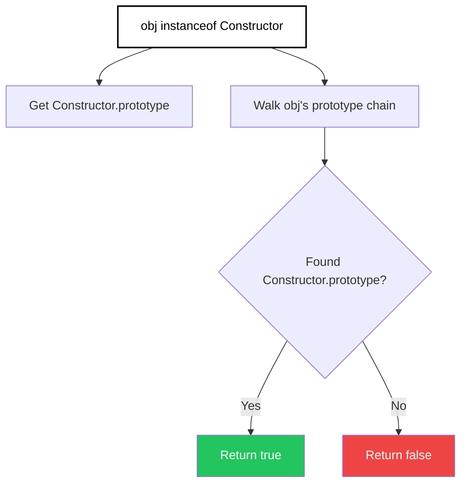

import { Tabs, TabItem, Aside, Badge, Card, CardGrid, Code, LinkCard } from '@astrojs/starlight/components';

## 🔍 instanceof Operator in JavaScript

> Checks if an object's **prototype chain** includes the `prototype` property of a constructor function.

```js
// Syntax: object instanceof Constructor
const s = "Hello";
console.log(s instanceof String);  // false ⚠️ (primitive, not object!)
console.log(s instanceof Object);  // false ⚠️

const obj = new String("Hello");
console.log(obj instanceof String);  // true ✅
console.log(obj instanceof Object);  // true ✅ (prototype chain)

const arr = [1, 2, 3];
console.log(arr instanceof Array);   // true ✅
console.log(arr instanceof Object);  // true ✅
```

<Aside type="tip" title="🎯 MUST KNOW">
**JS Superpowers vs Java**:  
✅ **Prototype chain** — not class hierarchy — determines `instanceof` result  
✅ **`Symbol.hasInstance`** — customize `instanceof` behavior per constructor  
✅ **No compile-time checks** — any `instanceof` expression is valid syntax  
✅ **Cross-realm pitfalls** — `instanceof` can fail across iframes/windows  
✅ **Primitives vs Objects** — `instanceof` only works on objects, not primitives  
</Aside>

---

## 🧠 How It Works: Prototype Chain Lookup



| Component | Description |
|-----------|-------------|
| **`obj`** | Any value (primitives always return `false`) |
| **`Constructor`** | A function with a `prototype` property (typically a class or constructor function) |
| **Result** | `boolean`: `true` if `Constructor.prototype` appears anywhere in `obj`'s prototype chain |

<Aside type="note">
**Key Insight**: `instanceof` walks the **prototype chain** at runtime — it checks if `Constructor.prototype` is in `Object.getPrototypeOf(obj)` or any ancestor. This enables flexible type checks in prototype-based inheritance.
</Aside>

---

## 🔬 Prototype Chain Examples

### Class Syntax (ES6+)

```js
class Animal {}
class Dog extends Animal {}
class Cat extends Animal {}

const a1 = new Dog();
const a2 = new Cat();

console.log(a1 instanceof Dog);     // true ✅ (Dog.prototype in chain)
console.log(a1 instanceof Animal);  // true ✅ (Animal.prototype in chain)
console.log(a1 instanceof Cat);     // false ❌ (Cat.prototype NOT in chain)
console.log(a1 instanceof Object);  // true ✅ (Object.prototype is root of all chains)
```

### Constructor Function Syntax (Pre-ES6)

```js
function Bird() {}
function Sparrow() {}
Sparrow.prototype = Object.create(Bird.prototype);
Sparrow.prototype.constructor = Sparrow;

const sparrow = new Sparrow();

console.log(sparrow instanceof Sparrow);  // true ✅
console.log(sparrow instanceof Bird);     // true ✅ (prototype chain)
console.log(sparrow instanceof Object);   // true ✅
```

### Built-in Types

```js
console.log([] instanceof Array);    // true ✅
console.log([] instanceof Object);   // true ✅
console.log(/regex/ instanceof RegExp);  // true ✅
console.log(new Date() instanceof Date); // true ✅
console.log(function(){} instanceof Function); // true ✅

// Primitives return false:
console.log(42 instanceof Number);    // false ❌ (primitive, not object)
console.log("text" instanceof String); // false ❌
console.log(true instanceof Boolean);  // false ❌

// But boxed primitives work:
console.log(new Number(42) instanceof Number);  // true ✅
console.log(new String("text") instanceof String); // true ✅
```

<Aside type="caution">
**Primitive Trap**: `instanceof` only works on **objects**. Primitives (`number`, `string`, `boolean`, `symbol`, `bigint`, `null`, `undefined`) always return `false`, even if they "match" a wrapper type.

✅ **Fix**: Use `typeof` for primitives, `instanceof` for objects:
```js
function isString(val) {
    return typeof val === "string" || val instanceof String;
}
```
</Aside>

---

## ⚠️ No Compile-Time Type Checking (JS Advantage & Danger!)

> JavaScript is dynamically typed — **any `instanceof` expression is valid syntax**. No "inconvertible types" compile errors!

<Code lang="js" title="✅ All these are valid JS (but some are useless)" code={`
// Unrelated types — compiles fine, returns false at runtime
console.log("hello" instanceof Array);    // false
console.log(42 instanceof Date);          // false
console.log([] instanceof String);        // false

// Null/undefined — safe, returns false
console.log(null instanceof Object);      // false ✅
console.log(undefined instanceof Object); // false ✅

// Non-constructor values — throws TypeError at runtime!
try {
    console.log([] instanceof "not a function");  // ❌ TypeError: Right-hand side is not callable
} catch(e) {
    console.log(e.name);  // "TypeError"
}
`} />

<Aside type="tip">
**Linting Tip**: Use ESLint rule `no-unsafe-negation` and `valid-typeof` to catch suspicious `instanceof` usage. TypeScript adds compile-time safety if you need it! 🎯
</Aside>

---

## 🎯 null/undefined instanceof — Never Throws

> **`null instanceof X` and `undefined instanceof X` always return `false`** — no error, ever.

<Code lang="js" title="null/undefined are not instances of anything" code={`
console.log(null instanceof Object);      // false ✅
console.log(undefined instanceof Object); // false ✅
console.log(null instanceof Array);       // false ✅
console.log(undefined instanceof Function); // false ✅

// Universal rule:
// For ANY constructor X: null instanceof X → false, undefined instanceof X → false
`} />

<Aside type="tip">
**Safe Type Check Pattern**: Combine `typeof` and `instanceof` for robust checks:
```js
function process(value) {
    if (typeof value === "string") {
        // Handle primitive string
        console.log(value.toUpperCase());
    } else if (value instanceof String) {
        // Handle boxed String object (rare)
        console.log(value.valueOf().toUpperCase());
    } else if (value == null) {
        // Handle null or undefined
        console.log("No value provided");
    }
}
```
</Aside>

---

## 🔄 Customizing instanceof with Symbol.hasInstance <Badge text="ES6+" variant="success" />

> JavaScript allows constructors to **override** `instanceof` behavior via `Symbol.hasInstance`.

<Code lang="js" title="Custom instanceof logic" code={`
class EvenNumber {
    constructor(value) {
        this.value = value;
    }
    
    // Override instanceof behavior
    static [Symbol.hasInstance](obj) {
        // Custom logic: "instanceof EvenNumber" if obj.value is even
        return typeof obj?.value === "number" && obj.value % 2 === 0;
    }
}

const num1 = { value: 4 };
const num2 = { value: 5 };
const num3 = new EvenNumber(10);

console.log(num1 instanceof EvenNumber);  // true ✅ (custom logic: 4 is even)
console.log(num2 instanceof EvenNumber);  // false ❌ (5 is odd)
console.log(num3 instanceof EvenNumber);  // true ✅ (normal case)

// 🎯 Use case: Duck typing with instanceof syntax!
`} />

<Code lang="js" title="Real-world: Library type checking" code={`
// Example: Custom "Promise-like" check
class Thenable {
    static [Symbol.hasInstance](obj) {
        return obj !== null && typeof obj.then === "function";
    }
}

const promise = Promise.resolve(42);
const thenable = { then: (cb) => cb(42) };
const plain = { value: 42 };

console.log(promise instanceof Thenable);  // true ✅
console.log(thenable instanceof Thenable); // true ✅ (duck typing!)
console.log(plain instanceof Thenable);    // false ❌
`} />

<Aside type="caution">
**Use Sparingly**: Overriding `Symbol.hasInstance` can make code harder to reason about. Prefer explicit checks (`typeof x.then === "function"`) unless you have a strong reason to customize `instanceof`.
</Aside>

---

## 🌐 Cross-Realm instanceof Pitfalls

> Objects from different **realms** (iframes, windows, Node.js contexts) have different constructor references — `instanceof` can fail unexpectedly!

<Code lang="js" title="Cross-iframe instanceof trap" code={`
// Imagine this runs in parent window:
const iframe = document.createElement("iframe");
document.body.appendChild(iframe);
const otherArray = iframe.contentWindow.Array;

const arr = new otherArray(1, 2, 3);

console.log(arr instanceof Array);           // false ❌ (different Array constructor!)
console.log(arr instanceof otherArray);      // true ✅ (same realm)
console.log(Array.isArray(arr));             // true ✅ (works across realms!)

// 🎯 Fix: Use Array.isArray() for built-ins, or check prototype directly:
console.log(Object.getPrototypeOf(arr) === otherArray.prototype); // true
`} />

<Code lang="js" title="Node.js vm module example" code={`
import { createContext, runInContext } from "vm";

const sandbox = createContext();
const otherArray = runInContext("Array", sandbox);

const arr = runInContext("new Array(1, 2, 3)", sandbox);

console.log(arr instanceof Array);           // false ❌ (different realm)
console.log(arr instanceof otherArray);      // true ✅
console.log(Array.isArray(arr));             // true ✅ (recommended!)
`} />

<Aside type="danger">
**Golden Rule for Built-ins**: Use **static type-check methods** instead of `instanceof` for cross-realm safety:
```js
Array.isArray(x)      // ✅ Works across realms
x instanceof Array    // ❌ May fail across iframes/vm contexts

// Similarly:
x instanceof Date     // ❌ Cross-realm risk
Object.prototype.toString.call(x) === "[object Date]"  // ✅ Safer

// Or use libraries:
import isDate from "lodash/isDate";
isDate(x);  // ✅ Handles edge cases
```
</Aside>

---

## 🆚 instanceof vs. typeof vs. Constructor.name

<table>
  <thead>
    <tr>
      <th>Check</th>
      <th>Best For</th>
      <th>Handles Primitives</th>
      <th>Cross-Realm Safe</th>
      <th>Example</th>
    </tr>
  </thead>
  <tbody>
    <tr>
      <td><code>typeof x</code></td>
      <td>Primitive type detection</td>
      <td>✅ Yes</td>
      <td>✅ Yes</td>
      <td><code>typeof "hi" → "string"</code></td>
    </tr>
    <tr>
      <td><code>x instanceof Constructor</code></td>
      <td>Object prototype chain check</td>
      <td>❌ No (always false)</td>
      <td>❌ No (realm-dependent)</td>
      <td><code>[] instanceof Array → true</code></td>
    </tr>
    <tr>
      <td><code>Array.isArray(x)</code></td>
      <td>Built-in type checks</td>
      <td>✅ Yes (returns false)</td>
      <td>✅ Yes</td>
      <td><code>Array.isArray([]) → true</code></td>
    </tr>
    <tr>
      <td><code>Object.prototype.toString.call(x)</code></td>
      <td>Exact internal [[Class]]</td>
      <td>✅ Yes</td>
      <td>✅ Yes</td>
      <td><code>toString.call([]) → "[object Array]"</code></td>
    </tr>
    <tr>
      <td><code>x?.constructor?.name</code></td>
      <td>Debugging / logging</td>
      <td>⚠️ Primitives have wrapper constructors</td>
      <td>❌ No (constructor may differ)</td>
      <td><code>[].constructor.name → "Array"</code></td>
    </tr>
  </tbody>
</table>

<Code lang="js" title="Comprehensive type checking function" code={`
function getType(x) {
    // Handle null/undefined first
    if (x == null) return String(x);  // "null" or "undefined"
    
    // Primitive types
    const primitive = typeof x;
    if (primitive !== "object") return primitive;
    
    // Objects: use toString for reliable [[Class]]
    return Object.prototype.toString.call(x).slice(8, -1).toLowerCase();
    // Returns: "array", "date", "regexp", "object", etc.
}

// Test:
console.log(getType(42));           // "number"
console.log(getType("hi"));         // "string"
console.log(getType(null));         // "null"
console.log(getType([]));           // "array"
console.log(getType(new Date()));   // "date"
console.log(getType(/regex/));      // "regexp"
`} />

---

## 🎯 Interview Cheat Sheet

<CardGrid>
  <Card title="Q: What does 'hello' instanceof String return?" icon="caution">
    **`false`** — primitives are not objects, so `instanceof` always returns `false`.  
    ✅ Use `typeof x === "string"` for primitive strings, `x instanceof String` only for boxed objects (rare).
  </Card>
  
  <Card title="Q: What does null instanceof Object return?" icon="approve-check">
    **`false`** — `null` is not an object and has no prototype chain.  
    ✅ `instanceof` never throws — always returns `false` for `null`/`undefined`.
  </Card>

  <Card title="Q: Why might [] instanceof Array return false?" icon="error">
    **Cross-realm issue** — if the array was created in a different iframe or VM context, it has a different `Array` constructor.  
    ✅ Use `Array.isArray([])` for reliable array detection across realms.
  </Card>
  
  <Card title="Q: Can instanceof be customized?" icon="rocket">
    **YES** — via `Symbol.hasInstance`:
```js
class Custom {
    static [Symbol.hasInstance](obj) {
        return obj?.magic === true;
    }
}
console.log({ magic: true } instanceof Custom);  // true ✅
```
  </Card>

  <Card title="Q: How to check if value is a plain object?" icon="information">
    **`instanceof Object` is not enough** (arrays, dates also return true).  
    ✅ Use: `x !== null && typeof x === "object" && x.constructor === Object`  
    ✅ Or library: `lodash.isPlainObject(x)`
  </Card>

  <Card title="Q: Does instanceof work with arrow functions?" icon="caution">
    **Arrow functions cannot be constructors** — no `prototype` property:
```js
const Arrow = () => {};
console.log(Arrow.prototype);  // undefined
console.log(new Arrow());      // ❌ TypeError: Arrow is not a constructor
```
    ✅ Use regular functions or `class` for `instanceof` checks.
  </Card>
</CardGrid>

---

## 🧩 DSA & Practical Patterns

<CardGrid>
  <Card title="Pattern: Type-Guard Functions with instanceof" icon="shield">
    Use `instanceof` in TypeScript-style type guards for runtime validation:
```js
    // Runtime type guard
    function isError(value) {
        return value instanceof Error;
    }
    
    function process(input) {
        if (isError(input)) {
            // input is narrowed to Error type (in TS)
            console.error(input.message);
        } else {
            console.log("Success:", input);
        }
    }
```
  </Card>
  
  <Card title="Pattern: Polymorphic Handler Dispatch" icon="rocket">
    Use `instanceof` for simple type-based routing when interfaces aren't feasible:
```js
    class Request {}
    class GetRequest extends Request {}
    class PostRequest extends Request {}
    
    function handle(req) {
        if (req instanceof GetRequest) {
            return handleGet(req);
        } else if (req instanceof PostRequest) {
            return handlePost(req);
        } else {
            throw new Error("Unknown request type");
        }
    }
    
    // 🎯 Note: Prefer method polymorphism (req.handle()) when possible!
```
  </Card>

  <Card title="Pattern: Defensive API Validation" icon="backspace">
    Validate input types in public APIs using `instanceof`:
```js
    function uploadFile(file) {
        if (!(file instanceof File)) {
            throw new TypeError("Expected File instance");
        }
        // Safe to use File-specific methods
        const reader = new FileReader();
        reader.readAsDataURL(file);
    }
    
    // ✅ Safer: also check for duck-typed File-like objects
    function uploadFileFlexible(file) {
        const isFileLike = file instanceof File || 
            (file?.arrayBuffer && file?.name && file?.size);
        if (!isFileLike) {
            throw new TypeError("Expected File or File-like object");
        }
    }
```
  </Card>
</CardGrid>

<Aside type="tip">
**Best Practice**: Prefer **duck typing** or **static methods** (`Array.isArray()`) over `instanceof` for built-in types. Use `instanceof` primarily for custom classes where you control the prototype chain.
</Aside>

---

## 🔑 Quick Reference Summary

| Scenario | `instanceof` Result | Notes |
|----------|---------------------|-------|
| `obj instanceof Constructor` | `true`/`false` | Checks prototype chain |
| `primitive instanceof Wrapper` | `false` | Primitives have no prototype chain |
| `null instanceof X` | `false` | Never throws, always false |
| `obj instanceof Object` | `true` (for most objects) | `Object.prototype` is root of chain |
| Cross-realm array | `false` | Different `Array` constructor — use `Array.isArray()` |
| Custom `Symbol.hasInstance` | As defined | Can override default behavior |
| Arrow function as constructor | ❌ TypeError | Arrow functions have no `prototype` |
| `x instanceof null` | ❌ TypeError | Right-hand side must be callable |

<Aside type="caution">
**Final Checklist**:
1. ✅ `instanceof` checks **prototype chain**, not class hierarchy
2. ✅ Always returns `boolean` for valid constructors — never throws for `null`/`undefined` values
3. ✅ **Primitives always return `false`** — use `typeof` for primitive checks
4. ✅ **Cross-realm caution** — use `Array.isArray()`, `Object.prototype.toString` for built-ins
5. ✅ Can customize via `Symbol.hasInstance` — use sparingly
6. ✅ Right-hand side must be callable — `x instanceof "string"` throws `TypeError`
7. ✅ Prefer static type-check methods (`Array.isArray()`) for built-in types
</Aside>

---

## 🧪 Test Your Understanding

<Code lang="js" title="Predict the output" code={`// Q1: Primitive vs object
console.log("hello" instanceof String);  // ?
console.log(new String("hello") instanceof String);  // ?

// Q2: null/undefined
console.log(null instanceof Object);     // ?
console.log(undefined instanceof Object); // ?

// Q3: Prototype chain
class Animal {}
class Dog extends Animal {}
const dog = new Dog();
console.log(dog instanceof Dog);         // ?
console.log(dog instanceof Animal);      // ?
console.log(dog instanceof Object);      // ?

// Q4: Built-in types
console.log([] instanceof Array);        // ?
console.log([] instanceof Object);       // ?
console.log(Array.isArray([]));          // ?

// Q5: Invalid right-hand side
try {
    console.log([] instanceof "Array");  // ?
} catch(e) {
    console.log(e.name);                 // ?
}

// Q6: Symbol.hasInstance
class Even {
    static [Symbol.hasInstance](obj) {
        return obj?.value % 2 === 0;
    }
}
console.log({ value: 4 } instanceof Even);   // ?
console.log({ value: 5 } instanceof Even);   // ?`} />

<details>
<summary>✅ Click to reveal answers</summary>

```text
Q1: false, true
    ← Primitives aren't objects; new String() creates object with String.prototype

Q2: false, false
    ← null/undefined have no prototype chain

Q3: true, true, true
    ← Dog.prototype → Animal.prototype → Object.prototype in chain

Q4: true, true, true
    ← Array.prototype → Object.prototype; Array.isArray() is cross-realm safe

Q5: TypeError
    ← Right-hand side must be callable (a function/constructor)

Q6: true, false
    ← Custom Symbol.hasInstance logic: checks if value property is even
```
</details>

---

## 📌 Quick Revision Cheat Sheet <Badge text="MUST KNOW" variant="tip" />

```js
// 🎯 instanceof BASICS
obj instanceof Constructor  // Checks if Constructor.prototype in obj's prototype chain
typeof x === "object" && x instanceof Array  // ✅ Combined primitive/object check
null instanceof X  // Always false — never throws

// 🎯 PROTOTYPE CHAIN RULES
new Dog() instanceof Dog      // true (own constructor)
new Dog() instanceof Animal   // true (parent in chain)
new Dog() instanceof Object   // true (Object.prototype is root)
"str" instanceof String       // false (primitive, not object)

// 🎯 BUILT-IN TYPE CHECKS (PREFER THESE!)
Array.isArray(x)              // ✅ Cross-realm safe array check
x instanceof Array            // ⚠️ May fail across iframes/VM contexts

Object.prototype.toString.call(x) === "[object Date]"  // ✅ Reliable Date check
x instanceof Date             // ⚠️ Cross-realm risk

// 🎯 SAFE PATTERNS
// Type guard function:
function isString(x) {
    return typeof x === "string" || x instanceof String;
}

// Null-safe instanceof:
if (obj instanceof MyClass) {  // Safe even if obj is null (returns false)
    // obj is MyClass instance here
}

// Cross-realm array check:
function processArray(input) {
    if (!Array.isArray(input)) {
        throw new TypeError("Expected array");
    }
    // Safe to use array methods
}

// 🎯 CUSTOM instanceof (advanced)
class Predicate {
    constructor(fn) { this.fn = fn; }
    static [Symbol.hasInstance](obj) {
        return this.fn?.(obj) === true;
    }
}
const isEven = new Predicate(x => x % 2 === 0);
console.log(4 instanceof isEven);  // true ✅

// 🎯 INTERVIEW GOLD
// "instanceof checks prototype chain, not class hierarchy"
// "Primitives always return false — use typeof for primitives"
// "Cross-realm: Array.isArray() is safer than instanceof Array"
// "Symbol.hasInstance allows custom instanceof logic"
// "null instanceof X is always false — never throws"
```

---

## 🔗 Related Topics

<CardGrid columns={2}>
  <LinkCard
    title="JavaScript Prototype Chain"
    href="/computer-languages/javascript/topics/prototypes"
    description="__proto__, prototype, inheritance, Object.create, class syntax"
  />
  <LinkCard
    title="JavaScript Type Checking"
    href="/computer-languages/javascript/topics/type-checking"
    description="typeof, instanceof, Array.isArray, duck typing, type guards"
  />
  <LinkCard
    title="JavaScript Symbols"
    href="/computer-languages/javascript/topics/symbols"
    description="Symbol.hasInstance, well-known symbols, custom behavior"
  />
  <LinkCard
    title="Cross-Realm JavaScript"
    href="/computer-languages/javascript/guides/cross-realm"
    description="iframes, vm module, postMessage, safe type checking"
  />
</CardGrid>

<Aside type="note">
🎯 **Production Pro Tips**  
1. Use `Array.isArray()` instead of `instanceof Array` for reliable array detection  
2. Prefer `typeof` for primitive checks — `instanceof` only works on objects  
3. Document when you rely on `instanceof` — prototype manipulation can break checks  
4. Use ESLint rule `no-prototype-builtins` and `valid-typeof` for safer type checks  
5. For library authors: consider `Symbol.hasInstance` for duck-typing support  
6. In TypeScript: prefer type guards with `is` keyword for compile-time safety 🛡️
</Aside>

> 💡 **Final Wisdom**: JavaScript `instanceof` is **more flexible but less predictable** than Java due to prototype-based inheritance and dynamic typing. Master the prototype chain model, prefer static methods for built-ins, and use `Symbol.hasInstance` sparingly — you'll write robust, interview-ready type checks! 🚀✨

*Converted for Astro 6 + Starlight • Optimized for interview prep + production use • Quality >>>> Quantity* 🎯
```

---

## 🔄 Java instanceof → JS instanceof Conversion Summary

| Java Feature | JavaScript Equivalent | Critical Difference |
|-------------|----------------------|-------------------|
| `obj instanceof Class` | `obj instanceof Constructor` | ✅ Same syntax, but JS checks **prototype chain**, not class hierarchy |
| Compile-time type compatibility | No compile-time checks | ⚠️ JS allows any `instanceof` expression — errors appear at runtime |
| `null instanceof X` → `false` | `null instanceof X` → `false` | ✅ Same safe behavior — never throws |
| Interface support | No interfaces — prototype chain only | ⚠️ JS uses duck typing; no formal interface checks |
| Pattern matching (Java 16+) | No built-in pattern matching | ⚠️ JS requires manual type guards or TypeScript |
| `getClass()` for exact type | `obj.constructor === Constructor` | ⚠️ JS constructor can be overridden; less reliable |
| Generic type erasure | No generics — no erasure issue | ✅ JS simpler, but loses compile-time type safety |
| Array type check: `arr instanceof int[]` | `Array.isArray(arr)` preferred | ✅ JS static methods are cross-realm safe |
| `instanceof` with unrelated types → C.E. | Any combination valid syntax | ⚠️ JS: `"x" instanceof Array` → `false` (no error) |
| Primitive `instanceof` not applicable | Primitive `instanceof` → `false` | ⚠️ JS: `"hi" instanceof String` is `false` — use `typeof` |

---

🧠 **Interview Power Move**: When asked about `instanceof`, always mention:  
1. **Prototype chain, not class hierarchy** — JS uses delegation, not inheritance  
2. **Primitives always return `false`** — use `typeof` for primitive type checks  
3. **Cross-realm caution** — prefer `Array.isArray()` over `instanceof Array`  
4. **`Symbol.hasInstance`** — can customize behavior, but use sparingly  
5. **No compile-time safety** — any `instanceof` expression is valid; test runtime behavior  

---
