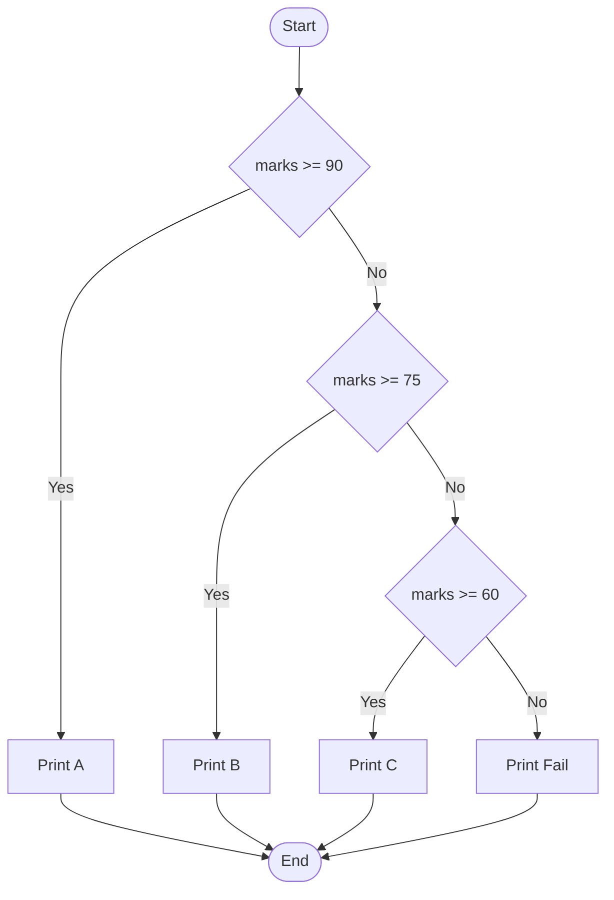

import { Aside, Badge, Card, CardGrid, Code, LinkCard } from '@astrojs/starlight/components';

## 🔀 JavaScript Selection Statements

---

## 🗺️ The Full Map

```
Selection-Statements/
│
├── 🔵 if statement
│   ├── if
│   ├── if...else
│   ├── if...else if...else
│   ├── nested if
│   └── truthy falsy
│
├── 🟢 switch statement
│   ├── case
│   ├── default
│   ├── break
│   ├── fall-through
│   └── grouped cases
│
├── 🟡 Conditional Expressions (not statements)
│   ├── ternary operator  ? :
│   └── short circuit  && || ??
│
└── ⚙️ Internals
|   ├── ToBoolean conversion
|   ├── jump table optimization
|   └── branch prediction
|
├── ternary-operator/
│   ├── basic-ternary
│   └── nested-ternary
│
└── nullish-coalescing/
    ├── basic nullish
    └── default values
```

---

## if / if-else / if-else-if Ladder

## 🔬 if Statement

```js
// Form 1 — if only
if (condition) {
    // runs if condition is truthy
}

// Form 2 — if-else
if (condition) {
    // true branch
} else {
    // false branch
}

// Form 3 — if-else if-else
if (condition1) {
    // branch 1
} else if (condition2) {
    // branch 2
} else if (condition3) {
    // branch 3
} else {
    // default branch
}

// Form 4 — nested if
if (outer) {
    if (inner) {
        // both truthy
    }
}

// Single statement — braces optional (but dangerous):
if (condition1) console.log("positive"); // ✅ works
if (condition1) console.log("positive"); // ❌ easy to break (see trap)
            console.log("always");  // this ALWAYS runs — indentation lies
```

### 🔑 Core Rule: Condition Coerces to Boolean

> The argument to an `if` statement **can be any value**. JavaScript coerces it to boolean using **Truthy/Falsy rules**.

```js
let x = 5;

if (x) { }              // ✅ Runs! 5 is truthy
if (x = 5) { }          // ✅ Runs! Assignment returns 5 (truthy) — DANGEROUS BUG!
if (x == 5) { }         // ✅ Runs! Comparison returns true

// Unlike Java — JS allows ANY type in if conditions
// Implicit coercion happens automatically
// behind
// if(x) => if(Boolean(x))
// if(x = 10)   => x = 10 => if(Boolean(10))
// if(x && y)   => if(Boolean(z))
// if(5 && 10)  => if(Boolean(10))  => if(true)
// if(5 || 10)  => if(Boolean(5))   => if(true)
// if(x > y)    => if(true/false)
// if(x == y)   => if(true/false)
// Use JavaScript's relational comparison rules:
// - Number vs Number → numeric comparison
// - String vs String → lexicographic comparison
// - Mixed types → coercion rules
```

---

### Braces Are Optional for Single Statement (But Dangerous!)

```js
// ✅ Valid — single statement no braces
if (x > 0)
    console.log("positive");

// ❌ Dangerous — dangling else + misleading indent
if (x > 0)
    console.log("positive");
    console.log("always prints");    // NOT part of if — executes always!

// ✅ Always use braces — prevents bugs
if (x > 0) {
    console.log("positive");
}
```

> 🔑 Always use braces even for single-statement if blocks. Indentation is **visual only** in JS — the parser ignores whitespace. Missing braces cause logic bugs that are hard to spot.

---

## 🔬 Truthy/Falsy Coercion

In Java, `if` requires `boolean`. In JS, `if` coerces any value to boolean.

---

### The 7 Falsy Values (Only These!)

```
┌──────────────────────────────────────────────────────────┐
│         ANYTHING inside if() → ToBoolean                 │
│                                                          │
│  FALSY → else branch:            TRUTHY → if branch:     │
│  false                           true                    │
│  0                               1, -1, 42               │
│  -0                              "0", "false"            │
│  0n                              [], {}                  │
│  ""                              function(){}            │
│  null                            Infinity                │
│  undefined                       Symbol()                │
│  NaN                             42n                     │
└──────────────────────────────────────────────────────────┘
```

<Code lang="js" title="Truthy/falsy examples in if conditions" code={`
// Falsy values — condition fails:
console.log(false && "skip");   // false (falsy, short-circuits)
console.log(0 && "skip");       // 0 (falsy, short-circuits)
console.log("" || "default");   // "default" (empty string is falsy)
console.log(null ?? "default"); // "default" (null triggers fallback)

// Truthy values — condition succeeds:
console.log(1 || "fallback");     // 1 (truthy → short-circuits, returns 1)
console.log({} || "fallback");    // {} (objects are truthy, even empty!)
console.log([] ?? "fallback");    // [] (arrays are truthy, ?? doesn't trigger)

// ⚠️ Common surprises:
console.log("0" && "1");   // "1" (non-empty strings are truthy!)
console.log([] && {});     // {} (empty array is truthy!)
console.log(function(){} && "hi");  // "hi" (functions are truthy!)
`} />

<Aside type="caution">
**Interview Trap**: `[]` and `{}` are **truthy**, not falsy!  
```js
if ([]) { console.log("runs"); }  // ✅ Runs — empty array is truthy
if ({}) { console.log("runs"); }  // ✅ Runs — empty object is truthy
```
Only the 7 values listed above are falsy. Everything else — including empty collections — is truthy!
</Aside>

---
## 🔬 else if Chain — Evaluation Order

```js
int score = 85;

if (score >= 90) {
    console.log("A");        // checked first
} else if (score >= 80) {
    console.log("B");        // checked only if first false
} else if (score >= 70) {
    console.log("C");        // checked only if first two false
} else {
    console.log("F");        // reached only if all above false
}
// Output: B
```



---

### Nested `if` — Dangling Else Problem

```js
// JS pairs else with NEAREST if — indentation is MISLEADING:
if (x > 0)
  if (y > 0)
    console.log("both positive");
  else
    console.log("x positive, y not"); // THIS else belongs to inner if

// Even though indentation suggests it belongs to outer if
// Parsed as:
if (x > 0) {
  if (y > 0) {
    console.log("both positive");
  } else {
    console.log("x positive, y not"); // inner else — NOT outer
  }
}

// Fix — always use braces:
if (x > 0) {
  if (y > 0) {
    console.log("both positive");
  }
} else {
  console.log("x not positive"); // outer else — clear
}
```

---

## ⚙️ Deep Dive — How V8 Compiles `if`

```
┌──────────────────────────────────────────────────────────┐
│              if COMPILATION PIPELINE                     │
│                                                          │
│  if (x > 0) { doA(); } else { doB(); }                  │
│                                                          │
│  Ignition Bytecode:                                      │
│    Ldar [x]                   ← load x                  │
│    TestGreaterThan [0]        ← compare x > 0           │
│    JumpIfFalse [else_label]   ← branch if false         │
│    CallRuntime [doA]          ← if branch               │
│    Jump [end_label]           ← skip else               │
│  [else_label]:                                           │
│    CallRuntime [doB]          ← else branch             │
│  [end_label]:                                            │
│                                                          │
│  TurboFan (hot path):                                    │
│    If same branch taken 10,000x → speculative opt        │
│    Rarely-taken branch → deoptimize on entry            │
│    Single CMP + Jcc instruction on x86-64               │
└──────────────────────────────────────────────────────────┘
```

---

### Branch Prediction Impact

```js
// UNPREDICTABLE branch — CPU mispredicts 50% of time:
const arr = Array.from({ length: 10000 }, () => Math.random() > 0.5 ? 1 : 0);
for (const x of arr) {
  if (x === 1) sum += x;   // random → CPU branch predictor fails
}

// PREDICTABLE branch — CPU predicts correctly:
const sorted = [...arr].sort(); // all 0s first, then all 1s
for (const x of sorted) {
  if (x === 1) sum += x;   // predictable pattern → near-zero branch cost
}
// Same logic, sorted input → measurably faster in hot loops
```

---

## ⚠️ Interview Traps — if Statement

<Card title="Trap 1: Missing Braces — Only ONE Line Belongs to if" icon="error">
  ```js
    if (x > 0)
        console.log("positive");  // ✅ part of if
        console.log("always!");    // ❌ ALWAYS runs! Not part of if!
    
    // ✅ Fix: Always use braces, even for single statements
    if (x > 0) {
        console.log("positive");
        console.log("also part of if");
    }
  ```
  <Aside type="danger">
    **Why it matters**: Indentation is **visual only** — parser ignores whitespace. Missing braces cause logic bugs.
  </Aside>
</Card>  
<Card title="Trap 2: Assignment (=) vs Comparison (==) in Condition" icon="error">
  ```js
    let x = 0;
    
    // ⚠️ Sneaky valid but dangerous:
    if (x = 5) { }  // ✅ Compiles & runs! Assigns 5, then checks truthiness of 5
    console.log(x); // 5
    
    // ✅ Correct: use == or === for comparison
    if (x === 5) { }
    
    // ✅ Safer: Yoda conditions prevent accidental assignment
    if (5 === x) { }  // If you type =, it throws SyntaxError immediately
  ```

  <Aside type="information">
    **Pro Tip**: Use ESLint rule `no-cond-assign` to catch accidental assignments in conditions.
  </Aside>
</Card>
<Card title="Trap 3: Falsy Values That Should Be Valid" icon="shield">
  ```js
      let count = 0;
      
      // ❌ Dangerous: 0 is falsy, so this block never runs!
      if (count) {
          console.log("Has items");  // Won't print if count=0
      }
      
      // ✅ Safe patterns:
      if (count !== 0) { }           // Explicit check
      if (count > 0) { }             // Range check
      if (typeof count === "number") { } // Type check
  ```
  <Aside type="caution">
    **Interview Answer**: Be careful with numeric inputs — `0` is falsy but often a valid value. Use explicit comparisons (`!== 0`, `> 0`) instead of truthy checks.
  </Aside>
</Card>
<Card title="Trap 4: Null/Undefined Safety" icon="shield">
  ```js
      let obj = null;
      
      // ❌ Dangerous: TypeError if obj is null
      if (obj.property) { }  // 💥 Cannot read property of null
      
      // ✅ Safe patterns:
      if (obj && obj.property) { }              // Short-circuit guard
      if (obj?.property) { }                    // Optional chaining (ES2020+)
      if (obj != null && obj.property) { }      // Explicit nullish check
  ```
  **Modern JS**: Use optional chaining `?.` to safely access nested properties without manual null checks.
</Card>

---

## switch Statement

---

### 🔑 Basic Syntax

```js
// Syntax
switch (expression) {
    case value1:
        // code
        break;              // ← required to prevent fall-through
    case value2:
        // code
        break;
    default:
        // runs if no case matches
        break;              // optional on last case — good practice
}
```

<Code lang="js" title="switch with break statements" code={`
switch (day) {
    case 1:
        console.log("Monday");
        break;  // ← Critical: prevents fall-through!
    case 2:
        console.log("Tuesday");
        break;
    case 3:
        console.log("Wednesday");
        break;
    default:  // like else — runs if no case matches
        console.log("Other day");
        // break optional here (end of switch)
}

// if day = 1 → prints "Monday" only (break prevents fall-through)
// if day = 2 → prints "Tuesday" only
// if day = 3 → prints "Wednesday" only
// if day = 99 → prints "Other day" (default case)
`} />

### ⚠️ Fall-Through — Classic Trap (Same as Java!)

<Code lang="js" title="Missing break causes fall-through" code={`
switch (x) {
    case 1:
        console.log("One");
        // no break → falls through!
    case 2:
        console.log("Two");    // ✅ runs (x === 2)
        // no break → falls through!
    case 3:
        console.log("Three");  // ✅ ALSO runs! 😱
        // no break → falls through!
    default:
        console.log("Default"); // ✅ ALSO runs! 😱
}
// if x = 1 → prints One, Two
// if x = 2 → prints Two
// if x = 3 → prints Three, Default
// if x = 99 → prints Default only (no case matches, default runs)
`} />

---

## 🔬 switch Rules — Must Know

<Card title="Rule 1: Strict Equality (`===`) for Matching" icon="approve-check">
  ```js
    // switch uses === (strict equality), not == (loose)
    switch (5) {
        case "5":
            console.log("matched");  // ❌ Won't run! 5 !== "5"
            break;
        case 5:
            console.log("matched");  // ✅ Runs! 5 === 5
            break;
    }
    
    // ✅ This is different from Java (which also uses == for primitives but === behavior for objects)
    // JS switch is ALWAYS strict — no type coercion during matching.
  ```
</Card>

<Card title="Rule 2: case Labels Can Be Variables!" icon="information">
  ```js
    // Java: case labels must be compile-time constants
    // JS: case labels can be ANY expression!
    
    const threshold = 10;
    let x = 10;
    
    switch (x) {
        case threshold:             // ✅ Valid! Variable works fine
            console.log("matched threshold");
            break;
        case 10 + 5:                // ✅ Valid! Expression works
            console.log("matched 15");
            break;
        case Math.floor(3.9):       // ✅ Valid! Function call works
            console.log("matched 3");
            break;
    }
    
    // ⚠️ But: case labels are evaluated ONCE at definition time, not per match
  ```
</Card>

<Card title="Rule 3: No Nesting Relational Operators" icon="error">
  ```js
    // Java: if (x > y > z) → Compile Error
    // JS: if (x > y > z) → Runs but likely wrong!
    
    let x = 10, y = 5, z = 1;
    if (x > y > z) { 
        console.log("runs?"); 
    }
    // Step 1: x > y → 10 > 5 → true
    // Step 2: true > z → 1 > 1 → false
    // Result: false 😱
    
    // ✅ Fix: Use logical AND
    if (x > y && y > z) { ... }
  ```
</Card>

<Card title="Rule 4: Any Type Allowed in switch Expression" icon="rocket">
```js
  // Java: switch limited to int, enum, String, etc.
  // JS: switch works with ANY type!
  
  switch (true) {  // ✅ Common pattern for complex conditions
      case x > 10 && y < 20:
          console.log("range match");
          break;
      case z === null:
          console.log("null check");
          break;
  }
  
  switch ([1, 2]) {  // ✅ Arrays work (reference match)
      case [1, 2]:   // ❌ Won't match! Different array reference
          console.log("matched");
          break;
  }
  
  // 🎯 Interview tip: Know when to use method shorthand vs arrow property
```
</Card>

---

## 📋 Allowed Types for switch — JS Has No Restrictions!

---

### ✅ Everything Is Allowed

```js
// Primitives
switch (10) { ... }           // number
switch ("hello") { ... }      // string
switch (true) { ... }         // boolean
switch (Symbol("id")) { ... } // symbol

// Objects (matches by reference)
const obj = { name: "Alice" };
switch (obj) {
    case obj:                 // ✅ Matches same reference
        console.log("matched");
        break;
}

// undefined/null
switch (undefined) {
    case undefined:           // ✅ Matches
        console.log("undefined");
        break;
}
```

### ❌ No Type Restrictions, But...

| Type | Behavior | Note |
|------|----------|------|
| `number` | ✅ Works | Strict `===` match |
| `string` | ✅ Works | Strict `===` match |
| `boolean` | ✅ Works | Strict `===` match |
| `object`/`array` | ✅ Works | Matches by **reference**, not content |
| `symbol` | ✅ Works | Unique identifiers |
| `bigint` | ✅ Works | Strict `===` match |


<Aside type="caution">
**Context matters**: `{}` at the start of a statement is parsed as an **empty block**, not an object literal!  
Wrap in parentheses to force object interpretation: `({}) + ({})`.
</Aside>

---

## 🔄 default Case Rules

<Card title="Rule 1: Only One default Allowed" icon="approve-check">
  ```js
    switch (x) {
        case 1: break;
        default: console.log("default"); break;
        // default: console.log("another");  // ⚠️ No compile error, but second unreachable
    }
  ```
</Card>

<Card title="Rule 2: default Runs Only If No case Matches" icon="information">
  ```js
    // If x === 1 → case 1 runs, default skipped
    // If x === 99 → no case matches → default runs
    switch (x) {
        case 1: console.log("one"); break;
        default: console.log("other");
    }
  ```
</Card>

<Card title="Rule 3: default Can Appear Anywhere (But Put It Last)" icon="backspace">
  ```js
    // ✅ Valid: default in middle (but confusing!)
    switch (x) {
        case 1: console.log("one"); break;
        default: console.log("other"); break;  // runs if x !== 1
        case 2: console.log("two"); break;      // still reachable via fall-through!
    }
    
    // ✅ Recommended: default as last case (clearer intent)
    switch (x) {
        case 1: console.log("one"); break;
        case 2: console.log("two"); break;
        default: console.log("other");  // no break needed at end
    }
  ```
  **Best Practice**: Always place `default` last unless you have a specific fall-through reason (rare).
</Card>

```java
switch (b) {
  case 10:
    console.log("10");
    break;
  case 100:
    console.log("100");
  default:
    console.log("1000");
}
if b = 10   → matches case 10 → prints "10" only (break prevents fall-through)
if b = 100  → matches case 100 → prints "100" and falls through to default → also prints "1000"

switch (b) {
  case 10:
    console.log("10");
  default:
    console.log("1000");
    break;
  case 100:
    console.log("100");
}

if b = 10   → matches case 10 → prints "10" and falls through to default → also prints "1000" and (break prevents fall-through)
if b = 100  → matches case 100 → prints "100" and default won't execute because it's before case 100, not after

switch (b) {
  default:
    console.log("1000");
  case 10:
    console.log("10");
  case 100:
    console.log("100");
}

if b = 10   → matches case 10 → prints "10" and falls through to case 100 → also prints "100"
if b = 100  → matches case 100 → prints "100"
if b = 120  → no case matches → default runs → prints "1000"
```

---

### Block Scope Inside `switch`

```js
// All cases share ONE block scope — can't redeclare with let/const:
switch (x) {
  case 1:
    let result = "one";   // declared in switch block
    break;
  case 2:
    let result = "two";   // ❌ SyntaxError — already declared
    break;
}

// Fix — wrap each case in its own block:
switch (x) {
  case 1: {
    let result = "one";   // ✅ own block scope
    break;
  }
  case 2: {
    let result = "two";   // ✅ own block scope
    break;
  }
}
```

---

## ⚙️ Deep Dive — How V8 Optimizes `switch`

```
┌──────────────────────────────────────────────────────────┐
│         SWITCH OPTIMIZATION STRATEGIES IN V8             │
│                                                          │
│  Strategy 1: JUMP TABLE (dense integer cases)            │
│  ─────────────────────────────────────────────           │
│  switch(n) with cases 0,1,2,3,4,5...                    │
│  → V8 builds array of code addresses                    │
│  → arr[n] → jump directly → O(1) dispatch               │
│  Same as: goto arr[n]                                    │
│                                                          │
│  Strategy 2: BINARY SEARCH (sparse integer cases)        │
│  ─────────────────────────────────────────────           │
│  switch(n) with cases 0, 100, 500, 1000...              │
│  → V8 sorts cases → binary search → O(log n)            │
│                                                          │
│  Strategy 3: LINEAR SCAN (string/mixed cases)            │
│  ─────────────────────────────────────────────           │
│  switch("str") with string cases                        │
│  → sequential === comparison → O(n)                      │
│  (unless V8 builds hash table internally for many cases) │
│                                                          │
│  if-else chain: always linear O(n)                       │
│  switch (dense int): O(1) jump table                     │
└──────────────────────────────────────────────────────────┘
```


---

## 🟡 Modern Alternatives to switch (ES6+)

> JS doesn't have switch expressions (like Java 14+), but several patterns are cleaner.

### 🔑 Key Improvements Over Traditional switch

| Feature | Traditional switch | Object Lookup | Ternary/?? |
|---------|-------------------|---------------|------------|
| **Fall-through** | ✅ Default risk | ❌ Impossible | ❌ Impossible |
| **Return value** | ❌ Manual variable | ✅ Direct access | ✅ Direct return |
| **Syntax** | Verbose `case/break` | Concise `{ key: val }` | Inline `? :` |
| **Maintainability** | Hard to refactor | Easy to add/remove keys | Good for simple logic |

### 💻 Pattern 1: Object Lookup (Dictionary Pattern)

<Code lang="js" title="Object lookup instead of switch" code={`
// ✅ Clean: no break needed, no fall-through risk
const dayNames = {
    1: "Monday",
    2: "Tuesday",
    3: "Wednesday",
    4: "Thursday",
    5: "Friday",
    6: "Saturday",
    7: "Sunday"
};

let day = 3;
let name = dayNames[day] ?? "Invalid day";  // ?? handles undefined
console.log(name);  // "Wednesday"

// ✅ Multiple cases with same value:
const dayTypes = {
    1: "Weekday", 2: "Weekday", 3: "Weekday", 4: "Weekday", 5: "Weekday",
    6: "Weekend", 7: "Weekend"
};
let type = dayTypes[day] ?? "Invalid";
`} />

### 💻 Pattern 2: Map for Non-String Keys

<Code lang="js" title="Map for complex keys" code={`
// Map supports any type as key (objects, functions, etc.)
const actions = new Map([
    [startBtn, () => console.log("Start")],
    [stopBtn, () => console.log("Stop")],
    [resetBtn, () => console.log("Reset")]
]);

let button = startBtn;
let action = actions.get(button);
if (action) action();  // "Start"

// ✅ Better than switch for object references or complex keys
`} />

### 💻 Pattern 3: Ternary Chains for Simple Logic

<Code lang="js" title="Ternary instead of if-else-if" code={`
let marks = 85;

// ✅ Concise for simple value returns:
const grade = marks >= 90 ? "A"
             : marks >= 75 ? "B"
             : marks >= 60 ? "C"
             : "Fail";

console.log(grade);  // "B"

// ⚠️ Don't over-nest — if logic is complex, use if/else for readability
`} />

---

## 📊 Performance Comparison

```
┌──────────────────────────────────────────────────────────┐
│           SELECTION PERFORMANCE GUIDE                    │
├────────────────────┬─────────────────────────────────────┤
│ Pattern            │ Complexity & Notes                  │
├────────────────────┼─────────────────────────────────────┤
│ if (single)        │ O(1) — one branch                   │
│ if-else chain      │ O(n) — n = number of conditions     │
│ switch (dense int) │ O(1) — jump table                   │
│ switch (sparse int)│ O(log n) — binary search            │
│ switch (string)    │ O(n) — linear === comparison        │
│ Object lookup      │ O(1) — hash map                     │
│ Map lookup         │ O(1) — hash map                     │
│ Ternary            │ O(1) — same as if/else (2 branches) │
└────────────────────┴─────────────────────────────────────┘
```

---

## 🧩 DSA & Practical Patterns

<Card title="Pattern: State Machine with Object/Map" icon="backspace">
  ```js
    const stateTransitions = {
        IDLE: { start: "RUNNING", default: "IDLE" },
        RUNNING: { pause: "PAUSED", stop: "STOPPED", default: "RUNNING" },
        PAUSED: { resume: "RUNNING", stop: "STOPPED", default: "PAUSED" },
        STOPPED: { start: "RUNNING", default: "STOPPED" }
    };

    function nextState(currentState, event) {
        const transitions = stateTransitions[currentState];
        return transitions?.[event] ?? transitions?.default ?? currentState;
    }
    
    // Usage:
    let state = "IDLE";
    state = nextState(state, "start");  // "RUNNING"
    state = nextState(state, "pause");  // "PAUSED"
    // ✅ Type-safe (with TS), IDE autocomplete, refactoring-friendly
  ```
</Card>


<Aside type="tip">
**Performance Note**: Modern JS engines (V8, SpiderMonkey) optimize object lookups with **hidden classes** and **inline caches**. For small sets (< 10 cases), object lookup is often faster than switch due to direct hash access.  
✅ For large sets, `Map` may outperform objects due to optimized hash table implementation.  
✅ Prioritize readability — micro-optimizations rarely matter compared to algorithmic complexity.
</Aside>

---

## 🏭 Real Production Patterns

### Pattern 1 — Guard Clauses (Flatten Nesting)

```js
// DEEP nesting — hard to read:
function processOrder(order) {
  if (order) {
    if (order.user) {
      if (order.user.isActive) {
        if (order.items.length > 0) {
          // actual logic — buried at level 4
          return fulfillOrder(order);
        } else {
          throw new Error("No items");
        }
      } else {
        throw new Error("Inactive user");
      }
    } else {
      throw new Error("No user");
    }
  } else {
    throw new Error("No order");
  }
}

// GUARD CLAUSE pattern — flat and readable:
function processOrder(order) {
  if (!order)               throw new Error("No order");
  if (!order.user)          throw new Error("No user");
  if (!order.user.isActive) throw new Error("Inactive user");
  if (!order.items.length)  throw new Error("No items");

  // actual logic — at level 1
  return fulfillOrder(order);
}
```

### Pattern 2 — Object Lookup for String Switch

```js
// SLOW — string switch (linear scan):
function getStatusText(code) {
  switch (code) {
    case 200: return "OK";
    case 201: return "Created";
    case 400: return "Bad Request";
    case 401: return "Unauthorized";
    case 403: return "Forbidden";
    case 404: return "Not Found";
    case 500: return "Internal Server Error";
    default:  return "Unknown";
  }
}

// FAST — object lookup O(1):
const STATUS_TEXT = {
  200: "OK",
  201: "Created",
  400: "Bad Request",
  401: "Unauthorized",
  403: "Forbidden",
  404: "Not Found",
  500: "Internal Server Error"
};

const getStatusText = code => STATUS_TEXT[code] ?? "Unknown"; // ✅

// FAST — Map for non-string keys or when insertion order matters:
const handlers = new Map([
  ["GET",    handleGet],
  ["POST",   handlePost],
  ["PUT",    handlePut],
  ["DELETE", handleDelete],
]);

const handler = handlers.get(method) ?? handleUnknown;
handler(req, res); // O(1) dispatch ✅
```

### Pattern 3 — State Machine with Switch

```js
// Traffic light state machine:
class TrafficLight {
  #state = "red";

  #transitions = {
    red:    "green",
    green:  "yellow",
    yellow: "red"
  };

  next() {
    this.#state = this.#transitions[this.#state];
    return this;
  }

  action() {
    switch (this.#state) {
      case "red":    return { stop: true,  go: false, slow: false };
      case "green":  return { stop: false, go: true,  slow: false };
      case "yellow": return { stop: false, go: false, slow: true  };
    }
  }
}
```

### Pattern 4 — HTTP Router Pattern

```js
// Express-like routing with if/else:
async function handleRequest(req, res) {
  const { method, path } = req;

  // Guard — validate method first:
  const ALLOWED = ["GET", "POST", "PUT", "DELETE", "PATCH"];
  if (!ALLOWED.includes(method)) {
    return res.status(405).json({ error: "Method Not Allowed" });
  }

  // Route dispatch:
  if (path === "/health") {
    return res.json({ status: "ok", uptime: process.uptime() });
  }

  if (path.startsWith("/api/users")) {
    if (method === "GET")    return handleGetUsers(req, res);
    if (method === "POST")   return handleCreateUser(req, res);
    if (method === "PUT")    return handleUpdateUser(req, res);
    if (method === "DELETE") return handleDeleteUser(req, res);
  }

  if (path.startsWith("/api/orders")) {
    return handleOrders(req, res);
  }

  return res.status(404).json({ error: "Not Found" });
}
```

### Pattern 5 — Feature Flags with Selection

```js
// Clean feature flag selection:
function getPaymentProcessor(region, tier) {
  // Tier-based selection:
  if (tier === "enterprise") {
    return new EnterpriseProcessor({ sla: "99.99%" });
  }

  // Region-based selection:
  switch (region) {
    case "IN":
      return new RazorpayProcessor();
    case "US":
    case "CA":
      return new StripeProcessor();
    case "EU":
      return new AdyenProcessor();
    case "SG":
    case "MY":
    case "TH":
      return new GrabPayProcessor();
    default:
      return new PayPalProcessor(); // global fallback
  }
}
```

---
