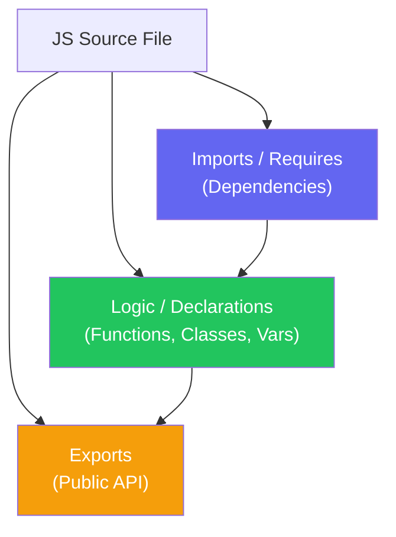

import { Tabs, TabItem, Aside, Badge, Card, CardGrid, Code, LinkCard } from '@astrojs/starlight/components';

## 📁 JavaScript Source File Structure — Complete Guide

> Unlike Java, JavaScript has **no strict ordering rules** for declarations. However, modern JS relies heavily on **Module Systems** (ESM & CommonJS) to organize code. Understanding how `import`/`export` works is critical for writing scalable applications.

---

## 🏛️ Valid Source File Structure Diagram

```text
+-----------------------------+
|  1. Imports / Requires      |  ← Convention: Top of file
+-----------------------------+
|  2. Constants / Config      |  ← Optional: Environment vars, configs
+-----------------------------+
|  3. Type Definitions        |  ← Optional: TypeScript interfaces/types
+-----------------------------+
|  4. Helper Functions        |  ← Pure functions, utilities
+-----------------------------+
|  5. Main Logic / Classes    |  ← Core business logic, components
+-----------------------------+
|  6. Exports                 |  ← Bottom of file (or inline)
+-----------------------------+
```



<Code lang="js" title="Complete valid source file example (ES Module)" code={`
// File: src/services/UserService.js

// 1. Imports (Dependencies)
import { db } from '../database.js';       // Named import
import logger from '../utils/logger.js';   // Default import
import { MAX_RETRIES } from '../config.js'; // Constant import

// 2. Constants / Config
const DEFAULT_TIMEOUT = 5000;

// 3. Helper Functions (Private by convention if not exported)
function validateEmail(email) {
    return email.includes('@');
}

// 4. Main Logic (Class or Function)
export class UserService {
    constructor() {
        this.db = db;
    }

    async getUser(id) {
        logger.info(\`Fetching user \${id}\`);
        return await this.db.users.findById(id);
    }

    async createUser(data) {
        if (!validateEmail(data.email)) {
            throw new Error('Invalid email');
        }
        return await this.db.users.insert(data);
    }
}

// 5. Exports (Public API)
// Can also be exported inline above: export class UserService ...
export default UserService; 
`} />

> 🔑 **Key Difference from Java**:  
> - **No Package Declaration**: JS uses directory structure + `package.json` or bundler config for resolution.  
> - **No Strict Order**: You can use a function before it's declared (hoisting) or import at the bottom (though top is convention).  
> - **Multiple Exports**: A single file can have multiple named exports and one default export.

---

## ⚠️ Critical Rules — Must Know

<CardGrid>
  <Card title="Rule 1: No Strict Ordering Enforcement" icon="approve-check">
```js
    // ✅ Valid: Use function before declaration (Hoisting)
    greet(); 
    function greet() { console.log("Hi"); }

    // ✅ Valid: Import anywhere (though top is convention)
    const x = 1;
    import { y } from './module.js'; // ⚠️ Syntax Error in ESM! Imports must be top-level.
    
    // ✅ Correct ESM: Imports MUST be at top level (static analysis)
    import { y } from './module.js';
    const x = 1;
```
    **Exception**: Dynamic `import()` can be used anywhere (async).
  </Card>
  
  <Card title="Rule 2: One Default Export Per Module" icon="error">
```js
    // ✅ Valid
    export default function main() {}
    export const helper = () => {};

    // ❌ Invalid: Multiple default exports
    export default function A() {}
    export default function B() {} // ❌ SyntaxError: Only one default export allowed
```
    A module can have **only one** `default` export, but unlimited `named` exports.
  </Card>

  <Card title="Rule 3: File Name ≠ Export Name (Unlike Java)" icon="information">
```js
    // File: UserService.js
    export class DatabaseService { } 
    
    // Importing file:
    import { DatabaseService } from './UserService.js'; // ✅ Works!
    
    // Java: Public class name MUST match filename.
    // JS: Export name can be anything. Filename is just a path.
```
    **Best Practice**: Align filenames with their primary export for clarity, but it's not enforced by the engine.
  </Card>

  <Card title="Rule 4: Extensions Matter in ESM" icon="caution">
```js
    // ✅ Valid (Node.js ESM requires extensions)
    import { helper } from './utils.js'; 
    
    // ❌ Invalid (Node.js ESM)
    import { helper } from './utils'; // ❌ ERR_MODULE_NOT_FOUND
    
    // ✅ Valid (Bundlers like Webpack/Vite often allow extensionless)
    // But standard Node.js ESM requires .js, .mjs, etc.
```
    **Note**: Browser ESM and Node.js ESM strictly require file extensions. Bundlers may resolve them automatically.
  </Card>
</CardGrid>

---

## 🔍 Module Systems — ESM vs CommonJS

JavaScript has two primary module systems. Understanding the difference is crucial.

### 1️⃣ ES Modules (ESM) — The Modern Standard

> Used in browsers, modern Node.js, and frameworks (React, Vue, Astro). Static analysis allows tree-shaking.

<Code lang="js" title="ESM Syntax (import/export)" code={`
// --- mathUtils.js ---
export const PI = 3.14159;
export function add(a, b) { return a + b; }
export default function multiply(a, b) { return a * b; }

// --- main.js ---
import multiply, { PI, add } from './mathUtils.js';

console.log(PI);       // 3.14159
console.log(add(2, 3)); // 5
console.log(multiply(2, 3)); // 6
`} />

### 2️⃣ CommonJS (CJS) — The Legacy Standard

> Used in older Node.js versions and npm packages. Dynamic loading.

<Code lang="js" title="CommonJS Syntax (require/module.exports)" code={`
// --- mathUtils.js ---
const PI = 3.14159;
function add(a, b) { return a + b; }
function multiply(a, b) { return a * b; }

module.exports = {
    PI,
    add,
    default: multiply // CommonJS doesn't have "default" keyword, usually exported as property
};

// --- main.js ---
const math = require('./mathUtils');
const { PI, add } = math;
const multiply = math.default || math; // Handling default export pattern

console.log(PI);
console.log(add(2, 3));
`} />

<Aside type="tip">
**Which to Use?**  
- **Browser/Frontend**: Always **ESM**.  
- **Modern Node.js**: Prefer **ESM** (`"type": "module"` in package.json).  
- **Legacy Node.js**: **CommonJS** is still widespread but migrating to ESM.  
- **Interop**: You can `import` CommonJS modules in ESM (default import), but not vice-versa easily.
</Aside>

---

## 📦 Import/Export Deep Dive

### Types of Exports

| Type | Syntax | Usage |
|------|--------|-------|
| **Named Export** | `export const x = 1;` | Multiple per file. Import with `{ x }`. |
| **Default Export** | `export default x;` | One per file. Import with `anyName`. |
| **Re-export** | `export { x } from './mod';` | Aggregating modules (barrel files). |

### Types of Imports

<Code lang="js" title="Import variations" code={`
// 1. Named Import (must match export name)
import { PI, add } from './math.js';

// 2. Default Import (can rename)
import myMath from './math.js'; 

// 3. Namespace Import (imports all named exports as object)
import * as MathUtils from './math.js';
console.log(MathUtils.PI);

// 4. Side-Effect Import (runs code, imports nothing)
import './polyfill.js'; 

// 5. Dynamic Import (Async, returns Promise)
async function loadModule() {
    const mod = await import('./heavyModule.js');
    mod.doSomething();
}
`} />

<Aside type="caution">
**Naming Conflicts**:  
Unlike Java's `import java.util.*` vs `import java.sql.*` ambiguity, JS handles naming conflicts explicitly:
```js
import { Date as JSDATE } from './myDate.js';
import { Date as SQLDATE } from './sqlDate.js';
// No compiler error — you alias them manually.
```
</Aside>

---

## 🗂️ Directory Structure & Resolution

### No "Package" Keyword

Java uses `package com.example;` to define namespaces. JS uses **directory structure** and **resolution algorithms**.

```text
project/
├── package.json          ← Defines "type": "module" or dependencies
├── src/
│   ├── index.js          ← Entry point
│   ├── utils/
│   │   ├── math.js       ← export function add()...
│   │   └── string.js     ← export function capitalize()...
│   └── services/
│       └── UserService.js ← import { add } from '../utils/math.js'
```

### Resolution Rules

1.  **Relative Paths**: `./module.js` or `../module.js` → Resolved relative to current file.
2.  **Absolute Paths**: `/src/module.js` → Resolved from project root (often configured in bundlers).
3.  **Package Imports**: `import lodash from 'lodash'` → Resolved from `node_modules`.

<Code lang="bash" title="Node.js Resolution Algorithm" code={`
# When you write: import x from 'lodash'

1. Check node_modules/lodash/package.json
2. Look for "main" or "exports" field
3. Load the specified file (e.g., lodash/index.js)

# When you write: import x from './utils'

1. Check ./utils.js
2. Check ./utils/index.js
3. Check ./utils/package.json
`} />

<Aside type="note">
**Java vs JS Resolution**:  
- **Java**: `com.example.MyClass` → `com/example/MyClass.class` on Classpath. Strict mapping.  
- **JS**: `lodash` → `node_modules/lodash/index.js` via algorithm. Flexible, configurable.
</Aside>

---

## 🆚 Java `import` vs JS `import`

<table>
  <thead>
    <tr>
      <th>Feature</th>
      <th>Java `import`</th>
      <th>JS `import` (ESM)</th>
    </tr>
  </thead>
  <tbody>
    <tr>
      <td><strong>Nature</strong></td>
      <td>Compile-time directive</td>
      <td>Static declaration (hoisted)</td>
    </tr>
    <tr>
      <td><strong>Execution</strong></td>
      <td>Resolved at compile time</td>
      <td>Evaluated before module code runs</td>
    </tr>
    <tr>
      <td><strong>Dynamic?</strong></td>
      <td>No (Reflection needed)</td>
      <td>Yes (`await import()`)</td>
    </tr>
    <tr>
      <td><strong>Wildcard</strong></td>
      <td>`import java.util.*;`</td>
      <td>`import * as Utils from './utils';`</td>
    </tr>
    <tr>
      <td><strong>Static Members</strong></td>
      <td>`import static Math.sqrt;`</td>
      <td>`import { sqrt } from './math';` (Same syntax)</td>
    </tr>
    <tr>
      <td><strong>File Extension</strong></td>
      <td>Not used in import</td>
      <td>Required in Node/Browser ESM (`.js`)</td>
    </tr>
  </tbody>
</table>

---

## 🔄 Barrel Files (Aggregating Exports)

> Common in large JS projects to simplify imports.

<Code lang="js" title="index.js (Barrel File)" code={`
// src/utils/index.js
export { add, subtract } from './math.js';
export { capitalize, lowercase } from './string.js';
export { formatDate } from './date.js';

// Usage in other files:
import { add, capitalize } from './utils'; // Clean!
// Instead of:
// import { add } from './utils/math.js';
// import { capitalize } from './utils/string.js';
`} />

<Aside type="tip">
**Performance Note**: Barrel files can prevent **Tree Shaking** (dead code elimination) in some bundlers if not configured correctly. Use with caution in large libraries.
</Aside>

---

## 🎯 Interview Cheat Sheet

<CardGrid>
  <Card title="Q: Difference between Named and Default exports?" icon="information">
    - **Named**: `export const x = 1;` → Import: `import { x } from ...`  
    - **Default**: `export default x;` → Import: `import x from ...`  
    - A file can have multiple named exports but only **one** default.
  </Card>
  
  <Card title="Q: Can I use `import` inside a function?" icon="error">
    **No** — Static `import` statements must be at the **top level** of the module.  
    ✅ Use **Dynamic Import**: `const mod = await import('./module.js');` inside async functions.
  </Card>

  <Card title="Q: How does JS resolve `import 'lodash'`?" icon="rocket">
    It looks in the **`node_modules`** directory using the Node Resolution Algorithm.  
    It checks `package.json` for `"main"` or `"exports"` fields to find the entry file.
  </Card>

  <Card title="Q: What is Tree Shaking?" icon="approve-check">
    A bundler optimization (Webpack/Rollup/Vite) that removes **unused exports** from the final bundle.  
    ✅ Requires **ESM** (static imports) to work effectively. CommonJS cannot be tree-shaken easily.
  </Card>

  <Card title="Q: Why do I need `.js` extension in Node.js ESM?" icon="caution">
    Node.js ESM requires explicit extensions to distinguish between files, directories, and built-in modules.  
    ✅ Bundlers (Vite/Webpack) often omit this requirement for convenience.
  </Card>
</CardGrid>

---

## 🧩 DSA & Practical Patterns

<CardGrid>
  <Card title="Pattern: Modularizing Algorithms" icon="shield">
```js
    // algorithms/sort.js
    export function bubbleSort(arr) { /* ... */ }
    export function quickSort(arr) { /* ... */ }

    // main.js
    import { quickSort } from './algorithms/sort.js';
    
    const data = [5, 3, 8];
    console.log(quickSort(data));
    // ✅ Clean separation of concerns
```
  </Card>
  
  <Card title="Pattern: Configuration Management" icon="rocket">
```js
    // config.js
    export const API_URL = process.env.API_URL || 'http://localhost:3000';
    export const TIMEOUT = 5000;

    // service.js
    import { API_URL, TIMEOUT } from './config.js';
    
    fetch(API_URL, { timeout: TIMEOUT });
    // ✅ Centralized configuration
```
  </Card>

  <Card title="Pattern: Lazy Loading Heavy Modules" icon="backspace">
```js
    async function renderChart() {
        // Only load Chart.js when needed
        const Chart = await import('chart.js');
        new Chart(ctx, { ... });
    }
    // ✅ Improves initial load performance
```
  </Card>
</CardGrid>

---

## 🔑 Quick Reference Summary

### Module Syntax Comparison
| Feature | ES Module (ESM) | CommonJS (CJS) |
|---------|-----------------|----------------|
| **Export** | `export default x;` `export const y = 1;` | `module.exports = x;` `exports.y = 1;` |
| **Import** | `import x from 'mod';` `import { y } from 'mod';` | `const x = require('mod');` |
| **Scope** | Module scope (strict mode by default) | Function scope |
| **Async** | Static (hoisted) + Dynamic `import()` | Synchronous `require()` |
| **Environment** | Browser, Modern Node | Legacy Node |

### Best Practices
1. ✅ Prefer **ESM** for new projects.
2. ✅ Use **Named Exports** for utilities/constants (better tree-shaking).
3. ✅ Use **Default Export** for main classes/components.
4. ✅ Keep imports at the **top** of the file.
5. ✅ Use **Barrel Files** (`index.js`) to simplify deep imports.
6. ✅ Avoid circular dependencies (A imports B, B imports A).

<Aside type="caution">
**Final Checklist**:
1. ✅ ESM requires **file extensions** in Node.js/Browsers (`.js`).
2. ✅ Only **one default export** per file.
3. ✅ Static imports are **hoisted** (evaluated first).
4. ✅ Use **dynamic `import()`** for conditional/lazy loading.
5. ✅ `package.json` `"type": "module"` enables ESM in Node.js.
6. ✅ CommonJS `require` is synchronous; ESM `import` is static/async.
</Aside>

---

## 🧪 Test Your Understanding

<Code lang="js" title="Predict the behavior" code={`
// File: math.js
export const PI = 3.14;
export default function add(a, b) { return a + b; }

// File: main.js
import add, { PI } from './math.js';

console.log(PI);      // ?
console.log(add(2, 3)); // ?

// Q1: What if we did: import { add } from './math.js'?
// Q2: What if we did: import multiply from './math.js'?
// Q3: Is this valid in Node.js ESM? import { PI } from './math'; (no .js)
`} />

<details>
<summary>✅ Click to reveal answers</summary>

```text
Output:
3.14
5

Q1: ❌ SyntaxError: The requested module './math.js' does not provide an export named 'add' 
    (Because 'add' is the DEFAULT export, not a named export. Correct: import add from...)

Q2: ✅ Valid. 'multiply' is just a local alias for the default export (the add function).

Q3: ❌ ERR_MODULE_NOT_FOUND in Node.js ESM. Extensions are required. 
    (Bundlers like Vite might allow it, but standard Node does not).
```
</details>

---

## 📌 Quick Revision Cheat Sheet <Badge text="MUST KNOW" variant="tip" />

```js
// 🎯 EXPORTS
export const x = 1;           // Named Export
export default function() {}; // Default Export (1 per file)
export { x, y };              // Re-export existing vars

// 🎯 IMPORTS
import x from './mod.js';     // Default Import
import { x } from './mod.js'; // Named Import
import * as Mod from './mod.js'; // Namespace Import
import './mod.js';            // Side-Effect Import

// 🎯 DYNAMIC IMPORT
const mod = await import('./mod.js'); // Returns Module Object
mod.x; // Access named exports

// 🎯 COMMONJS (Legacy)
module.exports = { x };       // Export
const { x } = require('./mod'); // Import

// 🎯 KEY RULES
// 1. ESM needs .js extension in Node/Browser
// 2. Static imports must be top-level
// 3. Default export = 1 per file
// 4. Named exports = unlimited
// 5. No "package" keyword — use directories
```

---

## 🔗 Related Topics

<CardGrid columns={2}>
  <LinkCard
    title="JavaScript Modules Deep Dive"
    href="/computer-languages/javascript/topics/modules"
    description="ESM vs CommonJS, Circular Dependencies, Tree Shaking"
  />
  <LinkCard
    title="Node.js Package Resolution"
    href="/computer-languages/javascript/nodejs/resolution"
    description="node_modules, package.json, main/exports fields"
  />
  <LinkCard
    title="JavaScript Bundlers"
    href="/computer-languages/javascript/tools/bundlers"
    description="Webpack, Vite, Rollup — how they handle imports"
  />
  <LinkCard
    title="TypeScript Modules"
    href="/computer-languages/typescript/topics/modules"
    description="Types, Interfaces, and Module Augmentation"
  />
</CardGrid>

<Aside type="note">
🎯 **Production Pro Tips**  
1. Use **"type": "module"** in `package.json` for modern Node.js projects.  
2. Prefer **Named Exports** for better IDE auto-completion and refactoring support.  
3. Use **Barrel Files** sparingly to avoid breaking tree-shaking.  
4. Always include **file extensions** in ESM imports for compatibility.  
5. Use **Dynamic Imports** to split code and improve initial load times.  
6. Lint with ESLint rule `import/order` to keep imports consistent and sorted. 🛡️
</Aside>

> 💡 **Final Wisdom**: JavaScript source structure is **flexible but convention-driven**. Master ESM syntax, understand the resolution algorithm, and leverage bundlers for optimization — you'll write modular, maintainable, and interview-ready code! 🚀✨

*Converted for Astro 6 + Starlight • Optimized for interview prep + production use • Quality >>>> Quantity* 🎯
```

---

## 🔄 Java Source Structure → JS Source Structure Conversion Summary

| Java Feature | JavaScript Equivalent | Critical Difference |
|-------------|----------------------|-------------------|
| `package com.example;` | Directory structure + `package.json` | ✅ JS has no package keyword; folders define hierarchy |
| `import java.util.List;` | `import { List } from './list.js';` | ✅ JS requires file extensions (in Node/ESM); Java does not |
| `public class MyClass` | `export default class MyClass` | ✅ JS: Filename doesn't have to match export name |
| `private` methods | `#private` fields/methods or closure | ✅ JS: No strict access modifiers in source structure |
| `static import` | `import { func } from './mod.js';` | ✅ JS: Same syntax for static members (no special keyword) |
| `javac` compilation | `node` execution or Bundler | ✅ JS is interpreted/JIT; bundlers (Webpack/Vite) handle "compilation" |
| `classpath` | `node_modules` + Resolution Algo | ✅ JS uses recursive lookup in `node_modules` |
| Strict order (package→import→class) | Convention (Imports→Logic→Exports) | ⚠️ JS: Order is flexible (except imports must be top-level in ESM) |
| One public class per file | One default export per file | ✅ Similar constraint, but JS allows multiple named exports |
| `.java` → `.class` | `.js` → Executed directly | ✅ JS files are executed as-is (or transpiled) |

---

🧠 **Interview Power Move**: When asked about source structure, always mention:  
1. **ESM vs CommonJS** — know the syntax differences (`import` vs `require`)  
2. **Named vs Default Exports** — when to use which (Tree-shaking benefits of Named)  
3. **Resolution Algorithm** — how Node finds modules in `node_modules`  
4. **Dynamic Imports** — for code-splitting and performance  
5. **Barrel Files** — for clean APIs but watch out for tree-shaking issues  
6. **File Extensions** — required in ESM, optional in CommonJS/Bundlers  

---

# 📄 JavaScript Source File Structure

---

## 🔰 What Is a JS Source File?

A JS source file is a **sequence of Unicode text** that the engine lexes, parses, and executes top-to-bottom. Every structural decision you make at file level affects scope, hoisting, module behavior, and parse time.

```js
#!/usr/bin/env node          // shebang (Node.js only)
"use strict";                // directive prologue
import { x } from "./mod";  // module declarations
const PI = 3.14;             // top-level declarations
function main() { }          // function declarations
main();                      // statements / expressions
export { main };             // exports
```

---

## 🗺️ Complete Map

```
JS Source File Structure
│
├── 🔤 Encoding
│   └── UTF-8 (BOM optional — avoid it)
│
├── 🪄 Shebang Line
│   └── #!/usr/bin/env node  (first line, Node only)
│
├── 📋 Directive Prologue
│   ├── "use strict"
│   └── other directives (engine-specific)
│
├── 📦 Module Declarations (ESM only)
│   ├── import statements
│   ├── import() — dynamic (anywhere)
│   └── export declarations
│
├── 🧱 Top-Level Constructs
│   ├── variable declarations (var/let/const)
│   ├── function declarations
│   ├── class declarations
│   └── expression statements
│
├── ⚙️  Script vs Module
│   ├── Script mode
│   └── Module mode (always strict, own scope)
│
├── 🔵 CommonJS (Node.js)
│   ├── require()
│   ├── module.exports
│   └── __dirname / __filename
│
└── 🔬 Engine Processing Pipeline
    ├── source text → tokens → AST → bytecode
    ├── lazy parsing
    └── script compilation unit
```

---

## 1️⃣ File Encoding — UTF-8

```
┌──────────────────────────────────────────────────────────┐
│              SOURCE FILE ENCODING                        │
│                                                          │
│  JS spec: source text is Unicode                         │
│  Engines: expect UTF-8 on disk                           │
│                                                          │
│  UTF-8 file on disk:                                     │
│  ┌─────────────────────────────────────────────┐         │
│  │  [optional BOM] [source characters...]      │         │
│  └─────────────────────────────────────────────┘         │
│                                                          │
│  BOM = EF BB BF (UTF-8 byte order mark)                  │
│  → valid but causes issues with some tools               │
│  → avoid BOM in JS files                                 │
│                                                          │
│  JS identifiers: any Unicode letter/digit                │
│  JS strings:     any Unicode code point                  │
│  JS source:      UTF-16 internally in the spec           │
│                  UTF-8 on disk by convention             │
└──────────────────────────────────────────────────────────┘
```

```js
// Valid identifiers using Unicode:
const café = 1;      // é = U+00E9 ✅
const 변수 = 2;       // Korean ✅
const π = 3.14159;   // Greek letter ✅

// BOM causes silent issues:
// A file starting with BOM (0xEF 0xBB 0xBF):
// → require() in Node may include BOM as part of first string
// → JSON.parse of BOM-prefixed file → SyntaxError 😱

// Check/strip BOM in Node:
const content = fs.readFileSync(file, "utf8");
const clean = content.charCodeAt(0) === 0xFEFF
  ? content.slice(1)  // strip BOM ✅
  : content;
```

---

## 2️⃣ Shebang Line — `#!`

```js
#!/usr/bin/env node
// Must be FIRST line, FIRST characters of file
// Only valid in Node.js — browsers ignore or error

// Tells OS: run this file with 'node'
// Enables: chmod +x script.js && ./script.js

// Common shebangs:
#!/usr/bin/env node          // Node.js
#!/usr/bin/env node --experimental-vm-modules
#!/usr/bin/env ts-node       // TypeScript
#!/usr/bin/env deno run      // Deno
```

```
┌──────────────────────────────────────────────────────────┐
│              SHEBANG MECHANICS                           │
│                                                          │
│  OS sees #! → reads rest of first line as interpreter   │
│  Passes file as argument to that interpreter            │
│                                                          │
│  V8/Node strips shebang before parsing:                  │
│  #! → treated as single-line comment internally          │
│  (Not valid JS syntax — engine special-cases it)         │
│                                                          │
│  File on disk:           What JS engine sees:            │
│  #!/usr/bin/env node  →  // (comment — ignored)          │
│  console.log("hi");   →  console.log("hi");              │
└──────────────────────────────────────────────────────────┘
```

```js
// Real prod CLI tool:
#!/usr/bin/env node
import { program } from "commander";

program
  .name("deploy")
  .version("1.0.0")
  .argument("<env>", "target environment")
  .action(async (env) => {
    await deploy(env);
  });

program.parseAsync(process.argv);
```

---

## 3️⃣ Directive Prologue — `"use strict"`

### What Is a Directive Prologue?

```
A directive prologue = one or more expression statements
at the TOP of a file or function body
that consist of a string literal

Must appear BEFORE any other statements
```

```js
"use strict";           // ✅ directive
'use strict';           // ✅ single quotes also valid
"use strict"; "use asm"; // ✅ multiple directives

// INVALID positions — no longer a directive:
const x = 1;
"use strict";           // ❌ too late — just a string expression
```

### What `"use strict"` Changes

```
┌──────────────────────────────────────────────────────────┐
│         SLOPPY MODE vs STRICT MODE                       │
├──────────────────────┬───────────────────────────────────┤
│ Sloppy Mode          │ Strict Mode                       │
├──────────────────────┼───────────────────────────────────┤
│ Undeclared vars OK   │ Undeclared vars → ReferenceError  │
│ with statement OK    │ with → SyntaxError                │
│ delete var OK        │ delete var → SyntaxError          │
│ Duplicate params OK  │ Duplicate params → SyntaxError    │
│ arguments linked     │ arguments NOT linked to params    │
│ this = global (fn)   │ this = undefined (fn)             │
│ Octal 052 OK         │ Octal 052 → SyntaxError           │
│ eval has own scope   │ eval stricter                     │
│ let/static = OK      │ let/static = reserved             │
│ Silent property fail │ Property write fail → TypeError   │
└──────────────────────┴───────────────────────────────────┘
```

```js
// Sloppy mode — silent failures:
x = 5;              // creates global var — no error 😱
delete x;           // returns false — no error

// Strict mode — catches bugs:
"use strict";
x = 5;              // ❌ ReferenceError: x is not defined
delete x;           // ❌ SyntaxError

// Strict mode — this in functions:
function fn() {
  console.log(this); // global/window in sloppy
}

"use strict";
function fn() {
  console.log(this); // undefined in strict ✅
}

// Function-level strict mode:
function strictFn() {
  "use strict";
  // strict mode only inside this function
}
```

### ESM Is Always Strict

```js
// script.js (script mode):
x = 5; // ✅ creates global — no error

// module.mjs (module mode):
x = 5; // ❌ ReferenceError — always strict
// No need to write "use strict" in ESM files
```

---

## 4️⃣ Script Mode vs Module Mode

```
┌──────────────────────────────────────────────────────────┐
│           SCRIPT vs MODULE — KEY DIFFERENCES             │
├──────────────────────┬───────────────────────────────────┤
│ Script               │ Module                            │
├──────────────────────┼───────────────────────────────────┤
│ Sloppy by default    │ Always strict                     │
│ Global scope         │ Own module scope                  │
│ var → window.var     │ var NOT on globalThis             │
│ No import/export     │ import/export allowed             │
│ Runs synchronously   │ Parsed fully before execution     │
│ Top-level this=global│ Top-level this=undefined          │
│ No top-level await   │ Top-level await ✅ (ES2022)       │
│ <script src>         │ <script type="module">            │
│ require in Node      │ import in Node (.mjs or pkg.json) │
└──────────────────────┴───────────────────────────────────┘
```

```js
// Script mode — var leaks to global:
var scriptVar = "hello";
console.log(window.scriptVar); // "hello" in browser 😱

// Module mode — var stays in module:
var moduleVar = "hello";
console.log(window.moduleVar); // undefined ✅

// Top-level this:
// Script:  this === window (browser) or global (Node)
// Module:  this === undefined

// Top-level await — module only:
// module.mjs:
const data = await fetch("/api").then(r => r.json()); // ✅
// script.js:
const data = await fetch("/api");  // ❌ SyntaxError
```

---

## 5️⃣ ESM — Import / Export Structure

### Static `import` — Top of File Only

```js
// Must be at TOP LEVEL — not inside blocks/functions:
import defaultExport from "./module.js";
import { named1, named2 } from "./module.js";
import { original as alias } from "./module.js";
import * as namespace from "./module.js";
import defaultExport, { named } from "./module.js";

// Side-effect import (no bindings):
import "./polyfill.js";        // runs module, imports nothing

// INVALID positions:
if (condition) {
  import { x } from "./mod"; // ❌ SyntaxError — not top level
}
function fn() {
  import { x } from "./mod"; // ❌ SyntaxError
}
```

### `export` — Exposing from a File

```js
// Named exports:
export const PI = 3.14;
export function add(a, b) { return a + b; }
export class User { }

// Export list (after declarations):
const x = 1;
const y = 2;
export { x, y };
export { x as myX, y as myY }; // rename on export

// Default export — one per file:
export default function main() { }
export default class App { }
export default 42;
export default { key: "value" };

// Re-export from another module:
export { foo } from "./foo.js";
export { foo as bar } from "./foo.js";
export * from "./utils.js";          // re-export all named
export * as utils from "./utils.js"; // re-export as namespace
```

### Dynamic `import()` — Works Anywhere

```js
// Works inside functions, conditions, loops:
async function loadFeature(featureName) {
  const module = await import(`./features/${featureName}.js`);
  return module.default;
}

// Conditional loading:
if (process.env.NODE_ENV === "development") {
  const { devTools } = await import("./devTools.js");
  devTools.init();
}

// Returns a Promise<module namespace object>:
const { add, multiply } = await import("./math.js");
```

### ESM Import Resolution Order

```
┌──────────────────────────────────────────────────────────┐
│         ESM MODULE LOADING PHASES                        │
│                                                          │
│  Phase 1: PARSE                                          │
│    Scan file for all static imports                      │
│    Build dependency graph (synchronous)                  │
│    Does NOT execute any code yet                         │
│                                                          │
│  Phase 2: INSTANTIATE (Link)                             │
│    Allocate memory for all exports                       │
│    Create live bindings between modules                  │
│    Exports are LIVE — not copied values                  │
│                                                          │
│  Phase 3: EVALUATE                                       │
│    Execute each module body top-to-bottom                │
│    Depth-first, dependencies first                       │
│    Each module evaluated ONCE (cached)                   │
└──────────────────────────────────────────────────────────┘
```

```js
// ESM exports are LIVE bindings — not copies:
// counter.js
export let count = 0;
export function increment() { count++; }

// main.js
import { count, increment } from "./counter.js";
console.log(count); // 0
increment();
console.log(count); // 1 ✅ — live binding, sees change

// CommonJS exports are COPIES — different behavior:
// counter.cjs
let count = 0;
module.exports = { count, increment() { count++; } };

// main.cjs
const { count, increment } = require("./counter.cjs");
console.log(count); // 0
increment();
console.log(count); // 0 😱 — copied value, not live
```

---

## 6️⃣ CommonJS (CJS) — Node.js Module System

```js
// Importing:
const fs = require("fs");                        // built-in
const path = require("path");                    // built-in
const express = require("express");              // npm package
const utils = require("./utils");               // relative (no .js needed)
const config = require("./config.json");         // JSON auto-parsed

// Exporting:
// Method 1 — module.exports (replace entirely):
module.exports = { add, multiply, PI };
module.exports = function main() { };   // single export

// Method 2 — exports shorthand (add properties):
exports.add = function(a, b) { return a + b; };
exports.PI  = 3.14;

// Method 3 — export class:
module.exports = class Database { };
```

### CJS Special Globals

```js
// Available in every CJS module (not ESM):
__filename   // absolute path to current file
__dirname    // absolute path to current directory
module       // the module object itself
exports      // shorthand for module.exports
require      // function to load modules
require.main // the entry-point module
```

```js
// Real use — check if file is run directly:
if (require.main === module) {
  // This file was run directly: node app.js
  main();
} else {
  // This file was required() by another module
  // Don't run side effects
}
```

### CJS vs ESM — Comparison Table

```
┌──────────────────────────────────────────────────────────┐
│               CJS vs ESM                                 │
├─────────────────────┬────────────────────────────────────┤
│ CommonJS            │ ESM                                │
├─────────────────────┼────────────────────────────────────┤
│ require()           │ import                             │
│ module.exports      │ export                             │
│ Synchronous load    │ Async (parsed before exec)         │
│ Dynamic paths OK    │ Static paths only (static import)  │
│ .js extension       │ .mjs or "type":"module"            │
│ Copied values       │ Live bindings                      │
│ Circular: partial   │ Circular: live binding safe        │
│ __dirname available │ use import.meta.url instead        │
│ No top-level await  │ Top-level await ✅                 │
│ tree-shake: ❌      │ tree-shake: ✅                     │
└─────────────────────┴────────────────────────────────────┘
```

---

## 7️⃣ Top-Level Declarations — Execution Order

```
┌──────────────────────────────────────────────────────────┐
│        TOP-LEVEL EXECUTION ORDER IN A SCRIPT FILE        │
│                                                          │
│  Step 1: PARSE entire file → build AST                   │
│                                                          │
│  Step 2: HOIST declarations:                             │
│    → function declarations: fully hoisted (name+body)   │
│    → var declarations: hoisted as undefined             │
│    → let/const: hoisted into TDZ                        │
│    → class declarations: hoisted into TDZ               │
│                                                          │
│  Step 3: EXECUTE top to bottom:                          │
│    → var assignments at their line                      │
│    → let/const initialized at their line                │
│    → expression statements run in order                 │
│    → import side effects already run (ESM)              │
└──────────────────────────────────────────────────────────┘
```

```js
// What you write:
console.log(a);      // undefined — var hoisted
console.log(fn());   // "hello" — function declaration hoisted
// console.log(b);   // ❌ TDZ — let not initialized yet

var a = 5;
let b = 10;
const c = 15;

function fn() { return "hello"; }

class MyClass { }    // TDZ until here

// In ESM — imports run BEFORE any top-level code:
import { x } from "./mod.js"; // runs first regardless of position
console.log("after import");   // runs second
```

### Circular Dependencies — The Silent Trap

```
┌──────────────────────────────────────────────────────────┐
│           CIRCULAR DEPENDENCY BEHAVIOR                   │
│                                                          │
│  a.js imports b.js                                       │
│  b.js imports a.js ← circular                            │
│                                                          │
│  CJS — partial execution:                                │
│  a.js starts running → requires b.js                    │
│  b.js starts running → requires a.js                    │
│  a.js not done yet → b.js gets PARTIAL exports {}       │
│  b.js finishes → a.js continues                         │
│                                                          │
│  ESM — live bindings:                                    │
│  All modules linked BEFORE execution                     │
│  Live bindings exist before values assigned             │
│  Access before assignment → undefined (no error)         │
│  Safe IF accessed after initialization                   │
└──────────────────────────────────────────────────────────┘
```

```js
// CJS circular — partial exports trap:
// a.cjs:
const b = require("./b.cjs");
console.log("a loaded, b.value =", b.value);
exports.value = "A";

// b.cjs:
const a = require("./a.cjs");
console.log("b loaded, a.value =", a.value); // undefined 😱
exports.value = "B";

// node a.cjs:
// "b loaded, a.value = undefined" — a not done yet
// "a loaded, b.value = B"

// ESM handles this better with live bindings
// but accessing before init still gives undefined
```

---

## ⚙️ Deep Dive — V8 Source File Processing Pipeline

```
┌──────────────────────────────────────────────────────────┐
│         V8 SOURCE FILE PROCESSING                        │
│                                                          │
│  Source file (UTF-8 bytes on disk)                       │
│         │                                                │
│         ▼                                                │
│  [SCANNER / LEXER]                                       │
│  → UTF-8 decode                                          │
│  → Tokenize: keywords, identifiers, literals, punct.     │
│  → Skips comments, whitespace                           │
│         │                                                │
│         ▼                                                │
│  [PARSER — two modes]                                    │
│  → Full parse: generates AST for executed code           │
│  → Lazy parse: pre-parse only for unexecuted functions   │
│         │                                                │
│         ▼                                                │
│  [SCOPE ANALYSIS]                                        │
│  → Resolve all identifiers                               │
│  → Assign scope slots                                    │
│  → Mark closed-over variables for heap allocation        │
│         │                                                │
│         ▼                                                │
│  [IGNITION — BYTECODE GENERATION]                        │
│  → AST → bytecode                                        │
│  → One compilation unit per function                    │
│         │                                                │
│         ▼                                                │
│  [EXECUTION]                                             │
│  → Bytecode interpreted by Ignition                      │
│  → Hot functions → TurboFan → machine code              │
└──────────────────────────────────────────────────────────┘
```

### Lazy Parsing — V8's Parse-Time Optimization

```
┌──────────────────────────────────────────────────────────┐
│                  LAZY PARSING                            │
│                                                          │
│  Problem: Parsing entire file upfront is expensive       │
│           Most functions aren't called on startup        │
│                                                          │
│  V8 Solution: TWO-PHASE PARSING                          │
│                                                          │
│  Phase 1 (at load time): PRE-PARSE                       │
│  → Scan function bodies                                  │
│  → Don't build AST                                       │
│  → Just check syntax + find declarations                 │
│  → O(n) but very fast — no AST allocation               │
│                                                          │
│  Phase 2 (at call time): FULL PARSE                      │
│  → Build full AST for THIS function                      │
│  → Generate bytecode                                     │
│  → Only when function is ACTUALLY CALLED                 │
│                                                          │
│  Result: startup time ↓, memory usage ↓                  │
└──────────────────────────────────────────────────────────┘
```

```js
// V8 lazy-parses this — not executed at load:
function rarelyCalledFunction() {
  // V8 skips building AST for this at startup
  // Only full-parses when first called
  const result = heavyComputation();
  return result;
}

// V8 CANNOT lazy-parse IIFEs — executed immediately:
(function() {
  // Must be fully parsed — runs right away
  init();
})();

// Hint to V8 — parenthesized functions more likely eager:
// This is why some bundlers wrap everything in IIFE
```

---

## 8️⃣ Comments — All Forms

```js
// Single-line comment — everything after // to end of line

/* Multi-line comment
   spans multiple lines
   used for file headers, license text */

/**
 * JSDoc comment — documentation standard
 * @param {string} name - The user's name
 * @param {number} age  - The user's age
 * @returns {Object} User object
 */
function createUser(name, age) { }

// HTML comment — legacy, sloppy mode only:
<!-- this is a comment (treated as // in JS)
--> this too (treated as // if at start of line)
// NEVER use HTML comments in modern JS

// Hashbang — only valid as first line:
#!/usr/bin/env node
```

---

## 9️⃣ `import.meta` — ESM File Metadata

```js
// Only available in ESM modules:
import.meta.url      // file URL: "file:///path/to/file.js"
import.meta.resolve  // resolve module specifier to URL

// Replicate __dirname / __filename in ESM:
import { fileURLToPath } from "url";
import { dirname } from "path";

const __filename = fileURLToPath(import.meta.url);
const __dirname  = dirname(__filename);

// Or with Node 21+:
const __dirname = import.meta.dirname;
const __filename = import.meta.filename;

// Check if current file is entry point (ESM equivalent of require.main):
const isMain = import.meta.url === `file://${process.argv[1]}`;
if (isMain) {
  main();
}
```

---

## 🏭 Real Production File Structures

### Pattern 1 — Node.js CJS Service File

```js
#!/usr/bin/env node
"use strict";

// ── Imports ─────────────────────────────────────────────
const http     = require("http");
const path     = require("path");
const express  = require("express");
const { Pool } = require("pg");

// ── Constants ───────────────────────────────────────────
const PORT    = parseInt(process.env.PORT, 10) || 8080;
const HOST    = process.env.HOST || "0.0.0.0";
const DB_URL  = process.env.DATABASE_URL;

// ── Validation ──────────────────────────────────────────
if (!DB_URL) {
  console.error("❌ DATABASE_URL is required");
  process.exit(1);
}

// ── Initialization ──────────────────────────────────────
const app  = express();
const pool = new Pool({ connectionString: DB_URL });

// ── Middleware ──────────────────────────────────────────
app.use(express.json());
app.use(express.urlencoded({ extended: true }));

// ── Routes ──────────────────────────────────────────────
app.get("/health", (req, res) => res.json({ ok: true }));
app.use("/api/users",  require("./routes/users"));
app.use("/api/orders", require("./routes/orders"));

// ── Error Handler ────────────────────────────────────────
app.use((err, req, res, next) => {
  console.error(err.stack);
  res.status(err.status || 500).json({ error: err.message });
});

// ── Server ──────────────────────────────────────────────
const server = http.createServer(app);

// ── Entry Point ─────────────────────────────────────────
if (require.main === module) {
  server.listen(PORT, HOST, () => {
    console.log(`🚀 Server running at http://${HOST}:${PORT}`);
  });
}

module.exports = { app, server };
```

### Pattern 2 — ESM Module File

```js
// math.js — pure ESM utility module

// ── Constants ───────────────────────────────────────────
export const PI  = Math.PI;
export const TAU = PI * 2;
export const E   = Math.E;

// ── Pure Functions ───────────────────────────────────────
export function add(a, b)      { return a + b; }
export function subtract(a, b) { return a - b; }
export function multiply(a, b) { return a * b; }

export function divide(a, b) {
  if (b === 0) throw new RangeError("Division by zero");
  return a / b;
}

export function clamp(n, min, max) {
  return Math.min(Math.max(n, min), max);
}

// ── Default Export ───────────────────────────────────────
export default {
  PI, TAU, E,
  add, subtract, multiply, divide, clamp
};
```

### Pattern 3 — ESM App Entry Point with Top-Level Await

```js
// main.mjs — application entry

import { createServer }  from "http";
import { configureApp }  from "./app.js";
import { connectDB }     from "./db/index.js";
import { loadConfig }    from "./config/index.js";
import { Logger }        from "./utils/logger.js";

// Top-level await — ESM only:
const config = await loadConfig();
const logger = new Logger(config.logLevel);

logger.info("Connecting to database...");
const db = await connectDB(config.database);

logger.info("Configuring application...");
const app = await configureApp({ config, db, logger });

// Start server:
const server = createServer(app);

await new Promise((resolve, reject) => {
  server.listen(config.port, config.host, resolve);
  server.on("error", reject);
});

logger.info(`🚀 Server running on ${config.host}:${config.port}`);

// Graceful shutdown:
for (const signal of ["SIGTERM", "SIGINT"]) {
  process.on(signal, async () => {
    logger.info(`${signal} received — shutting down`);
    await server.close();
    await db.disconnect();
    process.exit(0);
  });
}
```

### Pattern 4 — Browser ESM Module

```html
<!-- index.html -->
<script type="module" src="./main.js"></script>
<!-- type="module" → ESM mode, defer by default, own scope -->

<!-- Script mode (old): -->
<script src="./legacy.js"></script>
<!-- Executed immediately, global scope -->

<!-- Dynamic import in HTML module: -->
<script type="module">
  const { render } = await import("./renderer.js");
  render(document.getElementById("app"));
</script>
```

```js
// main.js — browser ESM entry
import { Router }   from "./router.js";
import { Store }    from "./store.js";
import { render }   from "./renderer.js";

// Top-level module scope — NOT global:
const router = new Router();
const store  = new Store();

// Initialize app:
router.init();
store.hydrate(window.__INITIAL_STATE__);
render(document.getElementById("root"), { router, store });
```

---

## 💀 Interview Traps

### Trap 1: `"use strict"` position must be first

```js
// VALID — first statement:
"use strict";
const x = 1;

// INVALID — too late, not a directive:
const x = 1;
"use strict"; // just a string expression — no effect 😱
x = 2;        // no error — sloppy mode still active

// VALID in function:
function strict() {
  "use strict"; // first statement of function body ✅
  this = 5;     // TypeError ✅
}

// INVALID in function:
function notStrict() {
  const y = 1;
  "use strict"; // not first — no effect 😱
}
```

---

### Trap 2: ESM `import` is NOT dynamic — path must be static string

```js
// VALID — static string:
import { add } from "./math.js";    // ✅
import { add } from "../utils.js";  // ✅

// INVALID — dynamic path:
const path = "./math.js";
import { add } from path;           // ❌ SyntaxError

// INVALID — inside block:
if (condition) {
  import { add } from "./math.js";  // ❌ SyntaxError
}

// VALID — dynamic import() anywhere:
const { add } = await import(path);        // ✅
const mod = await import(`./plugins/${name}.js`); // ✅
```

---

### Trap 3: `exports` vs `module.exports` in CJS — they can diverge

```js
// exports is initially a reference to module.exports:
exports === module.exports; // true initially

// Adding properties — works:
exports.x = 1;       // ✅ adds to module.exports too
exports.y = 2;       // ✅

// Reassigning exports — BREAKS the link:
exports = { x: 1 };  // ❌ creates NEW object, module.exports unchanged
// require() gets empty {} — not { x: 1 } 😱

// Reassigning module.exports — works:
module.exports = { x: 1 }; // ✅ replaces entirely

// Real prod trap:
exports = function() { };  // 😱 nothing exported
// Fix:
module.exports = function() { }; // ✅
```

---

### Trap 4: CJS `require` is synchronous — blocking I/O

```js
// require() is SYNCHRONOUS — blocks the thread:
const bigModule = require("./huge-module"); // blocks until loaded 😱

// In startup code — acceptable
// In request handler — NEVER do this:
app.get("/api/data", (req, res) => {
  const utils = require("./utils"); // 😱 blocks every request
  res.json(utils.process(req.body));
});

// Fix — require at top level:
const utils = require("./utils"); // ✅ once at startup

app.get("/api/data", (req, res) => {
  res.json(utils.process(req.body)); // ✅ cached module
});

// Or use dynamic import() for lazy loading:
app.get("/api/rare-feature", async (req, res) => {
  const { handler } = await import("./rare-feature.js"); // ✅ async
  res.json(await handler(req.body));
});
```

---

### Trap 5: ESM live bindings — mutation visible across modules

```js
// shared.mjs:
export let value = 0;
export const setValue = (v) => { value = v; };

// a.mjs:
import { value, setValue } from "./shared.mjs";
console.log(value); // 0
setValue(42);

// b.mjs (imported after a.mjs mutates):
import { value } from "./shared.mjs";
console.log(value); // 42 😱 — sees mutation from a.mjs
// ESM exports are LIVE references — same binding shared

// Real prod impact:
// Shared mutable state across modules is harder to reason about
// CJS copies values — this doesn't happen
// Fix: use immutable exports or explicit state containers
```

---

### Trap 6: `__dirname` not available in ESM

```js
// CJS — works:
const dir = __dirname; // ✅

// ESM — ReferenceError:
const dir = __dirname; // ❌ not defined in ESM

// ESM fix:
import { fileURLToPath } from "url";
import { dirname }       from "path";

const __filename = fileURLToPath(import.meta.url);
const __dirname  = dirname(__filename);

// Or Node 21+:
const __dirname = import.meta.dirname; // ✅
```

---

### Trap 7: Circular dependency — CJS gets empty object

```js
// a.cjs:
const { b } = require("./b.cjs");
console.log("a: b =", b); // undefined 😱

exports.a = "module-a";

// b.cjs:
const { a } = require("./a.cjs"); // a.cjs not done yet
console.log("b: a =", a);  // undefined 😱
exports.b = "module-b";

// Running node a.cjs:
// b: a = undefined   ← b loaded first, a not done
// a: b = module-b    ← a finishes, b already done

// Real prod impact: services that mutually require()
// each other get partially initialized objects
// Fix: restructure to remove circular deps
// Or: lazy require inside functions (after init)
```

---

### Trap 8: Top-level `await` blocks the module graph

```js
// app.mjs:
import { db } from "./db.mjs"; // must wait for db.mjs

// db.mjs:
console.log("connecting...");
await new Promise(r => setTimeout(r, 5000)); // blocks 5 seconds
export const db = createDB();

// app.mjs CANNOT execute until db.mjs resolves
// ALL importing modules wait for this top-level await
// In a chain: A imports B imports C with top-level await
// → A waits for C to finish, even transitively

// Real prod impact: slow startup if top-level await is in
// a module imported by many other modules
// Fix: lazy-load slow modules with dynamic import()
```

---

## 📊 Source File Quick Reference

```
┌──────────────────────────────────────────────────────────┐
│              SOURCE FILE SECTION ORDER                   │
│                                                          │
│  1. Shebang (optional, Node CLI only)                    │
│     #!/usr/bin/env node                                  │
│                                                          │
│  2. Directive Prologue (optional)                        │
│     "use strict";                                        │
│                                                          │
│  3. Static imports (ESM only, hoisted conceptually)      │
│     import { x } from "./mod.js";                        │
│                                                          │
│  4. Constants / Config                                   │
│     const PORT = 8080;                                   │
│                                                          │
│  5. Class / Function Declarations                        │
│     class App { }                                        │
│     function init() { }                                  │
│                                                          │
│  6. Initialization / Side Effects                        │
│     const app = new App();                               │
│                                                          │
│  7. Entry Point Guard                                    │
│     if (require.main === module) main();                 │
│     if (import.meta.url === ...) main();                 │
│                                                          │
│  8. Exports (ESM named at declaration or end)            │
│     export { app };                                      │
└──────────────────────────────────────────────────────────┘
```

---

## 📊 DSA / Internals Connection

> A JS source file is processed as a **compilation unit** — same concept as a translation unit in C/C++. The engine builds one AST per file, one scope tree per file. The **module graph** (all files and their dependencies) is a **directed acyclic graph (DAG)** — V8 topologically sorts it to determine evaluation order (dependencies run first). Circular dependencies create cycles in this DAG — breaking the acyclic invariant and causing the partial-export problem.
>
> Lazy parsing is a **two-phase evaluation** strategy — same as **lazy evaluation** in functional programming. V8 pre-parses function bodies in O(n) with minimal work, deferring full AST construction until call time. This trades a small per-call cost (full parse on first call) for a large startup gain (skip parsing 80%+ of code that's never called during a session).

---
