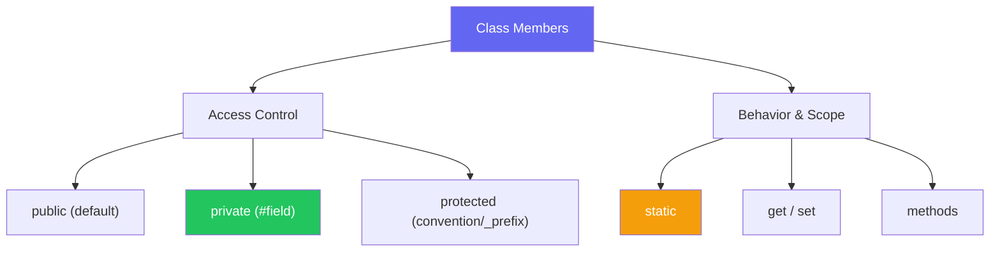

import { Tabs, TabItem, Aside, Badge, Card, CardGrid, Code, LinkCard } from '@astrojs/starlight/components';

## 🔧 Member Modifiers in JavaScript — Complete Guide

> JavaScript is **dynamically typed** and historically lacked strict access modifiers. However, modern JS (ES2022+) introduces **true private fields**, while `static`, `get`/`set`, and conventions provide robust encapsulation.



<Aside type="tip" title="🎯 MUST KNOW">
**JS Superpowers vs Java**:  
✅ **True Private Fields (`#`)** — Hard privacy, enforced by engine (ES2022)  
✅ **No `protected` keyword** — Use `_prefix` convention or WeakMaps  
✅ **No `final` keyword** — Use `Object.freeze()` or conventions for immutability  
✅ **No `volatile`/`synchronized`** — JS is single-threaded; use `async/await` or Atomics for concurrency  
✅ **Getters/Setters** — Built-in syntax for computed properties  
</Aside>

---

## 🌍 public Members (Default)

> In JavaScript, **all members are public by default**. There is no `public` keyword.

<Code lang="js" title="Public members — accessible everywhere" code={`
class User {
    // Public field
    name = "Alice";
    
    // Public method
    greet() {
        return \`Hello, I am \${this.name}\`;
    }
}

const user = new User();
console.log(user.name);   // ✅ "Alice"
console.log(user.greet()); // ✅ "Hello, I am Alice"

// Can be modified from outside
user.name = "Bob"; // ✅ Allowed
`} />

<Aside type="caution">
**Critical Rule**: Since everything is public by default, **encapsulation relies on discipline** or **private fields (`#`)**.  
Unlike Java, there is no compiler check preventing external access to "internal" methods unless you use `#`.
</Aside>

### ✅ Visibility Matrix for public Members
| Access From | public Member |
|-------------|---------------|
| Same class | ✅ Yes |
| Subclass | ✅ Yes |
| External code | ✅ Yes |

---

## 🔒 private Members (`#` Syntax) <Badge text="ES2022+" variant="success" />

> Prefixing a field or method with `#` makes it **truly private**. It cannot be accessed outside the class body, not even by subclasses.

<Code lang="js" title="Private fields and methods" code={`
class BankAccount {
    // Private field
    #balance = 0;
    
    // Private method
    #validate(amount) {
        if (amount <= 0) throw new Error("Invalid amount");
    }
    
    // Public method accessing private members
    deposit(amount) {
        this.#validate(amount); // ✅ Allowed inside class
        this.#balance += amount;
    }
    
    getBalance() {
        return this.#balance;
    }
}

const acc = new BankAccount();
acc.deposit(100);
console.log(acc.getBalance()); // ✅ 100

// ❌ Outside access — Syntax Error!
// console.log(acc.#balance);      // 💥 SyntaxError: Private field '#balance' must be declared in an enclosing class
// acc.#validate(50);              // 💥 SyntaxError
`} />

### 🔑 Key Rules for `#` Private
<CardGrid>
  <Card title="NOT Inherited by Subclasses" icon="error">
```js
    class Parent {
        #secret = 42;
        #showSecret() { console.log(this.#secret); }
    }
    
    class Child extends Parent {
        test() {
            // console.log(this.#secret);   // 💥 SyntaxError
            // this.#showSecret();          // 💥 SyntaxError
        }
    }
```
    **Why**: `#` fields are scoped strictly to the declaring class. They are not part of the prototype chain.
  </Card>
  
  <Card title="Must Be Declared Before Use" icon="approve-check">
```js
    class Demo {
        method() {
            // this.#x = 10; // 💥 SyntaxError if #x not declared
        }
        #x = 0; // Declaration
    }
```
    **Note**: Unlike public fields, private fields **must** be declared in the class body. You can't just assign them in the constructor.
  </Card>
</CardGrid>

### ✅ Visibility Matrix for `#` Private Members

| Access From | `#` Private Member |
|-------------|--------------------|
| Same class | ✅ Yes |
| Subclass | ❌ No |
| External code | ❌ No |

<Aside type="tip">
**Browser Support**: True private fields (`#`) are supported in all modern browsers and Node.js 12+. For older environments, use TypeScript `private` (compile-time only) or WeakMaps.
</Aside>

---

## 🛡️ protected Members (Convention & WeakMaps)

> JavaScript has **no `protected` keyword**. Developers use conventions or advanced patterns to simulate "package/subclass only" access.

### Option 1: Naming Convention (`_prefix`)

<Code lang="js" title="Protected by convention" code={`
class Animal {
    _name = "Unknown"; // Convention: "_" means protected/internal
    
    speak() {
        return \`\${this._name} makes a sound\`;
    }
}

class Dog extends Animal {
    bark() {
        // ✅ Subclass accesses "protected" field
        return \`\${this._name} says: Woof!\`;
    }
}

const dog = new Dog();
dog._name = "Buddy"; // ⚠️ Technically allowed, but violates convention
console.log(dog.bark()); // "Buddy says: Woof!"
`} />

<Aside type="caution">
**Limitation**: `_prefix` is **not enforced**. Anyone can still access `obj._name`. It’s a signal to other developers, not a security barrier.
</Aside>

### Option 2: WeakMap (Hard Privacy for Subclasses)

<Code lang="js" title="WeakMap for true protected-like privacy" code={`
const protectedData = new WeakMap();

class Parent {
    constructor(secret) {
        protectedData.set(this, { secret });
    }
    
    getSecret() {
        return protectedData.get(this)?.secret;
    }
}

class Child extends Parent {
    reveal() {
        // ✅ Can access via WeakMap if shared scope allows
        // But typically WeakMaps are module-scoped
        return this.getSecret(); 
    }
}

// Outside code cannot access protectedData without reference to the Map
const p = new Parent("shhh");
// protectedData.get(p) → ❌ ReferenceError if Map is not exported
`} />

---

## ⚡ static Modifier

> Belongs to the **class**, not instances. Shared across all objects.

<Code lang="js" title="Static fields and methods" code={`
class MathHelper {
    // Static field
    static PI = 3.14159;
    
    // Static method
    static add(a, b) {
        return a + b;
    }
    
    // Instance method
    describe() {
        return "I am an instance";
    }
}

// Access via Class Name
console.log(MathHelper.PI);      // ✅ 3.14159
console.log(MathHelper.add(2, 3)); // ✅ 5

// ❌ Cannot access static from instance directly
const m = new MathHelper();
// console.log(m.PI);    // undefined (unless shadowed)
// m.add(2, 3);          // TypeError: m.add is not a function
`} />

### 🔑 static Member Rules

<CardGrid>
  <Card title="No `this` of Instance" icon="information">
```js
    class Counter {
        static count = 0;
        
        constructor() {
            Counter.count++; // ✅ Access via Class Name
            // this.count++; // ❌ 'this' refers to instance, not class
        }
        
        static increment() {
            this.count++; // ✅ In static methods, 'this' refers to the Class
        }
    }
```
  </Card>
  
  <Card title="Static Initialization Blocks" icon="rocket">
```js
    class Config {
        static API_KEY;
        static BASE_URL;
        
        // Runs once when class is defined
        static {
            try {
                const env = loadEnv();
                this.API_KEY = env.KEY;
                this.BASE_URL = env.URL;
            } catch (e) {
                this.API_KEY = "default";
            }
        }
    }
```
  </Card>
</CardGrid>

---

## 🔀 Getters and Setters

> JavaScript uses `get` and `set` keywords to define accessor descriptors, similar to Java's getter/setter methods but with property syntax.

<Code lang="js" title="Getters and Setters" code={`
class Person {
    #age = 0;
    
    get age() {
        return this.#age;
    }
    
    set age(value) {
        if (value < 0 || value > 120) {
            throw new Error("Invalid age");
        }
        this.#age = value;
    }
}

const p = new Person();
p.age = 25;       // Calls setter
console.log(p.age); // Calls getter → 25

// p.age = -5;    // 💥 Error: Invalid age
`} />

<Aside type="tip">
**Best Practice**: Use getters/setters for validation or computed properties. Avoid heavy logic in getters as they look like simple property access.
</Aside>

---

## 🆚 Java vs JS Modifier Comparison

<table>
  <thead>
    <tr>
      <th>Feature</th>
      <th>Java</th>
      <th>JavaScript</th>
    </tr>
  </thead>
  <tbody>
    <tr><td><code>public</code></td><td>Keyword required</td><td>Default (no keyword)</td></tr>
    <tr><td><code>private</code></td><td>Keyword required</td><td><code>#field</code> (ES2022+)</td></tr>
    <tr><td><code>protected</code></td><td>Keyword required</td><td>Convention (<code>_field</code>) or WeakMap</td></tr>
    <tr><td><code>static</code></td><td>Keyword required</td><td><code>static</code> keyword</td></tr>
    <tr><td><code>final</code></td><td>Prevents reassignment</td><td>No keyword. Use <code>Object.freeze()</code> or convention</td></tr>
    <tr><td><code>abstract</code></td><td>Keyword required</td><td>No keyword. Throw error in method or use TS</td></tr>
    <tr><td><code>synchronized</code></td><td>Thread safety</td><td>N/A (Single-threaded). Use <code>async/await</code></td></tr>
    <tr><td><code>volatile</code></td><td>Visibility guarantee</td><td>N/A. Use Atomics or SharedArrayBuffer for workers</td></tr>
    <tr><td><code>transient</code></td><td>Skip serialization</td><td>N/A. JSON.stringify ignores functions/symbols</td></tr>
  </tbody>
</table>

---

## 🎯 Interview Cheat Sheet

<CardGrid>
  <Card title="Q: How do you make a field private in JS?" icon="approve-check">
    **Use `#` prefix** (ES2022+).  
    ```js
    class X { #private = 1; }
    ```
    ✅ Enforced by engine.  
    ⚠️ Older alternatives: TypeScript `private` (compile-time only), WeakMaps, or closures.
  </Card>
  
  <Card title="Q: What is the difference between `static` and instance methods?" icon="information">
    - **Static**: Called on Class (`Class.method()`). No access to `this` (instance). Used for utilities/factories.  
    - **Instance**: Called on Object (`obj.method()`). Has access to `this`. Used for object behavior.
  </Card>

  <Card title="Q: Does JS have `protected`?" icon="error">
    **NO ❌**.  
    ✅ Use `_prefix` convention (soft privacy).  
    ✅ Use `WeakMap` (hard privacy, complex).  
    ✅ Use TypeScript `protected` (compile-time check only).
  </Card>

  <Card title="Q: How to make an object immutable in JS?" icon="rocket">
    **`Object.freeze(obj)`**.  
    ```js
    const config = Object.freeze({ key: "value" });
    // config.key = "new"; // Ignored (or TypeError in strict mode)
    ```
    ⚠️ Shallow freeze only. For deep freeze, recurse or use libraries.
  </Card>

  <Card title="Q: Can subclasses access `#` private fields?" icon="error">
    **NO ❌**.  
    `#` fields are strictly scoped to the declaring class. Subclasses cannot see or override them.
  </Card>
</CardGrid>

---

## 🧩 DSA & Practical Patterns

<CardGrid>
  <Card title="Pattern: Singleton with Static" icon="shield">
```js
    class Database {
        static #instance = null;
        
        constructor() {
            if (Database.#instance) {
                throw new Error("Use getInstance()");
            }
            Database.#instance = this;
        }
        
        static getInstance() {
            if (!Database.#instance) {
                Database.#instance = new Database();
            }
            return Database.#instance;
        }
    }
    
    const db = Database.getInstance();
```
  </Card>
  
  <Card title="Pattern: Immutable Constants with Getters" icon="rocket">
```js
    class Config {
        static get API_URL() {
            return "https://api.example.com";
        }
        
        static get MAX_RETRIES() {
            return 3;
        }
    }
    
    // Read-only access
    console.log(Config.API_URL); 
    // Config.API_URL = "hack"; // ❌ No setter defined
```
  </Card>

  <Card title="Pattern: Encapsulated State with Closures" icon="backspace">
```js
    function createCounter() {
        let count = 0; // Private variable in closure
        
        return {
            increment: () => ++count,
            getCount: () => count
        };
    }
    
    const counter = createCounter();
    // counter.count is undefined (truly private)
    counter.increment();
```
  </Card>
</CardGrid>

---

## 🔑 Quick Reference Summary

### Access Control
| Modifier | Syntax | Enforced? | Subclass Access? |
|----------|--------|-----------|------------------|
| Public | `field` | N/A | ✅ Yes |
| Private | `#field` | ✅ Runtime | ❌ No |
| Protected | `_field` | ❌ Convention | ✅ Yes (by convention) |

### Behavior Modifiers
| Modifier | Syntax | Purpose |
|----------|--------|---------|
| Static | `static method()` | Class-level utility/state |
| Getter | `get prop()` | Computed read access |
| Setter | `set prop(val)` | Validated write access |

### Immutability
| Technique | Syntax | Depth |
|-----------|--------|-------|
| Const | `const x = 1` | Binding only |
| Freeze | `Object.freeze(obj)` | Shallow |
| Deep Freeze | Custom recursive function | Deep |

<Aside type="caution">
**Final Checklist**:
1. ✅ Use `#` for true privacy (modern JS).
2. ✅ Use `_` for "internal use" convention (widely understood).
3. ✅ Use `static` for utilities that don't need instance state.
4. ✅ Use `get`/`set` for validation or computed properties.
5. ✅ Remember: JS is single-threaded — no `synchronized` needed usually.
6. ✅ Use `Object.freeze()` for immutable configuration objects.
</Aside>

---

## 🧪 Test Your Understanding

<Code lang="js" title="Predict the output/error" code={`class Test {
    #private = 1;
    public = 2;
    static staticVal = 3;
    
    static show() {
        // console.log(this.#private); // ?
        console.log(this.staticVal);  // ?
    }
}

const t = new Test();
// console.log(t.#private); // ?
console.log(t.public);     // ?
Test.show();               // ?
`} />

<details>
<summary>✅ Click to reveal answers</summary>

```text
// console.log(t.#private); // 💥 SyntaxError: Private field must be declared in an enclosing class
console.log(t.public);     // 2
Test.show();               // 3 (static method accesses static field via 'this')
```
</details>

---

## 🔗 Related Topics

<CardGrid columns={2}>
  <LinkCard
    title="JavaScript Classes"
    href="/computer-languages/javascript/topics/classes"
    description="Syntax, inheritance, super, constructors"
  />
  <LinkCard
    title="JavaScript Encapsulation"
    href="/computer-languages/javascript/guides/encapsulation"
    description="Private fields, WeakMaps, closures, modules"
  />
  <LinkCard
    title="JavaScript Static Methods"
    href="/computer-languages/javascript/topics/static-methods"
    description="Utilities, factories, singleton pattern"
  />
  <LinkCard
    title="TypeScript Access Modifiers"
    href="/computer-languages/typescript/topics/modifiers"
    description="public, private, protected, readonly (compile-time)"
  />
</CardGrid>

<Aside type="note">
🎯 **Production Pro Tips**  
1. Prefer `#` private fields over `_` convention for critical internal state.  
2. Use `static` blocks for complex static initialization (e.g., loading config).  
3. Use `Object.freeze()` on exported constants to prevent accidental mutation.  
4. In TypeScript, use `private`/`protected` for IDE support and compile-time safety, but remember they compile to public JS.  
5. Avoid heavy logic in getters/setters to keep property access predictable. 🛡️
</Aside>

> 💡 **Final Wisdom**: JavaScript's approach to modifiers is **flexible but requires discipline**. Use `#` for hard privacy, `static` for class-level logic, and conventions for the rest. Understanding these nuances ensures robust, maintainable OOP code! 🚀✨

*Converted for Astro 6 + Starlight • Optimized for interview prep + production use • Quality >>>> Quantity* 🎯
```

---

## 🔄 Java Member Modifiers → JS Member Modifiers Conversion Summary

| Java Feature | JavaScript Equivalent | Critical Difference |
|-------------|----------------------|-------------------|
| `public` | Default (no keyword) | ✅ JS: Everything is public unless marked otherwise |
| `private` | `#field` (ES2022+) | ✅ JS: Hard privacy enforced by engine. TS `private` is compile-time only. |
| `protected` | `_field` (convention) | ⚠️ JS: No native `protected`. Use `_` prefix or WeakMaps. |
| `static` | `static` keyword | ✅ Same behavior — belongs to class, not instance. |
| `final` | `const` (bindings) / `Object.freeze()` (objects) | ⚠️ JS: No `final` keyword for fields. `Object.freeze()` is shallow. |
| `abstract` | Throw Error / TypeScript | ⚠️ JS: No `abstract` keyword. Simulate by throwing in base method. |
| `synchronized` | `async/await` / Atomics | ✅ JS: Single-threaded event loop. No need for method-level locking usually. |
| `volatile` | N/A | ✅ JS: Single-threaded. Use Atomics for SharedArrayBuffer workers. |
| `transient` | N/A | ✅ JS: `JSON.stringify` skips functions/symbols. No direct equivalent. |
| `native` | N/A | ✅ JS: WebAssembly or C++ Addons for native code. |

---

🧠 **Interview Power Move**: When asked about modifiers, always mention:  
1. **`#` private fields** are truly private (runtime enforced), unlike TS `private`.  
2. **No `protected`** — use `_` convention or WeakMaps for subclass access.  
3. **`static`** methods don't have access to `this` (instance), but `this` in static context refers to the Class.  
4. **Immutability** is achieved via `Object.freeze()` or conventions, not `final`.  
5. **Single-threaded nature** eliminates need for `synchronized`/`volatile` in most cases.  

---

# ⚙️ JavaScript Method-Level Modifiers

---

## 🔰 What Are Method-Level Modifiers?

Method-level modifiers are **keywords placed directly before a method definition** inside a class that change how the method behaves — its scope, execution model, access, and return type.

```js
class Service {
  async fetchData() {}          // async — returns Promise
  * generate() {}               // generator — returns iterator
  async * stream() {}           // async generator — returns async iterator
  static create() {}            // static — on class, not instance
  get value() {}                // getter — property-like read
  set value(v) {}               // setter — property-like write
  #privateHelper() {}           // private — class scope only
  static async #load() {}       // combined — static + async + private
}
```

---

## 🗺️ Complete Map

```
Method-Level Modifiers in JavaScript
│
├── ⚡ async
│   ├── async method
│   ├── async + static
│   └── async + private
│
├── 🔄 * (Generator)
│   ├── generator method
│   ├── static generator
│   └── private generator
│
├── ♾️  async * (Async Generator)
│   ├── async generator method
│   └── static async generator
│
├── 🔵 static
│   ├── static method
│   ├── static async
│   ├── static generator
│   └── static async generator
│
├── 🔴 # (Private)
│   ├── private method
│   ├── private static
│   ├── private async
│   └── private generator
│
├── 🟡 get / set
│   ├── getter
│   ├── setter
│   ├── static getter
│   └── static setter
│
└── 🔀 Combinations
    ├── static async
    ├── static * 
    ├── static async *
    ├── static #
    ├── async #
    └── static async #
```

---

## ⚙️ Deep Dive — How Method Modifiers Work in V8

```
┌──────────────────────────────────────────────────────────┐
│         METHOD COMPILATION IN V8                         │
│                                                          │
│  class Foo {                                             │
│    method() {}          → Foo.prototype.method           │
│    static method() {}   → Foo.method                     │
│    #method() {}         → PrivateSlot(Foo, "#method")    │
│    async method() {}    → Foo.prototype.method           │
│                           (returns Promise — wrapping)   │
│    * method() {}        → Foo.prototype.method           │
│                           (returns GeneratorObject)      │
│  }                                                       │
│                                                          │
│  Modifier application order:                             │
│  static > access(#) > kind(async/get/set/*) > name      │
│                                                          │
│  V8 method slot resolution:                              │
│  1. Check instance own properties                        │
│  2. Walk [[Prototype]] chain                             │
│  3. Find method on prototype → call it                   │
│  4. 'this' = object method was called on                 │
└──────────────────────────────────────────────────────────┘
```

---

## 1️⃣ `async` Method Modifier

### Core Behavior

```js
class DataService {
  // async method — always returns a Promise:
  async fetchUser(id) {
    const res  = await fetch(`/api/users/${id}`);
    const data = await res.json();
    return data; // wrapped in Promise.resolve() automatically
  }

  // Non-async — returns value directly:
  formatUser(user) {
    return `${user.name} <${user.email}>`;
  }
}

const svc = new DataService();

// Return type difference:
svc.formatUser({ name: "Ali", email: "a@b.com" })
// "Ali <a@b.com>" — plain string

svc.fetchUser(1)
// Promise<user> — always a Promise, even without await
```

### `async` Method Internal Mechanics

```
┌──────────────────────────────────────────────────────────┐
│         ASYNC METHOD — WHAT V8 DOES                      │
│                                                          │
│  async fetchUser(id) {          Compiled to roughly:     │
│    const res = await fetch(id); function fetchUser(id) { │
│    return res.json();             return new Promise(     │
│  }                                 (resolve, reject) => {│
│                                      fetch(id)           │
│                                      .then(res =>        │
│                                        res.json())       │
│                                      .then(resolve)      │
│                                      .catch(reject)      │
│                                   });                    │
│                                 }                        │
│                                                          │
│  Each 'await' = suspension point                         │
│  Method body resumes as microtask                        │
│  'this' preserved across all suspension points           │
└──────────────────────────────────────────────────────────┘
```

```js
class ApiClient {
  #baseUrl;
  #headers;

  constructor(baseUrl, token) {
    this.#baseUrl  = baseUrl;
    this.#headers  = {
      "Authorization": `Bearer ${token}`,
      "Content-Type":  "application/json"
    };
  }

  // async method — this preserved across awaits:
  async post(path, body) {
    const res = await fetch(`${this.#baseUrl}${path}`, {
      method:  "POST",
      headers: this.#headers,  // 'this' still valid after await ✅
      body:    JSON.stringify(body)
    });

    if (!res.ok) {
      const err = await res.json();
      throw new ApiError(err.message, res.status);
    }

    return res.json();
  }

  // async + error handling pattern:
  async safeGet(path) {
    try {
      const res = await fetch(`${this.#baseUrl}${path}`, {
        headers: this.#headers
      });
      if (!res.ok) throw new Error(`HTTP ${res.status}`);
      return [null, await res.json()];    // [error, data]
    } catch (err) {
      return [err, null];                 // [error, data]
    }
  }
}

const client = new ApiClient("https://api.example.com", "token123");
const [err, user] = await client.safeGet("/users/1");
```

---

## 2️⃣ `*` Generator Method Modifier

### Core Behavior

```js
class Range {
  #start;
  #end;
  #step;

  constructor(start, end, step = 1) {
    this.#start = start;
    this.#end   = end;
    this.#step  = step;
  }

  // Generator method — returns GeneratorObject:
  * [Symbol.iterator]() {
    for (let i = this.#start; i <= this.#end; i += this.#step) {
      yield i;
    }
  }

  // Named generator method:
  * values() {
    yield* this[Symbol.iterator]();
  }

  * reversed() {
    for (let i = this.#end; i >= this.#start; i -= this.#step) {
      yield i;
    }
  }
}

const r = new Range(1, 10, 2);

// Iterable via Symbol.iterator:
[...r]               // [1, 3, 5, 7, 9]
for (const n of r) { console.log(n); } // 1, 3, 5, 7, 9

// Named generator:
[...r.values()]      // [1, 3, 5, 7, 9]
[...r.reversed()]    // [9, 7, 5, 3, 1]
```

### Generator Method Internals

```
┌──────────────────────────────────────────────────────────┐
│         GENERATOR METHOD — EXECUTION MODEL               │
│                                                          │
│  * generate() {                                          │
│    yield 1;      ← PAUSE here, return { value:1,done:F} │
│    yield 2;      ← PAUSE here, return { value:2,done:F} │
│    return 3;     ← DONE, return { value:3, done:true }  │
│  }                                                       │
│                                                          │
│  Calling generate() → does NOT run body                  │
│  Returns GeneratorObject with .next() method            │
│  .next() → runs until next yield → suspends              │
│  .next() → resumes from suspension point                 │
│                                                          │
│  State preserved between .next() calls:                  │
│  → local variables                                       │
│  → 'this' binding                                        │
│  → position in function body                             │
└──────────────────────────────────────────────────────────┘
```

```js
class InfiniteSequence {
  #seed;

  constructor(seed = 0) {
    this.#seed = seed;
  }

  // Infinite generator — never done:
  * naturals() {
    let n = this.#seed;
    while (true) {
      yield n++;
    }
  }

  // Generator with two-way communication:
  * accumulator() {
    let total = 0;
    while (true) {
      const next = yield total; // yield current, receive next input
      if (next === null) return total; // stop signal
      total += next;
    }
  }
}

const seq = new InfiniteSequence(1);
const gen = seq.naturals();
gen.next().value; // 1
gen.next().value; // 2
gen.next().value; // 3

// Two-way:
const acc = new InfiniteSequence().accumulator();
acc.next();       // { value: 0, done: false } — prime the pump
acc.next(10);     // { value: 10, done: false }
acc.next(20);     // { value: 30, done: false }
acc.next(null);   // { value: 30, done: true } — done
```

---

## 3️⃣ `async *` Async Generator Method

### Core Behavior

```
┌──────────────────────────────────────────────────────────┐
│         async * — COMBINES async + generator             │
│                                                          │
│  Regular generator:    yields synchronous values         │
│  Async generator:      yields Promises (awaits them)     │
│                                                          │
│  Returns AsyncGenerator object                           │
│  Consumed with: for await...of                           │
│  Each .next() returns Promise<{value, done}>             │
└──────────────────────────────────────────────────────────┘
```

```js
class PaginatedFetcher {
  #baseUrl;

  constructor(baseUrl) {
    this.#baseUrl = baseUrl;
  }

  // Async generator — yields one page at a time:
  async * pages(endpoint, pageSize = 100) {
    let cursor = null;

    do {
      const url = `${this.#baseUrl}${endpoint}?` +
        `limit=${pageSize}${cursor ? `&cursor=${cursor}` : ""}`;

      const res  = await fetch(url);
      const data = await res.json();

      yield data.items;            // yield one page

      cursor = data.nextCursor;
    } while (cursor);
  }

  // Flatten pages into individual items:
  async * items(endpoint, pageSize = 100) {
    for await (const page of this.pages(endpoint, pageSize)) {
      yield* page;                 // yield each item from each page
    }
  }

  // With transformation:
  async * transformedItems(endpoint, transform) {
    for await (const item of this.items(endpoint)) {
      yield transform(item);       // yield transformed item
    }
  }
}

const fetcher = new PaginatedFetcher("https://api.example.com");

// Consume all users lazily:
for await (const user of fetcher.items("/users")) {
  await processUser(user);
}

// With limit — stop early:
let count = 0;
for await (const user of fetcher.items("/users")) {
  if (count++ >= 50) break;  // ✅ generator cleaned up properly
  await processUser(user);
}
```

---

## 4️⃣ `static` Method Modifier — Revisited Deep

### Static Method Binding and `this`

```js
class MathUtils {
  static PI = Math.PI;

  // static — 'this' refers to the CLASS itself:
  static circleArea(r) {
    return this.PI * r ** 2; // this = MathUtils ✅
  }

  // Polymorphic static — works with subclasses:
  static create(...args) {
    return new this(...args); // 'this' = class it's called on
  }
}

class PreciseMath extends MathUtils {
  static PI = 3.14159265358979;
}

MathUtils.circleArea(5);     // 78.539...
PreciseMath.circleArea(5);   // uses PreciseMath.PI ✅ — polymorphic

// Static factory:
class Dog {
  static create(name) {
    return new this(name); // new Dog(name) when called as Dog.create
  }
  constructor(name) { this.name = name; }
}

class GoldenRetriever extends Dog {}
GoldenRetriever.create("Buddy"); // new GoldenRetriever("Buddy") ✅
```

### Static Methods and Prototype Chain

```
┌──────────────────────────────────────────────────────────┐
│         STATIC METHOD PROTOTYPE CHAIN                    │
│                                                          │
│  Instance chain:                                         │
│  instance → Child.prototype → Parent.prototype → Object  │
│                                                          │
│  Static chain (constructors):                            │
│  Child → Parent → Function.prototype → Object.prototype  │
│                                                          │
│  Child.__proto__ === Parent  ← STATIC inheritance        │
│                                                          │
│  So:                                                     │
│  Parent.staticMethod() defined                           │
│  Child.staticMethod() → inherited via __proto__ ✅       │
└──────────────────────────────────────────────────────────┘
```

```js
class Animal {
  static create(name) { return new this(name); }
  static describe()   { return `I am ${this.name} class`; }
}

class Dog extends Animal {
  constructor(name) {
    super();
    this.name = name;
  }
}

Animal.describe();  // "I am Animal class"
Dog.describe();     // "I am Dog class" ✅ — inherited, this=Dog

Dog.__proto__ === Animal;  // true ✅ — static chain
Dog.create("Rex");         // new Dog("Rex") ✅
```

---

## 5️⃣ `#` Private Method Modifier — Deep Dive

### Private Methods vs Private Fields

```js
class FormValidator {
  #rules   = new Map();
  #errors  = [];

  // Private instance method:
  #sanitize(value) {
    return String(value ?? "").trim();
  }

  // Private method calling another private:
  #runRule(rule, value) {
    const clean = this.#sanitize(value);  // ✅ call private from private
    return rule.test(clean);
  }

  // Private static method:
  static #parseRule(ruleConfig) {
    return {
      test:    ruleConfig.fn,
      message: ruleConfig.msg
    };
  }

  // Public API:
  addRule(field, ruleConfig) {
    const rule = FormValidator.#parseRule(ruleConfig); // ✅ static private
    if (!this.#rules.has(field)) this.#rules.set(field, []);
    this.#rules.get(field).push(rule);
    return this; // chainable
  }

  validate(data) {
    this.#errors = [];

    for (const [field, rules] of this.#rules) {
      for (const rule of rules) {
        if (!this.#runRule(rule, data[field])) { // ✅ private method call
          this.#errors.push({ field, message: rule.message });
        }
      }
    }

    return this.#errors.length === 0;
  }

  get errors() { return [...this.#errors]; }
}

const v = new FormValidator()
  .addRule("email", { fn: v => v.includes("@"), msg: "Invalid email" })
  .addRule("name",  { fn: v => v.length >= 2,   msg: "Name too short" });

v.validate({ email: "ali@x.com", name: "Ali" }); // true
v.validate({ email: "bad",        name: "A"   }); // false
v.errors; // [{ field:"email", message:"..." }, { field:"name", ... }]
```

### Private Methods Are NOT on Prototype

```
┌──────────────────────────────────────────────────────────┐
│         PRIVATE METHOD STORAGE                           │
│                                                          │
│  Public method:   Foo.prototype.method = fn             │
│  Private method:  stored in class's PrivateMethodMap    │
│                   keyed by brand + name                 │
│                   NOT on prototype                      │
│                   NOT discoverable externally            │
│                                                          │
│  Accessing private method:                               │
│  this.#method()  → engine checks:                        │
│    1. Is 'this' branded by THIS class?                   │
│    2. Yes → look up #method in PrivateMethodMap          │
│    3. Call it                                            │
│  Cross-class: step 1 fails → TypeError                  │
└──────────────────────────────────────────────────────────┘
```

```js
// Private methods truly hidden:
class Secret {
  #impl() { return "secret"; }
  run()   { return this.#impl(); }
}

const s = new Secret();

// All of these fail to find #impl:
Object.getOwnPropertyNames(s);           // []
Object.getOwnPropertyNames(Secret.prototype); // ["constructor", "run"]
s["#impl"];                              // undefined
s.#impl();                               // ❌ SyntaxError
Reflect.ownKeys(s);                      // []
```

---

## 6️⃣ `get` / `set` Method Modifiers — Full Deep Dive

### How Accessors Work in V8

```
┌──────────────────────────────────────────────────────────┐
│         GETTER/SETTER PROPERTY DESCRIPTOR                │
│                                                          │
│  class Foo {                                             │
│    get x() { return 1; }                                 │
│    set x(v) { ... }                                      │
│  }                                                       │
│                                                          │
│  Stored on Foo.prototype as property descriptor:         │
│  {                                                       │
│    x: {                                                  │
│      get: function() { return 1; },                      │
│      set: function(v) { ... },                           │
│      enumerable:   false,                                │
│      configurable: true                                  │
│    }                                                     │
│  }                                                       │
│                                                          │
│  obj.x     → triggers get function                       │
│  obj.x = v → triggers set function                       │
│  Access is transparent — looks like plain property       │
└──────────────────────────────────────────────────────────┘
```

```js
class Vector {
  #x;
  #y;
  #z;

  constructor(x, y, z = 0) {
    this.#x = x;
    this.#y = y;
    this.#z = z;
  }

  // Computed property via getter:
  get magnitude() {
    return Math.sqrt(this.#x**2 + this.#y**2 + this.#z**2);
  }

  // Memoized getter — compute once, cache result:
  get #normalizedCache() {
    return Object.freeze({
      x: this.#x / this.magnitude,
      y: this.#y / this.magnitude,
      z: this.#z / this.magnitude,
    });
  }

  get normalized() {
    return this.#normalizedCache; // private getter ✅
  }

  // Setter with validation and side effects:
  get x() { return this.#x; }
  set x(value) {
    if (!Number.isFinite(value)) {
      throw new TypeError(`x must be finite, got ${value}`);
    }
    this.#x = value;
  }

  // Getter returns different type than raw storage:
  get components() {
    return [this.#x, this.#y, this.#z]; // array from three fields
  }

  set components([x, y, z = 0]) {       // destructured setter
    this.x = x; // uses setter validation
    this.y = y;
    this.#z = z;
  }
}

const v = new Vector(3, 4, 0);
v.magnitude;      // 5
v.normalized;     // { x: 0.6, y: 0.8, z: 0 }
v.components = [6, 8, 0]; // uses setter
v.magnitude;      // 10
```

### Static Getters / Setters

```js
class Environment {
  static #current = "development";
  static #allowedEnvs = new Set(["development", "staging", "production"]);

  static get current()     { return Environment.#current; }
  static get isDevelopment() { return Environment.#current === "development"; }
  static get isProduction()  { return Environment.#current === "production"; }

  static set current(env) {
    if (!Environment.#allowedEnvs.has(env)) {
      throw new Error(
        `Invalid env "${env}". Must be: ${[...Environment.#allowedEnvs].join(", ")}`
      );
    }
    Environment.#current = env;
  }

  // Static getter for config based on environment:
  static get config() {
    const configs = {
      development: { debug: true,  logLevel: "verbose", cache: false },
      staging:     { debug: true,  logLevel: "info",    cache: true  },
      production:  { debug: false, logLevel: "error",   cache: true  },
    };
    return Object.freeze(configs[Environment.#current]);
  }
}

Environment.current;       // "development"
Environment.config.debug;  // true
Environment.current = "production";
Environment.config.debug;  // false
Environment.isDevelopment; // false
Environment.isProduction;  // true
```

---

## 7️⃣ All Modifier Combinations

### `static async` Method

```js
class FileProcessor {
  static async readJSON(filePath) {
    const content = await fs.promises.readFile(filePath, "utf8");
    return JSON.parse(content);
  }

  static async writeJSON(filePath, data) {
    const content = JSON.stringify(data, null, 2);
    await fs.promises.writeFile(filePath, content, "utf8");
  }

  // Static async factory:
  static async fromFile(filePath) {
    const config = await FileProcessor.readJSON(filePath);
    return new FileProcessor(config);
  }

  constructor(config) {
    this.config = config;
  }
}

// Usage — static async factory pattern:
const processor = await FileProcessor.fromFile("./config.json");
```

### `static *` Generator Method

```js
class IdGenerator {
  static #counters = new Map();

  // Static generator — infinite ID sequence:
  static * sequence(prefix = "") {
    let n = 0;
    while (true) {
      yield `${prefix}${String(n++).padStart(8, "0")}`;
    }
  }

  // Static generator — range utility:
  static * range(start, end, step = 1) {
    for (let i = start; i <= end; i += step) {
      yield i;
    }
  }

  // Static generator consuming another:
  static * take(iterable, n) {
    let count = 0;
    for (const item of iterable) {
      if (count++ >= n) return;
      yield item;
    }
  }
}

// First 5 user IDs:
const userIds = [...IdGenerator.take(IdGenerator.sequence("USR-"), 5)];
// ["USR-00000000", "USR-00000001", ..., "USR-00000004"]
```

### `static async *` Async Generator

```js
class EventStream {
  static async * fromWebSocket(url) {
    const ws = new WebSocket(url);

    // Buffer events until consumed:
    const buffer = [];
    let resolve = null;
    let done    = false;

    ws.onmessage = (e) => {
      if (resolve) { resolve(e.data); resolve = null; }
      else buffer.push(e.data);
    };

    ws.onclose = () => { done = true; if (resolve) resolve(null); };

    try {
      while (!done) {
        if (buffer.length > 0) {
          yield buffer.shift();
        } else {
          const msg = await new Promise(r => { resolve = r; });
          if (msg !== null) yield msg;
        }
      }
    } finally {
      ws.close(); // cleanup when generator abandoned
    }
  }
}

for await (const event of EventStream.fromWebSocket("wss://events.example.com")) {
  console.log(JSON.parse(event));
}
```

### `async #` Private Async Method

```js
class AuthService {
  #tokenCache = new Map();
  #apiKey;

  constructor(apiKey) {
    this.#apiKey = apiKey;
  }

  // Private async — internal implementation detail:
  async #fetchToken(userId) {
    const res = await fetch(`/auth/token/${userId}`, {
      headers: { "X-API-Key": this.#apiKey }
    });
    if (!res.ok) throw new Error(`Auth failed: ${res.status}`);
    return res.json();
  }

  // Private async — with retry logic:
  async #fetchWithRetry(userId, attempts = 3) {
    for (let i = 0; i < attempts; i++) {
      try {
        return await this.#fetchToken(userId);
      } catch (err) {
        if (i === attempts - 1) throw err;
        await new Promise(r => setTimeout(r, 1000 * (i + 1)));
      }
    }
  }

  // Public method uses private async:
  async getToken(userId) {
    if (this.#tokenCache.has(userId)) {
      const { token, expiresAt } = this.#tokenCache.get(userId);
      if (Date.now() < expiresAt) return token;
    }

    const { token, ttl } = await this.#fetchWithRetry(userId); // ✅
    this.#tokenCache.set(userId, {
      token,
      expiresAt: Date.now() + ttl * 1000
    });

    return token;
  }
}
```

### `static async #` — Combined All Modifiers

```js
class DatabaseManager {
  static #pool = null;
  static #config = null;

  // All four: static + async + private:
  static async #createPool(config) {
    const { Pool } = await import("pg"); // dynamic import inside static
    return new Pool({
      host:     config.host,
      port:     config.port,
      database: config.database,
      max:      config.maxConnections ?? 10
    });
  }

  static async #validateConfig(config) {
    const required = ["host", "port", "database"];
    const missing  = required.filter(k => !config[k]);
    if (missing.length) {
      throw new Error(`Missing DB config: ${missing.join(", ")}`);
    }
  }

  // Public static async — uses private static async:
  static async initialize(config) {
    await DatabaseManager.#validateConfig(config); // ✅
    DatabaseManager.#config = config;
    DatabaseManager.#pool   = await DatabaseManager.#createPool(config); // ✅
    return DatabaseManager;
  }

  static async query(sql, params = []) {
    if (!DatabaseManager.#pool) {
      throw new Error("Call DatabaseManager.initialize() first");
    }
    const client = await DatabaseManager.#pool.connect();
    try {
      return await client.query(sql, params);
    } finally {
      client.release();
    }
  }
}

await DatabaseManager.initialize({
  host: "localhost", port: 5432, database: "mydb"
});
const result = await DatabaseManager.query("SELECT * FROM users");
```

---

## 📊 Complete Modifier Combinations Table

```
┌──────────────────────────────────────────────────────────┐
│            ALL VALID METHOD MODIFIER COMBOS              │
├──────────────────────┬───────────────────────────────────┤
│ Combination          │ Returns                           │
├──────────────────────┼───────────────────────────────────┤
│ method()             │ any value                         │
│ async method()       │ Promise<value>                    │
│ * method()           │ Generator                         │
│ async * method()     │ AsyncGenerator                    │
│ get prop()           │ any value (property access)       │
│ set prop(v)          │ void (property write)             │
│ #method()            │ any value (private)               │
│ async #method()      │ Promise<value> (private)          │
│ * #method()          │ Generator (private)               │
│ static method()      │ any value                         │
│ static async method()│ Promise<value>                    │
│ static * method()    │ Generator                         │
│ static async * ()    │ AsyncGenerator                    │
│ static get prop()    │ any value                         │
│ static set prop(v)   │ void                              │
│ static #method()     │ any value (static+private)        │
│ static async #()     │ Promise (static+async+private)    │
│ async * #method()    │ AsyncGenerator (async+gen+priv)   │
│ static async * #()   │ AsyncGenerator (all modifiers)    │
└──────────────────────┴───────────────────────────────────┘
```

---

## 🏭 Real Production Pattern — Full Service Class

```js
class NotificationService {
  // Private state:
  #queue    = [];
  #handlers = new Map();
  #running  = false;

  // Static configuration:
  static #defaultTimeout = 5000;
  static #maxRetries     = 3;

  // Static async factory:
  static async create(config) {
    const svc = new NotificationService();
    await svc.#initialize(config); // private async method
    return svc;
  }

  // ── Private Methods ────────────────────────────────────

  async #initialize(config) {
    this.#running = true;
    await this.#connectTransport(config.transport);
    this.#startWorker(); // fire-and-forget
  }

  async #connectTransport(transport) {
    // setup connection...
  }

  // Private async generator — process queue:
  async * #drainQueue() {
    while (this.#running) {
      if (this.#queue.length === 0) {
        await new Promise(r => setTimeout(r, 100)); // poll
        continue;
      }
      yield this.#queue.shift();
    }
  }

  async #send(notification) {
    const handler = this.#handlers.get(notification.type);
    if (!handler) throw new Error(`No handler: ${notification.type}`);

    let lastErr;
    for (let i = 0; i < NotificationService.#maxRetries; i++) {
      try {
        return await Promise.race([
          handler(notification),
          NotificationService.#timeout()  // static private utility
        ]);
      } catch (err) {
        lastErr = err;
        await new Promise(r => setTimeout(r, 1000 * (i + 1)));
      }
    }
    throw lastErr;
  }

  // Private static utility:
  static #timeout() {
    return new Promise((_, reject) =>
      setTimeout(
        () => reject(new Error("Notification timeout")),
        NotificationService.#defaultTimeout
      )
    );
  }

  // Private worker loop:
  async #startWorker() {
    for await (const notification of this.#drainQueue()) {
      try {
        await this.#send(notification);
      } catch (err) {
        console.error("Notification failed:", err);
      }
    }
  }

  // ── Public API ─────────────────────────────────────────

  register(type, handler) {
    this.#handlers.set(type, handler);
    return this;
  }

  enqueue(notification) {
    this.#queue.push({ ...notification, queuedAt: Date.now() });
    return this;
  }

  async stop() {
    this.#running = false;
  }

  // Static getters for config:
  static get defaultTimeout() { return NotificationService.#defaultTimeout; }
  static set defaultTimeout(ms) {
    if (!Number.isFinite(ms) || ms < 0) throw new RangeError("Invalid timeout");
    NotificationService.#defaultTimeout = ms;
  }
}

// Usage:
const notifier = await NotificationService.create({ transport: "smtp" });
notifier
  .register("email",  sendEmail)
  .register("sms",    sendSMS)
  .register("push",   sendPush)
  .enqueue({ type: "email", to: "user@example.com", body: "Hello" });
```

---

## 💀 Interview Traps

### Trap 1: `async` method always returns Promise — even if you return primitive

```js
class Foo {
  async getValue() {
    return 42; // wrapped in Promise.resolve(42)
  }

  getValue2() {
    return 42; // plain number
  }
}

const f = new Foo();
f.getValue();        // Promise<42> — NOT 42
f.getValue() === 42; // false 😱

await f.getValue();  // 42 ✅

// Real prod trap — checking return value without await:
if (f.getValue() === 42) { ... } // never runs 😱
// Promise is always truthy even when pending
```

---

### Trap 2: Generator method `.next()` must be primed before sending values

```js
class Counter {
  * accumulate() {
    let total = 0;
    while (true) {
      const n = yield total; // yield THEN receive
      total += n ?? 0;
    }
  }
}

const c = new Counter();
const gen = c.accumulate();

gen.next(10); // { value: 0, done: false } — first .next() PRIMES the generator
              // 10 is IGNORED — no yield to receive it yet 😱

gen.next(10); // { value: 10, done: false } — NOW 10 is received
gen.next(20); // { value: 30, done: false }

// First .next() runs until first yield — starts generator
// Value passed to first .next() is always IGNORED
```

---

### Trap 3: `static` method — `this` is the class, breaks if destructured

```js
class Logger {
  static prefix = "[LOG]";

  static log(msg) {
    console.log(`${this.prefix} ${msg}`); // this = Logger
  }
}

Logger.log("hello");  // "[LOG] hello" ✅

// Destructuring breaks 'this':
const { log } = Logger;
log("hello");          // ❌ TypeError: Cannot read 'prefix' of undefined
                       // this = undefined (strict) or global (sloppy)

// Fix — bind explicitly:
const log = Logger.log.bind(Logger);
log("hello");          // "[LOG] hello" ✅

// Or use static arrow (not possible directly — use static field):
class LoggerSafe {
  static prefix = "[LOG]";
  static log    = (msg) => console.log(`${LoggerSafe.prefix} ${msg}`);
}
const { log: safeLog } = LoggerSafe;
safeLog("hello"); // ✅ — arrow captures LoggerSafe explicitly
```

---

### Trap 4: `get` without `set` — silent fail in sloppy, error in strict

```js
class Config {
  get host() { return "localhost"; }
}

const c = new Config();

// Sloppy mode:
c.host = "newhost"; // silently does nothing 😱
c.host;             // "localhost" — unchanged, no error

// Strict mode:
"use strict";
c.host = "newhost"; // ❌ TypeError: Cannot set property host
                    // which has only a getter

// Real prod trap — config object passed to library:
function configure(options) {
  options.host = options.host || "default"; // silently fails 😱
}

configure(new Config()); // host stays "localhost" — no error
// Library silently uses wrong host

// Fix — use strict mode OR check setter exists:
const descriptor = Object.getOwnPropertyDescriptor(
  Object.getPrototypeOf(c), "host"
);
if (!descriptor?.set) throw new Error("host is read-only");
```

---

### Trap 5: Private method called on wrong instance type

```js
class A {
  #impl() { return "A"; }

  run(obj) {
    return obj.#impl(); // works only if obj is instance of A
  }
}

class B {
  #impl() { return "B"; } // different #impl — different brand
}

const a = new A();
const b = new B();

a.run(a);  // "A" ✅
a.run(b);  // ❌ TypeError: Cannot read private member #impl
           // from an object whose class did not declare it

// Use brand check to be safe:
class Safe {
  #value;

  static process(obj) {
    if (#value in obj) {          // brand check first
      return obj.#value;
    }
    throw new TypeError("Not a Safe instance");
  }
}
```

---

### Trap 6: `async *` generator — early `break` requires cleanup

```js
class StreamReader {
  async * read(source) {
    const connection = await openConnection(source);

    try {
      for await (const chunk of connection) {
        yield chunk;                    // might never be consumed
      }
    } finally {
      await connection.close();         // ALWAYS runs — even on break ✅
    }
  }
}

const reader = new StreamReader();
const gen    = reader.read("source://data");

// Consumer breaks early:
for await (const chunk of gen) {
  if (chunk.includes("STOP")) break;  // generator.return() called
  process(chunk);
}
// finally block runs → connection.close() ✅

// WITHOUT try/finally:
async * badRead(source) {
  const connection = await openConnection(source);
  for await (const chunk of connection) {
    yield chunk;
  }
  // connection.close() NEVER reached on early break 😱
}
```

---

### Trap 7: Static method vs instance method — calling wrong one

```js
class Parser {
  static parse(text) { return JSON.parse(text); }       // static
         parse(text) { return this.#parsePrivate(text); } // instance

  #parsePrivate(text) { /* ... */ }
}

const p = new Parser();

Parser.parse('{"a":1}');  // ✅ static
p.parse('{"a":1}');       // ✅ instance (different behavior)

// Real trap — calling instance method as static:
Parser.parse.call(p, '{"a":1}'); // calls STATIC with this=p
                                  // static ignores 'this' → works but wrong

// Worse — subclass overrides only one:
class StrictParser extends Parser {
  static parse(text) {
    if (!text.startsWith("{")) throw new Error("Must be object JSON");
    return Parser.parse(text);
  }
  // instance parse NOT overridden
}

StrictParser.parse("[1,2]");     // ❌ throws
new StrictParser().parse("[1,2]"); // ✅ uses Parser instance parse 😱
// Different behavior for same "name" on same class
```

---

## 📊 Quick Reference — Modifier Syntax

```
┌──────────────────────────────────────────────────────────┐
│           METHOD MODIFIER SYNTAX REFERENCE               │
│                                                          │
│  method()           {}   regular                         │
│  async method()     {}   async                           │
│  * method()         {}   generator                       │
│  async * method()   {}   async generator                 │
│                                                          │
│  get  prop()        {}   getter                          │
│  set  prop(value)   {}   setter                          │
│                                                          │
│  #method()          {}   private                         │
│  async #method()    {}   private async                   │
│  * #method()        {}   private generator               │
│  async * #method()  {}   private async generator         │
│                                                          │
│  static method()    {}   static                          │
│  static async ()    {}   static async                    │
│  static * ()        {}   static generator                │
│  static async * ()  {}   static async generator          │
│  static get  prop() {}   static getter                   │
│  static set  prop() {}   static setter                   │
│  static #method()   {}   static private                  │
│  static async #()   {}   static private async            │
└──────────────────────────────────────────────────────────┘
```

---

## 📊 DSA / Internals Connection

> Generator methods (`*`) implement the **coroutine** pattern — a function that can suspend and resume execution. In CS theory, generators are equivalent to **continuations** — a saved computation state that can be resumed later. V8 implements generator suspension by saving the entire **stack frame** (local variables, instruction pointer) to the heap when `yield` is hit, and restoring it when `.next()` is called. This is fundamentally different from regular functions where the stack frame is discarded on return.
>
> `async` methods build on generators internally — ES2017 `async/await` is **syntactic sugar** over generator + Promise chaining. V8 rewrites `async function` into a state machine using the same mechanism as generators, driven by microtask queue instead of manual `.next()` calls. Each `await` = one `yield` in the underlying state machine.
>
> Private methods (`#`) use the same **brand-based WeakMap** mechanism as private fields. The engine associates each class with a unique brand symbol. Accessing `this.#method()` first checks that `this` carries the correct brand — equivalent to a `has()` check on a WeakMap. This is O(1) and happens before method lookup, preventing cross-class access at the engine level — not just convention.

---

