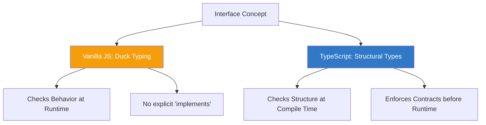

import { Tabs, TabItem, Aside, Badge, Card, CardGrid, Code, LinkCard } from '@astrojs/starlight/components';

## 🔌 Interfaces in JavaScript — The "Duck Typing" Reality

> **JavaScript has no native `interface` keyword.**  
> Instead, it relies on **Duck Typing**: *"If it walks like a duck and quacks like a duck, it's a duck."*  
> If an object has the required methods/properties, it satisfies the "interface," regardless of its class hierarchy.



<Aside type="tip" title="🎯 MUST KNOW">
**JS vs Java Paradigm Shift**:  
✅ **No `implements` keyword** in vanilla JS — compatibility is implicit.  
✅ **Structural Subtyping** (TS) — if shapes match, types match (unlike Java's Nominal Typing).  
✅ **No Multiple Inheritance issues** — JS objects can mix behaviors freely via composition.  
✅ **No Abstract Classes** — use base classes with thrown errors or TS `abstract`.  
✅ **Protocols over Contracts** — focus on *what an object can do*, not *what it is*.  
</Aside>

---

## 🦆 Duck Typing — The Vanilla JS Way

In Java, you must explicitly declare `class Dog implements Animal`. In JS, you just ensure `Dog` has an `eat()` method.

<Code lang="js" title="Implicit Interface Satisfaction" code={`
// No interface definition needed!

// Function expects any object with a 'quack' method
function makeItQuack(duck) {
    if (typeof duck.quack === 'function') {
        duck.quack();
    } else {
        throw new Error("Object cannot quack!");
    }
}

// Object 1: A literal object
const realDuck = {
    quack: () => console.log("Quack!")
};

// Object 2: A class instance (unrelated to realDuck)
class Robot {
    quack() {
        console.log("Mechanical Quack!");
    }
}
const robotDuck = new Robot();

// Both work! ✅
makeItQuack(realDuck);   // "Quack!"
makeItQuack(robotDuck);  // "Mechanical Quack!"
`} />

<Aside type="caution">
**The Risk**: Duck typing is **runtime-only**. If you pass an object missing the method, your code crashes at runtime.  
✅ **Fix**: Use **TypeScript** for compile-time safety, or **JSDoc** for IDE hints.
</Aside>

---

## 💎 TypeScript Interfaces — Structural Subtyping

TypeScript introduces the `interface` keyword, but it works differently than Java. It checks **structure**, not **identity**.

<Code lang="ts" title="TS Interface Definition" code={`
// Define the contract
interface Flyable {
    fly(): void;
    speed: number;
}

// Class explicitly implements (optional but recommended for clarity)
class Bird implements Flyable {
    speed: number = 40;
    
    fly() {
        console.log("Flapping wings...");
    }
}

// Object literal automatically satisfies interface (Structural Typing)
const plane: Flyable = {
    speed: 800,
    fly: () => console.log("Engines roaring...")
}; // ✅ Valid! No 'implements' keyword needed for literals.

// Function using the interface
function takeOff(entity: Flyable) {
    entity.fly();
}

takeOff(new Bird());   // ✅
takeOff(plane);        // ✅
`} />

### 🔑 Key Differences: Java vs TS Interfaces

| Feature | Java Interface | TypeScript Interface |
|---------|---------------|----------------------|
| **Typing System** | Nominal (Name-based) | Structural (Shape-based) |
| **Implementation** | Explicit `implements` | Implicit (if shape matches) |
| **Runtime Existence** | Exists as `.class` file | Erased completely (compile-time only) |
| **Multiple Inheritance** | `implements A, B` | `extends A, B` or Intersection Types (`A & B`) |
| **Default Methods** | `default void m() {}` | ❌ No implementation in interface |

<Aside type="note">
**Structural Typing Power**: In TS, if two interfaces have the same members, they are interchangeable, even if declared separately. This enables powerful composition patterns without tight coupling.
</Aside>

---

## 🛠️ Emulating Interfaces in Vanilla JS

If you aren't using TypeScript, how do you enforce contracts?

### Option 1: JSDoc (IDE Support)

<Code lang="js" title="JSDoc for Type Hints" code={`
/**
 * @typedef {Object} Flyable
 * @property {() => void} fly
 * @property {number} speed
 */

/**
 * @param {Flyable} entity 
 */
function takeOff(entity) {
    entity.fly(); // IDE knows 'fly' exists!
}

// IDE will warn if you pass an object without 'fly'
takeOff({ speed: 10 }); // ⚠️ Warning: Property 'fly' is missing
`} />

### Option 2: Runtime Checks (Defensive Coding)

<Code lang="js" title="Guard Clauses" code={`
function processPayment(processor) {
    // Explicit contract check
    if (!processor || typeof processor.charge !== 'function') {
        throw new TypeError("Invalid PaymentProcessor: missing 'charge' method");
    }
    
    return processor.charge(100);
}
`} />

### Option 3: Symbol-Based Protocols (Advanced)

<Code lang="js" title="Using Symbols for Private/Protocol Keys" code={`
const ITERATOR = Symbol('iterator');

class MyCollection {
    [ITERATOR]() {
        // Implementation of custom protocol
        return { next: () => ({ done: true }) };
    }
}

// Check if object adheres to protocol
if (typeof obj[ITERATOR] === 'function') {
    // Safe to call
}
`} />

---

## 🔄 Composition Over Inheritance

Java often uses interfaces for multiple inheritance of type. JS prefers **Composition** (mixins, object spreading).

### Pattern: Mixins (Behavior Reuse)

<Code lang="js" title="Mixins instead of Multiple Interfaces" code={`
// Behaviors as functions
const Flyable = (base) => class extends base {
    fly() {
        console.log("Flying...");
    }
};

const Swimmable = (base) => class extends base {
    swim() {
        console.log("Swimming...");
    }
};

// Base Class
class Animal {
    constructor(name) {
        this.name = name;
    }
}

// Compose Behaviors
class Duck extends Swimmable(Flyable(Animal)) {
    quack() {
        console.log("Quack!");
    }
}

const donald = new Duck("Donald");
donald.fly();   // ✅ From Flyable mixin
donald.swim();  // ✅ From Swimmable mixin
donald.quack(); // ✅ Own method
`} />

<Aside type="tip">
**Why Mixins?**  
Java: `class Duck implements Flyable, Swimmable`  
JS: `class Duck extends Mixins(Flyable, Swimmable, Animal)`  
Mixins allow you to stack behaviors dynamically without complex interface hierarchies.
</Aside>

---

## 🆚 Abstract Classes vs Interfaces (JS/TS Context)

### TypeScript Abstract Classes

<Code lang="ts" title="TS Abstract Class" code={`
abstract class Shape {
    abstract area(): number; // Must be implemented
    
    // Concrete method allowed
    describe() {
        return \`I am a shape with area \${this.area()}\`;
    }
}

class Circle extends Shape {
    constructor(public radius: number) { super(); }
    
    area() {
        return Math.PI * this.radius ** 2;
    }
}

// const s = new Shape(); // ❌ Error: Cannot create abstract class instance
`} />

### When to Use Which?

<CardGrid>
  <Card title="Use Interface (TS) When…" icon="rocket">
    - Defining a **contract** for unrelated objects.
    - You need **multiple inheritance** of types (`extends A, B`).
    - You want **zero runtime overhead** (erased completely).
    - Example: `Serializable`, `Comparable`, `EventHandler`.
  </Card>
  
  <Card title="Use Abstract Class When…" icon="shield">
    - Sharing **code implementation** among related classes.
    - You need a **constructor** or **state** (fields).
    - You want to enforce a **base hierarchy** (IS-A relationship).
    - Example: `BaseController`, `AbstractComponent`.
  </Card>
</CardGrid>

---

## 🏷️ Marker Interfaces & Type Guards

Java uses marker interfaces (`Serializable`) for tagging. JS/TS uses **Type Guards** or **Discriminated Unions**.

### TypeScript Discriminated Unions

<Code lang="ts" title="Tagged Unions instead of Markers" code={`
interface Circle {
    kind: "circle"; // Discriminant property
    radius: number;
}

interface Square {
    kind: "square";
    side: number;
}

type Shape = Circle | Square;

function getArea(shape: Shape) {
    // TS narrows type based on 'kind'
    if (shape.kind === "circle") {
        return Math.PI * shape.radius ** 2;
    } else {
        return shape.side ** 2;
    }
}
`} />

### JS Runtime Tagging

<Code lang="js" title="Symbol or Property Tags" code={`
const SERIALIZABLE = Symbol('serializable');

class User {
    constructor() {
        this[SERIALIZABLE] = true; // Marker
    }
}

function serialize(obj) {
    if (obj[SERIALIZABLE]) {
        return JSON.stringify(obj);
    }
    throw new Error("Not serializable");
}
`} />

---

## 🎯 Interview Cheat Sheet

<CardGrid>
  <Card title="Q: Does JS have interfaces?" icon="information">
    **Vanilla JS**: No. It uses **Duck Typing** (structural compatibility).  
    **TypeScript**: Yes. But they are **structural**, not nominal. If shapes match, types match.
  </Card>
  
  <Card title="Q: How to achieve multiple inheritance in JS?" icon="rocket">
    Use **Mixins** or **Composition**.  
    ```js
    class C extends MixinA(MixinB(Base)) {}
    ```
    Or compose objects: `Object.assign({}, behaviorA, behaviorB)`.
  </Card>

  <Card title="Q: Interface vs Abstract Class in TS?" icon="shield">
    - **Interface**: Contract only. No code. Multiple extension.  
    - **Abstract Class**: Can have code/constructors. Single inheritance.  
    ✅ Prefer Interfaces for public APIs; Abstract Classes for shared base logic.
  </Card>

  <Card title="Q: What is Structural Subtyping?" icon="approve-check">
    Type compatibility is determined by **members**, not declaration names.  
    ```ts
    interface A { x: number }
    interface B { x: number }
    let a: A = { x: 1 };
    let b: B = a; // ✅ Valid! Shapes are identical.
    ```
  </Card>
</CardGrid>

---

## 🧩 DSA & Practical Patterns

<CardGrid>
  <Card title="Pattern: Strategy Pattern with Duck Typing" icon="rocket">
    ```js
    // No interface needed
    const strategies = {
        quickSort: (arr) => { /* ... */ },
        mergeSort: (arr) => { /* ... */ }
    };

    function sortData(arr, strategyName) {
        const sorter = strategies[strategyName];
        if (typeof sorter !== 'function') throw new Error("Invalid strategy");
        return sorter(arr);
    }
    ```
  </Card>
  
  <Card title="Pattern: Adapter Pattern" icon="shield">
    ```js
    // Adapting incompatible interfaces
    class OldAPI {
        requestData() { /* ... */ }
    }

    class NewAPI {
        fetch() { /* ... */ }
    }

    // Adapter makes NewAPI look like OldAPI
    const adapter = {
        requestData: () => new NewAPI().fetch()
    };
    ```
  </Card>
</CardGrid>

---

## 🔑 Quick Reference Summary

### Comparison Table

| Concept | Java | JavaScript (Vanilla) | TypeScript |
|---------|------|----------------------|------------|
| **Keyword** | `interface` | None | `interface` / `type` |
| **Enforcement** | Compile-time + Runtime | Runtime (Manual) | Compile-time |
| **Inheritance** | `implements` | N/A (Duck Typing) | Structural |
| **Multiple** | Yes | Yes (via Composition) | Yes (`extends A, B`) |
| **State** | Constants only | Any | None (usually) |

### Best Practices

1. ✅ **Vanilla JS**: Document expected shapes with JSDoc. Check types at runtime if critical.
2. ✅ **TypeScript**: Use `interface` for public APIs and object shapes. Use `type` for unions/primitives.
3. ✅ **Composition**: Prefer mixing behaviors over deep inheritance chains.
4. ✅ **Polymorphism**: Rely on method existence, not class identity.

<Aside type="caution">
**Final Checklist**:
1. ✅ Remember: JS interfaces are **conceptual**, not syntactic (unless using TS).
2. ✅ Use **Duck Typing** to decouple components — don't check `instanceof`, check capabilities.
3. ✅ In TS, prefer **Interfaces** for objects/classes and **Types** for unions/primitives.
4. ✅ Use **Mixins** to simulate multiple inheritance of behavior.
5. ✅ Always validate external inputs against expected "interfaces" (shapes) at runtime.
</Aside>

---

## 🧪 Test Your Understanding

<Code lang="ts" title="Predict Compile/Runtime Behavior" code={`
interface Printable {
    print(): void;
}

class Document implements Printable {
    print() { console.log("Doc"); }
}

class Photo {
    print() { console.log("Photo"); }
}

// Q1: Structural Compatibility
let p: Printable = new Photo(); // ?

// Q2: Missing Method
class Bad {
    // no print method
}
// let b: Printable = new Bad(); // ?

// Q3: Extra Properties
let extra: Printable = {
    print: () => {},
    color: "red"
}; // ? (Excess property check rules)
`} />

<details>
<summary>✅ Click to reveal answers</summary>

```text
Q1: ✅ Valid. Photo has 'print()', so it structurally matches Printable.
Q2: ❌ Error. Bad is missing 'print()'.
Q3: ⚠️ Context Dependent. 
    - Direct assignment: ❌ Error (Excess property check).
    - Via variable/casting: ✅ Valid (Structural compatibility allows extra props).
```
</details>

---

## 🔗 Related Topics

<CardGrid columns={2}>
  <LinkCard
    title="TypeScript Interfaces"
    href="/computer-languages/typescript/topics/interfaces"
    description="Deep dive into TS structural typing, extends, and merging"
  />
  <LinkCard
    title="JavaScript Design Patterns"
    href="/computer-languages/javascript/patterns/overview"
    description="Strategy, Adapter, and Factory patterns in JS"
  />
  <LinkCard
    title="Duck Typing & Polymorphism"
    href="/computer-languages/javascript/oop/polymorphism"
    description="How JS achieves polymorphism without interfaces"
  />
  <LinkCard
    title="Mixins & Composition"
    href="/computer-languages/javascript/oop/mixins"
    description="Reusing code without classical inheritance"
  />
</CardGrid>

<Aside type="note">
🎯 **Production Pro Tips**  
1. In large JS apps, use **JSDoc** or migrate to **TypeScript** to enforce interface-like contracts.  
2. Use **Symbol** keys for private protocol methods to avoid name collisions.  
3. Prefer **composition** (mixins) over complex interface hierarchies for code reuse.  
4. When designing libraries, document the **expected shape** of callback arguments clearly. 🛡️
</Aside>

> 💡 **Final Wisdom**: JavaScript replaces rigid interfaces with **flexible behavioral contracts**. Master Duck Typing for runtime flexibility, and use TypeScript interfaces for compile-time safety. This hybrid approach gives you the best of both worlds! 🚀✨

*Converted for Astro 6 + Starlight • Optimized for interview prep + production use • Quality >>>> Quantity* 🎯
```

---

## 🔄 Java Interfaces → JS/TS Interfaces Conversion Summary

| Java Feature | JavaScript/TypeScript Equivalent | Critical Difference |
|-------------|----------------------|-------------------|
| `interface` keyword | TS: `interface` / JS: None | ✅ TS: Structural (shape-based). JS: Conceptual (Duck Typing). |
| `implements` keyword | TS: `implements` (optional) / JS: None | ✅ TS: Checks structure. JS: No check unless manual. |
| Abstract Methods | TS: Abstract methods / JS: Convention | ✅ TS: Enforced at compile time. JS: Runtime error if missing. |
| Default Methods | TS: ❌ (Use mixins/helpers) / JS: Helpers | ⚠️ TS Interfaces cannot have code. Use abstract classes or functions. |
| Static Methods | TS: ❌ (Use namespace/class) / JS: Class static | ⚠️ TS Interfaces define instance shapes only. |
| Multiple Inheritance | TS: `extends A, B` / JS: Mixins | ✅ TS supports multiple interface extension. JS uses composition. |
| Marker Interfaces | TS: Discriminated Unions / JS: Symbols | ✅ TS uses literal types (`kind: 'a'`). JS uses properties/symbols. |
| `instanceof` Check | TS: Type Guards / JS: `typeof`/Property Check | ✅ JS checks capabilities, not class identity. |

---

🧠 **Interview Power Move**: When asked about interfaces, always mention:  
1. **Structural vs Nominal Typing** — TS cares about shape, Java cares about name.  
2. **Duck Typing** — JS polymorphism is based on behavior, not declaration.  
3. **Composition over Inheritance** — JS uses mixins/spreading instead of complex interface trees.  
4. **Runtime vs Compile-time** — JS interfaces are conceptual; TS interfaces are erased.  
5. **Adapter Pattern** — Common in JS to bridge incompatible "interfaces" (shapes).  

---

# 🔌 JavaScript Interfaces

---

## 🔰 What Are Interfaces in JavaScript?

JavaScript has **no native `interface` keyword**. Unlike TypeScript, Java, or C#, JS has no compile-time contract enforcement. Instead, interfaces are **patterns and conventions** that enforce a contract at **runtime**.

```js
// Java/TypeScript: compile-time contract
interface Serializable {
  serialize(): string;
  deserialize(data: string): this;
}

// JavaScript: runtime-enforced contract
class JSONSerializer {
  serialize()          { throw new Error("Not implemented"); }
  deserialize(data)    { throw new Error("Not implemented"); }
}
// or via duck typing, Symbols, Proxy, mixins...
```

---

## 🗺️ Complete Map

```
JavaScript Interfaces
│
├── 🦆 Duck Typing
│   └── if it has the methods → it qualifies
│
├── 📋 Protocol / Abstract Class Pattern
│   ├── throw in base method
│   └── new.target guard
│
├── 🔣 Well-Known Symbol Protocols (Built-in Interfaces)
│   ├── Symbol.iterator        → Iterable
│   ├── Symbol.asyncIterator   → AsyncIterable
│   ├── Symbol.toPrimitive     → Coercible
│   ├── Symbol.hasInstance     → instanceof hook
│   ├── Symbol.toStringTag     → Object.prototype.toString
│   └── Symbol.dispose         → using / Disposable (ES2025)
│
├── 🏗️  Mixin Pattern
│   ├── functional mixins
│   └── class mixins (higher-order classes)
│
├── 🛡️  Runtime Interface Validation
│   ├── manual duck-type check
│   ├── Proxy-enforced interface
│   └── Symbol.hasInstance trick
│
├── 🪄  Structural Typing via Proxy
│   └── enforce method presence at call time
│
└── 📦 Interface Patterns in Practice
    ├── Repository interface
    ├── Plugin interface
    ├── Strategy interface
    └── Observer interface
```

---

## ⚙️ Deep Dive — Why JS Has No Interfaces

```
┌──────────────────────────────────────────────────────────┐
│         WHY JAVASCRIPT HAS NO INTERFACE KEYWORD          │
│                                                          │
│  JS is a DYNAMICALLY TYPED language                      │
│  Type checks happen at RUNTIME — not compile time        │
│                                                          │
│  Interfaces are a STATIC TYPE SYSTEM feature:            │
│  → compiler verifies contract before execution           │
│  → zero runtime cost                                     │
│                                                          │
│  JS approach: DUCK TYPING                                │
│  "If it walks like a duck and quacks like a duck,        │
│   it's a duck"                                           │
│                                                          │
│  Instead of asking: "Is this object of type Serializer?" │
│  JS asks: "Does this object have a .serialize() method?" │
│                                                          │
│  Built-in JS interfaces use SYMBOL PROTOCOLS:            │
│  [Symbol.iterator]  → makes anything iterable           │
│  [Symbol.toPrimitive] → defines coercion behavior       │
│  These are JS's NATIVE interface mechanism               │
└──────────────────────────────────────────────────────────┘
```

---

## 1️⃣ Duck Typing — JS's Natural Interface

### The Concept

```js
// No interface declaration needed:
// If the object has the required methods → it "implements" the interface

function serialize(serializer) {
  // Duck-type check:
  if (typeof serializer.serialize !== "function") {
    throw new TypeError("serializer must have a serialize() method");
  }
  return serializer.serialize();
}

// Any object with .serialize() works:
const jsonSerializer = {
  serialize() { return JSON.stringify(this.data); }
};

class XMLSerializer {
  serialize() { return `<data>${this.value}</data>`; }
}

class CustomSerializer {
  serialize() { return Buffer.from(JSON.stringify(this)).toString("base64"); }
}

// All pass duck-type check — no inheritance needed:
serialize(jsonSerializer);
serialize(new XMLSerializer());
serialize(new CustomSerializer());
```

### Formal Duck-Type Checker

```js
// Interface definition — just a shape description:
const SerializerInterface = {
  required: ["serialize", "deserialize"],
  optional: ["validate", "transform"]
};

// Runtime check:
function implementsInterface(obj, iface) {
  const missing = iface.required.filter(
    method => typeof obj[method] !== "function"
  );

  if (missing.length > 0) {
    throw new TypeError(
      `Object missing required methods: ${missing.join(", ")}`
    );
  }

  return true;
}

// Usage:
function createPipeline(serializer) {
  implementsInterface(serializer, SerializerInterface);
  return {
    process: (data) => serializer.serialize(data)
  };
}
```

---

## 2️⃣ Abstract Class Pattern — Enforced Base

```js
// Simulates an interface via abstract class:
class Serializer {
  constructor() {
    // Prevent direct instantiation:
    if (new.target === Serializer) {
      throw new TypeError("Serializer is an interface — do not instantiate directly");
    }

    // Enforce method implementation:
    const required = ["serialize", "deserialize"];
    for (const method of required) {
      if (typeof this[method] !== "function" ||
          this[method] === Serializer.prototype[method]) {
        throw new TypeError(
          `${new.target.name} must implement ${method}()`
        );
      }
    }
  }

  // "Abstract" methods — throw if not overridden:
  serialize(data) {
    throw new Error(`${this.constructor.name}.serialize() not implemented`);
  }

  deserialize(raw) {
    throw new Error(`${this.constructor.name}.deserialize() not implemented`);
  }

  // Concrete method — shared by all implementors:
  pipeline(data) {
    const raw = this.serialize(data);
    return this.deserialize(raw);
  }
}

// Correct implementation:
class JSONSerializer extends Serializer {
  serialize(data)    { return JSON.stringify(data); }
  deserialize(raw)   { return JSON.parse(raw); }
}

// Missing method — caught at construction:
class BrokenSerializer extends Serializer {
  serialize(data) { return String(data); }
  // deserialize missing — no override
}

new JSONSerializer();    // ✅
new BrokenSerializer();  // ❌ TypeError: BrokenSerializer must implement deserialize()
new Serializer();        // ❌ TypeError: Serializer is an interface
```

---

## 3️⃣ Well-Known Symbol Protocols — Built-in JS Interfaces

These are JS's **native interface system**. Any object implementing the correct Symbol method "implements" that interface.

### `Symbol.iterator` — Iterable Interface

```
┌──────────────────────────────────────────────────────────┐
│              Iterable Interface                          │
│                                                          │
│  Required method: [Symbol.iterator]()                    │
│  Returns: Iterator object { next() }                     │
│  next() returns: { value: any, done: boolean }           │
│                                                          │
│  Consumers: for...of, spread [...], destructuring,       │
│             Array.from(), Promise.all(), yield*           │
└──────────────────────────────────────────────────────────┘
```

```js
// Implement Iterable interface:
class InfiniteCounter {
  #start;
  #max;

  constructor(start = 0, max = Infinity) {
    this.#start = start;
    this.#max   = max;
  }

  // Implement [Symbol.iterator] → object is Iterable:
  [Symbol.iterator]() {
    let current = this.#start;
    const max   = this.#max;

    return {
      // Iterator object:
      next() {
        if (current > max) return { value: undefined, done: true };
        return { value: current++, done: false };
      },
      // Optional — called on early break/return:
      return() {
        console.log("Iterator cleaned up");
        return { value: undefined, done: true };
      }
    };
  }
}

const counter = new InfiniteCounter(1, 5);

// All iterable consumers work:
[...counter]                       // [1, 2, 3, 4, 5]
for (const n of counter) { }       // 1, 2, 3, 4, 5
const [a, b, c] = counter;         // a=1, b=2, c=3
Array.from(counter);               // [1, 2, 3, 4, 5]

// Self-referential iterator (object is its own iterator):
class Counter {
  #value = 0;

  [Symbol.iterator]() { return this; } // self

  next() {
    return this.#value < 3
      ? { value: this.#value++, done: false }
      : { value: undefined,    done: true };
  }
}
```

### `Symbol.asyncIterator` — AsyncIterable Interface

```js
// Implement AsyncIterable interface:
class EventQueue {
  #queue   = [];
  #waiters = [];
  #closed  = false;

  push(event) {
    if (this.#waiters.length > 0) {
      this.#waiters.shift()(event); // wake up waiting consumer
    } else {
      this.#queue.push(event);
    }
  }

  close() {
    this.#closed = true;
    this.#waiters.forEach(w => w(null)); // signal end
  }

  // Implement AsyncIterable interface:
  [Symbol.asyncIterator]() {
    return {
      next: () => new Promise(resolve => {
        if (this.#queue.length > 0) {
          resolve({ value: this.#queue.shift(), done: false });
        } else if (this.#closed) {
          resolve({ value: undefined, done: true });
        } else {
          this.#waiters.push(value => {
            resolve(
              value === null
                ? { value: undefined, done: true }
                : { value, done: false }
            );
          });
        }
      })
    };
  }
}

const queue = new EventQueue();
setTimeout(() => { queue.push("event1"); queue.push("event2"); queue.close(); }, 100);

// for await...of uses [Symbol.asyncIterator]:
for await (const event of queue) {
  console.log(event); // "event1", "event2"
}
```

### `Symbol.toPrimitive` — Coercible Interface

```js
// Control how object converts to primitive:
class Money {
  #amount;
  #currency;

  constructor(amount, currency = "INR") {
    this.#amount   = amount;
    this.#currency = currency;
  }

  // Implement Coercible interface:
  [Symbol.toPrimitive](hint) {
    switch (hint) {
      case "number":  return this.#amount;
      case "string":  return `${this.#currency} ${this.#amount.toFixed(2)}`;
      case "default": return this.#amount; // used by + and ==
    }
  }

  // For JSON serialization:
  toJSON() {
    return { amount: this.#amount, currency: this.#currency };
  }
}

const price = new Money(99.99, "USD");

+price;              // 99.99    — number hint
`Price: ${price}`;   // "Price: USD 99.99" — string hint
price + 10;          // 109.99   — default hint → number
price > 50;          // true     — comparison → number
price == 99.99;      // true     — default hint
```

### `Symbol.hasInstance` — instanceof Interface

```js
// Control instanceof behavior:
class NumericArray {
  // Implement instanceof interface:
  static [Symbol.hasInstance](instance) {
    return Array.isArray(instance) &&
           instance.every(item => typeof item === "number");
  }
}

[1, 2, 3]     instanceof NumericArray; // true  ✅
[1, "2", 3]   instanceof NumericArray; // false ✅
[]            instanceof NumericArray; // true  (vacuously)
{}            instanceof NumericArray; // false ✅

// Interface via instanceof:
class Disposable {
  static [Symbol.hasInstance](obj) {
    return obj !== null &&
           typeof obj === "object" &&
           typeof obj[Symbol.dispose] === "function";
  }
}

const resource = {
  [Symbol.dispose]() { console.log("disposed"); }
};
resource instanceof Disposable; // true ✅ — duck-typed interface check
```

### `Symbol.toStringTag` — Identity Interface

```js
// Control Object.prototype.toString output:
class Queue {
  #items = [];

  get [Symbol.toStringTag]() { return "Queue"; }

  enqueue(item) { this.#items.push(item); }
  dequeue()     { return this.#items.shift(); }
}

class Stack {
  #items = [];
  get [Symbol.toStringTag]() { return "Stack"; }
}

const q = new Queue();
const s = new Stack();

Object.prototype.toString.call(q); // "[object Queue]"
Object.prototype.toString.call(s); // "[object Stack]"
String(q);                          // "[object Queue]"

// Useful for cross-realm type identification:
function isQueue(obj) {
  return Object.prototype.toString.call(obj) === "[object Queue]";
}
isQueue(q); // true ✅ — works across iframes/vm unlike instanceof
```

### `Symbol.dispose` — Disposable Interface (ES2025)

```js
// Explicit Resource Management — TC39 Stage 4:
class DatabaseConnection {
  #conn;
  #closed = false;

  constructor(connString) {
    this.#conn = openConnection(connString); // hypothetical
  }

  query(sql) {
    if (this.#closed) throw new Error("Connection closed");
    return this.#conn.execute(sql);
  }

  // Implement Disposable interface:
  [Symbol.dispose]() {
    if (!this.#closed) {
      this.#conn.close();
      this.#closed = true;
      console.log("Connection disposed");
    }
  }
}

// 'using' keyword — auto-calls [Symbol.dispose] on scope exit:
{
  using conn = new DatabaseConnection("postgres://localhost/mydb");
  const users = conn.query("SELECT * FROM users");
  // conn[Symbol.dispose]() called automatically at block end ✅
}
// conn disposed here — even if exception thrown

// Async version:
class AsyncResource {
  async [Symbol.asyncDispose]() {
    await this.#cleanup();
  }
}

await using resource = new AsyncResource();
```

---

## 4️⃣ Mixin Pattern — Compose Multiple Interfaces

```
┌──────────────────────────────────────────────────────────┐
│              MIXIN — MULTIPLE INTERFACE IMPL             │
│                                                          │
│  Problem: JS has single inheritance                      │
│  class A extends B extends C → only one parent          │
│                                                          │
│  Mixin: copy methods from multiple sources               │
│  into one class — simulates multiple interface impl      │
│                                                          │
│  Functional Mixin: (superclass) => class extends super   │
│  Applied: class Foo extends Mixin1(Mixin2(Base)) {}      │
└──────────────────────────────────────────────────────────┘
```

### Functional Mixin Pattern

```js
// Define interface mixins as functions:

// Serializable interface:
const Serializable = (Base) => class extends Base {
  serialize() {
    return JSON.stringify(this.toJSON());
  }

  static deserialize(json) {
    return Object.assign(new this(), JSON.parse(json));
  }

  toJSON() {
    // Default — all enumerable own props:
    return Object.fromEntries(
      Object.entries(this).filter(([k]) => !k.startsWith("_"))
    );
  }
};

// Validatable interface:
const Validatable = (Base) => class extends Base {
  validate() {
    const errors = this.rules?.().reduce((acc, rule) => {
      if (!rule.test(this)) acc.push(rule.message);
      return acc;
    }, []) ?? [];

    if (errors.length > 0) {
      throw new ValidationError(errors);
    }
    return true;
  }
};

// Timestamped interface:
const Timestamped = (Base) => class extends Base {
  createdAt = new Date().toISOString();
  updatedAt = new Date().toISOString();

  touch() {
    this.updatedAt = new Date().toISOString();
    return this;
  }
};

// Loggable interface:
const Loggable = (Base) => class extends Base {
  #logger;

  setLogger(logger) {
    this.#logger = logger;
    return this;
  }

  log(level, message) {
    this.#logger?.[level]?.(
      `[${this.constructor.name}] ${message}`
    );
  }
};

// Compose multiple interfaces:
class Model {}

class User extends Serializable(Validatable(Timestamped(Loggable(Model)))) {
  constructor(name, email) {
    super();
    this.name  = name;
    this.email = email;
  }

  rules() {
    return [
      { test: u => u.name?.length >= 2,    message: "Name too short" },
      { test: u => u.email?.includes("@"), message: "Invalid email"  }
    ];
  }
}

const user = new User("Ali", "ali@example.com");
user.validate();            // ✅
user.serialize();           // '{"name":"Ali","email":"ali@..."}'
user.touch();               // updates updatedAt
user instanceof User;       // true
// Inherits from ALL mixed-in interfaces ✅
```

### Object Mixin — Flat Composition

```js
// Define interface as plain object:
const Comparable = {
  equals(other)       { return this.compareTo(other) === 0; },
  lessThan(other)     { return this.compareTo(other) < 0; },
  greaterThan(other)  { return this.compareTo(other) > 0; },
  between(min, max)   { return !this.lessThan(min) && !this.greaterThan(max); },
};

const Formattable = {
  format(template)    { return template.replace(/\{(\w+)\}/g, (_, k) => this[k] ?? ""); },
  formatCurrency()    { return new Intl.NumberFormat("en-US", { style: "currency", currency: "USD" }).format(this.amount); },
};

// Mix into a class:
class Product {
  constructor(name, price) {
    this.name  = name;
    this.price = price;
  }

  compareTo(other) { return this.price - other.price; }
}

// Apply mixins:
Object.assign(Product.prototype, Comparable, Formattable);

const a = new Product("Apple", 1.50);
const b = new Product("Banana", 0.99);

a.lessThan(b);              // false — 1.50 > 0.99
b.lessThan(a);              // true
a.between(b, new Product("Cherry", 2.00)); // true
a.format("Product: {name} costs {price}"); // "Product: Apple costs 1.5"
```

---

## 5️⃣ Proxy-Enforced Interface — Strict Runtime Contract

```js
// Enforce interface at RUNTIME via Proxy:

function createInterface(name, requiredMethods) {
  return {
    // Check if object implements interface:
    check(obj) {
      const missing = requiredMethods.filter(
        m => typeof obj[m] !== "function"
      );
      if (missing.length > 0) {
        throw new TypeError(
          `${obj.constructor?.name ?? "Object"} does not implement ` +
          `${name}: missing [${missing.join(", ")}]`
        );
      }
      return true;
    },

    // Wrap object in proxy that enforces interface:
    wrap(obj) {
      this.check(obj);

      return new Proxy(obj, {
        get(target, prop, receiver) {
          const value = Reflect.get(target, prop, receiver);

          // Method call — wrap to ensure return type:
          if (typeof value === "function") {
            return function(...args) {
              return value.apply(target, args);
            };
          }

          return value;
        },

        // Prevent adding non-interface methods:
        set(target, prop, value) {
          console.warn(`Setting ${prop} on ${name} implementation`);
          return Reflect.set(target, prop, value);
        }
      });
    },

    // Decorator — apply at class definition:
    implement(target) {
      const original = target.prototype.constructor;
      target.prototype.constructor = function(...args) {
        original.apply(this, args);
        // Check interface after construction:
        requiredMethods.forEach(method => {
          if (typeof this[method] !== "function") {
            throw new TypeError(
              `${target.name} must implement ${method}()`
            );
          }
        });
      };
      return target;
    }
  };
}

// Define interfaces:
const Repository = createInterface("Repository", [
  "findById",
  "findAll",
  "save",
  "delete"
]);

const EventEmitter = createInterface("EventEmitter", [
  "on",
  "off",
  "emit"
]);

// Implementation:
class UserRepository {
  #store = new Map();

  async findById(id)   { return this.#store.get(id) ?? null; }
  async findAll()      { return [...this.#store.values()]; }
  async save(user)     { this.#store.set(user.id, user); return user; }
  async delete(id)     { return this.#store.delete(id); }
}

// Wrap with interface enforcement:
const userRepo = Repository.wrap(new UserRepository());

// Missing method:
class BadRepo {
  async findById(id) { return null; }
  // findAll, save, delete missing
}

Repository.wrap(new BadRepo()); // ❌ TypeError: BadRepo does not implement Repository: missing [findAll, save, delete]
```

---

## 6️⃣ Interface via `Symbol.hasInstance`

```js
// Define interface as class with custom instanceof:
class Iterable {
  static [Symbol.hasInstance](obj) {
    return obj !== null &&
           typeof obj === "object" &&
           typeof obj[Symbol.iterator] === "function";
  }
}

class AsyncIterable {
  static [Symbol.hasInstance](obj) {
    return obj !== null &&
           typeof obj === "object" &&
           typeof obj[Symbol.asyncIterator] === "function";
  }
}

class Serializable {
  static [Symbol.hasInstance](obj) {
    return obj !== null &&
           typeof obj === "object" &&
           typeof obj.serialize === "function" &&
           typeof obj.deserialize === "function";
  }
}

class Comparable {
  static [Symbol.hasInstance](obj) {
    return typeof obj?.compareTo === "function";
  }
}

// Check without inheritance:
[] instanceof Iterable;          // true  ✅
new Map() instanceof Iterable;   // true  ✅
{} instanceof Iterable;          // false ✅

// Custom class:
class MyList {
  [Symbol.iterator]() { return [][Symbol.iterator](); }
  serialize()   { return "[]"; }
  deserialize() { return new MyList(); }
}

const list = new MyList();
list instanceof Iterable;    // true  ✅
list instanceof Serializable; // true  ✅
list instanceof Comparable;  // false ✅ — no compareTo

// Interface composition check:
function process(obj) {
  if (!(obj instanceof Iterable))    throw new TypeError("Must be Iterable");
  if (!(obj instanceof Serializable)) throw new TypeError("Must be Serializable");
  // obj guaranteed to have [Symbol.iterator], serialize, deserialize
}
```

---

## 7️⃣ Real Interface Patterns in Production

### Pattern 1 — Plugin Interface

```js
// Plugin interface definition:
const PluginInterface = {
  name:    "required",
  version: "required",
  init:    "function",
  destroy: "function",
};

class PluginRegistry {
  #plugins  = new Map();
  #active   = new Set();

  // Validate plugin implements interface:
  static #validate(plugin) {
    const errors = [];

    if (!plugin?.name)    errors.push("Plugin must have 'name'");
    if (!plugin?.version) errors.push("Plugin must have 'version'");
    if (typeof plugin?.init    !== "function") errors.push("Plugin must implement init()");
    if (typeof plugin?.destroy !== "function") errors.push("Plugin must implement destroy()");

    if (errors.length > 0) {
      throw new TypeError(`Invalid plugin:\n  ${errors.join("\n  ")}`);
    }
  }

  register(plugin) {
    PluginRegistry.#validate(plugin);

    if (this.#plugins.has(plugin.name)) {
      throw new Error(`Plugin "${plugin.name}" already registered`);
    }

    this.#plugins.set(plugin.name, plugin);
    return this;
  }

  async activate(name, context) {
    const plugin = this.#plugins.get(name);
    if (!plugin) throw new Error(`Plugin "${name}" not found`);

    await plugin.init(context);
    this.#active.add(name);

    console.log(`Plugin "${name}" v${plugin.version} activated`);
    return this;
  }

  async deactivate(name) {
    const plugin = this.#plugins.get(name);
    if (this.#active.has(name)) {
      await plugin.destroy();
      this.#active.delete(name);
    }
  }

  async destroyAll() {
    for (const name of [...this.#active].reverse()) {
      await this.deactivate(name);
    }
  }
}

// Plugin implementations:
const LoggingPlugin = {
  name:    "logging",
  version: "1.0.0",
  #logger: null,

  async init(ctx) {
    this.#logger = ctx.createLogger("logging-plugin");
    this.#logger.info("Logging plugin started");
  },

  async destroy() {
    this.#logger?.info("Logging plugin stopped");
  }
};

const CachePlugin = {
  name:    "cache",
  version: "2.1.0",
  #store:  null,

  async init(ctx) {
    this.#store = await ctx.connectRedis(ctx.config.redisUrl);
  },

  async destroy() {
    await this.#store?.disconnect();
  }
};

// Usage:
const registry = new PluginRegistry();
registry
  .register(LoggingPlugin)
  .register(CachePlugin);

await registry.activate("logging", appContext);
await registry.activate("cache",   appContext);
```

### Pattern 2 — Strategy Interface

```js
// Strategy interface:
class SortStrategy {
  constructor() {
    if (new.target === SortStrategy) throw new TypeError("Abstract");
    if (typeof this.sort !== "function") {
      throw new TypeError(`${new.target.name} must implement sort(arr)`);
    }
  }

  // Concrete utility available to all strategies:
  isSorted(arr) {
    return arr.every((v, i) => i === 0 || arr[i-1] <= v);
  }
}

class QuickSort extends SortStrategy {
  sort(arr) {
    if (arr.length <= 1) return arr;
    const pivot  = arr[Math.floor(arr.length / 2)];
    const left   = arr.filter(x => x < pivot);
    const middle = arr.filter(x => x === pivot);
    const right  = arr.filter(x => x > pivot);
    return [...this.sort(left), ...middle, ...this.sort(right)];
  }
}

class MergeSort extends SortStrategy {
  sort(arr) {
    if (arr.length <= 1) return arr;
    const mid   = Math.floor(arr.length / 2);
    const left  = this.sort(arr.slice(0, mid));
    const right = this.sort(arr.slice(mid));
    return this.#merge(left, right);
  }

  #merge(left, right) {
    const result = [];
    let l = 0, r = 0;
    while (l < left.length && r < right.length) {
      result.push(left[l] <= right[r] ? left[l++] : right[r++]);
    }
    return [...result, ...left.slice(l), ...right.slice(r)];
  }
}

// Context uses strategy interface:
class Sorter {
  #strategy;

  constructor(strategy) {
    if (!(strategy instanceof SortStrategy)) {
      throw new TypeError("strategy must implement SortStrategy interface");
    }
    this.#strategy = strategy;
  }

  set strategy(s) {
    if (!(s instanceof SortStrategy)) throw new TypeError("Invalid strategy");
    this.#strategy = s;
  }

  sort(arr) { return this.#strategy.sort([...arr]); }
}

const sorter = new Sorter(new QuickSort());
sorter.sort([3, 1, 4, 1, 5, 9]);  // [1, 1, 3, 4, 5, 9]

sorter.strategy = new MergeSort(); // swap strategy at runtime
sorter.sort([3, 1, 4, 1, 5, 9]);  // [1, 1, 3, 4, 5, 9]
```

### Pattern 3 — Repository Interface

```js
// Repository interface — data access abstraction:
class Repository {
  constructor() {
    if (new.target === Repository) {
      throw new TypeError("Repository is abstract");
    }

    // Enforce interface at construction:
    const required = ["findById", "findAll", "save", "update", "delete"];
    for (const method of required) {
      if (typeof this[method] !== "function" ||
          this[method] === Repository.prototype[method]) {
        throw new TypeError(`${new.target.name}.${method}() not implemented`);
      }
    }
  }

  findById(id)        { throw new Error("Not implemented"); }
  findAll(filter)     { throw new Error("Not implemented"); }
  save(entity)        { throw new Error("Not implemented"); }
  update(id, changes) { throw new Error("Not implemented"); }
  delete(id)          { throw new Error("Not implemented"); }

  // Concrete methods using abstract interface:
  async findOrCreate(id, factory) {
    const existing = await this.findById(id);
    return existing ?? this.save(await factory());
  }

  async updateOrCreate(id, data, factory) {
    const existing = await this.findById(id);
    return existing
      ? this.update(id, data)
      : this.save(await factory(data));
  }
}

// In-memory implementation (testing):
class InMemoryUserRepository extends Repository {
  #store = new Map();
  #nextId = 1;

  async findById(id)        { return this.#store.get(id) ?? null; }
  async findAll(filter = {}) {
    const users = [...this.#store.values()];
    return Object.entries(filter).reduce(
      (acc, [k, v]) => acc.filter(u => u[k] === v),
      users
    );
  }
  async save(user) {
    const id = user.id ?? this.#nextId++;
    const entity = { ...user, id };
    this.#store.set(id, entity);
    return entity;
  }
  async update(id, changes) {
    const user = await this.findById(id);
    if (!user) throw new Error(`User ${id} not found`);
    const updated = { ...user, ...changes, id };
    this.#store.set(id, updated);
    return updated;
  }
  async delete(id) { return this.#store.delete(id); }
}

// PostgreSQL implementation (production):
class PostgresUserRepository extends Repository {
  #pool;

  constructor(pool) { super(); this.#pool = pool; }

  async findById(id) {
    const { rows } = await this.#pool.query(
      "SELECT * FROM users WHERE id = $1", [id]
    );
    return rows[0] ?? null;
  }
  async findAll(filter = {}) {
    const conditions = Object.entries(filter)
      .map(([k, v], i) => `${k} = $${i + 1}`).join(" AND ");
    const sql = `SELECT * FROM users${conditions ? ` WHERE ${conditions}` : ""}`;
    const { rows } = await this.#pool.query(sql, Object.values(filter));
    return rows;
  }
  async save(user) {
    const { rows } = await this.#pool.query(
      "INSERT INTO users (name, email) VALUES ($1, $2) RETURNING *",
      [user.name, user.email]
    );
    return rows[0];
  }
  async update(id, changes) {
    const sets   = Object.keys(changes).map((k, i) => `${k}=$${i+2}`).join(",");
    const { rows } = await this.#pool.query(
      `UPDATE users SET ${sets} WHERE id=$1 RETURNING *`,
      [id, ...Object.values(changes)]
    );
    return rows[0];
  }
  async delete(id) {
    const { rowCount } = await this.#pool.query(
      "DELETE FROM users WHERE id=$1", [id]
    );
    return rowCount > 0;
  }
}

// Service works with ANY Repository implementation:
class UserService {
  #repo;

  constructor(repo) {
    if (!(repo instanceof Repository)) {
      throw new TypeError("repo must implement Repository interface");
    }
    this.#repo = repo;
  }

  async getUser(id)         { return this.#repo.findById(id); }
  async createUser(data)    { return this.#repo.save(data); }
  async getActiveUsers()    { return this.#repo.findAll({ active: true }); }
}

// Swap implementations — service doesn't care:
const testRepo = new InMemoryUserRepository();
const prodRepo = new PostgresUserRepository(pgPool);

const testService = new UserService(testRepo); // for tests
const prodService = new UserService(prodRepo); // for production
```

---

## 💀 Interview Traps

### Trap 1: Abstract method check at construction — fields not yet set

```js
class Interface {
  constructor() {
    if (new.target === Interface) throw new TypeError("Abstract");

    // Checking method at construction — works for methods:
    if (typeof this.process !== "function") {
      throw new TypeError(`${new.target.name} must implement process()`);
    }
  }

  process() { throw new Error("Not implemented"); }
}

class Impl extends Interface {
  process() { return "done"; }  // method on prototype — available at construction ✅
}

// BUT — field functions not available during super():
class BrokenImpl extends Interface {
  // process is a field — assigned AFTER super() returns:
  process = () => "done"; // ← not on prototype → not found during super() 😱
}

new Impl();       // ✅
new BrokenImpl(); // ❌ TypeError: BrokenImpl must implement process()
// Fix — use prototype methods, not field functions, for interface compliance
```

---

### Trap 2: Mixin applied in wrong order — method resolution

```js
const A = Base => class extends Base {
  greet() { return `A: ${super.greet?.() ?? "base"}`; }
};

const B = Base => class extends Base {
  greet() { return `B: ${super.greet?.() ?? "base"}`; }
};

class Core {
  greet() { return "core"; }
}

// Order matters — MRO (Method Resolution Order):
class X extends A(B(Core)) {}
class Y extends B(A(Core)) {}

new X().greet(); // "A: B: core" — A called first → delegates to B
new Y().greet(); // "B: A: core" — B called first → delegates to A

// Real prod trap — applying mixins in wrong order:
// Logging should wrap everything → apply FIRST (outermost):
class Service extends Loggable(Cacheable(Validatable(Base))) {}
// Loggable wraps all → logs calls including cache/validation ✅
// vs:
class Service extends Validatable(Cacheable(Loggable(Base))) {}
// Logging only wraps base — cache misses not logged 😱
```

---

### Trap 3: `Object.assign` mixin overwrites existing methods silently

```js
const EventEmitter = {
  on(event, fn)  { /* ... */ },
  emit(event)    { /* ... */ },
  off(event, fn) { /* ... */ }
};

class MyClass {
  on(type) { return this; } // MY version of 'on' — different purpose
}

// Mixin silently overwrites:
Object.assign(MyClass.prototype, EventEmitter);

// MyClass.prototype.on now = EventEmitter.on 😱 — original lost
// No warning, no error

// Fix — check before mixing:
function safeMixin(target, mixin) {
  const conflicts = Object.keys(mixin)
    .filter(k => k in target.prototype);

  if (conflicts.length > 0) {
    throw new Error(`Mixin conflicts: ${conflicts.join(", ")}`);
  }
  Object.assign(target.prototype, mixin);
}
```

---

### Trap 4: `Symbol.iterator` returning `this` — exhausted on second use

```js
class Counter {
  #n = 0;

  // Returns SELF as iterator — stateful:
  [Symbol.iterator]() { return this; }

  next() {
    return this.#n < 3
      ? { value: this.#n++, done: false }
      : { value: undefined, done: true };
  }
}

const c = new Counter();

[...c];  // [0, 1, 2] ✅
[...c];  // [] 😱 — EXHAUSTED — #n = 3, done immediately

// Fix — return a NEW iterator object each time:
class Counter {
  #max;
  constructor(max) { this.#max = max; }

  [Symbol.iterator]() {
    let n = 0;           // fresh state per iteration
    const max = this.#max;
    return {
      next() {
        return n < max
          ? { value: n++, done: false }
          : { value: undefined, done: true };
      }
    };
  }
}

const c = new Counter(3);
[...c]; // [0, 1, 2] ✅
[...c]; // [0, 1, 2] ✅ — fresh every time
```

---

### Trap 5: Duck-type check with `in` vs `typeof` — catches non-functions

```js
// WRONG — 'in' doesn't check if it's callable:
function implementsSerializable(obj) {
  return "serialize" in obj && "deserialize" in obj;
}

const broken = {
  serialize:   "not a function",  // string — not callable
  deserialize: null,               // null — not callable
};

implementsSerializable(broken); // true 😱 — passes check

// RIGHT — check typeof:
function implementsSerializable(obj) {
  return typeof obj?.serialize   === "function" &&
         typeof obj?.deserialize === "function";
}

implementsSerializable(broken); // false ✅

// Also handle: property exists but is undefined
const partial = { serialize: undefined };
"serialize" in partial;              // true 😱
typeof partial.serialize === "function"; // false ✅
```

---

## 📊 Interface Patterns Comparison

```
┌──────────────────────────────────────────────────────────┐
│           INTERFACE PATTERN COMPARISON                   │
├───────────────────┬──────────────────────────────────────┤
│ Pattern           │ When to Use                          │
├───────────────────┼──────────────────────────────────────┤
│ Duck typing       │ Simple, trusts caller, minimal code  │
│ Abstract class    │ Shared implementation + contract     │
│ Symbol protocol   │ Engine-level, for...of, coercion     │
│ Mixin             │ Multiple interface composition       │
│ Proxy enforcement │ Strict, catches at runtime           │
│ Symbol.hasInstance│ isinstance-like duck checks          │
│ Interface function│ Reusable validator + wrapper         │
└───────────────────┴──────────────────────────────────────┘
```

---

## 📊 DSA / Internals Connection

> JavaScript's Symbol protocols are a **structural type system** baked into the engine. The engine doesn't check class hierarchy for `for...of` — it checks for `[Symbol.iterator]` property. This is **structural subtyping** (objects are compatible if they have the right shape) vs **nominal subtyping** (objects are compatible only if they explicitly declare conformance, like `implements` in Java).
>
> The Iterator protocol (`{ next() → { value, done } }`) is the canonical **Iterator design pattern** from GoF — a cursor that traverses a collection without exposing internal representation. V8's `for...of` desugars to repeated `.next()` calls on the iterator — the engine doesn't know or care what the iterator is iterating over. This is **closed-open principle** in action — closed for modification, open for new iterable types.

---
