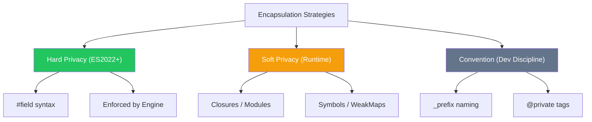

import { Tabs, TabItem, Aside, Badge, Card, CardGrid, Code, LinkCard } from '@astrojs/starlight/components';

## 🔐 Data Hiding & Encapsulation — Complete Guide

> **Encapsulation** in JavaScript bundles data and behavior while restricting access to internal state. Unlike Java's rigid `private`/`public` keywords, JS offers multiple layers of privacy: **Hard Privacy** (`#fields`), **Soft Privacy** (closures/symbols), and **Convention** (`_prefix`).



<Aside type="tip" title="🎯 MUST KNOW">
**JS vs Java Privacy**:  
✅ **True Private (`#`)**: Hard enforcement, not accessible even via reflection.  
✅ **Closures**: The original JS way to hide data (Module Pattern).  
✅ **No `protected`**: Use `_prefix` or WeakMaps for subclass-friendly privacy.  
✅ **Getters/Setters**: Built-in syntax for controlled access and validation.  
✅ **Immutability**: Achieved via `Object.freeze()` or conventions, not `final`.  
</Aside>

---

## 🛡️ Levels of Data Hiding in JS

### 1. Hard Privacy: Private Fields (`#`) <Badge text="ES2022+" variant="success" />

The `#` prefix creates fields that are **strictly scoped** to the class body. They cannot be accessed from outside, not even by subclasses or via `Object.keys()`.

<Code lang="js" title="Private Fields and Methods" code={`
class BankAccount {
    #balance = 0;          // Private field
    #pin = "1234";         // Private field
    
    constructor(initialBalance) {
        this.#balance = initialBalance;
    }
    
    // Private method
    #validatePin(pin) {
        return pin === this.#pin;
    }
    
    // Public API
    deposit(amount, pin) {
        if (!this.#validatePin(pin)) throw new Error("Invalid PIN");
        if (amount <= 0) throw new Error("Invalid amount");
        
        this.#balance += amount;
        return this.#balance;
    }
    
    getBalance(pin) {
        if (!this.#validatePin(pin)) return null;
        return this.#balance;
    }
}

const acc = new BankAccount(100);
console.log(acc.deposit(50, "1234")); // ✅ 150

// ❌ Hard Error: SyntaxError
// console.log(acc.#balance); 
// acc.#balance = 1000000; 
`} />

<Aside type="caution">
**Key Difference from Java**:  
In Java, `private` can be bypassed via Reflection. In JS, `#` fields are **impossible** to access from outside the class scope. They are not properties of the object in the traditional sense.
</Aside>

### 2. Soft Privacy: Closures & Modules

Before `#` fields, **Closures** were the only way to achieve true privacy. Variables defined inside a constructor or module scope are inaccessible from the outside.

<Code lang="js" title="Closure-based Privacy (Module Pattern)" code={`
function createCounter() {
    let count = 0; // 🔒 Private variable (hidden in closure)
    
    return {
        increment() {
            count++;
        },
        getCount() {
            return count;
        }
    };
}

const counter = createCounter();
counter.increment();
console.log(counter.getCount()); // ✅ 1

// ❌ Impossible to access 'count' directly
// console.log(counter.count); // undefined
`} />

### 3. Convention: The Underscore Prefix (`_`)

Using `_` is a **signal** to other developers that a property is internal. It is **not enforced** by the engine.

<Code lang="js" title="Convention-based Privacy" code={`
class User {
    _passwordHash = null; // ⚠️ "Private" by convention
    
    setPassword(password) {
        this._passwordHash = hash(password);
    }
}

const user = new User();
user.setPassword("secret");

// ⚠️ Technically accessible, but violates convention
console.log(user._passwordHash); 
`} />

<Aside type="note">
**When to use `_`**:  
- For protected-like members (accessible to subclasses).  
- When you need to debug internal state easily.  
- In libraries where `#` might cause transpilation issues (rare now).
</Aside>

---

## 🔑 Getters & Setters — Controlled Access

JS uses `get` and `set` keywords to define accessor descriptors. This allows you to run logic (validation, computation) when accessing or modifying properties.

<Code lang="js" title="Encapsulated Field with Validation" code={`
class Product {
    #price = 0;
    #name = "";
    
    constructor(name, price) {
        this.name = name; // Uses setter
        this.price = price; // Uses setter
    }
    
    get name() {
        return this.#name;
    }
    
    set name(value) {
        if (!value || value.trim() === "") {
            throw new Error("Name cannot be empty");
        }
        this.#name = value.trim();
    }
    
    get price() {
        return this.#price;
    }
    
    set price(value) {
        if (value < 0) {
            throw new Error("Price cannot be negative");
        }
        this.#price = value;
    }
}

const p = new Product("Laptop", 999);
console.log(p.price); // ✅ 999
// p.price = -10;     // 💥 Error: Price cannot be negative
`} />

### ⚠️ Common Pitfalls

<CardGrid>
  <Card title="Pitfall 1: Exposing Mutable Objects" icon="error">
```js
    class Team {
        #members = [];
        
        // ❌ Dangerous: Returns reference to internal array
        get members() {
            return this.#members; 
        }
    }
    
    const team = new Team();
    team.members.push("Hacker"); // 😱 Modifies internal state directly!
    
    // ✅ Fix: Return a copy or read-only view
    get members() {
        return [...this.#members]; // Spread operator creates shallow copy
        // Or: return Object.freeze([...this.#members]);
    }
```
  </Card>
  
  <Card title="Pitfall 2: Infinite Recursion in Setters" icon="error">
```js
    class Circle {
        radius = 0;
        
        // ❌ Infinite Loop!
        set radius(value) {
            this.radius = value; // Calls setter again → Stack Overflow
        }
        
        // ✅ Fix: Use a different internal name or private field
        #radius = 0;
        set radius(value) {
            this.#radius = value;
        }
        get radius() {
            return this.#radius;
        }
    }
```
  </Card>
</CardGrid>

---

## 🧊 Immutability — The Ultimate Encapsulation

In Java, you use `final`. In JS, you use `Object.freeze()` or conventions.

<Code lang="js" title="Immutable Configuration Object" code={`
class Config {
    constructor(apiUrl, timeout) {
        this.#apiUrl = apiUrl;
        this.#timeout = timeout;
        
        // Freeze the instance to prevent adding/removing properties
        Object.freeze(this);
    }
    
    #apiUrl;
    #timeout;
    
    get apiUrl() { return this.#apiUrl; }
    get timeout() { return this.#timeout; }
}

const config = new Config("https://api.example.com", 5000);
// config.apiUrl = "http://evil.com"; // ❌ Ignored (or TypeError in strict mode)
// config.newProp = 123;             // ❌ Ignored
`} />

<Aside type="tip">
**Note on `Object.freeze()`**: It is **shallow**. If your object contains other objects or arrays, you must deep freeze them recursively. For most cases, using `#` private fields without setters is sufficient for logical immutability.
</Aside>

---

## 🆚 Java vs JS Encapsulation Comparison

<table>
  <thead>
    <tr>
      <th>Feature</th>
      <th>Java</th>
      <th>JavaScript</th>
    </tr>
  </thead>
  <tbody>
    <tr><td><code>private</code></td><td>Keyword</td><td><code>#field</code> (Hard) or Closure (Soft)</td></tr>
    <tr><td><code>protected</code></td><td>Keyword</td><td>Convention (<code>_field</code>) or WeakMap</td></tr>
    <tr><td><code>public</code></td><td>Keyword</td><td>Default (no keyword)</td></tr>
    <tr><td>Getters/Setters</td><td><code>getX()</code>, <code>setX()</code></td><td><code>get x()</code>, <code>set x(val)</code></td></tr>
    <tr><td>Immutability</td><td><code>final</code> keyword</td><td><code>Object.freeze()</code> or convention</td></tr>
    <tr><td>Reflection Access</td><td>Can bypass <code>private</code></td><td>Cannot bypass <code>#</code> fields</td></tr>
  </tbody>
</table>

---

## 🎯 Interview Cheat Sheet

<CardGrid>
  <Card title="Q: How do you make a field private in JS?" icon="approve-check">
    **Use `#` prefix** (ES2022+).  
    ```js
    class X { #secret = 1; }
    ```
    ✅ Enforced by engine.  
    ⚠️ Older alternatives: Closures, WeakMaps, or TypeScript `private` (compile-time only).
  </Card>
  
  <Card title="Q: What is the difference between `#field` and `_field`?" icon="information">
    - **`#field`**: Hard privacy. Syntax error if accessed outside class. Not visible in `Object.keys()`.  
    - **`_field`**: Convention. Still public. Visible in `Object.keys()`. Relies on developer discipline.
  </Card>

  <Card title="Q: How do you validate data in JS classes?" icon="rocket">
    Use **Setters**.  
    ```js
    set age(val) {
        if (val < 0) throw new Error("Invalid");
        this.#age = val;
    }
    ```
  </Card>

  <Card title="Q: Can subclasses access `#` private fields?" icon="error">
    **NO ❌**.  
    `#` fields are strictly scoped to the declaring class. Subclasses cannot see them. Use `_prefix` if you need subclass access.
  </Card>
</CardGrid>

---

## 🧩 DSA & Practical Patterns

<CardGrid>
  <Card title="Pattern: Encapsulated Graph Node" icon="shield">
```js
    class GraphNode {
        #value;
        #neighbors = new Set(); // Use Set to avoid duplicates
        
        constructor(value) {
            this.#value = value;
        }
        
        addNeighbor(node) {
            if (node && node !== this) {
                this.#neighbors.add(node);
                node.#neighbors.add(this); // Undirected graph
            }
        }
        
        // Return copy to prevent external mutation
        get neighbors() {
            return [...this.#neighbors];
        }
        
        get value() {
            return this.#value;
        }
    }
```
  </Card>
  
  <Card title="Pattern: Immutable Interval" icon="rocket">
```js
    class Interval {
        #start;
        #end;
        
        constructor(start, end) {
            if (start > end) throw new Error("Invalid interval");
            this.#start = start;
            this.#end = end;
            Object.freeze(this);
        }
        
        overlaps(other) {
            return this.#start <= other.#end && other.#start <= this.#end;
        }
        
        get start() { return this.#start; }
        get end() { return this.#end; }
    }
```
  </Card>
</CardGrid>

---

## 🔑 Quick Reference Summary

### Access Control Mechanisms

| Mechanism | Syntax | Enforcement | Subclass Access? |
|-----------|--------|-------------|------------------|
| Private Field | `#field` | ✅ Runtime (Engine) | ❌ No |
| Closure | `let val` inside func | ✅ Runtime (Scope) | N/A |
| Convention | `_field` | ❌ None | ✅ Yes |
| WeakMap | `wm.get(this)` | ✅ Runtime (Ref) | ✅ If Map shared |

### Best Practices

1. ✅ Use **`#`** for true internal state that should never leak.
2. ✅ Use **`_`** for "protected" members or when debugging access is needed.
3. ✅ Use **Getters/Setters** for validation and computed properties.
4. ✅ Return **copies** (`[...arr]`, `{...obj}`) from getters if returning mutable data.
5. ✅ Prefer **Composition** over deep inheritance for sharing behavior.

<Aside type="caution">
**Final Checklist**:
1. ✅ Start with **`#` private fields** for maximum safety.
2. ✅ Validate inputs in **constructors** and **setters**.
3. ✅ Avoid exposing **mutable references** (arrays/objects) directly.
4. ✅ Use **`Object.freeze()`** for configuration objects.
5. ✅ Remember: JS is dynamic — encapsulation is about **design intent**, not just syntax.
</Aside>

---

## 🧪 Test Your Understanding

<Code lang="js" title="Predict the output/error" code={`class Test {
    #private = 1;
    _protected = 2;
    
    get private() {
        return this.#private;
    }
}

const t = new Test();
console.log(t.private);   // ?
console.log(t._protected); // ?
// console.log(t.#private); // ?
`} />

<details>
<summary>✅ Click to reveal answers</summary>

```text
console.log(t.private);   // 1 (Accesses via getter)
console.log(t._protected); // 2 (Public by convention)
// console.log(t.#private); // 💥 SyntaxError: Private field '#private' must be declared in an enclosing class
```
</details>

---

## 🔗 Related Topics

<CardGrid columns={2}>
  <LinkCard
    title="JavaScript Classes"
    href="/computer-languages/javascript/topics/classes"
    description="Syntax, inheritance, super, constructors"
  />
  <LinkCard
    title="JavaScript Closures"
    href="/computer-languages/javascript/topics/closures"
    description="Scope chain, module pattern, data privacy"
  />
  <LinkCard
    title="TypeScript Access Modifiers"
    href="/computer-languages/typescript/topics/modifiers"
    description="public, private, protected, readonly (compile-time)"
  />
  <LinkCard
    title="JavaScript Immutability"
    href="/computer-languages/javascript/guides/immutability"
    description="Object.freeze, const, immutable patterns"
  />
</CardGrid>

<Aside type="note">
🎯 **Production Pro Tips**  
1. Prefer `#` private fields for critical internal state.  
2. Use `_` prefix for methods/fields intended for subclass override.  
3. Always validate data in setters to maintain object invariants.  
4. Use `Object.freeze()` on exported constants to prevent accidental mutation.  
5. In TypeScript, use `private`/`protected` for IDE support, but remember they compile to public JS. 🛡️
</Aside>

> 💡 **Final Wisdom**: JavaScript encapsulation has evolved from **conventions** to **hard enforcement** with `#` fields. Use the right tool for the job: `#` for security, `_` for flexibility, and closures for functional privacy. Mastering these ensures robust, maintainable code! 🚀✨

*Converted for Astro 6 + Starlight • Optimized for interview prep + production use • Quality >>>> Quantity* 🎯
```

---

## 🔄 Java Data Hiding → JS Data Hiding Conversion Summary

| Java Feature | JavaScript Equivalent | Critical Difference |
|-------------|----------------------|-------------------|
| `private` | `#field` (ES2022+) | ✅ JS: Hard privacy, not accessible via reflection. |
| `protected` | `_field` (convention) | ⚠️ JS: No native `protected`. Use `_` or WeakMaps. |
| `public` | Default (no keyword) | ✅ JS: Everything is public unless marked otherwise. |
| `final` | `Object.freeze()` / `const` | ⚠️ JS: `const` is for bindings. `freeze` is shallow. |
| Getters/Setters | `get prop()` / `set prop(v)` | ✅ JS: Syntactic sugar for property access. |
| Package-Private | Module Scope (ESM) | ✅ JS: ESM exports control visibility explicitly. |
| Reflection Bypass | Impossible for `#` | ✅ JS: `#` fields are truly hidden from outside. |

---

🧠 **Interview Power Move**: When asked about encapsulation, always mention:  
1. **`#` private fields** are truly private (runtime enforced).  
2. **Closures** were the original way to hide data in JS.  
3. **Getters/Setters** allow validation and computed properties.  
4. **Immutability** is achieved via `Object.freeze()` or conventions.  
5. **Returning copies** of mutable data prevents external state corruption.  

---

# 🔒 JavaScript Data Hiding

---

## 🔰 What Is Data Hiding?

Data hiding = **restricting direct access to internal state** of an object — exposing only what's necessary through a controlled public interface. It's the core of **encapsulation**.

```js
// NO data hiding — everything exposed:
const user = { name: "Ali", password: "secret123", balance: 1000 };
user.password;          // "secret123" 😱 — directly readable
user.balance = -99999;  // 😱 — directly writable, no validation

// WITH data hiding — controlled access:
class BankAccount {
  #balance = 1000;                     // truly hidden
  get balance() { return this.#balance; } // controlled read
  deposit(n) {                          // controlled write
    if (n > 0) this.#balance += n;
  }
}
```

---

## 🗺️ Complete Map

```
Data Hiding in JavaScript
│
├── 🔴 True Privacy (Engine-enforced)
│   ├── # private fields (ES2022)
│   ├── # private methods
│   └── # private static
│
├── 🟡 Closure-based Privacy (Pre-ES2022)
│   ├── factory functions
│   ├── IIFE modules
│   └── WeakMap pattern
│
├── 🔵 Convention-based (Not enforced)
│   ├── _ prefix (sloppy)
│   └── Object.defineProperty (non-enumerable)
│
├── 🟢 Accessor Control
│   ├── get/set with validation
│   ├── read-only via getter only
│   └── write-once pattern
│
├── 🟣 Object-level Freezing
│   ├── Object.freeze()
│   ├── Object.seal()
│   └── Object.preventExtensions()
│
├── 🔶 Module-level Privacy
│   ├── ESM file scope
│   ├── CJS file scope
│   └── Symbol keys (semi-private)
│
└── ⚙️  Internals
    ├── V8 private slot storage
    ├── WeakMap memory model
    └── property descriptor system
```

---

## ⚙️ Deep Dive — V8 Property Visibility System

```
┌──────────────────────────────────────────────────────────┐
│         HOW V8 STORES DIFFERENT PROPERTY TYPES           │
│                                                          │
│  Public property:                                        │
│  → Stored in JSObject's properties array                 │
│  → Indexed by hidden class (shape)                       │
│  → Visible to: all operators, Proxy, reflection          │
│                                                          │
│  Non-enumerable property:                                │
│  → Same storage as public                               │
│  → Hidden from: for...in, Object.keys()                  │
│  → Visible to: direct access, Object.getOwnPropNames()  │
│                                                          │
│  Symbol key property:                                    │
│  → Stored separately from string keys                    │
│  → Hidden from: for...in, Object.keys(), JSON.stringify  │
│  → Visible to: Object[sym], Reflect.ownKeys()            │
│                                                          │
│  Private field (#):                                      │
│  → NOT in JSObject property map                          │
│  → Stored in class PrivateSlotMap (brand-keyed)          │
│  → Hidden from: EVERYTHING outside class body            │
│  → SyntaxError at PARSE TIME if accessed outside class  │
│                                                          │
│  WeakMap-based:                                          │
│  → Stored in separate WeakMap                           │
│  → Zero presence on object — not detectable             │
│  → Collected when object is GC'd (no memory leak)       │
└──────────────────────────────────────────────────────────┘
```

---

## 1️⃣ `#` Private Fields — True Engine-Level Privacy

### The Strongest Form of Data Hiding in JS

```js
class SecureConfig {
  // Private — truly hidden at engine level:
  #apiKey;
  #secretToken;
  #connectionString;

  // Private static — hidden on the class itself:
  static #instances = 0;

  constructor(apiKey, token, connStr) {
    this.#apiKey            = apiKey;
    this.#secretToken       = token;
    this.#connectionString  = connStr;
    SecureConfig.#instances++;
  }

  // Controlled read — never expose raw secrets:
  get apiKeyHint() {
    return `${this.#apiKey.slice(0, 4)}${"*".repeat(12)}`;
  }

  // Controlled access — validate caller context:
  getConnectionString(callerToken) {
    if (callerToken !== this.#secretToken) {
      throw new SecurityError("Invalid caller token");
    }
    return this.#connectionString;
  }

  static getInstanceCount() {
    return SecureConfig.#instances;
  }
}

const cfg = new SecureConfig("sk-abc123xyz", "caller-token-9x", "postgres://...");

// All access attempts fail outside class:
cfg.#apiKey;                          // ❌ SyntaxError — parse time
cfg["#apiKey"];                       // undefined — different key
Object.keys(cfg);                     // [] — private not enumerable
Object.getOwnPropertyNames(cfg);      // [] — private not visible
JSON.stringify(cfg);                  // "{}" — private not serialized
new Proxy(cfg, { get(t,k){ return t[k]; } })["#apiKey"]; // undefined

// Legitimate access:
cfg.apiKeyHint;                       // "sk-a************"
cfg.getConnectionString("caller-token-9x"); // "postgres://..."
cfg.getConnectionString("wrong");     // ❌ SecurityError
SecureConfig.getInstanceCount();      // 1
```

### Private Field Brand Check — Safe Cross-Instance Access

```js
class LinkedList {
  #head = null;
  #size = 0;

  append(value) {
    const node = { value, next: null };
    if (!this.#head) {
      this.#head = node;
    } else {
      let curr = this.#head;
      while (curr.next) curr = curr.next;
      curr.next = node;
    }
    this.#size++;
    return this;
  }

  // Access private field of ANOTHER instance of same class:
  concat(other) {
    // Brand check — verify other is a LinkedList with #head:
    if (!(#head in other)) {
      throw new TypeError("Expected a LinkedList instance");
    }

    const result = new LinkedList();
    let curr = this.#head;
    while (curr) { result.append(curr.value); curr = curr.next; }

    // Access other's private directly — allowed in same class:
    curr = other.#head;                // ✅ same class — accessible
    while (curr) { result.append(curr.value); curr = curr.next; }

    return result;
  }

  get size() { return this.#size; }

  [Symbol.iterator]() {
    let curr = this.#head;
    return {
      next() {
        if (!curr) return { done: true, value: undefined };
        const value = curr.value;
        curr = curr.next;
        return { done: false, value };
      }
    };
  }
}

const l1 = new LinkedList().append(1).append(2);
const l2 = new LinkedList().append(3).append(4);
const l3 = l1.concat(l2);
[...l3]; // [1, 2, 3, 4]
```

---

## 2️⃣ Closure-based Privacy — Pre-ES2022 Pattern

### Factory Function Pattern

```js
// Closure captures private variables — truly inaccessible from outside:
function createBankAccount(owner, initialBalance) {
  // Private state — in closure, not on any object:
  let balance       = initialBalance;
  let transactions  = [];
  const id          = crypto.randomUUID();

  // Private function — closure-scoped:
  function logTransaction(type, amount) {
    transactions.push({
      type,
      amount,
      balance,
      timestamp: Date.now()
    });
  }

  function validateAmount(amount) {
    if (typeof amount !== "number" || !Number.isFinite(amount)) {
      throw new TypeError("Amount must be a finite number");
    }
    if (amount <= 0) throw new RangeError("Amount must be positive");
  }

  // Public interface — returned object:
  return {
    get owner()   { return owner; },
    get balance() { return balance; },
    get id()      { return id; },

    deposit(amount) {
      validateAmount(amount);
      balance += amount;
      logTransaction("deposit", amount);
      return this;
    },

    withdraw(amount) {
      validateAmount(amount);
      if (amount > balance) throw new Error("Insufficient funds");
      balance -= amount;
      logTransaction("withdrawal", amount);
      return this;
    },

    getStatement() {
      // Return COPY — prevent external mutation of internal array:
      return transactions.map(t => ({ ...t }));
    }
  };
}

const acc = createBankAccount("Ali", 1000);
acc.balance;         // 1000 ✅
acc.deposit(500);
acc.balance;         // 1500 ✅
acc.transactions;    // undefined 😱 — no access to closure var
acc.balance = 9999;  // silently fails — no setter
acc.balance;         // 1500 ✅ — unchanged
```

### Closure Memory Model

```
┌──────────────────────────────────────────────────────────┐
│           CLOSURE MEMORY MODEL                           │
│                                                          │
│  createBankAccount("Ali", 1000)                          │
│                                                          │
│  Closure Environment (heap):                             │
│  ┌────────────────────────────────────┐                  │
│  │  balance:      1000                │                  │
│  │  transactions: []                  │                  │
│  │  id:           "uuid-xxx"          │                  │
│  │  validateAmount: [Function]        │                  │
│  │  logTransaction: [Function]        │                  │
│  └─────────────────┬──────────────────┘                  │
│                    │ captured by                         │
│  Returned object:  ▼                                     │
│  ┌────────────────────────────────────┐                  │
│  │  deposit:    [Function → closure]  │                  │
│  │  withdraw:   [Function → closure]  │                  │
│  │  getStatement:[Function → closure] │                  │
│  └────────────────────────────────────┘                  │
│                                                          │
│  balance, transactions, id → ONLY reachable              │
│  through returned function closures                      │
│  Not on the object — not discoverable externally         │
└──────────────────────────────────────────────────────────┘
```

### Closure vs `#` Private — Comparison

```
┌──────────────────────────────────────────────────────────┐
│         CLOSURE vs # PRIVATE                             │
├─────────────────────┬────────────────────────────────────┤
│ Closure             │ # Private                          │
├─────────────────────┼────────────────────────────────────┤
│ Pre-ES2022 works     │ Requires ES2022+                   │
│ Works without class  │ Requires class                     │
│ Per instance copy   │ Per instance slot                  │
│ typeof access guard │ SyntaxError at parse time          │
│ Cross-instance: ❌  │ Cross-instance: ✅ (same class)    │
│ instanceof: ❌       │ instanceof: ✅                     │
│ WeakMap not needed  │ Built into engine                  │
│ Slight memory cost  │ Optimized by engine                │
└─────────────────────┴────────────────────────────────────┘
```

---

## 3️⃣ WeakMap Pattern — Classic Pre-ES2022 Private

```js
// WeakMap stores private data — keyed by instance:
const _private = new WeakMap();

class Person {
  constructor(name, ssn) {
    // Store private data in WeakMap:
    _private.set(this, {
      name,
      ssn,              // sensitive — truly hidden
      loginCount: 0
    });
  }

  get name() {
    return _private.get(this).name;
  }

  login(password) {
    const priv = _private.get(this);
    if (!this.#validatePassword(password)) {
      priv.loginCount++;
      if (priv.loginCount >= 3) throw new Error("Account locked");
      return false;
    }
    priv.loginCount = 0;
    return true;
  }

  // Private helper via naming convention + WeakMap:
  #validatePassword(password) {
    return password === _private.get(this).ssn.slice(-4);
  }
}

const p = new Person("Ali", "123-45-6789");
p.name;       // "Ali" ✅
p.ssn;        // undefined — not on object
_private;     // WeakMap — entries not enumerable/inspectable
_private.get(p); // {name, ssn, loginCount} — but _private itself
                  // only accessible from this module scope ✅
```

### WeakMap Memory Behavior

```
┌──────────────────────────────────────────────────────────┐
│              WEAKMAP MEMORY MODEL                        │
│                                                          │
│  WeakMap<instance → privateData>                         │
│                                                          │
│  When instance is GC'd:                                  │
│  → WeakMap entry automatically removed                   │
│  → privateData becomes unreachable                       │
│  → GC collects it                                        │
│                                                          │
│  vs regular Map:                                         │
│  Map keeps strong reference to key                       │
│  → instance can NEVER be GC'd                           │
│  → MEMORY LEAK if instances discarded 😱                 │
│                                                          │
│  WeakMap = zero memory leak risk                         │
│  Keys must be objects (GC-trackable)                     │
└──────────────────────────────────────────────────────────┘
```

---

## 4️⃣ Convention-based Hiding — `_` Prefix

```js
// NOT true privacy — just convention:
class OldStyleClass {
  constructor() {
    this._secret = "hidden by convention";  // still public
    this.public  = "clearly public";
  }

  _helperMethod() {
    return this._secret;
  }
}

const obj = new OldStyleClass();
obj._secret;          // "hidden by convention" 😱 — accessible
obj._helperMethod();  // works — not truly private

// Convention only — zero enforcement
// Signals "don't use this" but anyone can

// Modern code: use # instead of _ for actual privacy
// _ today = "internal implementation detail" signal only
```

---

## 5️⃣ Property Descriptor System — Fine-grained Control

### `Object.defineProperty` — Control Visibility

```js
class Config {
  constructor(options) {
    // Writable + enumerable (default public):
    this.host = options.host;

    // NON-ENUMERABLE — hidden from for...in, Object.keys:
    Object.defineProperty(this, "_internal", {
      value:        options._internal,
      writable:     true,
      enumerable:   false,    // ← hidden from enumeration
      configurable: false
    });

    // READ-ONLY + NON-ENUMERABLE:
    Object.defineProperty(this, "id", {
      value:        crypto.randomUUID(),
      writable:     false,    // ← cannot be changed
      enumerable:   true,
      configurable: false     // ← cannot be deleted/redefined
    });

    // COMPUTED — getter via defineProperty:
    Object.defineProperty(this, "summary", {
      get: () => `${this.host}:${options.port}`,
      enumerable:   true,
      configurable: false
    });
  }
}

const cfg = new Config({ host: "localhost", port: 3000, _internal: "secret" });

Object.keys(cfg);      // ["host", "id", "summary"] — _internal excluded ✅
cfg._internal;         // "secret" — accessible via direct access 😱
cfg.id = "hacked";     // silently fails (sloppy) / TypeError (strict)
cfg.id;                // original UUID ✅

// Enumerate hidden:
Object.getOwnPropertyNames(cfg); // ["host", "_internal", "id", "summary"]
// defineProperty hides from enumeration — NOT from direct access
```

### Property Descriptor Deep Dive

```
┌──────────────────────────────────────────────────────────┐
│         PROPERTY DESCRIPTOR FLAGS                        │
│                                                          │
│  writable:     can value be changed via assignment?      │
│  enumerable:   shows in for...in / Object.keys()?        │
│  configurable: can descriptor itself be changed/deleted? │
│                                                          │
│  Default for object literal:                             │
│  { writable: true, enumerable: true, configurable: true }│
│                                                          │
│  Default for defineProperty:                             │
│  { writable: false, enumerable: false, configurable: false}
│  (all false unless specified)                            │
│                                                          │
│  Once configurable: false → cannot change to true EVER   │
│  Once writable: false → cannot change even with define   │
│                         (if also configurable: false)    │
└──────────────────────────────────────────────────────────┘
```

```js
// Useful combinations:
const obj = {};

// Read-only constant:
Object.defineProperty(obj, "MAX", {
  value: 100,
  writable: false, enumerable: true, configurable: false
});

// Hidden implementation detail:
Object.defineProperty(obj, "_cache", {
  value: new Map(),
  writable: true, enumerable: false, configurable: false
});

// Computed read-only:
Object.defineProperty(obj, "timestamp", {
  get: () => Date.now(),
  enumerable: true, configurable: false
});

// Lock ALL properties at once:
function deepFreeze(obj) {
  Object.getOwnPropertyNames(obj).forEach(name => {
    const val = obj[name];
    if (typeof val === "object" && val !== null) {
      deepFreeze(val); // recurse
    }
  });
  return Object.freeze(obj);
}
```

---

## 6️⃣ `Object.freeze` / `Object.seal` / `preventExtensions`

```
┌──────────────────────────────────────────────────────────┐
│         OBJECT RESTRICTION LEVELS                        │
│                                                          │
│  preventExtensions(obj):                                 │
│  → Cannot ADD new properties                             │
│  → CAN modify existing                                   │
│  → CAN delete existing                                   │
│                                                          │
│  seal(obj):                                              │
│  → Cannot ADD new properties                             │
│  → CAN modify existing values                            │
│  → Cannot DELETE existing                                │
│  → configurable: false on all props                      │
│                                                          │
│  freeze(obj):                                            │
│  → Cannot ADD new properties                             │
│  → Cannot MODIFY existing values                         │
│  → Cannot DELETE existing                                │
│  → writable: false + configurable: false on all props   │
│  → SHALLOW — nested objects not frozen                   │
└──────────────────────────────────────────────────────────┘
```

```js
// preventExtensions:
const obj = { x: 1 };
Object.preventExtensions(obj);
obj.y = 2;          // silently fails (sloppy) / TypeError (strict)
obj.x = 99;         // ✅ can modify
delete obj.x;       // ✅ can delete
Object.isExtensible(obj); // false

// seal:
const config = { host: "localhost", port: 3000 };
Object.seal(config);
config.debug = true; // ❌ cannot add
config.host = "prod.server.com"; // ✅ can modify
delete config.port;  // ❌ cannot delete
Object.isSealed(config); // true

// freeze:
const CONSTANTS = Object.freeze({
  PI:      3.14159,
  E:       2.71828,
  VERSION: "1.0.0"
});
CONSTANTS.PI      = 999;    // silently fails (sloppy) / TypeError (strict)
CONSTANTS.NEW_KEY = "val";  // silently fails
CONSTANTS.PI;               // 3.14159 ✅

// Deep freeze — freeze nested objects too:
function deepFreeze(obj) {
  if (obj === null || typeof obj !== "object") return obj;
  Object.getOwnPropertyNames(obj).forEach(key => {
    deepFreeze(obj[key]);
  });
  return Object.freeze(obj);
}

const config = deepFreeze({
  db:     { host: "localhost", port: 5432 },
  server: { port: 8080 }
});

config.db.host = "hacked"; // ❌ TypeError (strict) — deeply frozen ✅
```

### Freeze Behavior on Classes

```js
class ImmutablePoint {
  constructor(x, y) {
    this.x = x;
    this.y = y;
    Object.freeze(this); // freeze instance at construction
  }

  // Methods still work — on prototype, not frozen:
  distanceTo(other) {
    return Math.sqrt((this.x - other.x)**2 + (this.y - other.y)**2);
  }

  // Return new instance for "mutations":
  translate(dx, dy) {
    return new ImmutablePoint(this.x + dx, this.y + dy);
  }
}

const p = new ImmutablePoint(3, 4);
p.x = 99;               // ❌ TypeError (strict) — frozen
p.z = 0;                // ❌ TypeError — frozen
const p2 = p.translate(1, 1); // new ImmutablePoint(4, 5) ✅
```

---

## 7️⃣ Symbol Keys — Semi-Private Properties

```js
// Symbol keys hidden from common enumeration:
const _balance  = Symbol("balance");
const _validate = Symbol("validate");

class Wallet {
  constructor(amount) {
    this[_balance]  = amount;  // Symbol key — semi-private
  }

  [_validate](amount) {        // Symbol method — semi-private
    if (amount <= 0) throw new RangeError("Positive amount required");
    if (amount > this[_balance]) throw new Error("Insufficient funds");
  }

  spend(amount) {
    this[_validate](amount);
    this[_balance] -= amount;
    return this;
  }

  get balance() { return this[_balance]; }
}

const w = new Wallet(100);
w.balance;              // 100 ✅

// Symbol keys hidden from:
Object.keys(w);         // [] — not enumerable by Object.keys
for (const k in w) { } // nothing — not in for...in
JSON.stringify(w);      // "{}" — symbols not serialized

// Symbol keys VISIBLE to:
Object.getOwnPropertySymbols(w);  // [Symbol(balance)] 😱
Reflect.ownKeys(w);               // [Symbol(balance)] 😱
w[_balance];                      // 100 — if you have the symbol ref 😱

// TRUE private (#) vs Symbol key:
// Symbol: discourageable but not impossible to access
// #: impossible — SyntaxError at parse time
```

---

## 8️⃣ Module-Level Privacy — ESM / CJS Scope

```js
// In a module — file-scoped = private to module:

// user-service.mjs

// Module-private variables — not exported:
const #DB_URL = process.env.DATABASE_URL;         // private to module
const _cache  = new Map();                        // private to module
let   _connectionPool = null;                     // private to module

// Module-private functions:
function _hashPassword(password) {
  return crypto.createHash("sha256").update(password).digest("hex");
}

async function _ensureConnection() {
  _connectionPool ??= await createPool(_DB_URL);
  return _connectionPool;
}

// Exported — public API:
export async function createUser(name, email, password) {
  const pool = await _ensureConnection(); // uses private fn
  const hash = _hashPassword(password);   // uses private fn

  const user = await pool.query(
    "INSERT INTO users (name, email, hash) VALUES ($1,$2,$3) RETURNING id,name,email",
    [name, email, hash]
  );

  _cache.set(user.id, user); // uses private state
  return user;
}

export async function getUser(id) {
  if (_cache.has(id)) return _cache.get(id); // private cache
  const pool = await _ensureConnection();
  const user = await pool.query("SELECT id,name,email FROM users WHERE id=$1", [id]);
  _cache.set(id, user);
  return user;
}

// _DB_URL, _cache, _connectionPool, _hashPassword, _ensureConnection
// → completely inaccessible to importers of this module
```

```
┌──────────────────────────────────────────────────────────┐
│           MODULE PRIVACY LEVELS                          │
│                                                          │
│  ESM (import/export):                                    │
│  → File scope = private                                  │
│  → export = public                                       │
│  → No export = completely inaccessible                   │
│                                                          │
│  CJS (require/module.exports):                           │
│  → File scope = private                                  │
│  → module.exports = public                               │
│  → Not on module.exports = inaccessible                  │
│                                                          │
│  Strongest privacy model in JS:                          │
│  Module scope + # private fields                         │
│  = two layers of protection                              │
└──────────────────────────────────────────────────────────┘
```

---

## 9️⃣ Getter/Setter — Controlled Access Layer

```js
// Getters and setters as the access control layer:
class UserProfile {
  #firstName;
  #lastName;
  #email;
  #age;
  #role;
  #readonly = false;

  constructor(data) {
    this.#firstName = data.firstName;
    this.#lastName  = data.lastName;
    this.#email     = data.email;
    this.#age       = data.age;
    this.#role      = data.role ?? "user";
  }

  // Read-only computed:
  get fullName() {
    return `${this.#firstName} ${this.#lastName}`;
  }

  // Validated write:
  get email() { return this.#email; }
  set email(value) {
    if (typeof value !== "string" || !value.includes("@")) {
      throw new TypeError("Invalid email address");
    }
    this.#email = value.trim().toLowerCase();
  }

  // Range-validated:
  get age() { return this.#age; }
  set age(value) {
    if (!Number.isInteger(value) || value < 0 || value > 150) {
      throw new RangeError(`Invalid age: ${value}`);
    }
    this.#age = value;
  }

  // Enum-validated:
  get role() { return this.#role; }
  set role(value) {
    const ROLES = ["user", "admin", "moderator"];
    if (!ROLES.includes(value)) {
      throw new Error(`Invalid role. Must be: ${ROLES.join(", ")}`);
    }
    this.#role = value;
  }

  // Write-once — can set null→value but not change after:
  get id() { return this.#readonly ? this._id : undefined; }

  // Lock entire object after first save:
  freeze() {
    this.#readonly = true;
    Object.freeze(this); // prevent new properties
    return this;
  }

  toJSON() {
    return {
      fullName: this.fullName,
      email:    this.#email,
      age:      this.#age,
      role:     this.#role
    };
  }
}

const user = new UserProfile({
  firstName: "Ali",
  lastName:  "Hassan",
  email:     "ALI@EXAMPLE.COM",
  age:       25
});

user.email;          // "ali@example.com" — normalized ✅
user.email = "bad";  // ❌ TypeError: Invalid email address
user.age = 200;      // ❌ RangeError: Invalid age: 200
user.role = "god";   // ❌ Error: Invalid role
user.#firstName;     // ❌ SyntaxError — truly private
```

---

## 🏭 Real Production Patterns

### Pattern 1 — Secure Token Manager

```js
class TokenManager {
  // All private — zero exposure of sensitive data:
  #tokens   = new Map();
  #secret;
  #algorithm;
  static #instance = null;

  static getInstance(secret) {
    TokenManager.#instance ??= new TokenManager(secret);
    return TokenManager.#instance;
  }

  constructor(secret) {
    if (TokenManager.#instance) {
      throw new Error("Use TokenManager.getInstance()");
    }
    this.#secret    = secret;
    this.#algorithm = "HS256";
  }

  // Private crypto operations:
  #sign(payload) {
    const header  = Buffer.from(JSON.stringify({ alg: this.#algorithm })).toString("base64url");
    const body    = Buffer.from(JSON.stringify(payload)).toString("base64url");
    const sig     = crypto
      .createHmac("sha256", this.#secret)
      .update(`${header}.${body}`)
      .digest("base64url");
    return `${header}.${body}.${sig}`;
  }

  #verify(token) {
    const [header, body, sig] = token.split(".");
    const expected = crypto
      .createHmac("sha256", this.#secret)
      .update(`${header}.${body}`)
      .digest("base64url");
    if (sig !== expected) throw new Error("Invalid token signature");
    return JSON.parse(Buffer.from(body, "base64url").toString());
  }

  // Public API — never exposes secret:
  issue(userId, expiresIn = 3600) {
    const token = this.#sign({
      sub: userId,
      iat: Date.now(),
      exp: Date.now() + expiresIn * 1000
    });
    this.#tokens.set(userId, token);
    return token;
  }

  validate(token) {
    try {
      const payload = this.#verify(token);
      if (payload.exp < Date.now()) throw new Error("Token expired");
      return { valid: true, userId: payload.sub };
    } catch {
      return { valid: false, userId: null };
    }
  }

  revoke(userId) {
    return this.#tokens.delete(userId);
  }
}
```

### Pattern 2 — Immutable Value Object

```js
class Money {
  #amount;
  #currency;
  static #VALID_CURRENCIES = new Set(["USD", "EUR", "INR", "GBP"]);

  constructor(amount, currency) {
    if (!Number.isFinite(amount) || amount < 0) {
      throw new RangeError(`Invalid amount: ${amount}`);
    }
    if (!Money.#VALID_CURRENCIES.has(currency)) {
      throw new Error(`Unsupported currency: ${currency}`);
    }

    this.#amount   = Math.round(amount * 100) / 100; // 2dp precision
    this.#currency = currency;

    Object.freeze(this); // immutable instance
  }

  get amount()   { return this.#amount; }
  get currency() { return this.#currency; }

  // All operations return NEW Money — original unchanged:
  add(other) {
    if (other.#currency !== this.#currency) {
      throw new Error("Currency mismatch");
    }
    return new Money(this.#amount + other.#amount, this.#currency);
  }

  subtract(other) {
    if (other.#currency !== this.#currency) throw new Error("Currency mismatch");
    if (other.#amount > this.#amount) throw new Error("Insufficient funds");
    return new Money(this.#amount - other.#amount, this.#currency);
  }

  multiply(factor) {
    if (!Number.isFinite(factor) || factor < 0) {
      throw new RangeError("Factor must be non-negative");
    }
    return new Money(this.#amount * factor, this.#currency);
  }

  equals(other) {
    return #amount in other &&
           this.#amount === other.#amount &&
           this.#currency === other.#currency;
  }

  [Symbol.toPrimitive](hint) {
    if (hint === "number") return this.#amount;
    return `${this.#currency} ${this.#amount.toFixed(2)}`;
  }

  toJSON() {
    return { amount: this.#amount, currency: this.#currency };
  }
}

const price = new Money(19.99, "USD");
const tax   = price.multiply(0.18);
const total = price.add(tax);

price.amount = 0;    // ❌ frozen — no change
`Total: ${total}`;   // "Total: USD 23.59"
```

### Pattern 3 — Rate Limiter with Hidden State

```js
class RateLimiter {
  #windowMs;
  #maxRequests;
  #store = new Map();   // hidden — clients can't manipulate counts

  constructor({ windowMs = 60000, maxRequests = 100 } = {}) {
    this.#windowMs    = windowMs;
    this.#maxRequests = maxRequests;
    this.#startCleanup();
  }

  // Private — clients cannot stop cleanup or tamper with store:
  #startCleanup() {
    setInterval(() => {
      const now = Date.now();
      for (const [key, record] of this.#store) {
        if (now - record.windowStart > this.#windowMs) {
          this.#store.delete(key);
        }
      }
    }, this.#windowMs);
  }

  #getRecord(key) {
    const now = Date.now();
    if (!this.#store.has(key)) {
      this.#store.set(key, { count: 0, windowStart: now });
    }
    const record = this.#store.get(key);
    if (now - record.windowStart > this.#windowMs) {
      record.count       = 0;
      record.windowStart = now;
    }
    return record;
  }

  // Public:
  check(key) {
    const record = this.#getRecord(key);
    record.count++;
    return {
      allowed:    record.count <= this.#maxRequests,
      remaining:  Math.max(0, this.#maxRequests - record.count),
      resetAt:    record.windowStart + this.#windowMs
    };
  }

  // Middleware factory:
  middleware() {
    return (req, res, next) => {
      const { allowed, remaining, resetAt } = this.check(req.ip);
      res.setHeader("X-RateLimit-Remaining", remaining);
      res.setHeader("X-RateLimit-Reset",     resetAt);
      if (!allowed) return res.status(429).json({ error: "Too many requests" });
      next();
    };
  }
}
```

---

## 💀 Interview Traps

### Trap 1: `Object.freeze` is SHALLOW — nested objects still mutable

```js
const config = Object.freeze({
  server: { host: "localhost", port: 8080 },  // nested object
  debug:  true
});

config.debug = false;       // ❌ frozen — stays true ✅
config.server = {};         // ❌ frozen — unchanged ✅
config.server.host = "hacked"; // 😱 WORKS — nested not frozen!
config.server.host;            // "hacked" — mutation succeeded

// Fix — deep freeze:
function deepFreeze(obj) {
  if (obj === null || typeof obj !== "object") return obj;
  Object.values(obj).forEach(deepFreeze);
  return Object.freeze(obj);
}

const safe = deepFreeze({
  server: { host: "localhost", port: 8080 }
});
safe.server.host = "hacked"; // ❌ TypeError ✅
```

---

### Trap 2: Closure private — shared across instances if defined wrong

```js
// WRONG — shared state via module-level variable:
let count = 0; // shared across ALL instances 😱

function createCounter() {
  return {
    increment() { count++; },
    get value()  { return count; }
  };
}

const a = createCounter();
const b = createCounter();
a.increment();
b.value; // 1 😱 — b sees a's increment

// RIGHT — per-instance closure:
function createCounter() {
  let count = 0;  // per-call scope
  return {
    increment() { count++; },
    get value()  { return count; }
  };
}

const a = createCounter();
const b = createCounter();
a.increment();
b.value; // 0 ✅ — isolated
```

---

### Trap 3: `#` private fields NOT accessible in subclasses

```js
class Animal {
  #name;  // private to Animal ONLY

  constructor(name) {
    this.#name = name;
  }

  getName() { return this.#name; }  // ✅ inside Animal
}

class Dog extends Animal {
  constructor(name, breed) {
    super(name);
    this.#breed = breed; // ❌ SyntaxError — #breed not declared in Dog
  }

  getInfo() {
    return `${this.#name} (${this.breed})`; // ❌ #name not accessible in Dog
    // Fix:
    return `${this.getName()} (${this.breed})`; // ✅ use getter
  }
}

// Private fields are NOT inherited — scoped to declaring class
// Subclass must use public methods to access parent private fields
```

---

### Trap 4: `Object.defineProperty` non-enumerable still directly accessible

```js
const obj = {};
Object.defineProperty(obj, "secret", {
  value:      "hidden",
  enumerable: false,   // ← hidden from enumeration
  writable:   false,
  configurable: false
});

Object.keys(obj);    // [] — not enumerable ✅
for (k in obj) {}    // nothing ✅
JSON.stringify(obj); // "{}" ✅

// BUT — still directly accessible:
obj.secret;          // "hidden" 😱
obj["secret"];       // "hidden" 😱

// Non-enumerable = hidden from loops, NOT from access
// True hiding requires # private fields or closures
```

---

### Trap 5: Getter return — object reference leaks private array

```js
class DataStore {
  #records = [];

  add(record) {
    this.#records.push(record);
  }

  // WRONG — returns direct reference:
  get records() {
    return this.#records; // 😱 caller gets reference to private array
  }
}

const store = new DataStore();
store.add({ id: 1 });

const records = store.records;
records.push({ id: 999 });   // mutates private #records 😱
store.records.length;         // 2 — private state corrupted

// RIGHT — return copy:
get records() {
  return [...this.#records];   // shallow copy ✅
  // or:
  return this.#records.map(r => ({ ...r })); // deep copy of objects
}
```

---

### Trap 6: Module-level variables shared across imports

```js
// counter.mjs:
let count = 0;  // module-level — shared state

export function increment() { count++; }
export function getCount()  { return count; }

// a.mjs:
import { increment } from "./counter.mjs";
increment(); increment(); // count = 2

// b.mjs:
import { getCount } from "./counter.mjs";
getCount(); // 2 😱 — same module instance, shared count

// ESM modules are SINGLETONS — same instance across all importers
// Module-level variables are shared (private to module, but global within it)
// This is intentional for state management BUT can cause bugs if unexpected

// Fix — export factory function for isolated state:
export function createCounter() {
  let count = 0;
  return {
    increment() { count++; },
    getCount()  { return count; }
  };
}
```

---

## 📊 Data Hiding Levels — Comparison Table

| Method | External Access | Subclass Access | DevTools Visible | Memory |
|---|---|---|---|---|
| `#` private field | ❌ SyntaxError | ❌ | ✅ (but labeled) | Optimal |
| Closure variable | ❌ No reference | ❌ | ✅ via debugger | Per instance |
| WeakMap | ❌ Need reference | ❌ | ✅ via WeakMap | Per instance |
| `_` convention | ✅ Accessible | ✅ | ✅ | Standard |
| Non-enumerable | ✅ Direct access | ✅ | ✅ | Standard |
| Symbol key | ✅ With Symbol | ✅ | ✅ | Standard |
| Module scope | ❌ Not exported | ❌ | ✅ via debugger | Singleton |
| `Object.freeze` | ✅ Read only | ✅ Read only | ✅ | Standard |

---

## 📊 DSA / Internals Connection

> Data hiding in JS maps directly to the **access control** layer of an **Abstract Data Type (ADT)** in CS theory. An ADT defines: a set of values + a set of operations — with the internal representation hidden. JS `#` private fields implement this at the engine level using a **brand + slot map**: each class definition generates a unique brand symbol, and private slots are stored outside the public property map in a separate `PrivateFieldTable`. This is equivalent to the **header/implementation separation** in C++ (`class` vs `struct`, `.h` vs `.cpp`), but enforced at runtime rather than compile time.
>
> The WeakMap pattern implements the classic **private data via closure** DSA technique — essentially a **hash table keyed by object identity** where the keys are held weakly (not preventing GC). This is identical in concept to `std::weak_ptr` in C++ — a reference that doesn't affect the object's lifetime.

---

## 🎖️ SDE/SRE Relevance

| Topic | Level |
|---|---|
| `#` private fields — true engine privacy | 🔴 MUST KNOW |
| Closure-based privacy — factory functions | 🔴 MUST KNOW |
| `Object.freeze` — shallow limitation | 🔴 MUST KNOW |
| Getter returns reference — leaks private array | 🔴 MUST KNOW |
| `#` not accessible in subclasses | 🔴 MUST KNOW |
| Module scope as privacy boundary | 🔴 MUST KNOW |
| `Object.defineProperty` — enumerable vs accessible | 🔴 MUST KNOW |
| Symbol keys — semi-private, Reflect.ownKeys reveals | 🔴 MUST KNOW |
| WeakMap pattern — memory safe private data | 🟡 GOOD TO KNOW |
| `_` convention — not real privacy | 🔴 MUST KNOW |
| `deepFreeze` pattern | 🟡 GOOD TO KNOW |
| Module singletons — shared state across imports | 🔴 MUST KNOW |
| Brand check `#field in obj` | 🟡 GOOD TO KNOW |
| Closure vs `#` — cross-instance access difference | 🟡 GOOD TO KNOW |

---
