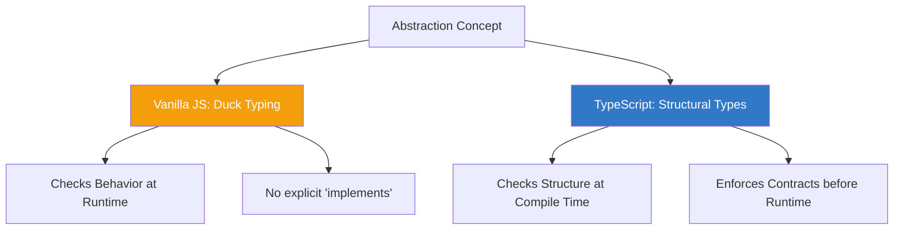

import { Tabs, TabItem, Aside, Badge, Card, CardGrid, Code, LinkCard } from '@astrojs/starlight/components';

## 🎭 Abstraction in JavaScript — The "Duck Typing" Reality

> **Abstraction** hides complex implementation details and exposes only essential features.  
> In Java, this is enforced by `abstract` classes and `interfaces`.  
> In **JavaScript**, abstraction is achieved through **Duck Typing**, **Prototypes**, and (optionally) **TypeScript**.



<Aside type="tip" title="🎯 MUST KNOW">
**JS vs Java Paradigm Shift**:  
✅ **No `abstract` keyword** in vanilla JS — use conventions or base classes with thrown errors.  
✅ **No `interface` keyword** in vanilla JS — use **Duck Typing** ("If it quacks, it's a duck").  
✅ **Structural Subtyping** (TS) — if shapes match, types match (unlike Java's Nominal Typing).  
✅ **Prototypes** allow dynamic behavior sharing, acting like flexible abstract bases.  
✅ **Composition over Inheritance** — JS prefers mixing behaviors over rigid hierarchies.  
</Aside>

---

## 🦆 Duck Typing — The Vanilla JS Way

In Java, you must explicitly declare `class Dog implements Animal`. In JS, you just ensure `Dog` has the required methods. If an object has the right shape, it satisfies the "interface."

<Code lang="js" title="Implicit Interface Satisfaction" code={`
// No interface definition needed!

// Function expects any object with a 'quack' method
function makeItQuack(duck) {
    if (typeof duck.quack === 'function') {
        duck.quack();
    } else {
        throw new Error("Object cannot quack!");
    }
}

// Object 1: A literal object
const realDuck = {
    quack: () => console.log("Quack!")
};

// Object 2: A class instance (unrelated to realDuck)
class Robot {
    quack() {
        console.log("Mechanical Quack!");
    }
}
const robotDuck = new Robot();

// Both work! ✅
makeItQuack(realDuck);   // "Quack!"
makeItQuack(robotDuck);  // "Mechanical Quack!"
`} />

<Aside type="caution">
**The Risk**: Duck typing is **runtime-only**. If you pass an object missing the method, your code crashes at runtime.  
✅ **Fix**: Use **TypeScript** for compile-time safety, or **JSDoc** for IDE hints.
</Aside>

---

## 💎 TypeScript Interfaces — Structural Subtyping

TypeScript introduces the `interface` keyword, but it works differently than Java. It checks **structure**, not **identity**.

<Code lang="ts" title="TS Interface Definition" code={`
// Define the contract
interface Flyable {
    fly(): void;
    speed: number;
}

// Class explicitly implements (optional but recommended for clarity)
class Bird implements Flyable {
    speed: number = 40;
    
    fly() {
        console.log("Flapping wings...");
    }
}

// Object literal automatically satisfies interface (Structural Typing)
const plane: Flyable = {
    speed: 800,
    fly: () => console.log("Engines roaring...")
}; // ✅ Valid! No 'implements' keyword needed for literals.

// Function using the interface
function takeOff(entity: Flyable) {
    entity.fly();
}

takeOff(new Bird());   // ✅
takeOff(plane);        // ✅
`} />

### 🔑 Key Differences: Java vs TS Interfaces

| Feature | Java Interface | TypeScript Interface |
|---------|---------------|----------------------|
| **Typing System** | Nominal (Name-based) | Structural (Shape-based) |
| **Implementation** | Explicit `implements` | Implicit (if shape matches) |
| **Runtime Existence** | Exists as `.class` file | Erased completely (compile-time only) |
| **Multiple Inheritance** | `implements A, B` | `extends A, B` or Intersection Types (`A & B`) |
| **Default Methods** | `default void m() {}` | ❌ No implementation in interface |

<Aside type="note">
**Structural Typing Power**: In TS, if two interfaces have the same members, they are interchangeable, even if declared separately. This enables powerful composition patterns without tight coupling.
</Aside>

---

## 🏗️ Emulating Abstract Classes in JS

Since JS has no `abstract` keyword, we simulate it using **Base Classes** that throw errors if methods aren't overridden.

<Code lang="js" title="Simulating Abstract Classes" code={`
class Shape {
    constructor(name) {
        if (new.target === Shape) {
            throw new Error("Cannot instantiate abstract class Shape directly");
        }
        this.name = name;
    }

    // Abstract method simulation
    area() {
        throw new Error("Method 'area()' must be implemented.");
    }

    // Concrete method (shared behavior)
    describe() {
        return \`\${this.name} has an area of \${this.area()}\`;
    }
}

class Circle extends Shape {
    constructor(name, radius) {
        super(name);
        this.radius = radius;
    }

    // Implementing abstract method
    area() {
        return Math.PI * this.radius ** 2;
    }
}

const c = new Circle("MyCircle", 5);
console.log(c.describe()); // ✅ "MyCircle has an area of 78.53..."

// const s = new Shape(); // 💥 Error: Cannot instantiate abstract class
`} />

<Aside type="tip">
**Why do this?**  
It enforces a contract at runtime. If a subclass forgets to implement `area()`, the error is caught when `area()` is called, not at compile time. TypeScript solves this at compile time.
</Aside>

---

## 🔄 Composition Over Inheritance

Java often uses interfaces for multiple inheritance of type. JS prefers **Composition** (mixins, object spreading).

### Pattern: Mixins (Behavior Reuse)

<Code lang="js" title="Mixins instead of Multiple Interfaces" code={`
// Behaviors as functions
const Flyable = (base) => class extends base {
    fly() {
        console.log("Flying...");
    }
};

const Swimmable = (base) => class extends base {
    swim() {
        console.log("Swimming...");
    }
};

// Base Class
class Animal {
    constructor(name) {
        this.name = name;
    }
}

// Compose Behaviors
class Duck extends Swimmable(Flyable(Animal)) {
    quack() {
        console.log("Quack!");
    }
}

const donald = new Duck("Donald");
donald.fly();   // ✅ From Flyable mixin
donald.swim();  // ✅ From Swimmable mixin
donald.quack(); // ✅ Own method
`} />

<Aside type="tip">
**Why Mixins?**  
Java: `class Duck implements Flyable, Swimmable`  
JS: `class Duck extends Mixins(Flyable, Swimmable, Animal)`  
Mixins allow you to stack behaviors dynamically without complex interface hierarchies.
</Aside>

---

## 🆚 Abstract Class vs Interface (JS/TS Context)

### When to Use Which?

<CardGrid>
  <Card title="Use Interface (TS) When…" icon="rocket">
    - Defining a **contract** for unrelated objects.
    - You need **multiple inheritance** of types (`extends A, B`).
    - You want **zero runtime overhead** (erased completely).
    - Example: `Serializable`, `Comparable`, `EventHandler`.
  </Card>
  
  <Card title="Use Abstract Class (JS/TS) When…" icon="shield">
    - Sharing **code implementation** among related classes.
    - You need a **constructor** or **state** (fields).
    - You want to enforce a **base hierarchy** (IS-A relationship).
    - Example: `BaseController`, `AbstractComponent`.
  </Card>
</CardGrid>

---

## 🏷️ Marker Interfaces & Type Guards

Java uses marker interfaces (`Serializable`) for tagging. JS/TS uses **Type Guards** or **Discriminated Unions**.

### TypeScript Discriminated Unions

<Code lang="ts" title="Tagged Unions instead of Markers" code={`
interface Circle {
    kind: "circle"; // Discriminant property
    radius: number;
}

interface Square {
    kind: "square";
    side: number;
}

type Shape = Circle | Square;

function getArea(shape: Shape) {
    // TS narrows type based on 'kind'
    if (shape.kind === "circle") {
        return Math.PI * shape.radius ** 2;
    } else {
        return shape.side ** 2;
    }
}
`} />

### JS Runtime Tagging

<Code lang="js" title="Symbol or Property Tags" code={`
const SERIALIZABLE = Symbol('serializable');

class User {
    constructor() {
        this[SERIALIZABLE] = true; // Marker
    }
}

function serialize(obj) {
    if (obj[SERIALIZABLE]) {
        return JSON.stringify(obj);
    }
    throw new Error("Not serializable");
}
`} />

---

## 🎯 Interview Cheat Sheet

<CardGrid>
  <Card title="Q: Does JS have interfaces?" icon="information">
    **Vanilla JS**: No. It uses **Duck Typing** (structural compatibility).  
    **TypeScript**: Yes. But they are **structural**, not nominal. If shapes match, types match.
  </Card>
  
  <Card title="Q: How to achieve multiple inheritance in JS?" icon="rocket">
    Use **Mixins** or **Composition**.  
    ```js
    class C extends MixinA(MixinB(Base)) {}
    ```
    Or compose objects: `Object.assign({}, behaviorA, behaviorB)`.
  </Card>

  <Card title="Q: Interface vs Abstract Class in TS?" icon="shield">
    - **Interface**: Contract only. No code. Multiple extension.  
    - **Abstract Class**: Can have code/constructors. Single inheritance.  
    ✅ Prefer Interfaces for public APIs; Abstract Classes for shared base logic.
  </Card>

  <Card title="Q: What is Structural Subtyping?" icon="approve-check">
    Type compatibility is determined by **members**, not declaration names.  
    ```ts
    interface A { x: number }
    interface B { x: number }
    let a: A = { x: 1 };
    let b: B = a; // ✅ Valid! Shapes are identical.
    ```
  </Card>
</CardGrid>

---

## 🧩 DSA & Practical Patterns

<CardGrid>
  <Card title="Pattern: Strategy Pattern with Duck Typing" icon="rocket">
    ```js
    // No interface needed
    const strategies = {
        quickSort: (arr) => { /* ... */ },
        mergeSort: (arr) => { /* ... */ }
    };

    function sortData(arr, strategyName) {
        const sorter = strategies[strategyName];
        if (typeof sorter !== 'function') throw new Error("Invalid strategy");
        return sorter(arr);
    }
    ```
  </Card>
  
  <Card title="Pattern: Adapter Pattern" icon="shield">
    ```js
    // Adapting incompatible interfaces
    class OldAPI {
        requestData() { /* ... */ }
    }

    class NewAPI {
        fetch() { /* ... */ }
    }

    // Adapter makes NewAPI look like OldAPI
    const adapter = {
        requestData: () => new NewAPI().fetch()
    };
    ```
  </Card>
</CardGrid>

---

## 🔑 Quick Reference Summary

### Comparison Table

| Concept | Java | JavaScript (Vanilla) | TypeScript |
|---------|------|----------------------|------------|
| **Keyword** | `interface` / `abstract` | None | `interface` / `type` / `abstract` |
| **Enforcement** | Compile-time + Runtime | Runtime (Manual) | Compile-time |
| **Inheritance** | `implements` / `extends` | N/A (Duck Typing) | Structural |
| **Multiple** | Yes (Interfaces) | Yes (via Composition) | Yes (`extends A, B`) |
| **State** | Constants only (Interface) | Any | None (usually) |

### Best Practices

1. ✅ **Vanilla JS**: Document expected shapes with JSDoc. Check types at runtime if critical.
2. ✅ **TypeScript**: Use `interface` for public APIs and object shapes. Use `type` for unions/primitives.
3. ✅ **Composition**: Prefer mixing behaviors over deep inheritance chains.
4. ✅ **Polymorphism**: Rely on method existence, not class identity.

<Aside type="caution">
**Final Checklist**:
1. ✅ Remember: JS interfaces are **conceptual**, not syntactic (unless using TS).
2. ✅ Use **Duck Typing** to decouple components — don't check `instanceof`, check capabilities.
3. ✅ In TS, prefer **Interfaces** for objects/classes and **Types** for unions/primitives.
4. ✅ Use **Mixins** to simulate multiple inheritance of behavior.
5. ✅ Always validate external inputs against expected "interfaces" (shapes) at runtime.
</Aside>

---

## 🧪 Test Your Understanding

<Code lang="ts" title="Predict Compile/Runtime Behavior" code={`
interface Printable {
    print(): void;
}

class Document implements Printable {
    print() { console.log("Doc"); }
}

class Photo {
    print() { console.log("Photo"); }
}

// Q1: Structural Compatibility
let p: Printable = new Photo(); // ?

// Q2: Missing Method
class Bad {
    // no print method
}
// let b: Printable = new Bad(); // ?

// Q3: Extra Properties
let extra: Printable = {
    print: () => {},
    color: "red"
}; // ? (Excess property check rules)
`} />

<details>
<summary>✅ Click to reveal answers</summary>

```text
Q1: ✅ Valid. Photo has 'print()', so it structurally matches Printable.
Q2: ❌ Error. Bad is missing 'print()'.
Q3: ⚠️ Context Dependent. 
    - Direct assignment: ❌ Error (Excess property check).
    - Via variable/casting: ✅ Valid (Structural compatibility allows extra props).
```
</details>

---

## 🔗 Related Topics

<CardGrid columns={2}>
  <LinkCard
    title="TypeScript Interfaces"
    href="/computer-languages/typescript/topics/interfaces"
    description="Deep dive into TS structural typing, extends, and merging"
  />
  <LinkCard
    title="JavaScript Design Patterns"
    href="/computer-languages/javascript/patterns/overview"
    description="Strategy, Adapter, and Factory patterns in JS"
  />
  <LinkCard
    title="Duck Typing & Polymorphism"
    href="/computer-languages/javascript/oop/polymorphism"
    description="How JS achieves polymorphism without interfaces"
  />
  <LinkCard
    title="Mixins & Composition"
    href="/computer-languages/javascript/oop/mixins"
    description="Reusing code without classical inheritance"
  />
</CardGrid>

<Aside type="note">
🎯 **Production Pro Tips**  
1. In large JS apps, use **JSDoc** or migrate to **TypeScript** to enforce interface-like contracts.  
2. Use **Symbol** keys for private protocol methods to avoid name collisions.  
3. Prefer **composition** (mixins) over complex interface hierarchies for code reuse.  
4. When designing libraries, document the **expected shape** of callback arguments clearly. 🛡️
</Aside>

> 💡 **Final Wisdom**: JavaScript replaces rigid interfaces with **flexible behavioral contracts**. Master Duck Typing for runtime flexibility, and use TypeScript interfaces for compile-time safety. This hybrid approach gives you the best of both worlds! 🚀✨

*Converted for Astro 6 + Starlight • Optimized for interview prep + production use • Quality >>>> Quantity* 🎯
```

---

## 🔄 Java Abstraction → JS/TS Abstraction Conversion Summary

| Java Feature | JavaScript/TypeScript Equivalent | Critical Difference |
|-------------|----------------------|-------------------|
| `interface` keyword | TS: `interface` / JS: None | ✅ TS: Structural (shape-based). JS: Conceptual (Duck Typing). |
| `implements` keyword | TS: `implements` (optional) / JS: None | ✅ TS: Checks structure. JS: No check unless manual. |
| `abstract` class | TS: `abstract class` / JS: Base Class with Errors | ✅ TS: Enforced at compile time. JS: Runtime error if method missing. |
| Abstract Methods | TS: Abstract methods / JS: Convention | ✅ TS: Enforced at compile time. JS: Runtime error if missing. |
| Default Methods | TS: ❌ (Use mixins/helpers) / JS: Helpers | ⚠️ TS Interfaces cannot have code. Use abstract classes or functions. |
| Static Methods | TS: ❌ (Use namespace/class) / JS: Class static | ⚠️ TS Interfaces define instance shapes only. |
| Multiple Inheritance | TS: `extends A, B` / JS: Mixins | ✅ TS supports multiple interface extension. JS uses composition. |
| Marker Interfaces | TS: Discriminated Unions / JS: Symbols | ✅ TS uses literal types (`kind: 'a'`). JS uses properties/symbols. |
| `instanceof` Check | TS: Type Guards / JS: `typeof`/Property Check | ✅ JS checks capabilities, not class identity. |

---

🧠 **Interview Power Move**: When asked about abstraction, always mention:  
1. **Structural vs Nominal Typing** — TS cares about shape, Java cares about name.  
2. **Duck Typing** — JS polymorphism is based on behavior, not declaration.  
3. **Composition over Inheritance** — JS uses mixins/spreading instead of complex interface trees.  
4. **Runtime vs Compile-time** — JS interfaces are conceptual; TS interfaces are erased.  
5. **Adapter Pattern** — Common in JS to bridge incompatible "interfaces" (shapes).  

---

# 🎭 JavaScript Abstraction

---

## 🔰 What Is Abstraction?

Abstraction = **hiding complex implementation details and exposing only what is necessary**. You define WHAT something does — not HOW it does it.

```js
// NO abstraction — caller must know every detail:
const result = await fetch("/api/users", {
  method: "POST",
  headers: { "Content-Type": "application/json", "Authorization": `Bearer ${token}` },
  body: JSON.stringify({ name, email }),
}).then(r => r.ok ? r.json() : Promise.reject(r.status));

// WITH abstraction — caller sees only intent:
const result = await userService.create({ name, email });
// HOW is completely hidden ✅
```

---

## 🗺️ Complete Map

```
Abstraction in JavaScript
│
├── 🏗️  Function Abstraction
│   ├── wrapping complexity
│   ├── named intent
│   └── composable functions
│
├── 🏛️  Class Abstraction
│   ├── abstract base class pattern
│   ├── template method pattern
│   └── hiding implementation
│
├── 📦 Module Abstraction
│   ├── ESM public API
│   ├── hiding internals via scope
│   └── facade pattern
│
├── 🔌 Interface Abstraction
│   ├── duck typing contracts
│   ├── Symbol protocols
│   └── dependency injection
│
├── 🪄  Proxy Abstraction
│   ├── transparent interception
│   ├── virtual properties
│   └── lazy loading
│
├── 🔄 Iterator / Generator Abstraction
│   ├── abstract data traversal
│   └── lazy sequence abstraction
│
├── 🎯 Design Pattern Abstractions
│   ├── Facade
│   ├── Adapter
│   ├── Strategy
│   └── Command
│
└── ⚙️  Internals
    ├── V8 call stack abstraction layers
    ├── prototype chain as abstraction
    └── event loop abstraction
```

---

## ⚙️ Deep Dive — Abstraction Layers in V8

```
┌──────────────────────────────────────────────────────────┐
│         ABSTRACTION LAYERS — JS TO CPU                   │
│                                                          │
│  Your Code:    userService.create({ name, email })       │
│       ↓                                                  │
│  JS Engine:    function call dispatch, this binding      │
│       ↓                                                  │
│  Ignition:     bytecode instructions                     │
│       ↓                                                  │
│  TurboFan:     optimized machine code                    │
│       ↓                                                  │
│  OS Syscall:   network I/O via libuv                     │
│       ↓                                                  │
│  Hardware:     NIC, TCP/IP stack, memory                 │
│                                                          │
│  Each layer abstracts the one below it.                  │
│  You never deal with TCP packets to create a user.       │
│  That IS abstraction — hiding complexity below.          │
└──────────────────────────────────────────────────────────┘
```

---

## 1️⃣ Function Abstraction — Most Fundamental

### Wrapping Complexity

```js
// LOW abstraction — implementation exposed everywhere:
if (
  data &&
  typeof data === "object" &&
  !Array.isArray(data) &&
  Object.keys(data).length > 0
) { processData(data); }

// HIGH abstraction — named intent:
if (isNonEmptyObject(data)) { processData(data); }

// Implementation hidden behind name:
function isNonEmptyObject(value) {
  return (
    value !== null &&
    typeof value === "object" &&
    !Array.isArray(value) &&
    Object.keys(value).length > 0
  );
}
```

### Levels of Abstraction — Keep Them Consistent

```js
// VIOLATION — mixed abstraction levels in one function:
async function handleCheckout(cart) {
  // HIGH level:
  validateCart(cart);

  // LOW level — implementation detail leaking in:
  const res = await fetch("/api/payments", {
    method: "POST",
    headers: { "Content-Type": "application/json" },
    body: JSON.stringify({ items: cart.items, total: cart.total })
  });
  const payment = await res.json();
  if (!res.ok) throw new Error(payment.error);

  // HIGH level again:
  sendConfirmationEmail(cart.user, payment);
  updateInventory(cart.items);
}

// CORRECT — consistent abstraction level:
async function handleCheckout(cart) {
  validateCart(cart);                         // high level
  const payment = await processPayment(cart); // high level
  sendConfirmationEmail(cart.user, payment);  // high level
  updateInventory(cart.items);                // high level
}

// Implementation detail moved to its own level:
async function processPayment(cart) {
  const res = await fetch("/api/payments", {
    method:  "POST",
    headers: { "Content-Type": "application/json" },
    body:    JSON.stringify({ items: cart.items, total: cart.total })
  });
  const data = await res.json();
  if (!res.ok) throw new PaymentError(data.error, res.status);
  return data;
}
```

### Function Composition — Layered Abstraction

```js
// Each function is an abstraction layer:
const pipe = (...fns) => x => fns.reduce((v, f) => f(v), x);
const compose = (...fns) => x => fns.reduceRight((v, f) => f(v), x);

// Build complex behavior from simple abstractions:
const processUserInput = pipe(
  sanitize,         // remove dangerous chars
  normalize,        // trim, lowercase
  validate,         // check format
  transform         // convert to domain object
);

// Each step abstracts one concern:
const sanitize   = str => str.replace(/[<>'"]/g, "");
const normalize  = str => str.trim().toLowerCase();
const validate   = str => { if (!str) throw new Error("Empty"); return str; };
const transform  = str => ({ value: str, processedAt: Date.now() });

processUserInput("  HELLO WORLD  ");
// { value: "hello world", processedAt: 1234567890 }
```

---

## 2️⃣ Class Abstraction — Object-Oriented Abstraction

### Abstract Base Class Pattern

```js
// Abstract base — defines WHAT, hides HOW:
class DataStore {
  constructor() {
    if (new.target === DataStore) {
      throw new TypeError(
        "DataStore is abstract — use a concrete implementation"
      );
    }

    // Enforce interface contract at construction:
    const required = ["get", "set", "delete", "clear"];
    for (const method of required) {
      if (typeof this[method] !== "function" ||
          this[method] === DataStore.prototype[method]) {
        throw new TypeError(
          `${new.target.name} must implement ${method}()`
        );
      }
    }
  }

  // Abstract methods — define WHAT must exist:
  get(key)         { throw new Error(`${this.constructor.name}.get() not implemented`); }
  set(key, value)  { throw new Error(`${this.constructor.name}.set() not implemented`); }
  delete(key)      { throw new Error(`${this.constructor.name}.delete() not implemented`); }
  clear()          { throw new Error(`${this.constructor.name}.clear() not implemented`); }

  // Concrete methods — built on abstract interface:
  // Caller never knows HOW storage works — just that these exist:
  getOrSet(key, factory) {
    if (this.has(key)) return this.get(key);
    const value = factory();
    this.set(key, value);
    return value;
  }

  has(key) {
    return this.get(key) !== undefined;
  }

  setMany(entries) {
    for (const [key, value] of Object.entries(entries)) {
      this.set(key, value);
    }
    return this;
  }

  getMany(keys) {
    return keys.map(key => this.get(key));
  }
}

// Concrete: in-memory implementation:
class MemoryStore extends DataStore {
  #map = new Map();

  get(key)        { return this.#map.get(key); }
  set(key, value) { this.#map.set(key, value); return this; }
  delete(key)     { return this.#map.delete(key); }
  clear()         { this.#map.clear(); return this; }
  get size()      { return this.#map.size; }
}

// Concrete: Redis implementation:
class RedisStore extends DataStore {
  #client;
  #prefix;

  constructor(client, prefix = "app:") {
    super();
    this.#client = client;
    this.#prefix = prefix;
  }

  async get(key) {
    const raw = await this.#client.get(`${this.#prefix}${key}`);
    return raw ? JSON.parse(raw) : undefined;
  }

  async set(key, value, ttlSec) {
    const opts = ttlSec ? { EX: ttlSec } : {};
    await this.#client.set(
      `${this.#prefix}${key}`,
      JSON.stringify(value),
      opts
    );
    return this;
  }

  async delete(key) {
    return (await this.#client.del(`${this.#prefix}${key}`)) > 0;
  }

  async clear() {
    const keys = await this.#client.keys(`${this.#prefix}*`);
    if (keys.length) await this.#client.del(keys);
    return this;
  }
}

// Consumer — never knows if it's memory or Redis:
class CacheService {
  #store;

  constructor(store) {
    if (!(store instanceof DataStore)) {
      throw new TypeError("store must extend DataStore");
    }
    this.#store = store;
  }

  async getUserById(id) {
    return this.#store.getOrSet(
      `user:${id}`,
      () => db.users.findById(id)
    );
  }
}

// Swap implementations — CacheService unaffected:
const devCache  = new CacheService(new MemoryStore());
const prodCache = new CacheService(new RedisStore(redisClient));
```

### Template Method Pattern — Algorithmic Abstraction

```js
// Abstract algorithm — specific steps delegated to subclasses:
class ReportGenerator {
  // Template method — defines the algorithm:
  async generate(options) {
    const raw      = await this.#fetchData(options);   // abstract
    const filtered = this.#filterData(raw, options);   // concrete
    const sorted   = this.sortData(filtered);          // abstract
    const grouped  = this.groupData(sorted);           // abstract
    const output   = this.format(grouped, options);    // abstract

    await this.#save(output, options);
    return output;
  }

  // Private concrete — same for all reports:
  async #fetchData(options) {
    return db.query(this.buildQuery(options)); // abstract buildQuery
  }

  #filterData(data, options) {
    if (!options.filter) return data;
    return data.filter(row =>
      Object.entries(options.filter).every(([k, v]) => row[k] === v)
    );
  }

  async #save(output, options) {
    if (options.destination) {
      await fs.writeFile(options.destination, output);
    }
  }

  // Abstract — subclass decides HOW:
  buildQuery(options) { throw new Error("buildQuery() required"); }
  sortData(data)      { throw new Error("sortData() required"); }
  groupData(data)     { throw new Error("groupData() required"); }
  format(data, opts)  { throw new Error("format() required"); }
}

// Concrete — fills in the abstract steps:
class SalesReport extends ReportGenerator {
  buildQuery({ startDate, endDate }) {
    return {
      table:  "orders",
      where:  { date: { $between: [startDate, endDate] } },
      select: ["product", "quantity", "revenue", "region"]
    };
  }

  sortData(data) {
    return [...data].sort((a, b) => b.revenue - a.revenue);
  }

  groupData(data) {
    return data.reduce((acc, row) => {
      (acc[row.region] ??= []).push(row);
      return acc;
    }, {});
  }

  format(grouped, { format = "json" }) {
    if (format === "csv") return this.#toCSV(grouped);
    return JSON.stringify(grouped, null, 2);
  }

  #toCSV(grouped) {
    const rows = ["Region,Product,Quantity,Revenue"];
    for (const [region, items] of Object.entries(grouped)) {
      for (const item of items) {
        rows.push(`${region},${item.product},${item.quantity},${item.revenue}`);
      }
    }
    return rows.join("\n");
  }
}
```

---

## 3️⃣ Module Abstraction — File-Level API Boundary

```js
// payment-service.mjs — clean public API surface

// ── Private (not exported) ──────────────────────────────
import Stripe  from "stripe";
import PayPal  from "@paypal/checkout-server-sdk";
import { db }  from "./db.js";
import { log } from "./logger.js";

const stripe = new Stripe(process.env.STRIPE_SECRET);

// Private implementation helpers:
async function chargeStripe(amount, currency, source) {
  const charge = await stripe.charges.create({ amount, currency, source });
  await db.transactions.insert({
    provider:      "stripe",
    providerTxId:  charge.id,
    amount,
    currency,
    status:        charge.status
  });
  return { id: charge.id, status: charge.status };
}

async function chargePaypal(amount, currency, token) {
  // ... PayPal implementation details hidden
}

function selectProvider(currency, amount) {
  if (amount > 100000) return "stripe";      // large transactions
  if (["INR", "SGD"].includes(currency)) return "stripe"; // regional
  return "paypal";                           // default
}

async function recordFailure(error, context) {
  await db.paymentErrors.insert({
    error:     error.message,
    context:   JSON.stringify(context),
    timestamp: Date.now()
  });
  log.error("Payment failed", { error, context });
}

// ── Public API ──────────────────────────────────────────
// Importers only see these — all complexity hidden:

export async function charge(amount, currency, paymentToken) {
  const provider = selectProvider(currency, amount);
  try {
    if (provider === "stripe") return await chargeStripe(amount, currency, paymentToken);
    return await chargePaypal(amount, currency, paymentToken);
  } catch (err) {
    await recordFailure(err, { amount, currency, provider });
    throw new PaymentError(err.message);
  }
}

export async function refund(transactionId, amount) {
  const tx = await db.transactions.findById(transactionId);
  if (!tx) throw new Error(`Transaction ${transactionId} not found`);

  if (tx.provider === "stripe") {
    return stripe.refunds.create({ charge: tx.providerTxId, amount });
  }
  // PayPal refund logic hidden...
}

export async function getTransaction(transactionId) {
  return db.transactions.findById(transactionId);
}

// Caller never knows about Stripe/PayPal/DB internals:
// import { charge, refund } from "./payment-service.mjs";
// await charge(5000, "USD", "tok_visa");
```

---

## 4️⃣ Proxy Abstraction — Transparent Interception

### Virtual Object Abstraction

```js
// Proxy makes complex object look simple:

// Abstract: "config object that auto-loads from env":
function createConfig(defaults = {}) {
  const cache = {};

  return new Proxy(defaults, {
    get(target, key) {
      // Serve from cache:
      if (key in cache) return cache[key];

      // Try environment variable (auto-prefixed):
      const envKey = `APP_${String(key).toUpperCase()}`;
      if (process.env[envKey] !== undefined) {
        return (cache[key] = process.env[envKey]);
      }

      // Fall back to default:
      return (cache[key] = target[key]);
    },

    set(target, key, value) {
      cache[key]  = value;
      target[key] = value;
      return true;
    },

    has(target, key) {
      const envKey = `APP_${String(key).toUpperCase()}`;
      return key in target || envKey in process.env;
    }
  });
}

// Caller never knows about env vars or defaults:
const config = createConfig({
  host:    "localhost",
  port:    8080,
  debug:   false,
  timeout: 5000
});

config.host;     // Uses APP_HOST env if set, else "localhost"
config.port;     // Uses APP_PORT env if set, else 8080
config.apiKey;   // Uses APP_APIKEY env if set
```

### Lazy Loading Abstraction via Proxy

```js
// Abstract: object whose properties are loaded on first access:
function lazyObject(loaders) {
  const loaded = {};

  return new Proxy({}, {
    get(_, key) {
      // Already loaded:
      if (key in loaded) return loaded[key];

      // Loader exists — load now:
      if (key in loaders) {
        loaded[key] = loaders[key]();  // call loader
        return loaded[key];
      }

      return undefined;
    },

    ownKeys() {
      return Object.keys(loaders);
    },

    has(_, key) {
      return key in loaders;
    }
  });
}

// Services loaded only when first accessed:
const services = lazyObject({
  db:      () => new DatabasePool(process.env.DB_URL),
  cache:   () => new RedisClient(process.env.REDIS_URL),
  mailer:  () => new EmailService(process.env.SMTP_URL),
  storage: () => new S3Client({ region: process.env.AWS_REGION }),
});

// Nothing loaded at startup:
// services.db     ← Database pool created NOW, on first access
// services.cache  ← Redis connection created NOW
// services.mailer ← Email service created NOW
```

### Abstraction Layer Proxy — Validation + Logging

```js
// Wrap any object with cross-cutting concerns:
function withAbstractionLayer(target, {
  validate  = {},    // field validators
  transform = {},    // field transformers on read
  onSet,             // hook on any set
  onGet              // hook on any get
} = {}) {
  return new Proxy(target, {
    get(obj, key, receiver) {
      const value = Reflect.get(obj, key, receiver);
      onGet?.(key, value);

      // Apply read transformer:
      if (key in transform && typeof value !== "function") {
        return transform[key](value);
      }

      // Bind methods to target:
      if (typeof value === "function") {
        return value.bind(obj);
      }

      return value;
    },

    set(obj, key, value, receiver) {
      // Apply validator:
      if (key in validate) {
        validate[key](value); // throws if invalid
      }

      onSet?.(key, value);
      return Reflect.set(obj, key, value, receiver);
    }
  });
}

// Apply abstraction layer to plain object:
const user = withAbstractionLayer(
  { name: "", email: "", age: 0, password: "" },
  {
    validate: {
      email:    v => { if (!v.includes("@")) throw new Error("Invalid email"); },
      age:      v => { if (v < 0 || v > 150) throw new RangeError("Invalid age"); },
      password: v => { if (v.length < 8) throw new Error("Password too short"); },
    },
    transform: {
      email:    v => v.toLowerCase().trim(),
      name:     v => v.trim(),
      password: () => "***HIDDEN***",  // never expose password on read
    },
    onSet: (key, value) => console.log(`[SET] ${key}`),
  }
);

user.email    = "ALI@EXAMPLE.COM";  // [SET] email logged
user.email;                          // "ali@example.com" — transformed
user.password = "short";            // ❌ Error: Password too short
user.password = "securePass123";    // ✅ [SET] password logged
user.password;                      // "***HIDDEN***" — transformed
```

---

## 5️⃣ Iterator / Generator Abstraction

### Hiding Traversal Complexity

```js
// Abstract: "traverse a tree" — caller doesn't know it's a tree:
class FileSystem {
  #root;

  constructor(rootPath) {
    this.#root = this.#buildTree(rootPath);
  }

  #buildTree(path) {
    // Complex recursive tree building — hidden
    return { path, children: [], size: 0 };
  }

  // Abstraction: iterate files without knowing tree structure:
  * files() {
    yield* this.#walkTree(this.#root);
  }

  * #walkTree(node) {
    if (node.children.length === 0) {
      yield node; // leaf = file
    } else {
      for (const child of node.children) {
        yield* this.#walkTree(child); // recurse — caller never sees this
      }
    }
  }

  // Higher-level abstractions built on files():
  * largeFiles(minBytes) {
    for (const file of this.files()) {
      if (file.size >= minBytes) yield file;
    }
  }

  async * withContent() {
    for (const file of this.files()) {
      const content = await fs.readFile(file.path, "utf8");
      yield { ...file, content };
    }
  }
}

const fs = new FileSystem("/project");

// Caller sees clean iteration — tree traversal completely hidden:
for (const file of fs.files()) { /* ... */ }
for (const file of fs.largeFiles(1024 * 1024)) { /* ... */ }
for await (const file of fs.withContent()) { /* ... */ }
```

### Infinite Lazy Sequence Abstraction

```js
// Abstract: "sequence of prime numbers" — generation hidden:
class Primes {
  // Private sieve implementation — caller never sees it:
  static #isPrime(n) {
    if (n < 2) return false;
    for (let i = 2, s = Math.sqrt(n); i <= s; i++) {
      if (n % i === 0) return false;
    }
    return true;
  }

  * [Symbol.iterator]() {
    let n = 2;
    while (true) {
      if (Primes.#isPrime(n)) yield n;
      n++;
    }
  }

  // Higher-level abstractions:
  take(count) {
    const result = [];
    for (const p of this) {
      result.push(p);
      if (result.length >= count) break;
    }
    return result;
  }

  takeWhile(predicate) {
    const result = [];
    for (const p of this) {
      if (!predicate(p)) break;
      result.push(p);
    }
    return result;
  }
}

const primes = new Primes();
primes.take(5);                    // [2, 3, 5, 7, 11]
primes.takeWhile(p => p < 20);     // [2, 3, 5, 7, 11, 13, 17, 19]
```

---

## 6️⃣ Design Pattern Abstractions

### Facade — Simplify Complex Subsystem

```js
// Multiple complex subsystems:
class OrderFacade {
  #inventory;
  #payment;
  #shipping;
  #notification;
  #analytics;

  constructor({ inventory, payment, shipping, notification, analytics }) {
    this.#inventory   = inventory;
    this.#payment     = payment;
    this.#shipping    = shipping;
    this.#notification = notification;
    this.#analytics   = analytics;
  }

  // ONE method abstracts five subsystems:
  async placeOrder(userId, items, paymentToken) {
    // Reserve inventory:
    const reservations = await this.#inventory.reserve(items);

    try {
      // Process payment:
      const payment = await this.#payment.charge(
        items.reduce((sum, i) => sum + i.price * i.qty, 0),
        "USD",
        paymentToken
      );

      // Create shipment:
      const shipment = await this.#shipping.createShipment({
        userId,
        items,
        paymentId: payment.id
      });

      // Confirm inventory:
      await this.#inventory.confirm(reservations);

      // Notify user:
      await this.#notification.send(userId, "order_confirmed", {
        orderId:    shipment.orderId,
        trackingId: shipment.trackingId
      });

      // Track analytics:
      this.#analytics.track("order_placed", {
        userId,
        total: payment.amount,
        items: items.length
      });

      return { orderId: shipment.orderId, trackingId: shipment.trackingId };

    } catch (err) {
      // Rollback inventory reservation:
      await this.#inventory.release(reservations);
      throw err;
    }
  }

  // Cancel abstracts multiple subsystems too:
  async cancelOrder(orderId) {
    const order = await this.#shipping.getOrder(orderId);
    await Promise.all([
      this.#payment.refund(order.paymentId),
      this.#inventory.release(order.reservations),
      this.#shipping.cancel(orderId),
      this.#notification.send(order.userId, "order_cancelled", { orderId })
    ]);
  }
}

// Caller sees ONE clean API — no subsystem complexity:
const orders = new OrderFacade({ inventory, payment, shipping, notification, analytics });
const result = await orders.placeOrder(userId, cartItems, paymentToken);
```

### Adapter — Abstract Interface Incompatibility

```js
// Different storage APIs — incompatible interfaces:
// localStorage API: { getItem(key), setItem(key, val), removeItem(key) }
// Redis API:        { get(key), set(key, val), del(key) }
// Map API:          { get(key), set(key, val), delete(key) }

// Unified abstraction — same API for all:
class StorageAdapter {
  #backend;
  #type;

  constructor(backend) {
    this.#type    = this.#detectType(backend);
    this.#backend = backend;
  }

  #detectType(backend) {
    if (backend instanceof Map)                         return "map";
    if (typeof backend.getItem === "function")          return "localstorage";
    if (typeof backend.get === "function" &&
        typeof backend.del === "function")              return "redis";
    throw new Error("Unknown storage backend");
  }

  async get(key) {
    switch (this.#type) {
      case "map":          return this.#backend.get(key);
      case "localstorage": {
        const raw = this.#backend.getItem(key);
        return raw ? JSON.parse(raw) : undefined;
      }
      case "redis": {
        const raw = await this.#backend.get(key);
        return raw ? JSON.parse(raw) : undefined;
      }
    }
  }

  async set(key, value) {
    const serialized = JSON.stringify(value);
    switch (this.#type) {
      case "map":          this.#backend.set(key, value); break;
      case "localstorage": this.#backend.setItem(key, serialized); break;
      case "redis":        await this.#backend.set(key, serialized); break;
    }
    return this;
  }

  async delete(key) {
    switch (this.#type) {
      case "map":          return this.#backend.delete(key);
      case "localstorage": return (this.#backend.removeItem(key), true);
      case "redis":        return (await this.#backend.del(key)) > 0;
    }
  }
}

// One API — three backends:
const memStore   = new StorageAdapter(new Map());
const webStore   = new StorageAdapter(localStorage);
const redisStore = new StorageAdapter(redisClient);

// Identical usage — backend completely abstracted:
await memStore.set("key", { data: 1 });
await webStore.set("key", { data: 1 });
await redisStore.set("key", { data: 1 });
```

### Command Pattern — Abstract Operations

```js
// Abstract operations as first-class objects:
class CommandBus {
  #handlers = new Map();
  #history  = [];
  #maxHistory;

  constructor({ maxHistory = 100 } = {}) {
    this.#maxHistory = maxHistory;
  }

  register(commandType, handler) {
    this.#handlers.set(commandType, handler);
    return this;
  }

  async execute(command) {
    const handler = this.#handlers.get(command.constructor);
    if (!handler) throw new Error(`No handler for ${command.constructor.name}`);

    const result = await handler.execute(command);

    // Track for undo:
    if (handler.undo) {
      this.#history.push({ command, handler });
      if (this.#history.length > this.#maxHistory) {
        this.#history.shift();
      }
    }

    return result;
  }

  async undo() {
    const last = this.#history.pop();
    if (!last) throw new Error("Nothing to undo");
    return last.handler.undo(last.command);
  }
}

// Commands — data classes describing WHAT to do:
class CreateUserCommand {
  constructor(name, email, role = "user") {
    this.name  = name;
    this.email = email;
    this.role  = role;
  }
}

class DeleteUserCommand {
  constructor(userId) {
    this.userId = userId;
  }
}

class UpdateRoleCommand {
  constructor(userId, newRole, previousRole) {
    this.userId       = userId;
    this.newRole      = newRole;
    this.previousRole = previousRole;
  }
}

// Handlers — HOW each command is executed:
const CreateUserHandler = {
  async execute({ name, email, role }) {
    return db.users.create({ name, email, role });
  },
  async undo({ email }) {
    return db.users.deleteByEmail(email);
  }
};

const UpdateRoleHandler = {
  async execute({ userId, newRole }) {
    return db.users.updateRole(userId, newRole);
  },
  async undo({ userId, previousRole }) {
    return db.users.updateRole(userId, previousRole);
  }
};

// Register and use:
const bus = new CommandBus();
bus.register(CreateUserCommand, CreateUserHandler)
   .register(DeleteUserCommand, DeleteUserHandler)
   .register(UpdateRoleCommand, UpdateRoleHandler);

// Caller deals in COMMANDS — knows nothing about DB/storage:
await bus.execute(new CreateUserCommand("Ali", "ali@x.com", "admin"));
await bus.execute(new UpdateRoleCommand(1, "moderator", "admin"));
await bus.undo(); // role reverted to "admin"
```

---

## 7️⃣ Dependency Injection — Abstract Dependencies

```js
// Without DI — concrete dependencies, impossible to test/swap:
class UserService {
  async createUser(data) {
    const db    = new PostgresDB(process.env.DB_URL); // hardcoded 😱
    const cache = new RedisCache(process.env.REDIS_URL); // hardcoded 😱
    const mail  = new SendGridMailer(process.env.SENDGRID_KEY); // hardcoded 😱

    const user = await db.users.create(data);
    await cache.set(`user:${user.id}`, user);
    await mail.send(user.email, "welcome", { name: user.name });
    return user;
  }
}

// WITH DI — abstractions injected, implementation hidden:
class UserService {
  #db;
  #cache;
  #mailer;

  // Dependencies injected — any compatible implementation works:
  constructor({ db, cache, mailer }) {
    this.#db     = db;
    this.#cache  = cache;
    this.#mailer = mailer;
  }

  async createUser(data) {
    const user = await this.#db.users.create(data);
    await this.#cache.set(`user:${user.id}`, user);
    await this.#mailer.send(user.email, "welcome", { name: user.name });
    return user;
  }

  async getUserById(id) {
    return (
      await this.#cache.get(`user:${id}`) ??
      await this.#db.users.findById(id)
    );
  }
}

// Production — real implementations:
const prodService = new UserService({
  db:     new PostgresDB(process.env.DB_URL),
  cache:  new RedisCache(process.env.REDIS_URL),
  mailer: new SendGridMailer(process.env.SENDGRID_KEY)
});

// Testing — mock implementations:
const testService = new UserService({
  db:     new InMemoryDB(),
  cache:  new InMemoryCache(),
  mailer: new MockMailer()
});
```

---

## 🏭 Real Production Pattern — Layered Service Architecture

```js
// Three abstraction layers: Controller → Service → Repository

// ── Layer 3: Repository (data access abstraction) ──────
class UserRepository {
  #pool;

  constructor(pool) { this.#pool = pool; }

  async findById(id) {
    const { rows } = await this.#pool.query(
      "SELECT * FROM users WHERE id=$1 AND deleted_at IS NULL", [id]
    );
    return rows[0] ?? null;
  }

  async findByEmail(email) {
    const { rows } = await this.#pool.query(
      "SELECT * FROM users WHERE email=$1", [email]
    );
    return rows[0] ?? null;
  }

  async create(data) {
    const { rows } = await this.#pool.query(
      "INSERT INTO users (name, email, role, password_hash) VALUES ($1,$2,$3,$4) RETURNING *",
      [data.name, data.email, data.role, data.passwordHash]
    );
    return rows[0];
  }

  async update(id, changes) {
    const keys    = Object.keys(changes);
    const values  = Object.values(changes);
    const sets    = keys.map((k, i) => `${k}=$${i + 2}`).join(",");
    const { rows } = await this.#pool.query(
      `UPDATE users SET ${sets}, updated_at=NOW() WHERE id=$1 RETURNING *`,
      [id, ...values]
    );
    return rows[0];
  }
}

// ── Layer 2: Service (business logic abstraction) ──────
class UserService {
  #repo;
  #cache;
  #mailer;
  #hasher;

  constructor({ repo, cache, mailer, hasher }) {
    this.#repo   = repo;
    this.#cache  = cache;
    this.#mailer = mailer;
    this.#hasher = hasher;
  }

  async register(name, email, password) {
    if (await this.#repo.findByEmail(email)) {
      throw new ConflictError("Email already registered");
    }

    const user = await this.#repo.create({
      name,
      email,
      role:         "user",
      passwordHash: await this.#hasher.hash(password)
    });

    await this.#mailer.sendWelcome(email, name);
    await this.#cache.set(`user:${user.id}`, user, { ttl: 300 });

    return this.#sanitize(user);
  }

  async getById(id) {
    const cached = await this.#cache.get(`user:${id}`);
    if (cached) return this.#sanitize(cached);

    const user = await this.#repo.findById(id);
    if (!user) throw new NotFoundError(`User ${id} not found`);

    await this.#cache.set(`user:${id}`, user, { ttl: 300 });
    return this.#sanitize(user);
  }

  // Private — hide sensitive fields:
  #sanitize(user) {
    const { password_hash, ...safe } = user;
    return safe;
  }
}

// ── Layer 1: Controller (HTTP abstraction) ──────────────
class UserController {
  #service;

  constructor(service) { this.#service = service; }

  register() {
    return async (req, res, next) => {
      try {
        const { name, email, password } = req.body;
        const user = await this.#service.register(name, email, password);
        res.status(201).json({ success: true, data: user });
      } catch (err) {
        next(err);
      }
    };
  }

  getById() {
    return async (req, res, next) => {
      try {
        const user = await this.#service.getById(req.params.id);
        res.json({ success: true, data: user });
      } catch (err) {
        next(err);
      }
    };
  }
}

// Wire up — each layer only knows the layer below:
const userRepo       = new UserRepository(pgPool);
const userService    = new UserService({
  repo:   userRepo,
  cache:  redisCache,
  mailer: emailService,
  hasher: bcryptHasher
});
const userController = new UserController(userService);

app.post("/users",     userController.register());
app.get("/users/:id",  userController.getById());
```

---

## 💀 Interview Traps

### Trap 1: Abstraction leaking implementation detail — "leaky abstraction"

```js
// LEAKY — abstraction exposes implementation detail:
class UserRepository {
  async getUser(id) {
    return db.query(
      "SELECT * FROM users WHERE id = $1", [id]
    ); // returns raw pg QueryResult 😱 — SQL detail leaked
  }
}

// Caller must know about QueryResult.rows:
const result = await repo.getUser(1);
const user   = result.rows[0]; // caller knows it's PostgreSQL 😱

// NON-LEAKY — returns domain object:
class UserRepository {
  async getUser(id) {
    const { rows } = await db.query(
      "SELECT * FROM users WHERE id = $1", [id]
    );
    return rows[0] ?? null; // ✅ caller gets User or null — not QueryResult
  }
}

// Now caller doesn't know HOW data is fetched:
const user = await repo.getUser(1); // User | null — clean ✅
```

---

### Trap 2: Over-abstraction — unnecessary layers with no value

```js
// OVER-ABSTRACTED — abstraction adds zero value:
class NumberAdder {
  add(a, b) { return a + b; } // wraps built-in operator 😱
}

class StringConcatenator {
  concatenate(a, b) { return a + b; } // wraps + 😱
}

// Nobody benefits from this abstraction
// Rule: abstract when there's real complexity to hide OR real variance to handle
// Don't abstract just to abstract

// JUSTIFIED abstraction — real complexity hidden:
class CurrencyCalculator {
  add(amount1, amount2, currency) {
    // Hides: currency conversion, precision handling,
    // rounding rules, overflow checks — REAL complexity
    if (amount1.currency !== amount2.currency) {
      amount2 = this.#convert(amount2, amount1.currency);
    }
    return new Money(
      Math.round((amount1.value + amount2.value) * 100) / 100,
      currency
    );
  }
}
```

---

### Trap 3: Abstraction that hides errors — silent failures

```js
// WRONG — abstraction swallows errors:
async function getUser(id) {
  try {
    return await db.users.findById(id);
  } catch (err) {
    return null; // 😱 DB down looks same as "user not found"
  }
}

// Caller cannot distinguish "not found" from "error":
const user = await getUser(1);
if (!user) { /* is this 404 or 500? */ } // 😱

// RIGHT — abstraction preserves error semantics:
async function getUser(id) {
  try {
    const user = await db.users.findById(id);
    if (!user) throw new NotFoundError(`User ${id} not found`);
    return user;
  } catch (err) {
    if (err instanceof NotFoundError) throw err;
    // Wrap infrastructure error in domain error:
    throw new RepositoryError(`Failed to fetch user ${id}`, { cause: err });
  }
}

// Caller can distinguish:
try {
  const user = await getUser(1);
} catch (err) {
  if (err instanceof NotFoundError)    return res.status(404).json({ error: err.message });
  if (err instanceof RepositoryError)  return res.status(503).json({ error: "Service unavailable" });
}
```

---

### Trap 4: Dependency on concrete class — breaks abstraction

```js
// WRONG — depends on concrete class, not abstraction:
class UserService {
  #db;

  constructor() {
    this.#db = new PostgresDB(); // hardcoded concrete class 😱
  }

  async getUser(id) {
    return this.#db.query(`SELECT * FROM users WHERE id = ${id}`);
  }
}

// Cannot test without real PostgreSQL
// Cannot swap to MySQL, SQLite, etc.

// RIGHT — depends on abstraction:
class UserService {
  #repo;

  constructor(repo) {
    // Accept any object implementing the Repository interface:
    if (typeof repo.findById !== "function") {
      throw new TypeError("repo must implement findById()");
    }
    this.#repo = repo;
  }

  async getUser(id) {
    return this.#repo.findById(id); // calls abstraction ✅
  }
}

// Inject any compatible implementation:
const svc = new UserService(new PostgresUserRepo());
const svc = new UserService(new InMemoryUserRepo()); // for tests ✅
```

---

### Trap 5: Abstraction with wrong granularity

```js
// TOO FINE-GRAINED — one method per DB call:
class UserRepository {
  getUserName(id)    { return db.query("SELECT name FROM users WHERE id=$1", [id]); }
  getUserEmail(id)   { return db.query("SELECT email FROM users WHERE id=$1", [id]); }
  getUserRole(id)    { return db.query("SELECT role FROM users WHERE id=$1", [id]); }
  // N+1 queries every time caller needs full user 😱
}

// TOO COARSE-GRAINED — one method does too much:
class UserRepository {
  async doEverything(id, name, email, password, role, options, filter) {
    // 200 lines of conditional logic 😱
  }
}

// RIGHT GRANULARITY — natural domain operations:
class UserRepository {
  async findById(id)              { /* SELECT * */ }
  async findByEmail(email)        { /* SELECT * WHERE email */ }
  async findAll({ role, limit })  { /* SELECT * WHERE ... LIMIT ... */ }
  async create(data)              { /* INSERT */ }
  async update(id, changes)       { /* UPDATE */ }
  async delete(id)                { /* DELETE */ }
  async exists(email)             { /* SELECT 1 */ }
}
```

---

## 📊 Abstraction Levels — Reference Table

```
┌──────────────────────────────────────────────────────────┐
│           ABSTRACTION LEVELS IN A NODE.JS APP            │
│                                                          │
│  Level 1 — HTTP (highest abstraction)                    │
│  route("/users", controller.create())                    │
│  → caller knows: endpoint, method                        │
│                                                          │
│  Level 2 — Controller                                    │
│  service.createUser(req.body)                            │
│  → caller knows: domain operation                        │
│                                                          │
│  Level 3 — Service (business logic)                      │
│  repo.create(data) + cache.set() + mail.send()           │
│  → caller knows: business rules                          │
│                                                          │
│  Level 4 — Repository (data access)                      │
│  pool.query("INSERT INTO users ...")                     │
│  → caller knows: persistence operation                   │
│                                                          │
│  Level 5 — DB Driver (lowest abstraction)                │
│  TCP socket write to PostgreSQL wire protocol            │
│  → no JS involvement — native bindings                   │
└──────────────────────────────────────────────────────────┘
```

---

## 📊 DSA / Internals Connection

> Abstraction is the foundation of **Abstract Data Types (ADT)** in CS theory — the formal separation of interface (WHAT) from implementation (HOW). A Stack ADT says: push, pop, peek, isEmpty — it says nothing about array vs linked list. V8's prototype chain IS abstraction at the engine level — `array.map()` works whether V8 stores the array as PACKED_SMI, PACKED_DOUBLE, or HOLEY internally. You call `map()` — the engine decides HOW based on the array's internal representation.
>
> The **Facade** pattern maps directly to **interface segregation** in SOLID principles. The **Adapter** pattern is equivalent to a **type coercion function** in type theory — converting an object of one shape to satisfy another interface. The **Command** pattern encodes operations as **first-class values** — same concept as **function objects** or **closures** in functional programming theory.

---
