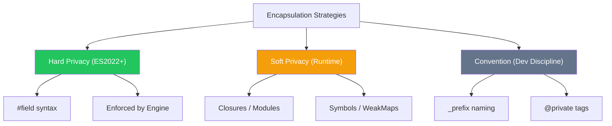

import { Tabs, TabItem, Aside, Badge, Card, CardGrid, Code, LinkCard } from '@astrojs/starlight/components';

## 📦 Encapsulation in JavaScript — The Modern Approach

> **Encapsulation** bundles data (fields) and behavior (methods) into a single unit (class/object) and restricts direct access to internal state.  
> In Java, this is done with `private`/`public`. In **JavaScript**, we use **Private Fields (`#`)**, **Closures**, and **Symbols**.



<Aside type="tip" title="🎯 MUST KNOW">
**JS vs Java Privacy**:  
✅ **True Private (`#`)**: Hard enforcement, not accessible even via reflection.  
✅ **Closures**: The original JS way to hide data (Module Pattern).  
✅ **No `protected`**: Use `_prefix` or WeakMaps for subclass-friendly privacy.  
✅ **Getters/Setters**: Built-in syntax for controlled access and validation.  
✅ **Immutability**: Achieved via `Object.freeze()` or conventions, not `final`.  
</Aside>

---

## 🛡️ Levels of Data Hiding in JS

### 1. Hard Privacy: Private Fields (`#`) <Badge text="ES2022+" variant="success" />

The `#` prefix creates fields that are **strictly scoped** to the class body. They cannot be accessed from outside, not even by subclasses or via `Object.keys()`.

<Code lang="js" title="Private Fields and Methods" code={`
class BankAccount {
    #balance = 0;          // Private field
    #pin = "1234";         // Private field
    
    constructor(initialBalance) {
        this.#balance = initialBalance;
    }
    
    // Private method
    #validatePin(pin) {
        return pin === this.#pin;
    }
    
    // Public API
    deposit(amount, pin) {
        if (!this.#validatePin(pin)) throw new Error("Invalid PIN");
        if (amount <= 0) throw new Error("Invalid amount");
        
        this.#balance += amount;
        return this.#balance;
    }
    
    getBalance(pin) {
        if (!this.#validatePin(pin)) return null;
        return this.#balance;
    }
}

const acc = new BankAccount(100);
console.log(acc.deposit(50, "1234")); // ✅ 150

// ❌ Hard Error: SyntaxError
// console.log(acc.#balance); 
// acc.#balance = 1000000; 
`} />

<Aside type="caution">
**Key Difference from Java**:  
In Java, `private` can be bypassed via Reflection. In JS, `#` fields are **impossible** to access from outside the class scope. They are not properties of the object in the traditional sense.
</Aside>

### 2. Soft Privacy: Closures & Modules

Before `#` fields, **Closures** were the only way to achieve true privacy. Variables defined inside a constructor or module scope are inaccessible from the outside.

<Code lang="js" title="Closure-based Privacy (Module Pattern)" code={`
function createCounter() {
    let count = 0; // 🔒 Private variable (hidden in closure)
    
    return {
        increment() {
            count++;
        },
        getCount() {
            return count;
        }
    };
}

const counter = createCounter();
counter.increment();
console.log(counter.getCount()); // ✅ 1

// ❌ Impossible to access 'count' directly
// console.log(counter.count); // undefined
`} />

### 3. Convention: The Underscore Prefix (`_`)

Using `_` is a **signal** to other developers that a property is internal. It is **not enforced** by the engine.

<Code lang="js" title="Convention-based Privacy" code={`
class User {
    _passwordHash = null; // ⚠️ "Private" by convention
    
    setPassword(password) {
        this._passwordHash = hash(password);
    }
}

const user = new User();
user.setPassword("secret");

// ⚠️ Technically accessible, but violates convention
console.log(user._passwordHash); 
`} />

<Aside type="note">
**When to use `_`**:  
- For protected-like members (accessible to subclasses).  
- When you need to debug internal state easily.  
- In libraries where `#` might cause transpilation issues (rare now).
</Aside>

---

## 🔑 Getters & Setters — Controlled Access

JS uses `get` and `set` keywords to define accessor descriptors. This allows you to run logic (validation, computation) when accessing or modifying properties.

<Code lang="js" title="Encapsulated Field with Validation" code={`
class Product {
    #price = 0;
    #name = "";
    
    constructor(name, price) {
        this.name = name; // Uses setter
        this.price = price; // Uses setter
    }
    
    get name() {
        return this.#name;
    }
    
    set name(value) {
        if (!value || value.trim() === "") {
            throw new Error("Name cannot be empty");
        }
        this.#name = value.trim();
    }
    
    get price() {
        return this.#price;
    }
    
    set price(value) {
        if (value < 0) {
            throw new Error("Price cannot be negative");
        }
        this.#price = value;
    }
}

const p = new Product("Laptop", 999);
console.log(p.price); // ✅ 999
// p.price = -10;     // 💥 Error: Price cannot be negative
`} />

### ⚠️ Common Pitfalls

<CardGrid>
  <Card title="Pitfall 1: Exposing Mutable Objects" icon="error">
```js
    class Team {
        #members = [];
        
        // ❌ Dangerous: Returns reference to internal array
        get members() {
            return this.#members; 
        }
    }
    
    const team = new Team();
    team.members.push("Hacker"); // 😱 Modifies internal state directly!
    
    // ✅ Fix: Return a copy or read-only view
    get members() {
        return [...this.#members]; // Spread operator creates shallow copy
        // Or: return Object.freeze([...this.#members]);
    }
```
  </Card>
  
  <Card title="Pitfall 2: Infinite Recursion in Setters" icon="error">
```js
    class Circle {
        radius = 0;
        
        // ❌ Infinite Loop!
        set radius(value) {
            this.radius = value; // Calls setter again → Stack Overflow
        }
        
        // ✅ Fix: Use a different internal name or private field
        #radius = 0;
        set radius(value) {
            this.#radius = value;
        }
        get radius() {
            return this.#radius;
        }
    }
```
  </Card>
</CardGrid>

---

## 🧊 Immutability — The Ultimate Encapsulation

In Java, you use `final`. In JS, you use `Object.freeze()` or conventions.

<Code lang="js" title="Immutable Configuration Object" code={`
class Config {
    constructor(apiUrl, timeout) {
        this.#apiUrl = apiUrl;
        this.#timeout = timeout;
        
        // Freeze the instance to prevent adding/removing properties
        Object.freeze(this);
    }
    
    #apiUrl;
    #timeout;
    
    get apiUrl() { return this.#apiUrl; }
    get timeout() { return this.#timeout; }
}

const config = new Config("https://api.example.com", 5000);
// config.apiUrl = "http://evil.com"; // ❌ Ignored (or TypeError in strict mode)
// config.newProp = 123;             // ❌ Ignored
`} />

<Aside type="tip">
**Note on `Object.freeze()`**: It is **shallow**. If your object contains other objects or arrays, you must deep freeze them recursively. For most cases, using `#` private fields without setters is sufficient for logical immutability.
</Aside>

---

## 🆚 Java vs JS Encapsulation Comparison

<table>
  <thead>
    <tr>
      <th>Feature</th>
      <th>Java</th>
      <th>JavaScript</th>
    </tr>
  </thead>
  <tbody>
    <tr><td><code>private</code></td><td>Keyword</td><td><code>#field</code> (Hard) or Closure (Soft)</td></tr>
    <tr><td><code>protected</code></td><td>Keyword</td><td>Convention (<code>_field</code>) or WeakMap</td></tr>
    <tr><td><code>public</code></td><td>Keyword</td><td>Default (no keyword)</td></tr>
    <tr><td>Getters/Setters</td><td><code>getX()</code>, <code>setX()</code></td><td><code>get x()</code>, <code>set x(val)</code></td></tr>
    <tr><td>Immutability</td><td><code>final</code> keyword</td><td><code>Object.freeze()</code> or convention</td></tr>
    <tr><td>Reflection Access</td><td>Can bypass <code>private</code></td><td>Cannot bypass <code>#</code> fields</td></tr>
  </tbody>
</table>

---

## 🎯 Interview Cheat Sheet

<CardGrid>
  <Card title="Q: How do you make a field private in JS?" icon="approve-check">
    **Use `#` prefix** (ES2022+).  
    ```js
    class X { #secret = 1; }
    ```
    ✅ Enforced by engine.  
    ⚠️ Older alternatives: Closures, WeakMaps, or TypeScript `private` (compile-time only).
  </Card>
  
  <Card title="Q: What is the difference between `#field` and `_field`?" icon="information">
    - **`#field`**: Hard privacy. Syntax error if accessed outside class. Not visible in `Object.keys()`.  
    - **`_field`**: Convention. Still public. Visible in `Object.keys()`. Relies on developer discipline.
  </Card>

  <Card title="Q: How do you validate data in JS classes?" icon="rocket">
    Use **Setters**.  
    ```js
    set age(val) {
        if (val < 0) throw new Error("Invalid");
        this.#age = val;
    }
    ```
  </Card>

  <Card title="Q: Can subclasses access `#` private fields?" icon="error">
    **NO ❌**.  
    `#` fields are strictly scoped to the declaring class. Subclasses cannot see them. Use `_prefix` if you need subclass access.
  </Card>
</CardGrid>

---

## 🧩 DSA & Practical Patterns

<CardGrid>
  <Card title="Pattern: Encapsulated Graph Node" icon="shield">
```js
    class GraphNode {
        #value;
        #neighbors = new Set(); // Use Set to avoid duplicates
        
        constructor(value) {
            this.#value = value;
        }
        
        addNeighbor(node) {
            if (node && node !== this) {
                this.#neighbors.add(node);
                node.#neighbors.add(this); // Undirected graph
            }
        }
        
        // Return copy to prevent external mutation
        get neighbors() {
            return [...this.#neighbors];
        }
        
        get value() {
            return this.#value;
        }
    }
```
  </Card>
  
  <Card title="Pattern: Immutable Interval" icon="rocket">
```js
    class Interval {
        #start;
        #end;
        
        constructor(start, end) {
            if (start > end) throw new Error("Invalid interval");
            this.#start = start;
            this.#end = end;
            Object.freeze(this);
        }
        
        overlaps(other) {
            return this.#start <= other.#end && other.#start <= this.#end;
        }
        
        get start() { return this.#start; }
        get end() { return this.#end; }
    }
```
  </Card>
</CardGrid>

---

## 🔑 Quick Reference Summary

### Access Control Mechanisms

| Mechanism | Syntax | Enforcement | Subclass Access? |
|-----------|--------|-------------|------------------|
| Private Field | `#field` | ✅ Runtime (Engine) | ❌ No |
| Closure | `let val` inside func | ✅ Runtime (Scope) | N/A |
| Convention | `_field` | ❌ None | ✅ Yes |
| WeakMap | `wm.get(this)` | ✅ Runtime (Ref) | ✅ If Map shared |

### Best Practices

1. ✅ Use **`#`** for true internal state that should never leak.
2. ✅ Use **`_`** for "protected" members or when debugging access is needed.
3. ✅ Use **Getters/Setters** for validation and computed properties.
4. ✅ Return **copies** (`[...arr]`, `{...obj}`) from getters if returning mutable data.
5. ✅ Prefer **Composition** over deep inheritance for sharing behavior.

<Aside type="caution">
**Final Checklist**:
1. ✅ Start with **`#` private fields** for maximum safety.
2. ✅ Validate inputs in **constructors** and **setters**.
3. ✅ Avoid exposing **mutable references** (arrays/objects) directly.
4. ✅ Use **`Object.freeze()`** for configuration objects.
5. ✅ Remember: JS is dynamic — encapsulation is about **design intent**, not just syntax.
</Aside>

---

## 🧪 Test Your Understanding

<Code lang="js" title="Predict the output/error" code={`class Test {
    #private = 1;
    _protected = 2;
    
    get private() {
        return this.#private;
    }
}

const t = new Test();
console.log(t.private);   // ?
console.log(t._protected); // ?
// console.log(t.#private); // ?
`} />

<details>
<summary>✅ Click to reveal answers</summary>

```text
console.log(t.private);   // 1 (Accesses via getter)
console.log(t._protected); // 2 (Public by convention)
// console.log(t.#private); // 💥 SyntaxError: Private field '#private' must be declared in an enclosing class
```
</details>

---

## 🔗 Related Topics

<CardGrid columns={2}>
  <LinkCard
    title="JavaScript Classes"
    href="/computer-languages/javascript/topics/classes"
    description="Syntax, inheritance, super, constructors"
  />
  <LinkCard
    title="JavaScript Closures"
    href="/computer-languages/javascript/topics/closures"
    description="Scope chain, module pattern, data privacy"
  />
  <LinkCard
    title="TypeScript Access Modifiers"
    href="/computer-languages/typescript/topics/modifiers"
    description="public, private, protected, readonly (compile-time)"
  />
  <LinkCard
    title="JavaScript Immutability"
    href="/computer-languages/javascript/guides/immutability"
    description="Object.freeze, const, immutable patterns"
  />
</CardGrid>

<Aside type="note">
🎯 **Production Pro Tips**  
1. Prefer `#` private fields for critical internal state.  
2. Use `_` prefix for methods/fields intended for subclass override.  
3. Always validate data in setters to maintain object invariants.  
4. Use `Object.freeze()` on exported constants to prevent accidental mutation.  
5. In TypeScript, use `private`/`protected` for IDE support, but remember they compile to public JS. 🛡️
</Aside>

> 💡 **Final Wisdom**: JavaScript encapsulation has evolved from **conventions** to **hard enforcement** with `#` fields. Use the right tool for the job: `#` for security, `_` for flexibility, and closures for functional privacy. Mastering these ensures robust, maintainable code! 🚀✨

*Converted for Astro 6 + Starlight • Optimized for interview prep + production use • Quality >>>> Quantity* 🎯
```

---

## 🔄 Java Encapsulation → JS Encapsulation Conversion Summary

| Java Feature | JavaScript Equivalent | Critical Difference |
|-------------|----------------------|-------------------|
| `private` | `#field` (ES2022+) | ✅ JS: Hard privacy, not accessible via reflection. |
| `protected` | `_field` (convention) | ⚠️ JS: No native `protected`. Use `_` or WeakMaps. |
| `public` | Default (no keyword) | ✅ JS: Everything is public unless marked otherwise. |
| `final` | `Object.freeze()` / `const` | ⚠️ JS: `const` is for bindings. `freeze` is shallow. |
| Getters/Setters | `get prop()` / `set prop(v)` | ✅ JS: Syntactic sugar for property access. |
| Package-Private | Module Scope (ESM) | ✅ JS: ESM exports control visibility explicitly. |
| Reflection Bypass | Impossible for `#` | ✅ JS: `#` fields are truly hidden from outside. |

---

🧠 **Interview Power Move**: When asked about encapsulation, always mention:  
1. **`#` private fields** are truly private (runtime enforced).  
2. **Closures** were the original way to hide data in JS.  
3. **Getters/Setters** allow validation and computed properties.  
4. **Immutability** is achieved via `Object.freeze()` or conventions.  
5. **Returning copies** of mutable data prevents external state corruption.  

---

# 📦 JavaScript Encapsulation

---

## 🔰 What Is Encapsulation?

Encapsulation = **bundling data and the methods that operate on that data into one unit, while controlling what is accessible from outside**. It's the combination of data hiding + behavior binding.

```js
// NO encapsulation — data and behavior separate, state unprotected:
let balance = 1000;
function deposit(amount)  { balance += amount; }
function withdraw(amount) { balance -= amount; } // no validation
balance = -99999; // 😱 direct mutation — no protection

// WITH encapsulation — data + behavior bundled, state protected:
class BankAccount {
  #balance = 1000;                              // data
  deposit(amount)  { this.#balance += amount; } // behavior on data
  withdraw(amount) {                            // behavior with rules
    if (amount > this.#balance) throw new Error("Insufficient funds");
    this.#balance -= amount;
  }
  get balance() { return this.#balance; }       // controlled access
}
// balance unreachable except through methods ✅
```

---

## 🗺️ Complete Map

```
Encapsulation in JavaScript
│
├── 🔴 State Encapsulation
│   ├── # private fields
│   ├── closure variables
│   └── WeakMap pattern
│
├── 🔵 Behavior Encapsulation
│   ├── methods that own their data
│   ├── private methods
│   └── controlled public API
│
├── 🟢 Accessor Encapsulation
│   ├── get/set with validation
│   ├── read-only properties
│   └── write-once pattern
│
├── 🟡 Module Encapsulation
│   ├── ESM file boundary
│   ├── CJS module scope
│   └── IIFE encapsulation
│
├── 🟣 Object Encapsulation
│   ├── Object.freeze / seal
│   ├── non-enumerable properties
│   └── Symbol keys
│
├── 🔶 Prototype Encapsulation
│   ├── prototype chain boundary
│   └── class inheritance boundary
│
└── ⚙️  Internals
    ├── V8 hidden class + private slots
    ├── closure scope chain
    └── property descriptor system
```

---

## ⚙️ Deep Dive — How V8 Implements Encapsulation

```
┌──────────────────────────────────────────────────────────┐
│         V8 ENCAPSULATION MECHANISMS                      │
│                                                          │
│  Public properties:                                      │
│  → stored in JSObject properties array                   │
│  → indexed by HiddenClass (shape)                        │
│  → accessible via any property access                    │
│                                                          │
│  Private fields (#):                                     │
│  → stored in PrivateFieldTable per class                 │
│  → keyed by (class brand, field name)                    │
│  → parse-time check: access outside class = SyntaxError  │
│  → runtime check: wrong brand = TypeError               │
│                                                          │
│  Closure variables:                                      │
│  → stored in Context object on heap                      │
│  → reachable ONLY through function closures              │
│  → no property path to them exists                       │
│                                                          │
│  Module scope:                                           │
│  → file-level bindings in Module Environment Record      │
│  → unexported = unreachable from outside                 │
│  → live bindings for exports, isolated otherwise         │
└──────────────────────────────────────────────────────────┘
```

---

## 1️⃣ State + Behavior Encapsulation — The Core

### The Three Layers Together

```js
class Stack {
  // ── Private State ─────────────────────────────────────
  #items  = [];
  #maxSize;
  static #instanceCount = 0;

  // ── Construction ──────────────────────────────────────
  constructor(maxSize = Infinity) {
    this.#maxSize = maxSize;
    Stack.#instanceCount++;
  }

  // ── Encapsulated Behavior (uses private state) ────────
  push(item) {
    if (this.#items.length >= this.#maxSize) {
      throw new RangeError(`Stack overflow: max size ${this.#maxSize}`);
    }
    this.#items.push(item);
    return this;               // chainable
  }

  pop() {
    if (this.#isEmpty()) throw new RangeError("Stack underflow");
    return this.#items.pop();
  }

  peek() {
    if (this.#isEmpty()) return undefined;
    return this.#items.at(-1);
  }

  // ── Private Behavior (not part of public API) ─────────
  #isEmpty() { return this.#items.length === 0; }

  #toArray() { return [...this.#items]; }

  // ── Controlled Read Access ────────────────────────────
  get size()    { return this.#items.length; }
  get isEmpty() { return this.#isEmpty(); }
  get isFull()  { return this.#items.length >= this.#maxSize; }

  // ── Controlled Serialization ──────────────────────────
  toJSON() { return { items: this.#toArray(), size: this.size }; }

  [Symbol.iterator]() {
    return this.#toArray().reverse()[Symbol.iterator]();
  }

  // ── Class-level Encapsulation ─────────────────────────
  static getInstanceCount() { return Stack.#instanceCount; }

  toString() { return `Stack(${this.#items.join(" → ")})`; }
}

const s = new Stack(3);
s.push(1).push(2).push(3);
s.peek();                // 3
s.size;                  // 3
s.push(4);               // ❌ RangeError: Stack overflow
s.#items;                // ❌ SyntaxError — encapsulated
s.pop();                 // 3 — via public API ✅
[...s];                  // [2, 1] — via iterator ✅
Stack.getInstanceCount(); // 1
```

### Encapsulation Boundary Diagram

```
┌──────────────────────────────────────────────────────────┐
│                 Stack INSTANCE                           │
│                                                          │
│  ╔══════════════════════════════════════════╗            │
│  ║           PRIVATE (encapsulated)         ║            │
│  ║                                          ║            │
│  ║  #items   = [1, 2, 3]  (data)           ║            │
│  ║  #maxSize = 3           (data)           ║            │
│  ║  #isEmpty()             (behavior)       ║            │
│  ║  #toArray()             (behavior)       ║            │
│  ╚══════════════════════════════════════════╝            │
│                       ↕  controlled access               │
│  ╔══════════════════════════════════════════╗            │
│  ║           PUBLIC API                     ║            │
│  ║                                          ║            │
│  ║  push(item)   → validates + mutates      ║            │
│  ║  pop()        → validates + mutates      ║            │
│  ║  peek()       → safe read               ║            │
│  ║  get size     → controlled read         ║            │
│  ║  toJSON()     → controlled serialize    ║            │
│  ╚══════════════════════════════════════════╝            │
│                       ↑  only entry points               │
│           OUTSIDE WORLD (can only use public API)        │
└──────────────────────────────────────────────────────────┘
```

---

## 2️⃣ Closure Encapsulation — Without Classes

### Factory Function as Encapsulation Unit

```js
// Everything encapsulated in closure scope:
function createEventEmitter() {
  // Private state — not on returned object:
  const listeners = new Map();
  let   eventCount = 0;

  // Private behavior:
  function validateEvent(event) {
    if (typeof event !== "string" || !event.trim()) {
      throw new TypeError("Event name must be a non-empty string");
    }
  }

  function getListeners(event) {
    if (!listeners.has(event)) listeners.set(event, new Set());
    return listeners.get(event);
  }

  // Public API — returned object:
  return {
    on(event, handler) {
      validateEvent(event);
      if (typeof handler !== "function") {
        throw new TypeError("Handler must be a function");
      }
      getListeners(event).add(handler);
      return this; // chainable
    },

    off(event, handler) {
      validateEvent(event);
      getListeners(event).delete(handler);
      return this;
    },

    emit(event, ...args) {
      validateEvent(event);
      eventCount++;
      for (const handler of getListeners(event)) {
        try { handler(...args); }
        catch (err) { console.error(`Handler error [${event}]:`, err); }
      }
      return this;
    },

    once(event, handler) {
      const wrapper = (...args) => {
        handler(...args);
        this.off(event, wrapper);
      };
      return this.on(event, wrapper);
    },

    // Controlled introspection — returns copies:
    listenerCount(event) { return getListeners(event).size; },
    get totalEvents()    { return eventCount; },

    // No way to access raw 'listeners' Map or 'eventCount' directly
  };
}

const emitter = createEventEmitter();
emitter.on("data",  chunk => process(chunk));
emitter.on("error", err   => log(err));
emitter.emit("data", { id: 1 });

emitter.listeners;   // undefined — encapsulated 😤
emitter.eventCount;  // undefined — encapsulated 😤
emitter.totalEvents; // 1 — controlled read ✅
```

### Closure Encapsulation — Memory Model

```
┌──────────────────────────────────────────────────────────┐
│         CLOSURE ENCAPSULATION MEMORY MODEL               │
│                                                          │
│  createEventEmitter() called                             │
│                                                          │
│  Closure Scope (heap):                                   │
│  ┌────────────────────────────────────────────────────┐  │
│  │  listeners: Map { "data" → Set, "error" → Set }    │  │
│  │  eventCount: 1                                     │  │
│  │  validateEvent: [Function]                         │  │
│  │  getListeners:  [Function]                         │  │
│  └──────────────────────┬─────────────────────────────┘  │
│                         │ captured by all returned fns   │
│  Returned object:        ↓                               │
│  ┌────────────────────────────────────────────────────┐  │
│  │  on:    [Function → closure scope]                 │  │
│  │  off:   [Function → closure scope]                 │  │
│  │  emit:  [Function → closure scope]                 │  │
│  │  once:  [Function → closure scope]                 │  │
│  └────────────────────────────────────────────────────┘  │
│                                                          │
│  listeners and eventCount ONLY reachable through         │
│  the returned methods — zero other path exists           │
└──────────────────────────────────────────────────────────┘
```

---

## 3️⃣ Accessor Encapsulation — Controlled State Access

### Full Validation Layer

```js
class UserProfile {
  // Private backing fields:
  #name;
  #email;
  #age;
  #role;
  #createdAt;
  #updatedAt;

  // Allowed enum values — encapsulated:
  static #VALID_ROLES = new Set(["user", "admin", "moderator", "guest"]);

  constructor({ name, email, age, role = "user" }) {
    // Use setters for validation even in constructor:
    this.name  = name;
    this.email = email;
    this.age   = age;
    this.role  = role;

    // Write-once fields — set only in constructor:
    this.#createdAt = new Date().toISOString();
    this.#updatedAt = this.#createdAt;
  }

  // ── name: read/write with validation ─────────────────
  get name() { return this.#name; }
  set name(value) {
    const v = String(value ?? "").trim();
    if (v.length < 2 || v.length > 100) {
      throw new RangeError(`Name must be 2–100 chars, got "${v}"`);
    }
    this.#name     = v;
    this.#updatedAt = new Date().toISOString();
  }

  // ── email: normalized on write ────────────────────────
  get email() { return this.#email; }
  set email(value) {
    const v = String(value ?? "").trim().toLowerCase();
    if (!/^[^\s@]+@[^\s@]+\.[^\s@]+$/.test(v)) {
      throw new TypeError(`Invalid email: "${value}"`);
    }
    this.#email     = v;
    this.#updatedAt = new Date().toISOString();
  }

  // ── age: range-validated ──────────────────────────────
  get age() { return this.#age; }
  set age(value) {
    const n = Number(value);
    if (!Number.isInteger(n) || n < 13 || n > 120) {
      throw new RangeError(`Age must be 13–120, got ${value}`);
    }
    this.#age       = n;
    this.#updatedAt = new Date().toISOString();
  }

  // ── role: enum-validated ──────────────────────────────
  get role() { return this.#role; }
  set role(value) {
    if (!UserProfile.#VALID_ROLES.has(value)) {
      throw new Error(
        `Invalid role "${value}". Valid: ${[...UserProfile.#VALID_ROLES].join(", ")}`
      );
    }
    this.#role      = value;
    this.#updatedAt = new Date().toISOString();
  }

  // ── Read-only (getter only — no setter) ───────────────
  get createdAt() { return this.#createdAt; }
  get updatedAt() { return this.#updatedAt; }

  // ── Computed (derived, no backing field) ──────────────
  get isAdmin()     { return this.#role === "admin"; }
  get initials()    { return this.#name.split(" ").map(w => w[0]).join("").toUpperCase(); }
  get displayName() { return `${this.#name} (${this.#role})`; }

  // ── Controlled serialization ──────────────────────────
  toJSON() {
    return {
      name:      this.#name,
      email:     this.#email,
      age:       this.#age,
      role:      this.#role,
      createdAt: this.#createdAt,
      updatedAt: this.#updatedAt,
    };
  }

  toString() { return `UserProfile<${this.#email}>`; }
}

const u = new UserProfile({ name: "Ali Hassan", email: "ALI@EXAMPLE.COM", age: 25 });
u.email;            // "ali@example.com" — normalized ✅
u.initials;         // "AH"
u.createdAt = "x";  // ❌ TypeError — read-only ✅
u.role = "god";     // ❌ Error: Invalid role ✅
u.age = 200;        // ❌ RangeError ✅
```

---

## 4️⃣ Module Encapsulation — File as Boundary

### ESM Module — Public vs Private

```js
// user-repository.mjs

// ── Module-private (not exported) ──────────────────────
import { pool }  from "./db.mjs";
import { logger } from "./logger.mjs";

const CACHE_TTL = 300;         // module-private constant
const cache     = new Map();   // module-private state

// Module-private function:
function buildCacheKey(id) {
  return `user:${id}`;
}

// Module-private validation:
function validateId(id) {
  if (!Number.isInteger(id) || id <= 0) {
    throw new TypeError(`Invalid user ID: ${id}`);
  }
}

// Module-private DB helper:
async function queryOne(sql, params) {
  const { rows } = await pool.query(sql, params);
  return rows[0] ?? null;
}

function sanitize(user) {
  if (!user) return null;
  const { password_hash, ...safe } = user;
  return safe;
}

// ── Public API (exported) ───────────────────────────────
export async function findById(id) {
  validateId(id);

  const key = buildCacheKey(id);
  if (cache.has(key)) return cache.get(key);

  const user = sanitize(
    await queryOne("SELECT * FROM users WHERE id=$1", [id])
  );

  if (user) {
    cache.set(key, user);
    setTimeout(() => cache.delete(key), CACHE_TTL * 1000);
  }

  return user;
}

export async function findByEmail(email) {
  return sanitize(
    await queryOne("SELECT * FROM users WHERE email=$1", [email])
  );
}

export async function create(data) {
  const user = sanitize(
    await queryOne(
      "INSERT INTO users (name,email,role) VALUES ($1,$2,$3) RETURNING *",
      [data.name, data.email, data.role ?? "user"]
    )
  );
  logger.info(`User created: ${user.id}`);
  return user;
}

export async function update(id, changes) {
  validateId(id);
  cache.delete(buildCacheKey(id)); // invalidate cache

  const keys   = Object.keys(changes);
  const values = Object.values(changes);
  const sets   = keys.map((k, i) => `${k}=$${i + 2}`).join(",");

  return sanitize(
    await queryOne(
      `UPDATE users SET ${sets},updated_at=NOW() WHERE id=$1 RETURNING *`,
      [id, ...values]
    )
  );
}

// cache, pool, validateId, buildCacheKey, sanitize, queryOne
// → completely invisible to importers — fully encapsulated
```

### IIFE Encapsulation — Browser / Legacy

```js
// IIFE — encapsulates everything in function scope:
const CartModule = (function() {
  // Private:
  let items  = [];
  let taxRate = 0.18;

  function calculateSubtotal() {
    return items.reduce((sum, item) => sum + item.price * item.qty, 0);
  }

  function applyDiscount(total, code) {
    const discounts = { SAVE10: 0.10, SAVE20: 0.20, VIP: 0.30 };
    return total * (1 - (discounts[code] ?? 0));
  }

  // Public — returned object:
  return {
    addItem(item) {
      const existing = items.find(i => i.id === item.id);
      if (existing) existing.qty++;
      else items.push({ ...item, qty: 1 });
      return this;
    },

    removeItem(id) {
      items = items.filter(i => i.id !== id);
      return this;
    },

    getTotal(discountCode) {
      const subtotal   = calculateSubtotal();
      const discounted = applyDiscount(subtotal, discountCode);
      return {
        subtotal: subtotal.toFixed(2),
        tax:      (discounted * taxRate).toFixed(2),
        total:    (discounted * (1 + taxRate)).toFixed(2),
      };
    },

    get itemCount() { return items.reduce((n, i) => n + i.qty, 0); },

    clear() { items = []; return this; },
  };
})();

CartModule.addItem({ id: 1, name: "Book", price: 299 });
CartModule.getTotal("SAVE10"); // { subtotal, tax, total }
CartModule.items;              // undefined — encapsulated ✅
CartModule.taxRate;            // undefined — encapsulated ✅
```

---

## 5️⃣ Prototype Encapsulation — Inheritance Boundary

### Encapsulating Across Inheritance

```js
class Animal {
  // Private to Animal — NOT accessible to subclasses:
  #energy = 100;
  #alive  = true;

  constructor(name, species) {
    this.name    = name;    // public — intentionally shared
    this.species = species; // public
  }

  // Protected pattern — private + controlled subclass access:
  get energy() { return this.#energy; }

  // Subclass-accessible behavior:
  #consumeEnergy(amount) {
    if (!this.#alive) throw new Error(`${this.name} is dead`);
    if (amount > this.#energy) throw new Error("Not enough energy");
    this.#energy -= amount;
    if (this.#energy <= 0) this.#alive = false;
  }

  // Public — delegates to private:
  eat(foodEnergy) {
    if (!this.#alive) throw new Error(`${this.name} is dead`);
    this.#energy = Math.min(100, this.#energy + foodEnergy);
    return this;
  }

  move(distance) {
    this.#consumeEnergy(distance * 2);
    return this;
  }

  get isAlive() { return this.#alive; }

  toString() {
    return `${this.species} "${this.name}" [energy: ${this.#energy}]`;
  }
}

class Dog extends Animal {
  #breed;
  #tricks = new Set();

  constructor(name, breed) {
    super(name, "Canis lupus");  // ✅ super() before this
    this.#breed = breed;
  }

  learn(trick) {
    this.#tricks.add(trick);
    return this;
  }

  perform(trick) {
    if (!this.#tricks.has(trick)) {
      throw new Error(`${this.name} doesn't know "${trick}"`);
    }
    this.move(1); // uses parent public method — not parent private
    return `${this.name} performs ${trick}!`;
  }

  get breed()  { return this.#breed; }
  get tricks() { return [...this.#tricks]; }

  // Cannot access Animal.#energy or Animal.#alive — truly encapsulated:
  // this.#energy; ❌ SyntaxError — different class scope
  // Must use parent's public API: this.energy, this.move(), this.eat()
}

const dog = new Dog("Buddy", "Labrador");
dog.learn("sit").learn("shake");
dog.perform("sit");            // "Buddy performs sit!"
dog.energy;                    // 98 (100 - 1*2 from move)
dog.eat(10).energy;            // 100 (capped)
dog.#breed;                    // ❌ SyntaxError
dog.#tricks;                   // ❌ SyntaxError
```

---

## 6️⃣ Encapsulation with WeakMap — Cross-Class Shared Private State

```js
// When you need private state accessible across multiple classes
// in same module but NOT outside:

// Module-level WeakMaps — private to module:
const _config    = new WeakMap();
const _connected = new WeakMap();
const _pool      = new WeakMap();

class DatabaseClient {
  constructor(config) {
    _config.set(this, config);
    _connected.set(this, false);
  }

  async connect() {
    if (_connected.get(this)) return this;

    const cfg  = _config.get(this);
    const pool = await createPool(cfg);

    _pool.set(this, pool);
    _connected.set(this, true);

    return this;
  }

  async query(sql, params) {
    if (!_connected.get(this)) await this.connect();
    return _pool.get(this).query(sql, params);
  }

  async disconnect() {
    const pool = _pool.get(this);
    if (pool) await pool.end();
    _connected.set(this, false);
  }
}

// Subclass can use parent API but cannot access WeakMap state:
class TransactionalClient extends DatabaseClient {
  async transaction(fn) {
    await this.connect(); // public API ✅
    const pool = _pool.get(this); // ✅ same module — same WeakMap access

    const client = await pool.connect();
    try {
      await client.query("BEGIN");
      const result = await fn(client);
      await client.query("COMMIT");
      return result;
    } catch (err) {
      await client.query("ROLLBACK");
      throw err;
    } finally {
      client.release();
    }
  }
}

const db = new DatabaseClient({ host: "localhost", db: "myapp" });
db._config;    // undefined — not on object ✅
db._pool;      // undefined — not on object ✅
```

---

## 7️⃣ Encapsulation Levels — Complete Spectrum

```js
class DataPipeline {

  // ── LEVEL 1: Fully encapsulated — no access path ─────
  #rawData        = [];
  #processingLog  = [];
  static #pipelines = 0;

  // ── LEVEL 2: Encapsulated + controlled read ───────────
  #processedData = [];
  get results() { return Object.freeze([...this.#processedData]); }

  // ── LEVEL 3: Encapsulated + controlled read/write ─────
  #batchSize = 100;
  get batchSize()     { return this.#batchSize; }
  set batchSize(size) {
    if (!Number.isInteger(size) || size < 1 || size > 10000) {
      throw new RangeError(`batchSize must be 1–10000, got ${size}`);
    }
    this.#batchSize = size;
  }

  // ── LEVEL 4: Encapsulated implementation, public name ─
  async process(data) {
    this.#rawData = [...data];                   // store raw
    this.#log("started", data.length);           // private method
    const batches = this.#chunk(this.#rawData);  // private method
    for (const batch of batches) {
      const processed = await this.#processBatch(batch); // private
      this.#processedData.push(...processed);
    }
    this.#log("completed", this.#processedData.length);
    return this; // chainable
  }

  // ── LEVEL 5: Private helpers ──────────────────────────
  #log(stage, count) {
    this.#processingLog.push({ stage, count, ts: Date.now() });
  }

  #chunk(arr) {
    const chunks = [];
    for (let i = 0; i < arr.length; i += this.#batchSize) {
      chunks.push(arr.slice(i, i + this.#batchSize));
    }
    return chunks;
  }

  async #processBatch(batch) {
    return batch.map(item => ({ ...item, processed: true }));
  }

  // ── LEVEL 6: Public computed ──────────────────────────
  get stats() {
    return {
      raw:       this.#rawData.length,
      processed: this.#processedData.length,
      logs:      this.#processingLog.length,
    };
  }

  // ── LEVEL 7: Static encapsulated ─────────────────────
  static {
    DataPipeline.#pipelines = 0;
  }

  constructor() { DataPipeline.#pipelines++; }
  static get count() { return DataPipeline.#pipelines; }
}
```

---

## 8️⃣ Object.freeze / seal — Value Object Encapsulation

```js
// Encapsulate immutable configuration:
class AppConfig {
  static #instance = null;

  static getInstance() {
    if (!AppConfig.#instance) {
      AppConfig.#instance = new AppConfig();
    }
    return AppConfig.#instance;
  }

  constructor() {
    if (AppConfig.#instance) {
      throw new Error("Use AppConfig.getInstance()");
    }

    // Build config from env — encapsulate at construction:
    const config = {
      server: Object.freeze({
        host:    process.env.HOST    || "0.0.0.0",
        port:    parseInt(process.env.PORT, 10) || 8080,
        timeout: parseInt(process.env.TIMEOUT,  10) || 5000,
      }),
      db: Object.freeze({
        url:     process.env.DB_URL    || "postgres://localhost/app",
        pool:    parseInt(process.env.DB_POOL, 10) || 10,
        timeout: parseInt(process.env.DB_TIMEOUT, 10) || 3000,
      }),
      auth: Object.freeze({
        secret:     process.env.JWT_SECRET,
        expiresIn:  process.env.JWT_EXPIRES || "24h",
        bcryptRounds: parseInt(process.env.BCRYPT_ROUNDS, 10) || 12,
      }),
    };

    // Seal top-level — can update existing, cannot add/delete:
    Object.assign(this, config);
    Object.freeze(this); // freeze entire config
  }
}

const cfg = AppConfig.getInstance();
cfg.server.port;         // 8080 ✅
cfg.server.port = 9999;  // ❌ TypeError — frozen ✅
cfg.newProp = "x";       // ❌ TypeError — frozen ✅
```

---

## 🏭 Real Production Patterns

### Pattern 1 — Service with Full Encapsulation

```js
class AuthService {
  // All state encapsulated:
  #jwtSecret;
  #bcryptRounds;
  #userRepo;
  #tokenBlacklist = new Set();
  #loginAttempts  = new Map();

  static #MAX_ATTEMPTS = 5;
  static #LOCKOUT_MS   = 15 * 60 * 1000; // 15 min

  constructor({ jwtSecret, bcryptRounds = 12, userRepo }) {
    if (!jwtSecret) throw new Error("jwtSecret required");

    this.#jwtSecret    = jwtSecret;
    this.#bcryptRounds = bcryptRounds;
    this.#userRepo     = userRepo;

    // Cleanup expired lockouts — internal concern:
    setInterval(() => this.#cleanupLockouts(), 60_000);
  }

  // ── Private helpers ───────────────────────────────────
  #getAttempts(email) {
    if (!this.#loginAttempts.has(email)) {
      this.#loginAttempts.set(email, { count: 0, firstAt: Date.now() });
    }
    return this.#loginAttempts.get(email);
  }

  #isLocked(email) {
    const attempts = this.#getAttempts(email);
    return (
      attempts.count >= AuthService.#MAX_ATTEMPTS &&
      Date.now() - attempts.firstAt < AuthService.#LOCKOUT_MS
    );
  }

  #recordAttempt(email, success) {
    if (success) {
      this.#loginAttempts.delete(email);
    } else {
      const a = this.#getAttempts(email);
      a.count++;
    }
  }

  #cleanupLockouts() {
    const now = Date.now();
    for (const [email, data] of this.#loginAttempts) {
      if (now - data.firstAt > AuthService.#LOCKOUT_MS) {
        this.#loginAttempts.delete(email);
      }
    }
  }

  async #hashPassword(password) {
    return bcrypt.hash(password, this.#bcryptRounds);
  }

  async #verifyPassword(password, hash) {
    return bcrypt.compare(password, hash);
  }

  #signToken(payload) {
    return jwt.sign(payload, this.#jwtSecret, { expiresIn: "24h" });
  }

  #verifyToken(token) {
    return jwt.verify(token, this.#jwtSecret);
  }

  // ── Public API ────────────────────────────────────────
  async register(email, password) {
    if (await this.#userRepo.findByEmail(email)) {
      throw new ConflictError("Email already registered");
    }

    const hash = await this.#hashPassword(password);
    const user = await this.#userRepo.create({ email, passwordHash: hash });

    return {
      user:  { id: user.id, email: user.email },
      token: this.#signToken({ sub: user.id, email: user.email })
    };
  }

  async login(email, password) {
    if (this.#isLocked(email)) {
      throw new TooManyRequestsError("Account temporarily locked");
    }

    const user = await this.#userRepo.findByEmail(email);
    if (!user) {
      this.#recordAttempt(email, false);
      throw new UnauthorizedError("Invalid credentials");
    }

    const valid = await this.#verifyPassword(password, user.passwordHash);
    this.#recordAttempt(email, valid);

    if (!valid) throw new UnauthorizedError("Invalid credentials");

    return {
      user:  { id: user.id, email: user.email, role: user.role },
      token: this.#signToken({ sub: user.id, email: user.email })
    };
  }

  async logout(token) {
    try {
      const payload = this.#verifyToken(token);
      const expiresIn = payload.exp * 1000 - Date.now();
      this.#tokenBlacklist.add(token);
      setTimeout(() => this.#tokenBlacklist.delete(token), expiresIn);
    } catch { /* token already invalid */ }
  }

  async verify(token) {
    if (this.#tokenBlacklist.has(token)) {
      throw new UnauthorizedError("Token revoked");
    }
    return this.#verifyToken(token);
  }
}
```

### Pattern 2 — Reactive State with Encapsulation

```js
function createStore(initialState, reducers) {
  // Encapsulated state — no direct access:
  let state        = Object.freeze({ ...initialState });
  let listeners    = new Set();
  let actionCount  = 0;
  const history    = [];

  // Private:
  function notify(prevState) {
    for (const listener of listeners) {
      try { listener(state, prevState); }
      catch (err) { console.error("Listener error:", err); }
    }
  }

  function applyReducer(action) {
    const reducer = reducers[action.type];
    if (!reducer) throw new Error(`Unknown action: ${action.type}`);
    return Object.freeze(reducer(state, action.payload));
  }

  // Public API:
  return {
    dispatch(action) {
      const prev   = state;
      state        = applyReducer(action);
      actionCount++;
      history.push({ action, timestamp: Date.now() });
      notify(prev);
      return this;
    },

    subscribe(listener) {
      listeners.add(listener);
      return () => listeners.delete(listener); // unsubscribe fn
    },

    getState() {
      return state; // frozen — immutable to caller
    },

    // Controlled introspection:
    get actionCount() { return actionCount; },
    get listenerCount() { return listeners.size; },

    // state, listeners, history, actionCount:
    // → all encapsulated — only accessible via above API
  };
}

const store = createStore(
  { user: null, cart: [], loading: false },
  {
    SET_USER:    (state, user)   => ({ ...state, user }),
    ADD_TO_CART: (state, item)   => ({ ...state, cart: [...state.cart, item] }),
    SET_LOADING: (state, loading) => ({ ...state, loading }),
  }
);

const unsub = store.subscribe((next, prev) => {
  console.log("State changed:", prev, "→", next);
});

store.dispatch({ type: "SET_USER",    payload: { id: 1 } });
store.dispatch({ type: "ADD_TO_CART", payload: { id: 1, name: "Book" } });
store.getState().user;    // { id: 1 } ✅
store.state;              // undefined — encapsulated ✅
store.listeners;          // undefined — encapsulated ✅
```

---

## 💀 Interview Traps

### Trap 1: Encapsulation broken by returning `this` — leaks private context

```js
class Counter {
  #count = 0;

  increment() {
    this.#count++;
    return this; // ✅ returns the Counter instance for chaining
  }

  // WRONG — returns reference to internal array:
  #history = [];

  getHistory() {
    return this.#history; // 😱 caller gets direct reference to private array
  }
}

const c = new Counter();
c.increment().increment();

const h = c.getHistory();
h.push("fake entry");      // 😱 mutates #history directly
c.getHistory().length;     // 1 — encapsulation broken

// Fix — return copy:
getHistory() {
  return [...this.#history]; // ✅ caller gets copy — cannot mutate original
}
```

---

### Trap 2: Encapsulation broken by exposing mutable reference from getter

```js
class Config {
  #settings = { debug: true, timeout: 5000, tags: ["api", "v1"] };

  // WRONG — getter returns direct reference to private object:
  get settings() { return this.#settings; } // 😱

  // Also WRONG — getter returns reference to private nested array:
  get tags() { return this.#settings.tags; } // 😱
}

const cfg = new Config();
cfg.settings.debug = false;   // 😱 mutates private state directly
cfg.tags.push("hacked");      // 😱 mutates nested private array

// Fix — return frozen copies:
get settings() { return Object.freeze({ ...this.#settings }); }
get tags()      { return [...this.#settings.tags]; }

// Or deeply freeze:
get settings() {
  return JSON.parse(JSON.stringify(this.#settings)); // deep copy ✅
}
```

---

### Trap 3: Subclass method overrides bypass parent encapsulation logic

```js
class SecureList {
  #items = [];
  #maxSize;

  constructor(maxSize) { this.#maxSize = maxSize; }

  add(item) {
    if (this.#items.length >= this.#maxSize) {
      throw new RangeError("List full");
    }
    this.#items.push(item);
    return this;
  }

  get size() { return this.#items.length; }
}

class UnlimitedList extends SecureList {
  // Override bypasses parent's size limit check:
  add(item) {
    // Cannot call parent's #items.push — it's private
    // But super.add() is still guarded by parent's check
    return super.add(item); // ✅ still enforces limit

    // If subclass had own storage and bypassed super.add():
    // this._items.push(item) — would bypass ALL parent validation 😱
  }
}

// The fix: design for extension correctly
// If size limit must always apply → don't allow override
// Mark pattern as "final" by throwing in override position:
class FinalSecureList {
  add = (item) => { // field function — cannot be overridden ✅
    // validation logic
  };
}
```

---

### Trap 4: Closure encapsulation — shared across instances if variable declared wrong

```js
// WRONG — single shared mutable state:
let sharedCount = 0; // module-level — shared by ALL instances 😱

function createCounter() {
  return {
    increment() { sharedCount++; },
    get value()  { return sharedCount; }
  };
}

const a = createCounter();
const b = createCounter();
a.increment();
b.value; // 1 😱 — b sees a's data — encapsulation broken

// RIGHT — per-call private state:
function createCounter(start = 0) {
  let count = start; // per-call closure — ISOLATED per instance ✅
  return {
    increment() { count++; },
    get value()  { return count; }
  };
}

const a = createCounter(0);
const b = createCounter(10);
a.increment();
a.value; // 1  ✅
b.value; // 10 ✅ — isolated
```

---

### Trap 5: `Object.assign` / spread breaks encapsulation of class instance

```js
class Timer {
  #startTime = Date.now();
  #running   = true;

  get elapsed() { return Date.now() - this.#startTime; }
  stop()        { this.#running = false; }
}

const timer = new Timer();

// Spreading class instance loses methods AND private context:
const copy  = { ...timer };      // {} — no own properties
const copy2 = Object.assign({}, timer); // {} — same

copy.elapsed;   // undefined 😱 — getter not copied
copy.stop;      // undefined 😱 — method not copied

// Why? Methods are on prototype — not own properties
// Private fields are on class brand — not on object
// Spread/assign only copies own enumerable properties

// Real prod trap — "cloning" service/model instances:
const userCopy = { ...userService }; // empty! 😱
// All methods on prototype — not copied
// All private state — inaccessible

// Fix — implement explicit clone():
class Timer {
  // ...
  clone() {
    const t = new Timer();
    // controlled state transfer via public API:
    return t;
  }
}
```

---

### Trap 6: Async constructor bypasses encapsulation invariants

```js
class DatabasePool {
  #pool = null;
  #ready = false;

  constructor(config) {
    // Cannot await here — constructor is synchronous:
    this.#pool = createPool(config); // returns Promise 😱
    // #ready stays false — invariant broken
  }

  async query(sql) {
    if (!this.#ready) throw new Error("Pool not ready"); // 😱 always throws
    return this.#pool.query(sql);
  }
}

// Fix — static async factory:
class DatabasePool {
  #pool;
  #ready = false;

  // Private constructor — enforces factory usage:
  constructor(pool) {
    this.#pool  = pool;
    this.#ready = true;
  }

  // Public entry point — await initialization:
  static async create(config) {
    const pool = await createPool(config); // ✅ await here
    return new DatabasePool(pool);         // ✅ invariants guaranteed
  }

  async query(sql, params) {
    return this.#pool.query(sql, params); // #ready always true ✅
  }
}

const db = await DatabasePool.create(config); // ✅ fully initialized
```

---

## 📊 Encapsulation Techniques Comparison

```
┌──────────────────────────────────────────────────────────┐
│         ENCAPSULATION TECHNIQUE COMPARISON               │
├───────────────────┬────────────┬───────────┬─────────────┤
│ Technique         │ Strength   │ Class req │ Subclass    │
├───────────────────┼────────────┼───────────┼─────────────┤
│ # private field   │ ████████ 8 │ ✅ Yes    │ ❌ No access│
│ Closure variable  │ ███████  7 │ ❌ No     │ ❌ No access│
│ Module scope      │ ██████   6 │ ❌ No     │ ❌ No access│
│ WeakMap (module)  │ ██████   6 │ ❌ No     │ ✅ Same mod │
│ Object.freeze     │ █████    5 │ ❌ No     │ ✅ Readable │
│ Non-enumerable    │ ███      3 │ ❌ No     │ ✅ Accessible│
│ Symbol key        │ ██       2 │ ❌ No     │ ✅ With sym │
│ _ convention      │ █        1 │ ❌ No     │ ✅ Full     │
└───────────────────┴────────────┴───────────┴─────────────┘
```

---

## 📊 Encapsulation vs Data Hiding vs Abstraction

```
┌──────────────────────────────────────────────────────────┐
│         THREE RELATED BUT DISTINCT CONCEPTS              │
│                                                          │
│  DATA HIDING:                                            │
│  → restricting access to internal data                   │
│  → WHAT: "you can't see this"                            │
│  → Mechanism: #private, closure, module scope            │
│                                                          │
│  ABSTRACTION:                                            │
│  → hiding HOW something works                            │
│  → WHAT: "you don't need to know how"                    │
│  → Mechanism: interfaces, facades, abstract classes      │
│                                                          │
│  ENCAPSULATION:                                          │
│  → bundling data + behavior + controlling access          │
│  → WHAT: "data and its operations are ONE unit"          │
│  → Mechanism: class with private fields + public methods │
│                                                          │
│  RELATIONSHIP:                                           │
│  Encapsulation = Data Hiding + Behavior Bundling         │
│  Abstraction = hiding complexity (may not hide data)     │
│  Data Hiding = subset of encapsulation                   │
└──────────────────────────────────────────────────────────┘
```

---

## 📊 DSA / Internals Connection

> Encapsulation directly implements the **Abstract Data Type (ADT)** concept from CS theory — formally defined as a set of values + a set of operations, where the representation is hidden. A Stack ADT specifies: push, pop, peek, isEmpty — the backing array or linked list is irrelevant to the consumer. V8's `#` private fields make this contract enforceable at the engine level: the PrivateFieldTable is keyed by a unique per-class brand, and the lookup is O(1) — same cost as a public property access in the fast path. The brand check (`#field in obj`) is a **set membership test** — O(1) hash lookup on the class brand set.
>
> Closure encapsulation maps directly to the **environment model of computation** (SICP) — each function call creates a new environment frame that holds local bindings. Closures extend their outer frame by reference, not by copy — which is why closures share state with each other when returned from the same factory call. This is the same mechanism as **activation records** in compiler theory — stack frames promoted to the heap when their lifetime exceeds the call's duration.

---
