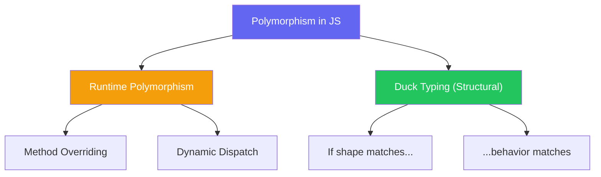

import { Tabs, TabItem, Aside, Badge, Card, CardGrid, Code, LinkCard } from '@astrojs/starlight/components';

## 🎭 Polymorphism in JavaScript — The "Duck Typing" Reality

> **Polymorphism** means "many forms." In Java, this is strictly enforced by class hierarchies and interfaces.  
> In **JavaScript**, polymorphism is achieved through **Duck Typing** and **Prototypal Inheritance**.  
> *"If it walks like a duck and quacks like a duck, it's a duck."*



<Aside type="tip" title="🎯 MUST KNOW">
**JS vs Java Polymorphism**:  
✅ **No Compile-Time Polymorphism**: JS has no method overloading (same name, different params). Last definition wins.  
✅ **Duck Typing**: Objects are compatible if they have the same methods/properties, not because they share a parent class.  
✅ **Dynamic Dispatch**: Methods are resolved at runtime via the Prototype Chain.  
✅ **No Interfaces**: Use structural compatibility or TypeScript for contracts.  
</Aside>

---

## 1️⃣ Runtime Polymorphism — Method Overriding

> Just like Java, JS subclasses can override parent methods. The JVM (or JS Engine) decides which method to call at runtime based on the actual object.

<Code lang="js" title="Method Overriding in ES6 Classes" code={`
class Animal {
    speak() {
        return "Some sound";
    }
}

class Dog extends Animal {
    speak() {
        return "Woof!";
    }
}

class Cat extends Animal {
    speak() {
        return "Meow!";
    }
}

// Polymorphism in action
const animals = [new Dog(), new Cat(), new Animal()];

animals.forEach(animal => {
    console.log(animal.speak()); 
    // Output:
    // "Woof!"
    // "Meow!"
    // "Some sound"
});
`} />

### 🔬 How It Works: The Prototype Chain

In Java, the vtable handles dispatch. In JS, the engine looks up the **Prototype Chain**.

1.  `dog.speak()` is called.
2.  Engine checks `Dog` instance. No `speak`?
3.  Engine checks `Dog.prototype`. Found `speak`! Execute it.
4.  If not found, it continues up to `Animal.prototype`, then `Object.prototype`.

<Aside type="note">
**Performance Note**: Modern JS engines (V8, SpiderMonkey) use **Inline Caches** to optimize this lookup, making it nearly as fast as Java's vtable dispatch after warm-up.
</Aside>

---

## 2️⃣ Duck Typing — Structural Polymorphism

> This is JS's superpower. You don't need a common parent class. If two objects have the same method, they are polymorphic with respect to that method.

<Code lang="js" title="Duck Typing Example" code={`
// No common parent class!
class Car {
    start() { console.log("Engine roaring..."); }
}

class Computer {
    start() { console.log("Booting up..."); }
}

class Human {
    start() { console.log("Waking up..."); }
}

// Polymorphic function — doesn't care about type, only behavior
function initiate(entity) {
    if (typeof entity.start === 'function') {
        entity.start();
    } else {
        throw new Error("Entity cannot start");
    }
}

initiate(new Car());     // ✅ "Engine roaring..."
initiate(new Computer());// ✅ "Booting up..."
initiate(new Human());   // ✅ "Waking up..."
`} />

<Aside type="caution">
**Risk**: Duck typing is runtime-only. If you pass an object without `start()`, it crashes at runtime.  
✅ **Fix**: Use **TypeScript** interfaces or **JSDoc** to enforce structure at compile time.
</Aside>

---

## 🚫 What JS Does NOT Have: Method Overloading

> In Java, you can have `add(int, int)` and `add(double, double)`.  
> In JS, **functions are objects**. If you define two functions with the same name, the second one **overwrites** the first.

<Code lang="js" title="No Method Overloading" code={`
class Calculator {
    add(a, b) {
        return a + b;
    }
    
    // ❌ This OVERWRITES the previous add method
    add(a, b, c) {
        return a + b + c;
    }
}

const calc = new Calculator();
console.log(calc.add(1, 2));      // NaN (c is undefined)
console.log(calc.add(1, 2, 3));   // 6
`} />

### ✅ The JS Way: Variable Arguments & Type Checking

To simulate overloading, JS developers use:
1.  **Optional Parameters**
2.  **Rest Parameters (`...args`)**
3.  **Type Checking inside the method**

<Code lang="js" title="Simulating Overloading" code={`
class Calculator {
    // Single method handles all cases
    add(...args) {
        if (args.length === 2) {
            return args[0] + args[1];
        } else if (args.length === 3) {
            return args[0] + args[1] + args[2];
        } else {
            throw new Error("Invalid number of arguments");
        }
    }
    
    // Or using type checking
    process(input) {
        if (typeof input === 'string') {
            return input.toUpperCase();
        } else if (typeof input === 'number') {
            return input * 2;
        }
    }
}

const calc = new Calculator();
console.log(calc.add(1, 2));    // 3
console.log(calc.add(1, 2, 3)); // 6
console.log(calc.process("hi"));// "HI"
console.log(calc.process(5));   // 10
`} />

---

## 🆚 Overloading vs Overriding in JS

| Feature | Java | JavaScript |
|---------|------|------------|
| **Overloading** | ✅ Supported (Compile-time) | ❌ Not supported (Last definition wins) |
| **Overriding** | ✅ Supported (Runtime) | ✅ Supported (Runtime) |
| **Resolution** | Compiler (Static) / JVM (Dynamic) | JS Engine (Runtime) |
| **Type Safety** | Strict | Loose (Duck Typing) |
| **Annotations** | `@Override` | None (Use TS `override`) |

---

## 🔄 Polymorphism with Interfaces (TypeScript)

While vanilla JS uses Duck Typing, **TypeScript** brings back strict interface-based polymorphism, similar to Java.

<Code lang="ts" title="TypeScript Interface Polymorphism" code={`
interface Flyable {
    fly(): void;
}

class Bird implements Flyable {
    fly() { console.log("Flapping wings"); }
}

class Plane implements Flyable {
    fly() { console.log("Engines on"); }
}

function makeItFly(entity: Flyable) {
    entity.fly();
}

makeItFly(new Bird());  // ✅
makeItFly(new Plane()); // ✅
// makeItFly(new Car()); // ❌ Compile Error: Car does not implement Flyable
`} />

---

## ⚠️ Common Polymorphism Pitfalls

<CardGrid>
  <Card title="Pitfall 1: Assuming Overloading Exists" icon="error">
```js
    class MathUtils {
        square(x) { return x * x; }
        square(x, y) { return x * y; } // Overwrites square(x)!
    }
    
    // Fix: Use different names or optional params
    class MathUtils {
        square(x) { return x * x; }
        multiply(x, y) { return x * y; }
    }
```
  </Card>
  
  <Card title="Pitfall 2: Forgetting to Check for Methods" icon="shield">
```js
    function execute(obj) {
        obj.run(); // 💥 Crash if obj doesn't have run()
    }
    
    // Fix: Duck Check
    function execute(obj) {
        if (typeof obj.run === 'function') {
            obj.run();
        }
    }
```
  </Card>
</CardGrid>

---

## 🎯 Interview Cheat Sheet

<CardGrid>
  <Card title="Q: Does JS support method overloading?" icon="error">
    **No.** JS functions are objects. Defining a function with the same name twice overwrites the first one. Use optional parameters or rest args (`...args`) instead.
  </Card>
  
  <Card title="Q: What is Duck Typing?" icon="approve-check">
    A principle where an object's suitability is determined by the presence of certain methods/properties, rather than its inheritance from a specific class. *"If it quacks like a duck..."*
  </Card>

  <Card title="Q: How is polymorphism achieved in JS?" icon="information">
    1. **Inheritance**: `class Child extends Parent` + Method Overriding.  
    2. **Duck Typing**: Different objects implementing the same method names.  
    3. **Prototypes**: Dynamic lookup of methods at runtime.
  </Card>

  <Card title="Q: Can you override static methods?" icon="caution">
    Yes, but it's called **Method Hiding**. Static methods belong to the class, not the instance. They are resolved based on the reference type (class), not the instance type.
  </Card>
</CardGrid>

---

## 🧩 DSA & Practical Patterns

<CardGrid>
  <Card title="Pattern: Strategy Pattern via Duck Typing" icon="rocket">
```js
    // Strategies don't need a common base class
    const quickSort = (arr) => { /* ... */ };
    const mergeSort = (arr) => { /* ... */ };

    class DataProcessor {
        constructor(sortStrategy) {
            this.sort = sortStrategy; // Inject any function/object
        }
        
        process(data) {
            this.sort(data); // Polymorphic call
        }
    }

    const p1 = new DataProcessor(quickSort);
    const p2 = new DataProcessor(mergeSort);
```
  </Card>
  
  <Card title="Pattern: Plugin Architecture" icon="shield">
```js
    // Plugins just need to implement 'execute'
    class PluginManager {
        register(plugin) {
            if (typeof plugin.execute !== 'function') {
                throw new Error("Invalid Plugin");
            }
            this.plugins.push(plugin);
        }
        
        runAll() {
            this.plugins.forEach(p => p.execute());
        }
    }
```
  </Card>
</CardGrid>

---

## 🔑 Quick Reference Summary

### Polymorphism Mechanisms

| Mechanism | Description | Example |
|-----------|-------------|---------|
| **Method Overriding** | Subclass redefines parent method | `dog.speak()` vs `cat.speak()` |
| **Duck Typing** | Compatibility by shape | `car.start()` vs `pc.start()` |
| **Dynamic Dispatch** | Runtime method resolution | Engine looks up prototype chain |

### Best Practices

1. ✅ **Prefer Composition/Duck Typing** over deep inheritance hierarchies.
2. ✅ **Check for method existence** (`typeof obj.method === 'function'`) before calling.
3. ✅ **Use TypeScript** if you need strict interface-based polymorphism.
4. ✅ **Avoid "Overloading"** by using optional parameters or distinct method names.

<Aside type="caution">
**Final Checklist**:
1. ✅ Remember: JS has **no compile-time overloading**.
2. ✅ Use **Duck Typing** for flexible, decoupled code.
3. ✅ Use **`super.method()`** to call parent versions in overrides.
4. ✅ Be careful with **`this` context** when passing methods as callbacks.
</Aside>

---

## 🧪 Test Your Understanding

<Code lang="js" title="Predict the output" code={`
class A {
    show() { return "A"; }
}
class B extends A {
    show() { return "B"; }
}

const obj = new B();
console.log(obj.show()); // ?

// Q2: Overloading simulation
class Calc {
    add(a, b) { return a + b; }
    add(a, b, c) { return a + b + c; }
}
const c = new Calc();
console.log(c.add(1, 2)); // ?
`} />

<details>
<summary>✅ Click to reveal answers</summary>

```text
Q1: "B"
    // Runtime polymorphism: obj is instance of B, so B's show() is called.

Q2: NaN
    // The second 'add' overwrote the first. 
    // c.add(1, 2) calls add(a, b, c) where c is undefined.
    // 1 + 2 + undefined = NaN.
```
</details>

---

## 🔗 Related Topics

<CardGrid columns={2}>
  <LinkCard
    title="JavaScript Inheritance"
    href="/computer-languages/javascript/oop/inheritance"
    description="extends, super, prototype chain"
  />
  <LinkCard
    title="JavaScript Duck Typing"
    href="/computer-languages/javascript/oop/duck-typing"
    description="Structural compatibility, dynamic behavior"
  />
  <LinkCard
    title="TypeScript Interfaces"
    href="/computer-languages/typescript/topics/interfaces"
    description="Strict contracts, compile-time polymorphism"
  />
  <LinkCard
    title="JavaScript Design Patterns"
    href="/computer-languages/javascript/patterns/strategy"
    description="Strategy, Observer, and Factory patterns"
  />
</CardGrid>

<Aside type="note">
🎯 **Production Pro Tips**  
1. Use **TypeScript** for large teams to enforce polymorphic contracts.  
2. In vanilla JS, document expected "interfaces" using **JSDoc**.  
3. Prefer **composition** (mixins) over deep inheritance for sharing behavior.  
4. Always handle missing methods gracefully to avoid runtime crashes. 🛡️
</Aside>

> 💡 **Final Wisdom**: JavaScript polymorphism is less about rigid structures and more about **behavioral compatibility**. Embrace Duck Typing for flexibility, but use tools like TypeScript when you need the safety of Java-style contracts. 🚀✨

*Converted for Astro 6 + Starlight • Optimized for interview prep + production use • Quality >>>> Quantity* 🎯
```

---

## 🔄 Java Polymorphism → JS Polymorphism Conversion Summary

| Java Feature | JavaScript Equivalent | Critical Difference |
|-------------|----------------------|-------------------|
| **Compile-Time Polymorphism** (Overloading) | ❌ Not Supported | JS overwrites functions with same name. Use optional args. |
| **Runtime Polymorphism** (Overriding) | ✅ Method Overriding | Works similarly via Prototype Chain. |
| **Interface Polymorphism** | ✅ Duck Typing | No `implements` needed. Shape matters, not lineage. |
| **Abstract Classes** | ✅ Base Classes | Throw errors in unimplemented methods. |
| **vtable Dispatch** | ✅ Prototype Lookup | JS engines use Inline Caches for optimization. |
| **Covariant Return Types** | ✅ Dynamic Returns | No type checking, so any return is valid. |
| **`instanceof` Check** | ✅ `instanceof` / `typeof` | Used to verify capabilities before calling. |

---

🧠 **Interview Power Move**: When asked about polymorphism, always mention:  
1. **Duck Typing** is the primary form of polymorphism in JS.  
2. **No Overloading**: Explain how to simulate it with rest parameters.  
3. **Prototype Chain**: How JS resolves method calls at runtime.  
4. **Flexibility vs Safety**: Trade-off between JS dynamic nature and Java's strictness.  

---

# 🎭 JavaScript Polymorphism

---

## 🔰 What Is Polymorphism?

Polymorphism = **one interface, many implementations** — the same method name or operation behaves differently depending on the object it's called on.

```js
// SAME call — DIFFERENT behavior per object type:
const shapes = [new Circle(5), new Rectangle(4, 6), new Triangle(3, 4, 5)];

shapes.forEach(shape => {
  console.log(shape.area()); // same call — 3 different results
});
// 78.53...   ← Circle's area()
// 24         ← Rectangle's area()
// 6          ← Triangle's area()
```

---

## 🗺️ Complete Map

```
Polymorphism in JavaScript
│
├── 🔵 Subtype Polymorphism (OOP)
│   ├── method overriding via extends
│   ├── runtime dispatch
│   └── Liskov Substitution Principle
│
├── 🟢 Duck Typing Polymorphism
│   ├── structural compatibility
│   ├── no inheritance required
│   └── interface by shape
│
├── 🟡 Ad-hoc Polymorphism
│   ├── function overloading simulation
│   ├── operator overloading (Symbol.toPrimitive)
│   └── method overloading patterns
│
├── 🟣 Parametric Polymorphism
│   ├── generic functions
│   ├── higher-order functions
│   └── data structure agnostic algorithms
│
├── 🔶 Coercion Polymorphism
│   ├── implicit type coercion
│   └── Symbol protocols
│
├── 🔴 Prototype Polymorphism
│   ├── prototype chain override
│   └── Object.create based
│
├── ⚙️  Runtime Dispatch Internals
│   ├── V8 inline cache (IC) types
│   ├── monomorphic vs polymorphic vs megamorphic
│   └── hidden class transitions
│
└── 🎯 Design Patterns
    ├── Strategy
    ├── Command
    ├── Visitor
    └── Template Method
```

---

## ⚙️ Deep Dive — How V8 Dispatches Polymorphic Calls

```
┌──────────────────────────────────────────────────────────┐
│         V8 INLINE CACHE — THE ENGINE OF POLYMORPHISM     │
│                                                          │
│  shape.area() called — how V8 resolves it:               │
│                                                          │
│  Call 1 (Circle):                                        │
│  → No cache → walk prototype chain → find Circle.area    │
│  → Cache: { shape = Circle → area at offset 4 }          │
│  → State: MONOMORPHIC (1 type seen)                      │
│                                                          │
│  Call 2 (Circle):                                        │
│  → Cache HIT → O(1) dispatch ✅                          │
│                                                          │
│  Call 3 (Rectangle):                                     │
│  → Cache MISS (new shape type)                           │
│  → Walk chain → find Rectangle.area                      │
│  → Cache: { Circle → offset 4, Rectangle → offset 6 }   │
│  → State: POLYMORPHIC (2-4 types) — slightly slower      │
│                                                          │
│  Call N (5+ different types):                            │
│  → State: MEGAMORPHIC → global cache → slowest           │
│  → TurboFan gives up on specialization                   │
│                                                          │
│  Implication: 2-4 shapes in hot loop = acceptable        │
│               5+ shapes = performance cliff              │
└──────────────────────────────────────────────────────────┘
```

---

## 1️⃣ Subtype Polymorphism — Override + Runtime Dispatch

### The Classic Form

```js
class Shape {
  constructor(color = "black") {
    if (new.target === Shape) throw new TypeError("Shape is abstract");
    this.color = color;
  }

  // Abstract — each subclass MUST provide:
  area()      { throw new Error(`${this.constructor.name}.area() not implemented`); }
  perimeter() { throw new Error(`${this.constructor.name}.perimeter() not implemented`); }

  // Concrete — uses polymorphic area() internally:
  describe() {
    return `${this.constructor.name}: area=${this.area().toFixed(2)}, ` +
           `perimeter=${this.perimeter().toFixed(2)}, color=${this.color}`;
  }

  // Polymorphic comparison:
  isLargerThan(other) {
    return this.area() > other.area(); // runtime dispatch on BOTH objects
  }
}

class Circle extends Shape {
  #r;
  constructor(r, color)    { super(color); this.#r = r; }
  area()      { return Math.PI * this.#r ** 2; }
  perimeter() { return 2 * Math.PI * this.#r; }
}

class Rectangle extends Shape {
  #w; #h;
  constructor(w, h, color) { super(color); this.#w = w; this.#h = h; }
  area()      { return this.#w * this.#h; }
  perimeter() { return 2 * (this.#w + this.#h); }
}

class Triangle extends Shape {
  #a; #b; #c;
  constructor(a, b, c, color) {
    super(color);
    this.#a = a; this.#b = b; this.#c = c;
  }
  perimeter() { return this.#a + this.#b + this.#c; }
  area() {
    const s = this.perimeter() / 2;
    return Math.sqrt(s * (s-this.#a) * (s-this.#b) * (s-this.#c)); // Heron's
  }
}

class RegularPolygon extends Shape {
  #sides; #sideLen;
  constructor(sides, sideLen, color) {
    super(color);
    this.#sides   = sides;
    this.#sideLen = sideLen;
  }
  perimeter() { return this.#sides * this.#sideLen; }
  area() {
    return (this.#sides * this.#sideLen ** 2) /
           (4 * Math.tan(Math.PI / this.#sides));
  }
}

// Polymorphic usage — same code works for all Shape subtypes:
const shapes = [
  new Circle(5),
  new Rectangle(4, 6),
  new Triangle(3, 4, 5),
  new RegularPolygon(6, 4)
];

// Same method call — different dispatch per object:
shapes.forEach(s => console.log(s.describe()));

// Polymorphic sort:
shapes.sort((a, b) => a.area() - b.area());

// Polymorphic reduce:
const totalArea = shapes.reduce((sum, s) => sum + s.area(), 0);

// Polymorphic filter:
const large = shapes.filter(s => s.area() > 20);
```

### Runtime Dispatch Mechanism

```
┌──────────────────────────────────────────────────────────┐
│         RUNTIME DISPATCH — HOW JS DECIDES                │
│                                                          │
│  shape.area()                                            │
│        │                                                 │
│        ▼                                                 │
│  What is shape's actual type at runtime?                 │
│        │                                                 │
│  ┌─────▼──────────────────────────────────────────┐      │
│  │ Circle?    → Circle.prototype.area()           │      │
│  │ Rectangle? → Rectangle.prototype.area()        │      │
│  │ Triangle?  → Triangle.prototype.area()         │      │
│  │ Polygon?   → RegularPolygon.prototype.area()   │      │
│  └────────────────────────────────────────────────┘      │
│                                                          │
│  Caller NEVER changes — only the dispatch target         │
│  This IS runtime polymorphism / dynamic dispatch         │
└──────────────────────────────────────────────────────────┘
```

---

## 2️⃣ Duck Typing Polymorphism — No Inheritance Required

### Shape by Behavior, Not Ancestry

```js
// No class hierarchy needed — any object with .render() works:
function renderAll(renderables) {
  return renderables.map(item => {
    // Duck-type check:
    if (typeof item.render !== "function") {
      throw new TypeError(`${item.constructor?.name ?? "Object"} must implement render()`);
    }
    return item.render();
  });
}

// Different object types — no shared parent:
class Button {
  constructor(label) { this.label = label; }
  render() { return `<button>${this.label}</button>`; }
}

class Image {
  constructor(src, alt) { this.src = src; this.alt = alt; }
  render() { return ``; }
}

// Plain object — no class at all:
const divider = {
  render() { return `<hr class="divider">`; }
};

// Arrow function factory:
const createText = content => ({
  render: () => `<p>${content}</p>`
});

// All work — because they have .render():
renderAll([
  new Button("Click me"),
  new Image("/logo.png", "Logo"),
  divider,
  createText("Hello World")
]);
// ["<button>Click me</button>", "", "<hr...>", "<p>Hello World</p>"]
```

### Formal Duck-Type Protocol

```js
// Define the expected "interface" as a contract:
function ensureRenderable(obj) {
  const required = ["render", "mount", "unmount"];
  const missing  = required.filter(m => typeof obj[m] !== "function");
  if (missing.length) {
    throw new TypeError(
      `${obj.constructor?.name ?? "Object"} missing: [${missing.join(", ")}]`
    );
  }
  return obj;
}

// Real-world: any logger with .log() is polymorphic:
function createApp({ logger }) {
  ensureRenderable(logger);
  return {
    start() {
      logger.log("App started"); // polymorphic — works for any logger
    }
  };
}

createApp({ logger: console });                    // ✅ console has .log()
createApp({ logger: new FileLogger("app.log") });  // ✅
createApp({ logger: new RemoteLogger(endpoint) }); // ✅
createApp({ logger: { log: msg => void 0 } });     // ✅ even plain object
```

---

## 3️⃣ Ad-hoc Polymorphism — Overloading Simulation

### Method Overloading via Argument Inspection

```js
// JS has NO method overloading — simulate via argument type/count:
class Vector {
  #x; #y; #z;

  constructor(x, y, z = 0) {
    this.#x = x; this.#y = y; this.#z = z;
  }

  // Polymorphic add — different behavior per argument type:
  add(other) {
    if (typeof other === "number") {
      // Scalar addition:
      return new Vector(this.#x + other, this.#y + other, this.#z + other);
    }

    if (other instanceof Vector) {
      // Vector addition:
      return new Vector(
        this.#x + other.#x,
        this.#y + other.#y,
        this.#z + other.#z
      );
    }

    if (Array.isArray(other) && other.length >= 2) {
      // Array addition:
      return new Vector(
        this.#x + other[0],
        this.#y + other[1],
        this.#z + (other[2] ?? 0)
      );
    }

    if (other && typeof other === "object" && "x" in other) {
      // Plain object with x,y properties:
      return new Vector(
        this.#x + other.x,
        this.#y + other.y,
        this.#z + (other.z ?? 0)
      );
    }

    throw new TypeError(`Cannot add ${typeof other} to Vector`);
  }

  // Polymorphic scale:
  scale(factor) {
    if (typeof factor === "number") {
      return new Vector(this.#x * factor, this.#y * factor, this.#z * factor);
    }
    if (factor instanceof Vector) {
      // Component-wise scale:
      return new Vector(this.#x * factor.#x, this.#y * factor.#y, this.#z * factor.#z);
    }
    throw new TypeError(`Cannot scale by ${typeof factor}`);
  }

  get x() { return this.#x; }
  get y() { return this.#y; }
  get z() { return this.#z; }
  toString() { return `Vector(${this.#x}, ${this.#y}, ${this.#z})`; }
}

const v = new Vector(1, 2, 3);
v.add(5);                     // Vector(6, 7, 8)    — scalar
v.add(new Vector(1, 1, 1));   // Vector(2, 3, 4)    — vector
v.add([1, 0, 0]);             // Vector(2, 2, 3)    — array
v.add({ x: 0, y: 1, z: 0 }); // Vector(1, 3, 3)    — plain object
```

### Operator Overloading via Symbol Protocols

```js
// Override coercion operators via Symbol.toPrimitive:
class Fraction {
  #num; #den;

  constructor(numerator, denominator) {
    if (denominator === 0) throw new RangeError("Denominator cannot be 0");
    const g       = Fraction.#gcd(Math.abs(numerator), Math.abs(denominator));
    const sign    = denominator < 0 ? -1 : 1;
    this.#num     = sign * numerator / g;
    this.#den     = sign * denominator / g;
  }

  static #gcd(a, b) { return b === 0 ? a : Fraction.#gcd(b, a % b); }

  // Arithmetic polymorphism — + triggers Symbol.toPrimitive:
  [Symbol.toPrimitive](hint) {
    switch (hint) {
      case "number":  return this.#num / this.#den;         // 3/4 → 0.75
      case "string":  return `${this.#num}/${this.#den}`;   // 3/4 → "3/4"
      case "default": return this.#num / this.#den;
    }
  }

  // Fraction arithmetic:
  add(other) {
    if (other instanceof Fraction) {
      return new Fraction(
        this.#num * other.#den + other.#num * this.#den,
        this.#den * other.#den
      );
    }
    if (typeof other === "number") {
      return new Fraction(this.#num + other * this.#den, this.#den);
    }
    throw new TypeError("Cannot add non-Fraction/number");
  }

  multiply(other) {
    if (other instanceof Fraction) {
      return new Fraction(this.#num * other.#num, this.#den * other.#den);
    }
    if (typeof other === "number") return new Fraction(this.#num * other, this.#den);
    throw new TypeError("Cannot multiply non-Fraction/number");
  }

  get valueOf() { return () => this.#num / this.#den; }
}

const half    = new Fraction(1, 2);
const quarter = new Fraction(1, 4);

`${half}`;          // "1/2"
+half;              // 0.5
half + 0.25;        // 0.75   — Symbol.toPrimitive("default") → 0.5 + 0.25
half > quarter;     // true   — comparison uses number hint
half.add(quarter);  // Fraction(3/4)
```

---

## 4️⃣ Parametric Polymorphism — Generic Operations

### Type-Agnostic Algorithms

```js
// Functions that work on ANY type — parametric:

// Generic sort (works on numbers, strings, dates, objects):
function sortBy(arr, keyFn = x => x, direction = "asc") {
  const cmp = direction === "asc" ? 1 : -1;
  return [...arr].sort((a, b) => {
    const ka = keyFn(a), kb = keyFn(b);
    if (ka < kb) return -cmp;
    if (ka > kb) return  cmp;
    return 0;
  });
}

sortBy([3, 1, 4, 1, 5]);                          // [1, 1, 3, 4, 5]
sortBy(["banana", "apple", "cherry"]);             // ["apple", "banana", "cherry"]
sortBy(users, u => u.age);                         // sort users by age
sortBy(orders, o => o.total, "desc");              // orders by total descending
sortBy(dates, d => d.getTime());                   // sort Date objects

// Generic groupBy:
function groupBy(arr, keyFn) {
  return arr.reduce((groups, item) => {
    const key = keyFn(item);
    (groups[key] ??= []).push(item);
    return groups;
  }, {});
}

groupBy([1,2,3,4,5,6], n => n % 2 === 0 ? "even" : "odd");
// { odd: [1,3,5], even: [2,4,6] }
groupBy(users, u => u.role);
// { admin: [...], user: [...], guest: [...] }

// Generic pipeline:
const pipeline = (...fns) => x => fns.reduce((v, f) => f(v), x);

// Works on any type:
const processNumber = pipeline(
  x => x * 2,
  x => x + 1,
  x => x.toString()
);

const processString = pipeline(
  s => s.trim(),
  s => s.toLowerCase(),
  s => s.replace(/\s+/g, "-")
);

processNumber(5);        // "11"
processString(" Hello World "); // "hello-world"
```

### Higher-Order Polymorphism

```js
// Functor pattern — map works on any "container":
class Maybe {
  #value;
  #hasValue;

  constructor(value) {
    this.#hasValue = value !== null && value !== undefined;
    this.#value    = this.#hasValue ? value : null;
  }

  static of(value)    { return new Maybe(value); }
  static empty()      { return new Maybe(null); }

  isNothing()  { return !this.#hasValue; }
  get value()  { return this.#value; }

  // Polymorphic map — applies fn only if value exists:
  map(fn) {
    return this.isNothing() ? Maybe.empty() : Maybe.of(fn(this.#value));
  }

  // Polymorphic flatMap:
  flatMap(fn) {
    return this.isNothing() ? Maybe.empty() : fn(this.#value);
  }

  getOrElse(defaultValue) {
    return this.isNothing() ? defaultValue : this.#value;
  }

  toString() {
    return this.isNothing() ? "Maybe.Nothing" : `Maybe.Just(${this.#value})`;
  }
}

class Result {
  #value; #error; #isOk;

  static ok(value)  { const r = new Result(); r.#isOk = true;  r.#value = value; return r; }
  static err(error) { const r = new Result(); r.#isOk = false; r.#error = error; return r; }

  isOk()  { return this.#isOk; }
  isErr() { return !this.#isOk; }

  // SAME interface as Maybe — parametric polymorphism:
  map(fn) {
    return this.#isOk
      ? Result.ok(fn(this.#value))
      : this; // error propagates
  }

  flatMap(fn) {
    return this.#isOk ? fn(this.#value) : this;
  }

  getOrElse(def) { return this.#isOk ? this.#value : def; }
}

// SAME pipeline code works on BOTH types:
function processInput(container) {
  return container                          // Maybe or Result — doesn't matter
    .map(s => s.trim())
    .map(s => s.toLowerCase())
    .map(s => s.replace(/\s+/g, "-"))
    .getOrElse("invalid");
}

processInput(Maybe.of("  Hello World  "));          // "hello-world"
processInput(Maybe.empty());                         // "invalid"
processInput(Result.ok("  Hello World  "));          // "hello-world"
processInput(Result.err(new Error("no input")));     // "invalid"
```

---

## 5️⃣ Coercion Polymorphism — Symbol Protocols

```js
// Objects participate in JS operations via protocol methods:

class Temperature {
  #celsius;

  constructor(celsius) { this.#celsius = celsius; }

  get fahrenheit() { return this.#celsius * 9/5 + 32; }
  get kelvin()     { return this.#celsius + 273.15; }

  // Numeric operations use number hint:
  [Symbol.toPrimitive](hint) {
    if (hint === "string") return `${this.#celsius}°C`;
    return this.#celsius; // number + default
  }

  // Custom iterator — for...of:
  [Symbol.iterator]() {
    const readings = [this.#celsius, this.fahrenheit, this.kelvin];
    const labels   = ["Celsius", "Fahrenheit", "Kelvin"];
    let i = 0;
    return {
      next() {
        if (i >= readings.length) return { done: true, value: undefined };
        return { done: false, value: { label: labels[i], value: readings[i++] } };
      }
    };
  }

  // instanceof polymorphism:
  static [Symbol.hasInstance](obj) {
    return typeof obj?.[Symbol.toPrimitive] === "function" &&
           "fahrenheit" in obj;
  }

  // toString tag:
  get [Symbol.toStringTag]() { return "Temperature"; }
}

const t = new Temperature(100);
`Boiling: ${t}`;     // "Boiling: 100°C" — string hint
t + 0;               // 100 — number hint
t > 50;              // true — comparison → number
t * 1.8;             // 180

// Iterable:
for (const { label, value } of t) {
  console.log(`${label}: ${value}`);
}
// Celsius: 100
// Fahrenheit: 212
// Kelvin: 373.15

// toString tag:
Object.prototype.toString.call(t); // "[object Temperature]"
```

---

## 6️⃣ Prototype Polymorphism — Chain-based Override

```js
// Without classes — prototype chain provides polymorphism:
const baseAnimal = {
  toString() { return `${this.species}(${this.name})`; },
  describe()  { return `I am ${this.species} named ${this.name}`; },
  speak()     { throw new Error(`${this.species} doesn't speak`); }
};

const dogProto = Object.create(baseAnimal);
dogProto.species = "Dog";
dogProto.speak   = function() { return `${this.name}: Woof!`; };
dogProto.fetch   = function() { return `${this.name} fetches!`; };

const catProto = Object.create(baseAnimal);
catProto.species = "Cat";
catProto.speak   = function() { return `${this.name}: Meow!`; };
catProto.purr    = function() { return `${this.name} purrs...`; };

function createDog(name) {
  const dog = Object.create(dogProto);
  dog.name  = name;
  return dog;
}

function createCat(name) {
  const cat = Object.create(catProto);
  cat.name  = name;
  return cat;
}

const animals = [createDog("Rex"), createCat("Whiskers"), createDog("Buddy")];

// Polymorphic — same call, prototype resolves to different speak():
animals.forEach(a => console.log(a.speak()));
// "Rex: Woof!"
// "Whiskers: Meow!"
// "Buddy: Woof!"
```

---

## 7️⃣ Design Pattern Polymorphism

### Strategy Pattern — Interchangeable Algorithms

```js
class Sorter {
  #strategy;

  constructor(strategy) { this.#strategy = strategy; }

  set strategy(s) {
    if (typeof s.sort !== "function") {
      throw new TypeError("Strategy must implement sort()");
    }
    this.#strategy = s;
  }

  // Polymorphic — delegates to whatever strategy is set:
  sort(arr) { return this.#strategy.sort([...arr]); }
}

// Different sort strategies — all have .sort():
const BubbleSort = {
  sort(arr) {
    const a = [...arr];
    for (let i = 0; i < a.length; i++)
      for (let j = 0; j < a.length - i - 1; j++)
        if (a[j] > a[j+1]) [a[j], a[j+1]] = [a[j+1], a[j]];
    return a;
  }
};

const QuickSort = {
  sort(arr) {
    if (arr.length <= 1) return arr;
    const pivot  = arr[Math.floor(arr.length / 2)];
    const left   = arr.filter(x => x < pivot);
    const mid    = arr.filter(x => x === pivot);
    const right  = arr.filter(x => x > pivot);
    return [...this.sort(left), ...mid, ...this.sort(right)];
  }
};

const RadixSort = {
  sort(arr) {
    const max  = Math.max(...arr);
    let exp    = 1;
    let result = [...arr];
    while (Math.floor(max / exp) > 0) {
      result = this.#countSort(result, exp);
      exp   *= 10;
    }
    return result;
  },
  #countSort(arr, exp) {
    const output = new Array(arr.length);
    const count  = new Array(10).fill(0);
    arr.forEach(n => count[Math.floor(n / exp) % 10]++);
    for (let i = 1; i < 10; i++) count[i] += count[i-1];
    for (let i = arr.length - 1; i >= 0; i--) {
      const idx = Math.floor(arr[i] / exp) % 10;
      output[--count[idx]] = arr[i];
    }
    return output;
  }
};

const sorter = new Sorter(QuickSort);
sorter.sort([3, 1, 4, 1, 5, 9]);       // [1, 1, 3, 4, 5, 9]

sorter.strategy = RadixSort;            // swap at runtime — polymorphism ✅
sorter.sort([3, 1, 4, 1, 5, 9]);       // same result, different algorithm
```

### Visitor Pattern — Polymorphic Operations on Types

```js
// Visitor — add operations to a class hierarchy without modifying them:

class NumberExpr {
  constructor(value) { this.value = value; }
  accept(visitor)    { return visitor.visitNumber(this); } // dispatch
}

class AddExpr {
  constructor(left, right) { this.left = left; this.right = right; }
  accept(visitor)          { return visitor.visitAdd(this); }
}

class MulExpr {
  constructor(left, right) { this.left = left; this.right = right; }
  accept(visitor)          { return visitor.visitMul(this); }
}

class NegExpr {
  constructor(expr) { this.expr = expr; }
  accept(visitor)   { return visitor.visitNeg(this); }
}

// Visitors — each implements full set of operations:
const Evaluator = {
  visitNumber({ value })      { return value; },
  visitAdd({ left, right })   { return left.accept(this) + right.accept(this); },
  visitMul({ left, right })   { return left.accept(this) * right.accept(this); },
  visitNeg({ expr })          { return -expr.accept(this); },
};

const Printer = {
  visitNumber({ value })     { return String(value); },
  visitAdd({ left, right })  {
    return `(${left.accept(this)} + ${right.accept(this)})`;
  },
  visitMul({ left, right })  {
    return `(${left.accept(this)} * ${right.accept(this)})`;
  },
  visitNeg({ expr })         { return `(-${expr.accept(this)})`; },
};

const Optimizer = {
  visitNumber(n)             { return n; },
  visitAdd({ left, right }) {
    const l = left.accept(this);
    const r = right.accept(this);
    // Constant folding:
    if (l instanceof NumberExpr && r instanceof NumberExpr) {
      return new NumberExpr(l.value + r.value);
    }
    return new AddExpr(l, r);
  },
  visitMul({ left, right }) {
    const l = left.accept(this);
    const r = right.accept(this);
    if (l instanceof NumberExpr && r instanceof NumberExpr) {
      return new NumberExpr(l.value * r.value);
    }
    // x * 1 = x optimization:
    if (r instanceof NumberExpr && r.value === 1) return l;
    // x * 0 = 0 optimization:
    if (r instanceof NumberExpr && r.value === 0) return new NumberExpr(0);
    return new MulExpr(l, r);
  },
  visitNeg({ expr }) {
    const e = expr.accept(this);
    if (e instanceof NegExpr) return e.expr; // --x = x
    return new NegExpr(e);
  }
};

// Expression: (2 + 3) * -(4)
const expr = new MulExpr(
  new AddExpr(new NumberExpr(2), new NumberExpr(3)),
  new NegExpr(new NumberExpr(4))
);

expr.accept(Evaluator);   // -20
expr.accept(Printer);     // "((2 + 3) * (-4))"
expr.accept(Optimizer).accept(Printer); // "(-20)" ← folded
```

### Command Pattern — Polymorphic Actions

```js
// All commands share same interface:
class CommandHistory {
  #stack  = [];
  #future = [];

  execute(command) {
    const result   = command.execute();   // polymorphic dispatch
    this.#stack.push(command);
    this.#future   = [];                  // clear redo stack
    return result;
  }

  undo() {
    const cmd = this.#stack.pop();
    if (!cmd) throw new Error("Nothing to undo");
    const result = cmd.undo();            // polymorphic dispatch
    this.#future.push(cmd);
    return result;
  }

  redo() {
    const cmd = this.#future.pop();
    if (!cmd) throw new Error("Nothing to redo");
    const result = cmd.execute();
    this.#stack.push(cmd);
    return result;
  }
}

// Each command has SAME interface — different behavior:
class CreateNodeCommand {
  #graph; #node; #created;

  constructor(graph, nodeData)  { this.#graph = graph; this.#node = nodeData; }
  execute() { return (this.#created = this.#graph.addNode(this.#node)); }
  undo()    { return this.#graph.removeNode(this.#created.id); }
}

class MoveNodeCommand {
  #graph; #nodeId; #from; #to;

  constructor(graph, nodeId, toPos) {
    this.#graph  = graph;
    this.#nodeId = nodeId;
    this.#to     = toPos;
  }
  execute() {
    this.#from = this.#graph.getNode(this.#nodeId).position;
    return this.#graph.moveNode(this.#nodeId, this.#to);
  }
  undo() { return this.#graph.moveNode(this.#nodeId, this.#from); }
}

class DeleteEdgeCommand {
  #graph; #edge; #deleted;

  constructor(graph, edgeId) { this.#graph = graph; this.#edge = edgeId; }
  execute() { this.#deleted = this.#graph.getEdge(this.#edge); return this.#graph.removeEdge(this.#edge); }
  undo()    { return this.#graph.addEdge(this.#deleted); }
}

// All polymorphically interchangeable:
const history = new CommandHistory();
history.execute(new CreateNodeCommand(graph, { id: 1, label: "A" }));
history.execute(new MoveNodeCommand(graph, 1, { x: 100, y: 200 }));
history.undo();  // polymorphic undo — calls MoveNodeCommand.undo()
history.undo();  // polymorphic undo — calls CreateNodeCommand.undo()
history.redo();  // polymorphic redo
```

---

## 🏭 Real Production Patterns

### Pattern 1 — Payment Processor Polymorphism

```js
// All processors implement same interface — polymorphic dispatch:
class PaymentProcessor {
  constructor() {
    if (new.target === PaymentProcessor) throw new TypeError("Abstract");
    const required = ["charge", "refund", "verify"];
    for (const m of required) {
      if (typeof this[m] !== "function" || this[m] === PaymentProcessor.prototype[m]) {
        throw new TypeError(`${new.target.name}.${m}() not implemented`);
      }
    }
  }

  charge(amount, currency, token) { throw new Error("Not implemented"); }
  refund(transactionId, amount)   { throw new Error("Not implemented"); }
  verify(transactionId)           { throw new Error("Not implemented"); }

  // Concrete — same for all processors:
  async chargeWithRetry(amount, currency, token, maxRetries = 3) {
    for (let i = 0; i < maxRetries; i++) {
      try {
        return await this.charge(amount, currency, token); // polymorphic
      } catch (err) {
        if (i === maxRetries - 1) throw err;
        if (!err.retryable) throw err;
        await new Promise(r => setTimeout(r, 1000 * (i + 1)));
      }
    }
  }
}

class StripeProcessor extends PaymentProcessor {
  #client;
  constructor(secretKey) { super(); this.#client = new Stripe(secretKey); }

  async charge(amount, currency, token) {
    const charge = await this.#client.charges.create({ amount, currency, source: token });
    return { id: charge.id, status: charge.status, provider: "stripe" };
  }

  async refund(transactionId, amount) {
    const refund = await this.#client.refunds.create({ charge: transactionId, amount });
    return { id: refund.id, status: refund.status };
  }

  async verify(transactionId) {
    const charge = await this.#client.charges.retrieve(transactionId);
    return charge.status === "succeeded";
  }
}

class PayPalProcessor extends PaymentProcessor {
  #client;
  constructor(clientId, secret) { super(); this.#client = createPayPalClient(clientId, secret); }

  async charge(amount, currency, token) {
    const order = await this.#client.orders.capture(token);
    return { id: order.id, status: order.status, provider: "paypal" };
  }

  async refund(transactionId, amount) {
    return this.#client.captures.refund(transactionId, { amount: { value: amount } });
  }

  async verify(transactionId) {
    const order = await this.#client.orders.get(transactionId);
    return order.status === "COMPLETED";
  }
}

class MockProcessor extends PaymentProcessor {
  #transactions = new Map();

  async charge(amount, currency, token) {
    if (token === "fail") throw Object.assign(new Error("Declined"), { retryable: false });
    const id = `mock_${Date.now()}`;
    this.#transactions.set(id, { amount, currency, status: "succeeded" });
    return { id, status: "succeeded", provider: "mock" };
  }

  async refund(transactionId, amount) {
    const tx = this.#transactions.get(transactionId);
    if (!tx) throw new Error("Transaction not found");
    tx.status = "refunded";
    return { id: `ref_${transactionId}`, status: "succeeded" };
  }

  async verify(transactionId) { return this.#transactions.has(transactionId); }
}

// Service uses ANY processor — true polymorphism:
class CheckoutService {
  #processor;

  constructor(processor) {
    if (!(processor instanceof PaymentProcessor)) {
      throw new TypeError("processor must extend PaymentProcessor");
    }
    this.#processor = processor;
  }

  async checkout(cart, paymentToken) {
    const total = cart.items.reduce((s, i) => s + i.price * i.qty, 0);

    const payment = await this.#processor.chargeWithRetry(
      total, "USD", paymentToken  // polymorphic — processor decides HOW
    );

    return { orderId: `ord_${Date.now()}`, payment };
  }
}

// Swap processors without changing CheckoutService:
const prodCheckout = new CheckoutService(new StripeProcessor(process.env.STRIPE_KEY));
const testCheckout = new CheckoutService(new MockProcessor()); // for tests
```

### Pattern 2 — Polymorphic Notification System

```js
class NotificationChannel {
  constructor() {
    if (new.target === NotificationChannel) throw new TypeError("Abstract");
  }

  async send(recipient, template, data) {
    throw new Error("Not implemented");
  }

  // Concrete — template rendering (shared):
  renderTemplate(template, data) {
    return template.replace(/\{\{(\w+)\}\}/g, (_, key) => data[key] ?? "");
  }
}

class EmailChannel extends NotificationChannel {
  #mailer;
  constructor(mailer) { super(); this.#mailer = mailer; }

  async send(recipient, template, data) {
    await this.#mailer.sendMail({
      to:      recipient.email,
      subject: this.renderTemplate(template.subject, data),
      html:    this.renderTemplate(template.body, data),
    });
  }
}

class SMSChannel extends NotificationChannel {
  #client;
  constructor(client) { super(); this.#client = client; }

  async send(recipient, template, data) {
    await this.#client.messages.create({
      to:   recipient.phone,
      body: this.renderTemplate(template.sms ?? template.body, data).slice(0, 160),
    });
  }
}

class PushChannel extends NotificationChannel {
  #firebase;
  constructor(firebase) { super(); this.#firebase = firebase; }

  async send(recipient, template, data) {
    await this.#firebase.send({
      token:        recipient.fcmToken,
      notification: {
        title: this.renderTemplate(template.subject, data),
        body:  this.renderTemplate(template.push ?? template.body, data).slice(0, 100),
      },
      data
    });
  }
}

class SlackChannel extends NotificationChannel {
  #webhook;
  constructor(webhook) { super(); this.#webhook = webhook; }

  async send(recipient, template, data) {
    await fetch(this.#webhook, {
      method: "POST",
      body: JSON.stringify({
        channel: recipient.slackId,
        text:    this.renderTemplate(template.body, data),
      }),
    });
  }
}

// Orchestrator — polymorphic dispatch across channels:
class NotificationService {
  #channels = new Map();
  #fallback;

  register(type, channel) {
    if (!(channel instanceof NotificationChannel)) {
      throw new TypeError("channel must extend NotificationChannel");
    }
    this.#channels.set(type, channel);
    return this;
  }

  setFallback(channel) {
    this.#fallback = channel;
    return this;
  }

  async notify(recipient, template, data, preferredChannels = ["email"]) {
    const results = [];

    for (const type of preferredChannels) {
      const channel = this.#channels.get(type);
      if (!channel) continue;

      try {
        await channel.send(recipient, template, data); // polymorphic ✅
        results.push({ type, status: "sent" });
      } catch (err) {
        results.push({ type, status: "failed", error: err.message });
        // Try fallback:
        if (this.#fallback) {
          await this.#fallback.send(recipient, template, data);
          results.push({ type: "fallback", status: "sent" });
        }
      }
    }

    return results;
  }
}

const notifier = new NotificationService()
  .register("email",  new EmailChannel(mailer))
  .register("sms",    new SMSChannel(twilioClient))
  .register("push",   new PushChannel(firebaseApp))
  .register("slack",  new SlackChannel(slackWebhook))
  .setFallback(new EmailChannel(backupMailer));

// Polymorphic — same notify() call dispatches correctly per channel:
await notifier.notify(
  user,
  { subject: "Welcome {{name}}!", body: "Hello {{name}}, welcome to {{app}}!" },
  { name: user.name, app: "MyApp" },
  ["push", "email"]
);
```

---

## 💀 Interview Traps

### Trap 1: Method resolution — own property shadows prototype

```js
class Animal {
  speak() { return "..."; }
}

class Dog extends Animal {
  speak() { return "Woof"; }  // overrides prototype method
}

const dog = new Dog();
dog.speak();  // "Woof" ✅ — Dog.prototype.speak

// Add OWN property — shadows prototype:
dog.speak = () => "Bark!";
dog.speak();  // "Bark!" — own property wins over prototype 😱

// Prototype method still accessible:
Dog.prototype.speak.call(dog);  // "Woof" ✅

// Real prod trap — accidentally assigning method as own property:
dog.speak = dog.speak.bind(dog); // 😱 replaces prototype method with own property
                                  // prototype override in subclasses won't affect this instance
```

---

### Trap 2: Polymorphism breaks with type checking instead of duck typing

```js
// WRONG — type-switches destroy polymorphism:
function processShape(shape) {
  if (shape instanceof Circle) {
    return Math.PI * shape.radius ** 2;      // 😱 duplicates Circle.area()
  }
  if (shape instanceof Rectangle) {
    return shape.width * shape.height;       // 😱 duplicates Rectangle.area()
  }
  // Must update EVERY TIME a new shape is added 😱
}

// RIGHT — polymorphic dispatch:
function processShape(shape) {
  return shape.area(); // ✅ adding new shapes requires ZERO changes here
}

// The "open/closed" principle: open for extension, closed for modification
// Type-switches violate it — polymorphism respects it
```

---

### Trap 3: V8 megamorphic call site — performance cliff at 5+ types

```js
// This hot function sees 5+ different shapes:
function computeArea(shape) {
  return shape.area(); // called millions of times
}

// 5+ different types → MEGAMORPHIC → no inline cache specialization:
const shapes = [
  new Circle(1), new Rectangle(1,1), new Triangle(1,1,1),
  new Polygon(5,1), new Ellipse(1,2), new Star(5,1) // 6 types 😱
];

// V8 gives up optimizing computeArea — generic slow path

// Fix for perf-critical code — keep call sites MONOMORPHIC:
function computeAreaCircle(c) { return c.area(); }    // monomorphic
function computeAreaRect(r)   { return r.area(); }    // monomorphic
// Or: limit polymorphism to 2-4 types per call site

// Alternatively: use a switch that V8 can specialize:
function computeArea(shape) {
  switch (shape.constructor) {
    case Circle:    return Math.PI * shape.radius ** 2; // V8 specializes ✅
    case Rectangle: return shape.width * shape.height;
    default:        return shape.area(); // fallback
  }
}
```

---

### Trap 4: `super.method()` in extracted function — `[[HomeObject]]` lost

```js
class Parent {
  greet() { return "Parent"; }
}

class Child extends Parent {
  greet() { return `Child of ${super.greet()}`; }
}

const c = new Child();
c.greet(); // "Child of Parent" ✅

// Extract method — [[HomeObject]] stays with Child.prototype:
const fn = c.greet;
fn.call(c); // ❌ TypeError — super lookup fails
             // fn.[[HomeObject]] = Child.prototype ✅
             // but fn is called as standalone — chain traversal fails

// Extract from prototype — same problem:
const proto = Child.prototype;
const greet = proto.greet;
greet.call(new Child()); // ❌ TypeError

// Fix: use arrow in a wrapper:
const safe = (...args) => c.greet(...args); // ✅ — normal method call preserved
```

---

### Trap 5: Polymorphism through mutation vs substitution

```js
// Mutating shared prototype breaks ALL instances:
class Animal {
  speak() { return "..."; }
}
class Dog extends Animal { }

const d1 = new Dog();
const d2 = new Dog();

// "Override" via prototype mutation:
Dog.prototype.speak = () => "Woof"; // mutates prototype 😱
d1.speak(); // "Woof" — d1 affected
d2.speak(); // "Woof" — d2 affected too 😱

// This isn't polymorphism — it's global mutation
// TRUE polymorphism = subclass defines override AT DEFINITION TIME
// not mutation at runtime

// Safe override — subclass definition:
class Husky extends Dog {
  speak() { return "Howl"; } // ✅ only Husky instances affected
}
```

---

### Trap 6: `instanceof` polymorphic dispatch — fragile across realms

```js
// Type-switch via instanceof:
function serialize(value) {
  if (value instanceof Date)   return value.toISOString();
  if (value instanceof RegExp) return value.source;
  if (value instanceof Map)    return Object.fromEntries(value);
  return JSON.stringify(value);
}

// Breaks with vm / cross-realm objects:
const vm = require("vm");
const vmDate = vm.runInNewContext("new Date()");

serialize(vmDate); // falls to JSON.stringify 😱 — not Date in this realm

// Fix — use structural check instead:
function serialize(value) {
  if (value && typeof value.toISOString === "function") return value.toISOString();
  if (value instanceof RegExp) return value.source;
  if (value && typeof value[Symbol.iterator] === "function" &&
      typeof value.get === "function") return Object.fromEntries(value);
  return JSON.stringify(value);
}
```

---

## 📊 Polymorphism Type Comparison

```
┌──────────────────────────────────────────────────────────┐
│           POLYMORPHISM TYPES — REFERENCE                 │
├────────────────────┬──────────┬──────────┬───────────────┤
│ Type               │ Resolves │ Requires │ JS Mechanism  │
├────────────────────┼──────────┼──────────┼───────────────┤
│ Subtype            │ Runtime  │ extends  │ Prototype chain│
│ Duck typing        │ Runtime  │ Nothing  │ Property check│
│ Ad-hoc (overload)  │ Runtime  │ Nothing  │ typeof/args   │
│ Parametric         │ Any      │ Nothing  │ HOF / generics│
│ Coercion           │ Runtime  │ Symbol.* │ Type coercion │
│ Prototype          │ Runtime  │ proto    │ Chain lookup  │
└────────────────────┴──────────┴──────────┴───────────────┘
```

---

## 📊 DSA / Internals Connection

> Polymorphism is the runtime realization of the **open/closed principle** in SOLID — objects are open for extension (new subclasses) but the calling code is closed for modification. In CS theory, this is **dynamic dispatch** — binding a method name to an implementation at runtime rather than compile time.
>
> V8 implements dynamic dispatch with **Inline Caches (ICs)**. The IC state machine has four states: **uninitialized** (first call) → **monomorphic** (one type seen, fastest) → **polymorphic** (2–4 types, fast) → **megamorphic** (5+ types, generic, slow). This is the same optimization problem as **branch prediction** in CPUs — the engine bets on the most common type and pays a penalty when wrong. Keeping call sites monomorphic (one type) or polymorphic (few types) is a real production performance concern for hot loops.
>
> The Visitor pattern implements **double dispatch** — the method resolution depends on TWO objects' types (the visitor and the visited). JS has no built-in double dispatch, so the pattern uses `accept(visitor)` on the visited object to call `visitor.visitXxx(this)` — turning two runtime type lookups into two separate single dispatches. This is equivalent to a **2D dispatch table** in C++ virtual dispatch.

---
