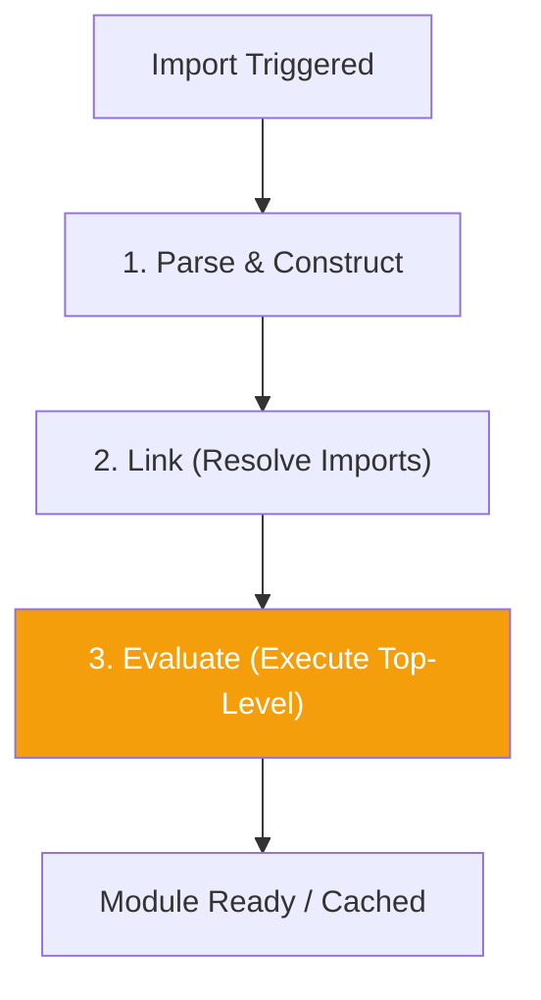

import { Tabs, TabItem, Aside, Badge, Card, CardGrid, Code, LinkCard } from '@astrojs/starlight/components';

## ⚡ JavaScript Module Initialization

> In Java, static blocks run when a class is loaded.  
> In **JavaScript (ES Modules)**, code runs **once** when the module is first imported. This is the **Module Evaluation Phase**.

<Aside type="tip">
**🧠 Mental Model**: Think of an ES Module as a **singleton script**.  
1. **Parse**: The engine reads the file.  
2. **Link**: It resolves all `import` statements (building a dependency graph).  
3. **Evaluate**: It executes the top-level code **once**, from top to bottom.  
4. **Cache**: The exports are cached. Future imports get the same live bindings.  
⚠️ Unlike Java, JS has **Hoisting** for `function` declarations, but **TDZ** (Temporal Dead Zone) for `let/const`.
</Aside>

---

## 🔬 The Three Phases (ESM Lifecycle)



| Phase | Action | Java Equivalent |
|-------|--------|-----------------|
| **Parse** | Syntax check, create AST. | Compilation |
| **Link** | Resolve `import` paths. Connect live bindings. | Class Loading / Verification |
| **Evaluate** | Execute top-level code (vars, functions, logs). | `<clinit>` / Static Blocks |

### 📜 Execution Order Rules

1.  **Imports First**: All `import` statements are processed before any code runs.
2.  **Top-to-Bottom**: Code executes linearly.
3.  **Hoisting**: `function` declarations are hoisted (available everywhere). `let/const` are hoisted but uninitialized (TDZ).
4.  **Single Execution**: The module body runs only **once**, no matter how many times it's imported.

---

## 💻 Real-World Code — The "Order" Trap

In Java, accessing a variable before its line gives a default value (or error). In JS, it depends on *how* you declare it.

<Code lang="js" title="moduleA.js — Watch the TDZ!" code={`
console.log('Module A Start');

// 1. Function Hoisting ✅
// Functions are fully hoisted. Can be called before definition.
console.log(getConfig()); // Works! Returns 'default'

function getConfig() {
    return 'default';
}

// 2. Let/Const TDZ ❌
// Variables are hoisted but NOT initialized.
// console.log(myVar); // 💥 ReferenceError: Cannot access 'myVar' before initialization

let myVar = 'initialized';
console.log(myVar); // 'initialized'

// 3. Side Effects Run Immediately
console.log('Module A End');

export const VALUE = myVar;
`} />

<Code lang="js" title="main.js — The Trigger" code={`
import { VALUE } from './moduleA.js';

console.log('Main App Running');
console.log('Imported Value:', VALUE);
`} />

**Output:**
```text
Module A Start
default          ← Function hoisting works
Module A End
Main App Running
Imported Value: initialized
```

<Aside type="danger">
**🚨 Production Bug**: Assuming `let` variables behave like Java static fields.  
In Java: `static int x = getY(); static int y = 10;` → `x` gets `0` (default).  
In JS: `let x = getY(); let y = 10; function getY() { return y; }` → 💥 **ReferenceError** because `y` is in the Temporal Dead Zone.
</Aside>

---

## 🛑 Hoisting vs. Temporal Dead Zone (TDZ)

Java prevents forward references at compile time. JS handles them at runtime via Hoisting and TDZ.

<CardGrid>
  <Card title="❌ TDZ Error (Let/Const)" icon="error">
    ```js
    console.log(x); // 💥 ReferenceError
    let x = 10;
    ```
    **Why**: `x` exists in memory but is uninitialized until the line `let x = 10` runs.
  </Card>
  
  <Card title="✅ Function Hoisting" icon="approve-check">
    ```js
    console.log(add(2, 3)); // ✅ 5
    function add(a, b) {
        return a + b;
    }
    ```
    **Why**: Function declarations are fully hoisted. The engine knows the body before execution starts.
  </Card>

  <Card title="⚠️ Var Hoisting (Legacy)" icon="caution">
    ```js
    console.log(y); // undefined (Not error!)
    var y = 10;
    ```
    **Why**: `var` is hoisted and initialized to `undefined`. Avoid `var` in modern JS.
  </Card>
</CardGrid>

---

## 🔁 Circular Dependencies — The Silent Killer

Java throws `ExceptionInInitializerError` or uses default values for circular static deps.  
JS **allows** circular imports, but values might be `undefined` if accessed too early.

<Code lang="js" title="circularA.js" code={`
import { valB } from './circularB.js';

console.log('A: valB is', valB); // ⚠️ undefined (B hasn't finished eval)

export const valA = 'A';
`} />

<Code lang="js" title="circularB.js" code={`
import { valA } from './circularA.js';

console.log('B: valA is', valA); // ✅ 'A' (A has finished eval)

export const valB = 'B';
`} />

**Output (if A is entry point):**
```text
A: valB is undefined  ← B is still loading
B: valA is A          ← A is already loaded
```

<Aside type="note">
**Why?**: ES Modules use **Live Bindings**.  
1. Engine starts loading A.  
2. A imports B. Engine pauses A, starts loading B.  
3. B imports A. Engine sees A is "loading" (not done). B gets a reference to A's exports object (currently empty/partial).  
4. B finishes. A resumes.  
**Fix**: Avoid circular deps. Use dependency injection or refactor shared logic into a third module.
</Aside>

---

## 🔧 Import Triggers — When Does Code Run?

| Trigger | Module Evaluated? | Why? |
|---------|-------------------|------|
| `import X from './mod.js'` | ✅ Yes | Must execute to get exports. |
| `import('./mod.js')` (Dynamic) | ✅ Yes (Lazy) | Executes when promise resolves. |
| `<script type="module" src="...">` | ✅ Yes | Browser loads and evaluates. |
| Unused Import | ✅ Yes | Side effects still run! |
| JSON Import (`assert { type: 'json' }`) | ❌ No Code | Parsed as data, no JS execution. |

### 🪤 Trap: Side Effects in Imports

<Code lang="js" title="sideEffect.js" code={`
// This code runs immediately upon import!
console.log('I run once!');
database.connect(); // ⚠️ Dangerous if imported multiple places
`} />

<Code lang="js" title="app.js" code={`
import './sideEffect.js'; // Logs: "I run once!"
import './sideEffect.js'; // Nothing logged (Cached)
`} />

<Aside type="tip">
**Best Practice**: Keep top-level code minimal. Move initialization (DB connections, listeners) into explicit `init()` functions that the caller invokes.
</Aside>

---

## 🔩 Internals — How Engines Handle It

1.  **Registry**: The engine maintains a **Module Map** (URL → Module Record).
2.  **State Machine**:
    *   `uninstantiated` → `instantiating` → `instantiated` → `evaluating` → `evaluated`.
3.  **Live Bindings**: Exports are not copies. They are references. If Module A updates an exported variable, Module B sees the change instantly.

```js
// counter.js
export let count = 0;
export function increment() { count++; }

// main.js
import { count, increment } from './counter.js';

console.log(count); // 0
increment();
console.log(count); // 1 ✅ Live binding updated
```

---

## 🏭 SDE/SRE Relevance & Patterns

<CardGrid>
  <Card title="Pattern 1: Singleton Configuration" icon="rocket">
    ```js
    // config.js
    // Top-level code runs once. Perfect for singletons.
    const API_KEY = process.env.API_KEY;
    
    export const getConfig = () => ({
        apiKey: API_KEY,
        timeout: 5000
    });
    ```
  </Card>
  
  <Card title="Pattern 2: Lazy Initialization" icon="shield">
    ```js
    // db.js
    let connection = null;

    export async function getConnection() {
        if (!connection) {
            // Initialize only when first needed
            connection = await createDbConnection();
        }
        return connection;
    }
    // Avoids running heavy init during module load.
    ```
  </Card>

  <Card title="Anti-Pattern: Top-Level Await Risks" icon="error">
    ```js
    // data.js
    // ⚠️ Blocks the entire module graph evaluation!
    const data = await fetch('/api/data');
    export default data;
    
    // Any module importing 'data.js' waits for this fetch.
    // Can cause waterfall delays in app startup.
    ```
  </Card>

  <Card title="Anti-Pattern: Circular Dependency" icon="caution">
    ```js
    // A imports B, B imports A.
    // Result: One of them sees 'undefined' exports.
    // Fix: Extract shared interface/logic to C.js.
    // A -> C, B -> C.
    ```
  </Card>
</CardGrid>

---

## 🎯 Interview Cheat Sheet

<CardGrid>
  <Card title="Execution Order" icon="information">
    ```text
    Q: When does ES Module code run?
    A: Once, when first imported. Before the importing module's code continues.
    
    Q: Do imports run in parallel?
    A: Fetching is parallel. Evaluation is sequential (dependency order).
    ```
  </Card>
  
  <Card title="Hoisting & TDZ" icon="shield">
    ```text
    Q: Can I use a function before defining it?
    A: Yes, function declarations are hoisted.
    
    Q: Can I use a let variable before defining it?
    A: No, ReferenceError (Temporal Dead Zone).
    ```
  </Card>

  <Card title="Circular Deps" icon="rocket">
    ```text
    Q: What happens with circular imports?
    A: No error. But one module may see undefined exports if it accesses them before the other module finishes evaluating.
    
    Q: How to fix circular deps?
    A: Refactor shared code into a third module. Use Dependency Injection.
    ```
  </Card>

  <Card title="Common Traps" icon="caution">
    ```text
    Q: Does importing a module twice run it twice?
    A: No. Modules are singletons. Cached after first evaluation.
    
    Q: What is a Live Binding?
    A: Imports refer to the original export value. If the exporter changes it, the importer sees the change.
    ```
  </Card>
</CardGrid>

---

## 🧠 Full Mental Model Summary

```text
JS MODULE FLOW CHECKLIST

1. Trigger:
   import statement encountered.

2. Graph Construction:
   Recursively resolve all imports.

3. Evaluation (Depth-First):
   - Execute dependencies first.
   - Execute current module top-to-bottom.
   - Hoist functions.
   - Let/Const in TDZ until assigned.

4. Caching:
   - Store exports.
   - Return live bindings to importers.

5. Safety:
   - Avoid circular deps.
   - Minimize top-level side effects.
   - Use lazy init for heavy resources.
```

<Aside type="tip">
**Next Steps**:
1. ✅ Avoid logic in top-level scope. Use `init()` functions.
2. ✅ Be careful with `let` vs `function` hoisting.
3. ✅ Use tools (like `madge`) to detect circular dependencies.
4. ✅ Understand that `import` is not just a copy—it's a live reference.

Mastering module flow prevents "undefined is not a function" errors that stem from initialization order. ☕✨
</Aside>
```

---

## 🔄 Java Static Flow → JS Module Flow Conversion Summary

| Java Concept | JavaScript Equivalent | Critical Difference |
|-------------|----------------------|-------------------|
| **Class Loading** | **Module Evaluation** | JS modules are singletons evaluated once. |
| **Static Block** | **Top-Level Code** | Runs immediately upon import. |
| **`<clinit>`** | **Module Record Evaluation** | Handled by the Engine's Module Loader. |
| **Forward Reference** | **TDZ / Hoisting** | JS allows function hoisting; `let` throws TDZ error. |
| **Circular Static Deps** | **Circular Imports** | JS doesn't crash, but exports may be `undefined`. |
| **`static final` Constant** | **JSON Import / Const** | JSON imports don't execute code. |
| **Parent/Child Order** | **Dependency Graph** | Dependencies evaluate before dependents. |

---

🧠 **Interview Power Move**: When asked about initialization, always mention:  
1. **ES Modules are Singletons**: Code runs once, exports are cached.  
2. **Hoisting vs. TDZ**: Functions are safe to call early; `let/const` are not.  
3. **Live Bindings**: Imports are references, not snapshots.  
4. **Circular Deps**: They work but are dangerous (undefined values).  
5. **Side Effects**: Top-level code runs on import—keep it clean!  

---

# ⚡ JavaScript Static Control Flow

---

## 🔰 What Is Static Control Flow?

Static control flow = **the order in which static class members — fields, initialization blocks, and methods — are initialized and executed**, separate from instance creation.

```js
class App {
  static version = "1.0.0";              // 1st — static field
  static #config;                         // 2nd — static private field

  static {                                // 3rd — static init block
    App.#config = loadConfig();
    console.log("App class initialized");
  }

  static getInstance() { return new App(); } // static method — called on demand
}

// App's static block runs ONCE when class is first evaluated
// BEFORE any instance is created
```

---

## 🗺️ Complete Map

```
Static Control Flow in JavaScript
│
├── 📋 Static Field Initialization
│   ├── declaration order
│   ├── static public fields
│   ├── static private fields
│   └── static computed fields
│
├── 🔧 Static Initialization Blocks
│   ├── syntax and rules
│   ├── multiple blocks
│   ├── try/catch in blocks
│   └── access to private fields
│
├── 🔗 Inheritance Static Order
│   ├── parent static → child static
│   ├── super in static blocks
│   └── static field shadowing
│
├── 📦 Module-Level Static Flow
│   ├── top-level evaluation
│   ├── import order
│   └── circular dependency flow
│
├── ⚡ Execution Order Rules
│   ├── field vs block ordering
│   ├── mixed static declarations
│   └── temporal dead zone in statics
│
├── ⚙️  V8 Internals
│   ├── class evaluation pipeline
│   ├── static slot allocation
│   └── one-time initialization guarantee
│
└── 🏗️  Real Patterns
    ├── singleton via static block
    ├── static registry
    ├── config initialization
    └── eager vs lazy static
```

---

## ⚙️ Deep Dive — Class Evaluation Pipeline in V8

```
┌──────────────────────────────────────────────────────────┐
│         CLASS EVALUATION PIPELINE                        │
│                                                          │
│  class Foo extends Bar { ... }                           │
│              │                                           │
│              ▼                                           │
│  Step 1: Evaluate extends expression                     │
│          → resolve Bar (must already exist)              │
│              │                                           │
│              ▼                                           │
│  Step 2: Create Foo constructor function                 │
│          → set up Foo.prototype                          │
│          → set Foo.__proto__ = Bar (static chain)        │
│              │                                           │
│              ▼                                           │
│  Step 3: Define methods on Foo.prototype                 │
│          → instance methods, getters, setters            │
│              │                                           │
│              ▼                                           │
│  Step 4: Execute static elements TOP TO BOTTOM           │
│          → static fields: initialize each               │
│          → static blocks: execute body                  │
│          (interleaved in declaration order)              │
│              │                                           │
│              ▼                                           │
│  Step 5: Return Foo — class is now usable                │
│                                                          │
│  Instance creation (new Foo()) is SEPARATE               │
│  happens AFTER class evaluation is complete              │
└──────────────────────────────────────────────────────────┘
```

---

## 1️⃣ Static Field Initialization Order

### Strict Top-to-Bottom Order

```js
class Config {
  // Static fields initialized in declaration order:
  static ENV      = process.env.NODE_ENV || "development";     // 1st
  static IS_PROD  = Config.ENV === "production";               // 2nd — uses ENV
  static IS_DEV   = Config.ENV === "development";              // 3rd — uses ENV
  static PORT     = Config.IS_PROD ? 443 : 8080;               // 4th — uses IS_PROD
  static BASE_URL = `http${Config.IS_PROD ? "s" : ""}://localhost:${Config.PORT}`; // 5th

  // Static private — same order:
  static #SECRET = process.env.APP_SECRET || "dev-secret";     // 6th
  static HINT    = Config.#SECRET.slice(0, 4) + "****";        // 7th — uses #SECRET
}

console.log(Config.PORT);     // 8080 (dev)
console.log(Config.BASE_URL); // "http://localhost:8080"
console.log(Config.HINT);     // first 4 chars of secret + "****"
```

### Forward Reference — TDZ in Static Fields

```js
class Bad {
  // WRONG — forward reference: B used before declared:
  static A = Bad.B * 2;  // ❌ Bad.B = undefined at this point
  static B = 10;

  // Result: A = undefined * 2 = NaN
}
console.log(Bad.A); // NaN 😱
console.log(Bad.B); // 10

// CORRECT — reference what's already initialized:
class Good {
  static B = 10;
  static A = Good.B * 2; // ✅ B already initialized
}
console.log(Good.A); // 20 ✅
console.log(Good.B); // 10 ✅
```

```
┌──────────────────────────────────────────────────────────┐
│         STATIC FIELD TDZ BEHAVIOR                        │
│                                                          │
│  class Foo {                                             │
│    static A = Foo.B;  ← Foo.B = undefined (not yet set) │
│    static B = 42;                                        │
│  }                                                       │
│                                                          │
│  Timeline:                                               │
│  t=0: Foo object created (empty, no static fields yet)  │
│  t=1: Foo.A = Foo.B   → Foo.B = undefined → A = undefined│
│  t=2: Foo.B = 42      → B is now 42                     │
│  t=3: Class complete  → A=undefined, B=42                │
│                                                          │
│  Unlike let/const TDZ — accessing uninitialized static   │
│  gives undefined, NOT ReferenceError                     │
│  (property doesn't exist yet → undefined)                │
└──────────────────────────────────────────────────────────┘
```

### Static Computed Fields

```js
const prefix = "MAX_";
const limits = { users: 1000, requests: 500, storage: 50 };

class RateLimiter {
  // Computed property names in static fields:
  static [prefix + "USERS"]    = limits.users;     // MAX_USERS = 1000
  static [prefix + "REQUESTS"] = limits.requests;  // MAX_REQUESTS = 500
  static [prefix + "STORAGE"]  = limits.storage;   // MAX_STORAGE = 50

  // Symbol keys:
  static [Symbol.for("version")] = "2.0.0";

  // Computed from another static:
  static TOTAL = RateLimiter[prefix + "USERS"] +
                 RateLimiter[prefix + "REQUESTS"]; // 1500
}

RateLimiter.MAX_USERS;     // 1000 ✅
RateLimiter.MAX_REQUESTS;  // 500  ✅
RateLimiter.TOTAL;         // 1500 ✅
RateLimiter[Symbol.for("version")]; // "2.0.0" ✅
```

---

## 2️⃣ Static Initialization Blocks — ES2022

### Syntax and Basic Rules

```js
class Database {
  static #pool;
  static #config;
  static #ready = false;

  // Static block — arbitrary code at class evaluation time:
  static {
    // Can access private statics:
    Database.#config = {
      host:    process.env.DB_HOST || "localhost",
      port:    parseInt(process.env.DB_PORT, 10) || 5432,
      max:     parseInt(process.env.DB_POOL, 10)  || 10,
    };

    // Complex initialization logic:
    try {
      Database.#pool  = Database.#createPool(Database.#config);
      Database.#ready = true;
      console.log("✅ Database pool initialized");
    } catch (err) {
      console.error("❌ Database init failed:", err.message);
      // Class still created — just pool unavailable
    }
  }

  static #createPool(config) {
    // returns pool object
    return { ...config, connections: [] };
  }

  static get isReady()  { return Database.#ready; }
  static get config()   { return { ...Database.#config }; }

  static query(sql, params) {
    if (!Database.#ready) throw new Error("Database not initialized");
    return Database.#pool.query(sql, params);
  }
}

// By the time you use Database — static block already ran:
Database.isReady;  // true (or false if init failed)
Database.config;   // { host, port, max }
```

### Multiple Static Blocks — Execution Order

```js
class Logger {
  static level    = "info";   // field 1
  static prefix   = "[APP]";  // field 2

  static {                    // block 1 — runs after field 2
    console.log("Block 1: level =", Logger.level);   // "info"
    console.log("Block 1: prefix =", Logger.prefix); // "[APP]"
    Logger.level = "debug"; // mutation
  }

  static format = `${Logger.prefix}:${Logger.level}`; // field 3 — after block 1

  static {                    // block 2 — runs after field 3
    console.log("Block 2: format =", Logger.format); // "[APP]:debug"
    console.log("Block 2: level =",  Logger.level);  // "debug" (mutated)
  }

  static suffix = "v1";       // field 4 — after block 2
}

// Execution order:
// 1. level = "info"
// 2. prefix = "[APP]"
// 3. Block 1 runs → logs, level = "debug"
// 4. format = "[APP]:debug"  ← uses mutated level
// 5. Block 2 runs → logs
// 6. suffix = "v1"
```

```
┌──────────────────────────────────────────────────────────┐
│     STATIC FIELD + BLOCK INTERLEAVED EXECUTION           │
│                                                          │
│  class Foo {                                             │
│    static a = 1;    ─── ① a = 1                         │
│    static {         ─── ② block runs (sees a=1)          │
│      Foo.b = 2;                                          │
│    }                                                     │
│    static c = 3;    ─── ③ c = 3 (after block)           │
│    static {         ─── ④ block runs (sees a=1,b=2,c=3) │
│      Foo.d = 4;                                          │
│    }                                                     │
│  }                                                       │
│                                                          │
│  Final: a=1, b=2, c=3, d=4                               │
│  Order: strictly top-to-bottom                           │
└──────────────────────────────────────────────────────────┘
```

### `try/catch` in Static Blocks

```js
class ExternalService {
  static #endpoint;
  static #apiKey;
  static #available = false;
  static #initError = null;

  static {
    try {
      // Validate required environment:
      if (!process.env.API_ENDPOINT) {
        throw new Error("API_ENDPOINT environment variable required");
      }
      if (!process.env.API_KEY) {
        throw new Error("API_KEY environment variable required");
      }

      ExternalService.#endpoint  = new URL(process.env.API_ENDPOINT);
      ExternalService.#apiKey    = process.env.API_KEY;
      ExternalService.#available = true;

    } catch (err) {
      ExternalService.#initError = err;
      // Do NOT rethrow — allow class to exist in degraded state
      console.warn("ExternalService unavailable:", err.message);
    }
  }

  // Public API reflects init state:
  static get isAvailable() { return ExternalService.#available; }
  static get initError()   { return ExternalService.#initError; }

  static async call(path, body) {
    if (!ExternalService.#available) {
      throw ExternalService.#initError ?? new Error("Service unavailable");
    }
    return fetch(`${ExternalService.#endpoint}${path}`, {
      method:  "POST",
      headers: { "Authorization": `Bearer ${ExternalService.#apiKey}` },
      body:    JSON.stringify(body),
    });
  }
}

// Graceful degradation:
if (ExternalService.isAvailable) {
  await ExternalService.call("/data", { query: "users" });
} else {
  console.log("Using fallback:", ExternalService.initError.message);
}
```

### Static Block — Access to Private from Outside (Privileged Accessor)

```js
// Static block can share private access via closure — powerful pattern:
let getPrivate; // will be set by static block

class Secret {
  #value;

  constructor(value) {
    this.#value = value;
  }

  // Static block sets the accessor from INSIDE the class:
  static {
    getPrivate = (instance) => instance.#value; // ✅ private access
  }
}

const s = new Secret(42);
getPrivate(s); // 42 ✅ — private accessed via privileged closure

// Use case: testing frameworks accessing private state:
// Or: friend class pattern — controlled external private access
```

---

## 3️⃣ Inheritance Static Control Flow

### Parent Static Before Child Static

```
┌──────────────────────────────────────────────────────────┐
│         INHERITANCE STATIC EXECUTION ORDER               │
│                                                          │
│  class Animal { ... }                                    │
│  class Dog extends Animal { ... }                        │
│                                                          │
│  When Dog class is evaluated:                            │
│                                                          │
│  Step 1: Evaluate Animal (if not already done)           │
│          → Animal's static fields                        │
│          → Animal's static blocks                        │
│                                                          │
│  Step 2: Create Dog — set prototype chain                │
│          → Dog.__proto__ = Animal (static chain)         │
│          → Dog.prototype.__proto__ = Animal.prototype    │
│                                                          │
│  Step 3: Dog's static elements (top-to-bottom)           │
│          → Dog's static fields                           │
│          → Dog's static blocks                           │
│                                                          │
│  Animal FULLY initialized BEFORE Dog starts             │
└──────────────────────────────────────────────────────────┘
```

```js
class Animal {
  static kingdom = "Animalia";   // runs 1st

  static {
    console.log("Animal static block"); // runs 2nd
    console.log("Animal.kingdom:", Animal.kingdom); // "Animalia"
  }

  static describe() {
    return `Kingdom: ${this.kingdom}`; // 'this' = calling class
  }
}

class Dog extends Animal {
  static species = "Canis lupus";  // runs 3rd (after Animal complete)

  static {
    console.log("Dog static block"); // runs 4th
    console.log("Animal.kingdom:", Dog.kingdom);  // "Animalia" ✅ inherited
    console.log("Dog.species:", Dog.species);      // "Canis lupus"
  }

  static info() {
    return `${super.describe()} | Species: ${this.species}`;
  }
}

// Output when Dog class is first evaluated:
// "Animal static block"
// "Animal.kingdom: Animalia"
// "Dog static block"
// "Animal.kingdom: Animalia"
// "Dog.species: Canis lupus"

Dog.describe(); // "Kingdom: Animalia"  — 'this' = Dog ✅
Dog.info();     // "Kingdom: Animalia | Species: Canis lupus"
```

### `super` in Static Blocks

```js
class Shape {
  static #registry = new Map();
  static #count    = 0;

  static {
    Shape.#registry.set("Shape", Shape);
    console.log("Shape registered");
  }

  // Expose registry access:
  static getByName(name) { return Shape.#registry.get(name); }
  static get count()     { return Shape.#count; }

  static _register(cls) {
    Shape.#registry.set(cls.name, cls);
    Shape.#count++;
  }
}

class Circle extends Shape {
  static PI = Math.PI;  // own static

  static {
    // Access parent's static method from block:
    Shape._register(Circle);  // register in parent's registry
    console.log("Circle registered");
    // super.method() NOT available in static blocks — use ClassName:
    // super._register(Circle) ❌ — super() in static block ≠ method call
  }
}

class Rectangle extends Shape {
  static {
    Shape._register(Rectangle);
    console.log("Rectangle registered");
  }
}

Shape.count;              // 2
Shape.getByName("Circle"); // Circle class ✅
Shape.getByName("Rectangle"); // Rectangle class ✅
```

### Static Field Shadowing in Subclass

```js
class Base {
  static value = 10;
  static type  = "Base";

  static double() { return this.value * 2; } // 'this' = calling class
}

class Child extends Base {
  // Shadows parent's value — own static:
  static value = 99;
  // type is NOT shadowed — inherited from Base
}

Base.value;     // 10   — own
Child.value;    // 99   — own (shadows parent)

Base.type;      // "Base" — own
Child.type;     // "Base" — inherited (no shadow)

// Polymorphic static method — 'this' = calling class:
Base.double();  // 20  — this.value = Base.value = 10
Child.double(); // 198 — this.value = Child.value = 99 ✅ polymorphic!

// Verify chain:
Object.hasOwn(Child, "value");  // true  — own
Object.hasOwn(Child, "type");   // false — inherited
Child.__proto__ === Base;        // true  — static chain ✅
```

---

## 4️⃣ Module-Level Static Control Flow

### Top-Level Execution as Static Flow

```js
// module-a.mjs — top-level code = "static" execution

// Runs ONCE when module first imported — like a static block:
console.log("module-a: top-level start");

const CONFIG = {                    // ← initialized at module eval time
  host: process.env.HOST || "localhost",
  port: parseInt(process.env.PORT, 10) || 8080
};

function validate(config) {         // ← function hoisted
  if (!config.host) throw new Error("Host required");
}

validate(CONFIG);                   // ← runs at module eval time
console.log("module-a: config validated");

export { CONFIG };
export function getConfig() { return { ...CONFIG }; }

console.log("module-a: top-level end");
```

### Import Evaluation Order — Static Control Flow

```js
// entry.mjs
import "./a.mjs";    // a.mjs runs first
import "./b.mjs";    // b.mjs runs second
import "./c.mjs";    // c.mjs runs third

console.log("entry: runs last");

// Order guarantee:
// 1. a.mjs top-level code
// 2. b.mjs top-level code
// 3. c.mjs top-level code
// 4. entry.mjs remaining code
```

### Dependency Resolution Order

```
┌──────────────────────────────────────────────────────────┐
│         ESM EVALUATION ORDER (STATIC ANALYSIS)           │
│                                                          │
│  entry.mjs imports A and B                              │
│  A imports C                                             │
│  B imports C                                             │
│                                                          │
│  Dependency graph:                                       │
│  entry → A → C                                          │
│  entry → B → C                                          │
│                                                          │
│  Topological sort → evaluation order:                    │
│  1. C (deepest dependency — no imports)                  │
│  2. A (depends on C — C already done)                    │
│  3. B (depends on C — C already done)                    │
│  4. entry                                               │
│                                                          │
│  C evaluated ONCE — even though A and B both import it  │
│  Module cache: first evaluation cached, rest get same   │
└──────────────────────────────────────────────────────────┘
```

```js
// db.mjs — module singleton (static initialization):
import pg from "pg";

console.log("db.mjs: creating pool");
const pool = new pg.Pool({ connectionString: process.env.DB_URL });

pool.on("error", err => console.error("Pool error:", err));

export default pool;

// user-repo.mjs:
import pool from "./db.mjs"; // db.mjs evaluated once

export async function findUser(id) {
  return pool.query("SELECT * FROM users WHERE id=$1", [id]);
}

// order-repo.mjs:
import pool from "./db.mjs"; // SAME pool instance — not re-created ✅

export async function findOrders(userId) {
  return pool.query("SELECT * FROM orders WHERE user_id=$1", [userId]);
}
```

### Top-Level Await — Async Static Control Flow

```js
// config.mjs — async initialization at module level:
console.log("config: start loading");

// Pause the entire module graph until this resolves:
const response = await fetch("https://config.example.com/app");
const CONFIG   = await response.json();

console.log("config: loaded", Object.keys(CONFIG));

export { CONFIG };

// app.mjs — blocked until config.mjs fully resolves:
import { CONFIG } from "./config.mjs";

// By here — CONFIG is fully loaded and available:
console.log("app: using config", CONFIG.version);
```

---

## 5️⃣ Complete Execution Order — Fields + Blocks + Methods

### Full Example with Annotations

```js
console.log("=== Class evaluation starts ===");

class Vehicle {
  // ① Static field — runs first in Vehicle:
  static count = 0;
  static type  = "Vehicle";

  // ② Static block — runs after above fields:
  static {
    console.log("Vehicle static block 1");
    console.log("Vehicle.count:", Vehicle.count); // 0
    Vehicle.count++; // mutate
  }

  // ③ Static field — runs after block above:
  static maxSpeed = Vehicle.count * 100; // 100 (count was mutated to 1)

  // ④ Static block — runs after maxSpeed:
  static {
    console.log("Vehicle static block 2");
    console.log("Vehicle.maxSpeed:", Vehicle.maxSpeed); // 100
  }

  // Instance fields — NOT run yet (only at new Vehicle()):
  make  = "Unknown";
  model = "Unknown";

  constructor(make, model) {
    this.make  = make;
    this.model = model;
    Vehicle.count++;
  }
}

class Car extends Vehicle {
  // ⑤ Car static field — runs AFTER all Vehicle statics complete:
  static category = "Car";
  static doors    = 4;

  // ⑥ Car static block:
  static {
    console.log("Car static block");
    console.log("Vehicle.count:", Car.count);   // 1 (inherited + mutated)
    console.log("Car.category:", Car.category); // "Car"
  }

  // Instance constructor:
  constructor(make, model, doors) {
    super(make, model);
    this.doors = doors;
  }
}

console.log("=== Class evaluation complete ===");
console.log("Creating instances...");
const car = new Car("Toyota", "Camry", 4);
```

```
Output:
=== Class evaluation starts ===
Vehicle static block 1
Vehicle.count: 0
Vehicle static block 2
Vehicle.maxSpeed: 100
Car static block
Vehicle.count: 1
Car.category: Car
=== Class evaluation complete ===
Creating instances...
```

---

## 6️⃣ Static Control Flow — Execution Order Rules

### Complete Rule Set

```
┌──────────────────────────────────────────────────────────┐
│         STATIC CONTROL FLOW RULES                        │
│                                                          │
│  RULE 1: Parent static → Child static                    │
│  Parent class fully initialized before child starts     │
│                                                          │
│  RULE 2: Top-to-bottom within same class                 │
│  Fields and blocks execute in declaration order          │
│                                                          │
│  RULE 3: Field + Block interleaved                       │
│  Not "all fields then all blocks"                        │
│  Each declaration in order: field, field, block, field   │
│                                                          │
│  RULE 4: Uninitialized static = undefined (not TDZ)      │
│  Accessing forward-declared static gives undefined       │
│  NOT ReferenceError (unlike let/const TDZ)               │
│                                                          │
│  RULE 5: Static block runs ONCE per class evaluation     │
│  Re-importing module → same block, not re-run            │
│  Class re-declaration (unusual) → re-runs               │
│                                                          │
│  RULE 6: Instance creation is SEPARATE                   │
│  new Foo() runs AFTER all statics complete               │
│  Instance fields run AFTER super() in constructor        │
│                                                          │
│  RULE 7: Module top-level = implicit static block        │
│  Runs once when module first imported                    │
│  Respects dependency order                               │
└──────────────────────────────────────────────────────────┘
```

### Rules Demonstrated

```js
class Outer {
  // Rule 2 + 3: interleaved order:
  static x = 1;           // ① x = 1
  static {                // ② block (sees x=1)
    Outer.y = Outer.x + 1; // y = 2
  }
  static z = Outer.y + 1; // ③ z = 3 (y set by block above)

  // Rule 4: forward reference = undefined:
  static a = Outer.b;     // ④ a = undefined (b not set yet)
  static b = 42;          // ⑤ b = 42

  // Rule 6: instance field NOT run here:
  instanceField = "hello"; // only runs at new Outer()
}

Outer.x; // 1
Outer.y; // 2
Outer.z; // 3
Outer.a; // undefined 😱 — forward reference
Outer.b; // 42
```

---

## 🏭 Real Production Patterns

### Pattern 1 — Singleton via Static Block

```js
class DatabasePool {
  static #instance = null;
  static #initError = null;
  static #config;

  static {
    // Read config once at class evaluation:
    try {
      DatabasePool.#config = {
        host:     process.env.DB_HOST     || "localhost",
        port:     parseInt(process.env.DB_PORT, 10) || 5432,
        database: process.env.DB_NAME     || "app",
        user:     process.env.DB_USER     || "postgres",
        password: process.env.DB_PASS     || "",
        max:      parseInt(process.env.DB_POOL_MAX, 10) || 10,
        idleTimeoutMillis: 30000,
      };
    } catch (err) {
      DatabasePool.#initError = err;
    }
  }

  // Lazy singleton — created on first call:
  static async getInstance() {
    if (DatabasePool.#initError) throw DatabasePool.#initError;
    if (!DatabasePool.#instance) {
      const { Pool } = await import("pg");
      DatabasePool.#instance = new Pool(DatabasePool.#config);

      // Validate on first acquisition:
      const client = await DatabasePool.#instance.connect();
      await client.query("SELECT 1");
      client.release();

      console.log("✅ DB pool connected");
    }
    return DatabasePool.#instance;
  }

  static async destroy() {
    if (DatabasePool.#instance) {
      await DatabasePool.#instance.end();
      DatabasePool.#instance = null;
    }
  }
}

// Usage — config read at import time, pool created on first use:
const pool = await DatabasePool.getInstance();
```

### Pattern 2 — Plugin Registry with Static Control Flow

```js
class PluginRegistry {
  static #plugins   = new Map();
  static #hooks     = new Map();
  static #initialized = false;

  // Built-in plugins registered at class evaluation:
  static {
    // Register core hooks:
    PluginRegistry.#hooks.set("beforeInit", []);
    PluginRegistry.#hooks.set("afterInit",  []);
    PluginRegistry.#hooks.set("onRequest",  []);
    PluginRegistry.#hooks.set("onResponse", []);
    PluginRegistry.#hooks.set("onError",    []);

    console.log("PluginRegistry: hooks initialized");
  }

  static register(name, plugin) {
    if (PluginRegistry.#initialized) {
      throw new Error("Cannot register plugins after initialization");
    }

    const required = ["init", "destroy"];
    for (const m of required) {
      if (typeof plugin[m] !== "function") {
        throw new TypeError(`Plugin "${name}" must implement ${m}()`);
      }
    }

    PluginRegistry.#plugins.set(name, plugin);
    console.log(`Plugin "${name}" registered`);
    return PluginRegistry;
  }

  static async initialize(app) {
    if (PluginRegistry.#initialized) return;

    await PluginRegistry.#runHook("beforeInit", app);

    for (const [name, plugin] of PluginRegistry.#plugins) {
      try {
        await plugin.init(app);
        console.log(`Plugin "${name}" initialized`);
      } catch (err) {
        throw new Error(`Plugin "${name}" init failed: ${err.message}`);
      }
    }

    await PluginRegistry.#runHook("afterInit", app);
    PluginRegistry.#initialized = true;
  }

  static hook(event, handler) {
    if (!PluginRegistry.#hooks.has(event)) {
      throw new Error(`Unknown hook: ${event}`);
    }
    PluginRegistry.#hooks.get(event).push(handler);
    return PluginRegistry;
  }

  static async #runHook(event, ...args) {
    for (const handler of PluginRegistry.#hooks.get(event) ?? []) {
      await handler(...args);
    }
  }

  static get pluginCount() { return PluginRegistry.#plugins.size; }
  static get isInitialized() { return PluginRegistry.#initialized; }
}

// Registration at module level (static flow):
PluginRegistry
  .register("auth",    AuthPlugin)
  .register("cache",   CachePlugin)
  .register("metrics", MetricsPlugin);

// Used later at runtime:
await PluginRegistry.initialize(app);
```

### Pattern 3 — Feature Flag System via Static Control Flow

```js
class FeatureFlags {
  // Flags loaded at class evaluation time:
  static #flags = new Map();
  static #overrides = new Map();
  static #environment;

  static {
    // Detect environment at startup — NOT at flag check time:
    FeatureFlags.#environment = process.env.NODE_ENV || "development";

    // Parse flags from environment variable:
    const rawFlags = process.env.FEATURE_FLAGS || "";
    for (const flag of rawFlags.split(",").filter(Boolean)) {
      const [name, value] = flag.split("=");
      FeatureFlags.#flags.set(name.trim(), value?.trim() !== "false");
    }

    // Default flags by environment:
    const defaults = {
      development: {
        DEBUG_PANEL:     true,
        VERBOSE_LOGGING: true,
        MOCK_PAYMENTS:   true,
        RATE_LIMITING:   false,
      },
      production: {
        DEBUG_PANEL:     false,
        VERBOSE_LOGGING: false,
        MOCK_PAYMENTS:   false,
        RATE_LIMITING:   true,
      },
    };

    const envDefaults = defaults[FeatureFlags.#environment] ?? {};
    for (const [flag, value] of Object.entries(envDefaults)) {
      if (!FeatureFlags.#flags.has(flag)) {
        FeatureFlags.#flags.set(flag, value);
      }
    }

    console.log(
      `FeatureFlags: loaded ${FeatureFlags.#flags.size} flags for`,
      FeatureFlags.#environment
    );
  }

  static isEnabled(flag) {
    // Check runtime override first:
    if (FeatureFlags.#overrides.has(flag)) {
      return FeatureFlags.#overrides.get(flag);
    }
    return FeatureFlags.#flags.get(flag) ?? false;
  }

  // Runtime override (for A/B testing):
  static override(flag, value) {
    FeatureFlags.#overrides.set(flag, Boolean(value));
  }

  static clearOverrides() { FeatureFlags.#overrides.clear(); }

  static get all() {
    return Object.fromEntries([
      ...FeatureFlags.#flags,
      ...FeatureFlags.#overrides
    ]);
  }
}

// Middleware using flags (static flow ensures flags are ready):
function featureFlagMiddleware(req, res, next) {
  req.isEnabled = (flag) => FeatureFlags.isEnabled(flag); // already initialized ✅
  next();
}

// Usage:
if (FeatureFlags.isEnabled("MOCK_PAYMENTS")) {
  // use mock
} else {
  // use real payment processor
}
```

### Pattern 4 — Class Registry with Inheritance

```js
class BaseModel {
  static #registry = new Map();

  // Subclasses auto-register when defined:
  static {
    // BaseModel itself doesn't register:
    if (new.target !== undefined) {
      // This block runs for BaseModel's evaluation — skip registration
    }
  }

  // Subclass hook — called by each child's static block:
  static _selfRegister() {
    BaseModel.#registry.set(this.name, this);
    console.log(`Registered model: ${this.name}`);
  }

  static getModel(name) {
    const Model = BaseModel.#registry.get(name);
    if (!Model) throw new Error(`Unknown model: ${name}`);
    return Model;
  }

  static get registeredModels() {
    return [...BaseModel.#registry.keys()];
  }
}

class User extends BaseModel {
  static table = "users";

  static {
    User._selfRegister(); // "Registered model: User"
  }

  constructor(data) {
    super();
    Object.assign(this, data);
  }
}

class Order extends BaseModel {
  static table = "orders";

  static {
    Order._selfRegister(); // "Registered model: Order"
  }
}

class Product extends BaseModel {
  static table = "products";

  static {
    Product._selfRegister(); // "Registered model: Product"
  }
}

// Dynamic model instantiation:
BaseModel.registeredModels;  // ["User", "Order", "Product"]
const ModelClass = BaseModel.getModel("User");
new ModelClass({ id: 1, name: "Ali" }); // User instance ✅
```

---

## 💀 Interview Traps

### Trap 1: Static field forward reference — `undefined` not error

```js
class Config {
  static A = Config.B; // A = undefined — B not set yet
  static B = 42;
}

Config.A; // undefined 😱 — NOT ReferenceError
Config.B; // 42

// Compared to let/const TDZ:
{
  console.log(x); // ❌ ReferenceError — let TDZ
  let x = 5;
}

// Static fields: forward reference → undefined
// let/const: forward reference → ReferenceError
// Key difference: static properties are object properties
// They start as undefined (property doesn't exist yet)
// Not as uninitialized bindings (TDZ)
```

---

### Trap 2: `this` in static field initializer — refers to class, not instance

```js
class Counter {
  // 'this' in static field = the class itself:
  static count  = 0;
  static limit  = 100;
  static double = this.limit * 2; // this = Counter ✅ = 200

  // 'this' in instance field = the instance:
  instanceLimit = this.constructor.limit; // this = instance → .constructor = Counter ✅

  increment() {
    if (Counter.count >= Counter.limit) throw new Error("Limit reached");
    Counter.count++;
  }
}

Counter.double; // 200 ✅
new Counter().instanceLimit; // 100 ✅

// Trap — 'this' in static method = class or subclass:
class Sub extends Counter {
  static triple = this.limit * 3; // this = Sub ✅
}
Sub.triple; // 300 ✅ — inherited limit = 100
```

---

### Trap 3: Static block runs once — even across multiple imports

```js
// db.mjs:
let connectionCount = 0;

class DB {
  static connection = null;

  static {
    connectionCount++;
    console.log(`DB static block ran — connections: ${connectionCount}`);
    DB.connection = { id: connectionCount };
  }
}

export default DB;

// a.mjs:
import DB from "./db.mjs"; // "DB static block ran — connections: 1"

// b.mjs:
import DB from "./db.mjs"; // nothing — same module, already evaluated

// c.mjs:
import DB from "./db.mjs"; // nothing

// Entry:
import DB from "./db.mjs";
DB.connection.id; // 1 — SAME instance across all imports ✅
// Static block ran EXACTLY once — module singleton 😱 (good pattern, but must know)
```

---

### Trap 4: Static initialization order with circular class references

```js
class A {
  static value = B.value; // B not defined yet at evaluation time 😱

  static {
    console.log("A.value:", A.value); // undefined 😱
  }
}

class B {
  static value = 42;
}

// ReferenceError: Cannot access 'B' before initialization
// Unlike field forward reference (undefined) — this is a
// FULL ReferenceError because B itself doesn't exist yet
// (it's a let binding in temporal dead zone)

// Fix 1 — define B first:
class B { static value = 42; }
class A { static value = B.value; } // B exists now ✅

// Fix 2 — use static block with lazy reference:
class A {
  static #value;

  static {
    // This block runs at A evaluation, but B runs first
    // if B is defined before A in the file
    A.#value = B.value; // ✅ if B defined first
  }
}
```

---

### Trap 5: Static block vs static method — timing difference

```js
class Service {
  static #initialized = false;
  static #data = null;

  // Static block — runs at CLASS EVALUATION TIME (startup):
  static {
    Service.#data        = { config: "from block", ts: Date.now() };
    Service.#initialized = true;
    console.log("Service initialized at startup");
  }

  // Static method — runs only when CALLED:
  static reinitialize() {
    Service.#data = { config: "from method", ts: Date.now() };
    console.log("Service re-initialized at call time");
  }

  static get data() { return { ...Service.#data }; }
}

// Block already ran by now:
Service.data;        // { config: "from block", ... } ✅

Service.reinitialize(); // runs NOW — not at startup
Service.data;           // { config: "from method", ... }

// Real trap: dev thinks static method = same as static block timing
// Static block = startup, static method = on-demand
```

---

### Trap 6: `super` not callable in static blocks

```js
class Parent {
  static #secret = 42;
  static getSecret() { return Parent.#secret; }
}

class Child extends Parent {
  static {
    // super() in static block = ILLEGAL:
    // super(); ❌ SyntaxError — not a constructor call context

    // super.method() in static block:
    // ALSO not available — super in static context works in METHODS only
    // super.getSecret(); ❌ won't work in a static block

    // Correct — use parent class name directly:
    console.log(Parent.getSecret()); // ✅ 42
  }

  // super.method() DOES work in static METHODS:
  static getParentSecret() {
    return super.getSecret(); // ✅ works in static method
  }
}

Child.getParentSecret(); // 42 ✅
```

---

## 📊 Static vs Instance Control Flow Comparison

```
┌──────────────────────────────────────────────────────────┐
│         STATIC vs INSTANCE CONTROL FLOW                  │
├────────────────────┬──────────────────────────────────────┤
│ Static             │ Instance                             │
├────────────────────┼──────────────────────────────────────┤
│ Runs at class eval │ Runs at new ClassName()              │
│ Runs ONCE          │ Runs per instance                    │
│ Fields on class obj│ Fields on instance object           │
│ Block: top-to-bot  │ super() first → fields → body       │
│ Parent before child│ Parent constructor via super()       │
│ 'this' = class     │ 'this' = new instance               │
│ No super()         │ super() required if extends         │
│ Singleton state    │ Per-instance state                  │
│ Module-level equiv │ Function-level equiv                 │
└────────────────────┴──────────────────────────────────────┘
```

---

## 📊 Full Execution Order — Combined Class

```js
// COMPLETE ORDER REFERENCE:

class Parent {
  // ORDER:
  // A: Parent's static fields + blocks (top-to-bottom)
  static pStatic1 = "PS1";    // A1
  static { console.log("Parent static block 1"); } // A2
  static pStatic2 = "PS2";    // A3
  static { console.log("Parent static block 2"); } // A4

  // NOT YET: instance fields (wait for new Parent())
  pInstance1 = "PI1";         // runs at new Parent() time → B1
  pInstance2 = "PI2";         // → B2

  constructor() {              // → B3
    console.log("Parent constructor");
  }
}

class Child extends Parent {
  // C: Child's static fields + blocks (AFTER all of A):
  static cStatic1 = "CS1";    // C1
  static { console.log("Child static block"); } // C2
  static cStatic2 = "CS2";    // C3

  // NOT YET: instance fields
  cInstance1 = "CI1";         // → D2 (after super())
  cInstance2 = "CI2";         // → D3

  constructor() {
    super();                   // D1 → triggers B1, B2, B3
    // D2: cInstance1 = "CI1"
    // D3: cInstance2 = "CI2"
    console.log("Child constructor"); // D4
  }
}

// Timeline:
// A1 → A2 → A3 → A4    (class Parent evaluated)
// C1 → C2 → C3          (class Child evaluated)
// --- new Child() ---
// D1: super()
//   B1: pInstance1
//   B2: pInstance2
//   B3: Parent constructor
// D2: cInstance1
// D3: cInstance2
// D4: Child constructor body
```

---

## 📊 DSA / Internals Connection

> Static initialization blocks implement the **static constructor** concept from class-based OOP — a one-time setup routine guaranteed to run before any instance is created. In V8, class evaluation is a single **sequential execution** through all static members. V8 allocates a **Class object** (the constructor function itself) and processes each static declaration as a property assignment or function call, in order. This is equivalent to the **class initialization routine** in Java's JVM — `<clinit>` — which runs once per class load.
>
> Module-level top-level execution follows a **topological sort** of the dependency graph — computed at parse time using ES module static analysis. The `import` declarations are **static** (not dynamic) — which is why ES modules can be tree-shaken and why the evaluation order is fully deterministic. This is the same algorithm as **Kahn's algorithm** for topological sort on a DAG — depth-first, leaves evaluated first.

---
