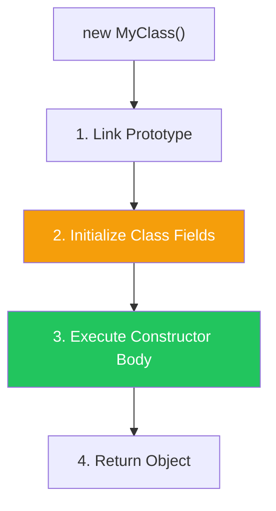

import { Tabs, TabItem, Aside, Badge, Card, CardGrid, Code, LinkCard } from '@astrojs/starlight/components';

## 🏗️ JavaScript Instance Control Flow

> In Java, object creation is a rigid 3-phase process (Defaults → Blocks → Constructor).  
> In **JavaScript (ES6 Classes)**, it's simpler but has its own traps:  
> **Field Initialization → Constructor Execution**.

<Aside type="tip">
**🧠 Mental Model**: Think of a JS Class as a **Factory Function with Sugar**.  
1. **Memory**: `new` allocates an object linked to the Prototype.  
2. **Fields**: Class fields (e.g., `x = 10`) are executed **inside** the constructor, before your code runs.  
3. **Constructor**: Your `constructor()` code runs last.  
⚠️ Unlike Java, there are **no default values** for undefined fields. They are simply `undefined`.
</Aside>

---

## 🔬 The Execution Order (ES6 Classes)



### 📜 The Rules

1.  **Prototype Linking**: The new object's `[[Prototype]]` is set to `MyClass.prototype`.
2.  **Field Initialization**: All public class fields (e.g., `name = 'JS'`) are assigned. This happens **implicitly at the start** of the constructor.
3.  **Constructor Body**: The code inside `constructor()` executes.
4.  **Return**: The object is returned (unless the constructor returns a different object).

<Code lang="js" title="The Order in Action" code={`
class DBConnection {
    // 1. Field Initialization (Runs BEFORE constructor body)
    retries = 3;
    timeout = 5000;

    constructor() {
        // 2. Constructor Body
        console.log('Retries:', this.retries); // 3
        console.log('Timeout:', this.timeout); // 5000
        
        // You can override fields here
        this.timeout = 10000;
    }
}

const db = new DBConnection();
`} />

---

## 💻 Real-World Code — The "Undefined" Trap

In Java, uninitialized ints are `0`. In JS, they are `undefined`.

<Code lang="js" title="moduleA.js — Watch the TDZ!" code={`
class Config {
    // Field initialized to undefined by default if no value provided
    
    constructor(apiKey) {
        // If you access this.url before it's set, it's undefined
        console.log(this.url); // undefined
        
        this.url = 'https://api.example.com';
        this.apiKey = apiKey;
    }
    
    getUrl() {
        return this.url;
    }
}
`} />

<Aside type="danger">
**🚨 Production Bug**: Assuming fields have default values like Java.  
In Java: `int x;` → `0`.  
In JS: `x;` → `undefined`.  
If you do math with `undefined`, you get `NaN`. Always initialize fields explicitly!
</Aside>

---

## 🔁 Inheritance — Parent Before Child

> **Rule**: In JS, you **MUST** call `super()` before accessing `this`. This ensures the Parent is initialized first.

<Code lang="js" title="Inheritance Execution Order" code={`
class Animal {
    type = 'animal'; // Parent Field

    constructor() {
        console.log('Animal Constructor');
        console.log('Type:', this.type);
    }
}

class Dog extends Animal {
    breed = 'Labrador'; // Child Field

    constructor() {
        // ⚠️ MUST call super() first!
        super(); // Initializes Parent (Fields + Constructor)
        
        // Now 'this' is bound. Child Fields are initialized.
        console.log('Dog Constructor');
        console.log('Breed:', this.breed);
    }
}

const dog = new Dog();
`} />

**Output:**
```text
Animal Constructor
Type: animal       ← Parent Field initialized
Dog Constructor
Breed: Labrador    ← Child Field initialized
```

<Aside type="caution">
**Key Insight**:  
1. `new Dog()` starts.  
2. Enters `Dog` constructor.  
3. `super()` calls `Animal` constructor.  
4. `Animal` fields initialize (`type = 'animal'`).  
5. `Animal` constructor body runs.  
6. `super()` returns.  
7. `Dog` fields initialize (`breed = 'Labrador'`).  
8. `Dog` constructor body runs.  
</Aside>

---

## ⚠️ The "Polymorphic" Trap

In Java, calling an overridden method from a constructor is dangerous because child fields aren't ready.  
In JS, it's **even more dangerous** because `this` isn't even bound until `super()` returns.

<CardGrid>
  <Card title="❌ Accessing 'this' before super()" icon="error">
    ```js
    class Child extends Parent {
        constructor() {
            console.log(this); // 💥 ReferenceError!
            super();
        }
    }
    ```
    **Why**: `this` is uninitialized until the parent constructor finishes.
  </Card>
  
  <Card title="⚠️ Overridden Methods in Parent Constructor" icon="caution">
    ```js
    class Parent {
        constructor() {
            this.init(); // Calls Child's init!
        }
        init() { console.log('Parent'); }
    }
    
    class Child extends Parent {
        x = 10; // Child Field
        
        init() {
            // Called from Parent constructor
            // Child fields ARE initialized at this point!
            console.log('Child x:', this.x); // 10
        }
    }
    ```
    **Difference from Java**: In JS, class fields are initialized **before** the child constructor body, but **after** `super()` returns. So if `Parent` calls `this.init()` inside its constructor, `Child` fields **are** ready.
  </Card>
</CardGrid>

<Aside type="note">
**Wait, really?**  
Yes!  
1. `new Child()`  
2. `Child` constructor starts.  
3. `super()` called.  
4. `Parent` constructor runs.  
   - `Parent` calls `this.init()`.  
   - Since `this` refers to the `Child` instance, `Child.init()` runs.  
   - **Crucially**: At this point, `Child` fields have **NOT** been initialized yet?  
   
   **Correction**: In ES6 Classes, fields are initialized **in the derived constructor** after `super()` returns.  
   So if `Parent` constructor calls `this.init()`, and `init` accesses `this.x` (a Child field), `this.x` will be **undefined**!
   
   **Let's verify**:
   ```js
   class Parent {
       constructor() { this.show(); }
       show() { console.log('Parent'); }
   }
   class Child extends Parent {
       x = 10;
       show() { console.log('Child x:', this.x); }
   }
   new Child(); 
   // Output: Child x: undefined 
   ```
   **Why?** Because `Child`'s field initializers run **after** `super()` completes. When `Parent` constructor is running, `Child`'s fields don't exist yet.
</Aside>

---

## 🔀 No Instance Initializer Blocks (IIB)

Java has `{ ... }` blocks. JS does not.  
Instead, JS uses **Class Fields** or logic inside the `constructor`.

<Code lang="js" title="Simulating IIB in JS" code={`
class Service {
    // ❌ No such thing as:
    // { console.log('Block'); }

    // ✅ Use a private method called in constructor
    #init() {
        console.log('Initialization logic');
    }

    constructor() {
        this.#init();
    }
}
`} />

---

## 💣 Interview Traps

<CardGrid>
  <Card title="Trap 1: Arrow Functions in Classes" icon="error">
    ```js
    class Button {
        // Arrow function binds 'this' to the instance immediately
        click = () => {
            console.log(this); // Always correct 'this'
        };
    }
    // Useful for event listeners where context is lost.
    ```
  </Card>
  
  <Card title="Trap 2: Private Fields (#)" icon="shield">
    ```js
    class Bank {
        #balance = 0; // Private field
        
        constructor(amount) {
            this.#balance = amount;
        }
        
        getBalance() {
            return this.#balance;
        }
    }
    // Private fields are truly private. Not accessible via Object.keys().
    ```
  </Card>

  <Card title="Trap 3: Returning Objects from Constructor" icon="caution">
    ```js
    class Weird {
        constructor() {
            this.x = 10;
            return { y: 20 }; // ⚠️ Returns THIS object, ignoring 'this'
        }
    }
    const w = new Weird();
    console.log(w.x); // undefined
    console.log(w.y); // 20
    // Only happens if you return an Object. Primitives are ignored.
    ```
  </Card>
</CardGrid>

---

## 🔩 Internals — How Engines Handle It

1.  **Allocation**: Memory reserved on Heap.
2.  **Prototype Link**: `obj.__proto__` points to `Class.prototype`.
3.  **Constructor Call**: The `[[Construct]]` internal method runs.
    *   Creates `this` binding.
    *   Executes Parent Constructor (if any).
    *   Executes Field Initializers.
    *   Executes Constructor Body.
4.  **Return**: Returns `this` (or explicit object).

---

## 🏭 SDE/SRE Relevance & Patterns

<CardGrid>
  <Card title="Pattern 1: Dependency Injection" icon="rocket">
    ```js
    class UserService {
        constructor(dbClient) {
            this.db = dbClient; // Inject dependency
        }
        
        async getUser(id) {
            return this.db.find(id);
        }
    }
    // Easy to test: new UserService(mockDb)
    ```
  </Card>
  
  <Card title="Pattern 2: Singleton via Static Factory" icon="shield">
    ```js
    class Logger {
        static instance = null;
        
        constructor() {
            if (Logger.instance) return Logger.instance;
            Logger.instance = this;
        }
    }
    // Note: Modules are often better singletons in JS.
    ```
  </Card>

  <Card title="Anti-Pattern: Heavy Logic in Fields" icon="error">
    ```js
    class Bad {
        // ❌ Don't do heavy computation in field initializers
        data = fetchHugeDataset(); 
        
        constructor() {}
    }
    // Makes instantiation slow and hard to error-handle.
    // Use async factory methods instead.
    ```
  </Card>
</CardGrid>

---

## 🎯 Interview Cheat Sheet

<CardGrid>
  <Card title="Execution Order" icon="information">
    ```text
    Q: When are class fields initialized?
    A: Inside the constructor, before the constructor body runs.
    
    Q: What happens if I access 'this' before super()?
    A: ReferenceError. 'this' is not bound yet.
    ```
  </Card>
  
  <Card title="Inheritance" icon="shield">
    ```text
    Q: Do parent fields initialize before child fields?
    A: Yes. Parent Constructor (including its fields) completes before Child fields initialize.
    
    Q: Can I call an overridden method from Parent constructor?
    A: Yes, but Child fields will be undefined. Dangerous!
    ```
  </Card>

  <Card title="Defaults" icon="rocket">
    ```text
    Q: What is the default value of a number field in JS?
    A: undefined. (Unlike Java's 0).
    
    Q: How do I ensure a field is always set?
    A: Initialize it in the field declaration or constructor.
    ```
  </Card>
</CardGrid>

---

## 🧠 Full Mental Model Summary

```text
JS OBJECT INITIALIZATION CHECKLIST

1. Trigger:
   new Class()

2. Prototype Link:
   obj -> Class.prototype

3. Parent Init (if extends):
   Parent Fields -> Parent Constructor

4. Child Init:
   Child Fields -> Child Constructor Body

5. Return:
   Returns 'this' (unless constructor returns object)

⚠️ Key Differences from Java:
- No default values (undefined vs 0/null)
- No Instance Initializer Blocks
- 'this' unbound until super() returns
- Fields init AFTER super() returns
```

<Aside type="tip">
**Next Steps**:
1. ✅ Always call `super()` first in derived constructors.
2. ✅ Initialize fields explicitly to avoid `undefined`.
3. ✅ Avoid calling virtual methods in constructors.
4. ✅ Use Arrow Functions for methods that need stable `this`.

Mastering initialization prevents "Cannot read property of undefined" errors. ☕✨
</Aside>
```

---

## 🔄 Java Instance Flow → JS Object Flow Conversion Summary

| Java Concept | JavaScript Equivalent | Critical Difference |
|-------------|----------------------|-------------------|
| **Instance Initializer Block** | **Class Fields** | JS fields run before constructor body. |
| **Default Values** | **`undefined`** | JS does not default to 0/null. |
| **`super()`** | **`super()`** | Mandatory in JS derived constructors before `this`. |
| **Polymorphism in Constructor** | **Same Risk** | Child fields are `undefined` if accessed via Parent constructor. |
| **`final` Fields** | **`#private` or `const`** | JS has no compile-time final check for fields. |
| **Overloading Constructors** | **Default Params** | JS uses `constructor(x = 10)` instead of multiple constructors. |

---

🧠 **Interview Power Move**: When asked about object creation, always mention:  
1. **`super()` First**: You can't touch `this` until Parent is done.  
2. **Field Timing**: Fields initialize **after** `super()` but **before** constructor body.  
3. **Undefined Defaults**: Never assume a field is 0. Check for `undefined`.  
4. **Arrow Functions**: Use them to preserve `this` context in callbacks.  
5. **No IIB**: Use private methods or fields for initialization logic.  

---

# 🏗️ JavaScript Instance Control Flow

---

## 🔰 What Is Instance Control Flow?

Instance control flow = **the exact sequence of operations that happen when `new ClassName()` is called** — from memory allocation to field initialization to constructor body execution.

```js
class Animal {
  name = "unknown";              // ① instance field
  sound = this.name.toUpperCase(); // ② uses field declared above

  constructor(name) {
    this.name = name;            // ③ constructor body
    console.log(this.sound);     // "UNKNOWN" — field ran BEFORE constructor 😱
  }
}

new Animal("Rex");
// sound = "UNKNOWN" (field ran with default "unknown")
// name  = "Rex"     (constructor overwrote field)
```

---

## 🗺️ Complete Map

```
Instance Control Flow in JavaScript
│
├── 🏭 Object Allocation
│   ├── memory allocation
│   ├── [[Prototype]] assignment
│   └── hidden class setup
│
├── 📋 Instance Field Initialization
│   ├── public instance fields
│   ├── private instance fields (#)
│   ├── field initializer order
│   └── field expressions evaluated at new time
│
├── 🔗 Constructor Execution
│   ├── constructor body
│   ├── implicit constructor
│   └── return value behavior
│
├── 🧬 Inheritance Instance Flow
│   ├── super() — when and why
│   ├── field init order across hierarchy
│   ├── super() before this access
│   └── derived class phases
│
├── ⚡ Combined Order
│   ├── allocation → parent fields → parent constructor
│   ├── → child fields → child constructor body
│   └── complete timeline
│
├── 🪄 new.target
│   ├── what it is
│   ├── abstract class guard
│   └── factory pattern
│
├── 🔧 new Operator Internals
│   ├── what new does step by step
│   ├── return override behavior
│   └── Object.create() equivalent
│
└── ⚙️ V8 Internals
    ├── hidden class transitions
    ├── inline cache warm-up
    └── shape stability
```

---

## ⚙️ Deep Dive — What `new` Does in V8

```
┌──────────────────────────────────────────────────────────┐
│              new Foo(args) — STEP BY STEP                │
│                                                          │
│  Step 1: ALLOCATE                                        │
│  → Create empty object on heap                           │
│  → Set [[Prototype]] = Foo.prototype                     │
│  → Assign initial hidden class (shape)                   │
│                                                          │
│  Step 2: INITIALIZE FIELDS                               │
│  → Run each instance field initializer top-to-bottom     │
│  → Each field = property write → hidden class transition │
│                                                          │
│  Step 3: EXECUTE CONSTRUCTOR                             │
│  → Call Foo constructor with 'this' = new object         │
│  → Any assignments in body = more property writes        │
│                                                          │
│  Step 4: RETURN                                          │
│  → If constructor returns an object → use THAT           │
│  → If constructor returns primitive/undefined → use 'this'│
│                                                          │
│  In a subclass (extends):                                │
│  → 'this' is UNINITIALIZED until super() returns         │
│  → super() triggers parent's Steps 1-4 first            │
│  → THEN child's fields run                              │
│  → THEN child's constructor body continues               │
└──────────────────────────────────────────────────────────┘
```

### Manual `new` Equivalent

```js
// What 'new Foo(x, y)' does internally:
function manualNew(Constructor, ...args) {
  // Step 1 — allocate + set prototype:
  const instance = Object.create(Constructor.prototype);

  // Step 2 — instance fields run implicitly (cannot replicate manually)

  // Step 3 — call constructor:
  const result = Constructor.apply(instance, args);

  // Step 4 — return logic:
  return (result !== null && typeof result === "object") ? result : instance;
}

class Dog {
  type = "canine";
  constructor(name) { this.name = name; }
}

const d1 = new Dog("Rex");
const d2 = manualNew(Dog, "Rex");

// d1.type and d2.type both = "canine" ✅
// (though d2 doesn't get field initialization the same way)
```

---

## 1️⃣ Instance Field Initialization — Order and Timing

### Fields Run Before Constructor Body

```js
class User {
  // Fields initialized TOP-TO-BOTTOM before constructor body:
  role    = "user";                          // ①
  label   = `${this.role.toUpperCase()}`;    // ② — uses role above ✅
  id      = crypto.randomUUID();             // ③
  created = new Date().toISOString();        // ④

  constructor(name, email) {
    // Fields already set when body runs:
    console.log(this.role);    // "user"     ✅
    console.log(this.label);   // "USER"     ✅
    console.log(this.id);      // uuid       ✅

    // Constructor body — AFTER fields:
    this.name  = name;          // ⑤
    this.email = email;         // ⑥
  }
}

const u = new User("Ali", "ali@example.com");
// Order: role → label → id → created → name → email
```

### Field Expression Timing — Evaluated at `new` Time

```js
class Request {
  // Each 'new Request()' gets its OWN value — not shared:
  timestamp = Date.now();          // evaluated at new time ✅
  requestId = crypto.randomUUID(); // unique per instance    ✅
  headers   = new Map();           // separate Map per instance ✅
  tags      = [];                  // separate array per instance ✅

  constructor(url) {
    this.url = url;
  }
}

const r1 = new Request("/api/users");
const r2 = new Request("/api/orders");

r1.timestamp !== r2.timestamp; // true — different times ✅
r1.requestId !== r2.requestId; // true — different UUIDs ✅
r1.headers  !== r2.headers;    // true — different Maps ✅
r1.tags     !== r2.tags;       // true — different arrays ✅
```

### The Shared Reference Anti-Pattern

```js
// WRONG — array/object in class body is SHARED:
// (This is NOT how class fields work — just showing the contrast)

// If you did this in ES5 style on prototype:
function OldClass() {}
OldClass.prototype.tags = []; // SHARED — all instances share same array 😱

const a = new OldClass();
const b = new OldClass();
a.tags.push("one");
b.tags; // ["one"] 😱 — shared reference

// CORRECT with class fields — each instance gets own:
class NewClass {
  tags = []; // ✅ new array per instance
}

const c = new NewClass();
const d = new NewClass();
c.tags.push("one");
d.tags; // [] ✅ — isolated
```

### Private Field Initialization

```js
class BankAccount {
  // Private fields — same order rules:
  #id       = crypto.randomUUID();           // ①
  #balance  = 0;                             // ②
  #currency = "USD";                         // ③
  #created  = new Date();                    // ④
  #label    = `${this.#currency}-${this.#id.slice(0, 8)}`; // ⑤ — uses above ✅

  constructor(owner, initialBalance = 0) {
    // ⑥ — private fields already set:
    this.owner    = owner;                   // ⑦ public
    this.#balance = initialBalance;          // ⑧ override private

    console.log(this.#label); // "USD-xxxxxxxx" ✅
  }

  get balance()  { return this.#balance; }
  get id()       { return this.#id; }
  get currency() { return this.#currency; }

  deposit(amount) {
    if (amount <= 0) throw new RangeError("Positive amount required");
    this.#balance += amount;
    return this;
  }
}

const acc = new BankAccount("Ali", 1000);
acc.balance; // 1000 ✅
acc.#id;     // ❌ SyntaxError — truly private
```

---

## 2️⃣ Constructor Execution — Rules and Behavior

### Constructor Is Optional

```js
// No constructor — engine provides default:
class Point {
  x = 0;
  y = 0;
  // Implicit: constructor() {} — for base class
  // Implicit: constructor(...args) { super(...args); } — for subclass
}

const p = new Point();
p.x; // 0 ✅
p.y; // 0 ✅
```

### Constructor Return Value — The Trap

```js
class Foo {
  constructor() {
    this.created = true;

    // Return OBJECT — overrides 'this':
    return { hijacked: true };
  }
}

const f = new Foo();
f.created;  // undefined 😱 — 'this' was replaced
f.hijacked; // true        — returned object used instead

// Return PRIMITIVE — ignored, 'this' used normally:
class Bar {
  constructor() {
    this.created = true;
    return 42;   // primitive — ignored
  }
}

const b = new Bar();
b.created; // true ✅ — 'this' returned, not 42

// Return NULL — ignored, 'this' used:
class Baz {
  constructor() {
    this.created = true;
    return null; // null is NOT an object → ignored
  }
}
new Baz().created; // true ✅
```

```
┌──────────────────────────────────────────────────────────┐
│         CONSTRUCTOR RETURN BEHAVIOR                      │
│                                                          │
│  return <object>      → use returned object (not 'this') │
│  return <primitive>   → ignore, return 'this'            │
│  return null          → ignore (null not object), 'this' │
│  return undefined     → ignore, return 'this'            │
│  no return statement  → return 'this'                    │
│                                                          │
│  typeof check:        if result is "object" AND not null │
│                       → use result                       │
│                       else → use 'this'                  │
└──────────────────────────────────────────────────────────┘
```

### Static Factory via Return Override

```js
// Legitimate use of return override — caching / singleton:
class Connection {
  static #cache = new Map();

  constructor(url) {
    // Return cached instance if exists:
    if (Connection.#cache.has(url)) {
      return Connection.#cache.get(url); // return existing object 😮
    }

    this.url       = url;
    this.connected = false;
    this.#connect();

    Connection.#cache.set(url, this); // cache this new instance
  }

  #connect() {
    this.connected = true;
  }
}

const a = new Connection("postgres://localhost/db");
const b = new Connection("postgres://localhost/db");
a === b; // true ✅ — same cached instance returned
```

---

## 3️⃣ Inheritance Instance Flow — The Critical Order

### Full Inheritance Control Flow

```
┌──────────────────────────────────────────────────────────┐
│      INHERITANCE INSTANCE CREATION — FULL TIMELINE       │
│                                                          │
│  class Animal { }         ← base                         │
│  class Dog extends Animal { } ← child                   │
│                                                          │
│  new Dog("Rex", "Lab")                                   │
│                                                          │
│  Phase 1: ALLOCATION                                     │
│  → Empty object created                                  │
│  → [[Prototype]] = Dog.prototype                         │
│  → 'this' is UNINITIALIZED (derived class)               │
│                                                          │
│  Phase 2: DOG CONSTRUCTOR STARTS                         │
│  → 'this' UNUSABLE until super() called                  │
│                                                          │
│  Phase 3: super() CALLED                                 │
│  → Jumps to Animal constructor                           │
│                                                          │
│  Phase 4: ANIMAL INSTANCE FIELDS RUN                     │
│  → Animal's fields initialized on 'this'                 │
│                                                          │
│  Phase 5: ANIMAL CONSTRUCTOR BODY                        │
│  → Animal constructor executes                           │
│  → super() returns control to Dog                        │
│                                                          │
│  Phase 6: DOG INSTANCE FIELDS RUN                        │
│  → Dog's fields initialized on 'this'                    │
│  → 'this' NOW usable in Dog constructor body             │
│                                                          │
│  Phase 7: DOG CONSTRUCTOR BODY (after super line)        │
│  → Rest of Dog constructor executes                      │
│                                                          │
│  Phase 8: RETURN                                         │
│  → 'this' returned (unless override)                     │
└──────────────────────────────────────────────────────────┘
```

### Code Demonstration

```js
class Animal {
  // Phase 4: runs before Animal constructor body
  species = "unknown";
  alive   = true;

  constructor(name) {
    // Phase 5: runs after Animal's fields
    console.log("Animal constructor: species =", this.species); // "unknown" ✅
    this.name = name;
    console.log("Animal constructor: name =", this.name);       // "Rex" ✅
  }
}

class Dog extends Animal {
  // Phase 6: runs AFTER super() returns — after Animal fully set up
  breed   = "mixed";
  tricks  = [];

  constructor(name, breed) {
    // Phase 2: this CANNOT be used yet
    // this.breed = breed; ❌ ReferenceError — before super()

    // Phase 3: triggers Animal phases 4 and 5
    super(name);

    // Phase 6 happens HERE (between super() return and next line)
    // breed = "mixed" is now set

    // Phase 7: rest of Dog constructor
    console.log("Dog constructor: breed =", this.breed); // "mixed" ✅
    this.breed = breed;                                   // override field
    console.log("Dog constructor: breed =", this.breed); // "Lab"   ✅
  }
}

class GoldenRetriever extends Dog {
  // Phase fields for GoldenRetriever
  color  = "golden";
  energy = 10;

  constructor(name) {
    super(name, "Golden Retriever"); // triggers Dog → Animal chain
    // All ancestor fields + constructors complete before here
    console.log("Golden: color =",  this.color);  // "golden" ✅
    console.log("Golden: species =", this.species); // "unknown" ✅
    console.log("Golden: name =",    this.name);    // arg passed ✅
  }
}

const g = new GoldenRetriever("Buddy");
```

```
Output:
Animal constructor: species = unknown
Animal constructor: name = Buddy
Dog constructor: breed = mixed      ← Dog's field ran between super() + Dog body
Dog constructor: breed = Golden Retriever
Golden: color = golden
Golden: species = unknown
Golden: name = Buddy
```

---

## 4️⃣ Field Initialization vs Constructor — The Core Confusion

### Fields Run BEFORE Constructor Body — But After `super()`

```js
class Base {
  #value = 100;

  get value() { return this.#value; }

  // Provides a hook for subclasses:
  init() { }  // called in constructor

  constructor() {
    this.init(); // subclass init() sees subclass FIELDS? NO!
    // init() is called BEFORE child class fields run 😱
  }
}

class Child extends Base {
  multiplier = 3; // initialized AFTER super() returns

  // Called from Base constructor — BEFORE multiplier is set:
  init() {
    console.log("multiplier:", this.multiplier); // undefined 😱
    // because Child's fields haven't run yet — super() still executing
  }

  constructor() {
    super();
    // multiplier = 3 runs HERE — after super() returns
    console.log("after super:", this.multiplier); // 3 ✅
  }
}

new Child();
// "multiplier: undefined"   ← init() called too early
// "after super: 3"           ← fields set by now
```

### Safe Pattern — Avoid Method Calls in Constructor That Touch Child Fields

```js
// SAFE — use direct initialization, not virtual method dispatch:
class SafeBase {
  constructor(options = {}) {
    // Direct assignment — not delegated to overridable method:
    this.timeout = options.timeout ?? 5000;
    this.retries = options.retries ?? 3;
    // Child classes override fields AFTER — no interleaving issues
  }
}

class SafeChild extends SafeBase {
  multiplier = 2;  // safe — not accessed in Base constructor

  constructor(options) {
    super(options);
    // Fields set now:
    this.effectiveTimeout = this.timeout * this.multiplier; // ✅
  }
}
```

---

## 5️⃣ `new.target` — Know Exactly What's Being Constructed

### Basic Behavior

```js
class Shape {
  constructor() {
    // new.target = the class directly called with new:
    console.log(new.target.name);

    if (new.target === Shape) {
      throw new TypeError("Shape is abstract — cannot instantiate directly");
    }
  }
}

class Circle extends Shape {
  #radius;

  constructor(radius) {
    super();            // new.target = Circle (NOT Shape) inside super()
    this.#radius = radius;
  }

  area() { return Math.PI * this.#radius ** 2; }
}

new Shape();        // ❌ TypeError: Shape is abstract
new Circle(5);      // ✅ — new.target = Circle throughout
```

### `new.target` Across the Call Stack

```
┌──────────────────────────────────────────────────────────┐
│         new.target PROPAGATION                           │
│                                                          │
│  new GoldenRetriever("Buddy")                            │
│                                                          │
│  In GoldenRetriever constructor:                         │
│    new.target = GoldenRetriever ✅                       │
│                                                          │
│  Calls super() → in Dog constructor:                     │
│    new.target = GoldenRetriever ✅ (NOT Dog)             │
│                                                          │
│  Calls super() → in Animal constructor:                  │
│    new.target = GoldenRetriever ✅ (NOT Animal)          │
│                                                          │
│  new.target = always the OUTERMOST class called with new │
│  It propagates UP the super() call chain unchanged       │
└──────────────────────────────────────────────────────────┘
```

```js
class A {
  constructor() {
    console.log("A: new.target =", new.target.name); // always "C"
  }
}

class B extends A {
  constructor() {
    super();
    console.log("B: new.target =", new.target.name); // always "C"
  }
}

class C extends B {
  constructor() {
    super();
    console.log("C: new.target =", new.target.name); // "C"
  }
}

new C();
// "A: new.target = C"
// "B: new.target = C"
// "C: new.target = C"
```

### `new.target` — Polymorphic Factory

```js
class Model {
  constructor(data) {
    // new.target = actual subclass being constructed:
    this.type      = new.target.name;
    this.tableName = new.target.table ?? new.target.name.toLowerCase() + "s";
    Object.assign(this, data);
  }

  static create(data) {
    // 'this' in static = calling class:
    return new this(data); // new.target = this (the calling class) ✅
  }

  save() {
    return db.query(
      `INSERT INTO ${this.tableName} ...`,
      Object.entries(this).filter(([k]) => !k.startsWith("_"))
    );
  }
}

class User extends Model {
  static table = "users";
  get isAdmin() { return this.role === "admin"; }
}

class Product extends Model {
  static table = "products";
  get inStock() { return this.stock > 0; }
}

User.create({ name: "Ali", role: "admin" });
// new.target = User → type = "User", tableName = "users"

Product.create({ name: "Book", stock: 10 });
// new.target = Product → type = "Product", tableName = "products"
```

---

## 6️⃣ V8 Internals — Hidden Class Transitions During Construction

### Each Property Write = Hidden Class Transition

```
┌──────────────────────────────────────────────────────────┐
│         HIDDEN CLASS TRANSITIONS                         │
│                                                          │
│  class Dog {                                             │
│    name  = "Rex";   ← transition: C0 → C1{name}         │
│    breed = "Lab";   ← transition: C1 → C2{name,breed}   │
│    age   = 3;       ← transition: C2 → C3{name,breed,age}│
│  }                                                       │
│                                                          │
│  V8 tracks: "objects with shape C3 have name@0, breed@4, age@8"
│                                                          │
│  Fast path: ALL instances follow same transition path    │
│  → V8 creates ONE hidden class tree                      │
│  → Property access = O(1) array index                   │
│                                                          │
│  Slow path: constructors add properties in DIFFERENT ORDERS
│  → Each order = different hidden class                   │
│  → Inline cache misses → slower access                   │
└──────────────────────────────────────────────────────────┘
```

### Shape Stability — Performance Impact

```js
// GOOD — consistent property order = stable shape:
class StableUser {
  constructor(name, email, role) {
    this.name  = name;   // always first
    this.email = email;  // always second
    this.role  = role;   // always third
    // V8 assigns same hidden class to ALL StableUser instances ✅
  }
}

// BAD — conditional property assignment = unstable shape:
class UnstableUser {
  constructor(name, email, isAdmin) {
    this.name  = name;
    this.email = email;
    if (isAdmin) {
      this.permissions = ["read", "write", "delete"]; // 😱 sometimes set
      this.adminSince  = new Date();                  // 😱 sometimes set
    }
    // Admin instances → shape A
    // Regular instances → shape B
    // Same class, TWO different hidden classes → IC polymorphism
  }
}

// Fix — always declare all properties:
class BetterUser {
  constructor(name, email, isAdmin) {
    this.name        = name;
    this.email       = email;
    this.permissions = isAdmin ? ["read", "write", "delete"] : [];
    this.adminSince  = isAdmin ? new Date() : null;
    // ONE hidden class for ALL instances ✅
  }
}
```

### Inline Cache Warm-Up

```js
// V8 warms up inline caches after ~10 calls with same shape:

class Point {
  constructor(x, y) {
    this.x = x;
    this.y = y;
  }
}

function distanceFromOrigin(p) {
  return Math.sqrt(p.x * p.x + p.y * p.y); // ← IC site
}

// First call — IC uninitialized (UNINITIALIZED state):
distanceFromOrigin(new Point(3, 4));

// After ~10 calls with Point instances — IC MONOMORPHIC:
// V8 knows: "p always has shape Point_C2, x@0, y@4"
// → property access compiled to direct memory read

// Mixed types → IC POLYMORPHIC or MEGAMORPHIC:
distanceFromOrigin({ x: 3, y: 4 }); // plain object — different shape 😱
// IC degrades → slower dispatch
```

---

## 7️⃣ Complete Instance Control Flow — Multi-Level Example

### Full Annotated Example

```js
console.log("=== Script start ===");

class EventEmitter {
  // Level 1 — EventEmitter instance fields:
  #listeners = new Map(); // A1

  constructor() {
    console.log("EventEmitter constructor"); // A2
  }

  on(event, handler) {
    if (!this.#listeners.has(event)) {
      this.#listeners.set(event, new Set());
    }
    this.#listeners.get(event).add(handler);
    return this;
  }

  emit(event, data) {
    this.#listeners.get(event)?.forEach(h => h(data));
  }
}

class Model extends EventEmitter {
  // Level 2 — Model instance fields:
  id        = crypto.randomUUID(); // B1 (after EventEmitter fully set up)
  createdAt = new Date();          // B2

  constructor(data) {
    super();                        // triggers A1, A2
    // B1 and B2 run HERE (between super() and next line)
    console.log("Model constructor: id =", this.id); // uuid ✅
    Object.assign(this, data);
  }

  validate() {
    throw new Error(`${this.constructor.name}.validate() not implemented`);
  }
}

class User extends Model {
  // Level 3 — User instance fields:
  role      = "user";              // C1 (after Model fully set up)
  active    = true;                // C2
  loginCount = 0;                  // C3

  constructor(data) {
    super(data);                    // triggers B1, B2, super(A1, A2)
    // C1, C2, C3 run HERE
    console.log("User constructor: role =",  this.role);  // "user" ✅
    console.log("User constructor: id =",    this.id);    // uuid   ✅
  }

  validate() {
    const errors = [];
    if (!this.name?.trim())          errors.push("Name required");
    if (!this.email?.includes("@"))  errors.push("Invalid email");
    if (errors.length) throw new ValidationError(errors);
    return true;
  }

  login() {
    this.loginCount++;
    this.emit("login", { userId: this.id, at: new Date() });
    return this;
  }
}

class AdminUser extends User {
  // Level 4 — AdminUser instance fields:
  permissions = new Set(["read", "write", "delete"]); // D1
  level       = 1;                                    // D2

  constructor(data) {
    super({ ...data, role: "admin" }); // triggers full chain
    // D1, D2 run HERE
    console.log("AdminUser: permissions =", [...this.permissions]); // ✅
    console.log("AdminUser: role =",        this.role); // "admin" ✅
  }

  promote() {
    this.level++;
    return this;
  }
}

console.log("=== Creating AdminUser ===");
const admin = new AdminUser({ name: "Ali", email: "ali@example.com" });
```

```
Output:
=== Script start ===
=== Creating AdminUser ===
EventEmitter constructor
Model constructor: id = <uuid>
User constructor: role = user
User constructor: id = <uuid>
AdminUser: permissions = ["read", "write", "delete"]
AdminUser: role = admin
```

---

## 8️⃣ Edge Cases and Special Behaviors

### Accessing `this` Before `super()` — Why It Fails

```js
class Parent {
  constructor() {
    this.x = 1;
  }
}

class Child extends Parent {
  constructor() {
    console.log(this); // ❌ ReferenceError: Must call super() first

    // WHY?
    // In a derived class (extends), 'this' is in a special
    // UNINITIALIZED state before super() executes.
    // The [[Prototype]] hasn't been set yet.
    // The parent hasn't had a chance to set up the object.
    // Using uninitialized 'this' = undefined behavior.

    super(); // allocation happens HERE for derived classes
    console.log(this); // ✅ — object now initialized
  }
}
```

### Returning Object from Constructor — Prototype Chain Lost

```js
class Safe {
  constructor() {
    return { x: 1 }; // plain object — loses class prototype
  }
}

const s = new Safe();
s.x;               // 1 ✅
s instanceof Safe; // false 😱 — NOT a Safe instance
Object.getPrototypeOf(s) === Object.prototype; // true — plain object
Object.getPrototypeOf(s) === Safe.prototype;   // false 😱

// Legitimate use — return same-class instance:
class ConnectionPool {
  static #shared = null;

  constructor() {
    if (ConnectionPool.#shared) {
      return ConnectionPool.#shared; // same class → instanceof still works ✅
    }
    ConnectionPool.#shared = this;
    this.connections = [];
  }
}

const p1 = new ConnectionPool();
const p2 = new ConnectionPool();
p1 === p2;              // true  ✅
p2 instanceof ConnectionPool; // true  ✅ — same class returned
```

### Field Initializer Runs in Order — Even with Default Parameters

```js
class Request {
  // Runs top-to-bottom — each can reference the one above:
  method  = "GET";
  timeout = 5000;
  headers = {
    "Content-Type": "application/json",
    "X-Method":     this.method,   // ✅ method already set
    "X-Timeout":    String(this.timeout), // ✅ timeout already set
  };
  url     = "";

  constructor({ method, timeout, url } = {}) {
    // Fields already set when body runs:
    if (method)  this.method  = method;
    if (timeout) this.timeout = timeout;
    if (url)     this.url     = url;

    // BUG: headers.X-Method still "GET" even if method changed 😱
    // Because headers was initialized BEFORE constructor ran
    // headers captures FIELD values, not post-constructor values

    // Fix — set headers after all properties resolved:
    this.headers = {
      "Content-Type": "application/json",
      "X-Method":     this.method,   // now correct ✅
      "X-Timeout":    String(this.timeout),
    };
  }
}

const r = new Request({ method: "POST", url: "/api" });
r.headers["X-Method"]; // "POST" ✅ — set in constructor body
```

### `this` in Arrow Field vs Method — Binding Difference

```js
class Timer {
  #interval = null;
  #count = 0;

  // Arrow field — 'this' permanently bound to instance:
  tick = () => {
    this.#count++;                    // 'this' = Timer instance ALWAYS ✅
    console.log("tick:", this.#count);
  };

  // Prototype method — 'this' depends on call site:
  tock() {
    this.#count++;                    // 'this' = depends on how called
    console.log("tock:", this.#count);
  }

  start() {
    // tick is bound — safe to pass as callback:
    this.#interval = setInterval(this.tick, 1000); // ✅ 'this' correct

    // tock is NOT bound — 'this' will be undefined in strict mode:
    // this.#interval = setInterval(this.tock, 1000); // 😱 'this' lost
    // Must bind:
    // this.#interval = setInterval(this.tock.bind(this), 1000); // ✅
  }

  stop() {
    clearInterval(this.#interval);
    return this.#count;
  }
}
```

---

## 🏭 Real Production Patterns

### Pattern 1 — Validated Entity with Field Flow

```js
class Entity {
  #id;
  #createdAt;
  #updatedAt;
  #version = 0;

  constructor() {
    if (new.target === Entity) {
      throw new TypeError("Entity is abstract");
    }
    // Fields run AFTER super() in subclass — but we set these here:
    this.#id        = crypto.randomUUID();
    this.#createdAt = new Date();
    this.#updatedAt = new Date();
  }

  get id()        { return this.#id; }
  get createdAt() { return this.#createdAt; }
  get updatedAt() { return this.#updatedAt; }
  get version()   { return this.#version; }

  _touch() {
    this.#updatedAt = new Date();
    this.#version++;
    return this;
  }

  toJSON() {
    return {
      id:        this.#id,
      createdAt: this.#createdAt.toISOString(),
      updatedAt: this.#updatedAt.toISOString(),
      version:   this.#version,
      ...this._toJSON(), // subclass provides rest
    };
  }

  _toJSON() { throw new Error(`${this.constructor.name}._toJSON() not implemented`); }
}

class User extends Entity {
  // User instance fields — run after Entity constructor:
  #name;
  #email;
  #role   = "user";
  #active = true;

  constructor({ name, email, role = "user" } = {}) {
    super();                // Entity constructor runs first
    // User fields run here (between super() and constructor body)

    // Validate in constructor:
    if (!name?.trim())         throw new TypeError("Name required");
    if (!email?.includes("@")) throw new TypeError("Invalid email");

    // Assign:
    this.#name  = name.trim();
    this.#email = email.toLowerCase().trim();
    this.#role  = role;
  }

  get name()    { return this.#name; }
  get email()   { return this.#email; }
  get role()    { return this.#role; }
  get isActive(){ return this.#active; }

  updateEmail(email) {
    if (!email?.includes("@")) throw new TypeError("Invalid email");
    this.#email = email.toLowerCase().trim();
    this._touch(); // from Entity
    return this;
  }

  deactivate() {
    this.#active = false;
    this._touch();
    return this;
  }

  _toJSON() {
    return {
      name:    this.#name,
      email:   this.#email,
      role:    this.#role,
      active:  this.#active,
    };
  }
}

class AdminUser extends User {
  // AdminUser fields — run after User constructor:
  #permissions;
  #department;
  #level = 1;

  constructor({ name, email, department, permissions = [] } = {}) {
    super({ name, email, role: "admin" }); // triggers Entity + User
    // AdminUser fields run here

    this.#department  = department ?? "Engineering";
    this.#permissions = new Set(["read", "write", ...permissions]);
  }

  grant(permission) {
    this.#permissions.add(permission);
    this._touch();
    return this;
  }

  revoke(permission) {
    this.#permissions.delete(permission);
    this._touch();
    return this;
  }

  promote() {
    this.#level++;
    this._touch();
    return this;
  }

  _toJSON() {
    return {
      ...super._toJSON(), // User's JSON
      department:  this.#department,
      permissions: [...this.#permissions],
      level:       this.#level,
    };
  }
}

const admin = new AdminUser({
  name:       "Ali Hassan",
  email:      "ALI@EXAMPLE.COM",
  department: "Infrastructure",
});

admin.grant("deploy").promote();
JSON.stringify(admin.toJSON(), null, 2);
// {
//   "id": "...",
//   "createdAt": "...",
//   "updatedAt": "...",
//   "version": 2,
//   "name": "Ali Hassan",
//   "email": "ali@example.com",
//   "role": "admin",
//   "active": true,
//   "department": "Infrastructure",
//   "permissions": ["read", "write", "deploy"],
//   "level": 2
// }
```

### Pattern 2 — Async Construction via Static Factory

```js
// Constructor is synchronous — cannot await in it
// Pattern: private constructor + static async factory

class DatabaseService {
  #pool;
  #config;
  #stats = { queries: 0, errors: 0, totalMs: 0 };

  // Private — prevents direct construction:
  constructor(pool, config) {
    this.#pool   = pool;
    this.#config = config;
    console.log("DatabaseService instance created");
  }

  // Public async factory — the ONLY way to create:
  static async create(config) {
    // Validate config first:
    const required = ["host", "database", "user"];
    const missing  = required.filter(k => !config[k]);
    if (missing.length) {
      throw new Error(`Missing DB config: ${missing.join(", ")}`);
    }

    // Async setup:
    const { Pool } = await import("pg");
    const pool     = new Pool({
      host:     config.host,
      port:     config.port ?? 5432,
      database: config.database,
      user:     config.user,
      password: config.password ?? "",
      max:      config.poolSize ?? 10,
    });

    // Validate connection:
    const client = await pool.connect();
    try {
      await client.query("SELECT 1");
    } finally {
      client.release();
    }

    return new DatabaseService(pool, config); // ✅ fully initialized
  }

  async query(sql, params = []) {
    const start = Date.now();
    this.#stats.queries++;
    try {
      const result = await this.#pool.query(sql, params);
      this.#stats.totalMs += Date.now() - start;
      return result.rows;
    } catch (err) {
      this.#stats.errors++;
      throw err;
    }
  }

  get stats() { return { ...this.#stats }; }

  async disconnect() {
    await this.#pool.end();
  }
}

// Usage — MUST await:
const db = await DatabaseService.create({
  host:     process.env.DB_HOST,
  database: process.env.DB_NAME,
  user:     process.env.DB_USER,
  password: process.env.DB_PASS,
});

// Object fully ready — no partial state:
const users = await db.query("SELECT * FROM users LIMIT $1", [10]);
```

### Pattern 3 — Lazy Field Initialization

```js
class HeavyObject {
  #name;
  #_parsed  = null;  // lazy cache — null = not computed
  #_indexed = null;  // lazy cache
  data;

  constructor(name, rawData) {
    this.#name = name;
    this.data  = rawData;
    // Do NOT compute expensive fields here — lazy ✅
  }

  // Computed only on first access:
  get parsed() {
    if (this.#_parsed === null) {
      console.log("Computing parsed..."); // once only
      this.#_parsed = JSON.parse(this.data);
    }
    return this.#_parsed;
  }

  get indexed() {
    if (this.#_indexed === null) {
      console.log("Computing indexed..."); // once only
      this.#_indexed = new Map(
        Object.entries(this.parsed).map(([k, v]) => [k, v])
      );
    }
    return this.#_indexed;
  }

  invalidate() {
    this.#_parsed  = null; // reset lazy cache
    this.#_indexed = null;
    return this;
  }

  update(rawData) {
    this.data = rawData;
    return this.invalidate();
  }
}

const obj = new HeavyObject("config", '{"a":1,"b":2,"c":3}');
// No computation at construction

obj.parsed;  // "Computing parsed..." → { a:1, b:2, c:3 }
obj.parsed;  // no log — cached ✅
obj.indexed; // "Computing indexed..." → Map { a→1, b→2, c→3 }
obj.indexed; // no log — cached ✅
```

---

## 💀 Interview Traps

### Trap 1: Field initializer runs with field's default — not constructor param

```js
class Timer {
  name = "timer";                       // field with default
  label = `${this.name.toUpperCase()}`; // uses field's default "timer"

  constructor(name) {
    this.name = name; // overrides field — but label ALREADY computed 😱
  }
}

const t = new Timer("stopwatch");
t.name;  // "stopwatch" ✅ — overridden by constructor
t.label; // "TIMER" 😱 — computed with DEFAULT "timer" before constructor ran

// Fix — compute in constructor:
class TimerFixed {
  constructor(name = "timer") {
    this.name  = name;
    this.label = `${this.name.toUpperCase()}`; // after name is set ✅
  }
}
new TimerFixed("stopwatch").label; // "STOPWATCH" ✅
```

---

### Trap 2: Calling overridable method from constructor — child fields not yet set

```js
class Base {
  constructor() {
    this.setup(); // calls subclass override — BEFORE child fields run 😱
  }

  setup() { console.log("Base setup"); }
}

class Child extends Base {
  config = { debug: true }; // set AFTER super() in Base

  setup() {
    // Called from Base constructor — child fields NOT set yet:
    console.log("Child setup:", this.config); // undefined 😱
  }
}

new Child();
// "Child setup: undefined"   ← config not initialized yet
// config is set AFTER super() returns

// Fix — don't call overridable methods from constructor:
class SafeBase {
  constructor() {
    // Setup happens AFTER construction via explicit call:
    // OR use template method only in non-overridable form
  }

  // Called explicitly after construction:
  initialize() {
    this.setup(); // ✅ now child fields are set
    return this;
  }

  setup() { }
}

class SafeChild extends SafeBase {
  config = { debug: true };
  setup() { console.log("Child setup:", this.config); } // ✅
}

const obj = new SafeChild().initialize();
// "Child setup: { debug: true }" ✅
```

---

### Trap 3: Arrow field function creates new function per instance

```js
class EventHandler {
  // Method — ONE function on prototype:
  handleClick() { console.log("clicked"); }

  // Arrow field — NEW function EACH instance:
  handleKeyDown = () => { console.log("keydown"); };
}

const a = new EventHandler();
const b = new EventHandler();

a.handleClick    === b.handleClick;    // true  ✅ — shared prototype method
a.handleKeyDown  === b.handleKeyDown;  // false 😱 — separate functions per instance

// 1000 instances:
// handleClick:    1 function in memory ✅
// handleKeyDown:  1000 functions in memory 😱

// Rule: use arrow fields ONLY when you need guaranteed 'this' binding
// (event handler callbacks passed directly without .bind())
// Otherwise: use prototype methods
```

---

### Trap 4: `instanceof` with return-override constructor

```js
class SpecialMap {
  constructor(entries) {
    return new Map(entries); // returns Map — not SpecialMap
  }
}

const m = new SpecialMap([["a", 1], ["b", 2]]);
m instanceof Map;        // true  ✅
m instanceof SpecialMap; // false 😱 — SpecialMap.prototype not in chain
m.get("a");              // 1     ✅ — Map methods work

// Constructor return override = loses class identity
// instanceof checks fail — breaks type-safe code that relies on it
```

---

### Trap 5: Forgetting `super()` in subclass — TDZ crash

```js
class Animal {
  constructor(name) { this.name = name; }
}

class Dog extends Animal {
  breed = "mixed"; // field

  constructor(name, breed) {
    // Forgot super() — field won't initialize, this inaccessible:
    this.breed = breed; // ❌ ReferenceError: Must call super before accessing 'this'
    super(name);        // too late
  }
}

new Dog("Rex", "Lab");
// ❌ ReferenceError — 'this' used before super()

// Real prod scenario: refactoring a base class to extend something
// Existing constructor body suddenly needs super() before any 'this' use
```

---

### Trap 6: Property order in constructor affects V8 performance

```js
// CONSISTENT order — ONE hidden class for all instances:
class User {
  constructor(data) {
    this.name  = data.name;   // always first
    this.email = data.email;  // always second
    this.role  = data.role;   // always third
  }
}

// INCONSISTENT order — MULTIPLE hidden classes:
class BadUser {
  constructor(data) {
    this.name  = data.name;
    if (data.role === "admin") {
      this.permissions = [];  // only for admins — DIFFERENT shape 😱
    }
    this.email = data.email;
    this.role  = data.role;
  }
}

// V8 creates SEPARATE hidden class for:
// - users with permissions (admins)
// - users without permissions (regular)
// → IC polymorphism on every property access of BadUser instances
// → Slower than consistent-shape User

// Fix — always assign all properties, use null for absent ones:
class GoodUser {
  constructor(data) {
    this.name        = data.name;
    this.email       = data.email;
    this.role        = data.role;
    this.permissions = data.role === "admin" ? [] : null; // consistent ✅
  }
}
```

---

## 📊 Complete Instance Execution Order — Rule Set

```
┌──────────────────────────────────────────────────────────┐
│         INSTANCE CONTROL FLOW — COMPLETE RULES           │
│                                                          │
│  BASE CLASS (no extends):                                │
│  1. Object allocated on heap                             │
│  2. [[Prototype]] set to ClassName.prototype             │
│  3. Instance fields initialized (top-to-bottom)          │
│  4. Constructor body executes                            │
│  5. Return this (unless constructor returns object)      │
│                                                          │
│  DERIVED CLASS (extends):                                │
│  1. Object allocated — 'this' UNINITIALIZED              │
│  2. Constructor body starts — cannot use 'this'          │
│  3. super() called → triggers parent's phases 1-5       │
│  4. 'this' becomes INITIALIZED (parent setup complete)   │
│  5. Derived class's own fields initialized               │
│  6. Rest of derived constructor body runs                │
│  7. Return this (unless override)                        │
│                                                          │
│  KEY RULES:                                              │
│  → Fields before constructor body (same class level)     │
│  → Parent fully done before child's fields run           │
│  → super() must be before any 'this' access in derived   │
│  → new.target = outermost class called with new          │
│  → Arrow fields: bound to instance, per-instance copy    │
│  → Method fields: one on prototype, shared               │
└──────────────────────────────────────────────────────────┘
```

---

## 📊 DSA / Internals Connection

> Instance creation is fundamentally **object allocation + initialization** — equivalent to `malloc + constructor` in C++. V8 allocates object memory on the **young generation heap** (Scavenger GC space). Each new object starts with an empty **Map (hidden class)** and transitions to new Maps as properties are added in the constructor. These transitions form a **trie-like tree** — the same path taken by every instance of the same class = same leaf Map = O(1) property access via shape index.
>
> The `super()` call implements **cooperative initialization** — parent sets up the base object, then hands it to the child for extension. This mirrors the **two-phase construction** pattern in C++, where a base class constructor runs to completion before the derived class constructor runs. The TDZ on `this` before `super()` is V8's enforcement of this invariant — preventing access to a partially-initialized object.

---
