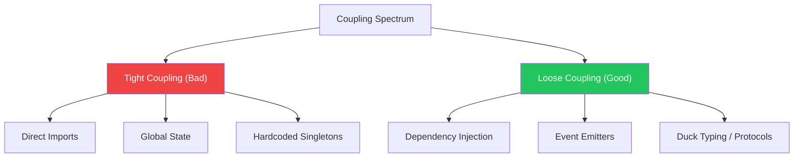

import { Tabs, TabItem, Aside, Badge, Card, CardGrid, Code, LinkCard } from '@astrojs/starlight/components';

## 🔗 Coupling in JavaScript — The Module Era

> **Coupling** is the degree to which one module/class depends on another.  
> In Java, this is managed via Interfaces and DI Containers.  
> In **JavaScript**, it’s managed via **ES Modules**, **Dependency Injection (DI)**, and **Event-Driven Patterns**.

<Aside type="tip" title="🧠 Mental Model">
**Software Gravity**:  
- **Tight Coupling**: Modules are glued together. Changing one breaks others. Hard to test.  
- **Loose Coupling**: Modules interact via contracts (interfaces/functions). Easy to swap, mock, and scale.  
**Goal**: "High Cohesion, Low Coupling."
</Aside>

---

## 📋 Types of Coupling in JS



<CardGrid>
  <Card title="Tight Coupling" icon="error">
    ```text
    +-------+               +-------+
    | Mod A |==============>| Mod B |
    +-------+  (Import)     +-------+
    
    Characteristics:
    • Direct `import` of concrete implementations
    • Shared mutable global state
    • Hard to unit test (can't mock dependencies)
    • Changes ripple through the app
    ```
  </Card>
  
  <Card title="Loose Coupling" icon="approve-check">
    ```text
    +-------+               +-------+
    | Mod A |~~~~Protocol~~| Mod B |
    +-------+               +-------+
    
    Characteristics:
    • Dependencies injected (Constructor/Factory)
    • Communication via Events or Interfaces
    • Easy to swap implementations (e.g., Mock DB)
    • Isolated testing
    ```
  </Card>
</CardGrid>

---

## 1️⃣ Tight Coupling — The "Import" Trap

In JS, `import` is static. If you import a concrete class directly, you are tightly coupled to it.

<Code lang="js" title="❌ Tight Coupling: Direct Import" code={`
// paymentService.js
import StripeClient from './stripeClient.js'; // 🔴 Hard dependency

class PaymentService {
    processPayment(amount) {
        // Coupled to Stripe specifically
        const client = new StripeClient(); 
        return client.charge(amount);
    }
}

// Why it's bad:
// 1. Can't test without real Stripe API (or complex mocking)
// 2. Can't switch to PayPal without changing this file
// 3. Violates Open/Closed Principle
`} />

### ✅ The Fix: Dependency Injection

Instead of importing the *implementation*, import the *interface* (or just expect an object) and inject the instance.

<Code lang="js" title="✅ Loose Coupling: Inject Dependencies" code={`
// paymentService.js
// No specific import! We expect any object with a 'charge' method.

class PaymentService {
    constructor(paymentGateway) {
        // 🔒 Dependency is injected, not created
        this.gateway = paymentGateway;
    }

    processPayment(amount) {
        return this.gateway.charge(amount);
    }
}

// Usage (Composition Root):
import StripeGateway from './stripeGateway.js';
import PayPalGateway from './paypalGateway.js';

// Production
const service = new PaymentService(new StripeGateway());

// Testing
const mockGateway = { charge: (amt) => Promise.resolve('OK') };
const testService = new PaymentService(mockGateway);
`} />

<Aside type="note">
**JS Nuance**: JS doesn't have formal `Interface` keywords. We rely on **Duck Typing**. As long as the injected object has a `charge()` method, `PaymentService` doesn't care what it is.
</Aside>

---

## 2️⃣ Common Coupling — Global State

Sharing mutable state via global variables or singletons creates hidden dependencies.

<Code lang="js" title="❌ Common Coupling: Global State" code={`
// store.js
export const state = {
    user: null,
    cart: []
};

// componentA.js
import { state } from './store.js';
state.user = "Alice"; // Mutates global

// componentB.js
import { state } from './store.js';
console.log(state.user); // Relies on Component A running first?
`} />

### ✅ The Fix: Context or State Management

Use explicit state passing (React Context, Redux, or simple function arguments) rather than mutable globals.

<Code lang="js" title="✅ Loose Coupling: Explicit State" code={`
// Using a simple state container pattern
class AppState {
    constructor() {
        this._user = null;
        this._listeners = [];
    }

    setUser(user) {
        this._user = user;
        this._notify();
    }

    subscribe(fn) {
        this._listeners.push(fn);
    }

    _notify() {
        this._listeners.forEach(fn => fn(this._user));
    }
}

// Components subscribe to changes, don't mutate directly
const app = new AppState();
app.subscribe(user => console.log("User updated:", user));
app.setUser("Alice");
`} />

---

## 3️⃣ Control Coupling — Flag Passing

Passing boolean flags to control behavior inside a function is a sign of tight coupling.

<Code lang="js" title="❌ Control Coupling: Boolean Flags" code={`
function generateReport(data, format) {
    if (format === 'PDF') {
        // PDF logic
    } else if (format === 'CSV') {
        // CSV logic
    }
}

// Caller must know internal logic:
generateReport(data, 'PDF');
`} />

### ✅ The Fix: Strategy Pattern (Polymorphism)

<Code lang="js" title="✅ Loose Coupling: Strategy Pattern" code={`
// Strategies are independent
const pdfStrategy = {
    generate: (data) => { /* PDF logic */ }
};

const csvStrategy = {
    generate: (data) => { /* CSV logic */ }
};

// Function accepts any strategy
function generateReport(data, strategy) {
    return strategy.generate(data);
}

// Caller chooses strategy explicitly
generateReport(data, pdfStrategy);
`} />

---

## 4️⃣ Stamp Coupling — Over-Passing Data

Passing a large object when only a few fields are needed.

<Code lang="js" title="❌ Stamp Coupling: Passing Fat Objects" code={`
// Logger receives full User object but only needs ID
function logUserAction(user) {
    console.log(\`User $\{user.id} logged in\`);
    // Risk: If logger serializes 'user', it might leak password/email!
}

logUserAction(fullUserObject); 
`} />

### ✅ The Fix: Pass Minimal Data

<Code lang="js" title="✅ Loose Coupling: Primitive/Data Transfer" code={`
function logUserAction(userId) {
    console.log(\`User $\{userId} logged in\`);
}

// Only pass what's needed
logUserAction(fullUserObject.id);
`} />

---

## 5️⃣ Event-Driven Decoupling

The ultimate loose coupling: Publisher doesn't know who Subscriber is.

<Code lang="js" title="✅ Event-Driven Architecture" code={`
import EventEmitter from 'events';

const bus = new EventEmitter();

// Publisher: Inventory Service
class Inventory {
    decrement(item) {
        // Update stock...
        bus.emit('stock:decreased', { itemId: item.id, qty: 1 });
        // Inventory doesn't know who listens!
    }
}

// Subscriber: Notification Service (Independent Module)
bus.on('stock:decreased', (data) => {
    sendLowStockAlert(data.itemId);
});

// Subscriber: Analytics Service (Independent Module)
bus.on('stock:decreased', (data) => {
    trackAnalytics('stock_change', data);
});

// Adding new subscribers requires NO changes to Inventory class ✅
`} />

---

## 🎯 Interview Cheat Sheet

<CardGrid>
  <Card title="Q: How do you achieve loose coupling in JS?" icon="approve-check">
    1. **Dependency Injection**: Pass dependencies via constructor/args.  
    2. **Modules**: Use ES Modules (`import`/`export`) to encapsulate logic.  
    3. **Events**: Use `EventEmitter` or Pub/Sub for cross-module communication.  
    4. **Duck Typing**: Depend on behavior (methods), not specific classes.
  </Card>
  
  <Card title="Q: Why is `new Class()` inside a method bad?" icon="error">
    It creates a **hard dependency**. You can't replace `Class` with a Mock for testing without modifying the source code. Always inject dependencies.
  </Card>

  <Card title="Q: What is the difference between Tight and Loose coupling?" icon="information">
    - **Tight**: Module A knows internals of Module B. Change B → Break A.  
    - **Loose**: Module A knows only the contract of Module B. Change B (if contract holds) → A is fine.
  </Card>

  <Card title="Q: How do you test tightly coupled code?" icon="caution">
    It's hard. You often need complex mocking libraries (like `jest.mock`) to intercept imports. Loosely coupled code allows simple injection of mock objects.
  </Card>
</CardGrid>

---

## 🧩 DSA & Practical Patterns

<CardGrid>
  <Card title="Pattern: Repository Pattern (DI)" icon="rocket">
```js
    // Interface (Protocol)
    // Any object with findById/save methods works
    
    class UserService {
        constructor(userRepo) {
            this.repo = userRepo; // Injected
        }
        
        async getUser(id) {
            return await this.repo.findById(id);
        }
    }
    
    // Test with Mock
    const mockRepo = { findById: id => ({ id, name: "Test" }) };
    const service = new UserService(mockRepo);
```
  </Card>
  
  <Card title="Pattern: Middleware Chain (Loose Coupling)" icon="shield">
```js
    // Express-style middleware
    // Each middleware is independent and loosely coupled
    
    app.use((req, res, next) => {
        console.log("Logging...");
        next(); // Pass control
    });
    
    app.use((req, res, next) => {
        if (!req.user) return res.status(401).send("Unauthorized");
        next();
    });
    
    // Adding new middleware doesn't change existing ones
```
  </Card>
</CardGrid>

---

## 🔑 Quick Reference Summary

### Coupling Decision Tree

```text
Need to use another module?
│
├─ Do you need its behavior?
│  ├─ Yes → Inject it (Constructor/Args) ✅
│  └─ No  → Do you really need it? ❓
│
├─ Do you need to share state?
│  ├─ Yes → Use Context/Store with Subscriptions ✅
│  └─ No  → Avoid Globals
│
├─ Are you passing flags?
│  └─ Yes → Use Strategy Pattern/Polymorphism ✅
│
├─ Are you passing fat objects?
│  └─ Yes → Pass only needed fields (DTO) ✅
│
└─ Are modules tightly linked?
   └─ Yes → Use Event Bus/Pub-Sub ✅
```

### Anti-Patterns & Fixes

| Anti-Pattern | Symptom | Fix |
|-------------|---------|-----|
| `import Concrete from './mod'` | Can't swap/mock easily | Inject instance via Constructor |
| `global.myVar = ...` | Hidden dependencies, race conditions | Use Context/State Management |
| `func(data, isPDF)` | Logic mixed, hard to extend | Strategy Pattern |
| `log(fullUserObj)` | Security risk, unnecessary data | Pass `userId` only |
| `new Service()` inside class | Hardwired dependency | Dependency Injection |

<Aside type="caution">
**Final Checklist for Low Coupling**:
1. ✅ **Inject Dependencies**: Don't `new` them inside classes.
2. ✅ **Use ES Modules**: Encapsulate logic, export only what's needed.
3. ✅ **Prefer Composition**: Combine small modules rather than deep inheritance.
4. ✅ **Event-Driven**: Use events for side effects (logging, analytics).
5. ✅ **Mockable**: If you can't easily swap a dependency for a mock, it's too tight.
</Aside>

---

## 🧪 Test Your Understanding

<Code lang="js" title="Predict Coupling Severity" code={`
// Q1: Tight or Loose?
import axios from 'axios';
class ApiService {
    fetchData() {
        return axios.get('/api/data');
    }
}

// Q2: How to fix?
class OrderController {
    constructor() {
        this.db = new MongoDB(); // Tight!
    }
}

// Q3: Why is this bad?
function process(user) {
    console.log(user.name);
    console.log(user.ssn); // Not needed, security risk
}
`} />

<details>
<summary>✅ Click to reveal answers</summary>

```text
Q1: Tight. Hardcoded import of 'axios'. Hard to mock network calls.
    Fix: Inject HTTP client: constructor(httpClient) { this.http = httpClient; }

Q2: Tight. 'new MongoDB()' inside constructor.
    Fix: Inject DB: constructor(db) { this.db = db; }

Q3: Stamp Coupling + Security Risk. Passing full user object when only name is needed.
    Fix: process(name) { console.log(name); }
```
</details>

---

## 🔗 Related Topics

<CardGrid columns={2}>
  <LinkCard
    title="JavaScript Modules (ESM)"
    href="/computer-languages/javascript/topics/modules"
    description="Import/Export, encapsulation, tree-shaking"
  />
  <LinkCard
    title="Dependency Injection in JS"
    href="/computer-languages/javascript/patterns/di"
    description="Constructor injection, factories, IoC containers"
  />
  <LinkCard
    title="Event-Driven Architecture"
    href="/computer-languages/javascript/patterns/events"
    description="EventEmitter, Pub/Sub, decoupling systems"
  />
  <LinkCard
    title="Solid Principles in JS"
    href="/computer-languages/javascript/oop/solid"
    description="Single Responsibility, Open/Closed, Dependency Inversion"
  />
</CardGrid>

<Aside type="note">
🎯 **Production Pro Tips**  
1. Use **TypeScript Interfaces** to define clear contracts for injected dependencies.  
2. Avoid **Singletons** for stateful services; prefer Dependency Injection.  
3. Use **Jest Mocks** (`jest.mock`) sparingly; prefer injecting mocks manually for clarity.  
4. Keep modules **small** and **focused** (Single Responsibility).  
5. Use **Events** for side effects that don't block the main flow. 🛡️
</Aside>

> 💡 **Final Wisdom**: JavaScript's flexibility makes it easy to write tightly coupled spaghetti code. Discipline via **Dependency Injection**, **Module Encapsulation**, and **Event-Driven Design** is key to scalable architecture. 🚀✨

*Converted for Astro 6 + Starlight • Optimized for interview prep + production use • Quality >>>> Quantity* 🎯
```

---

## 🔄 Java Coupling → JS Coupling Conversion Summary

| Java Concept | JavaScript Equivalent | Critical Difference |
|-------------|----------------------|-------------------|
| **Interface** | Duck Typing / TS Interface | JS relies on shape, not explicit implementation. |
| **@Autowired / DI** | Constructor Injection | Manual in vanilla JS; automatic in NestJS/Angular. |
| **`new` Keyword** | `import` + `new` | Both create tight coupling if done inside class. |
| **Static Methods** | Module-level Functions | Still tightly coupled if imported directly. |
| **Observer Pattern** | `EventEmitter` / PubSub | Native to Node.js; common in browser libs. |
| **Package Visibility** | ES Modules (`export`) | Unexported items are private to the module. |
| **Circular Deps** | Circular Imports | JS handles some circularity, but it's fragile. |

---

🧠 **Interview Power Move**: When asked about coupling, always mention:  
1. **Dependency Injection** is the primary tool for loose coupling in JS.  
2. **ES Modules** provide natural encapsulation.  
3. **Duck Typing** allows flexible polymorphism without rigid interfaces.  
4. **Event-Driven** patterns decouple publishers from subscribers.  
5. **Testing** is the ultimate proof of loose coupling (easy to mock).  

---

# 🔗 JavaScript Coupling

---

## 🔰 What Is Coupling?

Coupling = **the degree of interdependence between modules, classes, or functions**. How much does one piece of code need to know about another to function?

```js
// TIGHT coupling — A knows everything about B's internals:
class OrderService {
  processOrder(order) {
    const db = new PostgresDB("postgres://localhost/shop"); // hardcoded ❌
    const query = `INSERT INTO orders (user_id, items, total)
                   VALUES (${order.userId}, '${JSON.stringify(order.items)}',
                   ${order.total})`; // SQL detail leaked ❌
    db.execute(query);
    const mailer = new SendGridMailer("SG.xxx"); // hardcoded ❌
    mailer.sendRaw("FROM:shop@x.com", order.userEmail, "Order confirmed");
  }
}

// LOOSE coupling — A depends only on abstractions:
class OrderService {
  constructor(orderRepo, mailer) { // injected ✅
    this.orderRepo = orderRepo;
    this.mailer    = mailer;
  }
  async processOrder(order) {
    await this.orderRepo.save(order);    // abstraction ✅
    await this.mailer.send(order.user, "order_confirmed", order); // abstraction ✅
  }
}
```

---

## 🗺️ Complete Map

```
Coupling in JavaScript
│
├── 📊 Coupling Types
│   ├── Content Coupling      (worst)
│   ├── Common Coupling
│   ├── External Coupling
│   ├── Control Coupling
│   ├── Stamp Coupling
│   ├── Data Coupling         (acceptable)
│   └── Message Coupling      (best)
│
├── 🔴 Tight Coupling Patterns
│   ├── hardcoded dependencies
│   ├── direct instantiation (new inside)
│   ├── global state access
│   ├── reaching into internals
│   └── temporal coupling
│
├── 🟢 Loose Coupling Techniques
│   ├── dependency injection
│   ├── event-driven / pub-sub
│   ├── interface/duck typing
│   ├── module boundaries
│   └── inversion of control
│
├── 📦 Module Coupling
│   ├── ESM import coupling
│   ├── circular dependency coupling
│   └── barrel file coupling
│
├── 🔄 Temporal Coupling
│   ├── call order dependencies
│   ├── initialization order
│   └── async temporal coupling
│
├── 🧩 Framework-Level Coupling
│   ├── framework lock-in
│   ├── ORM coupling
│   └── test coupling
│
└── ⚙️ Internals
    ├── V8 module graph
    ├── reference graph
    └── coupling metrics
```

---

## ⚙️ Deep Dive — Coupling in the Dependency Graph

```
┌──────────────────────────────────────────────────────────┐
│         COUPLING AS A DEPENDENCY GRAPH                   │
│                                                          │
│  TIGHT (high coupling):                                  │
│  OrderService ──→ PostgresDB                             │
│  OrderService ──→ SendGridMailer                         │
│  OrderService ──→ StripeClient                           │
│  OrderService ──→ SlackNotifier                          │
│                                                          │
│  Every arrow = a dependency                              │
│  Change PostgresDB → may force OrderService change      │
│  Test OrderService → must have all 4 real services      │
│                                                          │
│  LOOSE (low coupling):                                   │
│  OrderService ──→ IOrderRepository (interface)          │
│  OrderService ──→ IMailer (interface)                    │
│                  ↑                    ↑                  │
│  PostgresRepo ──┘        SendGridMailer ──┘              │
│  MongoRepo ───┘           MockMailer ─────┘              │
│                                                          │
│  Change PostgresRepo → OrderService unaffected ✅        │
│  Test OrderService  → inject MockMailer/InMemoryRepo ✅  │
└──────────────────────────────────────────────────────────┘
```

---

## 1️⃣ Coupling Types — From Worst to Best

### Type 1: Content Coupling — Worst

```js
// Module A reaches INTO module B's private internals:
class UserCache {
  #store = new Map();

  // Private internal — not part of public API:
  get _store() { return this.#store; }
}

// CONTENT COUPLING — B accesses A's internals directly:
class UserService {
  #cache = new UserCache();

  getUser(id) {
    // Directly manipulates internal Map — bypasses API 😱:
    return this.#cache._store.get(id); // ❌ content coupling
  }
}

// Fix — use the public API:
class UserCache {
  #store = new Map();
  get(id)       { return this.#store.get(id); }
  set(id, user) { this.#store.set(id, user); return this; }
  has(id)       { return this.#store.has(id); }
}

class UserService {
  #cache = new UserCache();
  getUser(id) {
    return this.#cache.get(id); // ✅ public API only
  }
}
```

### Type 2: Common Coupling — Global State

```js
// Both modules depend on SAME global mutable state:

// globals.js:
export const state = {
  currentUser:   null,
  isLoading:     false,
  errorMessage:  null,
};

// auth.js — reads AND writes global:
import { state } from "./globals.js";

export function login(user) {
  state.currentUser  = user;    // 😱 mutates shared global
  state.isLoading    = false;
  state.errorMessage = null;
}

// dashboard.js — reads global:
import { state } from "./globals.js";

export function render() {
  if (state.isLoading) return; // reads global — order matters 😱
  if (!state.currentUser) redirect("/login");
  return renderUser(state.currentUser);
}

// Problem: auth.js and dashboard.js are both coupled to
// the SAME global state. Change one field's type/shape
// → both files potentially break.

// Fix — event-driven, or dependency injection:
class AppState {
  #user    = null;
  #loading = false;
  #listeners = new Set();

  setUser(user) {
    this.#user = user;
    this.#notify({ type: "USER_CHANGED", user });
  }

  subscribe(fn) {
    this.#listeners.add(fn);
    return () => this.#listeners.delete(fn);
  }

  #notify(event) {
    this.#listeners.forEach(fn => fn(event));
  }
}
```

### Type 3: External Coupling — Shared Format/Protocol

```js
// Both sides coupled to specific external format:

// TIGHT — both know about specific Stripe webhook shape:
function handleWebhook(rawBody, signature) {
  const event = stripe.webhooks.constructEvent(rawBody, signature, secret);

  // Direct coupling to Stripe's event shape:
  if (event.type === "payment_intent.succeeded") {
    const paymentIntent = event.data.object;
    fulfillOrder(paymentIntent.metadata.orderId); // Stripe-specific path 😱
  }
}

// LOOSE — normalize external format at boundary:
function handleWebhook(rawBody, signature) {
  const stripeEvent = stripe.webhooks.constructEvent(rawBody, signature, secret);
  const normalized  = normalizeWebhookEvent(stripeEvent); // adapter layer ✅
  eventBus.emit(normalized.type, normalized.payload);
}

function normalizeWebhookEvent(event) {
  const map = {
    "payment_intent.succeeded": {
      type:    "PAYMENT_SUCCEEDED",
      payload: { orderId: event.data.object.metadata.orderId, amount: event.data.object.amount }
    },
    "payment_intent.payment_failed": {
      type:    "PAYMENT_FAILED",
      payload: { orderId: event.data.object.metadata.orderId, reason: event.data.object.last_payment_error?.message }
    }
  };
  return map[event.type] ?? { type: "UNKNOWN_WEBHOOK", payload: event };
}

// Now order fulfillment only knows about PAYMENT_SUCCEEDED — not Stripe
eventBus.on("PAYMENT_SUCCEEDED", ({ orderId }) => fulfillOrder(orderId)); // ✅
```

### Type 4: Control Coupling — Passing a Flag

```js
// CONTROL COUPLING — caller controls callee behavior via flag:
function getUser(id, includeDeleted) { // 😱 control flag
  if (includeDeleted) {
    return db.query("SELECT * FROM users WHERE id=$1", [id]);
  } else {
    return db.query("SELECT * FROM users WHERE id=$1 AND deleted_at IS NULL", [id]);
  }
}

// Caller must KNOW about internal behavior to pass correct flag:
getUser(1, false); // caller knows about soft-delete logic 😱
getUser(1, true);  // caller knows about includeDeleted behavior 😱

// Fix — separate functions, single responsibility:
function getActiveUser(id) {
  return db.query("SELECT * FROM users WHERE id=$1 AND deleted_at IS NULL", [id]);
}

function getUserIncludingDeleted(id) {
  return db.query("SELECT * FROM users WHERE id=$1", [id]);
}

// Caller only knows WHAT they want — not HOW it's done ✅
getActiveUser(1);
getUserIncludingDeleted(1);
```

### Type 5: Stamp Coupling — Passing Whole Object When Part Suffices

```js
// STAMP COUPLING — passing whole User when only email needed:
function sendWelcomeEmail(user) {  // receives full User 😱
  mailer.send(
    user.email,        // only needs email
    "Welcome!",
    `Hello ${user.name}` // only needs name
  );
}

// Caller must construct full User just to send email:
sendWelcomeEmail({ id: 1, name: "Ali", email: "ali@x.com",
                   role: "admin", createdAt: "...", settings: {} });
// 😱 sendWelcomeEmail now coupled to User's shape

// Fix — pass only what's needed:
function sendWelcomeEmail(email, name) { // ✅ only required data
  mailer.send(email, "Welcome!", `Hello ${name}`);
}

sendWelcomeEmail(user.email, user.name); // ✅ decoupled from User shape
```

### Type 6: Data Coupling — Acceptable

```js
// DATA COUPLING — pass only needed primitive/simple data:
function calculateTax(amount, rate) { // primitives only ✅
  return amount * rate;
}

function formatCurrency(amount, currency) { // primitives ✅
  return new Intl.NumberFormat("en-US", { style: "currency", currency }).format(amount);
}

// Caller passes exactly what's needed — function is fully independent:
calculateTax(100, 0.18);
formatCurrency(118, "USD");
```

### Type 7: Message Coupling — Best

```js
// MESSAGE COUPLING — communicate only via messages/events:
const eventBus = new EventEmitter();

// OrderService only emits events — knows nothing about subscribers:
class OrderService {
  async placeOrder(cartId, userId) {
    const order = await this.#repo.create({ cartId, userId });
    eventBus.emit("order.placed", { orderId: order.id, userId }); // ✅
    return order;
  }
}

// Each subscriber handles its own concern — doesn't know about others:
eventBus.on("order.placed", ({ orderId }) => inventory.reserve(orderId));
eventBus.on("order.placed", ({ userId })  => emailService.sendConfirmation(userId));
eventBus.on("order.placed", ({ orderId }) => analytics.track("purchase", orderId));
eventBus.on("order.placed", ({ orderId }) => fulfillment.queue(orderId));

// Adding new behavior = new listener — ZERO changes to OrderService ✅
// Removing behavior = remove listener — ZERO changes to OrderService ✅
```

---

## 2️⃣ Tight Coupling — Recognition Patterns

### Pattern: `new` Inside a Class

```js
// TIGHT — hardcoded instantiation:
class ReportService {
  generate(reportType, options) {
    // Each instantiation = direct coupling:
    const db      = new PostgresDB(process.env.DB_URL);        // ❌
    const cache   = new RedisCache(process.env.REDIS_URL);      // ❌
    const storage = new S3Storage(process.env.S3_BUCKET);       // ❌
    const emailer = new SendGridMailer(process.env.SG_API_KEY); // ❌

    // Cannot test without real DB, Redis, S3, SendGrid
    // Cannot swap implementations
    // Cannot mock anything
  }
}

// LOOSE — injected dependencies:
class ReportService {
  #db; #cache; #storage; #emailer;

  constructor({ db, cache, storage, emailer }) {
    this.#db      = db;
    this.#cache   = cache;
    this.#storage = storage;
    this.#emailer = emailer;
  }

  async generate(reportType, options) {
    const data   = await this.#db.query(this.#buildQuery(reportType, options));
    const report = this.#format(data, reportType);
    await this.#storage.save(`reports/${reportType}-${Date.now()}.pdf`, report);
    await this.#emailer.send(options.recipient, "report_ready", { reportType });
    return report;
  }
}
```

### Pattern: Global State Access

```js
// TIGHT — direct global access:
let currentUser = null; // global

function Dashboard() {
  if (!currentUser) return redirectToLogin(); // 😱 reads global
  return renderDashboard(currentUser.permissions); // 😱 reads global
}

function AdminPanel() {
  if (currentUser?.role !== "admin") throw new ForbiddenError(); // 😱
  return renderAdminPanel();
}

// Test requires setting global — tests can't run in parallel:
// currentUser = { role: "admin" };
// AdminPanel(); — contaminated state between tests 😱

// LOOSE — injected context:
function Dashboard({ user }) {         // ✅ injected
  if (!user) return redirectToLogin();
  return renderDashboard(user.permissions);
}

function AdminPanel({ user }) {        // ✅ injected
  if (user?.role !== "admin") throw new ForbiddenError();
  return renderAdminPanel();
}

// Test is isolated:
Dashboard({ user: { permissions: ["read"] } });
AdminPanel({ user: { role: "admin" } });
```

### Pattern: Reaching Into Another Module's Private State

```js
// TIGHT — importing and directly manipulating internals:
import userService from "./user-service.mjs";

// Accesses internal cache directly — not through API:
userService._cache.clear(); // 😱 depends on internal implementation
userService._cache.set(id, mockUser); // 😱 bypasses validation logic

// LOOSE — use only the public API:
await userService.invalidateUser(id); // ✅ — public method
await userService.preloadUser(id, mockUser); // ✅ — if needed
```

---

## 3️⃣ Temporal Coupling — Order Dependency

```js
// TEMPORAL COUPLING — must call in exact order:
class PaymentProcessor {
  #initialized = false;
  #connection  = null;

  initialize(config) {     // MUST be called first
    this.#connection  = createConnection(config);
    this.#initialized = true;
  }

  async charge(amount) {
    if (!this.#initialized) {
      throw new Error("Call initialize() first!"); // 😱 order enforced at runtime
    }
    return this.#connection.charge(amount);
  }
}

const pp = new PaymentProcessor();
pp.charge(100); // ❌ Error: Call initialize() first!
pp.initialize({ key: "sk_..." });
pp.charge(100); // ✅ finally works

// LOOSE — enforce via construction (temporal coupling eliminated):
class PaymentProcessor {
  #connection;

  constructor(config) {
    // Initialized AT CONSTRUCTION — no separate step needed:
    this.#connection = createConnection(config);
  }

  async charge(amount) {
    return this.#connection.charge(amount); // ✅ always ready
  }
}

new PaymentProcessor({ key: "sk_..." }).charge(100); // ✅ always safe
```

### Async Temporal Coupling

```js
// ASYNC TEMPORAL — must await certain calls before others:
class DataLoader {
  #data    = null;
  #indexes = null;

  async load()    { this.#data    = await fetchData(); }
  async index()   { this.#indexes = buildIndexes(this.#data); } // needs #data
  async search(q) { return this.#indexes.search(q); }           // needs #indexes

  // Must call: load() → index() → search() in order 😱
}

const loader = new DataLoader();
await loader.search("query"); // ❌ #indexes is null
await loader.load();
await loader.search("query"); // ❌ #indexes still null — forgot index()
await loader.index();
await loader.search("query"); // ✅ finally works

// LOOSE — internal order managed by class itself:
class DataLoader {
  #data    = null;
  #indexes = null;

  async #ensureLoaded() {
    if (!this.#data) this.#data = await fetchData();
  }

  async #ensureIndexed() {
    await this.#ensureLoaded();
    if (!this.#indexes) this.#indexes = buildIndexes(this.#data);
  }

  async search(q) {
    await this.#ensureIndexed(); // handles own prerequisites ✅
    return this.#indexes.search(q);
  }
}

// Caller only knows ONE public method — order managed internally:
const loader = new DataLoader();
await loader.search("query"); // ✅ handles everything internally
```

---

## 4️⃣ Module Coupling — Import Dependency Analysis

### Direct vs Transitive Coupling

```
┌──────────────────────────────────────────────────────────┐
│         COUPLING VIA IMPORTS                             │
│                                                          │
│  DIRECT:                                                 │
│  order-service.mjs imports db.mjs                        │
│  → order-service directly coupled to db                  │
│                                                          │
│  TRANSITIVE:                                             │
│  app.mjs → order-service.mjs → db.mjs                    │
│  app.mjs is TRANSITIVELY coupled to db.mjs               │
│  Change db.mjs API → may cascade to app.mjs              │
│                                                          │
│  CIRCULAR:                                               │
│  a.mjs → b.mjs → a.mjs ← CIRCULAR DEPENDENCY            │
│  Evaluation order undefined                              │
│  One module gets partially-initialized version of other  │
└──────────────────────────────────────────────────────────┘
```

### Circular Dependency — The Hidden Coupling Trap

```js
// user-service.mjs:
import { OrderService } from "./order-service.mjs"; // imports order

export class UserService {
  async deleteUser(userId) {
    await OrderService.cancelUserOrders(userId); // needs order service
    await db.users.delete(userId);
  }
}

// order-service.mjs:
import { UserService } from "./user-service.mjs"; // imports user 😱 CIRCULAR

export class OrderService {
  async createOrder(userId, items) {
    const user = await UserService.getById(userId); // needs user service
    if (!user.active) throw new Error("Inactive user");
    return db.orders.create({ userId, items });
  }
}

// Result: circular dependency — one gets partially initialized module
// ESM: live binding → may work sometimes, silently undefined other times

// Fix — extract shared dependency:
// user-repo.mjs — neither service imports the other
// Both import user-repo.mjs instead:

// order-service.mjs:
import { findUserById } from "./user-repo.mjs"; // ✅ no cycle

// user-service.mjs:
import { cancelOrdersByUser } from "./order-repo.mjs"; // ✅ no cycle
```

### Barrel File Coupling — The Hidden Cost

```js
// index.mjs — barrel file re-exports everything:
export { UserService }    from "./user-service.mjs";
export { OrderService }   from "./order-service.mjs";
export { PaymentService } from "./payment-service.mjs";
export { MailService }    from "./mail-service.mjs";

// consumer.mjs — only needs UserService:
import { UserService } from "./index.mjs"; // 😱 imports ALL four

// Problem: importing from barrel pulls in ALL exports
// → every module evaluated (including their imports)
// → larger bundle, longer startup

// Actual coupling created:
// consumer → index → UserService + OrderService + PaymentService + MailService
// Consumer only uses UserService but is transitively coupled to all

// Fix — import directly from source:
import { UserService } from "./user-service.mjs"; // ✅ only what's needed
// OR: use tree-shaking if bundler supports it
```

---

## 5️⃣ Dependency Injection — The Primary Loose Coupling Tool

### Constructor Injection — Preferred

```js
// Define interfaces via duck typing:
function assertMailer(mailer) {
  if (typeof mailer?.send !== "function") {
    throw new TypeError("mailer must implement send(to, template, data)");
  }
}

function assertUserRepo(repo) {
  const methods = ["findById", "findByEmail", "save", "update", "delete"];
  const missing = methods.filter(m => typeof repo?.[m] !== "function");
  if (missing.length) {
    throw new TypeError(`userRepo missing: [${missing.join(", ")}]`);
  }
}

class UserService {
  #repo;
  #mailer;
  #hasher;
  #logger;

  constructor({ repo, mailer, hasher, logger }) {
    assertUserRepo(repo);
    assertMailer(mailer);

    this.#repo   = repo;
    this.#mailer = mailer;
    this.#hasher = hasher;
    this.#logger = logger ?? console;
  }

  async register(email, password, name) {
    if (await this.#repo.findByEmail(email)) {
      throw new ConflictError("Email already registered");
    }

    const hash = await this.#hasher.hash(password);
    const user = await this.#repo.save({ email, name, passwordHash: hash });

    await this.#mailer.send(email, "welcome", { name });
    this.#logger.info(`User registered: ${user.id}`);

    return user;
  }
}

// Production:
const prodService = new UserService({
  repo:   new PostgresUserRepo(pgPool),
  mailer: new SendGridMailer(process.env.SG_KEY),
  hasher: new BcryptHasher(12),
  logger: pinoLogger,
});

// Testing:
const testService = new UserService({
  repo:   new InMemoryUserRepo(),
  mailer: new MockMailer(),
  hasher: new TestHasher(),
  logger: { info: () => {}, error: () => {} },
});
```

### IoC Container — Manage Dependencies at Scale

```js
class Container {
  #bindings  = new Map();
  #singletons = new Map();
  #building   = new Set();

  // Register a factory:
  bind(token, factory, { singleton = false } = {}) {
    this.#bindings.set(token, { factory, singleton });
    return this;
  }

  // Register a constant value:
  instance(token, value) {
    this.#singletons.set(token, value);
    return this;
  }

  // Resolve with circular dependency detection:
  resolve(token) {
    // Already have singleton instance:
    if (this.#singletons.has(token)) {
      return this.#singletons.get(token);
    }

    const binding = this.#bindings.get(token);
    if (!binding) throw new Error(`No binding for: ${String(token)}`);

    // Detect circular:
    if (this.#building.has(token)) {
      throw new Error(`Circular dependency detected: ${String(token)}`);
    }

    this.#building.add(token);
    try {
      const instance = binding.factory(this);
      if (binding.singleton) {
        this.#singletons.set(token, instance);
      }
      return instance;
    } finally {
      this.#building.delete(token);
    }
  }
}

// Tokens (use Symbols for true uniqueness):
const DB          = Symbol("DB");
const UserRepo    = Symbol("UserRepo");
const Mailer      = Symbol("Mailer");
const UserService = Symbol("UserService");

// Wire up:
const container = new Container();
container
  .instance(DB, pgPool)                              // constant
  .bind(UserRepo, c => new PostgresUserRepo(c.resolve(DB)), { singleton: true })
  .bind(Mailer,   c => new SendGridMailer(process.env.SG_KEY), { singleton: true })
  .bind(UserService, c => new UserService({
    repo:   c.resolve(UserRepo),
    mailer: c.resolve(Mailer),
    hasher: new BcryptHasher(12),
  }), { singleton: true });

// Usage — no consumer knows about concrete classes:
const userSvc = container.resolve(UserService); // ✅
```

---

## 6️⃣ Event-Driven Architecture — Structural Decoupling

```js
// Event bus — the decoupling backbone:
class EventBus {
  #handlers  = new Map();
  #wildcards = new Set();

  on(event, handler) {
    if (!this.#handlers.has(event)) this.#handlers.set(event, new Set());
    this.#handlers.get(event).add(handler);
    return () => this.#handlers.get(event)?.delete(handler); // unsubscribe
  }

  onAny(handler) {
    this.#wildcards.add(handler);
    return () => this.#wildcards.delete(handler);
  }

  async emit(event, payload) {
    const handlers = [
      ...(this.#handlers.get(event) ?? []),
      ...this.#wildcards
    ];

    await Promise.allSettled(
      handlers.map(h => Promise.resolve().then(() => h({ event, payload })))
    );
  }
}

const bus = new EventBus();

// ── Producers — emit events, don't know about consumers ──
class OrderService {
  async place(userId, items) {
    const order = await this.#repo.save({ userId, items });
    await bus.emit("order.placed", { orderId: order.id, userId, items });
    return order;
  }

  async cancel(orderId, reason) {
    await this.#repo.update(orderId, { status: "cancelled" });
    await bus.emit("order.cancelled", { orderId, reason });
  }
}

// ── Consumers — react to events, don't know about producers ──
bus.on("order.placed", async ({ payload }) => {
  await inventoryService.reserve(payload.orderId, payload.items);
});

bus.on("order.placed", async ({ payload }) => {
  await emailService.sendConfirmation(payload.userId, payload.orderId);
});

bus.on("order.placed", async ({ payload }) => {
  analytics.track("purchase", { userId: payload.userId });
});

bus.on("order.cancelled", async ({ payload }) => {
  await inventoryService.release(payload.orderId);
});

bus.on("order.cancelled", async ({ payload }) => {
  await emailService.sendCancellation(payload.userId);
});

// Adding a new consumer (e.g., loyalty points):
bus.on("order.placed", async ({ payload }) => {
  await loyaltyService.award(payload.userId, payload.items.length * 10);
});
// ZERO changes to OrderService ✅
```

---

## 7️⃣ Interface Segregation — Don't Couple to What You Don't Need

```js
// FAT interface — forces coupling to methods you don't use:
class UserRepository {
  // All consumers must depend on ALL of these:
  findById(id)           { }
  findByEmail(email)     { }
  findAll(filter)        { }
  save(user)             { }
  update(id, changes)    { }
  delete(id)             { }
  findWithOrders(userId) { }
  exportToCsv(filter)    { }
  sendReport(email)      { }
  syncToLdap()           { }
  // ... 20 more methods
}

// AuthService only needs findByEmail — but coupled to ALL 30 methods:
class AuthService {
  constructor(userRepo) {
    this.userRepo = userRepo; // 😱 coupled to everything
  }

  async login(email, password) {
    return this.userRepo.findByEmail(email); // uses 1/30 methods
  }
}

// FIX — segregated interfaces via duck typing:
function assertEmailLookup(repo) {
  if (typeof repo?.findByEmail !== "function") {
    throw new TypeError("repo must implement findByEmail()");
  }
}

// AuthService only knows about what it uses:
class AuthService {
  #emailLookup;

  constructor(emailLookup) {
    assertEmailLookup(emailLookup);
    this.#emailLookup = emailLookup;
  }

  async login(email, password) {
    return this.#emailLookup.findByEmail(email); // ✅ only depends on one method
  }
}

// Can inject just the right thing:
const authService = new AuthService({
  findByEmail: email => db.query("SELECT * FROM users WHERE email=$1", [email])
    .then(r => r.rows[0])
}); // ✅ minimal coupling — plain object with one method
```

---

## 🏭 Real Production Patterns

### Pattern 1 — Layered Architecture with Explicit Coupling Boundaries

```js
// ── Coupling Map ───────────────────────────────────────────
//
//  HTTP Layer (Controllers)
//     ↓ depends on ↓
//  Application Layer (Services)
//     ↓ depends on ↓
//  Domain Layer (Entities, Value Objects)
//     ↓ depends on ↓        ← NO upward dependencies
//  Infrastructure Layer (Repos, External APIs)
//
// Each layer ONLY imports from the layer directly below it ✅
// ──────────────────────────────────────────────────────────

// Domain layer — no dependencies:
class Money {
  #amount; #currency;
  constructor(amount, currency) {
    if (amount < 0) throw new RangeError("Amount cannot be negative");
    this.#amount   = amount;
    this.#currency = currency;
  }
  get amount()   { return this.#amount; }
  get currency() { return this.#currency; }
  add(other)     { return new Money(this.#amount + other.#amount, this.#currency); }
}

class Order {
  #id; #userId; #items; #status;
  constructor({ id, userId, items }) {
    this.#id     = id;
    this.#userId = userId;
    this.#items  = items;
    this.#status = "pending";
  }
  get total() {
    return this.#items.reduce(
      (sum, item) => sum.add(new Money(item.price * item.qty, "USD")),
      new Money(0, "USD")
    );
  }
  place()    { this.#status = "placed"; return this; }
  cancel()   { this.#status = "cancelled"; return this; }
  get status() { return this.#status; }
}

// Application layer — only depends on domain + abstractions:
class PlaceOrderUseCase {
  #orderRepo;
  #paymentGateway;
  #eventBus;

  constructor({ orderRepo, paymentGateway, eventBus }) {
    this.#orderRepo       = orderRepo;
    this.#paymentGateway  = paymentGateway;
    this.#eventBus        = eventBus;
  }

  async execute({ userId, items, paymentToken }) {
    const order   = new Order({ id: crypto.randomUUID(), userId, items });
    const payment = await this.#paymentGateway.charge(order.total, paymentToken);

    order.place();
    await this.#orderRepo.save(order);
    await this.#eventBus.emit("order.placed", { orderId: order.id, payment });

    return order;
  }
}

// Infrastructure layer — implements interfaces defined by application:
class PostgresOrderRepo {
  #pool;
  constructor(pool) { this.#pool = pool; }

  async save(order) {
    await this.#pool.query(
      "INSERT INTO orders (id, user_id, status, total) VALUES ($1,$2,$3,$4)",
      [order.id, order.userId, order.status, order.total.amount]
    );
  }
}

// HTTP layer — only depends on use cases:
class OrderController {
  #placeOrder;
  constructor({ placeOrderUseCase }) { this.#placeOrder = placeOrderUseCase; }

  create() {
    return async (req, res, next) => {
      try {
        const order = await this.#placeOrder.execute({
          userId:       req.user.id,
          items:        req.body.items,
          paymentToken: req.body.paymentToken,
        });
        res.status(201).json({ orderId: order.id, status: order.status });
      } catch (err) {
        next(err);
      }
    };
  }
}
```

### Pattern 2 — Coupling Measurement and Detection

```js
// Track coupling metrics in tests / analysis:
class CouplingAnalyzer {
  #graph = new Map(); // module → Set of direct dependencies

  addDependency(from, to) {
    if (!this.#graph.has(from)) this.#graph.set(from, new Set());
    this.#graph.get(from).add(to);
  }

  // Afferent coupling (Ca) — how many others depend on this module:
  afferentCoupling(module) {
    let count = 0;
    for (const [, deps] of this.#graph) {
      if (deps.has(module)) count++;
    }
    return count;
  }

  // Efferent coupling (Ce) — how many modules this depends on:
  efferentCoupling(module) {
    return this.#graph.get(module)?.size ?? 0;
  }

  // Instability (I = Ce / (Ca + Ce)):
  // I = 0 → maximally stable (many depend on it, it depends on few)
  // I = 1 → maximally unstable (nothing depends on it, it depends on many)
  instability(module) {
    const ca = this.afferentCoupling(module);
    const ce = this.efferentCoupling(module);
    if (ca + ce === 0) return 0;
    return ce / (ca + ce);
  }

  // Find circular dependencies:
  findCircles() {
    const cycles  = [];
    const visited = new Set();
    const stack   = new Set();

    const dfs = (node, path) => {
      if (stack.has(node)) {
        const cycleStart = path.indexOf(node);
        cycles.push(path.slice(cycleStart));
        return;
      }
      if (visited.has(node)) return;

      visited.add(node);
      stack.add(node);

      for (const dep of this.#graph.get(node) ?? []) {
        dfs(dep, [...path, node]);
      }
      stack.delete(node);
    };

    for (const module of this.#graph.keys()) {
      dfs(module, []);
    }

    return cycles;
  }
}

const analyzer = new CouplingAnalyzer();
analyzer.addDependency("order-service", "user-repo");
analyzer.addDependency("order-service", "payment-gateway");
analyzer.addDependency("order-controller", "order-service");
analyzer.addDependency("auth-service", "user-repo");

analyzer.efferentCoupling("order-service"); // 2
analyzer.afferentCoupling("user-repo");      // 2 — stable
analyzer.instability("order-service");       // 0.67 — moderately unstable
```

---

## 💀 Interview Traps

### Trap 1: Importing class directly creates coupling — even in tests

```js
// Looks harmless — just an import:
import { EmailService } from "./email-service.mjs";

class UserService {
  async register(user) {
    await new EmailService().send(user.email, "welcome"); // 😱 instantiate inside
  }
}

// Problem: importing and instantiating inside couples you to:
// 1. EmailService constructor signature
// 2. EmailService.send() method signature
// 3. All of EmailService's dependencies
// 4. EmailService's side effects (actually sends email in tests!)
// 5. Any future changes to EmailService

// In tests — EVERY UserService test sends real emails 😱

// Fix — inject through constructor:
class UserService {
  #mailer;
  constructor(mailer) { this.#mailer = mailer; }
  async register(user) {
    await this.#mailer.send(user.email, "welcome"); // ✅ injected
  }
}
// Test: new UserService({ send: jest.fn() }) — no real email
```

---

### Trap 2: Returning mutable internal state creates hidden coupling

```js
class Config {
  #data = { timeout: 5000, retries: 3, endpoints: ["api1", "api2"] };

  // TIGHT — returns reference to internal object:
  getAll() { return this.#data; } // 😱

  getEndpoints() { return this.#data.endpoints; } // 😱 returns reference to internal array
}

const cfg = new Config();
const endpoints = cfg.getEndpoints();
endpoints.push("malicious-api"); // 😱 mutates Config's internal state!
cfg.getEndpoints(); // ["api1", "api2", "malicious-api"] — corrupted

// Any consumer that accidentally mutates the returned array
// silently corrupts the Config singleton

// Fix — return copies:
getAll()       { return { ...this.#data, endpoints: [...this.#data.endpoints] }; }
getEndpoints() { return [...this.#data.endpoints]; } // ✅ copy
// Or freeze:
getAll()       { return Object.freeze({ ...this.#data }); } // ✅
```

---

### Trap 3: Event-driven coupling is NOT zero coupling — timing matters

```js
// Looks decoupled — but order of handler registration matters:
const bus = new EventEmitter();

class OrderService {
  async place(order) {
    await this.#repo.save(order);
    bus.emit("order.placed", order); // "decoupled" ✅?
  }
}

class InventoryService {
  constructor() {
    // If InventoryService constructed AFTER order is placed:
    bus.on("order.placed", order => this.reserve(order)); // might miss first event 😱
  }
}

// If OrderService places an order before InventoryService registers:
// → Event fired with no listeners
// → Inventory never reserved
// → Temporal coupling via event timing 😱

// Fix — guarantee registration before any events fire:
class App {
  async start() {
    // REGISTER ALL LISTENERS FIRST:
    new InventoryService(bus);
    new NotificationService(bus);

    // THEN start accepting requests:
    this.server.listen(PORT);
    // Now any order.placed event will have listeners ✅
  }
}
```

---

### Trap 4: Circular imports — silently undefined at initialization

```js
// a.mjs:
import { b } from "./b.mjs";
export const a = `A depends on ${b}`; // b might be undefined here 😱

// b.mjs:
import { a } from "./a.mjs";
export const b = `B depends on ${a}`; // a might be undefined here 😱

// ESM hoists imports but evaluates lazily:
// When a.mjs starts evaluating → imports b.mjs
// b.mjs starts evaluating → imports a.mjs
// a.mjs is currently being evaluated → a = undefined (not yet assigned)
// b = `B depends on undefined`
// Back to a.mjs: b = "B depends on undefined"
// a = "A depends on B depends on undefined"

// No error — silent wrong values 😱

// Detect in CI with madge or eslint-plugin-import:
// madge --circular src/
```

---

### Trap 5: `instanceof` coupling — breaks with subclasses and realms

```js
// Code coupled to specific class via instanceof:
function processValue(value) {
  if (value instanceof Map) {
    return Object.fromEntries(value); // only works for Map
  }
  if (value instanceof Array) {
    return value.join(",");
  }
  return String(value);
}

// Problems:
// 1. New Map-like class (e.g., OrderedMap extends Map) — works IF extends Map
// 2. vm.runInNewContext("new Map()") — fails instanceof check 😱
// 3. WeakMap, SortedMap (third-party) — fail even if same API

// Fix — structural check (duck typing):
function processValue(value) {
  if (value?.[Symbol.iterator] && typeof value?.get === "function") {
    return Object.fromEntries(value); // ✅ works for any Map-like
  }
  if (Array.isArray(value)) {         // ✅ cross-realm safe
    return value.join(",");
  }
  return String(value);
}
```

---

### Trap 6: Barrel files create unexpected transitive coupling

```js
// utils/index.mjs — convenient barrel:
export { formatDate }       from "./date-utils.mjs";
export { parseQueryString } from "./query-utils.mjs";
export { sanitizeHtml }     from "./html-utils.mjs";
export { encrypt, decrypt } from "./crypto-utils.mjs"; // imports node:crypto

// feature.mjs — only needs formatDate:
import { formatDate } from "../utils/index.mjs"; // 😱 imports ALL utils

// Problem: feature.mjs now:
// → imports crypto-utils → imports node:crypto
// → imports html-utils → maybe imports DOMParser
// → All evaluated at startup — slow startup for browser bundle
// → Bundle includes all utils — even unused ones (if no tree-shaking)

// Fix — import directly or ensure tree-shaking:
import { formatDate } from "../utils/date-utils.mjs"; // ✅ only date-utils
```

---

## 📊 Coupling Types Reference

```
┌──────────────────────────────────────────────────────────┐
│         COUPLING SPECTRUM — WORST TO BEST                │
├──────────────────────────┬───────────────────────────────┤
│ Type                     │ Characteristic                │
├──────────────────────────┼───────────────────────────────┤
│ 1. Content (worst)       │ Access to internals           │
│ 2. Common                │ Shared global mutable state   │
│ 3. External              │ Shared external format        │
│ 4. Control               │ Pass flag to control behavior │
│ 5. Stamp                 │ Pass struct when part needed  │
│ 6. Data (acceptable)     │ Pass only needed primitives   │
│ 7. Message (best)        │ Communicate via events/calls  │
└──────────────────────────┴───────────────────────────────┘
```

---

## 📊 Loose vs Tight Coupling Comparison

```
┌──────────────────────────────────────────────────────────┐
│          TIGHT vs LOOSE — PRACTICAL IMPACT               │
├────────────────────┬─────────────────────────────────────┤
│ Tight Coupling     │ Loose Coupling                      │
├────────────────────┼─────────────────────────────────────┤
│ new Dep() inside   │ inject Dep via constructor          │
│ Reads global state │ State passed as parameter           │
│ Returns reference  │ Returns copy/value                  │
│ instanceof checks  │ Duck type / structural checks       │
│ Direct import use  │ Abstraction / interface boundary    │
│ Hard to test       │ Easy to mock/stub/replace           │
│ Circular imports   │ Explicit dependency direction       │
│ Temporal ordering  │ Self-managing prerequisites         │
└────────────────────┴─────────────────────────────────────┘
```

---

## 📊 DSA / Internals Connection

> Coupling is a **directed graph** problem in CS theory. Modules are nodes, imports/references are directed edges. **Coupling metrics** — Afferent Coupling (Ca), Efferent Coupling (Ce), Instability (I = Ce / (Ca + Ce)) — are standard graph metrics. The goal is a **DAG** (Directed Acyclic Graph) with no cycles. V8's module loader builds this graph during the **Parse phase** of ESM loading — it's one reason `import` must be static (no runtime conditionals): V8 needs to resolve the full dependency graph before executing any module. Circular dependencies create cycles in this DAG — violating the acyclic invariant and causing the partial-initialization problem.
>
> The **Law of Demeter** (talk only to immediate neighbors) is the software engineering rule that minimizes coupling. In graph terms: no edge should skip more than one hop in the intended abstraction hierarchy. Each `new` inside a constructor adds a direct edge. Each injected dependency adds an edge only to the interface, not the implementation — keeping the **fan-out** (efferent coupling) low and the graph navigable.

---
