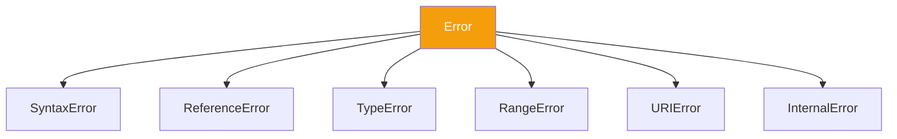

import { Tabs, TabItem, Aside, Badge, Card, CardGrid, Code, LinkCard } from '@astrojs/starlight/components';

## 💥 What Is An Exception in JavaScript?

> An **exception** is an unexpected event that disrupts the normal flow of code execution.  
> In Java, exceptions are strictly typed (`Checked` vs `Unchecked`).  
> In **JavaScript**, all exceptions are **Unchecked**. If you don't catch them, they crash the script (in Node) or stop execution (in Browser).

<Aside type="tip">
**🧠 Mental Model**:  
Think of an exception as a **Signal Flare**.  
1. Code throws an `Error` object.  
2. The engine stops current execution.  
3. It looks up the **Call Stack** for a `catch` block.  
4. If found → Handle it.  
5. If not → Crash (Node) or Silent Fail/Console Error (Browser).  
⚠️ **Key Difference**: JS has no "Compile-time" checking for exceptions. You won't know if a function throws until it runs.
</Aside>

---

## 🔬 Error vs Exception vs Bug

| | Definition | Example | Recoverable? |
|--|-----------|---------|-------------|
| **Bug** | Logic error | `i <= array.length` (Off-by-one) | Fix code |
| **Exception** | Runtime Error Object | `TypeError`, `ReferenceError` | ✅ Yes (`try/catch`) |
| **Crash** | Unhandled Exception | Node process exits | ❌ No (Process dies) |

---

## 📚 The Call Stack & Unwinding

Just like Java, JS uses a **Call Stack**. When an error occurs, the engine "unwinds" the stack looking for a handler.

<Code lang="js" title="Stack Unwinding in Action" code={`
function main() {
    processOrder();
}

function processOrder() {
    validateUser();
}

function validateUser() {
    // 💥 Error thrown here
    throw new Error("User not found");
}

// Execution Flow:
// 1. validateUser throws Error
// 2. Engine checks validateUser for catch -> None
// 3. Engine pops validateUser frame
// 4. Engine checks processOrder for catch -> None
// 5. Engine pops processOrder frame
// 6. Engine checks main for catch -> None
// 7. Process crashes / Console shows Stack Trace
`} />

**Output:**
```text
Error: User not found
    at validateUser (script.js:9:11)
    at processOrder (script.js:5:5)
    at main (script.js:2:5)
```

<Aside type="note">
**Stack Trace**: The output shows the path from the `main` entry point down to the error source. Read it **bottom-to-top** to follow the execution flow, or **top-to-bottom** to find the exact line of failure.
</Aside>

---

## 🛡️ Try...Catch...Finally

The primary mechanism for handling exceptions in JS.

<Code lang="js" title="Basic Structure" code={`
try {
    // Code that might fail
    const data = JSON.parse(invalidJson);
} catch (error) {
    // Handle the error
    console.error("Parsing failed:", error.message);
} finally {
    // Always runs, regardless of error
    console.log("Cleanup complete");
}
`} />

### 🔑 Key Rules

1.  **`try`** must be followed by `catch` OR `finally`.
2.  **`catch`** receives the `Error` object.
3.  **`finally`** runs even if you `return` inside `try/catch`.

---

## 🏗️ The Error Hierarchy

JS has a built-in `Error` class. Most exceptions are instances of this or its subclasses.



| Error Type | Cause | Example |
|------------|-------|---------|
| **SyntaxError** | Invalid JS syntax | `if (true { }` |
| **ReferenceError** | Variable not defined | `console.log(x);` |
| **TypeError** | Wrong type operation | `"abc".toUpperCase()` on `null` |
| **RangeError** | Number out of range | `new Array(-1)` |
| **URIError** | Bad URI handling | `decodeURIComponent('%')` |

<Aside type="caution">
**No Checked Exceptions**: Unlike Java, JS does **not** force you to catch errors. You can call a function that throws, and the compiler/linter won't complain. This makes documentation crucial.
</Aside>

---

## 💻 Custom Errors

You can create your own error types to provide context.

<Code lang="js" title="Creating Custom Errors" code={`
class ValidationError extends Error {
    constructor(field, message) {
        super(message);
        this.name = "ValidationError"; // Important for stack traces
        this.field = field;
    }
}

function registerUser(user) {
    if (!user.email) {
        throw new ValidationError("email", "Email is required");
    }
    // ... save user
}

try {
    registerUser({ name: "Alice" });
} catch (err) {
    if (err instanceof ValidationError) {
        console.error(\`Field $\{err.field}: $\{err.message}\`);
    } else {
        throw err; // Re-throw unknown errors
    }
}
`} />

---

## ⚡ Async Exceptions — The Trap!

In Java, exceptions propagate up the stack. In JS, **Async code breaks the stack**.  
You **cannot** catch async errors with a standard `try/catch` block around the caller.

<CardGrid>
  <Card title="❌ The Wrong Way" icon="error">
    ```js
    try {
        setTimeout(() => {
            throw new Error("Async Fail");
        }, 1000);
    } catch (e) {
        // NEVER catches the error!
        // The try block finished before the timeout ran.
    }
    ```
  </Card>
  
  <Card title="✅ The Right Way: Promises" icon="approve-check">
    ```js
    fetchData()
        .then(data => process(data))
        .catch(err => console.error(err)); // Catches async errors
    ```
  </Card>

  <Card title="✅ The Modern Way: Async/Await" icon="rocket">
    ```js
    async function loadData() {
        try {
            const res = await fetch('/api/data');
            const data = await res.json();
        } catch (err) {
            console.error("Fetch failed:", err);
        }
    }
    // await unwraps the promise, allowing try/catch to work!
    ```
  </Card>
</CardGrid>

<Aside type="danger">
**🚨 Production Bug**: Forgetting to `.catch()` a Promise or `await` inside a `try/catch`.  
Uncaught Promise Rejections can crash Node.js processes (since Node 15+) or cause silent failures in browsers.
</Aside>

---

## 🏭 Default Exception Handling

### In the Browser
If an error is uncaught:
1. It prints to the **Console**.
2. Execution of the current script **stops**.
3. The rest of the page usually remains functional (unless the error was in a critical init script).
4. `window.onerror` can be used as a global handler.

### In Node.js
If an error is uncaught:
1. It prints to **stderr**.
2. The **Process Exits** (Crashes).
3. `process.on('uncaughtException')` can catch it, but it's dangerous (state may be corrupted).

<Code lang="js" title="Global Handlers" code={`
// Browser
window.onerror = (msg, url, line) => {
    console.error(\`Global Error: $\{msg} at $\{line}\`);
    return true; // Prevents default console error
};

// Node.js
process.on('uncaughtException', (err) => {
    console.error('There was an uncaught error', err);
    process.exit(1); // Graceful shutdown recommended
});
`} />

---

## 💣 Interview Traps

<CardGrid>
  <Card title="Trap 1: Swallowing Errors" icon="error">
    ```js
    try {
        doRiskyThing();
    } catch (e) {
        // Empty catch block
    }
    // 😱 Silent failure. Debugging becomes impossible.
    // Always log or re-throw!
    ```
  </Card>
  
  <Card title="Trap 2: Catching Everything" icon="caution">
    ```js
    try {
        // ...
    } catch (e) {
        // Assumes e is always an Error object
        // But you can throw strings: throw "Fail";
        console.log(e.message); // undefined if e is string
    }
    // Fix: Check type or use 'instanceof Error'
    ```
  </Card>

  <Card title="Trap 3: Async/Await Scope" icon="shield">
    ```js
    async function run() {
        try {
            const p1 = fetch('/api/1');
            const p2 = fetch('/api/2');
            
            // Both run in parallel. 
            // If p2 fails, p1 might still succeed.
            const r1 = await p1;
            const r2 = await p2; // Throws here
        } catch (err) {
            // Handles error from p2 (or p1)
        }
    }
    ```
  </Card>
</CardGrid>

---

## 🎯 Interview Cheat Sheet

<CardGrid>
  <Card title="Q: What is the difference between Java and JS exceptions?" icon="information">
    Java has **Checked** (compile-time) and **Unchecked** exceptions.  
    JS has **only Unchecked** exceptions. You are never forced to catch them.
  </Card>
  
  <Card title="Q: How do you handle async errors?" icon="approve-check">
    Use `.catch()` on Promises or `try/catch` with `async/await`. Standard `try/catch` does **not** work for callbacks or detached promises.
  </Card>

  <Card title="Q: What happens if you throw a string?" icon="caution">
    `throw "Error"` is valid JS. However, it won't have a stack trace or `message` property. Always `throw new Error()`.
  </Card>

  <Card title="Q: Does `finally` run if I return in `catch`?" icon="rocket">
    **Yes.** `finally` always runs, even if there is a `return` statement in `try` or `catch`.
  </Card>
</CardGrid>

---

## 🧠 Full Mental Model Summary

```text
JS EXCEPTION FLOW CHECKLIST

1. Throw:
   throw new Error("Msg")

2. Propagate:
   Engine looks up Call Stack for nearest 'catch'

3. Handle:
   catch (err) { ... }

4. Cleanup:
   finally { ... } (Always runs)

5. Async:
   Promises reject -> .catch()
   Await throws -> try/catch

⚠️ Key Differences from Java:
- No checked exceptions
- Async breaks synchronous try/catch
- Uncaught errors crash Node, but not always Browser tabs
- You can throw non-Error objects (but shouldn't)
```

<Aside type="tip">
**Next Steps**:
1. ✅ Always `throw new Error()`, not strings.
2. ✅ Use `async/await` with `try/catch` for clean async handling.
3. ✅ Implement Global Error Boundaries (React) or Process Handlers (Node).
4. ✅ Never leave empty `catch` blocks.

Mastering exceptions ensures your app fails gracefully, not catastrophically. ☕✨
</Aside>
```

---

## 🔄 Java Exceptions → JS Exceptions Conversion Summary

| Java Concept | JavaScript Equivalent | Critical Difference |
|-------------|----------------------|-------------------|
| **Checked Exception** | ❌ None | JS doesn't enforce handling. |
| **Unchecked Exception** | `Error` objects | All JS errors are unchecked. |
| **Try-Catch-Finally** | `try-catch-finally` | Syntax is nearly identical. |
| **Throw** | `throw new Error()` | JS allows throwing primitives (bad practice). |
| **Stack Trace** | `error.stack` | Available on all Error objects. |
| **Async Handling** | `.catch()` / `await` | Java threads block; JS uses Event Loop. |
| **Global Handler** | `window.onerror` / `process.on` | Different APIs for Browser vs Node. |

---

🧠 **Interview Power Move**: When asked about exceptions, always mention:  
1. **Async Complexity**: How `try/catch` doesn't work for callbacks.  
2. **Error Objects**: Why you should always throw `Error` instances (stack traces).  
3. **Global Safety**: Using global handlers to prevent silent crashes.  
4. **Finally**: Its guarantee to run for cleanup (closing connections, etc.).  
5. **Custom Errors**: Extending `Error` for better debugging.  

---

# ⚠️ JavaScript Exception Handling — Fundamentals

---

## 🔰 What Are We Covering?

```
Fundamentals
   ├── 01_What_Is_An_Exception
   ├── 02_Runtime_Stack_Mechanism
   └── 03_Default_Exception_Handling
```

---

# 01 — What Is An Exception

## 🔰 Definition

An **exception** = an abnormal condition that disrupts normal program flow at runtime. When an exception occurs, JS creates an **Error object**, **throws** it up the call stack, and either catches it or crashes the program.

```js
// Normal flow — no exception:
const result = 10 / 2;        // 5 ✅

// Exception — abnormal condition:
null.property;                 // ❌ TypeError — execution stops here
console.log("never reached");  // 😱 this line never runs
```

---

## 📊 Exception vs Error — Not the Same Thing

```
┌──────────────────────────────────────────────────────────┐
│         ERROR vs EXCEPTION                               │
│                                                          │
│  Error:                                                  │
│  → The Error object (data structure)                     │
│  → Has: message, name, stack, cause                      │
│  → Can be created without throwing:                      │
│    const e = new Error("oops"); // just an object        │
│                                                          │
│  Exception:                                              │
│  → The ACT of throwing an error                          │
│  → Disrupts normal execution flow                        │
│  → Propagates up the call stack                          │
│                                                          │
│  You THROW an Error → that creates an EXCEPTION          │
└──────────────────────────────────────────────────────────┘
```

```js
// Error object — just data, no exception yet:
const err = new Error("something went wrong");
console.log(err.message); // "something went wrong" — no exception ✅

// Exception — throw creates the disruption:
throw err; // ← THIS is the exception — execution stops
```

---

## 🗂️ Built-in Error Types — Complete Hierarchy

```
Error (base)
├── EvalError          — eval() related (legacy, rare)
├── RangeError         — value out of valid range
├── ReferenceError     — accessing undeclared variable
├── SyntaxError        — invalid JS syntax
├── TypeError          — wrong type for operation
├── URIError           — malformed URI
└── AggregateError     — multiple errors (Promise.any)
```

```js
// Each type — what triggers it:

// RangeError — value outside allowed range:
new Array(-1);                    // RangeError: Invalid array length
(1.5).toFixed(200);               // RangeError: toFixed() digits out of range
new Array(2 ** 32);               // RangeError: Invalid array length

// ReferenceError — identifier not found:
console.log(undeclaredVar);       // ReferenceError: undeclaredVar is not defined
const x = y;                      // ReferenceError: y is not defined (TDZ)

// TypeError — wrong type:
null.property;                    // TypeError: Cannot read properties of null
undefined();                      // TypeError: undefined is not a function
1 + Symbol();                     // TypeError: Cannot convert Symbol to number
new.target;                       // TypeError (outside constructor)

// SyntaxError — at PARSE time (before execution):
// eval("let let = 5");           // SyntaxError: Unexpected strict mode reserved word

// URIError — malformed URI:
decodeURIComponent("%");          // URIError: URI malformed

// AggregateError — ES2021:
Promise.any([
  Promise.reject(new Error("A")),
  Promise.reject(new Error("B")),
]).catch(err => {
  console.log(err instanceof AggregateError); // true
  console.log(err.errors); // [Error: A, Error: B]
});
```

---

## 🔬 Error Object — Anatomy

```js
const err = new TypeError("Expected a string, got number");

// Standard properties:
err.name;    // "TypeError"    — error class name
err.message; // "Expected..."  — description
err.stack;   // multiline string — stack trace

// ES2022 — cause:
const wrapped = new Error("DB query failed", {
  cause: err // ← original error preserved ✅
});
wrapped.cause === err; // true

// Stack trace format (V8):
// TypeError: Expected a string, got number
//   at validateInput (app.js:10:5)
//   at processUser (app.js:24:3)
//   at Object.<anonymous> (app.js:40:1)
//   at Module._compile (node:internal/modules/...)
```

### Error Object Internals in V8

```
┌──────────────────────────────────────────────────────────┐
│         ERROR OBJECT STRUCTURE IN V8                     │
│                                                          │
│  new TypeError("message")                                │
│                                                          │
│  JSObject {                                              │
│    [[Prototype]]: TypeError.prototype                    │
│    name:    "TypeError"   ← string property             │
│    message: "message"     ← string property             │
│    stack:   "..."         ← LAZILY computed on access!  │
│  }                                                       │
│                                                          │
│  Stack trace is NOT built at throw time                  │
│  It is captured at Error CONSTRUCTION time               │
│  But FORMATTED lazily when .stack is accessed            │
│                                                          │
│  V8 captures stack frames via:                           │
│  Error.prepareStackTrace(error, structuredStackTrace)    │
│  Error.captureStackTrace(targetObj, constructorOpt)      │
└──────────────────────────────────────────────────────────┘
```

```js
// Stack trace captured at construction — not at throw:
function makeError() {
  return new Error("oops"); // stack captured HERE
}

function throwLater() {
  const err = makeError(); // stack = makeError → throwLater
  // ... some time passes ...
  throw err; // stack still points to makeError
}

// Stack trace manipulation:
class AppError extends Error {
  constructor(message, code) {
    super(message);
    this.name = "AppError";
    this.code = code;

    // Remove THIS constructor from stack trace:
    Error.captureStackTrace(this, AppError); // ← V8-specific
    // Stack now starts at the CALLER of AppError
  }
}

// Custom stack trace formatting (V8):
Error.prepareStackTrace = (err, frames) => {
  return frames
    .map(f => `  → ${f.getFunctionName() ?? "anonymous"} (${f.getFileName()}:${f.getLineNumber()})`)
    .join("\n");
};
```

---

## 🎯 What Can Be Thrown — Any Value

```js
// JS allows throwing ANY value — not just Error objects:
throw "a string";           // ✅ valid — bad practice
throw 42;                   // ✅ valid — bad practice
throw true;                 // ✅ valid — bad practice
throw null;                 // ✅ valid — very bad practice
throw { code: 404 };        // ✅ valid — bad practice (no stack trace)
throw new Error("message"); // ✅ valid — BEST PRACTICE

// Why Error objects are best:
// 1. .stack property — tells you WHERE it happened
// 2. instanceof checks work — catch(err) { if (err instanceof X) }
// 3. .message — human readable
// 4. .cause — chain errors
// 5. Can be subclassed for typed error handling
```

---

# 02 — Runtime Stack Mechanism

## 🔰 The Call Stack

The **call stack** = a LIFO (Last In, First Out) data structure that tracks the **current execution context** — which function is running, and what called it.

```
┌──────────────────────────────────────────────────────────┐
│                    CALL STACK                            │
│                                                          │
│  function c() { throw new Error("boom"); }              │
│  function b() { c(); }                                   │
│  function a() { b(); }                                   │
│  a();                                                    │
│                                                          │
│  Stack when c() throws:                                  │
│                                                          │
│  ┌─────────────────────┐  ← TOP (most recent)           │
│  │ c()  ← throws here  │                                │
│  ├─────────────────────┤                                │
│  │ b()  ← called c()   │                                │
│  ├─────────────────────┤                                │
│  ├─────────────────────┤                                │
│  │ a()  ← called b()   │                                │
│  ├─────────────────────┤                                │
│  │ <main>              │  ← BOTTOM (entry point)        │
│  └─────────────────────┘                                │
└──────────────────────────────────────────────────────────┘
```

---

## 🔬 Stack Unwinding — How Exceptions Propagate

When an exception is thrown, JS **unwinds the stack** — popping frames off one by one, looking for a `catch` block.

```
┌──────────────────────────────────────────────────────────┐
│              STACK UNWINDING PROCESS                     │
│                                                          │
│  throw new Error("boom") in c()                         │
│                                                          │
│  Step 1: Does c() have try/catch? NO → pop c()          │
│  Step 2: Does b() have try/catch? NO → pop b()          │
│  Step 3: Does a() have try/catch? YES → CAUGHT ✅       │
│                                                          │
│  If NO frame catches → reaches top-level handler         │
│  → Node.js: process crashes with stack trace            │
│  → Browser: console.error + execution stops             │
└──────────────────────────────────────────────────────────┘
```

```js
function c() {
  throw new Error("deep error"); // ① thrown here
}

function b() {
  c(); // ② exception propagates through b (no catch)
}

function a() {
  try {
    b();              // ③ exception reaches here
  } catch (err) {
    console.log("Caught in a():", err.message); // ④ CAUGHT ✅
  }
}

a();
// "Caught in a(): deep error"
// Stack unwound: c → b → a (caught here)
```

---

## 🔬 V8 Internals — Exception Propagation Mechanism

```
┌──────────────────────────────────────────────────────────┐
│         V8 EXCEPTION PROPAGATION INTERNALS               │
│                                                          │
│  throw expr:                                             │
│  1. Evaluate expr → get throwable value                  │
│  2. Store in Thread.pending_exception slot               │
│  3. Set Thread.has_pending_exception = true              │
│  4. Return EXCEPTION sentinel value to Ignition          │
│                                                          │
│  Ignition bytecode: Throw                                │
│  → Sets pending_exception                                │
│  → Returns to caller via EXCEPTION path                  │
│                                                          │
│  Each call frame checks:                                 │
│  → Does this frame have an exception handler?            │
│    YES → jump to catch block, clear pending_exception   │
│    NO  → return EXCEPTION to parent frame               │
│                                                          │
│  Stack frame popped on each "no handler" return          │
│  → Variables in frame become unreachable → GC eligible   │
└──────────────────────────────────────────────────────────┘
```

### Stack Trace — Each Frame

```js
// V8 StackFrame object (via Error.prepareStackTrace):
Error.prepareStackTrace = (err, frames) => {
  frames.forEach(frame => {
    console.log({
      functionName:  frame.getFunctionName(),   // "myFunction"
      fileName:      frame.getFileName(),        // "app.js"
      lineNumber:    frame.getLineNumber(),      // 42
      columnNumber:  frame.getColumnNumber(),    // 5
      isConstructor: frame.isConstructor(),      // false
      isAsync:       frame.isAsync(),            // false
      isToplevel:    frame.isToplevel(),         // false
      typeName:      frame.getTypeName(),        // "Object"
      methodName:    frame.getMethodName(),      // "myMethod"
    });
  });
  return ""; // suppress default output
};

function inner() { throw new Error("deep"); }
function outer() { inner(); }
outer();
```

---

## 📊 Stack Frame Structure in V8

```
┌──────────────────────────────────────────────────────────┐
│         STACK FRAME (ACTIVATION RECORD)                  │
│                                                          │
│  Each function call pushes a frame:                      │
│                                                          │
│  Frame for function foo(x, y):                          │
│  ┌──────────────────────────────────────┐               │
│  │  Return address                      │ ← where to go │
│  │  Previous frame pointer              │   when done   │
│  │  Function object reference           │               │
│  │  'this' binding                      │               │
│  │  Parameters: x, y                    │               │
│  │  Local variables                     │               │
│  │  Temporaries (computed values)       │               │
│  │  Exception handler table             │ ← catch info  │
│  └──────────────────────────────────────┘               │
│                                                          │
│  Exception handler table entries:                        │
│  → start_pc: first bytecode index of try block          │
│  → end_pc:   last bytecode index of try block           │
│  → handler:  bytecode index of catch block              │
│  → type:     what error types to catch                   │
└──────────────────────────────────────────────────────────┘
```

---

## 🔄 Synchronous vs Async Exception Propagation

```js
// SYNCHRONOUS — propagates up call stack directly:
function syncA() {
  throw new Error("sync error");
}
function syncB() { syncA(); }
function syncC() {
  try { syncB(); }
  catch (err) { console.log("caught:", err.message); } // ✅ caught
}
syncC();

// ASYNC — does NOT propagate across async boundary:
function asyncA() {
  setTimeout(() => {
    throw new Error("async error"); // 😱 NOT caught below
  }, 0);
}

try {
  asyncA();          // try block runs and exits normally
} catch (err) {
  // ❌ NEVER reached — setTimeout callback runs in NEW call stack
  console.log("caught:", err.message);
}
// async error becomes UNHANDLED exception

// ASYNC/AWAIT — propagates correctly via Promise rejection:
async function asyncSafe() {
  await Promise.reject(new Error("async error")); // throws in async context
}

async function runner() {
  try {
    await asyncSafe(); // ✅ caught here
  } catch (err) {
    console.log("caught:", err.message); // ✅
  }
}
```

---

## 🔬 Stack Overflow — The Stack Has a Limit

```js
// Infinite recursion = stack overflow:
function infinite() {
  return infinite(); // no base case
}

try {
  infinite();
} catch (err) {
  console.log(err instanceof RangeError); // true ✅
  console.log(err.message); // "Maximum call stack size exceeded"
}

// Stack size limits (approximate):
// Node.js (V8): ~10,000-15,000 frames (depends on frame size)
// Browser: similar, varies by browser

// Check current stack depth programmatically:
function measureStack(depth = 0) {
  try {
    return measureStack(depth + 1);
  } catch (e) {
    return depth;
  }
}
// measureStack(); // ~10000-15000 depending on platform

// Prevent stack overflow — trampolining:
function trampolineFactorial(n, acc = 1) {
  if (n <= 1) return acc;
  return () => trampolineFactorial(n - 1, n * acc); // return fn instead of calling
}

function trampoline(fn, ...args) {
  let result = fn(...args);
  while (typeof result === "function") {
    result = result(); // call returned function — flat loop, not recursion
  }
  return result;
}

trampoline(trampolineFactorial, 10000); // ✅ no stack overflow
```

---

# 03 — Default Exception Handling

## 🔰 What Is Default Exception Handling?

When an exception is **not caught** by any `try/catch` in the call stack, the JS runtime provides **default handling** — different behavior in browser vs Node.js vs workers.

---

## 🌐 Browser — Default Handling

```
┌──────────────────────────────────────────────────────────┐
│         BROWSER DEFAULT EXCEPTION HANDLING               │
│                                                          │
│  Uncaught exception:                                     │
│  1. Error message printed to console (red)               │
│  2. Stack trace printed to console                       │
│  3. window.onerror fires (if set)                        │
│  4. window 'error' event fires                           │
│  5. Script execution STOPS at that point                 │
│  6. Other event handlers still run (non-fatal)           │
│  7. Page does NOT crash/reload                           │
│                                                          │
│  Unhandled Promise rejection:                            │
│  1. Console warning                                      │
│  2. window.onunhandledrejection fires                    │
│  3. window 'unhandledrejection' event fires              │
└──────────────────────────────────────────────────────────┘
```

```js
// Browser global error handlers:

// Synchronous uncaught exceptions:
window.onerror = function(message, source, lineno, colno, error) {
  console.log("Global error:", message);
  console.log("Source:", source);
  console.log("Line:", lineno, "Col:", colno);
  console.log("Error object:", error);

  // Return true to PREVENT default browser error reporting:
  return true; // suppress console error output

  // Return false/undefined to ALLOW default behavior
};

// Modern approach — addEventListener:
window.addEventListener("error", (event) => {
  event.preventDefault(); // suppress default
  console.log("Caught:", event.error);
  sendToErrorTracker(event.error); // send to Sentry, etc.
});

// Unhandled Promise rejections:
window.addEventListener("unhandledrejection", (event) => {
  event.preventDefault(); // suppress default console warning
  console.log("Unhandled rejection:", event.reason);
  console.log("Promise:", event.promise);
  sendToErrorTracker(event.reason);
});

// Handled rejections that were PREVIOUSLY unhandled:
window.addEventListener("rejectionhandled", (event) => {
  console.log("Promise rejection now handled:", event.reason);
});
```

---

## 🟢 Node.js — Default Handling

```
┌──────────────────────────────────────────────────────────┐
│         NODE.JS DEFAULT EXCEPTION HANDLING               │
│                                                          │
│  Uncaught synchronous exception:                         │
│  1. Error printed to stderr with stack trace             │
│  2. process.emit("uncaughtException", err, origin)       │
│  3. If NO handler → process.exit(1) ← CRASH 😱          │
│  4. If handler set → process continues (risky)           │
│                                                          │
│  Unhandled Promise rejection:                            │
│  Node.js < 15:  warning printed, process continues      │
│  Node.js >= 15: CRASHES with exit code 1 (same as sync) │
│  process.emit("unhandledRejection", reason, promise)     │
└──────────────────────────────────────────────────────────┘
```

```js
// Node.js global handlers:

// Synchronous uncaught exception:
process.on("uncaughtException", (err, origin) => {
  // origin: "uncaughtException" or "unhandledRejection"

  console.error("FATAL — Uncaught Exception:");
  console.error("Origin:", origin);
  console.error("Error:", err);

  // Log to file before dying:
  fs.writeFileSync(
    "crash.log",
    `${new Date().toISOString()} — ${err.stack}\n`,
    { flag: "a" }
  );

  // ⚠️ After uncaughtException — process state is UNKNOWN
  // Perform minimal cleanup then EXIT:
  process.exit(1); // MUST exit — don't try to continue 😱
});

// Unhandled Promise rejection (Node.js 15+):
process.on("unhandledRejection", (reason, promise) => {
  console.error("Unhandled Rejection at:", promise);
  console.error("Reason:", reason);

  // In production — terminate after logging:
  process.exit(1);
});

// Graceful shutdown signals:
process.on("SIGTERM", async () => {
  console.log("SIGTERM received — graceful shutdown");
  await server.close();
  await db.end();
  process.exit(0);
});

// Warning hook (not an error — but useful):
process.on("warning", (warning) => {
  console.warn("Warning:", warning.name, warning.message);
  if (warning.stack) console.warn(warning.stack);
});
```

---

## 🔬 Uncaught Exception — Why NOT to Recover

```js
// WRONG — trying to continue after uncaughtException:
process.on("uncaughtException", (err) => {
  console.error("Error caught:", err);
  // DO NOT continue running — state is corrupted 😱
  // Memory leaks, broken transactions, inconsistent state
  // The process is in an UNDEFINED state
});

// WHY?
// After an uncaughtException:
// → DB transactions may be incomplete
// → File handles may be open
// → Network connections may be in mid-request
// → Event loop may have pending broken callbacks
// → Memory allocations may be inconsistent

// CORRECT — log and exit:
process.on("uncaughtException", (err, origin) => {
  // Synchronous operations only — no async:
  fs.writeFileSync("/tmp/crash.log", `${err.stack}\n`);
  errorReporter.reportSync(err); // synchronous only
  process.exit(1); // ← always exit
});

// Use cluster/pm2/kubernetes to restart crashed processes:
// PM2: pm2 start app.js --watch --ignore-watch="node_modules"
// Kubernetes: restartPolicy: Always
```

---

## 📊 Default Handling Comparison

| Context | Sync Exception | Async/Promise | Exit? |
|---|---|---|---|
| Browser | console.error + onerror | onunhandledrejection | No — continues |
| Node.js | stderr + uncaughtException | unhandledRejection | Yes — exit(1) |
| Node.js Worker | WorkerThread error event | WorkerThread error event | Worker exits |
| Web Worker | onerror on worker | N/A | Worker terminated |

---

## 🔬 The Unhandled Rejection Timeline — Node.js

```
┌──────────────────────────────────────────────────────────┐
│         UNHANDLED REJECTION DETECTION                    │
│                                                          │
│  Promise rejected without .catch():                      │
│                                                          │
│  t=0: Promise rejected                                   │
│  t=0: V8 schedules microtask to check for handler       │
│  t=0: Current sync code continues                        │
│  t=1: Microtask runs — no handler yet                   │
│  t=1: Node marks promise as "possibly unhandled"         │
│                                                          │
│  End of current event loop tick:                         │
│  → Node checks all "possibly unhandled" promises         │
│  → Still no .catch() attached?                           │
│  → Fire "unhandledRejection" event                       │
│                                                          │
│  Grace period (some Node versions):                      │
│  → If .catch() added LATER → "rejectionhandled" fires   │
└──────────────────────────────────────────────────────────┘
```

```js
// Demonstrates unhandled rejection timing:
const p = Promise.reject(new Error("unhandled")); // ← rejection

// This .catch() added SYNCHRONOUSLY — handled BEFORE detection:
p.catch(err => console.log("caught sync:", err.message)); // ✅ no warning

// vs:
const q = Promise.reject(new Error("unhandled"));
// .catch() added ASYNCHRONOUSLY — may be unhandled:
setTimeout(() => {
  q.catch(err => console.log("caught async:", err.message)); // ⚠️ too late
}, 0);
// Node may fire "unhandledRejection" before setTimeout runs
```

---

## 🏭 Production: Global Error Boundary Pattern

```js
// Complete production error boundary for Node.js:

class ErrorBoundary {
  static #initialized = false;
  static #reporter;
  static #logger;

  static initialize({ reporter, logger }) {
    if (ErrorBoundary.#initialized) return;

    ErrorBoundary.#reporter = reporter;
    ErrorBoundary.#logger   = logger;

    // Synchronous uncaught exceptions:
    process.on("uncaughtException", ErrorBoundary.#handleFatal);

    // Unhandled Promise rejections:
    process.on("unhandledRejection", ErrorBoundary.#handleRejection);

    // Graceful shutdown:
    ["SIGTERM", "SIGINT"].forEach(sig => {
      process.on(sig, () => ErrorBoundary.#gracefulShutdown(sig));
    });

    ErrorBoundary.#initialized = true;
    logger.info("ErrorBoundary initialized");
  }

  // SYNCHRONOUS only — process state unknown:
  static #handleFatal = (err, origin) => {
    try {
      ErrorBoundary.#logger.fatal({
        type:   "UNCAUGHT_EXCEPTION",
        origin,
        error:  err.message,
        stack:  err.stack,
        ts:     Date.now()
      });

      // Attempt synchronous report (must complete before exit):
      ErrorBoundary.#reporter.reportSync({
        level:   "fatal",
        message: err.message,
        stack:   err.stack,
      });
    } catch (reportErr) {
      // Reporting failed — write to stderr directly:
      process.stderr.write(`[FATAL] ${err.stack}\n`);
    } finally {
      process.exit(1); // ALWAYS exit
    }
  };

  static #handleRejection = async (reason, promise) => {
    const err = reason instanceof Error ? reason : new Error(String(reason));

    try {
      await ErrorBoundary.#reporter.report({
        level:   "error",
        type:    "UNHANDLED_REJECTION",
        message: err.message,
        stack:   err.stack,
        promise: promise.toString(),
      });

      ErrorBoundary.#logger.error("Unhandled rejection:", err);
    } catch (reportErr) {
      process.stderr.write(`[UNHANDLED_REJECTION] ${err.stack}\n`);
    }

    // In production — exit to avoid degraded state:
    process.exit(1);
  };

  static #gracefulShutdown = async (signal) => {
    ErrorBoundary.#logger.info(`${signal} received — starting shutdown`);

    // Give active requests 10s to complete:
    const timeout = setTimeout(() => {
      ErrorBoundary.#logger.warn("Shutdown timeout — forcing exit");
      process.exit(1);
    }, 10_000);

    try {
      await server.close();
      await database.disconnect();
      await queue.drain();
      clearTimeout(timeout);
      ErrorBoundary.#logger.info("Graceful shutdown complete");
      process.exit(0);
    } catch (err) {
      clearTimeout(timeout);
      ErrorBoundary.#logger.error("Shutdown error:", err);
      process.exit(1);
    }
  };
}

// Initialize once at app startup:
ErrorBoundary.initialize({
  reporter: SentryReporter,
  logger:   pinoLogger
});
```

---

## 💀 Interview Traps

### Trap 1: `throw` anything — but no stack trace without Error

```js
// This WORKS — but lose stack trace and instanceof:
throw { code: 404, message: "Not found" }; // plain object 😱

// catch:
try { throw { code: 404 }; }
catch (err) {
  err.stack;                  // undefined 😱 — no stack trace
  err instanceof Error;       // false 😱
  // Cannot use error-based routing
}

// ALWAYS throw Error instances:
throw Object.assign(new Error("Not found"), { code: 404 }); // ✅
// OR:
class NotFoundError extends Error {
  constructor(message, code) {
    super(message);
    this.code = code;
  }
}
throw new NotFoundError("Not found", 404); // ✅
```

---

### Trap 2: Async function — exception doesn't propagate synchronously

```js
async function failing() {
  throw new Error("async fail"); // becomes Promise rejection
}

// WRONG — try/catch doesn't catch async rejections synchronously:
try {
  failing(); // ← does NOT throw synchronously — returns rejected Promise
} catch (err) {
  console.log("never reached"); // 😱
}

// CORRECT — await inside async, OR .catch():
try {
  await failing(); // ✅ — await re-throws rejection
} catch (err) {
  console.log("caught:", err.message); // ✅
}

// OR:
failing().catch(err => console.log("caught:", err.message)); // ✅
```

---

### Trap 3: `window.onerror` vs `addEventListener("error")` — different behaviors

```js
// window.onerror — fires for script errors:
window.onerror = (msg, url, line, col, err) => { };
// Fires for: throw, runtime errors
// Does NOT fire for: unhandled rejections, resource load errors

// addEventListener("error") — fires for MORE cases:
window.addEventListener("error", e => { });
// Fires for: script errors + resource load failures (img, script src 404)

// The difference:
const img = new Image();
img.src = "/nonexistent.jpg";
// → "error" event fires (resource failed)
// → window.onerror does NOT fire 😱

// Complete coverage in browser:
window.addEventListener("error", e => {
  if (e.error) {
    // Script error — e.error is the Error object
    sendToTracker(e.error);
  } else {
    // Resource error — e.target is the element
    sendToTracker({ resource: e.target?.src ?? e.target?.href });
  }
});

window.addEventListener("unhandledrejection", e => {
  sendToTracker(e.reason); // Promise rejection
});
```

---

### Trap 4: Stack trace lost when re-throwing without original

```js
// WRONG — re-throw loses original stack:
try {
  await db.query(sql);
} catch (err) {
  throw new Error("Database error"); // 😱 original stack GONE
  // New Error has stack starting HERE — not the original DB error
}

// WRONG — throwing string:
throw "Database error"; // 😱 no stack at all

// CORRECT — preserve original via cause:
try {
  await db.query(sql);
} catch (err) {
  throw new Error("Database error", { cause: err }); // ✅ cause preserved
}

// CORRECT — enrich without losing:
try {
  await db.query(sql);
} catch (err) {
  err.query = sql;      // add context ✅
  err.userId = userId;  // add context ✅
  throw err;            // re-throw original with additions ✅
}

// Access cause chain:
function getRootCause(err) {
  return err.cause ? getRootCause(err.cause) : err;
}
```

---

### Trap 5: `uncaughtException` — process state is unknown after it

```js
// DANGEROUS — using uncaughtException to continue:
process.on("uncaughtException", (err) => {
  console.error("Error caught, continuing..."); // 😱 BAD
  // State of DB connections, file handles, timers = UNKNOWN
  // Memory may be corrupted
  // Next DB query may use corrupted connection
  // File writes may corrupt data
});

// Real incident: server "recovered" from uncaughtException
// but DB connection pool was in bad state
// → All subsequent requests silently got wrong data
// → Discovered 6 hours later when monitoring noticed drift

// Node.js docs explicitly say:
// "The correct use of 'uncaughtException' is to perform
//  synchronous cleanup before shutting down the process."

// DO THIS:
process.on("uncaughtException", (err) => {
  syncLog(err);  // synchronous only
  process.exit(1); // ← mandatory
});
```

---

## 📊 DSA / Internals Connection

> The call stack is a **LIFO (Last In, First Out) stack** — the same ADT used in algorithm problems. Exception propagation is a **stack traversal** — V8 pops frames (unwinding) searching for a handler. This is equivalent to searching a stack for the first element matching a predicate: O(n) where n = call depth.
>
> The `pending_exception` slot in V8's Thread object is a **global flag** — set on throw, cleared on catch. Every bytecode instruction implicitly checks this flag. This is the same mechanism as **errno** in C — a thread-local flag for the last error. The difference: V8's exception path uses bytecode-level branching, making exception handling fast when exceptions DON'T occur (zero-cost when no exception is thrown) but expensive when they DO (stack unwinding = O(depth) pointer chasing).
>
> Stack overflow (`RangeError: Maximum call stack size exceeded`) is the runtime manifestation of the **recursion limit** in algorithm analysis. The maximum depth depends on frame size — a function with 100 local variables creates a larger frame than one with 2, meaning the same absolute stack memory limit produces a smaller maximum depth. This is why recursive algorithms are rewritten iteratively for production code with potentially large inputs.

---
