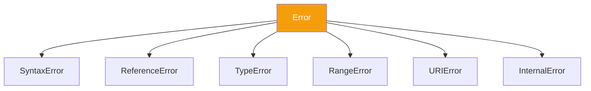

import { Tabs, TabItem, Aside, Badge, Card, CardGrid, Code, LinkCard } from '@astrojs/starlight/components';

## 🌳 The JavaScript Error Hierarchy

> In Java, `Throwable` is the root.  
> In **JavaScript**, the root is simply **`Error`**.  
> Unlike Java, JS does **not** distinguish between "Checked" and "Unchecked" exceptions. All errors are unchecked runtime events.

<Aside type="tip">
**🧠 Mental Model**:  
Think of the JS Error hierarchy as a **Flat List with Categories**.  
1. **`Error`**: The base class for all operational errors.  
2. **Specific Types**: `TypeError`, `ReferenceError`, etc., help you debug *why* it failed.  
3. **No Recovery Guarantee**: Unlike Java's Checked Exceptions, JS doesn't force you to handle them. If you don't catch them, the script stops (or the process crashes).
</Aside>

---

## 🔬 The Hierarchy Tree



| Error Type | Cause | Java Equivalent |
|------------|-------|-----------------|
| **Error** | Base class for all errors | `Exception` |
| **SyntaxError** | Invalid code structure | `Compilation Error` |
| **ReferenceError** | Variable not defined | `NoSuchFieldError` |
| **TypeError** | Operation on wrong type | `ClassCastException` / `NullPointerException` |
| **RangeError** | Number out of range | `IllegalArgumentException` |
| **URIError** | Bad URI handling | `IllegalArgumentException` |
| **EvalError** | `eval()` misuse | (None, deprecated) |

<Aside type="caution">
**Key Difference**: Java has `Error` (JVM crash) vs `Exception` (App logic).  
JS lumps almost everything under `Error`. System-level crashes (like Out of Memory) usually terminate the process immediately without throwing a catchable JS object in the same way.
</Aside>

---

## 💻 The `Error` Object API

Every error in JS is an object with standard properties.

<Code lang="js" title="Inspecting an Error Object" code={`
try {
    throw new TypeError("Invalid Input");
} catch (err) {
    console.log(err.name);    // "TypeError"
    console.log(err.message); // "Invalid Input"
    console.log(err.stack);   // Full stack trace string
    
    // Custom properties
    err.code = "INVALID_INPUT";
    console.log(err.code);    // "INVALID_INPUT"
}
`} />

### 🔑 Key Properties

| Property | Description |
|----------|-------------|
| `name` | The type of error (e.g., "TypeError") |
| `message` | Human-readable description |
| `stack` | String showing the call stack at creation |
| `cause` | (ES2022) The original error that caused this one |

---

## ⚔️ Error vs Exception in JS

In Java, this distinction is critical. In JS, it's blurred.

| Feature | Java | JavaScript |
|---------|------|------------|
| **Root Class** | `Throwable` | `Error` |
| **Checked?** | Yes (`IOException`) | **No**. All are unchecked. |
| **Compiler Check** | Enforces `try/catch` or `throws` | None. You can ignore errors. |
| **Recovery** | Expected for Checked Errors | Optional. Often leads to crashes. |
| **System Errors** | `OutOfMemoryError` (Uncatchable) | `RangeError` (Catchable, but OOM kills process) |

<Aside type="note">
**"Exception" in JS**: The term is used loosely. Technically, we throw `Error` objects. There is no separate `Exception` class in standard JS.
</Aside>

---

## 🏗️ Custom Errors

You can extend the `Error` class to create domain-specific errors.

<Code lang="js" title="Creating Custom Errors" code={`
class ValidationError extends Error {
    constructor(field, message) {
        super(message);
        this.name = "ValidationError";
        this.field = field;
    }
}

class DatabaseError extends Error {
    constructor(query, cause) {
        super(\`Query failed: $\{query}\`);
        this.name = "DatabaseError";
        this.cause = cause; // ES2022 standard property
    }
}

// Usage
try {
    throw new ValidationError("email", "Required");
} catch (err) {
    if (err instanceof ValidationError) {
        console.error(\`Field $\{err.field}: $\{err.message}\`);
    }
}
`} />

---

## ⚡ Async Errors — The Hierarchy Breaker

In Java, exceptions propagate up the thread stack.  
In JS, **Async operations break the stack**. An error thrown in a `setTimeout` or `Promise` cannot be caught by a surrounding `try/catch`.

<CardGrid>
  <Card title="❌ The Trap: Sync Try/Catch" icon="error">
    ```js
    try {
        setTimeout(() => {
            throw new Error("Async Fail");
        }, 0);
    } catch (e) {
        // NEVER catches it.
        // The try block finished before the timer fired.
    }
    ```
  </Card>
  
  <Card title="✅ The Fix: Promise Catch" icon="approve-check">
    ```js
    fetchData()
        .then(data => process(data))
        .catch(err => {
            // Catches errors in fetch OR process
            console.error(err);
        });
    ```
  </Card>

  <Card title="✅ The Modern Fix: Async/Await" icon="rocket">
    ```js
    async function run() {
        try {
            const data = await fetchData();
            process(data);
        } catch (err) {
            // Works because 'await' pauses execution
            console.error(err);
        }
    }
    ```
  </Card>
</CardGrid>

---

## 🛡️ Global Error Handlers

If an error isn't caught locally, it bubbles up to the global handler.

### In the Browser
1.  `window.onerror`: Catches synchronous errors.
2.  `window.onunhandledrejection`: Catches rejected Promises.

<Code lang="js" title="Browser Global Handlers" code={`
window.onerror = (msg, url, line, col, error) => {
    console.error(\`Global Error: $\{msg} at $\{line}:\${col}\`);
    return true; // Prevents default console logging
};

window.onunhandledrejection = (event) => {
    console.error("Unhandled Promise Rejection:", event.reason);
};
`} />

### In Node.js
1.  `process.on('uncaughtException')`: Catches sync errors.
2.  `process.on('unhandledRejection')`: Catches async errors.

<Code lang="js" title="Node.js Global Handlers" code={`
process.on('uncaughtException', (err) => {
    console.error('There was an uncaught error', err);
    process.exit(1); // Recommended: Exit to reset state
});

process.on('unhandledRejection', (reason, promise) => {
    console.error('Unhandled Rejection at:', promise, 'reason:', reason);
});
`} />

<Aside type="danger">
**🚨 Production Warning**: In Node.js, an `uncaughtException` leaves the process in an undefined state. It is best practice to **log the error and exit** (`process.exit(1)`), letting a process manager (like PM2 or Kubernetes) restart the app.
</Aside>

---

## 💣 Interview Traps

<CardGrid>
  <Card title="Trap 1: Swallowing Errors" icon="error">
    ```js
    try {
        doSomething();
    } catch (e) {
        // Empty block
    }
    // 😱 Silent failure. Debugging is impossible.
    // Always log or re-throw.
    ```
  </Card>
  
  <Card title="Trap 2: Throwing Strings" icon="caution">
    ```js
    throw "Something went wrong";
    // Valid JS, but BAD practice.
    // No stack trace, no 'name' property.
    // Always: throw new Error("Msg");
    ```
  </Card>

  <Card title="Trap 3: Catching Everything" icon="shield">
    ```js
    try {
        // ...
    } catch (e) {
        // Assumes e is an Error object.
        // But you can throw anything.
        if (e instanceof Error) {
            console.log(e.stack);
        }
    }
    ```
  </Card>
</CardGrid>

---

## 🎯 Interview Cheat Sheet

<CardGrid>
  <Card title="Q: What is the root of the JS error hierarchy?" icon="information">
    **`Error`**. All built-in errors (TypeError, ReferenceError, etc.) extend `Error`.
  </Card>
  
  <Card title="Q: Does JS have Checked Exceptions?" icon="error">
    **No.** All errors are unchecked. The compiler/interpreter does not force you to handle them.
  </Card>

  <Card title="Q: How do you handle async errors?" icon="approve-check">
    Use `.catch()` on Promises or `try/catch` with `async/await`. Standard `try/catch` does not work for asynchronous code.
  </Card>

  <Card title="Q: What is the `cause` property?" icon="rocket">
    Introduced in ES2022, `error.cause` allows chaining errors to preserve the original context, similar to Java's `initCause()`.
  </Card>
</CardGrid>

---

## 🧠 Full Mental Model Summary

```text
JS ERROR HIERARCHY CHECKLIST

1. Root:
   Error

2. Common Types:
   TypeError, ReferenceError, SyntaxError, RangeError

3. Handling:
   try/catch (Sync)
   .catch() / await (Async)

4. Global:
   window.onerror (Browser)
   process.on('uncaughtException') (Node)

⚠️ Key Differences from Java:
- No Checked Exceptions
- No 'Throwable' vs 'Exception' split
- Async breaks the call stack
- Uncaught errors crash Node, but not always Browser tabs
```

<Aside type="tip">
**Next Steps**:
1. ✅ Always `throw new Error()`, not strings.
2. ✅ Use `async/await` for clean async error handling.
3. ✅ Implement Global Error Boundaries (React) or Process Handlers (Node).
4. ✅ Use `error.cause` for error chaining.

Mastering errors ensures your app fails gracefully, not catastrophically. ☕✨
</Aside>
```

---

# 🌳 JavaScript Exception Hierarchy

---

## 🔰 What Are We Covering?

```
Exception_Hierarchy
├── Throwable
├── Error_vs_Exception
├── Checked_vs_Unchecked
└── Hierarchy_Tree
```

---

# 01 — Throwable

## 🔰 What Is Throwable in JavaScript?

In Java/C#, `Throwable` is a specific base class. In JavaScript, there is **no formal `Throwable` type** — but the concept exists: **any value can be thrown**. The implicit "throwable contract" is fulfilled by anything the `throw` keyword accepts.

```js
// JavaScript's "Throwable" = anything:
throw "a string";              // ✅ — strings are throwable
throw 42;                      // ✅ — numbers are throwable
throw true;                    // ✅ — booleans are throwable
throw null;                    // ✅ — null is throwable (bad idea)
throw undefined;               // ✅ — undefined is throwable (worst idea)
throw { code: 500 };           // ✅ — plain objects are throwable
throw new Error("message");    // ✅ — Error objects are throwable (BEST)
throw new TypeError("wrong");  // ✅ — subclasses are throwable
throw Symbol("id");            // ✅ — even Symbols are throwable
throw 42n;                     // ✅ — BigInt is throwable
```

---

## 📊 The Implicit Throwable Protocol

```
┌──────────────────────────────────────────────────────────┐
│         JAVASCRIPT THROWABLE CONTRACT                    │
│                                                          │
│  Java:       class Throwable { message, cause, stack }  │
│  JavaScript: ANY VALUE — no contract required            │
│                                                          │
│  BUT — to be USEFUL in a catch block, a throwable        │
│  should ideally have:                                    │
│                                                          │
│  ✅ .message   → human readable description              │
│  ✅ .stack     → where it happened (origin trace)        │
│  ✅ .name      → what kind of error                      │
│  ✅ .cause     → original error (ES2022)                 │
│                                                          │
│  Only Error objects and subclasses provide all four      │
│  → Error IS JavaScript's effective Throwable base class  │
└──────────────────────────────────────────────────────────┘
```

---

## 🔬 The Error Object — JS's Throwable Base

```js
// Error is the base "Throwable" in practice:
class Error {
  // Properties after construction:
  name    = "Error";          // overridden by subclasses
  message = "";               // constructor argument
  stack   = "<computed>";     // captured at construction time
  cause   = undefined;        // ES2022 — set via options.cause
}

// All built-in throwable types extend Error:
TypeError.prototype   instanceof Error; // true
RangeError.prototype  instanceof Error; // true
SyntaxError.prototype instanceof Error; // true
// etc.

// The one "throwable" thing that does NOT extend Error:
// → Any primitive: string, number, boolean, null, undefined
// → Plain objects: { message: "oops" }
// These are valid throwables but BAD practice — no stack trace
```

---

## 🔬 Why Only Throw Error Objects

```js
// NON-Error throwables lose critical information:

// String throw — no stack, no instanceof:
try {
  throw "database connection failed";
} catch (err) {
  typeof err;          // "string"
  err.stack;           // undefined 😱
  err.message;         // undefined 😱 — "message" isn't a string property
  err instanceof Error; // false 😱
  // Cannot do: if (err instanceof DatabaseError)
  // Cannot do: err.cause — undefined
  // Stack trace: completely lost 😱
}

// Plain object throw — no stack, no instanceof:
try {
  throw { code: 500, message: "Internal Error" };
} catch (err) {
  err.message;         // "Internal Error" — but no stack 😱
  err.stack;           // undefined 😱
  err instanceof Error; // false 😱
}

// Error throw — full information:
try {
  throw new Error("database connection failed");
} catch (err) {
  err.message;          // "database connection failed" ✅
  err.stack;            // full stack trace ✅
  err instanceof Error; // true ✅
  err.name;             // "Error" ✅
}
```

---

## 🔬 V8 Internals — How `throw` Works

```
┌──────────────────────────────────────────────────────────┐
│         V8 THROW MECHANISM                               │
│                                                          │
│  throw expr                                              │
│      │                                                   │
│      ▼                                                   │
│  Ignition bytecode: Throw                               │
│      │                                                   │
│      ▼                                                   │
│  1. Evaluate expr → get throwable value (any JS value)  │
│  2. Store in Thread::pending_exception                   │
│  3. Set Isolate::has_pending_exception = true            │
│  4. Return EXCEPTION sentinel to current frame           │
│      │                                                   │
│      ▼                                                   │
│  Frame checks: do I have a try/catch?                    │
│  NO  → pop frame → propagate to parent                  │
│  YES → jump to catch handler                            │
│       clear pending_exception                            │
│       bind caught value to catch variable               │
│                                                          │
│  NOTE: Throwing non-Error values works identically       │
│  V8 doesn't care what type the throwable is              │
│  The DIFFERENCE is only in usability after catch         │
└──────────────────────────────────────────────────────────┘
```

---

## 🏭 The "Effective Throwable" Pattern

```js
// Define an effective Throwable base for your application:
class AppThrowable extends Error {
  #code;
  #context;
  #timestamp;

  constructor(message, { code, context = {}, cause } = {}) {
    super(message, { cause }); // passes cause to Error ✅

    // Fix name to actual subclass:
    this.name      = new.target.name;
    this.#code     = code ?? "UNKNOWN_ERROR";
    this.#context  = Object.freeze(context);
    this.#timestamp = new Date().toISOString();

    // Remove this constructor from stack trace:
    Error.captureStackTrace?.(this, new.target);
  }

  get code()      { return this.#code; }
  get context()   { return this.#context; }
  get timestamp() { return this.#timestamp; }

  // Serialize for logging/transport:
  toJSON() {
    return {
      name:      this.name,
      message:   this.message,
      code:      this.#code,
      context:   this.#context,
      timestamp: this.#timestamp,
      stack:     this.stack,
      cause:     this.cause instanceof Error
                 ? { name: this.cause.name, message: this.cause.message }
                 : this.cause,
    };
  }

  toString() {
    return `[${this.name}(${this.#code})] ${this.message}`;
  }
}

// Everything throwable in your app extends AppThrowable:
class ValidationError    extends AppThrowable { }
class DatabaseError      extends AppThrowable { }
class AuthorizationError extends AppThrowable { }
class NetworkError       extends AppThrowable { }
```

---

# 02 — Error vs Exception

## 🔰 The Conceptual Distinction

```
┌──────────────────────────────────────────────────────────┐
│         ERROR vs EXCEPTION — THE DISTINCTION             │
│                                                          │
│  ERROR (the object):                                     │
│  → A data structure describing what went wrong           │
│  → Can exist without disrupting program flow             │
│  → Creating it = just allocating an object               │
│                                                          │
│  EXCEPTION (the event):                                  │
│  → The ACT of throwing — disrupts execution flow         │
│  → Propagates up the call stack                          │
│  → Changes execution path                                │
│                                                          │
│  Analogy:                                                │
│  Error   = writing "FIRE" on a piece of paper           │
│  Exception = actually throwing that paper and yelling   │
│                                                          │
│  const err = new Error("fire"); // just an object        │
│  throw err;                      // NOW it's an exception│
└──────────────────────────────────────────────────────────┘
```

---

## 📊 Errors That Don't Become Exceptions

```js
// Error objects used as DATA — no exception thrown:

// Pattern 1 — result type (functional style):
class Result {
  static ok(value)  { return new Result(value, null); }
  static err(error) { return new Result(null, error); }

  constructor(value, error) {
    this.value = value;
    this.error = error; // Error object — but NOT thrown
  }

  isOk()  { return this.error === null; }
  isErr() { return this.error !== null; }
}

async function parseJSON(text) {
  try {
    return Result.ok(JSON.parse(text));
  } catch (err) {
    return Result.err(err); // Error object in result — no exception ✅
  }
}

const result = await parseJSON("invalid json");
if (result.isErr()) {
  // result.error is a SyntaxError — but no exception was thrown upstream
  console.log(result.error.message); // handle gracefully
}

// Pattern 2 — error as context, logged not thrown:
const operationErrors = [];

for (const item of items) {
  try {
    await processItem(item);
  } catch (err) {
    operationErrors.push({  // collect Error objects — don't throw
      item,
      error: err,
      at: new Date()
    });
  }
}

// All items processed, errors collected — no exception propagated
if (operationErrors.length > 0) {
  logger.warn("Some items failed:", operationErrors);
}
```

---

## 📊 Exception vs Error — Four Combinations

```
┌──────────────────────────────────────────────────────────┐
│         FOUR COMBINATIONS                                │
│                                                          │
│  1. Error object + Exception (MOST COMMON):              │
│     throw new Error("msg") → Error IS the exception     │
│                                                          │
│  2. Error object + No exception:                         │
│     const e = new Error("msg") → just data, not thrown  │
│     Result.err(e) / logger.error(e) / errors.push(e)    │
│                                                          │
│  3. Exception + No Error object:                         │
│     throw "string" / throw 42 / throw null              │
│     Exception occurs — but throwable is NOT an Error    │
│                                                          │
│  4. Neither:                                             │
│     Normal function return — no error, no exception     │
└──────────────────────────────────────────────────────────┘
```

---

## 🔬 JavaScript's Exception Model — Key Properties

### 1. Single Exception in Flight

```js
// Only ONE exception can be in flight per execution context:
function multiThrow() {
  try {
    throw new Error("first");    // exception 1 in flight
    throw new Error("second");   // NEVER reached
  } catch (err) {
    console.log(err.message);    // "first" only
    // exception 1 cleared
    throw new Error("third");    // exception 3 in flight now
  }
}

// AggregateError — explicitly collect MULTIPLE errors:
const errors = [new Error("A"), new Error("B"), new Error("C")];
throw new AggregateError(errors, "Multiple operations failed");
// catch:
// err.errors → [Error: A, Error: B, Error: C]
// err.message → "Multiple operations failed"
```

### 2. Exceptions are Objects — Reference Semantics

```js
// The caught error IS the thrown object — same reference:
const original = new Error("original");

try {
  original.extra = "added before throw";
  throw original;
} catch (err) {
  console.log(err === original); // true ✅ — same object
  console.log(err.extra);        // "added before throw" ✅

  // Mutating caught error:
  err.handledBy = "auth middleware";
}

// original is mutated:
console.log(original.handledBy); // "auth middleware" — same reference
```

### 3. finally Always Runs — Even After Throw

```js
function withFinally() {
  try {
    throw new Error("oops");
  } finally {
    console.log("finally runs"); // ✅ — always
    // Does NOT suppress the exception (unless you throw/return here)
  }
}

// Exception STILL propagates after finally:
try {
  withFinally();
} catch (err) {
  console.log(err.message); // "oops" ✅ — exception was NOT suppressed
}
// Output order:
// "finally runs"
// "oops"
```

---

## 🏭 Error vs Exception in Production

```js
// Production pattern — distinguish Error (data) from Exception (disruption):

class ServiceResult {
  #value;
  #error;
  #warnings;

  static success(value, warnings = []) {
    const r = new ServiceResult();
    r.#value    = value;
    r.#error    = null;
    r.#warnings = warnings;
    return r;
  }

  static failure(error, warnings = []) {
    if (!(error instanceof Error)) {
      // Force all errors to be proper Error objects:
      error = new Error(String(error));
    }
    const r = new ServiceResult();
    r.#value    = null;
    r.#error    = error;
    r.#warnings = warnings;
    return r;
  }

  get value()    { return this.#value; }
  get error()    { return this.#error; }
  get warnings() { return [...this.#warnings]; }
  get isOk()     { return this.#error === null; }

  // Force caller to handle both cases:
  match({ ok, err }) {
    return this.isOk ? ok(this.#value) : err(this.#error);
  }

  // Throw the error IF there is one — explicit exception from error:
  orThrow() {
    if (this.#error) throw this.#error; // Error → Exception ✅
    return this.#value;
  }
}

// Usage:
async function getUserById(id) {
  try {
    const user = await db.users.findById(id);
    if (!user) return ServiceResult.failure(
      new NotFoundError(`User ${id} not found`) // Error object — not thrown
    );
    return ServiceResult.success(user);
  } catch (err) {
    return ServiceResult.failure(
      new DatabaseError("Query failed", { cause: err }) // wrapped — not re-thrown
    );
  }
}

// Consumer decides whether to throw or handle:
const result = await getUserById(42);

// Option A — handle explicitly (no exception):
result.match({
  ok:  user  => renderUser(user),
  err: error => renderError(error.message),
});

// Option B — let it throw (convert Error to Exception):
const user = result.orThrow(); // throws if error ← explicit conversion
```

---

# 03 — Checked vs Unchecked

## 🔰 The Concept in JS

JavaScript has **no compiler-enforced checked exceptions** (unlike Java). But the **concepts** map to real patterns:

```
┌──────────────────────────────────────────────────────────┐
│         CHECKED vs UNCHECKED IN JAVASCRIPT               │
│                                                          │
│  Java:                                                   │
│  Checked   → compiler FORCES you to handle               │
│  Unchecked → optional to handle (RuntimeException)       │
│                                                          │
│  JavaScript:                                             │
│  NO compiler enforcement — everything is "unchecked"     │
│                                                          │
│  BUT conceptually:                                       │
│                                                          │
│  "Checked" analog   → recoverable errors you SHOULD      │
│                        explicitly handle                  │
│                        (network failure, file not found, │
│                         validation error, auth failure)  │
│                                                          │
│  "Unchecked" analog → programming bugs you CANNOT        │
│                        meaningfully recover from          │
│                        (TypeError, ReferenceError,        │
│                         assertion failures)               │
└──────────────────────────────────────────────────────────┘
```

---

## 📊 Unchecked Exceptions — Programming Errors / Bugs

```js
// UNCHECKED — programming bugs, should NOT be caught and swallowed:

// TypeError — wrong type used:
null.property;                    // programming bug 😱
undefined();                      // programming bug 😱
1 + Symbol();                     // programming bug 😱

// ReferenceError — undeclared variable:
console.log(undeclaredVar);       // programming bug 😱

// RangeError (programming):
new Array(-1);                    // programming bug 😱
(1).toFixed(-1);                  // programming bug 😱

// SyntaxError — invalid code:
eval("function (");               // programming bug 😱

// These represent BUGS in code — not expected runtime conditions
// Catching and swallowing them hides bugs 😱:
try {
  processUser(null); // passes null where object expected
} catch (err) {
  // Catching TypeError here HIDES a bug — null check missing
  console.log("error, continuing..."); // 😱 dangerous
}

// CORRECT — let programming errors crash (or alert):
// → Fix the null check in the calling code
// → Don't catch what you can't meaningfully handle
```

---

## 📊 Checked Exceptions — Expected Recoverable Conditions

```js
// CHECKED ANALOG — expected runtime conditions, MUST be handled:

// Network failure — expected in distributed systems:
try {
  const res = await fetch("https://api.example.com/data");
  if (!res.ok) throw new NetworkError(`HTTP ${res.status}`);
  return await res.json();
} catch (err) {
  if (err instanceof NetworkError) {
    return fallbackData(); // ✅ recoverable — use fallback
  }
  throw err; // re-throw unexpected errors (programming bugs)
}

// Validation failure — expected from user input:
function validateAge(age) {
  if (!Number.isInteger(age) || age < 0 || age > 150) {
    throw new ValidationError("age", `Invalid age: ${age}`); // expected ✅
  }
}

// Authentication failure — expected:
async function authenticate(token) {
  if (!token) throw new UnauthorizedError("No token provided");
  const payload = await verifyJWT(token);
  if (payload.exp < Date.now() / 1000) throw new UnauthorizedError("Token expired");
  return payload;
}

// File not found — expected in file I/O:
import { readFile } from "fs/promises";
try {
  const content = await readFile("config.json", "utf8");
  return JSON.parse(content);
} catch (err) {
  if (err.code === "ENOENT") {
    return getDefaultConfig(); // ✅ recoverable
  }
  throw err;
}
```

---

## 🔬 The Classification Framework

```js
// Classify errors explicitly:
class AppError extends Error {
  // Checked = true → caller SHOULD handle this explicitly:
  static CHECKED = true;
}

class ProgrammingError extends Error {
  // Checked = false → represents a bug, should propagate:
  static CHECKED = false;
}

// ── Checked (recoverable) ──────────────────────────────
class ValidationError    extends AppError { static code = "VALIDATION"; }
class NotFoundError      extends AppError { static code = "NOT_FOUND"; }
class UnauthorizedError  extends AppError { static code = "UNAUTHORIZED"; }
class ForbiddenError     extends AppError { static code = "FORBIDDEN"; }
class ConflictError      extends AppError { static code = "CONFLICT"; }
class NetworkError       extends AppError { static code = "NETWORK"; }
class RateLimitError     extends AppError { static code = "RATE_LIMIT"; }
class TimeoutError       extends AppError { static code = "TIMEOUT"; }
class ServiceUnavailable extends AppError { static code = "SERVICE_DOWN"; }

// ── Unchecked (bugs) ───────────────────────────────────
class AssertionError     extends ProgrammingError { }
class InvariantError     extends ProgrammingError { }
class IllegalStateError  extends ProgrammingError { }
class NotImplementedError extends ProgrammingError { }

// Router — handles checked, propagates unchecked:
function errorMiddleware(err, req, res, next) {
  // Checked — return appropriate HTTP response:
  if (err instanceof ValidationError)   return res.status(400).json(err.toJSON());
  if (err instanceof UnauthorizedError) return res.status(401).json(err.toJSON());
  if (err instanceof ForbiddenError)    return res.status(403).json(err.toJSON());
  if (err instanceof NotFoundError)     return res.status(404).json(err.toJSON());
  if (err instanceof ConflictError)     return res.status(409).json(err.toJSON());
  if (err instanceof RateLimitError)    return res.status(429).json(err.toJSON());
  if (err instanceof ServiceUnavailable)return res.status(503).json(err.toJSON());

  // Unchecked / programming errors — log and 500:
  logger.error("Unexpected error:", err);
  res.status(500).json({ error: "Internal Server Error" });
  // Don't expose details of programming bugs ✅
}
```

---

## 🔬 Enforcing "Checked" in JS — TypeScript Approach

```js
// Without TypeScript — document and enforce via pattern:

/**
 * @throws {ValidationError} if data is invalid
 * @throws {ConflictError}   if email already exists
 * @returns {Promise<User>}
 */
async function createUser(data) {
  validateUserData(data);   // throws ValidationError — CHECKED
  await checkEmailUnique(data.email); // throws ConflictError — CHECKED
  return db.users.create(data);
}

// TypeScript approach — exhaustive error handling:
// (conceptual — shows how TS would enforce "checked" pattern)
type Result<T, E extends Error> =
  | { ok: true;  value: T }
  | { ok: false; error: E };

// Function declares ALL possible error types:
// async function createUser(data: UserData):
//   Promise<Result<User, ValidationError | ConflictError>>

// Caller MUST handle all error cases or TS compile error
```

---

## 🔬 The Checked/Unchecked Decision Rule

```
┌──────────────────────────────────────────────────────────┐
│         SHOULD THIS BE CHECKED OR UNCHECKED?             │
│                                                          │
│  Ask: "Is this an expected runtime condition             │
│        that a well-written program should handle?"       │
│                                                          │
│  YES → CHECKED (extend AppError / recoverable):          │
│  → User provides invalid input                           │
│  → External service is down                              │
│  → Resource not found                                    │
│  → Authentication fails                                  │
│  → Rate limit exceeded                                   │
│  → File doesn't exist                                    │
│  → DB constraint violation                               │
│  → Network timeout                                       │
│                                                          │
│  NO → UNCHECKED (extend ProgrammingError / bug):         │
│  → Calling a method on null/undefined                    │
│  → Passing wrong type to function                        │
│  → Accessing array out of bounds                         │
│  → Breaking class invariants                             │
│  → Calling abstract method without override              │
│  → Feature not yet implemented                           │
└──────────────────────────────────────────────────────────┘
```

---

# 04 — Hierarchy Tree

## 🔰 The Complete JavaScript Error Hierarchy

```
Throwable (concept — any value can be thrown)
│
└── Error (base class — the practical Throwable)
    │
    ├── EvalError              ← eval() misuse (legacy — almost never seen)
    │
    ├── RangeError             ← value out of allowed range
    │   Examples:
    │   • new Array(-1)
    │   • (1).toFixed(200)
    │   • Maximum call stack size exceeded
    │   • Invalid string length
    │
    ├── ReferenceError         ← invalid reference / undeclared identifier
    │   Examples:
    │   • undeclaredVar (not declared)
    │   • let x = y (TDZ — y not yet initialized)
    │   • super() before new in derived class
    │
    ├── SyntaxError            ← invalid syntax (PARSE time — before execution)
    │   Examples:
    │   • eval("let let = 5")
    │   • JSON.parse("invalid")
    │   • import x from  (missing module path)
    │
    ├── TypeError              ← wrong type for operation
    │   Examples:
    │   • null.property
    │   • undefined()
    │   • 1 + Symbol()
    │   • new 42 (not a constructor)
    │   • x = "string"; x.push(1)
    │
    ├── URIError               ← malformed URI encoding
    │   Examples:
    │   • decodeURIComponent("%")
    │   • decodeURI("%")
    │
    └── AggregateError (ES2021) ← multiple errors grouped
        Examples:
        • Promise.any([...all rejections])
        • err.errors = [Error, Error, Error]
```

---

## 📊 Custom Error Hierarchy — Production Design

```
Error (JS built-in)
│
└── AppError (application base — "checked" analog)
    │   code, context, cause, timestamp, toJSON()
    │
    ├── ClientError (4xx — client caused it)
    │   │
    │   ├── ValidationError       400 — invalid input data
    │   │   └── SchemaError       400 — schema validation failed
    │   │
    │   ├── UnauthorizedError     401 — not authenticated
    │   │   └── TokenExpiredError 401 — JWT expired
    │   │
    │   ├── ForbiddenError        403 — authenticated but no permission
    │   │   └── InsufficientRoleError 403 — wrong role
    │   │
    │   ├── NotFoundError         404 — resource doesn't exist
    │   │   ├── UserNotFoundError
    │   │   └── OrderNotFoundError
    │   │
    │   ├── ConflictError         409 — state conflict
    │   │   └── DuplicateEmailError
    │   │
    │   └── RateLimitError        429 — too many requests
    │
    ├── ServerError (5xx — server caused it)
    │   │
    │   ├── DatabaseError         503 — DB operation failed
    │   │   ├── QueryError        — SQL/query failed
    │   │   ├── ConnectionError   — DB unreachable
    │   │   └── TransactionError  — transaction rollback
    │   │
    │   ├── NetworkError          503 — external service unreachable
    │   │   ├── TimeoutError      — request timed out
    │   │   └── DNSError          — DNS resolution failed
    │   │
    │   ├── ServiceError          502 — upstream service error
    │   │   ├── PaymentGatewayError
    │   │   └── EmailServiceError
    │   │
    │   └── StorageError          — file/object storage failed
    │
    └── ProgrammingError ("unchecked" analog — bugs)
        │
        ├── AssertionError        — assertion violated
        ├── InvariantError        — class invariant broken
        ├── NotImplementedError   — abstract method not overridden
        └── IllegalStateError     — object in invalid state
```

---

## 🔬 Complete Implementation

```js
// ── Base ──────────────────────────────────────────────────
class AppError extends Error {
  #code; #context; #timestamp;

  constructor(message, { code = "APP_ERROR", context = {}, cause } = {}) {
    super(message, { cause });
    this.name       = new.target.name;
    this.#code      = code;
    this.#context   = Object.freeze({ ...context });
    this.#timestamp = new Date().toISOString();
    Error.captureStackTrace?.(this, new.target);
  }

  get code()      { return this.#code; }
  get context()   { return this.#context; }
  get timestamp() { return this.#timestamp; }

  toJSON() {
    return {
      name:      this.name,
      message:   this.message,
      code:      this.#code,
      context:   this.#context,
      timestamp: this.#timestamp,
      cause:     this.cause
                   ? { name: this.cause.name, message: this.cause.message }
                   : undefined,
    };
  }

  toString() { return `[${this.name}/${this.#code}] ${this.message}`; }
}

// ── Client Errors (4xx) ───────────────────────────────────
class ClientError extends AppError { }

class ValidationError extends ClientError {
  #fields;
  constructor(fields, message = "Validation failed") {
    const fieldList = Array.isArray(fields) ? fields : [fields];
    super(message, {
      code:    "VALIDATION_ERROR",
      context: { fields: fieldList },
    });
    this.#fields = fieldList;
  }
  get fields() { return [...this.#fields]; }
  get httpStatus() { return 400; }
}

class UnauthorizedError extends ClientError {
  constructor(message = "Authentication required", opts = {}) {
    super(message, { code: "UNAUTHORIZED", ...opts });
  }
  get httpStatus() { return 401; }
}

class TokenExpiredError extends UnauthorizedError {
  constructor(expiredAt) {
    super("Token has expired", { code: "TOKEN_EXPIRED", context: { expiredAt } });
  }
}

class ForbiddenError extends ClientError {
  constructor(message = "Access denied", opts = {}) {
    super(message, { code: "FORBIDDEN", ...opts });
  }
  get httpStatus() { return 403; }
}

class NotFoundError extends ClientError {
  constructor(resource, id) {
    super(`${resource} not found`, {
      code:    "NOT_FOUND",
      context: { resource, id },
    });
  }
  get httpStatus() { return 404; }
}

class ConflictError extends ClientError {
  constructor(message, opts = {}) {
    super(message, { code: "CONFLICT", ...opts });
  }
  get httpStatus() { return 409; }
}

class RateLimitError extends ClientError {
  #resetAt;
  constructor(resetAt) {
    super("Rate limit exceeded", {
      code:    "RATE_LIMIT",
      context: { resetAt },
    });
    this.#resetAt = resetAt;
  }
  get httpStatus()  { return 429; }
  get resetAt()     { return this.#resetAt; }
}

// ── Server Errors (5xx) ───────────────────────────────────
class ServerError extends AppError { }

class DatabaseError extends ServerError {
  constructor(message, opts = {}) {
    super(message, { code: "DATABASE_ERROR", ...opts });
  }
  get httpStatus() { return 503; }
}

class ConnectionError extends DatabaseError {
  constructor(host, cause) {
    super(`Cannot connect to database at ${host}`, {
      code:    "DB_CONNECTION_ERROR",
      context: { host },
      cause,
    });
  }
}

class TransactionError extends DatabaseError {
  constructor(message, cause) {
    super(message, { code: "TRANSACTION_ERROR", cause });
  }
}

class NetworkError extends ServerError {
  constructor(message, opts = {}) {
    super(message, { code: "NETWORK_ERROR", ...opts });
  }
  get httpStatus() { return 502; }
}

class TimeoutError extends NetworkError {
  constructor(operation, timeoutMs) {
    super(`${operation} timed out after ${timeoutMs}ms`, {
      code:    "TIMEOUT_ERROR",
      context: { operation, timeoutMs },
    });
  }
}

// ── Programming Errors (bugs) ─────────────────────────────
class ProgrammingError extends Error {
  constructor(message, context = {}) {
    super(message);
    this.name    = new.target.name;
    this.context = context;
    Error.captureStackTrace?.(this, new.target);
  }
}

class AssertionError extends ProgrammingError {
  constructor(condition, actual) {
    super(`Assertion failed: expected ${condition}`, { actual });
  }
}

class NotImplementedError extends ProgrammingError {
  constructor(methodName) {
    super(`${methodName}() is not implemented`);
  }
}

class IllegalStateError extends ProgrammingError {
  constructor(message, state = {}) {
    super(message, { state });
  }
}
```

---

## 🔬 Hierarchy in Action — Type-Safe Error Routing

```js
// Express error middleware using full hierarchy:
function errorMiddleware(err, req, res, next) {
  // ── Log based on severity ────────────────────────────
  if (err instanceof ProgrammingError || !(err instanceof AppError)) {
    logger.error("CRITICAL", { err, req: { url: req.url, method: req.method } });
  } else if (err instanceof ServerError) {
    logger.warn("SERVER_ERROR", { err, req: { url: req.url } });
  } else {
    logger.info("CLIENT_ERROR", { err, req: { url: req.url } });
  }

  // ── Respond based on type ────────────────────────────
  if (err instanceof ValidationError) {
    return res.status(400).json({
      error:  err.toJSON(),
      fields: err.fields,
    });
  }

  if (err instanceof TokenExpiredError) {
    return res.status(401).json({
      error:   err.toJSON(),
      refresh: true, // hint to client
    });
  }

  if (err instanceof UnauthorizedError) {
    return res.status(401).json({ error: err.toJSON() });
  }

  if (err instanceof ForbiddenError) {
    return res.status(403).json({ error: err.toJSON() });
  }

  if (err instanceof NotFoundError) {
    return res.status(404).json({ error: err.toJSON() });
  }

  if (err instanceof ConflictError) {
    return res.status(409).json({ error: err.toJSON() });
  }

  if (err instanceof RateLimitError) {
    res.setHeader("Retry-After", Math.ceil((err.resetAt - Date.now()) / 1000));
    return res.status(429).json({ error: err.toJSON() });
  }

  if (err instanceof ServerError) {
    return res.status(503).json({
      error: { name: err.name, message: "Service temporarily unavailable" }
      // Don't expose server internals ✅
    });
  }

  // Unknown / programming errors:
  return res.status(500).json({
    error: { name: "InternalServerError", message: "Something went wrong" }
    // Never expose programming error details to client ✅
  });
}

// Use instanceof chain correctly:
const err = new TokenExpiredError(Date.now() - 3600000);

err instanceof TokenExpiredError;  // true ✅
err instanceof UnauthorizedError;  // true ✅ — inherited
err instanceof ClientError;        // true ✅ — inherited
err instanceof AppError;           // true ✅ — inherited
err instanceof Error;              // true ✅ — inherited
err instanceof ServerError;        // false ✅
err instanceof ProgrammingError;   // false ✅
```

---

## 💀 Interview Traps

### Trap 1: `instanceof` fails with re-created Error classes

```js
// Module A creates NotFoundError:
class NotFoundError extends Error { }

// Module B creates its OWN NotFoundError:
class NotFoundError extends Error { } // different class object!

const errA = new (require("./moduleA").NotFoundError)();
const errB = new (require("./moduleB").NotFoundError)();

// Different class objects → instanceof fails across modules:
errA instanceof require("./moduleB").NotFoundError; // false 😱

// Fix — single source of truth for error hierarchy:
// errors.mjs — ONE file exports ALL error classes
// Everyone imports from errors.mjs — same class objects ✅
import { NotFoundError } from "./errors.mjs";
```

---

### Trap 2: `extends Error` — `name` not automatically set to subclass name

```js
class ApiError extends Error {
  constructor(message) {
    super(message);
    // WITHOUT this line:
    // this.name = "ApiError"; ← easy to forget 😱
  }
}

const err = new ApiError("failed");
err.name;     // "Error" 😱 — NOT "ApiError"
err.toString(); // "Error: failed" 😱 — not "ApiError: failed"

// Fix — always set name:
class ApiError extends Error {
  constructor(message, opts) {
    super(message, opts);
    this.name = new.target.name; // ✅ "ApiError", or whatever subclass
  }
}

new ApiError("failed").name; // "ApiError" ✅
```

---

### Trap 3: `AggregateError` — errors property, not message

```js
// AggregateError — contains multiple errors:
const agg = new AggregateError(
  [new Error("A"), new TypeError("B"), new RangeError("C")],
  "Multiple failures"
);

agg.message;  // "Multiple failures" — the aggregate message ✅
agg.errors;   // [Error: A, TypeError: B, RangeError: C] ← the array ✅
agg.errors[0].message; // "A" ✅

// Catching and accessing:
Promise.any([
  Promise.reject(new Error("first")),
  Promise.reject(new Error("second")),
]).catch(err => {
  err instanceof AggregateError; // true ✅
  err.errors.forEach(e => console.log(e.message)); // "first", "second"
  // err.message → "All promises were rejected"
});

// TRAP — not an array, but array-like:
agg.errors.map(e => e.message); // ✅ it IS a real array
agg.errors.length;               // 3 ✅
```

---

### Trap 4: `catch` catches ALL throwables — including primitives

```js
// catch(err) is untyped — err could be ANYTHING:
function dangerousCode() {
  throw "a string"; // someone throws a string (bad code)
}

try {
  dangerousCode();
} catch (err) {
  // err is a string — NOT an Error:
  err.message; // undefined 😱
  err.stack;   // undefined 😱
  err instanceof Error; // false 😱

  // Must guard before using Error properties:
  const message = err instanceof Error ? err.message : String(err);
  const stack   = err instanceof Error ? err.stack : "no stack";
}

// Defensive catch pattern for third-party code:
function safeExecute(fn) {
  try {
    return { value: fn(), error: null };
  } catch (thrown) {
    // Normalize any thrown value to Error:
    const error = thrown instanceof Error
      ? thrown
      : new Error(typeof thrown === "string" ? thrown : JSON.stringify(thrown));
    return { value: null, error };
  }
}
```

---

### Trap 5: Catching base class swallows all subclasses

```js
// WRONG — catches MORE than intended:
try {
  await processPayment(order);
} catch (err) {
  if (err instanceof AppError) {
    // This catches ValidationError, NetworkError, DatabaseError...
    // ALL of them — even ones you shouldn't handle here 😱
    res.status(400).json({ error: err.message });
  }
}

// RIGHT — catch most specific type first:
try {
  await processPayment(order);
} catch (err) {
  if (err instanceof ValidationError) {
    return res.status(400).json({ error: err.message, fields: err.fields });
  }
  if (err instanceof PaymentGatewayError) {
    return res.status(502).json({ error: "Payment service unavailable" });
  }
  // Re-throw what you can't handle:
  throw err; // ✅ propagate up
}
```

---

## 📊 Hierarchy Properties — Quick Reference

```
┌──────────────────────────────────────────────────────────┐
│         BUILT-IN ERROR TYPE TRIGGERS                     │
├─────────────────────────┬────────────────────────────────┤
│ Error Type              │ Triggered By                   │
├─────────────────────────┼────────────────────────────────┤
│ Error (base)            │ new Error() / throw            │
│ RangeError              │ new Array(-1), toFixed(999)    │
│ ReferenceError          │ undeclared var, TDZ access     │
│ TypeError               │ null.x, undefined(), wrong op  │
│ SyntaxError             │ JSON.parse(bad), eval(bad)     │
│ URIError                │ decodeURIComponent("%")        │
│ EvalError               │ eval() misuse (legacy)         │
│ AggregateError          │ Promise.any(all rejected)      │
│ RangeError (stack)      │ Maximum call stack exceeded    │
└─────────────────────────┴────────────────────────────────┘
```

---

## 📊 DSA / Internals Connection

> The error class hierarchy is an **n-ary tree** — `Error` is the root, built-in errors and custom hierarchies form the branches. `instanceof` checks implement **ancestor search** on this tree — traversing the `[[Prototype]]` chain upward. This is O(depth) in the worst case, where depth = class hierarchy depth.
>
> The checked/unchecked distinction mirrors **compiler theory**: checked exceptions are part of a function's **type signature** (in TypeScript or JSDoc annotated JS), unchecked are implicit side effects. TypeScript's `Result<T, E>` pattern encodes error types in the return type — making "checked exceptions" expressible in JS's type system.
>
> `AggregateError` implements the **composite pattern** — treating a collection of errors as a single error. This is the same pattern as `Promise.allSettled` results or batch operation failures where you need to report N individual failures as one logical unit while preserving each error's identity.

---

