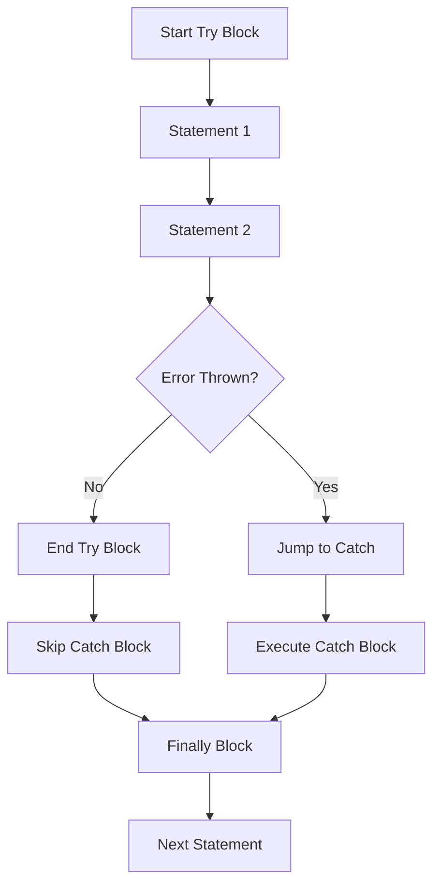

import { Tabs, TabItem, Aside, Badge, Card, CardGrid, Code, LinkCard } from '@astrojs/starlight/components';

## 🎯 try-catch in JavaScript

> In Java, `try-catch` is mandatory for Checked Exceptions.  
> In **JavaScript**, `try-catch` is **optional**. All errors are unchecked. If you don't catch them, they crash the script (Node) or stop execution (Browser).

<Aside type="tip">
**🧠 Mental Model**:  
Think of `try-catch` as a **Safety Net**.  
1. Code runs in `try`.  
2. If an error occurs, execution **jumps immediately** to `catch`.  
3. The rest of the `try` block is **skipped**.  
4. If no error occurs, `catch` is **ignored**.  
⚠️ **Key Difference**: JS has no "Checked" exceptions. You won't know if a function throws until it actually does.
</Aside>

---

## 🔬 Syntax & Forms

JavaScript supports standard `try-catch-finally` blocks.

<Code lang="js" title="Basic Structure" code={`
// Form 1: Basic
try {
    // Risky code
    const data = JSON.parse(invalidJson);
} catch (error) {
    // Handle error
    console.error(error.message);
}

// Form 2: With Finally (Always runs)
try {
    connectToDB();
} catch (error) {
    console.error("Connection failed");
} finally {
    closeConnection(); // Always executes
}

// Form 3: Async/Await (Modern)
async function loadData() {
    try {
        const res = await fetch('/api/data');
        const data = await res.json();
    } catch (error) {
        console.error("Fetch failed", error);
    }
}
`} />

<Aside type="caution">
**No Multi-Catch**: Unlike Java (`catch (IO | SQL e)`), JS does not support multi-catch syntax. You must use `if/else` inside a single `catch` block to handle different error types.
</Aside>

---

## 🔬 Execution Flow — Exact Mechanics

The flow is identical to Java: **Linear until error, then jump.**



<Code lang="js" title="Flow Example" code={`
console.log("1. Start");

try {
    console.log("2. Try Start");
    throw new Error("Boom!");
    console.log("3. This is SKIPPED"); 
} catch (err) {
    console.log("4. Caught:", err.message);
}

console.log("5. End");

// Output:
// 1. Start
// 2. Try Start
// 4. Caught: Boom!
// 5. End
`} />

---

## 💻 Real-World Code — Payment Service

In JS, we rely on **Error Types** and **Custom Properties** to distinguish errors, since the compiler doesn't help us.

<Code lang="js" title="Handling Specific Errors" code={`
class PaymentError extends Error {
    constructor(code, message) {
        super(message);
        this.name = "PaymentError";
        this.code = code;
    }
}

async function chargeCustomer(customerId, amount) {
    try {
        validateAmount(amount); // Throws ValidationError
        const customer = await getCustomer(customerId); // Throws NotFoundError
        
        await gateway.charge(customer.token, amount); // Throws PaymentError
        
        return { success: true };

    } catch (error) {
        // Distinguish errors manually
        if (error.name === 'ValidationError') {
            console.warn("Bad input:", error.message);
            return { success: false, reason: 'INVALID_INPUT' };
        } 
        
        if (error.name === 'NotFoundError') {
            console.warn("Customer missing");
            return { success: false, reason: 'NOT_FOUND' };
        }

        // Generic fallback
        console.error("System Error:", error);
        throw new PaymentError('SYSTEM_ERROR', 'Charge failed');
    }
}
`} />

<Aside type="danger">
**🚨 Production Bug**: Using a generic `catch (e) {}` without logging.  
If you swallow the error, you lose the stack trace. Always log `error.stack` or use a logging service.
</Aside>

---

## 🔀 Control Flow Nuances

### 1. Return Inside Try/Catch

<Code lang="js" title="Return Behavior" code={`
function getValue(x) {
    try {
        if (x < 0) throw new Error("Negative");
        return x * 2; // Returns here if no error
    } catch (e) {
        return -1; // Returns here if error
    } finally {
        console.log("Cleanup"); // Runs BEFORE return completes
    }
}
`} />

### 2. Nested Try-Catch

Errors bubble up to the nearest enclosing `catch`.

<Code lang="js" title="Nested Blocks" code={`
try {
    try {
        throw new TypeError("Inner");
    } catch (e) {
        // Catches TypeError
        console.log("Inner Catch");
        throw new Error("Outer"); // Re-throws new error
    }
} catch (e) {
    // Catches the new "Outer" error
    console.log("Outer Catch");
}
`} />

### 3. Async Errors (The Big Trap)

Standard `try-catch` **cannot** catch asynchronous errors.

<CardGrid>
  <Card title="❌ Wrong: Sync Try/Catch" icon="error">
    ```js
    try {
        setTimeout(() => {
            throw new Error("Async Fail");
        }, 100);
    } catch (e) {
        // NEVER catches it.
        // The try block finished before the timer fired.
    }
    ```
  </Card>
  
  <Card title="✅ Right: Async/Await" icon="approve-check">
    ```js
    async function run() {
        try {
            await new Promise((_, reject) => 
                setTimeout(() => reject(new Error("Async Fail")), 100)
            );
        } catch (e) {
            // Catches it correctly!
            console.error(e);
        }
    }
    ```
  </Card>
</CardGrid>

---

## 💣 Interview Traps

<CardGrid>
  <Card title="Trap 1: Swallowing Errors" icon="error">
    ```js
    try {
        doSomething();
    } catch (e) {
        // Empty block
    }
    // 😱 Silent failure. Debugging becomes impossible.
    // Always log or re-throw!
    ```
  </Card>
  
  <Card title="Trap 2: Catching Non-Errors" icon="caution">
    ```js
    try {
        throw "String Error"; // Valid JS, but bad practice
    } catch (e) {
        console.log(e.message); // undefined!
        // Strings don't have .message or .stack
    }
    // Fix: Always throw new Error()
    ```
  </Card>

  <Card title="Trap 3: Finally Runs Even on Return" icon="shield">
    ```js
    function test() {
        try {
            return "Try";
        } finally {
            console.log("Finally");
        }
    }
    // Output: "Finally"
    // Return Value: "Try"
    // Finally runs BEFORE the function actually returns.
    ```
  </Card>

  <Card title="Trap 4: Unhandled Rejections" icon="error">
    ```js
    // In Node.js, uncaught async errors crash the process.
    fetchData().then(data => process(data)); 
    // Missing .catch() -> UnhandledPromiseRejectionWarning
    
    // Fix: Always chain .catch() or use async/await
    ```
  </Card>
</CardGrid>

---

## 🎯 Interview Cheat Sheet

<CardGrid>
  <Card title="Q: Does JS have Checked Exceptions?" icon="error">
    **No.** All exceptions are unchecked. The compiler does not force you to handle them.
  </Card>
  
  <Card title="Q: How do you handle multiple error types?" icon="information">
    Use a single `catch` block with `if/else` or `switch` statements checking `error.name` or `instanceof`.
  </Card>

  <Card title="Q: What is the purpose of `finally`?" icon="approve-check">
    To execute cleanup code (closing files, connections) regardless of whether an error occurred or a `return` was called.
  </Card>

  <Card title="Q: Can `try-catch` catch async errors?" icon="caution">
    Not directly. You must use `.catch()` on Promises or `try-catch` inside an `async` function with `await`.
  </Card>
</CardGrid>

---

## 🧠 Full Mental Model Summary

```text
JS TRY-CATCH CHECKLIST

1. Sync Code:
   try { ... } catch (e) { ... } finally { ... }

2. Async Code:
   async function() {
       try { await ... } catch (e) { ... }
   }

3. Flow:
   Error -> Jump to Catch -> Skip Rest of Try -> Finally -> Continue

4. Best Practices:
   - Throw Error objects, not strings
   - Don't swallow errors
   - Use specific error classes
   - Handle async errors properly

⚠️ Key Differences from Java:
- No Checked Exceptions
- No Multi-Catch syntax
- Async requires special handling
- Uncaught errors crash Node processes
```

<Aside type="tip">
**Next Steps**:
1. ✅ Use `async/await` for clean async error handling.
2. ✅ Create custom Error classes for domain-specific issues.
3. ✅ Implement Global Error Handlers (`window.onerror`, `process.on`).
4. ✅ Always log `error.stack` for debugging.

Mastering try-catch ensures your app fails gracefully, not catastrophically. ☕✨
</Aside>
```

---

## 🔄 Java try-catch → JS try-catch Conversion Summary

| Java Concept | JavaScript Equivalent | Critical Difference |
|-------------|----------------------|-------------------|
| **Checked Exception** | ❌ None | JS doesn't enforce handling. |
| **Multi-Catch** | `if/else` in Catch | JS uses logic, not syntax. |
| **Throws Clause** | JSDoc / Docs | JS has no `throws` keyword. |
| **Finally Block** | `finally` | Works identically. |
| **Async Handling** | `.catch()` / `await` | Java threads block; JS uses Event Loop. |
| **Error Object** | `Error` | JS errors are simpler (no Cause chain by default, though ES2022 added `cause`). |

---

🧠 **Interview Power Move**: When asked about try-catch, always mention:  
1. **Async Complexity**: How `try/catch` doesn't work for callbacks.  
2. **No Checked Exceptions**: Why documentation is key in JS.  
3. **Finally Guarantees**: It runs even on `return`.  
4. **Global Handlers**: Preventing silent crashes.  
5. **Custom Errors**: Using `class MyError extends Error`.  

---

# 🎯 JavaScript `try...catch` — Deep Dive

---

## 🔰 What Are We Covering?

```
try_catch
├── Syntax_&_Basic_Usage
├── Control_Flow_in_try_catch
├── Multiple_catch_Blocks
├── catch_Order_Rules
└── Exception_Info_Methods
```

---

# 01 — Syntax & Basic Usage

## 🔰 All Valid Forms

```js
// Form 1 — try...catch:
try {
  // code that might throw
} catch (err) {
  // handle the error
}

// Form 2 — try...finally:
try {
  // code that might throw
} finally {
  // ALWAYS runs — whether error or not
}

// Form 3 — try...catch...finally (most complete):
try {
  // code that might throw
} catch (err) {
  // handle the error
} finally {
  // ALWAYS runs — after catch (if any)
}

// Form 4 — optional catch binding (ES2019):
try {
  riskyOperation();
} catch {
  // err variable omitted — don't need it
  console.log("something failed");
}
```

---

## 🔬 Syntax Rules

```
┌──────────────────────────────────────────────────────────┐
│         try...catch SYNTAX RULES                         │
│                                                          │
│  1. try MUST be followed by catch, finally, or BOTH      │
│     try {}           ← ❌ SyntaxError                    │
│     try {} catch {}  ← ✅                                │
│     try {} finally {}← ✅                                │
│     try {} catch {} finally {} ← ✅                      │
│                                                          │
│  2. Braces are MANDATORY — no single-line form:          │
│     try doThing();   ← ❌ SyntaxError                    │
│     try { doThing(); } catch(e) {} ← ✅                  │
│                                                          │
│  3. catch binding is optional (ES2019+):                 │
│     catch (err) {}   ← err variable declared             │
│     catch {}         ← no variable — valid               │
│                                                          │
│  4. catch binding scoped to catch block only:            │
│     catch (err) { }                                      │
│     console.log(err); ← ❌ ReferenceError outside block  │
│                                                          │
│  5. Only ONE catch block per try (unlike Java):          │
│     try {} catch(e){} catch(e){} ← ❌ SyntaxError        │
│     → Use if/else instanceof inside single catch         │
└──────────────────────────────────────────────────────────┘
```

---

## 🔬 V8 Internals — How try/catch Compiles

```
┌──────────────────────────────────────────────────────────┐
│         TRY/CATCH COMPILATION IN V8                      │
│                                                          │
│  try {                                                   │
│    doA();   ← bytecode range: [pc_start, pc_end]        │
│    doB();                                                │
│  } catch (err) {                                         │
│    handle(err); ← handler at: pc_catch                  │
│  }                                                       │
│                                                          │
│  V8 builds a HANDLER TABLE per function:                 │
│  [                                                       │
│    { start: pc_start,                                    │
│      end:   pc_end,                                      │
│      handler: pc_catch,                                  │
│      depth:   0  }         ← nesting depth              │
│  ]                                                       │
│                                                          │
│  On throw anywhere in [pc_start, pc_end]:                │
│  → V8 scans handler table                                │
│  → Finds entry covering current pc                       │
│  → Jumps to pc_catch                                     │
│  → Binds thrown value to 'err'                           │
│  → Clears pending_exception                              │
│                                                          │
│  ZERO COST when no exception occurs                      │
│  → Handler table checked ONLY on throw                   │
│  → Normal execution path = no overhead                   │
└──────────────────────────────────────────────────────────┘
```

---

## 📊 Basic Usage Patterns

### Catching Synchronous Errors

```js
// Basic synchronous catch:
function parseConfig(json) {
  try {
    return JSON.parse(json);
  } catch (err) {
    // SyntaxError if json is malformed
    console.error("Invalid JSON:", err.message);
    return {}; // safe fallback
  }
}

parseConfig('{"valid": true}');  // { valid: true } ✅
parseConfig("not json at all");  // {} — caught, fallback ✅
parseConfig();                   // {} — undefined → SyntaxError, caught ✅
```

### Catching Async Errors

```js
// async/await — try/catch works natively:
async function fetchUser(id) {
  try {
    const res = await fetch(`/api/users/${id}`);
    if (!res.ok) throw new Error(`HTTP ${res.status}`);
    return await res.json();
  } catch (err) {
    // Catches: network error, HTTP error, JSON parse error
    console.error("fetchUser failed:", err.message);
    return null;
  }
}

// Multiple awaits in one try:
async function processOrder(userId, cartId) {
  try {
    const user  = await getUser(userId);    // might throw
    const cart  = await getCart(cartId);    // might throw
    const order = await createOrder(user, cart); // might throw
    return order;
  } catch (err) {
    // First failure short-circuits — rest not executed
    console.error("Order failed:", err.message);
    throw err; // re-throw after logging
  }
}
```

### Optional Catch Binding (ES2019)

```js
// When you don't need the error variable:

// Check if feature exists:
function supportsWebP() {
  try {
    const canvas = document.createElement("canvas");
    return canvas.toDataURL("image/webp").startsWith("data:image/webp");
  } catch {
    return false; // no error variable needed
  }
}

// Feature detection:
function hasLocalStorage() {
  try {
    localStorage.setItem("__test__", "1");
    localStorage.removeItem("__test__");
    return true;
  } catch {
    return false; // private/incognito mode throws
  }
}

// Parse with fallback:
function tryParse(value, fallback) {
  try {
    return JSON.parse(value);
  } catch {
    return fallback;
  }
}
```

---

## 🔬 What try/catch CANNOT Catch

```js
// 1. Syntax errors — occur at PARSE time, before execution:
// try {
//   let let = 5; ← SyntaxError at parse time — never runs
// } catch (err) {
//   // never reached
// }

// 2. Async callbacks — run in NEW call stack:
try {
  setTimeout(() => {
    throw new Error("async");  // 😱 NOT caught
  }, 0);
} catch (err) {
  // ❌ never reached — setTimeout callback is separate task
}

// 3. Event handlers — separate call stack:
try {
  button.addEventListener("click", () => {
    throw new Error("click"); // 😱 NOT caught
  });
} catch (err) {
  // ❌ never reached
}

// 4. Promise rejections without await:
try {
  Promise.reject(new Error("rejected")); // returns rejected Promise
} catch (err) {
  // ❌ never reached — Promise rejection is async
}

// WHAT WORKS with async:
// A — async/await:
async function safe() {
  try {
    await Promise.reject(new Error("rejected")); // ✅ caught
  } catch (err) {
    console.log("caught:", err.message);
  }
}

// B — .catch():
Promise.reject(new Error("rejected"))
  .catch(err => console.log("caught:", err.message)); // ✅
```

---

# 02 — Control Flow in try...catch

## 🔰 The Full Flow Chart

```
┌──────────────────────────────────────────────────────────┐
│         try...catch...finally CONTROL FLOW               │
│                                                          │
│  try block starts                                        │
│       │                                                  │
│       ├── Exception thrown? ─── YES ──→ catch block      │
│       │                                     │            │
│       │                               finally block ─→ after
│       │                                                  │
│       └── No exception ────────────→ skip catch          │
│                                          │               │
│                                    finally block ─→ after│
│                                                          │
│  KEY: finally ALWAYS runs before "after"                 │
│  KEY: finally runs even if catch re-throws               │
│  KEY: finally runs even if return is in try/catch        │
└──────────────────────────────────────────────────────────┘
```

---

## 🔬 Execution Order — Every Scenario

### Scenario 1: No Exception

```js
function noException() {
  try {
    console.log("1: try body");     // ① runs
    return "try result";            // ② executes
  } catch (err) {
    console.log("catch");           // ③ SKIPPED
  } finally {
    console.log("2: finally");      // ④ runs BEFORE return
  }
  console.log("3: after");         // ⑤ NEVER — return in try
}

noException();
// Output:
// "1: try body"
// "2: finally"      ← finally runs before return delivers value
// Return value: "try result"
// "3: after" — never prints ← return happened
```

### Scenario 2: Exception Caught

```js
function exceptionCaught() {
  try {
    console.log("1: try start");   // ① runs
    throw new Error("boom");       // ② throws
    console.log("try continues");  // ③ SKIPPED — after throw
  } catch (err) {
    console.log("2: catch:", err.message); // ④ runs
    return "catch result";         // ⑤ executes
  } finally {
    console.log("3: finally");     // ⑥ runs BEFORE return delivers
  }
  console.log("4: after");        // ⑦ NEVER — return in catch
}

exceptionCaught();
// Output:
// "1: try start"
// "2: catch: boom"
// "3: finally"
// Return value: "catch result"
```

### Scenario 3: Exception NOT Caught

```js
function exceptionUncaught() {
  try {
    console.log("1: try");         // ① runs
    throw new Error("boom");       // ② throws
  } finally {
    console.log("2: finally");     // ③ runs — even with no catch!
  }
  console.log("3: after");        // ④ NEVER — exception propagates
}

try {
  exceptionUncaught();
} catch (err) {
  console.log("4: outer catch:", err.message); // ⑤ runs
}
// Output:
// "1: try"
// "2: finally"
// "4: outer catch: boom"
```

### Scenario 4: `return` in `finally` — Overrides Everything

```js
function returnInFinally() {
  try {
    throw new Error("try error");  // ① throws exception
  } catch (err) {
    console.log("catch runs");     // ② runs
    throw new Error("catch error"); // ③ re-throws
  } finally {
    console.log("finally runs");   // ④ runs
    return "finally wins";         // ⑤ OVERRIDES the re-thrown exception 😱
  }
}

// No exception propagates — finally's return wins:
console.log(returnInFinally());
// Output:
// "catch runs"
// "finally runs"
// "finally wins" ← exception SWALLOWED by return in finally 😱
```

```
┌──────────────────────────────────────────────────────────┐
│         finally OVERRIDE RULES                           │
│                                                          │
│  finally return  → overrides try return + catch throw   │
│  finally throw   → overrides try throw + catch return   │
│  finally (clean) → defers to try/catch outcome          │
│                                                          │
│  PRIORITY: finally action > try/catch action            │
│  (When finally has return or throw)                      │
└──────────────────────────────────────────────────────────┘
```

### Scenario 5: `return` in `try` vs `finally`

```js
function tryVsFinally() {
  try {
    return 1;          // sets pending return value = 1
  } finally {
    return 2;          // OVERRIDES — returns 2 instead 😱
  }
}

tryVsFinally(); // 2 — finally return wins over try return 😱

// Even with complex expressions:
function countingReturn() {
  let x = 0;
  try {
    x = 1;
    return x;          // pending return: x=1
  } finally {
    x = 2;             // x mutated to 2
    // No return here — try's return (x=1) still used
  }
}

countingReturn(); // 1 — return value CAPTURED at try's return
// x was 1 at time of return — finally mutated x but
// the captured VALUE (1) is already saved
```

---

## 🔬 `break` and `continue` in try/catch

```js
// break/continue inside try — finally still runs:
for (let i = 0; i < 3; i++) {
  try {
    if (i === 1) break;   // breaks the loop
    console.log("try:", i);
  } finally {
    console.log("finally:", i); // runs for each iteration including break
  }
  console.log("after try"); // only runs for i=0
}
// Output:
// "try: 0"
// "finally: 0"
// "after try"
// "finally: 1"   ← finally runs for break iteration too
// (loop ends here — no more iterations)

// continue:
for (let i = 0; i < 3; i++) {
  try {
    if (i === 1) continue;
    console.log("try:", i);
  } finally {
    console.log("finally:", i); // runs every iteration
  }
}
// Output:
// "try: 0"    "finally: 0"
// "finally: 1"  ← finally before continue skips body
// "try: 2"    "finally: 2"
```

---

## 🔬 Nested try/catch — Control Flow

```js
// Inner catch can re-throw to outer catch:
function nested() {
  try {
    try {
      throw new TypeError("inner error");
    } catch (innerErr) {
      console.log("inner catch:", innerErr.message); // ①
      if (innerErr instanceof TypeError) {
        throw new Error("wrapped: " + innerErr.message); // ② re-throw
      }
    } finally {
      console.log("inner finally"); // ③ — always
    }
  } catch (outerErr) {
    console.log("outer catch:", outerErr.message); // ④ catches re-throw
  } finally {
    console.log("outer finally"); // ⑤ — always
  }
}

nested();
// "inner catch: inner error"
// "inner finally"
// "outer catch: wrapped: inner error"
// "outer finally"
```

---

## 🔬 `finally` — The Resource Cleanup Pattern

```js
// finally GUARANTEES cleanup regardless of what happens:

class DatabaseTransaction {
  #client;

  constructor(pool) {
    this.#pool = pool;
  }

  async execute(fn) {
    const client = await this.#pool.connect();
    let committed = false;

    try {
      await client.query("BEGIN");
      const result = await fn(client);     // user code — may throw
      await client.query("COMMIT");
      committed = true;
      return result;
    } catch (err) {
      if (!committed) {
        await client.query("ROLLBACK").catch(rbErr => {
          console.error("ROLLBACK failed:", rbErr);
        });
      }
      throw err; // re-throw after rollback
    } finally {
      client.release(); // ALWAYS release — even if commit/rollback threw
    }
  }
}

// Usage:
const tx = new DatabaseTransaction(pgPool);
await tx.execute(async (client) => {
  await client.query("UPDATE accounts SET balance=$1 WHERE id=$2", [900, 1]);
  await client.query("UPDATE accounts SET balance=$1 WHERE id=$2", [1100, 2]);
  // If second query throws — ROLLBACK runs, client always released ✅
});
```

---

# 03 — Multiple Catch Blocks (Simulation)

## 🔰 JavaScript Has ONE catch Block

Unlike Java/C#, JavaScript has **only ONE `catch` block** per `try`. Multiple error types are handled with `if/else instanceof` INSIDE that one block.

```java
// Java — multiple catch blocks (NOT JavaScript):
try { }
catch (IOException e) { }
catch (SQLException e) { }
catch (Exception e) { }
```

```js
// JavaScript — ONE catch, type-check inside:
try {
  await riskyOperation();
} catch (err) {
  if (err instanceof ValidationError) {
    handleValidation(err);
  } else if (err instanceof NetworkError) {
    handleNetwork(err);
  } else if (err instanceof DatabaseError) {
    handleDatabase(err);
  } else {
    throw err; // re-throw unknown ← CRITICAL
  }
}
```

---

## 🔬 Pattern 1 — instanceof Chain (Standard)

```js
async function processPayment(userId, amount, paymentToken) {
  try {
    const user    = await userRepo.findById(userId);
    const payment = await paymentGateway.charge(amount, paymentToken);
    await orderRepo.create({ userId, amount, paymentId: payment.id });
    return { success: true, paymentId: payment.id };

  } catch (err) {
    // Most specific FIRST (see catch order rules):
    if (err instanceof TokenExpiredError) {
      return { success: false, reason: "token_expired", retry: false };
    }
    if (err instanceof UnauthorizedError) {
      return { success: false, reason: "auth_failed", retry: false };
    }
    if (err instanceof InsufficientFundsError) {
      return { success: false, reason: "insufficient_funds", retry: false };
    }
    if (err instanceof PaymentGatewayError) {
      return { success: false, reason: "gateway_error", retry: true };
    }
    if (err instanceof NetworkError) {
      return { success: false, reason: "network_error", retry: true };
    }
    if (err instanceof DatabaseError) {
      // Log + partial failure:
      logger.error("DB error after charge:", err);
      return { success: true, paymentId: payment?.id, warning: "order_not_saved" };
    }

    // Unknown — log and re-throw (programming error / unexpected):
    logger.error("Unexpected error in processPayment:", err);
    throw err; // ← ALWAYS re-throw unknown errors
  }
}
```

---

## 🔬 Pattern 2 — Error Code Switch

```js
// When errors have a code property:
try {
  await riskyOperation();
} catch (err) {
  switch (err.code) {
    case "ENOENT":
      return createDefault(); // file not found → create default ✅
    case "EACCES":
      throw new ForbiddenError("Cannot read file", { cause: err });
    case "ECONNREFUSED":
      throw new ServiceUnavailableError("DB unreachable", { cause: err });
    default:
      throw err; // unknown code — re-throw
  }
}

// Node.js filesystem errors use .code:
try {
  const data = await fs.promises.readFile("config.json", "utf8");
  return JSON.parse(data);
} catch (err) {
  if (err.code === "ENOENT") return defaultConfig;
  if (err instanceof SyntaxError) throw new ConfigError("Invalid JSON", { cause: err });
  throw err;
}
```

---

## 🔬 Pattern 3 — Error Handler Map

```js
// Declarative approach — map error types to handlers:

class ErrorDispatcher {
  #handlers = new Map();
  #fallback;

  on(ErrorClass, handler) {
    this.#handlers.set(ErrorClass, handler);
    return this; // chainable
  }

  otherwise(handler) {
    this.#fallback = handler;
    return this;
  }

  handle(err) {
    // Walk handler map — check instanceof for each:
    for (const [ErrorClass, handler] of this.#handlers) {
      if (err instanceof ErrorClass) {
        return handler(err);
      }
    }
    if (this.#fallback) return this.#fallback(err);
    throw err; // no handler — re-throw
  }
}

// Build dispatcher:
const paymentErrorHandler = new ErrorDispatcher()
  .on(TokenExpiredError,      err => ({ retry: false, reason: "token_expired" }))
  .on(InsufficientFundsError, err => ({ retry: false, reason: "no_funds" }))
  .on(PaymentGatewayError,    err => ({ retry: true,  reason: "gateway_down" }))
  .on(NetworkError,           err => ({ retry: true,  reason: "network_down" }))
  .otherwise(err => { throw err; }); // unknown → re-throw

// Use in catch:
try {
  await processPayment(data);
} catch (err) {
  return paymentErrorHandler.handle(err);
}
```

---

## 🔬 Pattern 4 — Catch-and-Classify Middleware

```js
// Express error middleware — classifies for HTTP response:

const errorClassifier = {
  classify(err) {
    // Ordered checks — most specific to least specific:
    if (err instanceof ValidationError)    return { status: 400, expose: true };
    if (err instanceof UnauthorizedError)  return { status: 401, expose: true };
    if (err instanceof ForbiddenError)     return { status: 403, expose: true };
    if (err instanceof NotFoundError)      return { status: 404, expose: true };
    if (err instanceof ConflictError)      return { status: 409, expose: true };
    if (err instanceof RateLimitError)     return { status: 429, expose: true };
    if (err instanceof ServiceUnavailable) return { status: 503, expose: false };
    if (err instanceof AppError)           return { status: 500, expose: false };
    return { status: 500, expose: false }; // unknown — never expose
  }
};

function errorMiddleware(err, req, res, next) {
  const { status, expose } = errorClassifier.classify(err);

  // Log with appropriate severity:
  if (status >= 500) logger.error(err);
  else               logger.warn(err);

  res.status(status).json({
    error: expose
      ? { name: err.name, message: err.message, code: err.code }
      : { name: "InternalError", message: "Something went wrong" }
  });
}
```

---

# 04 — Catch Order Rules

## 🔰 The Critical Rule: Most Specific First

```
┌──────────────────────────────────────────────────────────┐
│         CATCH ORDER — THE GOLDEN RULE                    │
│                                                          │
│  MORE SPECIFIC  →  LESS SPECIFIC                         │
│  (subclass)         (base class)                         │
│                                                          │
│  Why? instanceof checks base class too:                  │
│                                                          │
│  TokenExpiredError extends UnauthorizedError             │
│                    extends AppError                      │
│                    extends Error                         │
│                                                          │
│  If you check AppError FIRST:                            │
│  → TokenExpiredError matches AppError ✅ (it extends it) │
│  → Never reaches TokenExpiredError check                 │
│  → Wrong handler runs 😱                                 │
│                                                          │
│  CORRECT ORDER:                                          │
│  1. TokenExpiredError    ← most specific                 │
│  2. UnauthorizedError    ← less specific                 │
│  3. AppError             ← even less specific            │
│  4. Error (catch-all)    ← least specific                │
│  5. re-throw unknown     ← always last                  │
└──────────────────────────────────────────────────────────┘
```

---

## 📊 Wrong Order — The Silent Bug

```js
// WRONG ORDER — base class catches everything:
try {
  throw new TokenExpiredError("2024-01-01");
} catch (err) {
  if (err instanceof UnauthorizedError) {
    // TokenExpiredError IS an UnauthorizedError (extends it)
    // → Matches here FIRST 😱
    console.log("Handles as generic UnauthorizedError");
    return res.status(401).json({ message: "Please login" });
    // WRONG — should tell client to refresh token, not re-login
  }
  if (err instanceof TokenExpiredError) {
    // NEVER REACHED 😱 — already caught above
    console.log("Token expired — refresh it");
    return res.status(401).json({ message: "Refresh your token", refresh: true });
  }
}

// RIGHT ORDER — specific first:
try {
  throw new TokenExpiredError("2024-01-01");
} catch (err) {
  if (err instanceof TokenExpiredError) {
    // ✅ Catches first — TokenExpiredError IS a TokenExpiredError
    return res.status(401).json({ message: "Refresh your token", refresh: true });
  }
  if (err instanceof UnauthorizedError) {
    // ✅ Only reaches here if NOT TokenExpiredError
    return res.status(401).json({ message: "Please login" });
  }
}
```

---

## 🔬 Order Rule — The Algorithm

```
┌──────────────────────────────────────────────────────────┐
│         HOW TO ORDER CATCH BLOCKS                        │
│                                                          │
│  1. Draw your error hierarchy as a tree                  │
│  2. List leaf nodes first (deepest subclasses)           │
│  3. List parent nodes after                              │
│  4. List Error base class LAST (if needed)               │
│  5. ALWAYS end with: throw err (re-throw unknown)        │
│                                                          │
│  Hierarchy:                                              │
│  Error                                                   │
│  └── AppError                                            │
│      ├── ClientError                                     │
│      │   ├── ValidationError  ← leaf 1                  │
│      │   ├── UnauthorizedError                           │
│      │   │   └── TokenExpiredError ← leaf 2             │
│      │   └── NotFoundError    ← leaf 3                  │
│      └── ServerError                                     │
│          └── DatabaseError    ← leaf 4                  │
│                                                          │
│  Correct catch order:                                    │
│  TokenExpiredError  (leaf 2)  ← FIRST                   │
│  UnauthorizedError  (parent of TokenExpired)             │
│  ValidationError    (leaf 1)                             │
│  NotFoundError      (leaf 3)                             │
│  DatabaseError      (leaf 4)                             │
│  ServerError        (parent of DatabaseError)            │
│  ClientError        (parent group)                       │
│  AppError           (root app error)                     │
│  throw err          ← RE-THROW UNKNOWN LAST              │
└──────────────────────────────────────────────────────────┘
```

---

## 🔬 Complete Ordered Catch Example

```js
async function apiHandler(req, res) {
  try {
    const result = await processRequest(req);
    res.json({ success: true, data: result });

  } catch (err) {
    // ── LEVEL 1: Most specific subclasses first ──────────
    if (err instanceof TokenExpiredError) {
      return res.status(401).json({
        error:   "token_expired",
        refresh: true, // specific to this type ✅
      });
    }

    if (err instanceof SchemaValidationError) {
      return res.status(400).json({
        error:  "schema_invalid",
        schema: err.schema,   // specific to this type ✅
        path:   err.path,
      });
    }

    // ── LEVEL 2: Parent classes ───────────────────────────
    if (err instanceof UnauthorizedError) {
      return res.status(401).json({ error: err.message });
    }

    if (err instanceof ValidationError) {
      return res.status(400).json({
        error:  err.message,
        fields: err.fields,
      });
    }

    if (err instanceof NotFoundError) {
      return res.status(404).json({ error: err.message });
    }

    if (err instanceof ForbiddenError) {
      return res.status(403).json({ error: err.message });
    }

    if (err instanceof ConflictError) {
      return res.status(409).json({ error: err.message });
    }

    if (err instanceof RateLimitError) {
      res.setHeader("Retry-After", err.retryAfter);
      return res.status(429).json({ error: "Too many requests" });
    }

    // ── LEVEL 3: Server errors ────────────────────────────
    if (err instanceof DatabaseError) {
      logger.error("DB error:", err);
      return res.status(503).json({ error: "Database unavailable" });
    }

    if (err instanceof NetworkError) {
      logger.error("Network error:", err);
      return res.status(502).json({ error: "External service unavailable" });
    }

    if (err instanceof ServerError) {
      logger.error("Server error:", err);
      return res.status(500).json({ error: "Internal server error" });
    }

    // ── LEVEL 4: Any AppError not covered above ───────────
    if (err instanceof AppError) {
      logger.error("App error:", err);
      return res.status(500).json({ error: err.message });
    }

    // ── LEVEL 5: ALWAYS RE-THROW UNKNOWN ─────────────────
    logger.fatal("Unknown error:", err);
    throw err; // ← propagates to global handler ✅
  }
}
```

---

## 🔬 Special Order Cases

### Sibling Errors — Order Doesn't Matter

```js
// Sibling errors (no inheritance between them) — order irrelevant:
catch (err) {
  // DatabaseError and NetworkError are siblings under ServerError:
  if (err instanceof DatabaseError) { } // either order is fine
  if (err instanceof NetworkError) { }  // they don't overlap ✅
}
```

### When to Put `Error` Last

```js
// Error as final catch-all — only if you want to handle ALL errors:
catch (err) {
  if (err instanceof TokenExpiredError) { /* specific */ }
  if (err instanceof ValidationError)   { /* specific */ }
  // ...all specific cases...

  // Final catch-all — LAST:
  if (err instanceof Error) {
    logger.error("Unclassified error:", err);
    return res.status(500).json({ error: "Unexpected error" });
  }
  // Below only reached if someone threw a non-Error value:
  logger.error("Non-Error thrown:", err);
  return res.status(500).json({ error: "Unknown failure" });
}
```

### Never Swallow Without Re-throw

```js
// WRONG — silently ignores errors:
try {
  await criticalOperation();
} catch (err) {
  // Empty catch — swallows ALL errors 😱
  // Bugs become invisible
  // Failed operations appear successful
}

// ALSO WRONG — only logs, swallows:
try {
  await criticalOperation();
} catch (err) {
  console.error(err); // logs — but silently continues 😱
}

// RIGHT — handle what you can, re-throw rest:
try {
  await criticalOperation();
} catch (err) {
  if (err instanceof KnownRecoverableError) {
    return handleGracefully(err);   // handle — this one specifically ✅
  }
  logger.error("criticalOperation failed:", err); // log ✅
  throw err;   // re-throw — don't swallow ✅
}
```

---

# 05 — Exception Info Methods

## 🔰 The Error Object Properties

```js
const err = new TypeError("Expected string, got number");

// Standard properties:
err.name;    // "TypeError"
err.message; // "Expected string, got number"
err.stack;   // multiline string — see below

// ES2022 — cause:
const wrapped = new Error("DB query failed", { cause: err });
wrapped.cause; // → TypeError: Expected string, got number

// Custom properties (user-defined):
err.code     = "WRONG_TYPE";
err.context  = { expected: "string", got: "number" };
err.userId   = 42;
```

---

## 🔬 `.stack` — Structure and Parsing

```
┌──────────────────────────────────────────────────────────┐
│         STACK PROPERTY FORMAT (V8/Node.js)               │
│                                                          │
│  "ErrorType: message\n"                                  │
│  "    at functionName (file.js:line:col)\n"              │
│  "    at functionName (file.js:line:col)\n"              │
│  "    at Object.<anonymous> (file.js:line:col)\n"        │
│  "    at Module._compile (node:internal/...)\n"          │
│  ...                                                     │
│                                                          │
│  Line format:                                            │
│  "    at <functionName> (<fileName>:<line>:<col>)"       │
│  "    at <typeName>.<methodName> (<fileName>:<line>:<col>)"
│  "    at new <ClassName> (<fileName>:<line>:<col>)"      │
│  "    at async <functionName> (<fileName>:<line>:<col>)" │
└──────────────────────────────────────────────────────────┘
```

```js
// Accessing and parsing the stack:
try {
  null.property;
} catch (err) {
  // Raw stack string:
  console.log(err.stack);
  // TypeError: Cannot read properties of null (reading 'property')
  //     at Object.<anonymous> (repl.js:1:5)
  //     at ...

  // Parse stack frames:
  const lines  = err.stack.split("\n");
  const header = lines[0];               // "TypeError: ..."
  const frames = lines.slice(1);         // frame lines

  // Extract function name from first frame:
  const firstFrame = frames[0];
  // "    at Object.<anonymous> (repl.js:1:5)"
  const match = firstFrame.match(/at (.+?) \((.+):(\d+):(\d+)\)/);
  if (match) {
    const [, funcName, file, line, col] = match;
  }
}
```

---

## 🔬 `Error.captureStackTrace` — V8 Specific

```js
// Control which frames appear in stack trace:

class AppError extends Error {
  constructor(message, opts = {}) {
    super(message, opts);
    this.name = new.target.name;

    // Remove constructor frames from stack:
    // Stack starts at the CALLER of AppError constructor:
    Error.captureStackTrace(this, new.target);
    //                       ↑         ↑
    //                  target obj   function to exclude and above
  }
}

class DatabaseError extends AppError {
  constructor(message, cause) {
    super(message, { cause });
    // new.target = DatabaseError
    // captureStackTrace excludes DatabaseError AND AppError frames ✅
  }
}

// Stack now shows where the error was CREATED — not the class hierarchy
const err = new DatabaseError("Query failed");
// Stack trace starts at THIS LINE — not inside AppError constructor ✅
```

---

## 🔬 `Error.prepareStackTrace` — Custom Formatting

```js
// Override how stack traces are formatted:
const originalPrepare = Error.prepareStackTrace;

Error.prepareStackTrace = (error, frames) => {
  // frames = array of CallSite objects
  const formatted = frames.map(frame => {
    const fn   = frame.getFunctionName()  ?? "<anonymous>";
    const file = frame.getFileName()      ?? "<unknown>";
    const line = frame.getLineNumber()    ?? 0;
    const col  = frame.getColumnNumber()  ?? 0;
    const type = frame.getTypeName()      ?? "";
    const isNew = frame.isConstructor();
    const isAsync = frame.isAsync();

    const prefix = isAsync ? "async " : isNew ? "new " : "";
    const typedFn = type ? `${type}.${fn}` : fn;
    return `  → ${prefix}${typedFn} at ${file}:${line}:${col}`;
  });

  return `${error.name}: ${error.message}\n${formatted.join("\n")}`;
};

// Custom structured stack:
Error.prepareStackTrace = (error, frames) => {
  return {
    message: error.message,
    name:    error.name,
    frames:  frames.map(f => ({
      fn:   f.getFunctionName(),
      file: f.getFileName(),
      line: f.getLineNumber(),
      col:  f.getColumnNumber(),
    }))
  };
  // Now err.stack is an OBJECT not a string
};
```

---

## 🔬 CallSite Methods — All Available

```js
// Complete CallSite API (V8 specific — via Error.prepareStackTrace):

Error.prepareStackTrace = (err, frames) => {
  frames.forEach(frame => {
    // ── Location ──────────────────────────────────────
    frame.getFileName();          // "/path/to/file.js" or null (native)
    frame.getLineNumber();        // 42 or null
    frame.getColumnNumber();      // 5 or null
    frame.getPosition();          // character offset from start of script

    // ── Function info ─────────────────────────────────
    frame.getFunctionName();      // "myFunction" or null (anonymous)
    frame.getMethodName();        // "methodName" if called as obj.method()
    frame.getTypeName();          // "Object" — constructor name of 'this'

    // ── Context flags ─────────────────────────────────
    frame.isConstructor();        // true if called with 'new'
    frame.isEval();               // true if inside eval()
    frame.isNative();             // true if V8 native code
    frame.isToplevel();           // true if top-level (not method/ctor)
    frame.isAsync();              // true if async function
    frame.isPromiseAll();         // true if Promise.all internals

    // ── The actual function ───────────────────────────
    frame.getFunction();          // the function object (may be undefined)
    frame.getThis();              // 'this' value (may be undefined in strict)

    // ── Eval-specific ─────────────────────────────────
    frame.getEvalOrigin();        // origin of eval source if isEval()
    frame.getScriptNameOrSourceURL(); // script name or sourceURL comment
  });
  return err.stack; // return original
};
```

---

## 🔬 `.cause` — Error Chaining (ES2022)

```js
// Chain errors to preserve root cause:

async function getUser(id) {
  try {
    return await db.query("SELECT * FROM users WHERE id=$1", [id]);
  } catch (dbErr) {
    // Wrap DB error in domain error — preserve cause:
    throw new DatabaseError(`Failed to get user ${id}`, { cause: dbErr });
  }
}

async function processUserData(userId) {
  try {
    const user = await getUser(userId);
    return transform(user);
  } catch (err) {
    throw new ServiceError("processUserData failed", { cause: err });
  }
}

// Accessing the error chain:
try {
  await processUserData(42);
} catch (err) {
  console.log(err.message);         // "processUserData failed"
  console.log(err.cause?.message);  // "Failed to get user 42"
  console.log(err.cause?.cause?.message); // original DB error message

  // Walk full chain:
  function getRootCause(error) {
    return error.cause ? getRootCause(error.cause) : error;
  }

  const root = getRootCause(err);
  console.log("Root cause:", root.message); // original DB error ✅
}

// Format full error chain for logging:
function formatErrorChain(err, depth = 0) {
  const indent = "  ".repeat(depth);
  const lines  = [`${indent}${err.name}: ${err.message}`];
  if (err.cause) {
    lines.push(`${indent}Caused by:`);
    lines.push(formatErrorChain(err.cause, depth + 1));
  }
  return lines.join("\n");
}
```

---

## 🔬 Custom Error Properties — Information Enrichment

```js
// Rich error information:
class HttpError extends AppError {
  #statusCode;
  #requestId;
  #endpoint;
  #responseBody;

  constructor(message, { statusCode, requestId, endpoint, responseBody, cause } = {}) {
    super(message, { code: `HTTP_${statusCode}`, cause });
    this.#statusCode    = statusCode;
    this.#requestId     = requestId;
    this.#endpoint      = endpoint;
    this.#responseBody  = responseBody;
  }

  get statusCode()    { return this.#statusCode; }
  get requestId()     { return this.#requestId; }
  get endpoint()      { return this.#endpoint; }
  get responseBody()  { return this.#responseBody; }

  toJSON() {
    return {
      ...super.toJSON(),
      statusCode:   this.#statusCode,
      requestId:    this.#requestId,
      endpoint:     this.#endpoint,
      // responseBody may contain sensitive info — careful with logging
    };
  }
}

// Usage — capture all context at throw site:
async function callExternalApi(endpoint, body) {
  const res = await fetch(endpoint, { method: "POST", body: JSON.stringify(body) });

  if (!res.ok) {
    const responseBody = await res.json().catch(() => null);
    throw new HttpError(`API call failed: ${res.statusText}`, {
      statusCode:   res.status,
      requestId:    res.headers.get("X-Request-ID"),
      endpoint,
      responseBody,
    });
  }

  return res.json();
}
```

---

## 🔬 Complete Error Inspection Utility

```js
// Production-grade error inspector:
class ErrorInspector {
  static inspect(err) {
    if (!(err instanceof Error)) {
      return {
        isError:  false,
        type:     typeof err,
        value:    String(err),
        message:  String(err),
        stack:    null,
      };
    }

    return {
      isError:    true,
      name:       err.name,
      message:    err.message,
      code:       err.code,
      stack:      err.stack,
      cause:      err.cause ? ErrorInspector.inspect(err.cause) : null,
      context:    err.context ?? {},
      timestamp:  err.timestamp ?? null,
      statusCode: err.statusCode ?? null,
      isAppError: err instanceof AppError,
      hierarchy:  ErrorInspector.#getHierarchy(err),
    };
  }

  static #getHierarchy(err) {
    const chain = [];
    let proto = Object.getPrototypeOf(err);
    while (proto && proto.constructor !== Object) {
      chain.push(proto.constructor.name);
      proto = Object.getPrototypeOf(proto);
    }
    return chain;
  }

  static formatForLog(err, includeStack = true) {
    const info = ErrorInspector.inspect(err);
    const parts = [`[${info.name}] ${info.message}`];

    if (info.code)    parts.push(`Code: ${info.code}`);
    if (info.context) parts.push(`Context: ${JSON.stringify(info.context)}`);
    if (info.cause)   parts.push(`Caused by: ${info.cause.name}: ${info.cause.message}`);
    if (includeStack && info.stack) parts.push(info.stack);

    return parts.join("\n");
  }

  static getStackFrames(err) {
    if (!err.stack) return [];
    return err.stack
      .split("\n")
      .slice(1) // skip first line (error message)
      .map(line => {
        const match = line.trim().match(/^at (.+?) \((.+):(\d+):(\d+)\)$/)
                   ?? line.trim().match(/^at (.+):(\d+):(\d+)$/);
        if (!match) return { raw: line };
        return match.length === 5
          ? { fn: match[1], file: match[2], line: +match[3], col: +match[4] }
          : { fn: "<anonymous>", file: match[1], line: +match[2], col: +match[3] };
      })
      .filter(f => f.file); // filter out non-matching lines
  }
}

// Usage:
try {
  await riskyOp();
} catch (err) {
  const frames = ErrorInspector.getStackFrames(err);
  const topFrame = frames[0];
  logger.error(ErrorInspector.formatForLog(err));
}
```

---

## 💀 Interview Traps

### Trap 1: `return` in `finally` silently swallows exceptions

```js
function silentFail() {
  try {
    throw new Error("critical failure");
  } finally {
    return "fine"; // 😱 exception SWALLOWED — never propagates
  }
}

console.log(silentFail()); // "fine" — no error thrown 😱
// The Error("critical failure") is GONE — never seen by caller
// Real prod impact: transaction rollback succeeded but
// the original error that caused rollback was silently discarded

// Fix — NEVER return in finally (unless you intend to suppress):
function safeFail() {
  let committed = false;
  try {
    commit();
    committed = true;
    return "success";
  } finally {
    if (!committed) rollback(); // cleanup without return ✅
  }
}
```

---

### Trap 2: Catch order — base class before subclass

```js
// WRONG — AppError catches TokenExpiredError before it gets checked:
try {
  throw new TokenExpiredError();
} catch (err) {
  if (err instanceof AppError) {            // matches first 😱
    return res.status(500).json({ e: err }); // WRONG handler
  }
  if (err instanceof TokenExpiredError) {   // NEVER REACHED 😱
    return res.status(401).json({ refresh: true });
  }
}

// ALWAYS: most specific (deepest subclass) FIRST
if (err instanceof TokenExpiredError) { }  // specific leaf ✅
if (err instanceof UnauthorizedError) { }  // parent ✅
if (err instanceof AppError)          { }  // grandparent ✅
throw err;                                  // unknown ✅
```

---

### Trap 3: Empty catch — swallows bugs silently

```js
// Looks defensive — is actually dangerous:
try {
  user.profile.avatar.url; // might throw TypeError
} catch (err) {
  // Silent swallow 😱
  // user.profile might be null — a BUG
  // After this catch: code continues with undefined behavior
  // Could display wrong user data, skip critical operations
}

// Fix 1 — optional chaining (no try needed):
const url = user?.profile?.avatar?.url;

// Fix 2 — catch and handle or re-throw:
try {
  user.profile.avatar.url;
} catch (err) {
  if (err instanceof TypeError) return null; // ✅ specific handling
  throw err;                                  // ✅ re-throw unknown
}
```

---

### Trap 4: `err.stack` is lazily formatted — mutation before access

```js
// Stack is captured at Error CONSTRUCTION:
const err = new Error("original");

// Mutations AFTER construction:
err.message = "changed message"; // ✅ message updates

// Stack trace STRING may still show original depending on V8 version:
// In some V8 versions, stack is lazily formatted — the getter
// builds the string from captured frames + CURRENT message
// In others, it's computed at throw time

// Safe: don't rely on stack reflecting post-construction mutations
// Always log err.message AND err.stack separately:
logger.error({
  message: err.message, // always current ✅
  stack:   err.stack,   // may use original message in some versions
});
```

---

### Trap 5: `catch (err)` binding is `const` in the block

```js
// catch binding is scoped to the block AND is read-only in strict mode:
try {
  throw new Error("original");
} catch (err) {
  err = new Error("replacement"); // 😱 re-assignment — not always allowed
  // Modern JS: this MAY work (like var) or throw TypeError
  // Behavior varies — don't rely on it

  // Correct pattern — create new variable:
  const enrichedErr = Object.assign(new Error(err.message), {
    original: err,
    context: "caught here",
  });
  throw enrichedErr;
}

// Also — catch block creates its OWN scope for the binding:
let err = "outer";
try {
  throw new Error("inner");
} catch (err) {  // ← shadows outer 'err' inside block
  console.log(err.message); // "inner" — the caught error ✅
}
console.log(err); // "outer" — outer 'err' unchanged ✅
```

---

## 📊 Quick Reference — try/catch Rules

```
┌──────────────────────────────────────────────────────────┐
│         try/catch RULES — COMPLETE REFERENCE             │
│                                                          │
│  SYNTAX:                                                 │
│  → Only ONE catch block per try                          │
│  → Braces required — no single-line                     │
│  → catch binding optional (ES2019)                      │
│  → catch/finally at least one required                  │
│                                                          │
│  EXECUTION ORDER:                                        │
│  → try body → (exception?) → catch → finally            │
│  → No exception: try → skip catch → finally             │
│  → finally ALWAYS runs                                  │
│  → finally return/throw overrides try/catch             │
│                                                          │
│  CATCH ORDER:                                            │
│  → Most specific (leaf) first                           │
│  → Base class AFTER subclass                            │
│  → ALWAYS re-throw unknown errors                       │
│  → Never empty catch                                    │
│                                                          │
│  WHAT IT CATCHES:                                        │
│  → Synchronous throw ✅                                 │
│  → await (in async fn) ✅                               │
│  → NOT: setTimeout/setInterval callbacks ❌             │
│  → NOT: Promise rejections without await ❌             │
│  → NOT: event handler throws ❌                         │
└──────────────────────────────────────────────────────────┘
```

---

## 📊 DSA / Internals Connection

> `try/catch` implements **exception table lookup** — V8 builds a static table of `{ pc_start, pc_end, handler_pc }` entries per function during compilation. When an exception is thrown, V8 performs a **linear scan** of this table (O(n) where n = number of try blocks in current function) to find a covering handler. For deeply nested try blocks, this is O(depth). This is why exceptions are considered "zero-cost when not thrown" — the table is only consulted on the exception path.
>
> The `catch` ordering rule is a **tree traversal** problem. The error hierarchy forms a tree where `instanceof` checks walk upward via `[[Prototype]]` chain. Checking a parent class first is equivalent to checking a subtree root — it matches ALL descendants. Correct ordering = **depth-first post-order traversal** of the hierarchy — deepest nodes first. This is the same as the **subtype polymorphism dispatch** rule: more derived types must be matched before less derived types.
>
> The `finally` block implements **scope guard / RAII** (Resource Acquisition Is Initialization) from C++ — guaranteeing cleanup regardless of how a scope is exited. V8 implements this with a special `JumpIfException` bytecode at every potential throw site that jumps to the finally block before propagating. The finally block runs in a special mode where it "remembers" whether it was entered via normal exit, throw, or return — and resumes the appropriate path after completion.

---
