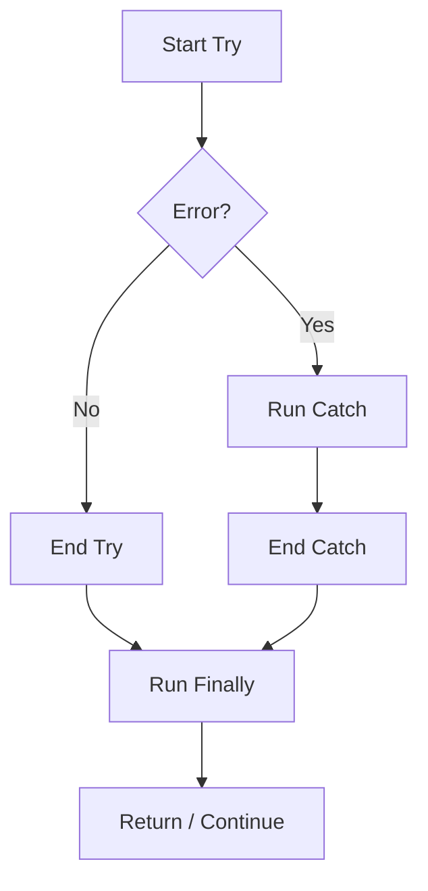

import { Tabs, TabItem, Aside, Badge, Card, CardGrid, Code, LinkCard } from '@astrojs/starlight/components';

## 🔒 The `finally` Block in JavaScript

> In Java, `finally` is essential for closing resources like Streams or Connections.  
> In **JavaScript**, `finally` serves a similar purpose but operates in a **single-threaded, garbage-collected** environment. It guarantees code execution regardless of whether an error occurred or a `return` was called.

<Aside type="tip">
**🧠 Mental Model**:  
Think of `finally` as the **"Exit Door"**.  
No matter how you leave the room (normal exit, error thrown, or early return), you **must** pass through this door.  
⚠️ **Key Difference**: In JS, we rarely use `finally` for memory cleanup (GC handles that). We use it for **state resets**, **loading spinners**, or **locking mechanisms**.
</Aside>

---

## 🔬 Syntax & Forms

JavaScript supports the same structural forms as Java.

<Code lang="js" title="Basic Structures" code={`
// Form 1: Try-Catch-Finally
try {
    riskyOperation();
} catch (error) {
    console.error(error);
} finally {
    console.log("Cleanup always runs");
}

// Form 2: Try-Finally (No Catch)
// Error propagates, but cleanup runs first
try {
    connectToAPI();
} finally {
    setLoading(false); // Always reset UI state
}

// Form 3: Async/Await with Finally
async function fetchData() {
    try {
        const res = await fetch('/api/data');
        return await res.json();
    } catch (err) {
        throw new Error("Fetch failed");
    } finally {
        console.log("Request completed");
    }
}
`} />

---

## 🔬 Execution Flow — Every Scenario

The logic is identical to Java: `finally` runs **after** `try/catch` but **before** control returns to the caller.



<Code lang="js" title="Flow Examples" code={`
function demo(x) {
    try {
        console.log("1. Try");
        if (x === 0) throw new Error("Zero");
        console.log("2. Try End");
    } catch (e) {
        console.log("3. Catch");
    } finally {
        console.log("4. Finally");
    }
    console.log("5. After");
}

demo(1); 
// Output: 1, 2, 4, 5

demo(0); 
// Output: 1, 3, 4, 5
`} />

---

## 💻 Real-World Code — UI State Management

In JS, `finally` is most commonly used in Frontend development to ensure UI states (like loading spinners) are reset.

<Code lang="jsx" title="React Example: Resetting Loading State" code={`
async function handleSubmit() {
    setIsLoading(true); // Start spinner
    
    try {
        await api.submitData(formData);
        alert("Success!");
    } catch (error) {
        alert("Failed: " + error.message);
    } finally {
        // ✅ Guaranteed to run, even if API fails
        setIsLoading(false); // Stop spinner
    }
}
`} />

<Code lang="js" title="Node.js Example: Releasing Locks" code={`
async function processJob(jobId) {
    await acquireLock(jobId);
    
    try {
        await doHeavyWork(jobId);
    } catch (err) {
        logger.error(err);
        throw err; // Re-throw to signal failure
    } finally {
        // ✅ Ensure lock is released so other workers can proceed
        await releaseLock(jobId);
    }
}
`} />

<Aside type="danger">
**🚨 Production Bug**: Forgetting `finally` in async code.  
If an API call fails and you don't reset `isLoading`, your app stays stuck in a "Loading..." state forever.
</Aside>

---

## 🔀 `finally` with `return` — The Override Trap

Just like Java, `return` inside `finally` overrides previous returns.

<Code lang="js" title="Return Behavior" code={`
function compute() {
    try {
        return 1; 
    } finally {
        return 2; // ⚠️ Overrides the try return
    }
}
console.log(compute()); // 2

function computeSafe() {
    let result;
    try {
        result = 1;
        return result;
    } finally {
        // Cleanup, but NO return here
        console.log("Cleanup");
    }
}
console.log(computeSafe()); // 1
`} />

<Aside type="caution">
**Best Practice**: Never use `return` inside `finally`. It makes debugging extremely difficult because it swallows errors and overrides expected values silently.
</Aside>

---

## ⚡ Async `finally`?

JavaScript does **not** have a native `.finally()` for Promises in the same way `try-catch` works, BUT...  
Most Promise libraries and modern browsers support `Promise.prototype.finally()`.

<Code lang="js" title="Promise Finally" code={`
fetch('/api/data')
    .then(res => res.json())
    .catch(err => console.error(err))
    .finally(() => {
        // Runs after success OR error
        console.log("Request finished");
    });
`} />

This is cleaner than wrapping everything in `async/await` just for cleanup.

---

## 💣 Interview Traps

<CardGrid>
  <Card title="Trap 1: Swallowing Errors with Return" icon="error">
    ```js
    try {
        throw new Error("Fail");
    } finally {
        return "Success"; // 😱 Error is lost!
    }
    // Caller gets "Success", never knows it failed.
    ```
  </Card>
  
  <Card title="Trap 2: Async Cleanup Order" icon="caution">
    ```js
    async function run() {
        try {
            await step1();
        } finally {
            await cleanup(); // ✅ Waits for cleanup
        }
    }
    // If you forget 'await' in finally, 
    // the function returns before cleanup finishes!
    ```
  </Card>

  <Card title="Trap 3: System Exit" icon="shield">
    ```js
    // In Node.js:
    try {
        process.exit(1);
    } finally {
        console.log("Never runs"); // ❌ Process dies immediately
    }
    // Same as Java's System.exit()
    ```
  </Card>
</CardGrid>

---

## 🎯 Interview Cheat Sheet

<CardGrid>
  <Card title="Q: When does `finally` NOT run?" icon="information">
    1. `process.exit()` (Node) or `window.close()` (Browser).  
    2. Infinite loop in `try`.  
    3. Power loss / OS Kill (`kill -9`).
  </Card>
  
  <Card title="Q: What is the main use of `finally` in JS?" icon="approve-check">
    Unlike Java (resource closing), JS uses it for:  
    1. Resetting UI states (loading spinners).  
    2. Releasing distributed locks.  
    3. Logging/Metrics (recording request duration).
  </Card>

  <Card title="Q: Does `finally` wait for async operations?" icon="caution">
    Only if you use `await`. If you call an async function in `finally` without `await`, the promise starts but the code continues immediately.
  </Card>
</CardGrid>

---

## 🧠 Full Mental Model Summary

```text
JS FINALLY CHECKLIST

1. Guarantee:
   Runs after try/catch, before return/propagation.

2. Async:
   Use 'await' in finally if cleanup is async.
   Or use Promise.finally().

3. Returns:
   Avoid 'return' in finally (swallows errors).

4. Use Cases:
   - UI State Resets
   - Lock Releases
   - Metrics/Logging

⚠️ Key Differences from Java:
- No resource leaks (GC handles memory)
- Async nature requires 'await' awareness
- Promise.finally() is a common alternative
```

<Aside type="tip">
**Next Steps**:
1. ✅ Use `finally` to reset UI states in React/Vue/Angular.
2. ✅ Use `Promise.prototype.finally()` for clean chain handling.
3. ✅ Always `await` async cleanup tasks.
4. ✅ Never `return` from `finally`.

Mastering `finally` ensures your app remains responsive and consistent, even when things go wrong. ☕✨
</Aside>
```

---

## 🔄 Java finally → JS finally Conversion Summary

| Java Concept | JavaScript Equivalent | Critical Difference |
|-------------|----------------------|-------------------|
| **Resource Closing** | `finally` / `using` (proposal) | JS relies on GC; `finally` is for logic/state. |
| **Suppressed Exceptions** | ❌ None | JS simply overwrites the error if a new one throws. |
| **Async Handling** | `await` in finally | Java blocks; JS must explicitly `await`. |
| **Promise Support** | N/A | JS has `.finally()` on Promises. |
| **System Exit** | `process.exit()` | Both skip `finally`. |

---

🧠 **Interview Power Move**: When asked about `finally`, always mention:  
1. **UI State**: It's crucial for resetting loading indicators.  
2. **Async Awareness**: Forgetting `await` in async finally is a common bug.  
3. **Error Swallowing**: Why `return` in finally is dangerous.  
4. **Promise Chain**: Using `.finally()` for cleaner code.  

---

# 🔒 JavaScript `finally` — Complete Deep Dive

---

## 🔰 What Are We Covering?

```
finally
├── finally_Block
├── Control_Flow_in_try_catch_finally
├── Control_Flow_in_Nested_try_catch_finally
├── Various_Combinations_of_try_catch_finally
└── final_vs_finally_vs_finalize
```

---

# 01 — finally Block

## 🔰 What Is `finally`?

`finally` = a block that **always executes** after its associated `try` (and optional `catch`) block — regardless of whether an exception was thrown, caught, or re-thrown. It is the guarantee of guaranteed execution.

```js
try {
  riskyOperation();
} finally {
  cleanup(); // ← ALWAYS runs — no matter what
}
```

```
┌──────────────────────────────────────────────────────────┐
│         finally — THE THREE GUARANTEES                   │
│                                                          │
│  1. Runs if try completes NORMALLY                       │
│  2. Runs if try throws (whether caught or not)           │
│  3. Runs if try/catch contains return/break/continue     │
│                                                          │
│  finally does NOT run only if:                           │
│  → process.exit() called inside try/catch               │
│  → process killed externally (SIGKILL)                   │
│  → Infinite loop / hang inside try/catch                 │
│  → Power cut / OS crash                                  │
└──────────────────────────────────────────────────────────┘
```

---

## 🔬 V8 Internals — How `finally` Is Implemented

```
┌──────────────────────────────────────────────────────────┐
│         FINALLY BYTECODE MECHANISM IN V8                 │
│                                                          │
│  try {          ← enter try scope                        │
│    doA();       ← bytecode range [pc_try_start, pc_end] │
│  } finally {    ← handler registered in table           │
│    cleanup();   ← finally block at pc_finally           │
│  }                                                       │
│                                                          │
│  Handler table entry:                                    │
│  { start: pc_try_start,                                  │
│    end:   pc_try_end,                                    │
│    handler: pc_finally,                                  │
│    type: FINALLY }                                       │
│                                                          │
│  V8 uses a COMPLETION VALUE model:                       │
│                                                          │
│  Completion = { type, value, target }                    │
│  type:   "normal" | "throw" | "return"                  │
│           | "break" | "continue"                         │
│  value:  the return value or thrown value               │
│  target: label for break/continue                        │
│                                                          │
│  finally runs REGARDLESS of completion type              │
│  After finally:                                          │
│  → If finally has its OWN completion → use finally's    │
│  → If finally completes normally → resume original       │
│    completion (propagate throw, complete return, etc.)   │
└──────────────────────────────────────────────────────────┘
```

---

## 📊 finally vs No finally — Why It Matters

```js
// WITHOUT finally — resource leak on exception:
async function readFile(path) {
  const handle = await fs.open(path, "r");      // allocate resource
  const content = await handle.readFile("utf8"); // might throw
  await handle.close();                          // 😱 SKIPPED if error
  return content;
}
// If readFile throws → handle.close() never called → file handle leak

// WITH finally — resource always released:
async function readFile(path) {
  const handle = await fs.open(path, "r");
  try {
    return await handle.readFile("utf8");
  } finally {
    await handle.close(); // ✅ ALWAYS runs — even if readFile throws
  }
}
```

---

## 🔬 The `finally` Execution Model — Completion Records

```js
// V8 uses Completion Record concept from spec:

function demonstrate() {
  try {
    return "try value"; // Completion: { type: "return", value: "try value" }
  } finally {
    // finally runs — sees pending return "try value"
    console.log("finally runs"); // ← runs here
    // falls through normally → pending return resumes
  }
  // Return "try value" delivers now
}

demonstrate(); // "finally runs" → "try value"

// ── finally with its OWN return — overrides pending ──
function withOwnReturn() {
  try {
    return "try value";         // pending return = "try value"
  } finally {
    return "finally value";     // NEW completion = "finally value"
    // Discards pending "try value" entirely 😱
  }
}
withOwnReturn(); // "finally value"

// ── finally with its OWN throw — overrides pending ──
function withOwnThrow() {
  try {
    return "try value";         // pending return = "try value"
  } finally {
    throw new Error("finally"); // NEW completion = throw
    // Discards pending "try value" entirely
  }
}
// Throws Error("finally") — return value LOST
```

---

## 🔬 `finally` with `process.exit()` — The Exception

```js
// process.exit() bypasses finally:
try {
  process.exit(0); // ← exits immediately
} finally {
  console.log("THIS NEVER RUNS"); // 😱 — process.exit bypasses finally
}

// Why? process.exit() is a C-level call that terminates the
// V8 isolate and the process — doesn't unwind the JS stack

// BUT — process event handlers DO run:
process.on("exit", (code) => {
  // THIS runs even after process.exit()
  // BUT: SYNCHRONOUS only — no async ops possible
  console.log("exit handler:", code);
});

process.exit(0);
// "exit handler: 0" ← this runs ✅
// finally block ← this does NOT ✅

// Real production pattern for guaranteed cleanup:
async function gracefulShutdown(code) {
  try {
    await server.close();
    await db.disconnect();
  } catch (err) {
    console.error("Shutdown error:", err);
  } finally {
    process.exit(code); // AFTER cleanup
  }
}

process.on("SIGTERM", () => gracefulShutdown(0));
```

---

# 02 — Control Flow in try...catch...finally

## 🔰 Complete Flow — Every Path Mapped

```
┌──────────────────────────────────────────────────────────┐
│     try...catch...finally COMPLETE FLOW DIAGRAM          │
│                                                          │
│              ┌─────────────┐                             │
│              │  try block  │                             │
│              └──────┬──────┘                             │
│                     │                                    │
│           ┌─────────▼──────────┐                         │
│           │ Exception thrown?  │                         │
│           └──┬──────────────┬──┘                         │
│            YES               NO                          │
│              │                │                          │
│    ┌─────────▼───────┐  ┌─────▼─────────────────┐        │
│    │  catch block    │  │  skip catch entirely  │        │
│    │  (if exists)    │  └─────┬─────────────────┘        │
│    └─────────┬───────┘        │                          │
│              │                │                          │
│              └────────┬───────┘                          │
│                       │                                  │
│              ┌────────▼────────┐                         │
│              │ finally block   │ ← ALWAYS                │
│              └────────┬────────┘                         │
│                       │                                  │
│              ┌────────▼────────┐                         │
│              │ Resume pending  │                         │
│              │ completion      │                         │
│              │ (throw/return   │                         │
│              │  break/normal)  │                         │
│              └─────────────────┘                         │
└──────────────────────────────────────────────────────────┘
```

---

## 🔬 All 8 Scenarios — Exhaustive

### Scenario A: Normal Execution (No Exception)

```js
function scenarioA() {
  try {
    console.log("A1: try");    // ① runs
  } catch (err) {
    console.log("catch");      // ② SKIPPED
  } finally {
    console.log("A2: finally"); // ③ runs
  }
  console.log("A3: after");   // ④ runs
}

scenarioA();
// A1: try
// A2: finally
// A3: after
```

---

### Scenario B: Exception Caught

```js
function scenarioB() {
  try {
    console.log("B1: try");
    throw new Error("boom");   // ① throws
    console.log("skipped");    // ② NEVER
  } catch (err) {
    console.log("B2: catch");  // ③ runs
  } finally {
    console.log("B3: finally"); // ④ runs
  }
  console.log("B4: after");   // ⑤ runs — no propagation
}

scenarioB();
// B1: try
// B2: catch
// B3: finally
// B4: after
```

---

### Scenario C: Exception NOT Caught — finally Runs Before Propagation

```js
function scenarioC() {
  try {
    throw new Error("uncaught");
  } finally {
    console.log("C1: finally"); // ① runs BEFORE exception propagates
  }
  console.log("C2: after");    // ② NEVER — exception propagates
}

try {
  scenarioC();
} catch (err) {
  console.log("C3: outer catch:", err.message); // ③ catches propagated err
}

// C1: finally
// C3: outer catch: uncaught
```

---

### Scenario D: `return` in `try` — finally Runs Before Delivery

```js
function scenarioD() {
  try {
    console.log("D1: try");
    return "try result";        // ① sets pending return
  } catch (err) {
    console.log("catch");       // ② SKIPPED
  } finally {
    console.log("D2: finally"); // ③ runs BEFORE return delivers
    // No return here → pending return resumes
  }
  console.log("D3: after");    // ④ NEVER — return was in try
}

console.log(scenarioD());
// D1: try
// D2: finally
// try result
```

---

### Scenario E: `return` in `catch` — finally Runs Before Delivery

```js
function scenarioE() {
  try {
    throw new Error("err");
  } catch (err) {
    console.log("E1: catch");
    return "catch result";      // ① sets pending return
  } finally {
    console.log("E2: finally"); // ② runs BEFORE return delivers
  }
  console.log("E3: after");    // ③ NEVER
}

console.log(scenarioE());
// E1: catch
// E2: finally
// catch result
```

---

### Scenario F: `return` in `finally` — OVERRIDES Everything

```js
function scenarioF() {
  try {
    return "try";               // ① pending return: "try"
  } finally {
    return "finally";           // ② NEW return — overrides "try" 😱
  }
}

console.log(scenarioF()); // "finally" — try's return LOST

// Even overrides exceptions:
function scenarioF2() {
  try {
    throw new Error("critical"); // ① pending throw
  } catch (err) {
    console.log("caught:", err.message);
    throw new Error("re-thrown"); // ② pending re-throw
  } finally {
    return "silenced";            // ③ return — SWALLOWS re-throw 😱
  }
}

console.log(scenarioF2()); // "silenced" — both errors LOST 😱
```

---

### Scenario G: `throw` in `finally` — Replaces Original Exception

```js
function scenarioG() {
  try {
    throw new Error("original"); // ① pending throw: "original"
  } finally {
    throw new Error("finally");  // ② NEW throw — replaces "original" 😱
  }
}

try {
  scenarioG();
} catch (err) {
  console.log(err.message); // "finally" — "original" LOST 😱
}
```

---

### Scenario H: Re-throw in `catch` — finally Still Runs

```js
function scenarioH() {
  try {
    throw new TypeError("type error");
  } catch (err) {
    console.log("H1: catch — re-throwing");
    err.handled = true;
    throw err;               // ① re-throw — pending throw
  } finally {
    console.log("H2: finally — even on re-throw"); // ② runs ✅
    // No return/throw here → re-throw resumes
  }
}

try {
  scenarioH();
} catch (err) {
  console.log("H3: outer caught:", err.message, err.handled);
}
// H1: catch — re-throwing
// H2: finally — even on re-throw
// H3: outer caught: type error true
```

---

## 📊 Summary Table — Control Flow Outcomes

| Scenario | try | catch | finally | After |
|---|---|---|---|---|
| No exception | ✅ runs | ❌ skipped | ✅ runs | ✅ runs |
| Exception caught | partial | ✅ runs | ✅ runs | ✅ runs |
| Exception uncaught | partial | ❌ none | ✅ runs | ❌ propagates |
| `return` in try | partial | ❌ skipped | ✅ runs | ❌ returned |
| `return` in catch | partial | partial | ✅ runs | ❌ returned |
| `return` in finally | partial | any | ✅ returns | ❌ finally wins |
| `throw` in finally | any | any | ✅ throws | ❌ finally wins |
| `re-throw` in catch | partial | partial | ✅ runs | ❌ propagates |

---

# 03 — Control Flow in Nested try...catch...finally

## 🔰 Nesting Rules

```
┌──────────────────────────────────────────────────────────┐
│         NESTED try/catch/finally RULES                   │
│                                                          │
│  Each level has its OWN:                                 │
│  → try scope                                             │
│  → catch handler                                         │
│  → finally guarantee                                     │
│                                                          │
│  Exception propagation order:                            │
│  1. Inner finally runs FIRST                             │
│  2. Then outer finally                                   │
│  3. Then outer catch (if inner didn't catch)             │
│                                                          │
│  LIFO order — innermost to outermost                     │
└──────────────────────────────────────────────────────────┘
```

---

## 🔬 Nested — Exception Propagation Order

```js
function nestedBasic() {
  try {                                  // OUTER try
    console.log("outer try");            // ①
    try {                                // INNER try
      console.log("inner try");          // ②
      throw new Error("deep error");     // ③ throws
    } finally {
      console.log("inner finally");      // ④ runs FIRST
      // inner has no catch — propagates to outer
    }
  } catch (err) {
    console.log("outer catch:", err.message); // ⑤ catches
  } finally {
    console.log("outer finally");        // ⑥ runs LAST
  }
  console.log("after");                 // ⑦ runs
}

nestedBasic();
// outer try
// inner try
// inner finally       ← inner finally first
// outer catch: deep error
// outer finally
// after
```

---

## 🔬 Nested — Inner Catch Doesn't Prevent Outer Finally

```js
function nestedInnerCatch() {
  try {                               // OUTER
    try {                             // INNER
      throw new Error("inner error"); // ①
    } catch (err) {
      console.log("inner catch:", err.message); // ②
      // caught here — does NOT propagate to outer
    } finally {
      console.log("inner finally");   // ③
    }
    console.log("outer try continues"); // ④ — inner was caught ✅
  } finally {
    console.log("outer finally");     // ⑤ — always
  }
  console.log("after");              // ⑥
}

nestedInnerCatch();
// inner catch: inner error
// inner finally
// outer try continues     ← execution resumes in outer try ✅
// outer finally
// after
```

---

## 🔬 Nested — Inner Re-throw Caught by Outer

```js
function nestedReThrow() {
  try {                               // OUTER
    try {                             // INNER
      throw new TypeError("type err"); // ①
    } catch (err) {
      console.log("inner catch");      // ②
      if (err instanceof TypeError) {
        throw new Error("wrapped: " + err.message); // ③ re-throw
      }
    } finally {
      console.log("inner finally");    // ④ runs before re-throw propagates
    }
    console.log("outer try continues"); // ⑤ SKIPPED — re-throw propagates
  } catch (err) {
    console.log("outer catch:", err.message); // ⑥ catches wrapped
  } finally {
    console.log("outer finally");      // ⑦
  }
}

nestedReThrow();
// inner catch
// inner finally
// outer catch: wrapped: type err
// outer finally
```

---

## 🔬 Deep Nesting — Three Levels

```js
function threeLevel() {
  console.log("=== START ===");

  try {                                    // L1
    console.log("L1 try");
    try {                                  // L2
      console.log("L2 try");
      try {                               // L3
        console.log("L3 try");
        throw new Error("L3 error");      // ① deep throw
      } catch (err) {
        console.log("L3 catch:", err.message); // ②
        throw new Error("L3 re-throw");   // ③ re-throw
      } finally {
        console.log("L3 finally");        // ④ runs first
      }
    } catch (err) {
      console.log("L2 catch:", err.message); // ⑤
      // L2 catches L3's re-throw — does NOT re-throw
    } finally {
      console.log("L2 finally");          // ⑥
    }
    console.log("L1 try continues");      // ⑦ — L2 caught it ✅
  } catch (err) {
    console.log("L1 catch:", err.message); // ❌ SKIPPED
  } finally {
    console.log("L1 finally");            // ⑧
  }
  console.log("after");                  // ⑨
}

threeLevel();
// L1 try
// L2 try
// L3 try
// L3 catch: L3 error
// L3 finally
// L2 catch: L3 re-throw
// L2 finally
// L1 try continues
// L1 finally
// after
```

---

## 🔬 Nested — `return` Through Multiple Levels

```js
function nestedReturn() {
  try {                                  // OUTER
    try {                               // INNER
      return "deep return";             // ① pending return
    } finally {
      console.log("inner finally");     // ② runs
      // No return here → pending return continues
    }
  } finally {
    console.log("outer finally");       // ③ runs
    // No return here → pending return continues
  }
  console.log("after");                // ④ NEVER
}

console.log(nestedReturn());
// inner finally
// outer finally
// deep return
```

---

## 🔬 Nested — `return` in Inner `finally` Interrupts Outer

```js
function nestedReturnInFinally() {
  try {                                  // OUTER
    try {                               // INNER
      throw new Error("inner throw");   // ① pending throw
    } finally {
      console.log("inner finally");     // ②
      return "inner finally return";    // ③ OVERRIDES pending throw 😱
      // Exception from inner try is SWALLOWED
    }
    // Control returns to outer try (via finally return)
    console.log("outer try body");      // ④ SKIPPED — return in inner finally
  } catch (err) {
    console.log("outer catch");         // ⑤ SKIPPED — return swallowed exception
  } finally {
    console.log("outer finally");       // ⑥ STILL RUNS
  }
}

console.log(nestedReturnInFinally());
// inner finally
// outer finally        ← outer finally still runs
// inner finally return ← return value
```

---

## 🔬 Nested with Async — Each `await` is a potential throw point

```js
async function nestedAsync() {
  try {
    const conn = await getConnection();          // might throw
    try {
      await conn.beginTransaction();             // might throw
      try {
        const result = await conn.query(sql);   // might throw
        await conn.commit();                     // might throw
        return result;
      } catch (queryErr) {
        console.log("query failed:", queryErr.message);
        await conn.rollback();                   // cleanup on query fail
        throw queryErr;                          // re-throw
      } finally {
        // always release connection
        conn.release();
      }
    } catch (txErr) {
      console.log("transaction failed:", txErr.message);
      throw txErr;
    }
  } catch (connErr) {
    console.log("connection failed:", connErr.message);
    throw new DatabaseError("Cannot connect", { cause: connErr });
  }
}
```

---

## 🏭 Real Pattern — Nested finally for Layered Cleanup

```js
class ResourceManager {
  static async withResources(fn) {
    const resources = [];

    async function acquire(factory) {
      const resource = await factory();
      resources.push(resource);
      return resource;
    }

    try {
      return await fn(acquire);
    } finally {
      // Release all in REVERSE order — LIFO:
      const errors = [];
      for (const resource of resources.reverse()) {
        try {
          await resource.release();
        } catch (err) {
          errors.push(err); // collect release errors — don't short-circuit
        }
      }
      if (errors.length > 0) {
        throw new AggregateError(errors, "Resource release failed");
      }
    }
  }
}

// Usage — automatic layered cleanup:
await ResourceManager.withResources(async (acquire) => {
  const db   = await acquire(() => pool.connect());       // acquired 1st
  const lock = await acquire(() => redis.acquireLock());  // acquired 2nd
  const file = await acquire(() => fs.open("data.txt")); // acquired 3rd

  // If anything throws — finally releases in REVERSE: file → lock → db ✅
  return await processWithAll(db, lock, file);
});
```

---

# 04 — Various Combinations of try...catch...finally

## 🔰 All Valid Structural Combinations

```
┌──────────────────────────────────────────────────────────┐
│         ALL VALID try COMBINATIONS                       │
│                                                          │
│  1. try + catch                                          │
│  2. try + finally                                        │
│  3. try + catch + finally                                │
│  4. Nested: (try + catch) inside try                     │
│  5. Nested: (try + finally) inside try                   │
│  6. Nested: try inside catch                             │
│  7. Nested: try inside finally                           │
│  8. Chain: sequential try blocks (not nested)            │
└──────────────────────────────────────────────────────────┘
```

---

## 🔬 Combination 1 — try + catch (No finally)

```js
// Use when: no mandatory cleanup needed
function parseSafe(json, fallback = null) {
  try {
    return JSON.parse(json);
  } catch {
    return fallback;
  }
}

parseSafe('{"a":1}');   // { a: 1 } ✅
parseSafe("bad json");  // null — fallback ✅

// Behavior:
// → Exception: caught → fallback returned
// → No exception: value returned
// → No cleanup step needed → finally not needed ✅
```

---

## 🔬 Combination 2 — try + finally (No catch)

```js
// Use when: must cleanup, but want exception to propagate
function withTimer(fn) {
  const start = Date.now();
  try {
    return fn(); // might throw — we don't catch
  } finally {
    const duration = Date.now() - start;
    metrics.record("duration", duration); // ALWAYS record ✅
    // Exception (if any) propagates after this
  }
}

withTimer(() => processData()); // metrics recorded even if processData throws ✅

// Node.js pattern — lock acquisition:
async function withLock(key, fn) {
  await lock.acquire(key);
  try {
    return await fn();
  } finally {
    await lock.release(key); // ALWAYS release — don't suppress errors ✅
  }
}
```

---

## 🔬 Combination 3 — try + catch + finally (Full Form)

```js
// Most complete — catch errors AND guarantee cleanup:
async function processFile(path) {
  let handle;
  try {
    handle  = await fs.open(path, "r");
    const data = await handle.readFile("utf8");
    return JSON.parse(data);
  } catch (err) {
    if (err.code === "ENOENT") return null;  // expected — handle
    if (err instanceof SyntaxError) throw new ConfigError("Invalid JSON", { cause: err });
    throw err;                               // unexpected — re-throw
  } finally {
    await handle?.close(); // ALWAYS close if opened ✅
  }
}
```

---

## 🔬 Combination 4 — try inside try (Direct Nesting)

```js
// Inner try handles specific errors, outer handles rest:
async function robustOperation() {
  try {                                    // OUTER — general handler
    const conn = await db.connect();
    try {                                  // INNER — query-specific
      const result = await conn.query(sql);
      return result;
    } catch (queryErr) {
      if (queryErr.code === "40001") {     // serialization failure
        return await retryWithBackoff(() => conn.query(sql));
      }
      throw queryErr;                      // re-throw other query errors
    } finally {
      conn.release();                      // inner finally — always release
    }
  } catch (err) {                          // OUTER — connection errors
    logger.error("Operation failed:", err);
    throw new DatabaseError("Operation failed", { cause: err });
  }
}
```

---

## 🔬 Combination 5 — try inside catch

```js
// Secondary operation inside catch that might itself throw:
async function processWithFallback(data) {
  try {
    return await primaryProcessor.process(data);
  } catch (primaryErr) {
    logger.warn("Primary failed, trying fallback:", primaryErr.message);

    try {
      // Fallback operation — might ALSO throw:
      return await fallbackProcessor.process(data);
    } catch (fallbackErr) {
      // BOTH primary and fallback failed:
      throw new AggregateError(
        [primaryErr, fallbackErr],
        "All processors failed"
      );
    }
  }
}
```

---

## 🔬 Combination 6 — try inside finally

```js
// Async cleanup that might throw — must not suppress original:
async function withCleanup(fn) {
  let originalError = null;
  let result;

  try {
    result = await fn();
  } catch (err) {
    originalError = err; // save original
  } finally {
    try {
      await cleanup(); // cleanup might throw
    } catch (cleanupErr) {
      if (originalError) {
        // Both operation AND cleanup failed:
        // Don't lose the original error:
        logger.error("Cleanup also failed:", cleanupErr);
        // Preserve original — cleanup error is secondary
      } else {
        // Only cleanup failed:
        throw cleanupErr;
      }
    }
  }

  if (originalError) throw originalError; // re-throw original ✅
  return result;
}
```

---

## 🔬 Combination 7 — Sequential try blocks (Not Nested)

```js
// Each operation independently handled — not related:
async function initializeApp() {
  // Each is independent — failure of one doesn't affect others:

  try {
    await database.connect();
    logger.info("Database connected");
  } catch (err) {
    logger.error("Database failed:", err);
    throw err; // critical — abort
  }

  try {
    await cache.connect();
    logger.info("Cache connected");
  } catch (err) {
    logger.warn("Cache unavailable — continuing without cache");
    // non-critical — continue
  }

  try {
    await metrics.initialize();
    logger.info("Metrics initialized");
  } catch (err) {
    logger.warn("Metrics failed — continuing");
    // non-critical — continue
  }

  try {
    await server.listen(PORT);
    logger.info(`Server on port ${PORT}`);
  } catch (err) {
    logger.error("Server failed:", err);
    throw err; // critical — abort
  }
}
```

---

## 🔬 Combination 8 — `finally` Mutation — The Subtle Trap

```js
// finally can MUTATE return value (for objects/arrays) via reference:
function mutationTrap() {
  const result = { value: 1 };
  try {
    return result;            // pending return: reference to result
  } finally {
    result.value = 99;        // mutates the OBJECT that's being returned
    // Does NOT change what's returned — still returns 'result' object
    // BUT the object's content has changed 😱
  }
}

const r = mutationTrap();
r.value; // 99 😱 — finally mutated the returned object

// vs primitive — no mutation possible:
function noMutation() {
  let x = 1;
  try {
    return x;         // captures VALUE 1 — not reference to x
  } finally {
    x = 99;           // mutates x — but captured return value (1) unchanged
  }
}

noMutation(); // 1 ✅ — primitive value captured at return
```

---

## 🏭 Full Production Pattern — Exception-Safe Pipeline

```js
class Pipeline {
  #stages  = [];
  #cleanup = [];
  #metrics;

  constructor(metrics) { this.#metrics = metrics; }

  addStage(name, fn, cleanupFn) {
    this.#stages.push({ name, fn });
    if (cleanupFn) this.#cleanup.unshift({ name, fn: cleanupFn }); // LIFO
    return this;
  }

  async execute(input) {
    const context = { input, results: [], errors: [] };
    const start   = Date.now();
    let   stageIndex = 0;

    try {
      for (const stage of this.#stages) {
        const stageStart = Date.now();
        try {
          context.results.push(await stage.fn(context));
          this.#metrics.record(`stage.${stage.name}.success`, Date.now() - stageStart);
          stageIndex++;
        } catch (stageErr) {
          this.#metrics.record(`stage.${stage.name}.error`, Date.now() - stageStart);
          stageErr.stage = stage.name;
          stageErr.stageIndex = stageIndex;
          throw stageErr;                // propagate to outer
        }
      }
      return context;

    } catch (pipelineErr) {
      context.errors.push(pipelineErr);
      this.#metrics.record("pipeline.error", 1);

      // Attempt compensation for completed stages:
      try {
        for (const { name, fn } of this.#cleanup.slice(
          this.#cleanup.length - stageIndex // only ran stages
        )) {
          try {
            await fn(context);
          } catch (compensateErr) {
            context.errors.push(compensateErr);
            logger.error(`Compensation ${name} failed:`, compensateErr);
          }
        }
      } finally {
        // Always emit final metrics — even if compensation threw:
        this.#metrics.record("pipeline.duration", Date.now() - start);
      }

      throw pipelineErr; // re-throw after compensation attempt

    } finally {
      // ALWAYS runs — normal and error paths:
      this.#metrics.record("pipeline.total", Date.now() - start);
      logger.info(`Pipeline completed: ${context.results.length} stages`);
    }
  }
}
```

---

# 05 — final vs finally vs finalize

## 🔰 The Three Concepts

```
┌──────────────────────────────────────────────────────────┐
│         THREE CONCEPTS — COMPARISON OVERVIEW            │
│                                                          │
│  FINAL (keyword in Java/C#)                              │
│  → Prevents modification (final class, final variable)  │
│  → JavaScript equivalent: const, Object.freeze,         │
│    private #fields, Object.defineProperty                │
│                                                          │
│  FINALLY (keyword in JS/Java/C#)                         │
│  → Exception handling — guaranteed cleanup block         │
│  → JavaScript: the try/catch/finally construct           │
│                                                          │
│  FINALIZE (method in Java — Object.finalize())           │
│  → Called by GC before object is collected               │
│  → JavaScript equivalent: WeakRef + FinalizationRegistry│
│    (ES2021)                                              │
└──────────────────────────────────────────────────────────┘
```

---

## 📊 `final` — JavaScript Equivalents

```js
// Java 'final' → cannot be reassigned/extended:
// final int x = 5;           → const x = 5;
// final class Singleton { }  → Object.freeze(class) or private constructor

// ── JavaScript 'final' variable ──────────────────────────
const MAX_RETRIES = 3;        // const = final-like binding ✅
MAX_RETRIES = 5;              // ❌ TypeError — const is final

// ── JavaScript 'final' object property ───────────────────
const config = Object.freeze({
  host: "localhost",
  port: 8080,
});
config.host = "changed";      // ❌ silently fails (sloppy) / TypeError (strict)
config.host;                  // "localhost" ✅ — immutable

// ── JavaScript 'final' class (cannot extend) ─────────────
// No keyword — enforce at runtime:
class FinalClass {
  constructor() {
    if (new.target !== FinalClass) {
      throw new TypeError(`${FinalClass.name} cannot be extended`);
    }
  }
}

class Attempt extends FinalClass { } // class definition OK
new Attempt(); // ❌ TypeError: FinalClass cannot be extended ✅

// ── JavaScript private fields = 'final' access ───────────
class Immutable {
  #value;               // private — cannot be accessed outside

  constructor(value) {
    this.#value = value;
    Object.freeze(this); // prevent adding properties
  }

  get value() { return this.#value; } // read-only access
}

const obj = new Immutable(42);
obj.value;           // 42 ✅
obj.value = 99;      // ❌ TypeError — frozen
obj.#value;          // ❌ SyntaxError — private
```

---

## 📊 `finally` — JavaScript's Exception Guarantee

```js
// finally = guaranteed execution — already covered in depth above
// Key summary:

try {
  criticalOperation();
} finally {
  cleanup();           // ← always runs
}

// The guarantee:
// ✅ Normal execution    → cleanup runs
// ✅ Exception thrown    → cleanup runs → exception propagates
// ✅ return in try       → cleanup runs → return delivers
// ✅ break/continue      → cleanup runs → loop continues/breaks
// ❌ process.exit()      → cleanup does NOT run
// ❌ process.kill -9     → cleanup does NOT run
```

---

## 📊 `finalize` — JavaScript's FinalizationRegistry (ES2021)

```js
// FinalizationRegistry = JS equivalent of Java's finalize()
// Called when an object is GARBAGE COLLECTED

// Java:
// @Override protected void finalize() { cleanup(); }

// JavaScript:
const registry = new FinalizationRegistry((heldValue) => {
  // Called when the registered object is GC'd:
  console.log(`Object with key ${heldValue} was collected`);
  // heldValue = the token you registered — NOT the object itself
  // (the object is already gone — can't access it here)
});

// Register an object with a cleanup token:
let bigObject = { data: new Array(1000000).fill(0) };
const token = "bigObject-key";
registry.register(bigObject, token);  // ← register for GC notification

bigObject = null; // allow GC — bigObject can now be collected
// At some point after GC:
// → "Object with key bigObject-key was collected" ← logged

// ── Real use — external resource cleanup ─────────────────
class FileHandle {
  static #registry = new FinalizationRegistry((fd) => {
    // Called if FileHandle was GC'd without explicit close:
    console.warn(`FileHandle fd=${fd} was GC'd without close() — closing now`);
    closeFileDescriptor(fd); // synchronous cleanup
  });

  #fd;
  #closed = false;

  constructor(path) {
    this.#fd = openFileSync(path);
    FileHandle.#registry.register(this, this.#fd); // register with fd token
  }

  read() {
    if (this.#closed) throw new Error("Handle closed");
    return readSync(this.#fd);
  }

  close() {
    if (this.#closed) return;
    closeFileDescriptor(this.#fd);
    this.#closed = true;
    // Note: no way to unregister from FinalizationRegistry in basic form
    // If close() called explicitly — GC callback will still fire
    // But closing twice is usually safe (check this.#closed)
  }
}
```

---

## 🔬 `FinalizationRegistry` — Deep Dive

```js
// Full API:
const registry = new FinalizationRegistry(cleanupCallback);

// Register:
const unregisterToken = {}; // any object as unregister token
registry.register(
  target,          // object to watch
  heldValue,       // passed to callback (not the target — it's gone by then)
  unregisterToken  // optional — used to unregister
);

// Unregister (before GC):
registry.unregister(unregisterToken); // ← prevents callback

// Example — cache with automatic cleanup:
class WeakCache {
  #registry = new FinalizationRegistry((key) => {
    console.log(`Cache entry '${key}' was GC'd`);
    this.#stats.evictions++;
  });

  #cache = new Map(); // key → WeakRef<value>
  #stats = { hits: 0, misses: 0, evictions: 0 };

  set(key, value) {
    this.#cache.set(key, new WeakRef(value));
    this.#registry.register(value, key, value); // unregisterToken = value
  }

  get(key) {
    const ref = this.#cache.get(key);
    if (!ref) { this.#stats.misses++; return undefined; }

    const value = ref.deref(); // get value if still alive
    if (value === undefined) {
      // GC'd between check and access:
      this.#cache.delete(key);
      this.#stats.misses++;
      return undefined;
    }

    this.#stats.hits++;
    return value;
  }

  delete(key) {
    const ref  = this.#cache.get(key);
    const value = ref?.deref();
    if (value) this.#registry.unregister(value); // prevent callback
    this.#cache.delete(key);
  }

  get stats() { return { ...this.#stats }; }
}
```

---

## 📊 Critical Differences — final vs finally vs finalize

```
┌──────────────────────────────────────────────────────────┐
│              FINAL vs FINALLY vs FINALIZE                │
├──────────────────┬───────────────────────────────────────┤
│ Concept          │ JavaScript Implementation              │
├──────────────────┼───────────────────────────────────────┤
│ FINAL            │                                       │
│ (immutability)   │ const, Object.freeze, #private,       │
│                  │ Object.defineProperty(writable:false)  │
│                  │ — SYNCHRONOUS, compile-like check      │
│                  │ — Prevents modification                │
│                  │ — No exception needed                  │
├──────────────────┼───────────────────────────────────────┤
│ FINALLY          │                                       │
│ (cleanup)        │ try {} finally {} keyword             │
│                  │ — SYNCHRONOUS control flow             │
│                  │ — Guaranteed execution                 │
│                  │ — Exception-safe cleanup              │
│                  │ — Related to error handling            │
├──────────────────┼───────────────────────────────────────┤
│ FINALIZE         │                                       │
│ (GC hook)        │ FinalizationRegistry (ES2021)         │
│                  │ — ASYNCHRONOUS — called BY GC          │
│                  │ — NOT guaranteed timing                │
│                  │ — May never run (program exits first) │
│                  │ — Used for leak detection, not cleanup │
└──────────────────┴───────────────────────────────────────┘
```

---

## 🔬 When to Use Each

```js
// ── Use CONST / Object.freeze (final equivalent) ────────
// When: value must never change
const API_KEY = process.env.API_KEY;
const CONFIG  = Object.freeze({ host: "prod-db", port: 5432 });

// ── Use FINALLY ──────────────────────────────────────────
// When: resource must be released regardless of success/failure
async function withConnection(fn) {
  const conn = await pool.connect();
  try {
    return await fn(conn);
  } finally {
    conn.release(); // ← ALWAYS — this is the right tool ✅
  }
}

// ── Use FinalizationRegistry ──────────────────────────────
// When: detecting forgotten cleanup (debugging / leak detection)
// NOT for primary cleanup — use finally for that

const leakDetector = new FinalizationRegistry((resourceId) => {
  console.warn(`LEAK: Resource ${resourceId} was not properly closed`);
  alertOncall("Resource leak detected");
});

class Resource {
  #id = crypto.randomUUID();
  #closed = false;

  constructor() {
    // Register for leak detection:
    leakDetector.register(this, this.#id);
  }

  use() { /* ... */ }

  close() {
    this.#closed = true;
    // No unregister — leak detector will fire if close() never called
    // That's intentional — we WANT to detect leaks ✅
  }
}
```

---

## 💀 Interview Traps

### Trap 1: `finally` after `process.exit()` doesn't run

```js
// Classic misconception:
try {
  doSomething();
  process.exit(0); // ← V8 isolate terminated — NO stack unwind
} finally {
  cleanup(); // 😱 NEVER runs
  closeDB(); // 😱 NEVER runs
}

// Fix — cleanup BEFORE process.exit():
async function shutdown() {
  try {
    await closeDB();
    await server.close();
  } finally {
    process.exit(0); // exit AFTER cleanup ✅
  }
}

// Or use exit event (synchronous only):
process.on("exit", () => {
  // synchronous cleanup ← DOES run even after process.exit()
  fs.writeFileSync("shutdown.log", "clean shutdown\n");
});
```

---

### Trap 2: `finally` return changes the returned primitive but not reference

```js
// Primitive — return value captured:
function primitive() {
  let x = 1;
  try {
    return x;        // captures VALUE 1
  } finally {
    x = 99;          // x changes — but captured VALUE (1) unchanged
  }
}
primitive(); // 1 ✅ — captured value

// Object — reference captured, content can change:
function object() {
  const obj = { n: 1 };
  try {
    return obj;      // captures REFERENCE
  } finally {
    obj.n = 99;      // mutates object via reference 😱
  }
}
object(); // { n: 99 } 😱 — object content changed via reference

// Very subtle trap — different behavior for primitives vs objects
```

---

### Trap 3: `FinalizationRegistry` is NOT for primary cleanup

```js
// WRONG — using FinalizationRegistry as primary cleanup:
class DatabaseConnection {
  #pool;
  static #registry = new FinalizationRegistry((conn) => {
    conn.end(); // 😱 WRONG primary cleanup — GC timing is unpredictable
    // Connection might stay open for seconds/minutes/forever
    // GC may never run (short-lived process)
    // GC timing is implementation-specific
  });

  constructor(pool) {
    this.#pool = pool;
    DatabaseConnection.#registry.register(this, pool);
  }
  // No explicit close() — relying on GC 😱
}

// RIGHT — explicit close() + FinalizationRegistry for leak DETECTION:
class DatabaseConnection {
  #pool;
  #closed = false;
  #id     = crypto.randomUUID();

  static #leakDetector = new FinalizationRegistry((id) => {
    console.warn(`DB connection ${id} was GC'd without close()`); // detect ✅
  });

  constructor(pool) {
    this.#pool = pool;
    DatabaseConnection.#leakDetector.register(this, this.#id);
  }

  query(sql) { /* ... */ }

  close() {
    if (this.#closed) return;
    this.#pool.release();
    this.#closed = true;
    // Leak detector still fires if called — acceptable for detection
  }
}

// ALWAYS pair with finally for primary cleanup:
const conn = new DatabaseConnection(pool);
try {
  return await conn.query(sql);
} finally {
  conn.close(); // ← primary cleanup ✅
}
```

---

### Trap 4: Async finally with `await` inside

```js
// finally with async/await works — but has subtle gotcha:
async function withCleanup(fn) {
  try {
    return await fn();
  } finally {
    await cleanup();  // ← await in finally ✅ — works correctly
    // BUT: if cleanup() throws AND fn() also threw:
    // → cleanup() error REPLACES fn() error 😱
  }
}

// Safer — preserve original error:
async function withSafeCleanup(fn) {
  let originalErr = null;
  try {
    return await fn();
  } catch (err) {
    originalErr = err;
    throw err;
  } finally {
    try {
      await cleanup();
    } catch (cleanupErr) {
      if (originalErr) {
        // Original error takes priority — log cleanup error:
        console.error("Cleanup failed:", cleanupErr);
        // originalErr propagates (was re-thrown in catch)
      } else {
        throw cleanupErr; // only cleanup failed — propagate that
      }
    }
  }
}
```

---

### Trap 5: `finally` in loops — runs per iteration

```js
// Misconception: finally runs ONCE for the whole loop
// Reality: finally runs for EACH iteration

for (let i = 0; i < 3; i++) {
  try {
    if (i === 1) throw new Error("skip 1");
    console.log("try:", i);
  } catch (err) {
    console.log("catch:", err.message);
  } finally {
    console.log("finally:", i); // runs for EACH i: 0, 1, 2
  }
}
// try: 0     finally: 0
// catch: skip 1   finally: 1   ← catch + finally for i=1
// try: 2     finally: 2

// If you only want ONE finally for the whole loop:
try {
  for (let i = 0; i < 3; i++) {
    if (i === 1) throw new Error("exit loop");
    console.log("try:", i);
  }
} finally {
  console.log("finally: once after loop"); // runs ONCE ✅
}
```

---

## 📊 DSA / Internals Connection

> `finally` implements the **scope guard** pattern from systems programming — identical in concept to C++ RAII (Resource Acquisition Is Initialization) and Rust's `Drop` trait. The V8 implementation uses **Completion Records** from the ECMAScript specification — a triple of `(type, value, target)` that tracks what a block's "completion" was (normal, return, throw, break, continue). `finally` saves the current completion record, executes its body, and if the body completes normally, restores the saved record. If the body has its own non-normal completion (return/throw), it replaces the saved one — which is why `return` in `finally` wins over a throw in `try`.
>
> `FinalizationRegistry` implements **weak reference GC notification** — the same concept as Java's `PhantomReference` / `ReferenceQueue`. V8's GC maintains a list of `WeakCell` objects holding weak references to registered targets. During GC sweep phase, if a target has no more strong references, V8 enqueues a cleanup job in the microtask queue. The callback receives the `heldValue` (not the collected object — it's already freed) and runs asynchronously. This is fundamentally non-deterministic — it's a GC hook, not a destructor.

---
