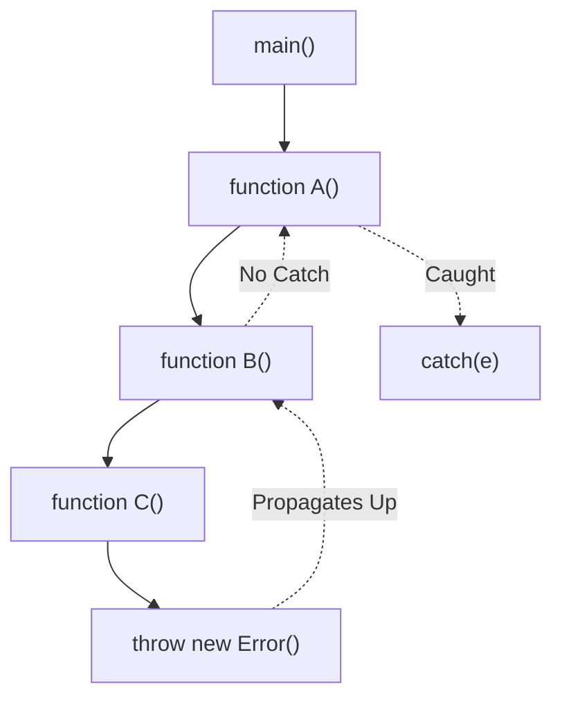

import { Tabs, TabItem, Aside, Badge, Card, CardGrid, Code, LinkCard } from '@astrojs/starlight/components';

## 💥 The `throw` Statement in JavaScript

> In Java, `throw` is strictly typed (`Throwable`).  
> In **JavaScript**, you can `throw` **anything**. However, best practice dictates always throwing an `Error` object to preserve stack traces.

<Aside type="tip">
**🧠 Mental Model**:  
`throw` is a **Signal Flare**.  
1. You create an `Error` object.  
2. You `throw` it.  
3. Execution stops immediately.  
4. The engine looks up the Call Stack for a `catch`.  
⚠️ **Key Difference**: JS has no `throws` keyword. Functions do not declare what they might throw.
</Aside>

---

## 🔬 Syntax & Best Practices

<Code lang="js" title="Valid Throw Forms" code={`
// ✅ Best Practice: Throw Error objects
throw new Error("Something went wrong");
throw new TypeError("Invalid type");
throw new RangeError("Out of bounds");

// ⚠️ Valid but Bad Practice: Throw primitives
throw "Error message";      // No stack trace!
throw 404;                  // No context!
throw { code: 500 };        // Hard to debug!

// ❌ Invalid: Nothing (syntax error)
// throw; 
`} />

<Aside type="caution">
**Why use `Error` objects?**  
Only `Error` objects automatically capture the **stack trace** (the path of function calls that led to the error). Primitives do not.
</Aside>

---

## 🔬 Execution Flow

When `throw` is executed:
1.  The current function stops.
2.  Control jumps to the nearest `catch` block.
3.  If no `catch` is found, the script/process crashes.

<Code lang="js" title="Flow Example" code={`
function validate(age) {
    if (age < 0) {
        throw new Error("Age cannot be negative");
    }
    console.log("This line is SKIPPED if age < 0");
}

try {
    validate(-1);
} catch (e) {
    console.error(e.message); // "Age cannot be negative"
}
`} />

---

## 🌊 Error Propagation (The Call Stack)

In Java, checked exceptions must be declared. In JS, errors propagate **silently** up the stack until caught.



<Code lang="js" title="Propagation Example" code={`
function c() {
    throw new Error("Failed in C");
}

function b() {
    c(); // Error propagates through here
}

function a() {
    try {
        b();
    } catch (e) {
        console.log("Caught in A:", e.message);
    }
}

a(); 
// Output: Caught in A: Failed in C
`} />

---

## ⚡ Async Propagation — The Trap!

In Java, threads handle their own exceptions. In JS, **async errors do not propagate to the caller's try/catch**.

<CardGrid>
  <Card title="❌ The Wrong Way" icon="error">
    ```js
    try {
        setTimeout(() => {
            throw new Error("Async Fail");
        }, 100);
    } catch (e) {
        // NEVER catches it.
        // The try block finished before the timer fired.
    }
    ```
  </Card>
  
  <Card title="✅ The Right Way: Promises" icon="approve-check">
    ```js
    fetchData()
        .then(data => process(data))
        .catch(err => {
            // Catches errors in fetch OR process
            console.error(err);
        });
    ```
  </Card>

  <Card title="✅ The Modern Way: Async/Await" icon="rocket">
    ```js
    async function run() {
        try {
            const data = await fetchData();
            process(data);
        } catch (err) {
            // Works because 'await' pauses execution
            console.error(err);
        }
    }
    ```
  </Card>
</CardGrid>

<Aside type="danger">
**🚨 Production Bug**: Unhandled Promise Rejections.  
If you don't `.catch()` a promise or `await` it, the error is swallowed or crashes the Node.js process (since Node 15+).
</Aside>

---

## 💻 Real-World Code — Custom Errors

Use custom errors to distinguish between different failure types.

<Code lang="js" title="Custom Error Class" code={`
class ValidationError extends Error {
    constructor(field, message) {
        super(message);
        this.name = "ValidationError";
        this.field = field;
    }
}

function registerUser(user) {
    if (!user.email) {
        throw new ValidationError("email", "Email is required");
    }
    // ... save user
}

try {
    registerUser({ name: "Alice" });
} catch (err) {
    if (err instanceof ValidationError) {
        console.error(\`Field $\{err.field\}: $\{err.message\}\`);
    } else {
        throw err; // Re-throw unknown errors
    }
}
`} />

---

## 💣 Interview Traps

<CardGrid>
  <Card title="Trap 1: Throwing Strings" icon="error">
    ```js
    throw "Something went wrong";
    // Valid JS, but BAD practice.
    // No stack trace, no 'name' property.
    // Always: throw new Error("Msg");
    ```
  </Card>
  
  <Card title="Trap 2: Swallowing Errors" icon="caution">
    ```js
    try {
        doSomething();
    } catch (e) {
        // Empty block
    }
    // 😱 Silent failure. Debugging is impossible.
    // Always log or re-throw.
    ```
  </Card>

  <Card title="Trap 3: Async Scope" icon="shield">
    ```js
    async function run() {
        try {
            const p1 = fetch('/api/1');
            const p2 = fetch('/api/2');
            
            // Both run in parallel. 
            // If p2 fails, p1 might still succeed.
            const r1 = await p1;
            const r2 = await p2; // Throws here
        } catch (err) {
            // Handles error from p2 (or p1)
        }
    }
    ```
  </Card>
</CardGrid>

---

## 🎯 Interview Cheat Sheet

<CardGrid>
  <Card title="Q: What is the difference between Java and JS throw?" icon="information">
    Java requires `Throwable` objects and enforces handling for Checked Exceptions.  
    JS allows throwing anything (strings, numbers), but `Error` objects are standard. JS has no checked exceptions.
  </Card>
  
  <Card title="Q: How do you handle async errors?" icon="approve-check">
    Use `.catch()` on Promises or `try/catch` with `async/await`. Standard `try/catch` does **not** work for asynchronous code.
  </Card>

  <Card title="Q: Does JS have a `throws` keyword?" icon="error">
    **No.** JS functions do not declare what exceptions they throw. Documentation (JSDoc) is crucial.
  </Card>

  <Card title="Q: What happens if you don't catch an error?" icon="caution">
    In the Browser: Execution stops, error logged to Console.  
    In Node.js: The process crashes (exits with code 1).
  </Card>
</CardGrid>

---

## 🧠 Full Mental Model Summary

```text
JS THROW & PROPAGATION CHECKLIST

1. Throw:
   throw new Error("Msg")

2. Propagate:
   Engine looks up Call Stack for nearest 'catch'

3. Async:
   Promises reject -> .catch()
   Await throws -> try/catch

4. Best Practices:
   - Always throw Error objects
   - Use custom Error classes for domain logic
   - Handle async errors properly
   - Don't swallow errors

⚠️ Key Differences from Java:
- No Checked Exceptions
- No 'throws' declaration
- Async breaks synchronous try/catch
- Uncaught errors crash Node, but not always Browser tabs
```

<Aside type="tip">
**Next Steps**:
1. ✅ Always `throw new Error()`, not strings.
2. ✅ Use `async/await` for clean async error handling.
3. ✅ Implement Global Error Handlers (`window.onerror`, `process.on`).
4. ✅ Use `error.cause` (ES2022) for error chaining.

Mastering throw ensures your app fails gracefully, not catastrophically. ☕✨
</Aside>
```

---

## 🔄 Java throw/throws → JS throw Conversion Summary

| Java Concept | JavaScript Equivalent | Critical Difference |
|-------------|----------------------|-------------------|
| **throw** | `throw new Error()` | JS allows throwing primitives (bad practice). |
| **throws** | ❌ None | JS has no declaration keyword. |
| **Checked Exception** | ❌ None | JS doesn't enforce handling. |
| **Stack Trace** | `error.stack` | Available on all Error objects. |
| **Async Propagation** | `.catch()` / `await` | Java threads block; JS uses Event Loop. |
| **Custom Errors** | `class MyError extends Error` | Same concept, simpler syntax. |

---

🧠 **Interview Power Move**: When asked about throw/propagation, always mention:  
1. **Async Complexity**: How `try/catch` doesn't work for callbacks.  
2. **No Checked Exceptions**: Why documentation is more important in JS than Java.  
3. **Global Handlers**: How to prevent silent crashes in Node/Browser.  
4. **Custom Errors**: Extending `Error` for better debugging.  
5. **Stack Traces**: Why you should always log the full `error.stack`, not just `message`.  

---
