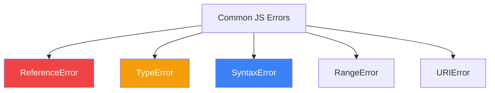

import { Tabs, TabItem, Aside, Badge, Card, CardGrid, Code, LinkCard } from '@astrojs/starlight/components';

## 🔴 JavaScript Runtime Errors Explained

---

### 🧠 What It Is

Unlike Java, **JavaScript has no compile-time error checking for logic**. You won't get "Unhandled Exception" errors before running your code.  
Instead, JS fails at **runtime**.  
Understanding these errors is crucial because they are the only feedback you get when things break in production.

<Aside type="tip">
**🧠 Mental Model**:  
Java = Strict Teacher (checks homework before class).  
JS = Lenient Teacher (lets you submit, then marks it wrong if it crashes).  
✅ **Key Goal**: Write defensive code to catch these runtime surprises early.
</Aside>

---

## 🔬 The Top 10 JavaScript Errors



---

### 1️⃣ ReferenceError: "X is not defined"

**Cause**: You are trying to use a variable that hasn't been declared or is out of scope.

<Code lang="js" title="ReferenceError Examples" code={`
// ❌ Undeclared variable
console.log(x); // ReferenceError: x is not defined

// ❌ Temporal Dead Zone (TDZ)
console.log(y); // ReferenceError: Cannot access 'y' before initialization
let y = 10;

// ❌ Out of scope
function test() {
    const z = 5;
}
console.log(z); // ReferenceError: z is not defined
`} />

**Fix**: Ensure variables are declared (`let`, `const`, `var`) and accessed within their scope.

---

### 2️⃣ TypeError: "Cannot read properties of undefined"

**Cause**: The most common JS error. You're trying to access a property or method on `null` or `undefined`.

<Code lang="js" title="TypeError Examples" code={`
const user = null;
console.log(user.name); // TypeError: Cannot read properties of null

const obj = {};
obj.func(); // TypeError: obj.func is not a function

// ❌ Async/Await mistake
const data = fetch('/api'); 
data.json(); // TypeError: data.json is not a function (forgot await!)
`} />

**Fix**: Use Optional Chaining (`?.`) or default values.
```js
console.log(user?.name); // undefined (safe)
```

---

### 3️⃣ SyntaxError: "Unexpected token"

**Cause**: Invalid code structure. This usually happens during parsing, before execution starts. Common in JSON parsing or typos.

<Code lang="js" title="SyntaxError Examples" code={`
// ❌ Invalid JSON
JSON.parse("{ name: 'Alice' }"); // SyntaxError: Unexpected token n in JSON

// ❌ Typos
const x = { name: 'Alice', } // Trailing comma is OK in modern JS, but:
const y = { name: 'Alice' age: 30 }; // SyntaxError: Unexpected identifier

// ❌ Missing closing brace
function test() {
   console.log("hi");
// SyntaxError: Unexpected end of input
`} />

**Fix**: Use a linter (ESLint) to catch these before runtime.

---

### 4️⃣ RangeError: "Maximum call stack size exceeded"

**Cause**: Infinite recursion or passing an invalid number range.

<Code lang="js" title="RangeError Examples" code={`
// ❌ Infinite Recursion
function loop() {
    loop();
}
loop(); // RangeError: Maximum call stack size exceeded

// ❌ Invalid Array Length
new Array(-1); // RangeError: Invalid array length
`} />

**Fix**: Ensure recursive functions have a base case to stop.

---

### 5️⃣ URIError: "Malformed URI sequence"

**Cause**: Using global URI handling functions incorrectly.

<Code lang="js" title="URIError Example" code={`
decodeURIComponent('%'); // URIError: URI malformed
`} />

**Fix**: Validate inputs before decoding.

---

## 💻 Real-World Code — Defensive Patterns

Don't just let your app crash. Handle errors gracefully.

<Code lang="js" title="Safe Property Access" code={`
// The Old Way
if (user && user.address && user.address.city) {
    console.log(user.address.city);
}

// The Modern Way (Optional Chaining)
console.log(user?.address?.city); // undefined if any part is missing

// The Nullish Coalescing Way (Defaults)
const city = user?.address?.city ?? 'Unknown';
`} />

<Code lang="js" title="Safe JSON Parsing" code={`
function safeParse(jsonString) {
    try {
        return JSON.parse(jsonString);
    } catch (error) {
        console.error("Invalid JSON", error);
        return null;
    }
}

const data = safeParse("{ bad json }"); // Returns null, doesn't crash
`} />

---

## 💣 Interview Traps

<CardGrid>
  <Card title="Trap 1: typeof null" icon="error">
    ```js
    console.log(typeof null); // "object" 😱
    // This is a historic bug in JS.
    // Fix: Always check `val === null` explicitly.
    ```
  </Card>
  
  <Card title="Trap 2: Undefined vs Null" icon="caution">
    ```js
    let x; 
    console.log(x); // undefined
    
    let y = null;
    console.log(y); // null
    
    // TypeError happens on BOTH if you access properties:
    // x.prop -> TypeError
    // y.prop -> TypeError
    ```
  </Card>

  <Card title="Trap 3: Async Errors" icon="shield">
    ```js
    // ❌ This won't catch the error!
    try {
        setTimeout(() => { throw new Error("Fail"); }, 100);
    } catch (e) { ... }
    
    // ✅ Use async/await or .catch()
    ```
  </Card>
</CardGrid>

---

## 🎯 Interview Cheat Sheet

<CardGrid>
  <Card title="Q: What is the difference between ReferenceError and TypeError?" icon="information">
    **ReferenceError**: The variable doesn't exist (scope/declaration issue).  
    **TypeError**: The variable exists, but you're using it wrongly (e.g., calling a non-function).
  </Card>
  
  <Card title="Q: How do you prevent 'Cannot read property of undefined'?" icon="approve-check">
    Use Optional Chaining (`obj?.prop`) or provide default values (`obj.prop || default`).
  </Card>

  <Card title="Q: Does JS have Compile-Time errors?" icon="error">
    Only **SyntaxErrors** (invalid code structure) are caught before execution. Logic errors (like TypeErrors) only happen at runtime.
  </Card>

  <Card title="Q: What causes 'Maximum call stack size exceeded'?" icon="rocket">
    Infinite recursion. A function calls itself without a condition to stop.
  </Card>
</CardGrid>

---

## 🧠 Full Mental Model Summary

```text
JS ERROR DEBUGGING CHECKLIST

1. ReferenceError?
   - Check spelling.
   - Check scope (is it inside a function?).
   - Check TDZ (using let/const before declaration).

2. TypeError?
   - Is the object null/undefined?
   - Did you forget to await a Promise?
   - Are you calling a non-function?

3. SyntaxError?
   - Check JSON format.
   - Check for missing brackets/parentheses.

4. RangeError?
   - Check for infinite loops/recursion.

⚠️ Key Differences from Java:
- No Checked Exceptions
- Errors are objects, but often lack detailed context
- Stack traces are engine-dependent (V8 vs SpiderMonkey)
```

<Aside type="tip">
**Next Steps**:
1. ✅ Enable ESLint in your project to catch Syntax/Reference errors early.
2. ✅ Use TypeScript to eliminate many TypeErrors at compile time.
3. ✅ Use `try/catch` around external API calls and JSON parsing.
4. ✅ Use Optional Chaining (`?.`) for deep nested objects.

Mastering these errors turns debugging from a nightmare into a routine task. ☕✨
</Aside>
```

---

## 🔄 Java Compile Errors → JS Runtime Errors Conversion Summary

| Java Concept | JavaScript Equivalent | Critical Difference |
|-------------|----------------------|-------------------|
| **Unreachable Code** | ❌ None | JS allows code after `throw` (it just doesn't run). |
| **Unhandled Checked Exception** | ❌ None | JS has no checked exceptions. |
| **Type Mismatch** | `TypeError` | Happens at runtime, not compile time. |
| **Null Pointer** | `TypeError` | "Cannot read properties of null". |
| **Class Not Found** | `ReferenceError` | Variable/Module not defined. |
| **Syntax Error** | `SyntaxError` | Similar, but JS is more forgiving (e.g., trailing commas). |
| **Stack Overflow** | `RangeError` | Same concept, different name. |

---

🧠 **Interview Power Move**: When asked about errors, always mention:  
1. **Optional Chaining**: How it solves the #1 JS error (TypeError).  
2. **Async Context**: Why `try/catch` fails for timeouts/intervals.  
3. **Linting**: Why we use tools to mimic Java's compile-time safety.  
4. **TypeScript**: How it bridges the gap between JS flexibility and Java safety.  

---
