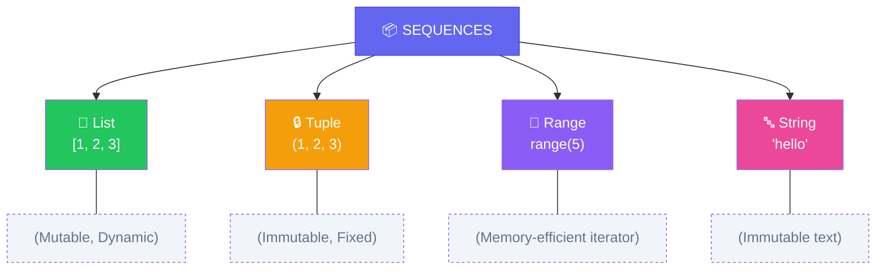
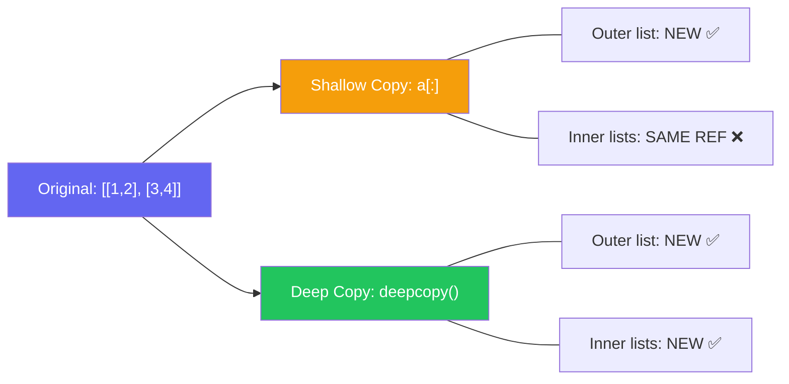

import { Aside, Badge, Card, CardGrid, Code, LinkCard } from '@astrojs/starlight/components';

```
Python has NO built-in array type.

C/Java:   int arr[5]  → contiguous block of raw memory. Fixed size. No overhead.
Python:   No equivalent primitive exists in the language.

What Python has:
  ├── list        → dynamic array of POINTERS (not values)
  ├── array.array → typed array of actual values (like C array)
  ├── tuple       → immutable dynamic array of pointers
  └── numpy.ndarray → true contiguous numeric array (external)
```

## 📦 What is a List in Python?

A **List** is a **dynamic, ordered, mutable** container that stores multiple values — **heterogeneous types allowed** — under one name.

### 🔑 Key Characteristics

| Feature | Detail |
|---------|--------|
| **Type** | 🔵 Reference Type (object in **Heap**) |
| **Size** | 🔄 **Dynamic** — grows/shrinks automatically |
| **Index** | 🔢 Starts from `0`, supports **negative indexing** (`-1` = last) |
| **Elements** | 🎯 **Heterogeneous** — mix `int`, `str`, `bool`, objects freely |

```python
arr = [10, 20, 30]
# Index →   0    1    2
# Value →  10   20   30
# Negative: -3  -2   -1  ← arr[-1] = 30 ✅
```

<Aside type="success">
🎯 **Python Advantage**: No fixed size, no type restrictions, no manual memory management. Lists "just work".
</Aside>

---

## 🗂️ Types of Sequences in Python



> 💡 **For Java array equivalents**: Use **`list`** for dynamic arrays, **`tuple`** for fixed-size immutable sequences.

---

## 🏗 How Lists Work Internally

<Code lang="python" title="Memory layout visualization" code={`
arr = [10, 20, 30, 40, 50]

# STACK (Reference)          HEAP (Object Data)
# ┌────────────────┐         ┌─────────────────────────────────┐
# │ arr  [ref/add] ──────────→│ [10] [20] [30] [40] [50]              │
# └────────────────┘         │  0    1    2    3    4  ← index       │ 
#                               │ 🎯 Each element is a POINTER to int object
#                               │ 🔄 List stores REFERENCES, not raw values
#                               └─────────────────────────────────┘
#                                Over-allocated for O(1) amortized append!
`} />

## 🔬 What a C Array Looks Like in Memory

```
int arr[4] = {1, 2, 3, 4};

RAM:
┌────┬────┬────┬────┐
│  1 │  2 │  3 │  4 │   ← raw int values, contiguous, no overhead
└────┴────┴────┴────┘
 [0]  [1]  [2]  [3]
 addr addr+4 addr+8 addr+12

arr[2] = base_addr + 2 * sizeof(int)   ← O(1) direct calculation
```

---

## 🔬 What Python `list` Actually Is

```
lst = [1, 2, 3, 4]

RAM:
PyListObject
┌─────────────────────────────────┐
│ ob_refcnt                       │
│ ob_type → PyList_Type           │
│ ob_size = 4  (current length)   │
│ allocated = 4 (capacity)        │
│ ob_item ────────────────────────┼──▶ pointer array
└─────────────────────────────────┘
                                       ┌──────┬──────┬──────┬──────┐
                                       │  *p0 │  *p1 │  *p2 │  *p3 │
                                       └──┬───┴──┬───┴──┬───┴──┬───┘
                                          │      │      │      │
                                          ▼      ▼      ▼      ▼
                                       PyLong PyLong PyLong PyLong
                                       (1)    (2)    (3)    (4)
```

> `list` is an array of **pointers to PyObjects**. Each element is 8 bytes (pointer size on 64-bit). The actual integers live scattered on the heap.

```python
import sys
sys.getsizeof([1, 2, 3, 4])   # 88 bytes  (56 overhead + 4×8 pointers)
sys.getsizeof(1)               # 28 bytes  (each int object separately)

# Total memory for [1,2,3,4]:
# 88 + 4×28 = 200 bytes
# A C int[4] = 16 bytes
```

### 🔍 Why O(1) Amortized Append?

```
Python lists use dynamic array strategy:
- Allocate extra capacity (≈12.5% overhead)
- When full: allocate new larger block → copy elements → free old
- Amortized cost of append: O(1) ✅

arr.append(60)  # Usually O(1), rarely O(n) during resize
```

> ✔ `arr` → reference variable (Stack)  
> ✔ List object + element references → stored in Heap  
> ✔ Actual int/str objects → separate Heap allocations

<Aside type="note">
**No default values needed** — Python lists start empty: `[]`.  
Add elements explicitly: `arr.append(10)` or pre-fill: `[0] * 5`.
</Aside>

---

## 📌 Declaration Styles

<Code lang="python" title="✅ Valid list creations" code={`
# Empty list
arr = []                    # Recommended

# Literal initialization
arr = [10, 20, 30]          # Most common

# Pre-filled with default
arr = [0] * 5               # [0, 0, 0, 0, 0]
arr = [None] * 3            # [None, None, None]

# List comprehension (Pythonic 🔥)
squares = [x**2 for x in range(5)]  # [0, 1, 4, 9, 16]

# From iterable
arr = list(range(5))        # [0, 1, 2, 3, 4]
arr = list("hello")         # ['h', 'e', 'l', 'l', 'o']
`} />

<Code lang="python" title="❌ Invalid / Gotchas" code={`
arr = [5]10          # ❌ SyntaxError: invalid syntax
arr = list(5)        # ❌ TypeError: 'int' object is not iterable
arr = [1, 2, 3]
arr[5] = 10          # ❌ IndexError: list assignment index out of range
# FIX: Use append() or ensure index exists first
`} />

<Aside type="tip">
**MUST KNOW**: Python lists are **zero-indexed** and support **negative indexing**:
```python
arr = ['a', 'b', 'c', 'd']
arr[0]   # 'a' (first)
arr[-1]  # 'd' (last) — no need for arr[len(arr)-1]!
arr[-2]  # 'c' (second-to-last)
```
</Aside>

---

## 1️⃣ Single-Dimensional Lists

### Creation & Initialization

<Code lang="python" title="Dynamic by default" code={`
arr = []                    # Empty list
arr.append(10)              # Add to end
arr.extend([20, 30])        # Add multiple
arr.insert(0, 5)            # Insert at index

# Pre-allocate with defaults (Java-like pattern)
size = 5
arr = [0] * size            # [0, 0, 0, 0, 0]
arr[2] = 99                 # [0, 0, 99, 0, 0] ✅
`} />

### Default Values Pattern

| Goal | Python Pattern | Java Equivalent |
|------|---------------|-----------------|
| Empty list | `[]` | `new int[0]` |
| Pre-fill with `0` | `[0] * n` | `new int[n]` |
| Pre-fill with `None` | `[None] * n` | `new Integer[n]` |
| Pre-fill with custom | `[obj for _ in range(n)]` | Loop + assign |

<Aside type="danger">
⚠️ **Shallow Copy Trap**: `[obj] * n` replicates **references**, not copies!
```python
# ❌ Dangerous with mutable objects:
matrix = [[]] * 3
matrix[0].append(1)
print(matrix)  # [[1], [1], [1]] — all same list!

# ✅ Safe: List comprehension creates independent objects
matrix = [[] for _ in range(3)]
matrix[0].append(1)
print(matrix)  # [[1], [], []] — correct!
```
</Aside>

---

## 2️⃣ Multi-Dimensional Lists

### 🧠 Python Naturally Supports Jagged Structures!

No special syntax — just lists of lists.

<Code lang="python" title="Jagged 2D list" code={`
# Create jagged array (rows of different lengths)
arr = [[0] * 3, [0] * 5]  # Row 0: 3 elems, Row 1: 5 elems

# Or build dynamically:
arr = []
arr.append([1, 2, 3])     # Row 0
arr.append([4, 5, 6, 7, 8])  # Row 1 (different length!)

# Access:
print(arr[0][1])  # 2 ✅
print(arr[1][4])  # 8 ✅
`} />

<Code lang="python" title="3D jagged example" code={`
# Create 3D structure naturally
cube = [
    [ [1, 2], [3, 4, 5] ],      # Layer 0: jagged rows
    [ [6], [7, 8], [9, 10, 11] ] # Layer 1: different shape
]

print(cube[0][1][2])  # 5 ✅
# print(cube[1][0][2])  # ❌ IndexError: list index out of range
`} />

### 📐 Dimension Rules (Python vs Java)

<Code lang="python" title="✅ Valid multi-dim creations" code={`
rect = [[0] * 4 for _ in range(3)]    # ✅ 3×4 rectangular
jagged = [[] for _ in range(3)]        # ✅ Jagged (fill rows later)
cube = [[[0]*5 for _ in range(4)] for _ in range(3)]  # ✅ 3×4×5
mixed = [[1, 2], [3, 4, 5], [6]]      # ✅ Naturally jagged
`} />

<Code lang="python" title="❌ Common mistakes" code={`
# ❌ Using * with mutable default (shallow copy trap):
matrix = [[]] * 3      # ⚠️ All rows reference SAME list!
matrix[0].append(1)
print(matrix)  # [[1], [1], [1]] — BUG!

# ✅ Always use comprehension for nested mutables:
matrix = [[] for _ in range(3)]  # ✅ Independent lists
`} />

<Aside type="tip">
**Rule of Thumb**:  
- Use `[value] * n` for **immutable** defaults (`0`, `None`, `''`) ✅  
- Use `[expr for _ in range(n)]` for **mutable** defaults (`[]`, `{}`, custom objects) ✅  
- Never use `[mutable] * n` ❌
</Aside>

---

## ⚙ Important Properties

### 1️⃣ `len()` Function (Not a Property!)

<Code lang="python" title="Using len()" code={`
arr = [10, 20, 30]
print(len(arr))        # ✅ 3 (function, with parentheses)
# print(arr.len)       # ❌ AttributeError: 'list' object has no attribute 'len'
# print(arr.length)    # ❌ AttributeError: same reason
`} />

### 2️⃣ Indexing & Bounds

```python
arr = [10, 20, 30]
arr[0]      # ✅ First element
arr[-1]     # ✅ Last element (Python superpower!)
arr[5]      # ❌ Runtime: IndexError: list index out of range
arr[-5]     # ❌ Runtime: IndexError (if len < 5)
```

### 🔬 Dynamic Typing Nature

<Code lang="python" title="Type flexibility at runtime" code={`
arr = []
arr.append(10)        # ✅ int
arr.append(10.5)      # ✅ float — no error!
arr.append('A')       # ✅ str — heterogeneous allowed
arr.append([1, 2])    # ✅ nested list — no problem

# But operations may fail at runtime if types incompatible:
# result = arr[0] + arr[2]  # ❌ TypeError: int + str
`} />

### 🔬 List Type Introspection

```python
arr = [1, 2, 3]
print(arr)                    # [1, 2, 3]
print(type(arr))              # <class 'list'>
print(type(arr).__name__)     # 'list'

# Nested:
matrix = [[1, 2], [3, 4]]
print(type(matrix))           # <class 'list'>
print(type(matrix[0]))        # <class 'list'>
print(matrix[0][0])           # 1 (int)
```

---

## ⚡ Lists vs. array Module vs. NumPy

| Feature | `list` | `array.array` | `numpy.ndarray` |
|---------|--------|--------------|-----------------|
| **Type** | Heterogeneous | Homogeneous primitive | Homogeneous + vectorized |
| **Size** | Dynamic | Dynamic | Dynamic (with reshape) |
| **Speed** | Good | ⚡ Faster for primitives | 🚀 Blazing (C-backed) |
| **Memory** | Higher (object refs) | Lower (raw values) | Lowest + cache-friendly |
| **Use Case** | General purpose | Memory-constrained primitives | Scientific/ML/numerical |

<Code lang="python" title="When to use what" code={`
# ✅ General purpose — use list:
names = ["Alice", "Bob", "Charlie"]
mixed = [1, "two", 3.0, True]

# ✅ Memory-efficient primitives — use array:
from array import array
nums = array('i', [1, 2, 3, 4])  # 'i' = signed int
# nums.append("text")  # ❌ TypeError: array only accepts specified type

# ✅ Numerical computing — use NumPy:
import numpy as np
matrix = np.array([[1, 2], [3, 4]])
result = matrix @ matrix.T  # Matrix multiplication — super fast!
`} />

<Aside type="tip">
**Interview Answer**:  
> "For 95% of Python code, use built-in `list`. Switch to `array.array` only for memory-constrained primitive sequences, and `numpy` for numerical/ML workloads. Premature optimization is the root of all evil." 🎯
</Aside>

---

## 📌 Anonymous / Inline Lists

Lists **without a named variable** — perfect for one-time operations.

<Code lang="python" title="Inline list patterns" code={`
# Pass directly to function:
def process(items): 
    return sum(items)

result = process([10, 20, 30])  # ✅ Anonymous list

# List comprehension inline:
squares = sum([x**2 for x in range(5)])  # 0+1+4+9+16 = 30

# Nested inline:
matrix = [[i*j for j in range(3)] for i in range(3)]
# [[0,0,0], [0,1,2], [0,2,4]]

# Generator expression (memory-efficient alternative):
total = sum(x**2 for x in range(1000000))  # No intermediate list!
`} />

<Aside type="success">
🚀 **Python Pro Tip**: Use **generator expressions** `(x for x in ...)` instead of list comprehensions `[x for x in ...]` when iterating once — saves memory!
</Aside>

---

## 🧠 List Assignment & Copying

### 🔗 Reference vs. Copy

<Code lang="python" title="Assignment creates reference, not copy" code={`
a = [1, 2, 3]
b = a              # ✅ b references SAME list as a
b.append(4)
print(a)           # [1, 2, 3, 4] — a changed too! 😱

# ✅ Create independent copy:
c = a.copy()       # Shallow copy
d = a[:]           # Slice copy (same as shallow)
e = list(a)        # Constructor copy

# ✅ Deep copy for nested structures:
import copy
f = copy.deepcopy(a)  # Recursive copy of all nested objects
`} />

### 🔬 Shallow vs. Deep Copy



<Code lang="python" title="Shallow copy trap" code={`
original = [[1, 2], [3, 4]]
shallow = original[:]

shallow[0].append(99)
print(original)  # [[1, 2, 99], [3, 4]] — 😱 original modified!

# Fix with deep copy:
import copy
original = [[1, 2], [3, 4]]
deep = copy.deepcopy(original)
deep[0].append(99)
print(original)  # [[1, 2], [3, 4]] — ✅ safe
`} />

<Aside type="danger">
**Covariance Trap (Java) → Reference Trap (Python)**:  
Java: `String[] → Object[]` allows wrong-type insert at runtime.  
Python: `list` accepts any type, but **aliasing** causes unintended side effects. Always copy when in doubt!
</Aside>

---

## 🧠 Size & Capacity Rules

| Rule | Python | Java Equivalent |
|------|--------|----------------|
| Size **not specified** at creation | `arr = []` ✅ | `new int[0]` |
| **Zero-length** list | `[]` ✅, `len=0` | `new int[0]` ✅ |
| **Negative size** | `[-1] * 5` ✅ (valid list) | `new int[-1]` ❌ Runtime error |
| **Dynamic growth** | Automatic ✅ | Manual (`Arrays.copyOf`) |
| **Max size** | Limited by memory ✅ | `Integer.MAX_VALUE` |

<Code lang="python" title="Size flexibility examples" code={`
arr = []
arr.append(10)           # ✅ Grow dynamically
arr.extend([20, 30])     # ✅ Add multiple
arr.insert(0, 5)         # ✅ Insert at front (O(n) shift)

# Pre-fill patterns:
zeros = [0] * 1000000    # ✅ Fast, memory allocated
# But watch for mutable traps:
bad = [[]] * 3           # ❌ Shared references
good = [[] for _ in range(3)]  # ✅ Independent lists
`} />

---

## 🔄 List Traversal

<Code lang="python" title="Four Pythonic ways to iterate" code={`
arr = [10, 20, 30, 40, 50]

# Way 1 — classic for with range
for i in range(len(arr)):
    print(arr[i])

# Way 2 — direct iteration (Pythonic ✅)
for num in arr:
    print(num)

# Way 3 — enumerate for index + value
for i, num in enumerate(arr):
    print(f"{i}: {num}")

# Way 4 — list comprehension (for transformation)
doubled = [x * 2 for x in arr]  # [20, 40, 60, 80, 100]

# Bonus: Functional style
from functools import reduce
total = reduce(lambda a, b: a + b, arr)  # 150
`} />

<Aside type="tip">
**For-each is Pythonic**: Prefer `for item in list` over index-based loops unless you need the index. Use `enumerate()` when you need both!
</Aside>

---

## 🚨 Common Runtime Exceptions

<CardGrid>
  <Card title="IndexError" icon="error">
    ```python
    arr = [10, 20, 30]
    print(arr[3])      # 💥 IndexError: list index out of range
    print(arr[-4])     # 💥 Same — negative index out of bounds
    ```
    **Cause**: Index `< -len(arr)` or `>= len(arr)`  
    **Fix**: Check bounds or use `try/except`
  </Card>
  
  <Card title="TypeError (unsupported operation)" icon="error">
    ```python
    arr = [1, 2, 3]
    arr + "text"       # 💥 TypeError: can only concatenate list to list
    arr[0] + "text"    # 💥 TypeError: int + str
    ```
    **Cause**: Type mismatch in operations  
    **Fix**: Ensure compatible types or convert explicitly
  </Card>
  
  <Card title="AttributeError" icon="error">
    ```python
    arr = [1, 2, 3]
    arr.length         # 💥 AttributeError: no 'length' attribute
    arr.len()          # 💥 AttributeError: no 'len' method
    # FIX: Use len(arr) ✅
    ```
    **Cause**: Using Java-style `.length` or `.len()`  
    **Fix**: Remember: `len(arr)` is a **function**, not a method!
  </Card>
  
  <Card title="ValueError (unpacking)" icon="error">
    ```python
    a, b = [1, 2, 3]   # 💥 ValueError: too many values to unpack
    # FIX: Use * for rest:
    a, b, *rest = [1, 2, 3, 4]  # ✅ a=1, b=2, rest=[3,4]
    ```
  </Card>
</CardGrid>

---

## 🔥 Interview Traps (Python Edition)

<CardGrid>
  <Card title="Trap 1 — Mutable default arguments" icon="error">
    ```python
    def add_item(item, lst=[]):  # ❌ Shared list across calls!
        lst.append(item)
        return lst
    
    # Fix with None sentinel:
    def add_item(item, lst=None):  # ✅
        if lst is None:
            lst = []
        lst.append(item)
        return lst
    ```
  </Card>
  
  <Card title="Trap 2 — Shallow copy of nested lists" icon="error">
    ```python
    original = [[1, 2], [3, 4]]
    copy = original[:]      # ⚠️ Shallow copy
    copy[0].append(99)
    print(original)         # [[1, 2, 99], [3, 4]] — BUG!
    
    # Fix: Use deepcopy for nested mutables
    import copy
    safe = copy.deepcopy(original)
    ```
  </Card>
  
  <Card title="Trap 3 — List multiplication with mutables" icon="error">
    ```python
    matrix = [[]] * 3       # ❌ All rows same object
    matrix[0].append(1)
    print(matrix)           # [[1], [1], [1]]
    
    # Fix: List comprehension
    matrix = [[] for _ in range(3)]  # ✅ Independent lists
    ```
  </Card>
  
  <Card title="Trap 4 — Modifying list while iterating" icon="error">
    ```python
    arr = [1, 2, 3, 4, 5]
    for x in arr:
        if x % 2 == 0:
            arr.remove(x)   # 💥 Skip elements, unpredictable!
    
    # Fix: Iterate over copy or use comprehension:
    arr = [x for x in arr if x % 2 != 0]  # ✅ Clean
    # Or:
    for x in arr[:]:        # Iterate over shallow copy
        if x % 2 == 0:
            arr.remove(x)
    ```
  </Card>
  
  <Card title="Trap 5 — is vs == for lists" icon="error">
    ```python
    a = [1, 2, 3]
    b = [1, 2, 3]
    c = a
    
    a == b    # ✅ True — same values
    a is b    # ❌ False — different objects
    a is c    # ✅ True — same reference
    
    # Use 'is' only for None checks:
    if x is None:  # ✅ Correct
    if x == None:  # ⚠️ Works but not Pythonic
    ```
  </Card>
</CardGrid>

---

## 📌 DSA Connection

| Python Pattern | DSA Use Case | Time/Space |
|---------------|-------------|-----------|
| `freq = [0] * 26` | Frequency array for a-z | O(1) space |
| `stack = []` + `append/pop` | Stack implementation | O(1) ops |
| `from collections import deque` | Queue/BFS | O(1) append/popleft |
| `heapq.heapify(arr)` | Min-heap / priority queue | O(n) build |
| `arr.sort()` / `sorted(arr)` | Sorting, two-pointer | O(n log n) |
| `set(arr)` | Deduplication, O(1) lookup | O(n) time/space |
| `itertools` module | Combinatorics, permutations | Memory-efficient |

<Aside type="tip">
**Pro Tip**: In Python DSA:  
- Use `list` as stack: `append()` / `pop()` = O(1) ✅  
- Use `collections.deque` as queue: `append()` / `popleft()` = O(1) ✅  
- Avoid `list.pop(0)` — O(n) shift! Use `deque.popleft()` instead 🚀
</Aside>

<Code lang="python" title="Frequency array pattern" code={`# Count lowercase letters: O(n) time, O(1) space
from collections import Counter

# Option 1: Manual array (Java-style)
freq = [0] * 26
for c in input_str:
    if 'a' <= c <= 'z':
        freq[ord(c) - ord('a')] += 1

# Option 2: Pythonic Counter (preferred ✅)
freq = Counter(c for c in input_str if c.islower())
# freq['a'] → count, freq.get('z', 0) → safe access
`} />

---

## 🧪 Quick Self-Test

<Code lang="python" title="Predict the output" code={`# Test 1: Reference vs Copy
a = [1, 2, 3]
b = a
b.append(4)
print(a)  # ?

# Test 2: List multiplication trap
matrix = [[]] * 3
matrix[0].append(1)
print(matrix)  # ?

# Test 3: Negative indexing
arr = [10, 20, 30]
print(arr[-1] + arr[-2])  # ?

# Test 4: Shallow copy behavior
original = [[1, 2], [3, 4]]
shallow = original[:]
shallow[0][0] = 99
print(original[0][0])  # ?
`} />

<details>
<summary>✅ Click to reveal answers</summary>

```text
[1, 2, 3, 4]     # a and b reference same list
[[1], [1], [1]]  # Shallow copy trap — all rows same list
50               # arr[-1]=30, arr[-2]=20 → 30+20=50
99               # shallow[0] references original[0] — mutation visible
```
</details>

---

## 🔗 Related Topics

<CardGrid columns={2}>
  <LinkCard
    title="Python Literals"
    href="/computer-languages/python/topics/literals"
    description="Numbers, strings, None, boolean values"
  />
  <LinkCard
    title="Python Data Types"
    href="/computer-languages/python/topics/data-types"
    description="Dynamic typing, mutability, type hints"
  />
  <LinkCard
    title="Python Strings"
    href="/computer-languages/python/topics/strings"
    description="Immutability, f-strings, methods"
  />
  <LinkCard
    title="Python Memory Model"
    href="/computer-languages/python/topics/memory"
    description="References, garbage collection, copy strategies"
  />
</CardGrid>

---

## 🗂️ Uninitialized Variables in Python — 3 Levels

### Core Concept: Names & Binding

In Python, a variable is a **name bound to an object**. No declaration needed — assignment creates the binding.

<Code lang="python" title="Binding vs. Access" code={`
arr = [1, 2, 3]    # Name 'arr' bound to list object
# Before assignment, name doesn't exist in scope
`} />

| State | Meaning |
|-------|---------|
| **Unbound Name** | Name not in scope → `NameError` |
| **Bound to None** | `arr = None` → valid, but check before use |
| **Bound to List** | `arr = []` → ready for operations |

<Aside type="note">
**Key Rule**: Python uses **LEGB scope resolution** (Local → Enclosing → Global → Built-in). Unbound names raise `NameError` at **runtime**, not compile time.
</Aside>

---

## 1️⃣ Module Level (Global)

Defined at file scope. Accessible throughout module.

<Code lang="python" title="Global list — uninitialized" code={`
marks = None  # Explicitly bound to None

def show():
    print(marks)        # prints: None ✅
    # print(marks[0])   # 💥 TypeError: 'NoneType' object is not subscriptable
`} />

```text
Memory Layout:

GLOBAL NAMESPACE          HEAP
┌────────────────┐       ┌─────────┐
│ marks │ None  │        │ (empty) │
└────────────────┘       └─────────┘
   ↑
   Name bound to None — no list object exists
```

<Aside type="tip">
✅ **Explicit None is safe** — `marks` exists but points to `None`.  
💥 **Access crashes** — `marks[0]` throws `TypeError` at **runtime**.
</Aside>

---

## 2️⃣ Function Level (Local)

Defined inside function. Shortest lifetime.

<Code lang="python" title="Local list — uninitialized" code={`
def calculate():
    # marks = []  # Uncomment to fix
    
    print(marks)    # ❌ NameError: name 'marks' is not defined
    # Python checks at runtime — no compile-time safety
`} />

```text
Runtime Output:
"NameError: name 'marks' is not defined"
```

<Aside type="danger">
🔒 **Python has no compile-time uninitialized check**.  
All name resolution happens at **runtime** — test thoroughly! Use type hints + linters (`mypy`, `pylint`) for static analysis.
</Aside>

---

## 3️⃣ Class Level (Attribute)

Defined in class body. Shared across instances (if not overridden).

<Code lang="python" title="Class attribute — uninitialized" code={`
class Student:
    marks = None  # Class attribute
    
    def show(self):
        print(Student.marks)   # None ✅
        # print(Student.marks[0])  # 💥 TypeError

# Instance can override:
s = Student()
s.marks = [90, 85]  # Instance attribute shadows class attribute
print(s.marks)      # [90, 85] ✅
print(Student.marks)  # None — class attribute unchanged
`} />

---

## 🧩 Variable Binding Matrix

Every Python variable follows this pattern:

```
                    ┌─────────────────┐
                    │ Python Name     │
                    └────────┬────────┘
                             │
        ┌────────────────────┼────────────────────┐
        ↓                    ↓                    ↓
   ┌─────────┐      ┌─────────────┐      ┌─────────────┐
   │ Scope   │      │ Binding     │      │ Result    │
   ├─────────┤      ├─────────────┤      ├─────────────┤
   │ Global  │      │ None        │      │ NameError │
   │ Local   │ ───▶ │ [1,2,3]     │ ───▶ │ Works ✅  │
   │ Class   │      │ (unbound)   │      │ if accessed│
   └─────────┘      └─────────────┘      └─────────────┘
```

<Code lang="python" title="All combinations example" code={`
# Global + bound
global_list = [1, 2, 3]  # ✅ Ready

class Test:
    # Class + bound
    class_list = [4, 5, 6]  # ✅
    
    def method(self):
        # Local + bound
        local_list = [7, 8, 9]  # ✅
        return local_list
        
        # Local + unbound:
        # print(undefined_var)  # ❌ NameError at runtime
`} />

---

## 🆚 Comparison Table: Java Arrays vs Python Lists

| Feature | Java Array | Python List |
|---------|-----------|-------------|
| **Declaration** | `int[] arr = new int[5]` | `arr = [0] * 5` |
| **Size** | Fixed | Dynamic |
| **Type** | Homogeneous | Heterogeneous |
| **Length Access** | `arr.length` (property) | `len(arr)` (function) |
| **Index Bounds** | `ArrayIndexOutOfBoundsException` | `IndexError` |
| **Null Handling** | `null` reference → `NullPointerException` | `None` → `TypeError` on subscript |
| **Multi-dim** | Jagged via `new int[2][]` | Natural: `[[1,2], [3,4,5]]` |
| **Copy** | `Arrays.copyOf()` | `list.copy()`, `[:]`, `deepcopy()` |
| **Iteration** | `for(int x : arr)` | `for x in arr` ✅ |

<Aside type="success">
🎯 **Python Advantage Summary**:  
✅ No size declarations  
✅ No type restrictions  
✅ Negative indexing built-in  
✅ Rich list methods (`append`, `extend`, `pop`, `sort`)  
✅ List comprehensions for expressive transformations  
✅ Seamless integration with `collections`, `itertools`, `numpy`
</Aside>

---

## 🎯 Interview Cheat Sheet

<CardGrid>
  <Card title="Q: list vs tuple?" icon="information">
    ```python
    # List: mutable, dynamic
    arr = [1, 2, 3]
    arr.append(4)  # ✅
    
    # Tuple: immutable, fixed
    coords = (10, 20)
    # coords[0] = 99  # ❌ TypeError
    
    # Use tuple for: hashable keys, fixed records, function returns
    def get_user(): return ("Alice", 25)  # tuple unpacking ✅
    ```
  </Card>

  <Card title="Q: How to check if list is empty?" icon="approve-check">
    ```python
    arr = []
    
    # ✅ Pythonic (truthiness):
    if not arr:      # Empty → True
        print("empty")
    
    # ✅ Explicit:
    if len(arr) == 0:
        print("empty")
    
    # ❌ Avoid (works but verbose):
    if arr == []:
        print("empty")
    ```
  </Card>

  <Card title="Q: Shallow vs deep copy?" icon="backspace">
    **When to use**:  
    - Shallow (`list.copy()`, `[:]`): Flat lists, immutable elements ✅  
    - Deep (`copy.deepcopy()`): Nested mutables, avoid aliasing bugs ✅  
    - Assignment (`b = a`): When you WANT shared reference (rare) ⚠️
  </Card>

  <Card title="Q: Optimize list operations?" icon="zap">
    ```python
    # ❌ O(n²): Insert at front repeatedly
    arr = []
    for x in data:
        arr.insert(0, x)
    
    # ✅ O(n): Append then reverse
    arr = []
    for x in data:
        arr.append(x)
    arr.reverse()
    
    # ✅ O(n): Use deque for O(1) front insert
    from collections import deque
    dq = deque()
    for x in 
        dq.appendleft(x)
    ```
  </Card>
</CardGrid>

---

## 🔬 DSA Connection: Pythonic Patterns

<CardGrid>
  <Card title="Pattern: Two Pointers with List" icon="shield">
    ```python
    def two_sum_sorted(arr, target):
        left, right = 0, len(arr) - 1
        while left < right:
            curr = arr[left] + arr[right]
            if curr == target:
                return [left, right]
            elif curr < target:
                left += 1
            else:
                right -= 1
        return [-1, -1]
    ```
  </Card>

  <Card title="Pattern: Sliding Window with List" icon="approve-check">
    ```python
    def max_subarray_sum(arr, k):
        window_sum = sum(arr[:k])
        max_sum = window_sum
        for i in range(k, len(arr)):
            window_sum += arr[i] - arr[i - k]
            max_sum = max(max_sum, window_sum)
        return max_sum
    ```
  </Card>

  <Card title="Pattern: Frequency Map with Counter" icon="information">
    ```python
    from collections import Counter
    
    def is_anagram(s1, s2):
        return Counter(s1) == Counter(s2)
    
    # Bonus: Most common elements
    Counter("mississippi").most_common(2)  # [('i', 4), ('s', 4)]
    ```
  </Card>
</CardGrid>

---

<Aside type="tip">
**Pro Interview Tip**: When asked about arrays/lists in Python, always mention:  
1. Dynamic sizing & heterogeneous support ✅  
2. Negative indexing & slicing superpowers ✅  
3. Shallow vs deep copy pitfalls ✅  
4. When to use `list` vs `tuple` vs `array` vs `numpy` ✅  
5. List comprehensions for clean, expressive code ✅  
This demonstrates practical Python mastery! 🎯
</Aside>

<Badge text="Astro 6 Ready" variant="success" /> • <Badge text="Python 3.10+" variant="tip" /> • <Badge text="Interview Optimized" variant="caution" />

---

## 🗒️ Quick Revision Cheat Sheet

```python
# 📦 LISTS AT A GLANCE
arr = []                    # Empty list
arr = [1, 2, 3]            # Literal init
arr = [0] * n              # Pre-fill (immutable default)
arr = [f(x) for x in iter] # Comprehension ✅

# 🔢 INDEXING
arr[0]      # First
arr[-1]     # Last (Python magic!)
arr[1:4]    # Slice: indices 1,2,3
arr[::2]    # Every 2nd element

# 🔄 MUTATION METHODS
arr.append(x)      # Add to end — O(1) amortized
arr.extend([x,y])  # Add multiple
arr.insert(i, x)   # Insert at index — O(n)
arr.pop()          # Remove & return last — O(1)
arr.pop(0)         # Remove first — O(n) ⚠️ use deque!
arr.remove(x)      # Remove first occurrence of x
arr.sort()         # In-place sort
sorted(arr)        # Return new sorted list

# 📏 SIZE & CHECKS
len(arr)           # Length (function!)
if not arr:        # Empty check (Pythonic)
x in arr           # Membership — O(n) for list

# 🧵 COPYING
b = a[:]           # Shallow copy
b = a.copy()       # Same as above
import copy
b = copy.deepcopy(a)  # Deep copy for nested

# 🚫 COMMON GOTCHAS
# ❌ [[]] * n → shared references
# ✅ [[] for _ in range(n)] → independent lists

# ❌ for x in arr: arr.remove(x) → skip elements
# ✅ [x for x in arr if condition] → clean filter

# ❌ arr.length / arr.len() → AttributeError
# ✅ len(arr) → correct!

# 🎯 DSA PATTERNS
freq = [0] * 26                    # Frequency array
stack = []                         # Stack: append/pop
from collections import deque
queue = deque()                    # Queue: append/popleft
import heapq
heapq.heapify(arr)                 # Min-heap
matrix = [[0]*m for _ in range(n)] # 2D grid (safe!)
```

> 🚀 **Final Wisdom**: Python lists are your Swiss Army knife. Master comprehensions, slicing, and the `collections` module — and you'll write cleaner, faster, more Pythonic code than Java arrays ever allowed. 💪
```

---

## 📦 `array` Module — True Typed Array

```python
import array

arr = array.array('i', [1, 2, 3, 4])   # 'i' = signed int (4 bytes each)
```

```
array.array memory layout:

┌──────────────────────────────────┐
│ typecode = 'i'                   │
│ itemsize = 4                     │
│ buffer ──────────────────────────┼──▶ ┌────┬────┬────┬────┐
└──────────────────────────────────┘    │  1 │  2 │  3 │  4 │  ← raw C ints
                                        └────┴────┴────┴────┘
```

```python
import sys
import array

lst = [1, 2, 3, 4]
arr = array.array('i', [1, 2, 3, 4])

sys.getsizeof(lst)   # 88 bytes
sys.getsizeof(arr)   # 72 bytes  ← stores raw values, no PyObject overhead per item
```

### Type Codes

| Code | C Type | Size |
|------|--------|------|
| `'b'` | signed char | 1 |
| `'B'` | unsigned char | 1 |
| `'h'` | signed short | 2 |
| `'H'` | unsigned short | 2 |
| `'i'` | signed int | 4 |
| `'I'` | unsigned int | 4 |
| `'l'` | signed long | 4/8 |
| `'f'` | float | 4 |
| `'d'` | double | 8 |

```python
arr = array.array('d', [1.1, 2.2, 3.3])
arr.append(4.4)
arr.buffer_info()    # (address, length) → raw memory address + count
```

---

## ⚙️ Dynamic Resizing — How `list` Grows

```python
import sys

lst = []
prev = sys.getsizeof(lst)
for i in range(20):
    lst.append(i)
    curr = sys.getsizeof(lst)
    if curr != prev:
        print(f"len={len(lst):2d}  size={curr}")
        prev = curr
```

```
len= 1  size=88    (allocated: 4)
len= 5  size=120   (allocated: 8)
len= 9  size=184   (allocated: 16)
len=17  size=248   (allocated: 25)
```

### Growth Formula (CPython `listobject.c`)

```c
new_allocated = ((size_t)newsize + (newsize >> 3) + (newsize < 9 ? 3 : 6));
// roughly: new_size + new_size/8 + constant
// ~12.5% growth pattern (not doubling like Java ArrayList)
```

```
Growth sequence: 0→4→8→16→25→35→46→58→72→88...

┌─────────────────────────────────────────────────┐
│              LIST GROWTH PATTERN                │
│                                                 │
│  append() called                                │
│       │                                         │
│  len < allocated?                               │
│  ├── YES → write pointer to ob_item[len]        │
│  │         increment ob_size                    │
│  │         O(1) amortized                       │
│  └── NO  → realloc ob_item array               │
│            copy old pointers                    │
│            write new pointer                    │
│            O(n) worst case, O(1) amortized      │
└─────────────────────────────────────────────────┘
```

---

## 🧮 DSA Connection — Array Operations & Complexity

```
┌──────────────────────────────────────────────────────────┐
│              LIST (Dynamic Array) COMPLEXITY             │
├─────────────────────────────┬────────────┬───────────────┤
│  Operation                  │ Complexity │ Why           │
├─────────────────────────────┼────────────┼───────────────┤
│  lst[i]                     │   O(1)     │ pointer offset│
│  lst[i] = x                 │   O(1)     │ pointer write │
│  len(lst)                   │   O(1)     │ ob_size cached│
│  lst.append(x)              │   O(1)*    │ amortized     │
│  lst.pop()                  │   O(1)     │ end removal   │
│  lst.insert(0, x)           │   O(n)     │ shift right   │
│  lst.pop(0)                 │   O(n)     │ shift left    │
│  lst.remove(x)              │   O(n)     │ scan + shift  │
│  x in lst                   │   O(n)     │ linear scan   │
│  lst.sort()                 │   O(n logn)│ Timsort       │
│  lst[a:b]                   │   O(b-a)   │ new list alloc│
│  lst1 + lst2                │   O(n+m)   │ new list alloc│
│  lst * k                    │   O(nk)    │ new list alloc│
└─────────────────────────────┴────────────┴───────────────┘
* amortized O(1) — occasional O(n) realloc
```

---

## 🔪 Slicing — Deep Internals

```python
lst = [10, 20, 30, 40, 50]
lst[1:4]        # [20, 30, 40]
lst[::2]        # [10, 30, 50]
lst[::-1]       # [50, 40, 30, 20, 10]
```

### Memory model of a slice

```
lst[1:4] creates a NEW PyListObject:

Original ob_item:  [*10, *20, *30, *40, *50]
                          │    │    │
Slice ob_item:         [*20, *30, *40]    ← new array, same PyObject pointers
```

> Slice is a **shallow copy**. The pointer array is new. The objects pointed to are shared. Mutating a mutable element in the slice mutates the original.

```python
lst = [[1, 2], [3, 4], [5, 6]]
s = lst[0:2]        # shallow copy of pointer array
s[0].append(99)     # mutates the shared [1,2] object
print(lst)          # [[1, 2, 99], [3, 4], [5, 6]]  ← original changed!
```

### Slice Assignment (In-Place)

```python
lst = [1, 2, 3, 4, 5]
lst[1:3] = [20, 30, 40]    # replace 2 elements with 3
# [1, 20, 30, 40, 4, 5]

lst[1:3] = []              # delete elements
lst[2:2] = [99, 100]       # insert without replacing
```

---

## 🔬 Index Access Internals

```
lst[2]

CPython does:
1. Check type has sq_item slot (sequence protocol)
2. Normalize index: if negative → len + index
3. Bounds check: 0 ≤ index < ob_size → else IndexError
4. Return ob_item[index]  ← pointer dereference. Pure C. O(1).
```

```python
lst = [10, 20, 30]
lst[-1]     # → 30   (3 + (-1) = 2 → ob_item[2])
lst[-4]     # → IndexError (3 + (-4) = -1 < 0)
```

---

## 📊 `list` vs `array.array` vs `numpy.ndarray`

```
┌──────────────────┬──────────────┬──────────────┬──────────────┐
│ Feature          │ list         │ array.array  │ numpy array  │
├──────────────────┼──────────────┼──────────────┼──────────────┤
│ Stores           │ PyObject*    │ raw C values │ raw C values │
│ Mixed types      │ ✅           │ ❌           │ ❌           │
│ Memory per item  │ 8B + object  │ 1–8 bytes    │ 1–8 bytes    │
│ Vectorized ops   │ ❌           │ ❌           │ ✅           │
│ Random access    │ O(1)         │ O(1)         │ O(1)         │
│ Buffer protocol  │ ❌           │ ✅           │ ✅           │
│ Stdlib only      │ ✅           │ ✅           │ ❌ (external)│
│ Numeric perf     │ slow         │ medium       │ fast (BLAS)  │
└──────────────────┴──────────────┴──────────────┴──────────────┘
```

---

## 🚀 Real-World Production Patterns

### Pattern 1 — Pre-allocate instead of append

```python
# SLOW — repeated realloc
result = []
for i in range(100_000):
    result.append(compute(i))

# FAST — single allocation, no realloc
result = [None] * 100_000
for i in range(100_000):
    result[i] = compute(i)

# FASTEST — list comprehension (CPython optimized path)
result = [compute(i) for i in range(100_000)]
```

### Pattern 2 — Rotating buffer (deque beats list)

```python
from collections import deque

# Using list as queue — DON'T
q = []
q.append(x)     # O(1)
q.pop(0)        # O(n) — shifts entire array left

# Use deque — doubly linked list blocks
q = deque(maxlen=1000)   # fixed-size circular buffer
q.append(x)              # O(1)
q.popleft()              # O(1)
```

### Pattern 3 — Two-pointer on sorted array

```python
def two_sum_sorted(arr, target):
    left, right = 0, len(arr) - 1
    while left < right:
        s = arr[left] + arr[right]
        if s == target:
            return (left, right)
        elif s < target:
            left += 1
        else:
            right -= 1
    return None
# O(n) time, O(1) space — works because arr is contiguous, O(1) access
```

---

## 💀 Interview Trap 1 — `*` Multiplication Shares References

```python
matrix = [[0] * 3] * 3      # looks like 3×3 grid
matrix[0][0] = 1
print(matrix)
# [[1, 0, 0],
#  [1, 0, 0],   ← ALL rows changed!
#  [1, 0, 0]]
```

```
[[0]*3] * 3 creates:

ob_item: [*row, *row, *row]   ← ALL THREE point to SAME list object
              ↑_______↑
              same PyListObject
```

```python
# Fix — list comprehension creates independent rows
matrix = [[0] * 3 for _ in range(3)]
matrix[0][0] = 1
# [[1, 0, 0],
#  [0, 0, 0],   ✅ independent
#  [0, 0, 0]]
```

---

## 💀 Interview Trap 2 — `copy()` vs `[:]` vs `deepcopy()`

```python
import copy

original = [[1, 2], [3, 4]]

a = original.copy()       # shallow
b = original[:]           # shallow (identical to .copy())
c = copy.deepcopy(original)

original[0].append(99)

print(a)    # [[1, 2, 99], [3, 4]]   ← affected (shallow)
print(b)    # [[1, 2, 99], [3, 4]]   ← affected (shallow)
print(c)    # [[1, 2], [3, 4]]       ✅ deepcopy safe
```

---

## 💀 Interview Trap 3 — Iteration + Mutation

```python
lst = [1, 2, 3, 4, 5]
for x in lst:
    if x % 2 == 0:
        lst.remove(x)     # mutating while iterating

print(lst)   # [1, 3, 5]? NO → [1, 3, 5] sometimes, but...

lst = [2, 4, 6]
for x in lst:
    if x % 2 == 0:
        lst.remove(x)

print(lst)   # [4]  ← 4 skipped entirely!
```

```
Iteration uses an internal index counter.
remove() shifts elements left.
Index counter advances past elements you haven't seen yet.

Step 0: index=0, lst=[2,4,6], remove(2) → lst=[4,6]
Step 1: index=1, lst=[4,6], sees 6, remove(6) → lst=[4]
Step 2: index=2, len=1, loop ends

4 was NEVER visited.
```

```python
# Fix — iterate over a copy
for x in lst[:]:
    if x % 2 == 0:
        lst.remove(x)

# Or use list comprehension (cleaner)
lst = [x for x in lst if x % 2 != 0]
```

---

## ✅ SDE Relevance

| Topic | Level |
|-------|-------|
| `list` = array of pointers, not values | 🔴 MUST KNOW |
| Growth pattern & amortized O(1) append | 🔴 MUST KNOW |
| `pop(0)` is O(n) — use deque | 🔴 MUST KNOW |
| Slice = shallow copy of pointer array | 🔴 MUST KNOW |
| `[[0]*n]*n` shares row references | 🔴 MUST KNOW |
| Mutating list during iteration skips elements | 🔴 MUST KNOW |
| `array.array` for typed compact storage | 🟡 GOOD TO KNOW |
| Pre-allocate vs append in hot loops | 🟡 GOOD TO KNOW |
| List comprehension faster than append loop | 🔴 MUST KNOW |
| `copy()` vs `deepcopy()` on nested lists | 🔴 MUST KNOW |