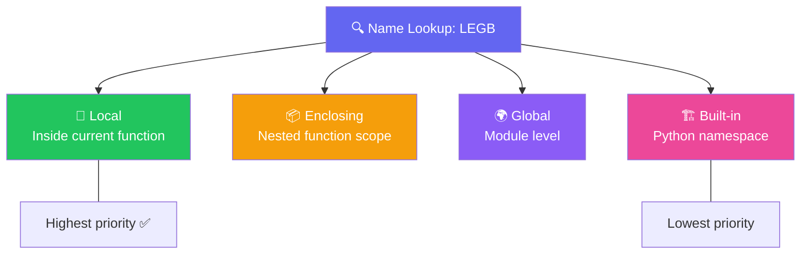

import { Tabs, TabItem, Aside, Badge, Card, CardGrid, Code } from '@astrojs/starlight/components';

## 📦 What is a Variable in Python?

A **Variable** is a **name bound to an object** in memory. Python uses **dynamic typing** — no type declarations needed!

```python
age = 25
#  ↑   ↑
# name object (int)

x = 5
x ──────▶ PyLongObject(5)   ← x is a label. Object lives on heap.
```
> Assignment in Python = **binding a name to an object**. Never "storing a value in a variable."

### 🔑 Key Differences from Java

| Feature | Java | Python |
|---------|------|--------|
| **Declaration** | `int age = 25;` (type required) | `age = 25` (no type) |
| **Type System** | Static (compile-time) | Dynamic (runtime) |
| **Memory Model** | Stack (primitives) / Heap (objects) | All objects in Heap; names in namespace |
| **Nullability** | `null` for references only | `None` for any name |
| **Rebinding** | Reference reassignment only | Name can bind to any type |

<Code lang="python" title="Python's flexible binding" code={`
x = 42          # x bound to int
x = "hello"     # x now bound to str — no error!
x = [1, 2, 3]   # x now bound to list — still valid ✅
`} />

<Aside type="success">
🎯 **Python Mantra**: *"Names are labels, not boxes."*  
A variable name is just a **reference** (label) that can point to any object. The object carries its own type.
</Aside>

---

## 🧠 The Foundational Model: Names → Objects

### 🔵 Everything is an Object

In Python, **everything** is an object — integers, strings, functions, even classes themselves.

<Code lang="python" title="All objects, all the time" code={`
# Primitive-like values are still objects:
x = 42
print(type(x))           # <class 'int'>
print(x.bit_length())    # ✅ int has methods!

# Functions are objects too:
def greet(): pass
print(type(greet))       # <class 'function'>

# Classes are objects:
class Person: pass
print(type(Person))      # <class 'type'>
`} />

### 🟠 Name Binding vs. Object Identity

```python
# STACK (Namespace)          HEAP (Objects)
# ┌────────────────┐         ┌─────────────────┐
# │  name │ ref ──┼────────▶│  [1, 2, 3]      │
# └────────────────┘         │  id: 0x7f8a...  │
#                            └─────────────────┘
#                               ↑ actual data lives here
```

<Code lang="python" title="Check identity with id()" code={`
a = [1, 2, 3]
b = a                # b binds to SAME object as a
print(id(a) == id(b))  # ✅ True — same memory address

c = [1, 2, 3]        # c binds to NEW object with same values
print(id(a) == id(c))  # ❌ False — different objects
print(a == c)          # ✅ True — same values (equality)
`} />

---

## 🔁 Copy Behavior — The Real Difference

<Tabs>
  <TabItem label="Immutable Copy — Independent">
    <Code lang="python" title="Immutable objects: rebinding creates new object" code={`
a = 10
b = a          # b binds to same int object (small int caching)
b = 99         # b now binds to NEW int object; a unchanged

print(a)       # 10 ✅
print(b)       # 99
# ints are immutable — you can't change 10 into 99, only rebind
`} />

    <Aside type="note">
      Immutable objects (`int`, `str`, `tuple`, `frozenset`) can't be modified — only rebound. Safe to share references!
    </Aside>
  </TabItem>

  <TabItem label="Mutable Copy — Shared Object">
    <Code lang="python" title="Mutable objects: aliasing causes side effects" code={`
arr1 = [1, 2, 3]
arr2 = arr1          # arr2 binds to SAME list object!

arr2.append(4)       # mutates the shared object
print(arr1)          # [1, 2, 3, 4] 😱 arr1 also changed!

# arr1 ──────────▶ [1, 2, 3, 4]  ← same heap object
# arr2 ──────────▶ [1, 2, 3, 4]  ← both names point here!
`} />

    <Aside type="caution">
      Assigning a mutable object copies the **reference**, not the data. Both names now point to the **same object**.
    </Aside>
  </TabItem>

  <TabItem label="True Copy ✅">
    <Code lang="python" title="Create independent copies explicitly" code={`
# Shallow copy — new container, same inner objects:
arr2 = arr1.copy()       # or arr1[:] or list(arr1)

# Deep copy — recursive copy of all nested objects:
import copy
arr3 = copy.deepcopy(arr1)

# Now mutations are isolated:
arr2.append(99)
print(arr1)  # [1, 2, 3, 4] — unchanged ✅
`} />
  </TabItem>
</Tabs>

---

## 🗂️ Classification by Scope: LEGB Rule

Python resolves names using **LEGB** order: **L**ocal → **E**nclosing → **G**lobal → **B**uilt-in.



#### 🔤 Four Kinds of Names in Python

```
┌──────────────────┬────────────────────────┬────────────┬──────────────┐
│ Kind             │ Where Defined          │ Default?   │ Lifetime     │
├──────────────────┼────────────────────────┼────────────┼──────────────┤
│ Local            │ Inside function        │ ❌ NameError │ function call │
│ Enclosing        │ Nested function        │ ❌ NameError │ outer call   │
│ Global           │ Module level           │ ❌ NameError │ module load  │
│ Built-in         │ Python namespace       │ ✅ Always   │ interpreter  │
└──────────────────┴────────────────────────┴────────────┴──────────────┘
```

```python
# Global scope
counter = 0

def outer():
    # Enclosing scope
    total = 0
    
    def inner():
        # Local scope
        local_val = 42
        print(local_val)  # ✅ Local
        print(total)      # ✅ Enclosing
        print(counter)    # ✅ Global
        print(len)        # ✅ Built-in
    
    inner()
```

> 🔑 **Python Rule**: Names must be **bound before use**. Unbound names raise `NameError` at **runtime** (not compile time like Java locals).

---

### 1️⃣ Local Variables

Defined **inside a function**. Most common scope.

- **Lifespan:** Created on function call, destroyed on return.
- **Initialization:** ⚠️ **No default** — using unbound name → `NameError`.
- **Assignment:** Any name assigned inside a function is local **unless** declared `global`/`nonlocal`.

<Code lang="python" title="Local variable — must bind before use" code={`
def process():
    # print(x)        # ❌ NameError: name 'x' is not defined
    
    x = 10            # ✅ bind first
    print(x)          # ✅ 10

    # Scope — function-scoped (not block-scoped like Java!)
    if True:
        y = 5         # y is still local to process(), not just if-block
    print(y)          # ✅ 5 — Python doesn't have block scope for vars
`} />

<Aside type="danger">
  **No compile-time safety** — Python checks name binding at **runtime**.

  ```python
  def calculate(flag):
      if flag:
          x = 10
      # x may be unbound if flag=False!
      print(x)  # ❌ NameError at runtime if flag=False

      # ✅ Fix: Initialize before conditional
      x = None
      if flag:
          x = 10
      print(x)  # ✅ Safe — always bound
  ```
</Aside>

<Tabs>
  <TabItem label="Function scope (not block!)">
    <Code lang="python" title="Variables in if/for blocks are still function-local" code={`
def demo():
    for i in range(3):
        j = i * 2
    print(i)  # ✅ 2 — loop var survives loop!
    print(j)  # ✅ 4 — block var still accessible
`} />
  </TabItem>

  <TabItem label="global keyword">
    <Code lang="python" title="Modify global from local scope" code={`
counter = 0

def increment():
    global counter  # ✅ declare intent
    counter += 1

increment()
print(counter)  # 1 ✅
`} />

    <Aside type="tip">
      Avoid `global` when possible — prefer returning values or using classes for state.
    </Aside>
  </TabItem>

  <TabItem label="nonlocal for closures">
    <Code lang="python" title="Modify enclosing scope in nested function" code={`
def outer():
    total = 0
    def inner():
        nonlocal total  # ✅ bind to enclosing scope
        total += 1
    inner()
    return total

print(outer())  # 1 ✅
`} />
  </TabItem>
</Tabs>

---

### 2️⃣ Instance-like Variables (Object Attributes)

Python doesn't have "instance variables" declared in class body like Java. Instead, attributes are created **dynamically** via `self`.

- **Lifespan:** Lives as long as the object exists.
- **Initialization:** Typically in `__init__`, but can be added anytime.
- **Per-object:** Each instance gets its own attribute namespace.

<Code lang="python" title="Attributes are dynamic — created on assignment" code={`
class Student:
    def __init__(self, name):
        self.name = name   # ✅ instance attribute
        # self.marks = 0   # optional — can add later!

s1 = Student("Alice")
s2 = Student("Bob")

s1.marks = 95              # ✅ add attribute dynamically
# s2.marks                 # ❌ AttributeError: 'Student' object has no attribute 'marks'
`} />

```python
# Memory model:
# HEAP
# ┌─────────────────┐     ┌─────────────────┐
# │  s1.__dict__    │     │  s2.__dict__    │
# │  {'name': 'Alice',    │  {'name': 'Bob'}│
# │   'marks': 95}  │     │                 │
# └─────────────────┘     └─────────────────┘
#       ↑ Each object has independent attribute dict
```

<Aside type="note">
  Use `__slots__` to restrict dynamic attributes and save memory:

  ```python
  class Student:
      __slots__ = ['name', 'marks']  # ✅ Only these attrs allowed
      # s1.age = 20  # ❌ AttributeError
  ```
</Aside>

---

### 3️⃣ Class Variables (Static-like)

Defined **in class body, outside methods**. Shared across all instances.

- **Lifespan:** Lives as long as the class exists.
- **One copy:** Shared by all instances (unless shadowed).
- **Access:** `ClassName.var` or `self.var` (but beware shadowing!).

<Code lang="python" title="Class variables are shared" code={`
class Counter:
    count = 0  # ✅ class variable
    
    def __init__(self):
        Counter.count += 1  # ✅ access via class name

c1 = Counter()
c2 = Counter()
print(Counter.count)  # 2 ✅
`} />

<Code lang="python" title="⚠️ Shadowing trap — instance attr hides class var" code={`
class Demo:
    shared = 0  # class variable

d1 = Demo()
d2 = Demo()

d1.shared = 99  # ❌ Creates INSTANCE attribute 'shared' on d1!
print(d1.shared)  # 99 (instance attr)
print(d2.shared)  # 0  (still reads class var)
print(Demo.shared)  # 0 (class var unchanged)

# ✅ Fix: Always modify class vars via class name:
Demo.shared = 99  # ✅ modifies the shared class variable
`} />

<Aside type="caution">
  **Mutable class variables are dangerous!**  
  ```python
  class Bad:
      items = []  # ❌ Shared list — all instances mutate same object!
  
  class Good:
      def __init__(self):
          self.items = []  # ✅ Each instance gets its own list
  ```
</Aside>

---

### 4️⃣ Parameter Variables

Function parameters behave like **local variables** with initial binding from the call.

<Code lang="python" title="Parameters are local names" code={`
def add(a, b):   # a, b are local names bound to passed objects
    return a + b

result = add(3, 5)  # a→3, b→5 inside function
`} />

<Tabs>
  <TabItem label="Immutable argument — no effect">
    <Code lang="python" title="Rebinding parameter doesn't affect caller" code={`
def change(x):
    x = 100      # rebinds local name x; caller's object unchanged

n = 10
change(n)
print(n)  # 10 ✅
`} />
  </TabItem>

  <TabItem label="Mutable argument — mutation visible">
    <Code lang="python" title="Mutating object affects caller's reference" code={`
def modify(arr):
    arr.append(999)  # mutates the shared list object

lst = [1, 2, 3]
modify(lst)
print(lst)  # [1, 2, 3, 999] ✅
`} />
  </TabItem>

  <TabItem label="Rebinding mutable — no effect">
    <Code lang="python" title="Reassigning parameter name doesn't affect caller" code={`
def change(lst):
    lst = [9, 9, 9]  # rebinds local name; caller's list unchanged

original = [1, 2, 3]
change(original)
print(original)  # [1, 2, 3] ✅
`} />

    <Aside type="tip">
      **Python is "pass-by-object-reference"** (sometimes called "pass-by-assignment"):  
      - The **object** is never copied.  
      - The **name** in the function is a new local binding to the same object.  
      - You can mutate the object, but rebinding the name doesn't affect the caller.
    </Aside>
  </TabItem>
</Tabs>

---

## 📊 Quick Comparison: Java vs Python Variables

<table>
  <thead><tr><th>Feature</th><th>Java</th><th>Python</th></tr></thead>
  <tbody>
    <tr><td>Type Declaration</td><td>Required (`int x`)</td><td>Optional (dynamic)</td></tr>
    <tr><td>Scope Rules</td><td>Block-level</td><td>Function-level (LEGB)</td></tr>
    <tr><td>Uninitialized Use</td><td>Compile Error (locals)</td><td>Runtime NameError</td></tr>
    <tr><td>Default Values</td><td>Yes (instance/static)</td><td>No — NameError if unbound</td></tr>
    <tr><td>Constants</td><td>`final` keyword</td><td>Convention: `UPPER_CASE`</td></tr>
    <tr><td>Null Handling</td><td>`null` + NPE</td><td>`None` + TypeError/AttributeError</td></tr>
    <tr><td>Copy Semantics</td><td>Primitive=value, Ref=address</td><td>All names are references</td></tr>
  </tbody>
</table>

---

## 🔬 Mutability & Immutability

### 🔒 Immutable Types (Safe to Share)

| Type | Example | Why Immutable |
|------|---------|--------------|
| `int` | `42` | Hashable, cacheable, thread-safe |
| `float` | `3.14` | Numeric consistency |
| `str` | `"hello"` | String interning, dict keys |
| `tuple` | `(1, 2)` | Hashable if elements immutable |
| `frozenset` | `frozenset([1,2])` | Set operations without mutation |

<Code lang="python" title="Immutable objects can't change — only rebind" code={`
s = "hello"
# s[0] = "H"  # ❌ TypeError: 'str' object does not support item assignment

s = "Hello"  # ✅ Rebind name to NEW string object
# Original "hello" may be garbage-collected if no other references
`} />

### 🔄 Mutable Types (Watch for Aliasing!)

| Type | Example | Common Pitfall |
|------|---------|----------------|
| `list` | `[1, 2, 3]` | `b = a` shares reference |
| `dict` | `{'a': 1}` | Default arg trap |
| `set` | `{1, 2}` | Mutation during iteration |
| Custom class | `MyClass()` | Shared mutable attributes |

<Code lang="python" title="Mutable default argument trap — MUST KNOW" code={`
# ❌ Dangerous: default list is created ONCE at function definition
def add_item(item, items=[]):  # ⚠️ Same list object reused!
    items.append(item)
    return items

print(add_item(1))  # [1]
print(add_item(2))  # [1, 2] 😱 Not [2]!

# ✅ Fix: Use None sentinel + create new list inside
def add_item(item, items=None):
    if items is None:
        items = []
    items.append(item)
    return items
`} />

<Aside type="danger">
  **Golden Rule**: Never use mutable objects (`[]`, `{}`, custom instances) as default argument values. Use `None` + initialize inside function.
</Aside>

---

## 🧠 Advanced Concepts & Interview Traps

<CardGrid>
  <Card title="Trap 1 — LEGB Scope Resolution" icon="error">
    Python searches Local → Enclosing → Global → Built-in.  
    ```python
    x = "global"
    
    def outer():
        x = "enclosing"
        def inner():
            x = "local"
            print(x)  # "local" ✅
        inner()
    
    # To modify outer/global x, use nonlocal/global:
    def modify():
        global x
        x = "changed"  # ✅ modifies global x
    ```
  </Card>

  <Card title="Trap 2 — Mutable Default Arguments" icon="error">
    ```python
    def cache(key, store={}):  # ❌ Same dict for all calls!
        if key not in store:
            store[key] = expensive_fetch(key)
        return store[key]
    
    # Fix:
    def cache(key, store=None):
        if store is None:
            store = {}
        # ... rest same
    ```
  </Card>

  <Card title="Trap 3 — Class vs Instance Attribute" icon="error">
    ```python
    class Config:
        defaults = {}  # ❌ Shared dict!
    
    c1 = Config()
    c1.defaults['theme'] = 'dark'
    print(Config.defaults)  # {'theme': 'dark'} — affects ALL instances!
    
    # Fix: Initialize mutable attrs in __init__:
    class Config:
        def __init__(self):
            self.defaults = {}  # ✅ Per-instance
    ```
  </Card>

  <Card title="Trap 4 — None vs False vs 0" icon="error">
    ```python
    if None:      # ❌ Falsy
    if False:     # ❌ Falsy  
    if 0:         # ❌ Falsy
    if []:        # ❌ Falsy
    if "":        # ❌ Falsy
    
    # But they're NOT equal:
    None == False  # False
    None == 0      # False
    # Use 'is' for None checks:
    if x is None:  # ✅ Correct identity check
    ```
  </Card>
</CardGrid>

---

## ⚡ DSA Patterns & Usage

<CardGrid>
  <Card title="Pattern: Mutable State in Recursion" icon="rocket">
    Use mutable containers (list, dict) to accumulate results across recursive calls without returning everything.
    ```python
    def dfs(node, path, results):
        path.append(node.val)  # mutate shared list
        if is_leaf(node):
            results.append(path.copy())  # ✅ snapshot!
        dfs(node.left, path, results)
        path.pop()  # ✅ backtrack
    ```
  </Card>
  
  <Card title="Pattern: Defensive Copying" icon="shield">
    When accepting mutable arguments, copy if you don't want to mutate caller's data.
    ```python
    def process(data):
        data = data.copy()  # shallow copy
        data.append(999)    # safe to mutate
        return data
    ```
  </Card>

  <Card title="Pattern: Immutable Accumulators" icon="backspace">
    Prefer immutable types for functional-style recursion (easier to reason about).
    ```python
    # Immutable tuple accumulation:
    def build_path(node, path=()):
        new_path = path + (node.val,)  # creates new tuple
        if is_leaf(node):
            return [new_path]
        return (build_path(node.left, new_path) + 
                build_path(node.right, new_path))
    ```
  </Card>

  <Card title="Pattern: None Checks for Safety" icon="error">
    Always check for `None` before attribute access to avoid `AttributeError`.
    ```python
    def safe_process(node):
        if node is None:  # ✅ identity check
            return []
        return [node.val] + safe_process(node.left)
    ```
  </Card>
</CardGrid>

---

## 🎯 Interview Cheat Sheet

<CardGrid>
  <Card title="How does Python pass arguments?" icon="information">
    **Pass-by-object-reference** (aka "pass-by-assignment"):  
    - The function gets a new local name bound to the same object.  
    - Mutating the object affects caller. Rebinding the name does not.  
    ```python
    def f(x): x = [9,9]  # rebind → no effect
    def g(x): x[0] = 9   # mutate → affects caller
    ```
  </Card>
  
  <Card title="Local vs Global scope?" icon="warning">
    - Assignment inside function → creates **local** name by default.  
    - To modify global: `global name`  
    - To modify enclosing: `nonlocal name`  
    - Reading unassigned local → `NameError` at **runtime**.
  </Card>
  
  <Card title="Mutable default argument bug?" icon="error">
    **Always use `None` sentinel**:
    ```python
    # ❌ Bad
    def f(x=[]): ...
    
    # ✅ Good
    def f(x=None):
        if x is None: x = []
    ```
  </Card>
  
  <Card title="Class variable vs instance attribute?" icon="approve-check">
    - Class var: defined in class body, shared by all instances.  
    - Instance attr: defined via `self.name`, unique per object.  
    - Assignment `self.var = x` creates **instance** attr, shadows class var.
  </Card>
</CardGrid>

<Aside type="danger">
  **Most common runtime crashes:**
  ```python
  # NameError: unbound local
  def f():
      print(x)  # ❌ if x not defined earlier
      x = 10
  
  # AttributeError: None has no attribute
  result = maybe_none()
  result.method()  # ❌ if result is None
  
  # TypeError: unsupported operand
  total = 10 + "5"  # ❌ int + str
  ```
  Use linters (`pylint`, `mypy`) and tests to catch these early!
</Aside>

---

## 🧩 DSA Connections

<Tabs>
  <TabItem label="Mutable accumulator for backtracking">
    <Code lang="python" title="List shared across recursion — must backtrack" code={`
def backtrack(path, results, candidates):
    if is_solution(path):
        results.append(path.copy())  # ✅ snapshot!
        return
    for c in candidates:
        path.append(c)          # mutate shared list
        backtrack(path, results, candidates)
        path.pop()              # ✅ undo mutation (backtrack)
`} />
  </TabItem>

  <TabItem label="Immutable path for functional style">
    <Code lang="python" title="Tuple creates new object each call — no backtrack needed" code={`
def dfs(node, path=()):
    new_path = path + (node.val,)  # new tuple
    if is_leaf(node):
        return [new_path]
    return (dfs(node.left, new_path) + 
            dfs(node.right, new_path))
`} />
  </TabItem>

  <TabItem label="Global-like state with class variable">
    <Code lang="python" title="Class variable tracks global max across recursion" code={`
class Solution:
    max_val = float('-inf')  # class variable
    
    def dfs(self, node):
        if not node: return
        Solution.max_val = max(Solution.max_val, node.val)
        self.dfs(node.left)
        self.dfs(node.right)
`} />
  </TabItem>

  <TabItem label="Defensive copy for DP tables">
    <Code lang="python" title="Shallow copy trap in 2D DP" code={`
dp = [[0]*m for _ in range(n)]
row = dp[0]        # row references dp[0]!
row[0] = 99
print(dp[0][0])    # 99 😱 same object

# Fix: copy the row
row = dp[0].copy()  # ✅ independent
`} />
  </TabItem>
</Tabs>

---

## 🏢 Real-Life SDE Usage

<Code lang="python" title="Production patterns: immutability, defensive copying, type hints" code={`
from typing import List, Optional
from dataclasses import dataclass

# ✅ Immutable config with dataclass (Python 3.7+)
@dataclass(frozen=True)
class APIConfig:
    base_url: str
    timeout: int = 30
    retries: int = 3

# ✅ Defensive copying in public API
class OrderService:
    def __init__(self, allowed_ports: List[int]):
        # Store a copy — caller can't mutate our internal state
        self._allowed_ports = list(allowed_ports)
    
    def get_ports(self) -> List[int]:
        # Return copy — caller can't mutate our internal list
        return list(self._allowed_ports)

# ✅ None handling with Optional type hint
def find_user(user_id: int) -> Optional[dict]:
    user = db.query(user_id)
    if user is None:  # ✅ explicit None check
        return None
    return {"id": user.id, "name": user.name}

# ✅ Mutable default fixed with None sentinel
def log_event(event: str, meta Optional[dict] = None) -> None:
    if metadata is None:
        metadata = {}
    metadata["timestamp"] = get_timestamp()
    logger.info(event, extra=metadata)
`} />

<Aside type="tip">
  **Type hints are documentation, not enforcement** (unless using `mypy --strict`).  
  They improve IDE autocomplete, readability, and catch bugs early — but Python remains dynamically typed at runtime.
</Aside>

---

## 🗒️ Quick Revision Cheat Sheet

```python
# 📦 VARIABLE BASICS
x = 42              # Dynamic typing — no declaration needed
x = "hello"         # Rebind to any type — always valid

# 🔍 SCOPE: LEGB Resolution
# Local → Enclosing → Global → Built-in
# Use 'global' / 'nonlocal' to modify outer scopes

# 🔄 MUTABILITY MATTERS
# Immutable (safe to share): int, float, str, tuple, frozenset
# Mutable (watch aliasing): list, dict, set, custom classes

# 📋 COPY PATTERNS
b = a               # Same object (alias)
b = a.copy()        # Shallow copy (new container, same items)
b = a[:]            # Slice copy (lists/strings)
import copy
b = copy.deepcopy(a)  # Deep copy (recursive)

# ⚠️ MUST KNOW TRAPS
# ❌ Mutable default args: def f(x=[]): ...
# ✅ Fix: def f(x=None): if x is None: x = []

# ❌ Class mutable attr: class C: items = []
# ✅ Fix: def __init__(self): self.items = []

# ❌ Shadowing: self.var = x creates instance attr, hides class var
# ✅ Access class var via ClassName.var

# 🎯 DSA PATTERNS
path = []                    # Mutable accumulator (backtrack with pop)
path = path + [x]            # Immutable accumulation (no backtrack)
results = []                 # Collect outputs across recursion
memo = {}                    # DP cache (dict for O(1) lookup)
visited = set()              # Graph traversal flag

# 🔒 NONE HANDLING
if x is None: ...            # ✅ Identity check (preferred)
if x is not None: ...        # ✅ Safe before attribute access
result = x if x is not None else default  # ✅ Ternary with None

# 🧪 TYPE HINTS (Documentation)
from typing import List, Optional, Dict
def process(items: List[int]) -> Optional[str]: ...
```

> 🚀 **Final Wisdom**: Python variables are **names, not boxes**. Master LEGB scope, mutability semantics, and defensive copying — and you'll write cleaner, safer, more Pythonic code than Java's rigid model ever allowed. 💪

<Badge text="Astro 6 Ready" variant="success" /> • <Badge text="Python 3.10+" variant="tip" /> • <Badge text="Interview Optimized" variant="caution" />
```

---

## 🔄 Key Conversion Summary

| Java Concept | Python Equivalent | Critical Difference |
|--------------|-----------------|-------------------|
| `int x = 10;` | `x = 10` | No type declaration; dynamic binding |
| `final int MAX = 100;` | `MAX = 100` (UPPER_CASE convention) | No compile-time enforcement; convention only |
| Local var default | ❌ None → `NameError` | Runtime error vs Java compile error |
| Block scope | ❌ Function scope | `if`/`for` vars survive block exit |
| `static` field | Class variable | Beware mutable shared state! |
| Instance field | `self.attr` in `__init__` | Dynamic — can add attrs anytime |
| `null` | `None` | Use `is None` for checks |
| Pass-by-value | Pass-by-object-reference | Mutate object ✅, rebind name ❌ |
| `Arrays.copyOf` | `list.copy()`, `copy.deepcopy()` | Explicit copying always needed for mutables |
| `this` | `self` | Explicit first parameter in methods |

> 🎯 **Pro Tip**: When interviewing, emphasize:  
> 1. LEGB scope resolution ✅  
> 2. Mutable default argument trap ✅  
> 3. Pass-by-object-reference semantics ✅  
> 4. `is` vs `==` for `None` checks ✅  
> 5. When to use shallow vs deep copy ✅  

```
x = 5

CPython execution steps:
┌─────────────────────────────────────────────────┐
│ 1. Evaluate RHS → PyLongObject(5) on heap       │
│ 2. Look up 'x' in current namespace (dict)      │
│ 3. Bind 'x' → pointer to PyLongObject(5)        │
│ 4. Increment ob_refcnt of PyLongObject(5)       │
└─────────────────────────────────────────────────┘

Bytecode:
  LOAD_CONST   5        ← push PyLongObject(5) onto eval stack
  STORE_FAST   'x'      ← pop from stack, write pointer to locals array
```

```
Namespace (locals dict / fast array):
┌──────┬──────────────────────────────┐
│  'x' │ ──────▶ PyLongObject(5)      │
│      │         ob_refcnt = 1        │
│      │         ob_type → PyLong_Type│
│      │         ob_digit = [5]       │
└──────┴──────────────────────────────┘
```

---

## 🔄 Rebinding vs Mutation

```python
x = 5
x = 10      # rebinding — x now points to different object

lst = [1, 2, 3]
lst.append(4)   # mutation — same object, contents changed
```

```
REBINDING:
Before:  x ──▶ PyLongObject(5)   refcnt drops to 0 → GC candidate
After:   x ──▶ PyLongObject(10)

MUTATION:
Before:  lst ──▶ PyListObject [*1, *2, *3]
After:   lst ──▶ PyListObject [*1, *2, *3, *4]  ← SAME object, grew
         id(lst) unchanged
```

```python
x = 5
print(id(x))    # 140234567

x = 10
print(id(x))    # 140234608  ← different object

lst = [1, 2, 3]
print(id(lst))  # 140234999

lst.append(4)
print(id(lst))  # 140234999  ← SAME object
```

---

## 📦 Variable Assignment Forms

### Simple Assignment
```python
x = 42
name = "Ali"
```

### Multiple Assignment (Same Object)
```python
x = y = z = 0       # all three point to SAME PyLongObject(0)

# Fine for immutables — dangerous for mutables:
a = b = c = []      # 💀 all three point to SAME list
a.append(1)
print(b)            # [1]  ← b changed too!

# Fix:
a, b, c = [], [], []   # three separate list objects
```

### Tuple Unpacking
```python
x, y = 10, 20
x, y = y, x         # swap — no temp variable needed

# Internals of swap:
# 1. Build tuple (y, x) on stack
# 2. Unpack into x, y
# No temporary variable created in Python — done on eval stack
```

### Extended Unpacking (3.0+)
```python
first, *rest = [1, 2, 3, 4, 5]
# first = 1
# rest  = [2, 3, 4, 5]

*init, last = [1, 2, 3, 4, 5]
# init = [1, 2, 3, 4]
# last = 5

first, *middle, last = [1, 2, 3, 4, 5]
# first  = 1
# middle = [2, 3, 4]
# last   = 5
```

```python
# Real prod use — HTTP response destructuring
status, *headers, body = parse_response(raw)

# Discard middle values
head, *_, tail = data
```

### Augmented Assignment
```python
x += 5    # NOT x = x + 5 for mutables — uses __iadd__
```

```
For IMMUTABLE (int, str, tuple):
  x += 5
  → x = x + 5  → new object, rebind x
  id(x) changes

For MUTABLE (list):
  lst += [1]
  → lst.__iadd__([1])  → in-place extend, SAME object
  id(lst) unchanged

  lst = lst + [1]      → new object
  id(lst) changes
```

```python
# Proof:
x = 5
print(id(x))     # A
x += 1
print(id(x))     # B  ← different

lst = [1, 2]
print(id(lst))   # C
lst += [3]
print(id(lst))   # C  ← same
```

---

## 🔭 Variable Scopes — LEGB

```
┌─────────────────────────────────────────────────────────┐
│                    LEGB RULE                            │
│                                                         │
│  L → Local      current function's namespace           │
│  E → Enclosing  enclosing function's namespace(s)      │
│  G → Global     module-level namespace                  │
│  B → Built-in   builtins module namespace               │
│                                                         │
│  Lookup order: L → E → G → B                           │
│  First match wins. NameError if none found.             │
└─────────────────────────────────────────────────────────┘
```

```python
x = "global"                    # G

def outer():
    x = "enclosing"             # E

    def inner():
        x = "local"             # L
        print(x)                # → "local"

    def inner_no_local():
        print(x)                # → "enclosing"  (E)

    inner()
    inner_no_local()

outer()
print(x)                        # → "global"  (G)
```

### Bytecode — How Scope Determines Opcode

```
┌──────────────┬─────────────┬──────────────────────────┐
│ Scope        │ Load opcode │ Storage                  │
├──────────────┼─────────────┼──────────────────────────┤
│ LOCAL        │ LOAD_FAST   │ C array by index (fast)  │
│ GLOBAL       │ LOAD_GLOBAL │ dict hash lookup         │
│ FREE (LEGB E)│ LOAD_DEREF  │ PyCell on heap           │
│ BUILTIN      │ LOAD_GLOBAL │ falls to builtins dict   │
└──────────────┴─────────────┴──────────────────────────┘
```

---

## 🔑 `global` and `nonlocal`

### `global`
```python
counter = 0

def increment():
    global counter      # without this: UnboundLocalError
    counter += 1        # compiler marks counter as GLOBAL scope
                        # emits LOAD_GLOBAL / STORE_GLOBAL

increment()
print(counter)   # 1
```

### `nonlocal`
```python
def make_counter():
    count = 0                   # CELL variable

    def increment():
        nonlocal count          # without this: UnboundLocalError
        count += 1              # LOAD_DEREF / STORE_DEREF
        return count

    return increment

c = make_counter()
c()   # 1
c()   # 2
c()   # 3
```

```
MEMORY — nonlocal via PyCell:

make_counter frame:
  count → PyCell ──▶ PyLongObject(3)
                         ▲
increment frame:          │
  count (FREE) ───────────┘   (both frames share same PyCell)
```

> `nonlocal` doesn't copy the value — it shares the **same PyCell object**. When `increment` modifies `count`, it writes through the cell into the same object `make_counter` owns.

---

## 🔗 Name Binding Operations

> Not just `=` binds names. All of these create bindings:

```python
x = 5                    # assignment
for x in range(5):       # loop variable
with open("f") as x:     # context manager
import os as x           # import alias
def x(): ...             # function definition
class x: ...             # class definition
except Exception as x:   # exception variable

# Comprehension variables are LOCAL to comprehension (3.x):
[x for x in range(5)]
print(x)                 # NameError in Python 3 (leaked in Python 2)
```

---

## 🗑️ `del` — Unbinding

```python
x = 42
del x
print(x)    # NameError: name 'x' is not defined
```

```
del x  does NOT destroy PyLongObject(42).
del x  removes the binding 'x' from the namespace dict.
PyLongObject(42) refcnt decrements.
If refcnt → 0, GC can collect it.
```

```python
a = [1, 2, 3]
b = a               # two names, same object. refcnt = 2
del a               # refcnt = 1. object still alive.
print(b)            # [1, 2, 3]  ← still accessible via b
```

---

## 🔬 Variable Internals — `locals()` and `globals()`

```python
x = 10
y = 20

def foo():
    a = 1
    b = 2
    print(locals())    # {'a': 1, 'b': 2}
    print(globals())   # full module namespace dict

foo()
```

```
globals() → returns the ACTUAL module __dict__. Mutations affect real namespace.
locals()  → returns a SNAPSHOT copy of the locals fast array. Mutations do nothing.
```

```python
def foo():
    x = 10
    locals()['x'] = 999    # modifies the snapshot copy
    print(x)               # still 10 — snapshot mutation has no effect
```

> This is a **CPython implementation detail**: local variables in functions are stored as a C array (`fast locals`), not a dict. `locals()` copies them into a dict on demand. Writing to that dict doesn't write back to the C array.

---

## 🧵 Type Annotations — Variables (3.6+)

```python
x: int = 5
name: str = "Ali"
items: list[int] = []

# Annotation without assignment — just registers in __annotations__
y: float          # no object created, no binding
print(y)          # NameError — annotation ≠ assignment
```

```python
# Where annotations live:
class Foo:
    x: int = 5
    y: str          # no value

Foo.__annotations__   # {'x': <class 'int'>, 'y': <class 'str'>}
```

> Annotations are **NOT enforced at runtime**. `x: int = "hello"` is perfectly valid Python. Use `mypy` or `pyright` for static checking.

---

## 📊 Variable Comparison Table

| Language | Variable is... | Stored on... | Type checked |
|----------|---------------|--------------|--------------|
| C | memory location | stack/heap | compile time |
| Java | primitive or reference | stack (prim) / heap (ref) | compile time |
| Python | name binding | heap (always) | runtime only |
| JavaScript | name binding | heap | runtime only |

---

## 💀 Interview Trap 1 — `is` Breaks Outside Cache

```python
a = 1000
b = 1000
a is b      # True  ← same code block, compiler deduplicates co_consts

def foo():
    return 1000

def bar():
    return 1000

foo() is bar()   # False ← different code objects, different heap allocations
```

---

## 💀 Interview Trap 2 — `except` Variable Deleted After Block

```python
try:
    raise ValueError("oops")
except ValueError as e:
    print(e)        # works

print(e)            # 💥 NameError — 'e' deleted after except block exits
```

> CPython **explicitly deletes** the `as` target after the `except` block to break reference cycles (exception objects hold tracebacks hold frames hold locals). This is by design — `sys.exc_info()` is the workaround.

```python
# Fix — save before block exits:
try:
    raise ValueError("oops")
except ValueError as e:
    saved = e       # rebind to different name

print(saved)        # works
```

---

## 💀 Interview Trap 3 — Walrus Operator Scope Leak (Intentional)

```python
# := (walrus) leaks into enclosing scope — by design
import re

if m := re.match(r"(\d+)", "123abc"):
    print(m.group(1))    # "123"

print(m)    # still accessible outside if block

# BUT inside comprehension — leaks to enclosing function scope:
results = [y := x + 1 for x in range(5)]
print(y)    # 5 — last value of y leaks out of comprehension
```

> Regular comprehension variables are scoped to the comprehension. Walrus operator variables leak to the **enclosing function scope**. This is the only exception to comprehension variable isolation.

---

## 💀 Interview Trap 4 — Default Mutable Argument Is a Variable

```python
def foo(data, cache={}):    # cache is a variable bound at def-time
    if data not in cache:
        cache[data] = expensive_compute(data)
    return cache[data]

# This is accidentally correct (memoization) but:
foo.__defaults__    # ({...},) ← the live cache dict
# Any caller can inspect or corrupt it
```

---
