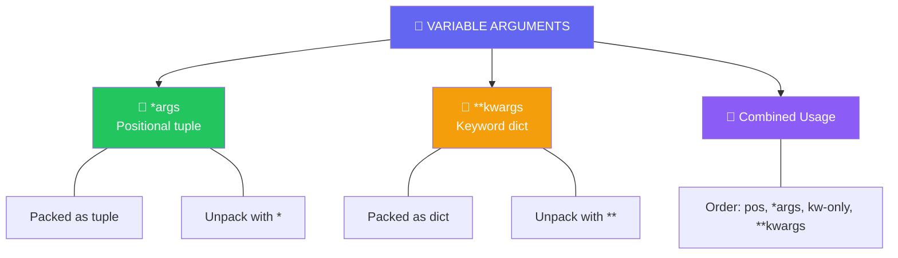

import { Tabs, TabItem, Aside, Badge, Card, CardGrid, Code } from '@astrojs/starlight/components';

## 🔢 Variable Arguments in Python — Complete Guide

> Python's **`*args`** and **`**kwargs`** allow functions to accept **any number of positional or keyword arguments** — more flexible than Java varargs!

```python
# Java style (fixed args):
# void sum(int a, int b, int c) { }

# Python style (flexible):
def sum_all(*numbers):      # ✅ Any number of positional args
    return sum(numbers)

def config(**options):      # ✅ Any number of keyword args  
    return {**defaults, **options}
```

<Aside type="success">
🎯 **Python Advantage**: No overloading needed! One function handles all cases via dynamic argument packing.
</Aside>

---

## 🗺️ The Full Map



---

## 📌 Syntax Comparison: Java vs Python

| Feature | Java Varargs | Python Equivalent |
|---------|-------------|------------------|
| **Positional varargs** | `int... nums` | `*nums` (tuple) |
| **Keyword varargs** | ❌ Not native | `**options` (dict) |
| **Internal type** | Array (`int[]`) | Tuple (`tuple`) / Dict (`dict`) |
| **Zero args** | Empty array `new int[0]` | Empty tuple `()` / dict `{}` |
| **Null handling** | Can pass `null` explicitly | No `null` — use `None` default |
| **Overloading** | Multiple methods by arity | Single function handles all |

<Code lang="python" title="Basic *args usage" code={`
def sum_all(*numbers):
    """Accept any number of positional arguments"""
    # 'numbers' is a tuple inside the function
    print(type(numbers))  # <class 'tuple'>
    return sum(numbers)

# Calling patterns:
sum_all()              # ✅ 0 args → numbers = ()
sum_all(10)            # ✅ 1 arg  → numbers = (10,)
sum_all(1, 2, 3)       # ✅ many  → numbers = (1, 2, 3)
sum_all(*[1, 2, 3])    # ✅ unpack list → same as above
`} />

---

## 🔬 Deep Dive: How *args Works

### 🧱 What Python Does Internally

```python
# What you write:
def log(level, *messages):
    for msg in messages:
        print(f"[{level}] {msg}")

log("INFO", "started", "ready", "listening")

# What happens internally:
# 1. "started", "ready", "listening" → packed into tuple
# 2. messages = ("started", "ready", "listening")
# 3. Function executes with tuple parameter
```

<Code lang="python" title="*args is always a tuple" code={`
def inspect(*args):
    print(f"Type: {type(args)}")      # <class 'tuple'>
    print(f"Length: {len(args)}")
    print(f"Contents: {args}")
    
    # All tuple operations work:
    print(args[0] if args else "empty")   # Indexing
    for item in args: print(item)         # Iteration
    print(list(args))                      # Convert to list

inspect(1, "two", 3.0)
# Type: <class 'tuple'>
# Length: 3
# Contents: (1, 'two', 3.0)
`} />

### 💻 Memory Model

```text
+---------------------+       +---------------------+
|      Stack          |       |        Heap         |
+---------------------+       +---------------------+
|  log("INFO", ...)   |       |  tuple:             |
|                     |       |  ("started",        |
|  [messages | @0x55] |-------+--> "ready",         |
+---------------------+       |    "listening")      |
   *args = reference          +---------------------+
   to immutable tuple           ↑ tuple object in heap
```

<Aside type="note">
**Key Insight**: `*args` creates an **immutable tuple**. Unlike Java arrays, tuples can't be modified — preventing accidental side effects! ✅
</Aside>

---

## 🔄 All Valid Ways to Call *args Functions

<Code lang="python" title="Flexible calling patterns" code={`
def process(*items):
    return list(items)

# Pattern 1: Direct values
process(1, 2, 3)              # ✅ [1, 2, 3]

# Pattern 2: Unpack iterable
nums = [10, 20, 30]
process(*nums)                # ✅ [10, 20, 30]

# Pattern 3: Mix direct + unpack
process(1, *[2, 3], 4)        # ✅ [1, 2, 3, 4]

# Pattern 4: Empty call
process()                     # ✅ []

# Pattern 5: Unpack different iterables
process(*[1, 2], *(3, 4))     # ✅ [1, 2, 3, 4]
`} />

<Aside type="tip">
**Unpacking is Python's superpower**: `*iterable` expands any iterable into positional arguments. Works with lists, tuples, sets, strings, generators!
</Aside>

---

## 🔑 **kwargs — Keyword Variable Arguments

Accept **arbitrary keyword arguments** as a dictionary.

<Code lang="python" title="Basic **kwargs usage" code={`
def configure(**options):
    """Accept any number of keyword arguments"""
    # 'options' is a dict inside the function
    print(type(options))  # <class 'dict'>
    
    for key, value in options.items():
        print(f"{key} = {value}")

# Calling patterns:
configure()                          # ✅ 0 kwargs → options = {}
configure(debug=True)                # ✅ 1 kwarg → {'debug': True}
configure(host="localhost", port=80) # ✅ many → {'host': ..., 'port': ...}

# Unpack dict:
settings = {"timeout": 30, "retries": 3}
configure(**settings)                # ✅ Same as configure(timeout=30, retries=3)
`} />

### 💡 Real-World Pattern: Configuration Merging

<Code lang="python" title="**kwargs for flexible config" code={`
DEFAULTS = {"timeout": 30, "retries": 3, "verbose": False}

def create_client(**user_config):
    # Merge user config with defaults (user wins)
    config = {**DEFAULTS, **user_config}
    return APIClient(**config)  # Unpack to constructor

# Usage — only specify what you need:
client1 = create_client()  # All defaults
client2 = create_client(timeout=60)  # Override just timeout
client3 = create_client(verbose=True, retries=5)  # Override multiple
`} />

---

## 🎯 Combined: *args + **kwargs + Regular Params

### Parameter Order Rules (MUST KNOW) 🚨

```python
# ✅ CORRECT ORDER:
def func(
    pos1, pos2,              # 1. Regular positional params
    *args,                   # 2. Positional varargs
    kw_only1, kw_only2,      # 3. Keyword-only params (after *)
    **kwargs                 # 4. Keyword varargs
):
    pass

# ✅ Minimal valid combinations:
def f1(a, *args): pass           # pos + *args
def f2(a, **kwargs): pass        # pos + **kwargs  
def f3(*args, **kwargs): pass    # *args + **kwargs
def f4(a, *args, **kwargs): pass # All three
def f5(a, *, b, **kwargs): pass  # pos + kw-only + **kwargs

# ❌ INVALID — wrong order:
def wrong1(*args, a): pass       # ❌ SyntaxError: positional after *args
def wrong2(**kwargs, *args): pass # ❌ SyntaxError: *args after **kwargs
```

<Code lang="python" title="Keyword-only parameters (Python 3+)" code={`
def connect(host, port, *, timeout=30, retries=3):
    """
    host, port: required positional
    timeout, retries: keyword-only (must use name when calling)
    """
    print(f"{host}:{port}, timeout={timeout}, retries={retries}")

# ✅ Valid calls:
connect("localhost", 8080)                    # Use defaults
connect("localhost", 8080, timeout=60)        # Override keyword-only

# ❌ Invalid — keyword-only args require names:
# connect("localhost", 8080, 60, 3)  # ❌ TypeError

# 💡 Why? Prevents accidental positional argument mistakes!
`} />

<Aside type="caution">
**Keyword-only params after `*`** are a Python 3 feature that prevents subtle bugs. Use them for optional config that should always be named explicitly!
</Aside>

---

## ⚡ Unpacking Operators: * and **

### 🔓 Unpacking in Function Calls

<Code lang="python" title="* unpacks iterables, ** unpacks dicts" code={`
# * for positional unpacking:
def add(a, b, c):
    return a + b + c

nums = [1, 2, 3]
add(*nums)              # ✅ add(1, 2, 3) → 6

# ** for keyword unpacking:
def greet(first, last, title="Mr."):
    return f"{title} {first} {last}"

person = {"first": "Alice", "last": "Smith", "title": "Dr."}
greet(**person)         # ✅ greet(first="Alice", last="Smith", title="Dr.")

# Mix both:
def full(a, b, c, d=None):
    return f"{a}{b}{c}{d or ''}"

full(*[1, 2], **{"c": 3, "d": 4})  # ✅ "1234"
`} />

### 🔓 Unpacking in Literals (Python 3.5+)

<Code lang="python" title="Unpacking inside lists, dicts, tuples" code={`
# List unpacking:
base = [1, 2]
extended = [0, *base, 3, 4]    # [0, 1, 2, 3, 4]

# Dict unpacking (merge!):
defaults = {"host": "localhost", "port": 80}
overrides = {"port": 443, "ssl": True}
config = {**defaults, **overrides}  
# {'host': 'localhost', 'port': 443, 'ssl': True}

# Tuple unpacking:
t1 = (1, 2)
t2 = (3, 4)
combined = (*t1, *t2)          # (1, 2, 3, 4)

# Mixed unpacking in dict:
extra = {"debug": True}
final = {"env": "prod", **extra, "version": "1.0"}
# {'env': 'prod', 'debug': True, 'version': '1.0'}
`} />

<Aside type="success">
🚀 **Pro Tip**: Dict unpacking `{**a, **b}` is Python's answer to object spread (`{...a, ...b}` in JS). Later keys override earlier ones!
</Aside>

---

## 🧪 Type Hints for *args and **kwargs

<Code lang="python" title="Annotating variable arguments" code={`
from typing import Tuple, Dict, Any, Union

# *args with type hint:
def sum_ints(*numbers: int) -> int:
    # numbers: Tuple[int, ...]
    return sum(numbers)

# **kwargs with type hint:
def configure(**options: str) -> Dict[str, str]:
    # options: Dict[str, str]
    return options

# Mixed with complex types:
def process(
    name: str,
    *items: Union[int, float],
    metadata: Dict[str, Any] | None = None,
    **flags: bool
) -> list[int]:
    """
    name: required positional str
    *items: any number of numeric args
    metadata: optional keyword-only dict
    **flags: any boolean keyword args
    """
    return [int(x * 2) for x in items]

# Type checkers (mypy, pyright) understand:
# *args → Tuple[Type, ...]
# **kwargs → Dict[str, Type]
`} />

<Aside type="note">
**Type hint syntax**:  
- `*args: int` → `args` is `Tuple[int, ...]`  
- `**kwargs: str` → `kwargs` is `Dict[str, str]`  
- Use `Any` for completely dynamic: `**kwargs: Any`
</Aside>

---

## ⚠️ Common Traps & Gotchas

<CardGrid>
  <Card title="Trap 1 — Mutable default with *args" icon="error">
    ```python
    # ❌ Dangerous: default tuple is fine (immutable)
    # But watch for mutable accumulation:
    def accumulate(item, collected=()):  # ✅ tuple is immutable
        return collected + (item,)
    
    # ❌ But this is wrong:
    def bad_accumulate(item, collected=[]):  # ⚠️ shared list!
        collected.append(item)
        return collected
    ```
  </Card>

  <Card title="Trap 2 — Unpacking wrong types" icon="error">
    ```python
    def f(a, b, c): pass
    
    # ❌ Wrong: dict unpacking needs ** not *
    params = {"a": 1, "b": 2, "c": 3}
    f(*params)        # ❌ TypeError: passes keys as positional: f("a", "b", "c")
    f(**params)       # ✅ Correct: f(a=1, b=2, c=3)
    
    # ❌ Wrong: list unpacking needs * not **
    args = [1, 2, 3]
    f(**args)         # ❌ TypeError: 'list' object is not a mapping
    f(*args)          # ✅ Correct
    ```
  </Card>

  <Card title="Trap 3 — *args captures too much" icon="error">
    ```python
    def process(required, *optional, **config):
        pass
    
    # If caller uses keyword for "optional" param:
    process(1, optional=2)  # ❌ TypeError: optional is positional-only!
    
    # Fix: Use keyword-only params for named optionals:
    def process(required, *, optional=None, **config):
        pass
    process(1, optional=2)  # ✅ Now works!
    ```
  </Card>

  <Card title="Trap 4 — **kwargs order matters in dict merge" icon="warning">
    ```python
    defaults = {"debug": False, "timeout": 30}
    user = {"timeout": 60, "verbose": True}
    
    # Later unpacking wins:
    config1 = {**defaults, **user}  
    # {'debug': False, 'timeout': 60, 'verbose': True} ✅
    
    config2 = {**user, **defaults}  
    # {'timeout': 30, 'verbose': True, 'debug': False} ⚠️ timeout overridden back!
    
    # Always put overrides LAST in merge
    ```
  </Card>

  <Card title="Trap 5 — *args is tuple, not list" icon="information">
    ```python
    def modify(*items):
        # items is tuple — immutable!
        # items[0] = 99  # ❌ TypeError: 'tuple' object does not support item assignment
        
        # Convert to list if mutation needed:
        mutable = list(items)
        mutable[0] = 99
        return mutable
    ```
  </Card>
</CardGrid>

---

## 🔄 Java Varargs → Python Translation Guide

| Java Pattern | Python Equivalent | Notes |
|-------------|-----------------|-------|
| `void sum(int... nums)` | `def sum_all(*nums: int) -> int:` | `*nums` is tuple, not array |
| `sum()` → empty array | `sum_all()` → empty tuple `()` | Both safe to iterate |
| `sum(null)` → NPE risk | No direct equivalent — use `None` default | Python prefers explicit defaults |
| `Object... args` + primitives | `*args: Any` or separate overloads | Python handles types dynamically |
| Varargs + array param overload | ❌ Not needed — single function | Python doesn't have overloading |
| `@SafeVarargs` for generics | Type hints + `mypy` checks | Static analysis, not runtime |

<Code lang="python" title="Direct translation example" code={`
# Java:
# void log(String level, String... messages) {
#     for (String msg : messages) { ... }
# }

# Python equivalent:
def log(level: str, *messages: str) -> None:
    for msg in messages:  # messages is tuple[str, ...]
        print(f"[{level}] {msg}")

# Calling — identical flexibility:
log("INFO", "started", "ready")           # ✅
log("INFO", *["started", "ready"])        # ✅ unpack list
log("INFO")                               # ✅ zero messages → empty tuple
`} />

---

## 🧩 DSA Patterns with *args/**kwargs

<CardGrid>
  <Card title="Pattern: Flexible Test Helpers" icon="rocket">
    ```python
    def assert_equal(expected, *actuals, tolerance=1e-9):
        """Test helper with variable actual values"""
        for actual in actuals:
            if isinstance(expected, float):
                assert abs(expected - actual) < tolerance
            else:
                assert expected == actual
    
    # Usage — test multiple implementations:
    assert_equal(6, sum([1,2,3]), reduce(add, [1,2,3]))
    ```
  </Card>
  
  <Card title="Pattern: Decorator with Config" icon="shield">
    ```python
    from functools import wraps
    
    def retry(max_attempts=3, *exceptions, **kwargs):
        """Decorator factory with flexible config"""
        def decorator(func):
            @wraps(func)
            def wrapper(*args, **call_kwargs):
                # Use *exceptions, **kwargs here
                for attempt in range(max_attempts):
                    try:
                        return func(*args, **call_kwargs)
                    except exceptions:
                        if attempt == max_attempts - 1:
                            raise
            return wrapper
        return decorator
    
    # Usage:
    @retry(3, ValueError, timeout=30)
    def fetch_data(): ...
    ```
  </Card>

  <Card title="Pattern: Generic Collector" icon="backspace">
    ```python
    def collect(*items, key=lambda x: x, **metadata):
        """Flexible data collector with transformation"""
        return {
            "items": [key(item) for item in items],
            "count": len(items),
            **metadata  # Merge arbitrary metadata
        }
    
    # Usage:
    collect(1, 2, 3, key=lambda x: x*2, source="api", version=2)
    # {'items': [2,4,6], 'count':3, 'source':'api', 'version':2}
    ```
  </Card>

  <Card title="Pattern: CLI Argument Parser Lite" icon="information">
    ```python
    def parse_args(*args, **kwargs):
        """Simple argument processor for scripts"""
        positional = list(args)
        options = {k.replace('_', '-'): v for k, v in kwargs.items()}
        return {"args": positional, "opts": options}
    
    # Simulate: script.py input.txt --verbose --output result.json
    parse_args("input.txt", verbose=True, output="result.json")
    ```
  </Card>
</CardGrid>

---

## 🎯 Interview Cheat Sheet

<CardGrid>
  <Card title="Q: What's the difference between *args and **kwargs?" icon="information">
    ```python
    # *args: Collects extra POSITIONAL args → tuple
    def f(*args): pass
    f(1, 2, 3)  # args = (1, 2, 3)
    
    # **kwargs: Collects extra KEYWORD args → dict  
    def f(**kwargs): pass
    f(a=1, b=2)  # kwargs = {'a': 1, 'b': 2}
    
    # Combined: *args must come before **kwargs
    def f(*args, **kwargs): pass  # ✅
    ```
  </Card>

  <Card title="Q: Can you modify *args inside function?" icon="error">
    **No** — `*args` is a **tuple** (immutable):
    ```python
    def f(*items):
        # items[0] = 99  # ❌ TypeError
        mutable = list(items)  # ✅ Convert to list first
        mutable[0] = 99
        return mutable
    ```
  </Card>

  <Card title="Q: How to forward *args/**kwargs to another function?" icon="approve-check">
    **Use unpacking** — the Pythonic way:
    ```python
    def wrapper(*args, **kwargs):
        # Pre-process...
        return target_function(*args, **kwargs)  # ✅ Forward all
    
    # Or transform selectively:
    def with_logging(func):
        def wrapper(*args, **kwargs):
            print(f"Calling {func.__name__}")
            result = func(*args, **kwargs)  # ✅ Unpack to inner call
            print("Done")
            return result
        return wrapper
    ```
  </Card>

  <Card title="Q: When to use *args vs list parameter?" icon="backspace">
    ```python
    # Use *args when:
    # - Caller has individual values: process(1, 2, 3)
    # - API should feel natural/flexible
    
    # Use list param when:
    # - Caller already has collection: process(my_list)
    # - You need list-specific methods inside
    
    # Pro tip: Support both!
    def process(*items_or_list):
        items = items_or_list[0] if len(items_or_list) == 1 and isinstance(items_or_list[0], list) else items_or_list
        # ... but usually just pick one style for clarity
    ```
  </Card>

  <Card title="Q: What does this print?" icon="zap">
    ```python
    def mystery(*args, **kwargs):
        print(len(args), len(kwargs))
    
    mystery(1, 2, a=3, b=4)   # 2 2 ✅
    mystery(*[1,2], **{"a":3}) # 2 1 ✅
    mystery(*(1,2,3))          # 3 0 ✅
    mystery(**{"a":1, "b":2})  # 0 2 ✅
    ```
  </Card>
</CardGrid>

<Aside type="danger">
**Most common runtime errors**:
```python
# TypeError: func() got multiple values for argument
def f(a, *args): pass
f(1, 2, a=3)  # ❌ 'a' given as positional AND keyword

# TypeError: f() missing required positional argument  
def f(a, *args): pass
f()  # ❌ 'a' is required

# TypeError: <func>() got an unexpected keyword argument
def f(*args): pass
f(x=1)  # ❌ No **kwargs to accept 'x'
```
</Aside>

---

## 🏢 Real-Life SDE Usage

<Code lang="python" title="Production patterns with *args/**kwargs" code={`
from typing import Protocol, runtime_checkable
import logging

# Pattern 1: Logging decorator (universal wrapper)
def log_calls(logger: logging.Logger):
    def decorator(func):
        def wrapper(*args, **kwargs):
            logger.info(f"Calling {func.__name__} with args={args}, kwargs={kwargs}")
            try:
                result = func(*args, **kwargs)
                logger.info(f"✓ {func.__name__} returned {result}")
                return result
            except Exception as e:
                logger.error(f"✗ {func.__name__} raised {e}")
                raise
        return wrapper
    return decorator

# Pattern 2: API client with flexible params
class APIClient:
    def __init__(self, base_url: str, **session_config):
        self.base_url = base_url
        self.session = self._create_session(**session_config)
    
    def _create_session(self, **config) -> requests.Session:
        # Merge defaults with user config
        defaults = {"timeout": 30, "verify": True}
        merged = {**defaults, **config}
        session = requests.Session()
        # Apply merged config...
        return session
    
    def request(self, method: str, path: str, *args, **kwargs):
        # Forward to requests with our base_url
        url = f"{self.base_url}/{path.lstrip('/')}"
        return requests.request(method, url, *args, **kwargs)

# Pattern 3: Plugin system with hook registration
@runtime_checkable
class Plugin(Protocol):
    def handle(self, *args, **kwargs) -> Any: ...

class PluginManager:
    def __init__(self):
        self._hooks: dict[str, list[Plugin]] = {}
    
    def register(self, event: str, plugin: Plugin):
        self._hooks.setdefault(event, []).append(plugin)
    
    def emit(self, event: str, *args, **kwargs):
        """Notify all plugins for an event — flexible payload"""
        results = []
        for plugin in self._hooks.get(event, []):
            results.append(plugin.handle(*args, **kwargs))
        return results

# Usage:
# client = APIClient("https://api.example.com", timeout=60, retries=3)
# client.request("GET", "/users", params={"page": 1})
`} />

<Aside type="tip">
**Best Practice**: Use `*args, **kwargs` for:
- Decorators and wrappers ✅
- API clients with flexible config ✅  
- Test helpers and utilities ✅
- Plugin/hook systems ✅

Avoid for core business logic — explicit parameters improve readability and type safety! 🎯
</Aside>

---

## 🔑 Quick Reference Summary

| Concept | Syntax | Internal Type | Example |
|---------|--------|--------------|---------|
| **Positional varargs** | `*args` | `tuple` | `def f(*nums): ...` |
| **Keyword varargs** | `**kwargs` | `dict` | `def f(**opts): ...` |
| **Keyword-only params** | `*, param` | N/A | `def f(*, timeout=30): ...` |
| **Unpack in call** | `*iter`, `**dict` | N/A | `f(*[1,2], **{"a":3})` |
| **Unpack in literal** | `[*a]`, `{**d}` | list/dict | `[0, *base, 4]` |
| **Type hint *args** | `*args: T` | `Tuple[T, ...]` | `def f(*x: int) -> int:` |
| **Type hint **kwargs** | `**kwargs: T` | `Dict[str, T]` | `def f(**o: str) -> dict:` |

<Aside type="caution">
**Final Rules**:
1. `*args` must come before `**kwargs` in signature ✅
2. Regular params → `*args` → keyword-only → `**kwargs` ✅  
3. `*args` is immutable tuple — convert to list for mutation ✅
4. Always document expected types in docstrings or type hints ✅
5. Prefer explicit params for public APIs — use `*args/**kwargs` for flexibility layers ✅
</Aside>

---

## 🗒️ Quick Revision Cheat Sheet

```python
# 📦 VARIABLE ARGUMENTS BASICS
def f(*args): pass          # *args → tuple of positional args
def f(**kwargs): pass       # **kwargs → dict of keyword args  
def f(*args, **kwargs): pass # Both combined ✅

# 🔑 PARAMETER ORDER (MUST FOLLOW):
def func(
    pos,                    # 1. Required positional
    opt=None,               # 2. Optional positional  
    *args,                  # 3. Positional varargs (tuple)
    kw_only,                # 4. Keyword-only (after *)
    kw_opt=42,              # 5. Optional keyword-only
    **kwargs                # 6. Keyword varargs (dict)
): pass

# 🔄 UNPACKING OPERATORS
*iterable     # Expand to positional args: f(*[1,2]) → f(1,2)
**mapping     # Expand to keyword args: f(**{"a":1}) → f(a=1)
[*a, *b]      # Merge lists: [1,2,3,4]
{**d1, **d2}  # Merge dicts (later wins)

# 🧪 TYPE HINTS
from typing import Tuple, Dict
def f(*args: int) -> int:        # args: Tuple[int, ...]
def f(**opts: str) -> Dict:      # opts: Dict[str, str]  
def f(*a: int, **k: bool) -> None: # Mixed hints

# ⚠️ COMMON TRAPS
# ❌ Mutable accumulation in *args:
def bad(x, acc=[]): acc.append(x); return acc  # Shared list!
# ✅ Immutable tuple is safe:
def good(x, *acc): return acc + (x,)  # New tuple each call

# ❌ Wrong unpacking:
f(*{"a":1})   # Passes keys: f("a") ❌
f(**[1,2])    # List not a mapping ❌  
# ✅ Correct:
f(**{"a":1})  # f(a=1) ✅
f(*[1,2])     # f(1,2) ✅

# 🎯 DSA PATTERNS
def max_of(*nums: int) -> int: return max(nums) if nums else None
def test_all(func, *cases, **config): ...  # Flexible test runner
def wrapper(*args, **kwargs): return target(*args, **kwargs)  # Forwarding

# 🔒 NONE & DEFAULTS
# Prefer explicit defaults over *args for clarity:
def connect(host: str, port: int = 80, **config) -> Client: ...
# Better than: def connect(*args, **kwargs) — too vague!
```

> 🚀 **Final Wisdom**: Python's `*args/**kwargs` are more powerful than Java varargs — they handle both positional AND keyword flexibility, work with unpacking everywhere, and integrate with type hints. Master parameter ordering and unpacking semantics, and you'll write APIs that are both flexible AND clear. 🐍✨

<Badge text="Astro 6 Ready" variant="success" /> • <Badge text="Python 3.10+" variant="tip" /> • <Badge text="Interview Optimized" variant="caution" />
```

---

## 🔄 Key Conversion Summary

| Java Varargs Concept | Python Equivalent | Critical Difference |
|---------------------|-----------------|-------------------|
| `int... nums` | `*nums: int` | Python: immutable tuple vs Java: mutable array |
| Zero args → empty array | Zero args → empty tuple `()` | Both safe to iterate, but tuple can't be modified |
| Can pass `null` explicitly | No `null` — use `None` default or check | Python prefers explicit defaults over null checks |
| `Object...` + primitive arrays | `*args: Any` or separate handling | Python dynamic typing handles mixed types naturally |
| Varargs + array overload | ❌ Not needed | Python has no overloading — single function handles all |
| `@SafeVarargs` for generics | Type hints + `mypy` | Static analysis vs runtime promise |
| Position-only varargs | `*args` + keyword-only params | Python can enforce named args with `*, param` syntax |
| Array allocation per call | Tuple creation per call | Both allocate, but tuple is immutable (safer) |

> 🎯 **Pro Interview Tip**: When asked about variable arguments in Python, emphasize:  
> 1. Parameter ordering rules (pos → *args → kw-only → **kwargs) ✅  
> 2. Tuple vs dict internals (immutability matters!) ✅  
> 3. Unpacking with `*`/`**` in calls AND literals ✅  
> 4. Keyword-only params for safer APIs ✅  
> 5. Type hints with `Tuple[T, ...]` and `Dict[str, T]` ✅  

---

# 📨 Variable Arguments in Python

---

## 🧠 Full Parameter Taxonomy First

```
def func(pos1, pos2, /, normal, *, kw_only, **kwargs):
          │              │         │
          │              │         └── keyword-only (after *)
          │              └──────────── normal (pos or kw)
          └─────────────────────────── positional-only (before /)
```

```
COMPLETE PARAMETER ORDER (must follow this exact sequence):
┌──────────────────────────────────────────────────────────────┐
│                                                              │
│  def f(p1, p2, /, n1, n2, *args, kw1, kw2, **kwargs)       │
│         ───────  ───────  ────── ───────── ────────         │
│         pos-only  normal  var-pos kw-only  var-kw           │
│                                                              │
└──────────────────────────────────────────────────────────────┘

Rules:
  / must come before *
  * must come before **
  *args and **kwargs are each allowed only once
  **kwargs must be last
```

---

## 1️⃣ `*args` — Variable Positional Arguments

### What It Is

```python
def add(*args):
    return sum(args)

add(1, 2, 3)        # args = (1, 2, 3)   ← tuple, not list
add()               # args = ()
add(1)              # args = (1,)
```

```
CALL SITE:          add(1, 2, 3)
                         │
                         ▼
CPython builds:    PyTupleObject(1, 2, 3)
                         │
                         ▼
Function receives: args → pointer to that tuple
                   LOAD_FAST 'args' → tuple
```

> `*args` is **always a tuple** — immutable. Not a list. This is intentional — function shouldn't modify its own varargs.

### Mixed with Positional

```python
def func(first, second, *rest):
    print(first)   # always required
    print(second)  # always required
    print(rest)    # tuple of remaining

func(1, 2, 3, 4, 5)
# first  = 1
# second = 2
# rest   = (3, 4, 5)

func(1, 2)
# first  = 1
# second = 2
# rest   = ()          ← empty tuple, never errors
```

### 🔬 Unpacking at Call Site (`*`)

```python
def add(a, b, c):
    return a + b + c

nums = [1, 2, 3]
add(*nums)          # unpacks list → add(1, 2, 3)

t = (4, 5, 6)
add(*t)             # unpacks tuple

add(*range(3))      # unpacks any iterable
```

```
*nums at call site:
  CPython iterates nums
  pushes each element onto eval stack
  passes as positional arguments
  O(n) to unpack
```

### Unpacking in Expressions (3.5+)

```python
a = [1, 2, 3]
b = [4, 5, 6]

merged = [*a, *b]           # [1, 2, 3, 4, 5, 6]
combined = (*a, *b, 7, 8)   # tuple

# Multiple unpacks in one call:
def f(a, b, c, d, e): ...
f(*[1, 2], *[3, 4, 5])      # f(1, 2, 3, 4, 5)
```

---

## 2️⃣ `**kwargs` — Variable Keyword Arguments

### What It Is

```python
def show(**kwargs):
    for key, value in kwargs.items():
        print(f"{key} = {value}")

show(name="Ali", age=20, role="SDE")
# kwargs = {'name': 'Ali', 'age': 20, 'role': 'SDE'}
```

```
CALL SITE:    show(name="Ali", age=20)
                      │
                      ▼
CPython builds:  PyDictObject({'name': 'Ali', 'age': 20})
                      │
                      ▼
Function receives: kwargs → pointer to that dict
```

> `**kwargs` is **always a regular `dict`** (insertion-ordered, Python 3.7+).

### Mixed with Other Parameters

```python
def create_user(username, role="user", **extra):
    print(username)   # required positional
    print(role)       # optional keyword
    print(extra)      # everything else

create_user("ali", role="admin", age=20, team="backend")
# username = "ali"
# role     = "admin"
# extra    = {'age': 20, 'team': 'backend'}
```

### 🔬 Unpacking at Call Site (`**`)

```python
def create(name, age, role):
    ...

data = {"name": "Ali", "age": 20, "role": "SDE"}
create(**data)      # unpacks dict → create(name="Ali", age=20, role="SDE")
```

```python
# Merging dicts (3.5+):
defaults = {"timeout": 30, "retries": 3}
overrides = {"timeout": 60, "debug": True}

config = {**defaults, **overrides}
# {'timeout': 60, 'retries': 3, 'debug': True}
# ← overrides wins on conflict (right side takes precedence)
```

```python
# Real prod — building API request params dynamically:
def call_api(endpoint, **params):
    base = {"api_key": API_KEY, "version": "v2"}
    final = {**base, **params}    # caller can override base params
    return requests.get(endpoint, params=final)

call_api("/users", page=1, limit=50, sort="created_at")
```

---

## 3️⃣ Positional-Only Parameters (`/`) — Python 3.8+

```python
def pow(base, exp, /):
    return base ** exp

pow(2, 10)           # ✅
pow(base=2, exp=10)  # 💥 TypeError: positional-only argument passed as keyword
```

```
Parameters before / CANNOT be passed by keyword.
Caller must use positional syntax only.
```

### Why It Exists

```python
# 1. Match C extension behavior (math.sin, len, etc. are positional-only)
# 2. Allow parameter renaming without breaking callers:

def connect(host, port, /):
    ...

# If you rename host → hostname later:
def connect(hostname, port, /):
    ...
# No caller breaks — they were using positional syntax anyway

# 3. Avoid kwarg collision with **kwargs:
def func(name, /, **kwargs):
    print(name)
    print(kwargs)

func("Ali", name="duplicate")   # ✅ no conflict — name is positional-only
# name   = "Ali"
# kwargs = {'name': 'duplicate'}
```

---

## 4️⃣ Keyword-Only Parameters (`*`) — Python 3.0+

```python
def connect(host, port, *, timeout, retries=3):
    ...
#                       ↑
#                  bare * — no *args, just enforces keyword-only

connect("localhost", 5432, timeout=30)           # ✅
connect("localhost", 5432, 30)                   # 💥 TypeError
connect("localhost", 5432, timeout=30, retries=5) # ✅
```

```
Parameters AFTER * MUST be passed by keyword.
They cannot be passed positionally.
```

### Why It Matters in Prod

```python
# Without keyword-only — fragile API:
def create_user(name, email, True, False):  # what are True/False? unclear
    ...

# With keyword-only — self-documenting, safe:
def create_user(name, email, *, is_admin=False, send_welcome=True):
    ...

create_user("Ali", "ali@x.com", is_admin=True)  # readable, unambiguous
```

---

## 5️⃣ Full Combined Signature

```python
def full(
    pos_only1, pos_only2, /,    # positional-only
    normal1, normal2,            # normal (pos or kw)
    *args,                       # var positional
    kw_only1, kw_only2="default",# keyword-only
    **kwargs                     # var keyword
):
    print(pos_only1, pos_only2)
    print(normal1, normal2)
    print(args)
    print(kw_only1, kw_only2)
    print(kwargs)

full(1, 2, 3, 4, 5, 6, 7, kw_only1="must", extra="yes")
# pos_only1 = 1
# pos_only2 = 2
# normal1   = 3
# normal2   = 4
# args      = (5, 6, 7)
# kw_only1  = "must"
# kw_only2  = "default"
# kwargs    = {'extra': 'yes'}
```

---

## 🔬 Internals — How CPython Binds Arguments

```
CALL: func(1, 2, x=3, y=4)

CPython CALL_FUNCTION handling:
┌─────────────────────────────────────────────────────────┐
│ 1. Count positional args on stack                       │
│ 2. Match to parameters left-to-right                    │
│ 3. For each keyword arg — find matching parameter name  │
│ 4. Remaining positional → collect into *args tuple      │
│ 5. Remaining keyword   → collect into **kwargs dict     │
│ 6. Check required params got values → TypeError if not  │
│ 7. Apply defaults for missing optional params           │
└─────────────────────────────────────────────────────────┘
```

### Where Defaults Live

```python
def foo(x, y=10, z=20):
    pass

foo.__defaults__        # (10, 20)  ← tuple of defaults for positional params
foo.__kwdefaults__      # None or dict of kw-only defaults
```

```python
def bar(x, *, y=10, z=20):
    pass

bar.__defaults__        # None     (no positional defaults)
bar.__kwdefaults__      # {'y': 10, 'z': 20}
```

```
Defaults stored LEFT-TO-RIGHT aligned to the END of parameter list.

def f(a, b=1, c=2):
__defaults__ = (1, 2)
              b↑  c↑

def f(a, b, c=2):
__defaults__ = (2,)
                c↑
```

---

## 🔬 Argument Passing — Everything Is Pass-by-Object-Reference

```
Python is NOT pass-by-value.
Python is NOT pass-by-reference.
Python is PASS-BY-OBJECT-REFERENCE (sometimes called pass-by-assignment).

The POINTER is passed by value.
```

```python
def modify(lst):
    lst.append(99)      # modifies the object the pointer points to

def rebind(lst):
    lst = [1, 2, 3]     # rebinds local name — caller unaffected

data = [10, 20]
modify(data)
print(data)    # [10, 20, 99]   ← caller sees mutation

rebind(data)
print(data)    # [10, 20, 99]   ← caller unaffected by rebind
```

```
MEMORY:
caller:   data ──▶ PyListObject [10, 20]
                        ▲
modify:   lst  ──────── ┘  (same object)
lst.append(99)  → mutates shared object

rebind:   lst  ──▶ PyListObject [10, 20]   (starts same)
lst = [1,2,3]  → lst now points to NEW object
                  caller's data unchanged
```

---

## 📊 Parameter Types Summary

```
┌─────────────────┬───────────────┬───────────────┬────────────────────┐
│ Parameter Type  │ Syntax        │ Pass by       │ Collects into      │
├─────────────────┼───────────────┼───────────────┼────────────────────┤
│ Positional-only │ before /      │ position only │ single name        │
│ Normal          │ no marker     │ pos or kw     │ single name        │
│ Var-positional  │ *args         │ position      │ tuple              │
│ Keyword-only    │ after * or    │ keyword only  │ single name        │
│                 │ *args         │               │                    │
│ Var-keyword     │ **kwargs      │ keyword       │ dict               │
└─────────────────┴───────────────┴───────────────┴────────────────────┘
```

---

## 🚀 Real-World Production Patterns

### Pattern 1 — Decorator Preserving Any Signature

```python
import functools
import time

def timer(func):
    @functools.wraps(func)
    def wrapper(*args, **kwargs):       # captures ANY signature
        start = time.perf_counter()
        result = func(*args, **kwargs)  # forwards unchanged
        elapsed = time.perf_counter() - start
        print(f"{func.__name__}: {elapsed:.4f}s")
        return result
    return wrapper

@timer
def fetch(url, *, timeout=30, retries=3):
    ...
```

### Pattern 2 — Config Builder with `**kwargs`

```python
# Real prod — SQLAlchemy-style engine config
def create_engine(url, /, *, pool_size=5, max_overflow=10, **engine_kwargs):
    config = {
        "pool_size": pool_size,
        "max_overflow": max_overflow,
        **engine_kwargs   # pass extras directly to underlying driver
    }
    return Engine(url, **config)

create_engine(
    "postgresql://localhost/db",
    pool_size=20,
    pool_timeout=30,       # goes into engine_kwargs
    echo=True              # goes into engine_kwargs
)
```

### Pattern 3 — Forcing Keyword Args for Clarity

```python
# Real prod — financial transaction API
# Without keyword-only: transfer(acc1, acc2, 1000) — which is from/to?
def transfer(*, from_account, to_account, amount, currency="USD"):
    ...

# Call site is self-documenting, impossible to swap args silently:
transfer(
    from_account="ACC001",
    to_account="ACC002",
    amount=1000,
    currency="GBP"
)
```

---

## 💀 Interview Trap 1 — Mutable Default in `*args`/`**kwargs`

```python
def append_value(val, lst=[]):    # classic mutable default trap
    lst.append(val)
    return lst

# The same trap applies to **kwargs defaults:
def configure(*, options={}):     # 💀 same dict reused every call
    options["processed"] = True
    return options

configure()   # {'processed': True}
configure()   # {'processed': True}  ← same dict, appears fine
              # but it's the same object accumulating state silently
```

---

## 💀 Interview Trap 2 — `*args` Consumes Everything After

```python
def func(a, *args, b):
    print(a, args, b)

func(1, 2, 3, b=4)   # ✅
# a    = 1
# args = (2, 3)
# b    = 4

func(1, 2, 3, 4)     # 💥 TypeError: b missing — got consumed by args? NO
                     # b is keyword-only after *args — MUST pass as keyword
```

---

## 💀 Interview Trap 3 — `**kwargs` Key Must Be String

```python
def foo(**kwargs):
    print(kwargs)

foo(**{1: "one"})   # 💥 TypeError: keywords must be strings
foo(**{"x y": 1})   # 💥 TypeError: keyword can't be expression

# Keys of **kwargs at call site must be valid identifier strings
foo(**{"x": 1, "y": 2})   # ✅
```

---

## 💀 Interview Trap 4 — Unpacking Order Matters

```python
def foo(x, y, z):
    print(x, y, z)

foo(*[1, 2], **{"z": 3, "x": 99})
# 💥 TypeError: got multiple values for argument 'x'
# positional *[1,2] assigns x=1, y=2
# then **{"x": 99} tries to assign x again → conflict
```

```python
# Dict merge order — right side wins:
a = {"x": 1, "y": 2}
b = {"y": 99, "z": 3}
{**a, **b}   # {"x": 1, "y": 99, "z": 3}  ← b's y overwrites a's y
{**b, **a}   # {"y": 2, "z": 3, "x": 1}   ← a's y overwrites b's y
```

---

## 💀 Interview Trap 5 — `*` Alone Changes Everything After It

```python
def foo(a, b, *, c):    # * with no name — not *args, just a separator
    ...

foo.__code__.co_varnames   # ('a', 'b', 'c')
foo.__code__.co_flags      # no CO_VARARGS flag — no *args tuple created

# vs:
def bar(a, b, *args, c):
    ...

bar.__code__.co_varnames   # ('a', 'b', 'c', 'args')
bar.__code__.co_flags      # CO_VARARGS flag set — args tuple created
```

> Bare `*` is a **syntax marker only** — zero cost at runtime. No tuple is created. `*args` creates a tuple object every call.

---

## ✅ SDE Relevance

| Topic | Level |
|-------|-------|
| `*args` is tuple, `**kwargs` is dict | 🔴 MUST KNOW |
| `*` and `**` unpacking at call site | 🔴 MUST KNOW |
| Keyword-only args with `*` | 🔴 MUST KNOW |
| Positional-only args with `/` | 🟡 GOOD TO KNOW |
| Decorator pattern with `*args, **kwargs` | 🔴 MUST KNOW |
| Pass-by-object-reference model | 🔴 MUST KNOW |
| Mutable defaults in any param | 🔴 MUST KNOW |
| `**` dict merge, right-side wins | 🔴 MUST KNOW |
| `*` alone vs `*args` — no tuple created | 🟡 GOOD TO KNOW |
| `**kwargs` keys must be identifier strings | 🟡 GOOD TO KNOW |
| `__defaults__` vs `__kwdefaults__` | 🟡 GOOD TO KNOW |