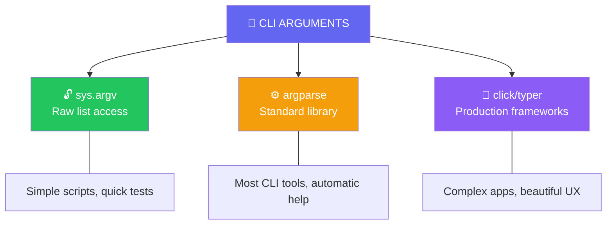

import { Tabs, TabItem, Aside, Badge, Card, CardGrid, Code } from '@astrojs/starlight/components';

## 💻 Command Line Arguments in Python — Complete Guide

> **Command Line Arguments** are values passed to your Python script **at runtime** from the terminal — accessible via `sys.argv` or parsed with powerful libraries like `argparse`.

```bash
# Terminal:
python script.py Alice 25 true
```

```python
# Inside script.py:
import sys
print(sys.argv)  # ['script.py', 'Alice', '25', 'true']
#                ↑            ↑       ↑     ↑
#           script name   arg[0]  arg[1] arg[2]
```

<Aside type="success">
🎯 **Python Advantage**: No need to manually parse everything! Built-in `argparse` provides automatic `--help`, type validation, subcommands, and more — out of the box.
</Aside>

---

## 🗺️ The Full Map: CLI Parsing Approaches



---

## 📌 Approach 1: Raw Access with `sys.argv`

Closest to Java's `String[] args` — simple but manual.

<Code lang="python" title="Basic sys.argv usage" code={`
import sys

def main():
    # sys.argv[0] is always the script name
    print(f"Script: {sys.argv[0]}")
    print(f"Args count: {len(sys.argv) - 1}")  # Exclude script name
    
    # Iterate over actual arguments (skip index 0)
    for i, arg in enumerate(sys.argv[1:], start=1):
        print(f"arg[{i-1}] = {arg!r}")

if __name__ == "__main__":
    main()
`} />

```bash
# Run:
python script.py Alice 25 Engineer

# Output:
# Script: script.py
# Args count: 3
# arg[0] = 'Alice'
# arg[1] = '25'
# arg[2] = 'Engineer'
```

<Aside type="note">
**Key Rule**: Arguments are **space-separated** by default. Use **quotes** to pass values containing spaces:
```bash
python script.py "Alice Smith" 25  # arg[0] = "Alice Smith" ✅
```
</Aside>

---

## 🔬 Deep Dive: How Arguments Flow

```text
You type in terminal:
python script.py Hello 99
        ↓ Python interpreter receives
sys.argv = ["script.py", "Hello", "99"]
        ↓ your code accesses
for arg in sys.argv[1:]: ...

⚠️ Everything is received as STRING
   even if you pass 99 → it's "99" not int 99!
```

<Code lang="python" title="Visualizing argument reception" code={`
import sys

def main():
    # sys.argv is a list — mutable like Java's String[]
    print(f"Type: {type(sys.argv)}")  # <class 'list'>
    
    # You CAN modify contents (but usually shouldn't):
    if len(sys.argv) > 1:
        sys.argv[1] = "Modified"  # ✅ Valid but rare
    
    # You CAN reassign the list:
    # sys.argv = ["new", "values"]  # ✅ Valid but unusual
    
    # Most common: read and parse
    args = sys.argv[1:]  # Copy without script name
    print(f"User args: {args}")

if __name__ == "__main__":
    main()
`} />

---

## 🔄 Type Conversion — Always String First

All command line arguments arrive as `str`. Convert explicitly to other types.

<Code lang="python" title="Parsing different types safely" code={`
import sys

def main():
    if len(sys.argv) < 5:
        print("Usage: python app.py <name> <age> <salary> <flag>", file=sys.stderr)
        sys.exit(1)
    
    name = sys.argv[1]                          # "Alice" → str ✅
    
    try:
        age = int(sys.argv[2])                  # "25" → 25 int ✅
    except ValueError:
        print(f"Age must be integer, got: {sys.argv[2]}", file=sys.stderr)
        sys.exit(1)
    
    try:
        salary = float(sys.argv[3])             # "99.5" → 99.5 float ✅
    except ValueError:
        print(f"Salary must be number, got: {sys.argv[3]}", file=sys.stderr)
        sys.exit(1)
    
    # Boolean parsing — Python doesn't have parseBoolean!
    flag_str = sys.argv[4].lower()
    flag = flag_str in ("true", "1", "yes", "on")  # "true" → True ✅
    
    print(f"{name}, age {age}, salary $\{salary:.2f\}, active: {flag}")

if __name__ == "__main__":
    main()
`} />

<Aside type="danger">
⚠️ **ValueError Trap**: Passing non-numeric strings to `int()`/`float()` crashes at runtime.

```python
python script.py Alice abc
# int("abc") → 💥 ValueError: invalid literal for int() with base 10
```

**Always validate with try-except** or use `argparse` for automatic type checking!
</Aside>

---

## 🎯 Approach 2: Standard Library with `argparse` ⭐ RECOMMENDED

Python's built-in `argparse` handles parsing, validation, help text, and subcommands automatically.

<Code lang="python" title="Basic argparse example" code={`
import argparse

def main():
    parser = argparse.ArgumentParser(
        description="Process user information",
        epilog="Example: python app.py Alice --age 25 --salary 99.5"
    )
    
    # Positional argument (required)
    parser.add_argument("name", help="User's name")
    
    # Optional arguments with types and defaults
    parser.add_argument("--age", "-a", type=int, default=18, 
                       help="Age in years (default: 18)")
    parser.add_argument("--salary", "-s", type=float, required=True,
                       help="Annual salary")
    parser.add_argument("--active", "-v", action="store_true",
                       help="Mark user as active")
    
    # Parse arguments
    args = parser.parse_args()
    
    # Use parsed values — already typed!
    print(f"{args.name}, age {args.age}, salary $\{args.salary:.2f}, active: {args.active}")

if __name__ == "__main__":
    main()
`} />

```bash
# Usage examples:
python app.py Alice --age 25 --salary 99.5        # ✅
python app.py Bob -a 30 -s 75000.00 -v            # ✅ short flags
python app.py --help                               # ✅ Auto-generated help!

# Auto-generated --help output:
# usage: app.py [-h] [--age AGE] --salary SALARY [--active] name
# 
# Process user information
# 
# positional arguments:
#   name                  User's name
# 
# options:
#   -h, --help            show this help message and exit
#   --age, -a AGE         Age in years (default: 18)
#   --salary, -s SALARY   Annual salary
#   --active, -v          Mark user as active
# 
# Example: python app.py Alice --age 25 --salary 99.5
```

<Aside type="success">
🚀 **argparse Superpowers**:
- ✅ Automatic `--help` and `-h`
- ✅ Type conversion (`type=int`) with error messages
- ✅ Required vs optional arguments
- ✅ Default values
- ✅ Short flags (`-a` for `--age`)
- ✅ Boolean flags (`action="store_true"`)
- ✅ Subcommands for complex CLIs
- ✅ Custom validation with `type=` functions
</Aside>

---

## 🔑 Advanced argparse Patterns

### Type Validation with Custom Functions

<Code lang="python" title="Custom type converter" code={`
import argparse

def port_number(value):
    """Validate port is between 1-65535"""
    ivalue = int(value)
    if not 1 <= ivalue <= 65535:
        raise argparse.ArgumentTypeError(f"{value} is not a valid port")
    return ivalue

parser = argparse.ArgumentParser()
parser.add_argument("--port", type=port_number, default=8080,
                   help="Server port (1-65535)")
args = parser.parse_args()
print(f"Starting server on port {args.port}")
`} />

```bash
python server.py --port 99999
# usage: server.py [-h] [--port PORT]
# server.py: error: argument --port: 99999 is not a valid port
```

### Choices Constraint

<Code lang="python" title="Restrict to predefined values" code={`
parser = argparse.ArgumentParser()
parser.add_argument("--env", choices=["dev", "staging", "prod"], 
                   required=True, help="Deployment environment")
parser.add_argument("--log-level", choices=["DEBUG", "INFO", "WARN", "ERROR"],
                   default="INFO", help="Logging verbosity")
args = parser.parse_args()
`} />

```bash
python app.py --env production
# error: argument --env: invalid choice: 'production' (choose from dev, staging, prod)
```

### Subcommands (Git-style CLI)

<Code lang="python" title="Subparsers for complex CLIs" code={`
parser = argparse.ArgumentParser(description="Package manager CLI")
subparsers = parser.add_subparsers(dest="command", required=True)

# git add
add_parser = subparsers.add_parser("add", help="Add files to staging")
add_parser.add_argument("files", nargs="+", help="Files to add")

# git commit  
commit_parser = subparsers.add_parser("commit", help="Commit changes")
commit_parser.add_argument("-m", "--message", required=True, help="Commit message")
commit_parser.add_argument("--amend", action="store_true", help="Amend last commit")

args = parser.parse_args()

if args.command == "add":
    print(f"Adding files: {args.files}")
elif args.command == "commit":
    print(f"Committing: {args.message}" + (" (amend)" if args.amend else ""))
`} />

```bash
python pm.py add src/main.py utils.py
# Adding files: ['src/main.py', 'utils.py']

python pm.py commit -m "Fix bug" --amend
# Committing: Fix bug (amend)
```

---

## 🚀 Approach 3: Production Frameworks (click / typer)

For beautiful, maintainable CLIs with minimal boilerplate.

<Tabs>
  <TabItem label="click — Battle-tested">
    <Code lang="python" title="Click example" code={`
import click

@click.command()
@click.argument("name")
@click.option("--age", "-a", type=int, default=18, help="Age in years")
@click.option("--salary", "-s", type=float, required=True, help="Annual salary")
@click.option("--active", "-v", is_flag=True, help="Mark as active")
@click.option("--verbose", "-V", is_flag=True, help="Enable verbose output")
def main(name, age, salary, active, verbose):
    """Process user information — Click style!"""
    if verbose:
        click.echo(f"🔍 Processing: {name}")
    
    status = "✅ active" if active else "⏸ inactive"
    click.echo(f"{name}, age {age}, salary $\{salary:,.2f} — {status}")

if __name__ == "__main__":
    main()
`} />

```bash
# Click auto-generates beautiful help:
python app.py --help
# Usage: app.py [OPTIONS] NAME
# 
#   Process user information — Click style!
# 
# Options:
#   -a, --age INTEGER      Age in years
#   -s, --salary FLOAT     Annual salary  [required]
#   -v, --active           Mark as active
#   -V, --verbose          Enable verbose output
#   --help                 Show this message and exit.
```
  </TabItem>

  <TabItem label="typer — Modern + type hints">
    <Code lang="python" title="Typer example (built on Click)" code={`
from typing import Optional
import typer

app = typer.Typer(help="Process user information")

@app.command()
def main(
    name: str = typer.Argument(..., help="User's name"),
    age: int = typer.Option(18, "--age", "-a", help="Age in years"),
    salary: float = typer.Option(..., "--salary", "-s", help="Annual salary"),
    active: bool = typer.Option(False, "--active", "-v", help="Mark as active"),
    verbose: bool = typer.Option(False, "--verbose", "-V", help="Enable verbose output"),
):
    """Typer uses type hints for automatic validation!"""
    if verbose:
        typer.echo(f"🔍 Processing: {name}")
    
    status = "✅ active" if active else "⏸ inactive"
    typer.echo(f"{name}, age {age}, salary $\{salary:,.2f} — {status}")

if __name__ == "__main__":
    app()
`} />

```bash
# Type hints = automatic validation:
python app.py Alice --age not-a-number
# Usage: app.py [OPTIONS] NAME
# Try 'app.py --help' for help.
# ╭─ Error ──────────────────────────────────────╮
# │ Invalid value for '--age' / '-a': 'not-a-    │
# │ number' is not a valid integer               │
# ╰──────────────────────────────────────────────╯
```
  </TabItem>
</Tabs>

<Aside type="tip">
**Framework Selection Guide**:
| Use Case | Recommended Tool |
|----------|-----------------|
| Quick script, 1-2 args | `sys.argv` ✅ |
| Standard CLI tool | `argparse` ✅ (built-in) |
| Professional CLI app | `click` ✅ (mature, flexible) |
| Type-hint loving team | `typer` ✅ (modern, auto-validation) |
| Interactive prompts | `questionary` + any above |
</Aside>

---

## ⚠️ Common Mistakes & Gotchas

<CardGrid>
  <Card title="Mistake 1 — Forgetting sys.argv[0] is script name" icon="error">
    ```python
    import sys
    
    # ❌ Wrong: includes script name
    for arg in sys.argv:
        print(arg)  # First print: "script.py"
    
    # ✅ Correct: skip script name
    for arg in sys.argv[1:]:
        print(arg)  # Only user arguments
    ```
  </Card>
  
  <Card title="Mistake 2 — Indexing without length check" icon="error">
    ```python
    import sys
    
    # ❌ Crashes if no args provided
    name = sys.argv[1]  # 💥 IndexError: list index out of range
    
    # ✅ Safe patterns:
    if len(sys.argv) > 1:
        name = sys.argv[1]
    
    # Or use argparse which handles this automatically!
    ```
  </Card>
  
  <Card title="Mistake 3 — Boolean parsing confusion" icon="error">
    ```python
    # ❌ Wrong: bool("false") returns True! (any non-empty string is truthy)
    flag = bool(sys.argv[1])  # "false" → True 😱
    
    # ✅ Correct patterns:
    flag_str = sys.argv[1].lower()
    flag = flag_str in ("true", "1", "yes", "on")
    
    # ✅ Even better: use argparse with action="store_true"
    parser.add_argument("--flag", action="store_true")
    # Usage: --flag present = True, absent = False
    ```
  </Card>
  
  <Card title="Mistake 4 — Spaces in arguments" icon="warning">
    ```bash
    # ❌ Two separate arguments:
    python script.py Hello World
    # sys.argv = ['script.py', 'Hello', 'World']
    
    # ✅ One argument with space:
    python script.py "Hello World"
    # sys.argv = ['script.py', 'Hello World']
    
    # ✅ Single quotes also work:
    python script.py 'Path/With Spaces/file.txt'
    ```
  </Card>
  
  <Card title="Mistake 5 — Special characters need escaping" icon="warning">
    ```bash
    # ❌ Shell interprets $, !, etc.
    python script.py $HOME     # Expands to /home/user
    python script.py hello!    # History expansion in bash
    
    # ✅ Quote to preserve literally:
    python script.py '$HOME'   # Literal string "$HOME"
    python script.py "hello!"  # Literal string "hello!"
    
    # ✅ Or escape:
    python script.py \$HOME
    ```
  </Card>
</CardGrid>

---

## 🧪 Testing CLI Arguments Locally

<Code lang="bash" title="Terminal commands for testing" code={`
# Basic test
python script.py Alice 25

# Argument with space
python script.py "Alice Smith" 25

# Passing special characters (quote to preserve)
python script.py 'user@example.com' '$100'

# No arguments (test empty handling)
python script.py

# Redirecting output
python script.py Alice 25 > output.txt

# Piping from another command
echo "Alice 25" | xargs python script.py

# Using env variables + args
API_KEY=secret python script.py --key $API_KEY
`} />

<Code lang="python" title="Debug: Print args for verification" code={`
import sys

def main():
    print("=== DEBUG: CLI Args ===", file=sys.stderr)
    print(f"sys.argv type: {type(sys.argv)}", file=sys.stderr)
    print(f"sys.argv length: {len(sys.argv)}", file=sys.stderr)
    
    for i, arg in enumerate(sys.argv):
        print(f"sys.argv[{i}] = {arg!r} (len={len(arg)})", file=sys.stderr)
    
    print("=======================", file=sys.stderr)
    # Now process your actual logic...

if __name__ == "__main__":
    main()
`} />

<Aside type="tip">
**IDE Tip**: In VS Code, PyCharm, or IntelliJ:
1. Open **Run/Debug Configurations**
2. Find **"Script parameters"** or **"Arguments"** field
3. Enter: `Alice 25 --verbose`
4. Run with debugger — no terminal needed! 🎯
</Aside>

---

## 🎯 Interview Cheat Sheet

<CardGrid>
  <Card title="Q: What is the type of command line arguments in Python?" icon="information">
    **Always `list[str]`** via `sys.argv` — even numbers arrive as strings.  
    You must explicitly parse: `int()`, `float()`, or use `argparse` with `type=`.
  </Card>
  
  <Card title="Q: What if no arguments passed — is sys.argv empty?" icon="approve-check">
    **YES ✅** — `sys.argv` always has at least the script name:
    ```python
    # python script.py (no args)
    # sys.argv = ["script.py"]  # length 1, not empty!
    
    # User args start at index 1:
    user_args = sys.argv[1:]  # [] if no user args
    ```
  </Card>

  <Card title="Q: How do you handle boolean flags?" icon="backspace">
    **Three patterns**:
    ```python
    # 1. argparse with action (recommended)
    parser.add_argument("--verbose", action="store_true")
    
    # 2. Manual string check
    flag = sys.argv[1].lower() in ("true", "1", "yes")
    
    # 3. click/typer with is_flag
    @click.option("--verbose", is_flag=True)
    ```
  </Card>

  <Card title="Q: Why use argparse over sys.argv?" icon="rocket">
    ```python
    # sys.argv: manual everything ❌
    if len(sys.argv) < 2: print("Usage..."); exit(1)
    try: age = int(sys.argv[1])
    except ValueError: print("Age must be int"); exit(1)
    
    # argparse: automatic validation ✅
    parser.add_argument("age", type=int)
    args = parser.parse_args()  # Errors handled automatically!
    ```
  </Card>

  <Card title="Q: Can you pass None/null from terminal?" icon="error">
    **NO ❌** — terminal only sends strings.  
    The string `"None"` or `"null"` is just text:
    ```python
    python script.py None
    # sys.argv[1] = "None" (4-character string), not Python None
    
    # Handle explicitly:
    value = None if sys.argv[1].lower() == "none" else sys.argv[1]
    ```
  </Card>

  <Card title="Q: How to make arguments optional?" icon="approve-check">
    **argparse patterns**:
    ```python
    # Optional with default
    parser.add_argument("--port", type=int, default=8080)
    
    # Optional boolean flag
    parser.add_argument("--verbose", action="store_true")
    
    # Optional with choices
    parser.add_argument("--format", choices=["json", "csv"], default="json")
    
    # Required optional (must provide if flag used)
    parser.add_argument("--output", "-o", required=True)
    ```
  </Card>
</CardGrid>

<Aside type="danger">
**Most common runtime errors**:
```python
# IndexError: list index out of range
import sys
name = sys.argv[1]  # 💥 if user forgot to provide arg

# ValueError: invalid literal for int()
age = int("abc")  # 💥 if user passed non-numeric string

# SystemExit from argparse (expected behavior!)
args = parser.parse_args(["--invalid-flag"])  # 💥 exits with error message
# This is GOOD — argparse handles invalid input gracefully
```
</Aside>

---

## 🧩 DSA Patterns with CLI Arguments

<CardGrid>
  <Card title="Pattern: Quick Algorithm Testing" icon="rocket">
    Test solutions with different inputs without code changes:
    ```python
    # python solution.py 5 3 → n=5, k=3
    import sys
    
    def solve(n: int, k: int) -> int:
        # Your DSA logic here
        return n * k
    
    if __name__ == "__main__":
        if len(sys.argv) >= 3:
            n, k = int(sys.argv[1]), int(sys.argv[2])
            print(solve(n, k))
        else:
            # Fallback to interactive input
            n = int(input("Enter n: "))
            k = int(input("Enter k: "))
            print(solve(n, k))
    ```
  </Card>
  
  <Card title="Pattern: Array Input from CLI" icon="shield">
    Convert CLI args directly into arrays for algorithm testing:
    ```python
    import sys
    
    # python solution.py 1 2 3 4 5
    if __name__ == "__main__":
        arr = [int(x) for x in sys.argv[1:]]  # [1, 2, 3, 4, 5]
        print(f"Input array: {arr}")
        print(f"Max subarray sum: {max_subarray_sum(arr)}")
    ```
  </Card>

  <Card title="Pattern: Mode Selection via Flags" icon="backspace">
    Use arguments to toggle test cases or algorithm variants:
    ```python
    import argparse
    
    parser = argparse.ArgumentParser()
    parser.add_argument("input", help="Input file or value")
    parser.add_argument("--algorithm", choices=["brute", "dp", "greedy"], 
                       default="dp", help="Algorithm to use")
    parser.add_argument("--verbose", "-v", action="store_true")
    
    args = parser.parse_args()
    
    if args.verbose:
        print(f"Running {args.algorithm} on {args.input}")
    
    result = run_algorithm(args.algorithm, args.input)
    print(result)
    ```
  </Card>

  <Card title="Pattern: Benchmarking with Parameters" icon="information">
    ```python
    import argparse
    import time
    
    parser = argparse.ArgumentParser()
    parser.add_argument("--sizes", type=int, nargs="+", 
                       default=[100, 1000, 10000], help="Input sizes to test")
    parser.add_argument("--repeats", type=int, default=3)
    
    args = parser.parse_args()
    
    for size in args.sizes:
        times = []
        for _ in range(args.repeats):
            data = generate_test_data(size)
            start = time.perf_counter()
            result = algorithm(data)
            end = time.perf_counter()
            times.append(end - start)
        
        avg = sum(times) / len(times)
        print(f"Size {size:6d}: {avg*1000:.2f}ms avg")
    ```
  </Card>
</CardGrid>

<Aside type="tip">
**Competitive Coding Pro Tip**: Many judges use `stdin` not `sys.argv`. Design flexible input:
```python
import sys

def read_input():
    if len(sys.argv) > 1:
        # CLI args provided
        return [int(x) for x in sys.argv[1:]]
    else:
        # Fallback to stdin (for online judges)
        return [int(x) for x in sys.stdin.read().split()]

# Works with both:
# python solution.py 1 2 3  ← CLI
# echo "1 2 3" | python solution.py  ← stdin
```
</Aside>

---

## 🏢 Real-Life SDE Usage

<CardGrid>
  <Card title="FastAPI/Flask — CLI for local dev" icon="rocket">
    Many Python web frameworks support CLI config:
    ```python
    # uvicorn main:app --host 0.0.0.0 --port 8000 --reload
    # ↑ Click-based CLI under the hood!
    
    # Custom management command with argparse:
    import argparse
    
    def main():
        parser = argparse.ArgumentParser(description="App CLI")
        sub = parser.add_subparsers(dest="cmd", required=True)
        
        # migrate command
        migrate = sub.add_parser("migrate", help="Run database migrations")
        migrate.add_argument("--dry-run", action="store_true")
        
        # seed command
        seed = sub.add_parser("seed", help="Seed database with test data")
        seed.add_argument("--env", choices=["dev", "prod"], default="dev")
        
        args = parser.parse_args()
        
        if args.cmd == "migrate":
            run_migrations(dry_run=args.dry_run)
        elif args.cmd == "seed":
            seed_database(env=args.env)
    
    if __name__ == "__main__":
        main()
    ```
  </Card>
  
  <Card title="Data pipeline CLI tool" icon="shield">
    Real-world pattern for ETL operations:
    ```python
    import argparse
    from pathlib import Path
    
    def main():
        parser = argparse.ArgumentParser(description="Data Importer CLI")
        parser.add_argument("input", type=Path, help="Input CSV file")
        parser.add_argument("output", type=Path, help="Output JSON file")
        parser.add_argument("--batch-size", type=int, default=1000,
                          help="Records per batch")
        parser.add_argument("--dry-run", action="store_true",
                          help="Validate without writing")
        parser.add_argument("--verbose", "-v", action="store_true")
        
        args = parser.parse_args()
        
        if args.verbose:
            print(f"📥 {args.input} → 📤 {args.output}")
            print(f"Batch size: {args.batch_size}, Dry run: {args.dry_run}")
        
        if args.dry_run:
            print("✅ Validation passed — no changes made")
        else:
            import_data(args.input, args.output, batch_size=args.batch_size)
            print("✅ Import complete")
    
    if __name__ == "__main__":
        main()
    ```
  </Card>

  <Card title="Production: click for beautiful CLIs" icon="information">
    ```python
    # cli.py — Production CLI with Click
    import click
    import logging
    
    @click.group()  # Enables subcommands
    @click.option("--verbose", "-v", count=True, 
                 help="Increase verbosity (use multiple times)")
    @click.pass_context
    def cli(ctx, verbose):
        """MyApp — Production CLI Tool"""
        ctx.ensure_object(dict)
        level = logging.WARNING - min(verbose * 10, 30)
        ctx.obj["logger"] = logging.getLogger(__name__)
        ctx.obj["logger"].setLevel(max(level, logging.DEBUG))
    
    @cli.command()
    @click.argument("input_file", type=click.Path(exists=True))
    @click.option("--output", "-o", type=click.Path(), required=True)
    @click.option("--format", "-f", type=click.Choice(["json", "csv"]), default="json")
    def convert(input_file, output, format):
        """Convert input file to specified format"""
        logger = click.get_current_context().obj["logger"]
        logger.info(f"Converting {input_file} → {output} ({format})")
        # ... conversion logic ...
        click.echo(f"✅ Converted: {output}")
    
    if __name__ == "__main__":
        cli(obj={})  # Click magic
    ```
  </Card>
</CardGrid>

<Code lang="bash" title="Production CLI usage" code={`
# Basic help
python cli.py --help

# Subcommand help  
python cli.py convert --help

# Actual usage
python cli.py -vv convert data.csv -o result.json -f json
# ↑ -vv = verbose level 2, converts CSV to JSON

# With environment variables
export API_KEY=secret
python cli.py --api-key $API_KEY process input.txt
`} />

<Aside type="caution">
**Production Checklist** for Python CLI apps:
1. ✅ Always validate argument count or use `argparse`
2. ✅ Wrap parsing in try-except for user-friendly errors  
3. ✅ Print usage help when arguments are missing/invalid
4. ✅ Exit with non-zero code (`sys.exit(1)`) on failure for script integration
5. ✅ Document expected arguments in `--help` output (argparse/click do this automatically!)
6. ✅ Support `--version` flag for tooling compatibility
7. ✅ Consider `pyproject.toml` entry points for installable CLI tools
</Aside>

---

## 🔑 Quick Reference Summary

| Concept | sys.argv | argparse | click/typer |
|---------|----------|----------|-------------|
| **Access** | `sys.argv[1:]` | `parser.parse_args()` | `@click.command()` |
| **Type conversion** | Manual `int()` | `type=int` in add_argument | Type hints / `type=` |
| **Help text** | Manual print | Auto-generated `--help` | Auto + beautiful formatting |
| **Required args** | Manual length check | `required=True` | Default or `...` in typer |
| **Optional flags** | Manual parsing | `add_argument("--flag")` | `@click.option()` |
| **Boolean flags** | String comparison | `action="store_true"` | `is_flag=True` |
| **Subcommands** | Manual routing | `add_subparsers()` | `@click.group()` + commands |
| **Best for** | Quick scripts | Standard CLI tools | Production apps |

<Aside type="tip">
**Migration Path**: Start simple, scale as needed:
```python
# Phase 1: Quick test
import sys
name = sys.argv[1] if len(sys.argv) > 1 else "World"

# Phase 2: Add validation  
import argparse
parser = argparse.ArgumentParser()
parser.add_argument("name", nargs="?", default="World")
args = parser.parse_args()

# Phase 3: Production CLI
import typer
def main(name: str = typer.Argument("World", help="Greeting target")):
    typer.echo(f"Hello {name}!")
```
</Aside>

---

## 🗒️ Quick Revision Cheat Sheet

```python
# 📦 CLI ACCESS PATTERNS

# Raw: sys.argv (simple scripts)
import sys
args = sys.argv[1:]  # Skip script name
if len(args) >= 1: name = args[0]

# Standard: argparse (most CLIs)
import argparse
parser = argparse.ArgumentParser(description="My Tool")
parser.add_argument("name", help="User name")
parser.add_argument("--age", type=int, default=18)
parser.add_argument("--active", action="store_true")
args = parser.parse_args()
# args.name, args.age, args.active — already typed!

# Pro: click (beautiful CLIs)
import click
@click.command()
@click.argument("name")
@click.option("--age", type=int, default=18)
def main(name, age): click.echo(f"{name}, age {age}")

# Modern: typer (type hints + click)
import typer
def main(name: str, age: int = 18): typer.echo(f"{name}, age {age}")

# 🔑 ARGPARSE ESSENTIALS
type=int/float          # Auto type conversion
choices=["a","b"]       # Restrict values
required=True           # Make optional arg required  
default=value           # Fallback if not provided
action="store_true"     # Boolean flag (present=True)
nargs="+"               # Multiple values: --items a b c
type=Path               # File path with existence check

# ⚠️ COMMON TRAPS
# ❌ Forgetting sys.argv[0] is script name
for arg in sys.argv: ...     # Includes "script.py"
for arg in sys.argv[1:]: ... # ✅ Only user args

# ❌ bool("false") is True!
flag = bool(sys.argv[1])     # "false" → True 😱
flag = sys.argv[1].lower() in ("true","1","yes")  # ✅

# ❌ Indexing without check
name = sys.argv[1]  # 💥 IndexError if no args
if len(sys.argv) > 1: name = sys.argv[1]  # ✅ Safe

# 🎯 DSA PATTERNS
# Array from CLI:
arr = [int(x) for x in sys.argv[1:]]

# Fallback to stdin (for online judges):
data = sys.argv[1:] if len(sys.argv) > 1 else sys.stdin.read().split()

# Benchmarking loop:
for size in [100, 1000, 10000]:
    times = [time_func(algo, generate(size)) for _ in range(3)]
    print(f"{size}: {sum(times)/len(times)*1000:.2f}ms")

# 🔒 PRODUCTION TIPS
# Always use argparse/click for user-facing tools
# Add --version flag: parser.add_argument("--version", action="version", version="1.0")
# Use exit codes: sys.exit(0) success, sys.exit(1) error
# Log to stderr for errors: print("Error", file=sys.stderr)
# Support config files: --config path/to/settings.yaml
```

> 🚀 **Final Wisdom**: Python's CLI ecosystem is unmatched — from `sys.argv` for quick scripts to `argparse` for robust tools to `click`/`typer` for beautiful production CLIs. Start simple, add structure as needed, and always provide helpful `--help` output. Your future self (and your users) will thank you! 🐍✨

<Badge text="Astro 6 Ready" variant="success" /> • <Badge text="Python 3.10+" variant="tip" /> • <Badge text="Interview Optimized" variant="caution" />
```

---

## 🔄 Key Conversion Summary

| Java CLI Concept | Python Equivalent | Critical Difference |
|-----------------|-----------------|-------------------|
| `String[] args` in `main()` | `sys.argv` list | Python: `sys.argv[0]` = script name; Java: `args[0]` = first user arg |
| Manual parsing + try-catch | `argparse` with `type=` | Python: automatic validation + help generation |
| Boolean parsing | `action="store_true"` | Python: flag presence = True, absence = False (no string parsing) |
| `Integer.parseInt(args[1])` | `type=int` in argparse | Python: errors show helpful usage message automatically |
| No built-in help | `--help` auto-generated | Python: `argparse`/`click` create professional help text |
| Manual subcommand routing | `add_subparsers()` / `@click.group()` | Python: declarative subcommand definition |
| Exit on error manually | `sys.exit(1)` or argparse auto-exit | Python: argparse exits with helpful message on parse error |
| No type hints enforcement | Typer uses type hints for validation | Python: runtime validation from static type annotations |

> 🎯 **Pro Interview Tip**: When asked about CLI arguments in Python, emphasize:  
> 1. `sys.argv[0]` = script name (vs Java where args[0] = first user arg) ✅  
> 2. `argparse` provides automatic `--help`, type validation, and error messages ✅  
> 3. Boolean flags use `action="store_true"` not string parsing ✅  
> 4. Framework progression: `sys.argv` → `argparse` → `click`/`typer` ✅  
> 5. Production concerns: exit codes, stderr logging, config file support ✅  
> This demonstrates practical Python CLI mastery beyond basic syntax! 🐍🚀

---

# 🖥️ Python Command Line Arguments

---

## 🧠 Mental Model First

```
You write:   python script.py --host localhost --port 8080 --debug

OS does:
┌──────────────────────────────────────────────────────────┐
│  execve("python", ["script.py","--host","localhost",     │
│                    "--port","8080","--debug"], env)       │
└──────────────────────────────────────────────────────────┘
         │
         ▼
CPython startup:
  sys.argv = ["script.py", "--host", "localhost",
               "--port", "8080", "--debug"]
  └─ raw strings. no parsing. no types. everything is str.
```

> The OS passes arguments as a flat list of **strings**. Python receives them as-is. All parsing, typing, validation — your responsibility (or argparse's).

---

## 🔬 Internals — How CPython Receives Arguments

```
OS kernel
   │  execve() syscall — argv[] array of C strings
   ▼
CPython main (Modules/main.c)
   │  Py_RunMain()
   ▼
_PyArgv → PySys_SetArgvEx()
   │  converts C char** → Python list of str
   ▼
sys.argv = ["script.py", "arg1", "arg2", ...]
   │  stored in sys module dict
   ▼
Your script reads sys.argv
```

```python
import sys

# sys.argv is just a plain Python list
type(sys.argv)        # <class 'list'>
type(sys.argv[0])     # <class 'str'>  ← always str, never int/bool

# sys.argv[0] = script name (or '' in REPL, '-' if stdin)
# sys.argv[1:] = actual arguments
```

---

## 1️⃣ `sys.argv` — Raw Access

```python
# script.py
import sys

print(sys.argv)
# $ python script.py foo bar 42
# ['script.py', 'foo', 'bar', '42']
#  └── [0]       [1]   [2]   [3]
```

### Manual Parsing Pattern

```python
# deploy.py
import sys

args = sys.argv[1:]   # strip script name

if len(args) < 2:
    print("Usage: deploy.py <env> <version>")
    sys.exit(1)       # non-zero = error exit code

env     = args[0]     # "production"
version = args[1]     # "2.4.1"

# Everything is str — manual cast required:
port = int(args[2]) if len(args) > 2 else 8080
```

> `sys.argv` has **zero** validation, zero type conversion, zero help generation. Use it only for trivial scripts.

---

## 2️⃣ `argparse` — Production Standard

```
argparse pipeline:
┌──────────────────────────────────────────────────────────┐
│                                                          │
│  1. Define parser  →  ArgumentParser()                   │
│  2. Add arguments  →  add_argument()                     │
│  3. Parse          →  parse_args()  ← reads sys.argv[1:] │
│  4. Access         →  args.name, args.port               │
│                                                          │
└──────────────────────────────────────────────────────────┘
```

### Basic Structure

```python
import argparse

parser = argparse.ArgumentParser(
    description="Deploy service to environment",
    epilog="Example: deploy.py --env prod --port 8080"
)

# Positional argument — required, no flag
parser.add_argument("env", help="Target environment")

# Optional argument — has --flag prefix
parser.add_argument("--port", type=int, default=8080,
                    help="Port to bind (default: 8080)")

# Flag (boolean switch)
parser.add_argument("--debug", action="store_true",
                    help="Enable debug mode")

args = parser.parse_args()

print(args.env)     # "production"
print(args.port)    # 8080  ← int, not str
print(args.debug)   # True or False
```

```bash
$ python deploy.py production --port 9000 --debug
# args.env   = "production"
# args.port  = 9000
# args.debug = True

$ python deploy.py --help
# usage: deploy.py [-h] [--port PORT] [--debug] env
# ...auto-generated help text
```

---

## 🔬 `add_argument` — Full Option Map

### `type` — Auto Conversion

```python
parser.add_argument("--port",    type=int)
parser.add_argument("--ratio",   type=float)
parser.add_argument("--config",  type=open)       # opens file
parser.add_argument("--path",    type=pathlib.Path)

# Custom type — any callable(str) → value:
def positive_int(val):
    n = int(val)
    if n <= 0:
        raise argparse.ArgumentTypeError(f"{val} must be positive")
    return n

parser.add_argument("--workers", type=positive_int)
```

### `action` — What to Do With Value

| action | behavior | example |
|--------|----------|---------|
| `"store"` | default, stores value | `--name Ali` |
| `"store_true"` | stores `True` if flag present | `--debug` |
| `"store_false"` | stores `False` if flag present | `--no-cache` |
| `"store_const"` | stores `const=` value | `--verbose` |
| `"append"` | appends each use to list | `--tag a --tag b` |
| `"append_const"` | appends const to list | — |
| `"count"` | counts occurrences | `-vvv` → 3 |
| `"extend"` | extends list with values (3.8+) | `--items a b c` |

```python
parser.add_argument("--tag",     action="append")
parser.add_argument("-v",        action="count", default=0)
parser.add_argument("--items",   action="extend", nargs="+")

# $ python s.py --tag web --tag api -vvv --items a b c
# args.tag   = ["web", "api"]
# args.v     = 3
# args.items = ["a", "b", "c"]
```

### `nargs` — How Many Values

| nargs | behavior |
|-------|----------|
| `N` (int) | exactly N values → list |
| `"?"` | 0 or 1 values |
| `"*"` | 0 or more → list |
| `"+"` | 1 or more → list, error if none |
| `argparse.REMAINDER` | all remaining args |

```python
parser.add_argument("--ports", nargs="+", type=int)
parser.add_argument("--coords", nargs=2, type=float)
parser.add_argument("--output", nargs="?", const="stdout", default=None)

# $ python s.py --ports 80 443 8080 --coords 1.5 2.7
# args.ports  = [80, 443, 8080]
# args.coords = [1.5, 2.7]
```

### `choices` — Restrict Values

```python
parser.add_argument("--env",
    choices=["dev", "staging", "prod"],
    help="Deployment environment"
)

parser.add_argument("--log-level",
    choices=["DEBUG", "INFO", "WARNING", "ERROR"],
    default="INFO"
)

# $ python s.py --env invalid
# error: argument --env: invalid choice: 'invalid'
#        (choose from 'dev', 'staging', 'prod')
```

### `required` — Force Optional Argument

```python
parser.add_argument("--token", required=True, help="API auth token")
# Optional-style (--flag) but MUST be provided
```

---

## 3️⃣ Argument Groups — Clean Help Output

```python
parser = argparse.ArgumentParser()

# Group related args together in --help
server_group = parser.add_argument_group("Server Options")
server_group.add_argument("--host", default="0.0.0.0")
server_group.add_argument("--port", type=int, default=8080)

db_group = parser.add_argument_group("Database Options")
db_group.add_argument("--db-host", default="localhost")
db_group.add_argument("--db-port", type=int, default=5432)
db_group.add_argument("--db-name", required=True)
```

```bash
$ python app.py --help

Server Options:
  --host HOST
  --port PORT

Database Options:
  --db-host DB_HOST
  --db-port DB_PORT
  --db-name DB_NAME
```

---

## 4️⃣ Mutually Exclusive Groups

```python
group = parser.add_mutually_exclusive_group(required=True)
group.add_argument("--start",   action="store_true")
group.add_argument("--stop",    action="store_true")
group.add_argument("--restart", action="store_true")

# $ python s.py --start --stop
# error: argument --stop: not allowed with argument --start
```

---

## 5️⃣ Subcommands — CLI Tool Pattern

```
git commit -m "msg"
git push origin main
kubectl apply -f config.yaml
docker build -t name .
```

```python
# cli.py — real prod CLI tool structure
import argparse

parser = argparse.ArgumentParser(prog="mytool")
subparsers = parser.add_subparsers(dest="command", required=True)

# --- deploy subcommand ---
deploy = subparsers.add_parser("deploy", help="Deploy service")
deploy.add_argument("env", choices=["dev", "prod"])
deploy.add_argument("--version", required=True)
deploy.add_argument("--dry-run", action="store_true")

# --- rollback subcommand ---
rollback = subparsers.add_parser("rollback", help="Rollback deployment")
rollback.add_argument("env", choices=["dev", "prod"])
rollback.add_argument("--steps", type=int, default=1)

# --- logs subcommand ---
logs = subparsers.add_parser("logs", help="Fetch logs")
logs.add_argument("service")
logs.add_argument("--tail", type=int, default=100)

args = parser.parse_args()

# Dispatch:
if args.command == "deploy":
    run_deploy(args.env, args.version, args.dry_run)
elif args.command == "rollback":
    run_rollback(args.env, args.steps)
elif args.command == "logs":
    fetch_logs(args.service, args.tail)
```

```bash
$ python cli.py deploy prod --version 2.4.1 --dry-run
$ python cli.py rollback dev --steps 2
$ python cli.py logs auth-service --tail 500
```

---

## 6️⃣ `parse_known_args` — Partial Parsing

```python
# When you don't control all args (plugin systems, test runners):
args, unknown = parser.parse_known_args()

# $ python s.py --port 8080 --some-unknown-flag
# args    = Namespace(port=8080)
# unknown = ['--some-unknown-flag']

# Real use — pass unknown args to subprocess:
import subprocess
args, extra = parser.parse_known_args()
subprocess.run(["pytest"] + extra)
```

---

## 7️⃣ `Namespace` Object — What `parse_args()` Returns

```python
args = parser.parse_args()

# args is an argparse.Namespace object
type(args)               # <class 'argparse.Namespace'>
vars(args)               # convert to dict: {'port': 8080, 'debug': False}
getattr(args, "port")    # 8080

# Dest name rules:
# --my-flag     → args.my_flag  (hyphen → underscore)
# --DB_HOST     → args.DB_HOST  (uppercase preserved)
```

---

## 🔬 Full Production CLI Pattern

```python
#!/usr/bin/env python3
"""Service management CLI."""

import argparse
import sys
import logging
from pathlib import Path


def build_parser() -> argparse.ArgumentParser:
    parser = argparse.ArgumentParser(
        description="Manage microservices",
        formatter_class=argparse.RawDescriptionHelpFormatter,
    )

    parser.add_argument(
        "--log-level",
        choices=["DEBUG", "INFO", "WARNING", "ERROR"],
        default="INFO",
        dest="log_level",
    )

    subs = parser.add_subparsers(dest="cmd", required=True)

    # start
    start = subs.add_parser("start")
    start.add_argument("service")
    start.add_argument("--port",    type=int, required=True)
    start.add_argument("--workers", type=int, default=4)
    start.add_argument("--config",  type=Path, default=Path("config.yaml"))

    # stop
    stop = subs.add_parser("stop")
    stop.add_argument("service")
    stop.add_argument("--force", action="store_true")

    return parser


def main():
    parser = build_parser()
    args = parser.parse_args()

    logging.basicConfig(level=args.log_level)

    if args.cmd == "start":
        if not args.config.exists():
            parser.error(f"Config not found: {args.config}")
        start_service(args.service, args.port, args.workers, args.config)

    elif args.cmd == "stop":
        stop_service(args.service, args.force)


if __name__ == "__main__":
    main()
```

---

## 💀 Interview Trap 1 — `sys.argv[0]` Is Not Reliable

```python
# Run normally:
# $ python script.py
# sys.argv[0] = "script.py"

# Run as module:
# $ python -m mypackage.script
# sys.argv[0] = "/full/path/to/mypackage/script.py"

# Run via subprocess:
# sys.argv[0] = whatever the caller set — can be anything

# In pytest:
# sys.argv[0] = path to pytest
# sys.argv[1:] = pytest's own args — NOT your script's args

# Fix — never parse sys.argv[0]. Always use sys.argv[1:] or argparse.
```

---

## 💀 Interview Trap 2 — `parser.error()` vs `raise`

```python
args = parser.parse_args()

# WRONG — raw exception, ugly stack trace to user:
if args.port < 1 or args.port > 65535:
    raise ValueError("Port out of range")    # ugly for CLI users

# CORRECT — argparse formats error like native error:
if args.port < 1 or args.port > 65535:
    parser.error("--port must be between 1 and 65535")
    # Prints: "error: --port must be between 1 and 65535"
    # Calls sys.exit(2)  ← standard CLI error exit code
```

---

## 💀 Interview Trap 3 — Mutable Default in `add_argument`

```python
# WRONG — same list shared across all parses:
parser.add_argument("--tags", action="append", default=[])

first  = parser.parse_args(["--tags", "a"])
second = parser.parse_args(["--tags", "b"])

print(first.tags)    # ["a"]  looks fine
print(second.tags)   # ["a", "b"]  ← accumulated from first parse!

# CORRECT — use None, check after:
parser.add_argument("--tags", action="append", default=None)
args = parser.parse_args()
tags = args.tags or []
```

---

## 💀 Interview Trap 4 — `store_true` Default Is `False`, Not `None`

```python
parser.add_argument("--verbose", action="store_true")

# If --verbose NOT passed:
args.verbose   # False   ← not None

# This breaks "was this flag explicitly passed" detection:
if args.verbose is None:    # never True — default is False
    use_config_file_setting()

# Fix — use default=None explicitly:
parser.add_argument("--verbose", action="store_true", default=None)
# Now: passed → True, not passed → None
```

---

## ✅ SDE Relevance

| Topic | Level |
|-------|-------|
| `sys.argv` structure + `[0]` unreliability | 🔴 MUST KNOW |
| `argparse` full pipeline | 🔴 MUST KNOW |
| `type=` auto conversion | 🔴 MUST KNOW |
| `action="store_true/append/count"` | 🔴 MUST KNOW |
| `nargs` variants | 🟡 GOOD TO KNOW |
| `choices` validation | 🔴 MUST KNOW |
| Subcommands pattern | 🔴 MUST KNOW |
| `parser.error()` vs raise | 🔴 MUST KNOW |
| `parse_known_args` for plugins | 🟡 GOOD TO KNOW |
| Mutable default in `add_argument` | 🔴 MUST KNOW |
| `store_true` default is `False` not `None` | 🟡 GOOD TO KNOW |
| `vars(args)` → dict conversion | 🟡 GOOD TO KNOW |

---
