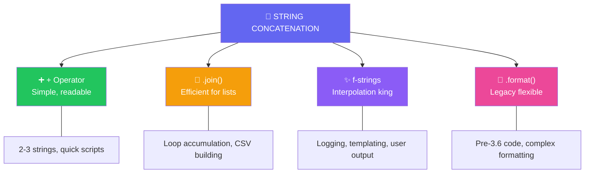

import { Tabs, TabItem, Aside, Badge, Card, CardGrid, Code } from '@astrojs/starlight/components';

## 🔗 String Concatenation in Python — Complete Guide

> Python offers **three primary ways** to concatenate strings — each with different use cases, performance characteristics, and Pythonic idioms.

```python
# 1. + operator (simple, readable for few strings)
result = "Hello" + " " + "World"  # "Hello World"

# 2. .join() method (efficient for many strings)
result = " ".join(["Hello", "World"])  # "Hello World"

# 3. f-strings (Python 3.6+, best for interpolation)
name, place = "Alice", "Wonderland"
result = f"Hello {name} from {place}"  # "Hello Alice from Wonderland"
```

<Aside type="success">
🎯 **Python Advantage**: No type promotion confusion, no char arithmetic traps, and f-strings make interpolation crystal clear. String handling "just works"!
</Aside>

---

## 🗺️ The Full Map: Concatenation Methods



---

## ➕ Method 1: The `+` Operator (Simple Concatenation)

### 🔄 Basic Usage — No Type Promotion Traps!

<Code lang="python" title="String + anything requires explicit conversion" code={`
# ✅ String + String = concatenation
result = "Hello" + " " + "World"  # "Hello World"

# ❌ String + int = TypeError (Python is strict!)
# result = "Age: " + 25  # 💥 TypeError: can only concatenate str (not "int") to str

# ✅ Explicit conversion required:
result = "Age: " + str(25)        # "Age: 25" ✅
result = "Pi: " + str(3.14)       # "Pi: 3.14" ✅
result = "Flag: " + str(True)     # "Flag: True" ✅

# ✅ None handling — explicit conversion:
value = None
result = "Value: " + str(value)   # "Value: None" ✅ (not "null" like Java!)
`} />

<Aside type="note">
**Key Difference from Java**: Python's `+` is **NOT overloaded** for string concatenation with non-strings.  
You **must** explicitly convert with `str()` — this prevents accidental type coercion bugs!
</Aside>

### 🔄 Left-to-Right Evaluation (Same Concept, Different Impact)

```python
# Python also evaluates left-to-right, but type errors catch mistakes early:

# ✅ All strings — works naturally:
result = "nums: " + str(10) + str(20)  # "nums: 1020"

# ❌ Mixed without conversion — fails fast:
# result = "nums: " + 10 + 20  # 💥 TypeError at runtime

# ✅ With parentheses for clarity:
result = "sum: " + str(10 + 20)  # "sum: 30" ✅
```

<Code lang="python" title="Evaluation order examples" code={`
# Python: explicit conversion required, so order matters less for type safety

# All converted explicitly — clear intent:
a, b, c = "ashok", 10, 20
result1 = a + str(b) + str(c)           # "ashok1020" ✅
result2 = str(b) + str(c) + a           # "1020ashok" ✅
result3 = str(b + c) + a                # "30ashok" ✅

# With f-strings (Python 3.6+) — even clearer:
result1 = f"{a}{b}{c}"                  # "ashok1020" ✅
result2 = f"{b}{c}{a}"                  # "1020ashok" ✅
result3 = f"{b+c}{a}"                   # "30ashok" ✅
`} />

<Aside type="tip">
**MUST KNOW**: Python's strict typing with `+` is a **feature**, not a bug:
- Catches type errors early (at runtime, but with clear messages)
- Forces explicit intent: `str(x)` means "I want this as text"
- Prevents accidental Unicode math like Java's `char + char → int`
</Aside>

---

## 🔗 Method 2: `.join()` — The Efficient Way for Many Strings

### 🚀 Why `.join()` Beats `+` in Loops

<Code lang="python" title="Performance: + vs .join() in loops" code={`
# ❌ Inefficient: + in loop creates O(n²) temporary strings
result = ""
for i in range(1000):
    result += str(i) + ","  # Each += creates new string object!

# ✅ Efficient: .join() pre-allocates and copies once
parts = []
for i in range(1000):
    parts.append(str(i))
    parts.append(",")
result = "".join(parts)  # Single allocation ✅

# ✅ Even cleaner: list comprehension + join
result = ",".join(str(i) for i in range(1000))  # Pythonic & efficient ✅
`} />

### 📊 When to Use `.join()`

| Use Case | Recommended Method | Why |
|----------|-------------------|-----|
| 2-3 strings | `+` or f-string | Readability > micro-optimization |
| Building in loop | `.join()` with list | O(n) vs O(n²) performance |
| CSV/TSV generation | `.join()` | Natural fit for delimited data |
| Path joining | `os.path.join()` or `pathlib` | Platform-aware, handles separators |
| URL building | `.join()` or f-string | Clear intent, easy to read |

<Code lang="python" title=".join() patterns" code={`
# ✅ CSV row generation:
row = ",".join(["Alice", "30", "Engineer"])  # "Alice,30,Engineer"

# ✅ Path joining (cross-platform):
from pathlib import Path
config_path = Path("home") / "user" / "config.json"  # "home/user/config.json"

# ✅ URL query string:
params = {"page": 1, "limit": 20}
query = "&".join(f"{k}={v}" for k, v in params.items())  # "page=1&limit=20"

# ✅ Join with custom separator:
words = ["Python", "is", "awesome"]
sentence = " ".join(words)      # "Python is awesome"
dash_sep = "-".join(words)      # "Python-is-awesome"
newline_sep = "\n".join(words)  # "Python\nis\nawesome"
`} />

<Aside type="success">
🎯 **Pro Tip**: `.join()` works on any **iterable of strings**. Use generator expressions for memory efficiency with large datasets:
```python
# Memory-efficient for huge lists:
large_result = "".join(str(x) for x in huge_iterator)  # Generator, not list!
```
</Aside>

---

## ✨ Method 3: f-strings — Python's Interpolation Superpower (3.6+)

### 🔥 Why f-strings Are the Modern Standard

<Code lang="python" title="f-string basics — clean and powerful" code={`
name = "Alice"
age = 30
score = 95.5

# ✅ Simple interpolation:
greeting = f"Hello {name}!"  # "Hello Alice!"

# ✅ Expressions inside braces:
message = f"{name} is {age + 1} next year"  # "Alice is 31 next year"

# ✅ Formatting specifiers (like Java's printf):
report = f"Score: {score:.1f}%"  # "Score: 95.5%"
padded = f"ID: {42:05d}"          # "ID: 00042"
aligned = f"{'Left':<10}{'Right':>10}"  # "Left      Right"

# ✅ Calling methods inside braces:
filename = "report.TXT"
lower = f"File: {filename.lower()}"  # "File: report.txt"

# ✅ Debugging shortcut (Python 3.8+):
value = 42
debug = f"{value=}"  # "value=42" — shows name AND value! ✅
`} />

### 🔄 f-strings vs .format() vs % Formatting

<Code lang="python" title="Comparison of formatting methods" code={`
name, age, score = "Alice", 30, 95.5

# ✅ f-string (Python 3.6+, RECOMMENDED):
result = f"{name} is {age}, score: {score:.1f}"

# ⚠️ .format() (Python 2.7+/3.0+, legacy):
result = "{} is {}, score: {:.1f}".format(name, age, score)
# Or with names:
result = "{n} is {a}, score: {s:.1f}".format(n=name, a=age, s=score)

# ❌ % formatting (old-style, avoid in new code):
result = "%s is %d, score: %.1f" % (name, age, score)

# 🔍 Why f-strings win:
# 1. Faster (evaluated at runtime, not parse-time)
# 2. More readable (variables inline, no reordering)
# 3. Better IDE support (autocomplete inside {})
# 4. Debugging: f"{var=}" shows name+value
`} />

<Aside type="tip">
**Interview Gold**: When asked about string formatting in Python:
> "I use f-strings for 95% of cases — they're fast, readable, and support expressions. For complex templates, I might use `.format()` with named placeholders. I avoid `%` formatting except in legacy code." 🎯
</Aside>

---

## 🔬 Character Handling — No char Type in Python!

### 🎉 Python's Simpler Model: Everything is str

```python
# Java: char is primitive, char + char → int (Unicode sum) — trap!
# Python: no char type — single characters are just length-1 strings

# ✅ Single 'character' is a string:
c = 'A'
print(type(c))        # <class 'str'> ✅
print(len(c))         # 1 ✅

# ✅ Concatenation works naturally:
result = 'A' + 'B'    # "AB" ✅ — no Unicode math trap!

# ✅ Get Unicode code point when needed:
code = ord('A')       # 65 ✅
char = chr(65)        # 'A' ✅

# ✅ DSA pattern: char to index (same concept, cleaner syntax):
index = ord('d') - ord('a')  # 3 ✅ for frequency arrays
```

<Code lang="python" title="Character operations — Pythonic patterns" code={`
# ✅ Frequency array for lowercase letters:
def count_letters(text):
    freq = [0] * 26
    for char in text.lower():
        if 'a' <= char <= 'z':  # Python: direct string comparison!
            freq[ord(char) - ord('a')] += 1
    return freq

# ✅ Check if character is digit/alpha (no Character class needed):
char = '5'
print(char.isdigit())   # True ✅
print(char.isalpha())   # False ✅
print(char.isupper())   # False ✅

# ✅ Convert case:
print('Hello'.upper())  # "HELLO" ✅
print('Hello'.lower())  # "hello" ✅
print('Hello'.swapcase())  # "hELLO" ✅
`} />

<Aside type="success">
🚀 **Python Bonus**: String methods like `.isdigit()`, `.isalpha()`, `.upper()` are built-in — no need for separate `Character` wrapper class like Java!
</Aside>

---

## ⚠️ Common Traps & Pythonic Solutions

<CardGrid>
  <Card title="Trap 1: Forgetting str() conversion with +" icon="error">
    ```python
    # ❌ Java habit that fails in Python:
    age = 25
    # result = "Age: " + age  # 💥 TypeError!
    
    # ✅ Python way — explicit conversion:
    result = "Age: " + str(age)  # "Age: 25" ✅
    
    # ✅ Even better — f-string:
    result = f"Age: {age}"  # "Age: 25" ✅ cleaner!
    ```
  </Card>
  
  <Card title="Trap 2: Using + in loops (performance)" icon="warning">
    ```python
    # ❌ O(n²) performance — creates new string each iteration:
    result = ""
    for word in words:
        result += word + " "  # Inefficient!
    
    # ✅ O(n) with .join():
    result = " ".join(words)  # Efficient ✅
    
    # ✅ Or list + join for complex building:
    parts = []
    for word in words:
        parts.append(word.upper())
    result = " ".join(parts)
    ```
  </Card>

  <Card title="Trap 3: None vs null string representation" icon="information">
    ```python
    # Java: "Value: " + null → "Value: null"
    # Python: explicit conversion required:
    
    value = None
    # ❌ result = "Value: " + value  # 💥 TypeError
    
    # ✅ Explicit:
    result = "Value: " + str(value)  # "Value: None" ✅
    
    # ✅ Or f-string (cleaner):
    result = f"Value: {value}"  # "Value: None" ✅
    
    # 💡 Note: Python uses "None", Java uses "null" — different literals!
    ```
  </Card>

  <Card title="Trap 4: Mutable default with string accumulation" icon="error">
    ```python
    # ❌ Dangerous: shared list across calls
    def build_log(prefix, items=[]):  # Mutable default!
        for item in items:
            prefix += item + "\n"  # Also: += on str creates new object
        return prefix
    
    # ✅ Fix: None sentinel + immutable accumulation
    def build_log(prefix, items=None):
        if items is None:
            items = []
        # Strings are immutable — += creates new string anyway
        return prefix + "".join(f"{item}\n" for item in items)
    ```
  </Card>

  <Card title="Trap 5: Encoding/decoding confusion" icon="caution">
    ```python
    # Python 3: str is Unicode, bytes is separate type
    text = "Hello 世界"  # str (Unicode) ✅
    
    # ❌ Can't concatenate str + bytes:
    # result = text + b"!"  # 💥 TypeError
    
    # ✅ Encode/decode explicitly:
    encoded = text.encode('utf-8')  # bytes: b'Hello \xe4\xb8\x96\xe7\x95\x8c'
    decoded = encoded.decode('utf-8')  # str: "Hello 世界" ✅
    
    # ✅ Or work entirely in str (recommended for most apps):
    result = text + "!"  # "Hello 世界!" ✅
    ```
  </Card>
</CardGrid>

---

## 🎯 Interview Cheat Sheet (Python Edition)

<CardGrid>
  <Card title="Q: What's the difference between + and .join() for strings?" icon="information">
    ```python
    # + : Simple, readable for 2-3 strings
    #     But O(n²) in loops — creates new string each time
    
    # .join() : Efficient O(n) for many strings
    #           Pre-allocates memory, single copy
    #           Best for: loops, CSV, large concatenations
    
    # Rule of thumb:
    # - 2-3 strings: use + or f-string ✅
    # - Loop accumulation: use .join() ✅
    # - Interpolation: use f-string ✅
    ```
  </Card>
  
  <Card title="Q: How do you concatenate a string with an integer?" icon="approve-check">
    **Three Pythonic ways**:
    ```python
    age = 25
    
    # 1. Explicit str() conversion:
    result = "Age: " + str(age)
    
    # 2. f-string (recommended):
    result = f"Age: {age}"
    
    # 3. .format() (legacy):
    result = "Age: {}".format(age)
    
    # ❌ Never: "Age: " + age  # TypeError!
    ```
  </Card>

  <Card title="Q: Does Python have a char type like Java?" icon="backspace">
    **NO ❌** — Python has no separate `char` type.  
    Single characters are just **strings of length 1**:
    ```python
    c = 'A'
    type(c)  # <class 'str'> ✅
    len(c)   # 1 ✅
    
    # Unicode operations when needed:
    ord('A')  # 65 (code point)
    chr(65)   # 'A' (character)
    ```
  </Card>

  <Card title="Q: What does f'{var=}' do (Python 3.8+)?" icon="rocket">
    **Debugging shortcut** — shows variable name AND value:
    ```python
    username = "alice"
    debug = f"{username=}"  # "username='alice'" ✅
    
    # Multiple variables:
    x, y = 10, 20
    print(f"{x=}, {y=}")  # "x=10, y=20" ✅
    
    # Super useful for logging and debugging! 🎯
    ```
  </Card>

  <Card title="Q: How to efficiently build a string in a loop?" icon="shield">
    **Use .join() with a list or generator**:
    ```python
    # ❌ Inefficient:
    result = ""
    for i in range(1000):
        result += str(i)  # O(n²) — creates 1000 intermediate strings!
    
    # ✅ Efficient:
    result = "".join(str(i) for i in range(1000))  # O(n) ✅
    
    # ✅ Or with list (if you need to modify parts):
    parts = [str(i) for i in range(1000)]
    result = "".join(parts)
    ```
  </Card>
</CardGrid>

<Aside type="danger">
**Most common runtime errors**:
```python
# TypeError: can only concatenate str (not "int") to str
result = "Age: " + 25  # 💥 Forgot str()!

# TypeError: sequence item 0: expected str instance, int found
result = ",".join([1, 2, 3])  # 💥 join() needs strings!
# Fix: ",".join(str(x) for x in [1, 2, 3]) ✅

# UnicodeEncodeError: mixing str and bytes
text = "Hello" + b"!"  # 💥 Can't mix str and bytes
# Fix: Use all str or encode/decode explicitly
```
</Aside>

---

## 🧩 DSA Patterns: String Concatenation in Algorithms

<CardGrid>
  <Card title="Pattern: Building Output Strings Efficiently" icon="rocket">
    ```python
    # ✅ DSA: Collect results in list, join at end
    def format_results(items):
        output = []
        for item in items:
            # Process each item...
            output.append(f"{item.id}: {item.value}")
        return "\n".join(output)  # Single join at end ✅
    
    # Better than: result += line + "\n" in loop (O(n²))
    ```
  </Card>
  
  <Card title="Pattern: Path/URL Building" icon="shield">
    ```python
    # ✅ Use pathlib for file paths (cross-platform):
    from pathlib import Path
    config = Path.home() / ".myapp" / "config.json"
    
    # ✅ Use urllib.parse for URLs:
    from urllib.parse import urljoin, urlencode
    base = "https://api.example.com"
    params = {"page": 1, "limit": 20}
    url = f"{base}/users?{urlencode(params)}"
    
    # Avoid manual + concatenation for paths/URLs — error-prone!
    ```
  </Card>

  <Card title="Pattern: Frequency Array with String Keys" icon="backspace">
    ```python
    # ✅ Python: use dict with string keys (no char[] needed)
    def count_chars(text):
        freq = {}
        for char in text:
            freq[char] = freq.get(char, 0) + 1  # Clean dict pattern
        return freq
    
    # Or use Counter (even cleaner!):
    from collections import Counter
    freq = Counter("hello")  # {'h':1, 'e':1, 'l':2, 'o':1} ✅
    
    # No need for char - 'a' index math unless optimizing for array access
    ```
  </Card>

  <Card title="Pattern: Template Strings for Dynamic Output" icon="information">
    ```python
    # ✅ f-strings for dynamic messages:
    def log_event(user, action, timestamp):
        return f"[{timestamp}] {user} performed {action}"
    
    # ✅ For user-facing templates, consider string.Template:
    from string import Template
    template = Template("Hello $name, you have $count messages")
    message = template.substitute(name="Alice", count=5)
    # "Hello Alice, you have 5 messages" ✅
    
    # Template is safer for untrusted input (no code execution risk)
    ```
  </Card>
</CardGrid>

<Aside type="tip">
**Competitive Coding Pro Tip**: For output-heavy problems, collect all output lines in a list and `print("\n".join(results))` at the end — faster than many `print()` calls due to I/O buffering!
```python
# ✅ Fast output pattern:
def solve():
    output = []
    for test_case in cases:
        result = compute(test_case)
        output.append(str(result))
    print("\n".join(output))  # Single I/O operation ✅
```
</Aside>

---

## 🔬 Under the Hood: Python String Internals

<Code lang="python" title="String immutability and memory" code={`
# Python strings are IMMUTABLE — every "modification" creates new object

s1 = "Hello"
s2 = s1 + " World"  # Creates NEW string object

print(id(s1))  # e.g., 140234567890
print(id(s2))  # e.g., 140234567950 — different! ✅

# String interning: Python caches some strings for efficiency
a = "hello"
b = "hello"
print(a is b)  # Often True — same cached object ✅

# But not guaranteed for all strings:
c = "".join(["he", "llo"])
print(a is c)  # May be False — different objects, same value
print(a == c)  # Always True — value equality ✅
`} />

```text
Memory Model:
┌─────────────────┐
│ String Objects  │
│ (Immutable)     │
├─────────────────┤
│ "Hello"  @0x100 │
│ "World"  @0x108 │
│ "Hello World" @0x110 ← new object from concatenation
└─────────────────┘

Key Points:
• s1 + s2 creates NEW string — originals unchanged
• .join() is optimized: pre-calculates size, single allocation
• f-strings: compiled to efficient bytecode, often faster than .format()
• String interning: automatic for literals, manual via sys.intern()
```

<Aside type="note">
**Performance Tip**: For massive string building (e.g., generating MBs of text), consider:
```python
# ✅ io.StringIO for very large concatenations:
import io
buffer = io.StringIO()
for chunk in huge_iterator:
    buffer.write(chunk)
result = buffer.getvalue()  # Single string at end
```
</Aside>

---

## 🏢 Real-Life SDE Usage

<CardGrid>
  <Card title="Pattern: Logging with f-strings" icon="rocket">
    ```python
    import logging
    
    logger = logging.getLogger(__name__)
    
    # ✅ Modern logging with f-strings (Python 3.6+):
    def process_user(user_id, action):
        logger.info(f"User {user_id} performed {action}")
        
        # Lazy evaluation alternative (for expensive str() calls):
        logger.debug("Debug: %s", lambda: expensive_format())  # Only evals if DEBUG enabled
    
    # ✅ Structured logging (with dict):
    logger.info(
        "User action",
        extra={"user_id": user_id, "action": action, "timestamp": time.time()}
    )
    ```
  </Card>
  
  <Card title="Pattern: API Response Formatting" icon="shield">
    ```python
    from typing import Optional
    import json
    
    def format_api_response(
        status: str,
        data: Optional[dict] = None,
        error: Optional[str] = None
    ) -> str:
        """Build JSON API response — clean and testable"""
        response = {"status": status}
        if data is not None:
            response["data"] = data
        if error is not None:
            response["error"] = error
        
        return json.dumps(response, indent=2)  # Pretty-print for debugging
    
    # Usage:
    success = format_api_response("ok", data={"user": "alice"})
    # {
    #   "status": "ok",
    #   "data": {"user": "alice"}
    # }
    ```
  </Card>

  <Card title="Pattern: CSV/Data Export with .join()" icon="information">
    ```python
    def export_to_csv(rows: list[dict], headers: list[str]) -> str:
        """Export list of dicts to CSV string"""
        # Header row
        output = [",".join(headers)]
        
        # Data rows
        for row in rows:
            # Escape commas/quotes in values
            escaped = [
                f'"{val.replace('"', '""')}"' if "," in val or '"' in val else val
                for val in [str(row.get(h, "")) for h in headers]
            ]
            output.append(",".join(escaped))
        
        return "\n".join(output)  # Single string result
    
    # Usage:
    csv_data = export_to_csv(
        [{"name": "Alice", "city": "NYC"}, {"name": "Bob", "city": "LA"}],
        ["name", "city"]
    )
    ```
  </Card>
</CardGrid>

<Code lang="python" title="Production: String utility functions" code={`
from typing import Iterable, Union
import re

def safe_concat(*parts: Union[str, None], separator: str = "") -> str:
    """Concatenate parts, skipping None values safely"""
    return separator.join(str(p) for p in parts if p is not None)

def pluralize(word: str, count: int, plural: str = None) -> str:
    """Simple pluralization helper"""
    if count == 1:
        return word
    return plural or (word + "s")

def truncate(text: str, max_length: int, suffix: str = "...") -> str:
    """Truncate text with ellipsis"""
    if len(text) <= max_length:
        return text
    return text[:max_length - len(suffix)].rstrip() + suffix

def slugify(text: str) -> str:
    """Convert text to URL-friendly slug"""
    # Lowercase, replace spaces/special chars with hyphens
    slug = re.sub(r'[^a-z0-9]+', '-', text.lower().strip())
    return slug.strip('-')

# Usage examples:
filename = safe_concat("report", "2024", "Q1", separator="_")  # "report_2024_Q1"
message = f"{pluralize('item', 3)} found"  # "3 items found"
preview = truncate("Long text here", 20)  # "Long text here..."
url = slugify("Hello World! @2024")  # "hello-world-2024"
`} />

<Aside type="caution">
**Production Checklist** for string operations:
1. ✅ Use f-strings for interpolation (Python 3.6+) — fast and readable
2. ✅ Use `.join()` for loop accumulation — O(n) performance
3. ✅ Always convert non-strings with `str()` before `+` concatenation
4. ✅ Use `pathlib.Path` for file paths — cross-platform, safe
5. ✅ Use `json.dumps()` for structured data — not manual concatenation
6. ✅ Consider `io.StringIO` for very large string building
7. ✅ Document encoding assumptions (UTF-8 is standard)
</Aside>

---

## 🔑 Quick Reference Summary

<table>
  <thead>
    <tr>
      <th>Operation</th>
      <th>Python Syntax</th>
      <th>Result</th>
      <th>Best For</th>
    </tr>
  </thead>
  <tbody>
    <tr><td>Simple concat</td><td><code>"a" + "b"</code></td><td><code>"ab"</code></td><td>2-3 strings, quick scripts</td></tr>
    <tr><td>With non-string</td><td><code>"Age: " + str(25)</code></td><td><code>"Age: 25"</code></td><td>Explicit conversion required</td></tr>
    <tr><td>Loop accumulation</td><td><code>"".join(list_of_strs)</code></td><td>Single string</td><td>Efficient O(n) building</td></tr>
    <tr><td>Interpolation</td><td><code>f"Hello {name}"</code></td><td>Formatted string</td><td>✅ Default choice (3.6+)</td></tr>
    <tr><td>Legacy formatting</td><td><code>"{}".format(val)</code></td><td>Formatted string</td><td>Pre-3.6 code compatibility</td></tr>
    <tr><td>Path joining</td><td><code>Path("a") / "b"</code></td><td>Platform-aware path</td><td>File system operations</td></tr>
    <tr><td>CSV/TSV building</td><td><code>",".join(values)</code></td><td>Delimited string</td><td>Data export, APIs</td></tr>
    <tr><td>Debug output</td><td><code>f"\{var=\}"</code></td><td><code>"var=value"</code></td><td>Logging, debugging (3.8+)</td></tr>
  </tbody>
</table>

<Aside type="tip">
**Pro Checklist for String Concatenation**:
1. ✅ Default to f-strings for interpolation — readable and fast
2. ✅ Use `.join()` for many strings or loop accumulation
3. ✅ Always use `str()` to convert non-strings before `+`
4. ✅ Use `pathlib` for paths, `json` for structured data
5. ✅ Remember: strings are immutable — each `+` creates new object
6. ✅ For huge strings: consider `io.StringIO` or write directly to file
7. ✅ Test with Unicode: `"Hello 世界"` should just work ✅
</Aside>

---

## 🧪 Test Your Understanding

<Code lang="python" title="Predict the output — Python string quiz" code={`
# Q1: Basic concatenation
print("Hello" + " " + "World")  # ?

# Q2: With conversion
age = 25
print("Age: " + str(age))  # ?
print(f"Age: {age}")       # ?

# Q3: .join() behavior
words = ["Python", "is", "awesome"]
print(" ".join(words))     # ?
print("-".join(words))     # ?

# Q4: f-string expressions
x, y = 10, 20
print(f"Sum: {x + y}")     # ?
print(f"{x=}, {y=}")       # ? (Python 3.8+)

# Q5: None handling
value = None
print("Value: " + str(value))  # ?
print(f"Value: {value}")       # ?

# Q6: Character operations
c = 'A'
print(c + 'B')            # ? (string concat, not Unicode math!)
print(ord('A') + ord('B')) # ? (explicit Unicode sum)

# Q7: Loop efficiency pattern
# What's the output and why is this efficient?
parts = [str(i) for i in range(3)]
result = ",".join(parts)
print(result)  # ?

# Expected Output:
# Hello World
# Age: 25
# Age: 25
# Python is awesome
# Python-is-awesome
# Sum: 30
# x=10, y=20
# Value: None
# Value: None
# AB
# 131
# 0,1,2
`} />

<details>
<summary>✅ Click to reveal explanations</summary>

```text
Q1: Simple + concatenation — all strings, works naturally
Q2: Both produce "Age: 25" — str() or f-string both work
Q3: .join() inserts separator between list elements
Q4: f-strings evaluate expressions inside {}; = shows name+value (3.8+)
Q5: str(None) = "None", f"{None}" = "None" — Python uses "None" not "null"
Q6: 'A'+'B'="AB" (string concat); ord() gets Unicode values for math
Q7: .join() is O(n) — pre-allocates, single copy vs O(n²) for += in loop
```
</details>

<Aside type="caution">
**Final Warning**: String bugs are subtle — they often produce "almost right" output. Always:
- Test edge cases: empty strings, None values, Unicode characters
- Use f-strings for interpolation — clearer intent than + with str()
- Profile loop concatenation — `.join()` is 10-100x faster for large n
- Document encoding: assume UTF-8, handle bytes/str boundaries explicitly
</Aside>

---

## 🗒️ Quick Revision Cheat Sheet

```python
# 📦 STRING CONCATENATION AT A GLANCE

# ➕ + Operator (simple cases)
"a" + "b"                    # "ab" ✅
"Age: " + str(25)           # "Age: 25" ✅ (explicit conversion!)
# ❌ "Age: " + 25            # TypeError — Python is strict!

# 🔗 .join() Method (efficient for many)
" ".join(["Hello", "World"])           # "Hello World" ✅
",".join(str(x) for x in range(10))    # "0,1,2,...,9" ✅ (generator!)
"".join([char.upper() for char in s])  # Uppercase all chars ✅

# ✨ f-strings (Python 3.6+, interpolation king)
name, age = "Alice", 30
f"{name} is {age}"                     # "Alice is 30" ✅
f"Next year: {age + 1}"                # "Next year: 31" ✅
f"Score: {95.5:.1f}%"                  # "Score: 95.5%" ✅ (formatting)
f"{value=}"                            # "value=42" ✅ (debug, 3.8+)

# 🔄 EVALUATION ORDER (left-to-right, but type-safe)
# Python: explicit conversion catches errors early
result = "nums: " + str(10 + 20)       # "nums: 30" ✅
# ❌ "nums: " + 10 + 20                 # TypeError — fails fast!

# 🔤 CHARACTER HANDLING (no char type!)
c = 'A'                                # type(c) = str, len(c) = 1 ✅
'A' + 'B'                              # "AB" ✅ (not Unicode math!)
ord('A')                               # 65 ✅ (Unicode code point)
chr(65)                                # 'A' ✅ (code point → char)

# ⚠️ MUST KNOW TRAPS
# ❌ Forgetting str() with +:
# "Age: " + 25  # 💥 TypeError

# ❌ Using + in loops (O(n²)):
result = ""
for s in strings: result += s  # Slow!

# ✅ Use .join() instead (O(n)):
result = "".join(strings)  # Fast!

# ❌ Mixing str and bytes:
# "text" + b"bytes"  # 💥 TypeError

# ✅ None handling:
f"Value: {None}"     # "Value: None" ✅ (not "null")

# 🎯 DSA PATTERNS
# Frequency counting with dict (no char[] needed):
freq = {}
for c in text: freq[c] = freq.get(c, 0) + 1
# Or: from collections import Counter; freq = Counter(text)

# Efficient output building:
output = []
for item in items: output.append(process(item))
print("\n".join(output))  # Single I/O operation ✅

# Path/URL building (safe, cross-platform):
from pathlib import Path
config = Path.home() / ".app" / "settings.json"

# 🔒 PRODUCTION TIPS
# Use f-strings for 95% of interpolation — clear and fast
# Use .join() for loop accumulation — O(n) performance
# Use str() explicitly when concatenating non-strings with +
# Use pathlib for paths, json for structured data
# Test with Unicode: "Hello 世界" should just work ✅
# For huge strings: consider io.StringIO or direct file write
```

> 🚀 **Final Wisdom**: Python's string concatenation tools are designed for clarity and correctness. f-strings make interpolation readable, `.join()` handles performance, and strict typing with `+` prevents accidental coercion bugs. Embrace the Pythonic way: *"Explicit is better than implicit"* and *"Readability counts"*. When building strings, choose the right tool for the job — your code (and your teammates) will thank you! 🐍✨

<Badge text="Astro 6 Ready" variant="success" /> • <Badge text="Python 3.10+" variant="tip" /> • <Badge text="Interview Optimized" variant="caution" />
```

---

## 🔄 Key Conversion Summary

| Java String Concat Concept | Python Equivalent | Critical Difference |
|---------------------------|-----------------|-------------------|
| `"text" + int` auto-converts | `"text" + str(int)` required | Python: explicit conversion prevents accidental coercion |
| `char + char → int` trap | `'a' + 'b' → "ab"` (string) | Python: no char type — single chars are strings, no Unicode math surprise |
| `null + String → "null"` | `None` requires `str()` or f-string | Python: `str(None) = "None"` (not "null"), f-string handles automatically |
| `+` in loops (O(n²)) | Same issue — use `.join()` | Both have performance trap, but Python's `.join()` is more idiomatic |
| `StringBuilder` for efficiency | `.join()` with list/generator | Python: no mutable string builder — join is the pattern |
| Left-to-right evaluation | Same concept, but type errors catch mistakes | Python: strict typing fails fast with clear error messages |
| `String.valueOf(x)` for conversion | `str(x)` or f-string `{x}` | Python: f-strings are cleaner than manual conversion |
| `printf`/`format` for complex output | f-strings (3.6+) or `.format()` | Python: f-strings are faster and more readable than legacy methods |

> 🎯 **Pro Interview Tip**: When asked about string concatenation in Python, emphasize:  
> 1. f-strings are the modern standard — fast, readable, support expressions ✅  
> 2. `.join()` is essential for loop accumulation — O(n) vs O(n²) with `+` ✅  
> 3. Python requires explicit `str()` conversion — prevents accidental type bugs ✅  
> 4. No char type — single characters are strings, no Unicode math traps ✅  
> 5. Strings are immutable — every `+` creates new object (memory implication) ✅  
> This demonstrates practical Python mastery beyond basic syntax! 🐍🔗

---

## 🧠 Mental Model First

```
str is IMMUTABLE in Python.
Every concatenation creates a BRAND NEW str object on the heap.
The old strings are NOT modified — ever.

"hello" + " " + "world"

Step 1:  "hello" + " "
         ┌────────────────────────────────────┐
         │ allocate new PyUnicodeObject        │
         │ copy "hello" bytes                  │
         │ copy " " bytes                      │
         │ result: "hello "  (new object)      │
         └────────────────────────────────────┘

Step 2:  "hello " + "world"
         ┌────────────────────────────────────┐
         │ allocate new PyUnicodeObject        │
         │ copy "hello " bytes                 │
         │ copy "world" bytes                  │
         │ result: "hello world" (new object)  │
         └────────────────────────────────────┘

"hello" and " " and "world" still exist in memory (until GC)
```

---

## 🔬 Internals — `PyUnicodeObject` Concatenation

```
str.__add__(a, b) calls unicode_concatenate() in CPython:

1. Compute new_len = len(a) + len(b)
2. Determine encoding (Latin-1 / UCS-2 / UCS-4)
   → uses MAX of both strings' encodings
3. PyUnicode_New(new_len, max_char)  ← single malloc
4. memcpy(buf, a.data, a.len)
5. memcpy(buf + a.len, b.data, b.len)
6. Return new PyUnicodeObject
```

```
ENCODING PROMOTION:
"hello" + "héllo"
 Latin-1   UCS-2
           │
           ▼
  Result is UCS-2 (promoted to fit widest char)
  Memory doubles per character
```

---

## 🗂️ All Concatenation Methods

### 1️⃣ `+` Operator

```python
s = "hello" + " " + "world"    # "hello world"
```

```
Each + = one malloc + two memcpy.
Chained: "a" + "b" + "c" + "d"

  Step 1: alloc(2),  copy a,   copy b   → "ab"
  Step 2: alloc(4),  copy "ab", copy c  → "abc"    ← "ab" now garbage
  Step 3: alloc(6),  copy "abc", copy d → "abcd"   ← "abc" now garbage

N strings chained with +:
  Allocations: N-1
  Total bytes copied: O(N²)  ← quadratic!
```

---

### 2️⃣ `str.join()` — The Right Way

```python
parts = ["hello", " ", "world"]
result = "".join(parts)         # "hello world"

# separator is the string you call join on:
", ".join(["a", "b", "c"])      # "a, b, c"
"\n".join(lines)                # newline-separated
"/".join(path_parts)            # "usr/local/bin"
```

### 🔬 Why `join` is O(n) and `+` loop is O(n²)

```
"".join(parts) CPython implementation:

1. ONE pass: iterate parts, sum all lengths → total_len
2. ONE malloc: PyUnicode_New(total_len)
3. ONE pass: memcpy each part into buffer

Total: 2 iterations + 1 allocation
       O(n) time, O(n) space

vs + loop:
  N-1 allocations
  copies string i at step i → 1+2+3+...+N = O(N²) copies
```

```python
# Proof — timing:
import timeit

parts = ["x"] * 10_000

# join:
timeit.timeit(lambda: "".join(parts), number=1000)
# ~0.08s

# + loop:
timeit.timeit(lambda: reduce(lambda a,b: a+b, parts), number=1000)
# ~2.3s  ← 28x slower at N=10000
```

---

### 3️⃣ f-strings — Best for Interpolation

```python
name = "Ali"
role = "SDE"
f"Hello {name}, role={role}"    # "Hello Ali, role=SDE"
```

```
f-string internals (CPython 3.12+):
  Dedicated parser — not desugared to str.format()
  Uses FORMAT_VALUE + BUILD_STRING opcodes
  Single allocation for the result
  Faster than % and .format() in benchmarks
```

```python
# Expressions inside {}:
f"{2 ** 10}"                    # "1024"
f"{name.upper()}"               # "ALI"
f"{price:.2f}"                  # "3.14"
f"{'left':<10}|{'right':>10}"   # "left      |     right"
f"{value!r}"                    # repr() of value
```

---

### 4️⃣ `%` Formatting — Legacy

```python
"Hello %s, you are %d years old" % ("Ali", 20)
"%.2f" % 3.14159        # "3.14"
"%05d" % 42             # "00042"
```

> Still valid. Found in old codebases and logging (where it's intentionally lazy). Not recommended for new code.

---

### 5️⃣ `str.format()` — Pre-f-string Standard

```python
"Hello {}, you are {}".format("Ali", 20)
"Hello {name}".format(name="Ali")
"{0} {1} {0}".format("echo", "test")   # "echo test echo"
"{:.2f}".format(3.14159)               # "3.14"
```

---

### 6️⃣ `io.StringIO` — Memory Buffer for Heavy Building

```python
import io

buf = io.StringIO()
for chunk in data_stream:
    buf.write(chunk)            # no allocation per write
    buf.write("\n")

result = buf.getvalue()         # one final string
buf.close()
```

```
StringIO maintains a growable in-memory buffer.
.write() appends to buffer — amortized O(1).
.getvalue() creates final str — O(n).

Use when:
  - Building string inside a loop with unknown iteration count
  - Streaming data chunk by chunk
  - Need to interleave writes and reads
```

---

### 7️⃣ Compile-Time Literal Concatenation

```python
# Adjacent string literals — merged by tokenizer, zero runtime cost:
s = "hello" " " "world"        # → "hello world"  (one object in co_consts)

query = (
    "SELECT id, name, email "
    "FROM users "
    "WHERE active = true "
    "ORDER BY created_at DESC "
    "LIMIT 100"
)
# Zero runtime cost — single string in bytecode
```

```python
import dis

def foo():
    return "hello" " " "world"

dis.dis(foo)
# LOAD_CONST  'hello world'   ← already merged, ONE constant
# RETURN_VALUE
```

---

## 📊 Method Comparison Table

```
┌────────────────┬───────────┬───────────┬───────────┬────────────────────┐
│ Method         │ Time      │ Readable  │ Use Case  │ Avoid When         │
├────────────────┼───────────┼───────────┼───────────┼────────────────────┤
│ + (single)     │ O(n)      │ ✅        │ 2-3 parts │ loops, N strings   │
│ + (loop)       │ O(n²)     │ ⚠️        │ never     │ always use join    │
│ "".join()      │ O(n)      │ ✅        │ N parts   │ interpolation      │
│ f-string       │ O(n)      │ ✅✅      │ interp    │ dynamic N parts    │
│ % format       │ O(n)      │ ⚠️        │ legacy    │ new code           │
│ .format()      │ O(n)      │ ✅        │ templates │ new code (use f)   │
│ StringIO       │ O(n) amrt │ ⚠️        │ streaming │ small strings      │
│ literal concat │ O(1)      │ ✅✅      │ constants │ runtime values     │
└────────────────┴───────────┴───────────┴───────────┴────────────────────┘
```

---

## 🚀 Real-World Production Patterns

### Pattern 1 — Building SQL (Never `+`, Use Parameterized)

```python
# 💀 WRONG — SQL injection + O(n²):
query = "SELECT * FROM users WHERE id = " + user_id

# ✅ CORRECT — parameterized query:
query = "SELECT * FROM users WHERE id = %s"
cursor.execute(query, (user_id,))

# ✅ For dynamic column lists — join is safe:
columns = ["id", "name", "email"]
query = f"SELECT {', '.join(columns)} FROM users"
```

### Pattern 2 — Log Message Building

```python
# 💀 WRONG — f-string always evaluates even if log level off:
logging.debug(f"Processing record: {expensive_serialize(record)}")

# ✅ CORRECT — lazy evaluation:
logging.debug("Processing record: %s", record)
# %s only called if DEBUG level is active
```

### Pattern 3 — Building Large Reports

```python
# 💀 WRONG — O(n²) string building:
report = ""
for row in million_rows:
    report += format_row(row) + "\n"

# ✅ CORRECT — join:
report = "\n".join(format_row(row) for row in million_rows)

# ✅ ALSO CORRECT — StringIO for streaming write:
import io
buf = io.StringIO()
for row in million_rows:
    buf.write(format_row(row))
    buf.write("\n")
result = buf.getvalue()
```

### Pattern 4 — URL Building

```python
# ✅ Clean with f-string:
base = "https://api.service.com"
endpoint = f"{base}/v2/users/{user_id}/profile"

# ✅ Query params — don't concatenate manually:
from urllib.parse import urlencode, urljoin
params = urlencode({"page": 1, "limit": 50, "sort": "created_at"})
url = f"{base}/users?{params}"
```

---

## 🔬 DSA Connection

```
String concatenation complexity = string copy problem.

"".join(parts):
  Pre-calculate total length → single malloc → fill
  Same as: building output buffer in O(n) string problems

+ in loop:
  Same complexity as naive string matching — O(n²)
  Same reason why rope data structure exists (O(log n) concat)

Real DSA use:
  Anagram check:  "".join(sorted(s)) == "".join(sorted(t))
  Palindrome:     s == s[::-1]   ← slice creates new str
  Reverse:        "".join(reversed(s))
```

---

## 💀 Interview Trap 1 — `+=` in Loop Has CPython Optimization But Don't Rely On It

```python
# CPython has a sneaky optimization for += in simple loops:
s = ""
for word in words:
    s += word       # CPython detects refcount==1, resizes IN PLACE
                    # not guaranteed — breaks with any other reference

# The moment you do this — optimization gone:
s = ""
ref = s             # refcount now 2
for word in words:
    s += word       # refcount > 1 → no optimization → O(n²) again
```

> This CPython optimization is **undocumented and implementation-specific**. PyPy, Jython don't have it. Production code must not rely on it. Always use `join`.

---

## 💀 Interview Trap 2 — `join` Requires All Elements to Be `str`

```python
parts = ["user", 42, "active"]
", ".join(parts)    # 💥 TypeError: sequence item 1: expected str instance, int found

# Fix:
", ".join(str(p) for p in parts)   # "user, 42, active"
", ".join(map(str, parts))         # same, slightly faster (no generator)
```

---

## 💀 Interview Trap 3 — f-string Doesn't Deduplicate

```python
# Compile-time literal concat — ONE object:
a = "hello" "world"
b = "hello" "world"
a is b              # True (interned, same co_consts slot in same module)

# f-string — NEW object every call:
name = "world"
a = f"hello{name}"
b = f"hello{name}"
a is b              # False ← different PyUnicodeObjects every time
a == b              # True  ← same value, different identity
```

---

## 💀 Interview Trap 4 — Encoding Upgrade Cost

```python
import sys

base = "a" * 1_000_000          # Latin-1, 1 byte/char, ~1MB
sys.getsizeof(base)             # ~1,000,050 bytes

result = base + "😀"            # emoji forces UCS-4 upgrade
sys.getsizeof(result)           # ~4,000,076 bytes  ← 4x memory!
```

```
CPython must re-encode entire string to UCS-4
when a wide character is appended.
Concatenating emoji/CJK chars to large ASCII strings
silently quadruples memory usage.
```

---
