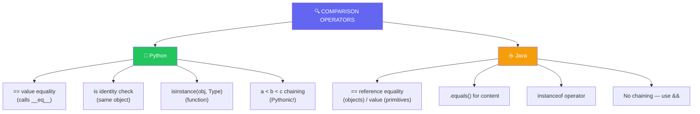

import { Tabs, TabItem, Aside, Badge, Card, CardGrid, Code } from '@astrojs/starlight/components';

## 4️⃣ Relational & Equality Operators in Python

```text
Python Comparison Operators
│
├── Relational (Ordering)
│   ├── >   greater than
│   ├── <   less than
│   ├── >=  greater than or equal
│   ├── <=  less than or equal
│   └── ✨ CHAINING: a < b < c  (Python superpower!)
│
├── Equality
│   ├── ==  equal value (calls __eq__)
│   ├── !=  not equal value (calls __ne__)
│   └── ✨ is / is not  identity comparison (same object)
│
├── Type Checking
│   └── isinstance(obj, Type)  ✨ (function, not operator)
│
└── Special Behaviors
    ├── No type promotion needed — dynamic typing!
    ├── String comparison works naturally with ==
    ├── None instead of null — use 'is None'
    ├── Float comparison: use math.isclose()
    └── Rich comparison protocol for custom classes
```

<Code lang="python" title="Basic usage — always return bool" code={`
a, b = 10, 20

print(a == b)   # False
print(a != b)   # True
print(a > b)    # False
print(a < b)    # True
print(a >= b)   # False
print(a <= b)   # True

# All return bool — Python is dynamically typed, but types still matter:
result = a > b          # bool: False ✅
# x = int(a > b)        # ✅ Explicit conversion works: x = 0
# if a > b: ...         # ✅ Boolean context — most common use
`} />

<Aside type="success">
🎯 **Python Advantage**: No type promotion confusion, no reference vs value trap for strings, and comparison chaining makes complex conditions readable!
</Aside>

---

## 🗺️ The Full Map: Python vs Java Comparison



---

## 🔑 Rule 1: No Type Promotion — Dynamic Typing Handles It

> Python uses **dynamic typing** — no compile-time type promotion rules for comparisons.

### 📊 Python vs Java: Comparison Behavior

| Comparison | Java Behavior | Python Behavior | Why Python Wins |
|------------|--------------|-----------------|----------------|
| `'a' == 97` | `true` (char promoted to int) | `False` (str != int) | ✅ Type-safe — prevents accidental Unicode math |
| `10 == 10.0` | `true` (int promoted to double) | `True` (numeric coercion) | ✅ Same result, no declaration needed |
| `"text" == "text"` | Reference check (pool trick!) | `True` (value equality) | ✅ `==` compares content for strings — intuitive! |
| `obj1 == obj2` | Reference equality | Calls `__eq__` (value equality) | ✅ Override `__eq__` for meaningful comparison |
| `null == null` | `true` | `None is None` → `True` | ✅ Same concept, clearer syntax with `is` |

<Code lang="python" title="Type-safe comparisons — no accidental promotions" code={`
# ✅ String vs int — TypeError prevents bugs:
# 'a' == 97  # ❌ False (different types, not promoted)
# But if you really need Unicode comparison:
ord('a') == 97  # ✅ True — explicit intent

# ✅ Numeric comparisons work naturally:
print(10 == 10.0)      # True ✅ (int vs float — Python coerces)
print(3.14 != 3.141)   # True ✅
print(10 > 5.5)        # True ✅

# ✅ Boolean comparisons — bool is subclass of int:
print(True == 1)       # True ✅ (but don't rely on this!)
print(False == 0)      # True ✅
print(True > False)    # True ✅ (1 > 0)

# ⚠️ Prefer explicit boolean checks:
if is_active: ...      # ✅ Pythonic
if is_active == True:  # ⚠️ Redundant — avoid
`} />

<Aside type="tip">
**MUST KNOW**: Python's type safety with `==` is a **feature**:
- `'a' == 97` → `False` (not `True` like Java) — prevents Unicode math bugs
- `"text" == "text"` → `True` (value equality) — intuitive for strings
- Custom classes control equality via `__eq__` — flexible and explicit
</Aside>

---

## 🔬 Equality Operators: `==` vs `is` — The Critical Distinction ⭐

### 🟢 `==` Value Equality (Calls `__eq__`)

```python
# == compares VALUES — calls __eq__() method
# Works intuitively for strings, numbers, and custom objects

# Strings — value equality (no pool confusion!):
s1 = "Hello"
s2 = "Hello"
s3 = "".join(["H", "e", "l", "l", "o"])

print(s1 == s2)  # True ✅ (same content)
print(s1 == s3)  # True ✅ (same content, different creation)

# Lists — value equality:
list1 = [1, 2, 3]
list2 = [1, 2, 3]
list3 = list1

print(list1 == list2)  # True ✅ (same values)
print(list1 == list3)  # True ✅ (same values + same object)
```

### 🟡 `is` Identity Equality (Same Object in Memory)

```python
# is compares IDENTITIES — same object in memory (like Java's == for objects)

# Strings — identity may vary (interning is implementation detail):
s1 = "Hello"
s2 = "Hello"
s3 = "".join(["H", "e", "l", "l", "o"])

print(s1 is s2)  # Often True (string interning) — but DON'T rely on this!
print(s1 is s3)  # Often False (different objects) — implementation dependent

# Lists — identity is clear:
list1 = [1, 2, 3]
list2 = [1, 2, 3]
list3 = list1

print(list1 is list2)  # False ✅ (different objects)
print(list1 is list3)  # True ✅ (same object — alias)
```

<Code lang="python" title="When to use == vs is" code={`
# ✅ Use == for VALUE comparison (95% of cases):
if username == "admin":      # ✅ Compare string content
if score == 100:             # ✅ Compare numeric value
if items == []:              # ✅ Compare list contents
if result == None:           # ⚠️ Works, but...

# ✅ Use is for IDENTITY comparison (special cases):
if result is None:           # ✅ PEP 8: use 'is' for None
if value is True:            # ⚠️ Rare — usually just 'if value:'
if obj1 is obj2:             # ✅ Check if same object (singleton, cache)

# ✅ Use is not for negation:
if result is not None:       # ✅ PEP 8 preferred
if value is not True:        # ⚠️ Rare — usually 'if not value:'

# 🎯 Rule of thumb:
# - == for "do these have the same value?" ✅
# - is for "are these the exact same object?" or "is this None?" ✅
`} />

<Aside type="danger">
⚠️ **Interview Trap**: Never use `is` to compare numbers or strings for value equality:
```python
# ❌ Wrong — identity depends on interning/caching:
if x is 5: ...      # May work for small ints, but unreliable!
if name is "admin": # May work due to interning, but don't rely on it!

# ✅ Correct — compare values:
if x == 5: ...
if name == "admin":
```
</Aside>

---

## 🔬 None Comparison — Python's Null

### 🎯 Use `is None` / `is not None` (PEP 8 Standard)

<Code lang="python" title="None comparison patterns" code={`
value = None

# ✅ PEP 8: Use 'is' for None checks
if value is None:
    print("No value provided")

if value is not None:
    print(f"Value: {value}")

# ⚠️ Works but not Pythonic:
if value == None:  # ❌ Avoid — == can be overridden, is cannot
    pass

# ✅ Safe method calls with None:
# ❌ Dangerous:
# result = value.method()  # 💥 AttributeError if value is None

# ✅ Defensive patterns:
if value is not None:
    result = value.method()

# ✅ Or use getattr with default:
result = getattr(value, 'method', lambda: "default")()

# ✅ Or use optional chaining pattern (Python 3.11+ with typing):
from typing import Optional
def process(val: Optional[str]) -> str:
    return val.upper() if val is not None else "DEFAULT"
`} />

<Aside type="success">
🚀 **Python Bonus**: `None` is a singleton — there's only one `None` object. This makes `is None` checks fast and reliable!
</Aside>

---

## 🔬 String Comparison — No Pool Confusion!

### 🎉 Python's Intuitive String Equality

```python
# Java: "text" == "text" → True (pool), but new String("text") == "text" → False 😱
# Python: "text" == "text" → True (value), always — no pool traps!

s1 = "Hello"
s2 = "Hello"
s3 = "".join(["H", "e", "l", "l", "o"])  # Different creation

print(s1 == s2)  # True ✅ (value equality)
print(s1 == s3)  # True ✅ (value equality — intuitive!)
print(s1 is s2)  # Often True (interning) — but don't rely on it
print(s1 is s3)  # Often False — implementation detail

# ✅ Ordering works naturally:
print("Alice" < "Bob")      # True ✅ (lexicographic)
print("apple" < "banana")   # True ✅
print("Zoo" < "apple")      # True ✅ (uppercase < lowercase in Unicode)

# ✅ Case-insensitive comparison:
print("Hello".lower() == "HELLO".lower())  # True ✅
```

<Code lang="python" title="String comparison patterns" code={`
# ✅ Simple equality:
if username == "admin":
    grant_access()

# ✅ Case-insensitive:
if username.lower() == "admin":
    grant_access()

# ✅ Lexicographic ordering:
names = ["Charlie", "Alice", "Bob"]
names.sort()  # ['Alice', 'Bob', 'Charlie'] ✅

# ✅ Prefix/suffix checks (better than substring + ==):
if filename.startswith("report_"): ...
if email.endswith("@company.com"): ...

# ✅ Membership (cleaner than manual iteration):
if "error" in log_message: ...  # ✅ Pythonic substring check
`} />

<Aside type="tip">
**MUST KNOW**: Python string `==` compares **values**, not references. No String pool confusion, no `.equals()` needed — just use `==`!
</Aside>

---

## 🔬 Custom Class Equality — Rich Comparison Protocol

### 🧠 Override `__eq__` for Value Equality

<Code lang="python" title="Implementing custom equality" code={`
from dataclasses import dataclass

# ✅ Modern way: @dataclass auto-generates __eq__
@dataclass
class User:
    id: int
    name: str
    # __eq__ auto-generated: compares id and name

u1 = User(1, "Alice")
u2 = User(1, "Alice")
u3 = User(2, "Alice")

print(u1 == u2)  # True ✅ (same id and name)
print(u1 == u3)  # False ✅ (different id)
print(u1 is u2)  # False ✅ (different objects)

# ✅ Manual way: override __eq__ and __hash__ if needed
class Person:
    def __init__(self, name, age):
        self.name = name
        self.age = age
    
    def __eq__(self, other):
        if not isinstance(other, Person):
            return NotImplemented  # Let other type handle it
        return self.name == other.name and self.age == other.age
    
    def __hash__(self):
        # If you override __eq__, consider __hash__ for dict/set use
        return hash((self.name, self.age))

p1 = Person("Alice", 30)
p2 = Person("Alice", 30)
print(p1 == p2)  # True ✅ (custom value equality)
`} />

<Aside type="note">
**Rich Comparison Methods**: Python supports full customization:
```python
class Custom:
    def __eq__(self, other): ...  # ==
    def __ne__(self, other): ...  # != (usually auto-derived)
    def __lt__(self, other): ...  # <
    def __le__(self, other): ...  # <=
    def __gt__(self, other): ...  # >
    def __ge__(self, other): ...  # >=
```
Override only what you need — Python can derive others!
</Aside>

---

## 🔬 Type Checking: `isinstance()` vs `type()`

### 🎯 Use `isinstance()` for Flexible Type Checks

<Code lang="python" title="Type checking patterns" code={`
# ✅ isinstance() — checks inheritance hierarchy (like Java instanceof)
class Animal: pass
class Dog(Animal): pass

pet = Dog()

print(isinstance(pet, Dog))     # True ✅
print(isinstance(pet, Animal))  # True ✅ (Dog IS-A Animal)
print(isinstance(pet, object))  # True ✅ (everything is object)

# ✅ Check multiple types:
value = 42
print(isinstance(value, (int, float, complex)))  # True ✅

# ⚠️ type() — exact type match (rarely what you want):
print(type(pet) is Dog)      # True ✅ (exact match)
print(type(pet) is Animal)   # False ❌ (not exact — Dog subclass)

# ✅ PEP 8: Prefer isinstance() for most checks
# Use type() only when you specifically need exact type (not subclass)
`} />

<Code lang="python" title="Structural typing with Protocol (Python 3.8+)" code={`
from typing import Protocol, runtime_checkable

@runtime_checkable
class Drawable(Protocol):
    def draw(self) -> str: ...

class Circle:
    def draw(self) -> str:
        return "🔵"

class Square:
    def draw(self) -> str:
        return "🟦"

def render(shape: Drawable) -> None:
    print(shape.draw())

# Works with any object that has .draw() — duck typing + type hints!
render(Circle())  # 🔵
render(Square())  # 🟦

# isinstance with Protocol:
print(isinstance(Circle(), Drawable))  # True ✅ (has .draw method)
`} />

<Aside type="tip">
**Pythonic Type Checking**:  
- Use `isinstance()` for 95% of type checks — respects inheritance ✅  
- Use `type() is` only when you need exact type match (rare) ✅  
- Use `Protocol` for structural/duck typing with type hints ✅  
- Often, just try the operation and catch exceptions (EAFP pattern)! ✅
</Aside>

---

## ✨ Python Superpower: Comparison Chaining

### 🔗 `a < b < c` Works Naturally!

```python
# Java: if (a < b && b < c) { ... }  // verbose
# Python: if a < b < c: ...  // clean and readable!

# ✅ Chained comparisons evaluate naturally:
x = 5
print(1 < x < 10)      # True ✅ (equivalent to: 1 < x and x < 10)
print(0 <= x <= 100)   # True ✅

# ✅ Works with mixed operators:
print(1 < x <= 5)      # True ✅
print(10 > x >= 3)     # True ✅

# ✅ Even with function calls (evaluated once!):
def get_value():
    print("Called!")
    return 5

# get_value() called only once in chained comparison:
if 1 < get_value() < 10:  # "Called!" printed once ✅
    pass
```

<Code lang="python" title="Chaining patterns in practice" code={`
# ✅ Range checks — clean and readable:
def classify_age(age: int) -> str:
    if 0 <= age < 13:
        return "child"
    elif 13 <= age < 18:
        return "teen"
    elif 18 <= age < 65:
        return "adult"
    else:
        return "senior"

# ✅ Clamping values:
def clamp(value: float, min_val: float, max_val: float) -> float:
    if min_val <= value <= max_val:
        return value
    return min_val if value < min_val else max_val

# ✅ Sorting validation:
def is_sorted(arr: list[int]) -> bool:
    return all(arr[i] <= arr[i+1] for i in range(len(arr)-1))
    # Or with chaining concept (for small lists):
    # return len(arr) < 2 or all(a <= b for a, b in zip(arr, arr[1:]))
`} />

<Aside type="success">
🚀 **Pro Tip**: Comparison chaining is evaluated efficiently — intermediate values computed once. It's not just syntactic sugar; it's a performance feature too!
</Aside>

---

## ⚠️ Common Traps & Pythonic Solutions

<CardGrid>
  <Card title="Trap 1: Using 'is' for value comparison" icon="error">
    ```python
    # ❌ Wrong — identity depends on interning/caching:
    x = 256
    y = 256
    print(x is y)  # True (small int caching) — but unreliable!
    
    x = 257
    y = 257
    print(x is y)  # May be False — implementation detail!
    
    # ✅ Correct — compare values:
    print(x == y)  # Always True for same value ✅
    
    # ✅ Use 'is' only for:
    if result is None: ...      # None check
    if flag is True: ...        # Rare — usually just 'if flag:'
    if obj1 is obj2: ...        # Identity check (singleton, cache)
    ```
  </Card>
  
  <Card title="Trap 2: Float equality with ==" icon="warning">
    ```python
    # ❌ Never compare floats for exact equality:
    print(0.1 + 0.2 == 0.3)  # False! (floating point rounding)
    
    # ✅ Use math.isclose() for float comparisons:
    import math
    print(math.isclose(0.1 + 0.2, 0.3))  # True ✅
    
    # ✅ Or specify tolerance:
    print(math.isclose(a, b, rel_tol=1e-9, abs_tol=1e-9))
    
    # ✅ For financial calculations, use Decimal:
    from decimal import Decimal
    print(Decimal('0.1') + Decimal('0.2') == Decimal('0.3'))  # True ✅
    ```
  </Card>

  <Card title="Trap 3: Comparing incompatible types" icon="error">
    ```python
    # Python 3: Most type mismatches raise TypeError
    # ❌ These fail fast (good!):
    # print(5 == "5")      # False ✅ (no error, but different types)
    # print(5 > "3")       # 💥 TypeError: '>' not supported between int and str
    
    # ✅ Handle explicitly:
    def safe_compare(a, b):
        try:
            return a == b
        except TypeError:
            return False  # or handle as needed
    
    # ✅ Or convert explicitly:
    if int(user_input) == expected_value:  # With try/except for ValueError
        pass
    ```
  </Card>

  <Card title="Trap 4: Mutable default with equality checks" icon="caution">
    ```python
    # ❌ Dangerous: list equality with mutable default
    def add_item(item, items=[]):  # Shared list!
        if items == []:  # This check may not work as expected
            items = []
        items.append(item)
        return items
    
    # ✅ Fix: None sentinel + explicit check
    def add_item(item, items=None):
        if items is None:  # ✅ Use 'is' for None
            items = []
        items.append(item)
        return items
    
    # ✅ Or use tuple for immutable default:
    def process(items: tuple = ()) -> list:
        return list(items) + [new_item]
    ```
  </Card>

  <Card title="Trap 5: Chained comparison with side effects" icon="warning">
    ```python
    # ⚠️ Be careful with function calls in chains:
    def get_x():
        print("get_x called")
        return 5
    
    # get_x() called ONCE in chain — efficient!
    if 1 < get_x() < 10:  # "get_x called" printed once ✅
        pass
    
    # But if you need the value:
    x = get_x()  # Call once, store result
    if 1 < x < 10:  # Cleaner and reusable
        pass
    ```
  </Card>
</CardGrid>

---

## 🎯 Interview Cheat Sheet (Python Edition)

<CardGrid>
  <Card title="Q: What's the difference between == and is?" icon="information">
    ```python
    # == : Value equality — calls __eq__() method
    # is  : Identity equality — same object in memory
    
    list1 = [1, 2, 3]
    list2 = [1, 2, 3]
    list3 = list1
    
    print(list1 == list2)  # True ✅ (same values)
    print(list1 is list2)  # False ✅ (different objects)
    print(list1 is list3)  # True ✅ (same object — alias)
    
    # Rule: Use == for values (95%), is for None or identity checks (5%)
    ```
  </Card>
  
  <Card title="Q: How do you check if a variable is None?" icon="approve-check">
    **Use `is None` or `is not None`** (PEP 8 standard):
    ```python
    value = get_optional_value()
    
    # ✅ Pythonic:
    if value is None:
        handle_missing()
    
    if value is not None:
        process(value)
    
    # ❌ Avoid:
    if value == None:  # Works but not idiomatic — == can be overridden
        pass
    ```
  </Card>

  <Card title="Q: How do you check an object's type?" icon="backspace">
    **Use `isinstance()` for flexible checks**:
    ```python
    # ✅ Check single type:
    if isinstance(x, int):
        pass
    
    # ✅ Check multiple types:
    if isinstance(x, (int, float, complex)):
        pass
    
    # ✅ Check inheritance:
    if isinstance(pet, Animal):  # Works for Dog, Cat, etc. subclasses
        pass
    
    # ⚠️ Use type() only for exact match (rare):
    if type(x) is int:  # Excludes bool (bool is subclass of int!)
        pass
    ```
  </Card>

  <Card title="Q: Can you chain comparisons in Python?" icon="rocket">
    **YES! Python superpower**:
    ```python
    # ✅ Clean range checks:
    if 0 <= age < 18:
        category = "minor"
    
    # ✅ Equivalent to: (0 <= age) and (age < 18)
    # But more readable AND efficient (age evaluated once)
    
    # ✅ Works with any comparison operators:
    if 1 < x <= y < 10:  # All conditions must be True
        pass
    ```
  </Card>

  <Card title="Q: How do you compare floats safely?" icon="shield">
    **Use `math.isclose()` with tolerance**:
    ```python
    import math
    
    # ❌ Never:
    if a == b:  # May fail due to floating point rounding
    
    # ✅ Always:
    if math.isclose(a, b, rel_tol=1e-9, abs_tol=1e-9):
        pass
    
    # For financial: use Decimal
    from decimal import Decimal
    if Decimal('0.1') + Decimal('0.2') == Decimal('0.3'):
        pass  # Exact decimal arithmetic
    ```
  </Card>

  <Card title="Q: What does 'a' == 97 return?" icon="information">
    **`False`** — Python doesn't promote types like Java:
    ```python
    # Java: 'a' == 97 → true (char promoted to int)
    # Python: 'a' == 97 → False (str != int)
    
    # ✅ If you need Unicode comparison:
    if ord('a') == 97:  # True ✅ — explicit intent
        pass
    
    # This prevents accidental Unicode math bugs! 🎯
    ```
  </Card>
</CardGrid>

<Aside type="danger">
**Most common runtime errors**:
```python
# TypeError: '>' not supported between instances of 'str' and 'int'
if "5" > 3:  # 💥 Python doesn't coerce types for ordering

# AttributeError: 'NoneType' object has no attribute 'method'
result = None
result.method()  # 💥 Always check 'is not None' first

# False negative from float comparison
if 0.1 + 0.2 == 0.3:  # False — use math.isclose()!
```
</Aside>

---

## 🧩 DSA Patterns: Comparisons in Algorithms

<CardGrid>
  <Card title="Pattern: Binary Search with Chaining" icon="rocket">
    ```python
    def binary_search(arr: list[int], target: int) -> int:
        low, high = 0, len(arr) - 1
        while low <= high:  # ✅ Chained comparison would also work
            mid = low + (high - low) // 2
            if arr[mid] == target:
                return mid
            elif arr[mid] < target:
                low = mid + 1
            else:
                high = mid - 1
        return -1
    
    # Pythonic alternative with chaining concept:
    def find_range(arr: list[int], min_val: int, max_val: int) -> list[int]:
        # Return elements in [min_val, max_val]
        return [x for x in arr if min_val <= x <= max_val]  # ✅ Chained!
    ```
  </Card>
  
  <Card title="Pattern: Custom Sorting with Key Functions" icon="shield">
    ```python
    # ✅ Sort by multiple criteria — clean with tuple comparison:
    students = [("Alice", 25), ("Bob", 20), ("Charlie", 25)]
    
    # Sort by age, then name (tuple comparison is lexicographic):
    students.sort(key=lambda x: (x[1], x[0]))
    # Result: [('Bob', 20), ('Alice', 25), ('Charlie', 25)]
    
    # ✅ Custom comparison with functools.cmp_to_key (if needed):
    from functools import cmp_to_key
    
    def compare(a, b):
        if a[1] != b[1]:  # Compare age first
            return a[1] - b[1]
        return (a[0] > b[0]) - (a[0] < b[0])  # Then name
    
    students.sort(key=cmp_to_key(compare))
    ```
  </Card>

  <Card title="Pattern: Safe Dictionary Lookups with None" icon="backspace">
    ```python
    # ✅ Pattern: get() with default for None-safe access
    user_data = {"name": "Alice"}
    
    # ❌ Risky:
    # email = user_data["email"].lower()  # 💥 KeyError or AttributeError
    
    # ✅ Safe with get():
    email = user_data.get("email")
    if email is not None:  # ✅ PEP 8 None check
        process_email(email.lower())
    
    # ✅ Or with default:
    email = user_data.get("email", "unknown@example.com")
    process_email(email.lower())  # Always safe
    
    # ✅ One-liner with conditional:
    result = (user_data.get("email") or "default").lower()
    ```
  </Card>

  <Card title="Pattern: Identity Check for Singleton/Caching" icon="information">
    ```python
    # ✅ Use 'is' for singleton pattern checks:
    class Singleton:
        _instance = None
        def __new__(cls):
            if cls._instance is None:  # ✅ Identity check
                cls._instance = super().__new__(cls)
            return cls._instance
    
    # ✅ Use 'is' for cache identity (avoid reprocessing same object):
    cache = {}
    def process(obj):
        obj_id = id(obj)  # Memory address as unique ID
        if obj_id in cache and cache[obj_id] is obj:  # ✅ Same object?
            return cached_result  # Skip reprocessing
        # ... process and cache ...
    ```
  </Card>
</CardGrid>

<Aside type="tip">
**Competitive Coding Pro Tip**: Python's comparison chaining makes range checks and sorting conditions much cleaner:
```python
# Instead of:
if x >= min_val and x <= max_val and x != exclude:
    process(x)

# Write:
if min_val <= x <= max_val and x != exclude:  # ✅ Cleaner!
    process(x)
```
</Aside>

---

## 🔬 Under the Hood: Python Comparison Internals

<Code lang="python" title="How == and is work internally" code={`
# == calls __eq__() — can be overridden:
class Custom:
    def __eq__(self, other):
        print(f"__eq__ called with {other}")
        return True  # Custom logic

c1, c2 = Custom(), Custom()
print(c1 == c2)  # "__eq__ called with <Custom object>" + True

# is compares object IDs — cannot be overridden:
print(c1 is c2)  # False (different objects)
print(id(c1), id(c2))  # Different memory addresses

# isinstance() walks the MRO (Method Resolution Order):
class A: pass
class B(A): pass
class C(B): pass

obj = C()
print(isinstance(obj, A))  # True — walks C → B → A
print(C.__mro__)  # (<class 'C'>, <class 'B'>, <class 'A'>, <class 'object'>)
`} />

```text
Comparison Internals:

== (value equality):
• Calls left operand's __eq__(right) method
• If NotImplemented, tries right.__eq__(left)
• If both NotImplemented, falls back to identity (is)
• Can be overridden per class — flexible!

is (identity equality):
• Compares object IDs (memory addresses)
• Cannot be overridden — always checks same object
• Fast: single pointer comparison at C level

isinstance():
• Walks the Method Resolution Order (MRO)
• Checks if type is in obj's inheritance chain
• O(depth) but very fast in practice (shallow hierarchies)

Chained comparisons (a < b < c):
• Compiled to efficient bytecode: evaluate b once
• Equivalent to: (a < b) and (b < c) but with single b evaluation
• Short-circuits on first False — efficient!
```

<Aside type="note">
**Performance Note**:  
- `is None` is extremely fast — direct pointer comparison ✅  
- `==` for built-in types (int, str, float) is optimized in C ✅  
- Custom `__eq__` can be slower — profile if in hot loops ⚠️  
- Chained comparisons are as efficient as explicit `and` — use for readability! ✅
</Aside>

---

## 🏢 Real-Life SDE Usage

<CardGrid>
  <Card title="Pattern: API Response Validation" icon="rocket">
    ```python
    from typing import Optional, Union
    import math
    
    def validate_user_input(
        username: Optional[str],
        age: Optional[int],
        score: Optional[float]
    ) -> dict[str, str]:
        """Validate user input with Pythonic comparisons"""
        errors = {}
        
        # ✅ None checks with 'is'
        if username is None or username.strip() == "":
            errors["username"] = "Required"
        elif not (3 <= len(username) <= 20):  # ✅ Chained comparison!
            errors["username"] = "Must be 3-20 characters"
        
        # ✅ Range check with chaining
        if age is not None and not (0 <= age <= 150):
            errors["age"] = "Must be between 0 and 150"
        
        # ✅ Float comparison with tolerance
        if score is not None and not math.isclose(score, 0.0, abs_tol=1e-2):
            if not (0.0 <= score <= 100.0):
                errors["score"] = "Must be between 0 and 100"
        
        return errors  # Empty dict = all valid
    ```
  </Card>
  
  <Card title="Pattern: Configuration Comparison" icon="shield">
    ```python
    from dataclasses import dataclass, asdict
    
    @dataclass
    class Config:
        host: str
        port: int
        debug: bool = False
        
        # __eq__ auto-generated by @dataclass — compares all fields
    
    # ✅ Compare configurations easily:
    prod = Config("prod.example.com", 443)
    staging = Config("staging.example.com", 443, debug=True)
    
    if prod == staging:  # ✅ Value equality — all fields match
        print("Configs identical")
    elif prod.host == staging.host:  # ✅ Partial comparison
        print("Same host, different settings")
    
    # ✅ Identity check for singleton config:
    _global_config: Optional[Config] = None
    
    def get_config() -> Config:
        global _global_config
        if _global_config is None:  # ✅ PEP 8 None check
            _global_config = load_from_file()
        return _global_config
    ```
  </Card>

  <Card title="Pattern: Feature Flag Evaluation" icon="information">
    ```python
    from typing import Literal
    
    def is_feature_enabled(
        feature: str,
        user_tier: Literal["free", "pro", "enterprise"],
        rollout_percentage: float
    ) -> bool:
        """Evaluate feature flags with clean comparisons"""
        
        # ✅ Tier-based access — tuple comparison for ordering
        tier_order = ("free", "pro", "enterprise")
        required_tier = "pro"
        
        if tier_order.index(user_tier) >= tier_order.index(required_tier):
            return True
        
        # ✅ Percentage rollout — float comparison with edge cases
        import random
        if rollout_percentage >= 100.0:
            return True
        if rollout_percentage <= 0.0:
            return False
        
        # Use consistent hash for deterministic rollout
        user_hash = hash(feature + user_tier) % 100
        return user_hash < rollout_percentage  # ✅ Clean comparison
    ```
  </Card>
</CardGrid>

<Code lang="python" title="Production: Comparison utilities" code={`
import math
from typing import TypeVar, Protocol, runtime_checkable

T = TypeVar('T')

def safe_equals(a: T, b: T, *, rel_tol: float = 1e-9, abs_tol: float = 0.0) -> bool:
    """
    Safe equality check that handles floats, None, and type mismatches
    """
    # Handle None explicitly
    if a is None and b is None:
        return True
    if a is None or b is None:
        return False
    
    # Handle floats with tolerance
    if isinstance(a, (int, float)) and isinstance(b, (int, float)):
        return math.isclose(a, b, rel_tol=rel_tol, abs_tol=abs_tol)
    
    # Default to == for other types
    try:
        return a == b
    except TypeError:
        return False  # Incomparable types

@runtime_checkable
class Comparable(Protocol):
    """Protocol for objects that support ordering"""
    def __lt__(self, other: 'Comparable') -> bool: ...
    def __eq__(self, other: object) -> bool: ...

def clamp(value: Comparable, min_val: Comparable, max_val: Comparable) -> Comparable:
    """Clamp value to [min_val, max_val] using chained comparison"""
    if min_val <= value <= max_val:  # ✅ Chained!
        return value
    return min_val if value < min_val else max_val

# Usage examples:
print(safe_equals(0.1 + 0.2, 0.3))  # True ✅ (float tolerance)
print(safe_equals(None, None))      # True ✅ (None handling)
print(safe_equals("test", "test"))  # True ✅ (string equality)

clamped = clamp(150, 0, 100)  # 100 ✅
`} />

<Aside type="caution">
**Production Checklist** for comparisons:
1. ✅ Use `==` for value equality (strings, numbers, custom objects with `__eq__`)
2. ✅ Use `is` / `is not` for `None` checks and identity comparisons
3. ✅ Use `isinstance()` for type checks — respects inheritance
4. ✅ Use `math.isclose()` for float comparisons — never `==`
5. ✅ Leverage comparison chaining for readable range checks
6. ✅ Override `__eq__` and `__hash__` together for custom classes used in sets/dicts
7. ✅ Document comparison behavior for custom types (what does equality mean?)
</Aside>

---

## 🔑 Quick Reference Summary

<table>
  <thead>
    <tr>
      <th>Operator</th>
      <th>Purpose</th>
      <th>Example</th>
      <th>Returns</th>
      <th>Pythonic Tip</th>
    </tr>
  </thead>
  <tbody>
    <tr><td><code>==</code></td><td>Value equality</td><td><code>"a" == "a"</code></td><td><code>bool</code></td><td>Default for comparisons — calls <code>__eq__</code></td></tr>
    <tr><td><code>!=</code></td><td>Value inequality</td><td><code>5 != 3</code></td><td><code>bool</code></td><td>Auto-derived from <code>__eq__</code> usually</td></tr>
    <tr><td><code>is</code></td><td>Identity equality</td><td><code>x is None</code></td><td><code>bool</code></td><td>✅ Use for <code>None</code> checks (PEP 8)</td></tr>
    <tr><td><code>is not</code></td><td>Identity inequality</td><td><code>x is not None</code></td><td><code>bool</code></td><td>✅ Preferred over <code>!= None</code></td></tr>
    <tr><td><code>&lt;, &gt;, &lt;=, &gt;=</code></td><td>Ordering</td><td><code>1 &lt; 2 &lt; 3</code></td><td><code>bool</code></td><td>✨ Chain them: <code>a &lt; b &lt; c</code></td></tr>
    <tr><td><code>isinstance()</code></td><td>Type check</td><td><code>isinstance(x, int)</code></td><td><code>bool</code></td><td>✅ Prefer over <code>type(x) is int</code></td></tr>
    <tr><td><code>math.isclose()</code></td><td>Float comparison</td><td><code>isclose(0.1+0.2, 0.3)</code></td><td><code>bool</code></td><td>✅ Always use for floats — never <code>==</code></td></tr>
  </tbody>
</table>

<Aside type="tip">
**Pro Checklist for Python Comparisons**:
1. ✅ `==` for values, `is` for identity/None — know the difference!
2. ✅ Use `is None` / `is not None` — PEP 8 standard
3. ✅ Chain comparisons: `min_val <= x <= max_val` — readable and efficient
4. ✅ Use `isinstance()` for type checks — respects inheritance
5. ✅ Use `math.isclose()` for floats — tolerance is essential
6. ✅ Override `__eq__` + `__hash__` together for custom classes
7. ✅ When in doubt: try the operation and handle `TypeError` (EAFP pattern)
</Aside>

---

## 🧪 Test Your Understanding

<Code lang="python" title="Predict the output — Python comparison quiz" code={`
import math

# Q1: Basic equality
print(10 == 10.0)        # ? (int vs float)
print('a' == 97)         # ? (str vs int — no promotion!)

# Q2: Identity vs equality
list1 = [1, 2, 3]
list2 = [1, 2, 3]
list3 = list1
print(list1 == list2)    # ? (value)
print(list1 is list2)    # ? (identity)
print(list1 is list3)    # ? (alias)

# Q3: None checks
value = None
print(value is None)     # ?
print(value == None)     # ? (works but not Pythonic)

# Q4: Chained comparisons
x = 5
print(1 < x < 10)        # ?
print(1 < x <= 5)        # ?

# Q5: Float comparison
print(0.1 + 0.2 == 0.3)          # ? (floating point trap!)
print(math.isclose(0.1 + 0.2, 0.3))  # ? (correct way)

# Q6: isinstance checks
class Animal: pass
class Dog(Animal): pass
pet = Dog()
print(isinstance(pet, Dog))      # ?
print(isinstance(pet, Animal))   # ?
print(type(pet) is Animal)       # ? (exact type only)

# Q7: String comparison
s1 = "Hello"
s2 = "".join(["H", "e", "l", "l", "o"])
print(s1 == s2)  # ? (value equality — intuitive!)
print(s1 is s2)  # ? (identity — implementation dependent)

# Expected Output:
# True
# False
# True
# False
# True
# True
# False (works but avoid)
# True
# True
# False (floating point rounding)
# True (with tolerance)
# True
# True
# False (Dog != Animal exactly)
# True
# False or True (interning detail — don't rely on it!)
`} />

<details>
<summary>✅ Click to reveal explanations</summary>

```text
Q1: 10==10.0→True (numeric coercion); 'a'==97→False (str!=int, no promotion)
Q2: list1==list2→True (same values); is→False (different objects); list3 alias→True
Q3: is None→True (PEP 8); ==None→True but avoid — is is preferred
Q4: Chained comparisons work naturally — both True
Q5: Float == fails due to rounding; isclose() handles tolerance correctly
Q6: isinstance respects inheritance (Dog IS-A Animal); type() is exact only
Q7: == compares values for strings (intuitive!); is depends on interning — don't rely
```
</details>

<Aside type="caution">
**Final Warning**: Comparison bugs are subtle — they often produce "almost right" behavior. Always:
- Use `is` for `None` checks — `== None` works but isn't Pythonic
- Use `math.isclose()` for floats — never `==` with floating point
- Remember: `==` compares values, `is` compares identity — choose intentionally
- Test edge cases: `None`, empty strings, boundary values, float precision
- Document custom `__eq__` behavior — what does equality mean for your class?
</Aside>

---

## 🗒️ Quick Revision Cheat Sheet

```python
# 📦 COMPARISON OPERATORS AT A GLANCE

# 🔗 EQUALITY
a == b          # Value equality — calls __eq__() ✅ Default choice
a != b          # Value inequality — auto-derived usually
a is b          # Identity equality — same object in memory
a is not b      # Identity inequality — preferred negation

# 🔢 RELATIONAL (Ordering)
a < b           # Less than
a > b           # Greater than
a <= b          # Less than or equal
a >= b          # Greater than or equal
a < b < c       # ✨ CHAINING! Equivalent to (a<b) and (b<c), but b evaluated once

# 🔍 TYPE CHECKING
isinstance(x, Type)      # ✅ Flexible — checks inheritance hierarchy
type(x) is Type          # ⚠️ Exact type only — rarely what you want

# 🎯 NONE HANDLING (PEP 8)
if x is None: ...        # ✅ Preferred
if x is not None: ...    # ✅ Preferred
# Avoid: if x == None: ...  # Works but not idiomatic

# 🔬 FLOAT COMPARISON
import math
math.isclose(a, b)                    # ✅ With default tolerance
math.isclose(a, b, rel_tol=1e-9)      # ✅ Relative tolerance
math.isclose(a, b, abs_tol=1e-9)      # ✅ Absolute tolerance
# ❌ Never: if a == b: ...  # for floats!

# 🧩 CUSTOM CLASS EQUALITY
@dataclass  # ✅ Auto-generates __eq__, __hash__, etc.
class User:
    id: int
    name: str

# Manual override:
class Person:
    def __eq__(self, other):
        if not isinstance(other, Person): return NotImplemented
        return self.name == other.name and self.age == other.age
    def __hash__(self):  # ✅ Override with __eq__ if using in dict/set
        return hash((self.name, self.age))

# ⚠️ COMMON TRAPS
# ❌ Using 'is' for value comparison:
if x is 5: ...      # May work for small ints (caching), but unreliable!
if name is "admin": # May work (interning), but don't rely on it!
# ✅ Use == for values:
if x == 5: ...
if name == "admin":

# ❌ Float equality:
if 0.1 + 0.2 == 0.3:  # False! Floating point rounding
# ✅ Use tolerance:
if math.isclose(0.1 + 0.2, 0.3): ...

# ❌ Comparing incompatible types for ordering:
# if "5" > 3: ...  # 💥 TypeError — Python doesn't coerce
# ✅ Convert explicitly or handle TypeError

# 🎯 DSA PATTERNS
# Range checks with chaining:
if min_val <= x <= max_val: ...  # Clean and readable

# Sorting with tuple keys (lexicographic comparison):
items.sort(key=lambda x: (x.priority, x.name))  # Sort by priority, then name

# Safe dict access with None:
value = data.get("key")
if value is not None:
    process(value)

# Identity check for caching:
if cached_obj is incoming_obj:  # Same object? Skip reprocessing
    return cached_result

# 🔒 PRODUCTION TIPS
# Use 'is' for None checks — PEP 8 standard
# Use == for string/content comparison — intuitive in Python
# Use isinstance() for type checks — respects inheritance
# Use math.isclose() for floats — always with tolerance
# Override __eq__ + __hash__ together for custom classes in collections
# Document what equality means for your domain objects
```

> 🚀 **Final Wisdom**: Python's comparison operators are designed for clarity and correctness. The `==` vs `is` distinction eliminates reference/value confusion, comparison chaining makes complex conditions readable, and `isinstance()` provides flexible type checking. Embrace the Pythonic way: *"Explicit is better than implicit"* and *"Readability counts"*. When comparing, choose the right tool for the job — your code will be clearer, safer, and more maintainable! 🐍⚖️

<Badge text="Astro 6 Ready" variant="success" /> • <Badge text="Python 3.10+" variant="tip" /> • <Badge text="Interview Optimized" variant="caution" />
```

---

# 🔍 Python Relational Operators

---

## 🧠 Mental Model First

```
Relational operators compare two objects and return bool.
But in Python — comparison is NOT just value comparison.
It's a PROTOCOL. Every class can define its own comparison behavior.

a == b
  │
  ▼
type(a).__eq__(a, b)
  │
  ├── returns True/False → done
  ├── returns NotImplemented → try reflected:
  │     type(b).__eq__(b, a)
  └── both NotImplemented → fallback to identity (is)
```

---

## 🗂️ Full Operator Table

```text
┌──────────┬──────────────────────┬────────────┬──────────────────┐
│ Operator │ Name                 │ Dunder     │ Example          │
├──────────┼──────────────────────┼────────────┼──────────────────┤
│    ==    │ Equal                │ __eq__     │ 5 == 5  → True   │
│    !=    │ Not Equal            │ __ne__     │ 5 != 3  → True   │
│    >     │ Greater Than         │ __gt__     │ 5 > 3   → True   │
│    <     │ Less Than            │ __lt__     │ 3 < 5   → True   │
│    >=    │ Greater or Equal     │ __ge__     │ 5 >= 5  → True   │
│    <=    │ Less or Equal        │ __le__     │ 3 <= 5  → True   │
└──────────┴──────────────────────┴────────────┴──────────────────┘
All return bool (True or False) unless __eq__ is overridden.
```

---

## 🔬 Internals — Dispatch Protocol

```
a == b  exact CPython dispatch:

1. If type(b) is a subclass of type(a):
      try type(b).__eq__(b, a) FIRST   ← subclass gets priority
      if NotImplemented → continue

2. Try type(a).__eq__(a, b)
   if NotImplemented → continue

3. Try type(b).__eq__(b, a)
   if NotImplemented → continue

4. Fallback: identity check (a is b)
```

```python
# Why subclass gets priority:
class MyInt(int):
    def __eq__(self, other):
        print("MyInt.__eq__ called")
        return super().__eq__(other)

x = MyInt(5)
5 == x      # MyInt.__eq__ called FIRST even though int is on left
```

---

## 1️⃣ `==` — Equality (Value)

```python
5 == 5          # True
5 == 5.0        # True   ← int and float compared by value
"hi" == "hi"    # True
[1,2] == [1,2]  # True   ← compares element by element
None == None    # True   ← but use 'is' for None
```

```python
# What == does for built-in types:
# int:   compares numeric value (cross-type: int vs float works)
# str:   compares character by character
# list:  compares length first, then element-by-element (recursive)
# dict:  compares key-value pairs (order doesn't matter)
# set:   compares membership
# tuple: compares element-by-element
```

### List/Dict Comparison Internals

```
[1, 2, 3] == [1, 2, 3]

CPython list_richcompare():
  1. Check lengths — if different → False immediately
  2. Walk both lists simultaneously:
     for i in range(len):
         if a[i] != b[i]: return False
  3. All equal → True

O(n) worst case. Short-circuits on first mismatch.
```

---

## 2️⃣ `!=` — Not Equal

```python
5 != 3          # True
[1,2] != [1,3]  # True
```

> By default `__ne__` is the logical negation of `__eq__`. In Python 3 you almost never need to override `__ne__` separately — it delegates automatically.

```python
class Foo:
    def __eq__(self, other):
        return True

f = Foo()
f != f       # False  ← auto-negated from __eq__
```

---

## 3️⃣ `<`, `>`, `<=`, `>=` — Ordering

```python
3 < 5           # True
5 > 3           # True
5 >= 5          # True
3 <= 5          # True

# Strings — lexicographic (Unicode code point order):
"apple" < "banana"      # True  ('a' < 'b')
"b" > "a"               # True
"abc" < "abd"           # True  (differs at index 2: 'c' < 'd')
"Z" < "a"               # True  (ord('Z')=90, ord('a')=97)

# Lists — lexicographic element-by-element:
[1, 2, 3] < [1, 2, 4]   # True  (differs at index 2)
[1, 2]    < [1, 2, 3]   # True  (prefix is less)
```

---

## 4️⃣ Chained Comparisons — Python Only

```python
1 < x < 10          # True if x is between 1 and 10 (exclusive)
0 <= age <= 150
a == b == c         # all three equal

# Equivalent to:
# (1 < x) and (x < 10)
# BUT x is evaluated ONLY ONCE
```

```python
# Internals — bytecode:
import dis

def check(x):
    return 1 < x < 10

dis.dis(check)
# LOAD_CONST    1
# LOAD_FAST     x
# COPY          1           ← x pushed once, duplicated
# COMPARE_OP    
# JUMP_IF_FALSE_OR_POP      ← short-circuit if 1<x is False
# LOAD_CONST    10
# COMPARE_OP    <           ← uses the duplicated x
# RETURN_VALUE
```

```python
# Short-circuit proof:
def expensive():
    print("called!")
    return 5

1 < expensive() < 10    # "called!" printed once
                        # expensive() evaluated once — not twice
```

### Chaining Gotcha

```python
# This looks like math — but isn't what you think:
1 < 2 > 0       # True  ← (1<2) and (2>0) — valid chaining
0 < 1 < 2 < 3   # True

# Dangerous false positive:
x = 5
1 < x > 3      # True  — you may think "between 1 and 3" but actually
               # checks (1 < x) AND (x > 3)
               # same as 3 < x, not 1 < x < 3
```

---

## 🔬 Reflected Operators

```
a > b  →  type(a).__gt__(a, b)
           if NotImplemented →
           type(b).__lt__(b, a)   ← reflected: swap op and operands

a < b  →  type(a).__lt__(a, b)
           if NotImplemented →
           type(b).__gt__(b, a)

a >= b →  __ge__ → reflected __le__
a <= b →  __le__ → reflected __ge__
```

```python
class Weight:
    def __init__(self, kg):
        self.kg = kg

    def __lt__(self, other):
        return self.kg < other.kg

w1 = Weight(50)
w2 = Weight(70)

w1 < w2    # True   → Weight.__lt__(w1, w2)
w2 > w1    # True   → Weight.__gt__ not defined → tries w1.__lt__(w1, w2)
           #           reflected dispatch saves you
```

---

## 🔬 `@functools.total_ordering` — Minimal Implementation

```python
from functools import total_ordering

@total_ordering
class Student:
    def __init__(self, gpa):
        self.gpa = gpa

    def __eq__(self, other):
        return self.gpa == other.gpa

    def __lt__(self, other):             # only need eq + one ordering op
        return self.gpa < other.gpa
    # total_ordering auto-generates: >, <=, >=
```

```python
# Without total_ordering — you'd need all 6:
__eq__, __ne__, __lt__, __le__, __gt__, __ge__

# With total_ordering — only need 2:
__eq__ + any one of __lt__, __le__, __gt__, __ge__
```

> Used in every custom DSA class: `TreeNode`, `HeapNode`, priority queues, `bisect` integration.

---

## 🔬 Comparison With `None`

```python
x = None

x == None   # True  ← works but WRONG idiom, calls __eq__
x is None   # True  ← CORRECT — identity check, unoverridable

# Why 'is' is correct:
class Evil:
    def __eq__(self, other):
        return True    # lies — says equal to everything

e = Evil()
e == None   # True   ← __eq__ lied
e is None   # False  ← identity never lies
```

---

## 🔬 `is` vs `==` — Not the Same

```
==  → value equality  → calls __eq__
is  → identity check  → compares id()s, no dunder, unoverridable

┌──────────────────────────────────────────────┐
│  When to use ==  │  When to use is           │
├──────────────────┼───────────────────────────┤
│  value compare   │  None check               │
│  str content     │  True/False check (rare)  │
│  list equality   │  singleton check          │
│  dict equality   │  same object check        │
└──────────────────┴───────────────────────────┘
```

```python
a = [1, 2, 3]
b = [1, 2, 3]
a == b      # True  (same value)
a is b      # False (different objects)

a = b       # now b is alias
a is b      # True
```

---

## 🔬 Comparison Across Types

```python
# int and float:
1 == 1.0        # True   ← numeric equality cross-type
1 < 1.5         # True

# int and str:
1 == "1"        # False  ← no cross-type equality
1 < "1"         # TypeError in Python 3
                # Python 2 allowed this (sorted by type name) — a bug

# None comparisons:
None < 1        # TypeError in Python 3
                # Python 2: None < anything = True — a bug
```

---

## 🔬 NaN — Breaks All Comparison Laws

```python
nan = float('nan')

nan == nan      # False  ← NaN is not equal to itself (IEEE 754)
nan != nan      # True
nan < 1         # False
nan > 1         # False
nan <= 1        # False
nan >= 1        # False

# Every comparison with NaN returns False EXCEPT !=
# This breaks sort, binary search, heap operations silently

import math
math.isnan(nan)  # True  ← only safe way to check
```

```python
# Silent sort corruption:
data = [3, float('nan'), 1, 2]
data.sort()     # no error — but result is unpredictable
print(data)     # [1, 2, 3, nan] or [nan, 1, 2, 3] — undefined order
```

---

## 🔬 DSA Connection

```
Comparison operators power every ordering algorithm:

Sorting (Timsort):        uses < via __lt__
Binary search (bisect):   uses < via __lt__
Heapq:                    uses < via __lt__
Priority queue:           uses < or custom __lt__
Tree BST insert:          uses < and >
@total_ordering:          enables custom objects in sorted(), heapq
```

```python
# Custom object in heap — needs __lt__:
import heapq
from dataclasses import dataclass, field

@dataclass(order=True)
class Task:
    priority: int
    name: str = field(compare=False)

heap = []
heapq.heappush(heap, Task(3, "low"))
heapq.heappush(heap, Task(1, "high"))
heapq.heappop(heap)    # Task(priority=1, name='high')
# works because @dataclass(order=True) generates __lt__, __le__, etc.
```

---

## 💀 Interview Trap 1 — `==` on `bool` and `int`

```python
True == 1       # True
False == 0      # True
True == 1.0     # True
True == 2       # False  ← 1 != 2

# Dict key collision:
d = {True: "yes", 1: "one", 1.0: "float"}
print(d)        # {True: 'float'}  ← all three are same key!
                # True, 1, 1.0 all have same hash AND == True
len(d)          # 1
```

---

## 💀 Interview Trap 2 — Mutable Object Comparison

```python
a = [1, 2, 3]
b = a               # alias — same object

a == b              # True  (same value AND same object)
a is b              # True

b.append(4)
a == b              # True  ← still equal (same object mutated)

# Separate but equal:
a = [1, 2, 3]
b = [1, 2, 3]
a == b              # True
a is b              # False

b.append(4)
a == b              # False ← now differ
```

---

## 💀 Interview Trap 3 — Chained Comparison With Side Effects

```python
def val():
    print("evaluated")
    return 5

# How many times is val() called?
1 < val() < 10
# "evaluated" printed ONCE — Python evaluates middle operand once

# But:
result = (1 < val()) and (val() < 10)
# "evaluated" printed TWICE — two separate expressions
```

---

## 💀 Interview Trap 4 — Custom `__eq__` Breaks `__hash__`

```python
class Point:
    def __init__(self, x, y):
        self.x = x
        self.y = y

    def __eq__(self, other):
        return self.x == other.x and self.y == other.y
    # ← defined __eq__ but NOT __hash__

p = Point(1, 2)
hash(p)         # TypeError: unhashable type: 'Point'
                # Python sets __hash__ = None when you define __eq__
                # without defining __hash__

{p}             # TypeError
d = {p: "val"}  # TypeError
```

```python
# Fix:
class Point:
    def __eq__(self, other):
        return self.x == other.x and self.y == other.y

    def __hash__(self):
        return hash((self.x, self.y))   # immutable tuple hash
```

> Python rule: if `a == b` then `hash(a) == hash(b)` **must** hold. When you define `__eq__`, Python sets `__hash__ = None` to enforce this contract. You must define both.

---
